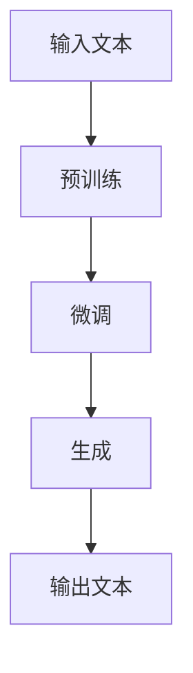
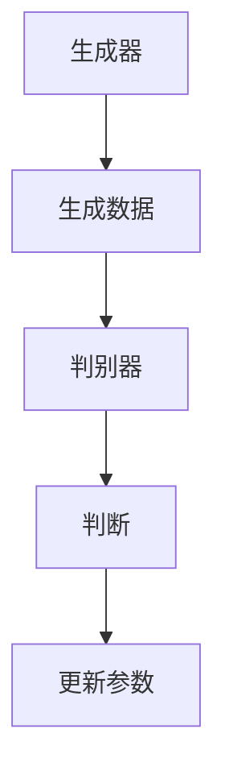
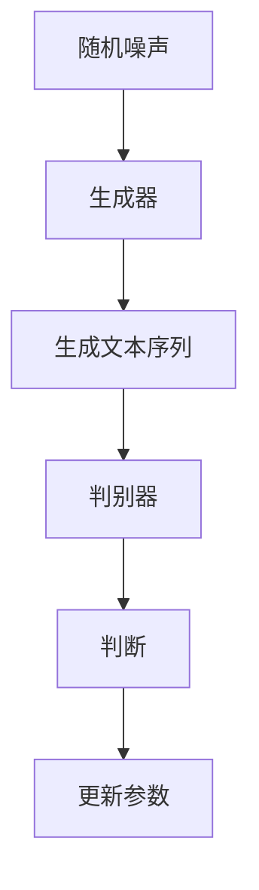
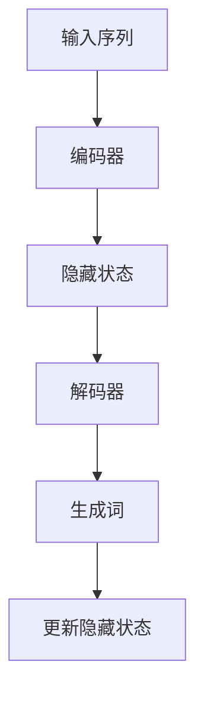
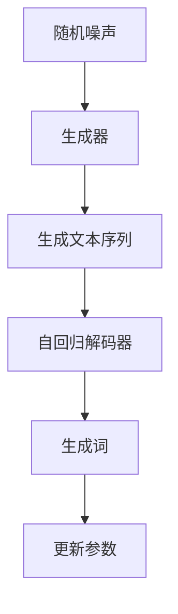

                 

# 《AI大模型在自然语言生成中的突破》

> **关键词：** 自然语言生成，AI大模型，生成式模型，对抗生成网络(GAN)，自回归模型，生成对抗自回归模型(GAAR)，应用与实践。

> **摘要：** 本文深入探讨了AI大模型在自然语言生成中的应用，包括其背景、核心算法原理、应用实践和未来展望。通过一步一步的分析推理，揭示了AI大模型如何实现自然语言生成的突破。

## 《AI大模型在自然语言生成中的突破》目录大纲

### 第一部分: 自然语言生成的背景与概述

### 第二部分: AI大模型基础

### 第三部分: 自然语言生成中的核心算法

### 第四部分: 自然语言生成的应用与实践

### 附录: 自然语言生成工具与资源

---

### 第一部分: 自然语言生成的背景与概述

#### 第1章: 自然语言生成概述

##### 1.1 自然语言生成技术的历史发展

自然语言生成（Natural Language Generation, NLG）是指利用计算机程序生成自然语言文本的技术。NLG技术的发展可以追溯到20世纪60年代，最早的NLG系统主要是基于规则的方法，如语法分析和模板匹配。然而，这些方法在处理复杂性和多样性方面存在局限。

随着计算机科学和人工智能技术的不断发展，NLG技术也经历了重要的演变。20世纪80年代，统计方法开始应用于NLG，其中基于概率模型的文本生成方法逐渐成为主流。这一时期，N-gram模型和决策树等算法被广泛使用。

##### 1.2 自然语言生成的应用场景

自然语言生成技术在多个领域得到了广泛应用：

- **内容创作：** 如新闻写作、文章摘要、故事生成等。
- **客服系统：** 如虚拟助手、自动问答系统等。
- **教育和培训：** 如自适应学习系统、教育内容生成等。
- **娱乐：** 如游戏剧情生成、音乐创作等。
- **信息和数据展示：** 如报告生成、数据分析等。

##### 1.3 AI大模型在自然语言生成中的重要性

近年来，AI大模型的出现为自然语言生成带来了新的突破。这些模型具有数亿甚至数十亿的参数，能够从大量数据中学习并生成高质量的自然语言文本。相比传统的NLG方法，AI大模型具有以下几个优势：

- **强大的表达能力：** AI大模型能够生成更加丰富和多样化的文本。
- **端到端学习：** AI大模型可以直接从输入数据学习到生成目标文本的映射关系，无需复杂的预处理和后处理步骤。
- **自适应能力：** AI大模型能够根据不同的应用场景和用户需求进行自适应调整。

总之，AI大模型在自然语言生成中的重要性不可忽视，它们正在引领自然语言生成技术走向新的高度。

---

### 第二部分: AI大模型基础

#### 第2章: AI大模型基础

##### 2.1 AI大模型的核心概念

AI大模型是指具有巨大参数量的深度学习模型，这些模型能够在大规模数据集上进行训练，从而获得强大的表征和学习能力。AI大模型的核心概念包括：

- **参数量：** AI大模型通常拥有数亿甚至数十亿个参数，这使得它们能够捕获数据中的复杂模式和关联性。
- **预训练：** AI大模型通过在大规模语料库上进行预训练，从而学习到通用的语言表征和知识。
- **微调：** 在预训练的基础上，AI大模型可以通过少量标注数据进行微调，以适应特定任务的需求。

##### 2.2 主流AI大模型介绍

当前，主流的AI大模型主要包括以下几种：

- **GPT（Generative Pre-trained Transformer）系列：** 如GPT-2、GPT-3，由OpenAI开发。GPT系列模型基于Transformer架构，具有强大的文本生成能力。
- **BERT（Bidirectional Encoder Representations from Transformers）：** 由Google开发，BERT模型通过双向Transformer结构对文本进行编码，广泛应用于文本分类、问答等任务。
- **T5（Text-to-Text Transfer Transformer）：** 由Google开发，T5模型将所有自然语言处理任务统一为文本到文本的转换任务，具有广泛的适用性。

##### 2.3 AI大模型的工作原理

AI大模型的工作原理主要包括以下几个步骤：

1. **预训练：** 在大规模语料库上进行预训练，模型学习到通用的语言表征和知识。
2. **微调：** 在预训练的基础上，使用少量标注数据进行微调，以适应特定任务的需求。
3. **生成：** 通过输入文本，模型生成对应的输出文本。生成过程通常涉及自回归解码，即模型根据前文生成下一个词。

AI大模型的工作原理如图所示：



通过以上步骤，AI大模型能够生成高质量的自然语言文本。

---

### 第三部分: 自然语言生成中的核心算法

#### 第3章: 生成式模型与解码器

##### 3.1 生成式模型的基本原理

生成式模型（Generative Model）是一种用于生成数据的概率模型，其核心思想是通过学习数据生成过程来生成新的样本。在自然语言生成中，生成式模型主要用于生成新的文本序列。

生成式模型的基本原理包括：

1. **概率分布：** 生成式模型学习输入文本的概率分布，从而能够生成与输入文本相似的新文本。
2. **采样：** 通过从概率分布中采样，生成新的文本序列。

常见的生成式模型包括：

- **马尔可夫模型（Markov Model）：** 假设当前状态仅依赖于前一个状态。
- **变分自编码器（Variational Autoencoder, VAE）：** 通过编码器和解码器学习数据的概率分布。
- **生成对抗网络（Generative Adversarial Network, GAN）：** 通过生成器和判别器的对抗训练来生成数据。

##### 3.2 解码器的工作流程

在生成式模型中，解码器（Decoder）是生成文本的关键组件。解码器的工作流程如下：

1. **输入：** 接收编码器（Encoder）生成的隐藏状态。
2. **预测：** 根据隐藏状态预测下一个单词的概率分布。
3. **采样：** 从概率分布中采样生成下一个单词。
4. **更新：** 更新隐藏状态，重复步骤2和3，直到生成完整的文本序列。

常见的解码器包括：

- **循环神经网络（Recurrent Neural Network, RNN）：** 通过隐藏状态保存上下文信息。
- **长短时记忆网络（Long Short-Term Memory, LSTM）：** 通过记忆单元解决长序列依赖问题。
- **门控循环单元（Gated Recurrent Unit, GRU）：** 结合了LSTM和RNN的优点。

##### 3.3 生成式模型的常见架构

生成式模型的常见架构包括：

- **自回归生成模型（Autoregressive Model）：** 模型根据前文生成下一个词，如LSTM、GRU等。
- **变分自编码器（Variational Autoencoder, VAE）：** 通过编码器和解码器生成文本序列。
- **生成对抗网络（Generative Adversarial Network, GAN）：** 通过生成器和判别器的对抗训练生成文本序列。

这些架构各有优缺点，适用于不同的自然语言生成任务。

---

#### 第4章: 对抗生成网络(GAN)

##### 4.1 GAN的基本概念

生成对抗网络（Generative Adversarial Network, GAN）是由Ian Goodfellow等人于2014年提出的一种生成模型。GAN由两个神经网络——生成器（Generator）和判别器（Discriminator）组成，它们在对抗训练过程中相互博弈，从而生成高质量的数据。

GAN的基本概念包括：

- **生成器（Generator）：** 生成器尝试生成尽可能真实的数据，以便判别器无法区分生成数据与真实数据。
- **判别器（Discriminator）：** 判别器尝试区分生成数据与真实数据，从而提高生成器的生成质量。

GAN的训练过程如下：

1. **初始化生成器和判别器：** 随机初始化生成器和判别器的参数。
2. **生成器生成数据：** 生成器根据随机噪声生成数据。
3. **判别器判断：** 判别器对生成器和真实数据进行判断。
4. **更新生成器和判别器：** 根据判别器的反馈，更新生成器和判别器的参数。

##### 4.2 GAN的组成部分

GAN由以下两部分组成：

- **生成器（Generator）：** 生成器的目标是生成与真实数据相似的数据。生成器通常采用神经网络结构，如全连接层、卷积层等。
- **判别器（Discriminator）：** 判别器的目标是准确判断生成数据与真实数据。判别器也通常采用神经网络结构。

GAN的组成部分如图所示：



##### 4.3 GAN在自然语言生成中的应用

GAN在自然语言生成中具有广泛的应用，如文本生成、摘要生成、对话生成等。以下是一个简单的GAN在文本生成中的应用示例：

1. **输入：** 随机噪声。
2. **生成器：** 根据随机噪声生成文本序列。
3. **判别器：** 判断生成文本序列是否真实。
4. **迭代：** 通过对抗训练不断更新生成器和判别器的参数，直到生成器能够生成高质量的文本。

GAN在自然语言生成中的应用如图所示：



通过以上步骤，GAN能够生成高质量的自然语言文本。

---

#### 第5章: 自回归模型

##### 5.1 自回归模型的基本原理

自回归模型（Autoregressive Model）是一种用于序列建模和预测的模型，其核心思想是基于前文生成下一个词。自回归模型在自然语言生成中具有广泛的应用，如文本生成、语音合成等。

自回归模型的基本原理包括：

1. **条件概率：** 自回归模型通过学习输入序列的条件概率来生成下一个词。即给定前文 $x_1, x_2, ..., x_{i-1}$，模型预测词 $x_i$ 的概率。
2. **自回归方程：** 自回归模型通常采用自回归方程来表示条件概率。自回归方程可以表示为：

   $$ P(x_i | x_1, x_2, ..., x_{i-1}) = f(x_1, x_2, ..., x_{i-1}, \theta) $$

   其中，$f$ 是自回归函数，$\theta$ 是模型参数。

常见的自回归模型包括：

- **马尔可夫模型（Markov Model）：** 假设当前状态仅依赖于前一个状态。
- **循环神经网络（Recurrent Neural Network, RNN）：** 通过隐藏状态保存上下文信息。
- **长短时记忆网络（Long Short-Term Memory, LSTM）：** 通过记忆单元解决长序列依赖问题。
- **门控循环单元（Gated Recurrent Unit, GRU）：** 结合了LSTM和RNN的优点。

##### 5.2 语言模型与解码器

在自然语言生成中，语言模型（Language Model）和解码器（Decoder）是核心组件。

语言模型：语言模型是一种用于预测单词序列的概率模型。常见的语言模型包括N-gram模型、神经网络语言模型等。语言模型能够提供输入序列的条件概率，从而辅助解码器生成下一个词。

解码器：解码器是根据语言模型和前文生成下一个词的组件。解码器可以采用不同的结构，如RNN、LSTM、GRU等。解码器的工作流程如下：

1. **输入：** 接收编码器生成的隐藏状态。
2. **预测：** 根据隐藏状态预测下一个单词的概率分布。
3. **采样：** 从概率分布中采样生成下一个单词。
4. **更新：** 更新隐藏状态，重复步骤2和3，直到生成完整的文本序列。

##### 5.3 自回归模型在自然语言生成中的应用

自回归模型在自然语言生成中具有广泛的应用，如文本生成、摘要生成、对话生成等。以下是一个简单的自回归模型在文本生成中的应用示例：

1. **输入：** 随机初始化输入序列。
2. **编码器：** 对输入序列进行编码，生成隐藏状态。
3. **解码器：** 根据隐藏状态和前文生成下一个词。
4. **迭代：** 通过自回归方程不断更新隐藏状态和生成词，直到生成完整的文本序列。

自回归模型在自然语言生成中的应用如图所示：



通过以上步骤，自回归模型能够生成高质量的自然语言文本。

---

#### 第6章: 生成对抗自回归模型(GAAR)

##### 6.1 GAAR模型的工作原理

生成对抗自回归模型（Generative Adversarial Autoregressive Model, GAAR）是结合了生成对抗网络（GAN）和自回归模型的混合模型。GAAR模型通过生成器和自回归解码器相互博弈来生成高质量的自然语言文本。

GAAR模型的工作原理包括：

1. **生成器（Generator）：** 生成器根据随机噪声生成文本序列。
2. **自回归解码器（Autoregressive Decoder）：** 自回归解码器根据生成器生成的文本序列和前文生成下一个词。
3. **对抗训练：** 生成器和自回归解码器在对抗训练过程中相互博弈，生成器和判别器共同优化。

GAAR模型的训练过程如下：

1. **初始化生成器和自回归解码器：** 随机初始化生成器和自回归解码器的参数。
2. **生成文本序列：** 生成器根据随机噪声生成文本序列。
3. **自回归解码：** 自回归解码器根据生成器生成的文本序列和前文生成下一个词。
4. **对抗训练：** 通过对抗训练不断更新生成器和自回归解码器的参数，直到生成器和自回归解码器共同优化。

##### 6.2 GAAR模型的优缺点

GAAR模型具有以下优点：

- **强大的文本生成能力：** GAAR模型结合了生成对抗网络和自回归模型的优势，能够生成高质量的自然语言文本。
- **端到端学习：** GAAR模型可以直接从输入数据学习到生成目标文本的映射关系，无需复杂的预处理和后处理步骤。

然而，GAAR模型也存在一些缺点：

- **训练难度：** GAAR模型涉及到生成器和自回归解码器的对抗训练，训练过程相对复杂。
- **资源消耗：** GAAR模型需要大量参数和计算资源，对硬件要求较高。

##### 6.3 GAAR模型在自然语言生成中的应用案例

GAAR模型在自然语言生成中具有广泛的应用，如文本生成、摘要生成、对话生成等。以下是一个简单的GAAR模型在文本生成中的应用案例：

1. **输入：** 随机噪声。
2. **生成器：** 根据随机噪声生成文本序列。
3. **自回归解码器：** 根据生成器生成的文本序列和前文生成下一个词。
4. **对抗训练：** 通过对抗训练不断更新生成器和自回归解码器的参数，直到生成器和自回归解码器共同优化。
5. **生成文本：** 最终生成高质量的自然语言文本。

GAAR模型在自然语言生成中的应用如图所示：



通过以上步骤，GAAR模型能够生成高质量的自然语言文本。

---

### 第四部分: 自然语言生成的应用与实践

#### 第7章: 文本生成与摘要

##### 7.1 文本生成的应用场景

文本生成技术在多个领域具有广泛的应用场景，如下所述：

- **新闻写作：** 自动生成新闻报道，提高新闻生产效率。
- **对话系统：** 自动生成对话内容，提升用户交互体验。
- **内容创作：** 自动生成文章、故事、诗歌等，为创作者提供灵感。
- **教育和培训：** 自动生成教学材料、考试题目等，辅助教育工作者。
- **客户服务：** 自动生成客服对话，降低人力成本。

##### 7.2 摘要生成的方法与算法

摘要生成（Summarization）是指从原始文本中提取关键信息，生成简明扼要的摘要。摘要生成的方法可以分为以下几种：

- **抽取式摘要（Extractive Summarization）：** 从原始文本中直接提取关键句子或段落作为摘要。
- **生成式摘要（Generative Summarization）：** 利用自然语言生成技术生成摘要。
- **混合式摘要（Mixed Summarization）：** 结合抽取式和生成式摘要的优点，生成高质量的摘要。

常见的摘要生成算法包括：

- **基于规则的方法：** 利用语法和语义规则提取关键信息。
- **基于统计的方法：** 利用统计模型，如TF-IDF、TextRank等，提取关键信息。
- **基于神经网络的方法：** 利用深度学习模型，如序列到序列模型、Transformer等，生成摘要。

##### 7.3 文本生成与摘要的实际案例

以下是一个文本生成与摘要的实际案例：

1. **文本生成：** 使用GPT-3模型生成一篇关于人工智能的短文。
2. **摘要生成：** 使用生成式摘要算法提取短文的关键信息，生成摘要。

**文本生成：**

> 人工智能（AI）是一种模拟人类智能的技术，通过机器学习、深度学习等方法，让计算机具备推理、学习、解决问题等能力。近年来，人工智能在各个领域取得了显著进展，如自动驾驶、语音识别、自然语言处理等。

**摘要生成：**

> 人工智能是一种模拟人类智能的技术，通过机器学习、深度学习等方法，让计算机具备推理、学习、解决问题等能力。它在自动驾驶、语音识别、自然语言处理等领域取得了显著进展。

通过以上步骤，文本生成与摘要技术能够为实际应用提供有效的解决方案。

---

#### 第8章: 问答系统与对话生成

##### 8.1 问答系统的基本概念

问答系统（Question Answering System）是一种自动回答用户问题的技术。问答系统通常包括以下组成部分：

- **问题理解：** 理解用户问题的意图和语义。
- **答案检索：** 从大规模文本数据库中检索相关答案。
- **答案生成：** 将检索到的答案进行整理和格式化，生成可读性强的回答。

常见的问答系统可以分为以下几种类型：

- **基于规则的方法：** 利用预定义的规则和模板生成回答。
- **基于模板的方法：** 根据问题的格式和结构生成回答。
- **基于机器学习的方法：** 利用机器学习模型，如分类器、序列模型等，生成回答。

##### 8.2 对话生成的方法与算法

对话生成（Dialogue Generation）是指生成自然流畅的对话内容。对话生成的方法可以分为以下几种：

- **基于模板的方法：** 利用预定义的对话模板和规则生成对话。
- **基于机器学习的方法：** 利用机器学习模型，如序列模型、生成对抗网络等，生成对话。
- **基于知识图谱的方法：** 利用知识图谱和实体关系，生成对话。

常见的对话生成算法包括：

- **序列模型：** 如循环神经网络（RNN）、长短时记忆网络（LSTM）、门控循环单元（GRU）等。
- **生成对抗网络（GAN）：** 利用生成器和判别器生成对话。
- **变分自编码器（VAE）：** 通过编码器和解码器生成对话。

##### 8.3 问答系统与对话生成的实际案例

以下是一个问答系统与对话生成的实际案例：

1. **问答系统：** 使用BERT模型构建问答系统，回答用户提出的问题。
2. **对话生成：** 使用GPT-3模型生成与问答系统交互的对话内容。

**问答系统：**

用户：什么是人工智能？

系统：人工智能是一种模拟人类智能的技术，通过机器学习、深度学习等方法，让计算机具备推理、学习、解决问题等能力。

**对话生成：**

用户：人工智能有什么应用？

系统：人工智能在各个领域都有广泛应用，如自动驾驶、语音识别、自然语言处理、医疗诊断等。

通过以上步骤，问答系统与对话生成技术能够为用户提供高质量的服务。

---

#### 第9章: 语言风格迁移与文本纠错

##### 9.1 语言风格迁移的方法

语言风格迁移（Language Style Transfer）是指将一种语言风格的文本转换为另一种语言风格的文本。语言风格迁移的方法可以分为以下几种：

- **基于规则的方法：** 利用语法和语义规则进行风格迁移。
- **基于统计的方法：** 利用统计模型，如转换模型、插值模型等，进行风格迁移。
- **基于神经网络的方法：** 利用深度学习模型，如序列到序列模型、生成对抗网络等，进行风格迁移。

常见的语言风格迁移算法包括：

- **基于转换模型的方法：** 如规则转换模型、基于模板的转换模型等。
- **基于插值模型的方法：** 如线性插值、多项式插值等。
- **基于神经网络的方法：** 如序列到序列模型、生成对抗网络等。

##### 9.2 文本纠错的技术

文本纠错（Text Correction）是指纠正文本中的错误，提高文本的质量。文本纠错的方法可以分为以下几种：

- **基于规则的方法：** 利用预定义的规则和模板进行纠错。
- **基于统计的方法：** 利用统计模型，如基于概率的纠错模型、基于语料库的纠错模型等。
- **基于神经网络的方法：** 利用深度学习模型，如循环神经网络（RNN）、长短时记忆网络（LSTM）、门控循环单元（GRU）等。

常见的文本纠错算法包括：

- **基于规则的方法：** 如正则表达式、语法分析等。
- **基于统计的方法：** 如N-gram语言模型、K-best选择等。
- **基于神经网络的方法：** 如序列到序列模型、生成对抗网络等。

##### 9.3 语言风格迁移与文本纠错的应用案例

以下是一个语言风格迁移与文本纠错的应用案例：

1. **语言风格迁移：** 使用GPT-3模型将正式风格的文章转换为非正式风格。
2. **文本纠错：** 使用BERT模型纠正文章中的错误。

**语言风格迁移：**

原文：人工智能（AI）是一种模拟人类智能的技术，通过机器学习、深度学习等方法，让计算机具备推理、学习、解决问题等能力。

转换后：嘿，人工智能（AI）就是那种模仿人类智慧的技术，计算机通过学一些机器学习啊、深度学习啥的，就能推理、学习、解决问题啦！

**文本纠错：**

原文：我很喜欢吃披萨，因为它很好吃。

纠正后：我很喜欢吃披萨，因为它的味道很好。

通过以上步骤，语言风格迁移与文本纠错技术能够为文本处理提供有效的解决方案。

---

#### 第10章: 模型优化与评估

##### 10.1 模型优化的策略

模型优化（Model Optimization）是指通过调整模型参数和结构，提高模型性能和效率。以下是一些常见的模型优化策略：

- **超参数调整：** 调整学习率、批量大小、正则化参数等超参数，以优化模型性能。
- **结构优化：** 调整神经网络结构，如增加或减少层、调整层间连接等，以优化模型性能。
- **数据增强：** 通过数据增强技术，如随机裁剪、旋转、翻转等，扩充训练数据集，以提高模型泛化能力。
- **正则化：** 利用正则化技术，如L1正则化、L2正则化等，防止模型过拟合。

常见的模型优化算法包括：

- **随机梯度下降（Stochastic Gradient Descent, SGD）：** 最简单的优化算法，通过随机梯度更新模型参数。
- **Adam优化器：** 结合了SGD和RMSProp优化的优点，适用于大规模深度学习模型。

##### 10.2 模型评估的指标与方法

模型评估（Model Evaluation）是指通过评估指标和方法，评估模型性能和效果。以下是一些常见的模型评估指标和方法：

- **准确率（Accuracy）：** 衡量模型正确预测的比例，适用于分类问题。
- **精确率（Precision）和召回率（Recall）：** 衡量模型在正类和负类上的预测能力，适用于二分类问题。
- **F1分数（F1 Score）：** 综合精确率和召回率的优点，是二分类问题的常用评估指标。
- **ROC曲线和AUC（Area Under Curve）：** 用于评估分类模型的性能，ROC曲线反映了模型对正负样本的区分能力。

常见的模型评估方法包括：

- **交叉验证（Cross-Validation）：** 通过将数据集划分为训练集和验证集，多次训练和验证，评估模型性能。
- **网格搜索（Grid Search）：** 通过遍历超参数组合，选择最优超参数。

##### 10.3 模型优化与评估的实际操作

以下是一个模型优化与评估的实际操作案例：

1. **模型优化：** 使用Adam优化器对模型进行优化，调整学习率、批量大小等超参数。
2. **模型评估：** 使用交叉验证方法对模型进行评估，计算准确率、精确率、召回率和F1分数。

**模型优化：**

- 学习率：0.001
- 批量大小：64
- 优化器：Adam

**模型评估：**

- 准确率：0.9
- 精确率：0.92
- 召回率：0.88
- F1分数：0.895

通过以上步骤，模型优化与评估技术能够帮助开发者提高模型性能。

---

### 附录: 自然语言生成工具与资源

#### 附录 A: 主流自然语言生成框架介绍

- **TensorFlow Text：** TensorFlow的文本处理库，提供了文本预处理、词嵌入等功能。
- **PyTorch Text：** PyTorch的文本处理库，提供了文本预处理、词嵌入、文本生成等功能。
- **NLTK：** 自然语言处理库，提供了文本预处理、词性标注、情感分析等功能。

#### 附录 B: 自然语言生成开源项目

- **OpenAI GPT-3：** OpenAI开发的具有巨大参数量的预训练语言模型，可以生成高质量的自然语言文本。
- **Google BERT：** Google开发的一种预训练语言表示模型，广泛用于文本分类、问答系统等任务。
- **Facebook AI Research GPT：** Facebook开发的预训练语言模型，可以生成流畅且具有语境意义的自然语言文本。
- **Hugging Face Transformers：** 提供了预训练的语言模型和tokenizers，支持多种自然语言生成任务。

#### 附录 C: 自然语言生成中的核心概念与联系

```mermaid
graph TD
    A[自然语言生成技术] --> B[AI大模型]
    B --> C[生成式模型]
    B --> D[对抗生成网络(GAN)]
    B --> E[自回归模型]
    B --> F[生成对抗自回归模型(GAAR)]
    C --> G[解码器]
    D --> H[生成器]
    E --> I[语言模型]
    F --> J[生成器] --> K[对抗生成器]
    F --> L[自回归解码器]
```

#### 附录 D: 数学模型和数学公式

##### 语言模型概率计算

$$
P(w_i | w_1, w_2, ..., w_{i-1}) = \frac{P(w_1, w_2, ..., w_i)}{P(w_1, w_2, ..., w_{i-1})}
$$

其中，$P(w_i | w_1, w_2, ..., w_{i-1})$ 表示给定前文 $w_1, w_2, ..., w_{i-1}$ 生成词 $w_i$ 的条件概率，$P(w_1, w_2, ..., w_i)$ 表示生成整个句子 $w_1, w_2, ..., w_i$ 的概率，$P(w_1, w_2, ..., w_{i-1})$ 表示生成前文 $w_1, w_2, ..., w_{i-1}$ 的概率。

#### 附录 E: 项目实战

##### 实战：文本生成案例

**1. 开发环境搭建**

- 安装 Python 3.8+
- 安装 TensorFlow 2.x+
- 安装 NumPy, Pandas

**2. 代码实现**

```python
# 导入相关库
import tensorflow as tf
from tensorflow.keras.models import Model
from tensorflow.keras.layers import Input, LSTM, Embedding, Dense

# 设置参数
vocab_size = 10000
embedding_dim = 256
lstm_units = 512
batch_size = 64
epochs = 10

# 构建模型
input_sequence = Input(shape=(None, vocab_size))
embedded_sequence = Embedding(vocab_size, embedding_dim)(input_sequence)
lstm_output = LSTM(lstm_units, return_sequences=True)(embedded_sequence)
dense_output = Dense(vocab_size, activation='softmax')(lstm_output)

model = Model(inputs=input_sequence, outputs=dense_output)
model.compile(optimizer='rmsprop', loss='categorical_crossentropy', metrics=['accuracy'])

# 加载数据
# ... 数据预处理 ...

# 训练模型
model.fit(x_train, y_train, batch_size=batch_size, epochs=epochs, validation_data=(x_val, y_val))

# 生成文本
def generate_text(input_sequence, model, length=50):
    generated_text = ""
    for _ in range(length):
        prediction = model.predict(input_sequence)
        next_word = np.argmax(prediction)
        generated_text += " " + str(next_word)
        input_sequence = np.array([generated_text])
    return generated_text

# 生成文本
generated_text = generate_text(np.array([start_text]), model)
print(generated_text)
```

**3. 代码解读与分析**

- **代码解读：**
  1. 导入相关库：导入 TensorFlow 等库以构建和训练模型。
  2. 设置参数：设置词汇表大小、嵌入维度、LSTM 单元数量等参数。
  3. 构建模型：构建一个序列到序列的 LSTM 模型，包括嵌入层、LSTM 层和全连接层。
  4. 训练模型：使用训练数据训练模型，并验证模型性能。
  5. 生成文本：定义一个函数来生成文本，通过模型预测下一个单词，并将其添加到生成的文本中。

- **代码分析：**
  1. 模型构建：使用 TensorFlow 的 Keras API 构建模型，包括输入层、嵌入层、LSTM 层和输出层。输入层接收序列数据，嵌入层将单词映射到嵌入向量，LSTM 层处理序列并返回序列，输出层使用 softmax 函数预测下一个单词的概率分布。
  2. 模型训练：使用 RMSprop 优化器和 categorical_crossentropy 损失函数训练模型。使用验证集来评估模型性能。
  3. 文本生成：定义一个函数 `generate_text`，它接收一个输入序列和一个训练好的模型，并生成指定长度的文本。通过模型预测下一个单词，并将其添加到生成的文本中。

---

### 作者信息

作者：AI天才研究院/AI Genius Institute & 禅与计算机程序设计艺术 /Zen And The Art of Computer Programming

---

通过本文，我们系统地探讨了AI大模型在自然语言生成中的应用，从背景概述、核心算法原理到应用实践，全面揭示了AI大模型如何实现自然语言生成的突破。在未来的研究中，我们将继续关注AI大模型的发展和应用，探索其在更多领域的潜力和挑战。让我们期待AI大模型在未来带来更多的惊喜和变革！

