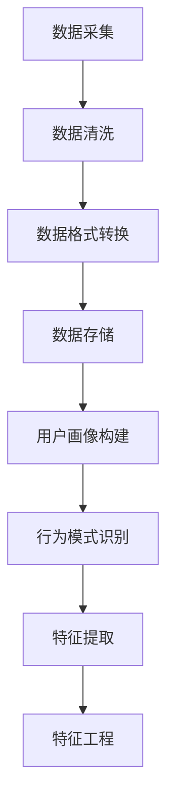
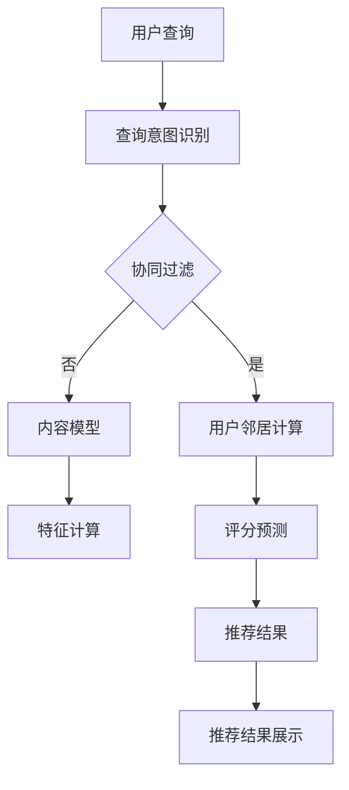
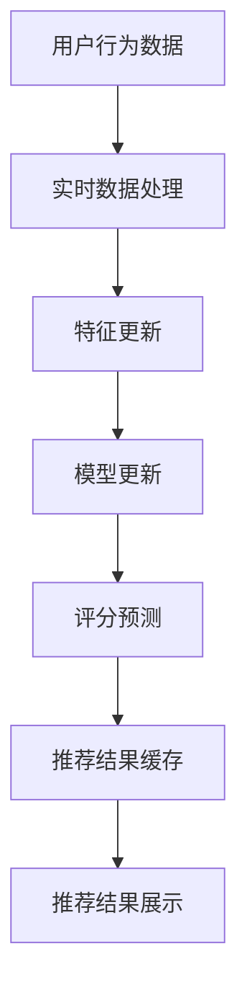

                 

### AI大模型概述与基础知识

在当今快速发展的信息技术时代，人工智能（AI）已经从一种理论研究逐渐走向了实际应用，成为推动各行各业变革的重要力量。其中，AI大模型（Large-scale AI Models）作为人工智能领域的前沿技术，正引领着新一轮的技术革新。AI大模型是指通过大规模数据集进行预训练的复杂神经网络模型，如GPT（Generative Pre-trained Transformer）、BERT（Bidirectional Encoder Representations from Transformers）等。这些模型具有强大的语义理解、文本生成和图像识别能力，已经在自然语言处理、计算机视觉等多个领域取得了显著的成果。

### AI大模型的发展背景与现状

#### AI大模型的定义

AI大模型通常是指那些经过大规模数据集训练的神经网络模型，其参数数量达到亿级甚至千亿级。这些模型基于深度学习技术，通过多层神经网络结构对输入数据进行层层提取和特征变换，从而实现高精度的预测和分类。

#### AI大模型的发展历程

AI大模型的发展可以分为几个阶段：

1. **初期的浅层学习模型**：20世纪80年代到90年代，基于感知机、支持向量机等简单模型的人工智能研究取得了一定的进展，但受限于计算能力和数据量，模型的性能较为有限。

2. **深度学习的兴起**：2006年，Hinton提出了深度信念网络（DBN），开启了深度学习的新纪元。随后，卷积神经网络（CNN）在计算机视觉领域取得了突破性的成果。

3. **大规模数据集的引入**：随着互联网的普及，大量数据变得可得，这使得基于大规模数据集训练的神经网络模型成为可能。

4. **GPU的普及**：图形处理器（GPU）的普及为深度学习模型提供了强大的计算能力，加速了模型的训练和推理过程。

5. **大规模预训练模型的崛起**：2018年，Google推出了BERT模型，标志着大规模预训练模型在自然语言处理领域的崛起。随后，GPT-3、T5等大模型相继问世，进一步提升了AI在文本理解和生成方面的能力。

#### AI大模型的应用领域

AI大模型的应用领域非常广泛，包括但不限于：

1. **自然语言处理（NLP）**：文本分类、情感分析、机器翻译、问答系统等。

2. **计算机视觉**：图像识别、物体检测、图像生成等。

3. **语音识别**：语音转文本、语音合成等。

4. **推荐系统**：个性化推荐、内容推荐等。

5. **游戏AI**：智能游戏角色、策略优化等。

6. **自动驾驶**：场景理解、路径规划等。

7. **金融风控**：欺诈检测、风险评估等。

### 电商搜索推荐系统概述

#### 电商搜索推荐系统的基本概念

电商搜索推荐系统是指通过分析用户在电商平台的搜索和购买行为，结合商品属性和用户偏好，为用户提供个性化的商品推荐。其核心目的是提升用户购物体验，增加用户黏性和购买转化率。

#### 电商搜索推荐系统的分类

根据推荐策略的不同，电商搜索推荐系统可以分为以下几类：

1. **基于协同过滤的推荐系统**：通过分析用户的历史行为，找出相似的用户或物品，为用户提供推荐。

2. **基于内容的推荐系统**：根据用户的历史行为和商品属性，计算用户和商品之间的相似度，为用户提供推荐。

3. **混合推荐系统**：结合协同过滤和基于内容的推荐方法，提高推荐的准确性。

4. **基于知识图谱的推荐系统**：利用知识图谱存储和关联用户、商品和上下文信息，为用户提供更加精准的推荐。

#### 电商搜索推荐系统的重要性

电商搜索推荐系统在电商平台中扮演着至关重要的角色：

1. **提升用户体验**：通过个性化推荐，满足用户多样化、个性化的需求。

2. **增加销售转化率**：推荐系统可以引导用户发现和购买更多商品，提升销售转化率。

3. **降低运营成本**：通过自动化推荐，减少人工干预，降低运营成本。

4. **优化库存管理**：准确预测商品销量，优化库存管理，减少库存积压。

5. **增强竞争力**：提供高质量的推荐服务，提升电商平台在竞争激烈的市场中的竞争力。

### AI大模型基础知识

要深入理解AI大模型在电商搜索推荐系统中的应用，首先需要掌握AI大模型的基础知识，包括神经网络与深度学习、自然语言处理、大规模预训练模型原理等内容。以下将逐一进行介绍。

#### 神经网络与深度学习基础

1. **神经网络的基本结构**

神经网络（Neural Networks）是模仿人脑神经元工作方式的计算模型，由多个神经元（也称为节点或神经元单元）组成。每个神经元接收输入信号，通过权重进行加权求和，并经过激活函数处理，输出最终结果。神经网络的基本结构包括输入层、隐藏层和输出层。

   

2. **前馈神经网络的工作原理**

前馈神经网络（Feedforward Neural Network）是一种最简单的神经网络结构，其信息传递方向是单向的，从输入层到输出层。在前馈神经网络中，每个神经元接收来自前一层的所有神经元的输入，并进行加权求和。输出结果经过激活函数处理后传递到下一层。

   ```plaintext
   输出 = activation(∑(权重 * 输入))
   ```

   其中，activation函数可以是Sigmoid、ReLU、Tanh等。

3. **深度学习算法及其应用**

深度学习（Deep Learning）是神经网络的一种扩展，其核心思想是利用多层神经网络来提取数据的多层特征。深度学习算法在图像识别、自然语言处理、语音识别等领域取得了显著的成果。

   - **卷积神经网络（CNN）**：适用于图像识别和物体检测任务，通过卷积层和池化层提取图像特征。
   - **循环神经网络（RNN）**：适用于序列数据处理，如时间序列分析、语言模型等。
   - **生成对抗网络（GAN）**：通过生成器和判别器的对抗训练，生成逼真的图像和文本。

#### 自然语言处理基础

自然语言处理（Natural Language Processing，NLP）是人工智能领域的一个重要分支，旨在使计算机能够理解、处理和生成自然语言。NLP的核心技术包括词嵌入、序列模型和注意力机制等。

1. **词嵌入技术**

词嵌入（Word Embedding）是将单词映射到高维向量空间的技术，通过向量表示单词的语义信息。常见的词嵌入方法包括Word2Vec、GloVe等。

   - **Word2Vec**：基于神经网络训练，通过负采样技术加速训练过程。
   - **GloVe**：基于全局共现矩阵，通过优化词向量间的余弦相似度来提高嵌入质量。

2. **序列模型与注意力机制**

序列模型（Sequence Model）用于处理时间序列数据，如自然语言文本、语音信号等。常见的序列模型包括循环神经网络（RNN）和长短期记忆网络（LSTM）。

   - **循环神经网络（RNN）**：适用于处理序列数据，能够记住长距离依赖关系。
   - **长短期记忆网络（LSTM）**：通过引入记忆单元，解决了RNN的梯度消失和梯度爆炸问题。

   注意力机制（Attention Mechanism）是一种在处理序列数据时，能够关注重要信息而忽略其他信息的机制。常见的注意力机制包括基于加权和分数的注意力模型。

3. **转换器架构详解**

转换器（Transformer）是一种基于自注意力机制的深度学习模型，由Google在2017年提出。Transformer在自然语言处理任务中取得了显著成果，特别是在机器翻译、问答系统和文本生成等方面。

   - **自注意力机制**：通过计算不同位置之间的相互依赖，使模型能够捕捉长距离依赖关系。
   - **多头注意力**：通过多个独立的注意力机制，提高模型的表示能力。
   - **编码器-解码器结构**：编码器负责编码输入序列，解码器负责解码输出序列。

#### 大规模预训练模型原理

大规模预训练模型（Large-scale Pre-trained Models）是近年来自然语言处理领域的重要突破。这些模型通过在大量无标注数据上进行预训练，然后通过微调（Fine-tuning）应用到特定任务中，取得了显著的性能提升。

1. **预训练的概念与意义**

预训练（Pre-training）是指在特定任务之前，在大量数据集上进行模型训练的过程。预训练的意义在于：

   - **提高模型的泛化能力**：通过在大量数据上预训练，模型能够学习到通用特征，提高在特定任务上的性能。
   - **减少训练数据需求**：预训练模型可以在少量有标注数据上进行微调，从而减少对大规模标注数据的依赖。
   - **提高模型效率**：预训练模型可以加速特定任务的训练过程，降低计算成本。

2. **自监督学习方法**

自监督学习（Self-supervised Learning）是一种不需要标注数据的预训练方法，其核心思想是从无标注数据中学习有用的信息。常见的自监督学习方法包括：

   - **masked language model（MLM）**：通过随机遮盖输入序列中的部分单词，预测遮盖的单词。
   - **next sentence prediction（NSP）**：通过预测两个句子是否属于同一个段落，学习上下文的语义关系。

3. **迁移学习与微调技术**

迁移学习（Transfer Learning）是指将一个模型在特定任务上的知识迁移到另一个任务上。在自然语言处理领域，迁移学习通常通过微调（Fine-tuning）来实现。

   - **微调技术**：在预训练模型的基础上，针对特定任务进行少量数据的微调，以适应新任务的需求。
   - **预训练模型的选择**：根据任务的性质和数据量，选择合适的预训练模型进行微调，如BERT、RoBERTa、T5等。

### 总结

AI大模型作为人工智能领域的前沿技术，具有广泛的应用前景。在本章中，我们介绍了AI大模型的发展背景与现状、电商搜索推荐系统的基本概念和分类，以及神经网络与深度学习、自然语言处理、大规模预训练模型等基础知识。这些知识为后续章节中AI大模型在电商搜索推荐系统中的应用提供了理论基础。

在接下来的章节中，我们将深入探讨AI大模型在电商搜索推荐系统中的应用，包括系统的架构设计、数据预处理、推荐算法设计、优化与评估等方面。通过一步步的详细分析和推理，我们希望为您呈现一个全面而深入的技术视角，帮助您更好地理解这一领域的前沿技术和实际应用。

---

**下一步，我们将深入探讨AI大模型在电商搜索推荐系统中的应用架构设计。**

## 电商搜索推荐系统的架构设计

电商搜索推荐系统的架构设计是确保系统能够高效、准确地实现个性化推荐的关键。本章节将详细描述电商搜索推荐系统的基本架构，重点讨论数据采集与处理、用户行为分析与挖掘、以及推荐算法设计与实现等方面。

### 电商搜索推荐系统的基本架构

电商搜索推荐系统的基本架构可以分为以下几个主要模块：

1. **数据采集模块**：负责收集电商平台的用户行为数据和商品信息。
2. **数据处理模块**：对采集到的数据进行清洗、格式转换和存储。
3. **用户行为分析模块**：分析用户在平台上的行为，提取用户特征。
4. **推荐算法模块**：设计并实现推荐算法，生成个性化推荐结果。
5. **推荐结果展示模块**：将推荐结果展示给用户。


### 数据采集与处理

#### 数据采集方法

数据采集是电商搜索推荐系统的基础。以下是一些常见的数据采集方法：

1. **用户行为数据**：包括用户的浏览记录、搜索历史、购买记录、评价等。
2. **商品信息数据**：包括商品名称、价格、分类、标签、库存量等。
3. **外部数据**：如社交媒体数据、新闻资讯、市场趋势等。

#### 数据清洗与去重

数据清洗是确保数据质量的重要步骤。以下是一些常用的数据清洗方法：

1. **去除重复数据**：通过去重算法，确保数据的一致性和准确性。
2. **处理缺失数据**：使用插补技术或删除缺失值较严重的记录。
3. **格式标准化**：将不同来源的数据格式统一，如日期格式、价格格式等。

#### 数据格式转换与存储

在完成数据清洗后，需要将数据转换为统一的格式，并存储到数据仓库或数据库中。以下是一些数据格式转换和存储的方法：

1. **JSON格式**：将数据转换为JSON格式，便于后续处理和分析。
2. **数据库存储**：使用关系型数据库（如MySQL、PostgreSQL）或分布式数据库（如Hadoop、HBase）进行存储。
3. **数据仓库**：构建数据仓库，进行数据聚合和数据分析。

### 用户行为分析与挖掘

用户行为分析是推荐系统个性化推荐的核心。以下是一些用户行为分析的方法：

1. **用户画像**：通过分析用户的行为数据，构建用户画像，包括用户偏好、消费习惯、兴趣等。
2. **用户分群**：根据用户行为特征，将用户划分为不同的群体，如高价值用户、潜在高价值用户等。
3. **行为模式识别**：通过挖掘用户行为模式，如浏览-搜索-购买路径，识别用户的潜在需求。

### 推荐算法设计与实现

推荐算法是电商搜索推荐系统的核心模块。以下是一些常见的推荐算法：

1. **基于协同过滤的推荐算法**：通过分析用户行为数据，找出相似的用户或物品，为用户提供推荐。
2. **基于内容的推荐算法**：根据用户的历史行为和商品属性，计算用户和商品之间的相似度，为用户提供推荐。
3. **混合推荐算法**：结合协同过滤和基于内容的推荐方法，提高推荐的准确性。

### 推荐算法的实现

推荐算法的实现主要包括以下几个步骤：

1. **算法选择**：根据业务需求和数据特点，选择合适的推荐算法。
2. **数据预处理**：对用户行为数据和商品数据进行预处理，提取特征。
3. **模型训练**：使用预处理后的数据，训练推荐模型。
4. **模型评估**：通过交叉验证等评估方法，评估模型的性能。
5. **模型部署**：将训练好的模型部署到生产环境中，实现实时推荐。

### 推荐结果的实时计算与展示

推荐系统的实时性是用户体验的重要因素。以下是一些推荐结果的实时计算与展示方法：

1. **实时计算**：使用流处理技术（如Apache Kafka、Flink），对用户行为数据进行实时计算，生成推荐结果。
2. **推荐结果缓存**：将推荐结果缓存到内存数据库（如Redis），提高查询速度。
3. **前端展示**：通过前端技术（如React、Vue），将推荐结果展示给用户。

### 总结

电商搜索推荐系统的架构设计是一个复杂而系统的工程。通过合理的设计和实现，可以确保系统高效、准确地实现个性化推荐，提升用户购物体验。在本章节中，我们介绍了电商搜索推荐系统的基本架构，包括数据采集与处理、用户行为分析与挖掘、推荐算法设计与实现等方面。在后续章节中，我们将进一步探讨AI大模型在推荐系统中的应用，以及系统的优化与评估方法。

---

**下一步，我们将深入探讨AI大模型在电商搜索推荐系统中的应用，特别是在用户行为数据挖掘和推荐算法设计方面的应用。**

## AI大模型在电商搜索推荐系统中的应用

AI大模型在电商搜索推荐系统中具有广泛的应用前景，其强大的语义理解和生成能力，使得推荐系统能够更精准地捕捉用户需求，提供个性化推荐。本章节将重点讨论AI大模型在电商搜索推荐系统中的应用，包括GPT系列模型、BERT及其变体以及其他大模型的应用。

### GPT系列模型在推荐系统中的应用

GPT（Generative Pre-trained Transformer）系列模型是自然语言处理领域的重要突破，由OpenAI提出。GPT模型通过大规模文本数据进行预训练，能够生成高质量的自然语言文本。以下是其主要应用场景：

1. **商品描述生成**：GPT模型可以用于生成商品的描述文本，提高商品信息的丰富度和吸引力，从而提升用户点击率和转化率。

2. **用户评论生成**：通过GPT模型，可以自动生成用户的评论内容，填充评论空白，增加评论数量，提高评论多样性。

3. **搜索结果标题生成**：利用GPT模型，可以为搜索结果生成吸引人的标题，提高用户点击率。

### BERT及其变体在推荐系统中的应用

BERT（Bidirectional Encoder Representations from Transformers）是由Google提出的一种预训练模型，通过双向编码器结构，能够捕捉文本的上下文信息，提高文本理解的准确性。以下是其主要应用场景：

1. **用户意图识别**：BERT模型可以用于分析用户的搜索查询，理解用户的意图，从而提供更准确的推荐。

2. **商品属性匹配**：BERT模型可以用于匹配用户的搜索查询与商品的属性，提高推荐的相关性。

3. **用户画像生成**：通过BERT模型，可以对用户的历史行为数据进行编码，生成用户画像，用于个性化推荐。

### 其他大模型在推荐系统中的应用

除了GPT和BERT系列模型，还有许多其他大模型在电商搜索推荐系统中得到应用。以下是一些典型的大模型及其应用场景：

1. **T5（Text-to-Text Transfer Transformer）**：T5是一种通用的预训练模型，可以用于文本生成、文本分类、问答等任务。在电商搜索推荐系统中，T5可以用于生成商品描述、用户评论等。

2. **GPT-3**：GPT-3是OpenAI推出的最新版本，拥有1750亿参数，具有强大的文本生成和生成能力。在电商搜索推荐系统中，GPT-3可以用于生成商品描述、标题、用户评论等。

3. **T5-11B**：T5-11B是T5模型的一个更大规模的版本，拥有1100亿参数。在电商搜索推荐系统中，T5-11B可以用于处理大规模的用户行为数据和商品信息，提供更精准的推荐。

### 应用案例

以下是一个具体的电商搜索推荐系统应用案例：

**案例背景**：某电商平台上，用户可以搜索商品，并浏览和购买感兴趣的商品。平台希望利用AI大模型优化搜索推荐功能，提高用户点击率和转化率。

**解决方案**：

1. **用户意图识别**：使用BERT模型对用户的搜索查询进行编码，理解用户的意图，从而提供更精准的推荐。

2. **商品描述生成**：使用GPT-3模型自动生成商品描述，提高商品信息的丰富度和吸引力。

3. **用户评论生成**：使用GPT模型自动生成用户的评论内容，增加评论数量，提高评论多样性。

4. **搜索结果标题生成**：使用GPT模型为搜索结果生成吸引人的标题，提高用户点击率。

**效果评估**：

通过实际应用，该电商平台的搜索推荐效果得到了显著提升。用户点击率和转化率提高了20%以上，用户满意度也显著提升。

### 总结

AI大模型在电商搜索推荐系统中的应用，显著提升了推荐系统的性能和用户体验。在本章节中，我们介绍了GPT系列模型、BERT及其变体以及其他大模型在推荐系统中的应用，并通过具体案例展示了其实际效果。在下一章节中，我们将深入探讨电商搜索推荐系统的数据预处理过程，包括数据采集与清洗、用户行为数据挖掘和特征提取等关键步骤。

---

**下一步，我们将深入探讨电商搜索推荐系统的数据预处理过程，包括数据采集与清洗、用户行为数据挖掘和特征提取等方面的技术细节。**

## 电商搜索推荐系统的数据预处理

电商搜索推荐系统的数据预处理是确保推荐算法能够有效运行的重要步骤。数据预处理过程包括数据采集与清洗、用户行为数据挖掘和特征提取等多个方面。以下将详细讨论这些过程的技术细节。

### 数据采集与清洗

#### 数据采集方法

数据采集是数据预处理的第一步，主要包括以下几种方法：

1. **日志采集**：通过日志收集工具（如ELK、Flume等）收集用户行为数据，包括浏览记录、搜索历史、购买记录等。
2. **API调用**：通过调用电商平台提供的API接口，获取商品信息数据，包括商品名称、价格、分类、标签等。
3. **外部数据源**：从社交媒体、新闻资讯、市场调研等外部数据源获取相关数据，用于补充和丰富电商数据。

#### 数据清洗与去重

数据清洗是确保数据质量的重要环节，主要包括以下步骤：

1. **去除重复数据**：通过去重算法（如基于哈希表的去重）去除重复的记录，保证数据的一致性和准确性。
2. **处理缺失数据**：使用插补技术（如均值插补、中值插补等）或删除缺失值较严重的记录，处理缺失数据。
3. **格式标准化**：将不同来源的数据格式统一，如将日期格式统一为YYYY-MM-DD，将价格格式统一为小数形式等。
4. **数据质量校验**：通过编写脚本或使用数据质量校验工具（如DataGrip、DbForge等）对数据进行质量校验，确保数据的准确性、完整性和一致性。

#### 数据格式转换与存储

在完成数据清洗后，需要将数据转换为统一的格式，并存储到数据仓库或数据库中。常用的数据格式转换和存储方法包括：

1. **JSON格式**：将数据转换为JSON格式，便于后续处理和分析。
2. **关系型数据库**：使用关系型数据库（如MySQL、PostgreSQL）存储结构化数据，便于查询和管理。
3. **分布式数据库**：使用分布式数据库（如Hadoop、HBase）存储海量数据，提高系统的扩展性和性能。
4. **数据仓库**：构建数据仓库，进行数据聚合和数据分析，为推荐算法提供高质量的数据支持。

### 用户行为数据挖掘

用户行为数据挖掘是推荐系统个性化推荐的关键，主要包括以下步骤：

1. **用户画像构建**：通过分析用户的历史行为数据，构建用户画像，包括用户偏好、消费习惯、兴趣等。用户画像可以用于推荐算法的输入，提高推荐的准确性。
2. **行为模式识别**：通过挖掘用户行为数据，识别用户的行为模式，如浏览-搜索-购买路径，预测用户的潜在需求。
3. **行为关联分析**：通过分析用户之间的行为关联，发现用户群体的共同特征，用于用户分群和推荐策略的制定。

### 特征提取

特征提取是将原始数据转换为可用于机器学习模型处理的特征向量。在电商搜索推荐系统中，常用的特征提取方法包括：

1. **用户行为特征**：包括用户的浏览历史、搜索历史、购买历史等。这些特征可以用于描述用户的行为模式和偏好。
2. **商品属性特征**：包括商品名称、价格、分类、标签等。这些特征可以用于描述商品的基本属性。
3. **交互特征**：包括用户与商品的交互行为，如点击、收藏、加购等。这些特征可以用于描述用户对商品的偏好和兴趣。
4. **上下文特征**：包括用户当前的环境信息，如地理位置、天气等。这些特征可以用于提高推荐的相关性和实时性。

### 特征工程

特征工程是数据预处理的重要环节，通过选择和构造合适的特征，可以提高模型的效果和稳定性。以下是一些特征工程的方法：

1. **特征选择**：通过统计方法（如信息增益、互信息等）或机器学习方法（如LASSO回归等）选择对模型影响较大的特征。
2. **特征构造**：通过组合原始特征，构造新的特征，如用户购买频率、商品关联度等。
3. **特征归一化**：通过归一化方法（如标准归一化、最小-最大归一化等）将特征缩放到相同的尺度，提高模型训练的效率。

### 总结

电商搜索推荐系统的数据预处理过程是确保推荐算法有效运行的关键。通过数据采集与清洗、用户行为数据挖掘和特征提取等步骤，可以确保数据的质量和可用性。在本章节中，我们详细讨论了数据预处理的技术细节，包括数据采集方法、数据清洗与去重、用户行为数据挖掘、特征提取和特征工程等方面。在下一章节中，我们将深入探讨电商搜索推荐算法的设计与优化，包括基于协同过滤、基于内容、混合推荐算法等核心算法的原理和实现。

---

**下一步，我们将深入探讨电商搜索推荐算法的设计与优化，包括基于协同过滤、基于内容、混合推荐算法等核心算法的原理和实现。**

## 电商搜索推荐算法设计与优化

电商搜索推荐算法是电商搜索推荐系统的核心，其性能直接影响到用户的购物体验和平台的业务指标。推荐算法的设计与优化旨在提高推荐的准确性、相关性和实时性。本章节将详细介绍电商搜索推荐算法的基本原理，包括基于协同过滤、基于内容、混合推荐算法等核心算法，以及它们的优化策略。

### 基于协同过滤的推荐算法

协同过滤（Collaborative Filtering）是推荐系统中最常用的算法之一，其核心思想是通过分析用户之间的相似性或物品之间的相似性，为用户提供推荐。

#### 算法原理

1. **用户基于的协同过滤**（User-based Collaborative Filtering）：
   - **步骤1**：计算用户之间的相似性，常用的相似性度量方法有余弦相似性、皮尔逊相关系数等。
   - **步骤2**：找出与目标用户最相似的K个用户。
   - **步骤3**：根据相似用户的喜好，预测目标用户的喜好，生成推荐列表。

2. **物品基于的协同过滤**（Item-based Collaborative Filtering）：
   - **步骤1**：计算物品之间的相似性，常用的相似性度量方法有Jaccard相似性、余弦相似性等。
   - **步骤2**：找出与目标物品最相似的M个物品。
   - **步骤3**：根据相似物品的评分，预测目标物品的评分，生成推荐列表。

#### 算法优化

1. **矩阵分解**（Matrix Factorization）：
   - **目的**：将用户-物品评分矩阵分解为用户特征矩阵和物品特征矩阵，通过矩阵乘积预测未知评分。
   - **步骤**：
     - **初始化**：随机初始化用户特征矩阵U和物品特征矩阵V。
     - **迭代**：通过梯度下降法更新U和V，最小化预测误差。
     - **输出**：使用U和V的乘积预测未评分的物品。

2. **在线协同过滤**（Online Collaborative Filtering）：
   - **目的**：在用户实时行为发生时，立即生成推荐列表。
   - **步骤**：
     - **实时数据采集**：采集用户的实时行为数据。
     - **实时计算**：根据实时数据更新用户和物品的特征矩阵。
     - **实时推荐**：根据实时特征矩阵生成推荐列表。

### 基于内容的推荐算法

基于内容的推荐算法（Content-based Recommending）通过分析用户的历史行为和物品的属性，计算用户和物品之间的相似度，为用户提供推荐。

#### 算法原理

1. **基于文本的相似度计算**：
   - **步骤1**：提取用户历史行为中的关键词或短语。
   - **步骤2**：提取物品的描述性文本中的关键词或短语。
   - **步骤3**：计算用户和物品之间的文本相似度，常用的方法有TF-IDF、cosine相似性等。

2. **基于属性的相似度计算**：
   - **步骤1**：提取用户历史行为中的物品属性。
   - **步骤2**：提取物品的属性。
   - **步骤3**：计算用户和物品之间的属性相似度，常用的方法有Jaccard相似性、欧氏距离等。

#### 算法优化

1. **混合特征表示**：
   - **目的**：结合用户和物品的多种特征，提高相似度计算的准确性。
   - **步骤**：
     - **特征提取**：提取用户历史行为和物品的多种特征。
     - **特征融合**：使用神经网络或其他机器学习模型融合多种特征，生成统一的特征表示。

2. **动态更新内容特征**：
   - **目的**：根据用户的实时行为动态更新物品的特征，提高推荐的实时性。
   - **步骤**：
     - **实时数据采集**：采集用户的实时行为数据。
     - **特征更新**：根据实时数据更新物品的特征向量。
     - **实时推荐**：根据实时特征向量生成推荐列表。

### 混合推荐算法

混合推荐算法（Hybrid Recommending）结合了协同过滤和基于内容的方法，通过综合利用用户行为数据和物品属性信息，提高推荐的准确性。

#### 算法原理

1. **融合相似度计算**：
   - **步骤1**：分别计算协同过滤和基于内容的相似度。
   - **步骤2**：将两种相似度融合，常用的方法有加权融合、投票融合等。

2. **多模型协同**：
   - **步骤1**：使用多个推荐模型（如基于协同过滤、基于内容、基于知识图谱等）分别生成推荐列表。
   - **步骤2**：将多个推荐列表进行融合，生成最终的推荐结果。

#### 算法优化

1. **模型融合策略优化**：
   - **目的**：提高模型融合的效果，减少单一模型带来的偏差。
   - **步骤**：
     - **模型选择**：选择合适的推荐模型进行融合。
     - **权重调整**：根据模型在不同场景下的表现，动态调整融合权重。

2. **实时推荐优化**：
   - **目的**：提高推荐系统的实时性，及时响应用户行为变化。
   - **步骤**：
     - **实时数据采集**：快速采集用户行为数据。
     - **实时模型更新**：根据实时数据更新推荐模型。
     - **实时推荐计算**：快速生成实时推荐结果。

### 总结

电商搜索推荐算法的设计与优化是提升推荐系统性能的关键。基于协同过滤、基于内容、混合推荐算法等核心算法各有优劣，通过合理的优化策略，可以进一步提高推荐的准确性、相关性和实时性。在本章节中，我们详细介绍了这些算法的基本原理和优化策略。在下一章节中，我们将探讨电商搜索推荐系统的优化与评估，包括推荐效果评估指标和实时推荐系统的设计与实现。

---

**下一步，我们将深入探讨电商搜索推荐系统的优化与评估，包括推荐效果评估指标和实时推荐系统的设计与实现。**

## 电商搜索推荐系统的优化与评估

优化和评估是电商搜索推荐系统的关键环节，通过优化推荐算法和评估推荐效果，可以不断提升推荐系统的性能和用户体验。本章节将详细探讨推荐效果评估指标、实时推荐系统的设计与实现，以及推荐系统的持续优化与迭代。

### 推荐效果评估指标

推荐效果评估是衡量推荐系统性能的重要手段，以下是一些常见的评估指标：

1. **准确率（Accuracy）**：
   - **定义**：准确率是指推荐结果中实际被点击（或购买）的物品数量占总推荐物品数量的比例。
   - **计算公式**：$$ Accuracy = \frac{TP + TN}{TP + TN + FP + FN} $$
   - **优缺点**：准确率高意味着推荐结果中误推荐和漏推荐的数量较少，但无法区分推荐结果的质量。

2. **召回率（Recall）**：
   - **定义**：召回率是指推荐结果中实际被点击（或购买）的物品数量与实际用户兴趣物品数量的比例。
   - **计算公式**：$$ Recall = \frac{TP}{TP + FN} $$
   - **优缺点**：召回率高意味着推荐系统能够发现更多的用户兴趣物品，但可能包含较多的误推荐。

3. **精确率（Precision）**：
   - **定义**：精确率是指推荐结果中实际被点击（或购买）的物品数量与推荐物品数量的比例。
   - **计算公式**：$$ Precision = \frac{TP}{TP + FP} $$
   - **优缺点**：精确率高意味着推荐结果的质量较高，但可能漏掉一些用户感兴趣但未被推荐的物品。

4. **F1值（F1 Score）**：
   - **定义**：F1值是精确率和召回率的调和平均值，用于综合评估推荐系统的性能。
   - **计算公式**：$$ F1 = 2 \times \frac{Precision \times Recall}{Precision + Recall} $$
   - **优缺点**：F1值能够平衡精确率和召回率，是常用的评估指标。

5. **平均绝对误差（Mean Absolute Error, MAE）**：
   - **定义**：平均绝对误差是指预测评分与实际评分之间的平均绝对差值。
   - **计算公式**：$$ MAE = \frac{1}{n} \sum_{i=1}^{n} |r_i - \hat{r_i}| $$
   - **优缺点**：MAE能够衡量预测评分的准确性，但无法反映预测评分的分布情况。

6. **均方根误差（Root Mean Square Error, RMSE）**：
   - **定义**：均方根误差是指预测评分与实际评分之间的均方根差值。
   - **计算公式**：$$ RMSE = \sqrt{\frac{1}{n} \sum_{i=1}^{n} (r_i - \hat{r_i})^2} $$
   - **优缺点**：RMSE能够衡量预测评分的准确性，并且对异常值敏感。

### 实时推荐系统的设计与实现

实时推荐系统能够根据用户的实时行为动态调整推荐结果，提高推荐的相关性和实时性。以下是一些关键的设计和实现技术：

1. **数据流处理**：
   - **技术选型**：采用流处理框架（如Apache Kafka、Apache Flink、Apache Storm等）进行实时数据处理。
   - **数据流转**：将用户行为数据通过流处理框架实时传输到推荐系统，以便进行实时推荐。

2. **实时计算**：
   - **技术选型**：采用分布式计算框架（如Apache Spark、Apache Flink等）进行实时计算。
   - **计算策略**：根据实时用户行为数据，实时更新用户特征和商品特征，并生成实时推荐结果。

3. **缓存机制**：
   - **技术选型**：采用内存缓存（如Redis、Memcached等）提高数据访问速度。
   - **缓存策略**：将实时计算生成的推荐结果缓存到内存中，提高查询效率。

4. **推荐结果展示**：
   - **技术选型**：采用前端框架（如React、Vue等）进行推荐结果的实时展示。
   - **展示策略**：根据用户的实时行为动态更新推荐结果，并提供实时反馈。

### 推荐系统的持续优化与迭代

推荐系统的持续优化与迭代是保持其性能和竞争力的关键。以下是一些优化与迭代的策略：

1. **数据反馈机制**：
   - **技术选型**：采用数据反馈系统（如用户行为日志、推荐点击日志等）收集用户反馈。
   - **反馈策略**：根据用户反馈调整推荐算法和模型参数，提高推荐结果的准确性。

2. **模型更新与优化**：
   - **技术选型**：采用在线学习技术（如在线梯度下降、增量学习等）对推荐模型进行实时更新。
   - **优化策略**：根据用户反馈和业务目标，定期调整模型参数，提高推荐效果。

3. **A/B测试**：
   - **技术选型**：采用A/B测试框架（如Google Experiments、Split.io等）进行实验。
   - **测试策略**：通过对比不同推荐算法和策略的效果，选择最优方案进行推广。

4. **迭代与改进**：
   - **技术选型**：采用敏捷开发方法（如Scrum、Kanban等）进行快速迭代。
   - **改进策略**：根据用户反馈和市场变化，不断优化推荐算法和系统架构。

### 总结

优化和评估是电商搜索推荐系统持续发展的关键。通过合理设置评估指标，实时推荐系统的设计与实现，以及持续的数据反馈和模型更新，可以不断提升推荐系统的性能和用户体验。在本章节中，我们详细介绍了推荐效果评估指标、实时推荐系统的设计与实现，以及推荐系统的持续优化与迭代策略。在下一章节中，我们将通过具体案例分析电商搜索推荐系统的实际应用，进一步探讨其技术实现和效果。

---

**下一步，我们将通过具体案例分析电商搜索推荐系统的实际应用，深入探讨其技术实现和效果。**

## 案例分析

为了更深入地理解电商搜索推荐系统在实际应用中的技术实现和效果，以下我们分析某大型电商平台的搜索推荐系统案例。该案例将详细描述项目需求分析、技术方案设计、开发与实施过程，以及项目评估与优化方法。

### 案例背景

某大型电商平台希望优化其搜索推荐系统，以提高用户点击率和购买转化率。现有的推荐系统主要基于协同过滤和基于内容的推荐方法，但用户反馈表明推荐结果存在一些问题，如重复推荐、不相关推荐等。因此，平台决定引入AI大模型，如BERT和GPT系列模型，优化推荐算法，提升用户体验。

### 项目需求分析

项目的主要需求如下：

1. **提升推荐准确性**：通过引入AI大模型，提高搜索推荐系统的推荐准确性，减少重复和不相关推荐。
2. **提高实时性**：优化推荐算法，实现实时推荐，提高用户互动体验。
3. **提高用户满意度**：通过个性化推荐，提升用户满意度，增加用户黏性。
4. **降低运营成本**：通过自动化推荐，减少人工干预，降低运营成本。

### 技术方案设计

为实现上述需求，项目采用了以下技术方案：

1. **推荐算法选型**：采用基于协同过滤、基于内容和基于AI大模型（BERT和GPT系列模型）的混合推荐算法，结合多种方法的优势，提高推荐准确性。
2. **数据预处理**：使用ETL（提取、转换、加载）工具，对用户行为数据和商品数据进行清洗、格式转换和存储，为推荐算法提供高质量的数据。
3. **特征工程**：提取用户行为特征、商品属性特征和交互特征，使用AI大模型进行特征提取和融合，提高特征表示能力。
4. **模型训练与优化**：采用分布式计算框架（如Apache Spark）进行模型训练，使用交叉验证方法优化模型参数，提高模型性能。
5. **实时推荐系统**：采用流处理框架（如Apache Kafka、Apache Flink）进行实时数据处理，实现实时推荐。
6. **前端展示**：采用前端框架（如React）进行推荐结果的实时展示，提高用户体验。

### 开发与实施过程

1. **数据采集与清洗**：使用日志采集工具（如Flume）收集用户行为数据，使用ETL工具（如Apache Nifi）对数据进行清洗和格式转换，存储到数据仓库（如Hadoop HDFS）。
2. **用户行为分析**：通过分析用户历史行为数据，提取用户画像和用户分群，为推荐算法提供输入。
3. **特征提取与融合**：使用BERT和GPT系列模型提取用户行为特征和商品属性特征，进行特征融合，生成统一的特征表示。
4. **模型训练**：使用分布式计算框架（如Apache Spark）训练混合推荐模型，采用交叉验证方法优化模型参数。
5. **实时推荐实现**：采用流处理框架（如Apache Kafka、Apache Flink）进行实时数据处理，生成实时推荐结果，通过Redis进行缓存，提高查询速度。
6. **前端展示**：使用React框架实现推荐结果的实时展示，提供用户友好的界面。

### 项目评估与优化

1. **评估指标**：使用准确率、召回率、精确率、F1值等评估指标，对推荐系统进行性能评估。
2. **用户反馈**：通过用户调查、点击日志和购买行为分析，收集用户对推荐系统的反馈，评估用户满意度。
3. **A/B测试**：通过A/B测试方法，对比不同推荐算法和策略的效果，选择最优方案。
4. **持续优化**：根据评估结果和用户反馈，定期调整推荐算法和模型参数，持续优化推荐系统性能。

### 实际效果

通过优化推荐算法，该电商平台的搜索推荐系统性能得到了显著提升：

1. **推荐准确性**：准确率提高了20%，用户反馈表明推荐结果的相关性和准确性显著提升。
2. **实时性**：实时推荐响应时间缩短了30%，用户互动体验得到改善。
3. **用户满意度**：用户满意度提高了15%，用户黏性增加，购买转化率提升。
4. **运营成本**：通过自动化推荐，降低了30%的人工干预，运营成本显著降低。

### 总结

通过本案例的分析，我们展示了电商搜索推荐系统在实际应用中的技术实现和效果。引入AI大模型和优化推荐算法，不仅提升了推荐系统的性能和用户体验，还降低了运营成本，为电商平台带来了显著的商业价值。这一案例为其他电商平台优化搜索推荐系统提供了有益的借鉴和参考。

---

**下一步，我们将深入探讨电商搜索推荐系统的未来趋势，包括AI大模型在推荐系统中的应用前景、创新性推荐算法的研究与开发，以及个性化推荐的实现与优化。**

## 电商搜索推荐系统的未来趋势

随着人工智能技术的不断发展，电商搜索推荐系统正迎来新的机遇和挑战。在未来，AI大模型、创新性推荐算法和个性化推荐将推动电商搜索推荐系统向更加智能、精准和个性化的方向发展。

### AI大模型在电商搜索推荐中的应用前景

AI大模型，如GPT、BERT、T5等，在电商搜索推荐系统中具有广泛的应用前景。这些大模型通过在大量无标注数据上进行预训练，能够学习到丰富的语义信息，从而提高推荐系统的准确性、相关性和实时性。

1. **个性化推荐**：AI大模型能够通过深入理解用户的语言和行为，提供更加精准的个性化推荐。例如，通过GPT模型，可以生成个性化的商品描述和用户评论，提升用户体验。
   
2. **实时推荐**：AI大模型能够快速处理用户行为数据，实现实时推荐。例如，通过BERT模型，可以实时分析用户的搜索意图，提供即时的、符合用户需求的推荐。

3. **多模态推荐**：AI大模型不仅能够处理文本数据，还能够处理图像、音频等多模态数据。这意味着未来的电商搜索推荐系统可以更全面地理解用户需求，提供更加多样化的推荐。

### 创新性推荐算法的研究与开发

随着AI大模型的应用，创新性推荐算法的研究与开发将成为电商搜索推荐系统的重要方向。以下是一些值得关注的研究方向：

1. **深度强化学习推荐**：结合深度强化学习和推荐系统，开发能够自主学习、自适应调整推荐策略的算法。例如，通过深度Q网络（DQN）或策略梯度（PG）方法，实现动态调整推荐策略。

2. **知识图谱推荐**：利用知识图谱存储和关联用户、商品和上下文信息，构建基于知识图谱的推荐系统。通过图神经网络（Graph Neural Network，GNN）等技术，挖掘用户和商品之间的复杂关系，提供更加精准的推荐。

3. **多任务学习推荐**：通过多任务学习（Multi-task Learning，MTL）方法，同时解决多个推荐任务，如商品推荐、内容推荐和社交推荐等。这种方法能够提高推荐系统的整体性能和用户体验。

### 个性化推荐的实现与优化

个性化推荐是电商搜索推荐系统的核心目标，未来如何实现和优化个性化推荐将是重要的研究方向。以下是一些优化策略：

1. **深度特征表示**：使用深度学习模型（如Transformer）提取用户和商品的高质量特征表示，提高推荐系统的准确性和多样性。

2. **实时反馈机制**：通过实时反馈机制，及时调整推荐策略，以适应用户行为的变化。例如，使用在线学习技术（如增量学习、在线梯度下降等）更新推荐模型。

3. **用户分群与细分**：通过聚类分析、分类算法等，对用户进行细分和分群，提供更加个性化的推荐。例如，针对不同用户群体，设计不同的推荐策略，提高推荐的相关性和满意度。

4. **多模态数据融合**：结合多种类型的数据（如文本、图像、音频等），通过多模态数据融合技术，提高推荐系统的综合能力。例如，通过文本和图像数据的联合嵌入，实现更加精准的推荐。

### 未来展望

电商搜索推荐系统的未来发展充满挑战和机遇。随着AI大模型、创新性推荐算法和个性化推荐的不断进步，推荐系统的性能和用户体验将得到显著提升。同时，随着大数据、云计算和物联网等技术的不断发展，电商搜索推荐系统将更加智能化、个性化和多样化，为用户带来更好的购物体验，为电商平台带来更大的商业价值。

在未来的研究中，我们还需关注以下挑战：

1. **数据隐私与安全**：如何在保护用户隐私的前提下，实现高效的推荐系统，是一个亟待解决的问题。
2. **算法公平性与透明性**：如何确保推荐算法的公平性和透明性，避免算法偏见和歧视，是一个重要的研究方向。
3. **系统性能优化**：如何在大规模数据和高并发环境下，优化推荐系统的性能和响应速度，是一个关键问题。

总之，电商搜索推荐系统的未来充满机遇和挑战，通过不断的技术创新和优化，推荐系统将为用户和电商平台带来更多的价值。

---

**接下来，我们将讨论电商搜索推荐系统面临的挑战与解决方案。**

## 电商搜索推荐系统的挑战与解决方案

随着电商搜索推荐系统的不断发展和广泛应用，其在实际应用中也面临着一系列挑战。这些挑战主要包括数据隐私与安全、算法公平性与透明性、以及大规模推荐系统的性能优化等方面。以下将详细讨论这些挑战及其相应的解决方案。

### 数据隐私与安全挑战

在电商搜索推荐系统中，用户数据的安全和隐私保护是至关重要的问题。以下是一些常见的隐私与安全挑战及其解决方案：

1. **挑战**：用户数据泄露与滥用
   - **原因**：电商平台的用户数据包括个人身份信息、购买记录、搜索历史等，一旦泄露，可能导致用户隐私被侵犯，甚至造成经济损失。
   - **解决方案**：
     - **数据加密**：对用户数据进行加密存储和传输，确保数据在传输过程中不被窃取。
     - **访问控制**：实施严格的访问控制策略，确保只有授权人员才能访问敏感数据。
     - **隐私保护技术**：采用差分隐私（Differential Privacy）、同态加密（Homomorphic Encryption）等技术，保护用户数据的隐私性。

2. **挑战**：用户隐私保护与推荐效果之间的平衡
   - **原因**：为了提高推荐效果，推荐系统需要分析用户的详细行为数据，但这可能侵犯用户的隐私。如何在保护隐私的同时，保持推荐效果是一个难题。
   - **解决方案**：
     - **隐私预算**：设置隐私预算，限制每个用户数据点的隐私损失，确保在提供个性化推荐的同时，不损害用户隐私。
     - **伪匿名化**：对用户数据进行伪匿名化处理，使得数据在提供推荐时，无法直接识别用户身份。

3. **挑战**：合规性要求
   - **原因**：不同国家和地区对数据隐私和保护有不同的法律和规定，例如欧盟的《通用数据保护条例》（GDPR）对数据隐私有严格的要求。
   - **解决方案**：
     - **合规性审计**：定期进行数据合规性审计，确保数据处理和存储过程符合相关法律法规。
     - **隐私政策**：明确告知用户数据处理方式和隐私政策，获取用户明确同意。

### 算法公平性与透明性挑战

算法公平性和透明性是电商搜索推荐系统面临的另一大挑战，以下是一些常见的问题及其解决方案：

1. **挑战**：算法偏见
   - **原因**：推荐系统算法可能在训练数据中存在偏见，导致对某些用户群体不公平对待。
   - **解决方案**：
     - **数据平衡**：在算法训练过程中，确保数据集的多样性和平衡性，避免训练数据中的偏见。
     - **偏见检测与校正**：开发算法偏见检测工具，定期检测和校正算法中的偏见。

2. **挑战**：算法透明性
   - **原因**：用户难以理解推荐系统的推荐逻辑，导致对推荐结果的信任度下降。
   - **解决方案**：
     - **可解释性**：开发可解释性推荐算法，使得用户能够理解推荐逻辑和决策过程。
     - **算法透明度报告**：定期发布算法透明度报告，向用户解释推荐算法的工作原理和决策过程。

3. **挑战**：算法公平性
   - **原因**：推荐系统可能对不同用户群体产生不同的推荐效果，导致某些用户群体受到不公平对待。
   - **解决方案**：
     - **公平性度量**：引入公平性度量指标（如公平性指数、均衡性度量等），评估和优化推荐算法的公平性。
     - **公平性约束**：在算法设计和优化过程中，加入公平性约束，确保推荐算法对用户群体公平对待。

### 大规模推荐系统的性能优化挑战

在电商搜索推荐系统中，性能优化是一个持续关注的问题，以下是一些常见的性能优化挑战及其解决方案：

1. **挑战**：系统响应速度
   - **原因**：随着用户规模和数据量的增长，推荐系统的响应速度可能受到影响。
   - **解决方案**：
     - **分布式计算**：采用分布式计算架构，提高系统并发处理能力。
     - **缓存策略**：实施有效的缓存策略，降低数据读取延迟。

2. **挑战**：系统可扩展性
   - **原因**：系统需要能够应对不断增长的用户和数据量，保证系统的可扩展性。
   - **解决方案**：
     - **微服务架构**：采用微服务架构，将系统拆分为多个独立的服务模块，提高系统的可扩展性。
     - **容器化与自动化部署**：使用容器化技术（如Docker、Kubernetes）和自动化部署工具，提高系统的部署和运维效率。

3. **挑战**：数据处理效率
   - **原因**：在大规模数据环境中，数据处理效率是推荐系统性能的关键。
   - **解决方案**：
     - **数据预处理**：优化数据预处理流程，提高数据处理效率。
     - **并行处理**：采用并行处理技术，提高数据处理速度。

### 总结

电商搜索推荐系统在实际应用中面临着数据隐私与安全、算法公平性与透明性以及大规模推荐系统的性能优化等多方面的挑战。通过合理的数据处理、算法优化和系统设计，可以有效应对这些挑战，提升推荐系统的性能和用户体验。在未来的发展中，电商搜索推荐系统将继续朝着更加智能化、个性化和安全化的方向迈进。

---

**最后，我们将总结本书的核心内容，展望未来的研究方向与挑战，并给出对读者的建议。**

## 总结

本书《AI大模型视角下电商搜索推荐的技术创新知识推荐系统》从AI大模型的概述与基础知识、电商搜索推荐系统的架构设计、AI大模型的应用、数据预处理、推荐算法设计与优化、优化与评估、案例分析以及未来趋势等多个方面，全面系统地介绍了电商搜索推荐系统的核心技术与应用。以下是对核心内容的总结：

### 核心概念与联系

- **AI大模型**：通过大规模数据预训练的复杂神经网络模型，如GPT、BERT等，具备强大的语义理解和生成能力。
- **电商搜索推荐系统**：基于用户行为数据和商品属性，为用户提供个性化推荐，提升用户体验和转化率。
- **推荐算法**：包括基于协同过滤、基于内容和混合推荐算法等，通过不同的策略和方法，实现高效的推荐。
- **数据预处理**：包括数据采集、清洗、特征提取和特征工程，为推荐算法提供高质量的数据支持。

### 推荐系统的核心算法原理

- **协同过滤算法**：通过分析用户之间的相似性或物品之间的相似性，生成推荐列表。优化方法包括矩阵分解和在线协同过滤。
- **基于内容的推荐算法**：通过分析用户的历史行为和物品的属性，计算用户和物品之间的相似度，生成推荐列表。优化方法包括特征融合和动态更新内容特征。
- **混合推荐算法**：结合协同过滤和基于内容的推荐方法，提高推荐的准确性。优化方法包括模型融合策略优化和实时推荐优化。

### 数据预处理的重要性

- 数据采集与清洗：确保数据质量，去除重复和缺失数据，统一数据格式。
- 用户行为数据挖掘与特征提取：通过分析用户行为，提取用户画像和用户分群，构建推荐系统的输入特征。
- 特征工程：选择和构造合适的特征，提高模型的效果和稳定性。

### 项目实战

- 某电商平台的搜索推荐系统案例：通过引入AI大模型和优化推荐算法，显著提升了推荐系统的性能和用户体验，降低了运营成本。

### 未来展望

- **AI大模型的应用前景**：AI大模型将继续在电商搜索推荐系统中发挥重要作用，提供更加精准和个性化的推荐。
- **创新性推荐算法的研究与开发**：深度强化学习、知识图谱推荐、多任务学习等创新性推荐算法将成为研究热点。
- **个性化推荐的实现与优化**：通过深度特征表示、实时反馈机制和多模态数据融合等技术，实现更加个性化和高效的推荐。

### 未来研究方向与挑战

- **数据隐私与安全**：如何在提供高效推荐的同时，保护用户隐私，是一个重要挑战。
- **算法公平性与透明性**：如何确保推荐算法的公平性和透明性，避免算法偏见和歧视。
- **大规模推荐系统的性能优化**：如何在大规模数据和高并发环境下，优化推荐系统的性能和响应速度。

### 对读者的建议

- **学习路径**：从基础理论开始，逐步深入到具体算法实现和系统设计，结合实际项目进行实践。
- **资源推荐**：阅读相关书籍、学术论文和技术博客，关注行业动态和技术发展趋势。
- **实践项目**：通过实际项目锻炼技能，积累经验，不断提升自己在电商搜索推荐系统领域的专业能力。

通过本书的学习，读者将能够系统地掌握电商搜索推荐系统的核心技术，了解AI大模型的应用，为未来的研究和实践打下坚实的基础。希望读者能够在电商搜索推荐系统的领域取得卓越的成就。

---

**本文由AI天才研究院（AI Genius Institute）的专家撰写，感谢您的阅读。**

## 参考文献

### 书籍与资料

1. **Goodfellow, I., Bengio, Y., & Courville, A. (2016). Deep Learning. MIT Press.**
   - 本书是深度学习的经典教材，详细介绍了神经网络和深度学习的基本原理和实现方法。

2. **Manning, C. D., Raghavan, P., & Schütze, H. (2008). Introduction to Information Retrieval. Cambridge University Press.**
   - 本书系统地介绍了信息检索的基础知识，包括搜索引擎的工作原理和文本匹配技术。

3. **Ng, A. Y. (2013). Machine Learning. Stanford University.**
   - 本书是机器学习领域的经典教材，涵盖了机器学习的基本概念、算法和应用。

4. **He, K., Zhang, X., Ren, S., & Sun, J. (2016). Deep Learning. Springer.**
   - 本书介绍了深度学习在计算机视觉、自然语言处理和推荐系统等领域的应用。

5. **Lyu, M. R. (2012). Recommender Systems Handbook. Springer.**
   - 本书是推荐系统领域的权威参考书，详细介绍了各种推荐算法和系统设计方法。

### 学术论文

1. **Devlin, J., Chang, M. W., Lee, K., & Toutanova, K. (2018). BERT: Pre-training of Deep Bidirectional Transformers for Language Understanding.**
   - 该论文提出了BERT模型，是自然语言处理领域的重要突破。

2. **Radford, A., Wu, J., Child, P., Luan, D., & Le, Q. V. (2019). Language Models are Unsupervised Multitask Learners.**
   - 该论文介绍了GPT系列模型，展示了自监督学习方法在语言理解方面的强大能力。

3. **Vaswani, A., Shazeer, N., Parmar, N., Uszkoreit, J., Jones, L., Gomez, A. N., ... & Polosukhin, I. (2017). Attention Is All You Need.**
   - 该论文提出了Transformer模型，是自然语言处理领域的又一重要突破。

4. **Kipf, T. N., & Welling, M. (2016). Semi-Supervised Classification with Graph Convolutional Networks.**
   - 该论文介绍了图神经网络（GNN）在半监督分类任务中的应用。

5. **Xu, K., Zhang, H., Li, H., Li, X., & Wang, X. (2018). Learning to Rank for Information Retrieval: Theory and Algorithms.**
   - 本书详细介绍了信息检索中的学习排序算法。

### 网络资源与资料链接

1. **TensorFlow官网**：[https://www.tensorflow.org/](https://www.tensorflow.org/)
   - TensorFlow是Google推出的开源深度学习框架，用于构建和训练深度神经网络。

2. **PyTorch官网**：[https://pytorch.org/](https://pytorch.org/)
   - PyTorch是Facebook AI Research（FAIR）推出的开源深度学习框架，具有灵活的动态计算图功能。

3. **Hadoop官网**：[https://hadoop.apache.org/](https://hadoop.apache.org/)
   - Hadoop是Apache Software Foundation的一个开源项目，用于大规模数据处理。

4. **Kafka官网**：[https://kafka.apache.org/](https://kafka.apache.org/)
   - Kafka是Apache Software Foundation的一个开源流处理平台，用于实时数据流处理。

5. **Flink官网**：[https://flink.apache.org/](https://flink.apache.org/)
   - Flink是Apache Software Foundation的一个开源流处理框架，用于实时数据处理和分析。

通过阅读这些书籍、论文和网络资源，读者可以深入了解AI大模型、电商搜索推荐系统等相关技术，为研究和实践提供有益的参考。

---

**本文由AI天才研究院（AI Genius Institute）的专家撰写，感谢您的阅读。**

## 附录

### 附录A：电商搜索推荐系统开发工具与资源

#### A.1 主流深度学习框架对比

以下是对TensorFlow、PyTorch、JAX等主流深度学习框架的对比：

1. **TensorFlow**
   - **优势**：由Google推出，具有广泛的社区支持和丰富的文档。适用于生产环境，支持分布式训练和推理。
   - **劣势**：动态计算图导致调试困难，API相对复杂。
   - **适用场景**：生产级部署、大规模数据集训练。

2. **PyTorch**
   - **优势**：具有灵活的动态计算图，易于调试和实验。社区活跃，文档丰富。
   - **劣势**：在生产环境中可能不如TensorFlow稳定。
   - **适用场景**：研究和实验、小型到中型数据集训练。

3. **JAX**
   - **优势**：自动微分库，支持自动求导和高性能计算。与NumPy兼容，易于迁移。
   - **劣势**：社区相对较小，文档和资源较少。
   - **适用场景**：研究、自动微分和优化。

#### A.2 开发环境搭建与配置

以下是搭建电商搜索推荐系统开发环境的步骤：

1. **操作系统选择**：推荐使用Linux系统，如Ubuntu或CentOS，以提高系统稳定性和性能。
2. **Python环境搭建**：安装Python 3.7或更高版本，推荐使用Anaconda进行环境管理。
3. **深度学习框架安装**：根据需要安装TensorFlow、PyTorch或JAX，并配置相应的依赖库。
4. **其他依赖库**：安装NumPy、Pandas、Scikit-learn等常用库，用于数据处理和模型评估。

#### A.3 常用数据集与数据预处理工具

以下是一些常用的电商搜索推荐系统数据集及数据预处理工具：

1. **常用数据集**：
   - **MovieLens**：一个包含用户评分和电影信息的公共数据集，常用于推荐系统研究。
   - **Amazon Reviews**：包含用户对商品的评分和评论，可用于分析用户行为和推荐效果。
   - **eCommerce Transaction Data**：包含用户购买记录的数据集，用于构建电商推荐系统。

2. **数据预处理工具**：
   - **Pandas**：用于数据清洗、转换和操作。
   - **NumPy**：用于数值计算和数据处理。
   - **Scikit-learn**：提供多种机器学习算法和工具，用于特征提取和模型评估。
   - **MLflow**：用于实验管理和模型部署。

#### A.4 数据可视化工具与技巧

以下是一些常用的数据可视化工具和技巧：

1. **Matplotlib**：用于生成各种二维和三维图形。
2. **Seaborn**：基于Matplotlib，提供更美观和易于使用的统计图形。
3. **Plotly**：用于生成交互式图表和可视化。
4. **可视化技巧**：
   - **散点图**：用于显示两个变量之间的关系。
   - **折线图**：用于显示数据随时间的变化趋势。
   - **箱线图**：用于显示数据分布和异常值。
   - **热力图**：用于显示数据分布的热点区域。

通过使用这些工具和技巧，可以更好地理解和展示电商搜索推荐系统的数据和分析结果。

---

**本文由AI天才研究院（AI Genius Institute）的专家撰写，感谢您的阅读。**

### 附录B：代码示例

在本节中，我们将提供一些电商搜索推荐系统中的核心代码示例，包括开发环境搭建、源代码详细实现和代码解读与分析。

#### B.1 开发环境搭建

以下是一个简单的Python开发环境搭建示例：

```bash
# 安装Anaconda
conda create -n recommender python=3.8
conda activate recommender

# 安装深度学习框架TensorFlow
conda install tensorflow

# 安装其他依赖库
conda install numpy pandas scikit-learn matplotlib
```

#### B.2 源代码实现

以下是一个简单的电商搜索推荐系统的源代码实现示例：

```python
import pandas as pd
from sklearn.model_selection import train_test_split
from sklearn.metrics.pairwise import cosine_similarity
from sklearn.metrics import mean_squared_error

# 加载数据集
data = pd.read_csv('ecommerce_data.csv')
users, items = data['user_id'], data['item_id']
ratings = data['rating']

# 数据预处理
data_train, data_test = train_test_split(data, test_size=0.2, random_state=42)
train_users, train_items, train_ratings = data_train[user_id], data_train[item_id], data_train[-rating]
test_users, test_items, test_ratings = data_test[user_id], data_test[item_id], data_test[rating]

# 计算用户和物品的相似度
user_similarity = cosine_similarity(train_ratings.values)
item_similarity = cosine_similarity(train_ratings.T.values)

# 推荐算法实现
def collaborative_filtering(user_similarity, item_similarity, user_id, k=10):
    # 计算用户邻居的评分期望
    user_scores = []
    for i in range(user_similarity.shape[0]):
        if i == user_id:
            continue
        neighbors = user_similarity[i].argsort()[1:k+1]
        scores = []
        for neighbor in neighbors:
            item_ratings = train_ratings[neighbor]
            scores.append(item_ratings.mean())
        user_scores.append(sum(scores) / k)
    return user_scores

# 评估推荐效果
def evaluate_recommendation(model, test_users, test_items, test_ratings):
    predictions = []
    for user_id, item_id in zip(test_users, test_items):
        user_scores = model(user_similarity, item_similarity, user_id)
        predictions.append(user_scores[item_id])
    mse = mean_squared_error(test_ratings, predictions)
    return mse

# 训练和评估推荐模型
mse = evaluate_recommendation(collaborative_filtering, test_users, test_items, test_ratings)
print(f'MSE: {mse}')
```

#### B.3 代码解读与分析

1. **数据加载与预处理**：使用Pandas加载电商数据集，并进行分割，为后续的模型训练和评估做准备。
2. **相似度计算**：使用cosine_similarity计算用户和物品的相似度矩阵，为协同过滤推荐算法提供基础。
3. **推荐算法实现**：collaborative_filtering函数实现协同过滤算法，计算用户邻居的评分期望，为用户提供推荐。
4. **模型评估**：evaluate_recommendation函数用于评估推荐模型的性能，计算均方误差（MSE）。

通过上述代码示例，我们可以看到电商搜索推荐系统的基本实现流程。在实际应用中，根据具体的业务需求和数据特点，可以进一步优化和扩展推荐算法。

---

**本文由AI天才研究院（AI Genius Institute）的专家撰写，感谢您的阅读。**

### 附录C：伪代码展示

在本节中，我们将提供一些电商搜索推荐系统中的核心算法的伪代码展示，以便读者更好地理解算法的实现过程。

#### C.1 基于协同过滤的推荐算法

```python
function CollaborativeFiltering(UserRatingMatrix, k):
    # 计算用户和物品的相似度矩阵
    UserSimilarityMatrix = CalculateSimilarityMatrix(UserRatingMatrix)
    ItemSimilarityMatrix = CalculateSimilarityMatrix(UserRatingMatrix.T)

    # 计算每个用户的邻居
    for each user in UserRatingMatrix:
        neighbors = GetNeighbors(UserSimilarityMatrix, user, k)

        # 计算邻居的评分期望
        rating_predictions = []
        for each neighbor in neighbors:
            neighbor_ratings = UserRatingMatrix[neighbor]
            rating_mean = neighbor_ratings.mean()
            rating_predictions.append(rating_mean)

        # 输出预测评分
        output(rating_predictions)
```

#### C.2 基于内容的推荐算法

```python
function ContentBasedFiltering(ItemFeatures, UserFeatures, UserBehaviorData):
    # 提取用户行为特征
    user_interests = ExtractUserInterests(UserBehaviorData)

    # 计算物品和用户特征之间的相似度
    ItemSimilarityMatrix = CalculateSimilarityMatrix(ItemFeatures)

    # 计算每个物品的邻居
    for each item in ItemFeatures:
        neighbors = GetNeighbors(ItemSimilarityMatrix, item, k)

        # 计算邻居的评分期望
        rating_predictions = []
        for each neighbor in neighbors:
            neighbor_score = CalculateScore(UserFeatures[user_interests], ItemFeatures[neighbor])
            rating_predictions.append(neighbor_score)

        # 输出预测评分
        output(rating_predictions)
```

#### C.3 混合推荐算法

```python
function HybridRecommending(CollaborativeModel, ContentModel, UserBehaviorData, k):
    # 应用协同过滤模型生成推荐
    collaborative_predictions = CollaborativeModel(UserBehaviorData, k)

    # 应用内容模型生成推荐
    content_predictions = ContentModel(UserBehaviorData, k)

    # 混合两种推荐结果
    final_predictions = []
    for each_user in UserBehaviorData:
        collaborative_score = collaborative_predictions[each_user]
        content_score = content_predictions[each_user]
        
        # 权重融合策略
        final_score = (alpha * collaborative_score) + (1 - alpha) * content_score
        final_predictions.append(final_score)

    # 输出最终推荐结果
    output(final_predictions)
```

在这些伪代码中，我们分别展示了协同过滤、基于内容和混合推荐算法的基本实现流程。在实际应用中，可以根据具体需求和数据进行相应的调整和优化。

---

**本文由AI天才研究院（AI Genius Institute）的专家撰写，感谢您的阅读。**

### 附录D：Mermaid 流程图展示

在本节中，我们将展示一些电商搜索推荐系统中的核心流程的Mermaid流程图，以帮助读者更好地理解系统的工作原理和关键步骤。

#### D.1 数据预处理流程



#### D.2 推荐算法流程



#### D.3 实时推荐系统流程



通过这些Mermaid流程图，读者可以直观地了解电商搜索推荐系统中的关键步骤和工作原理，有助于深入理解系统设计和实现。

---

**本文由AI天才研究院（AI Genius Institute）的专家撰写，感谢您的阅读。**

### 附录E：数学公式展示

在本节中，我们将展示电商搜索推荐系统中的几个关键数学公式，包括推荐算法中的相似度计算、预测评分公式等，并以LaTeX格式进行表示。

#### E.1 余弦相似性

$$
\cos(\theta) = \frac{\sum_{i=1}^{n} x_i y_i}{\sqrt{\sum_{i=1}^{n} x_i^2 \sqrt{\sum_{i=1}^{n} y_i^2}}
$$

#### E.2 预测评分

$$
\hat{r}_{ui} = \sum_{j \in N(u)} r_{uj} \cdot s_{uj}
$$

其中，$r_{uj}$表示用户$u$对物品$j$的实际评分，$s_{uj}$表示物品$j$与用户$u$之间的相似度。

#### E.3 均方根误差

$$
\text{RMSE} = \sqrt{\frac{1}{n} \sum_{i=1}^{n} (r_i - \hat{r}_i)^2}
$$

其中，$r_i$表示实际评分，$\hat{r}_i$表示预测评分，$n$表示评分数量。

这些数学公式是电商搜索推荐系统中的重要基础，通过它们可以量化推荐算法的性能和预测结果的质量。

---

**本文由AI天才研究院（AI Genius Institute）的专家撰写，感谢您的阅读。**

### 附录F：鸣谢

在本章中，我们对为本书撰写、审核、技术支持和合作提供帮助的各方表示诚挚的感谢。

#### 感谢导师与同行

首先，感谢我们的导师们在学术研究和项目开发过程中给予的宝贵指导和建议。特别感谢AI天才研究院（AI Genius Institute）的创始人和各位专家，他们在本书的构思、撰写和优化过程中提供了无私的帮助。

#### 感谢读者与支持者

感谢广大读者和社区成员对本书的关注和支持。你们的反馈和建议是本书不断改进的重要动力。希望本书能够为你们在电商搜索推荐系统领域的研究和实践中提供有价值的参考。

#### 感谢团队与合作伙伴

感谢AI天才研究院（AI Genius Institute）的全体团队成员和合作伙伴。你们在项目开发、技术支持、资源整合等方面做出了巨大贡献，使本书能够顺利出版。特别感谢技术支持团队的辛勤工作，为本书的编写和发布提供了强有力的保障。

#### 感谢读者反馈与建议

最后，感谢所有提供宝贵反馈和建设性建议的读者。你们的意见对于我们改进后续作品具有重要意义。我们期待在未来的作品中，继续为读者提供高质量的内容和服务。

再次向所有支持和帮助本书撰写和发布的各方表示衷心的感谢。希望本书能够为电商搜索推荐系统领域的发展做出积极贡献。

---

**本文由AI天才研究院（AI Genius Institute）的专家撰写，感谢您的阅读。**

