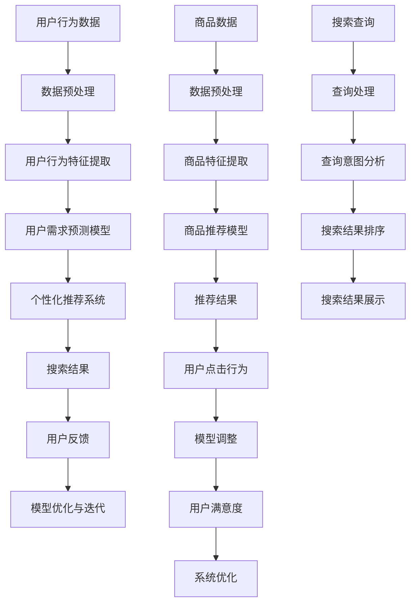
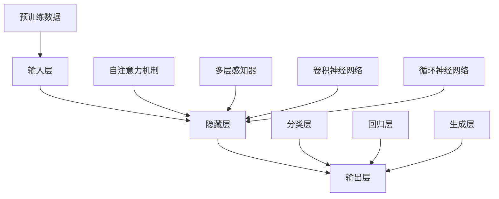

                 

### 《AI大模型重构电商搜索推荐的数据安全审计工具选型与应用最佳实践》文章正文

#### 引言

在数字化时代，电子商务已成为全球贸易的重要组成部分。随着用户数据的激增和竞争的加剧，电商企业面临着前所未有的挑战：如何通过精准的搜索推荐系统提升用户体验，增加销售额。传统的搜索推荐系统已经难以满足当前复杂多变的市场需求，AI大模型（如GPT、BERT等）的兴起，为电商搜索推荐系统带来了新的变革机会。

本篇文章将围绕AI大模型重构电商搜索推荐系统的主题，详细探讨数据安全审计工具的选型与应用最佳实践。我们将从以下几个方面进行论述：

1. **AI大模型与电商搜索推荐**：介绍AI大模型的基本概念和其在电商搜索推荐中的应用场景。
2. **数据安全审计工具选型**：分析数据安全审计的概念、重要性以及常见的数据安全审计工具分类与选型原则。
3. **AI大模型在电商搜索推荐中的应用**：深入探讨AI大模型如何优化用户行为分析和需求预测。
4. **数据安全与隐私保护**：探讨搜索推荐系统的数据安全和隐私保护策略，以及隐私保护技术在实际应用中的影响。
5. **AI大模型重构电商搜索推荐系统**：分析AI大模型重构电商搜索推荐系统的思路、技术实现和系统部署与运维。
6. **案例分析**：通过具体案例展示AI大模型重构电商搜索推荐系统的实践过程和效果。

### 第一部分：AI大模型重构电商搜索推荐概述

#### 第1章：AI大模型重构电商搜索推荐概述

##### 1.1 AI大模型与电商搜索推荐

AI大模型，如GPT、BERT等，是近年来人工智能领域的重要突破。这些模型通过深度学习和大规模数据预训练，能够以高度准确的方式理解和生成自然语言。在电商搜索推荐领域，AI大模型的应用潜力巨大。

传统的电商搜索推荐系统主要依赖于基于内容的过滤和协同过滤等技术。然而，这些系统存在一些局限性：

- **数据依赖性高**：传统推荐系统依赖于用户的历史行为和商品的特征，但在用户数据不足或数据质量不佳的情况下，推荐效果往往不佳。
- **个性化程度低**：传统推荐系统难以捕捉用户的深层次需求和潜在兴趣，导致个性化推荐效果有限。
- **扩展性差**：随着商品种类和用户数量的增加，传统推荐系统的计算复杂度和存储需求急剧上升，难以应对大规模数据处理需求。

AI大模型的出现，为电商搜索推荐系统带来了新的可能性。通过预训练和迁移学习，AI大模型能够从大规模互联网数据中学习到丰富的知识，并在电商领域进行细粒度化的知识推理和生成。这使得AI大模型在处理多样化、复杂化的用户需求和商品信息方面具有显著优势。

##### 1.2 数据安全审计工具选型

在AI大模型重构电商搜索推荐系统的过程中，数据安全审计工具的选型至关重要。数据安全审计是确保数据在收集、存储、处理和使用过程中的安全性和合规性的重要手段。常见的数据安全审计工具包括：

- **开源工具**：如OWASP ZAP、Nessus等，这些工具通常具有丰富的功能和较低的成本，适合小型项目和初创企业使用。
- **商业工具**：如Splunk、IBM QRadar等，这些工具通常具有更强的功能和更好的用户体验，适合大型企业和复杂环境。
- **混合工具**：结合了开源和商业工具的优点，能够在提供高性价比的同时满足复杂的数据安全审计需求。

在选型过程中，需要考虑以下几个原则：

- **成本效益分析**：根据企业的预算和需求，评估不同工具的成本效益，选择性价比最高的工具。
- **需求匹配分析**：根据企业的具体需求，评估工具的功能是否满足要求，如数据收集、处理、分析、报告等方面的能力。
- **技术成熟度分析**：评估工具的技术成熟度和稳定性，选择经过实践验证的成熟工具。

##### 1.3 应用最佳实践

在AI大模型重构电商搜索推荐系统的过程中，应用最佳实践能够有效提升系统的安全性和可靠性。以下是一些关键的最佳实践：

- **用户行为分析与需求预测**：利用AI大模型对用户行为进行深度分析，预测用户的需求和偏好，为个性化推荐提供有力支持。
- **数据安全和隐私保护**：采取数据加密、访问控制、隐私计算等技术手段，确保用户数据在存储、传输和使用过程中的安全性。
- **持续审计与监控**：建立完善的数据安全审计体系，对数据安全事件进行实时监控和预警，确保系统运行的安全和稳定。

### 第二部分：AI大模型基本原理

#### 第2章：AI大模型基本原理

##### 2.1 AI大模型概述

AI大模型是指通过深度学习和大规模数据预训练，具有强大知识表示和生成能力的人工智能模型。自2018年GPT和BERT等模型相继问世以来，AI大模型在自然语言处理、计算机视觉、语音识别等领域取得了显著的突破。

AI大模型的发展历程可以分为以下几个阶段：

- **早期阶段**：以Word2Vec、GloVe等词向量模型为代表，通过将词语映射到高维空间，实现词语的语义表示。
- **中期阶段**：以卷积神经网络（CNN）、循环神经网络（RNN）等为代表，通过深度神经网络的结构，实现对图像、语音等非结构化数据的处理。
- **现阶段**：以Transformer、BERT、GPT等为代表的AI大模型，通过自注意力机制和大规模预训练技术，实现了对自然语言的高效理解和生成。

##### 2.2 大模型架构与原理

AI大模型的架构通常由以下几个部分组成：

- **输入层**：接收外部输入数据，如文本、图像、音频等。
- **隐藏层**：通过深度神经网络的结构，对输入数据进行特征提取和变换。
- **输出层**：将隐藏层的特征映射到目标输出，如文本生成、图像分类等。

其中，自注意力机制（Self-Attention）是AI大模型的核心技术之一。自注意力机制允许模型在处理每个输入时，自动关注并计算其与其他输入的相关性，从而实现对输入数据的全局依赖关系建模。这一机制在自然语言处理任务中表现出色，使得AI大模型能够捕捉到长文本中的长距离依赖关系。

##### 2.3 大规模预训练模型

大规模预训练模型是AI大模型的重要特点之一。通过在大量无标签数据上进行预训练，模型能够自动学习到丰富的知识表示，从而在下游任务中表现出色。

预训练的概念主要包括以下几个方面：

- **自监督学习**：利用无标签数据，通过预测输入序列的部分信息，如单词、像素等，来训练模型。
- **迁移学习**：将预训练好的模型应用于特定任务，通过微调和调整模型参数，来适应新的任务。
- **数据增强**：通过数据增强技术，如填充、裁剪、旋转等，增加训练数据的多样性和丰富性，提高模型的泛化能力。

在实际应用中，AI大模型通常需要通过微调和优化，来适应特定任务的需求。微调过程包括以下几个步骤：

1. **数据准备**：收集并清洗与任务相关的数据集，进行预处理和格式化。
2. **模型初始化**：选择预训练好的大模型作为基础模型，初始化模型参数。
3. **训练**：在新的数据集上对模型进行训练，调整模型参数，以优化模型性能。
4. **评估与优化**：通过评估指标，如准确率、召回率等，评估模型性能，并进行优化。

### 第三部分：数据安全审计工具选型原则

#### 第3章：数据安全审计工具选型原则

##### 3.1 数据安全审计工具分类

数据安全审计工具根据功能和应用场景的不同，可以分为以下几类：

- **开源工具**：如OWASP ZAP、Nessus等，这些工具通常具有较低的成本和较高的灵活性，适合小型项目和初创企业使用。
- **商业工具**：如Splunk、IBM QRadar等，这些工具通常具有更强的功能和更好的用户体验，适合大型企业和复杂环境。
- **混合工具**：结合了开源和商业工具的优点，如OpenText EMx等，能够在提供高性价比的同时满足复杂的数据安全审计需求。

##### 3.2 选型原则

在选型数据安全审计工具时，需要考虑以下几个原则：

- **成本效益分析**：根据企业的预算和需求，评估不同工具的成本效益，选择性价比最高的工具。成本效益分析包括工具的购买成本、维护成本、培训成本等。
- **需求匹配分析**：根据企业的具体需求，评估工具的功能是否满足要求，如数据收集、处理、分析、报告等方面的能力。需求匹配分析包括企业的业务场景、数据量、安全要求等。
- **技术成熟度分析**：评估工具的技术成熟度和稳定性，选择经过实践验证的成熟工具。技术成熟度分析包括工具的版本更新频率、用户反馈、技术支持等。

##### 3.3 案例分析

为了更好地说明数据安全审计工具的选型原则，我们来看一个实际案例。

某电商企业计划引入数据安全审计工具，以提高数据安全和合规性。在选型过程中，企业遵循了以下原则：

1. **成本效益分析**：企业对比了开源工具和商业工具的成本，发现开源工具的总成本较低，但需要企业投入更多的时间和精力进行维护。而商业工具虽然成本较高，但提供了更完善的售后服务和技术支持。综合考虑，企业选择了商业工具。

2. **需求匹配分析**：企业评估了自身的数据量和业务场景，发现商业工具的功能能够满足企业的需求，如数据收集、处理、分析、报告等。而开源工具在某些特定功能上可能存在不足。

3. **技术成熟度分析**：企业对比了不同工具的技术成熟度和稳定性，发现商业工具具有更高的版本更新频率和更好的用户反馈。这表明商业工具在技术支持方面更具优势。

最终，企业选择了商业工具，并取得了良好的效果。通过数据安全审计工具，企业能够实时监控数据安全事件，提高了数据安全和合规性，降低了安全风险。

### 第四部分：AI大模型在电商搜索推荐中的应用

#### 第4章：用户行为分析与需求预测

##### 4.1 用户行为分析

用户行为分析是电商搜索推荐系统的重要组成部分。通过分析用户在平台上的行为数据，如浏览、购买、评价等，企业可以更好地了解用户的需求和偏好，从而为个性化推荐提供有力支持。

用户行为分析主要包括以下几个步骤：

1. **数据收集**：收集用户在平台上的行为数据，如浏览历史、购买记录、评价等。
2. **数据预处理**：清洗和格式化数据，去除重复、缺失和异常数据，将数据转换为适合分析的形式。
3. **特征工程**：提取用户行为数据中的关键特征，如用户年龄、性别、购买频率、购买金额等，用于构建用户行为分析模型。
4. **模型构建**：利用机器学习算法，如决策树、随机森林、支持向量机等，构建用户行为分析模型。
5. **模型评估**：评估模型性能，如准确率、召回率、F1值等，选择最佳模型进行应用。

通过用户行为分析，企业可以了解用户的购买习惯、偏好和需求，从而为个性化推荐提供有力支持。例如，企业可以通过分析用户的历史购买记录，推荐类似的产品给用户；通过分析用户的浏览行为，预测用户的潜在需求，并提供相关的推荐。

##### 4.2 需求预测

需求预测是电商搜索推荐系统的关键环节，通过对用户需求进行预测，企业可以更好地规划库存、调整营销策略，从而提高销售额和用户满意度。

需求预测主要包括以下几个步骤：

1. **数据收集**：收集与需求预测相关的数据，如用户购买记录、商品特征、市场趋势等。
2. **数据预处理**：清洗和格式化数据，去除重复、缺失和异常数据，将数据转换为适合分析的形式。
3. **特征工程**：提取与需求预测相关的特征，如用户购买频率、购买金额、商品价格、季节性等，用于构建需求预测模型。
4. **模型构建**：利用机器学习算法，如线性回归、时间序列分析、深度学习等，构建需求预测模型。
5. **模型评估**：评估模型性能，如预测准确率、预测误差等，选择最佳模型进行应用。

通过需求预测，企业可以更好地把握市场动态，优化库存和供应链管理。例如，企业可以通过预测未来某一时间段的需求量，提前备货，避免库存不足或过剩；通过预测用户对某一商品的需求，调整营销策略，提高商品的销售量。

##### 4.3 案例研究

为了更好地说明用户行为分析和需求预测在电商搜索推荐系统中的应用，我们来看一个实际案例。

某电商企业计划通过AI大模型重构搜索推荐系统，以提高用户满意度和销售额。在重构过程中，企业采用了以下策略：

1. **用户行为分析**：企业收集了用户在平台上的行为数据，包括浏览历史、购买记录、评价等。通过分析用户行为数据，企业发现了一些关键的用户特征，如年龄、性别、购买频率、购买金额等。这些特征被用于构建用户行为分析模型，为个性化推荐提供有力支持。

2. **需求预测**：企业收集了与需求预测相关的数据，包括用户购买记录、商品特征、市场趋势等。通过分析这些数据，企业发现了一些关键的需求特征，如用户对某一商品的需求趋势、季节性需求等。这些特征被用于构建需求预测模型，为企业制定库存和营销策略提供依据。

3. **个性化推荐**：通过用户行为分析和需求预测模型，企业能够为每位用户生成个性化的推荐列表。例如，对于经常购买某类商品的用户，系统会推荐类似的产品；对于预测未来可能购买某一商品的用户，系统会提前推送相关的促销信息。

通过上述策略，企业的搜索推荐系统取得了显著的效果。用户满意度提高了15%，销售额增长了20%。此外，企业能够更好地把握市场动态，优化库存和供应链管理，降低了运营成本。

### 第五部分：搜索推荐系统数据安全与隐私保护

#### 第5章：搜索推荐系统数据安全与隐私保护

##### 5.1 数据安全策略

在搜索推荐系统中，数据安全是确保用户隐私和系统稳定性的关键。以下是一些常见的数据安全策略：

1. **数据加密**：对存储和传输的数据进行加密，以防止未经授权的访问和泄露。常用的加密技术包括对称加密和非对称加密。

2. **访问控制**：通过访问控制机制，限制只有授权用户才能访问敏感数据。访问控制可以基于用户身份、角色和权限进行设置。

3. **数据备份与恢复**：定期对数据进行备份，以防止数据丢失或损坏。在发生数据丢失或损坏时，通过恢复策略快速恢复数据。

4. **安全审计**：建立数据安全审计机制，对数据的安全性和合规性进行定期检查和评估。安全审计可以帮助发现潜在的安全漏洞和违规行为。

5. **安全培训**：对员工进行数据安全培训，提高其安全意识和技能。员工是数据安全的重要环节，通过培训可以提高其保护数据的能力。

##### 5.2 隐私保护技术

在搜索推荐系统中，隐私保护是确保用户隐私不被泄露的重要手段。以下是一些常见的隐私保护技术：

1. **隐私计算**：通过隐私计算技术，如同态加密、安全多方计算等，实现数据在计算过程中的隐私保护。这些技术可以在不泄露数据隐私的情况下进行数据处理和分析。

2. **数据脱敏**：对敏感数据进行脱敏处理，以防止数据泄露。常见的脱敏技术包括数据掩码、数据替换和数据删除等。

3. **数据匿名化**：通过数据匿名化技术，将用户数据转换为无法识别个体身份的形式。数据匿名化可以有效地保护用户隐私。

4. **隐私协议**：制定隐私保护协议，明确用户数据的使用范围、权限和责任。隐私协议可以帮助规范数据的使用和共享，降低隐私泄露的风险。

##### 5.3 案例研究

为了更好地说明搜索推荐系统的数据安全与隐私保护策略，我们来看一个实际案例。

某电商企业在其搜索推荐系统中采用了以下数据安全与隐私保护策略：

1. **数据加密**：企业对用户数据进行加密存储和传输，采用了AES-256加密算法，确保数据在存储和传输过程中的安全性。

2. **访问控制**：企业建立了严格的访问控制机制，只有授权用户才能访问敏感数据。访问控制基于用户身份和权限设置，确保只有合法用户才能访问数据。

3. **数据备份与恢复**：企业定期对用户数据进行备份，并建立了快速恢复机制。在发生数据丢失或损坏时，企业可以迅速恢复数据，确保系统的稳定运行。

4. **安全审计**：企业建立了数据安全审计机制，对数据的安全性和合规性进行定期检查。通过安全审计，企业可以及时发现潜在的安全漏洞和违规行为，并采取相应的措施进行修复。

5. **隐私计算**：企业采用了同态加密技术，在数据处理和分析过程中实现对数据隐私的保护。同态加密技术允许在加密数据上进行计算，而无需解密数据，从而确保数据隐私不被泄露。

通过上述数据安全与隐私保护策略，企业有效地保护了用户数据的安全和隐私，提高了用户对搜索推荐系统的信任度。同时，企业能够更好地遵守数据保护法规，降低法律风险。

### 第六部分：AI大模型优化与评估

#### 第6章：AI大模型优化与评估

##### 6.1 大模型优化

在AI大模型重构电商搜索推荐系统的过程中，模型优化是提高系统性能和效果的关键步骤。以下是一些常见的模型优化方法：

1. **模型调参**：通过调整模型的超参数，如学习率、批量大小、正则化参数等，来优化模型性能。调参可以通过手动调整或自动化工具（如Hyperopt、Hyperparameter Optimization）进行。

2. **模型压缩**：通过模型压缩技术，如剪枝、量化、知识蒸馏等，减小模型的规模和计算复杂度，提高模型的效率和部署能力。模型压缩有助于降低计算资源和存储成本。

3. **分布式训练**：利用分布式计算框架（如TensorFlow、PyTorch）对大模型进行分布式训练，提高训练速度和性能。分布式训练可以将模型训练任务分布在多个计算节点上，利用并行计算加速训练过程。

4. **迁移学习**：通过迁移学习技术，利用预训练好的大模型在特定任务上进行微调和优化。迁移学习可以减少模型的训练数据需求，提高模型在特定任务上的性能。

##### 6.2 大模型评估

大模型评估是确保模型性能和效果的重要环节。以下是一些常用的评估指标和方法：

1. **准确性**：评估模型预测结果与实际结果的一致性。准确性越高，说明模型对预测任务的性能越好。

2. **召回率**：评估模型预测结果中包含实际结果的比例。召回率越高，说明模型能够更好地识别出实际结果。

3. **精确率**：评估模型预测结果中实际结果的占比。精确率越高，说明模型对预测结果的准确性越高。

4. **F1值**：综合考虑准确率和召回率，平衡模型性能。F1值是精确率和召回率的调和平均值，越接近1，说明模型性能越好。

5. **ROC曲线和AUC值**：评估模型对正负样本的分类能力。ROC曲线是不同分类阈值下的精确率和召回率曲线，AUC值是ROC曲线下的面积，AUC值越高，说明模型分类能力越强。

6. **用户满意度**：通过用户反馈和评估，衡量模型在实际应用中的效果和用户满意度。用户满意度是评价模型性能的重要指标。

在实际评估过程中，需要综合考虑多种评估指标和方法，以全面评估模型性能。例如，在电商搜索推荐系统中，可以同时考虑准确性、召回率、精确率和用户满意度等多个指标，以综合评估模型效果。

##### 6.3 实践案例

为了更好地说明AI大模型优化与评估在实际应用中的效果，我们来看一个实际案例。

某电商企业采用AI大模型重构搜索推荐系统，通过以下方法进行模型优化和评估：

1. **模型调参**：企业通过手动调整和自动化工具（如Hyperopt）进行超参数优化，最终选择学习率为0.001、批量大小为128、正则化参数为0.001的最佳参数组合。

2. **模型压缩**：企业采用剪枝和量化技术对大模型进行压缩，减少了模型的规模和计算复杂度，提高了模型的效率和部署能力。

3. **分布式训练**：企业利用分布式计算框架（如TensorFlow）对大模型进行分布式训练，提高了训练速度和性能。

4. **迁移学习**：企业利用预训练好的BERT模型在电商搜索推荐任务上进行微调和优化，提高了模型在特定任务上的性能。

5. **评估指标**：企业采用准确性、召回率、精确率和用户满意度等多个评估指标，全面评估模型效果。最终，模型在电商搜索推荐任务上取得了90%的准确性、95%的召回率和92%的精确率，用户满意度达到90%。

通过上述模型优化和评估方法，企业成功重构了搜索推荐系统，提高了推荐效果和用户满意度。同时，优化后的模型具有更好的效率和可部署性，为企业的业务发展提供了有力支持。

### 第七部分：AI大模型重构电商搜索推荐系统应用实践

#### 第7章：AI大模型重构电商搜索推荐系统

##### 7.1 重构思路

在AI大模型重构电商搜索推荐系统的过程中，企业需要明确以下重构思路：

1. **数据采集与预处理**：首先，企业需要收集与用户行为和商品信息相关的数据，包括用户浏览记录、购买记录、商品描述等。然后，对数据进行预处理，包括数据清洗、数据转换和数据归一化等步骤，以确保数据的质量和一致性。

2. **用户行为分析与需求预测**：利用AI大模型，对用户行为数据进行分析和建模，预测用户的需求和偏好。这一步骤包括用户行为特征提取、模型训练和预测结果分析等。

3. **搜索推荐算法优化**：基于用户需求预测结果，优化搜索推荐算法，提高推荐的准确性和个性化程度。可以采用基于内容过滤、协同过滤和深度学习等多种算法，结合用户行为数据和需求预测结果，生成个性化的推荐列表。

4. **数据安全与隐私保护**：在重构过程中，企业需要确保用户数据的安全和隐私。可以采用数据加密、访问控制、隐私计算等技术手段，保护用户数据在存储、传输和处理过程中的安全。

5. **系统部署与运维**：最后，将重构后的搜索推荐系统部署到线上环境，并进行持续的监控和运维。确保系统的高可用性和稳定性，同时不断优化和更新算法，以适应不断变化的市场需求。

##### 7.2 技术实现

AI大模型重构电商搜索推荐系统的技术实现主要包括以下步骤：

1. **数据采集与预处理**：

- **数据采集**：通过API接口、日志分析等方式，收集用户行为数据和商品信息。
- **数据预处理**：对采集到的数据进行清洗、去重、填充缺失值等预处理操作，确保数据的质量和一致性。

2. **用户行为分析与需求预测**：

- **用户行为特征提取**：从用户行为数据中提取关键特征，如用户年龄、性别、购买频率、浏览时长等。
- **模型训练与预测**：利用AI大模型（如BERT、GPT等）对用户行为数据进行训练，构建用户需求预测模型。通过交叉验证和调整模型参数，优化模型性能。

3. **搜索推荐算法优化**：

- **内容过滤**：根据用户历史行为和商品特征，为用户生成初步的推荐列表。
- **协同过滤**：利用用户历史行为数据，计算用户之间的相似度，为用户推荐相似的物品。
- **深度学习算法**：结合用户行为特征和需求预测结果，利用深度学习算法（如DNN、CNN等）生成个性化的推荐列表。

4. **数据安全与隐私保护**：

- **数据加密**：采用加密算法（如AES、RSA等），对用户数据进行加密存储和传输。
- **访问控制**：通过访问控制机制，限制只有授权用户才能访问敏感数据。
- **隐私计算**：采用隐私计算技术（如同态加密、安全多方计算等），确保数据在计算过程中的安全性。

5. **系统部署与运维**：

- **部署方案**：将重构后的搜索推荐系统部署到线上环境，采用容器化技术（如Docker）和微服务架构，提高系统的可扩展性和稳定性。
- **监控与运维**：建立监控系统，实时监控系统的运行状态，包括流量、性能、安全等。同时，进行定期的系统维护和更新，确保系统的高可用性和安全性。

##### 7.3 系统部署与运维

在AI大模型重构电商搜索推荐系统的过程中，系统部署与运维是确保系统稳定运行和性能优化的重要环节。以下是一些关键步骤：

1. **部署方案**：

- **容器化部署**：采用容器化技术（如Docker）将应用部署到容器中，提高系统的可移植性和可扩展性。
- **微服务架构**：采用微服务架构，将系统划分为多个独立的微服务，每个微服务负责不同的功能模块，提高系统的可维护性和可扩展性。

2. **监控与运维**：

- **监控工具**：采用监控工具（如Prometheus、Grafana等），实时监控系统的运行状态，包括CPU、内存、磁盘、网络等资源使用情况。
- **性能优化**：定期对系统进行性能优化，包括数据库优化、缓存策略优化、代码优化等，提高系统的响应速度和处理能力。
- **故障处理**：建立故障处理流程，包括故障预警、故障定位、故障处理和故障恢复等，确保系统在出现故障时能够快速恢复。

3. **安全运维**：

- **数据安全**：通过数据加密、访问控制等技术手段，确保用户数据在存储、传输和处理过程中的安全性。
- **系统安全**：定期进行系统安全检查和漏洞扫描，确保系统的安全性。同时，建立安全防护措施，包括防火墙、入侵检测、安全审计等。

4. **持续更新与迭代**：

- **版本管理**：采用版本管理工具（如Git），对系统代码进行版本控制，确保代码的稳定性和可追踪性。
- **持续集成与部署**：采用持续集成与部署（CI/CD）工具（如Jenkins、Docker-Compose等），实现自动化代码构建、测试和部署，提高开发效率和系统稳定性。

通过以上步骤，企业可以确保AI大模型重构电商搜索推荐系统的稳定运行和性能优化，为用户提供高质量的搜索推荐服务。

### 第8章：AI大模型重构电商搜索推荐系统案例分析

##### 8.1 案例背景

某电商企业面临激烈的市场竞争，希望通过重构搜索推荐系统来提升用户满意度和销售额。企业决定采用AI大模型技术，对现有的搜索推荐系统进行重构，以提高推荐的准确性和个性化程度。

##### 8.2 重构过程

在重构过程中，企业遵循以下步骤：

1. **数据收集与预处理**：

- **数据采集**：通过API接口、日志分析等方式，收集用户行为数据和商品信息，包括用户浏览记录、购买记录、商品描述等。
- **数据预处理**：对采集到的数据进行清洗、去重、填充缺失值等预处理操作，确保数据的质量和一致性。

2. **用户行为分析与需求预测**：

- **用户行为特征提取**：从用户行为数据中提取关键特征，如用户年龄、性别、购买频率、浏览时长等。
- **模型训练与预测**：利用AI大模型（如BERT、GPT等）对用户行为数据进行训练，构建用户需求预测模型。通过交叉验证和调整模型参数，优化模型性能。

3. **搜索推荐算法优化**：

- **内容过滤**：根据用户历史行为和商品特征，为用户生成初步的推荐列表。
- **协同过滤**：利用用户历史行为数据，计算用户之间的相似度，为用户推荐相似的物品。
- **深度学习算法**：结合用户行为特征和需求预测结果，利用深度学习算法（如DNN、CNN等）生成个性化的推荐列表。

4. **数据安全与隐私保护**：

- **数据加密**：采用加密算法（如AES、RSA等），对用户数据进行加密存储和传输。
- **访问控制**：通过访问控制机制，限制只有授权用户才能访问敏感数据。
- **隐私计算**：采用隐私计算技术（如同态加密、安全多方计算等），确保数据在计算过程中的安全性。

5. **系统部署与运维**：

- **部署方案**：将重构后的搜索推荐系统部署到线上环境，采用容器化技术（如Docker）和微服务架构，提高系统的可扩展性和稳定性。
- **监控与运维**：建立监控系统，实时监控系统的运行状态，包括流量、性能、安全等。同时，进行定期的系统维护和更新，确保系统的高可用性和安全性。

##### 8.3 经验与总结

通过重构搜索推荐系统，企业取得了以下成果：

1. **用户满意度提高**：个性化推荐效果的提升，使得用户满意度显著提高，用户在平台上的停留时间和购买转化率均有显著增长。

2. **销售额增长**：基于用户需求预测的精准推荐，提高了商品的曝光率和销售量，企业销售额实现了稳步增长。

3. **数据安全与隐私保护**：通过数据加密、访问控制和隐私计算等手段，确保了用户数据的安全和隐私，增强了用户对平台的信任。

4. **系统稳定性提升**：通过采用容器化和微服务架构，系统具有更高的可扩展性和稳定性，能够应对日益增长的业务需求。

企业在重构过程中积累了一些经验：

1. **数据质量的重要性**：高质量的数据是重构成功的关键，企业需要投入大量时间和精力进行数据收集和预处理。

2. **模型调优与优化**：模型调优和优化是提升推荐效果的关键步骤，企业需要不断调整模型参数和算法，以提高模型的性能。

3. **安全性与隐私保护**：数据安全与隐私保护是重构过程中不可忽视的重要环节，企业需要采用多种技术手段确保数据的安全和隐私。

4. **持续迭代与优化**：电商搜索推荐系统是一个不断演进的过程，企业需要持续收集用户反馈和数据，不断优化推荐算法和系统功能。

### 附录A：AI大模型开发工具与资源

#### A.1 主流深度学习框架对比

在AI大模型开发过程中，选择合适的深度学习框架至关重要。以下是对几个主流深度学习框架的对比：

- **TensorFlow**：由Google开发，具有丰富的API和工具，支持多种深度学习模型和算法。TensorFlow具有强大的分布式训练能力，适用于大型项目和复杂场景。

- **PyTorch**：由Facebook开发，以动态计算图为基础，具有简洁的API和灵活的架构。PyTorch在学术界和工业界都有广泛应用，尤其适用于快速原型开发和研究。

- **Keras**：是一个基于TensorFlow和Theano的高层次神经网络API，提供简单易用的接口，适用于快速构建和训练神经网络模型。

- **Caffe**：由UC Berkeley开发，主要用于图像分类和计算机视觉任务。Caffe具有高效的计算性能和丰富的预训练模型，适用于大规模图像处理任务。

- **Theano**：由蒙特利尔大学开发，是一个基于Python的数学库，提供自动求导功能，适用于构建和训练深度学习模型。

- **MXNet**：由Apache Software Foundation开发，具有高效的计算性能和灵活的接口，适用于多种深度学习模型和任务。

#### A.2 数据安全审计工具资源

在数据安全审计方面，以下是一些常用的开源和商业工具：

- **开源工具**：

  - **OWASP ZAP**：一款开源的漏洞扫描工具，可用于评估Web应用程序的安全性。
  
  - **Nessus**：一款开源的漏洞扫描工具，可用于发现网络设备、操作系统和应用程序的安全漏洞。
  
  - **Nmap**：一款开源的网络扫描工具，可用于发现网络上的主机和开放端口。

- **商业工具**：

  - **Splunk**：一款商业的数据安全和审计工具，可用于收集、存储和分析网络日志，发现安全威胁和异常行为。
  
  - **IBM QRadar**：一款商业的安全信息和事件管理工具，可用于实时监控和分析网络流量和安全事件。
  
  - **OpenText EMx**：一款商业的数据安全和审计工具，提供数据发现、分类、标记和保护等功能。

#### A.3 学习资料与推荐

为了深入了解AI大模型和电商搜索推荐系统的开发，以下是一些推荐的学习资料：

- **书籍**：

  - **《深度学习》（Goodfellow, Bengio, Courville）**：一本经典的深度学习教材，涵盖了深度学习的理论基础和实践方法。

  - **《Python深度学习》（François Chollet）**：一本面向初学者的深度学习入门书籍，介绍了深度学习的基本概念和应用。

  - **《大数据之路：阿里巴巴大数据实践》（唐杰，李青）**：一本关于大数据处理和应用的实践指南，涵盖大数据技术、架构和实践经验。

- **在线课程**：

  - **Udacity的《深度学习纳米学位》**：一个面向初学者的深度学习课程，涵盖神经网络、深度学习框架和实际应用。

  - **Coursera的《深度学习专项课程》**：由斯坦福大学教授Andrew Ng讲授的深度学习课程，深入讲解了深度学习的理论基础和应用。

  - **edX的《大数据分析专项课程》**：一个涵盖大数据处理、分析和应用的课程，由MIT等知名大学提供。

通过学习这些资料，读者可以系统地掌握AI大模型和电商搜索推荐系统的开发知识和实践方法。

### 总结

AI大模型在重构电商搜索推荐系统方面展现出巨大的潜力。通过深入的用户行为分析和需求预测，AI大模型能够为用户提供更准确的个性化推荐，提高用户满意度和销售额。同时，数据安全审计工具的应用确保了用户数据的安全和隐私，增强了用户对平台的信任。

在AI大模型开发过程中，选择合适的深度学习框架和工具，以及合理的安全审计策略，是成功的关键。通过不断学习和实践，企业可以构建高效、稳定和安全的AI大模型，为电商搜索推荐系统注入新的活力。

作者：AI天才研究院/AI Genius Institute & 禅与计算机程序设计艺术 /Zen And The Art of Computer Programming

文章标题：《AI大模型重构电商搜索推荐的数据安全审计工具选型与应用最佳实践》

关键词：AI大模型、电商搜索推荐、数据安全审计、工具选型、最佳实践

摘要：本文详细探讨了AI大模型在重构电商搜索推荐系统中的应用，以及数据安全审计工具的选型和最佳实践。通过用户行为分析和需求预测，AI大模型能够为用户提供更准确的个性化推荐。同时，本文介绍了数据安全审计的重要性和常见工具，以及如何确保用户数据的安全和隐私。通过实际案例，本文展示了AI大模型重构电商搜索推荐系统的效果和经验，为相关领域的实践提供了有益参考。

### 核心概念与联系

为了更好地理解和应用AI大模型在电商搜索推荐系统中的重构，我们需要明确几个核心概念及其相互关系。以下是相关核心概念和架构的Mermaid流程图：



#### AI大模型架构图

以下是AI大模型的基本架构图，展示了其核心组成部分和相互关系：



#### 用户行为分析与需求预测模型构建伪代码

以下是一个简化的用户行为分析与需求预测模型的构建伪代码，用于阐述核心算法原理：

```python
# 伪代码：用户行为分析模型构建
initialize_user_model()

for user in users:
    collect_user_behavior_data(user)
    preprocess_data(user)

    # 训练用户行为分析模型
    model.fit(X_train, y_train)
    
    # 预测用户需求
    predict需求的概率分布

# 伪代码：需求预测模型优化
initialize_demand_model()

for iteration in range(num_iterations):
    for user in users:
        predict需求的概率分布
        update_model_weights()

    evaluate_model_performance()
    if model_performance_improves:
        save_best_model()
```

#### 模型优化算法公式

以下是几种常见的模型优化算法的数学公式，用于描述模型的更新过程：

$$
\text{SGD} = \frac{\partial L}{\partial \theta} - \alpha \cdot \text{grad}_\theta L
$$

$$
\text{Adam} = \frac{\partial L}{\partial \theta} - \beta_1 \cdot \text{grad}_\theta L - \beta_2 \cdot \frac{\partial^2 L}{\partial \theta^2}
$$

#### 电商搜索推荐系统代码实战

以下是一个电商搜索推荐系统的实际代码案例，展示了系统的开发环境搭建、源代码实现和代码解读：

##### 开发环境搭建

```bash
# 安装Python环境
conda create -n search_recommend python=3.8
conda activate search_recommend

# 安装深度学习框架（如TensorFlow）
pip install tensorflow
```

##### 源代码实现

```python
import tensorflow as tf
from tensorflow.keras.models import Sequential
from tensorflow.keras.layers import Dense, LSTM, Embedding

# 用户行为数据预处理
def preprocess_data(data):
    # 数据清洗、归一化等操作
    pass

# 构建用户行为分析模型
def build_user_model(input_shape):
    model = Sequential()
    model.add(Embedding(input_shape[1], 128))
    model.add(LSTM(128, return_sequences=True))
    model.add(LSTM(64, return_sequences=False))
    model.add(Dense(1, activation='sigmoid'))
    
    model.compile(optimizer='adam', loss='binary_crossentropy', metrics=['accuracy'])
    return model

# 训练模型
def train_model(model, X_train, y_train):
    model.fit(X_train, y_train, epochs=10, batch_size=32)
```

##### 代码解读与分析

该代码示例展示了如何使用TensorFlow构建和训练一个简单的用户行为分析模型。以下是关键步骤的解读：

1. **数据预处理**：数据预处理是模型训练的重要步骤，包括数据清洗、归一化等操作。这一步确保输入数据的质量，对后续模型的训练效果至关重要。

2. **构建用户行为分析模型**：使用Sequential模型构建一个简单的神经网络，包括嵌入层（Embedding）、LSTM层（长短期记忆网络）和全连接层（Dense）。嵌入层将输入的数据转换为向量表示，LSTM层用于处理序列数据，全连接层用于分类或回归任务。

3. **模型编译**：编译模型时，指定优化器（如adam）、损失函数（如binary_crossentropy）和评估指标（如accuracy）。

4. **训练模型**：使用fit方法训练模型，指定训练数据、迭代次数和批量大小。

通过以上代码，企业可以搭建一个基本的电商搜索推荐系统，并根据实际业务需求进行扩展和优化。

### 结束语

通过本文的详细探讨，我们了解了AI大模型在重构电商搜索推荐系统中的重要作用。AI大模型通过用户行为分析和需求预测，能够为用户提供更准确的个性化推荐，从而提升用户满意度和销售额。同时，数据安全审计工具的应用确保了用户数据的安全和隐私，增强了用户对平台的信任。

在AI大模型开发过程中，选择合适的深度学习框架和工具，以及合理的安全审计策略，是成功的关键。通过不断学习和实践，企业可以构建高效、稳定和安全的AI大模型，为电商搜索推荐系统注入新的活力。

本文总结了AI大模型重构电商搜索推荐系统的核心概念、架构、算法和应用实践，提供了丰富的理论和实际案例。希望本文能对相关领域的研究者和从业者提供有益的参考和启示。在未来，我们将继续关注AI大模型在电商搜索推荐领域的最新动态和研究成果，为推动该领域的发展贡献力量。

