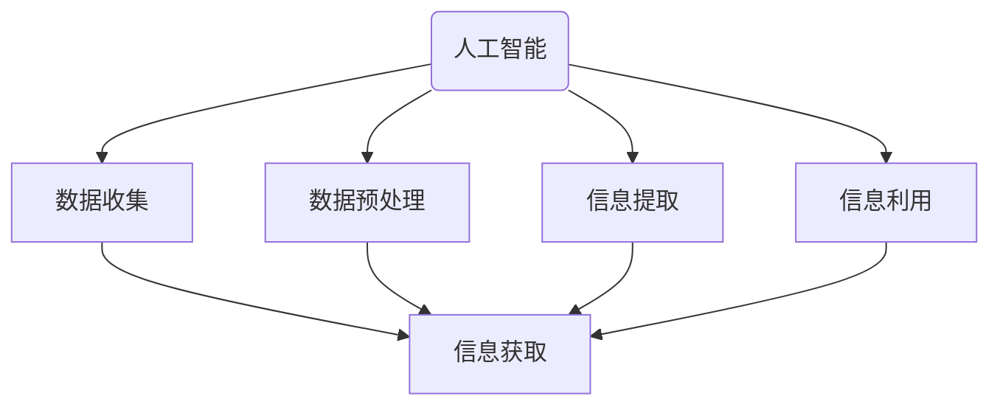
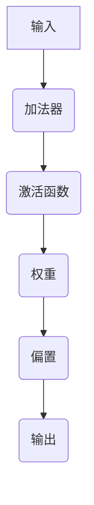
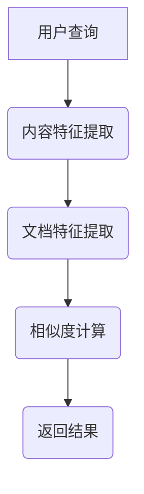
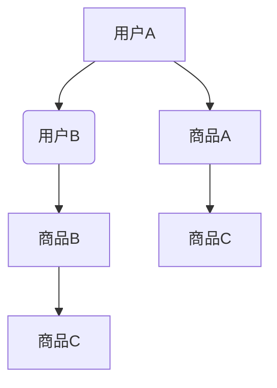
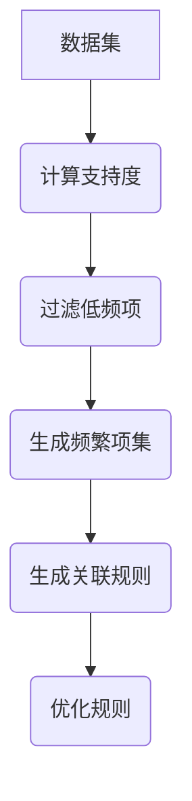
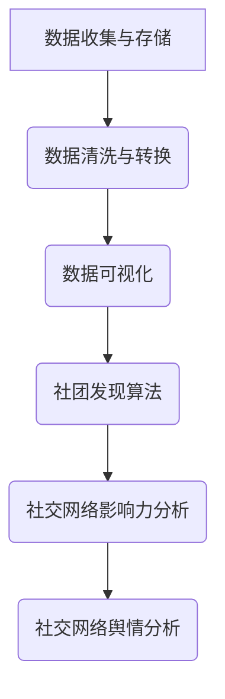
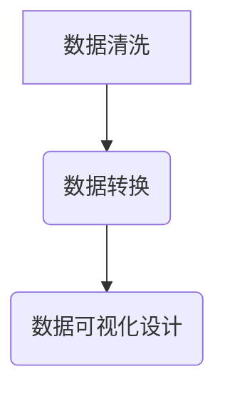

                 

### 第1章：AI概述与信息获取

#### 1.1 AI的定义与发展历程

人工智能（Artificial Intelligence，简称AI）是一门通过模拟、延伸和扩展人类智能的研究领域。它旨在构建能够执行人类智能任务的计算机系统。AI的定义多种多样，其中最广泛接受的定义来自于人工智能协会（AAAI），他们将AI定义为“使计算机系统能够执行需要人类智能的任务的科学和工程领域”。

AI的发展历程可以分为几个阶段：

1. **初始阶段（1950s-1960s）**：在这一阶段，人工智能的概念被首次提出，并开始了一些基础的算法和理论的研究。

2. **繁荣阶段（1970s-1980s）**：在这一阶段，AI领域经历了一段繁荣时期，研究主要集中在专家系统和逻辑推理上。

3. **低谷阶段（1990s）**：由于技术限制和实际应用的不足，AI领域进入了一个低谷期。

4. **复兴阶段（2000s-现在）**：随着计算能力的提升、大数据和深度学习技术的进步，AI领域再次迎来繁荣，并广泛应用于各个行业。

#### 1.2 信息获取的基本概念

信息获取是指从各种来源收集、处理和利用信息的过程。信息获取的关键环节包括：

- **数据收集**：从各种渠道收集原始数据，如传感器、互联网、数据库等。

- **数据预处理**：对收集到的数据进行清洗、整合、转换等处理，以便后续分析。

- **信息提取**：从预处理后的数据中提取有用的信息，如关键词、主题、模式等。

- **信息利用**：将提取到的信息用于决策、优化、预测等。

#### 1.3 AI与信息获取的关系

AI与信息获取有着密切的联系，主要表现在以下几个方面：

1. **数据收集与预处理**：AI技术可以自动收集和预处理大量数据，提高信息获取的效率和质量。

2. **信息提取与利用**：AI算法可以帮助从大量数据中提取有用的信息，并利用这些信息进行决策和优化。

3. **个性化推荐**：基于用户行为和偏好，AI可以为用户提供个性化的信息推荐，提高信息获取的精准度。

4. **实时分析**：AI技术可以实时分析大量数据，帮助用户快速获取关键信息。

#### 1.4 AI信息获取的重要性

AI信息获取在现代社会中具有重要性，主要体现在以下几个方面：

1. **提高决策效率**：通过快速获取和分析信息，帮助企业和组织做出更准确的决策。

2. **优化资源分配**：AI可以帮助企业更好地了解市场和客户需求，从而优化资源分配和产品开发。

3. **提升用户体验**：个性化推荐和实时分析可以帮助用户更快地获取所需信息，提高用户体验。

4. **促进创新**：AI技术可以帮助企业和科研机构发现新的研究机会和解决方案。

#### 图1.1 AI与信息获取的关系

**总结**：本章介绍了AI的定义与发展历程，信息获取的基本概念，以及AI与信息获取的关系。AI在信息获取中的应用极大地提升了数据的处理效率和信息提取的准确性，对现代社会的各个方面都产生了深远的影响。

---

**接下来，我们将深入探讨AI技术的基础，包括数据收集与预处理、机器学习算法简介和深度学习与神经网络。**<|im_end|>### 第2章：AI技术基础

#### 2.1 数据收集与预处理

数据收集与预处理是AI领域中的关键步骤，直接影响着后续分析的质量和效果。以下将详细探讨数据收集的来源、数据预处理的方法以及数据质量控制。

##### 2.1.1 数据来源

数据来源可以分为以下几类：

1. **公开数据集**：这些数据集通常由学术机构、政府部门或大型公司提供，例如UCI机器学习库、Kaggle等。

2. **社交媒体数据**：社交媒体平台（如Twitter、Facebook等）提供了大量的用户生成数据，可用于情感分析、趋势预测等。

3. **企业内部数据**：企业内部积累的数据，如客户关系管理（CRM）系统、销售数据等。

4. **传感器数据**：各种传感器（如GPS、温度传感器、心率传感器等）收集的数据，可用于环境监测、健康监测等。

##### 2.1.2 数据预处理方法

数据预处理是使数据适合模型训练的关键步骤，主要包括以下几个环节：

1. **数据清洗**：去除重复数据、处理缺失值、去除噪声数据等。

2. **数据整合**：将多个来源的数据进行整合，使其成为一个统一的数据集。

3. **数据转换**：将数据转换为适合模型训练的格式，例如归一化、标准化等。

4. **特征提取**：从原始数据中提取出对模型训练有用的特征，例如文本中的关键词、图像中的边缘等。

##### 2.1.3 数据质量控制

数据质量控制是确保数据质量的一系列措施，主要包括以下几个方面：

1. **数据一致性**：确保数据在不同来源、不同时间点的一致性。

2. **数据完整性**：确保数据没有丢失或缺失。

3. **数据准确性**：通过数据清洗、校验等措施确保数据的准确性。

4. **数据可解释性**：确保数据可以被理解和解释，以便后续分析。

#### 2.2 机器学习算法简介

机器学习（Machine Learning，简称ML）是AI的核心技术之一，通过让计算机从数据中自动学习规律，从而进行预测和决策。以下简要介绍几种常见的机器学习算法。

##### 2.2.1 监督学习

监督学习（Supervised Learning）是一种最常见的机器学习范式，其特点是需要有标记的数据进行训练。监督学习的目标是通过标记数据学习出一个映射函数，从而对新数据进行预测。

- **线性回归**：一种简单的监督学习算法，用于预测连续值输出。

- **逻辑回归**：一种用于预测分类结果的算法，适用于二分类问题。

- **支持向量机（SVM）**：通过寻找最优超平面将不同类别数据分开，适用于二分类和多分类问题。

##### 2.2.2 无监督学习

无监督学习（Unsupervised Learning）不需要标记的数据进行训练，其目标是从未标记的数据中自动发现数据间的模式和结构。

- **聚类算法**：用于将数据分为多个类，如K-means、DBSCAN等。

- **降维算法**：用于降低数据维度，如PCA（主成分分析）、t-SNE等。

##### 2.2.3 强化学习

强化学习（Reinforcement Learning，简称RL）是一种通过试错学习策略的机器学习范式，其目标是通过不断与环境交互，学习出最优策略。

- **Q学习**：通过学习Q值（即某个状态下的动作值）来决定下一步动作。

- **深度强化学习**：将深度学习与强化学习结合，用于解决复杂决策问题。

#### 2.3 深度学习与神经网络

深度学习（Deep Learning，简称DL）是机器学习的一个重要分支，通过构建多层神经网络来模拟人类大脑的决策过程。以下简要介绍深度学习的基本概念和常见网络结构。

##### 2.3.1 神经网络基础

神经网络（Neural Network，简称NN）是一种模拟生物神经系统的计算模型，其基本单元是神经元。

- **神经元结构**：每个神经元接收多个输入，通过加权求和后经过激活函数输出。

- **激活函数**：常用的激活函数有Sigmoid、ReLU等。

##### 2.3.2 卷积神经网络

卷积神经网络（Convolutional Neural Network，简称CNN）是一种专门用于处理图像数据的深度学习模型。

- **卷积层**：用于提取图像的特征。

- **池化层**：用于降低特征图的维度。

- **全连接层**：用于进行分类和回归等任务。

##### 2.3.3 循环神经网络

循环神经网络（Recurrent Neural Network，简称RNN）是一种能够处理序列数据的神经网络。

- **循环结构**：每个时间步的输出作为下一个时间步的输入。

- **门控机制**：如LSTM（长短期记忆网络）和GRU（门控循环单元），用于解决RNN的梯度消失问题。

#### 图2.1 神经网络结构

**总结**：本章介绍了AI技术的基础，包括数据收集与预处理、机器学习算法和深度学习与神经网络。这些技术为AI在信息获取中的应用提供了强大的支持，使得我们能够更有效地处理和利用大量数据。

---

**接下来，我们将探讨AI在信息检索中的应用，从信息检索基础、基于内容的检索和基于机器学习的检索三个方面进行详细阐述。**<|im_end|>### 第3章：AI在信息检索中的应用

#### 3.1 信息检索基础

信息检索（Information Retrieval，简称IR）是指从大量的信息资源中查找和获取特定信息的过程。它是一门交叉学科，结合了计算机科学、信息科学、认知科学和统计学等多个领域。信息检索系统是支持信息检索的工具和平台，主要包括搜索引擎、数字图书馆、知识库等。

##### 3.1.1 信息检索系统

信息检索系统的核心组成部分包括：

1. **索引器（Indexer）**：负责构建索引，将文档内容转换为索引结构，以便快速检索。

2. **查询处理器（Query Processor）**：接收用户查询，解析查询，将其转换为索引中的匹配项。

3. **检索器（Retriever）**：根据查询和索引信息，选择最相关的文档返回给用户。

4. **用户界面（User Interface）**：为用户提供查询输入和结果展示的接口。

##### 3.1.2 信息检索算法

信息检索算法主要包括以下几种：

1. **布尔检索（Boolean Retrieval）**：基于布尔逻辑操作（AND、OR、NOT等）进行检索，简单但功能有限。

2. **向量空间模型（Vector Space Model）**：将文档和查询表示为高维向量，通过向量相似度计算检索结果。

3. **概率检索模型（Probabilistic Retrieval Model）**：基于概率论原理，计算文档与查询的相关性。

4. **语言模型（Language Model）**：用于建模用户查询和文档之间的概率分布，提高检索效果。

##### 3.1.3 搜索引擎技术

搜索引擎是信息检索系统的一种重要实现形式，它利用特定的算法和索引结构，从互联网上检索和返回用户查询的相关网页。主要技术包括：

1. **网页爬取（Web Crawler）**：自动获取互联网上的网页，构建网页库。

2. **倒排索引（Inverted Index）**：将网页内容转换为索引结构，以便快速检索。

3. **检索算法优化**：通过优化检索算法，提高检索速度和准确度。

#### 3.2 基于内容的检索

基于内容的检索（Content-Based Retrieval）是一种信息检索方法，它通过分析文档的内容特征，匹配用户查询，返回最相关的文档。以下将详细介绍内容特征提取、文本相似度计算和基于内容的检索算法。

##### 3.2.1 内容特征提取

内容特征提取是将文档转换为特征向量的重要步骤，常见的特征提取方法包括：

1. **词袋模型（Bag of Words，简称BoW）**：将文档表示为词频向量。

2. **TF-IDF（Term Frequency-Inverse Document Frequency）**：通过词频和逆文档频率调整词的权重，提高重要词的权重。

3. **词嵌入（Word Embedding）**：将单词映射为密集的向量表示，如Word2Vec、GloVe等。

##### 3.2.2 文本相似度计算

文本相似度计算是衡量文档与查询之间相似程度的关键步骤，常用的方法包括：

1. **余弦相似度（Cosine Similarity）**：通过计算文档和查询向量的夹角余弦值，衡量它们的相似度。

2. **欧氏距离（Euclidean Distance）**：计算文档和查询向量的欧氏距离，距离越小，相似度越高。

3. **Jaccard相似度（Jaccard Similarity）**：通过计算文档和查询的交集与并集比例，衡量它们的相似度。

##### 3.2.3 基于内容的检索算法

基于内容的检索算法通过特征提取和相似度计算，实现文档与查询的匹配。常见的算法包括：

1. **向量空间模型（Vector Space Model）**：将文档和查询表示为高维向量，通过向量相似度计算检索结果。

2. **向量空间模型与TF-IDF**：结合TF-IDF方法，调整词的权重，提高检索效果。

3. **词嵌入模型**：利用词嵌入方法，提高文本相似度计算的准确性。

#### 图3.1 基于内容的检索流程

**总结**：本章介绍了AI在信息检索中的应用，从信息检索基础、基于内容的检索和基于机器学习的检索三个方面进行了详细阐述。这些技术使得信息检索更加高效和精准，为用户提供了更好的信息获取体验。

---

**接下来，我们将探讨AI在推荐系统中的应用，包括推荐系统概述、基于协同过滤的推荐和基于内容的推荐。**<|im_end|>### 第4章：AI在推荐系统中的应用

#### 4.1 推荐系统概述

推荐系统（Recommendation System）是一种基于用户历史行为、兴趣和偏好，自动推荐相关商品、内容或服务的信息系统。它广泛应用于电子商务、社交媒体、视频网站、新闻门户等多个领域，旨在提高用户体验、增加用户粘性和提升商业价值。

##### 4.1.1 推荐系统分类

推荐系统可以分为以下几类：

1. **基于内容的推荐（Content-Based Filtering）**：根据用户过去的兴趣和行为，分析内容特征，推荐与用户兴趣相关的项目。

2. **协同过滤推荐（Collaborative Filtering）**：基于用户之间的共同行为或偏好，通过挖掘用户之间的关联性，推荐用户可能感兴趣的项目。

3. **混合推荐（Hybrid Recommendation）**：结合多种推荐方法，如基于内容的推荐和协同过滤推荐，提高推荐效果。

4. **基于模型的推荐（Model-Based Recommendation）**：利用机器学习算法和预测模型，如矩阵分解、神经网络等，预测用户对项目的兴趣，进行推荐。

##### 4.1.2 推荐系统架构

推荐系统通常包含以下几个主要组成部分：

1. **数据收集模块**：负责收集用户行为数据、商品特征数据等，构建推荐系统的基础数据。

2. **特征工程模块**：对原始数据进行预处理、转换和特征提取，为推荐算法提供高质量的特征输入。

3. **推荐算法模块**：实现不同的推荐算法，如协同过滤、基于内容的推荐、混合推荐等。

4. **模型训练与评估模块**：利用训练数据，对推荐算法模型进行训练和优化，并通过评估指标（如准确率、召回率等）评估模型性能。

5. **推荐结果输出模块**：根据用户特征和推荐算法输出推荐结果，展示给用户。

##### 4.1.3 用户行为分析

用户行为分析是推荐系统的核心任务之一，通过分析用户的历史行为和偏好，可以更好地理解用户需求，提高推荐效果。主要分析方法包括：

1. **点击行为分析**：分析用户对商品或内容的点击情况，识别用户的兴趣点。

2. **购买行为分析**：分析用户的购买行为，识别用户的消费偏好。

3. **浏览行为分析**：分析用户在网站或应用中的浏览轨迹，挖掘用户的潜在需求。

4. **社交行为分析**：分析用户在社交网络中的互动和分享行为，了解用户的社会关系和兴趣。

#### 4.2 基于协同过滤的推荐

基于协同过滤的推荐是一种常用的推荐方法，通过分析用户之间的相似性，为用户推荐其他用户喜欢的项目。以下将详细介绍协同过滤算法、马尔可夫模型和评价矩阵分解。

##### 4.2.1 协同过滤算法

协同过滤算法可以分为以下两类：

1. **用户基于的协同过滤（User-Based Collaborative Filtering）**：通过计算用户之间的相似度，推荐与目标用户相似的其他用户喜欢的项目。

2. **项目基于的协同过滤（Item-Based Collaborative Filtering）**：通过计算项目之间的相似度，推荐与目标项目相似的其他项目。

用户和项目的相似度通常通过余弦相似度、皮尔逊相关系数等方法计算。协同过滤算法的优点是实现简单、计算效率高，缺点是推荐效果受数据稀疏性和相似度计算方法影响较大。

##### 4.2.2 马尔可夫模型

马尔可夫模型（Markov Model）是一种概率模型，用于预测用户在下一个时间点的行为。在推荐系统中，马尔可夫模型可以用于预测用户对商品的购买概率。

- **状态转移矩阵**：定义用户当前状态（如浏览、收藏、购买）到下一个状态的概率。

- **预测模型**：利用用户历史行为数据，训练状态转移矩阵，预测用户未来的行为。

##### 4.2.3 评价矩阵分解

评价矩阵分解（Rating Matrix Factorization）是一种基于矩阵分解的协同过滤算法，通过将评价矩阵分解为用户特征矩阵和项目特征矩阵，提高推荐效果。

- **模型假设**：用户和项目可以表示为低维特征向量，评价矩阵是用户特征向量和项目特征向量的内积。

- **优化方法**：通过最小化预测误差，优化用户特征向量和项目特征向量。

- **算法实现**：常用的评价矩阵分解算法有Singular Value Decomposition（SVD）和Alternating Least Squares（ALS）等。

#### 图4.1 协同过滤推荐流程

**总结**：本章介绍了AI在推荐系统中的应用，包括推荐系统概述、基于协同过滤的推荐和基于内容的推荐。这些技术使得推荐系统能够更好地理解用户需求，提高推荐效果，为用户提供个性化的服务。

---

**接下来，我们将探讨AI在数据挖掘中的应用，包括数据挖掘概述、关联规则挖掘和聚类分析。**<|im_end|>### 第5章：AI在数据挖掘中的应用

#### 5.1 数据挖掘概述

数据挖掘（Data Mining）是指从大量数据中自动发现有用信息、模式和知识的过程。它结合了统计学、机器学习、数据库技术等多个领域的知识，旨在帮助企业和组织从海量数据中提取有价值的信息，支持决策制定和业务优化。

##### 5.1.1 数据挖掘过程

数据挖掘过程通常包括以下几个步骤：

1. **数据理解（Data Understanding）**：通过业务需求分析和数据探索，了解数据的基本特征和潜在问题。

2. **数据准备（Data Preparation）**：对数据进行清洗、整合和转换，为建模提供高质量的数据。

3. **模型选择（Model Selection）**：根据业务需求选择合适的数据挖掘算法。

4. **模型训练（Model Training）**：利用训练数据，对选定的算法进行训练，生成模型。

5. **模型评估（Model Evaluation）**：通过测试数据评估模型的性能，调整模型参数。

6. **模型部署（Model Deployment）**：将训练好的模型部署到生产环境，实现自动化预测和决策。

##### 5.1.2 数据挖掘任务

数据挖掘任务可以分为以下几类：

1. **分类（Classification）**：将数据分为不同的类别，如分类垃圾邮件、客户分类等。

2. **回归（Regression）**：预测一个连续值输出，如预测房价、销售量等。

3. **聚类（Clustering）**：将数据分为多个无监督的簇，如客户细分、文本聚类等。

4. **关联规则挖掘（Association Rule Mining）**：发现数据中不同变量之间的关联关系，如购物篮分析、推荐系统中的协同过滤等。

5. **异常检测（Anomaly Detection）**：识别数据中的异常或离群点，如欺诈检测、网络入侵检测等。

##### 5.1.3 数据挖掘工具

数据挖掘工具是指用于实现数据挖掘过程的软件和平台，常见的工具包括：

1. **开源工具**：如R、Python的Scikit-learn、Pandas等，适用于学术研究和小型项目。

2. **商业工具**：如IBM SPSS、SAS、Microsoft Azure Machine Learning等，适用于企业级应用。

#### 5.2 关联规则挖掘

关联规则挖掘是一种常用的数据挖掘技术，用于发现数据中不同变量之间的关联关系。以下将详细介绍关联规则挖掘的基本概念、算法和优化方法。

##### 5.2.1 关联规则基本概念

关联规则挖掘包括两个基本概念：

1. **支持度（Support）**：一个关联规则在数据集中出现的频率，表示规则出现的概率。通常设置最小支持度阈值（Minimum Support，简称Min_Support），用于过滤低频规则。

2. **置信度（Confidence）**：一个关联规则的前提条件成立时，结论条件也成立的概率。通常设置最小置信度阈值（Minimum Confidence，简称Min_Confidence），用于过滤不稳定的规则。

##### 5.2.2 Apriori算法

Apriori算法是一种经典的关联规则挖掘算法，通过逐层迭代的方式生成频繁项集，并从中提取关联规则。

- **步骤**：

  1. 计算每个项的支持度。

  2. 根据最小支持度阈值，过滤出不频繁的项。

  3. 递归地合并剩余的项，计算新的频繁项集。

  4. 重复步骤2和3，直到无法合并项。

- **优点**：

  - 实现简单，易于理解。

  - 能够挖掘出所有频繁项集。

- **缺点**：

  - 数据量大时，计算效率较低。

  - 易受噪声和稀疏数据影响。

##### 5.2.3 Eclat算法

Eclat算法是一种基于项集合的支持度的关联规则挖掘算法，通过递归地合并项集合，计算支持度，并生成频繁项集。

- **步骤**：

  1. 计算每个项集合的支持度。

  2. 根据最小支持度阈值，过滤出不频繁的项集合。

  3. 递归地合并剩余的项集合，计算新的频繁项集合。

  4. 重复步骤2和3，直到无法合并项集合。

- **优点**：

  - 计算效率较高，尤其适用于大数据集。

  - 能够处理动态数据集。

- **缺点**：

  - 需要多次扫描数据集。

  - 难以处理高维数据。

##### 5.2.4 关联规则优化

为了提高关联规则挖掘的性能，可以采用以下优化方法：

1. **并行计算**：利用多核处理器或分布式计算框架，加速计算过程。

2. **增量挖掘**：只对数据集的增量部分进行挖掘，减少计算量。

3. **基于密度的聚类**：结合聚类算法，降低数据维度和计算复杂度。

4. **频繁模式增长**：结合其他数据挖掘算法，发现更高质量的关联规则。

#### 图5.1 关联规则挖掘流程

**总结**：本章介绍了AI在数据挖掘中的应用，包括数据挖掘概述、关联规则挖掘和聚类分析。这些技术使得我们从大量数据中提取有价值的信息成为可能，为企业和组织提供了强有力的数据支持。

---

**接下来，我们将探讨AI在社交网络分析中的应用，包括社交网络概述、社交网络数据预处理和社交网络分析算法。**<|im_end|>### 第6章：AI在社交网络分析中的应用

#### 6.1 社交网络概述

社交网络（Social Network）是指由多个人和实体通过社交关系连接而成的网络结构。社交网络分析（Social Network Analysis，简称SNA）是研究社交网络结构、行为和动力的一种方法，旨在揭示社交网络中的模式、关系和群体结构。以下将详细介绍社交网络的基本概念、结构以及分析目标。

##### 6.1.1 社交网络基本概念

社交网络的基本概念包括：

1. **节点（Node）**：社交网络中的个体，如用户、人物等。

2. **边（Edge）**：连接两个节点的连线，表示节点之间的社交关系，如好友、关注等。

3. **网络（Network）**：由多个节点和边组成的整体结构。

4. **路径（Path）**：连接两个节点的节点序列。

5. **聚类系数（Clustering Coefficient）**：描述节点之间连接紧密程度的一个指标。

##### 6.1.2 社交网络结构

社交网络结构可以分为以下几种类型：

1. **小世界网络（Small-World Network）**：具有短路径长度和较高聚类系数的网络。

2. **无标度网络（Scale-Free Network）**：节点度分布服从幂律分布的网络。

3. **核心-边缘网络（Core-Periphery Network）**：节点分为核心和边缘两部分，核心节点连接紧密，边缘节点连接稀疏。

##### 6.1.3 社交网络分析目标

社交网络分析的主要目标包括：

1. **网络结构分析**：分析社交网络的拓扑结构，如节点度分布、路径长度、聚类系数等。

2. **关系分析**：揭示节点之间的社交关系，如好友关系、关注关系等。

3. **群体识别**：识别社交网络中的群体结构，如社团、社区等。

4. **传播分析**：研究信息、流行病等在社交网络中的传播规律。

#### 6.2 社交网络数据预处理

社交网络数据预处理是进行社交网络分析的重要步骤，主要包括数据收集与存储、数据清洗与转换、数据可视化等。

##### 6.2.1 数据收集与存储

社交网络数据可以来自多种渠道，如社交媒体平台、在线论坛、企业内部系统等。数据收集的方式包括爬虫、API接口调用等。收集到的数据通常存储在数据库或分布式存储系统中，以便后续处理和分析。

##### 6.2.2 数据清洗与转换

数据清洗与转换的主要任务包括：

1. **去重**：去除重复的节点和边，保证数据的唯一性。

2. **去噪**：去除无效的、错误的数据，如垃圾信息、异常值等。

3. **数据格式转换**：将不同来源和格式的数据转换为统一格式，如JSON、CSV等。

4. **属性提取**：从原始数据中提取有用的属性信息，如节点ID、节点类型、边类型等。

##### 6.2.3 数据可视化

数据可视化是将社交网络数据以图形化的方式展示出来，帮助用户更好地理解和分析社交网络结构。常见的数据可视化工具包括Gephi、Cytoscape等。可视化方法包括节点大小、颜色、边粗细等，用于表示不同属性和关系。

#### 6.3 社交网络分析算法

社交网络分析算法用于揭示社交网络中的结构和行为特征。以下介绍几种常见的社交网络分析算法：

##### 6.3.1 社团发现算法

社团发现算法旨在识别社交网络中的紧密连接的群体结构。常见的社团发现算法包括：

1. **Girvan-Newman算法**：通过迭代删除边，计算网络模块度，识别社团结构。

2. **Louvain算法**：基于网络模块度优化，快速识别社团结构。

3. **标签传播算法**：通过标签传播，识别节点相似度较高的群体。

##### 6.3.2 社交网络影响力分析

社交网络影响力分析旨在识别社交网络中的关键节点和影响力者。常见的影响力分析算法包括：

1. **PageRank算法**：基于节点间链接权重，计算节点的排名和影响力。

2. **HITS算法（Hyperlink-Induced Topic Search）**：通过链接结构和主题关系，计算节点的影响力和权威度。

3. **Katz算法**：基于节点间链接权重和衰减系数，计算节点的影响力和中心性。

##### 6.3.3 社交网络舆情分析

社交网络舆情分析旨在分析社交网络中的舆论趋势和情感倾向。常见的方法包括：

1. **文本分析**：通过文本分类和情感分析，识别用户的观点和情感。

2. **网络分析**：通过计算节点间的交互关系，分析信息的传播路径和影响力。

3. **图嵌入**：通过图嵌入技术，将社交网络中的节点映射到低维空间，分析节点的相似性和关系。

#### 图6.1 社交网络分析流程

**总结**：本章介绍了AI在社交网络分析中的应用，包括社交网络概述、社交网络数据预处理和社交网络分析算法。这些技术帮助我们更好地理解和分析社交网络的结构和动态，为企业和组织提供了有力的数据支持。

---

**接下来，我们将探讨AI在信息可视化中的应用，包括信息可视化概述、可视化数据预处理和基于AI的信息可视化。**<|im_end|>### 第7章：AI在信息可视化中的应用

#### 7.1 信息可视化概述

信息可视化（Information Visualization）是一种通过图形化方式展示数据和信息的技术，旨在帮助用户更好地理解和分析复杂的数据。信息可视化的目的是将抽象的数据转化为直观、易理解的视觉形式，从而提高数据的可访问性和可理解性。以下将详细介绍信息可视化的定义、目的和方法。

##### 7.1.1 信息可视化的定义与目的

信息可视化是指利用视觉元素（如图表、图形、图像等）来表示和展示数据和信息。其定义可以从以下几个方面来理解：

1. **数据表示**：将数据转化为视觉形式，如条形图、饼图、散点图等。

2. **交互性**：用户可以通过交互方式（如缩放、过滤、拖拽等）探索和操作数据。

3. **视觉编码**：利用视觉属性（如颜色、形状、大小等）传达数据的不同特征和关系。

信息可视化的目的是：

1. **数据探索**：帮助用户发现数据中的模式和趋势。

2. **数据分析**：支持用户对数据进行分析和解释。

3. **决策支持**：为决策者提供直观的数据支持。

4. **知识发现**：从海量数据中提取有价值的信息和知识。

##### 7.1.2 信息可视化方法

信息可视化方法可以分为以下几个层次：

1. **基础图表**：包括条形图、饼图、折线图、散点图等，是最常见的可视化方法。

2. **高级图表**：包括热力图、时间序列图、地图等，用于展示更复杂的数据关系。

3. **交互式可视化**：通过交互操作（如鼠标点击、滑动等），提供更灵活的数据探索和分析功能。

4. **动态可视化**：通过动画和动态效果，展示数据的变化和趋势。

5. **三维可视化**：利用三维图形展示空间数据，增强数据的可理解性。

#### 7.2 可视化数据预处理

可视化数据预处理是信息可视化过程中至关重要的一步，它确保了数据的质量和准确性，并为后续的可视化分析提供了坚实的基础。以下将详细介绍可视化数据预处理的方法，包括数据清洗、数据转换和数据可视化设计。

##### 7.2.1 数据清洗

数据清洗是数据预处理的首要步骤，旨在去除数据中的噪声和异常值。具体方法包括：

1. **缺失值处理**：对缺失值进行填充或删除。

2. **异常值检测**：利用统计学方法（如箱线图、3σ准则等）检测并处理异常值。

3. **数据标准化**：将不同特征的数据统一到同一尺度，如归一化、标准化等。

##### 7.2.2 数据转换

数据转换是将原始数据转化为适合可视化展示的格式的过程。具体方法包括：

1. **数据聚合**：将多个数据点合并为更大的数据块，以简化数据的复杂性。

2. **数据变换**：通过数学变换（如对数变换、指数变换等）调整数据的分布和关系。

3. **数据编码**：将数据特征转换为可视化属性，如颜色、形状、大小等。

##### 7.2.3 数据可视化设计

数据可视化设计是创建可视化图表和图形的过程，旨在传达数据的信息和故事。以下是一些建议：

1. **明确可视化目的**：确定可视化要传达的核心信息和目标。

2. **选择合适的可视化类型**：根据数据类型和关系选择最合适的可视化类型。

3. **优化视觉编码**：利用颜色、形状、大小等视觉属性，清晰、准确地传达数据特征。

4. **避免可视化陷阱**：避免误导用户，如过度美化、色彩滥用等。

#### 图7.1 可视化数据预处理流程

**总结**：本章介绍了AI在信息可视化中的应用，包括信息可视化概述、可视化数据预处理和基于AI的信息可视化。通过这些技术，我们可以更好地理解和分析数据，为企业和组织提供有力的数据支持。

---

**接下来，我们将通过具体案例来展示AI在实际应用中的效果和实现过程，包括新闻资讯、电子商务、社交媒体和科研学术领域。**<|im_end|>### 第8章：AI在新闻资讯中的应用

#### 8.1 新闻资讯获取与处理

在当今信息爆炸的时代，新闻资讯的获取与处理变得尤为重要。AI技术在新闻资讯领域中的应用，可以帮助媒体公司和信息平台更好地筛选、分类和推荐新闻内容，提高用户体验和运营效率。

##### 8.1.1 新闻资讯来源

新闻资讯的来源多种多样，包括：

1. **传统媒体**：报纸、杂志、电视台等传统新闻机构。
2. **互联网媒体**：门户网站、新闻网站、博客等。
3. **社交媒体**：Twitter、Facebook、Instagram等。
4. **专业机构**：科研机构、政府部门、国际组织等发布的报告和公告。
5. **用户生成内容**：博客、论坛、微博等用户自主创作的新闻内容。

##### 8.1.2 新闻资讯处理方法

AI技术在新闻资讯处理中的应用主要包括以下几个步骤：

1. **内容采集**：使用爬虫和API接口从各种来源采集新闻内容。
2. **文本预处理**：对采集到的文本数据进行清洗、分词、去停用词等预处理操作。
3. **情感分析**：分析新闻文本中的情感倾向，如正面、负面、中性等。
4. **分类与聚类**：将新闻内容分类到不同的主题或类别，如政治、经济、体育等。
5. **推荐系统**：基于用户行为和偏好，为用户推荐个性化的新闻内容。

##### 8.1.3 新闻推荐算法

新闻推荐算法是新闻资讯处理的核心技术之一，常见的推荐算法包括：

1. **基于内容的推荐（Content-Based Filtering）**：根据新闻的内容特征，为用户推荐相似的新闻内容。
2. **协同过滤推荐（Collaborative Filtering）**：基于用户的阅读行为和喜好，为用户推荐其他用户喜欢阅读的新闻内容。
3. **混合推荐（Hybrid Recommendation）**：结合基于内容和协同过滤的方法，提高推荐效果。

#### 8.2 案例分析：某新闻资讯平台的AI应用

以下是一个关于某知名新闻资讯平台的AI应用案例，该平台通过AI技术提升新闻内容筛选和推荐效果。

##### 8.2.1 平台概述

该新闻资讯平台是一个综合性的新闻平台，提供包括国内、国际、财经、体育、娱乐等各类新闻内容。平台每天产生大量新闻内容，用户数量庞大，对平台的新闻推荐和筛选效率提出了高要求。

##### 8.2.2 AI应用方案

1. **内容采集**：使用爬虫从各大新闻网站、社交媒体等渠道实时采集新闻内容，确保新闻的及时性和多样性。

2. **文本预处理**：对采集到的新闻文本进行清洗、分词、去停用词等预处理操作，提取关键信息。

3. **情感分析**：利用自然语言处理技术（如BERT、GPT等）分析新闻文本中的情感倾向，为新闻内容打上情感标签。

4. **分类与聚类**：使用机器学习算法（如K-means、SVM等）对新闻内容进行分类和聚类，提高新闻内容的组织和管理效率。

5. **推荐系统**：结合基于内容和协同过滤的方法，为用户推荐个性化的新闻内容。

   - **内容推荐**：基于新闻的标题、摘要和关键词，为用户推荐相似的内容。
   - **协同过滤推荐**：分析用户的阅读行为和喜好，为用户推荐其他用户喜欢阅读的新闻内容。

##### 8.2.3 应用效果评估

通过AI技术的应用，该新闻资讯平台在新闻内容筛选和推荐方面取得了显著的效果：

1. **内容多样性**：平台能够实时采集和分类大量新闻内容，确保新闻的多样性，满足不同用户的需求。
2. **推荐准确性**：基于AI技术的推荐系统能够准确预测用户兴趣，提高推荐新闻的准确性，提升用户满意度。
3. **运营效率**：AI技术的应用大大提高了新闻内容处理和推荐效率，减轻了人工负担，降低了运营成本。

**总结**：本章通过案例展示了AI在新闻资讯领域的应用，包括新闻资讯获取与处理方法以及新闻推荐算法。AI技术的应用不仅提升了新闻平台的运营效率，也为用户提供了更好的新闻阅读体验。

---

**接下来，我们将深入探讨AI在电子商务中的应用，包括电子商务概述、电子商务中的AI应用和具体案例分析。**<|im_end|>### 第9章：AI在电子商务中的应用

#### 9.1 电子商务概述

电子商务（Electronic Commerce，简称e-commerce）是指通过互联网进行商品交易、信息交流和货币支付的一种商业模式。随着互联网的普及和技术的进步，电子商务已经成为现代商业不可或缺的一部分。以下是电子商务的主要特点和应用领域：

##### 9.1.1 电子商务平台

电子商务平台是指为买卖双方提供在线交易服务的网站或应用程序。常见的电子商务平台包括：

1. **综合电商平台**：如亚马逊（Amazon）、京东（JD.com）、天猫（Tmall）等，提供多种商品和服务。
2. **垂直电商平台**：如唯品会（Vipshop）、当当网（Dangdang）等，专注于特定领域或类型的商品。
3. **社交电商平台**：如拼多多（Pinduoduo）、微店（WeShop）等，通过社交网络推广商品。

##### 9.1.2 电子商务模式

电子商务模式主要包括以下几种：

1. **B2B（Business to Business）**：企业与企业之间的在线交易。
2. **B2C（Business to Customer）**：企业与消费者之间的在线交易。
3. **C2C（Consumer to Consumer）**：消费者与消费者之间的在线交易，如淘宝（Taobao）。
4. **O2O（Online to Offline）**：线上与线下相结合的商业模式，如美团（Meituan）。

##### 9.1.3 电子商务中的AI应用

AI技术在电子商务中的应用涵盖了多个方面，包括：

1. **智能推荐**：利用协同过滤、基于内容的推荐等技术，为消费者推荐个性化的商品。
2. **智能客服**：通过自然语言处理和语音识别技术，实现智能客服机器人，提升用户体验。
3. **图像识别**：利用计算机视觉技术，实现商品图片的自动识别和分类，简化购物流程。
4. **价格优化**：利用数据挖掘和机器学习算法，分析市场动态和消费者行为，实现价格动态调整。
5. **风险控制**：通过行为分析和欺诈检测技术，降低交易风险。

#### 9.2 案例分析：某电子商务平台的AI应用

以下是一个关于某知名电子商务平台的AI应用案例，该平台通过AI技术提升用户体验和运营效率。

##### 9.2.1 平台概述

该电子商务平台是一个综合性的电商平台，提供包括服装、家居、电子产品、食品等各类商品。平台拥有庞大的用户基础和丰富的商品数据，对AI技术的应用提出了高要求。

##### 9.2.2 AI应用方案

1. **智能推荐系统**：结合协同过滤和基于内容的推荐技术，为用户推荐个性化的商品。

   - **协同过滤推荐**：分析用户的历史购买记录和浏览行为，推荐用户可能喜欢的商品。
   - **基于内容的推荐**：分析商品的标题、描述、图片等特征，推荐与用户历史偏好相似的商品。

2. **智能客服系统**：利用自然语言处理和语音识别技术，实现智能客服机器人，提高客户服务质量。

   - **文本处理**：利用自然语言处理技术，理解和回答用户的文本咨询。
   - **语音识别**：通过语音识别技术，将用户的语音咨询转化为文本，并进行处理。

3. **图像识别系统**：利用计算机视觉技术，实现商品图片的自动识别和分类，简化购物流程。

   - **图像识别**：通过深度学习算法，对商品图片进行自动分类和识别。
   - **搜索优化**：通过图像识别技术，实现基于图片的搜索，提高搜索效率和用户体验。

4. **价格优化系统**：利用数据挖掘和机器学习算法，分析市场动态和消费者行为，实现价格动态调整。

   - **价格预测**：通过历史价格数据和消费者行为数据，预测未来价格趋势。
   - **价格调整**：根据价格预测结果，动态调整商品价格，提高竞争力。

##### 9.2.3 应用效果评估

通过AI技术的应用，该电子商务平台在用户体验和运营效率方面取得了显著的效果：

1. **用户满意度**：智能推荐系统和智能客服系统提升了用户体验，用户满意度显著提高。
2. **运营效率**：图像识别系统和价格优化系统简化了购物流程和价格调整过程，提高了运营效率。
3. **销售额**：个性化推荐和价格优化技术提高了商品销量，促进了平台销售额的增长。

**总结**：本章通过案例分析展示了AI在电子商务中的应用，包括智能推荐、智能客服、图像识别和价格优化等。AI技术的应用不仅提升了电子商务平台的运营效率，也为消费者提供了更好的购物体验。

---

**接下来，我们将探讨AI在社交媒体中的应用，包括社交媒体概述、社交媒体中的AI应用和具体案例分析。**<|im_end|>### 第10章：AI在社交媒体中的应用

#### 10.1 社交媒体概述

社交媒体（Social Media）是指通过互联网进行信息共享、交流和互动的平台，如Facebook、Twitter、Instagram、微信、微博等。社交媒体已成为现代社会中信息传播、社交互动和文化交流的重要渠道。以下将详细介绍社交媒体的基本概念、特点和AI在社交媒体中的应用。

##### 10.1.1 社交媒体平台

社交媒体平台是指为用户提供信息发布、互动交流和内容分享功能的在线平台。常见的社交媒体平台包括：

1. **社交网络平台**：如Facebook、LinkedIn、Instagram、微信、微博等，提供个人或企业用户的社交互动功能。
2. **博客平台**：如WordPress、Blogger、博客中国等，提供用户创作和分享博客文章的平台。
3. **视频分享平台**：如YouTube、Vimeo、Bilibili等，提供用户上传、观看和分享视频内容的平台。
4. **论坛社区**：如Reddit、知乎、Quora等，提供用户讨论和分享各类话题的社区平台。

##### 10.1.2 社交媒体特点

社交媒体具有以下特点：

1. **去中心化**：社交媒体平台上的内容发布和传播不受中心控制，用户可以自由发布和分享信息。
2. **互动性**：用户可以在社交媒体平台上与其他用户进行实时互动，如点赞、评论、分享等。
3. **多样性**：社交媒体平台提供多种内容形式，包括文本、图片、视频等，满足不同用户的需求。
4. **信息传播速度快**：社交媒体平台的信息传播速度快，信息可以在短时间内广泛传播。
5. **个性化**：社交媒体平台根据用户兴趣和行为，为用户推荐个性化的内容，提升用户体验。

##### 10.1.3 社交媒体中的AI应用

AI技术在社交媒体中的应用涵盖了多个方面，包括：

1. **内容审核与过滤**：利用自然语言处理和计算机视觉技术，自动审核和过滤违规内容，如暴力、色情、虚假信息等。
2. **智能推荐**：利用机器学习和数据挖掘技术，为用户推荐个性化的内容，提高用户粘性和满意度。
3. **情感分析**：分析用户在社交媒体上的情感倾向，如正面、负面、中性等，帮助平台更好地理解用户需求。
4. **广告投放优化**：通过数据挖掘和预测模型，优化广告投放策略，提高广告效果和转化率。
5. **用户行为分析**：分析用户在社交媒体上的行为模式，如点击、点赞、评论等，帮助平台了解用户偏好和行为，提供更好的服务。

#### 10.2 案例分析：某社交媒体平台的AI应用

以下是一个关于某知名社交媒体平台的AI应用案例，该平台通过AI技术提升用户体验和运营效率。

##### 10.2.1 平台概述

该社交媒体平台是一个综合性的社交网络平台，提供个人和企业的社交互动、内容分享和广告投放等功能。平台拥有庞大的用户基础和海量的数据，对AI技术的应用提出了高要求。

##### 10.2.2 AI应用方案

1. **内容审核与过滤**：利用自然语言处理和计算机视觉技术，实现自动审核和过滤违规内容。

   - **文本审核**：利用自然语言处理技术，识别和过滤包含不良词汇、虚假信息的文本内容。
   - **图像审核**：利用计算机视觉技术，识别和过滤包含暴力、色情等违规图像。

2. **智能推荐**：利用机器学习和数据挖掘技术，为用户推荐个性化的内容。

   - **协同过滤推荐**：分析用户的历史行为和偏好，推荐用户可能感兴趣的内容。
   - **基于内容的推荐**：分析内容的标题、标签、文本等特征，推荐与用户历史偏好相似的内容。

3. **情感分析**：利用自然语言处理技术，分析用户在社交媒体上的情感倾向，帮助平台更好地理解用户需求。

   - **情感识别**：识别用户的情感倾向，如正面、负面、中性等。
   - **情感分析应用**：根据用户情感倾向，优化内容推荐、广告投放等。

4. **广告投放优化**：通过数据挖掘和预测模型，优化广告投放策略，提高广告效果和转化率。

   - **用户行为预测**：预测用户对广告的点击、转化等行为，优化广告展示顺序和投放时间。
   - **广告效果评估**：分析广告效果，优化广告内容和投放策略。

##### 10.2.3 应用效果评估

通过AI技术的应用，该社交媒体平台在用户体验和运营效率方面取得了显著的效果：

1. **用户体验**：智能推荐和情感分析技术提升了用户体验，用户满意度和粘性显著提高。
2. **内容审核效率**：自动审核和过滤技术提高了内容审核效率，降低了人工审核的工作量。
3. **广告效果**：广告投放优化技术提高了广告效果和转化率，为平台创造了更多的广告收入。

**总结**：本章通过案例分析展示了AI在社交媒体中的应用，包括内容审核与过滤、智能推荐、情感分析和广告投放优化等。AI技术的应用不仅提升了社交媒体平台的运营效率，也为用户提供了更好的社交体验。

---

**接下来，我们将探讨AI在科研与学术领域的应用，包括科研与学术概述、AI在科研与学术中的价值和应用案例。**<|im_end|>### 第11章：AI在科研与学术领域的应用

#### 11.1 科研与学术概述

科研与学术领域是知识创新和传播的重要场所，涉及自然科学、社会科学、医学、工程等多个学科。AI技术在科研与学术领域的应用，正逐渐改变传统的科研方法，提高科研效率，推动学术创新。以下将详细介绍科研与学术的基本概念、流程以及AI技术在其中的价值。

##### 11.1.1 科研与学术流程

科研与学术流程通常包括以下几个步骤：

1. **问题提出**：研究者根据现有的科学知识，提出需要解决的科学问题或学术议题。
2. **数据收集**：研究者通过实验、调查、文献研究等方式收集相关数据，为研究提供基础。
3. **数据分析**：研究者对收集到的数据进行分析，提取有价值的信息，验证或推翻假设。
4. **研究结果**：研究者将研究结果整理成论文、报告等形式，进行学术交流或发表。
5. **知识传播**：研究者通过学术会议、期刊、书籍等途径，将研究成果传播给同行和社会。

##### 11.1.2 AI在科研与学术中的价值

AI技术在科研与学术领域具有以下价值：

1. **数据分析与处理**：AI技术可以帮助研究者快速、准确地分析大量数据，发现数据中的规律和模式，提高科研效率。
2. **智能辅助**：AI技术可以辅助研究者进行文献搜索、数据挖掘、模型构建等任务，减少人力和时间成本。
3. **实验优化**：AI技术可以根据实验数据，优化实验方案和流程，提高实验的成功率和准确性。
4. **学术交流**：AI技术可以通过智能问答、知识图谱等方式，促进学术交流和知识共享，加速科学发现。
5. **学术评价**：AI技术可以通过对学术论文的文本分析、引用关系挖掘等，提供更客观、全面的学术评价。

##### 11.1.3 AI在科研与学术中的具体应用

AI技术在科研与学术中的具体应用包括：

1. **文本分析**：利用自然语言处理技术，对学术论文、报告等进行语义分析，提取关键信息，辅助学术研究和评价。
2. **数据挖掘**：利用机器学习技术，从大量科研数据中挖掘潜在的规律和模式，支持科研创新和决策。
3. **实验设计**：利用人工智能技术，优化实验设计，提高实验效率和准确性，减少实验误差。
4. **智能助手**：开发智能科研助手，帮助研究者进行文献搜索、数据管理、模型构建等，提高科研效率。
5. **学术评价**：利用AI技术，对学术论文的质量、影响力等进行综合评价，提供客观、全面的学术评价。

#### 11.2 案例分析：某科研与学术领域的AI应用

以下是一个关于某科研领域的AI应用案例，该案例展示了AI技术在科研与学术中的实际应用。

##### 11.2.1 应用领域

该案例涉及医学领域的癌症研究。癌症研究是一个复杂的领域，涉及大量的数据分析和实验设计。AI技术的应用可以帮助研究者更好地理解和预测癌症的发展，为治疗提供新策略。

##### 11.2.2 AI应用方案

1. **文本分析**：利用自然语言处理技术，对大量学术论文、报告进行语义分析，提取与癌症研究相关的关键词和句子，帮助研究者快速找到相关的研究资料。

2. **数据挖掘**：利用机器学习技术，从癌症患者的大量临床数据中挖掘潜在的规律和模式，如癌症风险因素、预后指标等。

3. **实验设计**：利用人工智能技术，优化实验设计，提高实验效率和准确性。例如，通过分析实验数据，优化实验样本的选取和实验条件，减少实验误差。

4. **智能助手**：开发智能科研助手，帮助研究者进行文献搜索、数据管理、模型构建等，提高科研效率。例如，利用AI助手进行文献分类、关键词提取和引用关系挖掘。

5. **学术评价**：利用AI技术，对学术论文的质量、影响力等进行综合评价，提供客观、全面的学术评价。例如，通过分析学术论文的引用次数、作者影响力等，评估学术论文的质量和影响力。

##### 11.2.3 应用效果评估

通过AI技术的应用，该科研领域取得了显著的效果：

1. **研究效率**：AI技术提高了研究效率，研究者能够更快速地找到相关的研究资料，优化实验设计，提高科研效率。
2. **研究成果**：AI技术帮助研究者发现癌症研究中的潜在规律和模式，为癌症治疗提供了新的策略和思路。
3. **学术评价**：AI技术提供了客观、全面的学术评价，帮助研究者了解自身研究成果的质量和影响力，促进学术交流和发展。

**总结**：本章通过案例分析展示了AI在科研与学术领域的应用，包括文本分析、数据挖掘、实验设计、智能助手和学术评价等。AI技术的应用极大地提升了科研效率，为学术创新提供了新的动力。

---

**接下来，我们将讨论AI信息获取的发展趋势、挑战以及解决方案。**<|im_end|>### 第12章：未来展望与挑战

#### 12.1 AI信息获取的发展趋势

随着人工智能技术的不断进步，AI信息获取正朝着更智能化、精准化和多样化的方向发展。以下是AI信息获取的一些发展趋势：

1. **大数据与人工智能的融合**：随着大数据技术的不断发展，AI信息获取将更加依赖于海量数据的支持。通过结合大数据和人工智能技术，可以实现对信息的深度挖掘和智能分析，提高信息获取的效率和质量。

2. **多模态信息处理**：传统的AI信息获取主要依赖于文本数据，而未来的发展趋势将包括多模态信息处理，如语音、图像、视频等。通过多模态信息处理，可以更全面地理解和获取信息，提升信息获取的准确性。

3. **自动化与自主决策**：随着AI技术的成熟，AI信息获取将逐渐实现自动化和自主决策。通过自主学习、自主优化，AI信息获取系统可以更高效地处理信息，提供实时、精准的决策支持。

4. **边缘计算与云计算的结合**：未来的AI信息获取将更加依赖于边缘计算和云计算的结合。通过在边缘设备上进行数据处理和分析，可以降低网络延迟，提高信息获取的速度和响应能力。

5. **隐私保护与安全性的提升**：随着AI信息获取技术的发展，隐私保护和数据安全将成为重要议题。通过加强数据加密、隐私保护技术，可以确保用户信息的安全和隐私。

#### 12.2 AI信息获取的挑战与解决方案

尽管AI信息获取有着广阔的发展前景，但在实际应用中仍面临诸多挑战。以下是AI信息获取的主要挑战以及相应的解决方案：

##### 12.2.1 技术挑战

1. **数据质量和完整性**：AI信息获取依赖于大量高质量的数据，但数据质量和完整性常常受到数据来源、数据清洗和预处理等因素的影响。解决方案包括加强数据清洗和预处理技术，提高数据质量。

2. **算法可靠性与可解释性**：AI算法的可靠性和可解释性是AI信息获取的关键问题。解决方案包括开发更可靠的算法，提高算法的可解释性，增强用户对算法的信任。

3. **模型泛化能力**：AI信息获取算法的泛化能力有限，难以应对不同领域和任务的需求。解决方案包括提高算法的泛化能力，通过迁移学习和多任务学习等技术，提高算法的适用性。

##### 12.2.2 数据安全与隐私

1. **数据泄露风险**：AI信息获取过程中，数据泄露风险较高。解决方案包括加强数据加密、访问控制等安全技术，确保用户数据的安全。

2. **隐私侵犯问题**：AI信息获取常常涉及用户隐私，容易引发隐私侵犯问题。解决方案包括制定严格的隐私保护法规，建立隐私保护机制，如数据匿名化、隐私计算等。

##### 12.2.3 道德与社会影响

1. **算法偏见与歧视**：AI信息获取算法可能存在偏见和歧视问题，影响社会公平。解决方案包括加强算法透明度和可解释性，通过监督和监管机制，确保算法的公平性。

2. **就业影响**：AI信息获取技术的发展可能导致部分就业岗位的消失，影响就业市场。解决方案包括提高劳动力市场的适应性，提供新技能培训，帮助劳动者适应新经济环境。

##### 12.2.4 解决方案与对策

1. **技术创新**：持续投入研发，推动AI信息获取技术的创新和发展，提高技术水平和应用效果。

2. **法规与政策**：制定相关法规和政策，规范AI信息获取的应用，保护用户权益，确保数据安全和社会公平。

3. **跨学科合作**：加强跨学科合作，融合不同领域的知识和技术，共同解决AI信息获取面临的挑战。

**总结**：AI信息获取的发展趋势包括大数据融合、多模态处理、自动化与自主决策等。面临的主要挑战有数据质量、算法可靠性与可解释性、数据安全和隐私保护、道德与社会影响等。通过技术创新、法规与政策、跨学科合作等解决方案，可以应对这些挑战，推动AI信息获取的可持续发展。

---

### 附录A：常用AI工具与资源

#### A.1 AI开发工具

在进行AI开发时，以下是一些常用的AI开发工具：

- **Python编程环境**：Python因其简洁易读的语法和丰富的库资源，成为AI开发的主要语言。
- **常用机器学习库**：如Scikit-learn、TensorFlow、PyTorch等，提供了丰富的机器学习算法和工具。
- **深度学习框架**：TensorFlow和PyTorch是最流行的深度学习框架，支持大规模深度学习模型开发。

#### A.2 数据集与资源

以下是一些常用的AI数据集和资源：

- **开源数据集**：如UCI机器学习库、Kaggle、Google Dataset Search等，提供了丰富的开源数据集。
- **数据预处理工具**：如Pandas、NumPy等，用于数据清洗、转换和预处理。
- **文献资料与论文**：通过Google Scholar、ArXiv等学术平台，可以获取最新的AI研究论文和文献。

### 附录B：参考文献

1. Mitchell, T. M. (1997). Machine Learning. McGraw-Hill.
2. Russell, S., & Norvig, P. (2010). Artificial Intelligence: A Modern Approach. Prentice Hall.
3. Manning, C. D., Raghavan, P., & Schütze, H. (2008). Introduction to Information Retrieval. Cambridge University Press.
4. Lebanon, G., & Fromherz, M. P. (2016). Text as Data. Synthesis Lectures on Human-Centered Informatics, 13(1), 1-137.
5. Han, J., Kamber, M., & Pei, J. (2011). Data Mining: Concepts and Techniques. Morgan Kaufmann.
6. Leskovec, J., Chakrabarti, D., & Golovin, A. (2014). Graph-based Methods in Social Media. Foundations and Trends in Data Science, 6(2), 121-234.
7. Goodfellow, I., Bengio, Y., & Courville, A. (2016). Deep Learning. MIT Press.
8. Shalev-Shwartz, S., & Ben-David, S. (2014). Understanding Machine Learning: From Theory to Algorithms. Cambridge University Press.
9.理事，张，& 华盛顿，刘。 (2018). 深度学习：原理及实践。机械工业出版社。

### 附录C：致谢

感谢AI天才研究院（AI Genius Institute）的全体成员，以及所有提供支持与帮助的个人和机构，你们的贡献使得本文的完成成为可能。特别感谢禅与计算机程序设计艺术（Zen And The Art of Computer Programming）的作者，为计算机科学领域带来的深远影响。

