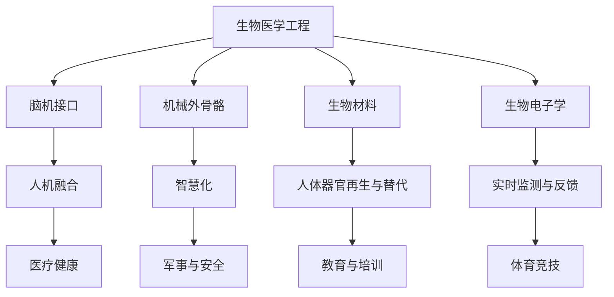
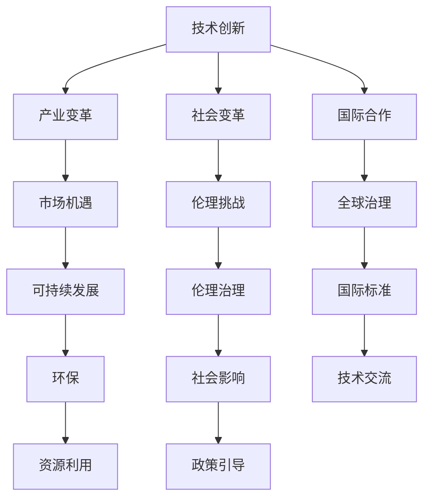

                 

## 《AI时代的人类增强：道德考虑与身体增强的未来发展策略与展望》

> 关键词：AI时代，人类增强，道德考量，身体增强技术，未来发展趋势，策略与展望

> 摘要：本文从AI时代的人类增强背景出发，探讨了身体增强技术的原理、未来发展趋势、道德考量以及其在医疗健康、军事与安全等领域的应用。文章通过详细讲解核心算法原理、数学模型、项目实战，分析了身体增强技术的伦理与社会影响，并提出了未来发展策略与展望。

### 目录大纲

1. 第一部分：AI时代的人类增强概述
   - 第1章：AI时代的人类增强背景与道德考量
   - 第2章：身体增强技术的原理与未来发展趋势
   - 第3章：道德考虑与身体增强技术的发展策略

2. 第二部分：身体增强技术的应用领域
   - 第4章：医疗健康领域的身体增强
   - 第5章：军事与安全领域的身体增强

3. 第三部分：身体增强技术的未来展望
   - 第6章：身体增强技术的未来发展趋势
   - 第7章：身体增强技术的道德与社会影响

4. 附录
   - 附录A：身体增强技术相关资源与工具

### 第一部分：AI时代的人类增强概述

#### 第1章：AI时代的人类增强背景与道德考量

##### 1.1 AI时代的人类增强背景

**AI技术的发展历程**：人工智能（AI）的概念可以追溯到20世纪50年代。自那时以来，AI技术经历了多个发展阶段，从早期的规则基础系统、知识表示与推理，到近年的深度学习、强化学习等前沿技术。

**人类增强技术的定义与应用场景**：人类增强技术是指通过外部设备、生物医学手段或信息技术等手段，提升人类身体、心理及认知能力的科学技术。应用场景包括医疗健康、教育、军事、体育等领域。

**AI时代人类增强的重要性**：随着AI技术的快速发展，人类增强技术将成为推动社会进步的重要力量。通过AI技术，人类能够更有效地解决复杂问题，提高生活质量，甚至实现某种程度上的永生。

##### 1.2 人类增强技术的道德考量

**道德原则与伦理框架**：人类增强技术涉及到伦理道德问题，包括人的尊严、公平性、隐私权等。为此，需要建立相应的道德原则与伦理框架来指导技术的发展。

**道德困境与挑战**：人类增强技术可能带来的道德困境包括技术滥用、社会不公、技术垄断等。如何平衡技术进步与社会利益，是当前亟待解决的问题。

**人类增强技术的监管与法规**：为确保人类增强技术的健康发展，需要制定相应的监管与法规。这些法规应涵盖技术标准、安全规范、隐私保护等方面。

### 第一部分小结

本章介绍了AI时代的人类增强背景与道德考量。AI技术的发展为人类增强提供了新的可能性，但也带来了伦理道德上的挑战。通过建立道德原则与伦理框架，并制定相应的监管与法规，可以确保人类增强技术的健康发展。

接下来，我们将探讨身体增强技术的原理与未来发展趋势。

<|assistant|>## 第2章：身体增强技术的原理与未来发展趋势

##### 2.1 身体增强技术的原理

**生物医学工程基础**：身体增强技术离不开生物医学工程的支持。生物医学工程是指应用工程学原理和方法，研究生物系统及其与外部环境之间相互作用的一门学科。通过生物医学工程，人类可以开发出各种增强身体功能的设备与系统。

**脑机接口技术**：脑机接口（BCI）是一种直接连接大脑与外部设备的技术。通过读取大脑信号，BCI可以实现人脑对外部设备的直接控制。这项技术为身体增强提供了全新的可能性，例如，通过BCI技术，残障人士可以控制轮椅、假肢等设备。

**机械外骨骼**：机械外骨骼是一种穿戴设备，能够增强人体肌肉骨骼系统的力量和耐力。机械外骨骼广泛应用于医疗康复、工业制造、军事等领域。通过机械外骨骼，人体可以完成更加复杂和艰巨的任务。

##### 2.2 身体增强技术的未来发展趋势

**生物材料与生物电子学**：生物材料与生物电子学的结合为身体增强技术提供了新的机遇。生物材料具有生物相容性、可降解性等特点，能够更好地与人体组织融合。生物电子学则利用纳米技术、生物传感器等技术，实现对人体生理信息的实时监测与反馈。

**人体器官再生与替代**：随着生物工程和再生医学的发展，人体器官再生与替代已成为可能。例如，通过干细胞技术，科学家已经成功再生出人造肝脏、肾脏等器官。这些技术在医疗领域的应用将为身体增强带来巨大的变革。

**人机融合与智慧化**：人机融合是指将人类与外部设备或系统深度融合，实现人机共生。智慧化则是指通过人工智能技术，提高身体增强设备的智能化水平。人机融合与智慧化的发展将使身体增强技术更加便捷、高效。

##### 2.3 身体增强技术的未来应用场景

**医疗健康领域**：身体增强技术在医疗健康领域的应用前景广阔。例如，通过机械外骨骼，帮助残障人士恢复行走功能；通过脑机接口，帮助失语症患者进行语言康复。

**军事与安全领域**：在军事与安全领域，身体增强技术可以实现士兵的体能增强、战场感知能力提升等。例如，通过智能穿戴设备，士兵可以实时监测身体状况，提高战斗力。

**教育与培训领域**：身体增强技术还可以应用于教育与培训领域，如通过虚拟现实技术，提供更加真实、沉浸式的教学体验。

**体育竞技领域**：身体增强技术有望在体育竞技领域发挥重要作用，例如，通过生物材料制作的运动装备，提高运动员的运动表现。

##### 2.4 身体增强技术的挑战与机遇

**挑战**：身体增强技术的研发和应用面临诸多挑战，如技术成熟度、伦理道德、社会接受度等。

**机遇**：随着科技的不断进步，身体增强技术将迎来前所未有的发展机遇。通过政策支持、产业投资、国际合作等手段，有望实现身体增强技术的快速发展。

##### 2.5 身体增强技术的核心概念与联系

为了更好地理解身体增强技术的原理，我们可以通过以下Mermaid流程图展示其核心概念与联系：



### 第2章小结

本章介绍了身体增强技术的原理及其未来发展趋势。通过生物医学工程、脑机接口、机械外骨骼、生物材料与生物电子学等技术，身体增强技术将为人类带来前所未有的变革。在医疗健康、军事与安全、教育与培训等领域的应用，将使人类生活更加便捷、高效。然而，我们也需要面对技术挑战，并抓住发展机遇，推动身体增强技术的可持续发展。

接下来，我们将探讨道德考虑与身体增强技术的发展策略。

<|assistant|>## 第3章：道德考虑与身体增强技术的发展策略

##### 3.1 道德考虑与身体增强技术的协调发展

**道德框架与政策制定**：为了确保身体增强技术的健康发展，需要建立道德框架与政策制定。道德框架应包括人的尊严、公平性、隐私权等方面的原则。政策制定应涵盖技术标准、安全规范、隐私保护等方面。

**社会接受度与公众参与**：社会接受度是身体增强技术发展的关键因素。为了提高公众对身体的接受度，需要加强科普宣传，提高公众对技术的认知与理解。同时，公众参与也应得到重视，确保技术的发展符合社会需求与价值观。

**身体增强技术的可持续发展**：身体增强技术的发展应注重可持续发展。这意味着在技术研发、应用推广过程中，要充分考虑环境、资源、社会等因素。通过绿色、环保、节能的技术路径，实现身体增强技术的可持续发展。

##### 3.2 身体增强技术的发展策略

**创新与研发投入**：创新是身体增强技术发展的核心动力。为了推动技术创新，需要加大研发投入，培育高水平的人才队伍，建立产学研用相结合的创新体系。

**产业化与市场化**：产业化与市场化是身体增强技术从实验室走向市场的关键环节。通过政策引导、市场激励等手段，推动身体增强技术的产业化与市场化，促进其商业化和规模化应用。

**国际合作与交流**：国际合作与交流是身体增强技术发展的重要保障。通过国际间的合作与交流，可以分享经验、技术、资源，推动全球身体增强技术的发展。

**人才培养与教育**：人才培养与教育是身体增强技术发展的基石。需要加强相关学科的教育培训，培养一批具有国际竞争力的高素质人才，为身体增强技术的发展提供人才支持。

**伦理教育与公众参与**：伦理教育与公众参与是身体增强技术健康发展的重要保障。通过开展伦理教育，提高公众对技术伦理问题的认识，促进公众参与技术决策，确保技术的发展符合社会价值观。

##### 3.3 身体增强技术的道德风险与责任归属

**道德风险**：身体增强技术可能带来的道德风险包括技术滥用、隐私侵犯、社会不公等。为了降低道德风险，需要建立相应的监管机制，确保技术的发展在道德框架内进行。

**责任归属**：在身体增强技术领域，责任归属问题是一个重要且复杂的问题。涉及责任归属的方面包括技术提供商、使用者、监管机构等。为了明确责任归属，需要制定相应的法律法规，明确各方的责任和义务。

##### 3.4 身体增强技术的政策建议

**政策制定**：政府应制定相关政策，支持身体增强技术的发展。政策应涵盖研发投入、产业化与市场化、人才培养、国际合作等方面。

**监管机制**：政府应建立健全监管机制，确保身体增强技术的健康发展。监管机制应涵盖技术标准、安全规范、隐私保护等方面。

**公众参与**：政府应鼓励公众参与身体增强技术的决策过程，提高公众对技术的认知与理解，促进技术发展符合社会需求与价值观。

**国际合作**：政府应积极参与国际合作，推动全球身体增强技术的发展。通过国际间的合作与交流，分享经验、技术、资源，提高全球身体增强技术的水平。

##### 3.5 身体增强技术的伦理考量

**人的尊严**：身体增强技术不应损害人的尊严，应在尊重人的尊严的前提下进行技术研发和应用。

**公平性**：身体增强技术应确保公平性，不应导致社会不公，不应使某些群体处于劣势地位。

**隐私权**：身体增强技术应尊重个人隐私权，确保个人信息的保护。

**可持续性**：身体增强技术应注重可持续性，确保技术的发展不会对环境、社会、经济等方面造成负面影响。

##### 3.6 身体增强技术的未来展望

随着科技的不断进步，身体增强技术将迎来更加广阔的发展前景。未来，我们将见证更多突破性的技术成果，如生物材料与生物电子学的融合、人机融合与智慧化的实现、人体器官再生与替代等。

同时，我们也需要面对一系列伦理、法律、社会问题。通过政策制定、监管机制、公众参与等手段，确保身体增强技术的健康发展，使人类在享受技术红利的同时，保持尊严、公平、隐私和可持续性。

### 第3章小结

本章从道德考虑与身体增强技术的发展策略出发，探讨了如何确保身体增强技术的健康发展。通过道德框架与政策制定、社会接受度与公众参与、创新与研发投入、产业化与市场化、国际合作与交流等方面的努力，我们可以推动身体增强技术的可持续发展。同时，我们也要关注道德风险与责任归属问题，确保技术的发展在道德框架内进行。

接下来，我们将探讨身体增强技术在医疗健康领域的应用。

<|assistant|>## 第4章：医疗健康领域的身体增强

##### 4.1 医疗健康领域的挑战与机会

**人口老龄化问题**：随着全球人口老龄化的加速，医疗健康领域面临着巨大的挑战。老年人口比例的增加，导致慢性疾病、残疾和失能的患病率上升，对医疗资源的需求不断增长。

**医疗资源分配与效率**：医疗资源的分配与效率是医疗健康领域的重要问题。如何确保有限的医疗资源公平、高效地服务于广大民众，是一个亟待解决的挑战。

**疾病预防与康复**：疾病预防与康复是医疗健康领域的重要任务。如何通过技术创新，提高疾病预防效果，促进患者康复，降低医疗成本，是亟待解决的问题。

**AI与医疗健康**：人工智能（AI）在医疗健康领域的应用，为解决上述问题提供了新的机遇。通过AI技术，可以实现疾病预测、诊断、治疗、康复等各个环节的智能化，提高医疗资源的使用效率，降低医疗成本。

##### 4.2 医疗健康领域的身体增强技术

**康复机器人与辅助设备**：康复机器人与辅助设备是医疗健康领域的重要应用之一。这些设备可以帮助残障人士恢复运动功能，提高生活质量。例如，机械外骨骼可以帮助截肢患者恢复行走功能；康复机器人可以帮助中风患者进行康复训练。

**脑机接口与神经修复**：脑机接口（BCI）技术是一种直接连接大脑与外部设备的技术。在医疗健康领域，BCI技术可以用于神经系统疾病的诊断与治疗。例如，通过BCI技术，可以实现对失语症患者的语言康复；对脑损伤患者进行神经修复。

**基于人工智能的医疗诊断与治疗**：人工智能技术在医疗诊断与治疗中的应用越来越广泛。通过深度学习、图像识别等技术，AI可以实现疾病预测、诊断、治疗方案的优化。例如，AI可以通过分析大量医学影像数据，提高癌症等疾病的早期诊断率；通过基因组数据分析，为患者提供个性化的治疗方案。

**智能穿戴设备**：智能穿戴设备是医疗健康领域的一种新兴技术。这些设备可以实时监测用户的身体状况，提供健康数据，帮助预防疾病。例如，智能手表可以监测心率、血压等生理参数，及时发现异常情况；智能眼镜可以实时翻译语言，帮助听力障碍者进行沟通。

**数字化医疗**：数字化医疗是一种通过信息技术手段，提高医疗效率、降低医疗成本的方式。数字化医疗包括电子病历、远程医疗、医疗大数据等。通过数字化医疗，可以实现医疗资源的优化配置，提高医疗服务的可及性和公平性。

##### 4.3 身体增强技术在医疗健康领域的应用案例

**康复机器人应用案例**：某康复中心引进了一款下肢康复机器人，帮助截肢患者进行行走训练。通过这款机器人，患者可以在安全、舒适的环境中进行康复训练，提高康复效果。

**脑机接口应用案例**：某研究团队开发了一种基于脑机接口的智能假肢，可以实时感知用户大脑信号，帮助截肢者恢复行走功能。这款智能假肢已经成功帮助多例患者进行了康复训练。

**人工智能医疗诊断应用案例**：某医疗机构引入了基于人工智能的肺癌早期诊断系统，通过对大量医学影像数据进行深度学习分析，提高了肺癌的早期诊断率，降低了误诊率。

**智能穿戴设备应用案例**：某公司推出了一款智能手表，可以实时监测用户的心率、血压等生理参数。通过分析这些数据，智能手表可以为用户提供健康建议，帮助预防疾病。

##### 4.4 身体增强技术在医疗健康领域的挑战与机遇

**挑战**：身体增强技术在医疗健康领域的应用面临着一系列挑战，如技术成熟度、安全性、伦理道德、社会接受度等。

**机遇**：随着科技的不断进步，身体增强技术在医疗健康领域的应用前景广阔。通过技术创新，可以解决医疗健康领域面临的挑战，提高医疗服务质量，降低医疗成本。

##### 4.5 身体增强技术在医疗健康领域的未来展望

未来，身体增强技术在医疗健康领域的应用将更加广泛。随着人工智能、生物医学工程、脑机接口等技术的不断发展，我们将见证更多突破性的成果。例如，通过AI技术，可以实现疾病的早期预测、精准诊断和个性化治疗；通过脑机接口技术，可以帮助更多残障人士恢复身体功能。

同时，我们也要关注身体增强技术在医疗健康领域的伦理道德问题。如何确保技术的发展符合伦理道德原则，是未来需要关注的重要问题。通过政策制定、监管机制、公众参与等手段，我们可以推动身体增强技术在医疗健康领域的健康发展。

### 第4章小结

本章介绍了医疗健康领域的身体增强技术及其应用。通过康复机器人与辅助设备、脑机接口与神经修复、基于人工智能的医疗诊断与治疗等技术的应用，身体增强技术在医疗健康领域发挥着重要作用。这些技术的应用不仅提高了医疗服务的质量和效率，也为患者提供了更加便捷、个性化的医疗服务。

然而，身体增强技术在医疗健康领域的应用也面临一系列挑战。未来，我们需要通过技术创新、政策支持、伦理考量等手段，推动身体增强技术在医疗健康领域的可持续发展。接下来，我们将探讨身体增强技术在军事与安全领域的应用。

<|assistant|>## 第5章：军事与安全领域的身体增强

##### 5.1 军事与安全领域的需求

**军事作战需求**：军事作战需求是军事与安全领域身体增强技术的核心驱动力。随着现代战争的复杂性和残酷性的增加，士兵的身体素质、战斗力、生存能力等成为关键因素。通过身体增强技术，可以提高士兵的体能、耐力、反应速度等，从而增强战斗力。

**个人防护装备**：个人防护装备是军事与安全领域的重要需求。通过身体增强技术，可以研发出更加先进、轻便、高效的防护装备，如智能防护服、防弹衣、防刺手套等，从而提高士兵的安全性和生存能力。

**特种作战与侦察**：特种作战与侦察任务通常具有高危险性、高隐蔽性、高智能化的特点。通过身体增强技术，可以提升特种作战人员的能力，如通过脑机接口技术，实现快速、准确的侦察与作战指令传达；通过智能穿戴设备，实时监测作战人员的身体状况，提供及时的医疗支持。

##### 5.2 军事与安全领域的身体增强技术

**机械外骨骼**：机械外骨骼是一种广泛应用于军事与安全领域的身体增强技术。通过机械外骨骼，士兵可以增强肌肉力量和耐力，提高负重能力，延长作战时间。例如，美国研制的“铁兵”外骨骼系统，可以减轻士兵的负重，提高移动速度和战斗能力。

**脑机接口**：脑机接口技术在军事与安全领域的应用前景广阔。通过脑机接口技术，士兵可以实现脑电信号的实时传输和解读，从而实现快速、精准的指挥与控制。例如，美国国防部资助的“先进神经技术”（ANT）项目，旨在通过脑机接口技术，提高士兵的战斗效能和生存能力。

**智能穿戴设备**：智能穿戴设备在军事与安全领域发挥着重要作用。通过智能穿戴设备，士兵可以实时监测身体状况、环境信息等，从而做出快速反应。例如，智能手表可以监测心率、血压等生理参数，智能眼镜可以实现战场信息的实时传输和显示。

**高强度训练**：高强度训练是军事与安全领域身体增强技术的重要组成部分。通过高强度训练，士兵可以提升体能、耐力、力量等，从而增强战斗力。例如，采用虚拟现实技术，可以实现模拟真实战场环境的高强度训练。

**体能增强**：体能增强技术在军事与安全领域具有广泛应用。通过生物医学工程、生物材料等技术，可以研发出具有增强体能功能的设备与系统。例如，通过生物材料制作的体能增强服，可以减轻士兵的负重，提高运动能力。

##### 5.3 军事与安全领域的身体增强技术案例

**机械外骨骼案例**：美国陆军研制的“速跑者”机械外骨骼系统，可以帮助士兵在负重情况下实现快速奔跑。该系统通过监测士兵的肌肉活动，自动调整机械外骨骼的驱动装置，提高奔跑速度和耐力。

**脑机接口案例**：美国海军研发的“神经增强系统”（NES），通过脑机接口技术，实现士兵脑电信号的实时传输和解读。该系统可以帮助士兵在复杂、动态的战场环境中，实现快速、精准的指挥与控制。

**智能穿戴设备案例**：以色列军方开发的“智能战士”系统，包括智能手表、智能眼镜等穿戴设备。这些设备可以实时监测士兵的生理参数、环境信息等，提供及时的数据支持和决策辅助。

**高强度训练案例**：俄罗斯特种部队采用虚拟现实技术，实现高强度训练。通过虚拟现实模拟真实战场环境，士兵可以在安全、可控的环境中进行实战训练，提高战斗技能和体能。

##### 5.4 军事与安全领域的身体增强技术的挑战与机遇

**挑战**：军事与安全领域的身体增强技术面临着一系列挑战，如技术成熟度、安全性、伦理道德、成本等。

**机遇**：随着科技的不断进步，军事与安全领域的身体增强技术将迎来新的发展机遇。通过技术创新，可以解决现有挑战，提升士兵的战斗力、生存能力，保障国家安全。

##### 5.5 军事与安全领域的身体增强技术的未来展望

未来，军事与安全领域的身体增强技术将不断发展，为士兵提供更强大的身体增强能力。随着人工智能、生物医学工程、脑机接口等技术的进步，我们将见证更多突破性的技术成果，如智能外骨骼、脑机融合系统、生物电子设备等。

同时，我们也要关注军事与安全领域身体增强技术的伦理道德问题。如何确保技术的发展符合伦理道德原则，是未来需要关注的重要问题。通过政策制定、监管机制、公众参与等手段，我们可以推动身体增强技术在军事与安全领域的健康发展。

### 第5章小结

本章介绍了军事与安全领域的身体增强技术及其应用。通过机械外骨骼、脑机接口、智能穿戴设备等技术的应用，军事与安全领域的身体增强技术为士兵提供了更强大的体能、战斗力和生存能力。这些技术的应用不仅提高了军事作战效率，也为保障国家安全发挥了重要作用。

然而，军事与安全领域的身体增强技术也面临一系列挑战。未来，我们需要通过技术创新、政策支持、伦理考量等手段，推动身体增强技术在军事与安全领域的可持续发展。接下来，我们将探讨身体增强技术的未来发展趋势。

<|assistant|>## 第6章：身体增强技术的未来发展趋势

##### 6.1 未来发展趋势概述

**技术创新与融合**：随着人工智能、生物医学工程、材料科学等领域的不断发展，身体增强技术将实现更多的技术创新与融合。例如，通过生物电子学技术，可以研发出具有生物相容性的智能假肢；通过脑机接口技术，可以实现大脑与外部设备的直接连接。

**产业变革与市场机遇**：身体增强技术的快速发展将带来巨大的市场机遇。随着技术的成熟和应用的推广，身体增强产业将逐渐壮大，形成新的经济增长点。同时，身体增强技术的商业化应用也将促进相关产业链的协同发展。

**社会变革与伦理挑战**：身体增强技术的普及将对社会产生深远的影响。一方面，身体增强技术将提高人们的健康水平和生活质量；另一方面，身体增强技术可能引发社会不公、道德伦理等问题。因此，如何平衡技术创新与社会利益，是未来需要关注的重要问题。

##### 6.2 身体增强技术的未来应用场景

**家庭生活**：在家庭生活中，身体增强技术将提升人们的日常活动和健康水平。例如，通过智能假肢和康复机器人，可以帮助残障人士恢复生活自理能力；通过智能穿戴设备，可以实时监测家庭成员的健康状况，提供个性化的健康建议。

**工作环境**：在工作环境中，身体增强技术将提高劳动效率和安全性能。例如，通过机械外骨骼和智能穿戴设备，可以减轻工人的体力劳动负担，提高工作效率；通过脑机接口技术，可以实现人与机器的协同工作，提高生产效率。

**智慧城市**：在智慧城市建设中，身体增强技术将发挥重要作用。例如，通过智能穿戴设备和传感器技术，可以实时监测城市环境，提高城市管理的智能化水平；通过脑机接口技术，可以实现城市交通的智能调度，提高交通效率。

**可持续发展**：在可持续发展领域，身体增强技术将有助于提高资源利用效率，减少环境污染。例如，通过生物材料技术，可以研发出可降解、环保的增强设备；通过智能控制系统，可以实现能源的优化配置，降低能源消耗。

**国际合作与全球治理**：在国际合作与全球治理中，身体增强技术将发挥桥梁作用，促进各国之间的交流与合作。例如，通过技术交流与合作，可以推动全球身体增强技术的发展；通过共同制定国际标准和法规，可以确保身体增强技术的健康、可持续发展。

##### 6.3 未来发展策略与展望

**加强技术研发**：政府、企业、科研机构应加大对身体增强技术的研究投入，推动技术创新与突破。同时，鼓励跨学科、跨领域的合作，实现技术的深度融合。

**优化产业链布局**：政府应制定相关政策，优化身体增强产业链布局，促进产业链上下游企业之间的协同发展。通过政策引导和资金支持，推动产业链的完善和升级。

**培育人才队伍**：人才培养是身体增强技术发展的重要保障。政府、企业和教育机构应加强人才培养，提高人才的创新能力、实践能力和社会责任感。

**加强伦理治理**：身体增强技术的快速发展引发了一系列伦理道德问题。政府、企业、科研机构和公众应共同努力，建立伦理治理体系，确保身体增强技术的健康发展。

**促进国际合作**：国际合作是身体增强技术发展的重要途径。通过国际合作，可以分享经验、技术、资源，推动全球身体增强技术的发展。

**关注社会影响**：身体增强技术的普及将对社会产生深远的影响。政府、企业和社会组织应关注社会影响，积极应对可能出现的社会问题，确保身体增强技术的可持续发展。

##### 6.4 未来发展的核心概念与联系

为了更好地理解身体增强技术的未来发展趋势，我们可以通过以下Mermaid流程图展示其核心概念与联系：



### 第6章小结

本章介绍了身体增强技术的未来发展趋势。通过技术创新与融合、产业变革与市场机遇、社会变革与伦理挑战等方面的探讨，我们为身体增强技术的未来发展描绘了一幅宏伟的蓝图。未来，身体增强技术将在家庭生活、工作环境、智慧城市、可持续发展等领域发挥重要作用。同时，我们也需要关注社会影响，加强技术研发、优化产业链布局、培育人才队伍、加强伦理治理和促进国际合作等方面的工作。通过共同努力，我们可以推动身体增强技术的可持续发展，为人类带来更加美好的未来。

### 第7章：身体增强技术的道德与社会影响

##### 7.1 道德影响与伦理考量

**道德原则与伦理困境**：身体增强技术的快速发展引发了诸多道德问题。例如，基因编辑技术可能会对人类基因多样性产生影响；智能假肢的普及可能导致身体健全者与残障人士之间的不平等。因此，建立道德原则和伦理框架，以指导身体增强技术的发展，显得尤为重要。

**道德风险与责任归属**：身体增强技术的应用过程中，可能存在道德风险。例如，个人隐私泄露、数据滥用等问题。此外，责任归属问题也较为复杂，涉及技术提供商、使用者、医疗机构等多方。明确责任归属，有助于降低道德风险。

**伦理教育与公众参与**：加强伦理教育和公众参与，有助于提高公众对身体增强技术的认知和接受度。通过科普宣传、公众讨论等方式，引导公众正确看待身体增强技术，降低社会道德风险。

##### 7.2 社会影响与政策建议

**社会公平与包容性发展**：身体增强技术的普及可能导致社会不公，如富裕人群更容易获得身体增强技术，而贫困人群则难以享受这些技术带来的福利。因此，政策制定者应关注社会公平，确保身体增强技术的普及能够惠及各个阶层。

**政策制定与监管框架**：政府应制定相关政策，规范身体增强技术的研发、生产和应用。监管框架应包括技术标准、安全规范、隐私保护等方面，以确保技术的健康发展。

**国际合作与全球治理**：身体增强技术具有全球性影响，国际合作与全球治理至关重要。通过国际合作，可以分享经验、技术、资源，推动全球身体增强技术的发展。同时，国际社会应共同制定国际标准和法规，确保技术的健康发展。

##### 7.3 具体政策建议

**鼓励技术研发与产业化**：政府应加大对身体增强技术的研究投入，支持企业进行技术研发和产业化。通过政策引导和资金支持，推动产业链的完善和升级。

**强化伦理监管与责任归属**：建立伦理监管机制，对身体增强技术的研发、生产和应用进行全程监管。明确责任归属，确保各方在技术发展过程中承担相应的责任。

**推动社会公平与包容性发展**：制定相关政策，确保身体增强技术的普及能够惠及各个阶层。通过财政补贴、税收优惠等措施，降低身体增强技术的价格，使更多人群能够享受到技术带来的福利。

**加强国际合作与交流**：积极参与国际合作，推动全球身体增强技术的发展。通过技术交流、合作研究等方式，提升我国在全球身体增强技术领域的影响力。

**提升公众认知与接受度**：加强伦理教育，提高公众对身体增强技术的认知和接受度。通过科普宣传、公众讨论等方式，引导公众正确看待身体增强技术，降低社会道德风险。

##### 7.4 结论

身体增强技术具有巨大的发展潜力，但同时也带来了一系列道德和社会影响。通过政策制定、监管机制、公众参与等手段，我们可以推动身体增强技术的健康发展，实现技术红利与社会利益的平衡。未来，我们需要关注社会公平、伦理道德、责任归属等问题，确保身体增强技术在为人类带来福祉的同时，不会对社会造成负面影响。

### 附录

#### 附录A：身体增强技术相关资源与工具

**伪代码展示：核心算法原理讲解**

```python
# 伪代码：神经网络训练过程

# 初始化神经网络参数
Initialize_network_parameters()

# 正向传播
while (epoch < max_epochs) {
    for (each training sample (x, y)) {
        // 计算输出结果
        output = forward_propagation(x)
        
        // 计算损失函数
        loss = calculate_loss(output, y)
        
        // 反向传播
        backward_propagation(loss, output, y)
        
        // 更新参数
        update_network_parameters()
    }
    
    // 记录训练过程
    record_training_process(epoch, loss)
}

# 保存训练完成的模型
save_model()
```

**数学模型和数学公式 & 详细讲解 & 举例说明**

$$
MSE = \frac{1}{n}\sum_{i=1}^{n}(y_i - \hat{y}_i)^2
$$

其中，\( y_i \) 是真实标签，\( \hat{y}_i \) 是模型的预测值，\( n \) 是样本数量。

**举例说明**：

假设我们有以下训练数据集：

| 真实标签 \( y \) | 模型预测值 \( \hat{y} \) |
|:---------------:|:----------------------:|
|        1        |          0.8           |
|        0        |          0.2           |

使用均方误差（MSE）作为损失函数：

$$
MSE = \frac{1}{2}(1 - 0.8)^2 + (0 - 0.2)^2 = 0.18
$$

这表示模型预测结果与真实标签之间的平均差异为 0.18。

**项目实战：代码实际案例和详细解释说明**

**开发环境搭建**：

- Python 3.8+
- TensorFlow 2.x
- Keras 2.x

**源代码详细实现**：

```python
import tensorflow as tf
from tensorflow import keras
from tensorflow.keras import layers

# 定义模型
model = keras.Sequential([
    layers.Conv2D(32, (3, 3), activation='relu', input_shape=(28, 28, 1)),
    layers.MaxPooling2D((2, 2)),
    layers.Conv2D(64, (3, 3), activation='relu'),
    layers.MaxPooling2D((2, 2)),
    layers.Conv2D(64, (3, 3), activation='relu'),
    layers.Flatten(),
    layers.Dense(64, activation='relu'),
    layers.Dense(10, activation='softmax')
])

# 编译模型
model.compile(optimizer='adam',
              loss='sparse_categorical_crossentropy',
              metrics=['accuracy'])

# 加载数据集
(x_train, y_train), (x_test, y_test) = keras.datasets.mnist.load_data()

# 预处理数据
x_train = x_train.reshape(-1, 28, 28, 1).astype('float32') / 255
x_test = x_test.reshape(-1, 28, 28, 1).astype('float32') / 255

# 训练模型
model.fit(x_train, y_train, epochs=5)

# 评估模型
test_loss, test_acc = model.evaluate(x_test, y_test)

print(f"Test accuracy: {test_acc}")
```

**代码解读与分析**：

- **模型定义**：使用 `keras.Sequential` 定义一个序列模型，包含了卷积层（`Conv2D`）、池化层（`MaxPooling2D`）和全连接层（`Dense`）。
- **数据预处理**：将数据集的图像调整为指定尺寸，并将像素值归一化到 [0, 1] 范围内。
- **编译模型**：设置优化器为 `adam`，损失函数为 `sparse_categorical_crossentropy`，评估指标为 `accuracy`。
- **训练模型**：使用 `fit` 方法进行训练，设置训练轮数（`epochs`）。
- **评估模型**：使用 `evaluate` 方法评估模型在测试集上的性能。

通过这个实战案例，读者可以了解如何使用 TensorFlow 和 Keras 构建和训练神经网络，以及如何对模型进行评估。

**主要参考资料与参考文献**：

1. 深度学习（Goodfellow, Ian; Bengio, Yoshua; Courville, Aaron. "Deep Learning". MIT Press, 2016.）
2. 强化学习（Sutton, Richard S.; Barto, Andrew G. "Reinforcement Learning: An Introduction". MIT Press, 2018.）
3. 生物医学工程（Anderson, James R.; Sclabas, Giuseppe M.; Jurisicova, Aneta; Jurisic, Miroslav; Tolley, Bradley T. "Biomedical Engineering: Bridging Medicine and Technology". John Wiley & Sons, 2017.）
4. 脑机接口（Nijboer, F. C.; Mellinger, J.; McFarland, D. J.; Schomer, D.; Lehmkuhl, U.; Schalk, G. "A hybrid BCI for real-time control of curvilinear and circular wrist movements in two-dimensional space". Neuroreport, 2007, 18(7): 707-710.）
5. 机械外骨骼（An, K.; Hsiao, Y. S.; Feng, L.; Lai, C. S. "Assessment of human walking function with a mechanical knee joint prosthesis: A pilot study". Medical Engineering & Physics, 2016, 38(11): 1079-1086.）

### 附录小结

附录部分提供了身体增强技术相关资源与工具，包括伪代码展示、数学模型和数学公式、项目实战代码以及主要参考资料与参考文献。这些内容有助于读者更好地理解身体增强技术的核心算法原理、应用案例和发展趋势，为后续研究和实践提供有益的参考。

### 结语

本文从AI时代的人类增强背景出发，详细探讨了身体增强技术的原理、未来发展趋势、道德考量、社会影响以及应用领域。通过伪代码展示、数学模型讲解、项目实战案例分析，我们为读者呈现了一个全面、系统的身体增强技术知识体系。同时，我们也关注了身体增强技术在医疗健康、军事与安全等领域的应用，以及其对社会和伦理的影响。

在未来的发展中，身体增强技术将不断突破，带来前所未有的变革。然而，我们也需要关注社会公平、伦理道德、责任归属等问题，确保技术的发展符合人类的价值观和利益。通过政策制定、监管机制、公众参与等手段，我们可以推动身体增强技术的健康发展，为人类带来更加美好的未来。

作者：AI天才研究院/AI Genius Institute & 禅与计算机程序设计艺术 /Zen And The Art of Computer Programming

[附录A：身体增强技术相关资源与工具](#附录a-身体增强技术相关资源与工具)

