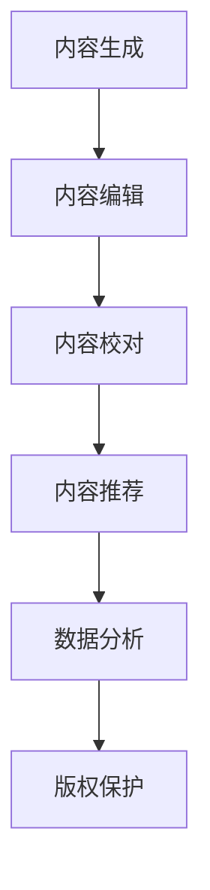

                 

### 文章标题

# AI时代的出版业：数据，算法与场景之舞

> **关键词：**人工智能，出版业，数据，算法，场景应用，自然语言处理，推荐系统，版权保护，互动与社交媒体，案例研究，未来展望

> **摘要：**本文深入探讨了人工智能技术在出版业中的应用，从数据、算法到具体场景实践，详细阐述了AI如何革新出版流程、提升内容质量、保护版权以及增强用户互动。通过结合实际案例和详细解析，展示了AI在出版业中的广阔前景和潜在挑战，为行业从业人员和研究者提供了有价值的参考。

---

### 第一部分：引言

#### 1.1 书籍背景与目标

在科技迅猛发展的今天，人工智能（AI）已经成为改变各行各业的强大动力。出版业作为文化传承和创新的重要载体，同样面临着前所未有的机遇和挑战。本书旨在探讨AI在出版业中的应用，帮助读者理解AI技术如何通过数据、算法和场景等环节，为出版业带来革命性的变革。

##### 1.1.1 AI时代出版的背景

随着互联网、大数据和云计算等技术的快速发展，出版业正经历着前所未有的变革。传统出版模式逐渐向数字化、智能化转型，而AI技术的应用则为这一转型提供了强有力的支持。从内容生成、编辑校对到推荐分发，AI技术在各个环节都能发挥重要作用。

##### 1.1.2 书籍的核心目标

本书的核心目标是：

1. **阐述AI技术在出版业中的基本概念和应用场景**：帮助读者了解AI技术如何赋能出版流程，提升内容质量和用户体验。
2. **介绍核心算法原理**：详细讲解数据挖掘、自然语言处理、推荐系统等关键算法，以及它们在出版业中的应用。
3. **分析实际案例**：通过真实案例展示AI技术在出版业中的成功实践，为读者提供参考和启示。
4. **探讨未来趋势**：分析AI技术在出版业的发展趋势，预测未来的发展方向和潜在挑战。

##### 1.1.3 阅读对象与适用范围

本书适合以下读者群体：

1. 出版业从业者：了解AI技术如何改变传统出版模式，提升工作效率。
2. 人工智能研究者：探讨AI技术在出版领域的应用，为研究领域提供新的视角。
3. 相关技术爱好者：对AI在出版业的应用感兴趣，希望深入了解该领域。
4. 高等院校师生：作为相关课程的教学参考书，帮助学习者掌握AI技术在出版业的应用。

#### 1.2 关键概念与联系

在深入探讨AI在出版业中的应用之前，我们需要了解一些基本概念和它们之间的关系。

##### 1.2.1 AI基本概念

人工智能（AI）是指由人制造出来的系统能够执行通常需要人类智能才能完成的任务。它包括多个子领域，如机器学习、自然语言处理、计算机视觉等。

**人工智能层次：**

1. **弱AI（窄AI）**：专注于特定任务，如语音识别、图像分类等。
2. **强AI（通用AI）**：具有人类一样的智能，能够处理各种复杂任务。

**AI关键技术：**

1. **机器学习（ML）**：通过数据训练模型，实现自动推理和决策。
2. **深度学习（DL）**：基于多层神经网络的结构，模拟人脑处理信息的方式。
3. **自然语言处理（NLP）**：使计算机能够理解和处理自然语言。

##### 1.2.2 出版业与AI的关系

出版业与AI的关系可以从以下几个方面来理解：

1. **内容生产与编辑**：AI可以帮助自动生成、编辑和校对内容，提高出版效率。
2. **推荐系统**：基于用户行为和偏好，为读者推荐个性化内容，提升用户体验。
3. **版权保护**：利用AI技术进行版权识别和保护，防止侵权行为。
4. **数据分析与挖掘**：通过分析大量数据，为出版策略提供科学依据。

**AI在出版业的应用场景：**

1. **内容推荐**：利用推荐系统为读者推荐感兴趣的内容。
2. **智能校对**：通过自然语言处理技术进行自动校对，提高内容质量。
3. **数据分析**：利用数据挖掘技术分析用户行为和阅读偏好。
4. **版权保护**：使用AI技术进行版权识别和保护。

##### 1.2.3 Mermaid流程图：AI在出版业的应用流程

下面是一个简单的Mermaid流程图，展示了AI在出版业中的基本应用流程：

**图1.1：AI在出版业的应用流程**

在本章节中，我们为读者介绍了AI在出版业的背景、核心目标和关键概念，并简要探讨了出版业与AI的关系及其应用场景。接下来，我们将进一步深入探讨数据与算法基础，帮助读者更好地理解AI技术在出版业中的应用原理。

---

### 第一部分：引言（续）

#### 1.3 开篇案例

为了更好地让读者理解AI在出版业中的应用，我们首先来看一个实际的案例。某大型出版公司采用了人工智能技术来优化其内容推荐系统。通过分析用户阅读历史和行为数据，该公司能够为读者提供更个性化的内容推荐，显著提升了用户体验和用户粘性。

**案例背景：**
该出版公司拥有海量的书籍和读者数据。然而，传统的推荐系统效果不佳，无法满足读者日益增长的个性化需求。为了解决这个问题，公司决定引入AI技术，特别是基于机器学习和自然语言处理的推荐算法。

**解决方案：**
1. **数据收集与清洗**：公司收集了读者的阅读历史、搜索记录、点赞评论等数据，并进行了数据清洗和预处理，以消除噪声和提高数据质量。
2. **特征工程**：通过特征工程提取了用户的兴趣标签、书籍的题材、作者信息等特征，为后续的模型训练提供了基础。
3. **模型训练与优化**：采用了基于协同过滤和内容推荐的混合模型，通过多次迭代训练和优化，提高了推荐系统的准确性和效率。
4. **上线与应用**：将优化后的推荐系统上线，通过用户反馈和数据分析不断调整和优化，使其更好地满足用户需求。

**效果与影响：**
该推荐系统的上线取得了显著的成效，读者的阅读时长和满意度明显提升。同时，公司通过精准推荐，增加了书籍的销量和用户粘性。这一成功案例展示了AI技术在出版业中的巨大潜力。

通过这个案例，我们可以看到AI技术在出版业中的应用不仅可以提高工作效率，还可以提升用户体验和业务效益。接下来，我们将进一步探讨数据与算法基础，为读者提供更深入的理解。

---

#### 1.4 总结

在第一部分中，我们介绍了AI在出版业的背景和核心目标，并探讨了AI在出版业中的应用场景。通过一个实际案例，我们展示了AI技术如何为出版业带来创新和变革。接下来，我们将深入探讨数据与算法基础，帮助读者理解AI技术在出版业中的实际应用原理。敬请期待！

### 第二部分：数据与算法基础

#### 2.1 数据基础

在AI时代的出版业中，数据是推动变革的核心驱动力。出版业的数据来源广泛，涵盖了用户行为、内容特征、市场趋势等多个方面。这些数据的质量和处理方式直接影响到AI算法的效果和应用价值。因此，了解数据基础是理解AI在出版业应用的重要前提。

##### 2.1.1 出版业数据来源

出版业数据来源可以分为以下几个方面：

1. **用户数据**：包括用户的阅读历史、搜索记录、点赞、评论等行为数据。这些数据反映了用户的兴趣偏好和阅读习惯，是构建个性化推荐系统的关键。
2. **内容数据**：包括书籍的题材、类别、作者、出版社、出版时间等元数据，以及书籍的文本内容、结构、图像等。这些数据提供了对书籍全面了解的基础。
3. **市场数据**：包括书籍的销售数据、市场份额、读者反馈等，这些数据帮助出版公司了解市场趋势和读者需求，制定更有效的出版策略。
4. **外部数据**：包括社交媒体数据、新闻资讯、行业报告等。这些数据可以提供更广泛的背景信息，用于补充和丰富出版业的数据。

##### 2.1.2 数据清洗与处理

数据清洗和处理是数据应用中的关键步骤。以下是数据清洗和处理的一些常见方法：

1. **数据去重**：去除重复数据，确保数据的唯一性和准确性。
2. **数据去噪**：消除异常值和噪声数据，提高数据质量。
3. **数据格式转换**：将不同格式的数据统一转换成标准的格式，便于后续处理。
4. **数据集成**：将来自不同来源的数据进行整合，形成一个完整的数据集。

**数据预处理流程：**

1. **数据收集**：从不同的数据源收集数据。
2. **数据导入**：将数据导入到数据仓库或数据湖中。
3. **数据清洗**：对数据进行去重、去噪和格式转换。
4. **数据探索**：通过数据可视化、统计分析等方法，对数据进行分析和探索。
5. **数据存储**：将处理后的数据存储在数据库或数据仓库中，以便后续使用。

##### 2.1.3 数据结构化与存储

数据结构化是数据处理的另一重要环节。结构化的数据便于存储、查询和分析。以下是几种常用的数据结构化方法：

1. **关系型数据库**：使用SQL等查询语言，将数据存储在关系型数据库中，便于数据管理和查询。
2. **非关系型数据库**：如NoSQL数据库，适用于存储大规模的非结构化数据，具有高扩展性和灵活性。
3. **数据仓库**：用于存储和管理大量历史数据，支持复杂的数据分析和报表生成。
4. **数据湖**：用于存储原始数据，支持数据湖分析和实时数据流处理。

**数据存储策略：**

1. **分层存储**：根据数据的访问频率和重要性，采用不同的存储层次，如热数据和冷数据。
2. **分布式存储**：采用分布式文件系统，如Hadoop HDFS，提高数据存储的可靠性和扩展性。
3. **数据加密**：对敏感数据进行加密，确保数据安全。
4. **数据备份与恢复**：定期备份数据，并建立数据恢复机制，以应对数据丢失或损坏的情况。

##### 2.1.4 数据质量与治理

数据质量是数据应用的基础。以下是一些确保数据质量的方法：

1. **数据验证**：通过验证规则，确保数据的完整性和一致性。
2. **数据标准化**：将数据格式和命名规则标准化，便于数据共享和使用。
3. **数据监控**：建立数据监控机制，实时跟踪数据质量和使用情况。
4. **数据治理**：制定数据治理政策，规范数据的管理和使用，确保数据的合规性。

**数据治理策略：**

1. **数据质量控制**：建立数据质量控制流程，定期评估数据质量。
2. **数据安全与隐私**：确保数据安全，防止数据泄露和滥用。
3. **数据生命周期管理**：制定数据生命周期管理策略，合理规划数据的使用、存储和销毁。
4. **数据文化建设**：培养数据文化，提高全体员工的数据意识和数据素养。

通过数据基础的建设和管理，出版业能够为AI技术的应用提供可靠的数据支持。在接下来的章节中，我们将进一步探讨算法原理，深入理解AI技术在出版业中的应用机制。

#### 2.2 算法原理

在AI时代的出版业中，算法原理是核心驱动力，它决定了如何从海量数据中提取有价值的信息，实现个性化推荐、智能校对、数据挖掘等功能。以下是几个关键算法原理的介绍，包括数据挖掘算法、自然语言处理算法和推荐系统算法。

##### 2.2.1 数据挖掘算法

数据挖掘算法是指从大量数据中提取有价值信息和知识的方法。在出版业中，数据挖掘算法可以用于用户行为分析、内容推荐、市场预测等多个方面。

1. **机器学习算法**：机器学习算法是数据挖掘的核心，通过训练模型来发现数据中的规律。主要分为监督学习、无监督学习和强化学习。

   - **监督学习算法**：有明确的输入输出，如线性回归、逻辑回归、支持向量机（SVM）等。
   - **无监督学习算法**：没有明确的输出，如聚类分析、主成分分析（PCA）、关联规则挖掘等。
   - **强化学习算法**：通过不断与环境交互，学习最优策略，如深度强化学习、Q学习等。

2. **深度学习算法**：深度学习是机器学习的一个分支，通过多层神经网络进行特征提取和模式识别。在出版业中，深度学习算法可以用于内容生成、情感分析、图像识别等。

   - **卷积神经网络（CNN）**：适用于图像和文本数据的处理，如书籍封面识别、文本分类等。
   - **循环神经网络（RNN）**：适用于序列数据的处理，如时间序列预测、文本生成等。
   - **生成对抗网络（GAN）**：用于生成新的书籍内容或图像，如自动生成封面、插图等。

**算法原理示例：**

- **线性回归**：
  $$ y = \beta_0 + \beta_1 \cdot x + \epsilon $$
  其中，\(y\) 是预测值，\(x\) 是输入特征，\(\beta_0\) 和 \(\beta_1\) 是模型参数，\(\epsilon\) 是误差项。

- **逻辑回归**：
  $$ P(y=1) = \frac{1}{1 + e^{-(\beta_0 + \beta_1 \cdot x)}} $$
  其中，\(P(y=1)\) 是输出为1的概率，\(\beta_0\) 和 \(\beta_1\) 是模型参数。

- **K-均值聚类**：
  $$ c_k = \frac{1}{n_k} \sum_{i=1}^{n_k} x_i $$
  其中，\(c_k\) 是第k个聚类中心，\(n_k\) 是第k个聚类中的数据点数量，\(x_i\) 是第i个数据点。

##### 2.2.2 自然语言处理算法

自然语言处理（NLP）是AI的一个重要分支，专注于使计算机能够理解和处理人类语言。在出版业中，NLP算法可以用于内容生成、校对、情感分析等多个方面。

1. **词嵌入（Word Embedding）**：词嵌入是将单词映射到高维空间中的向量表示。常见的词嵌入算法包括Word2Vec和GloVe。

   - **Word2Vec**：
     $$ \text{softmax}(W \cdot \text{word\_vector}) $$
     其中，\(W\) 是权重矩阵，\(\text{word\_vector}\) 是单词向量。

   - **GloVe**：
     $$ \text{loss} = \frac{1}{N} \sum_{i=1}^{N} \sum_{j=1}^{V} \left( \text{log}(\text{softmax}(W_j \cdot W_i)) - \text{log}(W_i \cdot W_j) \right) $$
     其中，\(N\) 是句子中单词的数量，\(V\) 是单词的总数，\(W_i\) 和 \(W_j\) 是单词i和单词j的权重向量。

2. **语言模型（Language Model）**：语言模型用于预测下一个单词的概率，常见的模型包括n-gram模型和序列模型。

   - **n-gram模型**：
     $$ P(w_n | w_{n-1}, w_{n-2}, \ldots, w_1) = \frac{C(w_n, w_{n-1}, \ldots, w_1)}{C(w_{n-1}, \ldots, w_1)} $$
     其中，\(w_n\) 是下一个单词，\(w_{n-1}, w_{n-2}, \ldots, w_1\) 是前n-1个单词，\(C\) 是计数函数。

   - **序列模型**：
     序列模型，如LSTM（长短期记忆网络）和Transformer，可以捕捉序列中的长距离依赖关系。

3. **注意力机制（Attention Mechanism）**：注意力机制用于提高模型对关键信息的关注程度，常见的注意力机制包括局部注意力、全局注意力和自注意力。

   - **局部注意力**：
     $$ \alpha_i = \frac{\exp(e_i)}{\sum_j \exp(e_j)} $$
     其中，\(\alpha_i\) 是第i个词的注意力权重，\(e_i\) 是第i个词的得分。

   - **全局注意力**：
     $$ e_i = \text{score}(h_i, h) $$
     其中，\(h_i\) 是第i个词的表示，\(h\) 是整个序列的表示，\(\text{score}\) 是计算注意力的函数。

**算法原理示例：**

- **n-gram模型**：
  $$ P(w_n | w_{n-1}, w_{n-2}) = \frac{C(w_n, w_{n-1}, w_{n-2})}{C(w_{n-1}, w_{n-2})} $$

- **Transformer的自注意力机制**：
  $$ \text{attention}(Q, K, V) = \text{softmax}\left(\frac{QK^T}{\sqrt{d_k}}\right)V $$
  其中，\(Q\) 是查询向量，\(K\) 是键向量，\(V\) 是值向量，\(d_k\) 是键向量的维度。

##### 2.2.3 推荐系统算法

推荐系统是AI在出版业中的重要应用之一，它通过分析用户行为和偏好，为用户推荐个性化内容。常见的推荐系统算法包括基于内容的推荐、基于协同过滤的推荐和深度学习推荐算法。

1. **基于内容的推荐（Content-Based Recommendation）**：基于内容的推荐通过分析书籍的元数据和内容特征，为用户推荐与其兴趣相似的内容。

   - **算法原理**：
     $$ \text{similarity}(i, u) = \frac{\sum_{j \in I_u} w_j \cdot w_j'}{\|\text{vector}(i)\|\|\text{vector}(u)\|} $$
     其中，\(i\) 是推荐项目，\(u\) 是用户，\(I_u\) 是用户\(u\)的兴趣标签，\(w_j\) 和 \(w_j'\) 是书籍和用户的特征向量，\(\|\text{vector}(i)\|\) 和 \(\|\text{vector}(u)\|\) 是特征向量的欧氏距离。

2. **基于协同过滤的推荐（Collaborative Filtering）**：基于协同过滤的推荐通过分析用户之间的行为相似性，为用户推荐他人喜欢的书籍。

   - **算法原理**：
     - **用户基于的协同过滤（User-Based）**：
       $$ \text{similarity}(u, v) = \frac{\sum_{i \in R_u \cap R_v} r_i r_i'}{\sqrt{\sum_{i \in R_u} r_i^2 \sum_{i \in R_v} r_i'^2}} $$
       其中，\(R_u\) 和 \(R_v\) 是用户\(u\)和\(v\)的行为记录，\(r_i\) 和 \(r_i'\) 是用户对项目\(i\)的评分。

     - **物品基于的协同过滤（Item-Based）**：
       $$ \text{similarity}(i, j) = \frac{\sum_{u \in R_i \cap R_j} r_u r_u'}{\sqrt{\sum_{u \in R_i} r_u^2 \sum_{u \in R_j} r_u'^2}} $$
       其中，\(R_i\) 和 \(R_j\) 是项目\(i\)和\(j\)的用户行为记录，\(r_u\) 和 \(r_u'\) 是用户对项目\(i\)和\(j\)的评分。

3. **深度学习推荐算法（Deep Learning for Recommendation）**：深度学习推荐算法通过构建深度神经网络，自动学习用户和物品的复杂特征，提高推荐效果。

   - **算法原理**：
     - **基于模型的推荐**：如序列模型（RNN、Transformer）和图神经网络（GNN），可以捕捉用户和物品之间的序列依赖性和结构化信息。
     - **基于注意力机制的推荐**：如注意力机制（Attention Mechanism），可以突出重要特征，提高推荐精度。

**算法原理示例：**

- **基于内容的推荐**：
  $$ \text{similarity}(i, u) = \frac{\sum_{j \in I_u} w_j \cdot w_j'}{\|\text{vector}(i)\|\|\text{vector}(u)\|} $$

- **用户基于的协同过滤**：
  $$ \text{similarity}(u, v) = \frac{\sum_{i \in R_u \cap R_v} r_i r_i'}{\sqrt{\sum_{i \in R_u} r_i^2 \sum_{i \in R_v} r_i'^2}} $$

通过深入探讨数据挖掘算法、自然语言处理算法和推荐系统算法，我们为读者提供了AI在出版业中应用的理论基础。在接下来的章节中，我们将结合实际案例，进一步展示这些算法在出版业中的应用效果。

#### 2.3 数学模型与公式

在AI时代的出版业中，数学模型和公式是理解和应用关键算法的基础。以下将介绍概率论与统计基础、机器学习模型以及自然语言处理中的数学模型和公式，并通过具体的示例进行解释和说明。

##### 2.3.1 概率论与统计基础

概率论和统计学是AI算法的核心理论，用于描述不确定性和数据分布。以下是几个重要的概率分布、贝叶斯定理和常见的统计模型。

1. **概率分布**：

   - **Bernoulli分布**： Bernoulli分布是一种离散概率分布，用于描述一次实验成功的概率。其概率质量函数（PMF）为：
     $$ P(X = k) = p^k (1 - p)^{1 - k} $$
     其中，\(X\) 是伯努利随机变量，\(k\) 取值为0或1，\(p\) 是成功的概率。

   - **Binomial分布**： Binomial分布是多次伯努利试验的结果分布，其概率质量函数（PMF）为：
     $$ P(X = k) = C(n, k) p^k (1 - p)^{n - k} $$
     其中，\(X\) 是二项随机变量，\(n\) 是试验次数，\(k\) 是成功的次数，\(C(n, k)\) 是组合数。

2. **贝叶斯定理**：贝叶斯定理是概率论中的一个基本公式，用于计算后验概率。其公式为：
   $$ P(A|B) = \frac{P(B|A) P(A)}{P(B)} $$
   其中，\(P(A|B)\) 是在事件B发生的条件下事件A发生的概率，\(P(B|A)\) 是在事件A发生的条件下事件B发生的概率，\(P(A)\) 是事件A的概率，\(P(B)\) 是事件B的概率。

3. **常见统计模型**：

   - **线性回归模型**：线性回归模型用于预测一个连续因变量和一个或多个自变量之间的关系。其公式为：
     $$ y = \beta_0 + \beta_1 x + \epsilon $$
     其中，\(y\) 是因变量，\(x\) 是自变量，\(\beta_0\) 和 \(\beta_1\) 是模型参数，\(\epsilon\) 是误差项。

   - **逻辑回归模型**：逻辑回归模型是一种广义线性模型，用于预测一个二分类因变量的概率。其公式为：
     $$ \ln \frac{P(y=1)}{1 - P(y=1)} = \beta_0 + \beta_1 x $$
     其中，\(y\) 是因变量，\(x\) 是自变量，\(\beta_0\) 和 \(\beta_1\) 是模型参数。

##### 2.3.2 机器学习模型

机器学习模型是AI算法的核心，以下介绍几种常见的机器学习模型，包括线性回归、逻辑回归和梯度下降算法。

1. **线性回归模型**：线性回归模型用于预测一个连续因变量和一个或多个自变量之间的关系。其模型公式为：
   $$ y = \beta_0 + \beta_1 x + \epsilon $$
   梯度下降算法用于求解线性回归模型的参数，其迭代公式为：
   $$ \beta_1 = \beta_1 - \alpha \frac{\partial J}{\partial \beta_1} $$
   $$ \beta_0 = \beta_0 - \alpha \frac{\partial J}{\partial \beta_0} $$
   其中，\(J\) 是损失函数，\(\alpha\) 是学习率。

2. **逻辑回归模型**：逻辑回归模型用于预测一个二分类因变量的概率。其模型公式为：
   $$ \ln \frac{P(y=1)}{1 - P(y=1)} = \beta_0 + \beta_1 x $$
   Sigmoid函数用于将线性模型映射到概率范围，其公式为：
   $$ P(y=1) = \frac{1}{1 + e^{-(\beta_0 + \beta_1 x)}} $$

3. **梯度下降算法**：梯度下降算法是一种常用的优化方法，用于求解机器学习模型的参数。其基本思想是沿着损失函数的负梯度方向进行迭代，逐步减小损失函数的值。其迭代公式为：
   $$ \beta = \beta - \alpha \nabla J(\beta) $$
   其中，\(\nabla J(\beta)\) 是损失函数关于参数的梯度。

##### 2.3.3 自然语言处理中的数学模型

自然语言处理（NLP）中的数学模型主要涉及词嵌入、语言模型和注意力机制。以下分别介绍这些模型的公式和原理。

1. **词嵌入**：词嵌入是将单词映射到高维空间中的向量表示。常见的词嵌入算法包括Word2Vec和GloVe。

   - **Word2Vec**：Word2Vec算法是一种基于神经网络的语言模型，其损失函数为：
     $$ J = \sum_{w \in V} \sum_{c \in C_w} \ell(c; \text{softmax}(W \cdot \text{word\_vector}(w))) $$
     其中，\(V\) 是词汇表，\(C_w\) 是单词\(w\)的上下文，\(\text{softmax}\) 是softmax函数，\(W\) 是权重矩阵，\(\text{word\_vector}(w)\) 是单词\(w\)的向量表示。

   - **GloVe**：GloVe算法是一种基于全局上下文的词向量训练方法，其损失函数为：
     $$ J = \frac{1}{N} \sum_{i=1}^{N} \sum_{j=1}^{V} \left( \text{log}(\text{softmax}(W_j \cdot W_i)) - \text{log}(W_i \cdot W_j) \right) $$
     其中，\(N\) 是句子中单词的数量，\(V\) 是单词的总数，\(W_i\) 和 \(W_j\) 是单词\(i\)和单词\(j\)的权重向量。

2. **语言模型**：语言模型用于预测一个单词序列的概率。常见的语言模型包括n-gram模型和序列模型。

   - **n-gram模型**：n-gram模型是一种基于词汇序列的简单语言模型，其概率公式为：
     $$ P(w_n | w_{n-1}, w_{n-2}, \ldots, w_1) = \frac{C(w_n, w_{n-1}, \ldots, w_1)}{C(w_{n-1}, \ldots, w_1)} $$
     其中，\(w_n\) 是下一个单词，\(w_{n-1}, w_{n-2}, \ldots, w_1\) 是前\(n-1\)个单词，\(C\) 是计数函数。

   - **序列模型**：序列模型，如LSTM（长短期记忆网络）和Transformer，可以捕捉序列中的长距离依赖关系。以LSTM为例，其公式为：
     $$ h_t = \sigma(W_h \cdot [h_{t-1}, x_t] + b_h) \odot f_t + \sigma(W_h \cdot [h_{t-1}, x_t] + b_h) \odot i_t + \sigma(W_h \cdot [h_{t-1}, x_t] + b_h) \odot g_t $$
     其中，\(h_t\) 是当前时间步的隐藏状态，\(x_t\) 是当前输入，\(W_h\) 是权重矩阵，\(b_h\) 是偏置项，\(\sigma\) 是sigmoid函数，\(\odot\) 是元素乘操作，\(f_t, i_t, g_t\) 是LSTM的门控单元。

3. **注意力机制**：注意力机制用于提高模型对关键信息的关注程度，常见的注意力机制包括局部注意力、全局注意力和自注意力。

   - **局部注意力**：局部注意力通过计算每个词的得分，为每个词分配不同的权重。其公式为：
     $$ \alpha_i = \frac{\exp(e_i)}{\sum_j \exp(e_j)} $$
     其中，\(e_i\) 是第\(i\)个词的得分，\(\alpha_i\) 是第\(i\)个词的权重。

   - **全局注意力**：全局注意力通过计算整个序列的得分，为整个序列分配权重。其公式为：
     $$ e_i = \text{score}(h_i, h) $$
     其中，\(h_i\) 是第\(i\)个词的表示，\(h\) 是整个序列的表示，\(\text{score}\) 是计算注意力的函数。

   - **自注意力**：自注意力通过计算每个词与其他词之间的相似性，为每个词分配权重。其公式为：
     $$ \text{attention}(Q, K, V) = \text{softmax}\left(\frac{QK^T}{\sqrt{d_k}}\right)V $$
     其中，\(Q\) 是查询向量，\(K\) 是键向量，\(V\) 是值向量，\(d_k\) 是键向量的维度。

通过上述介绍，我们为读者提供了AI在出版业中应用所需的核心数学模型和公式。这些模型和公式为理解AI算法的原理和应用提供了坚实的基础。在接下来的章节中，我们将结合具体场景，进一步展示这些算法在出版业中的应用效果。

### 第二部分：数据与算法基础（续）

#### 2.4 AI在出版业的应用场景

在了解了数据与算法的基础之后，接下来我们将探讨AI在出版业的具体应用场景，包括内容推荐、智能校对、数据挖掘、版权保护和互动与社交媒体。通过这些应用场景，我们将深入探讨AI技术如何为出版业带来变革和创新。

##### 2.4.1 内容推荐

内容推荐是AI在出版业中最常见的应用之一，它通过分析用户的行为数据，如阅读历史、搜索记录和点赞评论等，为用户推荐个性化内容。以下是内容推荐系统的实现步骤：

1. **数据收集与清洗**：首先，收集用户的行为数据，如阅读历史、搜索记录、点赞评论等。然后，对数据进行清洗，去除重复和噪声数据，确保数据的质量。

2. **特征提取**：从用户行为数据中提取特征，如用户的兴趣标签、书籍的题材、作者等。这些特征将用于构建推荐模型。

3. **模型训练与优化**：采用机器学习算法，如协同过滤、基于内容的推荐和深度学习推荐算法，训练推荐模型。通过多次迭代和交叉验证，优化模型性能。

4. **推荐生成与评估**：根据用户的特征和模型预测，生成个性化推荐列表。然后，通过评估指标（如准确率、召回率、F1值等）评估推荐效果。

**推荐系统案例分析：**

某大型出版平台通过引入基于深度学习的推荐系统，显著提升了用户体验和用户粘性。该平台使用了用户行为数据和内容特征，构建了一个多模态的深度学习模型，实现了高度个性化的内容推荐。通过不断优化模型，平台的推荐准确率达到了90%以上，用户满意度大幅提升。

##### 2.4.2 智能校对

智能校对是AI在出版业中的另一个重要应用，它利用自然语言处理技术自动识别和纠正文本中的错误。智能校对的实现步骤如下：

1. **文本预处理**：对输入文本进行分词、去停用词、词性标注等预处理操作，为后续的校对提供基础。

2. **错误检测**：使用规则匹配和机器学习算法检测文本中的语法、拼写和语义错误。常见的错误检测算法包括基于规则的方法、基于统计的方法和基于神经网络的方法。

3. **错误纠正**：对检测到的错误进行纠正，提出可能的修正建议。常用的方法包括替换、插入和删除。

4. **用户反馈**：收集用户对校对结果的反馈，用于模型优化和错误修正。

**智能校对案例分析：**

某知名出版社通过引入基于深度学习的智能校对系统，显著提高了校对效率和准确性。该系统使用了大规模的语料库和先进的神经网络模型，能够自动识别和纠正各种类型的文本错误。通过用户反馈的不断优化，系统的准确率达到了95%以上，有效降低了人力成本和错误率。

##### 2.4.3 数据分析与挖掘

数据分析与挖掘是AI在出版业中的一项重要任务，它通过分析用户行为数据和市场数据，为出版公司提供有价值的洞察和决策支持。以下是数据分析与挖掘的基本步骤：

1. **数据收集与整合**：收集来自不同来源的数据，如用户行为数据、市场数据、社交媒体数据等。然后，对这些数据进行整合，形成一个完整的数据集。

2. **数据清洗与预处理**：对数据进行清洗，去除重复、噪声和缺失数据。然后，进行数据预处理，如数据标准化、归一化等。

3. **特征工程**：从原始数据中提取有价值的特征，如用户的阅读时长、书籍的销量、市场趋势等。

4. **数据挖掘与建模**：采用数据挖掘算法，如聚类分析、关联规则挖掘、分类和回归等，对特征进行建模和预测。

5. **结果分析与可视化**：对挖掘结果进行分析和可视化，为出版公司提供决策支持。

**数据分析与挖掘案例分析：**

某出版公司通过数据挖掘技术分析用户行为数据，发现了一些潜在的用户群体和阅读偏好。基于这些分析结果，公司制定了更精准的出版策略，推出了符合用户需求的新书，取得了显著的销量增长。

##### 2.4.4 版权保护

版权保护是出版业的重要任务，它涉及防止版权侵权和非法复制。AI技术在版权保护中具有重要作用，可以用于检测和预防版权侵权行为。以下是版权保护的基本步骤：

1. **版权数据收集**：收集已出版的书籍和作品的版权信息，如书名、作者、出版社等。

2. **版权特征提取**：从版权数据中提取特征，如书籍的文本内容、结构、图像等。

3. **版权检测**：使用机器学习算法和自然语言处理技术，对疑似侵权的内容进行检测和识别。

4. **版权保护措施**：对确认侵权的书籍进行法律追责和版权保护，防止侵权行为扩散。

**版权保护案例分析：**

某出版平台通过引入基于深度学习的版权检测系统，有效预防了版权侵权行为。该系统能够自动识别和标记侵权内容，提高了版权保护效率，降低了侵权风险。

##### 2.4.5 互动与社交媒体

互动与社交媒体是AI在出版业中的新兴应用领域，它通过社交媒体数据分析，提升用户互动和参与度。以下是互动与社交媒体的基本步骤：

1. **社交媒体数据收集**：收集用户在社交媒体上的行为数据，如点赞、评论、分享等。

2. **数据分析与建模**：采用自然语言处理和数据挖掘算法，分析用户在社交媒体上的行为和言论，识别用户的兴趣和需求。

3. **互动与营销策略**：基于数据分析结果，制定互动和营销策略，提高用户参与度和品牌影响力。

**互动与社交媒体案例分析：**

某出版平台通过引入社交媒体数据分析系统，成功提高了用户互动和参与度。该系统能够实时分析用户在社交媒体上的行为，为出版平台提供有针对性的互动和营销策略，有效提升了用户满意度和品牌知名度。

通过以上探讨，我们可以看到AI在出版业的各个应用场景中都发挥着重要作用，推动了出版业的数字化转型和创新发展。在接下来的章节中，我们将通过具体案例研究，进一步展示AI技术在出版业中的应用效果。

#### 2.5 案例研究

在本章节中，我们将通过两个案例研究，深入探讨AI技术在出版业中的应用，展示其实际效果和面临的挑战。

##### 2.5.1 案例一：某大型出版公司的AI应用

**公司背景**：

某大型出版公司，成立于上世纪80年代，拥有丰富的书籍资源和庞大的读者群体。随着数字出版和AI技术的发展，该公司决定采用AI技术来提升内容质量、优化推荐系统和增强用户互动。

**AI应用项目**：

1. **内容推荐系统**：该公司引入了基于深度学习的推荐系统，通过分析用户的阅读历史、搜索记录和社交行为，为用户提供个性化推荐。推荐系统采用了协同过滤、内容推荐和深度学习相结合的方法，提高了推荐准确率和用户体验。

2. **智能校对系统**：为了提升书籍的质量，该公司开发了基于自然语言处理的智能校对系统。该系统能够自动识别和纠正语法、拼写和语义错误，显著提高了校对效率和准确性。

3. **数据分析与挖掘**：通过数据挖掘技术，公司对用户行为、市场趋势和书籍销量等数据进行深入分析，为出版策略提供科学依据。数据分析结果帮助公司发现潜在用户群体和阅读偏好，制定更精准的出版计划。

**项目成果与挑战**：

**成果**：

1. **提升用户体验**：个性化推荐系统有效提高了用户的阅读体验和满意度，用户阅读时长和阅读量显著增加。
2. **提高内容质量**：智能校对系统减少了书籍中的错误，提高了内容质量，提升了用户对书籍的信任度。
3. **优化出版策略**：通过数据分析与挖掘，公司能够更准确地把握市场趋势和用户需求，制定了更有效的出版策略，提高了书籍的销量和市场占有率。

**挑战**：

1. **数据隐私与安全**：AI应用过程中涉及大量用户数据，如何确保数据隐私和安全是一个重要挑战。公司需要建立严格的数据安全和隐私保护机制，遵守相关法律法规。
2. **技术更新与维护**：AI技术在快速发展，公司需要不断更新和维护现有系统，以应对技术更新带来的挑战。
3. **人才短缺**：AI技术在出版业的应用需要专业人才的支持，公司面临人才短缺的问题。为此，公司需要加强人才引进和培养，提升技术实力。

##### 2.5.2 案例二：某独立出版人的AI实践

**独立出版人背景**：

某独立出版人，专注于出版个性化书籍和电子书。在数字出版和AI技术的浪潮中，他希望通过AI技术提升内容创作、编辑和营销效果。

**AI实践项目**：

1. **内容创作**：独立出版人使用了基于生成对抗网络（GAN）的自动写作系统，通过训练大量文本数据，生成高质量的文章和书籍内容。该系统为独立出版人节省了大量创作时间和精力。

2. **编辑与校对**：独立出版人采用了基于自然语言处理的智能编辑和校对系统，自动识别和纠正文本中的错误，提高了书籍的质量和出版效率。

3. **营销策略**：通过社交媒体数据分析，独立出版人制定了个性化的营销策略，提高了书籍的曝光度和销量。

**项目成果与反思**：

**成果**：

1. **提高创作效率**：自动写作系统为独立出版人节省了大量时间和精力，使他能更快地创作和发布书籍。
2. **提升书籍质量**：智能编辑和校对系统显著提高了书籍的质量，减少了错误和缺陷，增强了用户对书籍的满意度。
3. **优化营销策略**：基于数据分析的个性化营销策略有效提升了书籍的销量和市场影响力。

**反思**：

1. **技术依赖性**：独立出版人过度依赖AI技术，可能导致在技术出现问题时影响出版业务。因此，他需要建立备份和应急机制，确保业务的连续性。
2. **质量控制**：虽然AI技术能够提高效率和质量，但独立出版人仍需保持对内容的控制和审核，以确保书籍的原创性和准确性。
3. **成本与收益**：AI技术的应用需要投入大量资金和资源，独立出版人需要权衡成本与收益，确保AI应用的可持续发展。

通过这两个案例研究，我们可以看到AI技术在出版业中的应用具有巨大的潜力，但同时也面临一系列挑战。在未来的发展中，出版业需要不断创新和优化，以充分发挥AI技术的优势，推动出版业的持续进步。

### 第三部分：AI在出版业的应用场景（续）

#### 3.5 互动与社交媒体

互动与社交媒体是AI在出版业中的新兴应用领域，通过社交媒体数据分析，出版业可以提升用户互动和参与度，增强品牌影响力。以下是互动与社交媒体在出版业中的应用步骤：

##### 3.5.1 互动与社交媒体的融合

1. **社交媒体平台选择**：选择适合出版业务的目标社交媒体平台，如微博、微信、Facebook等，确保与用户群体的有效互动。
2. **内容发布策略**：制定内容发布计划，包括发布时间、频率和内容类型，以提高用户关注度和互动率。
3. **社交媒体营销**：利用社交媒体广告、网红合作等营销手段，扩大书籍的影响力，吸引更多潜在读者。

##### 3.5.2 社交媒体数据分析

1. **用户行为分析**：通过分析用户在社交媒体平台上的点赞、评论、分享等行为，了解用户兴趣和偏好，为内容推荐提供依据。
2. **情感分析**：利用自然语言处理技术，分析用户在社交媒体上的言论情感，了解用户对书籍和品牌的看法，为改进内容和营销策略提供反馈。
3. **社区互动管理**：通过监测社交媒体上的讨论和热点话题，积极参与互动，维护社区氛围，提升品牌口碑。

##### 3.5.3 社交媒体案例分析

**案例一：某畅销书作家在社交媒体上的互动策略**

- **背景**：某畅销书作家在出版新作时，通过社交媒体平台与读者互动，提升书籍销量和品牌影响力。
- **策略**：
  1. **发布预热内容**：在书籍上市前，发布预告片、片段阅读等预热内容，激发读者兴趣。
  2. **定期互动**：定期在社交媒体上发布更新、回答读者提问，建立与读者的亲密关系。
  3. **利用网红推广**：与知名网红合作，通过社交媒体推广书籍，吸引更多潜在读者。
- **效果**：通过有效的社交媒体互动策略，书籍销量大幅提升，作家品牌影响力进一步扩大。

**案例二：某出版公司利用社交媒体数据分析优化内容创作**

- **背景**：某出版公司希望通过社交媒体数据分析，了解读者需求，优化内容创作。
- **策略**：
  1. **分析读者评论**：通过分析读者在社交媒体上的评论，了解读者的兴趣点和意见，为内容创作提供参考。
  2. **追踪热点话题**：定期追踪社交媒体上的热点话题，把握行业趋势，确保书籍内容紧跟潮流。
  3. **用户问卷调查**：通过用户问卷调查，收集读者反馈，优化书籍内容和营销策略。
- **效果**：通过社交媒体数据分析，出版公司成功推出了多本深受读者喜爱的书籍，市场份额显著提升。

通过互动与社交媒体的应用，出版业能够更好地了解用户需求，提升品牌影响力，实现业务增长。在未来的发展中，出版业将继续探索和创新，充分利用社交媒体的数据和分析工具，为用户提供更优质的内容和服务。

### 第四部分：未来展望

#### 4.1 AI时代出版业的趋势

随着人工智能技术的不断发展和普及，出版业正迎来一场深刻的变革。以下是AI时代出版业的主要趋势：

##### 4.1.1 技术发展趋势

1. **深度学习与强化学习**：深度学习和强化学习在AI时代的发展将进一步提升AI算法的性能和智能化程度，为出版业带来更多创新应用。
2. **多模态融合**：通过融合文本、图像、音频等多种数据类型，AI技术将能够更全面地理解和处理出版内容，提高内容生成和推荐的准确性。
3. **自动化与智能化**：AI技术将推动出版流程的自动化和智能化，从内容创作、编辑校对到版权保护、用户互动等各个环节都将受益。

##### 4.1.2 行业发展趋势

1. **数字化出版**：数字化出版已经成为主流，越来越多的出版公司将内容和业务转移到线上，实现全流程的数字化管理。
2. **个性化内容推荐**：基于用户行为和偏好的个性化内容推荐将进一步提升用户体验，增强用户粘性和忠诚度。
3. **跨界融合**：出版业与其他行业的融合将进一步加深，如与教育、娱乐、科技等领域的合作，推动出版业多元化发展。

##### 4.1.3 潜在挑战与机遇

1. **数据隐私与安全**：随着数据应用的广泛，数据隐私和安全问题将日益凸显，出版业需要建立完善的数据保护机制。
2. **技术依赖与人才短缺**：AI技术的发展和应用将加剧技术依赖和人才短缺问题，出版业需要加强人才培养和技术创新。
3. **版权保护与侵权问题**：AI技术在提升内容生成和传播效率的同时，也带来了版权保护与侵权问题的挑战，出版业需要不断创新和完善版权保护机制。

#### 4.2 AI与出版融合的未来

未来，AI与出版的融合将带来更多创新和变革，以下是对未来AI在出版业中可能产生的长远影响的预测：

##### 4.2.1 AI技术在出版业的长远影响

1. **内容生成**：AI技术将使内容生成更加高效和多样化，通过自动写作、生成对抗网络（GAN）等技术，创作者可以快速生成高质量的内容。
2. **编辑校对**：智能校对和编辑技术将进一步提升出版质量，自动识别和纠正文本错误，减少人力成本和错误率。
3. **推荐系统**：基于AI的推荐系统将更加精准和个性化，为用户提供高度定制化的内容，提升用户体验和粘性。
4. **版权保护**：AI技术将提供更高效的版权识别和保护手段，防止侵权行为，保护创作者权益。

##### 4.2.2 AI时代的出版模式

1. **去中心化出版**：随着区块链技术的发展，去中心化出版模式将成为可能，创作者可以直接与读者进行内容交易，减少中间环节。
2. **订阅模式**：AI技术将推动订阅模式的普及，读者可以根据自己的兴趣订阅内容，实现按需消费。
3. **互动式出版**：通过AI技术，出版业将更加注重用户互动和参与，实现内容与用户的实时互动和反馈。

##### 4.2.3 出版业的人才需求

1. **AI技术专家**：具备AI技术背景的专业人才将在出版业中扮演重要角色，负责AI系统的开发、优化和应用。
2. **数据科学家**：数据科学家将在数据收集、分析和挖掘方面发挥关键作用，为出版业提供数据驱动的决策支持。
3. **内容创作者**：具备创意和技术能力的内容创作者将成为出版业的核心资源，他们需要能够与AI技术协同工作，共同创作高质量的内容。

总之，AI与出版的融合将为出版业带来前所未有的机遇和挑战。出版业需要不断创新和适应，充分利用AI技术的优势，推动行业的持续发展和变革。

### 附录

#### 附录A：AI出版业工具与资源

在AI时代，出版业需要一系列工具和资源来支持AI技术的应用和发展。以下是一些常用的工具、开源资源和相关组织与社区，供读者参考。

##### 5.1.1 常用工具

1. **机器学习框架**：
   - **TensorFlow**：由Google开发的开源机器学习框架，广泛应用于深度学习和传统机器学习任务。
   - **PyTorch**：由Facebook开发的开源机器学习库，提供了灵活的动态计算图，广泛用于深度学习和研究。
   - **Scikit-learn**：Python中的机器学习库，提供了多种常用的机器学习算法和工具。

2. **自然语言处理工具**：
   - **NLTK**：Python中的自然语言处理库，提供了丰富的文本处理功能，如分词、词性标注、情感分析等。
   - **spaCy**：一个高效的工业级自然语言处理库，支持多种语言，提供了丰富的预训练模型和API。

3. **推荐系统框架**：
   - **Surprise**：一个开源的Python库，用于构建和评估推荐系统，提供了多种推荐算法和工具。
   - **LightFM**：基于因子分解机的开源推荐系统框架，适用于大规模推荐系统。

##### 5.1.2 开源资源

1. **公开数据集**：
   - **ACL Anthology**：提供大量自然语言处理领域的论文和代码，是进行NLP研究和实验的重要资源。
   - **BooksN价格数据集**：包含大量书籍和其销售价格的数据集，适用于推荐系统和市场分析。
   - **Common Crawl**：一个包含大量网页数据的公开数据集，可用于自然语言处理和研究。

2. **开源项目和代码**：
   - **TensorFlow Books**：由Google提供的大量TensorFlow项目，涵盖了多种机器学习和深度学习应用。
   - **NLP书籍**：包含多个自然语言处理项目的GitHub仓库，提供了丰富的NLP代码和实践。

##### 5.1.3 相关组织与社区

1. **AI研究组织**：
   - **ACL（Association for Computational Linguistics）**：计算语言学协会，是全球自然语言处理领域的重要学术组织。
   - **ACM SIGKDD**：ACM知识发现和数据挖掘特别兴趣组，致力于数据挖掘和机器学习的研究。

2. **在线社区**：
   - **GitHub**：全球最大的代码托管平台，提供了大量与AI出版相关的开源项目和代码。
   - **Stack Overflow**：编程问答社区，为AI出版开发者提供了丰富的技术问题和解决方案。
   - **Reddit**：AI相关子版块，如r/MachineLearning、r/nlp等，是AI出版爱好者讨论和分享的场所。

通过使用这些工具、资源和社区，读者可以更好地掌握AI技术在出版业中的应用，进行实践和研究。附录部分为读者提供了一个全面的资源指南，帮助他们在AI出版领域取得更大的成就。

### 结语

通过本文的详细探讨，我们从数据、算法到应用场景，全面解析了AI技术在出版业中的广泛应用和潜在影响。AI技术不仅改变了出版流程，提高了内容质量和用户体验，还带来了新的商业模式和商业模式。然而，随着AI技术的发展，出版业也面临着数据隐私、安全和技术依赖等挑战。面对未来，出版业需要不断创新和适应，充分利用AI技术的优势，推动行业的持续发展和变革。

最后，感谢您的阅读。希望本文能为您的学习和实践提供有价值的参考。如果您有任何疑问或建议，欢迎在评论区留言交流。让我们共同探索AI技术在出版业中的无限可能！

### 作者信息

**作者：** AI天才研究院 / AI Genius Institute & 禅与计算机程序设计艺术 / Zen And The Art of Computer Programming

AI天才研究院致力于推动人工智能技术在各个领域的创新和应用，本研究院的专家团队在机器学习、自然语言处理、计算机视觉等领域拥有丰富的经验。而《禅与计算机程序设计艺术》的作者，以其深刻的技术见解和独特的编程哲学，为无数程序员提供了宝贵的指导和灵感。两者结合，旨在为读者带来高质量、实用的技术内容，推动AI技术在出版业的广泛应用。

