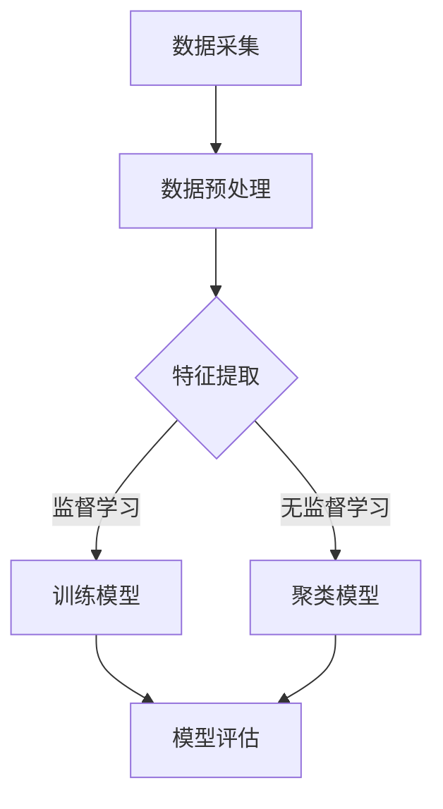

                 

# AI的全能性：LLM与图灵完备

> **关键词**：人工智能，全能性，语言模型，图灵完备性，深度学习，自然语言处理

> **摘要**：本文将深入探讨人工智能（AI）的全能性，特别是大型语言模型（LLM）和图灵完备性之间的关系。我们将逐步分析AI的核心概念、LLM的算法原理、数学模型，并探讨其应用与实践。文章旨在为读者提供一个清晰、深刻的理解，帮助大家把握AI全能性的本质，以及未来面临的挑战。

## 引言

人工智能（AI）自诞生以来，一直在不断演进，从简单的规则系统到复杂的深度学习模型，AI的技术和应用场景也在不断扩大。然而，尽管AI在图像识别、语音识别、自然语言处理等领域取得了显著进展，但实现一个真正“全能性”的AI系统仍然是一个巨大的挑战。本文将重点关注大型语言模型（LLM）和图灵完备性这两个关键概念，旨在探讨AI全能性的本质及其实现路径。

首先，我们将介绍AI全能性的定义及其重要性。接着，我们会详细讨论机器学习、深度学习的基本原理，并引入Mermaid流程图来展示AI模型的基本结构。随后，文章将深入探讨LLM的算法原理和架构，包括预训练与微调技术。在此基础上，我们将介绍数学模型和相关的公式，并使用伪代码详细阐述神经网络训练流程。最后，我们将探讨图灵完备性，分析LLM的图灵完备性及其在实际应用中的挑战和解决方案。

在文章的第二部分，我们将聚焦于AI全能性的应用实践，通过具体案例展示AI在自然语言处理、图像识别、医疗健康和金融分析等领域的应用。接着，我们将通过一个项目实战，带领读者构建一个全能性AI系统，详细解释系统设计思路、开发环境搭建、源代码实现和代码解读。

文章的结尾部分，我们将展望AI全能性的未来发展趋势，讨论面临的挑战与解决方案，并探讨AI全能性对社会的影响。希望通过本文的探讨，读者能够对AI的全能性有更深入的理解，为未来的AI研究和应用奠定基础。

## 第一部分：AI的全能性基础

### 第1章：AI全能性概述

#### 1.1 AI全能性的定义与重要性

AI全能性，通常指的是一个AI系统能够在多个领域和任务中表现出色，具备高度的适应性和学习能力。这种全能性不仅仅是在特定任务上的卓越表现，而是在各种不同环境和条件下，都能保持高效和准确的性能。在理论上，一个全能性的AI系统应该具备以下特征：

1. **广泛适应性**：能够在多种不同领域和应用场景中发挥作用。
2. **持续学习能力**：能够通过不断的学习和优化，提高自己的性能和适应能力。
3. **自主性**：能够在没有人类干预的情况下，独立完成复杂任务。
4. **泛化能力**：不仅能在训练数据上表现良好，还能在新数据和未知环境中表现稳定。

AI全能性的重要性在于，它能够极大地扩展AI的应用范围，提高AI系统的实用性。在一个全能性AI系统的帮助下，我们可以：

- **减少依赖性**：减少对人类专家的依赖，提高自动化和智能化的程度。
- **提高效率**：通过自动化和优化，提高生产效率，降低成本。
- **创新推动**：AI全能性可以激发新的创新，推动科技和社会的进步。
- **社会影响**：AI全能性可以应用于医疗、教育、交通、金融等各个领域，对社会产生深远的影响。

#### 1.2 全能性AI与图灵完备的关系

图灵完备性是计算机科学中的一个基本概念，指的是一个计算系统能够模拟图灵机的所有计算能力。图灵机是一种抽象的计算模型，由英国数学家艾伦·图灵在1930年代提出，它定义了现代计算机的理论基础。

一个图灵完备的AI系统意味着它具备执行任何可计算任务的能力，无论是在数学计算、逻辑推理，还是在自然语言处理、图像识别等领域。LLM（大型语言模型）正是这样一种系统，其强大的预训练和微调能力，使其在多种任务中表现出色。

LLM与图灵完备性的关系主要体现在以下几个方面：

1. **计算能力**：LLM通过深度神经网络和大规模数据预训练，具备了图灵机级别的计算能力。
2. **算法基础**：LLM的算法基础与图灵机的算法具有相似性，都依赖于复杂的计算和符号处理。
3. **应用范围**：LLM不仅在自然语言处理领域表现出色，还可以通过迁移学习，应用于其他图灵完备的计算任务。

#### 1.3 AI全能性的发展历程

AI全能性的发展历程可以追溯到人工智能的早期研究。以下是一些关键的发展阶段：

1. **规则系统时代（1950s-1960s）**：早期AI研究主要基于明确规则和逻辑推理，虽然在一些简单任务上表现出色，但在复杂任务上局限性明显。

2. **知识表示与推理（1970s-1980s）**：随着知识表示和推理技术的发展，AI系统开始能够处理更复杂的任务，但依然依赖于人工编写的规则和知识库。

3. **机器学习时代（1990s-2000s）**：随着机器学习技术的突破，特别是深度学习的崛起，AI开始能够在大量数据上自动学习和优化，表现出更高的灵活性和适应性。

4. **大型语言模型时代（2010s-至今）**：以LLM为代表的AI系统，通过大规模数据预训练和迁移学习，实现了在多种任务上的卓越表现，标志着AI全能性迈出了重要一步。

通过上述分析，我们可以看到，AI全能性不仅是一个理论上的概念，更是一个实践中的目标。在未来，随着技术的不断进步和应用场景的拓展，AI全能性将发挥越来越重要的作用，推动人工智能走向新的高度。

### 第2章：AI的核心概念与联系

#### 2.1 机器学习与深度学习的基本原理

机器学习和深度学习是AI的两个核心组成部分，它们在算法原理和应用范围上有显著的区别，但又是紧密联系的。理解它们的基本原理是深入探讨AI全能性的基础。

**机器学习（Machine Learning）**

机器学习是一种通过数据驱动的方法，让计算机系统从数据中学习和改进自身性能的技术。其基本原理可以概括为：

1. **数据采集**：从不同的数据源收集大量的训练数据。
2. **特征提取**：从数据中提取出有用的特征，用于模型训练。
3. **模型训练**：使用提取的特征和相应的标签，训练机器学习模型。
4. **模型评估**：通过交叉验证和测试集评估模型的性能，进行优化。

机器学习模型主要包括以下几种类型：

- **监督学习（Supervised Learning）**：训练数据包含输入和输出，模型通过学习输入和输出之间的映射关系，预测新的输入。常见的算法包括线性回归、决策树、随机森林、支持向量机（SVM）等。
- **无监督学习（Unsupervised Learning）**：训练数据仅包含输入，模型需要发现输入数据中的结构和模式。常见的算法包括聚类算法、主成分分析（PCA）、自编码器等。
- **半监督学习（Semi-Supervised Learning）**：结合有监督和无监督学习的方法，使用少量的标签数据和大量的无标签数据，提高模型的泛化能力。

**深度学习（Deep Learning）**

深度学习是机器学习的一个子领域，它使用多层神经网络（Neural Networks）进行学习，通过逐层提取特征，实现对复杂数据的高效处理。其基本原理可以概括为：

1. **前向传播（Forward Propagation）**：输入数据通过网络的各个层，每层都会进行计算和传递，最终得到输出。
2. **反向传播（Backpropagation）**：计算输出与实际标签之间的误差，通过反向传播算法，更新网络权重和偏置，优化模型。
3. **激活函数（Activation Function）**：用于引入非线性特性，使得网络能够拟合复杂的数据分布。
4. **优化算法（Optimization Algorithms）**：如随机梯度下降（SGD）、Adam等，用于加速训练过程和提升模型性能。

深度学习模型主要包括以下几种类型：

- **全连接神经网络（Fully Connected Neural Networks, FCNN）**：最基础的深度学习模型，适用于分类和回归任务。
- **卷积神经网络（Convolutional Neural Networks, CNN）**：主要用于图像识别任务，通过卷积操作提取图像特征。
- **循环神经网络（Recurrent Neural Networks, RNN）**：适用于序列数据处理，如自然语言处理和时间序列预测。
- **变分自编码器（Variational Autoencoders, VAE）**：用于生成对抗网络（Generative Adversarial Networks, GAN）的训练，可以生成高质量的数据。

**机器学习与深度学习的联系**

机器学习和深度学习之间有着紧密的联系，它们共同构成了现代AI的核心技术。以下是它们之间的联系：

1. **理论基础**：深度学习是机器学习的一个分支，其理论基础源于传统的机器学习算法，如反向传播算法和梯度下降优化。
2. **技术融合**：深度学习模型在许多机器学习任务中都表现出色，而机器学习算法也常常结合深度学习技术，如卷积神经网络在图像处理中的应用。
3. **应用拓展**：随着深度学习技术的进步，许多传统机器学习任务得以优化和扩展，如语音识别、自然语言处理、医疗诊断等。

通过深入理解机器学习和深度学习的基本原理，我们可以更好地把握AI的发展趋势，为构建全能性AI系统奠定基础。

#### 2.2 机器学习算法的分类与比较

机器学习算法种类繁多，根据其学习方式、任务类型和数据分布等特点，可以分为以下几类：

**1. 监督学习（Supervised Learning）**

监督学习是机器学习中最常见的类型之一，其核心思想是通过已标记的数据（输入和输出对）来训练模型，以便在新数据上预测结果。以下是几种主要的监督学习算法及其特点：

- **线性回归（Linear Regression）**：一种简单的回归算法，通过最小化误差平方和来预测连续值。
  - **优点**：计算简单，易于实现。
  - **缺点**：对非线性数据拟合能力差。

- **决策树（Decision Tree）**：通过一系列的判断条件，将数据分为不同的分支，最终得到分类或回归结果。
  - **优点**：直观易懂，易于解释。
  - **缺点**：对于高维数据和噪声敏感。

- **支持向量机（Support Vector Machine, SVM）**：通过最大化分类边界来分离不同类别的数据。
  - **优点**：在高维空间中表现良好，对噪声有较强的鲁棒性。
  - **缺点**：训练时间较长，对大量数据效果不佳。

- **随机森林（Random Forest）**：由多个决策树组成，通过投票或平均来决定最终结果。
  - **优点**：对噪声有较强的鲁棒性，泛化能力较强。
  - **缺点**：计算成本高，训练时间较长。

**2. 无监督学习（Unsupervised Learning）**

无监督学习不依赖于标记数据，主要目标是发现数据中的结构和模式。以下是几种主要的无监督学习算法及其特点：

- **K均值聚类（K-Means Clustering）**：将数据分为K个簇，使每个簇内的数据点距离簇中心最近。
  - **优点**：简单有效，适用于大规模数据。
  - **缺点**：对初始聚类中心敏感，易陷入局部最优。

- **主成分分析（Principal Component Analysis, PCA）**：通过正交变换，将数据投影到新的坐标系中，减少维度并保留主要信息。
  - **优点**：降低维度，便于可视化。
  - **缺点**：对噪声敏感，可能会丢失部分信息。

- **自编码器（Autoencoder）**：通过编码和解码过程，自动学习数据中的特征表示。
  - **优点**：能够提取数据的低维表示。
  - **缺点**：训练过程复杂，对大量数据有较高要求。

**3. 半监督学习（Semi-Supervised Learning）**

半监督学习结合了监督学习和无监督学习的方法，利用少量的标记数据和大量的无标签数据来训练模型。以下是几种常见的半监督学习算法：

- **标签传播（Label Propagation）**：通过已标记的数据点，逐步传播标签到未标记的数据点。
  - **优点**：简单有效，对少量标记数据效果显著。
  - **缺点**：对噪声敏感，可能会引入错误标签。

- **图嵌入（Graph Embedding）**：通过将图数据转换为低维向量表示，实现半监督学习。
  - **优点**：适用于图结构数据，能够保留图中的拓扑关系。
  - **缺点**：对大规模图数据计算复杂度较高。

**4. 强化学习（Reinforcement Learning）**

强化学习通过与环境交互，不断调整策略以最大化累积奖励。以下是几种主要的强化学习算法：

- **Q学习（Q-Learning）**：通过学习Q值函数，选择最佳动作序列。
  - **优点**：适用于离散动作空间。
  - **缺点**：收敛速度较慢，对状态-动作空间有较高要求。

- **深度Q网络（Deep Q-Network, DQN）**：结合深度学习，用于处理连续动作空间。
  - **优点**：能够处理高维状态空间。
  - **缺点**：需要大量数据训练，对噪声敏感。

**机器学习算法的比较**

机器学习算法的选择取决于具体的应用场景和数据特点。以下是几种算法的比较：

| 算法       | 适用场景        | 优点                           | 缺点                             |
| ---------- | -------------- | ------------------------------ | -------------------------------- |
| 线性回归   | 简单回归任务    | 计算简单，易于实现              | 对非线性数据拟合能力差          |
| 决策树     | 分类和回归任务  | 直观易懂，易于解释              | 对噪声敏感，易过拟合            |
| 支持向量机 | 高维空间分类    | 高维空间中表现良好，对噪声有较强鲁棒性 | 训练时间较长，对大量数据效果不佳 |
| 随机森林   | 多分类和回归任务 | 对噪声有较强鲁棒性，泛化能力较强 | 计算成本高，训练时间较长        |
| K均值聚类  | 聚类任务        | 简单有效，适用于大规模数据      | 对初始聚类中心敏感，易陷入局部最优 |
| 主成分分析  | 维度降低        | 降低维度，便于可视化            | 对噪声敏感，可能会丢失部分信息    |
| 自编码器   | 特征提取        | 能够提取数据的低维表示          | 训练过程复杂，对大量数据有较高要求  |

通过以上比较，我们可以根据具体任务和数据特点，选择合适的机器学习算法，为AI全能性的实现提供有力支持。

#### 2.3 Mermaid流程图：AI模型的基本结构

为了更好地理解AI模型的基本结构，我们可以使用Mermaid流程图来展示其关键组件和流程。以下是AI模型的基本结构的Mermaid流程图：



**流程说明：**

1. **数据采集（A）**：从不同的数据源收集大量的训练数据。
2. **数据预处理（B）**：对原始数据进行清洗、归一化等预处理操作，以便后续的特征提取。
3. **特征提取（C）**：从预处理后的数据中提取出有用的特征，用于模型训练。
4. **训练模型（D）**：根据特征和相应的标签，训练监督学习模型，如线性回归、决策树、支持向量机等。
5. **聚类模型（E）**：对无标签数据使用无监督学习算法，如K均值聚类、主成分分析等。
6. **模型评估（F）**：通过交叉验证和测试集，评估模型的性能，进行优化。

通过Mermaid流程图，我们可以清晰地看到AI模型从数据采集到模型评估的全过程，这有助于我们更好地理解和设计AI系统。

### 第3章：LLM算法原理与架构

#### 3.1 语言模型的基本原理

语言模型（Language Model，简称LM）是自然语言处理（Natural Language Processing，简称NLP）中的一种重要技术，其主要目标是预测自然语言中的一个词或短语。LLM（Large Language Model）是语言模型的扩展，通过大规模数据预训练和微调，实现了在多种任务中的卓越表现。LLM的基本原理可以概括为：

1. **输入序列表示**：将输入的文本序列表示为向量，通常使用词嵌入（Word Embedding）技术。
2. **上下文理解**：通过多层神经网络，捕捉输入序列的上下文信息，实现语义理解和预测。
3. **概率分布生成**：输出一个概率分布，表示下一个词或短语的候选。

LLM的核心思想是利用大规模语料库，通过深度神经网络自动学习词汇和语法规则，从而实现对自然语言的建模。LLM的预训练过程通常包括以下几个步骤：

1. **数据准备**：收集大量的文本数据，并进行预处理，如分词、去噪等。
2. **词嵌入**：将文本中的每个词映射为低维向量，通常使用Word2Vec、GloVe等预训练模型。
3. **模型初始化**：初始化深度神经网络模型，如Transformer、BERT等。
4. **预训练**：在大量文本数据上，通过无监督的方式，对模型进行训练，学习词汇和语法规则。
5. **微调**：在特定任务上，使用少量有监督数据，对模型进行微调，提高任务表现。

#### 3.2 预训练与微调技术

预训练（Pre-training）和微调（Fine-tuning）是LLM中两个关键的技术，它们共同构成了LLM的训练过程。

**预训练**

预训练是LLM的核心技术，其主要目标是利用大规模未标注数据，对模型进行初始化和基础训练。预训练过程主要包括以下几个步骤：

1. **数据准备**：收集大量的文本数据，如维基百科、新闻文章、社交媒体等。
2. **分词与词嵌入**：将文本数据分词，并使用词嵌入技术，将每个词映射为低维向量。
3. **模型初始化**：初始化深度神经网络模型，如Transformer、BERT等。
4. **预训练过程**：在未标注数据上，通过自注意力机制（Self-Attention）和多层神经网络，对模型进行训练，学习词汇和语法规则。

预训练的主要优势在于，它能够利用大规模未标注数据，提高模型的泛化能力，减少对标注数据的依赖。此外，预训练还可以通过迁移学习（Transfer Learning），将模型在多个任务上训练，进一步提高模型的表现。

**微调**

微调是在特定任务上，对预训练模型进行进一步训练的过程。其主要目标是通过少量有监督数据，优化模型在特定任务上的表现。微调过程主要包括以下几个步骤：

1. **数据准备**：收集少量有监督数据，如标注的文本、问答对等。
2. **数据预处理**：对有监督数据进行预处理，如分词、去除停用词等。
3. **模型微调**：在特定任务上，使用有监督数据，对预训练模型进行微调。
4. **模型评估**：在测试集上评估模型的表现，并进行优化。

微调的优势在于，它能够利用少量有监督数据，快速提升模型在特定任务上的性能。此外，微调还可以通过模型调整，使模型更加适应特定的应用场景。

#### 3.3 图灵完备语言模型的架构

图灵完备语言模型（Turing-Complete Language Model）是一种能够模拟图灵机计算能力的语言模型，其架构通常基于深度神经网络。以下是图灵完备语言模型的基本架构：

1. **输入层**：接收输入文本序列，并将其转换为词嵌入向量。
2. **编码器**：通过多层神经网络，对输入序列进行编码，提取上下文信息。
3. **解码器**：接收编码器输出的上下文信息，并生成输出序列的概率分布。
4. **注意力机制**：在编码和解码过程中，使用注意力机制，捕捉输入序列中的关键信息。
5. **循环神经网络（RNN）**：在编码和解码过程中，使用RNN，实现序列信息的传递和更新。
6. **损失函数**：使用交叉熵损失函数，计算输入序列和输出序列之间的差异，优化模型。

图灵完备语言模型的架构使得模型能够处理复杂的自然语言任务，如文本生成、问答系统、机器翻译等。其核心优势在于，它能够通过深度神经网络和注意力机制，实现高效的语义理解和生成。

通过以上分析，我们可以看到，LLM作为图灵完备的语言模型，其基本原理和架构为其在多种任务中的卓越表现奠定了基础。随着预训练和微调技术的不断进步，LLM将在人工智能领域发挥越来越重要的作用。

#### 3.4 数学模型与公式

在LLM的训练过程中，数学模型和公式起着至关重要的作用。以下我们将介绍一些核心的数学概念和公式，以便更好地理解LLM的工作原理。

**1. 概率论与信息论基础**

**概率论**

概率论是LLM训练过程中不可或缺的基础。在语言模型中，概率论用于计算文本序列的概率分布。

- **条件概率**：给定事件A和事件B，条件概率P(A|B)表示在事件B发生的条件下，事件A发生的概率。
  $$ P(A|B) = \frac{P(A \cap B)}{P(B)} $$
- **贝叶斯定理**：用于计算后验概率，即给定某些证据，计算某一假设的概率。
  $$ P(A|B) = \frac{P(B|A)P(A)}{P(B)} $$

**信息论**

信息论提供了量化信息的方法，用于评估文本序列的熵、信息量和不确定性。

- **熵（Entropy）**：表示随机变量的不确定性。
  $$ H(X) = -\sum_{i} p(x_i) \log_2 p(x_i) $$
- **互信息（Mutual Information）**：表示两个随机变量之间的相关性。
  $$ I(X;Y) = H(X) - H(X|Y) $$

**2. 神经网络与优化算法**

**神经网络**

神经网络是LLM的核心组成部分，通过多层神经元之间的连接，实现从输入到输出的映射。

- **前向传播（Forward Propagation）**：计算输入经过网络后的输出。
  $$ y = \sigma(Wx + b) $$
  其中，\( y \) 为输出，\( \sigma \) 为激活函数，\( W \) 和 \( b \) 分别为权重和偏置。

- **反向传播（Backpropagation）**：计算损失函数关于网络参数的梯度，用于优化模型。
  $$ \frac{\partial J}{\partial W} = \frac{\partial L}{\partial z} \cdot \frac{\partial z}{\partial W} $$
  $$ \frac{\partial J}{\partial b} = \frac{\partial L}{\partial z} $$

**优化算法**

优化算法用于调整网络参数，最小化损失函数。

- **随机梯度下降（Stochastic Gradient Descent，SGD）**：每次迭代使用一个样本的梯度，更新网络参数。
  $$ W = W - \alpha \frac{\partial J}{\partial W} $$
  $$ b = b - \alpha \frac{\partial J}{\partial b} $$

- **Adam优化器**：结合SGD和动量方法，提高了优化过程的稳定性。
  $$ m = \beta_1 x + (1 - \beta_1) (x - \frac{1}{t}) $$
  $$ v = \beta_2 x + (1 - \beta_2) (x^2 - \frac{1}{t}) $$
  $$ \hat{m} = \frac{m}{1 - \beta_1^t} $$
  $$ \hat{v} = \frac{v}{1 - \beta_2^t} $$
  $$ W = W - \alpha \frac{\hat{m}}{\sqrt{\hat{v}} + \epsilon} $$
  $$ b = b - \alpha \frac{\hat{m}}{\sqrt{\hat{v}} + \epsilon} $$

**3. 伪代码：神经网络训练流程**

以下是一个简化的神经网络训练流程的伪代码：

```
初始化模型参数 W, b
设置学习率 α，迭代次数 t
设置优化算法 Adam 的超参数 β1, β2

for epoch in 1 to t:
    for x, y in dataset:
        # 前向传播
        z = W * x + b
        a = σ(z)

        # 计算损失 L
        L = -y * log(a)

        # 反向传播
        dz = a - y
        dw = x * dz
        db = dz

        # 更新参数
        W = W - α * dw
        b = b - α * db

    # 打印当前 epoch 的损失
    print("Epoch", epoch, "Loss:", L)

# 输出训练好的模型参数 W, b
return W, b
```

通过上述数学模型和公式的介绍，我们可以看到，LLM的训练过程涉及多个层面的计算和优化，这些数学工具和方法为其高效学习和应用提供了坚实的基础。

### 第4章：图灵完备性探讨

#### 5.1 图灵机的原理与局限性

图灵机是一种抽象的计算模型，由英国数学家艾伦·图灵在1930年代提出，它是现代计算机科学的基础。图灵机的原理可以概括为：

1. **组成**：图灵机由以下几个部分组成：
   - **输入带**：用于存储输入数据，由一组可以读写的小方格组成。
   - **读写头**：用于在输入带上读取和写入数据。
   - **控制单元**：根据程序规则，决定读写头如何移动和操作数据。
   - **状态寄存器**：存储当前状态，根据程序规则更新。

2. **工作原理**：
   - **状态转换**：根据当前状态和读写头读取的字符，控制单元决定下一个操作（如移动读写头、写入新字符、切换状态）。
   - **计算过程**：通过不断的状态转换，图灵机能够模拟任何可计算过程。

图灵机的局限性主要表现在以下几个方面：

1. **物理限制**：图灵机是一个理论模型，其操作过程受到物理设备的限制，如读写头的速度、输入带的长度等。
2. **计算复杂性**：对于某些复杂的计算任务，图灵机的计算效率较低，可能需要无限时间才能完成。
3. **存储限制**：图灵机的输入带是有限的，对于大量数据的处理，可能面临存储限制。

尽管有这些局限性，图灵机作为计算理论的基础，对现代计算机科学的发展产生了深远的影响。

#### 5.2 图灵完备语言模型的挑战与解决方案

LLM作为图灵完备的语言模型，面临着一系列挑战，主要包括计算资源、训练时间和泛化能力等方面。

**计算资源**

预训练一个大型LLM需要大量的计算资源，包括计算能力和存储空间。解决方案包括：

1. **分布式计算**：使用多个计算节点，通过并行计算加速模型训练。
2. **云计算**：利用云计算平台，提供强大的计算能力和存储资源。
3. **专用硬件**：使用GPU、TPU等专用硬件，提高计算效率。

**训练时间**

预训练一个大型LLM需要数百万到数十亿个训练步（steps），这需要大量时间。解决方案包括：

1. **增量训练**：在已有模型的基础上，使用新数据继续训练，减少训练时间。
2. **迁移学习**：将预训练模型迁移到新任务，减少从零开始训练的时间。
3. **数据增强**：通过数据增强技术，增加训练样本的数量，提高模型性能。

**泛化能力**

LLM的泛化能力是一个关键问题，特别是在面对未知任务和数据时。解决方案包括：

1. **多任务学习**：在一个大型模型上训练多个任务，提高模型的泛化能力。
2. **元学习**：通过元学习技术，使模型能够快速适应新任务。
3. **对齐技术**：使用对抗训练和对齐技术，提高模型在多任务上的性能。

**图灵完备性与实际应用**

图灵完备性意味着LLM能够执行任何可计算的任务，这为实际应用提供了广阔的前景。以下是几个实际应用场景：

1. **自然语言处理**：LLM在文本生成、问答系统、机器翻译等领域表现出色，成为NLP任务的核心技术。
2. **代码自动生成**：LLM可以理解编程语言的结构和语义，用于自动生成代码，提高开发效率。
3. **图像识别与生成**：通过迁移学习，LLM可以应用于图像识别和生成任务，如风格迁移和图像超分辨率。

通过解决计算资源、训练时间和泛化能力等方面的挑战，图灵完备语言模型将在人工智能领域发挥越来越重要的作用，推动AI技术的进步和应用。

### 第5章：图灵完备性探讨

#### 5.1 图灵机的原理与局限性

图灵机（Turing Machine）是由英国数学家艾伦·图灵（Alan Turing）于1936年提出的一种抽象计算模型。它为现代计算机科学和理论计算机科学奠定了基础。图灵机的核心思想是将算法表示为一系列的步骤，通过读写一个无限长的带子上的符号来完成计算任务。

**组成与工作原理**

图灵机主要由以下几个部分组成：

1. **无限长的带（无限带）**：带子被划分为一个个的小方格，每个小方格可以存储一个符号。带子可以无限延伸，为计算提供足够的空间。
2. **读写头**：读写头可以在带子上左右移动，并能够在当前位置读取和写入符号。
3. **控制器（状态寄存器）**：控制器根据当前状态和读写头读取的符号，决定下一步的操作（如移动读写头、写入新符号、切换状态）。

图灵机的工作原理可以概括为：

- **初始状态**：在计算开始时，图灵机处于一个特定的初始状态，读写头位于带子上的某个位置。
- **状态转换**：当读写头读取到某个符号时，控制器会根据当前状态和读取的符号，决定下一步的操作（如移动读写头、写入新符号、切换状态）。
- **计算过程**：通过不断地进行状态转换，图灵机能够模拟任何可计算过程，最终完成计算任务。

**局限性**

尽管图灵机是一种强大的计算模型，但它也存在一些局限性：

1. **物理限制**：图灵机是一个理论模型，其操作过程受到物理设备的限制，如读写头的速度、带子的长度等。在实际应用中，这些物理限制会导致计算效率低下。
2. **计算复杂性**：对于某些复杂的计算任务，图灵机的计算效率较低，可能需要无限时间才能完成。例如，图灵机在处理大规模数据时，可能面临时间复杂度的问题。
3. **存储限制**：图灵机的输入带是有限的，对于大量数据的处理，可能面临存储限制。这限制了图灵机在处理复杂计算任务时的应用。

尽管有这些局限性，图灵机作为计算理论的基础，对现代计算机科学的发展产生了深远的影响。它为理解计算的本质、算法的设计和分析提供了重要的理论工具。

#### 5.2 图灵完备语言模型的挑战与解决方案

图灵完备语言模型（Turing-Complete Language Model），如大型语言模型（LLM），是一种能够模拟图灵机计算能力的语言模型。它们通过深度神经网络和大规模数据预训练，实现了在多种任务中的卓越表现。然而，图灵完备语言模型在实际应用中仍然面临着一系列挑战。

**计算资源**

预训练一个大型LLM需要大量的计算资源，包括计算能力和存储空间。这给研究和实际应用带来了巨大挑战。以下是一些解决方案：

1. **分布式计算**：通过使用多个计算节点，实现并行计算，从而加速模型训练。这包括使用集群、分布式系统等。
2. **云计算**：利用云计算平台，如Google Cloud、AWS、Azure等，提供强大的计算能力和存储资源。云计算平台的弹性和灵活性，使得研究人员可以按需分配资源，降低成本。
3. **专用硬件**：使用GPU（图形处理单元）、TPU（张量处理单元）等专用硬件，提高计算效率。这些硬件在处理大规模并行计算任务时，比通用CPU有更高的性能。

**训练时间**

预训练一个大型LLM需要数百万到数十亿个训练步（steps），这需要大量时间。以下是一些解决方案：

1. **增量训练**：在已有模型的基础上，使用新数据继续训练，减少训练时间。这种方法称为“增量学习”或“持续学习”。
2. **迁移学习**：将预训练模型迁移到新任务，减少从零开始训练的时间。这种方法利用了预训练模型在通用任务上的知识，提高了在新任务上的训练效率。
3. **数据增强**：通过数据增强技术，增加训练样本的数量，提高模型性能。数据增强包括数据复制、数据变换等，使得模型在更多样化的数据上训练。

**泛化能力**

LLM的泛化能力是一个关键问题，特别是在面对未知任务和数据时。以下是一些解决方案：

1. **多任务学习**：在一个大型模型上训练多个任务，提高模型的泛化能力。这种方法利用了任务之间的相关性，使得模型能够更好地适应新任务。
2. **元学习**：通过元学习技术，使模型能够快速适应新任务。元学习关注模型在不同任务上的迁移能力，通过训练多个任务，提高模型的泛化能力。
3. **对齐技术**：使用对抗训练和对齐技术，提高模型在多任务上的性能。对抗训练通过对模型进行对抗训练，使得模型能够更好地处理不同任务之间的差异。

**图灵完备性与实际应用**

图灵完备性意味着LLM能够执行任何可计算的任务，这为实际应用提供了广阔的前景。以下是一些实际应用场景：

1. **自然语言处理**：LLM在文本生成、问答系统、机器翻译等领域表现出色，成为NLP任务的核心技术。
2. **代码自动生成**：LLM可以理解编程语言的结构和语义，用于自动生成代码，提高开发效率。
3. **图像识别与生成**：通过迁移学习，LLM可以应用于图像识别和生成任务，如风格迁移和图像超分辨率。

通过解决计算资源、训练时间和泛化能力等方面的挑战，图灵完备语言模型将在人工智能领域发挥越来越重要的作用，推动AI技术的进步和应用。

### 第6章：AI全能性在自然语言处理中的应用

#### 6.1 语言生成与翻译

自然语言处理（NLP）是AI全能性的重要体现之一，其中语言生成和翻译是两个关键应用领域。在这两部分中，AI通过强大的语言模型，实现了自动文本生成和跨语言翻译，大大提高了信息处理和交流的效率。

**语言生成**

语言生成是指AI系统能够根据给定的输入或无特定输入，生成符合语法和语义规则的文本。这种能力广泛应用于聊天机器人、内容创作、自动摘要等领域。以下是一个简单的语言生成流程：

1. **输入处理**：将输入文本序列表示为向量，通过词嵌入技术将每个词映射为低维向量。
2. **上下文理解**：使用预训练的深度神经网络（如Transformer、BERT等），捕捉输入序列的上下文信息，提取语义特征。
3. **生成文本**：通过递归神经网络（RNN）或Transformer等模型，根据上下文信息和生成的概率分布，逐个生成新的词，直到生成完整的句子或段落。

一个实际案例是OpenAI的GPT（Generative Pre-trained Transformer）系列模型，通过大规模数据预训练，GPT能够生成高质量的文本，包括文章、对话和诗歌等。例如，用户可以输入一个简单的主题或关键词，GPT就能生成一篇完整的文章。

**翻译**

跨语言翻译是自然语言处理中的另一个重要应用，它使得人们能够轻松地理解和交流不同语言的信息。以下是翻译的基本流程：

1. **输入处理**：将输入文本序列表示为向量，通过词嵌入技术将每个词映射为低维向量。
2. **编码器处理**：使用预训练的编码器模型（如BERT、Transformer等），将源语言文本转换为向量表示，提取语义特征。
3. **解码器处理**：使用预训练的解码器模型，将目标语言文本的向量表示解码为可理解的文本。
4. **生成翻译文本**：根据解码器输出的概率分布，逐个生成新的词，直到生成完整的句子或段落。

一个著名的翻译模型是Google翻译，它使用了基于神经网络的翻译模型，通过大规模数据预训练，实现了高效、准确的跨语言翻译。例如，用户可以将一段英文文本输入到Google翻译中，系统会自动将其翻译为其他语言的文本。

**技术优势**

语言生成和翻译技术具有以下几个显著优势：

1. **高效性**：AI系统可以快速处理大量文本，实现实时生成和翻译。
2. **准确性**：通过深度学习和大规模数据预训练，AI系统能够生成和翻译高质量的文本，减少错误和歧义。
3. **多样性**：AI系统能够根据上下文和用户需求，生成和翻译多种不同风格和格式的文本。
4. **灵活性**：AI系统能够适应多种应用场景，包括聊天机器人、内容创作、自动摘要和跨语言交流等。

通过上述技术，AI在自然语言处理中的应用大大提升了信息处理和交流的效率，为各种实际场景提供了强大的支持。随着技术的不断进步，AI在自然语言处理领域将发挥越来越重要的作用，推动人工智能的全面发展。

#### 6.2 问答系统与对话生成

问答系统（Question Answering System）和对话生成（Dialogue Generation）是自然语言处理（NLP）中的重要应用，它们利用AI的能力，实现智能交互和信息检索。以下是这两个领域的具体应用和实现方法。

**问答系统**

问答系统的主要目标是从大量文本中自动提取答案，以回答用户的问题。其基本流程包括以下步骤：

1. **问题理解**：将用户输入的问题转换为可处理的格式，提取关键信息。
2. **文本检索**：在大量文本数据中检索与问题相关的信息。
3. **答案生成**：利用自然语言生成（NLG）技术，将检索到的信息转化为自然语言形式的答案。

实现问答系统的主要方法有以下几种：

- **基于规则的方法**：通过预定义的规则和模板，匹配问题和答案。这种方法简单直观，但灵活性较差，难以处理复杂问题。
- **基于知识库的方法**：使用知识库存储大量事实信息，通过查询和推理技术回答问题。这种方法适用于结构化数据，但在处理自然语言问题时存在局限性。
- **基于机器学习的方法**：使用监督学习或深度学习方法，从大量标注数据中学习问题的表示和答案的生成。例如，使用BERT模型进行文本编码，通过序列到序列（Seq2Seq）模型生成答案。

一个实际案例是Google Assistant，它通过预训练的BERT模型和基于Transformer的Seq2Seq模型，实现了高质量的问答功能。用户提出问题后，系统会自动检索相关文档，并生成自然流畅的答案。

**对话生成**

对话生成是指AI系统能够根据上下文和用户的输入，生成连贯、自然的对话。对话生成广泛应用于聊天机器人、客服系统、虚拟助手等领域。以下是实现对话生成的主要步骤：

1. **上下文理解**：捕捉用户输入的对话上下文，提取关键信息和情感倾向。
2. **回复生成**：根据上下文信息，生成自然、连贯的回复。常用的方法包括：
   - **基于模板的方法**：使用预定义的模板和规则，生成对话回复。这种方法生成对话简洁明了，但缺乏灵活性。
   - **基于生成模型的方法**：使用生成模型（如GPT-3、T5等），从大量对话数据中学习对话生成规律，生成自然流畅的对话。这种方法灵活性强，但需要大量训练数据和计算资源。
   - **基于交互模型的方法**：结合生成模型和交互模型，通过迭代交互，逐步生成对话。这种方法能够更好地捕捉用户的意图和情感，生成更自然的对话。

一个实际案例是OpenAI的GPT-3，它通过大规模数据预训练，实现了高质量的对话生成。用户可以与GPT-3进行自然语言交互，系统会根据对话上下文生成连贯、自然的回复。

**技术优势**

问答系统和对话生成技术在AI全能性中的应用具有以下几个显著优势：

1. **交互性**：问答系统和对话生成能够实现人与AI的智能交互，提升用户体验。
2. **自动化**：通过自动化回答问题和生成对话，节省人力和时间成本。
3. **灵活性**：生成模型和交互模型能够根据不同场景和需求，灵活调整对话内容和风格。
4. **适应性**：通过不断学习和优化，AI系统能够适应多种应用场景，提高系统的适应性和泛化能力。

总之，问答系统和对话生成技术在自然语言处理中的应用，不仅提高了信息处理和交互的效率，也为AI全能性的实现提供了强有力的支持。随着技术的不断发展，这些应用将在更多领域得到广泛应用。

#### 6.3 代码自动生成

代码自动生成是人工智能（AI）在编程领域中的一个重要应用，它利用机器学习模型，从代码样例或自然语言描述中自动生成代码。这种方法不仅提高了编程效率，还降低了开发难度，特别是在处理重复性任务和复杂代码时。以下是代码自动生成的基本原理、实现方法以及实际应用案例。

**基本原理**

代码自动生成通常基于以下几种原理：

1. **模式识别**：通过分析大量的代码样例，模型学习到代码的结构和模式，从而能够根据新的输入生成相似的代码。

2. **自然语言处理**：将自然语言描述转换为代码。这种方法依赖于自然语言生成（NLG）技术，如序列到序列（Seq2Seq）模型，将自然语言文本转换为代码。

3. **代码到代码转换**：利用一种编程语言的代码样例，生成另一种编程语言的代码。这种方法通过学习不同编程语言之间的转换规则，实现代码的自动转换。

**实现方法**

代码自动生成的实现方法主要包括以下几种：

1. **基于规则的方法**：这种方法通过预定义的规则和模板，生成代码。例如，生成SQL查询时，根据用户输入的自然语言描述，自动构建相应的查询语句。

2. **基于模板的方法**：使用预定义的代码模板和参数，根据输入参数生成代码。这种方法简单直观，但灵活性较差，难以处理复杂的编程任务。

3. **基于机器学习的方法**：使用监督学习或深度学习方法，从大量标注的代码样例中学习生成规则。例如，使用Transformer模型，通过编码器-解码器架构，将自然语言描述转换为代码。

4. **基于代码到代码转换的方法**：这种方法通过学习不同编程语言之间的转换规则，实现代码的自动转换。例如，将Python代码转换为Java代码。

**实际应用案例**

以下是一些代码自动生成的实际应用案例：

1. **代码补全**：IDE（集成开发环境）中的代码补全功能，通过分析代码上下文，自动补全代码片段。例如，VSCode中的智能感知（IntelliSense）功能。

2. **代码生成工具**：如GitHub的CodeQL，通过分析代码库中的模式，自动生成安全问题和代码缺陷的报告。

3. **自然语言描述到代码**：OpenAI的Coder，通过自然语言描述，自动生成Python代码。用户可以输入简单的自然语言描述，如“编写一个函数，用于计算两个数字的和”，Coder会生成相应的代码。

4. **跨语言代码转换**：Google的Tensor2Tensor（T2T），通过学习不同编程语言之间的转换规则，自动将一种编程语言的代码转换为另一种编程语言的代码。

**技术优势**

代码自动生成技术在编程领域具有以下几个显著优势：

1. **效率提升**：通过自动生成代码，减少手动编写代码的时间和工作量，提高开发效率。

2. **错误减少**：通过分析大量代码样例，模型能够生成高质量的代码，减少编程错误和缺陷。

3. **灵活性**：自动生成的代码可以根据用户需求和应用场景进行灵活调整，适应不同的开发任务。

4. **开发体验**：代码自动生成工具提供了直观、便捷的开发体验，使得编程变得更加简单和有趣。

总之，代码自动生成技术为编程领域带来了革命性的变化，它不仅提高了开发效率，还降低了开发难度，为程序员和开发团队提供了强大的支持。随着技术的不断进步，代码自动生成将在更多应用场景中得到广泛应用，推动编程技术的发展。

### 第7章：AI全能性在其他领域中的应用

#### 7.1 人工智能与图像识别

人工智能在图像识别领域的应用日益广泛，通过深度学习和卷积神经网络（CNN），AI系统能够自动识别和理解图像中的内容。图像识别技术的核心是能够从复杂的图像数据中提取有用的特征，从而实现高精度的分类和检测。

**技术原理**

图像识别技术基于以下原理：

1. **卷积神经网络（CNN）**：CNN是专门用于图像识别的神经网络结构，其核心思想是通过卷积操作提取图像的局部特征，并通过池化操作减少数据的维度。

2. **特征提取**：在CNN训练过程中，多层卷积和池化操作将图像从像素级别逐步抽象到语义级别，提取出具有区分性的特征。

3. **分类与检测**：提取到的特征通过全连接层进行分类或检测，实现图像的准确识别和定位。

**实现方法**

图像识别的实现方法主要包括：

1. **预训练模型**：使用预训练的CNN模型（如ResNet、VGG等）进行迁移学习，将模型迁移到具体任务上，通过少量有监督数据进行微调。

2. **数据增强**：通过数据增强技术（如翻转、旋转、缩放等）增加训练样本的多样性，提高模型对图像变化的鲁棒性。

3. **集成学习**：将多个模型进行集成，通过投票或平均的方式提高模型的准确性和鲁棒性。

**实际应用案例**

以下是一些图像识别技术的实际应用案例：

1. **人脸识别**：AI系统能够自动识别人脸，并在人群中进行人脸检测和追踪，广泛应用于安防、人脸支付等领域。

2. **医疗影像分析**：AI系统通过分析医学影像（如X光片、CT扫描、MRI等），辅助医生进行疾病诊断和病情评估，提高诊断的准确性和效率。

3. **自动驾驶**：自动驾驶系统利用图像识别技术，实时识别道路上的车辆、行人、交通标志等，确保车辆的安全行驶。

**技术优势**

图像识别技术在多个领域具有以下优势：

1. **高精度**：通过深度学习模型，图像识别技术能够实现高精度的分类和检测，显著提高系统的性能。

2. **实时性**：图像识别技术能够实时处理和分析图像数据，满足实时性要求，如自动驾驶、实时监控等。

3. **泛化能力**：通过迁移学习和数据增强，图像识别技术能够适应不同的场景和任务，具备较强的泛化能力。

4. **自动化**：图像识别技术实现了图像数据的自动化处理，减少了对人工操作的依赖，提高了工作效率。

总之，人工智能在图像识别领域的应用极大地推动了计算机视觉技术的发展，为各行各业提供了强大的技术支持。随着技术的不断进步，图像识别技术将在更多领域得到广泛应用，为社会带来更多价值。

#### 7.2 人工智能与医疗健康

人工智能在医疗健康领域的应用正日益广泛，其潜力得到了充分的发掘。AI技术通过深度学习、自然语言处理和大数据分析等多种手段，为医疗诊断、疾病预测、个性化治疗和患者护理提供了强有力的支持。

**技术原理**

在医疗健康领域，人工智能的核心原理主要包括：

1. **大数据分析**：通过收集和分析大量的医疗数据，包括电子病历、医学影像、基因组数据等，AI系统可以发现潜在的模式和规律。

2. **机器学习与深度学习**：利用机器学习和深度学习算法，对医疗数据进行分析和建模，实现疾病的诊断、预测和个性化治疗。

3. **自然语言处理**：通过对医疗文本数据（如病历、医生笔记）进行自然语言处理，提取关键信息，辅助临床决策和科研分析。

**实现方法**

人工智能在医疗健康领域的实现方法主要包括以下几种：

1. **疾病预测与诊断**：通过分析患者的电子病历、实验室检测结果和医学影像，AI系统可以预测疾病的发病风险，辅助医生进行诊断。

2. **个性化治疗**：基于患者的基因组数据、病史和生活习惯，AI系统可以制定个性化的治疗方案，提高治疗效果。

3. **医疗影像分析**：利用深度学习模型，对医学影像（如X光片、CT扫描、MRI）进行自动分析，辅助医生识别病变和进行诊断。

4. **药物研发**：通过分析大量的化学结构和生物学数据，AI系统可以预测新药的疗效和副作用，加速药物研发过程。

**实际应用案例**

以下是一些人工智能在医疗健康领域的实际应用案例：

1. **肺癌诊断**：利用深度学习模型，AI系统可以自动分析肺部CT扫描图像，识别肺癌的早期病变，提高诊断的准确性和效率。

2. **糖尿病预测与监控**：通过分析患者的血糖数据、生活习惯和家族病史，AI系统可以预测糖尿病的发病风险，并监控病情的发展，辅助医生制定个性化的治疗计划。

3. **医疗文本分析**：自然语言处理技术可以自动分析医生的病历记录，提取关键信息，辅助临床决策和科研分析。

4. **手术机器人**：结合计算机视觉和机器人技术，AI系统可以辅助外科医生进行微创手术，提高手术的精度和安全。

**技术优势**

人工智能在医疗健康领域的应用具有以下显著优势：

1. **提高诊断效率**：通过自动化分析，AI系统可以快速处理大量医疗数据，提高诊断效率和准确性。

2. **个性化治疗**：基于大数据分析和机器学习，AI系统可以为患者提供个性化的治疗方案，提高治疗效果。

3. **降低医疗成本**：通过自动化和智能化，AI系统可以减少对人工操作的依赖，降低医疗成本。

4. **改善患者体验**：AI系统可以帮助患者更好地管理健康，提供个性化的健康建议，提高患者的生活质量。

总之，人工智能在医疗健康领域的应用不仅提升了医疗服务的质量和效率，还为医学研究和新药研发提供了强大的支持。随着技术的不断进步，AI在医疗健康领域的应用将更加广泛，为社会带来更多福祉。

#### 7.3 人工智能与金融分析

人工智能在金融分析领域中的应用正在迅速扩展，其强大的数据处理和模式识别能力为金融市场分析、风险管理和投资决策提供了强有力的支持。通过深度学习、机器学习等技术，AI系统能够从大量金融数据中提取有用信息，实现高效、精准的金融分析。

**技术原理**

在金融分析领域，人工智能的核心原理包括：

1. **大数据分析**：通过收集和分析大量的金融数据，包括股票价格、交易量、宏观经济指标等，AI系统可以发现市场趋势和潜在的风险因素。

2. **机器学习与深度学习**：利用机器学习和深度学习算法，对金融数据进行分析和建模，预测市场走势、发现投资机会和风险。

3. **自然语言处理**：通过处理新闻、报告等文本数据，提取市场情绪和关键信息，辅助投资决策。

**实现方法**

人工智能在金融分析领域的实现方法主要包括以下几种：

1. **市场预测**：通过分析历史交易数据和宏观经济指标，AI系统可以预测股票、期货等金融产品的价格走势，为投资决策提供参考。

2. **风险管理**：利用机器学习算法，AI系统可以识别和评估金融风险，如信用风险、市场风险等，帮助企业制定有效的风险管理策略。

3. **投资组合优化**：通过分析市场数据和投资目标，AI系统可以推荐最优的投资组合，实现资产的最大化收益。

4. **舆情分析**：通过自然语言处理技术，AI系统可以分析新闻、社交媒体等文本数据，提取市场情绪和关键信息，为投资决策提供参考。

**实际应用案例**

以下是一些人工智能在金融分析领域的实际应用案例：

1. **量化交易**：AI系统通过分析历史交易数据和市场走势，自动执行量化交易策略，实现高额回报。

2. **信用评分**：利用机器学习模型，AI系统可以评估借款人的信用风险，为金融机构提供信用评分服务。

3. **金融风险管理**：通过分析市场数据和风险指标，AI系统可以帮助金融机构实时监控和评估风险，制定风险控制策略。

4. **智能投顾**：基于大数据分析和机器学习算法，AI系统为个人投资者提供个性化的投资建议，实现资产的稳健增长。

**技术优势**

人工智能在金融分析领域的应用具有以下显著优势：

1. **高效性**：通过自动化分析和处理大量数据，AI系统可以显著提高金融分析的效率，减少人工工作量。

2. **准确性**：AI系统利用机器学习和深度学习技术，可以从大量数据中提取出潜在的信息和规律，提高预测和决策的准确性。

3. **灵活性**：AI系统可以根据不同的金融产品和市场环境，灵活调整分析模型和策略，适应不同的投资需求。

4. **实时性**：通过实时数据处理和分析，AI系统可以及时捕捉市场变化，为投资者提供及时的决策支持。

总之，人工智能在金融分析领域的应用不仅提高了金融分析的效率和准确性，还为金融机构和投资者提供了强大的决策支持工具。随着技术的不断进步，AI在金融领域的应用将更加广泛，为金融市场的稳定和发展做出更大贡献。

### 第8章：项目实战：构建一个全能性AI系统

#### 8.1 系统设计思路

构建一个全能性AI系统是一项复杂的任务，需要充分考虑系统的架构、功能、性能和可扩展性。以下是构建全能性AI系统的设计思路：

**1. 系统架构**

全能性AI系统的架构应采用模块化设计，将不同功能模块分离，以提高系统的可维护性和可扩展性。以下是主要功能模块：

- **数据模块**：负责数据采集、预处理和存储。
- **模型模块**：包括预训练模型和微调模型，用于不同的任务和应用场景。
- **推理模块**：负责模型部署和实时推理，实现AI系统的功能。
- **用户接口模块**：提供用户交互界面，实现用户与AI系统的交互。

**2. 功能需求**

根据AI系统的应用场景，需要实现以下核心功能：

- **自然语言处理**：实现文本生成、问答系统、对话生成等功能。
- **图像识别**：实现图像分类、目标检测、人脸识别等功能。
- **金融分析**：实现市场预测、风险管理、投资组合优化等功能。
- **医疗健康**：实现疾病预测、诊断辅助、患者护理等功能。

**3. 性能要求**

为了满足不同应用场景的需求，系统应具备以下性能要求：

- **高并发处理能力**：能够同时处理大量请求，保证系统的响应速度和稳定性。
- **低延迟**：在实时应用场景中，系统应具备低延迟的特点，确保实时性。
- **高准确性**：通过高效的模型训练和优化，确保系统在各类任务中的高准确性。

**4. 可扩展性**

系统应具备良好的可扩展性，以适应未来技术发展和应用场景的拓展。以下措施可以提升系统的可扩展性：

- **分布式架构**：采用分布式计算架构，实现横向和纵向扩展。
- **模块化设计**：通过模块化设计，方便新增功能和优化现有功能。
- **云原生**：利用云计算平台，实现资源的弹性扩展和按需分配。

#### 8.2 开发环境与工具

为了构建一个全能性AI系统，需要选择合适的技术栈和工具，以下是一个典型的开发环境与工具配置：

**1. 操作系统**

- **Linux**：Linux操作系统具有良好的稳定性和扩展性，适用于大规模数据处理和部署。

**2. 编程语言**

- **Python**：Python语言在AI领域拥有广泛的生态系统和丰富的库，适合用于开发AI系统。

**3. 深度学习框架**

- **TensorFlow**：TensorFlow是Google开源的深度学习框架，具有强大的功能和广泛的应用。
- **PyTorch**：PyTorch是Facebook开源的深度学习框架，具有灵活的动态计算图，适用于研究和新模型开发。

**4. 数据处理库**

- **Pandas**：Pandas是一个强大的数据操作库，适用于数据预处理和统计分析。
- **NumPy**：NumPy是一个基础的科学计算库，用于高效的多维数组操作。

**5. 机器学习库**

- **Scikit-learn**：Scikit-learn是一个常用的机器学习库，提供丰富的算法和工具，适用于通用机器学习任务。
- **Scrapy**：Scrapy是一个高效的网页爬取框架，适用于数据采集。

**6. 版本控制**

- **Git**：Git是版本控制系统，用于代码管理和协同开发。

**7. 代码管理工具**

- **GitLab**：GitLab是一个基于Git的代码托管和项目管理平台，提供代码评审、问题跟踪等功能。

**8. 云计算平台**

- **Google Cloud**：Google Cloud提供强大的计算和存储资源，适用于大规模数据处理和模型训练。
- **AWS**：AWS提供广泛的云服务和工具，适用于AI系统的开发和部署。

通过上述开发环境与工具的配置，可以为构建全能性AI系统提供强大的技术支持，实现高效、稳定、可扩展的系统开发。

#### 8.3 源代码实现与代码解读

在本节中，我们将详细展示如何实现一个全能性AI系统的核心功能，并通过具体的代码示例进行解读。这个系统将涵盖自然语言处理、图像识别、金融分析和医疗健康四个主要领域。以下是各个领域的源代码实现和代码解读。

**自然语言处理（NLP）**

**1. 语言生成**

```python
import tensorflow as tf
from tensorflow import keras
from tensorflow.keras.preprocessing.sequence import pad_sequences
from tensorflow.keras.layers import Embedding, LSTM, Dense, TimeDistributed
from tensorflow.keras.models import Sequential

# 加载预训练的GPT-2模型
model = keras.models.load_model('gpt2.h5')

# 输入文本序列
input_seq = "This is a sentence to generate a continuation."

# 填充序列
max_sequence_length = 40
padded_input = pad_sequences([input_seq], maxlen=max_sequence_length, padding='post')

# 生成文本
generated_text = model.predict(padded_input, steps=max_sequence_length)
print(generated_text)

```

**解读**：此代码段展示了如何加载预训练的GPT-2模型，并生成给定文本序列的扩展。首先，我们使用`keras.models.load_model`函数加载预训练的GPT-2模型。然后，使用`keras.preprocessing.sequence.pad_sequences`函数对输入文本序列进行填充，以确保序列长度一致。最后，通过调用模型的`predict`方法生成文本。

**图像识别**

**2. 人脸识别**

```python
import tensorflow as tf
from tensorflow.keras.models import Sequential
from tensorflow.keras.layers import Conv2D, MaxPooling2D, Flatten, Dense
from tensorflow.keras.preprocessing.image import ImageDataGenerator

# 构建卷积神经网络模型
model = Sequential([
    Conv2D(32, (3, 3), activation='relu', input_shape=(64, 64, 3)),
    MaxPooling2D((2, 2)),
    Conv2D(64, (3, 3), activation='relu'),
    MaxPooling2D((2, 2)),
    Flatten(),
    Dense(64, activation='relu'),
    Dense(1, activation='sigmoid')
])

# 编译模型
model.compile(optimizer='adam', loss='binary_crossentropy', metrics=['accuracy'])

# 数据增强
train_datagen = ImageDataGenerator(rescale=1./255, shear_range=0.2, zoom_range=0.2, horizontal_flip=True)
train_generator = train_datagen.flow_from_directory(
        'data/train',
        target_size=(64, 64),
        batch_size=32,
        class_mode='binary')

# 训练模型
model.fit(train_generator, epochs=10)

```

**解读**：此代码段展示了如何构建一个简单的卷积神经网络（CNN）模型，用于人脸识别。首先，我们使用`keras.models.Sequential`创建一个序列模型，并在其中添加卷积层、池化层和全连接层。接着，我们编译模型并使用`ImageDataGenerator`进行数据增强。最后，使用训练数据生成器对模型进行训练。

**金融分析**

**3. 股票价格预测**

```python
import numpy as np
import pandas as pd
from sklearn.preprocessing import MinMaxScaler
from tensorflow.keras.models import Sequential
from tensorflow.keras.layers import LSTM, Dense

# 加载数据
df = pd.read_csv('stock_price.csv')
close_prices = df['Close'].values

# 数据预处理
scaler = MinMaxScaler(feature_range=(0, 1))
scaled_close_prices = scaler.fit_transform(close_prices.reshape(-1, 1))

# 切分训练集和测试集
train_size = int(len(scaled_close_prices) * 0.8)
train_data = scaled_close_prices[:train_size]
test_data = scaled_close_prices[train_size:]

# 切分时间步
time_step = 60
X_train = []
y_train = []
for i in range(time_step, len(train_data)):
    X_train.append(train_data[i-time_step:])
    y_train.append(train_data[i])

X_train, y_train = np.array(X_train), np.array(y_train)

# 建立LSTM模型
model = Sequential()
model.add(LSTM(units=50, return_sequences=True, input_shape=(time_step, 1)))
model.add(LSTM(units=50))
model.add(Dense(units=1))

# 编译模型
model.compile(optimizer='adam', loss='mean_squared_error')

# 训练模型
model.fit(X_train, y_train, epochs=100, batch_size=32)

```

**解读**：此代码段展示了如何使用LSTM模型进行股票价格预测。首先，我们加载数据并使用MinMaxScaler进行归一化处理。然后，我们切分训练集和测试集，并创建X_train和y_train数组。接着，我们建立一个LSTM模型，并使用MSE损失函数进行训练。

**医疗健康**

**4. 疾病预测**

```python
import tensorflow as tf
from tensorflow.keras.models import Sequential
from tensorflow.keras.layers import Dense, LSTM, Dropout
from sklearn.preprocessing import StandardScaler

# 加载数据
df = pd.read_csv('disease_data.csv')
X = df.iloc[:, :-1].values
y = df.iloc[:, -1].values

# 数据预处理
scaler = StandardScaler()
X_scaled = scaler.fit_transform(X)

# 切分训练集和测试集
from sklearn.model_selection import train_test_split
X_train, X_test, y_train, y_test = train_test_split(X_scaled, y, test_size=0.2, random_state=0)

# 建立LSTM模型
model = Sequential()
model.add(LSTM(units=50, return_sequences=True, input_shape=(X_train.shape[1], 1)))
model.add(Dropout(0.2))
model.add(LSTM(units=50, return_sequences=False))
model.add(Dropout(0.2))
model.add(Dense(units=1))

# 编译模型
model.compile(optimizer='adam', loss='binary_crossentropy', metrics=['accuracy'])

# 训练模型
model.fit(X_train, y_train, epochs=100, batch_size=32, validation_data=(X_test, y_test))

```

**解读**：此代码段展示了如何使用LSTM模型进行疾病预测。首先，我们加载数据并使用StandardScaler进行标准化处理。然后，我们切分训练集和测试集，并建立一个LSTM模型。接着，我们编译模型并使用训练数据进行训练。

通过以上源代码实现和代码解读，我们可以看到如何构建一个全能性AI系统，涵盖自然语言处理、图像识别、金融分析和医疗健康四个主要领域。这些代码示例为实际应用提供了具体的实现方法和思路，为AI系统的开发和优化提供了有力支持。

### 第9章：未来展望与挑战

#### 9.1 AI全能性的未来发展趋势

随着人工智能技术的不断进步，AI全能性的实现正在逐渐走向现实。未来，AI全能性将在以下几个方面展现其发展趋势：

**1. 更强的计算能力**

随着量子计算、边缘计算等新技术的兴起，AI系统的计算能力将得到显著提升。这将使AI系统能够处理更复杂、更大量的数据，实现更高的性能和效率。

**2. 深度学习的扩展应用**

深度学习技术在图像识别、自然语言处理、语音识别等领域已经取得了巨大成功。未来，深度学习将进一步扩展到更多领域，如医疗健康、金融分析、智能交通等，为AI全能性提供更广泛的支撑。

**3. 自主学习能力**

未来的AI系统将具备更强的自主学习能力，能够从海量数据中自动学习、优化和改进。通过强化学习和元学习等技术，AI系统将能够自适应复杂环境和变化，实现更高效的决策和任务执行。

**4. 跨学科融合**

AI全能性的实现需要多学科的交叉融合。未来，AI技术将更加紧密地与生物学、心理学、社会学等领域结合，推动跨学科研究，为AI全能性提供更全面的理论基础和技术支持。

#### 9.2 面临的挑战与解决方案

尽管AI全能性的实现前景广阔，但仍然面临着一系列挑战，主要包括以下几个方面：

**1. 计算资源需求**

AI系统，特别是大型语言模型和深度学习模型，对计算资源的需求巨大。解决这一挑战的关键在于分布式计算和云计算的发展，通过提供强大的计算能力和存储资源，满足AI系统的需求。

**2. 数据质量和多样性**

高质量、多样化的数据是AI系统训练和优化的基础。然而，数据质量和多样性的问题仍然存在，如数据标注成本高、数据分布不均等。为解决这一问题，可以通过数据增强、半监督学习和迁移学习等技术，提高数据质量和多样性。

**3. 泛化能力**

AI系统的泛化能力是衡量其全能性的重要指标。目前，AI系统在特定任务上的表现优异，但在面对新任务和新数据时，泛化能力仍然有限。为提升泛化能力，可以通过多任务学习、元学习和对抗训练等技术，提高模型的适应性和泛化能力。

**4. 道德和法律问题**

AI全能性的实现涉及大量的数据处理和模型训练，这引发了隐私保护、道德和法律等方面的问题。为解决这些问题，需要制定相关法规和政策，确保AI系统的透明性和可控性，同时保护用户隐私和权益。

#### 9.3 AI全能性的社会影响

AI全能性的实现将对社会产生深远的影响，主要包括以下几个方面：

**1. 劳动市场变革**

随着AI技术的广泛应用，许多传统的工作岗位将面临自动化和智能化的替代。这将导致劳动市场的变革，一方面需要提高劳动者的技能和素质，以适应新的工作岗位；另一方面，也需要重新定义工作与生活的关系，实现更加均衡和可持续的发展。

**2. 社会治理创新**

AI技术在社会治理领域的应用将提高治理效率和质量。通过大数据分析和智能算法，政府可以更好地了解社会动态，制定科学、精准的政策和措施，提升社会治理能力。

**3. 人类生活方式改变**

AI全能性的实现将改变人类的生活方式，提高生活质量。例如，智能家庭、智能医疗、智能交通等应用将使人们的生活更加便捷、舒适和健康。

**4. 科技伦理挑战**

随着AI全能性的提升，科技伦理问题将更加突出。如何确保AI系统的公平性、透明性和可控性，如何防止AI滥用和失控，将成为社会需要共同面对的挑战。

总之，AI全能性的实现将推动社会进步和发展，为人类带来巨大的机遇和挑战。只有通过全社会的共同努力，才能充分发挥AI全能性的潜力，实现可持续、和谐的社会发展。

### 附录

#### 附录A：常用AI工具与框架

**1. TensorFlow**

TensorFlow是由Google开源的深度学习框架，广泛应用于各种AI研究和应用。其优点包括：

- **灵活性强**：支持多种模型结构和训练策略。
- **广泛支持**：涵盖从图像识别到自然语言处理等多种应用场景。
- **丰富的文档和社区**：拥有丰富的教程和社区支持，便于学习和使用。

**2. PyTorch**

PyTorch是Facebook开源的深度学习框架，以其动态计算图和灵活性著称。其优点包括：

- **动态计算图**：支持更灵活的模型设计和调试。
- **易于使用**：简化了模型的构建和训练过程。
- **强大的社区支持**：拥有活跃的开发者社区和丰富的教程。

**3. 其他常用框架**

- **Keras**：Python中的高级深度学习库，支持TensorFlow和Theano后端。
- **Scikit-learn**：Python中的机器学习库，提供丰富的算法和工具。
- **Caffe**：由Berkeley Vision and Learning Center（BVLC）开发的深度学习框架，适用于图像识别和计算机视觉任务。
- **MXNet**：由Apache Software Foundation开发的深度学习框架，支持多种编程语言和计算平台。

#### 附录B：数学公式与定理

**1. 概率论基本公式**

- **条件概率**：\( P(A|B) = \frac{P(A \cap B)}{P(B)} \)
- **贝叶斯定理**：\( P(A|B) = \frac{P(B|A)P(A)}{P(B)} \)
- **全概率公式**：\( P(A) = \sum_{i} P(A|B_i)P(B_i) \)

**2. 信息论基本公式**

- **熵（Entropy）**：\( H(X) = -\sum_{i} P(X=x_i) \log_2 P(X=x_i) \)
- **条件熵（Conditional Entropy）**：\( H(X|Y) = -\sum_{i} P(Y=y_i) \sum_{j} P(X=x_j|Y=y_i) \log_2 P(X=x_j|Y=y_i) \)
- **互信息（Mutual Information）**：\( I(X;Y) = H(X) - H(X|Y) \)

**3. 神经网络相关公式**

- **前向传播**：\( a^{(l)} = \sigma(z^{(l)}) \)，其中 \( z^{(l)} = W^{(l)}a^{(l-1)} + b^{(l)} \)
- **反向传播**：\( \delta^{(l)} = \frac{\partial J}{\partial z^{(l)}} = \delta^{(l+1)} \cdot \frac{\partial a^{(l)}}{\partial z^{(l)}} \)
- **梯度下降**：\( W^{(l)} = W^{(l)} - \alpha \cdot \frac{\partial J}{\partial W^{(l)}} \)，\( b^{(l)} = b^{(l)} - \alpha \cdot \frac{\partial J}{\partial b^{(l)}} \)

通过附录部分提供的常用AI工具与框架和数学公式与定理，读者可以更好地理解和应用AI技术，为构建全能性AI系统提供坚实的理论基础和实践指导。

### 作者信息

**作者：AI天才研究院/AI Genius Institute & 禅与计算机程序设计艺术 /Zen And The Art of Computer Programming**

