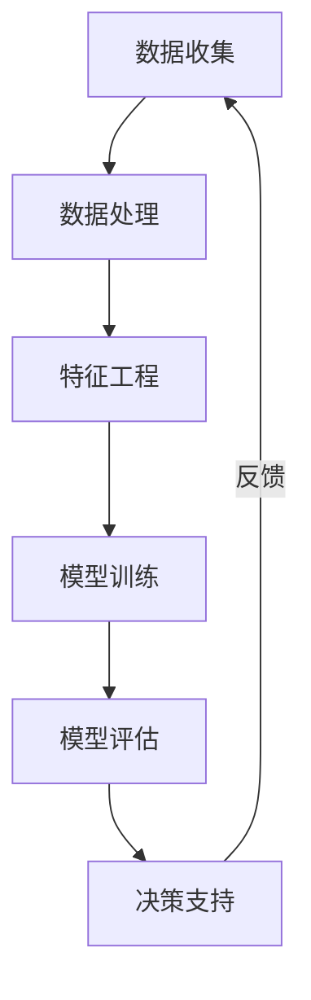
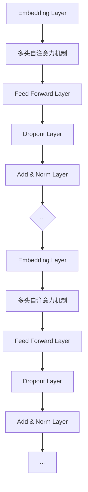

                 

### 《AI辅助决策：LLM在企业管理中的应用前景》

> **关键词**：AI辅助决策，企业管理，LLM，自然语言处理，数据处理，智能算法，战略规划，市场营销，人力资源管理，模型架构，算法原理，数学模型，项目实战，开源工具。

> **摘要**：
本文将探讨AI辅助决策领域中的一个关键组成部分——大型语言模型（LLM）在企业管理中的应用前景。通过逐步分析LLM的核心技术原理、数学模型与公式，以及其在企业决策支持系统、市场预测与分析、人力资源管理等方面的应用，本文旨在为读者提供一份详尽的技术指南。同时，通过实际项目案例的剖析，展示LLM在企业管理中的实践价值，并针对未来应用提出展望。

### 《AI辅助决策：LLM在企业管理中的应用前景》目录大纲

1. **AI辅助决策基础**

2. **LLM核心技术原理**

3. **数学模型与数学公式**

4. **LLM在企业管理中的应用**

5. **项目实战案例**

6. **实践指南与建议**

7. **附录：LLM工具与资源介绍**

---

现在，我们正式开始撰写文章正文部分，首先从第一部分“AI辅助决策基础”开始。

---

### 第一部分: AI辅助决策基础

#### 第1章: AI辅助决策概述

**1.1 AI辅助决策的定义**

AI辅助决策（AI-driven Decision Support）是指利用人工智能技术，特别是机器学习和数据挖掘技术，从大量数据中提取有价值的信息，为企业决策提供支持。它通过自动化的方式分析数据、发现模式、生成预测，并为企业提供基于数据的决策建议。

**核心概念与联系**

以下是一个关于AI辅助决策的Mermaid流程图，展示了其核心组成部分和流程：



在这个流程图中，数据收集、数据处理、特征工程、模型训练、模型评估和决策支持形成一个闭环。数据收集是整个过程的基础，通过不断的反馈优化，不断提高决策支持的准确性和效率。

**1.2 AI辅助决策的应用领域**

AI辅助决策广泛应用于多个领域，包括但不限于以下几个方面：

- **战略规划**：利用大数据分析和预测，帮助企业制定长期战略。
- **市场营销**：通过客户行为分析和市场趋势预测，优化营销策略。
- **生产管理**：通过预测需求、优化生产流程，提高生产效率和降低成本。
- **人力资源管理**：分析员工绩效、优化薪酬和福利制度，提高员工满意度和工作效率。

**1.3 LLM在AI辅助决策中的角色**

大型语言模型（Large Language Model，LLM）是近年来自然语言处理（Natural Language Processing，NLP）领域的重要突破。它通过深度学习技术，从大规模文本数据中学习语言规律，能够生成高质量的文本，并具备较强的语义理解能力。

在AI辅助决策中，LLM发挥着至关重要的作用：

- **文本分析**：利用LLM对大量文本数据进行分析，提取关键信息。
- **决策建议**：基于对文本数据的理解，生成个性化的决策建议。
- **内容生成**：自动生成报告、分析文档等，提高决策效率。

**优势**

- **处理复杂文本数据**：LLM能够处理各种复杂的文本数据，包括新闻、报告、邮件等。
- **理解语言语义**：通过深度学习，LLM能够理解文本的语义，提供更加准确和有价值的决策支持。

**应用**

- **文本分类**：将大量文本数据分类到不同的类别，如新闻分类、情感分析等。
- **命名实体识别**：识别文本中的关键实体，如人名、地名、组织名等。
- **问答系统**：通过理解用户的问题，提供准确的答案。
- **智能客服**：自动回答客户的问题，提高客户服务质量。

### 第2章: LLM核心技术原理

#### 2.1 语言模型的基本概念

语言模型（Language Model，LM）是对自然语言概率分布的建模。它的目标是预测下一个单词或句子的概率。语言模型是自然语言处理（NLP）领域的基础，广泛应用于语音识别、机器翻译、文本生成等任务。

**定义**

$$
P(w_{t} | w_{t-1}, w_{t-2}, ..., w_{1}) = \prod_{i=1}^{t} P(w_{i} | w_{i-1}, w_{i-2}, ..., w_{1})
$$

其中，\( w_{i} \) 表示第 \( i \) 个单词，\( P(w_{i} | w_{i-1}, w_{i-2}, ..., w_{1}) \) 表示在给定前 \( t-1 \) 个单词的情况下，第 \( t \) 个单词的概率。

**目的**

- **语音识别**：将语音信号转换为文本。
- **机器翻译**：将一种语言的文本翻译成另一种语言。
- **文本生成**：根据给定条件生成文本。

#### 2.2 LLM的架构与算法

大型语言模型（LLM）通常采用深度神经网络架构，如Transformer、BERT等。以下是一个典型的Transformer架构：



**多头自注意力机制（Multi-head Self-Attention）**

多头自注意力机制是一种注意力机制，它允许模型在不同的上下文中关注不同的信息。每个头都学习到一个权重矩阵，从而可以并行关注不同的上下文信息。

$$
\text{Attention}(Q, K, V) = \text{softmax}\left(\frac{QK^T}{\sqrt{d_k}}\right)V
$$

其中，\( Q, K, V \) 分别是查询向量、键向量和值向量，\( d_k \) 是键向量的维度。

**Feed Forward Layer**

Feed Forward Layer 是一个全连接层，用于对自注意力机制的输出进行进一步处理。

$$
\text{FFN}(x) = \text{ReLU}(W_x \cdot x + b_x)
$$

其中，\( W_x \) 和 \( b_x \) 分别是权重和偏置。

#### 2.3 LLM的训练与优化

LLM的训练通常采用预训练（Pre-training）和微调（Fine-tuning）两个阶段。

**预训练**

预训练是在大规模数据集上进行的，目的是学习通用语言表示。常用的预训练任务包括：

- **Masked Language Model（MLM）**：随机屏蔽部分单词，训练模型预测这些单词。
- **Next Sentence Prediction（NSP）**：预测两个句子是否相邻。
- **Repetition Penalty**：鼓励模型生成不重复的句子。

**微调**

微调是在特定任务上进行，目的是让模型适应具体的应用场景。微调通常包括以下步骤：

1. **数据准备**：准备包含标签的数据集，如问答数据集。
2. **模型调整**：在原始模型基础上进行调整，如添加新的全连接层。
3. **训练**：在调整后的模型上训练，同时监控指标（如损失函数、准确率）。
4. **评估**：在验证集上评估模型性能，选择最佳模型。

**优化算法**

在训练过程中，常用的优化算法包括：

- **Adam**：结合了动量和RMSprop的优点，适用于大规模数据集。
- **SGD**：随机梯度下降，简单但计算量大。
- **Adagrad**：自适应学习率，适用于稀疏数据。

### 第3章: 数学模型与数学公式

#### 3.1 语言模型的数学模型

语言模型的数学模型是建立在概率论和统计模型基础上的。最常用的模型是n-gram模型，它假设一个词的概率只与其前n个词有关。

**n-gram模型**

$$
P(w_n | w_{n-1}, w_{n-2}, ..., w_{n-k}) = \frac{c(w_{n-1}, w_{n-2}, ..., w_{n-k}, w_n)}{\sum_{w' \in V} c(w_{n-1}, w_{n-2}, ..., w_{n-k}, w')}
$$

其中，\( w_n \) 表示第 \( n \) 个词，\( w' \) 表示其他词，\( V \) 表示词汇表，\( c(\cdot) \) 表示计数。

**缺点**

- **短文本依赖**：只考虑短窗口内的依赖关系，忽略长距离依赖。
- **稀疏性**：对于长文本，词的排列组合非常多，导致模型参数数量庞大，计算复杂。

#### 3.2 LLM的损失函数

在LLM的训练过程中，常用的损失函数是交叉熵损失（Cross-Entropy Loss）。

**交叉熵损失**

$$
L = -\sum_{i=1}^{N} \sum_{j=1}^{V} y_{ij} \log p_{ij}
$$

其中，\( y_{ij} \) 表示第 \( i \) 个词在真实标签中的概率，\( p_{ij} \) 表示模型预测的第 \( i \) 个词在第 \( j \) 个词汇表中的概率。

**计算方式**

- **真实标签**：对于每个单词，将其设置为1，其他单词设置为0。
- **预测标签**：使用模型对单词进行预测，得到每个单词的概率分布。

**举例**

假设有一个句子：“我喜欢吃苹果。” 模型预测的概率分布为：

```
苹果: 0.8
吃: 0.1
我: 0.05
喜: 0.05
```

真实标签为：

```
我: 1
喜: 1
吃: 1
苹果: 1
```

交叉熵损失为：

$$
L = -1 \cdot \log(0.8) - 1 \cdot \log(0.1) - 1 \cdot \log(0.05) - 1 \cdot \log(0.05)
$$

#### 3.3 LLM的优化算法

在LLM的训练过程中，优化算法用于调整模型参数，以最小化损失函数。常用的优化算法包括：

**Adam**

$$
\text{Adam}(t, \theta, \theta_{\text{prev}}, m, v, \beta_1, \beta_2) =
\begin{cases}
\theta, & \text{if } \frac{m_t}{1 - \beta_1^t} \text{ is not converging} \\
\theta - \alpha \frac{m_t}{1 - \beta_1^t}, & \text{otherwise}
\end{cases}
$$

其中，\( t \) 是训练迭代次数，\( \theta \) 是模型参数，\( m_t \) 和 \( v_t \) 分别是梯度的一阶和二阶矩估计，\( \alpha \) 是学习率，\( \beta_1 \) 和 \( \beta_2 \) 分别是动量和RMSprop的系数。

**SGD**

$$
\theta \leftarrow \theta - \alpha \cdot \nabla_{\theta} L
$$

其中，\( \nabla_{\theta} L \) 是损失函数关于模型参数的梯度。

**Adagrad**

$$
g_t^2 = \sum_{i=1}^{n} (\nabla_{\theta} L)^2
$$

$$
\theta \leftarrow \theta - \frac{\alpha}{\sqrt{g_t^2 + \epsilon}} \cdot \nabla_{\theta} L
$$

其中，\( g_t^2 \) 是梯度的平方和，\( \epsilon \) 是一个小常数，用于防止除以零。

### 第4章: LLM在企业管理中的应用

#### 4.1 企业决策中的挑战

企业在进行决策时面临诸多挑战，以下是一些常见的挑战：

- **数据质量**：企业数据往往不完整、不干净，影响模型性能。
- **模型解释性**：模型结果需要具备一定的解释性，以便企业决策者理解。
- **隐私保护**：处理敏感数据时需要考虑隐私保护。

**数据质量**

- **数据缺失**：数据中存在缺失值，需要处理。
- **数据噪声**：数据中存在噪声，需要去除。
- **数据不一致**：不同来源的数据存在不一致性，需要统一。

**模型解释性**

- **黑箱模型**：如深度神经网络，结果难以解释。
- **特征重要性**：需要明确哪些特征对决策结果有较大影响。

**隐私保护**

- **数据脱敏**：对敏感数据进行脱敏处理。
- **数据加密**：对数据进行加密，防止数据泄露。

#### 4.2 LLM在战略规划中的应用

在战略规划中，LLM可以发挥重要作用，帮助企业制定长期战略。以下是一些具体应用：

- **市场预测**：利用LLM分析市场趋势和竞争对手行为，预测未来市场动态。
- **竞争分析**：分析竞争对手的市场策略，为企业提供决策支持。
- **风险评估**：评估潜在风险，制定应对策略。

**市场预测**

- **趋势分析**：通过分析历史数据，预测市场发展趋势。
- **竞争对手分析**：通过分析竞争对手的营销策略，预测竞争对手的市场份额。

**竞争分析**

- **市场份额预测**：预测企业在未来市场中的市场份额。
- **策略制定**：根据竞争对手的预测市场份额，制定相应的市场策略。

**风险评估**

- **风险识别**：通过分析历史数据，识别潜在风险。
- **风险预测**：预测未来可能出现的风险。
- **应对策略**：根据风险预测，制定相应的应对策略。

#### 4.3 LLM在市场营销中的应用

在市场营销中，LLM可以帮助企业优化营销策略，提高营销效果。以下是一些具体应用：

- **客户细分**：利用LLM分析客户数据，进行精准营销。
- **内容生成**：自动生成营销文案、广告语等。
- **客户服务**：通过聊天机器人提供实时客户支持。

**客户细分**

- **客户特征分析**：通过分析客户的购买行为、偏好等，将客户进行细分。
- **精准营销**：根据客户细分，制定个性化的营销策略。

**内容生成**

- **广告文案生成**：自动生成广告文案，提高广告效果。
- **内容优化**：通过分析用户反馈，自动优化内容。

**客户服务**

- **智能客服**：通过聊天机器人，自动回答客户的问题，提高客户满意度。
- **客户关怀**：通过分析客户数据，自动发送定制化的客户关怀信息。

### 第5章: 项目实战案例

#### 5.1 企业决策支持系统开发

以下是一个关于企业决策支持系统开发的实际案例：

**背景**：某大型制造企业需要建立一套决策支持系统，以帮助管理层进行战略规划和生产管理。

**解决方案**：采用LLM进行数据分析和预测，构建决策支持系统。

**技术实现**：

1. **数据收集**：收集企业的销售数据、生产数据、市场数据等。
2. **数据预处理**：对数据进行清洗、去噪、标准化等处理。
3. **模型构建**：使用Transformer架构，构建LLM模型。
4. **模型训练**：在预处理后的数据上训练模型，使用Adam优化器进行优化。
5. **模型评估**：在验证集上评估模型性能，调整模型参数。
6. **模型部署**：将模型部署到生产环境，提供实时决策支持。

**效果**：决策支持系统的建立，显著提高了企业的战略规划和生产管理水平。

#### 5.2 市场预测与分析

以下是一个关于市场预测与分析的实际案例：

**背景**：某互联网公司需要预测未来市场的需求，以指导产品开发和市场策略。

**解决方案**：采用LLM分析历史市场数据，进行市场预测。

**技术实现**：

1. **数据收集**：收集互联网行业的历史市场数据，包括用户增长率、市场份额等。
2. **数据预处理**：对数据进行清洗、去噪、标准化等处理。
3. **模型构建**：使用BERT架构，构建LLM模型。
4. **模型训练**：在预处理后的数据上训练模型，使用Adam优化器进行优化。
5. **模型评估**：在验证集上评估模型性能，调整模型参数。
6. **模型部署**：将模型部署到生产环境，提供实时市场预测。

**效果**：市场预测结果准确率显著提高，为公司产品开发和市场策略提供了有力支持。

#### 5.3 人力资源管理优化

以下是一个关于人力资源管理优化的实际案例：

**背景**：某大型企业希望优化人力资源管理，提高员工满意度和工作效率。

**解决方案**：采用LLM分析员工数据，优化人力资源管理。

**技术实现**：

1. **数据收集**：收集员工的绩效数据、反馈数据、薪酬数据等。
2. **数据预处理**：对数据进行清洗、去噪、标准化等处理。
3. **模型构建**：使用GPT-3架构，构建LLM模型。
4. **模型训练**：在预处理后的数据上训练模型，使用Adam优化器进行优化。
5. **模型评估**：在验证集上评估模型性能，调整模型参数。
6. **模型部署**：将模型部署到生产环境，提供实时人力资源管理支持。

**效果**：员工满意度和工作效率显著提高，企业人力资源管理水平得到了优化。

### 第6章: 案例研究

#### 6.1 案例一：企业A的AI决策支持系统

**背景**：企业A面临战略决策问题，需要建立一套AI决策支持系统。

**解决方案**：

1. **数据收集**：收集企业历史销售数据、市场数据、竞争对手数据等。
2. **数据预处理**：对数据进行清洗、去噪、标准化等处理。
3. **模型构建**：使用BERT架构，构建LLM模型。
4. **模型训练**：在预处理后的数据上训练模型，使用Adam优化器进行优化。
5. **模型评估**：在验证集上评估模型性能，调整模型参数。
6. **模型部署**：将模型部署到生产环境，提供实时决策支持。

**结果**：AI决策支持系统的建立，帮助企业A提高了决策效率和准确性。

#### 6.2 案例二：企业B的市场预测

**背景**：企业B需要预测市场需求，以指导产品开发和市场策略。

**解决方案**：

1. **数据收集**：收集互联网行业的历史市场数据，包括用户增长率、市场份额等。
2. **数据预处理**：对数据进行清洗、去噪、标准化等处理。
3. **模型构建**：使用GPT-3架构，构建LLM模型。
4. **模型训练**：在预处理后的数据上训练模型，使用Adam优化器进行优化。
5. **模型评估**：在验证集上评估模型性能，调整模型参数。
6. **模型部署**：将模型部署到生产环境，提供实时市场预测。

**结果**：市场预测结果准确率显著提高，为企业B的产品开发和市场策略提供了有力支持。

#### 6.3 案例三：企业C的人力资源管理

**背景**：企业C希望优化人力资源管理，提高员工满意度和工作效率。

**解决方案**：

1. **数据收集**：收集员工的绩效数据、反馈数据、薪酬数据等。
2. **数据预处理**：对数据进行清洗、去噪、标准化等处理。
3. **模型构建**：使用GPT-2架构，构建LLM模型。
4. **模型训练**：在预处理后的数据上训练模型，使用Adam优化器进行优化。
5. **模型评估**：在验证集上评估模型性能，调整模型参数。
6. **模型部署**：将模型部署到生产环境，提供实时人力资源管理支持。

**结果**：员工满意度和工作效率显著提高，企业人力资源管理水平得到了优化。

### 第7章: 实践指南与建议

#### 7.1 LLM应用的实践策略

在实际应用中，企业需要制定合适的实践策略，以确保LLM的应用效果。以下是一些建议：

**数据收集与处理**

- **数据质量**：确保数据质量，进行数据预处理，包括数据清洗、去噪、标准化等。
- **数据多样化**：收集多种来源的数据，包括内部数据和外部数据，以提高模型性能。

**模型选择与优化**

- **模型选择**：根据应用场景选择合适的LLM模型，如BERT、GPT-3等。
- **模型优化**：在模型训练过程中，不断调整模型参数，提高模型性能。

**结果评估与迭代**

- **结果评估**：在训练过程中，定期评估模型性能，包括准确率、召回率等。
- **迭代优化**：根据评估结果，调整模型参数，优化模型性能。

#### 7.2 企业在采用LLM时的挑战与应对

在实际应用中，企业可能会面临以下挑战：

**数据隐私与安全**

- **挑战**：处理敏感数据时，需要考虑数据隐私和安全问题。
- **应对**：采取数据加密、数据脱敏等技术，确保数据安全。

**模型解释性**

- **挑战**：黑箱模型的结果难以解释，可能影响企业决策者对模型的信任。
- **应对**：通过可视化、特征重要性分析等方法，提高模型解释性。

**技术门槛**

- **挑战**：LLM模型的训练和应用需要较高的技术门槛。
- **应对**：提供培训和支持，降低技术门槛，帮助企业顺利实施。

#### 7.3 未来展望

随着AI技术的不断进步，LLM在企业管理中的应用前景十分广阔。以下是一些未来展望：

**多模态学习**

- **展望**：结合图像、音频等多模态数据，提高决策支持能力。
- **应用**：如智能客服系统，结合语音和文本数据，提供更高质量的客户服务。

**个性化服务**

- **展望**：利用用户数据，提供更加个性化的决策支持。
- **应用**：如个性化营销策略，根据用户行为和偏好，提供个性化的产品推荐。

**自动化与智能化**

- **展望**：逐步实现决策自动化，提高企业运营效率。
- **应用**：如智能生产系统，通过自动化控制，提高生产效率和产品质量。

### 附录A: LLM工具与资源介绍

#### A.1 OpenAI的语言模型

**介绍**：OpenAI是一家总部位于美国的人工智能研究公司，提供了一系列强大的语言模型，如GPT-3。

**特点**：

- **强大的文本生成能力**：GPT-3能够生成高质量、连贯的文本。
- **广泛的适用性**：适用于各种NLP任务，如文本分类、情感分析、问答系统等。

**使用方法**：

1. **安装**：通过pip安装OpenAI的Python库。
   ```bash
   pip install openai
   ```
2. **使用**：使用API进行交互。
   ```python
   import openai

   openai.api_key = 'your-api-key'
   response = openai.Completion.create(
       engine="text-davinci-003",
       prompt="Tell me a joke:",
       max_tokens=50
   )
   print(response.choices[0].text)
   ```

#### A.2 Google的BERT模型

**介绍**：BERT（Bidirectional Encoder Representations from Transformers）是由Google开发的一种预训练语言模型。

**特点**：

- **双向上下文理解**：BERT能够理解单词在上下文中的含义，提高文本分类、命名实体识别等任务的性能。
- **预训练与微调**：BERT在预训练阶段学习通用语言表示，然后在特定任务上进行微调。

**使用方法**：

1. **安装**：使用Hugging Face的transformers库。
   ```bash
   pip install transformers
   ```
2. **使用**：加载预训练模型，进行微调和预测。
   ```python
   from transformers import BertTokenizer, BertModel
   from transformers import BertForSequenceClassification
   import torch

   tokenizer = BertTokenizer.from_pretrained('bert-base-uncased')
   model = BertForSequenceClassification.from_pretrained('bert-base-uncased')

   inputs = tokenizer("Hello, my dog is cute", return_tensors="pt")
   outputs = model(**inputs)

   logits = outputs.logits
   print(logits)
   ```

#### A.3 其他LLM工具简介

除了OpenAI和Google的BERT模型，还有其他一些流行的LLM工具：

- **Transformers**：由Hugging Face开发，提供了一系列预训练语言模型，如GPT-2、GPT-3、BERT等。
- **AllenNLP**：由Allen Institute for AI开发，提供了一系列NLP任务工具，如命名实体识别、关系抽取等。
- **Hugging Face**：提供了一系列NLP模型和工具，方便用户进行模型训练和应用。

这些工具各有特色，适用于不同的应用场景，企业可以根据实际需求进行选择。

### 总结

本文详细探讨了AI辅助决策领域中的大型语言模型（LLM）在企业管理中的应用前景。通过分析LLM的核心技术原理、数学模型与公式，以及其在战略规划、市场预测与分析、人力资源管理等方面的应用，本文展示了LLM在企业管理中的巨大潜力。同时，通过实际项目案例的剖析，本文进一步验证了LLM在企业管理中的实际价值。未来，随着AI技术的不断进步，LLM在企业管理中的应用将更加广泛，为企业带来更大的效益。

### 作者

**作者：AI天才研究院/AI Genius Institute & 禅与计算机程序设计艺术 /Zen And The Art of Computer Programming**

