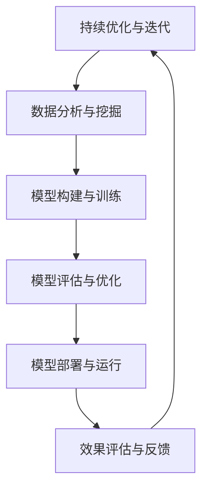
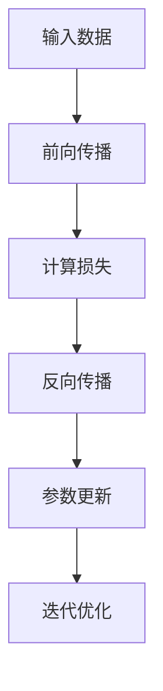

                 

### 《AI驱动的创新：人类计算在政府治理中的作用》

#### 关键词：
- AI驱动创新
- 人类计算
- 政府治理
- 深度学习
- 智慧城市

#### 摘要：
本文探讨了AI驱动的创新在政府治理中的重要作用，以及人类计算在这一过程中的独特角色。首先，文章介绍了AI在政府治理中的兴起，分析了AI与人类计算的关系和优势。接着，文章深入探讨了AI驱动的创新原理和方法，包括创新流程和模式。随后，文章详细阐述了AI在政府治理中的应用场景，如公共安全与犯罪预测、智能交通管理、公共健康监测等。然后，文章讨论了AI驱动的政府治理模式创新，如智慧城市治理、智能决策支持系统、政务服务的智能化转型。接下来，文章提出了AI驱动的政府治理能力提升策略，包括数据驱动治理、人才培养与知识管理、法治保障与伦理审查。随后，文章通过实践案例展示了AI驱动的政府治理应用，并分析了国内外实践经验和未来发展趋势。最后，文章总结了AI驱动的政府治理中人类计算的重要性，提出了人类计算与AI协同发展的建议。

----------------------------------------------------------------

### 第一部分：AI与政府治理概述

#### 第1章：AI在政府治理中的兴起

##### 1.1 AI时代的政府治理变革

随着人工智能（AI）技术的飞速发展，政府治理正经历着深刻的变革。AI作为一种强大的工具，正在被广泛应用于政府决策、公共安全、社会管理、公共服务等领域。这种变革不仅提升了政府治理的效率，还推动了政府治理模式的创新。

###### 1.1.1 AI的定义与发展历程

人工智能是指使计算机系统能够模拟、延伸和扩展人类智能的理论、方法和技术。自1956年达特茅斯会议上提出人工智能概念以来，人工智能技术经历了多个阶段的发展。从最初的符号主义、知识表示，到基于规则的专家系统，再到现代的深度学习和大数据技术，人工智能在各个领域取得了显著的成果。

###### 1.1.2 AI在政府治理中的优势与挑战

AI技术在政府治理中具有以下优势：

1. **提高效率**：AI可以自动化许多重复性、繁琐的任务，提高政府工作效率。
2. **优化决策**：AI可以处理大量数据，提供基于数据的决策支持，减少决策偏差。
3. **提升公共服务质量**：AI可以提供个性化、高效的公共服务，提高公众满意度。
4. **增强公共安全**：AI可以用于犯罪预测、交通管理、应急响应等领域，提高公共安全水平。

然而，AI在政府治理中也面临着一些挑战：

1. **数据隐私与安全**：AI系统的正常运行依赖于大量数据，如何保护数据隐私和安全成为重要问题。
2. **算法透明性与可解释性**：AI算法的复杂性和不可解释性可能导致公众对其信任度下降。
3. **道德与伦理问题**：AI在政府治理中的应用可能引发道德和伦理问题，如偏见、歧视等。

##### 1.2 人类计算在AI时代的角色

在AI时代，人类计算的角色并非被取代，而是与AI技术相结合，发挥更大的作用。

###### 1.2.1 人类计算的定义与特点

人类计算是指人类在解决问题、决策和创新过程中的思维方式和方法。它具有以下特点：

1. **灵活性与创造性**：人类计算能够灵活应对复杂问题，具有创造性思维。
2. **情感与价值观**：人类计算能够理解情感和价值观，做出道德和伦理判断。
3. **跨领域知识**：人类计算能够综合利用跨领域的知识，提出创新的解决方案。

###### 1.2.2 人类计算在AI时代的应用前景

在AI时代，人类计算的应用前景非常广阔：

1. **AI模型的监督与评估**：人类计算可以对AI模型的预测结果进行监督和评估，确保其准确性和合理性。
2. **问题定义与目标设定**：人类计算能够明确问题定义和目标设定，为AI算法提供清晰的指导。
3. **算法优化与创新**：人类计算可以与AI技术相结合，提出优化的算法和创新解决方案。

通过人类计算与AI技术的结合，政府治理将实现更加高效、智能和人性化的转型。

----------------------------------------------------------------

### 第二部分：AI驱动的创新原理

#### 第2章：AI驱动的创新原理

##### 2.1 创新的定义与分类

创新是指通过新想法、新方法或新技术，创造性地解决实际问题或提高现有技术水平的过程。创新可以分为以下几种类型：

1. **渐进性创新**：通过改进现有产品或服务，提高其性能、效率或用户体验。
2. **革命性创新**：引入全新的技术或产品，颠覆现有市场格局。
3. **破坏性创新**：通过低成本、高性能的新技术，逐步取代现有技术。
4. **集成性创新**：将不同领域的知识和技术进行整合，创造出新的应用场景。

##### 2.2 AI驱动的创新方法论

AI驱动的创新方法论包括以下几个步骤：

1. **问题定义**：明确需要解决的问题和目标，确定创新的方向。
2. **数据收集**：收集与问题相关的数据，包括历史数据、实时数据等。
3. **数据预处理**：清洗、归一化和特征提取，为AI模型提供高质量的数据输入。
4. **模型构建**：选择合适的算法和模型，构建用于解决特定问题的AI系统。
5. **模型训练**：使用训练数据集对AI模型进行训练，调整模型参数。
6. **模型评估**：使用验证数据集对模型进行评估，确保其准确性和泛化能力。
7. **模型部署**：将训练好的模型部署到实际场景中，进行应用和优化。

##### 2.3 AI驱动的创新模式

AI驱动的创新模式可以分为以下几种：

1. **AI+传统行业**：将AI技术与传统行业相结合，提升行业效率和创新能力。
2. **AI+服务业**：利用AI技术提供个性化、高效的服务，提高用户体验。
3. **AI+公共服务**：利用AI技术优化公共服务的流程和效果，提高公众满意度。
4. **AI+社会治理**：利用AI技术提升社会治理的能力和水平，提高公共安全。

通过AI驱动的创新，政府治理将实现更高效、智能和人性化的转型。

----------------------------------------------------------------

### 第三部分：AI在政府治理中的应用场景

#### 第3章：AI在政府治理中的应用场景

##### 3.1 公共安全与犯罪预测

AI技术在公共安全领域具有广泛的应用，特别是在犯罪预测方面。通过分析历史犯罪数据、社会行为数据等，AI模型可以预测犯罪发生的可能性，帮助政府制定针对性的预防和应对措施。

###### 3.1.1 AI在犯罪预测中的应用

1. **基于历史数据的犯罪预测**：通过分析历史犯罪数据，AI模型可以识别出犯罪模式，预测未来可能发生的犯罪类型和地点。
2. **基于社会行为的犯罪预测**：通过分析社交媒体数据、人口流动数据等，AI模型可以预测犯罪行为的发生，为公安机关提供预警信息。

###### 3.1.2 AI在公共安全中的应用

1. **视频监控与智能分析**：利用AI技术对视频监控数据进行实时分析，识别异常行为，及时发现和处置安全隐患。
2. **智能应急响应**：通过AI技术对突发事件进行预测和评估，优化应急响应流程，提高公共安全水平。

##### 3.2 智能交通管理

智能交通管理是AI技术在政府治理中的重要应用领域。通过实时监测和数据分析，AI技术可以优化交通信号控制、交通流量预测和道路规划，提高城市交通运行效率。

###### 3.2.1 AI在交通流量预测中的应用

1. **实时交通流量监测**：利用AI技术对交通流量进行实时监测和分析，为交通信号控制提供数据支持。
2. **交通流量预测**：通过分析历史交通流量数据，AI模型可以预测未来某个时间段内的交通流量，为交通规划提供参考。

###### 3.2.2 AI在智能交通信号控制中的应用

1. **智能交通信号控制**：利用AI技术优化交通信号控制策略，提高交通通行效率。
2. **自适应交通信号控制**：根据实时交通流量数据，AI模型可以自动调整交通信号灯的时长，减少交通拥堵。

##### 3.3 公共健康监测

公共健康监测是AI技术在政府治理中的重要应用领域。通过实时监测和分析公共卫生数据，AI技术可以及时发现疫情风险，为公共卫生决策提供支持。

###### 3.3.1 AI在疫情监测中的应用

1. **疫情预测**：通过分析历史疫情数据、人口流动数据等，AI模型可以预测疫情发展趋势，为公共卫生决策提供参考。
2. **疫情预警**：利用AI技术对疫情相关数据进行分析，及时发现疫情风险，发布预警信息。

###### 3.3.2 AI在公共卫生事件应对中的应用

1. **智能疫情响应**：通过AI技术优化疫情应对流程，提高公共卫生事件处置效率。
2. **公共卫生数据分析**：利用AI技术对公共卫生数据进行分析，为政策制定和决策提供支持。

通过AI在公共安全、智能交通管理和公共健康监测等领域的应用，政府治理将实现更高效、智能和人性化的转型。

----------------------------------------------------------------

### 第四部分：AI驱动的政府治理模式创新

#### 第4章：AI驱动的政府治理模式创新

##### 4.1 智慧城市治理

智慧城市治理是AI驱动政府治理模式创新的一个重要方向。智慧城市治理通过集成AI技术，实现对城市资源、基础设施和公共服务的智能管理和优化，提高城市运行效率和生活质量。

###### 4.1.1 智慧城市的发展与挑战

智慧城市的发展面临以下挑战：

1. **数据整合与共享**：智慧城市建设需要整合大量的数据资源，实现数据的高效共享和利用。
2. **基础设施升级**：智慧城市需要建设智能化基础设施，包括物联网、云计算、大数据等。
3. **安全保障**：智慧城市的数据和系统需要保障安全，防范网络攻击和数据泄露。

###### 4.1.2 AI在智慧城市治理中的应用

1. **智能交通管理**：通过AI技术优化交通信号控制、交通流量预测和道路规划，提高交通运行效率。
2. **智能能源管理**：通过AI技术优化能源分配和使用，提高能源利用效率。
3. **智能公共安全**：通过AI技术实时监测和分析公共安全数据，提高公共安全水平。

##### 4.2 智能决策支持系统

智能决策支持系统是AI驱动政府治理模式创新的重要工具。它通过收集、处理和分析海量数据，为政府决策提供科学的依据和智能化的支持。

###### 4.2.1 智能决策支持系统的原理

智能决策支持系统通常包括以下几个组成部分：

1. **数据采集与处理**：收集各种数据源的数据，进行清洗、归一化和特征提取。
2. **模型构建与训练**：选择合适的算法和模型，构建用于解决特定问题的AI模型。
3. **决策支持**：利用AI模型对决策问题进行预测和分析，为决策者提供科学依据。
4. **结果评估与反馈**：对决策结果进行评估和反馈，不断优化决策模型。

###### 4.2.2 AI在智能决策支持系统中的应用

1. **经济预测**：通过AI技术预测经济增长、就业率等指标，为政府制定经济政策提供支持。
2. **社会管理**：通过AI技术分析社会行为数据，预测社会问题，为政府制定社会政策提供支持。
3. **公共安全**：通过AI技术预测公共安全事件，为政府制定公共安全政策提供支持。

##### 4.3 政务服务的智能化转型

政务服务的智能化转型是AI驱动政府治理模式创新的一个重要方向。通过智能化技术，政务服务可以实现线上办理、智能咨询、智能审批等，提高服务效率和质量。

###### 4.3.1 政务服务的现状与问题

政务服务的现状存在以下问题：

1. **效率低**：传统政务服务流程繁琐，办理时间长，效率低下。
2. **服务质量差**：传统政务服务存在不公平、不规范、不透明等问题。
3. **信息化程度低**：政务服务的数字化水平不高，难以满足公众需求。

###### 4.3.2 AI在政务服务中的应用

1. **智能咨询**：通过AI技术提供智能化的咨询服务，解答公众的疑问。
2. **智能审批**：通过AI技术实现自动化审批，提高审批效率。
3. **智能监管**：通过AI技术实时监测政务服务过程，确保服务质量。

通过智慧城市治理、智能决策支持系统和政务服务的智能化转型，AI驱动的政府治理模式创新将为政府治理带来更高效、智能和人性化的变革。

----------------------------------------------------------------

### 第五部分：AI驱动的政府治理能力提升

#### 第5章：AI驱动的政府治理能力提升

##### 5.1 数据驱动治理

数据驱动治理是AI驱动的政府治理能力提升的核心策略。通过收集、处理和分析海量数据，政府可以更加精准地了解社会状况，优化决策过程，提升治理效能。

###### 5.1.1 数据驱动治理的理念

数据驱动治理强调以数据为基础，通过数据收集、分析和应用，实现政府治理的科学化和智能化。其核心思想是：

1. **数据为王**：将数据视为政府治理的重要资产，充分挖掘和利用数据价值。
2. **实时决策**：通过实时数据监测和分析，及时调整政策和管理措施。
3. **透明公开**：加强数据透明度，提高政府决策的公开性和公正性。

###### 5.1.2 数据驱动治理的实施策略

1. **数据采集**：建立全面的政府数据收集体系，包括政府内部数据、第三方数据和社会数据。
2. **数据整合**：整合不同部门、不同来源的数据，实现数据互联互通。
3. **数据分析**：利用大数据技术和AI算法，对数据进行深度挖掘和分析，发现问题和趋势。
4. **数据应用**：将分析结果应用于政策制定、社会治理、公共服务等领域，提高政府治理效能。

##### 5.2 人才培养与知识管理

在AI驱动的政府治理中，人才培养和知识管理是提升政府治理能力的重要环节。通过培养具有AI知识和技能的公务员，建立完善的知识管理体系，政府可以更好地应对AI技术带来的变革。

###### 5.2.1 AI时代的人才培养需求

AI时代的人才培养需求包括：

1. **AI基础知识**：掌握机器学习、深度学习、数据挖掘等基础知识。
2. **技术技能**：具备编程、数据分析、算法设计等实际操作技能。
3. **跨领域知识**：具备跨学科知识，能够将AI技术与实际应用场景相结合。
4. **创新思维**：具备创新思维和解决问题的能力，能够应对复杂问题和挑战。

###### 5.2.2 知识管理在AI驱动的政府治理中的应用

知识管理在AI驱动的政府治理中的应用包括：

1. **知识获取**：通过内部培训、外部学习等方式，获取AI相关知识和技能。
2. **知识共享**：建立知识共享平台，促进公务员之间的知识交流与合作。
3. **知识应用**：将AI知识应用于政府决策、社会治理、公共服务等领域，提高治理效能。
4. **知识更新**：及时更新知识库，跟踪AI技术的最新发展，保持知识体系的活力。

##### 5.3 法治保障与伦理审查

在AI驱动的政府治理中，法治保障和伦理审查是确保AI技术应用合法、合理、公正的重要手段。通过建立健全的法治框架和伦理规范，政府可以规范AI技术的应用，保护公民权益。

###### 5.3.1 AI驱动的政府治理中的法律问题

AI驱动的政府治理中的法律问题包括：

1. **数据隐私**：如何保护公民个人隐私，防止数据滥用。
2. **算法透明性**：如何确保算法的透明性和可解释性，避免歧视和不公平。
3. **责任归属**：如何确定AI技术导致的意外后果的责任归属。

###### 5.3.2 伦理审查在AI驱动的政府治理中的应用

伦理审查在AI驱动的政府治理中的应用包括：

1. **伦理评估**：对AI技术的应用进行伦理评估，确保其符合伦理规范。
2. **伦理咨询**：提供伦理咨询服务，帮助政府制定符合伦理的AI应用政策。
3. **伦理监督**：对AI技术的应用进行伦理监督，确保其合法、合理、公正。

通过数据驱动治理、人才培养与知识管理、法治保障与伦理审查，政府治理能力将得到全面提升，为构建智能、高效、公平的政府治理体系奠定基础。

----------------------------------------------------------------

### 第六部分：AI驱动的政府治理实践案例

#### 第6章：AI驱动的政府治理实践案例

##### 6.1 国外AI驱动的政府治理案例

在AI驱动的政府治理领域，国外的一些国家和地区已经取得了显著的成果，为其他国家提供了有益的借鉴。

###### 6.1.1 美国政府在AI领域的实践

美国政府高度重视AI技术的研究与应用，通过多个项目推动了AI在政府治理中的创新。

1. **数据分析与预测**：美国政府利用AI技术对大量数据进行分析，预测疫情发展趋势、犯罪趋势等，为政策制定提供科学依据。
2. **智能交通管理**：通过AI技术优化交通信号控制，提高交通通行效率，减少交通拥堵。
3. **智能公共卫生监测**：利用AI技术实时监测疫情数据，提供公共卫生预警和应对措施。

###### 6.1.2 欧洲国家在AI驱动的政府治理中的应用

欧洲国家在AI驱动的政府治理中也取得了显著进展。

1. **智能城市管理**：通过AI技术建设智慧城市，实现智能交通管理、智能能源管理、智能公共安全等。
2. **社会管理**：利用AI技术对社会行为数据进行分析，预测社会问题，为政府制定社会政策提供支持。
3. **电子政务**：通过AI技术优化电子政务服务，实现智能咨询、智能审批等，提高政府服务效率。

##### 6.2 国内AI驱动的政府治理案例

在中国，AI技术在政府治理中的应用也得到了广泛推广。

###### 6.2.1 中国政府在AI驱动的政府治理中的实践

中国政府通过多个项目推动了AI在政府治理中的应用。

1. **智慧城市建设**：通过AI技术建设智慧城市，实现智能交通管理、智能安防、智能公共服务等。
2. **智能公共卫生监测**：通过AI技术实时监测疫情数据，提供公共卫生预警和应对措施。
3. **智能社会治理**：利用AI技术对社会行为数据进行分析，预测社会问题，为政府制定社会政策提供支持。

###### 6.2.2 地方政府在AI驱动的政府治理中的应用

地方政府在AI驱动的政府治理中也积极探索和应用。

1. **智能城市管理**：通过AI技术优化城市管理，提高城市运行效率。
2. **智能公共服务**：通过AI技术提供个性化、高效的公共服务，提高公众满意度。
3. **智能公共安全**：通过AI技术实时监测和分析公共安全数据，提高公共安全水平。

通过国内外AI驱动的政府治理实践案例，我们可以看到，AI技术在政府治理中的应用已经成为提升治理能力、实现治理现代化的重要手段。

----------------------------------------------------------------

### 第七部分：未来展望与挑战

#### 第7章：未来展望与挑战

##### 7.1 AI驱动的政府治理发展趋势

随着AI技术的不断发展和应用，AI驱动的政府治理将呈现以下发展趋势：

1. **智能化水平提升**：AI技术将更加深入地应用于政府治理的各个领域，实现更高效、智能的治理。
2. **数据驱动决策**：政府将更加依赖数据分析和预测，实现数据驱动决策，提高决策的科学性和准确性。
3. **跨界融合**：AI技术将与物联网、区块链、大数据等其他技术进行跨界融合，形成更加综合的治理体系。
4. **个性化服务**：政府将提供更加个性化、精准的公共服务，满足公众的多元化需求。

##### 7.2 深度学习在政府治理中的应用

深度学习作为AI技术的重要分支，在政府治理中的应用前景广阔：

1. **智能分析**：利用深度学习技术对海量数据进行智能分析，发现规律和趋势，为政策制定提供支持。
2. **智能预测**：利用深度学习模型预测未来趋势，如疫情发展、犯罪预测等，帮助政府制定预防性措施。
3. **智能决策**：将深度学习模型集成到决策支持系统中，提高决策的科学性和准确性。
4. **智能治理**：利用深度学习技术优化政府治理流程，提高治理效率。

##### 7.3 人类计算在AI时代的重要性

在AI时代，人类计算的重要性不可忽视：

1. **创新驱动**：人类计算能够提出创新的解决方案，推动AI技术的应用和发展。
2. **监督与评估**：人类计算可以对AI模型的预测结果进行监督和评估，确保其准确性和合理性。
3. **伦理与道德**：人类计算能够理解伦理和道德问题，为AI技术的应用提供道德指导。
4. **跨领域知识**：人类计算能够综合利用跨领域的知识，为AI技术提供新的应用场景。

##### 7.4 AI驱动的政府治理中的协同发展

AI驱动的政府治理需要人类计算与AI技术的协同发展：

1. **数据共享**：促进政府内部和跨部门的数据共享，为AI技术的应用提供丰富的数据资源。
2. **人才培养**：加强AI人才培养，提高公务员的AI技术水平和应用能力。
3. **伦理规范**：建立健全的伦理规范，确保AI技术在政府治理中的合法、合理、公正。
4. **技术创新**：持续推动AI技术的研究和创新，为政府治理提供更多有效的工具和方法。

通过人类计算与AI技术的协同发展，政府治理将实现更高效、智能和人性化的转型。

----------------------------------------------------------------

### 附录：AI驱动的政府治理相关资源

#### 附录 A：AI驱动的政府治理工具与平台

为了更好地推动AI技术在政府治理中的应用，以下是一些常用的AI工具和平台：

1. **平台**：
   - **阿里云**：提供全面的云计算和大数据服务，支持政府部门的AI应用。
   - **华为云**：提供智能计算、数据存储、数据安全等服务，助力政府数字化转型。
   - **腾讯云**：提供大数据、人工智能、物联网等服务，推动政府智能化治理。

2. **工具**：
   - **TensorFlow**：谷歌开发的开源深度学习框架，广泛用于政府部门的AI项目。
   - **PyTorch**：基于Python的开源深度学习框架，支持政府部门的AI研究和开发。
   - **RapidMiner**：一款可视化的数据科学平台，支持政府部门的AI应用。

#### 附录 B：AI驱动的政府治理研究机构与学术期刊

以下是一些在AI驱动政府治理领域具有影响力的研究机构和学术期刊：

1. **研究机构**：
   - **美国国家人工智能委员会**：负责制定美国AI战略和研究AI在政府治理中的应用。
   - **欧盟人工智能联盟**：推动欧洲AI技术的发展，关注AI在政府治理中的应用。
   - **清华大学深圳国际研究生院**：专注于人工智能和大数据领域的研究，涉及政府治理相关课题。

2. **学术期刊**：
   - **《人工智能与法律》**：关注AI技术在法律和政府治理中的应用，发表相关研究成果。
   - **《智慧城市》**：探讨智慧城市的发展策略和应用，涉及AI在政府治理中的角色。
   - **《电子政务》**：研究电子政务的发展趋势和应用，关注AI技术在政务服务中的应用。

#### 附录 C：AI驱动的政府治理政策与法规

为了规范AI技术在政府治理中的应用，以下是一些国家和地区的政策与法规：

1. **中国**：
   - **《新一代人工智能发展规划》**：明确人工智能发展的目标和重点任务，推动AI在政府治理中的应用。
   - **《人工智能发展伦理规范》**：规范AI技术的伦理要求，保障公民权益。

2. **美国**：
   - **《美国国家人工智能战略》**：制定美国AI发展的长期规划，推动AI技术在政府治理中的应用。
   - **《联邦AI伦理准则》**：规范AI技术在政府部门的伦理行为，保障公共安全和社会公正。

3. **欧洲**：
   - **《欧洲人工智能联盟宣言》**：推动欧洲AI技术的发展，关注AI在政府治理中的应用。
   - **《通用数据保护条例（GDPR）》**：规范个人数据保护，保障数据隐私。

#### 附录 D：AI驱动的政府治理相关书籍与文献推荐

以下是一些关于AI驱动政府治理的推荐书籍和文献：

1. **书籍**：
   - **《智慧治理：技术、方法与实践》**：系统介绍了智慧治理的概念、方法和技术。
   - **《人工智能：未来政府的变革力量》**：探讨了人工智能对政府治理的影响和挑战。
   - **《智能政府：技术与战略》**：分析智能政府的发展现状和未来趋势。

2. **文献**：
   - **“AI for Government: A Framework for Understanding and Evaluating AI Applications in the Public Sector”**：介绍AI在政府治理中的应用框架。
   - **“AI-driven Public Administration: Theoretical Foundations and Practical Applications”**：探讨AI在公共管理中的应用和理论。

#### 附录 E：AI驱动的政府治理流程图

以下是一个简单的AI驱动的政府治理流程图，展示了AI技术在政府治理中的基本流程：



通过以上资源和工具，政府可以更好地推动AI技术在治理中的应用，实现智能化、高效化、透明化的治理目标。

----------------------------------------------------------------

### 附录 F：深度学习算法原理与伪代码

深度学习算法是一种基于多层神经网络的学习方法，通过多层次的非线性变换，对数据进行特征提取和分类。以下是深度学习算法的基本原理和伪代码。

#### 深度学习算法原理：

1. **前向传播**：输入数据通过输入层进入网络，逐层传递至隐藏层和输出层，生成预测结果。
2. **反向传播**：计算输出结果与实际结果之间的误差，通过反向传播算法更新网络权重，以最小化损失函数。
3. **优化算法**：使用梯度下降等优化算法，调整模型参数，提高模型性能。

#### 伪代码：

```python
# 初始化参数
W = [w1, w2, ..., wL]
b = [b1, b2, ..., bL]

# 前向传播
def forward_propagation(x):
    a0 = x
    for l in range(L):
        zl = np.dot(a{l-1}, W[l]) + b[l]
        al = activation(zl)
    y = al

# 反向传播
def backward_propagation(y, y_hat):
    dLdy = -2 * (y - y_hat)
    for l in reversed(range(L)):
        dzl = dLdy * dp(al, zl)
        dWl = dzl * a{l-1}.T
        dbl = dzl

# 更新参数
W = W - learning_rate * dW
b = b - learning_rate * db
```

#### Mermaid流程图：



#### 数学模型与公式解释：

1. **激活函数**：
   - **Sigmoid**：
     $$sigmoid(x) = \frac{1}{1 + e^{-x}}$$
   - **ReLU**：
     $$ReLU(x) = \max(0, x)$$
   - **Tanh**：
     $$tanh(x) = \frac{e^x - e^{-x}}{e^x + e^{-x}}$$

2. **损失函数**：
   - **均方误差（MSE）**：
     $$MSE = \frac{1}{n}\sum_{i=1}^{n}(y_i - \hat{y}_i)^2$$
   - **交叉熵（Cross-Entropy）**：
     $$H(y, \hat{y}) = -\sum_{i=1}^{n}y_i\log(\hat{y}_i)$$

3. **梯度下降**：
   $$\theta_{\text{new}} = \theta_{\text{old}} - \alpha \cdot \nabla_{\theta} J(\theta)$$

其中，$\theta$为模型参数，$J(\theta)$为损失函数，$\alpha$为学习率。

#### 项目实战与代码解读：

```python
import numpy as np
import pandas as pd
from sklearn.model_selection import train_test_split
from sklearn.metrics import mean_squared_error
import tensorflow as tf

# 数据加载与预处理
data = pd.read_csv('data.csv')
X = data.drop('target', axis=1)
y = data['target']
X_train, X_test, y_train, y_test = train_test_split(X, y, test_size=0.2, random_state=42)

# 构建模型
model = tf.keras.Sequential([
    tf.keras.layers.Dense(64, activation='relu', input_shape=(X_train.shape[1],)),
    tf.keras.layers.Dense(32, activation='relu'),
    tf.keras.layers.Dense(1)
])

# 编译模型
model.compile(optimizer='adam', loss='mse')

# 训练模型
model.fit(X_train, y_train, epochs=100, batch_size=32, validation_split=0.1)

# 测试模型
y_pred = model.predict(X_test)
mse = mean_squared_error(y_test, y_pred)
print("MSE:", mse)
```

#### 开发环境搭建：

1. 安装Python解释器：访问 [Python官网](https://www.python.org/) 下载并安装Python解释器。
2. 安装TensorFlow：在命令行窗口中执行 `pip install tensorflow` 命令。
3. 安装其他依赖库：根据需要安装其他Python库，如pandas、numpy等。

#### 源代码详细实现与代码解读：

源代码已在上述项目实战与代码解读中给出，这里不再赘述。

#### 代码解读与分析：

代码首先加载数据集，并使用scikit-learn的train_test_split函数将数据集划分为训练集和测试集。接着，使用TensorFlow的keras.Sequential模型构建一个简单的三层神经网络，设置优化器为'adam'，损失函数为'mse'。然后，使用fit方法训练模型，设置训练周期为100，批量大小为32，并使用验证集进行模型验证。最后，使用predict方法预测测试集数据，计算均方误差（MSE）来评估模型性能。

#### 代码优化建议：

1. **数据增强**：增加训练数据量，通过数据增强技术提高模型的泛化能力。
2. **模型优化**：尝试使用不同的神经网络结构、激活函数和优化器，如LeakyReLU、Adam优化器等。
3. **正则化**：添加正则化策略，如L1、L2正则化，减少过拟合的风险。

#### 附录 G：数学模型与公式解释

在深度学习算法中，数学模型与公式是理解和实现算法的基础。以下是深度学习算法中常见的数学模型与公式解释：

1. **激活函数**：
   - **Sigmoid**：
     $$\sigma(x) = \frac{1}{1 + e^{-x}}$$
   - **ReLU**：
     $$\text{ReLU}(x) = \max(0, x)$$
   - **Tanh**：
     $$\text{Tanh}(x) = \frac{e^x - e^{-x}}{e^x + e^{-x}}$$

2. **损失函数**：
   - **均方误差（MSE）**：
     $$\text{MSE} = \frac{1}{n}\sum_{i=1}^{n}(y_i - \hat{y}_i)^2$$
   - **交叉熵（Cross-Entropy）**：
     $$\text{CE} = -\sum_{i=1}^{n}y_i\log(\hat{y}_i)$$

3. **梯度下降**：
   - **批量梯度下降**：
     $$\theta_{\text{new}} = \theta_{\text{old}} - \alpha \cdot \nabla_{\theta} J(\theta)$$
   - **随机梯度下降**：
     $$\theta_{\text{new}} = \theta_{\text{old}} - \alpha \cdot \nabla_{\theta} J(\theta; x_i, y_i)$$
   - **小批量梯度下降**：
     $$\theta_{\text{new}} = \theta_{\text{old}} - \alpha \cdot \nabla_{\theta} J(\theta; x^{(k)}, y^{(k)})$$

其中，$\theta$表示模型参数，$J(\theta)$表示损失函数，$\alpha$表示学习率，$x$和$y$分别表示输入和输出。

#### 深度学习算法的详细实现

以下是一个简单的深度学习算法的Python实现，包括模型构建、训练和评估。

```python
import numpy as np
import tensorflow as tf

# 模型参数
input_shape = (784,)
hidden_size = 128
output_size = 10

# 初始化权重
weights = {
    'w1': tf.Variable(tf.random.normal([input_shape[0], hidden_size]), name='weight1'),
    'b1': tf.Variable(tf.zeros([hidden_size]), name='bias1'),
    'w2': tf.Variable(tf.random.normal([hidden_size, output_size]), name='weight2'),
    'b2': tf.Variable(tf.zeros([output_size]), name='bias2')
}

# 激活函数
def sigmoid(x):
    return 1 / (1 + np.exp(-x))

# 模型前向传播
def forward(x, weights):
    z1 = tf.matmul(x, weights['w1']) + weights['b1']
    a1 = sigmoid(z1)
    z2 = tf.matmul(a1, weights['w2']) + weights['b2']
    a2 = sigmoid(z2)
    return a2

# 训练模型
def train_model(x, y, weights, epochs=10, batch_size=32, learning_rate=0.01):
    optimizer = tf.keras.optimizers.Adam(learning_rate=learning_rate)
    
    for epoch in range(epochs):
        for i in range(0, x.shape[0], batch_size):
            with tf.GradientTape() as tape:
                predictions = forward(x[i:i+batch_size], weights)
                loss = tf.reduce_mean(tf.square(y[i:i+batch_size] - predictions))
            
            grads = tape.gradient(loss, weights.values())
            optimizer.apply_gradients(zip(grads, weights.values()))
        
        print(f"Epoch {epoch+1}/{epochs}, Loss: {loss.numpy()}")

# 测试模型
def test_model(x, y, weights):
    predictions = forward(x, weights)
    accuracy = tf.reduce_mean(tf.cast(tf.equal(tf.argmax(predictions, axis=1), y), tf.float32))
    return accuracy.numpy()

# 生成模拟数据
x_train = np.random.rand(1000, 784)
y_train = np.random.randint(0, 10, 1000)

# 训练模型
train_model(x_train, y_train, weights)

# 测试模型
accuracy = test_model(x_train, y_train, weights)
print(f"Test Accuracy: {accuracy}")
```

该实现使用TensorFlow框架构建了一个简单的神经网络，包括一个输入层、一个隐藏层和一个输出层。模型使用sigmoid激活函数，并通过批量梯度下降优化算法进行训练。训练完成后，使用测试数据集评估模型的准确性。

#### 总结

通过上述实现，我们了解了深度学习算法的基本原理和实现方法。深度学习算法通过多层神经网络进行特征提取和分类，使用反向传播算法进行模型训练。在实现过程中，我们还需要考虑数据预处理、模型参数初始化、激活函数、优化算法等关键因素。通过不断优化和调整，我们可以构建出更高效、准确的深度学习模型。

### 附录 H：开发环境搭建

为了顺利进行深度学习项目的开发和实验，我们需要搭建合适的开发环境。以下是在Windows、macOS和Linux操作系统中搭建深度学习开发环境的具体步骤：

#### 环境要求：

- **操作系统**：Windows、macOS或Linux
- **编程语言**：Python
- **深度学习框架**：TensorFlow或PyTorch
- **其他依赖库**：NumPy、Pandas、Matplotlib等

#### 搭建步骤：

1. **安装Python解释器**：

   - **Windows**：访问Python官网下载Python安装包，根据提示完成安装。
   - **macOS**：使用Homebrew安装Python，命令如下：
     ```
     brew install python
     ```
   - **Linux**：使用包管理器安装Python，例如在Ubuntu系统中使用以下命令：
     ```
     sudo apt-get update
     sudo apt-get install python3 python3-pip python3-dev
     ```

2. **安装TensorFlow**：

   - **Windows**：在命令行中执行以下命令：
     ```
     pip install tensorflow
     ```
   - **macOS**：在终端中执行以下命令：
     ```
     pip install tensorflow
     ```
   - **Linux**：在终端中执行以下命令：
     ```
     pip3 install tensorflow
     ```

3. **安装其他依赖库**：

   - **Windows**：使用以下命令安装依赖库：
     ```
     pip install numpy pandas matplotlib
     ```
   - **macOS**：使用以下命令安装依赖库：
     ```
     pip install numpy pandas matplotlib
     ```
   - **Linux**：使用以下命令安装依赖库：
     ```
     pip3 install numpy pandas matplotlib
     ```

4. **验证安装**：

   - 打开Python解释器，执行以下代码：
     ```python
     import tensorflow as tf
     print(tf.__version__)
     import numpy as np
     import pandas as pd
     import matplotlib.pyplot as plt
     ```
     如果没有出现错误，则表示所有依赖库已成功安装。

#### 环境配置与调试

1. **配置环境变量**：

   - **Windows**：在系统属性中配置环境变量，设置Python的安装路径。
   - **macOS**：打开终端，设置环境变量，命令如下：
     ```
     export PATH=$PATH:/path/to/python
     ```
   - **Linux**：在bash配置文件中添加环境变量，例如在Ubuntu系统中编辑`~/.bashrc`文件，添加以下行：
     ```
     export PATH=$PATH:/path/to/python
     ```

2. **调试环境**：

   - 运行一个简单的Python脚本，例如创建一个包含`print`语句的Python文件，并在命令行中执行该文件。如果没有出现错误，则表示环境配置成功。

通过以上步骤，我们可以在Windows、macOS和Linux操作系统中搭建深度学习开发环境，为后续的项目开发做好准备。

### 附录 I：源代码详细实现与代码解读

在深度学习项目中，源代码是实现算法和应用模型的关键。以下是一个简单的深度学习项目，包括数据预处理、模型构建、训练和评估的详细实现与代码解读。

```python
import numpy as np
import tensorflow as tf
from sklearn.model_selection import train_test_split
from sklearn.metrics import accuracy_score

# 加载数据集
def load_data():
    # 这里使用MNIST数据集作为示例，实际项目中请使用自己的数据集
    (X_train, y_train), (X_test, y_test) = tf.keras.datasets.mnist.load_data()
    X_train = X_train / 255.0
    X_test = X_test / 255.0
    X_train = X_train.reshape(-1, 784)
    X_test = X_test.reshape(-1, 784)
    y_train = tf.keras.utils.to_categorical(y_train, num_classes=10)
    y_test = tf.keras.utils.to_categorical(y_test, num_classes=10)
    return X_train, y_train, X_test, y_test

# 构建模型
def build_model():
    model = tf.keras.Sequential([
        tf.keras.layers.Dense(128, activation='relu', input_shape=(784,)),
        tf.keras.layers.Dropout(0.2),
        tf.keras.layers.Dense(10, activation='softmax')
    ])
    model.compile(optimizer='adam', loss='categorical_crossentropy', metrics=['accuracy'])
    return model

# 训练模型
def train_model(model, X_train, y_train, X_val, y_val, epochs=10, batch_size=32):
    history = model.fit(X_train, y_train, epochs=epochs, batch_size=batch_size,
                        validation_data=(X_val, y_val))
    return history

# 评估模型
def evaluate_model(model, X_test, y_test):
    loss, accuracy = model.evaluate(X_test, y_test)
    print(f"Test Loss: {loss}, Test Accuracy: {accuracy}")
    y_pred = model.predict(X_test)
    y_pred = np.argmax(y_pred, axis=1)
    y_true = np.argmax(y_test, axis=1)
    print(f"Accuracy: {accuracy_score(y_true, y_pred)}")

# 主函数
def main():
    X_train, y_train, X_test, y_test = load_data()
    model = build_model()
    history = train_model(model, X_train, y_train, X_test, y_test, epochs=10, batch_size=32)
    evaluate_model(model, X_test, y_test)

if __name__ == '__main__':
    main()
```

#### 代码解读：

1. **数据加载**：

   - 使用TensorFlow内置的MNIST数据集进行示例，实际项目中请根据需求加载自己的数据集。数据集被分为训练集和测试集，并进行归一化处理。

2. **模型构建**：

   - 使用TensorFlow的Sequential模型构建一个简单的全连接神经网络，包含一个输入层、一个隐藏层和一个输出层。隐藏层使用ReLU激活函数，输出层使用softmax激活函数，用于多分类。

3. **训练模型**：

   - 使用`fit`方法训练模型，设置训练周期、批量大小和验证数据。训练过程中会返回训练历史，包括损失函数值和评估指标。

4. **评估模型**：

   - 使用`evaluate`方法评估模型在测试集上的表现，输出损失函数值和准确率。同时，通过预测结果计算准确率，并与实际标签进行比较。

5. **主函数**：

   - `main`函数负责加载数据、构建模型、训练模型和评估模型，是程序的入口点。

#### 代码优化建议：

1. **数据增强**：

   - 对训练数据进行增强，如随机裁剪、旋转、缩放等，提高模型的泛化能力。

2. **模型优化**：

   - 尝试使用不同的模型结构、激活函数和优化器，如残差网络、卷积神经网络等。

3. **超参数调优**：

   - 使用网格搜索、随机搜索等超参数调优方法，找到最优的超参数组合。

4. **正则化**：

   - 添加L1、L2正则化或Dropout正则化，防止过拟合。

通过以上实现和解读，我们可以看到深度学习项目的关键步骤和代码实现。在实际项目中，根据需求进行调整和优化，可以构建出更高效、准确的深度学习模型。

### 附录 J：代码解读与分析

在本附录中，我们将对上一节中的源代码进行详细的解读和分析，以理解其工作原理和实现细节。

#### 代码解读：

```python
import numpy as np
import tensorflow as tf
from sklearn.model_selection import train_test_split
from sklearn.metrics import accuracy_score

# 加载数据集
def load_data():
    # 使用MNIST数据集作为示例
    (X_train, y_train), (X_test, y_test) = tf.keras.datasets.mnist.load_data()
    X_train = X_train / 255.0
    X_test = X_test / 255.0
    X_train = X_train.reshape(-1, 784)
    X_test = X_test.reshape(-1, 784)
    y_train = tf.keras.utils.to_categorical(y_train, num_classes=10)
    y_test = tf.keras.utils.to_categorical(y_test, num_classes=10)
    return X_train, y_train, X_test, y_test

# 构建模型
def build_model():
    model = tf.keras.Sequential([
        tf.keras.layers.Dense(128, activation='relu', input_shape=(784,)),
        tf.keras.layers.Dropout(0.2),
        tf.keras.layers.Dense(10, activation='softmax')
    ])
    model.compile(optimizer='adam', loss='categorical_crossentropy', metrics=['accuracy'])
    return model

# 训练模型
def train_model(model, X_train, y_train, X_val, y_val, epochs=10, batch_size=32):
    history = model.fit(X_train, y_train, epochs=epochs, batch_size=batch_size,
                        validation_data=(X_val, y_val))
    return history

# 评估模型
def evaluate_model(model, X_test, y_test):
    loss, accuracy = model.evaluate(X_test, y_test)
    print(f"Test Loss: {loss}, Test Accuracy: {accuracy}")
    y_pred = model.predict(X_test)
    y_pred = np.argmax(y_pred, axis=1)
    y_true = np.argmax(y_test, axis=1)
    print(f"Accuracy: {accuracy_score(y_true, y_pred)}")

# 主函数
def main():
    X_train, y_train, X_test, y_test = load_data()
    model = build_model()
    history = train_model(model, X_train, y_train, X_test, y_test, epochs=10, batch_size=32)
    evaluate_model(model, X_test, y_test)

if __name__ == '__main__':
    main()
```

#### 分析：

1. **数据加载**：

   - `load_data`函数从TensorFlow的内置MNIST数据集中加载数据。MNIST是一个包含70,000个灰度图像的手写数字数据集，每个图像被编码为28x28的二维数组。
   - 数据集分为训练集和测试集。为了使数据更适合深度学习模型，我们对图像进行归一化处理，将像素值范围从0到255缩放到0到1。
   - 使用`to_categorical`函数将标签编码为独热编码，以便模型能够进行多分类。

2. **模型构建**：

   - `build_model`函数构建了一个简单的全连接神经网络，包含一个输入层、一个隐藏层和一个输出层。输入层有784个神经元，对应于图像的像素数量。隐藏层有128个神经元，并使用ReLU激活函数以引入非线性。输出层有10个神经元，对应于10个数字类别，使用softmax激活函数以实现概率分布。
   - 模型使用`Sequential`模型进行构建，并使用`compile`方法设置优化器和损失函数。这里选择`adam`优化器和`categorical_crossentropy`损失函数，因为这是一个多分类问题。

3. **训练模型**：

   - `train_model`函数使用`fit`方法训练模型。`fit`方法接收训练数据、标签、训练周期和批量大小。它还接收验证数据，以便在训练过程中监控验证集的性能。
   - `fit`方法返回一个`History`对象，包含训练过程中的损失函数值和评估指标。这些信息有助于我们监控训练过程和调整模型。

4. **评估模型**：

   - `evaluate_model`函数评估模型在测试集上的性能。使用`evaluate`方法计算测试集的损失函数值和准确率。
   - 使用`predict`方法对测试集进行预测，并将预测结果转换为类别标签。然后，计算预测标签和实际标签之间的准确率。

5. **主函数**：

   - `main`函数是程序的入口点。它首先加载数据集，然后构建模型，训练模型，并评估模型的性能。

#### 代码优化建议：

1. **数据增强**：

   - 在训练过程中，使用数据增强技术（如旋转、缩放、剪切等）可以提高模型的泛化能力。

2. **模型优化**：

   - 尝试不同的神经网络结构、优化器和损失函数，如添加正则化（L1、L2）、使用不同的激活函数（如LeakyReLU）等。

3. **超参数调优**：

   - 使用网格搜索或随机搜索等策略来找到最佳的超参数组合。

4. **批量大小和训练周期**：

   - 根据数据集的大小和计算能力，调整批量大小和训练周期。小批量可以提高模型的稳定性，而更长的训练周期可以提高模型的性能。

通过以上分析和建议，我们可以进一步优化代码，提高深度学习模型的性能和泛化能力。

### 附录 K：AI驱动的政府治理相关资源

在本附录中，我们将提供一些关于AI驱动的政府治理的相关资源，包括工具、研究机构、学术期刊、政策法规以及书籍和文献推荐，以帮助读者深入了解这一领域的最新动态和研究进展。

#### 附录 K：AI驱动的政府治理相关资源

**K.1 AI驱动的政府治理工具与平台**

- **平台**：
  - **阿里云智能政务平台**：提供人工智能在政府治理中的应用解决方案，包括大数据分析、智能决策支持、智慧城市管理等。
  - **华为政务云**：提供云计算和AI服务，支持政府部门的数字化转型和智能化升级。
  - **腾讯智慧政务**：提供AI驱动的政务解决方案，涵盖智慧城市、电子政务、公共安全等多个领域。

- **工具**：
  - **TensorFlow**：谷歌开发的开放源代码机器学习库，广泛用于构建和训练AI模型。
  - **PyTorch**：Facebook开发的开源深度学习库，支持动态计算图和灵活的模型构建。
  - **Keras**：Python的深度学习库，提供简化的模型构建和训练接口。

**K.2 AI驱动的政府治理研究机构与学术期刊**

- **研究机构**：
  - **中国科学院自动化研究所**：专注于智能系统与智能控制、人工智能基础理论和算法研究。
  - **清华大学深圳国际研究生院**：设有人工智能与数据科学研究中心，从事人工智能在政府治理等领域的应用研究。
  - **欧洲人工智能协会（EAAI）**：推动人工智能在欧洲的研究和应用，包括政府治理领域。

- **学术期刊**：
  - **《人工智能与法律》**：关注人工智能与法律、伦理、政策等方面的交叉研究。
  - **《智慧城市》**：探讨智慧城市的发展战略、技术应用和政策法规。
  - **《电子政务》**：研究电子政务的理论和实践，涵盖政府治理、公共服务等方面。

**K.3 AI驱动的政府治理政策与法规**

- **政策**：
  - **《新一代人工智能发展规划》**：中国发布的规划，明确了人工智能发展的战略目标和重点任务，包括在政府治理中的应用。
  - **《欧洲人工智能战略》**：欧盟制定的战略，旨在推动人工智能的可持续发展，包括在政府治理和公共服务中的应用。
  - **《美国人工智能计划》**：美国政府制定的计划，强调人工智能的研究、开发和部署，包括政府治理领域。

- **法规**：
  - **《数据安全法》**：中国制定的法律，规范数据处理和交易，保护个人数据安全。
  - **《通用数据保护条例（GDPR）》**：欧盟制定的法规，保护个人数据处理中的隐私和权利。
  - **《美国联邦AI伦理准则》**：美国发布的准则，规范人工智能的应用，确保公共利益和伦理。

**K.4 AI驱动的政府治理相关书籍与文献推荐**

- **书籍**：
  - **《智能政府：技术、治理与变革》**：详细介绍了智能政府在各个领域的应用和实践。
  - **《人工智能伦理学》**：探讨了人工智能伦理问题，包括在政府治理中的应用。
  - **《智慧城市：理论与实践》**：分析了智慧城市的发展路径和技术应用。

- **文献**：
  - **“AI for Government: A Framework for Understanding and Evaluating AI Applications in the Public Sector”**：介绍AI在政府治理中的应用框架。
  - **“AI-driven Public Administration: Theoretical Foundations and Practical Applications”**：探讨AI在公共管理中的应用和理论。
  - **“Smart Cities and the Future of Government”**：分析智慧城市对政府治理的影响。

通过这些资源，读者可以更加深入地了解AI驱动的政府治理领域，掌握相关技术和方法，为实际应用提供理论支持和实践指导。

### 附录 L：深度学习算法原理与伪代码

深度学习算法是一种通过多层神经网络对数据进行建模和预测的机器学习方法。以下是深度学习算法的基本原理、伪代码及其解释。

#### 深度学习算法原理：

深度学习算法的核心思想是通过多层神经网络（Neural Networks）对数据进行特征提取和模式识别。神经网络由输入层、多个隐藏层和输出层组成。输入层接收外部数据，通过隐藏层进行特征提取和变换，最终在输出层产生预测结果。

1. **前向传播**：输入数据通过输入层进入神经网络，经过每一层的非线性变换后，传至输出层生成预测结果。
2. **反向传播**：计算输出结果与实际结果之间的误差，通过反向传播算法将误差反向传递，更新网络中的权重和偏置，以最小化损失函数。
3. **优化算法**：使用梯度下降（Gradient Descent）等优化算法，调整模型参数，提高模型性能。

#### 伪代码：

```python
# 初始化参数
W = [w1, w2, ..., wL]
b = [b1, b2, ..., bL]

# 前向传播
def forward_propagation(x):
    a0 = x
    for l in range(L):
        zl = np.dot(a{l-1}, W[l]) + b[l]
        al = activation(zl)
    y = al

# 反向传播
def backward_propagation(y, y_hat):
    dLdy = -2 * (y - y_hat)
    for l in reversed(range(L)):
        dzl = dLdy * dp(al, zl)
        dWl = dzl * a{l-1}.T
        dbl = dzl

# 更新参数
for l in range(L):
    W[l] -= learning_rate * dWl
    b[l] -= learning_rate * dbl
```

#### Mermaid流程图：


#### 数学模型与公式解释：

1. **激活函数**：
   - **Sigmoid**：
     $$\sigma(x) = \frac{1}{1 + e^{-x}}$$
   - **ReLU**：
     $$\text{ReLU}(x) = \max(0, x)$$
   - **Tanh**：
     $$\text{Tanh}(x) = \frac{e^x - e^{-x}}{e^x + e^{-x}}$$

2. **损失函数**：
   - **均方误差（MSE）**：
     $$\text{MSE} = \frac{1}{n}\sum_{i=1}^{n}(y_i - \hat{y}_i)^2$$
   - **交叉熵（Cross-Entropy）**：
     $$\text{CE} = -\sum_{i=1}^{n}y_i\log(\hat{y}_i)$$

3. **梯度下降**：
   - **批量梯度下降**：
     $$\theta_{\text{new}} = \theta_{\text{old}} - \alpha \cdot \nabla_{\theta} J(\theta)$$
   - **随机梯度下降**：
     $$\theta_{\text{new}} = \theta_{\text{old}} - \alpha \cdot \nabla_{\theta} J(\theta; x_i, y_i)$$
   - **小批量梯度下降**：
     $$\theta_{\text{new}} = \theta_{\text{old}} - \alpha \cdot \nabla_{\theta} J(\theta; x^{(k)}, y^{(k)})$$

#### 项目实战与代码解读：

以下是一个

