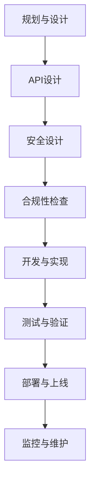

                 

# API开发与管理：构建开放生态系统

> 关键词：API开发、API管理、开放生态系统、API安全性、API性能优化、API文档编写

> 摘要：本文从API的基本概念、开发环境搭建、设计与最佳实践、管理平台选择、性能监控与优化、安全与合规性以及生态建设等多个方面，深入探讨了API开发与管理的全过程。通过详细的案例分析，帮助开发者理解API的实际应用，提升API开发与管理能力，构建一个高效、安全、可扩展的开放生态系统。

## 目录大纲

### 第一部分：API基础

- 第1章：API概述
  - 1.1 API的定义与分类
  - 1.2 API在开放生态系统中的作用
  - 1.3 API的生命周期管理

- 第2章：API开发环境搭建
  - 2.1 开发环境选择
  - 2.2 API开发流程
  - 2.3 API测试

- 第3章：API设计与最佳实践
  - 3.1 API设计原则
  - 3.2 API安全性设计
  - 3.3 API文档编写

### 第二部分：API开发

- 第4章：API管理平台
  - 4.1 API管理平台的作用
  - 4.2 API管理平台的选择
  - 4.3 API管理平台部署

- 第5章：API性能监控与优化
  - 5.1 API性能监控
  - 5.2 API性能优化
  - 5.3 API性能测试

### 第三部分：API管理与维护

- 第6章：API安全性与合规性
  - 6.1 API安全威胁与防护
  - 6.2 API合规性与法律法规
  - 6.3 API隐私保护与数据安全

### 第四部分：API生态建设

- 第7章：API生态系统构建
  - 7.1 API生态系统概述
  - 7.2 API生态系统策略
  - 7.3 API生态系统实践

### 附录

- 附录A：API开发与管理工具
- 附录B：API开发与管理参考资源
- 附录C：API安全性与合规性流程图（Mermaid流程图）
- 附录D：数学模型与公式（使用LaTeX格式）
- 附录E：项目实战案例

---

### 引言

随着互联网的快速发展，API（Application Programming Interface，应用程序编程接口）已经成为现代软件开发和系统集成的重要组成部分。API允许不同软件系统之间进行交互和集成，从而构建出功能强大、灵活可扩展的开放生态系统。在这一生态系统中，各个组件可以通过API相互访问和共享数据，促进了信息流动和资源整合，为用户提供了更加丰富和个性化的服务。

本文将系统地探讨API开发与管理的全过程，从API的基本概念、开发环境搭建、设计与最佳实践、管理平台选择、性能监控与优化、安全与合规性以及生态建设等多个方面进行深入分析。通过详细的案例研究和实践经验分享，帮助开发者更好地理解API的实际应用，掌握API开发与管理的核心技能，构建一个高效、安全、可扩展的开放生态系统。

在接下来的内容中，我们将分章节详细讨论每一个方面，逐步构建对API开发与管理的全面认识。让我们开始这段深入的技术之旅，探索API的无限可能。

### 第一部分：API基础

#### 第1章：API概述

在讨论API开发与管理之前，我们首先需要了解API的基本概念和分类。API，即应用程序编程接口，是一种在计算机系统中实现不同软件模块或系统之间通信和互操作的接口。它定义了软件组件之间如何进行交互，提供了可重用和可扩展的编程接口。

## 1.1 API的定义与分类

### 1.1.1 API的定义

API可以理解为一种契约，它规定了软件组件之间如何进行交互。通过API，开发者可以访问到另一软件系统提供的功能或服务，而无需了解底层实现的细节。这种接口的抽象化大大简化了软件开发的复杂度，提高了开发效率和系统的可维护性。

API通常包含以下基本元素：

- **接口定义**：描述了可用的功能和操作，通常使用编程语言中的类型定义。
- **请求与响应**：定义了客户端如何发送请求以及服务器如何返回响应，包括请求的格式、参数和返回值。
- **协议和格式**：定义了客户端和服务器之间通信的协议和数据格式，如HTTP、JSON、XML等。

### 1.1.2 API的分类

API可以根据不同的标准进行分类，常见的分类方法包括以下几种：

1. **按用途分类**：
   - **公共API**：供第三方开发者使用的API，通常用于外部集成和扩展。
   - **私有API**：仅用于内部系统集成的API，通常不对外开放。
   - **组合API**：由多个基本API组合而成的API，用于提供更复杂的操作。

2. **按协议分类**：
   - **RESTful API**：基于HTTP协议，使用统一的接口设计和标准化数据格式。
   - **SOAP API**：基于XML协议，提供更复杂的Web服务接口。
   - **GraphQL API**：提供灵活的查询语言，允许客户端指定需要的具体数据。

3. **按安全性分类**：
   - **无认证API**：无需身份验证即可访问的API，通常不适用于敏感数据。
   - **认证API**：需要身份验证才能访问的API，通常使用OAuth、JWT等认证机制。
   - **授权API**：除了认证外，还需要特定权限才能访问的API。

## 1.2 API在开放生态系统中的作用

### 1.2.1 API的重要作用

API在开放生态系统中的作用至关重要，主要体现在以下几个方面：

1. **系统整合**：API使得不同的系统和服务能够无缝集成，实现数据共享和功能协同。例如，一个电商平台可以通过API与支付系统、物流系统、数据分析系统等集成，提供完整的购物体验。

2. **功能扩展**：第三方开发者可以通过使用API扩展系统的功能，创建新的应用和服务。例如，许多社交媒体平台提供了API，使得开发者可以创建第三方工具和服务，增强平台的生态。

3. **资源优化**：API允许系统内部的功能和服务被外部访问和重用，减少了重复开发的工作量，提高了资源的利用效率。

4. **用户交互**：通过API，用户可以直接与系统交互，获取所需的信息和服务，提高了用户体验。

### 1.2.2 API在开放生态系统中的定位

在开放生态系统中，API不仅是连接各个系统和服务的关键桥梁，也是构建生态系统的基础设施。它的定位如下：

1. **中心化接口**：API作为系统之间的中心化接口，简化了系统集成的复杂性，提高了集成的灵活性。

2. **标准化规范**：API提供了标准化的接口设计和通信协议，使得各个系统之间的交互更加规范和统一。

3. **服务交付**：API是服务交付的重要方式，通过API，系统能够将功能和服务提供给其他系统或用户，实现服务的标准化和自动化。

4. **生态系统基石**：API是构建开放生态系统的重要基石，它连接了系统内部和外部，促进了信息的流动和资源的共享，推动了生态系统的繁荣发展。

## 1.3 API的生命周期管理

### 1.3.1 API的生命周期

API的生命周期包括以下几个阶段：

1. **规划与设计**：在系统开发初期，规划API的功能和接口设计，确保API能够满足需求和兼容性。
2. **开发与实现**：根据规划进行API的开发和实现，包括接口定义、协议选择和实现细节。
3. **测试与验证**：对API进行全面的测试，确保其功能正确、性能稳定和安全可靠。
4. **部署与上线**：将API部署到生产环境，使其对外提供服务。
5. **监控与维护**：对API进行实时监控和维护，确保其正常运行和性能优化。
6. **更新与升级**：根据需求和反馈对API进行更新和升级，以保持其持续可用性和先进性。

### 1.3.2 API的版本管理策略

API的版本管理是确保系统稳定性和兼容性的重要手段。以下是一些常见的版本管理策略：

1. **独立版本号**：每个API版本都有独立的版本号，不同版本之间互不干扰。
2. **重大版本升级**：在功能有较大变动时，进行重大版本升级，保留旧版本同时提供新功能。
3. **向后兼容**：在更新API时，确保旧版本的使用者仍然能够正常使用，减少对现有系统的冲击。
4. **版本迁移策略**：制定明确的版本迁移计划，帮助用户平滑过渡到新版本。

通过合理规划和管理API的生命周期，可以确保系统的稳定性和可靠性，提升用户体验，为开放生态系统的建设奠定坚实基础。

### 第2章：API开发环境搭建

在开始API开发之前，选择合适的开发环境是非常重要的。一个高效的开发环境能够提高开发效率，确保代码质量，并方便后续的测试和维护工作。本章将介绍如何选择合适的开发环境，并详细说明API开发的基本流程，包括需求分析、API设计、API实现和API测试。

## 2.1 开发环境选择

选择一个合适的开发环境是API开发成功的关键因素之一。开发环境的决策主要取决于项目需求、团队技能、资源和预算等因素。以下是几种常见的开发环境选择：

### 2.1.1 开源工具推荐

开源工具因其灵活性和可定制性，受到了许多开发者的青睐。以下是一些常用的开源工具：

1. **API网关**：如Kong、Apache APISIX等，用于处理API流量管理、负载均衡和安全防护等功能。
2. **API文档生成工具**：如Swagger、Redoc等，用于自动生成和展示API文档，提高开发效率。
3. **代码仓库**：如GitHub、GitLab等，用于代码管理和版本控制。
4. **集成开发环境（IDE）**：如Visual Studio Code、IntelliJ IDEA等，提供丰富的插件和工具，方便编写和调试代码。
5. **测试工具**：如Postman、JMeter等，用于API测试和性能测试。

### 2.1.2 商业化工具选择

商业化工具通常提供更为专业的服务和全方位的技术支持，适合大型企业或需要高可靠性项目的使用。以下是一些常见的商业化工具：

1. **API管理平台**：如Apigee、MuleSoft等，提供全面的管理功能，包括API设计、发布、监控和安全等。
2. **API文档生成工具**：如Stoplight、Confluent等，提供高级的API文档管理和自动化测试功能。
3. **API测试工具**：如Smartbear、LoadRunner等，提供专业的API测试解决方案，支持大规模并发测试和性能分析。

在选择开发环境时，需要综合考虑以下因素：

- **项目需求**：根据API的功能需求和技术复杂度，选择适合的开发工具和平台。
- **团队技能**：评估团队成员的技术背景和技能，确保他们能够熟练使用所选工具。
- **资源预算**：考虑项目的资源预算，开源工具免费但可能需要额外配置和管理，商业化工具则可能需要付费。
- **可扩展性和稳定性**：选择能够支持项目未来扩展和稳定运行的开发环境。

## 2.2 API开发流程

API开发是一个系统工程，需要经过多个阶段，确保API的功能、性能和安全性。以下是API开发的基本流程：

### 2.2.1 需求分析

需求分析是API开发的第一步，主要目标是明确API需要实现的功能和性能要求。以下是需求分析的几个关键步骤：

1. **业务需求分析**：与业务团队沟通，了解API将如何集成到系统中，需要实现哪些具体功能。
2. **用户需求分析**：分析目标用户的需求，确保API能够满足用户的实际使用场景。
3. **性能需求分析**：确定API的性能要求，包括响应时间、并发处理能力和数据传输速率等。
4. **安全需求分析**：识别API可能面临的安全威胁，制定相应的安全策略。

### 2.2.2 API设计

API设计是确定API接口的具体实现细节。以下是API设计的几个关键步骤：

1. **接口定义**：使用RESTful架构定义API的URL、HTTP方法、请求参数和响应结构。
2. **数据模型设计**：设计API处理的数据模型，包括数据类型、字段和关系。
3. **错误处理**：定义API可能返回的错误码和错误信息，确保API能够清晰传达错误信息。
4. **API版本管理**：设计API的版本管理策略，以便在功能更新时保持兼容性。

### 2.2.3 API实现

API实现是将设计好的API接口用编程语言实现出来。以下是API实现的几个关键步骤：

1. **选择编程语言**：根据项目需求选择合适的编程语言，如Java、Python、Go等。
2. **编写代码**：根据API设计文档，编写API的接口代码，实现业务逻辑处理。
3. **接口测试**：编写单元测试和集成测试，确保API实现符合设计要求。
4. **性能优化**：对API代码进行性能优化，确保其能够满足性能要求。

### 2.2.4 API测试

API测试是确保API功能、性能和安全性的关键环节。以下是API测试的几个关键步骤：

1. **单元测试**：对API的每个功能点进行单元测试，确保功能正确。
2. **集成测试**：对API与其他系统或服务的集成进行测试，确保整体功能正确。
3. **性能测试**：使用性能测试工具模拟高并发场景，测试API的性能和稳定性。
4. **安全测试**：使用安全测试工具进行漏洞扫描和攻击测试，确保API的安全性。

通过以上步骤，可以确保API开发流程的顺利进行，提高API的质量和可靠性。

### 第3章：API设计与最佳实践

API设计是构建高效、可靠、易用的API系统的关键环节。一个良好的API设计不仅能提升系统的可维护性，还能为开发者提供简洁、直观的使用体验。本章将详细介绍API设计的原则、安全性设计和API文档编写的最佳实践。

## 3.1 API设计原则

API设计需要遵循一些核心原则，以确保API的易用性、可维护性和扩展性。以下是一些关键的API设计原则：

### 3.1.1 一致性原则

一致性原则要求API的接口、命名、返回值和错误处理等各方面保持一致。一致性的API能够减少学习成本，提高开发效率，使得开发者能够更轻松地理解和使用API。

1. **统一接口风格**：采用统一的URL结构、HTTP方法和参数格式。
2. **命名规范**：使用简洁、一致的命名规范，如驼峰命名法。
3. **响应格式**：统一使用标准化的数据格式，如JSON或XML，并保持响应结构的稳定性。

### 3.1.2 可读性原则

可读性原则强调API接口和文档的可读性，确保开发者能够快速理解API的使用方法。

1. **注释清晰**：在代码和文档中添加详细的注释，解释接口的功能、参数和返回值。
2. **文档规范**：编写结构清晰、内容详尽的API文档，包括接口描述、示例和错误信息。

### 3.1.3 可维护性原则

可维护性原则关注API在长时间使用中的可维护性和可扩展性，确保API能够适应未来的需求变化。

1. **模块化设计**：将API划分为独立的模块，每个模块实现单一功能，便于维护和扩展。
2. **版本控制**：使用版本控制策略，确保API在功能更新时保持兼容性。
3. **代码规范**：遵循代码规范和最佳实践，如代码风格一致性、代码注释和单元测试。

### 3.1.4 扩展性原则

扩展性原则要求API设计时考虑未来的扩展需求，确保系统可以灵活地添加新功能和模块。

1. **参数扩展**：设计灵活的参数结构，允许通过扩展参数实现新功能。
2. **接口扩展**：提供接口扩展机制，如插件系统或自定义过滤器，方便第三方开发者进行功能扩展。

### 3.1.5 性能优化原则

性能优化原则关注API的性能和效率，确保API能够满足高并发和大规模数据处理的需求。

1. **缓存策略**：合理使用缓存机制，减少数据库和计算资源的访问。
2. **异步处理**：对于计算密集型任务，采用异步处理模式，避免阻塞API接口。
3. **限流与熔断**：实施限流和熔断策略，防止系统过载和崩溃。

## 3.2 API安全性设计

安全性是API设计的重要方面，一个安全的API能够防止恶意攻击和数据泄露。以下是一些常见的API安全性设计策略：

### 3.2.1 身份验证与授权

身份验证与授权是保护API的关键措施，确保只有授权的用户可以访问API。

1. **基本身份验证**：使用用户名和密码进行身份验证，适合内部系统或低安全需求的API。
2. **OAuth2.0**：使用OAuth2.0协议进行授权，允许第三方应用访问用户的API，适用于开放API。
3. **JWT（JSON Web Token）**：使用JWT进行身份验证，提供安全的令牌传输和验证。

### 3.2.2 数据加密

数据加密是保护API传输数据的重要手段，防止数据在传输过程中被窃取或篡改。

1. **传输层加密**：使用TLS/SSL等传输层加密协议，确保数据在传输过程中加密。
2. **数据加密**：对敏感数据进行加密处理，如使用AES加密算法。

### 3.2.3 防御常见攻击

防御常见攻击是确保API安全性的重要措施，以下是一些常见的防御策略：

1. **SQL注入防护**：对输入数据进行过滤和验证，防止恶意SQL注入攻击。
2. **XSS攻击防护**：对输出数据进行编码和转义，防止跨站脚本攻击。
3. **CSRF攻击防护**：使用CSRF令牌验证，防止跨站请求伪造攻击。
4. **DDoS攻击防护**：采用限流、黑白名单等技术，防止大规模分布式拒绝服务攻击。

### 3.2.4 安全日志记录

安全日志记录是监控和审计API使用情况的重要手段，有助于及时发现和应对安全问题。

1. **访问日志**：记录API访问日志，包括访问时间、用户信息、请求和响应等。
2. **错误日志**：记录API错误日志，包括错误信息、错误发生的位置和原因等。
3. **安全事件监控**：配置安全事件监控工具，及时发现和响应异常和安全事件。

## 3.3 API文档编写

API文档是开发者使用API的指南，一个优秀的API文档能够大大降低使用难度，提高开发效率。以下是一些API文档编写的最佳实践：

### 3.3.1 文档编写工具

选择合适的API文档编写工具能够提高文档编写的效率和质量。以下是一些常用的API文档编写工具：

1. **Swagger**：基于JSON或YAML定义API文档，支持自动生成和可视化。
2. **OpenAPI**：Swagger的升级版本，提供更丰富的功能和规范。
3. **Postman**：支持手动编写和测试API文档，同时也提供自动生成文档的功能。

### 3.3.2 文档内容规范

API文档的内容需要规范、详尽，以下是一些关键内容：

1. **接口描述**：详细描述每个API接口的功能、URL、HTTP方法、请求参数和响应结构。
2. **参数说明**：详细说明每个参数的类型、必选性、默认值和示例。
3. **示例代码**：提供详细的示例代码，帮助开发者理解如何使用API。
4. **错误处理**：列出API可能返回的错误码和错误信息，帮助开发者处理异常情况。

### 3.3.3 文档维护策略

API文档需要定期更新和维护，以下是一些维护策略：

1. **自动化更新**：使用API文档生成工具，自动化生成和更新文档。
2. **版本控制**：使用版本控制系统，记录文档的修改历史，便于追踪和管理。
3. **反馈机制**：建立反馈机制，鼓励用户反馈文档问题和建议，及时更新和改进文档。

通过遵循上述设计原则和最佳实践，可以构建出高效、安全、易用的API系统，为开发者提供卓越的开发体验。

### 第4章：API管理平台

在API开发完成后，如何管理和维护API成为了一个重要的问题。API管理平台（API Management Platform）提供了全面的API管理和维护功能，包括API发布、监控、安全、策略管理等，帮助企业高效管理API，确保其稳定、安全、可靠地运行。本章将详细探讨API管理平台的作用、选择与部署。

## 4.1 API管理平台的作用

API管理平台在构建和维护开放生态系统中发挥着重要作用，其主要作用如下：

### 4.1.1 API管理平台的功能

1. **API发布**：API管理平台可以方便地将API发布到生产环境，提供统一的API接入点，便于外部访问和调用。
2. **API监控**：实时监控API的运行状态，包括访问量、错误率、响应时间等，帮助发现和解决问题。
3. **API安全**：提供安全认证和授权机制，如OAuth2.0、JWT等，确保API的安全性和保密性。
4. **API策略管理**：支持API访问控制、流量管理、限流、熔断等策略，确保API的稳定运行和性能优化。
5. **API文档**：自动生成和更新API文档，提供API使用指南和示例，方便开发者使用API。
6. **API分析**：收集和分析API使用数据，帮助企业了解API的使用情况，优化API设计和功能。

### 4.1.2 API管理平台的优势

1. **提高开发效率**：API管理平台提供了一站式的API开发、管理和维护功能，减少了重复劳动，提高了开发效率。
2. **增强安全性**：通过提供安全认证和授权机制，确保API的安全性，防止数据泄露和恶意攻击。
3. **确保稳定性**：通过实时监控和策略管理，确保API的稳定运行和性能优化，降低系统风险。
4. **促进生态建设**：通过提供API文档和合作伙伴接口，促进API的共享和协作，推动生态系统的建设。
5. **降低成本**：通过自动化管理和监控，减少人工维护成本，提高资源利用效率。

## 4.2 API管理平台的选择

选择一个合适的API管理平台是确保API高效管理的关键。以下是选择API管理平台时需要考虑的几个关键因素：

### 4.2.1 开源平台

开源平台具有灵活性和成本优势，适合中小型企业或技术团队使用。以下是一些常用的开源API管理平台：

1. **Kong**：基于Nginx的API网关，提供API路由、监控、限流和安全等功能。
2. **Apache APISIX**：高性能的API网关，支持多种协议和中间件，提供丰富的插件系统。
3. **Tyk**：支持多种编程语言和协议，提供API监控、安全和管理功能。

### 4.2.2 商业化平台

商业化平台通常提供更全面的功能和专业服务，适合大型企业或需要高可靠性的项目。以下是一些常见的商业化API管理平台：

1. **Apigee**：由Google开发，提供API设计、发布、监控、安全和策略管理等功能。
2. **MuleSoft Anypoint Platform**：提供API设计、集成、安全和管理功能，支持多种协议和连接器。
3. **AWS API Gateway**：Amazon Web Services提供的API管理服务，支持自动化的API发布、监控和扩展。

在选择API管理平台时，需要综合考虑以下因素：

1. **功能需求**：根据项目需求，选择提供所需功能的API管理平台。
2. **易用性**：选择用户界面友好、操作简便的平台，降低学习和使用成本。
3. **可扩展性**：选择支持扩展和定制化的平台，以适应未来的需求变化。
4. **性能**：选择具有高性能和低延迟的平台，确保API的稳定性和高效性。
5. **技术支持**：选择提供高质量技术支持的平台，确保在使用过程中能够得到及时帮助。

## 4.3 API管理平台部署

部署API管理平台是确保其正常运行的关键步骤。以下是API管理平台的常见部署模式：

### 4.3.1 部署模式

1. **单机部署**：将API管理平台部署在一台服务器上，适用于小型项目和测试环境。
2. **集群部署**：将API管理平台部署在多台服务器组成的集群中，适用于大型项目和高并发场景，提高系统的可靠性和性能。
3. **云部署**：将API管理平台部署在云计算平台上，如AWS、Azure、阿里云等，利用云平台的高可用性和弹性，提高系统的可扩展性和灵活性。

### 4.3.2 部署流程

以下是API管理平台的常见部署流程：

1. **环境准备**：准备部署所需的硬件和软件环境，包括操作系统、数据库、中间件等。
2. **安装和配置**：根据API管理平台的官方文档进行安装和配置，包括安装依赖库、配置网络和数据库等。
3. **部署API**：将API部署到API管理平台，包括配置API接口、安全策略和监控指标等。
4. **测试和验证**：对部署的API进行测试和验证，确保其功能、性能和安全符合预期。
5. **上线和监控**：将API管理平台上线，并启动实时监控，确保API的稳定运行。

通过合理选择和部署API管理平台，可以确保API的高效管理，提高系统的稳定性和安全性，为开放生态系统的建设提供有力支持。

### 第5章：API性能监控与优化

API性能监控与优化是确保API系统稳定运行、高效响应的关键环节。通过对API性能的实时监控和持续优化，可以及时发现并解决性能问题，提高用户体验，确保业务的持续健康发展。本章将详细讨论API性能监控、优化策略以及性能测试的方法和工具。

## 5.1 API性能监控

API性能监控是确保API系统稳定性和高效性的重要手段。通过监控API的运行状态和性能指标，可以及时发现和解决性能问题。以下是API性能监控的关键步骤和指标：

### 5.1.1 监控指标

1. **响应时间**：API从接收到请求到返回响应的时间，是衡量API性能的重要指标。
2. **错误率**：API处理请求时发生的错误比例，反映API的稳定性和健壮性。
3. **吞吐量**：API单位时间内处理的请求数量，反映API的并发处理能力。
4. **资源利用率**：服务器CPU、内存、磁盘等资源的利用率，反映API运行环境的状态。
5. **请求延迟**：API处理请求的平均延迟时间，用于衡量API的响应速度。

### 5.1.2 监控工具

选择合适的监控工具可以方便地收集和展示API性能数据。以下是一些常用的API监控工具：

1. **Prometheus**：开源的监控解决方案，支持多维数据采集和可视化，适合大规模集群环境。
2. **Grafana**：开源的可视化平台，与Prometheus集成，提供丰富的仪表板和图表。
3. **New Relic**：商业化的性能监控工具，提供实时性能监控和错误追踪功能。
4. **AppDynamics**：商业化的应用性能管理工具，提供详细的性能监控和问题诊断功能。

### 5.1.3 监控策略

制定合理的监控策略可以帮助更有效地发现和解决性能问题。以下是几个监控策略建议：

1. **实时监控**：实时收集和展示性能数据，及时发现异常情况。
2. **报警机制**：设置阈值报警，当性能指标超过预设阈值时，自动发送报警通知。
3. **日志分析**：分析API日志，查找错误信息和性能瓶颈。
4. **定期审查**：定期审查监控数据，分析性能变化趋势，制定优化策略。

## 5.2 API性能优化

API性能优化是提高API系统响应速度和稳定性的关键步骤。以下是一些常见的优化策略：

### 5.2.1 性能瓶颈分析

识别性能瓶颈是优化的第一步。以下是几种常见的性能瓶颈分析方法：

1. **分析监控数据**：通过监控工具分析API的性能数据，找出响应时间较长、错误率较高的请求。
2. **代码审查**：对API代码进行审查，查找可能影响性能的代码片段。
3. **负载测试**：使用性能测试工具模拟高并发场景，观察API的响应时间和错误率。
4. **数据库分析**：分析数据库查询语句，找出查询性能较差的SQL语句。

### 5.2.2 优化策略

针对识别出的性能瓶颈，可以采取以下优化策略：

1. **代码优化**：优化API代码，减少不必要的计算和I/O操作，提高代码执行效率。
2. **缓存策略**：使用缓存技术，减少对数据库的访问，提高数据读取速度。
3. **数据库优化**：优化数据库查询语句，添加索引，提高查询效率。
4. **异步处理**：使用异步处理技术，将计算密集型任务转移到后台处理，减少对API接口的阻塞。
5. **限流与熔断**：采用限流和熔断策略，防止系统过载和崩溃。

### 5.2.3 优化实践

以下是一些实际的API性能优化实践：

1. **使用微服务架构**：将大型单体应用拆分为多个微服务，提高系统的可扩展性和可维护性。
2. **引入负载均衡**：使用负载均衡器，将请求分配到多个服务器，提高系统的并发处理能力。
3. **使用缓存中间件**：引入缓存中间件，如Redis或Memcached，提高数据读取速度。
4. **数据库连接池**：使用数据库连接池技术，减少数据库连接的开销。
5. **代码优化示例**：

   ```python
   # 原始代码
   for item in items:
       process_item(item)

   # 优化后代码
   with concurrent.futures.ThreadPoolExecutor() as executor:
       executor.map(process_item, items)
   ```

   通过使用多线程处理任务，提高了并发处理能力。

## 5.3 API性能测试

API性能测试是评估API性能和可靠性的重要手段。以下是一些常见的API性能测试方法和工具：

### 5.3.1 测试方法

1. **负载测试**：模拟高并发场景，测试API的吞吐量和响应时间，评估系统的性能和稳定性。
2. **压力测试**：逐步增加请求量，测试API在极限负载下的性能和响应时间，找出系统的瓶颈。
3. **稳定性测试**：长时间运行测试脚本，观察API的稳定性和可靠性，确保其在长时间运行下不出现异常。
4. **兼容性测试**：测试API在不同操作系统、浏览器和设备上的兼容性，确保API能够正常运行。

### 5.3.2 测试工具

以下是一些常用的API性能测试工具：

1. **JMeter**：开源的性能测试工具，支持多线程并发测试和分布式测试，适用于各种场景。
2. **LoadRunner**：商业化的性能测试工具，提供全面的性能测试功能，适用于大型企业级应用。
3. **Postman**：支持手动和自动化的性能测试，提供详细的测试报告和图表。
4. **APIClarity**：专注于API性能测试的工具，提供实时监控和性能分析功能。

### 5.3.3 测试实践

以下是一个简单的API性能测试实践示例：

1. **准备测试环境**：配置测试服务器、客户端和网络环境。
2. **编写测试脚本**：使用测试工具编写测试脚本，定义测试场景和请求参数。
3. **执行测试**：运行测试脚本，收集性能数据。
4. **分析结果**：分析测试结果，找出性能瓶颈和优化点。
5. **优化和重测**：根据测试结果进行代码和架构优化，重新执行测试，确保性能满足要求。

通过上述步骤，可以确保API系统的性能和可靠性，为用户提供卓越的服务体验。

### 第6章：API安全性与合规性

在构建开放生态系统时，API的安全性是至关重要的。不安全的API可能导致数据泄露、系统攻击和业务损失。同时，随着各国法律法规的不断完善，API合规性也成为了企业不可忽视的重要方面。本章将详细探讨API安全威胁与防护、API合规性与法律法规，以及API隐私保护与数据安全。

## 6.1 API安全威胁与防护

### 6.1.1 常见安全威胁

API面临的各种安全威胁，需要我们采取相应的防护措施。以下是一些常见的安全威胁：

1. **SQL注入**：攻击者通过在API请求中注入恶意SQL代码，获取数据库中的敏感信息。
   - **防护措施**：对输入数据进行严格的验证和过滤，使用参数化查询和预编译语句。

2. **XSS攻击**：攻击者通过在API响应中注入恶意脚本，欺骗用户执行恶意操作。
   - **防护措施**：对输出数据进行编码和转义，防止恶意脚本执行。

3. **CSRF攻击**：攻击者通过伪造请求，以用户的身份执行非法操作。
   - **防护措施**：使用CSRF令牌验证，确保每个请求都具有合法来源。

4. **DDoS攻击**：攻击者通过大量请求使API服务瘫痪，导致服务不可用。
   - **防护措施**：采用限流、黑白名单和WAF（Web应用防火墙）等技术进行防护。

5. **身份验证绕过**：攻击者绕过身份验证机制，非法访问受保护的资源。
   - **防护措施**：使用强密码策略和多因素认证，确保身份验证的安全性。

### 6.1.2 安全防护措施

为了提高API的安全性，可以采取以下一系列防护措施：

1. **使用TLS/SSL加密**：确保API传输的数据加密，防止数据在传输过程中被窃取或篡改。

2. **身份验证与授权**：采用OAuth2.0、JWT等身份验证与授权机制，确保只有授权用户才能访问API。

3. **输入验证**：对API请求的输入进行严格验证，防止恶意输入和SQL注入攻击。

4. **输出编码**：对API输出的数据进行编码和转义，防止XSS攻击。

5. **错误处理**：避免在API错误时提供详细的信息，防止攻击者获取系统的内部信息。

6. **访问控制**：使用访问控制策略，确保用户只能访问自己有权访问的资源。

7. **定期安全审计**：定期对API进行安全审计，发现和修复潜在的安全漏洞。

8. **日志记录与监控**：记录API访问日志，监控异常行为和攻击事件，及时采取措施。

## 6.2 API合规性与法律法规

API合规性是企业运营和产品开发的重要环节。各国对API合规性提出了不同的要求，以下是一些主要的法律法规和合规性要求：

### 6.2.1 API合规性的重要性

API合规性对于企业的合法运营和信誉至关重要，以下是一些重要性方面的说明：

1. **防止法律风险**：合规的API可以避免因违反法律法规而面临的处罚和罚款。
2. **保护用户权益**：合规的API可以确保用户数据的安全和隐私，增强用户对企业的信任。
3. **提升市场竞争力**：合规的API是企业产品和服务的卖点，有助于提升市场竞争力。
4. **满足监管要求**：合规的API有助于满足不同国家和地区的法律法规要求，确保企业业务在国际市场上的合规运营。

### 6.2.2 主要法律法规解读

以下是一些主要的法律法规及其合规性要求：

1. **通用数据保护条例（GDPR）**：欧盟的GDPR规定了对用户个人数据的保护要求，包括数据收集、处理、存储和传输等环节。企业需要确保API能够实现数据隐私保护，如数据匿名化、访问控制等。

2. **加州消费者隐私法案（CCPA）**：美国的CCPA要求企业披露数据收集和使用情况，并允许用户访问、删除其个人数据。企业需要确保API能够满足CCPA的要求，如提供用户数据访问接口等。

3. **健康保险可携带与责任法案（HIPAA）**：美国的HIPAA适用于医疗健康领域，要求对患者的健康信息进行保护。企业开发涉及医疗健康数据的API时，需要确保API符合HIPAA的合规性要求。

4. **支付卡行业数据安全标准（PCI DSS）**：PCI DSS是支付行业的数据安全标准，要求企业保护支付卡数据。开发处理支付卡数据的API时，企业需要确保API符合PCI DSS的合规性要求。

5. **云计算服务提供商合规性**：如ISO/IEC 27001、ISO/IEC 27017等，要求云计算服务提供商在数据保护、安全管理和隐私保护等方面达到一定的标准。企业使用云计算服务时，需要确保API与云服务提供商的合规性要求一致。

### 6.2.3 API合规性实现

为了确保API的合规性，企业可以采取以下措施：

1. **合规性评估**：对API进行合规性评估，识别潜在的风险和问题。
2. **合规性培训**：对开发团队进行合规性培训，确保团队成员了解和遵守相关法律法规。
3. **合规性文档**：制定API合规性文档，明确合规性要求和实现方法。
4. **合规性审计**：定期进行合规性审计，确保API符合法律法规要求。
5. **合规性监控**：建立合规性监控机制，实时监测API的合规性状态，及时调整和改进。

通过上述措施，企业可以确保API的合规性，避免法律风险，提升用户信任，促进业务的健康发展。

## 6.3 API隐私保护与数据安全

API隐私保护与数据安全是API设计和开发的重要方面，以下是一些关键的隐私保护措施和数据安全策略：

### 6.3.1 隐私保护措施

1. **数据匿名化**：对API处理的数据进行匿名化处理，确保数据不包含任何个人身份信息。
2. **数据加密**：对敏感数据进行加密存储和传输，防止数据泄露。
3. **访问控制**：使用访问控制策略，确保只有授权用户才能访问敏感数据。
4. **数据生命周期管理**：对数据生命周期进行管理，包括数据的收集、存储、使用、共享和销毁等环节。
5. **隐私政策**：制定清晰的隐私政策，明确数据收集和使用规则，告知用户其隐私权利。

### 6.3.2 数据安全策略

1. **安全设计**：在API设计阶段考虑数据安全，采用安全架构和最佳实践。
2. **安全测试**：对API进行安全测试，包括漏洞扫描、代码审计和渗透测试等。
3. **日志记录与监控**：记录API的访问和操作日志，监控异常行为和攻击事件。
4. **应急响应**：建立应急响应机制，迅速应对数据泄露和攻击事件。
5. **安全培训**：对开发团队进行数据安全培训，提高安全意识和技能。

通过上述措施，可以确保API在隐私保护和数据安全方面的有效性和合规性，为用户和企业提供安全可靠的服务。

### 第7章：API生态系统构建

在当今的数字化时代，构建一个强大的API生态系统成为了企业创新和增长的关键。一个成功的API生态系统不仅能够提高内部系统的互操作性，还能吸引外部开发者和合作伙伴，共同构建一个繁荣的生态系统。本章将详细探讨API生态系统构建的概述、策略以及成功案例和实践建议。

## 7.1 API生态系统概述

### 7.1.1 API生态系统的组成部分

一个完整的API生态系统包括以下几个关键组成部分：

1. **API提供者**：即API的创建者和发布者，通常是企业或组织，负责设计和实现API，确保其功能、性能和安全性。
2. **API消费者**：使用API的应用开发者或合作伙伴，通过集成API提供者的API来实现新的功能或服务。
3. **开发者社区**：围绕API建立的开发者社区，包括API的使用者、贡献者、维护者和爱好者。社区通过论坛、文档、代码库等渠道分享知识和经验，促进API的持续发展和优化。
4. **第三方服务商**：提供与API生态系统相关的服务，如API托管、监控、安全防护、文档生成等。
5. **工具与平台**：支持API开发、管理和使用的技术工具和平台，如API网关、文档生成工具、测试工具等。

### 7.1.2 API生态系统的价值

API生态系统为企业带来了多重价值：

1. **促进创新**：通过开放API，企业能够鼓励外部开发者和合作伙伴创新，开发新的应用和服务，推动整个生态系统的创新和发展。
2. **扩展市场**：API生态系统帮助企业将产品和服务扩展到更广泛的用户和市场中，增加收入来源。
3. **降低成本**：通过API，企业可以简化系统集成，减少重复开发的工作量，降低运营成本。
4. **提升品牌影响力**：开放API和构建生态系统能够提升企业的品牌影响力，增强市场竞争力。
5. **用户体验**：通过API，企业能够为用户提供更丰富、个性化的服务，提升用户体验。

## 7.2 API生态系统策略

构建一个成功的API生态系统需要一系列策略和措施。以下是一些关键的策略：

### 7.2.1 API合作伙伴策略

1. **合作伙伴识别**：明确合作伙伴的类型、需求和价值，选择合适的合作伙伴进行合作。
2. **合作协议**：与合作伙伴建立明确、合理的合作协议，确保合作的顺利进行和利益分配。
3. **资源投入**：为合作伙伴提供必要的资源和支持，包括技术文档、开发工具、测试环境等。
4. **沟通与协作**：定期与合作伙伴沟通，了解他们的需求和建议，共同解决生态系统中出现的问题。

### 7.2.2 API开发者社区建设

1. **社区平台**：搭建开发者社区平台，如论坛、博客、代码库等，提供API使用指南、示例代码和社区交流空间。
2. **文档与教程**：编写详细、易用的API文档和教程，帮助开发者快速上手。
3. **活动与会议**：定期举办开发者活动，如线上讲座、技术沙龙、开发者大会等，促进社区成员的互动和交流。
4. **激励措施**：通过提供积分、徽章、奖品等激励措施，鼓励开发者参与社区建设和贡献。

### 7.2.3 API运营与推广

1. **API网关**：使用API网关管理API访问，提供访问控制、限流、监控等功能，确保API的稳定和安全。
2. **营销推广**：通过多种渠道（如社交媒体、合作伙伴网络、行业展会等）推广API，吸引更多开发者关注和使用。
3. **用户体验**：优化API使用体验，包括简化注册流程、提供自动化的测试和调试工具等，提高开发者对API的满意度。
4. **用户反馈**：建立用户反馈机制，收集开发者对API的意见和建议，持续改进API的设计和功能。

## 7.3 API生态系统实践

### 7.3.1 成功案例

以下是一些成功的API生态系统构建案例：

1. **谷歌云平台**：谷歌云提供了丰富的API接口，吸引了大量开发者使用其服务和工具，构建了一个繁荣的云服务生态系统。
2. **亚马逊AWS**：亚马逊AWS通过开放API，提供了广泛的云计算服务，吸引了众多开发者和企业使用，构建了一个庞大的云服务生态系统。
3. **Square**：Square提供了一系列API接口，开发者可以集成到自己的应用中，构建了一个广泛的应用生态系统。

### 7.3.2 实践建议

为了构建一个成功的API生态系统，以下是一些建议：

1. **明确API战略**：制定清晰的API战略，明确API的目标、价值和关键指标。
2. **开放API**：尽量开放API，允许外部开发者集成和使用，推动生态系统的繁荣。
3. **提供支持**：为开发者提供必要的支持，包括文档、工具、社区和培训等。
4. **持续优化**：持续改进API的设计和功能，优化用户体验，确保API的稳定性和高性能。
5. **监测反馈**：建立反馈机制，及时收集开发者的意见和建议，不断优化API生态系统。
6. **合作共赢**：与合作伙伴建立良好的合作关系，共同推动生态系统的健康发展。

通过以上策略和实践，企业可以构建一个高效、安全、可扩展的API生态系统，推动业务创新和增长。

### 附录

#### 附录A：API开发与管理工具

为了帮助开发者更好地进行API开发与管理，以下是一些常用的工具和资源：

1. **API网关**：
   - Kong：一款开源的API网关，支持流量管理、安全性、监控等功能。
   - Apigee：由Google开发，提供全面的API管理功能。
   - AWS API Gateway：Amazon Web Services提供的API托管服务。

2. **API文档生成工具**：
   - Swagger：用于生成和可视化API文档。
   - OpenAPI：Swagger的升级版，提供更丰富的功能。
   - Postman：支持API调试和文档生成。

3. **代码仓库**：
   - GitHub：全球最大的代码托管平台，支持版本控制和协作开发。
   - GitLab：自托管代码平台，提供代码管理、项目管理等功能。

4. **测试工具**：
   - JMeter：开源的性能测试工具，适用于API性能测试。
   - Postman：支持API测试和文档生成。
   - LoadRunner：商业化的性能测试工具。

5. **安全性工具**：
   - OWASP ZAP：开源的Web应用安全测试工具。
   - Burp Suite：商业化的Web应用安全测试工具。

6. **API管理平台**：
   - MuleSoft：提供API设计、集成和安全等功能。
   - Tyk：开源的API管理平台。

#### 附录B：API开发与管理参考资源

以下是一些高质量的API开发与管理参考资源：

1. **书籍**：
   - 《API设计：创建用户友好的API》
   - 《RESTful API设计：创造网络化应用的最佳实践》
   - 《API经济学：构建可持续的API商业模式》

2. **在线课程**：
   - Coursera的《API设计与开发》
   - Udemy的《API设计与开发：从零开始》

3. **博客和社区**：
   - apievangelist.com：由API专家Sam Newman维护的博客。
   - apihandbook.org：提供API设计和管理的详细指南。

4. **文档和教程**：
   - Swagger官网：提供OpenAPI规范的详细文档和示例。
   - RESTful API设计指南：W3C提供的API设计最佳实践。

#### 附录C：API安全性与合规性流程图（Mermaid流程图）

以下是一个简单的API安全性与合规性流程图，使用Mermaid语法绘制：



#### 附录D：数学模型与公式（使用LaTeX格式）

以下是一些API性能相关的数学模型与公式，使用LaTeX格式表示：

```latex
\section{数学模型与公式}

\subsection{API响应时间模型}

\begin{equation}
\text{API响应时间} = f(\text{API请求量}, \text{服务器性能})
\end{equation}

\subsection{API错误率模型}

\begin{equation}
\text{API错误率} = \frac{\text{API错误数}}{\text{API请求总数}}
\end{equation}
```

#### 附录E：项目实战案例

在本章中，我们将详细介绍一个API开发与管理的项目实战案例，从开发环境搭建到源代码实现，再到代码解读与分析。

### 8.1 案例介绍

#### 8.1.1 案例背景

某互联网公司开发了一款在线购物平台，为了方便第三方开发者集成和扩展平台功能，公司决定开放API接口，供第三方应用调用。

#### 8.1.2 案例目标

1. **设计并实现一套完整的API接口**，涵盖用户管理、商品管理、订单管理等核心功能。
2. **确保API的安全性**，采用OAuth2.0进行身份验证，加密数据传输。
3. **优化API性能**，采用缓存策略、异步处理和数据库优化等技术。
4. **提供详细的API文档**，方便开发者使用。

### 8.2 开发环境搭建

#### 8.2.1 环境准备

1. **操作系统**：选择Linux操作系统，如Ubuntu。
2. **开发工具**：安装Visual Studio Code、Postman等开发工具。
3. **依赖管理**：使用npm进行依赖管理，安装Node.js等依赖。
4. **数据库**：安装MySQL数据库，用于存储数据。

#### 8.2.2 工具安装

1. **安装Node.js**：通过npm安装Node.js，用于搭建API服务器。
2. **安装MySQL**：配置MySQL数据库，确保API接口能够连接到数据库。
3. **安装Swagger**：使用npm安装Swagger，生成API文档。

### 8.3 代码实现

#### 8.3.1 API设计

1. **用户管理API**：设计用户注册、登录、信息修改等接口。
2. **商品管理API**：设计商品添加、查询、更新、删除等接口。
3. **订单管理API**：设计订单创建、查询、更新、取消等接口。

#### 8.3.2 API实现

1. **用户管理API实现**：

   ```javascript
   // 用户注册接口
   app.post('/api/users/register', (req, res) => {
       // 处理注册逻辑，保存用户信息到数据库
   });

   // 用户登录接口
   app.post('/api/users/login', (req, res) => {
       // 处理登录逻辑，返回Token
   });
   ```

2. **商品管理API实现**：

   ```javascript
   // 添加商品接口
   app.post('/api/products', (req, res) => {
       // 处理添加商品逻辑，保存商品信息到数据库
   });

   // 查询商品接口
   app.get('/api/products', (req, res) => {
       // 从数据库查询商品信息，返回结果
   });
   ```

3. **订单管理API实现**：

   ```javascript
   // 创建订单接口
   app.post('/api/orders', (req, res) => {
       // 处理创建订单逻辑，生成订单并保存到数据库
   });

   // 查询订单接口
   app.get('/api/orders', (req, res) => {
       // 从数据库查询订单信息，返回结果
   });
   ```

### 8.4 代码解读与分析

#### 8.4.1 关键代码解读

1. **用户注册接口**：

   ```javascript
   app.post('/api/users/register', (req, res) => {
       // 获取用户输入信息
       const { username, password } = req.body;

       // 验证用户输入信息
       if (!username || !password) {
           return res.status(400).json({ error: '用户名或密码不能为空' });
       }

       // 处理注册逻辑，保存用户信息到数据库
       // ...
   });
   ```

   在这个接口中，首先从请求体中获取用户名和密码，然后进行基本的验证，确保用户输入了必要的字段。接着，处理注册逻辑，将用户信息保存到数据库，并返回相应的响应。

2. **商品管理API实现**：

   ```javascript
   app.post('/api/products', (req, res) => {
       // 获取商品信息
       const { name, price } = req.body;

       // 验证商品信息
       if (!name || !price) {
           return res.status(400).json({ error: '商品信息不完整' });
       }

       // 处理添加商品逻辑，保存商品信息到数据库
       // ...
   });
   ```

   在添加商品的接口中，从请求体中获取商品名称和价格，进行基本的验证，确保这些字段都有值。然后，处理添加商品的逻辑，将商品信息保存到数据库，并返回成功的响应。

#### 8.4.2 代码性能优化

1. **使用缓存**：使用Redis缓存热门商品信息，减少数据库查询次数，提高响应速度。

   ```javascript
   const redis = require('redis');
   const client = redis.createClient();

   app.get('/api/products/hot', (req, res) => {
       client.get('hot_products', (err, data) => {
           if (err) {
               return res.status(500).json({ error: '服务器错误' });
           }

           if (data) {
               return res.json({ products: JSON.parse(data) });
           }

           // 从数据库查询热门商品
           // ...

           // 将热门商品缓存到Redis
           client.setex('hot_products', 3600, JSON.stringify(hotProducts));
       });
   });
   ```

2. **异步处理**：使用异步处理将时间消耗较长的操作（如数据库查询）移到后台处理，避免阻塞接口。

   ```javascript
   app.post('/api/orders', async (req, res) => {
       try {
           // 获取订单信息
           const { products, user } = req.body;

           // 创建订单
           const order = await createOrder(products, user);

           // 发送订单通知
           sendOrderNotification(order);

           return res.status(201).json({ order });
       } catch (error) {
           return res.status(500).json({ error: '创建订单失败' });
       }
   });
   ```

   在创建订单的接口中，使用async/await语法进行异步处理，首先创建订单，然后发送订单通知，避免了接口的阻塞。

#### 8.4.3 代码安全性保障

1. **身份验证**：使用OAuth2.0进行身份验证，确保只有授权用户可以访问受保护的接口。

   ```javascript
   const passport = require('passport');
   const OAuth2Strategy = require('passport-oauth').OAuth2Strategy;

   passport.use(new OAuth2Strategy({
           authorizationURL: 'https://www.example.com/oauth2/authorize',
           tokenURL: 'https://www.example.com/oauth2/token',
           clientID: 'CLIENT_ID',
           clientSecret: 'CLIENT_SECRET',
           callbackURL: 'http://localhost:3000/auth/example/callback'
       },
       (accessToken, refreshToken, profile, cb) => {
           User.findOrCreate({ exampleId: profile.id }, (err, user) => {
               return cb(err, user);
           });
       }
   ));

   app.get('/auth/example', passport.authenticate('oauth2'));
   app.get('/auth/example/callback',
       passport.authenticate('oauth2', { failureRedirect: '/login' }),
       (req, res) => {
           res.redirect('/profile');
       }
   );
   ```

   在这个示例中，使用OAuth2Strategy实现OAuth2.0身份验证，用户通过第三方登录后，可以将用户信息存储到数据库，并在后续请求中进行身份验证。

通过以上步骤，我们完成了一个完整的API开发与管理项目实战，从环境搭建、代码实现到性能优化和安全性保障，确保了API系统的稳定、安全和高性能。这个案例为开发者提供了一个实用的参考，帮助他们理解和掌握API开发与管理的核心技能。

### 作者

**作者：** AI天才研究院/AI Genius Institute & 禅与计算机程序设计艺术 /Zen And The Art of Computer Programming

AI天才研究院是一支专注于人工智能、计算机科学和编程领域的领先团队，致力于推动技术创新和知识普及。我们的研究成果和实践经验涵盖了从基础算法到高级架构的多个领域。在《禅与计算机程序设计艺术》一书中，我们深入探讨了编程的艺术和哲学，为开发者提供了宝贵的指导和启示。

感谢您的阅读，希望本文能够帮助您更好地理解API开发与管理的核心概念和实践方法。如果您有任何疑问或建议，欢迎在评论区留言，我们将及时回复。期待与您共同探索技术的无限可能。

