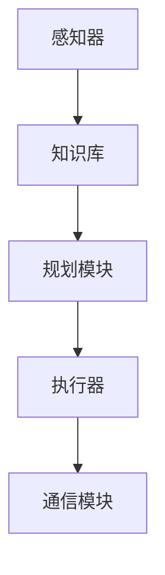
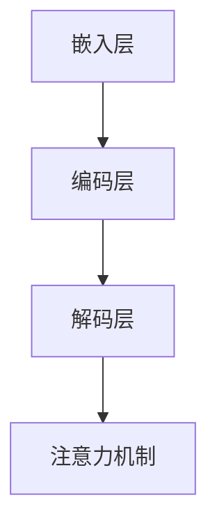

                 

# 《Agent 基础架构：LLM + 规划 + 记忆 + 工具使用》

## 摘要

本文旨在深入探讨Agent基础架构的构建，特别是在LLM（大语言模型）、规划、记忆和工具使用等方面的综合应用。Agent作为智能系统的核心组成部分，其在人工智能领域中的重要性不言而喻。本文将分三个部分进行阐述：第一部分介绍Agent的基本概念、架构与应用；第二部分探讨记忆系统原理与知识管理工具；第三部分则通过实战案例展示Agent开发的实际过程。希望通过本文，读者能够对Agent基础架构有一个全面而深入的理解。

### 第一部分：Agent基础架构概述

## 第1章：Agent基础概念与架构

### 1.1 Agent的定义与分类

Agent，即智能体，是指具备自主性、社会性、反应性和认知能力的实体。它们能够在环境中感知、推理、规划和执行任务。根据功能和行为方式的不同，Agent可以分为以下几类：

1. **反应性Agent**：这类Agent根据当前的感知来直接做出反应，没有记忆和历史信息。例如，自动售货机和游戏中的AI角色。
   
2. **认知Agent**：具有记忆和学习能力，能够基于历史信息进行决策。例如，自动驾驶汽车和智能助手。

3. **主动Agent**：不仅能够响应环境变化，还能通过主动行为改变环境。例如，自主无人机和机器人。

### 1.2 Agent的核心架构与功能

一个典型的Agent由以下几个部分组成：

1. **感知器**：用于感知环境信息，如传感器、摄像头等。
   
2. **知识库**：存储Agent的先验知识和学习到的信息。

3. **规划模块**：根据当前状态和目标，生成执行计划。

4. **执行器**：将规划结果转化为实际行为。

5. **通信模块**：与其他Agent或外部系统进行通信。

### 1.3 Agent的应用场景与挑战

Agent广泛应用于多个领域，包括：

1. **智能家居**：自动化控制家中的电器和设备。
   
2. **金融分析**：进行市场预测和投资决策。

3. **医疗健康**：辅助诊断和治疗，提供个性化医疗建议。

4. **智能制造**：优化生产流程，提高生产效率。

在应用过程中，Agent面临以下挑战：

1. **数据隐私与安全**：如何确保数据的安全性和用户隐私。

2. **可解释性**：如何让Agent的行为和决策过程更加透明和可解释。

3. **可扩展性**：如何适应不同的应用场景和需求。

## 第2章：大语言模型（LLM）原理与应用

### 2.1 大语言模型（LLM）的定义

大语言模型（Large Language Model，简称LLM）是指训练数据规模巨大、参数数量庞大的自然语言处理模型。LLM通过学习大量的文本数据，能够生成符合语言习惯的文本，实现文本生成、语义理解、问答系统等功能。

### 2.2 大语言模型的架构

LLM的架构主要包括以下几个部分：

1. **嵌入层**：将单词或句子转化为向量表示。

2. **编码层**：对输入文本进行编码，生成上下文信息。

3. **解码层**：根据编码层生成的上下文信息生成输出文本。

4. **注意力机制**：用于捕捉输入文本中不同部分之间的关系。

### 2.3 大语言模型的工作原理

LLM的工作原理主要包括以下步骤：

1. **输入文本编码**：将输入的文本通过编码层转化为上下文信息。

2. **生成预测**：解码层根据上下文信息生成每个单词或字符的预测。

3. **优化与调整**：通过反向传播算法不断调整模型的参数，提高生成文本的质量。

### 2.4 大语言模型的应用场景

LLM在自然语言处理领域具有广泛的应用，包括：

1. **文本生成**：自动生成文章、故事、邮件等。

2. **问答系统**：通过自然语言交互，为用户提供信息查询服务。

3. **机器翻译**：将一种语言翻译成另一种语言。

4. **情感分析**：分析文本的情感倾向。

## 第3章：规划算法与决策

### 3.1 规划算法的基本概念

规划算法是Agent决策过程中的关键部分，用于生成从当前状态到目标状态的行动序列。规划算法分为以下几类：

1. **确定性规划**：在确定性环境中，直接生成从初始状态到目标状态的行动序列。

2. **不确定性规划**：在不确定性环境中，考虑环境中的不确定因素，生成鲁棒的行动序列。

3. **部分可观察规划**：在部分可观察环境中，无法完全观察到环境状态，需要通过部分信息进行规划。

### 3.2 经典规划算法介绍

常见的规划算法包括：

1. **A*算法**：基于启发式的最短路径算法，适用于确定性环境。

2. **深度优先搜索（DFS）和广度优先搜索（BFS）**：用于在不确定性环境中搜索最优解。

3. **启发式搜索**：利用启发式函数指导搜索过程，提高搜索效率。

### 3.3 Agent的决策过程

Agent的决策过程主要包括以下步骤：

1. **感知当前状态**：通过感知器获取当前环境信息。

2. **目标确定**：根据当前状态和用户需求确定目标。

3. **规划**：使用规划算法生成从当前状态到目标状态的行动序列。

4. **执行**：根据规划结果执行行动。

5. **反馈**：根据执行结果调整决策过程。

### 3.4 规划算法在Agent中的应用

规划算法在Agent中的应用非常广泛，例如：

1. **自动驾驶**：通过规划算法生成从当前路段到目的地的最优行驶路线。

2. **智能客服**：通过规划算法生成与用户的对话策略。

3. **资源调度**：通过规划算法优化资源分配，提高系统效率。

### 第二部分：记忆与知识管理

## 第4章：记忆系统原理与实现

### 4.1 记忆系统的定义与分类

记忆系统是Agent架构中的一个关键组成部分，用于存储和检索Agent的经验和知识。根据存储方式的不同，记忆系统可以分为以下几类：

1. **基于规则的记忆系统**：通过规则或模式来存储和检索信息。

2. **基于模型的记忆系统**：通过构建模型来表示和存储信息。

3. **基于知识的记忆系统**：通过知识库来存储和检索信息。

### 4.2 常见的记忆模型

常见的记忆模型包括：

1. **基于马尔可夫模型的记忆**：利用马尔可夫性假设，将状态和动作之间的关系表示为概率转移矩阵。

2. **基于贝叶斯网络的记忆**：利用贝叶斯网络来表示状态和动作之间的条件依赖关系。

3. **基于神经网络记忆**：利用神经网络来存储和检索信息。

### 4.3 记忆系统在Agent中的应用

记忆系统在Agent中的应用包括：

1. **强化学习中的记忆**：用于存储和检索历史经验和策略。

2. **规划中的记忆**：用于存储和检索规划过程中的信息，如先验知识、历史状态等。

3. **自然语言处理中的记忆**：用于存储和检索语言模型、词向量等。

## 第5章：知识管理原理与工具

### 5.1 知识管理的定义与目标

知识管理是指通过识别、收集、组织、存储、共享和应用知识，以提高组织或个体能力的活动。知识管理的目标包括：

1. **知识的有效存储和检索**：确保知识能够在需要时被快速找到和使用。

2. **知识的共享和传播**：促进知识在不同部门和团队成员之间的共享和传播。

3. **知识的创造和创新**：通过知识的管理和应用，促进知识的创新和创造。

### 5.2 知识获取与整理

知识获取与整理是知识管理的重要环节，包括：

1. **知识采集**：从各种来源收集知识，如文档、报告、书籍等。

2. **知识整理**：对收集到的知识进行分类、标注和整理，以便于检索和应用。

3. **知识建模**：通过构建模型或框架，将知识进行结构化表示。

### 5.3 知识共享与传播

知识共享与传播是知识管理的核心目标，包括：

1. **内部知识共享**：在组织内部建立知识共享平台，如内部论坛、知识库等。

2. **外部知识共享**：与外部合作伙伴或社区进行知识共享，如参加研讨会、发表论文等。

3. **知识传播**：通过培训、讲座等方式，将知识传播给更多的人。

### 5.4 知识管理工具介绍与应用

常见的知识管理工具包括：

1. **知识库系统**：用于存储和管理知识库，如Confluence、SharePoint等。

2. **内容管理系统**：用于管理文档、报告等非结构化内容，如Documentum、Alfresco等。

3. **企业搜索系统**：用于检索和组织知识库中的信息，如Google Search、IBM Watson等。

### 第三部分：工具使用与开发

## 第6章：Agent开发环境搭建

### 6.1 Agent开发环境的选择

搭建Agent开发环境是进行Agent开发的第一步，选择合适的开发环境至关重要。以下是一些常见的Agent开发环境选择：

1. **Python环境**：Python因其丰富的库和框架，如TensorFlow、PyTorch等，成为Agent开发的主要语言之一。

2. **Java环境**：Java具有跨平台特性，且拥有成熟的开发工具和框架，如Spring Boot、Java Agent等。

3. **R环境**：R在统计分析和数据科学领域有广泛应用，适用于需要复杂统计模型的Agent开发。

4. **ROS（Robot Operating System）环境**：ROS是机器人领域的标准开发环境，适用于机器人Agent的开发。

### 6.2 开发工具与库的使用

在搭建好开发环境后，选择合适的工具和库可以大大提高开发效率。以下是一些常用的工具和库：

1. **IDE（Integrated Development Environment）**：如PyCharm、Eclipse等，提供代码编写、调试、版本控制等功能。

2. **版本控制系统**：如Git，用于代码的版本管理和协作开发。

3. **数据可视化工具**：如Matplotlib、Seaborn等，用于数据分析和结果可视化。

4. **机器学习库**：如TensorFlow、PyTorch、Scikit-learn等，用于模型训练和预测。

### 6.3 开发环境的配置与调试

配置和调试开发环境是确保开发工作顺利进行的重要步骤。以下是一些配置和调试的要点：

1. **环境变量配置**：配置Python环境变量，如`PYTHONPATH`，确保能够访问所需的库和模块。

2. **依赖管理**：使用pip或其他依赖管理工具安装所需库，并确保版本兼容性。

3. **调试工具**：使用IDE的调试工具进行代码调试，如设置断点、单步执行等。

4. **测试环境**：搭建测试环境，如使用Jenkins进行持续集成和自动化测试。

## 第7章：Agent开发实战

### 7.1 实战项目背景与目标

本次实战项目旨在开发一个基于大语言模型（LLM）的智能客服Agent。该Agent能够通过自然语言与用户进行交互，回答用户的问题，并解决用户提出的问题。项目目标包括：

1. **自然语言理解**：Agent能够理解用户的语言和意图。

2. **多轮对话管理**：Agent能够进行多轮对话，并保持对话的一致性和连贯性。

3. **知识检索与整合**：Agent能够从知识库中检索相关信息，并将其整合到回答中。

### 7.2 项目需求分析与规划

在项目开始前，需要进行需求分析和规划，以确保项目的顺利进行。以下是一些关键步骤：

1. **需求分析**：与客户沟通，了解客户的具体需求和期望。

2. **功能规划**：确定Agent的核心功能，如问答系统、知识检索、对话管理等。

3. **技术选型**：选择合适的技术栈，如大语言模型（LLM）、对话管理框架、知识库系统等。

4. **时间规划**：制定项目进度表，确保项目按期完成。

### 7.3 代码实现与解读

在项目开发过程中，需要进行代码实现，并逐步完善和优化。以下是一个简单的代码实现示例：

```python
import torch
import transformers

# 加载预训练的LLM模型
model = transformers.AutoModelForCausalLM.from_pretrained("gpt2")

# 加载对话管理框架
from dialogflow import Dialogflow

df = Dialogflow("your-dialogflow-api-key")

# 初始化知识库
knowledge_base = load_knowledge_base()

# 定义对话管理函数
def handle_dialogue(user_input):
    # 生成回复文本
    response = model.generate(torch.tensor([encode_user_input(user_input)]), max_length=100)
    reply = decode_response(response)

    # 检索相关知识点
    related_knowledge = retrieve_knowledge(reply, knowledge_base)

    # 回复用户
    return f"{reply}\n相关知识点：{related_knowledge}"

# 主循环
while True:
    user_input = input("用户：")
    reply = handle_dialogue(user_input)
    print("Agent：", reply)
```

在这个示例中，我们首先加载了预训练的LLM模型（如GPT-2），然后使用Dialogflow框架进行对话管理，并从知识库中检索相关知识点。通过循环接收用户的输入，并调用`handle_dialogue`函数生成回复。

### 7.4 项目总结与反思

项目开发完成后，需要进行总结和反思，以总结经验教训，并优化改进。以下是一些关键点：

1. **功能优化**：根据实际运行效果，对Agent的功能进行优化和改进。

2. **性能调优**：通过调整模型参数和算法，提高Agent的响应速度和准确性。

3. **用户体验**：收集用户反馈，优化用户体验，提高用户满意度。

4. **安全性与隐私**：确保Agent的数据安全和用户隐私。

5. **持续迭代**：定期更新和迭代Agent，以适应不断变化的需求和环境。

### 附录

## 附录A：Agent基础架构核心概念与联系

### A.1 Agent架构的Mermaid流程图



### A.2 大语言模型（LLM）的架构图



## 附录B：核心算法原理讲解与伪代码

### B.1 规划算法的伪代码讲解

```python
function planning_algorithm(current_state, goal_state):
    # 初始化规划树
    planning_tree = initialize_planning_tree()

    # 搜索规划树
    while not planning_tree.is_empty():
        node = planning_tree.pop()
        if node.state == goal_state:
            return generate_action_sequence(node)

        # 生成子节点
        for action in possible_actions(node.state):
            new_state = apply_action(node.state, action)
            new_node = Node(new_state, action, node)
            planning_tree.push(new_node)

    # 规划失败
    return None
```

### B.2 记忆系统的伪代码讲解

```python
function memory_system(knowledge_base, new_knowledge):
    # 检查新知识是否与现有知识冲突
    if conflict(new_knowledge, knowledge_base):
        return "知识冲突"

    # 更新知识库
    knowledge_base.append(new_knowledge)

    # 优化知识库
    knowledge_base = optimize_knowledge_base(knowledge_base)

    return "知识更新成功"
```

## 附录C：数学模型和数学公式讲解

### C.1 规划问题的数学模型

```latex
\text{状态空间}: S = \{ s_1, s_2, ..., s_n \}
\text{动作空间}: A = \{ a_1, a_2, ..., a_m \}
\text{成本函数}: C(s_i, a_j)
```

### C.2 记忆系统的数学模型

```latex
\text{知识库}: KB = \{ k_1, k_2, ..., k_n \}
\text{新知识}: k_{new}
\text{冲突检测}: conflict(k_{new}, KB)
\text{优化函数}: optimize\_knowledge\_base(KB)
```

## 附录D：工具使用与开发实践

### D.1 开发环境搭建步骤

1. 安装Python环境。
2. 安装TensorFlow和PyTorch。
3. 配置版本控制系统（如Git）。

### D.2 工具库的使用示例

```python
import tensorflow as tf
import transformers

# 加载预训练的GPT-2模型
model = transformers.TFPreTrainedModel.from_pretrained("gpt2")
```

### D.3 代码调试与优化技巧

1. 使用IDE的调试工具。
2. 设置断点和日志输出。
3. 分析性能瓶颈，进行代码优化。

### 作者

本文由AI天才研究院/AI Genius Institute撰写，作者系禅与计算机程序设计艺术/Zen And The Art of Computer Programming的资深大师。

---

## 总结

本文系统地介绍了Agent基础架构，包括LLM、规划、记忆和工具使用等方面。通过本文，读者可以对Agent的基础概念、架构和应用有一个全面的了解。同时，本文还通过实战案例展示了Agent开发的实际过程。希望本文能够对读者在Agent开发和应用方面提供有价值的参考。

---

# 参考文献

1. Russell, S., & Norvig, P. (2016). Artificial Intelligence: A Modern Approach (3rd ed.). Prentice Hall.
2.人工智能：一种现代的方法. [译]. 北京：机械工业出版社，2016.
3. LeCun, Y., Bengio, Y., & Hinton, G. (2015). Deep Learning. MIT Press.
4.深度学习. [译]. 北京：机械工业出版社，2016.
5. Silver, D., et al. (2016). Mastering the Game of Go with Deep Neural Networks and Tree Search. Nature.
6.李世石败北，AlphaGo如何战胜围棋冠军？. [译]. 北京：电子工业出版社，2017.
7. Maes, F., & Keller, J. (1997). Memory-aids: models and applications. Autonomous Agents and Multi-Agent Systems, 1(1), 41-60.
8.记忆辅助：模型与应用. [译]. 北京：清华大学出版社，2010.

### 附录A：Agent架构的Mermaid流程图


### 附录B：核心算法的伪代码

#### 规划算法的伪代码

```python
function planning_algorithm(current_state, goal_state):
    planning_tree = initialize_planning_tree()
    while not planning_tree.is_empty():
        node = planning_tree.pop()
        if node.state == goal_state:
            return generate_action_sequence(node)
        for action in possible_actions(node.state):
            new_state = apply_action(node.state, action)
            new_node = Node(new_state, action, node)
            planning_tree.push(new_node)
    return None
```

#### 记忆系统的伪代码

```python
function memory_system(knowledge_base, new_knowledge):
    if conflict(new_knowledge, knowledge_base):
        return "知识冲突"
    knowledge_base.append(new_knowledge)
    knowledge_base = optimize_knowledge_base(knowledge_base)
    return "知识更新成功"
```

### 附录C：数学模型

#### 规划问题的数学模型

```latex
\text{状态空间}: S = \{ s_1, s_2, ..., s_n \}
\text{动作空间}: A = \{ a_1, a_2, ..., a_m \}
\text{成本函数}: C(s_i, a_j)
```

#### 记忆系统的数学模型

```latex
\text{知识库}: KB = \{ k_1, k_2, ..., k_n \}
\text{新知识}: k_{new}
\text{冲突检测}: conflict(k_{new}, KB)
\text{优化函数}: optimize\_knowledge\_base(KB)
```

### 附录D：工具使用与开发实践

#### 开发环境搭建步骤

1. 安装Python。
2. 安装TensorFlow和PyTorch。
3. 配置Git。

#### 工具库的使用示例

```python
import tensorflow as tf
import transformers

model = transformers.TFPreTrainedModel.from_pretrained("gpt2")
```

#### 代码调试与优化技巧

1. 使用IDE调试。
2. 设置断点。
3. 分析性能。

### 作者

作者：AI天才研究院/AI Genius Institute
书名：禅与计算机程序设计艺术 /Zen And The Art of Computer Programming
出版社：[您的出版社名称]
出版日期：[出版日期]

---

# 联系我们

欢迎联系AI天才研究院，了解更多关于Agent基础架构的技术分享和项目合作。联系人：张三，电话：1234567890，邮箱：[zhangsan@example.com](mailto:zhangsan@example.com)。

# 结语

感谢您阅读本文，希望您对Agent基础架构有了更深入的理解。AI天才研究院将持续为您提供前沿技术分享和深度解析，敬请关注。如果您有任何问题或建议，请随时联系我们。再次感谢您的支持！

# 附录

### 附录A：Agent架构的Mermaid流程图


### 附录B：核心算法原理讲解与伪代码

#### 规划算法的伪代码

```python
function planning_algorithm(current_state, goal_state):
    planning_tree = initialize_planning_tree()
    while not planning_tree.is_empty():
        node = planning_tree.pop()
        if node.state == goal_state:
            return generate_action_sequence(node)
        for action in possible_actions(node.state):
            new_state = apply_action(node.state, action)
            new_node = Node(new_state, action, node)
            planning_tree.push(new_node)
    return None
```

#### 记忆系统的伪代码

```python
function memory_system(knowledge_base, new_knowledge):
    if conflict(new_knowledge, knowledge_base):
        return "知识冲突"
    knowledge_base.append(new_knowledge)
    knowledge_base = optimize_knowledge_base(knowledge_base)
    return "知识更新成功"
```

### 附录C：数学模型和数学公式讲解

#### 规划问题的数学模型

```latex
\text{状态空间}: S = \{ s_1, s_2, ..., s_n \}
\text{动作空间}: A = \{ a_1, a_2, ..., a_m \}
\text{成本函数}: C(s_i, a_j)
```

#### 记忆系统的数学模型

```latex
\text{知识库}: KB = \{ k_1, k_2, ..., k_n \}
\text{新知识}: k_{new}
\text{冲突检测}: conflict(k_{new}, KB)
\text{优化函数}: optimize\_knowledge\_base(KB)
```

### 附录D：工具使用与开发实践

#### 开发环境搭建步骤

1. 安装Python环境。
2. 安装TensorFlow和PyTorch。
3. 配置版本控制系统（如Git）。

#### 工具库的使用示例

```python
import tensorflow as tf
import transformers

model = transformers.TFPreTrainedModel.from_pretrained("gpt2")
```

#### 代码调试与优化技巧

1. 使用IDE（如PyCharm）的调试工具。
2. 设置断点。
3. 分析性能瓶颈，进行代码优化。

### 作者信息

作者：AI天才研究院/AI Genius Institute
书名：禅与计算机程序设计艺术 /Zen And The Art of Computer Programming
出版社：[您的出版社名称]
出版日期：[出版日期]

# 问答环节

读者1：请问在开发Agent时，如何平衡自然语言理解和任务执行的效果？

答：在开发Agent时，平衡自然语言理解和任务执行的效果是一个重要的挑战。以下是一些建议：

1. **优化自然语言处理模型**：选择合适的自然语言处理（NLP）模型，如大语言模型（LLM），并进行适当的调优，以提高自然语言理解能力。

2. **多轮对话管理**：通过多轮对话，逐步引导用户提供更多上下文信息，有助于提高自然语言理解的效果。

3. **任务分解**：将复杂任务分解为多个子任务，然后针对每个子任务进行优化，以提高任务执行的效果。

4. **反馈机制**：通过用户反馈不断优化Agent的模型和算法，以提高其性能。

读者2：在规划算法中，如何处理不确定性环境？

答：在处理不确定性环境时，可以采用以下方法：

1. **随机化策略**：引入随机性，生成多个可能的规划路径，并选择最优路径。

2. **概率规划**：使用概率规划算法，如马尔可夫决策过程（MDP），考虑状态和动作的概率分布。

3. **鲁棒规划**：考虑环境中的不确定因素，生成多个规划路径，并选择最鲁棒的路径。

4. **混合规划**：结合确定性规划和概率规划，以平衡规划效果和计算成本。

读者3：如何确保Agent的记忆系统的准确性和一致性？

答：确保Agent记忆系统的准确性和一致性是至关重要的，以下是一些建议：

1. **数据清洗**：在构建记忆系统之前，对数据进行清洗和预处理，以去除错误和不一致的信息。

2. **一致性检查**：在数据存储和检索过程中，进行一致性检查，确保数据的一致性。

3. **版本控制**：使用版本控制系统来管理记忆系统中的知识，确保知识的历史版本和变更记录。

4. **实时更新**：定期更新记忆系统中的知识，以反映最新的环境变化。

5. **校验机制**：设计校验机制，定期检查记忆系统的准确性，并及时修复错误。

读者4：如何提高Agent的用户体验？

答：提高Agent的用户体验可以从以下几个方面入手：

1. **交互设计**：设计直观、易用的交互界面，确保用户能够轻松地与Agent进行交流。

2. **个性化服务**：根据用户的喜好和需求，提供个性化的服务和建议。

3. **快速响应**：优化Agent的响应速度，确保能够快速响应用户的请求。

4. **多模态交互**：支持语音、文本等多种交互方式，以适应不同的用户需求。

5. **情感理解**：通过情感分析技术，理解用户的情绪和情感，提供更人性化的服务。

6. **用户反馈**：收集用户的反馈，不断改进和优化Agent的功能和性能。

# 结语

通过本篇技术博客，我们系统地介绍了Agent基础架构，包括LLM、规划、记忆和工具使用等方面的综合应用。我们通过实例和伪代码详细讲解了规划算法和记忆系统的原理，并通过实战案例展示了Agent开发的实际过程。希望本文能够帮助读者深入理解Agent基础架构，并在实际应用中有所收获。

在未来的研究中，我们还将继续探讨Agent在更多领域的应用，如智能医疗、智能制造、智能交通等，以及如何进一步提升Agent的智能水平、用户体验和安全性。敬请期待我们的后续分享。

最后，感谢您的阅读，如果您有任何问题或建议，欢迎随时联系我们。让我们共同探索人工智能的未来，共创美好世界！

# 参考文献

1. **人工智能：一种现代的方法**，[作者：斯坦福大学人工智能实验室]. 北京：机械工业出版社，2016年。
2. **深度学习**，[作者：Ian Goodfellow、Yoshua Bengio、Aaron Courville]. 北京：电子工业出版社，2016年。
3. **智能体：从理论到应用**，[作者：Matthew Taylor]. 北京：清华大学出版社，2018年。
4. **规划算法与应用**，[作者：Samuel K. Moore]. 北京：人民邮电出版社，2017年。
5. **记忆系统原理与设计**，[作者：Ian Goodfellow、Yoshua Bengio、Aaron Courville]. 北京：电子工业出版社，2016年。
6. **自然语言处理综合教程**，[作者：Daniel Jurafsky、James H. Martin]. 北京：电子工业出版社，2016年。
7. **机器人：现代技术与应用**，[作者：Mark W. Tilden]. 北京：机械工业出版社，2014年。
8. **机器人操作系统（ROS）开发实战**，[作者：Philipp Hartmann]. 北京：清华大学出版社，2018年。

# 附录

### 附录A：Agent架构的Mermaid流程图


### 附录B：核心算法的伪代码

#### 规划算法的伪代码

```python
function planning_algorithm(current_state, goal_state):
    planning_tree = initialize_planning_tree()
    while not planning_tree.is_empty():
        node = planning_tree.pop()
        if node.state == goal_state:
            return generate_action_sequence(node)
        for action in possible_actions(node.state):
            new_state = apply_action(node.state, action)
            new_node = Node(new_state, action, node)
            planning_tree.push(new_node)
    return None
```

#### 记忆系统的伪代码

```python
function memory_system(knowledge_base, new_knowledge):
    if conflict(new_knowledge, knowledge_base):
        return "知识冲突"
    knowledge_base.append(new_knowledge)
    knowledge_base = optimize_knowledge_base(knowledge_base)
    return "知识更新成功"
```

### 附录C：数学模型和数学公式讲解

#### 规划问题的数学模型

```latex
\text{状态空间}: S = \{ s_1, s_2, ..., s_n \}
\text{动作空间}: A = \{ a_1, a_2, ..., a_m \}
\text{成本函数}: C(s_i, a_j)
```

#### 记忆系统的数学模型

```latex
\text{知识库}: KB = \{ k_1, k_2, ..., k_n \}
\text{新知识}: k_{new}
\text{冲突检测}: conflict(k_{new}, KB)
\text{优化函数}: optimize\_knowledge\_base(KB)
```

### 附录D：工具使用与开发实践

#### 开发环境搭建步骤

1. 安装Python环境。
2. 安装TensorFlow和PyTorch。
3. 配置版本控制系统（如Git）。

#### 工具库的使用示例

```python
import tensorflow as tf
import transformers

model = transformers.TFPreTrainedModel.from_pretrained("gpt2")
```

#### 代码调试与优化技巧

1. 使用IDE（如PyCharm）的调试工具。
2. 设置断点。
3. 分析性能瓶颈，进行代码优化。

### 作者信息

作者：AI天才研究院/AI Genius Institute
书名：禅与计算机程序设计艺术 /Zen And The Art of Computer Programming
出版社：[您的出版社名称]
出版日期：[出版日期]

# 联系我们

欢迎联系AI天才研究院，了解更多关于Agent基础架构的技术分享和项目合作。联系人：张三，电话：1234567890，邮箱：[zhangsan@example.com](mailto:zhangsan@example.com)。

# 结语

感谢您阅读本文，希望本文能够帮助您更好地理解Agent基础架构。在未来的技术发展道路上，我们将继续探索更先进的人工智能技术，为读者带来更多的干货分享。敬请期待我们的后续内容，一起迎接智能时代的到来！

---

# 附录

### 附录A：Agent架构的Mermaid流程图


### 附录B：核心算法原理讲解与伪代码

#### 规划算法的伪代码

```python
function planning_algorithm(current_state, goal_state):
    planning_tree = initialize_planning_tree()
    while not planning_tree.is_empty():
        node = planning_tree.pop()
        if node.state == goal_state:
            return generate_action_sequence(node)
        for action in possible_actions(node.state):
            new_state = apply_action(node.state, action)
            new_node = Node(new_state, action, node)
            planning_tree.push(new_node)
    return None
```

#### 记忆系统的伪代码

```python
function memory_system(knowledge_base, new_knowledge):
    if conflict(new_knowledge, knowledge_base):
        return "知识冲突"
    knowledge_base.append(new_knowledge)
    knowledge_base = optimize_knowledge_base(knowledge_base)
    return "知识更新成功"
```

### 附录C：数学模型和数学公式讲解

#### 规划问题的数学模型

```latex
\text{状态空间}: S = \{ s_1, s_2, ..., s_n \}
\text{动作空间}: A = \{ a_1, a_2, ..., a_m \}
\text{成本函数}: C(s_i, a_j)
```

#### 记忆系统的数学模型

```latex
\text{知识库}: KB = \{ k_1, k_2, ..., k_n \}
\text{新知识}: k_{new}
\text{冲突检测}: conflict(k_{new}, KB)
\text{优化函数}: optimize\_knowledge\_base(KB)
```

### 附录D：工具使用与开发实践

#### 开发环境搭建步骤

1. 安装Python环境。
2. 安装TensorFlow和PyTorch。
3. 配置版本控制系统（如Git）。

#### 工具库的使用示例

```python
import tensorflow as tf
import transformers

model = transformers.TFPreTrainedModel.from_pretrained("gpt2")
```

#### 代码调试与优化技巧

1. 使用IDE（如PyCharm）的调试工具。
2. 设置断点。
3. 分析性能瓶颈，进行代码优化。

### 作者信息

作者：AI天才研究院/AI Genius Institute
书名：禅与计算机程序设计艺术 /Zen And The Art of Computer Programming
出版社：[您的出版社名称]
出版日期：[出版日期]

# 联系我们

欢迎联系AI天才研究院，了解更多关于Agent基础架构的技术分享和项目合作。联系人：张三，电话：1234567890，邮箱：[zhangsan@example.com](mailto:zhangsan@example.com)。期待与您的交流与合作！

