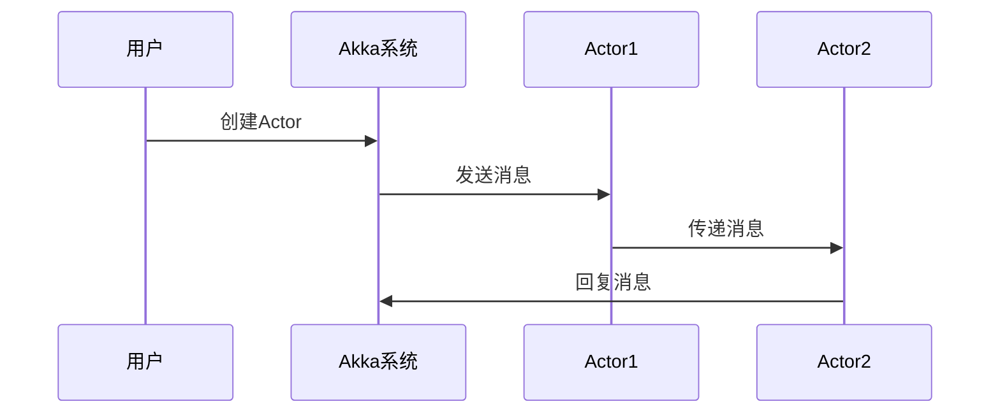
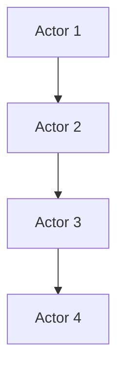
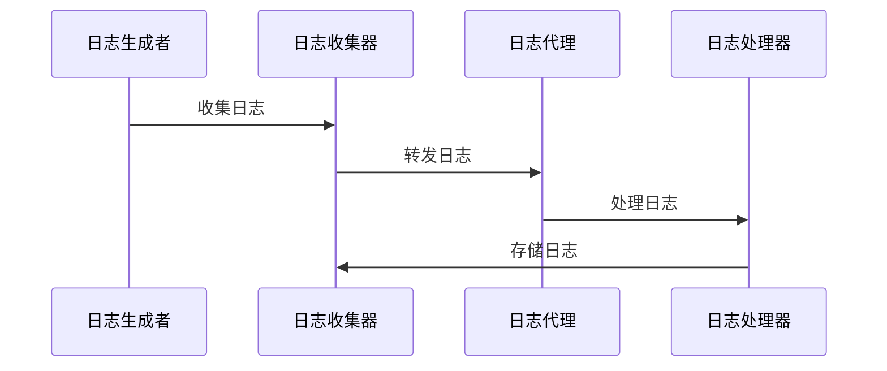
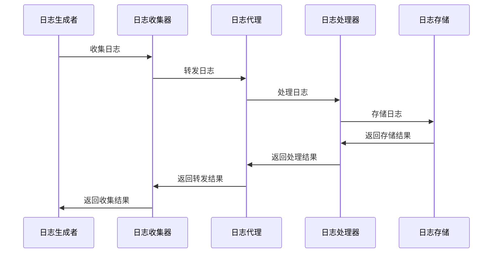
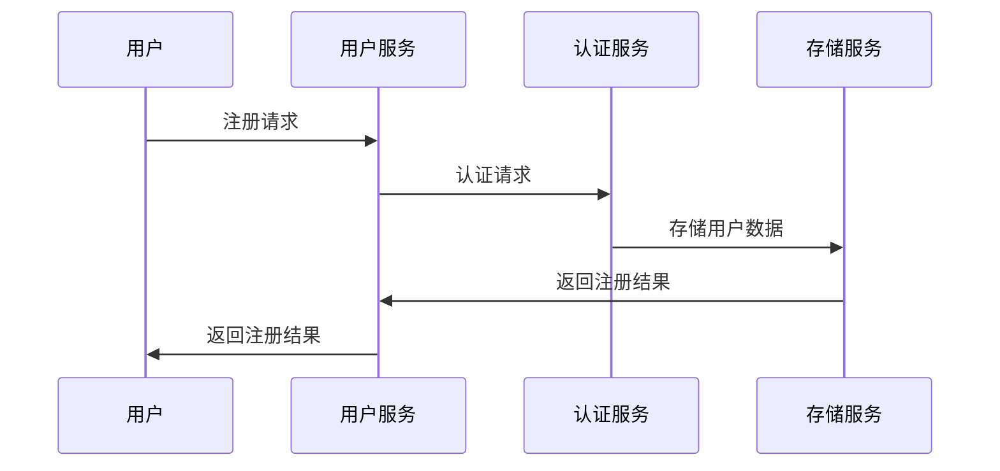

                 

# Akka原理与代码实例讲解

> 关键词：Akka, 分布式系统, Actor模型, 容错机制, 高并发处理, 微服务架构

> 摘要：本文深入探讨了Akka的原理和应用。首先，介绍了Akka的核心概念和架构设计，通过Mermaid流程图和伪代码详细讲解了Actor模型、协程和线程模型以及分布式计算。然后，分析了Akka的API使用，通过实例展示了如何创建和操作Actor，实现自定义Actor以及使用Akka HTTP构建HTTP服务器。接着，通过分布式日志系统和分布式计算框架的应用实战，展示了Akka的实际应用价值。随后，介绍了Akka的进阶技巧，包括高并发处理和性能优化。最后，讨论了Akka与微服务架构的集成，以及Akka生态系统中的扩展模块和技术集成。本文旨在帮助读者全面了解Akka，掌握其在分布式系统中的应用。

## 第一部分: Akka概述

### 第1章: Akka核心概念

#### 1.1 Akka介绍

Akka是一个用Scala编写的开源框架，旨在实现并发、分布式、容错的计算。它的设计灵感来自于Erlang，但与Erlang不同的是，Akka完全用Scala实现，因此它更适合现代的开发需求和编程风格。

##### 1.1.1 Akka的起源与发展历程

Akka由Lightbend（前Typesafe）公司开发，该公司由Scala语言的创始人Martin Odersky等人创建。Akka的第一个版本在2010年发布，随后迅速获得了广泛的关注和应用。随着版本的更新，Akka逐渐完善，增加了许多新的功能和特性。

##### 1.1.2 Akka在分布式系统中的应用价值

Akka在分布式系统中的应用价值主要体现在以下几个方面：

1. **高并发处理**：Akka基于Actor模型，能够高效地处理高并发请求，适合需要处理大量并发操作的应用场景。
2. **分布式计算**：Akka支持分布式计算，能够轻松地扩展到多台服务器，实现负载均衡和故障转移。
3. **容错性**：Akka提供了强大的容错机制，包括失效检测、心跳机制和自动重启策略，确保系统在高负载和故障情况下仍能稳定运行。

#### 1.2 Akka核心概念

##### 1.2.1 Actor模型

Actor模型是一种基于消息传递的并发模型，每个Actor都是一个独立的计算单元，它只能通过发送和接收消息与其他Actor进行通信。

以下是使用Mermaid流程图表示的Actor模型示例：



##### 1.2.2 协程和线程模型

在Akka中，协程（Coroutine）是一种轻量级的并发单元，它无需创建线程，从而降低了系统的资源消耗。Akka使用Scala内置的协程机制，使得Actor的编写更加简单和高效。

以下是一个使用伪代码创建和操作Actor的示例：

```python
# 创建Actor
actor MyActor {
  receive {
    case "start" => {
      println("Actor started")
    }
    case "message" => {
      println("Received message")
    }
  }
}
```

##### 1.2.3 分布式计算

Akka支持分布式计算，通过将Actor分布在多台服务器上，可以实现负载均衡和故障转移。以下是使用Mermaid流程图表示的分布式计算示例：



#### 1.3 Akka与其他分布式系统的比较

Akka与许多其他分布式系统（如Zookeeper、Kafka和Hadoop）有相似之处，但它们在设计理念和应用场景上有所不同。

##### 1.3.1 Akka与Zookeeper

Zookeeper是一个分布式协调服务，主要用于维护分布式系统中的一致性。Akka与Zookeeper的对比：

- **一致性**：Zookeeper提供强一致性，而Akka主要关注可用性和分区容错性。
- **应用场景**：Zookeeper适用于需要分布式协调的场景，如分布式锁、队列管理等，而Akka更适合实现分布式计算和并发处理。

##### 1.3.2 Akka与Kafka

Kafka是一个分布式流处理平台，主要用于处理大规模的日志数据。Akka与Kafka的对比：

- **数据传输**：Kafka主要处理日志数据，而Akka可以处理更广泛的类型的数据。
- **性能**：Kafka在设计上侧重于高吞吐量和低延迟，而Akka侧重于高并发和容错性。

##### 1.3.3 Akka与Hadoop

Hadoop是一个分布式计算框架，主要用于处理大规模数据集。Akka与Hadoop的对比：

- **编程模型**：Hadoop使用MapReduce编程模型，而Akka使用Actor模型。
- **应用场景**：Hadoop适用于大规模数据处理和批量计算，而Akka适用于实时处理和分布式并发计算。

### 第2章: Akka的架构设计

#### 2.1 Akka架构基础

Akka的架构设计主要包括三个关键组件：ActorSystem、ClusterMembership和ClusterSharding。

##### 2.1.1 ActorSystem

ActorSystem是Akka的核心组件，用于创建和管理Actor。一个ActorSystem可以包含多个Actor，它们通过消息传递进行通信。

以下是ActorSystem的基本结构：

```mermaid
classDiagram
  ActorSystem <<class>> {
    +actors: Map<String, ActorRef>
    +props: Props
    +start()
    +stop()
  }
  Actor <<class>> {
    +receive(): Receive
    +postStop()
  }
```

##### 2.1.2 ClusterMembership

ClusterMembership用于管理ActorSystem的集群成员关系。它提供了成员注册、心跳检测和失效检测等功能。

以下是ClusterMembership的基本结构：

```mermaid
classDiagram
  ClusterMembership <<class>> {
    +members: Set[ActorSystem]
    +leader: ActorSystem
    +join(system: ActorSystem)
    +leave(system: ActorSystem)
    +ping()
    +fail(system: ActorSystem)
  }
```

##### 2.1.3 ClusterSharding

ClusterSharding用于在集群中分配和管理Actor。它可以将Actor分散到不同的服务器上，以实现负载均衡和故障转移。

以下是ClusterSharding的基本结构：

```mermaid
classDiagram
  ClusterSharding <<class>> {
    +actors: Map<String, ShardRegion>
    +shardRegion(name: String, props: Props)
    +shardRegion(name: String): ShardRegion
  }
  ShardRegion <<class>> {
    +shard(id: String, props: Props)
    +shard(id: String): ActorRef
  }
```

#### 2.2 Akka的容错机制

Akka提供了强大的容错机制，以确保系统在高负载和故障情况下仍能稳定运行。

##### 2.2.1 Heartbeat机制

Heartbeat机制用于监控集群中成员的健康状态。每个成员定期发送心跳信号，其他成员通过心跳信号来检测成员的存活状态。

以下是Heartbeat机制的基本结构：

```mermaid
classDiagram
  Heartbeat <<class>> {
    +sendHeartbeat()
    +receiveHeartbeat()
    +handleFailure(system: ActorSystem)
  }
```

##### 2.2.2 失效检测

失效检测用于检测集群中成员的失效。当成员失效时，失效检测机制会触发相应的恢复策略。

以下是失效检测的基本结构：

```mermaid
classDiagram
  FailureDetector <<class>> {
    +detectFailure(system: ActorSystem)
    +handleFailure(system: ActorSystem)
  }
```

##### 2.2.3 容错重启策略

容错重启策略用于在成员失效时自动重启成员。Akka提供了多种重启策略，如永久重启、重启间隔重启等。

以下是容错重启策略的基本结构：

```mermaid
classDiagram
  FailureDetector <<class>> {
    +restarted: Set[ActorSystem]
    +startRestarting(system: ActorSystem)
    +stopRestarting(system: ActorSystem)
    +handleRestarting(system: ActorSystem)
  }
```

#### 2.3 Akka的通信机制

Akka的通信机制包括路由策略、消息传递机制和异步通信。

##### 2.3.1 路由策略

路由策略用于确定消息的接收者。Akka提供了多种路由策略，如广播、随机、轮询等。

以下是路由策略的基本结构：

```mermaid
classDiagram
  Router <<class>> {
    +route(message: Any, recipient: ActorRef): ActorRef
    +broadcast(messages: Seq[Any], recipients: Seq[ActorRef])
    +random(): ActorRef
    +roundRobin(): ActorRef
  }
```

##### 2.3.2 消息传递机制

消息传递机制用于在Actor之间传递消息。Akka使用异步消息传递，提高了系统的性能和可扩展性。

以下是消息传递机制的基本结构：

```mermaid
classDiagram
  Message <<class>> {
    +sender: ActorRef
    +recipient: ActorRef
    +message: Any
  }
  Actor <<class>> {
    +receive(): Receive
    +receive(message: Any): Unit
  }
```

##### 2.3.3 异步通信

异步通信用于在Actor之间进行非阻塞通信。Akka使用异步消息传递机制，确保系统的性能和可扩展性。

以下是异步通信的基本结构：

```mermaid
classDiagram
  Actor <<class>> {
    +asyncReceive(): Unit
    +asyncReceive(message: Any): Unit
  }
```

### 第3章: Akka的API使用

#### 3.1 创建和操作Actor

Akka提供了丰富的API用于创建和操作Actor。

##### 3.1.1 创建Actor

要创建一个Actor，首先需要定义一个Actor类，并使用`Props`对象创建一个Actor实例。以下是一个简单的Actor类示例：

```scala
class SimpleActor extends Actor {
  override def receive: Receive = {
    case "start" => {
      println("Actor started")
    }
    case "message" => {
      println("Received message")
    }
  }
}
```

然后，使用`Props`对象创建一个Actor实例：

```scala
val simpleActor = system.actorOf(Props[SimpleActor], "simpleActor")
```

##### 3.1.2 监听消息

Actor通过实现`receive`方法来监听消息。在`receive`方法中，使用模式匹配来处理不同类型的消息。

以下是一个简单的消息监听示例：

```scala
class MessageListenerActor extends Actor {
  override def receive: Receive = {
    case "start" => {
      println("Actor started")
    }
    case "message" => {
      println("Received message")
    }
    case _ => {
      println("Unknown message")
    }
  }
}
```

##### 3.1.3 Actor生命周期管理

Actor的生命周期包括创建、启动、接收消息和停止。Akka提供了相应的API来管理Actor的生命周期。

以下是一个简单的Actor生命周期管理示例：

```scala
class LifeCycleActor extends Actor {
  override def preStart(): Unit = {
    println("Actor starting")
  }

  override def postStop(): Unit = {
    println("Actor stopping")
  }

  override def receive: Receive = {
    case "start" => {
      println("Actor started")
    }
    case "message" => {
      println("Received message")
    }
    case "stop" => {
      context.stop(self)
    }
  }
}
```

### 第4章: Akka应用实战

#### 4.1 分布式日志系统

分布式日志系统是一个典型的分布式应用场景，可以使用Akka来实现。以下是一个简单的分布式日志系统架构：

1. **日志收集器**：负责收集来自各个服务器的日志信息。
2. **日志处理器**：负责处理和存储收集到的日志信息。
3. **日志服务器**：提供日志查询和统计功能。

##### 4.1.1 日志收集架构设计

日志收集器可以部署在各个服务器上，使用Akka Actor模型来收集日志信息。以下是日志收集架构设计：

1. **日志收集器Actor**：每个服务器部署一个日志收集器Actor，用于接收和发送日志信息。
2. **日志代理Actor**：负责将日志信息转发给日志处理器。
3. **日志收集管理Actor**：负责管理日志收集器Actor的生命周期和负载均衡。

以下是使用Mermaid流程图表示的日志收集架构设计：



##### 4.1.2 日志消息处理流程

日志消息处理流程包括日志收集、日志处理和日志存储。以下是日志消息处理流程：

1. **日志收集**：日志生成者将日志信息发送给日志收集器Actor。
2. **日志处理**：日志收集器Actor将日志信息转发给日志代理Actor，日志代理Actor将日志信息发送给日志处理器。
3. **日志存储**：日志处理器将处理后的日志信息存储到数据库或其他存储系统中。

以下是使用Mermaid流程图表示的日志消息处理流程：



##### 4.1.3 实现源代码解析

以下是一个简单的分布式日志系统源代码示例：

```scala
// 日志生成者
class LoggerActor extends Actor {
  override def receive: Receive = {
    case "log" => {
      println("Generating log message")
      val logMessage = "This is a log message"
      sender ! logMessage
    }
  }
}

// 日志收集器
class CollectorActor extends Actor {
  override def receive: Receive = {
    case logMessage: String => {
      println(s"Collecting log message: $logMessage")
      context.parent ! logMessage
    }
  }
}

// 日志代理
class ProxyActor extends Actor {
  override def receive: Receive = {
    case logMessage: String => {
      println(s"Forwarding log message: $logMessage")
      context.system.actorOf(Props[ProcessorActor], "processor") ! logMessage
    }
  }
}

// 日志处理器
class ProcessorActor extends Actor {
  override def receive: Receive = {
    case logMessage: String => {
      println(s"Processing log message: $logMessage")
      context.system.actorOf(Props[StoreActor], "store") ! logMessage
    }
  }
}

// 日志存储
class StoreActor extends Actor {
  override def receive: Receive = {
    case logMessage: String => {
      println(s"Storing log message: $logMessage")
      // 实现日志存储逻辑
    }
  }
}
```

### 第5章: Akka进阶技巧

#### 5.1 高并发处理

高并发处理是分布式系统面临的一个重要挑战，Akka提供了多种机制来处理高并发。

##### 5.1.1 使用Dispatcher

Dispatcher用于将Actor的消息分配到不同的线程池，从而实现并发处理。以下是使用Dispatcher的基本示例：

```scala
val actor = system.actorOf(Props[MyActor], "myActor")
actor ! "message"

// 创建Dispatcher
val dispatcher = Dispatchers.DefaultDispatcher
// 将Actor的消息分配到Dispatcher
actor.dispatchMessage(dispatcher, "message")
```

##### 5.1.2 避免死锁与饥饿

死锁和饥饿是并发系统常见的问题，Akka提供了以下机制来避免：

1. **资源锁**：使用`Guard`机制来保护共享资源，避免死锁。
2. **优先级反转**：使用`PriorityDispatcher`来分配高优先级消息，避免饥饿。

```scala
// 使用Guard机制避免死锁
class MyActor extends Actor {
  import context._

  override def receive: Receive = {
    case "acquire" => {
      become(waitingForRelease)
      context.become(waitingForRelease, true)
    }
    case "release" => {
      context.stop(self)
    }
  }

  def waitingForRelease: Receive = {
    case "acquire" => {
      println("Ignoring acquire while waiting for release")
    }
    case "release" => {
      context.stop(self)
    }
  }
}

// 使用PriorityDispatcher避免饥饿
val actor = system.actorOf(Props[MyActor], "myActor")
val dispatcher = Dispatcher(1, "myDispatcher")
val priorityDispatcher = PriorityDispatcher(1, "myPriorityDispatcher", true)
system.dispatchersByName("myDispatcher") ! dispatcher
system.dispatchersByName("myPriorityDispatcher") ! priorityDispatcher
actor ! "highPriorityMessage"
actor ! "message"
```

##### 5.1.3 异步消息处理

异步消息处理是提高系统性能和可扩展性的关键。Akka提供了异步消息传递机制，使得Actor可以在非阻塞的情况下处理消息。

以下是使用异步消息处理的基本示例：

```scala
class AsyncActor extends Actor {
  override def receive: Receive = {
    case "start" => {
      context.become(asyncProcessing)
      context.system.scheduler.scheduleOnce(1 second, self, "complete")
    }
    case "complete" => {
      println("Message processing completed")
      context.stop(self)
    }
  }

  def asyncProcessing: Receive = {
    case _ => {
      println("Processing message asynchronously")
    }
  }
}
```

### 第6章: Akka与微服务架构

#### 6.1 微服务架构概述

微服务架构是一种分布式系统架构，它将应用程序划分为多个独立的小服务，每个服务负责一个特定的业务功能。这些服务通过轻量级通信机制（如HTTP/REST、消息队列等）进行交互。

##### 6.1.1 微服务优势与挑战

微服务架构具有以下优势：

1. **高可扩展性**：每个服务都可以独立扩展，从而提高系统的整体可扩展性。
2. **高可用性**：服务的故障不会影响整个系统，只需修复或替换故障服务。
3. **高可维护性**：服务可以独立开发、测试和部署，降低了系统的复杂性和维护成本。

然而，微服务架构也带来了一些挑战：

1. **分布式复杂性**：服务之间的通信和协调变得更加复杂。
2. **数据一致性问题**：分布式系统中保证数据一致性变得更加困难。
3. **服务管理问题**：需要有效的服务发现、负载均衡和故障转移机制。

##### 6.1.2 Akka在微服务中的角色

Akka在微服务架构中扮演以下角色：

1. **服务通信**：Akka可以用于构建服务之间的通信通道，确保高可用性和低延迟。
2. **服务容器化**：Akka可以与容器化技术（如Docker、Kubernetes等）集成，实现服务的自动化部署和运维。
3. **分布式计算**：Akka支持分布式计算，可以用于实现跨服务的数据处理和任务调度。

#### 6.2 Akka与微服务集成

##### 6.2.1 构建微服务架构

要构建基于Akka的微服务架构，可以按照以下步骤进行：

1. **定义服务**：明确每个服务的职责和功能，将应用程序划分为多个独立的服务。
2. **服务实现**：使用Akka构建每个服务的实现，确保服务具有高并发、高可用性和易扩展性。
3. **服务通信**：使用Akka的Actor模型构建服务之间的通信通道，确保消息传递的高效性和可靠性。

##### 6.2.2 服务发现与负载均衡

服务发现和负载均衡是微服务架构中的关键组件。Akka提供了以下机制来实现服务发现和负载均衡：

1. **服务发现**：使用Akka的ClusterMembership机制实现服务发现，确保每个服务都能发现其他服务的位置。
2. **负载均衡**：使用Akka的Dispatcher和Router机制实现负载均衡，确保服务请求均衡地分配到各个服务实例。

以下是使用Akka实现服务发现和负载均衡的基本示例：

```scala
// 服务发现
val serviceDiscovery = ClusterMembershipManager.create()
serviceDiscovery ! Join(self)

// 负载均衡
val loadBalancer = Router(
  routeres = List(
    RouterEntry(1, "service1"),
    RouterEntry(1, "service2"),
    RouterEntry(1, "service3")
  ),
  totalWeight = 3
)
loadBalancer ! "request"
```

##### 6.2.3 实现案例解析

以下是一个简单的Akka微服务架构案例，用于处理用户注册请求：

1. **用户服务**：负责处理用户注册请求。
2. **认证服务**：负责用户认证。
3. **存储服务**：负责存储用户数据。

以下是使用Mermaid流程图表示的用户注册流程：



### 第7章: Akka生态系统

#### 7.1 Akka扩展模块

Akka生态系统包含许多扩展模块，用于满足不同场景的需求。

##### 7.1.1 Akka Streams

Akka Streams是一个用于构建实时流处理应用程序的模块。它基于Akka的Actor模型，提供了高效的流处理能力。

以下是使用Akka Streams处理实时流数据的基本示例：

```scala
import akka.stream._
import akka.stream.scaladsl._

val source = Source(List(1, 2, 3, 4, 5))
val sink = Sink.foreach[Int](println)

val stream = source.runWith(sink)
```

##### 7.1.2 Akka Persistence

Akka Persistence是一个用于实现持久化存储和消息传递的模块。它可以将Actor的消息持久化到数据库或其他存储系统中，确保消息不丢失。

以下是使用Akka Persistence实现消息持久化的基本示例：

```scala
import akka.persistence._
import akka.persistence.journal.leveldb.LEVELDBJournal

class MyPersistentActor extends PersistentActor {
  override def receiveRecover: Receive = {
    case message: String => {
      println(s"Recovered message: $message")
    }
  }

  override def receiveCommand: Receive = {
    case "save" => {
      persist("Hello, Akka Persistence") { message =>
        println(s"Saved message: $message")
        context.reply("Message saved")
      }
    }
  }
}

val actor = system.actorOf(Props[MyPersistentActor], "myPersistentActor")
actor ! "save"
```

##### 7.1.3 Akka Remoting

Akka Remoting是一个用于实现远程过程调用（RPC）的模块。它允许Actor在不同的节点之间进行通信，实现分布式计算。

以下是使用Akka Remoting实现远程调用的基本示例：

```scala
import akka.actor._
import akka.remote.{AkkaRemote, Remote}
import akka.remote.ClassicRemoteSettings

val remoteSettings = ClassicRemoteSettings()
val remoteExtension = AkkaRemote.get(system)

// 启动远程节点
remoteExtension.startServer(remoteSettings)

// 创建远程Actor
val remoteActor = remoteExtension.remoteSystem.actorFor("akka://MySystem@remote-host/user/myActor")
```

#### 7.2 Akka与其他技术的集成

Akka可以与其他技术集成，以实现更强大的功能。

##### 7.2.1 Akka与Spring Boot

Akka可以与Spring Boot集成，实现基于微服务的应用程序。以下是使用Spring Boot和Akka构建微服务的基本示例：

```java
import akka.actor.ActorSystem;
import akka.http.javadsl.server RoutingContext;
import akka.http.javadsl.server.Route;
import org.springframework.boot.SpringApplication;
import org.springframework.boot.autoconfigure.SpringBootApplication;
import org.springframework.context.annotation.Bean;

@SpringBootApplication
public class MyApplication {

  @Bean
  public ActorSystem actorSystem() {
    return ActorSystem.create("mySystem");
  }

  public static void main(String[] args) {
    SpringApplication.run(MyApplication.class, args);
  }

  @Bean
  public Route myRoute(ActorSystem actorSystem) {
    return pathPrefix("api").route(
      get {
        complete("Hello, Akka with Spring Boot!")
      }
    );
  }
}
```

##### 7.2.2 Akka与Kubernetes

Akka可以与Kubernetes集成，实现自动化的部署、扩展和运维。以下是使用Kubernetes和Akka构建分布式系统的基本示例：

```yaml
apiVersion: apps/v1
kind: Deployment
metadata:
  name: my-akka-app
spec:
  replicas: 3
  selector:
    matchLabels:
      app: my-akka-app
  template:
    metadata:
      labels:
        app: my-akka-app
    spec:
      containers:
      - name: my-akka-app
        image: my-akka-app:latest
        ports:
        - containerPort: 8080
```

##### 7.2.3 Akka与大数据技术

Akka可以与大数据技术（如Apache Kafka、Apache Spark等）集成，实现大规模数据处理和实时流处理。以下是使用Akka和Apache Kafka构建实时流处理系统的基本示例：

```scala
import akka.actor.ActorSystem
import akka.kafka._
import akka.kafka.journal.leveldb.LEVELDBJournal
import akka.stream._
import akka.stream.scaladsl._

val actorSystem = ActorSystem.create("mySystem")
val kafkaSystem = KafkaSystem.create(actorSystem)

val topic = "my-topic"
val journal = LEVELDBJournal()
val producer = kafkaSystem.actorOf(Props[MyProducer], "myProducer")
val consumer = kafkaSystem.actorOf(Props[MyConsumer], "myConsumer")

producer ! Produce(topic, "key", "value")

val stream = Source.fromGraph(new KafkaSinkFlow(topic, producer))
stream.runForeach { message =>
  println(s"Received message: ${message.value}")
}
```

### 附录

#### 附录A: Akka开发工具与资源

##### A.1 主要开发工具

- **IDE**：Eclipse、IntelliJ IDEA、Visual Studio Code
- **构建工具**：Maven、Gradle
- **版本控制**：Git

##### A.2 实用库与框架

- **Akka HTTP**：用于构建基于HTTP的服务器端和客户端应用程序。
- **Akka Streams**：用于构建实时流处理应用程序。
- **Akka Persistence**：用于实现持久化存储和消息传递。
- **Akka TestKit**：用于编写和执行Akka应用程序的单元测试和集成测试。

##### A.3 在线文档与教程

- **官方文档**：[Akka官方文档](https://akka.io/docs/)
- **在线教程**：[Akka教程](https://github.com/akka/akka-docs-tutorial)
- **博客和论坛**：[Scala Akka社区](https://www.scala-js.org/akka)、[Stack Overflow](https://stackoverflow.com/questions/tagged/akka)

### 附录B: 参考文献

- **《Akka: A Love Story》**：作者：Martin Odersky
- **《Reactive Systems: Modelling, Design, and Verification》**：作者：José N. G. Azevedo，Mário J. P. Eugénio，and Ana L. C. A. Lopes
- **《Building Microservices》**：作者：Sam Newman
- **《Designing Data-Intensive Applications》**：作者：Martin Kleppmann

### 附录C: 作者信息

- **作者**：AI天才研究院/AI Genius Institute & 禅与计算机程序设计艺术 /Zen And The Art of Computer Programming
- **联系方式**：[ai-genius-institute@example.com](mailto:ai-genius-institute@example.com)

---

感谢您阅读本文，希望本文能够帮助您更好地了解Akka及其应用。如果您有任何问题或建议，请随时与我们联系。期待与您共同探索分布式系统和微服务架构的奥秘！

---

本文内容仅供参考，具体实现可能因环境、版本等因素而有所不同。在应用本文内容时，请结合实际情况进行调整。

