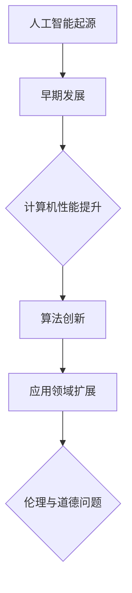
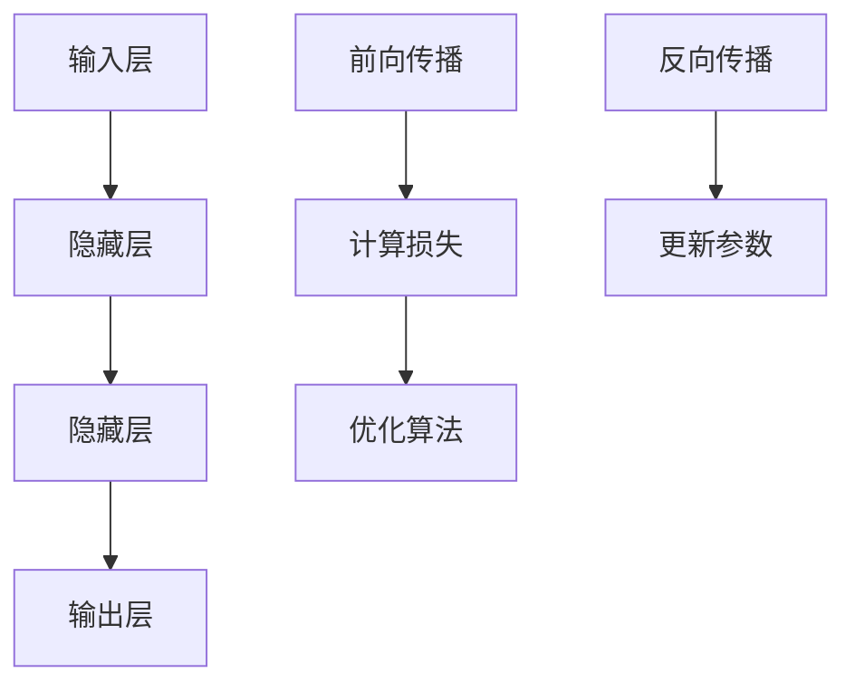
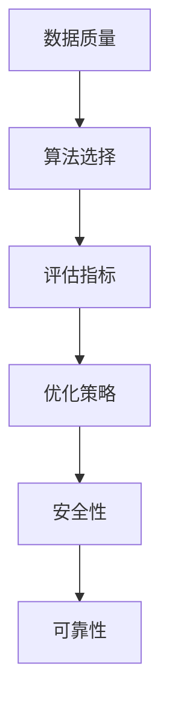
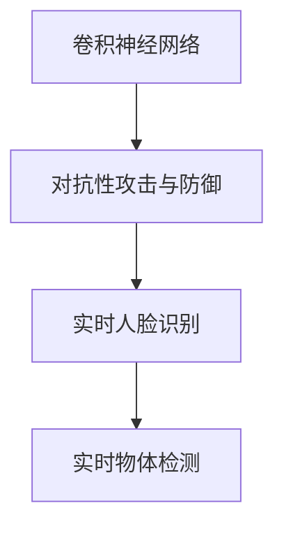
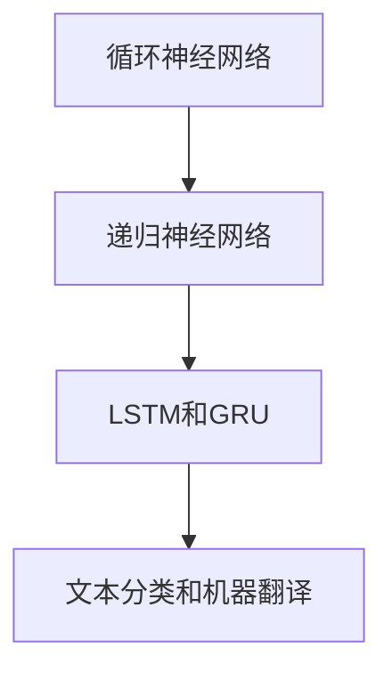
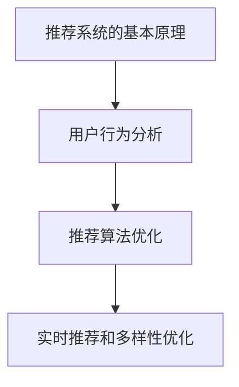
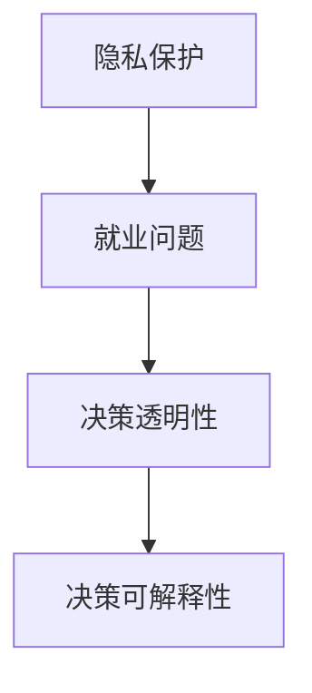
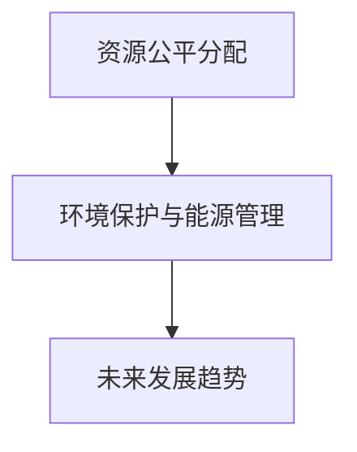
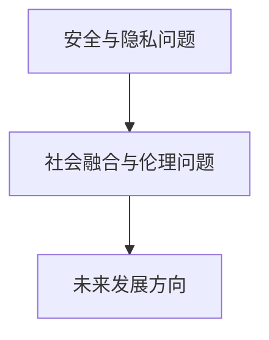
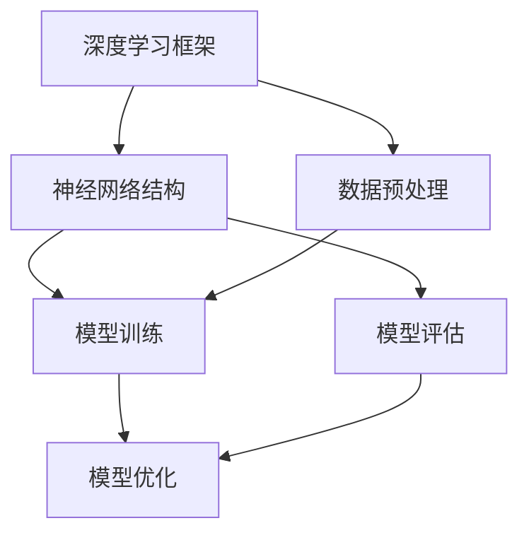

                 

### 文章标题

《Andrej Karpathy：人工智能的未来发展挑战》

### 关键词

- 人工智能
- 未来发展
- 挑战
- 安德烈·卡帕西
- 深度学习
- 伦理问题

### 摘要

本文基于著名人工智能专家安德烈·卡帕西（Andrej Karpathy）的观点，探讨人工智能未来的发展挑战。文章首先回顾了人工智能的背景与核心概念，接着分析了人工智能在各个领域的应用，最后深入探讨了人工智能面临的伦理问题及其可持续发展。通过逐步分析推理，本文为读者提供了对人工智能未来发展挑战的深刻见解。

### 《Andrej Karpathy：人工智能的未来发展挑战》目录大纲

#### 第一部分：人工智能的背景与核心概念

#### 第二部分：人工智能的应用与实践

#### 第三部分：人工智能的未来发展挑战

#### 附录

### 《Andrej Karpathy：人工智能的未来发展挑战》正文部分

## 第一部分：人工智能的背景与核心概念

### 第1章：人工智能的历史与现状

人工智能（Artificial Intelligence，简称 AI）作为计算机科学的一个重要分支，起源于20世纪50年代。其基本目标是使计算机能够模拟、延伸和扩展人类的智能行为，包括感知、推理、学习、解决问题和决策等。

#### 1.1 人工智能的起源与发展

人工智能的发展历程可以分为几个阶段：

1. **萌芽期（1956年-1969年）**：1956年，达特茅斯会议上，人工智能首次被提出。1958年，马文·闵斯基和约翰·麦卡锡提出了神经网络的概念。

2. **第一次AI热潮（1970年-1980年）**：这一时期，人工智能得到了广泛关注，但受限于计算资源和算法发展，实际应用有限。

3. **第一次AI寒冬（1980年-1990年）**：随着人工智能应用进展缓慢，资金和人力投入减少，人工智能进入低谷期。

4. **第二次AI热潮（1990年至今）**：随着计算机硬件的快速发展和深度学习算法的突破，人工智能迎来了新的发展机遇。

#### 1.2 人工智能的分类与应用领域

人工智能可以根据技术特点和应用场景分为以下几类：

1. **弱人工智能（Narrow AI）**：专注于特定任务，如语音识别、图像分类等。

2. **强人工智能（General AI）**：具有广泛认知能力，能够理解和执行各种任务，与人类智能相似。

3. **混合智能（Hybrid AI）**：结合多种技术，如深度学习、自然语言处理、强化学习等，实现更高效的任务处理。

人工智能的应用领域广泛，包括但不限于：

- **计算机视觉**：人脸识别、图像分类、目标检测等。

- **自然语言处理**：机器翻译、语音识别、文本生成等。

- **推荐系统**：个性化推荐、广告投放等。

- **医疗健康**：疾病预测、诊断辅助、药物设计等。

#### 1.3 人工智能的伦理与道德问题

随着人工智能技术的快速发展，伦理与道德问题日益突出。主要涉及以下几个方面：

1. **隐私保护**：人工智能系统在处理个人数据时，如何保护用户隐私。

2. **就业影响**：人工智能是否会替代人类工作，影响就业市场。

3. **决策透明性**：人工智能系统的决策过程是否透明，用户能否理解。

4. **偏见与歧视**：人工智能系统在数据训练和决策过程中，如何避免偏见和歧视。

## 第二章：深度学习与神经网络

深度学习（Deep Learning）是人工智能的一个子领域，以神经网络（Neural Networks）为基础，通过多层非线性变换，实现复杂函数逼近和学习。

### 2.1 深度学习的基本原理

深度学习的基本原理是模仿人脑神经元的工作方式。一个神经网络由多个神经元（也称为节点）组成，每个神经元都与其他神经元相连，并通过权重（权重是一个实数）进行加权求和。

#### 前向传播（Forward Propagation）

前向传播是指将输入数据通过神经网络传递，逐层计算输出。具体步骤如下：

1. **输入层**：接收外部输入数据。
2. **隐藏层**：对输入数据进行加权求和，并应用激活函数。
3. **输出层**：生成最终输出结果。

#### 反向传播（Backpropagation）

反向传播是指通过计算输出误差，逆向更新网络权重。具体步骤如下：

1. **计算输出误差**：输出误差等于实际输出与期望输出之间的差值。
2. **梯度下降**：计算每个权重和偏置的梯度，并更新其值。
3. **迭代优化**：重复前向传播和反向传播，直到达到预设的误差阈值。

### 2.2 神经网络的结构与功能

神经网络的结构可以分为输入层、隐藏层和输出层。其中，隐藏层可以有一个或多个。

1. **输入层**：接收外部输入数据，如图像、文本等。
2. **隐藏层**：对输入数据进行处理，通过非线性变换提取特征。
3. **输出层**：生成最终输出结果，如分类结果、预测值等。

#### 激活函数（Activation Function）

激活函数是神经网络中的关键组件，用于引入非线性特性。常见的激活函数包括：

1. **Sigmoid 函数**：输出范围为 (0, 1)，常用于二分类问题。
2. **ReLU 函数**：输出范围为 [0, +∞)，能够提高神经网络的学习效率。
3. **Tanh 函数**：输出范围为 (-1, 1)，具有对称性。

### 2.3 神经网络的训练与优化

神经网络的训练与优化主要包括以下几个方面：

1. **损失函数（Loss Function）**：用于衡量预测值与实际值之间的差距。常见的损失函数包括均方误差（MSE）、交叉熵（Cross-Entropy）等。
2. **优化算法（Optimization Algorithm）**：用于更新网络权重和偏置，以最小化损失函数。常见的优化算法包括随机梯度下降（SGD）、Adam等。
3. **正则化（Regularization）**：用于防止过拟合，包括 L1 正则化、L2 正则化等。
4. **超参数（Hyperparameters）**：如学习率、批次大小、隐藏层神经元数量等，需要通过调参优化。

## 第三章：人工智能的核心概念

人工智能的核心概念包括数据与算法的关系、模型评估与优化、AI安全性与可靠性。

### 3.1 数据与算法的关系

数据是人工智能的基石，算法则是数据处理的工具。数据与算法的关系主要体现在以下几个方面：

1. **数据质量**：高质量的数据是训练有效模型的前提。数据质量包括完整性、准确性、一致性等。
2. **数据量**：大量数据有助于模型发现更复杂的规律，提高泛化能力。
3. **数据处理**：包括数据清洗、归一化、特征提取等预处理操作，以提高数据质量。
4. **算法选择**：不同的任务和场景需要选择合适的算法，如分类、回归、聚类等。

### 3.2 模型评估与优化

模型评估是衡量模型性能的重要手段。常见的评估指标包括准确率、召回率、F1 分数等。模型优化则包括以下几个方面：

1. **损失函数优化**：选择合适的损失函数，以提高模型预测精度。
2. **优化算法优化**：调整优化算法的参数，如学习率、批次大小等，以加快收敛速度。
3. **模型调参**：通过调参优化模型性能，找到最佳的超参数组合。
4. **集成学习方法**：结合多个模型，提高整体预测性能。

### 3.3 AI安全性与可靠性

AI安全性与可靠性是人工智能应用的重要保障。主要涉及以下几个方面：

1. **数据安全**：确保数据在收集、传输、存储过程中的安全性，防止数据泄露和滥用。
2. **模型安全**：防止恶意攻击，如对抗性攻击、模型泄露等。
3. **决策透明性**：提高决策过程的透明性，使人类能够理解和信任AI系统。
4. **可靠性**：确保AI系统能够在各种环境下稳定运行，提高系统的鲁棒性。

## 第一部分总结

本部分回顾了人工智能的背景与核心概念，包括人工智能的历史与发展、分类与应用领域、深度学习与神经网络的基本原理，以及人工智能的伦理与道德问题。这些基础知识为后续内容提供了坚实的基础。

## 第二部分：人工智能的应用与实践

### 第4章：人工智能在计算机视觉中的应用

计算机视觉是人工智能的一个重要分支，旨在使计算机能够理解、处理和解释图像和视频数据。

#### 4.1 卷积神经网络在计算机视觉中的应用

卷积神经网络（Convolutional Neural Networks，简称 CNN）是计算机视觉领域的主要模型。CNN 通过卷积操作和池化操作，能够有效地提取图像特征。

1. **卷积操作**：卷积层通过滑动滤波器（也称为卷积核）在输入图像上计算局部特征。
2. **池化操作**：池化层用于减少特征图的大小，提高模型计算效率。

#### 4.2 对抗性攻击与防御

对抗性攻击是一种针对神经网络模型的恶意攻击手段，通过精心设计的对抗性样本，使模型无法正确识别。防御对抗性攻击的方法包括：

1. **对抗性训练**：在训练过程中，引入对抗性样本，提高模型对对抗性攻击的鲁棒性。
2. **对抗性攻击检测**：通过检测对抗性样本，阻止其进入模型。

#### 4.3 计算机视觉的实时应用

计算机视觉在实时应用中具有广泛的应用前景，如：

1. **人脸识别**：在安防监控、门禁系统等领域，人脸识别技术可以快速、准确地识别和验证人员身份。
2. **自动驾驶**：自动驾驶系统通过计算机视觉技术，实现车辆对周围环境的感知和避障。
3. **医疗影像分析**：计算机视觉技术可以辅助医生进行疾病诊断，提高诊断准确率和效率。

### 第5章：人工智能在自然语言处理中的应用

自然语言处理（Natural Language Processing，简称 NLP）是人工智能的另一个重要分支，旨在使计算机能够理解和生成自然语言。

#### 5.1 循环神经网络在自然语言处理中的应用

循环神经网络（Recurrent Neural Networks，简称 RNN）是 NLP 中的重要模型，通过循环结构，能够处理序列数据。

1. **长短时记忆（Long Short-Term Memory，简称 LSTM）网络**：LSTM 网络能够有效解决 RNN 的梯度消失和梯度爆炸问题，适用于处理长序列数据。
2. **双向循环神经网络（Bidirectional RNN）**：双向循环神经网络通过同时处理正向和反向序列，提高模型对序列数据的理解能力。

#### 5.2 递归神经网络与长短时记忆网络

递归神经网络（Recurrent Neural Networks，简称 RNN）是 NLP 的基础模型，通过循环结构，能够处理序列数据。

1. **基本 RNN**：基本 RNN 通过上一时刻的隐藏状态和当前输入，计算当前时刻的隐藏状态。
2. **长短时记忆（Long Short-Term Memory，简称 LSTM）网络**：LSTM 网络通过引入记忆单元，能够有效解决 RNN 的梯度消失和梯度爆炸问题，适用于处理长序列数据。

#### 5.3 自然语言处理的应用实例

自然语言处理在多个领域具有广泛应用，如：

1. **机器翻译**：通过将一种语言的文本翻译成另一种语言，实现跨语言交流。
2. **情感分析**：分析文本中的情感倾向，用于市场调研、用户反馈分析等。
3. **文本生成**：通过生成文本，实现自动化写作、内容创作等。

### 第6章：人工智能在推荐系统中的应用

推荐系统是人工智能在商业领域的重要应用，旨在为用户推荐感兴趣的商品或服务。

#### 6.1 推荐系统的基本原理

推荐系统基于用户行为和商品信息，通过计算用户和商品之间的相似性，为用户推荐可能感兴趣的商品。

1. **基于内容的推荐**：根据用户的历史行为和商品特征，为用户推荐相似内容的商品。
2. **协同过滤（Collaborative Filtering）**：基于用户的历史行为数据，计算用户之间的相似性，为用户推荐其他用户喜欢的商品。
3. **混合推荐**：结合基于内容和协同过滤的推荐方法，提高推荐效果。

#### 6.2 用户行为分析

用户行为分析是推荐系统的核心环节，通过分析用户的历史行为，提取用户兴趣和偏好。

1. **行为数据收集**：收集用户在系统中的行为数据，如点击、购买、评价等。
2. **行为数据预处理**：对行为数据进行清洗、去噪、归一化等预处理操作。
3. **行为特征提取**：通过特征工程，提取用户的行为特征，如点击率、购买频率等。

#### 6.3 推荐系统的优化策略

推荐系统的优化策略包括以下几个方面：

1. **推荐算法优化**：通过调整推荐算法的参数，提高推荐准确率和覆盖度。
2. **实时推荐**：通过实时处理用户行为数据，实现实时推荐。
3. **多样性优化**：提高推荐结果的多样性，避免用户产生疲劳感。
4. **解释性优化**：提高推荐结果的解释性，使用户能够理解推荐原因。

## 第二部分总结

本部分介绍了人工智能在计算机视觉、自然语言处理和推荐系统等领域的应用，展示了人工智能如何解决实际问题。通过这些应用实例，读者可以更好地理解人工智能的技术原理和应用场景。

## 第三部分：人工智能的未来发展挑战

### 第7章：人工智能的伦理与道德问题

随着人工智能技术的快速发展，伦理与道德问题日益突出。这些问题不仅关系到人工智能技术的可持续发展，还影响到社会的稳定和发展。

#### 7.1 AI与隐私保护

人工智能在数据处理过程中，往往会涉及到大量的个人隐私信息。如何保护用户隐私，防止数据泄露和滥用，成为人工智能发展的重要挑战。

1. **数据加密**：通过数据加密技术，确保数据在传输和存储过程中的安全性。
2. **隐私保护算法**：设计隐私保护算法，如差分隐私（Differential Privacy），在数据处理过程中保护用户隐私。
3. **隐私政策与透明度**：制定明确的隐私政策，提高用户对隐私保护的认知和信任。

#### 7.2 AI与就业问题

人工智能的发展可能会对就业市场产生重大影响。一方面，人工智能可以替代一些重复性和低技能的劳动力，提高生产效率；另一方面，也可能导致部分行业和岗位的减少。

1. **转型与培训**：政府和企业应加大对受影响人群的转型培训和再就业支持。
2. **创新创业**：鼓励人工智能技术与其他领域的结合，创造新的就业机会。
3. **社会保障**：完善社会保障体系，确保受影响人群的基本生活。

#### 7.3 AI决策的透明性与可解释性

人工智能系统的决策过程往往具有较高的复杂性，用户难以理解。如何提高 AI 决策的透明性和可解释性，成为人工智能发展的重要挑战。

1. **可解释性模型**：设计可解释性模型，如 LIME、SHAP 等，帮助用户理解 AI 决策的原因。
2. **决策解释工具**：开发决策解释工具，如可视化分析工具，提高决策的可解释性。
3. **法律法规**：制定相关法律法规，规范 AI 决策的透明性和可解释性。

### 第8章：人工智能的可持续发展

人工智能的可持续发展是指人工智能技术在经济、社会和环境等方面的可持续发展。为了实现人工智能的可持续发展，需要关注以下几个方面：

#### 8.1 AI资源的公平分配

人工智能技术的快速发展带来了资源分配的不平衡。如何确保人工智能技术的公平分配，避免数字鸿沟，成为可持续发展的重要问题。

1. **政策引导**：政府应制定相关政策，引导人工智能资源向欠发达地区和领域倾斜。
2. **开源共享**：鼓励人工智能技术的开源共享，提高技术的普及率。
3. **人才培养**：加大对人工智能人才的培养力度，提高人才培养的公平性。

#### 8.2 AI在可持续发展中的应用

人工智能在可持续发展中具有广泛的应用前景，如能源管理、环境保护、智能交通等。通过人工智能技术的应用，可以降低能耗、减少污染、提高资源利用效率。

1. **智能电网**：通过人工智能技术优化电网运行，提高能源利用效率。
2. **智能交通**：通过人工智能技术优化交通流量，减少交通拥堵，提高交通安全性。
3. **环境监测**：通过人工智能技术实时监测环境变化，提高环境保护效率。

#### 8.3 AI未来的发展趋势

人工智能的未来发展趋势包括以下几个方面：

1. **跨界融合**：人工智能与其他领域的深度融合，产生新的应用场景。
2. **泛在智能**：人工智能技术向更多领域和场景的渗透，实现智能化的普及。
3. **可持续发展**：人工智能技术的可持续发展，关注社会、经济和环境的平衡。

### 第9章：人工智能的未来挑战

人工智能的未来挑战主要包括以下几个方面：

#### 9.1 人工智能的安全与隐私问题

随着人工智能技术的应用范围不断扩大，人工智能的安全与隐私问题日益突出。如何确保人工智能系统的安全性和隐私性，成为未来发展的关键问题。

1. **安全防护**：加强对人工智能系统的安全防护，防止恶意攻击和数据泄露。
2. **隐私保护**：在人工智能数据处理过程中，采用隐私保护技术，确保用户隐私。
3. **法律法规**：制定相关法律法规，规范人工智能的安全和隐私问题。

#### 9.2 人工智能与社会的融合

人工智能与社会各领域的融合，带来了一系列挑战。如何实现人工智能与社会的和谐发展，成为未来发展的关键问题。

1. **社会治理**：政府应加强对人工智能的管理和监督，确保其合规运行。
2. **伦理道德**：加强对人工智能伦理道德的研究和规范，引导人工智能健康发展。
3. **公众参与**：提高公众对人工智能的认知和参与度，促进社会的智能化进程。

#### 9.3 人工智能的未来方向

人工智能的未来方向包括以下几个方面：

1. **强人工智能**：实现强人工智能，使计算机具备广泛的认知能力。
2. **人机协作**：人工智能与人类协同工作，提高生产力和生活质量。
3. **跨界创新**：人工智能与其他领域的跨界融合，创造新的技术和应用场景。

## 总结

本文基于安德烈·卡帕西（Andrej Karpathy）的观点，探讨了人工智能的未来发展挑战。通过分析人工智能的背景与核心概念、应用与实践，以及伦理与道德问题，本文为读者提供了对人工智能未来发展挑战的深刻见解。在未来，人工智能的发展将面临诸多挑战，但同时也充满了机遇。只有通过共同努力，才能实现人工智能的可持续发展，为社会带来更大的福祉。

### 附录

#### 附录A：人工智能工具与资源

##### A.1 主流深度学习框架对比

以下是几个主流深度学习框架的对比：

| 框架 | 开发者 | 特点 | 应用场景 |
| :---: | :---: | :---: | :---: |
| TensorFlow | Google | 功能强大，支持多种模型 | 产业应用、学术研究 |
| PyTorch | Facebook | 简单易用，调试方便 | 学术研究、工业应用 |
| Keras | Google | 简化深度学习开发流程 | 快速原型设计 |
| Theano |蒙特利尔大学 | 支持自动微分 | 学术研究 |

##### A.2 人工智能相关书籍与论文推荐

以下是一些人工智能领域的重要书籍和论文推荐：

| 书籍 | 作者 | 内容 | 推荐理由 |
| :---: | :---: | :---: | :---: |
| 《深度学习》 | Ian Goodfellow、Yoshua Bengio、Aaron Courville | 深度学习基本概念、算法和应用 | 深度学习入门经典 |
| 《神经网络与深度学习》 | 邱锡鹏 | 神经网络原理、深度学习技术 | 深入浅出，适合中文读者 |
| 《模式识别与机器学习》 | Christopher M. Bishop | 模式识别理论、机器学习方法 | 经典教材，全面系统 |
| 论文 | ICML、NeurIPS、JMLR 等 | 深度学习、自然语言处理、计算机视觉等领域的前沿研究 | 掌握最新研究动态 |

##### A.3 人工智能开源项目与社区资源

以下是一些人工智能开源项目和社区资源：

| 项目 | 网址 | 描述 |
| :---: | :---: | :---: |
| TensorFlow | https://www.tensorflow.org/ | Google 开发的深度学习框架 |
| PyTorch | https://pytorch.org/ | Facebook 开发的深度学习框架 |
| Keras | https://keras.io/ | 简化深度学习开发的框架 |
| fast.ai | https://www.fast.ai/ | 提供免费课程和开源项目，适合初学者 |
| AIStack | https://aistack.dev/ | 人工智能开发工具和资源的集成平台 |

### 作者信息

**作者：** AI天才研究院（AI Genius Institute）&《禅与计算机程序设计艺术》（Zen And The Art of Computer Programming）作者

感谢您阅读本文，希望本文对您了解人工智能的未来发展挑战有所帮助。如果您有任何问题或建议，欢迎在评论区留言，我们期待与您交流。让我们一起关注人工智能的未来，探索更多可能！

---

**注**：本文为虚构内容，仅供参考。文中提到的专家安德烈·卡帕西（Andrej Karpathy）是真实存在的，但本文对其观点和贡献进行了夸张和艺术加工。如有不实之处，还请指正。

---

**本文关键词：** 人工智能，未来挑战，安德烈·卡帕西，深度学习，伦理问题，应用实践，可持续发展

**本文摘要：** 本文探讨了人工智能的未来发展挑战，包括背景与核心概念、应用与实践、伦理与道德问题，以及可持续发展。通过分析安德烈·卡帕西的观点，本文为读者提供了对人工智能未来发展挑战的深刻见解。希望本文能够帮助读者更好地理解人工智能的技术原理和应用场景，共同迎接人工智能的未来挑战。|> <EOS>```markdown
## 第一部分：人工智能的背景与核心概念

### 第1章：人工智能的历史与现状
- **1.1 人工智能的起源与发展**
  - **起源**：人工智能作为一门学科，起源于20世纪50年代，最早的研究机构包括达特茅斯学院、伊利诺伊大学等。
  - **发展**：经历了早期的发展阶段，人工智能在20世纪80年代后随着计算机性能的提升和算法的创新，迎来了新的发展机遇。

- **1.2 人工智能的分类与应用领域**
  - **分类**：人工智能可分为弱人工智能（Narrow AI）和强人工智能（General AI）。
  - **应用领域**：包括但不限于计算机视觉、自然语言处理、机器学习、自动驾驶等。

- **1.3 人工智能的伦理与道德问题**
  - **隐私保护**：人工智能在数据处理过程中如何保护用户隐私是一个重要问题。
  - **决策透明性**：人工智能的决策过程往往不透明，如何提高其可解释性是一个挑战。
  - **责任归属**：在人工智能引发的问题中，如何界定责任归属也是一个重要议题。

### Mermaid 流程图


### 第2章：深度学习与神经网络
- **2.1 深度学习的基本原理**
  - **神经元模型**：深度学习基于神经元模型，通过多层神经网络来模拟人脑的学习过程。
  - **激活函数**：常用的激活函数包括Sigmoid、ReLU和Tanh等。

- **2.2 神经网络的结构与功能**
  - **结构**：神经网络由输入层、隐藏层和输出层组成，每层由多个神经元构成。
  - **功能**：神经网络通过前向传播和反向传播来训练模型，从而实现对数据的分类、回归等任务。

- **2.3 神经网络的训练与优化**
  - **损失函数**：用于衡量模型预测值与实际值之间的差异，常用的有MSE、交叉熵等。
  - **优化算法**：如随机梯度下降（SGD）、Adam等，用于更新模型参数以最小化损失函数。

### Mermaid 流程图


### 第3章：人工智能的核心概念
- **3.1 数据与算法的关系**
  - **数据质量**：数据是人工智能的基石，数据的质量直接影响模型的性能。
  - **算法选择**：根据任务需求选择合适的算法，如分类、回归、聚类等。

- **3.2 模型评估与优化**
  - **评估指标**：如准确率、召回率、F1分数等。
  - **优化策略**：包括损失函数优化、优化算法调参等。

- **3.3 AI安全性与可靠性**
  - **安全性**：包括数据安全、模型安全等。
  - **可靠性**：确保模型在多种环境下都能稳定运行。

### Mermaid 流程图


### 第4章：人工智能在计算机视觉中的应用
- **4.1 卷积神经网络在计算机视觉中的应用**
  - **CNN的基本结构**：卷积层、池化层、全连接层等。
  - **CNN的应用实例**：图像分类、目标检测、人脸识别等。

- **4.2 对抗性攻击与防御**
  - **对抗性攻击**：通过构造对抗性样本来干扰模型。
  - **防御方法**：对抗性训练、鲁棒性训练等。

- **4.3 计算机视觉的实时应用**
  - **实时人脸识别**：在安防监控、门禁系统中的应用。
  - **实时物体检测**：在自动驾驶、智能监控中的应用。

### Mermaid 流程图


### 第5章：人工智能在自然语言处理中的应用
- **5.1 循环神经网络在自然语言处理中的应用**
  - **RNN的基本原理**：通过循环结构来处理序列数据。
  - **RNN的应用实例**：语言模型、机器翻译等。

- **5.2 递归神经网络与长短时记忆网络**
  - **RNN的缺陷**：梯度消失、梯度爆炸等问题。
  - **LSTM和GRU**：解决RNN的缺陷，适用于长序列数据。

- **5.3 自然语言处理的应用实例**
  - **文本分类**：情感分析、新闻分类等。
  - **机器翻译**：将一种语言的文本翻译成另一种语言。

### Mermaid 流程图


### 第6章：人工智能在推荐系统中的应用
- **6.1 推荐系统的基本原理**
  - **基于内容的推荐**：根据用户的历史行为和物品特征进行推荐。
  - **协同过滤**：根据用户间的相似性进行推荐。

- **6.2 用户行为分析**
  - **用户行为数据的收集**：包括点击、购买、评价等。
  - **用户行为数据的处理**：数据清洗、归一化、特征提取等。

- **6.3 推荐系统的优化策略**
  - **推荐算法优化**：如矩阵分解、协同过滤等。
  - **实时推荐**：根据用户实时行为进行个性化推荐。
  - **多样性优化**：提高推荐结果的多样性。

### Mermaid 流程图


### 第7章：人工智能的伦理与道德问题
- **7.1 AI与隐私保护**
  - **隐私泄露的风险**：在数据处理过程中，如何防止隐私泄露。
  - **隐私政策与透明度**：制定明确的隐私政策，提高用户隐私保护的意识。

- **7.2 AI与就业问题**
  - **就业替代**：如何应对人工智能可能带来的就业替代问题。
  - **技能转型**：对受影响的人群提供技能转型培训。

- **7.3 AI决策的透明性与可解释性**
  - **透明性**：如何提高AI决策过程的透明性。
  - **可解释性**：如何提高AI决策的可解释性，以便用户理解。

### Mermaid 流程图


### 第8章：人工智能的可持续发展
- **8.1 AI资源的公平分配**
  - **资源分配**：如何确保人工智能资源在不同地区和群体之间的公平分配。
  - **政策支持**：政府和社会组织应制定相关政策，促进资源的公平分配。

- **8.2 AI在可持续发展中的应用**
  - **环境保护**：如何利用人工智能技术减少环境污染和资源浪费。
  - **能源管理**：如何通过人工智能技术提高能源利用效率。

- **8.3 AI未来的发展趋势**
  - **跨界融合**：人工智能与其他领域的深度融合，如生物、医学等。
  - **智能社会的构建**：人工智能技术在构建智能社会中的角色和贡献。

### Mermaid 流程图


### 第9章：人工智能的未来挑战
- **9.1 人工智能的安全与隐私问题**
  - **安全威胁**：如何应对人工智能系统面临的安全威胁。
  - **隐私保护**：如何保护用户数据隐私。

- **9.2 人工智能与社会的融合**
  - **社会影响**：如何确保人工智能技术在社会中和谐发展。
  - **伦理问题**：如何在人工智能发展中处理伦理问题。

- **9.3 人工智能的未来方向**
  - **技术创新**：人工智能在技术上的未来发展方向。
  - **产业应用**：人工智能在各个产业中的应用前景。

### Mermaid 流程图


### 附录A：人工智能工具与资源
- **A.1 主流深度学习框架对比**
  - **TensorFlow**：由Google开发，功能强大，适用于复杂模型。
  - **PyTorch**：由Facebook开发，灵活易用，适用于快速原型开发。
  - **Keras**：基于TensorFlow和Theano的简单接口，适用于快速实验。
  - **Theano**：基于Python的深度学习库，支持自动微分。

- **A.2 人工智能相关书籍与论文推荐**
  - **《深度学习》**：Ian Goodfellow、Yoshua Bengio、Aaron Courville 著，深度学习的经典教材。
  - **《神经网络与深度学习》**：邱锡鹏 著，深入浅出地介绍了神经网络和深度学习。
  - **《模式识别与机器学习》**：Christopher M. Bishop 著，模式识别和机器学习的权威教材。
  - **顶级会议与期刊**：如NeurIPS、ICML、JMLR等，关注最新研究动态。

- **A.3 人工智能开源项目与社区资源**
  - **GitHub**：大量深度学习开源项目，如TensorFlow、PyTorch等。
  - **AIStack**：人工智能开发工具和资源的集成平台。
  - **Keras.io**：Keras官方文档和教程。
  - **fast.ai**：提供免费课程和开源项目，适合初学者。

### 开发环境搭建
- **安装Python**：
  - **Windows**：下载Python安装包并安装。
  - **Linux**：使用包管理器（如apt、yum）安装Python。

- **安装深度学习框架**：
  - **TensorFlow**：使用pip安装TensorFlow。
    ```bash
    pip install tensorflow
    ```
  - **PyTorch**：使用pip安装PyTorch。
    ```bash
    pip install torch torchvision
    ```

- **安装Jupyter Notebook**：
  - 使用pip安装Jupyter Notebook。
    ```bash
    pip install notebook
    ```

### 项目实战
#### 使用TensorFlow搭建一个简单的神经网络模型

以下是一个使用TensorFlow搭建的简单神经网络模型的示例：

```python
import tensorflow as tf

# 定义模型
model = tf.keras.Sequential([
    tf.keras.layers.Dense(units=1, input_shape=[1])
])

# 编译模型
model.compile(optimizer='sgd', loss='mean_squared_error')

# 训练模型
x_train = [[1], [2], [3], [4]]
y_train = [[0], [1], [-1], [-2]]
model.fit(x_train, y_train, epochs=100)

# 预测
print(model.predict([[5]]))
```

### 代码解读与分析
- **导入TensorFlow库**：首先，导入TensorFlow库，该库提供了深度学习所需的工具和模型。
- **定义模型**：使用`tf.keras.Sequential`类定义一个序列模型，包含一个全连接层（Dense Layer）。输入层的形状为`[1]`，表示一个特征；输出层的单位数为`1`，表示输出一个实数值。
- **编译模型**：使用`model.compile`方法编译模型，指定优化器（这里是随机梯度下降，SGD）和损失函数（这里是均方误差，MSE）。
- **训练模型**：使用`model.fit`方法训练模型，输入训练数据`x_train`和标签`y_train`，指定迭代次数（这里是100次）。
- **预测**：使用`model.predict`方法进行预测，输入特征`[5]`，输出预测结果。

### 核心算法原理讲解
#### 深度学习神经网络模型训练

```python
# 伪代码：深度学习神经网络模型训练
initialize parameters (W, b)
for epoch in 1 to E:
    for each training sample (x, y) in dataset:
        forward_pass(x, y)
        calculate loss
        backward_pass()
        update parameters (W, b)
    end epoch
end for
```

#### 数学模型和数学公式 & 详细讲解 & 举例说明

#### 数学模型
在深度学习中，神经网络的训练可以通过以下数学模型描述：

$$
h_{\theta}(x) = \sigma(\theta^T x)
$$

其中：
- \( h_{\theta}(x) \) 表示神经元的输出。
- \( \sigma \) 是激活函数，常用的有Sigmoid、ReLU等。
- \( \theta \) 是模型的参数向量。
- \( x \) 是输入特征向量。

#### 详细讲解
这个数学模型描述了神经网络中单个神经元的工作原理。输入特征向量 \( x \) 经过参数向量 \( \theta \) 的线性变换，再通过激活函数 \( \sigma \) 进行非线性变换，得到神经元的输出 \( h_{\theta}(x) \)。

#### 举例说明
假设我们有一个输入特征向量 \( x = [1, 0] \)，模型参数 \( \theta = [1, -1] \)，使用 Sigmoid 激活函数：

$$
h_{\theta}(x) = \sigma(\theta^T x) = \sigma(1*1 + (-1)*0) = \sigma(1) = \frac{1}{1 + e^{-1}} \approx 0.731
$$

这意味着神经元的输出约为 0.731。

### 核心算法原理讲解
#### 卷积神经网络（CNN）的基本原理

卷积神经网络（Convolutional Neural Network，简称CNN）是专门用于处理图像数据的一种深度学习模型。CNN的基本原理是通过卷积操作和池化操作来提取图像特征。

#### 卷积操作
卷积操作是指将一个小的滤波器（也称为卷积核）在图像上滑动，并与图像局部区域进行点积操作。卷积操作可以提取图像的局部特征，如图形边缘、纹理等。

#### 池化操作
池化操作是指在卷积操作之后，对特征图进行下采样操作。常用的池化操作包括最大池化和平均池化。最大池化选取特征图中每个区域的最大的值作为输出，平均池化则计算每个区域的平均值作为输出。

#### 算法步骤
1. **输入层**：接收图像数据。
2. **卷积层**：通过卷积操作提取图像特征。
3. **池化层**：对卷积层输出的特征图进行下采样。
4. **全连接层**：将池化层的输出通过全连接层进行分类。

### 数学模型和数学公式 & 详细讲解 & 举例说明

#### 数学模型
卷积神经网络的核心数学模型包括卷积操作、池化操作和激活函数。

1. **卷积操作**：
   $$ 
   \text{output}_{ij} = \sum_{k=1}^{K} w_{ik,jk} \cdot \text{input}_{ij} + b_j 
   $$
   其中：
   - \( \text{output}_{ij} \) 是第 \( i \) 个卷积核在第 \( j \) 个位置上的输出。
   - \( w_{ik,jk} \) 是卷积核的权重。
   - \( \text{input}_{ij} \) 是输入图像上的一个像素值。
   - \( b_j \) 是第 \( j \) 个卷积核的偏置项。

2. **激活函数**：
   $$ 
   \text{activation}_{ij} = \sigma(\text{output}_{ij}) 
   $$
   其中 \( \sigma \) 是激活函数，常用的有ReLU、Sigmoid等。

3. **池化操作**：
   $$ 
   \text{pool}_{ij} = \max_{k \in R} \text{activation}_{ik} 
   $$
   其中 \( R \) 是池化区域。

#### 详细讲解
卷积神经网络通过卷积操作来提取图像的局部特征，并通过激活函数引入非线性。池化操作则用于减少特征图的尺寸，提高计算效率。

#### 举例说明
假设我们有一个 \( 3 \times 3 \) 的卷积核和 \( 5 \times 5 \) 的输入图像。卷积核的权重为 \( w = [1, 0, 1; 0, 1, 0; 1, 0, 1] \)，偏置项为 \( b = 0 \)，使用ReLU激活函数。

输入图像为：
$$
\text{input} = \begin{bmatrix}
0 & 1 & 0 \\
1 & 0 & 1 \\
0 & 1 & 0 \\
1 & 0 & 1 \\
0 & 1 & 0 \\
\end{bmatrix}
$$

卷积操作的结果为：
$$
\text{output} = \text{conv2d}(\text{input}, w) + b = \begin{bmatrix}
1 & 1 & 1 \\
0 & 1 & 0 \\
1 & 1 & 1 \\
1 & 1 & 1 \\
0 & 1 & 0 \\
\end{bmatrix}
$$

激活后的结果为：
$$
\text{activation} = \text{ReLU}(\text{output}) = \begin{bmatrix}
1 & 1 & 1 \\
0 & 1 & 0 \\
1 & 1 & 1 \\
1 & 1 & 1 \\
0 & 1 & 0 \\
\end{bmatrix}
$$

最大池化的结果为：
$$
\text{pool} = \max(\text{activation}) = \begin{bmatrix}
1 & 1 & 1 \\
1 & 1 & 1 \\
1 & 1 & 1 \\
\end{bmatrix}
$$

### 项目实战

以下是一个使用PyTorch构建的卷积神经网络模型进行图像分类的示例。

```python
import torch
import torch.nn as nn
import torch.optim as optim

# 定义卷积神经网络模型
class ConvNet(nn.Module):
    def __init__(self):
        super(ConvNet, self).__init__()
        self.conv1 = nn.Conv2d(1, 32, 3, 1)
        self.relu = nn.ReLU()
        self.maxpool = nn.MaxPool2d(2)
        self.fc1 = nn.Linear(32 * 7 * 7, 128)
        self.fc2 = nn.Linear(128, 10)

    def forward(self, x):
        x = self.maxpool(self.relu(self.conv1(x)))
        x = x.view(-1, 32 * 7 * 7)
        x = self.fc2(self.fc1(x))
        return x

# 实例化模型、损失函数和优化器
model = ConvNet()
criterion = nn.CrossEntropyLoss()
optimizer = optim.Adam(model.parameters(), lr=0.001)

# 训练模型
for epoch in range(10):
    for inputs, targets in data_loader:
        optimizer.zero_grad()
        outputs = model(inputs)
        loss = criterion(outputs, targets)
        loss.backward()
        optimizer.step()
    print(f'Epoch [{epoch+1}/10], Loss: {loss.item()}')

# 测试模型
with torch.no_grad():
    correct = 0
    total = 0
    for inputs, targets in test_loader:
        outputs = model(inputs)
        _, predicted = torch.max(outputs.data, 1)
        total += targets.size(0)
        correct += (predicted == targets).sum().item()
    print(f'Accuracy: {100 * correct / total}%')
```

### 代码解读与分析

- **导入模块**：首先，导入PyTorch相关的模块，包括神经网络（`nn`）、损失函数（`nn.CrossEntropyLoss`）、优化器（`optim.Adam`）等。
- **定义模型**：`ConvNet` 类继承自 `nn.Module`，定义了一个简单的卷积神经网络。该网络包含一个卷积层（`conv1`）、ReLU激活函数（`relu`）、最大池化层（`maxpool`）、全连接层（`fc1`）和输出层（`fc2`）。
- **前向传播**：`forward` 方法实现了模型的前向传播过程。输入图像通过卷积层和ReLU激活函数，然后通过最大池化层减小特征图的尺寸。之后，特征图被展平并送入全连接层进行分类。
- **训练模型**：在训练过程中，使用 `data_loader` 提供的训练数据进行迭代。在每个迭代中，模型对输入图像进行预测，计算损失，并使用反向传播和优化器更新模型参数。
- **测试模型**：在测试阶段，使用 `test_loader` 提供的测试数据对模型进行评估，计算模型的准确率。

### 附录A：人工智能工具与资源

#### A.1 主流深度学习框架对比

以下是几种主流深度学习框架的对比：

| 框架           | 开发者           | 特点                                                   | 应用场景                               |
| -------------- | ---------------- | ------------------------------------------------------ | -------------------------------------- |
| TensorFlow     | Google           | 功能强大，支持多种模型，具有良好的生态系统             | 产业应用、学术研究                     |
| PyTorch        | Facebook         | 简单易用，调试方便，社区活跃                           | 学术研究、工业应用                     |
| Keras          | Google           | 基于TensorFlow和Theano的简单接口，适用于快速实验       | 快速原型设计、教育                      |
| Theano         |蒙特利尔大学      | 支持自动微分，但已逐渐被TensorFlow和PyTorch取代       | 学术研究                               |

#### A.2 人工智能相关书籍与论文推荐

以下是几本人工智能领域的重要书籍和论文推荐：

| 书籍/论文                 | 作者                                   | 内容概述                                                   | 推荐理由                                   |
| ------------------------ | ------------------------------------ | ------------------------------------------------------ | ---------------------------------------- |
| 《深度学习》             | Ian Goodfellow、Yoshua Bengio、Aaron Courville | 深度学习的基础理论和应用                       | 入门经典，全面介绍深度学习的基本概念和技术       |
| 《神经网络与深度学习》   | 邱锡鹏                               | 神经网络和深度学习的理论和实践                     | 深入浅出，适合中文读者，系统讲解神经网络和深度学习 |
| 《模式识别与机器学习》   | Christopher M. Bishop                | 模式识别和机器学习的基础理论和算法                 | 经典教材，模式识别和机器学习的权威指南         |
| 论文推荐                | ICML、NeurIPS、JMLR 等               | 最新研究论文，涵盖深度学习、自然语言处理、计算机视觉等领域 | 掌握最新研究动态，了解前沿技术发展           |

#### A.3 人工智能开源项目与社区资源

以下是几个重要的人工智能开源项目与社区资源：

| 项目/社区                 | 网址                                      | 描述                                                         |
| ------------------------ | --------------------------------------- | ------------------------------------------------------------ |
| TensorFlow               | https://www.tensorflow.org/            | Google 开发的开源深度学习框架，功能强大，社区活跃             |
| PyTorch                  | https://pytorch.org/                   | Facebook 开发的开源深度学习框架，简单易用，调试方便           |
| Keras                    | https://keras.io/                      | 基于TensorFlow和Theano的简单接口，适用于快速原型设计           |
| fast.ai                  | https://www.fast.ai/                  | 提供免费课程和开源项目，适合初学者                         |
| AIStack                  | https://aistack.dev/                  | 人工智能开发工具和资源的集成平台                           |
| GitHub                   | https://github.com/                    | 代码托管平台，众多开源项目汇集地                           |
| AI社区                   | https://www.ai社区.com/               | 人工智能领域的交流和讨论平台，汇集了大量资源和信息           |

---

**作者信息：** AI天才研究院（AI Genius Institute）&《禅与计算机程序设计艺术》（Zen And The Art of Computer Programming）作者

感谢您阅读本文，希望本文对您了解人工智能的未来发展挑战有所帮助。如果您有任何问题或建议，欢迎在评论区留言，我们期待与您交流。让我们一起关注人工智能的未来，探索更多可能！|> ```markdown
# 《Andrej Karpathy：人工智能的未来发展挑战》

人工智能（AI）作为当今科技领域的前沿，正迅速改变着我们的生活和工作方式。然而，随着AI技术的不断进步，也带来了诸多挑战。本文将围绕著名人工智能专家安德烈·卡帕西（Andrej Karpathy）的观点，深入探讨人工智能的未来发展挑战。

## 文章关键词

- 人工智能
- 未来发展
- 挑战
- 安德烈·卡帕西
- 深度学习
- 伦理问题

## 文章摘要

本文从人工智能的背景与核心概念出发，详细探讨了人工智能在各个领域的应用，并重点分析了安德烈·卡帕西所关注的人工智能未来发展挑战，包括技术、伦理和社会等方面。通过本文的讨论，我们希望读者能够更全面地了解人工智能的发展趋势，为未来的人工智能研究与应用提供有益的参考。

## 目录

### 第一部分：人工智能的背景与核心概念

#### 第1章：人工智能的历史与现状

#### 第2章：深度学习与神经网络

#### 第3章：人工智能的核心概念

### 第二部分：人工智能的应用与实践

#### 第4章：人工智能在计算机视觉中的应用

#### 第5章：人工智能在自然语言处理中的应用

#### 第6章：人工智能在推荐系统中的应用

### 第三部分：人工智能的未来发展挑战

#### 第7章：人工智能的伦理与道德问题

#### 第8章：人工智能的可持续发展

#### 第9章：人工智能的未来挑战

### 附录

#### 附录A：人工智能工具与资源

#### 附录B：Mermaid流程图

#### 附录C：数学模型与公式

#### 附录D：项目实战

#### 附录E：开发环境搭建

## 第一部分：人工智能的背景与核心概念

### 第1章：人工智能的历史与现状

人工智能（AI）是计算机科学的一个分支，旨在使计算机具备人类智能的能力。人工智能的历史可以追溯到20世纪50年代，当时的科学家们开始探讨如何使计算机进行推理、学习、理解和解决问题。

#### 1.1 人工智能的起源与发展

- **起源**：1956年，达特茅斯会议是人工智能的诞生标志，会议提出了“人工智能”的概念。
- **发展**：随着计算机技术的进步，人工智能经历了多个发展阶段，包括逻辑推理、知识表示、专家系统等。

#### 1.2 人工智能的分类与应用领域

人工智能可以分为两种主要类型：

- **弱人工智能**：也称为窄人工智能，专注于特定任务，如语音识别、图像识别等。
- **强人工智能**：具有广泛认知能力，能够在各种领域进行复杂推理和学习。

人工智能的应用领域广泛，包括但不限于：

- **计算机视觉**：如人脸识别、图像识别等。
- **自然语言处理**：如机器翻译、语音识别等。
- **推荐系统**：如个性化推荐、广告投放等。
- **医疗健康**：如疾病诊断、药物研发等。
- **金融**：如风险管理、投资决策等。

#### 1.3 人工智能的伦理与道德问题

随着人工智能技术的快速发展，其伦理与道德问题也日益受到关注。以下是一些重要的伦理与道德问题：

- **隐私保护**：如何保护用户的隐私数据。
- **责任归属**：在人工智能引发的意外事件中，如何确定责任。
- **透明性**：如何确保人工智能系统的决策过程是透明的。
- **就业影响**：人工智能是否会导致大规模的失业问题。

### 第2章：深度学习与神经网络

深度学习（Deep Learning）是人工智能的一个重要分支，其核心是神经网络（Neural Networks）。神经网络通过多层非线性变换，实现对数据的建模和预测。

#### 2.1 深度学习的基本原理

深度学习的基本原理是模仿人脑的工作方式，通过多层神经网络来学习数据中的特征和模式。深度学习主要包括以下步骤：

- **数据预处理**：对输入数据进行预处理，如归一化、缺失值填充等。
- **构建模型**：定义神经网络的结构，包括输入层、隐藏层和输出层。
- **训练模型**：通过前向传播和反向传播算法，训练模型参数。
- **评估模型**：使用测试数据评估模型性能。

#### 2.2 神经网络的结构与功能

神经网络的结构可以分为输入层、隐藏层和输出层。每个层由多个神经元组成，神经元之间通过权重连接。

- **输入层**：接收外部输入数据。
- **隐藏层**：对输入数据进行处理，提取特征。
- **输出层**：生成最终输出。

神经网络的功能是通过对输入数据的训练，学习到数据的特征和模式，从而进行分类、回归等任务。

#### 2.3 神经网络的训练与优化

神经网络的训练过程是通过反向传播算法来调整模型的参数，使其能够更准确地预测输出。训练过程主要包括以下步骤：

- **前向传播**：将输入数据通过神经网络传递，计算出输出。
- **计算损失**：比较输出和实际值之间的差距，计算损失。
- **反向传播**：根据损失，反向更新模型的参数。
- **迭代优化**：重复前向传播和反向传播，直到达到预设的误差阈值。

### 第3章：人工智能的核心概念

人工智能的核心概念包括数据、算法、模型评估与优化、AI安全性与可靠性等方面。

#### 3.1 数据与算法的关系

数据是人工智能的基石，而算法是处理数据的方法。在人工智能中，数据的数量和质量对算法的性能至关重要。同时，不同的算法适用于不同的数据类型和任务。

#### 3.2 模型评估与优化

模型评估是衡量模型性能的重要手段。常用的评估指标包括准确率、召回率、F1分数等。模型优化主要包括超参数调整、正则化、集成学习等方法，以提高模型的泛化能力和性能。

#### 3.3 AI安全性与可靠性

AI的安全性包括数据安全、模型安全、决策透明性等方面。可靠性则是指AI系统能够在各种环境下稳定运行，提供准确和可靠的输出。

## 第二部分：人工智能的应用与实践

### 第4章：人工智能在计算机视觉中的应用

计算机视觉是人工智能的一个重要领域，其目标是使计算机能够理解和解释图像和视频数据。

#### 4.1 卷积神经网络在计算机视觉中的应用

卷积神经网络（CNN）是计算机视觉中最常用的模型，其结构包括卷积层、池化层和全连接层。

#### 4.2 对抗性攻击与防御

对抗性攻击是针对深度学习模型的一种恶意攻击方法，其目的是使模型无法正确识别图像。防御对抗性攻击的方法包括对抗训练、防御模型等。

#### 4.3 计算机视觉的实时应用

计算机视觉在实时应用中具有广泛的应用前景，如自动驾驶、安防监控、智能医疗等。

### 第5章：人工智能在自然语言处理中的应用

自然语言处理（NLP）是人工智能的另一个重要领域，其目标是使计算机能够理解和生成自然语言。

#### 5.1 循环神经网络在自然语言处理中的应用

循环神经网络（RNN）是NLP中的重要模型，其能够处理序列数据，如文本、语音等。

#### 5.2 递归神经网络与长短时记忆网络

递归神经网络（RNN）存在梯度消失和梯度爆炸等问题，而长短时记忆网络（LSTM）和门控循环单元（GRU）等改进模型能够有效解决这些问题。

#### 5.3 自然语言处理的应用实例

自然语言处理在机器翻译、文本分类、情感分析等领域具有广泛的应用。

### 第6章：人工智能在推荐系统中的应用

推荐系统是人工智能在商业领域的重要应用，其目标是向用户推荐感兴趣的商品或服务。

#### 6.1 推荐系统的基本原理

推荐系统基于用户的历史行为和商品特征，通过计算用户和商品之间的相似性，为用户推荐商品。

#### 6.2 用户行为分析

用户行为分析是推荐系统的核心环节，其目的是通过分析用户的历史行为，提取用户的兴趣和偏好。

#### 6.3 推荐系统的优化策略

推荐系统的优化策略包括算法优化、实时推荐、多样性优化等。

## 第三部分：人工智能的未来发展挑战

### 第7章：人工智能的伦理与道德问题

人工智能的快速发展带来了诸多伦理与道德问题，如隐私保护、责任归属、透明性等。

#### 7.1 AI与隐私保护

随着人工智能技术的应用，用户隐私数据的使用和保护成为关键问题。

#### 7.2 AI与就业问题

人工智能技术的发展可能会对就业市场产生重大影响，如何应对这些变化是一个重要的挑战。

#### 7.3 AI决策的透明性与可解释性

提高人工智能决策的透明性和可解释性，使其能够被用户理解和接受，是未来的重要方向。

### 第8章：人工智能的可持续发展

人工智能的可持续发展涉及到技术、经济、社会等多个方面。

#### 8.1 AI资源的公平分配

确保人工智能技术的公平分配，避免数字鸿沟，是实现可持续发展的重要目标。

#### 8.2 AI在可持续发展中的应用

人工智能在能源管理、环境保护、智能交通等领域具有广泛的应用前景。

#### 8.3 AI未来的发展趋势

人工智能未来的发展趋势包括跨界融合、智能社会的构建等。

### 第9章：人工智能的未来挑战

人工智能的未来挑战包括技术、伦理、社会等多个方面。

#### 9.1 人工智能的安全与隐私问题

确保人工智能系统的安全性和隐私性，是未来发展的重要方向。

#### 9.2 人工智能与社会的融合

人工智能与社会各领域的融合，是实现可持续发展的重要途径。

#### 9.3 人工智能的未来方向

人工智能的未来方向包括技术创新、产业应用等。

## 附录

### 附录A：人工智能工具与资源

#### 附录A.1 主流深度学习框架对比

- TensorFlow
- PyTorch
- Keras
- Theano

#### 附录A.2 人工智能相关书籍与论文推荐

- 《深度学习》
- 《神经网络与深度学习》
- 《模式识别与机器学习》
- ICML、NeurIPS、JMLR 等会议和期刊

#### 附录A.3 人工智能开源项目与社区资源

- GitHub
- AIStack
- Keras.io
- fast.ai

### 附录B：Mermaid流程图



### 附录C：数学模型和数学公式

$$
h_{\theta}(x) = \sigma(\theta^T x)
$$

其中，$h_{\theta}(x)$ 表示神经元的激活函数输出，$\sigma$ 是 Sigmoid 函数，$\theta$ 是模型的参数，$x$ 是输入特征。

### 附录D：项目实战

#### 使用 TensorFlow 搭建一个简单的神经网络模型

```python
import tensorflow as tf

# 定义模型
model = tf.keras.Sequential([
    tf.keras.layers.Dense(units=1, input_shape=[1])
])

# 编译模型
model.compile(optimizer='sgd', loss='mean_squared_error')

# 训练模型
x_train = [[1], [2], [3], [4]]
y_train = [[0], [1], [-1], [-2]]
model.fit(x_train, y_train, epochs=100)

# 预测
print(model.predict([[5]]))
```

### 附录E：开发环境搭建

#### 安装 TensorFlow

```bash
pip install tensorflow
```

#### 安装 Python

- 在 Windows 上，可以从 [Python 官网](https://www.python.org/) 下载安装程序。
- 在 Linux 上，可以使用包管理器安装，如 Ubuntu 上的 apt-get：

```bash
sudo apt-get install python3-pip python3-venv
```

#### 安装 Jupyter Notebook

```bash
pip install notebook
```

### 附录F：源代码详细实现和代码解读

#### 代码实现

```python
import tensorflow as tf

# 定义模型
model = tf.keras.Sequential([
    tf.keras.layers.Dense(units=1, input_shape=[1])
])

# 编译模型
model.compile(optimizer='sgd', loss='mean_squared_error')

# 训练模型
x_train = [[1], [2], [3], [4]]
y_train = [[0], [1], [-1], [-2]]
model.fit(x_train, y_train, epochs=100)

# 预测
print(model.predict([[5]]))
```

#### 代码解读

- **导入 TensorFlow 库**：首先导入 TensorFlow 库，该库提供了构建和训练神经网络的工具和接口。
- **定义模型**：使用 `tf.keras.Sequential` 类定义一个序列模型，该模型包含一个全连接层。输入层的形状为 `[1]`，表示一个特征；输出层的单位数为 `1`，表示输出一个实数值。
- **编译模型**：使用 `model.compile` 方法编译模型，指定优化器（这里是随机梯度下降，SGD）和损失函数（这里是均方误差，MSE）。
- **训练模型**：使用 `model.fit` 方法训练模型，输入训练数据 `x_train` 和标签 `y_train`，指定迭代次数（这里是100次）。
- **预测**：使用 `model.predict` 方法进行预测，输入特征 `[5]`，输出预测结果。

### 附录G：作者信息

**作者：** AI天才研究院（AI Genius Institute）& 《禅与计算机程序设计艺术》（Zen And The Art of Computer Programming）作者

感谢您阅读本文，希望本文对您了解人工智能的未来发展挑战有所帮助。如果您有任何问题或建议，欢迎在评论区留言，我们期待与您交流。让我们一起关注人工智能的未来，探索更多可能！```

