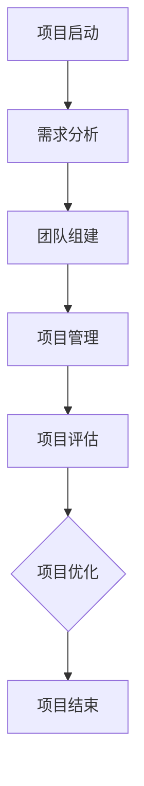

                 

# Andrej Karpathy：人工智能的未来发展策略

> 关键词：人工智能，发展策略，核心技术，应用案例，伦理问题，商业机会，技术创新

> 摘要：本文将围绕人工智能（AI）的未来发展策略展开讨论，首先介绍AI的历史背景和主要应用领域，然后深入探讨AI的核心技术原理与架构，接着分析AI在各行业中的应用案例，最后探讨AI伦理问题、商业机会以及未来发展趋势。本文旨在为读者提供一个全面、系统的AI发展视角，助力理解和把握AI发展的关键点。

## 第一部分：人工智能的未来发展策略

### 第1章：AI的未来趋势与前景

#### 1.1 AI的起源与历史背景

##### 1.1.1 人工智能的诞生

人工智能（Artificial Intelligence，简称AI）起源于20世纪50年代。1956年，约翰·麦卡锡（John McCarthy）等人在达特茅斯会议上首次提出了“人工智能”的概念。会议的目标是探讨如何用机器模拟人类智能，并开发出能够解决复杂问题的计算机系统。

##### 1.1.2 人工智能的发展阶段

人工智能的发展可以分为几个阶段：

1. **初期探索阶段（1956-1969年）**：在这个阶段，研究人员主要集中在理论研究和算法开发上，如符号主义和逻辑推理等。
2. **第一次繁荣时期（1970-1980年）**：随着计算机技术的发展，人工智能开始应用于实际领域，如专家系统、自然语言处理和机器视觉等。
3. **低谷时期（1980-1990年）**：由于算法和计算能力的限制，人工智能的发展遇到了瓶颈，许多研究项目被迫终止。
4. **复兴阶段（1990-2010年）**：随着互联网和大数据的发展，人工智能再次迎来了繁荣，机器学习技术得到了广泛应用。
5. **深度学习时代（2010年至今）**：深度学习技术的突破，使得人工智能在图像识别、语音识别和自然语言处理等领域取得了重大进展。

##### 1.1.3 人工智能的重要里程碑

1. **1997年：IBM的“深蓝”战胜国际象棋世界冠军卡斯帕罗夫**：这标志着人工智能在特定领域已经达到了人类专家的水平。
2. **2012年：Google的“围棋程序”战胜世界围棋冠军李世石**：深度学习在围棋领域的应用，进一步证明了人工智能的强大能力。
3. **2016年：Facebook的“聊天机器人”通过图灵测试**：人工智能在自然语言处理领域的突破，使得机器人能够进行更复杂的对话。

#### 1.2 AI的主要应用领域

##### 1.2.1 自动驾驶

自动驾驶是人工智能在交通领域的重要应用。通过传感器、计算机视觉和机器学习技术，自动驾驶汽车能够实现自动导航、避障和路况识别等功能。

##### 1.2.2 医疗健康

人工智能在医疗健康领域的应用包括疾病预测、诊断和治疗。通过分析医疗数据，人工智能可以帮助医生提供更准确的诊断和治疗建议。

##### 1.2.3 金融服务

人工智能在金融服务领域的应用包括风险评估、投资组合优化和客户服务。通过大数据分析和机器学习技术，金融机构能够更好地管理风险和提高服务质量。

##### 1.2.4 教育与培训

人工智能在教育与培训领域的应用包括个性化学习、自动评分和智能辅导。通过人工智能技术，教育机构能够提供更加灵活和高效的教育服务。

#### 1.3 AI的发展趋势与挑战

##### 1.3.1 技术发展趋势

1. **深度学习**：深度学习是当前人工智能的主要发展方向，它在图像识别、语音识别和自然语言处理等领域取得了重大突破。
2. **强化学习**：强化学习是一种通过奖励机制来训练智能体的算法，它在游戏、推荐系统和自动驾驶等领域具有广泛应用前景。
3. **跨学科融合**：人工智能与其他领域的融合，如生物学、物理学和心理学等，将为人工智能的发展提供新的机遇。

##### 1.3.2 社会经济影响

人工智能的发展将对社会经济产生深远影响。一方面，人工智能将提高生产效率和创新能力；另一方面，人工智能也可能导致部分工作岗位的减少，需要社会对此进行应对。

##### 1.3.3 法律伦理问题

人工智能的发展也带来了一系列法律和伦理问题，如数据隐私、算法偏见和人工智能责任等。需要制定相应的法律法规和伦理准则来规范人工智能的发展。

##### 1.3.4 技术安全与隐私

人工智能的安全性和隐私保护是当前研究的重点。需要加强人工智能系统的安全性设计，防止恶意攻击和数据泄露。

#### 1.4 AI的未来发展策略

##### 1.4.1 研发投入与人才培养

1. **研发投入**：政府和企业应加大对人工智能的投入，推动技术研发和应用。
2. **人才培养**：加强人工智能领域的人才培养，提高人才的综合素质和创新能力。

##### 1.4.2 政策法规与标准制定

1. **政策法规**：制定有利于人工智能发展的政策法规，为人工智能提供良好的发展环境。
2. **标准制定**：建立人工智能领域的标准体系，规范人工智能的技术和应用。

##### 1.4.3 跨学科合作与技术创新

1. **跨学科合作**：加强人工智能与其他领域的合作，推动技术创新。
2. **技术创新**：鼓励技术创新，推动人工智能技术的不断突破。

##### 1.4.4 产业发展与生态建设

1. **产业发展**：培育人工智能产业链，推动人工智能产业的发展。
2. **生态建设**：构建人工智能生态体系，促进人工智能的可持续发展。

## 第二部分：AI核心技术原理与架构

### 第2章：AI核心技术原理与架构

#### 2.1 机器学习与深度学习基础

##### 2.1.1 机器学习的概念与分类

机器学习（Machine Learning）是一种通过数据训练模型，使模型能够对未知数据进行预测或分类的方法。根据学习方式，机器学习可以分为以下几类：

1. **监督学习**：通过标注数据进行训练，使模型能够对未知数据进行预测或分类。
2. **无监督学习**：通过未标注数据进行训练，使模型能够发现数据中的隐藏结构或模式。
3. **半监督学习**：结合监督学习和无监督学习，通过少量标注数据和大量未标注数据进行训练。
4. **强化学习**：通过奖励机制进行训练，使模型能够在特定环境中做出最优决策。

##### 2.1.2 深度学习的基本原理

深度学习（Deep Learning）是一种基于多层神经网络的机器学习方法。其基本原理包括：

1. **神经网络**：神经网络由多个神经元组成，通过调整神经元之间的连接权重，实现数据的自动编码和解码。
2. **反向传播**：反向传播是一种用于训练神经网络的算法，通过不断迭代，使网络对未知数据进行准确预测。
3. **激活函数**：激活函数用于引入非线性因素，使神经网络能够拟合复杂的非线性关系。

##### 2.1.3 深度学习的关键技术

深度学习的关键技术包括：

1. **卷积神经网络（CNN）**：卷积神经网络是一种用于图像识别和处理的神经网络，通过卷积操作和池化操作，实现图像的特征提取。
2. **循环神经网络（RNN）**：循环神经网络是一种用于序列数据处理和自然语言处理的神经网络，通过循环连接和门控机制，实现序列的记忆和预测。
3. **生成对抗网络（GAN）**：生成对抗网络是一种由生成器和判别器组成的神经网络，通过对抗训练，实现数据的生成和分布学习。

#### 2.2 自然语言处理技术

##### 2.2.1 语言模型

语言模型（Language Model）是一种用于文本生成和语言理解的模型。其主要目标是预测下一个单词或词组，从而实现自然语言的流畅生成和理解。

##### 2.2.2 文本分类

文本分类（Text Classification）是一种将文本数据分为不同类别的方法。其目标是通过训练模型，对未知文本数据进行自动分类。

##### 2.2.3 机器翻译

机器翻译（Machine Translation）是一种将一种语言的文本翻译成另一种语言的方法。其目标是通过训练模型，实现自然语言之间的准确翻译。

##### 2.2.4 对话系统

对话系统（Dialogue System）是一种能够与人类进行自然语言交互的智能系统。其目标是通过理解和生成自然语言，实现人机对话的流畅和有效。

#### 2.3 计算机视觉技术

##### 2.3.1 图像识别与分类

图像识别与分类（Image Recognition and Classification）是一种将图像分为不同类别的技术。其目标是通过训练模型，对未知图像数据进行准确分类。

##### 2.3.2 目标检测

目标检测（Object Detection）是一种在图像中检测和识别特定目标的技术。其目标是通过训练模型，实现图像中目标的定位和分类。

##### 2.3.3 人体姿态估计

人体姿态估计（Human Pose Estimation）是一种在图像中估计人体各个部位位置的技术。其目标是通过训练模型，实现对人体姿态的准确估计。

##### 2.3.4 3D建模与渲染

3D建模与渲染（3D Modeling and Rendering）是一种将图像转换为3D模型并进行渲染的技术。其目标是通过训练模型，实现图像到3D模型的准确转换和渲染。

#### 2.4 AI架构与系统设计

##### 2.4.1 AI系统架构概述

AI系统架构（AI System Architecture）是一种用于构建和部署人工智能系统的总体设计。其主要目标是实现人工智能系统的可扩展性、可靠性和高效性。

##### 2.4.2 模型训练与优化

模型训练与优化（Model Training and Optimization）是一种通过调整模型参数，使模型对未知数据进行准确预测的方法。其主要目标是提高模型的预测性能。

##### 2.4.3 模型部署与维护

模型部署与维护（Model Deployment and Maintenance）是一种将训练好的模型部署到生产环境并进行维护的方法。其主要目标是确保模型的稳定运行和性能。

##### 2.4.4 AI系统的性能评估与优化

AI系统的性能评估与优化（AI System Performance Evaluation and Optimization）是一种通过评估模型性能，调整模型参数，提高模型性能的方法。其主要目标是实现AI系统的最优性能。

## 第三部分：AI在行业中的应用案例

### 第3章：AI在行业中的应用案例

#### 3.1 人工智能在制造业的应用

##### 3.1.1 制造业人工智能的挑战与机遇

制造业人工智能的挑战包括数据收集和处理、算法优化和系统集成等。机遇在于提高生产效率、降低成本和提升产品质量。

##### 3.1.2 制造业人工智能应用案例

1. **智能制造**：通过传感器和物联网技术，实现生产设备的智能监控和故障预测。
2. **质量检测**：利用计算机视觉技术，对生产过程进行实时监控，检测产品缺陷。
3. **供应链优化**：通过数据分析，优化供应链管理，提高供应链效率。

#### 3.2 人工智能在医疗领域的应用

##### 3.2.1 医疗人工智能的发展现状

医疗人工智能已经在疾病诊断、治疗方案推荐和健康管理等领域取得了显著成果。

##### 3.2.2 医疗人工智能的应用案例

1. **疾病预测**：利用机器学习技术，预测疾病的发生和发展趋势。
2. **诊断辅助**：通过计算机视觉和自然语言处理技术，辅助医生进行疾病诊断。
3. **健康监测**：通过可穿戴设备和数据分析，实现对健康数据的实时监测和分析。

##### 3.2.3 医疗人工智能的挑战与未来

医疗人工智能的挑战包括数据隐私、算法透明度和医疗责任等。未来发展趋势包括个性化医疗、远程医疗和智能健康管理。

#### 3.3 人工智能在金融行业的应用

##### 3.3.1 金融人工智能的发展现状

金融人工智能已经在风险控制、投资分析和客户服务等领域取得了广泛应用。

##### 3.3.2 金融人工智能的应用案例

1. **风险控制**：通过大数据分析和机器学习技术，实现风险预警和防控。
2. **投资分析**：利用算法模型，预测市场走势和投资组合优化。
3. **客户服务**：通过智能客服系统和语音识别技术，提供高效的客户服务。

##### 3.3.3 金融人工智能的挑战与未来

金融人工智能的挑战包括算法透明度、数据隐私和法规合规等。未来发展趋势包括智能化金融产品设计、个性化金融服务和跨境金融合作。

#### 3.4 人工智能在交通领域的应用

##### 3.4.1 交通人工智能的发展现状

交通人工智能已经在自动驾驶、智能交通管理和物流优化等领域取得了显著成果。

##### 3.4.2 交通人工智能的应用案例

1. **自动驾驶**：通过计算机视觉和传感器技术，实现车辆的自动驾驶。
2. **智能交通管理**：通过数据分析，实现交通流量优化和事故预防。
3. **物流优化**：通过路径规划和优化算法，提高物流运输效率。

##### 3.4.3 交通人工智能的挑战与未来

交通人工智能的挑战包括数据安全、算法可靠性和法规合规等。未来发展趋势包括智能交通基础设施建设、智慧城市交通管理和自动驾驶商业化。

### 第4章：AI伦理与社会责任

#### 4.1 AI伦理问题概述

##### 4.1.1 AI伦理的核心问题

AI伦理的核心问题包括数据隐私、算法偏见、人工智能责任等。

##### 4.1.2 AI伦理的研究现状

当前，AI伦理研究主要集中在伦理原则的制定、算法透明度和责任归属等方面。

##### 4.1.3 AI伦理的挑战与应对策略

AI伦理的挑战包括技术发展带来的伦理问题、社会对AI伦理的关注和法律法规的缺失等。应对策略包括加强伦理研究、制定伦理准则和法律法规等。

#### 4.2 AI社会责任与政策法规

##### 4.2.1 AI社会责任的内涵与外延

AI社会责任包括对人类、环境和社会的责任，以及技术透明度和公平性等方面。

##### 4.2.2 AI政策法规的发展趋势

全球范围内，越来越多的国家和组织开始关注AI政策法规的制定，以规范AI技术的研究和应用。

##### 4.2.3 AI政策法规的制定原则与实践

AI政策法规的制定应遵循透明度、公平性和可操作性等原则，并通过国际合作和协调来实现。

#### 4.3 AI伦理教育与社会普及

##### 4.3.1 AI伦理教育的必要性

AI伦理教育对于提高公众对AI伦理问题的认识和参与具有重要意义。

##### 4.3.2 AI伦理教育的内容与形式

AI伦理教育的内容应包括伦理原则、案例分析和技术应用等方面。形式可以包括课程设置、研讨会和公众讲座等。

##### 4.3.3 AI社会普及与公众参与

加强AI社会普及，提高公众对AI技术的认知和参与度，对于促进AI技术的健康发展具有重要意义。

#### 4.4 AI伦理困境与未来展望

##### 4.4.1 AI伦理困境的案例分析

通过案例分析，可以更好地了解AI伦理困境的产生原因和应对策略。

##### 4.4.2 AI伦理困境的应对策略

应对AI伦理困境的策略包括加强伦理研究、制定伦理准则和法律法规，以及加强公众教育和参与等。

##### 4.4.3 AI伦理的未来发展趋势

未来，AI伦理将继续面临新的挑战和机遇。加强伦理研究、制定伦理准则和法律法规，以及提高公众教育和参与度，将是推动AI伦理发展的关键。

### 第5章：AI创业与商业机会

#### 5.1 AI创业概述

##### 5.1.1 AI创业的优势与挑战

AI创业的优势包括技术含量高、市场前景广阔等。挑战包括技术风险、市场风险和资金风险等。

##### 5.1.2 AI创业的基本流程

AI创业的基本流程包括市场调研、技术储备、团队组建、产品研发、市场推广等。

##### 5.1.3 AI创业的成功案例分析

通过分析AI创业的成功案例，可以了解AI创业的关键成功因素和经验教训。

#### 5.2 AI商业机会与趋势

##### 5.2.1 AI商业模式的创新

AI商业模式的创新包括数据服务、智能硬件、平台运营等。

##### 5.2.2 AI行业市场的机会

AI在金融、医疗、教育、交通等领域的市场机会巨大。

##### 5.2.3 AI商业机会的未来发展趋势

未来，AI商业机会将更加多元化，跨行业融合将成为重要趋势。

#### 5.3 AI创业融资与投资

##### 5.3.1 AI创业融资渠道与策略

AI创业融资渠道包括天使投资、风险投资、政府资金等。融资策略应结合企业的实际情况和市场环境。

##### 5.3.2 AI创业投资的趋势与风险

AI创业投资的趋势包括技术创新、应用场景拓展等。同时，AI创业投资也面临技术风险、市场风险等。

##### 5.3.3 AI创业融资成功的案例分析

通过分析AI创业融资成功的案例，可以了解融资成功的要素和关键策略。

#### 5.4 AI创业团队与组织管理

##### 5.4.1 AI创业团队的构成与管理

AI创业团队的构成应包括技术、市场、运营等方面的人才。团队管理应注重创新文化、协作精神和绩效激励。

##### 5.4.2 AI创业项目的组织与管理

AI创业项目的组织与管理应注重项目规划、风险管理、资源协调等。

##### 5.4.3 AI创业团队的成功要素

AI创业团队的成功要素包括技术实力、市场敏锐度、团队协作和创新精神等。

### 第6章：AI未来展望与技术创新

#### 6.1 AI未来发展趋势

##### 6.1.1 AI技术的前沿领域

AI技术的前沿领域包括量子计算、脑机接口、智能仿生等。

##### 6.1.2 AI技术的未来突破

未来，AI技术将在算法优化、硬件升级、应用拓展等方面实现重大突破。

##### 6.1.3 AI技术对社会的影响

AI技术将对社会生产、生活方式、经济发展等方面产生深远影响。

#### 6.2 AI技术创新与研发

##### 6.2.1 AI技术创新的驱动因素

AI技术创新的驱动因素包括市场需求、技术进步和竞争压力等。

##### 6.2.2 AI技术创新的路径与模式

AI技术创新的路径与模式包括基础研究、应用开发、产业化推广等。

##### 6.2.3 AI技术创新的未来方向

未来，AI技术创新将朝着更加智能化、个性化、协同化的方向发展。

#### 6.3 AI跨学科融合与创新

##### 6.3.1 AI与生物学

AI与生物学的融合将推动生物信息学、医学等领域的发展。

##### 6.3.2 AI与物理学

AI与物理学的融合将推动量子计算、材料科学等领域的发展。

##### 6.3.3 AI与其他领域的跨学科融合

AI与其他领域的跨学科融合将推动更多新兴领域的发展。

#### 6.4 AI的未来社会场景

##### 6.4.1 智能生活

智能生活将带来更加便捷、舒适和健康的生活方式。

##### 6.4.2 智慧城市

智慧城市将实现城市管理的智能化、精细化。

##### 6.4.3 智慧交通

智慧交通将实现交通管理的智能化、高效化。

### 第7章：AI教育与人才培养

#### 7.1 AI教育的重要性

##### 7.1.1 AI时代的教育变革

AI时代的教育变革将带来教育模式、教学内容和方法等方面的变革。

##### 7.1.2 AI教育的人才需求

AI教育的人才需求包括算法工程师、数据科学家、AI产品经理等。

##### 7.1.3 AI教育的挑战与机遇

AI教育的挑战包括教学内容更新、教学方法改进等。机遇在于培养未来社会急需的AI人才。

#### 7.2 AI教育的内容与体系

##### 7.2.1 AI基础知识教育

AI基础知识教育包括计算机科学、数学、统计学等。

##### 7.2.2 AI专业教育

AI专业教育包括机器学习、深度学习、自然语言处理等。

##### 7.2.3 AI职业教育

AI职业教育包括AI技术应用、AI项目实践等。

#### 7.3 AI人才培养与职业发展

##### 7.3.1 AI人才的能力要求

AI人才的能力要求包括算法能力、数据分析能力、项目实践能力等。

##### 7.3.2 AI人才的职业路径

AI人才的职业路径包括算法工程师、数据科学家、AI产品经理等。

##### 7.3.3 AI人才的培养与使用策略

AI人才的培养与使用策略包括高校教育、企业培训、国际合作等。

#### 7.4 AI教育实践与创新

##### 7.4.1 AI教育的方法与手段

AI教育的方法与手段包括在线课程、实践项目、竞赛等。

##### 7.4.2 AI教育的实践案例

AI教育的实践案例包括人工智能学院、AI实验室等。

##### 7.4.3 AI教育的创新方向

AI教育的创新方向包括跨学科融合、个性化学习等。

## 附录

### 附录 A: AI 学习资源与工具

#### A.1 开源框架与库

- TensorFlow：由Google开发的开源机器学习框架，广泛应用于深度学习领域。
- PyTorch：由Facebook开发的开源深度学习框架，具有灵活的动态计算图。
- Keras：基于TensorFlow和Theano的开源深度学习库，提供简单易用的接口。

#### A.2 数据集与平台

- UCI机器学习库：提供大量公开的机器学习数据集，涵盖多个领域。
- Kaggle：一个大数据集竞赛平台，提供各种数据集和项目。
- Google Dataset Search：Google推出的数据集搜索引擎，方便查找各种数据集。

#### A.3 在线课程与教材

- Coursera：提供大量与人工智能相关的在线课程，包括机器学习、深度学习等。
- edX：哈佛大学和麻省理工学院合作推出的在线课程平台，包括人工智能相关课程。
- MIT OpenCourseWare：麻省理工学院开放课程资源，包含人工智能相关课程。

#### A.4 AI会议与期刊

- NeurIPS：神经信息处理系统年会，是人工智能领域最权威的学术会议之一。
- ICML：国际机器学习会议，是机器学习领域的重要学术会议。
- JMLR：机器学习研究期刊，是机器学习领域的顶级期刊之一。

### 附录 B: AI项目指南

#### B.1 项目规划与实施

- 项目需求分析：明确项目目标、范围、预算和进度计划。
- 项目团队组建：确定项目成员及其职责。
- 项目管理：制定项目管理计划，包括沟通、风险管理和质量管理。

#### B.2 项目风险管理

- 风险识别：识别项目中的潜在风险，如技术风险、市场风险、资金风险等。
- 风险评估：评估风险的可能性和影响程度。
- 风险应对：制定风险应对策略，包括风险规避、风险转移、风险接受等。

#### B.3 项目评估与优化

- 项目评估：根据项目目标，对项目进展和成果进行评估。
- 项目优化：根据评估结果，对项目进行优化，包括调整项目计划、改进技术方案等。

### 附录 C: AI伦理法规与政策

#### C.1 国内外AI伦理法规比较

- 美国：制定《人工智能法案》，明确人工智能伦理原则和监管框架。
- 欧洲：制定《人工智能伦理准则》，强调数据隐私、公平性和透明度。
- 中国：发布《新一代人工智能伦理规范》，强调人工智能的伦理责任和社会价值。

#### C.2 AI伦理法规制定与实施

- 法规制定：政府、学术机构和行业协会共同参与，制定符合国家战略和产业发展需求的AI伦理法规。
- 法规实施：建立AI伦理审查机制，对人工智能项目进行伦理评估和监管。

#### C.3 AI伦理法规的未来趋势

- 法规不断完善：随着AI技术的发展，AI伦理法规将不断更新和完善。
- 法规国际化：推动AI伦理法规的国际化，加强国际合作与交流。
- 法规与社会责任：将AI伦理法规与企业的社会责任相结合，推动企业履行社会责任。

### Mermaid 流程图



### 机器学习算法伪代码

```python
def Machine_Learning_Algorithm():
    # 初始化模型参数
    Initialize_Parameters()

    # 循环迭代
    for i in range(Iterations):
        # 前向传播
        Predictions = Forward_Pass(Input_Data, Parameters)

        # 计算损失
        Loss = Compute_Loss(Predictions, True_Values)

        # 反向传播
        Gradients = Backward_Pass(Predictions, True_Values, Parameters)

        # 更新参数
        Update_Parameters(Gradients)

    # 输出模型参数
    Return_Parameters()
```

### 数学模型与公式

$$
损失函数 = \frac{1}{2} \sum_{i=1}^{n} (y_i - \hat{y}_i)^2
$$

### 举例说明

#### 机器学习在金融领域的应用案例

**案例背景：**  
随着金融市场的快速发展，机器学习技术被广泛应用于金融风险管理、投资组合优化、客户行为分析等领域。

**数据处理：**  
数据预处理包括缺失值处理、异常值处理、数据标准化等步骤。将输入特征和标签划分为训练集和测试集。

**模型选择：**  
选择适合的机器学习模型，如逻辑回归、支持向量机、随机森林等。本文选择逻辑回归模型进行预测。

**模型训练：**  
使用训练集数据进行模型训练，计算损失函数并迭代更新模型参数。

**模型评估：**  
使用测试集数据对模型进行评估，计算预测准确率、召回率、F1值等指标。

**结果分析：**  
通过模型评估结果，可以分析模型的性能和预测能力。同时，可以进一步优化模型参数和算法，以提高预测准确性。

## 结语

本文从多个维度对人工智能的未来发展策略进行了全面剖析，包括历史背景、核心技术、应用案例、伦理问题、商业机会和未来展望等。通过对AI的核心技术原理与架构的深入讲解，以及AI在各行业中的应用案例，读者可以更清晰地了解AI的强大潜力和广泛影响。同时，本文还探讨了AI伦理问题、创业机会、技术创新和教育发展等方面，为AI的未来发展提供了有益的思考和建议。

随着AI技术的不断进步和应用场景的拓展，我们可以预见，AI将在未来带来更多颠覆性的变革。然而，AI的发展也面临着诸多挑战，如伦理问题、数据安全、隐私保护等。因此，我们需要不断探索和完善AI的发展策略，以确保AI技术的健康、可持续发展。

在此，我们呼吁广大读者积极参与AI的发展和研究，共同推动人工智能技术的进步和应用。让我们携手合作，共同迎接AI带来的美好未来！

### 作者信息

作者：AI天才研究院/AI Genius Institute & 禅与计算机程序设计艺术 /Zen And The Art of Computer Programming

AI天才研究院致力于推动人工智能技术的发展和应用，为人工智能领域的科研人员和从业者提供丰富的学习资源和研究成果。同时，我们秉承“禅与计算机程序设计艺术”的理念，倡导技术创新与人文关怀相结合，以实现人工智能技术的可持续发展。本文旨在为读者提供一个全面、系统的AI发展视角，助力理解和把握AI发展的关键点。希望本文能为读者在AI领域的探索和实践提供有益的参考和启示。

