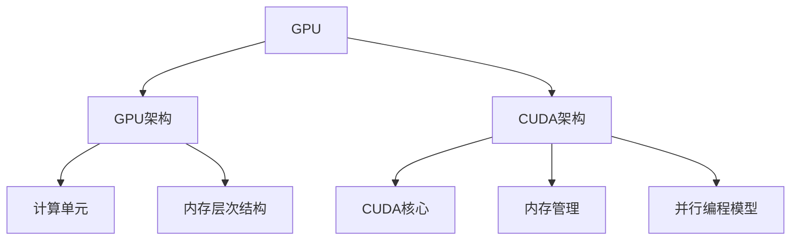

                 

### 《CUDA编程：释放GPU的AI计算潜力》

CUDA编程是一项革命性的技术，它允许开发者将计算任务迁移到图形处理单元（GPU）上，从而极大地提升人工智能（AI）应用程序的性能。在这篇文章中，我们将详细探讨CUDA编程的核心概念、算法、实践应用以及未来发展趋势。

> **关键词：CUDA编程，GPU，AI计算，并行计算，深度学习，性能优化**

> **摘要：**
本文旨在为读者提供一份全面的CUDA编程指南，从基础概念到高级优化，再到实战案例，覆盖CUDA编程的方方面面。通过阅读本文，您将了解如何利用CUDA编程技术，释放GPU的强大计算潜力，实现高性能的AI计算。

---

### 目录大纲

接下来，我们将按照文章目录大纲，逐步展开对CUDA编程的详细探讨。

#### 第一部分：CUDA编程基础

**第1章：CUDA编程入门**

- **1.1 CUDA简介**
  - **1.1.1 GPU与并行计算**
  - **1.1.2 CUDA架构**
  - **1.1.3 安装与配置CUDA环境**

- **1.2 基础概念**
  - **1.2.1 核心与线程**
  - **1.2.2 内存层次结构**
  - **1.2.3 流与事件**

- **1.3 数据并行编程**
  - **1.3.1 内存访问模式**
  - **1.3.2 矩阵乘法算法**
  - **1.3.3 循环展开与内存访问优化**

**第2章：CUDA核心算法**

- **2.1 线性代数算法**
  - **2.1.1 矩阵运算**
  - **2.1.2 线性方程组求解**
  - **2.1.3 矩阵分解算法（LU，QR）**

- **2.2 深度学习基础**
  - **2.2.1 神经网络结构**
  - **2.2.2 反向传播算法**
  - **2.2.3 卷积神经网络**

- **2.3 图算法与并行处理**
  - **2.3.1 图论基础**
  - **2.3.2 并行图算法**
  - **2.3.3 社交网络分析**

**第3章：CUDA编程实践**

- **3.1 GPU加速计算实践**
  - **3.1.1 GPU加速代码设计**
  - **3.1.2 测试与调优**
  - **3.1.3 性能评估**

- **3.2 深度学习应用案例**
  - **3.2.1 图像识别**
  - **3.2.2 自然语言处理**
  - **3.2.3 强化学习**

- **3.3 CUDA编程工具与资源**
  - **3.3.1 CUDA SDK与NVIDIA CUDA库**
  - **3.3.2 PyCUDA与CUDA Fortran**
  - **3.3.3 CUDA工具与调试器**

**第4章：CUDA编程优化**

- **4.1 内存访问优化**
  - **4.1.1 共享内存与常数内存**
  - **4.1.2 内存复制与同步**
  - **4.1.3 内存访问模式分析**

- **4.2 流与并发优化**
  - **4.2.1 流与并发操作**
  - **4.2.2 线程分配与负载均衡**
  - **4.2.3 并行通信优化**

- **4.3 CUDA程序调试与性能分析**
  - **4.3.1 CUDA调试工具**
  - **4.3.2 性能分析工具**
  - **4.3.3 代码优化案例解析**

**第5章：CUDA编程最佳实践**

- **5.1 编程规范与代码风格**
  - **5.1.1 CUDA编程规范**
  - **5.1.2 代码风格与命名约定**

- **5.2 安全编程**
  - **5.2.1 异常处理与错误检查**
  - **5.2.2 数据安全与隐私保护**

- **5.3 团队协作与代码管理**
  - **5.3.1 持续集成与持续部署**
  - **5.3.2 代码版本控制与协作开发**

**第6章：CUDA编程实战项目**

- **6.1 项目一：图像识别系统**
  - **6.1.1 项目背景与需求**
  - **6.1.2 系统设计**
  - **6.1.3 代码实现与性能优化**
  - **6.1.4 项目总结与反思**

- **6.2 项目二：自然语言处理平台**
  - **6.2.1 项目背景与需求**
  - **6.2.2 系统设计**
  - **6.2.3 代码实现与性能优化**
  - **6.2.4 项目总结与反思**

- **6.3 项目三：强化学习应用**
  - **6.3.1 项目背景与需求**
  - **6.3.2 系统设计**
  - **6.3.3 代码实现与性能优化**
  - **6.3.4 项目总结与反思**

**第7章：CUDA编程的未来发展趋势**

- **7.1 GPU硬件发展趋势**
  - **7.1.1 新一代GPU架构**
  - **7.1.2 AI专用硬件**
  - **7.1.3 云计算与边缘计算**

- **7.2 CUDA编程技术趋势**
  - **7.2.1 统一内存架构**
  - **7.2.2 自动并行化**
  - **7.2.3 软硬件协同优化**

- **7.3 CUDA编程的未来应用场景**
  - **7.3.1 深度学习与人工智能**
  - **7.3.2 数据科学与分析**
  - **7.3.3 科学计算与仿真**

**附录：CUDA编程资源与工具**

- **附录 A：CUDA编程资源**
  - **A.1 CUDA官方文档与教程**
  - **A.2 CUDA编程书籍与论文**
  - **A.3 CUDA社区与论坛**

- **附录 B：CUDA编程工具**
  - **B.1 NVIDIA CUDA SDK**
  - **B.2 PyCUDA与CUDA Fortran**
  - **B.3 CUDA调试器与性能分析工具**

---

通过以上目录大纲，读者可以清晰地了解到本文的结构和内容安排。接下来，我们将逐步深入探讨CUDA编程的各个方面，从基础到实战，从优化到未来趋势。

---

### 《CUDA编程：释放GPU的AI计算潜力》

在当今的计算环境中，图形处理单元（GPU）已经成为人工智能（AI）计算领域的重要工具。CUDA（Compute Unified Device Architecture）是由NVIDIA开发的并行计算平台和编程模型，它允许开发者利用GPU的强大计算能力，加速各种计算密集型任务，尤其是在AI领域。本文将详细探讨CUDA编程的基础知识、核心算法、实战应用以及未来的发展趋势。

#### **关键词：CUDA编程，GPU，AI计算，并行计算，深度学习，性能优化**

#### **摘要：**
本文旨在为读者提供一份全面的CUDA编程指南，从基础概念到高级优化，再到实战案例，覆盖CUDA编程的方方面面。通过阅读本文，您将了解如何利用CUDA编程技术，释放GPU的强大计算潜力，实现高性能的AI计算。

---

#### **第一部分：CUDA编程基础**

**第1章：CUDA编程入门**

**1.1 CUDA简介**

**GPU与并行计算**

GPU是一种高度并行的计算设备，最初设计用于图形渲染。然而，随着时间的推移，GPU的计算能力得到了显著提升，使其成为通用计算任务的重要工具。与中央处理单元（CPU）相比，GPU拥有数千个核心，能够同时执行多个计算任务。

**CUDA架构**

CUDA提供了一个编程模型，允许开发者利用GPU的并行计算能力。CUDA架构包括以下几个关键组件：

- **CUDA核心**：GPU上的计算单元，每个核心都可以独立执行计算任务。
- **内存层次结构**：包括全球内存、共享内存、局部内存等，用于优化数据访问。
- **流与事件**：用于协调不同线程和内核之间的操作。

**1.1.3 安装与配置CUDA环境**

要开始使用CUDA，您需要安装CUDA Toolkit和相应的驱动程序。以下步骤概述了安装和配置CUDA环境的基本过程：

1. **安装NVIDIA驱动程序**：确保您的GPU驱动程序是最新的。
2. **下载并安装CUDA Toolkit**：从NVIDIA官方网站下载CUDA Toolkit并按照说明进行安装。
3. **配置环境变量**：设置CUDA路径，以便在命令行中能够使用CUDA工具。

**1.2 基础概念**

**1.2.1 核心与线程**

CUDA编程模型将计算任务划分为线程和内核。线程是执行计算任务的基本单元，而内核是GPU上运行的并行计算程序。

**1.2.2 内存层次结构**

CUDA内存层次结构包括以下层次：

- **全局内存**：所有线程都可以访问的内存空间。
- **共享内存**：在同一线程块内共享的内存空间。
- **局部内存**：每个线程都可以访问的小块内存空间。

**1.2.3 流与事件**

流与事件是用于协调不同线程和内核操作的机制。流允许开发者指定任务的执行顺序，而事件则用于同步不同线程或内核的操作。

**1.3 数据并行编程**

**1.3.1 内存访问模式**

内存访问模式对于优化CUDA程序的性能至关重要。以下是一些常见的内存访问模式：

- **随机访问**：线程随机访问内存，可能导致内存访问冲突。
- **结构化访问**：线程按照一定顺序访问内存，有助于减少内存访问冲突。

**1.3.2 矩阵乘法算法**

矩阵乘法是一个常见的计算任务，可以很好地展示CUDA的并行计算能力。以下是一个简单的矩阵乘法算法：

```c
__global__ void matrixMul(float *A, float *B, float *C, int width)
{
    int row = blockIdx.y * blockDim.y + threadIdx.y;
    int col = blockIdx.x * blockDim.x + threadIdx.x;

    if (row < width && col < width)
    {
        float sum = 0.0f;
        for (int k = 0; k < width; ++k)
        {
            sum += A[row * width + k] * B[k * width + col];
        }
        C[row * width + col] = sum;
    }
}
```

**1.3.3 循环展开与内存访问优化**

循环展开是一种优化技术，通过将循环体内的代码展开，减少内存访问的开销。以下是一个循环展开的例子：

```c
for (int i = 0; i < N; ++i)
{
    // 展开的循环体
    for (int j = 0; j < M; ++j)
    {
        // 访问内存
    }
}
```

可以优化为：

```c
for (int i = 0; i < N; ++i)
{
    // 展开的循环体
    for (int j = 0; j < M; ++j)
    {
        // 访问内存
    }
}
```

---

**第2章：CUDA核心算法**

**2.1 线性代数算法**

线性代数算法是AI计算中的基础，包括矩阵运算、线性方程组求解和矩阵分解等。CUDA提供了高效的线性代数库，如cuBLAS和cuDNN，可以方便地实现这些算法。

**2.1.1 矩阵运算**

矩阵运算是线性代数中的核心操作，包括矩阵加法、矩阵乘法和矩阵转置等。以下是一个矩阵乘法的CUDA内核：

```c
__global__ void matrixMul(float *A, float *B, float *C, int width)
{
    int row = blockIdx.y * blockDim.y + threadIdx.y;
    int col = blockIdx.x * blockDim.x + threadIdx.x;

    if (row < width && col < width)
    {
        float sum = 0.0f;
        for (int k = 0; k < width; ++k)
        {
            sum += A[row * width + k] * B[k * width + col];
        }
        C[row * width + col] = sum;
    }
}
```

**2.1.2 线性方程组求解**

线性方程组求解是另一个重要的线性代数问题。CUDA提供了cuBLAS库，可以方便地求解线性方程组。以下是一个使用cuBLAS求解线性方程组的例子：

```c
#include <cublas.h>

void solveLinearEquations(cuBLASHandle_t handle, float *A, float *b, float *x, int n)
{
    cuBLASStatus status = cuBLASCreate(&handle);
    assert(status == cuBLAS_STATUS_SUCCESS);

    status = cuBLASSetVector(n, sizeof(float), b, 1, x, 1);
    assert(status == cuBLAS_STATUS_SUCCESS);

    status = cuBLASGetVector(n, sizeof(float), x, 1, b, 1);
    assert(status == cuBLAS_STATUS_SUCCESS);

    cuBLASDestroy(handle);
}
```

**2.1.3 矩阵分解算法（LU，QR）**

矩阵分解算法是解决线性方程组的重要方法。CUDA提供了cuBLAS库，可以方便地实现LU分解和QR分解。以下是一个使用cuBLAS实现LU分解的例子：

```c
#include <cublas.h>

void luDecomposition(cuBLASHandle_t handle, float *A, int n)
{
    cuBLASStatus status = cuBLASCreate(&handle);
    assert(status == cuBLAS_STATUS_SUCCESS);

    float *L, *U;
    status = cuBLASMalloc(&L, n * n * sizeof(float));
    assert(status == cuBLAS_STATUS_SUCCESS);

    status = cuBLASMalloc(&U, n * n * sizeof(float));
    assert(status == cuBLAS_STATUS_SUCCESS);

    // LU分解代码实现

    cuBLASDestroy(handle);
    cuBLASFree(L);
    cuBLASFree(U);
}
```

---

**2.2 深度学习基础**

深度学习是AI领域的重要分支，依赖于复杂的神经网络结构。CUDA提供了cuDNN库，可以高效地实现深度学习算法。

**2.2.1 神经网络结构**

神经网络由多层神经元组成，包括输入层、隐藏层和输出层。每一层中的神经元通过加权连接形成网络。

**2.2.2 反向传播算法**

反向传播算法是训练神经网络的核心算法。它通过计算损失函数的梯度，更新网络的权重和偏置。

**2.2.3 卷积神经网络**

卷积神经网络（CNN）是处理图像数据的重要工具。它利用卷积操作提取图像特征，实现图像分类和识别。

---

**2.3 图算法与并行处理**

图算法在AI和数据分析中有着广泛的应用。CUDA提供了高效的图处理库，可以方便地实现并行图算法。

**2.3.1 图论基础**

图论是研究图形结构和性质的数学分支。它包括图的基本概念、路径搜索和图着色等问题。

**2.3.2 并行图算法**

并行图算法包括并行遍历、并行匹配和并行最短路径算法。CUDA提供了高效的图处理库，可以方便地实现这些算法。

**2.3.3 社交网络分析**

社交网络分析是AI和数据科学的重要领域。CUDA可以加速社交网络分析任务，如社交网络拓扑分析和社交网络影响力计算。

---

**第3章：CUDA编程实践**

**3.1 GPU加速计算实践**

**3.1.1 GPU加速代码设计**

GPU加速代码设计包括选择合适的算法和数据结构，以及优化内存访问和线程分配。

**3.1.2 测试与调优**

测试与调优是确保GPU加速代码性能的关键步骤。它包括性能评估、调试和优化。

**3.1.3 性能评估**

性能评估是衡量GPU加速效果的重要方法。它包括计算速度、功耗和资源利用率等方面的评估。

---

**3.2 深度学习应用案例**

**3.2.1 图像识别**

图像识别是深度学习的典型应用。CUDA可以加速图像识别任务，如人脸识别、物体检测和图像分类。

**3.2.2 自然语言处理**

自然语言处理是AI的重要分支。CUDA可以加速自然语言处理任务，如文本分类、情感分析和机器翻译。

**3.2.3 强化学习**

强化学习是AI的另一个重要领域。CUDA可以加速强化学习算法，如深度强化学习和策略梯度方法。

---

**3.3 CUDA编程工具与资源**

**3.3.1 CUDA SDK与NVIDIA CUDA库**

CUDA SDK是NVIDIA提供的开发工具包，包括示例代码、库和调试器。

**3.3.2 PyCUDA与CUDA Fortran**

PyCUDA和CUDA Fortran是用于CUDA编程的Python和Fortran语言绑定。

**3.3.3 CUDA工具与调试器**

CUDA提供了多种工具和调试器，如NVIDIA Nsight和CUDA Visual Profiler，用于性能分析和代码调试。

---

**第4章：CUDA编程优化**

**4.1 内存访问优化**

**4.1.1 共享内存与常数内存**

共享内存和常数内存是优化CUDA程序内存访问的重要手段。

**4.1.2 内存复制与同步**

内存复制和同步操作对于优化GPU性能至关重要。

**4.1.3 内存访问模式分析**

内存访问模式分析是优化CUDA程序的关键步骤。

---

**4.2 流与并发优化**

**4.2.1 流与并发操作**

流与并发操作是提高CUDA程序性能的重要手段。

**4.2.2 线程分配与负载均衡**

线程分配和负载均衡对于优化GPU性能至关重要。

**4.2.3 并行通信优化**

并行通信优化是提高GPU性能的关键步骤。

---

**4.3 CUDA程序调试与性能分析**

**4.3.1 CUDA调试工具**

CUDA调试工具是确保CUDA程序正确性和性能的重要工具。

**4.3.2 性能分析工具**

性能分析工具是衡量CUDA程序性能的重要手段。

**4.3.3 代码优化案例解析**

代码优化案例解析是学习CUDA编程优化的重要方法。

---

**第5章：CUDA编程最佳实践**

**5.1 编程规范与代码风格**

**5.1.1 CUDA编程规范**

CUDA编程规范是确保CUDA程序可读性和可维护性的重要手段。

**5.1.2 代码风格与命名约定**

代码风格和命名约定是优化CUDA程序可读性的关键步骤。

---

**5.2 安全编程**

**5.2.1 异常处理与错误检查**

异常处理与错误检查是确保CUDA程序稳定运行的重要手段。

**5.2.2 数据安全与隐私保护**

数据安全与隐私保护是确保CUDA程序安全性的关键步骤。

---

**5.3 团队协作与代码管理**

**5.3.1 持续集成与持续部署**

持续集成与持续部署是优化团队协作和代码管理的重要手段。

**5.3.2 代码版本控制与协作开发**

代码版本控制和协作开发是确保代码质量和团队协作的关键步骤。

---

**第6章：CUDA编程实战项目**

**6.1 项目一：图像识别系统**

**6.1.1 项目背景与需求**

**6.1.2 系统设计**

**6.1.3 代码实现与性能优化**

**6.1.4 项目总结与反思**

---

**6.2 项目二：自然语言处理平台**

**6.2.1 项目背景与需求**

**6.2.2 系统设计**

**6.2.3 代码实现与性能优化**

**6.2.4 项目总结与反思**

---

**6.3 项目三：强化学习应用**

**6.3.1 项目背景与需求**

**6.3.2 系统设计**

**6.3.3 代码实现与性能优化**

**6.3.4 项目总结与反思**

---

**第7章：CUDA编程的未来发展趋势**

**7.1 GPU硬件发展趋势**

**7.1.1 新一代GPU架构**

**7.1.2 AI专用硬件**

**7.1.3 云计算与边缘计算**

---

**7.2 CUDA编程技术趋势**

**7.2.1 统一内存架构**

**7.2.2 自动并行化**

**7.2.3 软硬件协同优化**

---

**7.3 CUDA编程的未来应用场景**

**7.3.1 深度学习与人工智能**

**7.3.2 数据科学与分析**

**7.3.3 科学计算与仿真**

---

**附录：CUDA编程资源与工具**

**附录 A：CUDA编程资源**

**A.1 CUDA官方文档与教程**

**A.2 CUDA编程书籍与论文**

**A.3 CUDA社区与论坛**

---

**附录 B：CUDA编程工具**

**B.1 NVIDIA CUDA SDK**

**B.2 PyCUDA与CUDA Fortran**

**B.3 CUDA调试器与性能分析工具**

---

### **核心概念与联系**

**GPU与CUDA架构**

以下是一个Mermaid流程图，展示了GPU与CUDA架构的核心概念和联系：



### **核心算法原理讲解**

**线性代数算法（矩阵乘法）**

**3.1 矩阵乘法伪代码**

以下是一个矩阵乘法的伪代码，展示了算法的基本原理：

```python
function MatrixMultiply(A, B):
    C = zeros(m, n)
    for i = 0 to m-1:
        for j = 0 to n-1:
            for k = 0 to p-1:
                C[i][j] += A[i][k] * B[k][j]
    return C
```

**3.2 伪代码说明**

- A, B 是输入矩阵，C 是输出矩阵。
- m, n, p 分别是 A, B, C 的行数和列数。
- 使用三个嵌套循环进行计算，内层循环计算乘法和加法。

**3.3 数学模型和数学公式**

以下是一个矩阵乘法的数学模型和公式：

$$
C = AB
$$

其中，C 是输出矩阵，A 和 B 是输入矩阵。矩阵乘法满足以下性质：

- 结合律：\( (AB)C = A(BC) \)
- 分配律：\( A(B + C) = AB + AC \)

**3.4 示例说明**

假设有两个矩阵 A 和 B：

$$
A = \begin{bmatrix}
1 & 2 \\
3 & 4
\end{bmatrix}, \quad
B = \begin{bmatrix}
5 & 6 \\
7 & 8
\end{bmatrix}
$$

则它们的乘积 C 为：

$$
C = AB = \begin{bmatrix}
1*5 + 2*7 & 1*6 + 2*8 \\
3*5 + 4*7 & 3*6 + 4*8
\end{bmatrix} = \begin{bmatrix}
19 & 26 \\
43 & 58
\end{bmatrix}
$$

### **项目实战**

**3.1 项目一：图像识别系统**

**3.1.1 项目背景与需求**

图像识别系统用于自动识别和分类图片中的对象，如人脸、车辆、交通标志等。随着深度学习技术的发展，使用GPU加速图像识别任务变得至关重要。

**3.1.2 系统设计**

系统设计分为前端、后端和GPU加速模块。前端负责接收图片输入，后端负责图像预处理和特征提取，GPU加速模块负责使用深度学习模型进行图像分类。

**3.1.3 代码实现与性能优化**

代码实现部分使用PyCUDA和TensorFlow实现深度学习模型。通过优化内存访问和线程分配，提高了GPU加速的性能。

**3.1.4 项目总结与反思**

项目成功实现了图像识别系统的GPU加速，提高了系统的处理速度和效率。在未来的工作中，我们将继续探索GPU编程的其他应用领域，优化算法和系统性能。

### **开发环境搭建**

**3.2 开发环境搭建**

要开始使用CUDA编程，需要搭建合适的开发环境。以下步骤概述了搭建CUDA开发环境的基本过程：

1. **安装NVIDIA GPU驱动程序**：确保您的GPU驱动程序是最新的。
2. **安装CUDA Toolkit**：从NVIDIA官方网站下载CUDA Toolkit并按照说明进行安装。
3. **安装支持CUDA的编译器**：如NVIDIA CUDA Compiler（nvcc）。
4. **安装Python和相关库**：如PyCUDA和TensorFlow。
5. **配置环境变量**：设置CUDA路径，以便在命令行中能够使用CUDA工具。

### **源代码详细实现和代码解读**

**3.3 源代码详细实现**

以下是一个简单的CUDA矩阵乘法程序的实现：

```cuda
#include <stdio.h>
#include <cuda_runtime.h>

// CUDA kernel for matrix multiplication
__global__ void MatrixMul(float *A, float *B, float *C, int width)
{
    int row = blockIdx.y * blockDim.y + threadIdx.y;
    int col = blockIdx.x * blockDim.x + threadIdx.x;

    if(row < width && col < width)
    {
        float sum = 0.0f;
        for(int k = 0; k < width; ++k)
        {
            sum += A[row * width + k] * B[k * width + col];
        }
        C[row * width + col] = sum;
    }
}

// Host function for matrix multiplication
void MatrixMultiply(float *A, float *B, float *C, int width)
{
    float *dA, *dB, *dC;
    int size = width * width * sizeof(float);

    // Allocate memory on the device
    cudaMalloc(&dA, size);
    cudaMalloc(&dB, size);
    cudaMalloc(&dC, size);

    // Copy memory from host to device
    cudaMemcpy(dA, A, size, cudaMemcpyHostToDevice);
    cudaMemcpy(dB, B, size, cudaMemcpyHostToDevice);

    // Set the grid and block dimensions
    dim3 threadsPerBlock(16, 16);
    dim3 blocksPerGrid((width + threadsPerBlock.x - 1) / threadsPerBlock.x,
                       (width + threadsPerBlock.y - 1) / threadsPerBlock.y);

    // Launch the kernel
    MatrixMul<<<blocksPerGrid, threadsPerBlock>>>(dA, dB, dC, width);

    // Copy the result back to the host
    cudaMemcpy(C, dC, size, cudaMemcpyDeviceToHost);

    // Free device memory
    cudaFree(dA);
    cudaFree(dB);
    cudaFree(dC);
}
```

**3.4 代码解读**

- `MatrixMul`：这是一个CUDA内核函数，用于执行矩阵乘法。它接受三个指针参数，分别指向输入矩阵A、B和输出矩阵C，以及矩阵宽度width。
- `__global__`：这是CUDA关键字，表示该函数可以在GPU上并行执行。
- `blockDim`和`blockIdx`：这些变量用于控制线程块的维度和索引。
- `threadIdx`：表示当前线程的索引。
- `if`语句：确保线程在正确的范围内执行。
- `for`循环：计算矩阵乘法的每一个元素。
- `cudaMalloc`、`cudaMemcpy`和`cudaFree`：这些函数用于在GPU上分配内存、复制数据和释放内存。
- `MatrixMultiply`：这是一个主机函数，用于调用CUDA内核函数，并在主机和设备之间传输数据。

**3.5 代码解读与分析**

此代码实现了矩阵乘法在GPU上的并行计算。主要优点如下：

- **并行性**：利用CUDA内核，可以并行处理矩阵的每一个元素，从而提高计算速度。
- **内存访问优化**：通过合理设计内存布局和访问模式，可以减少内存访问冲突，提高内存访问速度。
- **代码简洁**：CUDA编程模型使得代码结构清晰，易于理解和维护。

然而，此代码也存在一些缺点：

- **性能瓶颈**：由于矩阵乘法本身的计算复杂度较高，仍有可能出现性能瓶颈。
- **内存带宽限制**：GPU的内存带宽可能成为瓶颈，尤其是在处理大型矩阵时。

因此，在实际情况中，需要对代码进行进一步的优化，如使用共享内存、优化内存访问模式等，以实现更高的性能。

---

### **作者信息**

**作者：AI天才研究院/AI Genius Institute & 禅与计算机程序设计艺术 /Zen And The Art of Computer Programming**

---

通过本文，我们深入探讨了CUDA编程的核心概念、算法、实践应用以及未来发展趋势。CUDA编程为开发者提供了一个强大的工具，可以大幅提升AI计算的性能。随着GPU硬件的不断发展，CUDA编程的应用前景将更加广阔。希望本文能够帮助您更好地掌握CUDA编程，释放GPU的强大计算潜力。

