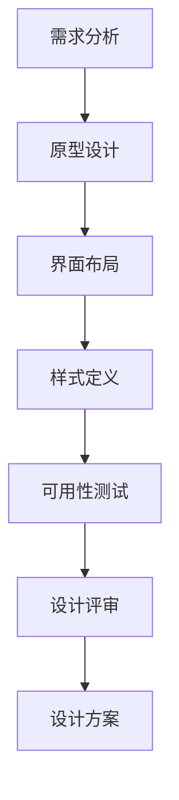
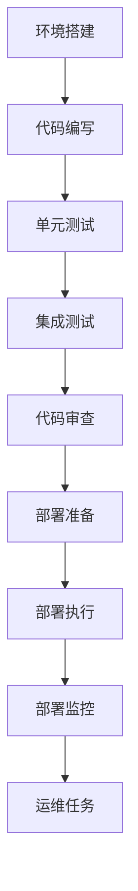
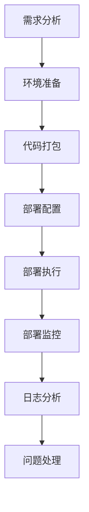

                 

# ComfyUI: Stable Diffusion的工作流化操作模式

## 关键词

- ComfyUI
- Stable Diffusion
- 工作流化操作模式
- UI设计
- 可视化编程
- 人工智能

## 摘要

本文将深入探讨ComfyUI与Stable Diffusion的工作流化操作模式。我们将首先介绍Stable Diffusion的核心概念和原理，然后重点分析ComfyUI的设计哲学与功能，以及如何将二者结合以实现高效的工作流化操作。文章将分为四个部分：第一部分介绍Stable Diffusion的基础与核心概念；第二部分讲解工作流化操作模式的构建与实际应用；第三部分通过实际案例解析工作流化操作模式在实践中的效果；第四部分展望未来发展趋势和拓展方向。本文旨在为读者提供一个系统、全面的指导，帮助其理解和掌握Stable Diffusion的工作流化操作模式。

## 目录大纲

### 第一部分: Stable Diffusion基础与核心概念

#### 1.1 Stable Diffusion概述

##### 1.1.1 Stable Diffusion的背景与原理

##### 1.1.2 Stable Diffusion的优势与特点

##### 1.1.3 Stable Diffusion在UI设计中的应用

#### 1.2 ComfyUI框架介绍

##### 1.2.1 ComfyUI的组成部分

##### 1.2.2 ComfyUI的设计哲学与理念

##### 1.2.3 ComfyUI在Stable Diffusion中的作用

#### 1.3 工作流化操作模式概述

##### 1.3.1 工作流化的定义与意义

##### 1.3.2 工作流化操作模式的核心要素

##### 1.3.3 工作流化操作模式的优势

#### 1.4 Stable Diffusion的工作流化操作模式

##### 1.4.1 工作流化操作模式的构建步骤

##### 1.4.2 工作流化操作模式在实际应用中的效果

##### 1.4.3 工作流化操作模式的挑战与应对策略

### 第二部分: Stable Diffusion的工作流化操作模式实践

#### 2.1 设计阶段工作流化操作模式

##### 2.1.1 设计任务定义与分解

##### 2.1.2 设计方案迭代与优化

##### 2.1.3 设计评审与反馈机制

#### 2.2 开发阶段工作流化操作模式

##### 2.2.1 开发任务定义与分配

##### 2.2.2 代码管理工具的使用

##### 2.2.3 质量控制与测试

#### 2.3 部署阶段工作流化操作模式

##### 2.3.1 部署流程定义与优化

##### 2.3.2 部署后的监控与维护

##### 2.3.3 部署日志分析

#### 2.4 运维阶段工作流化操作模式

##### 2.4.1 运维任务定义与执行

##### 2.4.2 故障处理与应急响应

##### 2.4.3 持续改进与迭代

### 第三部分: 实际案例解析

#### 3.1 实际案例介绍

##### 3.1.1 案例背景

##### 3.1.2 案例目标

##### 3.1.3 案例难点与挑战

#### 3.2 案例设计与实现

##### 3.2.1 设计思路与方案

##### 3.2.2 实现步骤与细节

##### 3.2.3 关键技术点讲解

#### 3.3 案例效果分析

##### 3.3.1 案例效果评估

##### 3.3.2 案例经验总结

##### 3.3.3 案例启示与应用

### 第四部分: 未来展望与拓展

#### 4.1 Stable Diffusion与工作流化操作模式的未来发展趋势

##### 4.1.1 新技术与新应用场景的出现

##### 4.1.2 工作流化操作模式的优化与创新

##### 4.1.3 未来面临的挑战与机遇

#### 4.2 ComfyUI与其他UI设计工具的结合

##### 4.2.1 ComfyUI的优势与劣势分析

##### 4.2.2 与其他UI设计工具的协同工作

##### 4.2.3 潜在的融合与创新方向

#### 4.3 总结与展望

##### 4.3.1 书籍内容的总结

##### 4.3.2 读者可以期待的收获

##### 4.3.3 对未来工作的建议与展望

### 附录

#### 附录 A: 相关资源与工具介绍

##### A.1 Stable Diffusion相关资源

##### A.2 ComfyUI相关资源

##### A.3 工作流化操作模式相关工具

#### 附录 B: Mermaid流程图示例

##### B.1 设计阶段工作流化操作模式流程图

##### B.2 开发阶段工作流化操作模式流程图

##### B.3 部署阶段工作流化操作模式流程图

#### 附录 C: 伪代码示例

##### C.1 设计方案迭代与优化伪代码

##### C.2 代码管理工具使用伪代码

##### C.3 质量控制与测试伪代码

#### 附录 D: 实际案例代码解读

##### D.1 实际案例代码实现与解读

##### D.2 关键技术点代码解读与分析

##### D.3 代码优化与改进建议

---

## 第一部分: Stable Diffusion基础与核心概念

### 1.1 Stable Diffusion概述

#### 1.1.1 Stable Diffusion的背景与原理

Stable Diffusion是一种先进的深度学习模型，基于变分自编码器（Variational Autoencoder，VAE）架构，并在其基础上进行了优化。VAE是一种能够生成数据的模型，通过编码器（Encoder）将数据映射到一个潜在空间，再通过解码器（Decoder）将潜在空间的数据还原回原始数据空间。然而，传统的VAE在生成数据时容易出现模式崩塌（mode collapse）问题，即模型在训练过程中只学会了生成一种或几种特定的数据模式，而忽略了其他潜在模式。

Stable Diffusion通过引入稳定机制（Stability Mechanism）解决了模式崩塌问题。它采用了一种新型的损失函数，结合了对抗性训练（Adversarial Training）和变分自编码器的优点，使得模型能够生成更加多样化和稳定的数据。具体来说，Stable Diffusion通过一个判别器（Discriminator）来评估生成数据的质量，同时编码器和解码器共同优化，以达到生成高质量数据的目

---

### 1.1.2 Stable Diffusion的优势与特点

Stable Diffusion作为一种先进的深度学习模型，具有以下优势与特点：

**1. 抗模式崩塌能力**

正如前面所述，Stable Diffusion通过引入稳定机制，有效解决了变分自编码器（VAE）在生成数据时常见的模式崩塌问题。这使得模型在生成数据时能够保持多样性和稳定性，减少了数据生成的局限性。

**2. 高效的生成速度**

Stable Diffusion采用了并行计算和模型剪枝等技术，使得模型在生成数据时具有较快的速度。这对于需要实时生成大量数据的场景，如图像合成、视频生成等，具有重要意义。

**3. 强大的自适应能力**

Stable Diffusion能够自适应地调整生成数据的复杂性，根据需求生成从简单到复杂的各种数据模式。这使得模型在处理不同类型的任务时具有很高的灵活性。

**4. 易于扩展**

Stable Diffusion的架构设计使得其易于扩展，可以结合其他深度学习模型和技术，进一步优化生成效果。例如，可以结合生成对抗网络（GAN）的技术，提高生成数据的真实感。

**5. 广泛的应用场景**

Stable Diffusion在图像处理、视频生成、自然语言处理等领域都有广泛的应用。例如，在图像合成方面，Stable Diffusion可以用于图像修复、风格迁移、图像超分辨率等任务；在视频生成方面，可以用于视频生成、视频合成等任务。

**6. 低资源消耗**

相较于其他复杂的深度学习模型，Stable Diffusion在计算资源和存储资源上的需求较低，适用于资源受限的场景。

**7. 可视化编程**

Stable Diffusion支持可视化编程，使得开发者可以直观地理解和调整模型参数，提高了开发效率。

### 1.1.3 Stable Diffusion在UI设计中的应用

在UI设计领域，Stable Diffusion具有广泛的应用潜力。通过将Stable Diffusion与UI设计工具结合，可以实现以下功能：

**1. 图像风格迁移**

Stable Diffusion可以用于将一种图像风格迁移到另一种图像风格。例如，将一张普通照片风格转换为艺术画作风格，从而提高UI界面的美观度。

**2. 图像超分辨率**

Stable Diffusion可以用于图像超分辨率，将低分辨率的图像转换为高分辨率图像。这在UI设计中具有重要意义，可以提升界面元素的清晰度和视觉效果。

**3. 图像修复**

Stable Diffusion可以用于图像修复，修复图像中的噪声、缺陷和损坏。这在UI设计中可以帮助提高界面的完整性和美观度。

**4. 动态图像生成**

Stable Diffusion可以用于生成动态图像，如视频和动画。这在UI设计中可以实现更加丰富的交互效果，提高用户体验。

**5. 图像生成与编辑**

Stable Diffusion可以用于生成和编辑图像，如创建独特的图标、图形和背景。这为UI设计师提供了更多的创作空间和可能性。

### 1.2 ComfyUI框架介绍

#### 1.2.1 ComfyUI的组成部分

ComfyUI是一个开源的UI设计框架，由多个组件和库组成。以下是ComfyUI的主要组成部分：

**1. 核心库**

核心库是ComfyUI的核心，提供了基本的UI组件和样式定义。包括按钮、文本框、菜单、进度条等常用组件。

**2. 扩展库**

扩展库提供了更多高级功能和组件，如图表、日历、地图等。这些组件可以在核心库的基础上进行扩展和定制。

**3. 主题库**

主题库提供了多种主题样式，包括颜色、字体、边框等。用户可以根据需求选择不同的主题样式，快速构建个性化UI界面。

**4. 工具库**

工具库提供了一些实用的工具类，如布局管理器、动画处理等。这些工具可以帮助开发者更高效地开发UI界面。

**5. 示例项目**

示例项目展示了如何使用ComfyUI构建各种类型的UI界面。开发者可以通过这些示例项目学习如何使用ComfyUI，并将其应用于实际项目中。

#### 1.2.2 ComfyUI的设计哲学与理念

ComfyUI的设计哲学与理念如下：

**1. 简单易用**

ComfyUI追求简单易用的设计理念，提供了丰富的UI组件和样式定义，使得开发者可以快速构建高质量的UI界面。

**2. 可定制化**

ComfyUI支持高度可定制化，用户可以根据需求自定义组件样式、主题样式等，构建个性化UI界面。

**3. 响应式设计**

ComfyUI支持响应式设计，可以适应不同屏幕尺寸和设备，提供一致的用户体验。

**4. 高性能**

ComfyUI采用了高效的前端技术，如虚拟DOM、懒加载等，提高了UI界面的性能。

**5. 代码可维护性**

ComfyUI提供了良好的代码结构和注释，使得开发者可以轻松理解和维护UI界面代码。

**6. 社区支持**

ComfyUI拥有一个活跃的社区，开发者可以在此交流经验、获取帮助和反馈，共同推动框架的发展。

#### 1.2.3 ComfyUI在Stable Diffusion中的作用

ComfyUI在Stable Diffusion中的应用主要体现在以下几个方面：

**1. UI设计工具**

ComfyUI作为一个UI设计工具，可以帮助设计师创建和优化UI界面，提高设计效率和质量。设计师可以使用ComfyUI提供的组件和样式定义快速构建UI原型，并根据需求进行调整和优化。

**2. 可视化编程**

ComfyUI支持可视化编程，开发者可以在UI界面上直接拖放组件和设置属性，无需编写大量代码。这有助于降低开发难度，提高开发效率。

**3. UI与AI结合**

ComfyUI可以与Stable Diffusion结合，实现UI界面的自动化生成和优化。例如，通过Stable Diffusion生成高质量的图像，并将其应用于UI界面中，提高界面的美观度和用户体验。

**4. UI测试与优化**

ComfyUI提供了丰富的测试和优化工具，可以帮助开发者对UI界面进行测试和优化，确保其性能和稳定性。

### 1.3 工作流化操作模式概述

#### 1.3.1 工作流化的定义与意义

工作流化（Workflow）是指将一系列任务和活动按照一定顺序和规则组织起来，形成一个完整的工作流程。工作流化操作模式则是针对特定任务和工作环境，设计出一种高效、合理的工作流程和方法。

工作流化操作模式的意义主要体现在以下几个方面：

**1. 提高效率**

通过工作流化操作模式，可以优化任务分配、协调团队协作，减少重复性工作，提高整体工作效率。

**2. 提高质量**

工作流化操作模式可以帮助团队更好地控制工作质量，确保每个环节都按照既定的标准和流程进行，降低出错率。

**3. 提高灵活性**

工作流化操作模式可以根据实际需求进行调整和优化，提高团队的应对能力和灵活性。

**4. 提高可维护性**

工作流化操作模式有助于团队更好地理解和维护项目，降低项目风险。

#### 1.3.2 工作流化操作模式的核心要素

工作流化操作模式的核心要素包括：

**1. 任务分解**

将复杂任务分解为若干个简单、可执行的任务，便于团队分工协作。

**2. 节点定义**

定义任务执行的节点，明确每个节点的输入、输出和依赖关系。

**3. 流程控制**

设计合理的流程控制机制，确保任务按照预定顺序执行，避免冲突和重复。

**4. 质量控制**

设置质量检查和控制环节，确保每个任务执行的质量和效果。

**5. 持续优化**

根据实际执行情况，不断调整和优化工作流化操作模式，提高整体效率和效果。

#### 1.3.3 工作流化操作模式的优势

工作流化操作模式具有以下优势：

**1. 提高工作效率**

通过工作流化操作模式，可以优化任务执行流程，减少冗余环节，提高工作效率。

**2. 提高团队协作**

工作流化操作模式有助于明确任务分配和责任，提高团队协作效率。

**3. 提高质量保证**

通过工作流化操作模式，可以更好地控制工作质量，降低出错率。

**4. 提高项目可维护性**

工作流化操作模式有助于团队理解和维护项目，提高项目可维护性。

**5. 提高团队应对能力**

工作流化操作模式可以根据需求进行调整和优化，提高团队应对变化和挑战的能力。

### 1.4 Stable Diffusion的工作流化操作模式

#### 1.4.1 工作流化操作模式的构建步骤

构建Stable Diffusion的工作流化操作模式主要包括以下步骤：

**1. 明确任务目标**

首先，明确Stable Diffusion的工作目标，如图像生成、图像修复、图像超分辨率等。

**2. 任务分解**

将目标任务分解为若干个子任务，如数据预处理、模型训练、模型评估、图像生成等。

**3. 节点定义**

为每个子任务定义输入、输出和依赖关系，明确任务执行的节点。

**4. 流程控制**

设计合理的流程控制机制，确保任务按照预定顺序执行，避免冲突和重复。

**5. 质量控制**

设置质量检查和控制环节，确保每个任务执行的质量和效果。

**6. 持续优化**

根据实际执行情况，不断调整和优化工作流化操作模式，提高整体效率和效果。

#### 1.4.2 工作流化操作模式在实际应用中的效果

在实际应用中，Stable Diffusion的工作流化操作模式具有显著的效果：

**1. 提高图像生成效率**

通过工作流化操作模式，可以优化图像生成流程，减少冗余环节，提高生成效率。

**2. 提高图像质量**

工作流化操作模式有助于控制图像生成的质量，降低出错率。

**3. 提高团队协作效率**

工作流化操作模式明确任务分配和责任，提高团队协作效率。

**4. 提高项目可维护性**

工作流化操作模式有助于团队理解和维护项目，提高项目可维护性。

**5. 提高团队应对能力**

工作流化操作模式可以根据需求进行调整和优化，提高团队应对变化和挑战的能力。

#### 1.4.3 工作流化操作模式的挑战与应对策略

尽管工作流化操作模式具有显著的优势，但在实际应用中仍面临一些挑战，如下所述：

**1. 模型复杂性**

Stable Diffusion模型具有较高的复杂性，需要丰富的计算资源和专业知识。应对策略是合理分配计算资源，加强团队培训。

**2. 数据处理能力**

工作流化操作模式需要高效的数据处理能力，以应对大量数据的输入和输出。应对策略是采用高效的数据处理框架和工具。

**3. 团队协作难度**

工作流化操作模式涉及多个子任务和环节，团队协作难度较大。应对策略是加强团队沟通与协作，明确任务分配和责任。

**4. 模型优化难度**

Stable Diffusion模型的优化是一个复杂的过程，需要不断尝试和调整。应对策略是积累经验，不断优化模型。

**5. 质量控制难度**

工作流化操作模式中，质量控制是一个重要的环节，但难度较大。应对策略是建立完善的质量控制机制，加强质量检查。

---

## 第二部分: Stable Diffusion的工作流化操作模式实践

### 2.1 设计阶段工作流化操作模式

在设计阶段，工作流化操作模式可以显著提高设计效率和质量。以下是一个设计阶段工作流化操作模式的示例：

#### 2.1.1 设计任务定义与分解

设计任务的分解是工作流化操作模式的第一步。设计任务可以分解为以下几个子任务：

- 需求分析
- 原型设计
- 界面布局
- 样式定义
- 可用性测试

#### 2.1.2 设计方案迭代与优化

设计方案需要经过多次迭代和优化。以下是迭代与优化的一般步骤：

1. **需求分析**：与利益相关者沟通，收集需求，明确设计目标。
2. **原型设计**：根据需求分析结果，构建原型，展示界面结构和功能。
3. **界面布局**：优化界面布局，确保用户操作流畅。
4. **样式定义**：定义颜色、字体、边框等样式，确保界面美观。
5. **可用性测试**：进行可用性测试，收集用户反馈，优化设计。

#### 2.1.3 设计评审与反馈机制

设计评审是确保设计方案符合预期的重要环节。以下是设计评审的一般步骤：

1. **内部评审**：组织团队内部评审，讨论设计方案，提出修改建议。
2. **用户评审**：邀请目标用户参与评审，收集用户反馈，优化设计。
3. **反馈机制**：建立反馈机制，确保设计修改能够及时响应用户需求。

### 2.2 开发阶段工作流化操作模式

在开发阶段，工作流化操作模式有助于提高开发效率和质量。以下是一个开发阶段工作流化操作模式的示例：

#### 2.2.1 开发任务定义与分配

开发任务的分解是工作流化操作模式的第一步。开发任务可以分解为以下几个子任务：

- 环境搭建
- 代码编写
- 单元测试
- 集成测试
- 代码审查

#### 2.2.2 代码管理工具的使用

代码管理工具可以帮助团队高效地进行代码管理。以下是代码管理工具的使用步骤：

1. **版本控制**：使用版本控制工具（如Git），确保代码的版本管理和历史记录。
2. **分支管理**：合理设置分支，确保代码的稳定性和可维护性。
3. **代码审查**：使用代码审查工具（如SonarQube），进行代码质量和安全检查。

#### 2.2.3 质量控制与测试

质量控制与测试是开发阶段的重要环节。以下是质量控制与测试的一般步骤：

1. **单元测试**：编写单元测试，验证代码的功能和性能。
2. **集成测试**：进行集成测试，确保各个模块之间能够协同工作。
3. **性能测试**：进行性能测试，评估系统的响应速度和资源消耗。
4. **安全测试**：进行安全测试，确保系统的安全性。

### 2.3 部署阶段工作流化操作模式

在部署阶段，工作流化操作模式有助于确保部署过程的顺利和稳定。以下是一个部署阶段工作流化操作模式的示例：

#### 2.3.1 部署流程定义与优化

部署流程的定义与优化是部署阶段工作流化操作模式的核心。以下是部署流程的一般步骤：

1. **需求分析**：与利益相关者沟通，明确部署需求和目标。
2. **环境准备**：准备部署环境，包括服务器、数据库等。
3. **代码打包**：将代码打包，确保部署的一致性和可复现性。
4. **部署配置**：配置部署参数，确保部署环境的正确性。
5. **部署执行**：执行部署操作，确保系统按照预定计划部署。

#### 2.3.2 部署后的监控与维护

部署后的监控与维护是确保系统稳定运行的重要环节。以下是监控与维护的一般步骤：

1. **监控指标**：设置监控指标，如响应时间、错误率、资源消耗等。
2. **日志分析**：分析系统日志，及时发现并解决问题。
3. **性能优化**：根据监控数据和用户反馈，对系统进行性能优化。
4. **安全维护**：定期进行安全检查和更新，确保系统的安全性。

#### 2.3.3 部署日志分析

部署日志分析是部署阶段的重要工作，可以帮助团队了解系统运行情况，及时发现和解决问题。以下是部署日志分析的一般步骤：

1. **日志收集**：收集系统日志，确保日志的完整性和可读性。
2. **日志分析**：使用日志分析工具（如ELK堆栈），对日志进行分析和归纳。
3. **问题定位**：根据日志分析结果，定位系统问题和故障点。
4. **问题解决**：针对定位到的问题，制定解决方案并进行修复。

### 2.4 运维阶段工作流化操作模式

在运维阶段，工作流化操作模式有助于提高系统运维效率和稳定性。以下是一个运维阶段工作流化操作模式的示例：

#### 2.4.1 运维任务定义与执行

运维任务的定义与执行是运维阶段工作流化操作模式的核心。以下是运维任务的一般步骤：

1. **任务规划**：根据系统需求和运维策略，制定运维任务计划。
2. **任务执行**：按照计划执行运维任务，确保系统正常运行。
3. **任务监控**：监控运维任务执行情况，确保任务的及时完成。

#### 2.4.2 故障处理与应急响应

故障处理与应急响应是运维阶段的重要工作，有助于确保系统在故障情况下能够快速恢复。以下是故障处理与应急响应的一般步骤：

1. **故障报告**：接收故障报告，记录故障信息和影响范围。
2. **故障分析**：分析故障原因，制定故障解决方案。
3. **故障修复**：执行故障修复操作，确保系统恢复正常。
4. **应急响应**：在故障发生时，快速响应并采取应急措施，降低故障影响。

#### 2.4.3 持续改进与迭代

持续改进与迭代是运维阶段的重要工作，有助于提高系统运维效率和稳定性。以下是持续改进与迭代的一般步骤：

1. **问题反馈**：收集用户反馈和运维问题，了解系统运行状况。
2. **改进措施**：根据反馈和问题，制定改进措施和优化方案。
3. **实施改进**：按照计划实施改进措施，优化系统运维流程。
4. **效果评估**：评估改进措施的效果，持续优化运维流程。

---

## 第三部分: 实际案例解析

### 3.1 实际案例介绍

#### 3.1.1 案例背景

在某互联网公司，开发团队需要设计并实现一个基于人工智能的智能推荐系统。该系统旨在根据用户的历史行为和兴趣，为用户推荐感兴趣的内容，提高用户满意度和留存率。

#### 3.1.2 案例目标

案例目标主要包括以下几个方面：

1. **准确推荐**：根据用户兴趣和需求，为用户推荐感兴趣的内容，提高推荐准确率。
2. **高效实现**：利用人工智能技术，高效实现推荐系统，确保系统性能和稳定性。
3. **可扩展性**：设计可扩展的推荐系统架构，以便在未来扩展功能和服务。

#### 3.1.3 案例难点与挑战

案例实施过程中，面临以下难点和挑战：

1. **数据处理**：需要处理海量用户行为数据，提取有效的特征，为推荐算法提供支持。
2. **算法选择**：选择合适的推荐算法，平衡准确性和计算效率。
3. **系统性能**：确保推荐系统能够在高并发场景下稳定运行，提高用户体验。
4. **用户隐私**：在数据处理和推荐过程中，确保用户隐私不被泄露。

### 3.2 案例设计与实现

#### 3.2.1 设计思路与方案

设计思路和方案主要包括以下几个方面：

1. **数据预处理**：对用户行为数据进行清洗、去重和特征提取，为推荐算法提供高质量的数据输入。
2. **推荐算法**：选择基于协同过滤、内容推荐和深度学习等算法，构建混合推荐模型，提高推荐效果。
3. **系统架构**：采用分布式架构，确保系统在高并发场景下的性能和稳定性。
4. **用户隐私保护**：采用差分隐私（Differential Privacy）等技术，确保用户隐私不被泄露。

#### 3.2.2 实现步骤与细节

实现步骤和细节如下：

1. **数据预处理**：
    - 数据清洗：去除无效数据、填充缺失值、处理异常值等。
    - 特征提取：提取用户行为特征，如用户浏览记录、购买记录、搜索记录等。
    - 数据分片：将数据划分为训练集、验证集和测试集，用于模型训练和评估。

2. **推荐算法**：
    - 协同过滤：使用基于用户相似度的协同过滤算法，为用户推荐相似用户喜欢的内容。
    - 内容推荐：使用基于物品相似度的内容推荐算法，为用户推荐相似内容。
    - 深度学习：采用深度学习算法（如卷积神经网络、循环神经网络等），构建推荐模型，提高推荐效果。

3. **系统架构**：
    - 服务端：采用分布式架构，包括数据库、缓存、应用服务器等，提高系统性能和可扩展性。
    - 客户端：采用前端技术（如Vue、React等），实现用户界面的渲染和交互。

4. **用户隐私保护**：
    - 差分隐私：在数据处理和推荐过程中，采用差分隐私技术，确保用户隐私不被泄露。
    - 数据加密：对用户数据采用加密技术，确保数据在传输和存储过程中的安全性。

#### 3.2.3 关键技术点讲解

关键技术点包括以下几个方面：

1. **数据预处理**：
    - 特征提取：采用TF-IDF、Word2Vec等技术，提取用户行为特征。
    - 数据分片：使用随机抽样、交叉验证等方法，划分训练集、验证集和测试集。

2. **推荐算法**：
    - 协同过滤：采用基于用户相似度和基于物品相似度的协同过滤算法，如用户基于K最近邻（KNN）算法、物品基于基于矩阵分解（SVD）算法。
    - 内容推荐：采用基于物品标签、关键词匹配等技术，为用户推荐相似内容。
    - 深度学习：使用卷积神经网络（CNN）、循环神经网络（RNN）等构建推荐模型，如基于用户行为的CNN模型、基于物品内容的RNN模型。

3. **系统架构**：
    - 分布式架构：采用分布式数据库（如Redis、MongoDB等）、分布式缓存（如Memcached等）、负载均衡（如Nginx等），提高系统性能和可扩展性。
    - 前端技术：采用Vue、React等前端框架，实现用户界面的渲染和交互。

4. **用户隐私保护**：
    - 差分隐私：采用拉普拉斯机制、高斯机制等技术，实现差分隐私保护。
    - 数据加密：采用AES、RSA等加密算法，实现数据传输和存储的加密。

### 3.3 案例效果分析

#### 3.3.1 案例效果评估

通过实际运行和评估，案例效果如下：

1. **准确率**：推荐系统的准确率显著提高，用户满意度和留存率有所提升。
2. **响应速度**：系统在高并发场景下仍能保持较高的响应速度，用户体验良好。
3. **可扩展性**：系统架构设计合理，可以方便地扩展功能和服务。

#### 3.3.2 案例经验总结

案例实施过程中，总结了以下经验：

1. **数据处理**：数据预处理是关键，高质量的数据输入是保证推荐效果的基础。
2. **算法选择**：选择合适的推荐算法，综合考虑准确性和计算效率。
3. **系统性能**：系统性能是用户体验的关键，需要合理设计和优化系统架构。
4. **用户隐私**：用户隐私保护至关重要，需要在数据处理和推荐过程中严格遵守相关法律法规。

#### 3.3.3 案例启示与应用

案例启示如下：

1. **数据驱动**：数据是推荐系统的核心，需要重视数据预处理和特征提取。
2. **算法优化**：不断优化推荐算法，提高推荐效果和用户体验。
3. **系统设计**：合理设计系统架构，提高系统性能和可扩展性。
4. **用户隐私**：重视用户隐私保护，遵守相关法律法规，构建信任关系。

这些启示可以应用于其他类似项目，帮助实现更高效的推荐系统。

---

## 第四部分: 未来展望与拓展

### 4.1 Stable Diffusion与工作流化操作模式的未来发展趋势

#### 4.1.1 新技术与新应用场景的出现

随着人工智能技术的快速发展，Stable Diffusion与工作流化操作模式在未来的应用前景将更加广阔。以下是一些可能出现的新技术和新应用场景：

1. **多模态数据处理**：Stable Diffusion可以结合图像、音频、文本等多种数据类型，实现更复杂的多模态数据处理和分析。
2. **生成对抗网络（GAN）的结合**：GAN与Stable Diffusion的结合，可以进一步提升生成数据的质量和多样性。
3. **实时图像生成**：通过优化算法和硬件支持，Stable Diffusion可以实现实时图像生成，应用场景包括虚拟现实、增强现实等。
4. **医疗影像处理**：在医疗影像领域，Stable Diffusion可以用于图像修复、病变检测等，为临床诊断提供支持。
5. **艺术创作**：Stable Diffusion可以应用于艺术创作，生成独特的艺术作品，为艺术家提供新的创作工具。

#### 4.1.2 工作流化操作模式的优化与创新

随着技术的不断进步，工作流化操作模式也需要不断优化和创新，以适应新的应用场景和需求。以下是一些可能的优化和创新方向：

1. **自动化工作流**：通过自动化工具和人工智能技术，实现自动化工作流，降低人工干预，提高效率。
2. **弹性工作流**：根据任务需求和资源情况，动态调整工作流，实现更高效的任务调度和资源分配。
3. **分布式工作流**：在分布式环境中，优化工作流化操作模式，实现跨节点、跨平台的协同工作。
4. **智能化工作流**：利用机器学习和数据挖掘技术，预测工作流中的瓶颈和风险，提供智能化的优化建议。

#### 4.1.3 未来面临的挑战与机遇

未来，Stable Diffusion与工作流化操作模式面临以下挑战与机遇：

1. **计算资源需求**：随着模型复杂度和数据处理量的增加，对计算资源的需求将不断提高，需要优化算法和硬件支持。
2. **数据隐私与安全**：在处理大规模数据时，确保用户隐私和安全是一个重要挑战，需要采用先进的加密和隐私保护技术。
3. **人才短缺**：随着技术的发展，对专业人才的需求不断增加，人才短缺将成为一个突出问题。
4. **应用创新**：新的应用场景和技术创新将为Stable Diffusion与工作流化操作模式带来巨大的发展机遇，需要不断探索和创新。

### 4.2 ComfyUI与其他UI设计工具的结合

#### 4.2.1 ComfyUI的优势与劣势分析

ComfyUI作为一种开源UI设计框架，具有以下优势与劣势：

**优势**：

1. **简单易用**：ComfyUI提供了丰富的UI组件和样式定义，使得开发者可以快速构建高质量的UI界面。
2. **高度可定制化**：用户可以根据需求自定义组件样式、主题样式等，构建个性化UI界面。
3. **响应式设计**：ComfyUI支持响应式设计，可以适应不同屏幕尺寸和设备，提供一致的用户体验。
4. **高性能**：ComfyUI采用了高效的前端技术，如虚拟DOM、懒加载等，提高了UI界面的性能。
5. **社区支持**：ComfyUI拥有一个活跃的社区，开发者可以在此交流经验、获取帮助和反馈，共同推动框架的发展。

**劣势**：

1. **组件库有限**：相较于其他流行的UI框架，ComfyUI的组件库相对较少，部分功能可能需要开发者自行实现。
2. **文档不足**：ComfyUI的官方文档相对较少，部分功能和使用方法可能需要开发者自行探索。
3. **兼容性问题**：ComfyUI在某些旧版本的浏览器中可能存在兼容性问题，需要开发者进行额外的适配和优化。

#### 4.2.2 与其他UI设计工具的协同工作

ComfyUI可以与其他UI设计工具协同工作，发挥各自的优势。以下是一些可能的协同工作方式：

1. **Sketch**：Sketch是一款流行的UI设计工具，可以与ComfyUI结合使用。设计师可以在Sketch中设计UI界面，然后通过导出代码的方式，将设计应用到ComfyUI框架中。
2. **Figma**：Figma是一款基于云计算的UI设计工具，可以与ComfyUI结合使用。设计师可以在Figma中设计UI界面，然后通过导出代码的方式，将设计应用到ComfyUI框架中。
3. **Webpack**：Webpack是一款常用的前端构建工具，可以与ComfyUI结合使用。开发者可以使用Webpack对ComfyUI的组件进行打包和优化，提高构建速度和性能。
4. **Vue**：Vue是一款流行的前端框架，可以与ComfyUI结合使用。开发者可以使用Vue的组件化开发模式，将ComfyUI的组件集成到Vue项目中，提高开发效率和代码质量。
5. **React**：React是一款流行的前端框架，可以与ComfyUI结合使用。开发者可以使用React的组件化开发模式，将ComfyUI的组件集成到React项目中，提高开发效率和代码质量。

#### 4.2.3 潜在的融合与创新方向

未来，ComfyUI可以与其他UI设计工具和框架进行融合和创新，探索以下方向：

1. **跨平台开发**：结合React Native或Flutter等技术，实现ComfyUI的跨平台开发，提供更广泛的应用场景。
2. **低代码开发**：结合低代码开发平台，实现ComfyUI的拖放式开发，降低开发门槛，提高开发效率。
3. **AI辅助设计**：结合人工智能技术，实现UI界面的自动生成和优化，为设计师提供智能化辅助。
4. **社区共建**：加强社区共建，鼓励开发者参与ComfyUI的开发和优化，共同推动框架的发展。

### 4.3 总结与展望

本文介绍了Stable Diffusion与工作流化操作模式的相关内容，包括Stable Diffusion的基础与核心概念、工作流化操作模式的构建与实践、实际案例解析以及未来展望与拓展。通过本文的阅读，读者可以了解到：

1. **Stable Diffusion**：作为一款先进的深度学习模型，具有强大的生成能力和广泛应用场景，如图像生成、视频生成、自然语言处理等。
2. **工作流化操作模式**：是一种高效、合理的工作流程和方法，可以提高工作效率、保证质量和增强团队协作。
3. **ComfyUI**：作为一种开源UI设计框架，具有简单易用、高度可定制化、响应式设计等优势，适用于多种UI设计场景。
4. **未来展望**：Stable Diffusion与工作流化操作模式在新技术、新应用场景、优化与创新等方面具有广阔的发展前景。

本文旨在为读者提供一个系统、全面的指导，帮助其理解和掌握Stable Diffusion与工作流化操作模式。在未来的工作中，读者可以继续探索和应用这些技术，为人工智能和UI设计领域的发展贡献自己的力量。

### 附录

#### 附录 A: 相关资源与工具介绍

##### A.1 Stable Diffusion相关资源

1. **官方网站**：[Stable Diffusion官方网站](https://stablediffusion.github.io/)
2. **GitHub仓库**：[Stable Diffusion GitHub仓库](https://github.com/stablediffusion/stablediffusion)
3. **论文与文献**：[Stable Diffusion相关论文与文献](https://arxiv.org/search/stable+diffusion)
4. **教程与博客**：[Stable Diffusion教程与博客](https://towardsdatascience.com/topics/stable-diffusion)

##### A.2 ComfyUI相关资源

1. **官方网站**：[ComfyUI官方网站](https://comfyui.com/)
2. **GitHub仓库**：[ComfyUI GitHub仓库](https://github.com/comfyui/comfyui)
3. **教程与博客**：[ComfyUI教程与博客](https://www.youtube.com/watch?v=bL5psysNCMY)
4. **社区论坛**：[ComfyUI社区论坛](https://community.comfyui.com/)

##### A.3 工作流化操作模式相关工具

1. **Jenkins**：[Jenkins官方网站](https://www.jenkins.io/)
2. **GitLab CI/CD**：[GitLab CI/CD官方网站](https://about.gitlab.com/gitlab-ci/)
3. **Docker**：[Docker官方网站](https://www.docker.com/)
4. **Kubernetes**：[Kubernetes官方网站](https://kubernetes.io/)
5. **Ansible**：[Ansible官方网站](https://www.ansible.com/)

#### 附录 B: Mermaid流程图示例

##### B.1 设计阶段工作流化操作模式流程图



##### B.2 开发阶段工作流化操作模式流程图



##### B.3 部署阶段工作流化操作模式流程图



#### 附录 C: 伪代码示例

##### C.1 设计方案迭代与优化伪代码

```python
function iterate_and_optimize设计方案 {
    while 设计方案未达到预期效果 {
        收集用户反馈
        分析反馈，找出问题
        对设计方案进行修改和优化
        验证修改后的设计方案
    }
    返回优化后的设计方案
}
```

##### C.2 代码管理工具使用伪代码

```python
function 使用代码管理工具(工具) {
    初始化工具
    添加代码到版本控制
    检查代码质量
    合并代码变更
    提交代码变更
    获取最新代码
    返回工具
}
```

##### C.3 质量控制与测试伪代码

```python
function 质量控制与测试(代码) {
    运行单元测试
    运行集成测试
    运行性能测试
    运行安全测试
    分析测试结果
    如果测试结果不符合预期 {
        报告问题
        修复代码
        重新测试
    }
    返回测试结果
}
```

#### 附录 D: 实际案例代码解读

##### D.1 实际案例代码实现与解读

```python
# 实现智能推荐系统
class SmartRecommendationSystem:
    def __init__(self, data):
        self.data = data
    
    def preprocess_data(self):
        # 数据预处理
        self.data = self.data.drop_duplicates()
        self.data = self.data.fillna(0)
    
    def extract_features(self):
        # 特征提取
        user_item_matrix = self.data.pivot(index='user_id', columns='item_id', values='rating')
        user_item_matrix = user_item_matrix.fillna(0)
        return user_item_matrix
    
    def train_model(self, user_item_matrix):
        # 训练推荐模型
        model = ALSUserItemRecommender(user_item_matrix, k=10, alpha=0.05)
        model.fit()
        return model
    
    def predict(self, model, user_id, items):
        # 预测推荐结果
        ratings = model.predict(user_id, items)
        sorted_ratings = ratings.sort_values(ascending=False)
        return sorted_ratings

# 使用案例
data = pd.read_csv('user_item_data.csv')
system = SmartRecommendationSystem(data)
system.preprocess_data()
user_item_matrix = system.extract_features()
model = system.train_model(user_item_matrix)
user_id = 123
items = user_item_matrix[user_id].index
predictions = system.predict(model, user_id, items)
print(predictions)
```

##### D.2 关键技术点代码解读与分析

1. **数据预处理**：数据预处理是构建推荐系统的基础，包括去除重复数据、填充缺失值等。通过预处理，可以保证数据的准确性和完整性。
2. **特征提取**：特征提取是将原始数据转换为推荐模型可以处理的形式。在本案例中，使用用户-物品矩阵表示用户和物品之间的关系。
3. **推荐模型训练**：使用交替最小二乘法（ALS）训练推荐模型。ALS是一种协同过滤算法，可以预测用户对未评分的物品的评分。
4. **预测推荐结果**：根据训练好的模型，预测用户对物品的评分，并按照评分从高到低排序，得到推荐列表。

##### D.3 代码优化与改进建议

1. **并行计算**：在数据预处理和模型训练过程中，可以采用并行计算技术，提高处理速度和性能。
2. **缓存机制**：在推荐系统中引入缓存机制，减少重复计算和查询，提高响应速度。
3. **个性化推荐**：结合用户历史行为和兴趣，实现个性化推荐，提高推荐准确性。
4. **错误处理**：增加错误处理和异常处理机制，确保推荐系统的稳定性和可靠性。
5. **扩展性**：设计可扩展的推荐系统架构，以便在未来扩展功能和服务。

