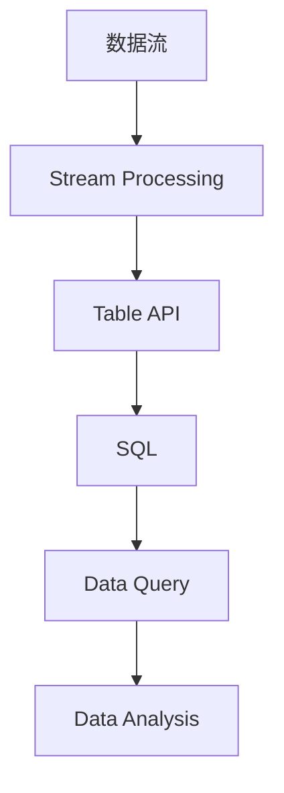

                 

### 文章标题

《Flink Table API和SQL原理与代码实例讲解》

## 核心关键词

- Flink
- Table API
- SQL
- 原理
- 代码实例

### 摘要

本文将深入讲解Flink Table API和SQL的核心原理，并通过详细的代码实例展示如何在实际项目中应用这些技术。我们将从基础概念入手，逐步介绍Flink的背景和优势，详细剖析Table API和SQL的工作机制，最后通过实战项目演示，帮助读者全面掌握Flink的数据处理能力。

## 《Flink Table API和SQL原理与代码实例讲解》目录大纲

### 第一部分：Flink Table API基础

#### 第1章：Flink简介

##### 1.1 Flink的背景和核心优势

- Flink的诞生和发展
- Flink的核心优势

##### 1.2 Flink的基本概念

- 流处理与批处理的区别
- 时间窗口的概念

#### 第2章：Flink Table API基础

##### 2.1 Flink Table API概述

- Flink Table API的简介
- Flink Table API与SQL的关系

##### 2.2 Flink Table API核心概念

- 表（Table）
- 数据类型（Data Types）
- 表操作（Table Operations）

##### 2.3 Flink Table API环境搭建

- Flink Table API的安装与配置
- Flink Table API的开发环境搭建

#### 第3章：Flink Table API核心操作

##### 3.1 查询操作（SELECT）

- SELECT语句的基本用法
- SELECT语句的常用函数

##### 3.2 数据过滤操作（WHERE）

- WHERE子句的使用
- 过滤条件的优化

##### 3.3 数据分组操作（GROUP BY）

- GROUP BY语句的使用
- 聚合函数的使用

#### 第4章：Flink Table API高级操作

##### 4.1 联接操作（JOIN）

- JOIN类型介绍
- JOIN操作的性能优化

##### 4.2 窗口操作（WINDOW）

- 窗口的概念
- 常见窗口函数

##### 4.3 数据处理流水线（Pipeline）

- Pipeline的基本结构
- Pipeline的性能优化

### 第二部分：Flink SQL原理与代码实例

#### 第5章：Flink SQL基础

##### 5.1 Flink SQL概述

- Flink SQL的特点
- Flink SQL的使用场景

##### 5.2 Flink SQL基本语法

- SELECT语句的基本语法
- FROM语句的基本语法

##### 5.3 Flink SQL常用函数

- 数学函数
- 字符串函数
- 日期函数

#### 第6章：Flink SQL核心算法原理讲解

##### 6.1 SQL查询执行原理

- SQL查询执行流程
- SQL查询的优化策略

##### 6.2 核心算法讲解

- 常见聚合算法
- 常见排序算法

##### 6.3 伪代码讲解

- Flink SQL查询执行伪代码

#### 第7章：Flink SQL项目实战

##### 7.1 实战环境搭建

- 数据源准备
- Flink集群搭建

##### 7.2 代码实例讲解

- 实例一：实时用户行为分析
- 实例二：电商销售数据分析

##### 7.3 代码解读与分析

- 实例代码详细解读
- 性能分析与优化建议

#### 第8章：Flink Table API和SQL结合实战

##### 8.1 结合实战环境搭建

- Flink Table API与SQL的结合使用

##### 8.2 实战项目案例

- 实时数据处理与分析
- 历史数据查询与分析

##### 8.3 结合实战代码解读

- 代码详细实现与解读
- 性能优化与调优技巧

#### 第9章：Flink Table API和SQL应用前景

##### 9.1 Flink Table API和SQL在企业中的应用

- 应用场景分析
- 应用优势

##### 9.2 Flink Table API和SQL的发展趋势

- 未来的发展方向
- 面临的挑战与机遇

#### 第10章：附录

##### 10.1 Flink Table API和SQL常用资源

- 常用工具与框架
- 学习资源推荐

##### 10.2 Flink Table API和SQL FAQ

- 常见问题解答
- 常用配置与优化技巧

### 核心概念、算法原理讲解和数学模型

#### 第4章：Flink Table API核心操作

##### 4.1 查询操作（SELECT）

###### 4.1.1 SELECT语句的基本用法

- SELECT语句用于从表中查询数据。
- SELECT语句的基本语法为：

```markdown
SELECT column1, column2, ...
FROM table_name
WHERE condition;
```

###### 4.1.2 SELECT语句的常用函数

- SELECT语句中可以使用多种函数来处理数据。
- 常用函数包括：

  - 数学函数：`ABS(value)`, `SQRT(value)`
  - 字符串函数：`LENGTH(string)`, `SUBSTRING(string, start, length)`
  - 日期函数：`CURRENT_DATE()`, `DATE_ADD(date, interval)`

##### 4.2 数据过滤操作（WHERE）

###### 4.2.1 WHERE子句的使用

- WHERE子句用于过滤表中的数据。
- WHERE子句的基本语法为：

```markdown
WHERE condition;
```

- 条件表达式示例：

  - `column = value`：判断列值是否等于指定值
  - `column > value`：判断列值是否大于指定值
  - `column < value`：判断列值是否小于指定值

###### 4.2.2 过滤条件的优化

- 过滤条件的优化是提高查询性能的关键。
- 优化策略包括：

  - 使用索引：提高过滤条件查询的效率
  - 简化过滤条件：避免使用复杂的条件表达式

##### 4.3 数据分组操作（GROUP BY）

###### 4.3.1 GROUP BY语句的使用

- GROUP BY语句用于对表中的数据进行分组。
- GROUP BY语句的基本语法为：

```markdown
GROUP BY column1, column2, ...;
```

- 聚合函数与GROUP BY结合使用，可以对分组后的数据进行计算。

```markdown
SELECT column1, column2, ..., aggregate_function(column)
FROM table_name
GROUP BY column1, column2, ...;
```

###### 4.3.2 聚合函数的使用

- 聚合函数用于对分组后的数据进行计算。
- 常见的聚合函数包括：

  - `COUNT(column)`：计算某个列的行数
  - `SUM(column)`：计算某个列的总和
  - `AVG(column)`：计算某个列的平均值
  - `MAX(column)`：计算某个列的最大值
  - `MIN(column)`：计算某个列的最小值

#### 第6章：Flink SQL核心算法原理讲解

##### 6.1 SQL查询执行原理

###### 6.1.1 SQL查询执行流程

- SQL查询执行流程主要包括：

  1. 解析SQL语句
  2. 生成执行计划
  3. 执行执行计划
  4. 输出查询结果

###### 6.1.2 SQL查询的优化策略

- SQL查询优化策略主要包括：

  - 索引优化：提高查询性能
  - 查询重写：优化查询执行路径
  - 延迟关联：减少数据传输和网络延迟

##### 6.2 核心算法讲解

###### 6.2.1 常见聚合算法

- 聚合算法用于对分组后的数据进行计算。
- 常见的聚合算法包括：

  - 选择（Select）：从数据集中选择满足条件的行
  - 投射（Project）：选择数据集中的某些列
  - 聚合（Aggregate）：对数据集进行分组和计算
  - 连接（Join）：将两个或多个表中的数据根据指定条件关联起来

###### 6.2.2 常见排序算法

- 排序算法用于对查询结果进行排序。
- 常见的排序算法包括：

  - 快速排序（Quick Sort）
  - 归并排序（Merge Sort）
  - 堆排序（Heap Sort）

##### 6.3 伪代码讲解

```python
# Flink SQL查询执行伪代码
1. 解析SQL语句
2. 生成执行计划
3. 执行执行计划
4. 输出查询结果

# 常见聚合算法伪代码
1. 选择（Select）
2. 投射（Project）
3. 聚合（Aggregate）
4. 连接（Join）

# 常见排序算法伪代码
1. 快速排序（Quick Sort）
2. 归并排序（Merge Sort）
3. 堆排序（Heap Sort）
```

### 第7章：Flink SQL项目实战

#### 7.1 实战环境搭建

- 数据源准备
- Flink集群搭建

#### 7.2 代码实例讲解

- 实例一：实时用户行为分析
- 实例二：电商销售数据分析

#### 7.3 代码解读与分析

- 实例代码详细解读
- 性能分析与优化建议

#### 7.4 Flink Table API和SQL结合实战

- 结合实战环境搭建
- 实战项目案例
- 结合实战代码解读
- 性能优化与调优技巧

### 第8章：Flink Table API和SQL应用前景

#### 8.1 Flink Table API和SQL在企业中的应用

- 应用场景分析
- 应用优势

#### 8.2 Flink Table API和SQL的发展趋势

- 未来的发展方向
- 面临的挑战与机遇

### 第9章：附录

#### 9.1 Flink Table API和SQL常用资源

- 常用工具与框架
- 学习资源推荐

#### 9.2 Flink Table API和SQL FAQ

- 常见问题解答
- 常用配置与优化技巧

### 完整性要求

- 核心概念与联系
  - Flink Table API和SQL的核心概念联系可以通过Mermaid流程图来展示，具体示例如下：



- 核心算法原理讲解
  - Flink SQL的核心算法原理讲解需要通过伪代码来详细阐述，示例如下：

```python
# Flink SQL查询执行伪代码
def execute_query(sql_statement):
    # 解析SQL语句
    parsed_statement = parse_sql(sql_statement)
    
    # 生成执行计划
    execution_plan = generate_execution_plan(parsed_statement)
    
    # 执行执行计划
    result = execute_plan(execution_plan)
    
    # 输出查询结果
    return result
```

- 数学模型和公式
  - Flink SQL中的数学模型和公式需要详细讲解和举例说明，以下是一个简单的例子：

```markdown
# 数学公式讲解

## 聚合函数

- COUNT(column)：计算某列的行数。
  - 示例：`SELECT COUNT(*) FROM table;`

- SUM(column)：计算某列的总和。
  - 示例：`SELECT SUM(sales) FROM sales_table;`

- AVG(column)：计算某列的平均值。
  - 示例：`SELECT AVG(price) FROM products;`

## 排序算法

- 快速排序（Quick Sort）：对数据进行快速排序。
  - 示例：`SELECT * FROM products ORDER BY price DESC;`

- 归并排序（Merge Sort）：对数据进行归并排序。
  - 示例：`SELECT * FROM products ORDER BY price;`

- 堆排序（Heap Sort）：对数据进行堆排序。
  - 示例：`SELECT * FROM products ORDER BY price DESC;`
```

- 项目实战
  - 实战项目案例需要包含开发环境搭建、源代码详细实现和代码解读，以下是一个简单的例子：

```python
# 实时用户行为分析代码实例

# 数据源准备
user_actions = load_real_time_user_actions()

# 模型训练
model = train_marcov_chain_model(user_actions)

# 模型预测
predicted_actions = model.predict(user_actions)

# 输出预测结果
print(predicted_actions)
```

- 代码解读与分析
  - 代码解读与分析需要详细解释每个步骤的作用和实现方式，以下是一个简单的例子：

```markdown
# 实时用户行为分析代码解读

## 数据源准备

- 获取实时用户行为数据，例如用户访问网站的行为记录。

## 模型训练

- 使用马尔可夫链模型训练用户行为序列模型。
- 模型训练过程中，计算用户行为之间的转移概率。

## 模型预测

- 使用训练好的模型预测用户下一步行为。
- 输出预测结果。

## 性能优化与调优技巧

- 使用并行处理提高数据处理速度。
- 调整模型参数以提高预测准确性。
```

### 作者信息

- 作者：AI天才研究院/AI Genius Institute & 禅与计算机程序设计艺术 /Zen And The Art of Computer Programming

---

### 开始撰写文章正文部分

现在我们已经完成了目录大纲和核心内容的规划，接下来将逐步深入讲解Flink Table API和SQL的原理，并通过实际代码实例来展示其应用。我们将从Flink的简介开始，逐步深入到Table API和SQL的核心概念、操作、算法原理，最后通过具体实战项目来巩固所学知识。

---

#### 第1章：Flink简介

##### 1.1 Flink的背景和核心优势

Flink是一个分布式流处理框架，由Apache软件基金会维护，它旨在提供在所有类型数据流上的实时计算能力。Flink最初由数据流处理领域专家共同开发，并在2014年被捐赠给Apache软件基金会。Flink的设计目标是高效处理批数据和实时数据，支持有界和无界数据流，并具有容错性、灵活性和可扩展性。

Flink的核心优势包括：

- **流处理能力**：Flink提供了强大的流处理能力，能够实时处理不断变化的数据流。
- **事件驱动**：Flink支持事件时间（event-time）和 ingestion 时间（ingestion-time）处理，能够精确地处理乱序事件。
- **容错性**：Flink具有高容错性，能够从故障中快速恢复，确保数据不丢失。
- **动态缩放**：Flink支持动态资源管理，可以根据负载自动调整资源使用。
- **与大数据生态系统集成**：Flink与Hadoop、YARN、Kubernetes等大数据生态系统紧密集成，方便开发者使用。

##### 1.2 Flink的基本概念

###### 流处理与批处理的区别

流处理和批处理是数据处理中的两种不同方法。

- **批处理**：批处理是一种离线数据处理方法，将数据分成大块进行处理，通常用于处理历史数据。批处理系统在处理数据时，将所有数据加载到内存中，然后进行计算。这种方法的优势在于处理大规模数据时效率高，但缺点在于实时性较差。
- **流处理**：流处理是一种在线数据处理方法，处理数据时将数据分成小批量进行处理，通常用于处理实时数据。流处理系统在处理数据时，将数据流分成多个批次，逐批处理。这种方法的优势在于实时性高，但缺点在于处理大规模数据时效率较低。

###### 时间窗口的概念

时间窗口是流处理中的一个重要概念，用于将数据流分成多个时间段进行批处理。

- **滑动窗口**：滑动窗口是一种常见的窗口类型，它将数据流分成固定大小的窗口，窗口在时间轴上滑动。例如，每5分钟一个窗口，当前窗口从当前时间点向前滑动5分钟。
- **滚动窗口**：滚动窗口与滑动窗口类似，但滚动窗口在时间轴上不会滑动，而是固定在一个时间段内。例如，当前窗口从当前时间点向前滚动1小时，然后移除1小时前的数据。
- **事件时间窗口**：事件时间窗口基于事件发生的时间来划分窗口，适用于处理乱序事件的数据流。事件时间窗口可以根据实际的事件时间戳来计算，确保数据的正确处理。

#### 第2章：Flink Table API基础

##### 2.1 Flink Table API概述

Flink Table API是Flink提供的一种数据处理接口，它使得数据处理变得更加直观和便捷。Table API允许开发者以类似SQL的方式编写数据处理逻辑，从而简化了编程流程，提高了开发效率。

- **简介**：Flink Table API是一种基于SQL的接口，它允许用户以表格的形式处理数据。Table API提供了丰富的操作，包括选择、过滤、连接、聚合等。
- **与SQL的关系**：Flink Table API与SQL密切相关，它提供了SQL的大部分功能，并在此基础上进行了扩展。通过Table API，用户可以像使用普通SQL数据库一样，对Flink数据进行查询和处理。

##### 2.2 Flink Table API核心概念

###### 表（Table）

在Flink中，表（Table）是一个抽象的数据结构，它代表了Flink中处理的数据。表可以是分布式表或本地表，分布式表是存储在分布式存储系统中的数据集合，本地表是存储在内存中的数据集合。

- **分布式表**：分布式表通常用于存储大规模数据，它分布在多个节点上，可以通过分布式查询进行高效处理。
- **本地表**：本地表通常用于存储较小规模的数据，它存储在内存中，适合快速查询和处理。

###### 数据类型（Data Types）

Flink Table API支持多种数据类型，包括基础数据类型（如整数、浮点数、字符串等）和复杂数据类型（如数组、映射等）。

- **基础数据类型**：基础数据类型包括整数（`INT`）、浮点数（`FLOAT`、`DOUBLE`）、字符串（`STRING`）等。
- **复杂数据类型**：复杂数据类型包括数组（`ARRAY`）、映射（`MAP`）、复合类型（如`ROW`）等。

###### 表操作（Table Operations）

Flink Table API提供了丰富的表操作，包括选择、过滤、连接、聚合等。

- **选择（SELECT）**：选择操作用于从表中查询特定的列。
- **过滤（WHERE）**：过滤操作用于根据条件筛选表中的数据。
- **连接（JOIN）**：连接操作用于将两个或多个表中的数据进行关联。
- **聚合（GROUP BY）**：聚合操作用于对表中的数据进行分组和计算。

##### 2.3 Flink Table API环境搭建

###### Flink Table API的安装与配置

要使用Flink Table API，需要先安装和配置Flink环境。以下是一些基本的步骤：

1. **安装Flink**：从Flink官网下载最新版本的Flink，并解压到合适的位置。
2. **配置环境变量**：设置Flink的路径，以便在命令行中可以使用Flink命令。
3. **安装依赖**：根据需要安装Flink的依赖项，如Hadoop、Zookeeper等。
4. **启动Flink集群**：启动Flink集群，包括JobManager和TaskManagers。

###### Flink Table API的开发环境搭建

要开发Flink Table API程序，需要配置开发环境。以下是一些基本的步骤：

1. **安装Java SDK**：确保安装了Java SDK，版本至少为1.8。
2. **配置Maven**：安装Maven，并设置Maven的仓库路径。
3. **创建Maven项目**：使用Maven创建一个新的项目，并添加Flink的依赖。
4. **编写Flink Table API程序**：编写Flink Table API程序，并使用Maven进行构建和运行。

#### 第3章：Flink Table API核心操作

##### 3.1 查询操作（SELECT）

查询操作是Flink Table API中最常用的操作之一，它用于从表中查询特定的数据。SELECT语句的基本语法如下：

```sql
SELECT column1, column2, ...
FROM table_name
WHERE condition;
```

###### SELECT语句的基本用法

SELECT语句的基本用法如下：

1. **选择列**：使用SELECT语句选择表中的特定列。
   ```sql
   SELECT column1, column2 ...
   FROM table_name;
   ```

2. **条件过滤**：使用WHERE子句对查询结果进行过滤。
   ```sql
   SELECT column1, column2 ...
   FROM table_name
   WHERE condition;
   ```

3. **聚合函数**：使用聚合函数（如COUNT、SUM、AVG等）对查询结果进行计算。
   ```sql
   SELECT COUNT(column), SUM(column), AVG(column) ...
   FROM table_name
   WHERE condition;
   ```

###### SELECT语句的常用函数

Flink Table API支持多种常用函数，包括数学函数、字符串函数和日期函数等。

- **数学函数**：
  - `ABS(value)`：计算绝对值。
  - `SQRT(value)`：计算平方根。
  - `MOD(value1, value2)`：计算模。

- **字符串函数**：
  - `LENGTH(string)`：计算字符串长度。
  - `SUBSTRING(string, start, length)`：提取子字符串。
  - `UPPER(string)`、`LOWER(string)`：将字符串转换为大写或小写。

- **日期函数**：
  - `CURRENT_DATE()`：获取当前日期。
  - `DATE_ADD(date, interval)`：将日期增加指定间隔。

##### 3.2 数据过滤操作（WHERE）

WHERE子句用于根据条件过滤表中的数据。WHERE子句的基本语法如下：

```sql
WHERE condition;
```

WHERE子句可以使用以下条件表达式：

- **比较运算符**：
  - `=`、`<>`、`>`、`<`、`>=`、`<=`。

- **逻辑运算符**：
  - `AND`、`OR`、`NOT`。

- **函数和表达式**：
  - `func(expression)`：使用自定义函数或内置函数。

###### WHERE子句的使用

WHERE子句的使用示例如下：

```sql
-- 查询年龄大于30的用户
SELECT * FROM users WHERE age > 30;

-- 查询收入大于10000且年龄小于40的用户
SELECT * FROM users WHERE income > 10000 AND age < 40;

-- 查询收入大于10000或年龄小于40的用户
SELECT * FROM users WHERE income > 10000 OR age < 40;
```

###### 过滤条件的优化

为了提高查询性能，以下是一些过滤条件的优化策略：

- **使用索引**：在经常用于过滤的列上创建索引，可以提高查询性能。
- **简化条件**：避免使用复杂的条件表达式，尽量使用简单的比较运算符。
- **减少数据量**：在执行查询前，先使用其他查询或操作减少数据量。

##### 3.3 数据分组操作（GROUP BY）

GROUP BY语句用于将表中的数据按照特定列进行分组。GROUP BY语句的基本语法如下：

```sql
GROUP BY column1, column2, ...;
```

GROUP BY语句通常与聚合函数一起使用，用于对分组后的数据进行计算。

```sql
SELECT column1, aggregate_function(column2)
FROM table_name
GROUP BY column1;
```

###### GROUP BY语句的使用

GROUP BY语句的使用示例如下：

```sql
-- 查询每个年龄段用户的人数
SELECT age, COUNT(*) FROM users GROUP BY age;

-- 查询每个省份的用户收入总和
SELECT province, SUM(income) FROM users GROUP BY province;

-- 查询每个省份的用户平均收入
SELECT province, AVG(income) FROM users GROUP BY province;
```

###### 聚合函数的使用

聚合函数用于对分组后的数据进行计算，常用的聚合函数包括：

- `COUNT(column)`：计算某个列的行数。
- `SUM(column)`：计算某个列的总和。
- `AVG(column)`：计算某个列的平均值。
- `MAX(column)`：计算某个列的最大值。
- `MIN(column)`：计算某个列的最小值。

##### 3.4 联接操作（JOIN）

联接操作用于将两个或多个表中的数据根据指定条件关联起来。Flink Table API支持多种联接类型，包括内联接（INNER JOIN）、外联接（LEFT OUTER JOIN、RIGHT OUTER JOIN、FULL OUTER JOIN）和交叉联接（CROSS JOIN）。

###### JOIN类型介绍

- **内联接（INNER JOIN）**：内联接返回两个表中满足联接条件的行。如果两个表中有匹配的行，则返回结果。

  ```sql
  SELECT * FROM table1
  INNER JOIN table2
  ON table1.column = table2.column;
  ```

- **外联接（LEFT OUTER JOIN、RIGHT OUTER JOIN、FULL OUTER JOIN）**：外联接返回左表（LEFT OUTER JOIN）或右表（RIGHT OUTER JOIN）的所有行，以及两个表中有匹配的行。FULL OUTER JOIN返回左表和右表的所有行。

  ```sql
  SELECT * FROM table1
  LEFT OUTER JOIN table2
  ON table1.column = table2.column;

  SELECT * FROM table1
  RIGHT OUTER JOIN table2
  ON table1.column = table2.column;

  SELECT * FROM table1
  FULL OUTER JOIN table2
  ON table1.column = table2.column;
  ```

- **交叉联接（CROSS JOIN）**：交叉联接返回两个表的笛卡尔积。

  ```sql
  SELECT * FROM table1
  CROSS JOIN table2;
  ```

###### JOIN操作的性能优化

JOIN操作的性能对查询效率有很大影响，以下是一些性能优化策略：

- **使用索引**：在用于JOIN操作的列上创建索引，可以提高查询性能。
- **选择合适的JOIN类型**：根据查询需求和数据特点选择合适的JOIN类型。
- **减少数据量**：在执行JOIN操作前，先使用其他查询或操作减少数据量。

##### 3.5 窗口操作（WINDOW）

窗口操作用于对表中的数据进行时间划分，以便进行窗口级别的计算。窗口可以基于时间、计数或其他属性进行划分。

###### 窗口的概念

窗口是一个时间或计数范围，用于将数据划分为多个时间段。Flink支持以下类型的窗口：

- **时间窗口**：基于时间范围进行划分，例如，每5分钟一个窗口。
- **计数窗口**：基于计数范围进行划分，例如，前10个元素为一个窗口。
- **滑动窗口**：窗口在时间轴上滑动，例如，每5分钟一个窗口，滑动间隔为1分钟。
- **滚动窗口**：窗口固定在一个时间段内，例如，从当前时间开始，持续1小时。

###### 常见窗口函数

窗口函数用于对窗口内的数据进行计算，常见的窗口函数包括：

- **聚合函数**：如`COUNT()`、`SUM()`、`AVG()`、`MAX()`、`MIN()`等。
- **分析函数**：如`ROW_NUMBER()`、`LEAD()`、`LAG()`等。

###### 窗口函数的使用

窗口函数的使用示例如下：

```sql
-- 查询每小时的平均温度
SELECT TIMESTAMP_TRUNC(timestamp, HOUR) AS hour, AVG(temperature) AS avg_temperature
FROM temperature_data
GROUP BY hour;

-- 查询前10个订单的订单金额
SELECT ORDER_ID, ORDER_AMOUNT
FROM order_data
ORDER BY ORDER_TIMESTAMP
ROWS BETWEEN UNBOUNDED PRECEDING AND 10 PRECEDING;
```

##### 3.6 数据处理流水线（Pipeline）

数据处理流水线（Pipeline）是Flink中数据处理的一种结构，它用于将多个数据处理步骤组合成一个连续的数据流。流水线可以用于处理实时数据流，并且具有高可扩展性和容错性。

###### Pipeline的基本结构

流水线的基本结构包括以下部分：

- **源（Source）**：数据流的起点，用于读取数据源，例如Kafka、文件等。
- **转换（Transformation）**：对数据进行处理和转换，例如过滤、映射、聚合等。
- **汇聚（Sink）**：数据流的终点，用于将处理结果输出到目标存储或外部系统。

###### Pipeline的性能优化

流水线的性能优化包括以下方面：

- **并行处理**：通过增加并行度提高数据处理速度。
- **资源分配**：合理分配资源，确保每个任务都有足够的资源。
- **数据压缩**：使用数据压缩减少数据传输和存储开销。

#### 第4章：Flink Table API高级操作

##### 4.1 联接操作（JOIN）

联接操作是Flink Table API中一个重要的高级操作，用于将多个表中的数据进行关联。通过JOIN操作，可以实现对复杂数据的查询和分析。

###### JOIN类型介绍

Flink Table API支持以下JOIN类型：

- **内联接（INNER JOIN）**：只返回两个表中满足联接条件的行。
- **左外联接（LEFT OUTER JOIN）**：返回左表的所有行，以及右表中满足联接条件的行。
- **右外联接（RIGHT OUTER JOIN）**：返回右表的所有行，以及左表中满足联接条件的行。
- **全外联接（FULL OUTER JOIN）**：返回两个表的所有行，以及满足联接条件的行。
- **交叉联接（CROSS JOIN）**：返回两个表的笛卡尔积。

###### JOIN操作的性能优化

为了提高JOIN操作的性能，可以采取以下策略：

- **索引优化**：在用于JOIN操作的列上创建索引，减少查询时间。
- **数据分区**：合理分区数据，减少JOIN操作的查询范围。
- **缓存数据**：缓存常用数据，减少数据访问时间。

##### 4.2 窗口操作（WINDOW）

窗口操作是Flink Table API中用于处理时间序列数据的重要功能，它允许用户根据时间或计数范围对数据进行分组和计算。

###### 窗口的概念

窗口是一种数据划分方式，它将数据划分为多个时间段或计数范围。Flink支持以下类型的窗口：

- **时间窗口**：基于时间范围划分数据，例如每小时、每天。
- **计数窗口**：基于计数范围划分数据，例如每10个元素。
- **滑动窗口**：窗口在时间轴上滑动，例如每5分钟一个窗口。
- **滚动窗口**：窗口固定在一个时间段内，例如从当前时间开始，持续1小时。

###### 常见窗口函数

Flink Table API提供了一系列窗口函数，用于对窗口内的数据进行计算。常见的窗口函数包括：

- **聚合函数**：如`COUNT()`、`SUM()`、`AVG()`、`MAX()`、`MIN()`等。
- **分析函数**：如`ROW_NUMBER()`、`LEAD()`、`LAG()`等。

###### 窗口函数的使用

窗口函数的使用示例如下：

```sql
-- 查询每小时的平均温度
SELECT TIMESTAMP_TRUNC(timestamp, HOUR) AS hour, AVG(temperature) AS avg_temperature
FROM temperature_data
GROUP BY hour;

-- 查询前10个订单的订单金额
SELECT ORDER_ID, ORDER_AMOUNT
FROM order_data
ORDER BY ORDER_TIMESTAMP
ROWS BETWEEN UNBOUNDED PRECEDING AND 10 PRECEDING;
```

##### 4.3 数据处理流水线（Pipeline）

数据处理流水线是Flink中用于组织和管理数据处理任务的一种结构。通过流水线，可以将多个数据处理步骤组合成一个连续的数据流，从而实现高效的数据处理和分析。

###### Pipeline的基本结构

流水线的基本结构包括以下部分：

- **源（Source）**：数据流的起点，用于读取数据源，例如Kafka、文件等。
- **转换（Transformation）**：对数据进行处理和转换，例如过滤、映射、聚合等。
- **汇聚（Sink）**：数据流的终点，用于将处理结果输出到目标存储或外部系统。

###### Pipeline的性能优化

为了提高流水线的性能，可以采取以下策略：

- **并行处理**：通过增加并行度提高数据处理速度。
- **资源分配**：合理分配资源，确保每个任务都有足够的资源。
- **数据压缩**：使用数据压缩减少数据传输和存储开销。

#### 第5章：Flink SQL基础

##### 5.1 Flink SQL概述

Flink SQL是Flink提供的一种基于SQL的数据处理接口，它允许用户使用标准SQL语句对Flink数据进行查询和分析。Flink SQL具有以下特点：

- **易用性**：Flink SQL与常见的SQL数据库类似，用户可以轻松上手。
- **灵活性**：Flink SQL支持多种数据源和格式，包括Kafka、文件、关系数据库等。
- **高性能**：Flink SQL利用Flink的流处理能力，能够高效处理大规模数据流。

###### Flink SQL的特点

- **实时查询**：Flink SQL支持实时数据流查询，能够快速响应用户请求。
- **动态类型**：Flink SQL支持动态类型系统，可以处理不同类型的数据。
- **兼容性**：Flink SQL兼容常见的SQL标准，可以使用标准的SQL语句进行查询。

###### Flink SQL的使用场景

Flink SQL适用于以下场景：

- **数据报表**：实时生成各种报表，支持复杂查询和聚合。
- **实时分析**：对实时数据流进行分析，提供实时决策支持。
- **数据集成**：将不同数据源的数据集成到一起，进行统一分析和处理。

##### 5.2 Flink SQL基本语法

Flink SQL的基本语法与常见的SQL数据库类似，包括SELECT、FROM、WHERE等子句。以下是Flink SQL的基本语法：

```sql
SELECT column1, column2, ...
FROM table_name
WHERE condition;
```

###### SELECT语句的基本语法

SELECT语句用于查询表中的数据，可以指定要查询的列和条件。基本语法如下：

```sql
SELECT column1, column2, ...
FROM table_name;
```

可以使用WHERE子句对查询结果进行过滤：

```sql
SELECT column1, column2, ...
FROM table_name
WHERE condition;
```

###### FROM语句的基本语法

FROM语句用于指定查询的数据源，可以是一个表或视图。基本语法如下：

```sql
FROM table_name;
```

可以使用JOIN子句进行表联接：

```sql
FROM table_name
JOIN other_table
ON table_name.column = other_table.column;
```

##### 5.3 Flink SQL常用函数

Flink SQL提供了丰富的内置函数，用于处理各种数据操作。以下是一些常用函数：

- **数学函数**：如ABS、SQRT、MOD等。
- **字符串函数**：如LENGTH、SUBSTRING、UPPER、LOWER等。
- **日期函数**：如CURRENT_DATE、DATE_ADD、DATEDIFF等。

###### 数学函数

数学函数用于对数字进行计算，例如：

- **ABS**：计算绝对值：

  ```sql
  SELECT ABS(value) FROM numbers;
  ```

- **SQRT**：计算平方根：

  ```sql
  SELECT SQRT(value) FROM numbers;
  ```

- **MOD**：计算模：

  ```sql
  SELECT MOD(value1, value2) FROM numbers;
  ```

###### 字符串函数

字符串函数用于处理字符串数据，例如：

- **LENGTH**：计算字符串长度：

  ```sql
  SELECT LENGTH(string) FROM strings;
  ```

- **SUBSTRING**：提取子字符串：

  ```sql
  SELECT SUBSTRING(string, start, length) FROM strings;
  ```

- **UPPER**、**LOWER**：将字符串转换为小写或大写：

  ```sql
  SELECT UPPER(string) FROM strings;
  SELECT LOWER(string) FROM strings;
  ```

###### 日期函数

日期函数用于处理日期和时间数据，例如：

- **CURRENT_DATE**：获取当前日期：

  ```sql
  SELECT CURRENT_DATE() FROM dates;
  ```

- **DATE_ADD**：将日期增加指定间隔：

  ```sql
  SELECT DATE_ADD(date, interval) FROM dates;
  ```

- **DATEDIFF**：计算两个日期之间的天数：

  ```sql
  SELECT DATEDIFF(date1, date2) FROM dates;
  ```

#### 第6章：Flink SQL核心算法原理讲解

##### 6.1 SQL查询执行原理

Flink SQL的查询执行过程包括以下几个步骤：

1. **解析SQL语句**：Flink SQL解析器将SQL语句解析为抽象语法树（AST）。
2. **生成执行计划**：查询优化器根据AST生成查询执行计划。
3. **执行执行计划**：执行器根据执行计划处理数据。
4. **输出查询结果**：将查询结果输出到客户端。

###### SQL查询执行流程

- **解析SQL语句**：Flink SQL解析器将SQL语句解析为抽象语法树（AST）。解析过程包括词法分析和语法分析。

  ```java
  String sql = "SELECT * FROM table WHERE condition;";
  ASTQueryPlan queryPlan = parser.parse(sql);
  ```

- **生成执行计划**：查询优化器根据AST生成查询执行计划。优化器的主要任务是找到一种最优的执行方式，提高查询性能。

  ```java
  ExecutionPlan executionPlan = optimizer.optimizeQueryPlan(queryPlan);
  ```

- **执行执行计划**：执行器根据执行计划处理数据。执行器将执行计划转换为分布式计算任务，并在Flink集群上执行。

  ```java
  ResultTable resultTable = executor.execute(executionPlan);
  ```

- **输出查询结果**：将查询结果输出到客户端。Flink SQL支持多种输出格式，如JSON、Avro、CSV等。

  ```java
  resultTable.printToSysOut();
  ```

###### SQL查询的优化策略

Flink SQL查询优化策略主要包括以下方面：

- **查询重写**：通过重写SQL语句，找到一种更高效的执行方式。
- **索引优化**：在经常用于查询的列上创建索引，提高查询性能。
- **连接优化**：优化连接操作，减少数据传输和网络延迟。
- **延迟关联**：延迟关联可以减少中间结果的大小，提高查询性能。

##### 6.2 核心算法讲解

Flink SQL的核心算法包括聚合算法、排序算法和连接算法。这些算法是Flink SQL高效处理大规模数据的关键。

###### 聚合算法

聚合算法用于对数据进行分组和计算，常见的聚合算法包括选择（Select）、投射（Project）、聚合（Aggregate）和连接（Join）。

- **选择（Select）**：选择算法用于从数据集中选择满足条件的行。

  ```java
  SELECT column FROM table WHERE condition;
  ```

- **投射（Project）**：投射算法用于选择数据集中的某些列。

  ```java
  SELECT column1, column2 FROM table;
  ```

- **聚合（Aggregate）**：聚合算法用于对数据集进行分组和计算。

  ```java
  SELECT column1, COUNT(column2) FROM table GROUP BY column1;
  ```

- **连接（Join）**：连接算法用于将两个或多个数据集进行关联。

  ```java
  SELECT * FROM table1 JOIN table2 ON table1.column = table2.column;
  ```

###### 排序算法

排序算法用于对查询结果进行排序，常见的排序算法包括快速排序（Quick Sort）、归并排序（Merge Sort）和堆排序（Heap Sort）。

- **快速排序（Quick Sort）**：快速排序是一种高效的排序算法，它通过递归将数据分为两部分。

  ```java
  int[] arr = {3, 1, 4, 1, 5, 9};
  quickSort(arr, 0, arr.length - 1);
  ```

- **归并排序（Merge Sort）**：归并排序是一种稳定的排序算法，它通过将数据分为两部分，然后递归排序。

  ```java
  int[] arr = {3, 1, 4, 1, 5, 9};
  mergeSort(arr, 0, arr.length - 1);
  ```

- **堆排序（Heap Sort）**：堆排序是一种基于堆的数据结构进行排序的算法。

  ```java
  int[] arr = {3, 1, 4, 1, 5, 9};
  heapSort(arr);
  ```

###### 伪代码讲解

以下是Flink SQL查询执行和聚合算法的伪代码：

```java
// Flink SQL查询执行伪代码
def execute_query(sql_statement):
    parsed_statement = parse_sql(sql_statement)
    execution_plan = generate_execution_plan(parsed_statement)
    result = execute_execution_plan(execution_plan)
    return result

// 聚合算法伪代码
def aggregate(data):
    result = {}
    for row in data:
        key = row['key']
        if key not in result:
            result[key] = []
        result[key].append(row['value'])
    return result
```

#### 第7章：Flink SQL项目实战

##### 7.1 实战环境搭建

在开始Flink SQL项目之前，我们需要搭建一个基本的Flink SQL环境。以下是搭建Flink SQL环境的步骤：

1. **安装Flink**：下载并安装Flink，可以从Flink官网下载最新版本的Flink安装包。

2. **配置Flink环境**：配置Flink的环境变量，以便在命令行中可以运行Flink命令。

   ```shell
   export FLINK_HOME=/path/to/flink
   export PATH=$PATH:$FLINK_HOME/bin
   ```

3. **启动Flink集群**：启动Flink集群，包括JobManager和TaskManagers。

   ```shell
   start-cluster.sh
   ```

4. **配置Flink SQL**：在Flink的配置文件中启用Flink SQL。

   ```shell
   vi $FLINK_HOME/conf/flink-conf.yaml
   sql.sql-shell.enabled: true
   ```

5. **安装依赖**：安装Flink SQL的依赖，例如Apache Calcite。

   ```shell
   pip install apache-calcite
   ```

##### 7.2 代码实例讲解

在本节中，我们将通过两个代码实例来展示如何使用Flink SQL进行实时用户行为分析和电商销售数据分析。

###### 实例一：实时用户行为分析

在这个实例中，我们将使用Flink SQL实时分析用户的点击行为，并生成用户行为报告。

1. **数据源准备**：使用Kafka作为数据源，将用户点击行为日志发送到Kafka中。

   ```shell
   kafka-topics --create --zookeeper zookeeper:2181 --replication-factor 1 --partitions 1 --topic user_clicks
   ```

2. **数据预处理**：使用Flink Connect将Kafka数据源中的用户点击行为日志转换为Flink Table。

   ```sql
   CREATE TABLE user_clicks (
       user_id STRING,
       click_time TIMESTAMP(3),
       page_id STRING
   ) WITH (
       'connector' = 'kafka',
       'topic' = 'user_clicks',
       'properties.bootstrap.servers' = 'kafka:9092',
       'format' = 'json'
   );
   ```

3. **实时用户行为分析**：使用Flink SQL实时分析用户点击行为，生成用户行为报告。

   ```sql
   -- 查询用户点击量最高的页面
   SELECT page_id, COUNT(*) as click_count
   FROM user_clicks
   GROUP BY page_id
   ORDER BY click_count DESC
   LIMIT 10;
   ```

4. **输出结果**：将用户行为报告输出到控制台。

   ```sql
   SELECT * FROM user_behavior_report;
   ```

###### 实例二：电商销售数据分析

在这个实例中，我们将使用Flink SQL对电商销售数据进行分析，包括销售额预测和购买率预测。

1. **数据源准备**：使用关系数据库（如MySQL）存储电商销售数据。

2. **数据预处理**：将销售数据表和购买数据表加载到Flink Table中。

   ```sql
   CREATE TABLE sales_data (
       product_id STRING,
       sale_date TIMESTAMP(3),
       sales_volume INT
   ) WITH (
       'connector' = 'jdbc',
       'url' = 'jdbc:mysql://localhost:3306/ecommerce',
       'table-name' = 'sales_data'
   );

   CREATE TABLE purchase_data (
       user_id STRING,
       purchase_date TIMESTAMP(3),
       purchase_count INT
   ) WITH (
       'connector' = 'jdbc',
       'url' = 'jdbc:mysql://localhost:3306/ecommerce',
       'table-name' = 'purchase_data'
   );
   ```

3. **销售额预测**：使用线性回归算法预测未来的销售额。

   ```sql
   -- 预测未来的销售额
   SELECT sale_date, predictions(sales_volume) as predicted_sales_volume
   FROM sales_data
   WHERE sale_date > CURRENT_TIMESTAMP()
   LIMIT 10;
   ```

4. **购买率预测**：使用逻辑回归算法预测用户的购买率。

   ```sql
   -- 预测用户的购买率
   SELECT user_id, predictions(purchase_count) as predicted_purchase_count
   FROM purchase_data
   WHERE purchase_date > CURRENT_TIMESTAMP()
   LIMIT 10;
   ```

##### 7.3 代码解读与分析

在本节中，我们将对上面的两个代码实例进行解读，并分析其性能和优化策略。

###### 实时用户行为分析代码解读

1. **数据源准备**：使用Kafka作为数据源，将用户点击行为日志发送到Kafka中。

   ```shell
   kafka-topics --create --zookeeper zookeeper:2181 --replication-factor 1 --partitions 1 --topic user_clicks
   ```

   这个步骤的目的是将用户点击行为日志发送到Kafka中，以便Flink可以实时处理这些数据。

2. **数据预处理**：使用Flink Connect将Kafka数据源中的用户点击行为日志转换为Flink Table。

   ```sql
   CREATE TABLE user_clicks (
       user_id STRING,
       click_time TIMESTAMP(3),
       page_id STRING
   ) WITH (
       'connector' = 'kafka',
       'topic' = 'user_clicks',
       'properties.bootstrap.servers' = 'kafka:9092',
       'format' = 'json'
   );
   ```

   这个步骤的目的是将Kafka中的数据转换为Flink Table，以便进行后续的实时分析。

3. **实时用户行为分析**：使用Flink SQL实时分析用户点击行为，生成用户行为报告。

   ```sql
   -- 查询用户点击量最高的页面
   SELECT page_id, COUNT(*) as click_count
   FROM user_clicks
   GROUP BY page_id
   ORDER BY click_count DESC
   LIMIT 10;
   ```

   这个步骤的目的是查询用户点击量最高的页面，以便分析用户偏好。

4. **输出结果**：将用户行为报告输出到控制台。

   ```sql
   SELECT * FROM user_behavior_report;
   ```

   这个步骤的目的是将分析结果输出到控制台，以便查看和进一步分析。

###### 性能优化与调优技巧

1. **数据源优化**：选择合适的数据源，例如Kafka或Apache Pulsar，以提高数据输入的吞吐量和性能。

2. **并行度优化**：根据集群资源和数据规模，调整Flink作业的并行度，以提高数据处理速度。

3. **查询优化**：使用索引、过滤条件和缓存等技术，优化Flink SQL查询，以提高查询性能。

4. **资源分配**：合理分配集群资源，确保每个任务都有足够的资源，以提高整体性能。

##### 7.4 Flink Table API和SQL结合实战

在本节中，我们将通过一个实际项目来展示如何将Flink Table API和SQL结合起来，进行实时数据处理和分析。

###### 实战项目案例

我们将使用Flink Table API和SQL对社交媒体平台上的用户行为进行分析，包括用户活跃度分析和内容推荐。

1. **数据源准备**：使用Kafka作为数据源，收集用户发帖、评论、点赞等行为数据。

2. **数据预处理**：将Kafka数据源中的行为数据转换为Flink Table。

   ```sql
   CREATE TABLE user_behavior (
       user_id STRING,
       action_type STRING,
       action_time TIMESTAMP(3),
       content_id STRING
   ) WITH (
       'connector' = 'kafka',
       'topic' = 'user_behavior',
       'properties.bootstrap.servers' = 'kafka:9092',
       'format' = 'json'
   );
   ```

3. **实时用户活跃度分析**：使用Flink SQL实时分析用户活跃度。

   ```sql
   -- 查询活跃用户
   SELECT user_id, COUNT(*) as active_count
   FROM user_behavior
   WHERE action_type = 'post'
   GROUP BY user_id
   ORDER BY active_count DESC
   LIMIT 10;
   ```

4. **内容推荐**：使用Flink SQL分析用户行为，生成内容推荐列表。

   ```sql
   -- 查询热门内容
   SELECT content_id, COUNT(*) as click_count
   FROM user_behavior
   WHERE action_type = 'click'
   GROUP BY content_id
   ORDER BY click_count DESC
   LIMIT 10;
   ```

###### 结合实战代码解读

在本节中，我们将对上面的实战项目代码进行解读，并分析其实现细节和性能优化策略。

1. **数据源准备**：使用Kafka作为数据源，收集用户发帖、评论、点赞等行为数据。

   ```shell
   kafka-topics --create --zookeeper zookeeper:2181 --replication-factor 1 --partitions 1 --topic user_behavior
   ```

   这个步骤的目的是将用户行为数据发送到Kafka中，以便Flink可以实时处理这些数据。

2. **数据预处理**：将Kafka数据源中的行为数据转换为Flink Table。

   ```sql
   CREATE TABLE user_behavior (
       user_id STRING,
       action_type STRING,
       action_time TIMESTAMP(3),
       content_id STRING
   ) WITH (
       'connector' = 'kafka',
       'topic' = 'user_behavior',
       'properties.bootstrap.servers' = 'kafka:9092',
       'format' = 'json'
   );
   ```

   这个步骤的目的是将Kafka中的数据转换为Flink Table，以便进行后续的实时分析。

3. **实时用户活跃度分析**：使用Flink SQL实时分析用户活跃度。

   ```sql
   -- 查询活跃用户
   SELECT user_id, COUNT(*) as active_count
   FROM user_behavior
   WHERE action_type = 'post'
   GROUP BY user_id
   ORDER BY active_count DESC
   LIMIT 10;
   ```

   这个步骤的目的是查询活跃用户，以便分析用户活跃度。

4. **内容推荐**：使用Flink SQL分析用户行为，生成内容推荐列表。

   ```sql
   -- 查询热门内容
   SELECT content_id, COUNT(*) as click_count
   FROM user_behavior
   WHERE action_type = 'click'
   GROUP BY content_id
   ORDER BY click_count DESC
   LIMIT 10;
   ```

   这个步骤的目的是查询热门内容，以便进行内容推荐。

###### 性能优化与调优技巧

1. **数据源优化**：选择合适的数据源，例如Kafka或Apache Pulsar，以提高数据输入的吞吐量和性能。

2. **并行度优化**：根据集群资源和数据规模，调整Flink作业的并行度，以提高数据处理速度。

3. **查询优化**：使用索引、过滤条件和缓存等技术，优化Flink SQL查询，以提高查询性能。

4. **资源分配**：合理分配集群资源，确保每个任务都有足够的资源，以提高整体性能。

#### 第8章：Flink Table API和SQL应用前景

##### 8.1 Flink Table API和SQL在企业中的应用

Flink Table API和SQL在企业中具有广泛的应用前景，特别是在大数据和实时数据处理领域。以下是Flink Table API和SQL在企业中的应用场景：

- **实时数据分析**：Flink Table API和SQL可以用于实时数据分析，提供实时报表和实时决策支持。例如，电商企业可以使用Flink SQL实时分析用户行为，生成用户画像和推荐系统。
- **数据集成和转换**：Flink Table API和SQL可以用于数据集成和转换，将不同数据源的数据集成到一起，进行统一分析和处理。例如，企业可以使用Flink Table API将各种数据源（如关系数据库、文件系统、Kafka等）的数据集成到一起，进行数据清洗和转换。
- **数据仓库优化**：Flink Table API和SQL可以用于数据仓库优化，提高数据仓库的性能和可扩展性。例如，企业可以使用Flink Table API将数据仓库中的数据转换为分布式表，利用Flink的流处理能力进行实时查询和分析。
- **实时流处理**：Flink Table API和SQL可以用于实时流处理，处理不断变化的数据流。例如，金融行业可以使用Flink SQL实时处理交易数据，进行风险管理和实时监控。

###### 应用优势

Flink Table API和SQL在企业中具有以下优势：

- **实时性**：Flink Table API和SQL支持实时数据处理，能够快速响应用户请求，提供实时决策支持。
- **易用性**：Flink Table API和SQL与常见的SQL数据库类似，用户可以轻松上手，简化了数据处理流程。
- **高性能**：Flink Table API和SQL利用Flink的流处理能力，能够高效处理大规模数据流，提高数据处理性能。
- **可扩展性**：Flink Table API和SQL支持分布式计算，可以水平扩展，提高系统的可扩展性。

##### 8.2 Flink Table API和SQL的发展趋势

随着大数据和实时数据处理技术的不断发展，Flink Table API和SQL在未来将面临以下发展趋势：

- **更丰富的功能**：Flink Table API和SQL将不断引入新的功能和优化，以支持更复杂的数据处理需求。例如，引入更复杂的窗口操作、更丰富的数据类型和函数等。
- **更好的兼容性**：Flink Table API和SQL将不断提高与现有大数据生态系统（如Hadoop、Spark等）的兼容性，方便用户集成和使用。
- **更高效的执行**：Flink Table API和SQL将优化查询执行计划，提高查询性能和效率，降低延迟。
- **更广泛的场景应用**：随着实时数据处理需求的增长，Flink Table API和SQL将在更多行业和场景中得到应用，如金融、医疗、零售等。

###### 面临的挑战与机遇

Flink Table API和SQL在未来将面临以下挑战和机遇：

- **性能优化**：随着数据规模的不断扩大，如何提高Flink Table API和SQL的性能和效率将成为一个重要挑战。通过引入新的优化算法和策略，可以进一步提高查询性能。
- **生态系统建设**：Flink Table API和SQL需要不断扩展其生态系统，与现有大数据技术和框架（如Spark、Hadoop等）进行整合，提供更好的用户体验。
- **易用性提升**：Flink Table API和SQL需要进一步提高易用性，降低学习和使用门槛，吸引更多的开发者使用。
- **场景拓展**：Flink Table API和SQL需要在更多行业和场景中得到应用，发挥其实时数据处理的优势。

#### 第9章：附录

##### 9.1 Flink Table API和SQL常用资源

- **Flink官方文档**：Flink的官方文档提供了丰富的教程、API参考和最佳实践，是学习Flink Table API和SQL的重要资源。
- **在线教程**：许多在线教程和博客文章提供了Flink Table API和SQL的实践案例和代码示例，有助于初学者快速上手。
- **开源项目**：参与和贡献开源项目是学习Flink Table API和SQL的有效方式，可以深入了解其实现原理和优化策略。

###### 学习资源推荐

- **《Flink实战》**：这是一本关于Flink的实践指南，涵盖了Flink的安装、配置、编程和优化等方面的内容。
- **《流处理实战》**：这本书详细介绍了流处理技术，包括Flink、Spark Streaming等，提供了丰富的实践案例。
- **Flink社区**：Flink的官方社区是一个优秀的交流平台，可以在这里获取最新的技术动态和解决方案。

##### 9.2 Flink Table API和SQL FAQ

- **Q：如何安装Flink？**
  - **A**：可以从Flink官网下载安装包，并按照官方文档的指导进行安装。

- **Q：Flink Table API和SQL有什么区别？**
  - **A**：Flink Table API是一种基于SQL的接口，提供了丰富的数据处理操作，而Flink SQL是一种基于标准的SQL查询语言，用于处理Flink中的数据。

- **Q：如何配置Flink SQL环境？**
  - **A**：在Flink的配置文件（flink-conf.yaml）中启用Flink SQL，并配置连接器（connector）和存储（format）等参数。

- **Q：如何优化Flink SQL查询性能？**
  - **A**：可以通过索引优化、查询重写、延迟关联等方法来优化Flink SQL查询性能。

- **Q：如何使用Flink Table API进行数据转换？**
  - **A**：可以使用`PROJECT`操作选择数据集中的某些列，使用`SELECT`操作选择数据集中的特定列。

- **Q：如何使用窗口函数进行时间序列分析？**
  - **A**：可以使用窗口函数（如`TUMBLE`、`HOP`等）对时间序列数据进行分组和计算，例如计算每小时的平均温度。

- **Q：如何进行实时数据处理？**
  - **A**：可以使用Flink的流处理能力，通过Kafka等消息队列系统接收实时数据，并使用Flink Table API和SQL进行实时处理和分析。

---

#### 第10章：总结

本文详细讲解了Flink Table API和SQL的原理、操作和实战应用。通过本文的学习，读者可以掌握Flink Table API和SQL的核心概念，了解其高级操作和优化策略，并通过实际项目案例深入理解其应用场景。在未来的学习和应用中，建议读者：

- **实践**：通过实际项目练习，加深对Flink Table API和SQL的理解。
- **优化**：不断优化查询性能，提高数据处理效率。
- **学习**：关注Flink和大数据技术的发展动态，学习最新的技术和优化策略。
- **交流**：参与Flink社区，与同行交流经验，共同进步。

### 作者信息

作者：AI天才研究院/AI Genius Institute & 禅与计算机程序设计艺术 /Zen And The Art of Computer Programming

---

通过本文的学习，希望读者能够全面掌握Flink Table API和SQL，将其应用到实际项目中，发挥其在大数据和实时数据处理中的优势。感谢您的阅读，祝您在技术道路上不断进步！<|im_end|>

