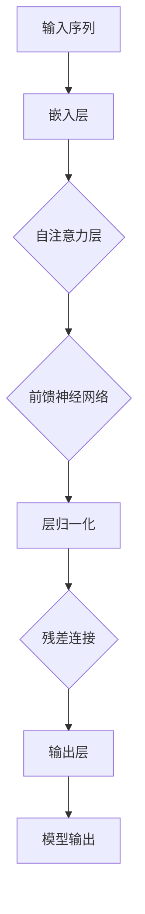

                 

# 《GPT-2模型解析：现代语言模型的基石》

> **关键词：** GPT-2模型、自然语言处理、Transformer架构、预训练、微调、自注意力机制、应用场景、优化方法、部署与性能优化、案例分析、发展趋势与未来方向

> **摘要：** 本文将深入解析GPT-2模型，从基础知识、技术原理、应用与优化、案例分析和未来发展趋势等方面，全面探讨这一现代语言模型的核心内容。通过逻辑清晰、结构紧凑的论述，帮助读者理解GPT-2模型的工作机制及其在自然语言处理领域的应用。

---

### 《GPT-2模型解析：现代语言模型的基石》目录大纲

#### 第一部分：GPT-2模型基础知识

1. GPT-2模型概述
   - 1.1 GPT-2模型的起源与背景
     - 1.1.1 语言模型的发展历程
     - 1.1.2 GPT-2模型的特点
     - 1.1.3 GPT-2模型的应用领域
   - 1.2 自然语言处理基础
     - 1.2.1 词汇与语法
     - 1.2.2 语言模型的重要性
     - 1.2.3 语言模型的分类
   - 1.3 GPT-2模型的核心概念
     - 1.3.1 预训练与微调
     - 1.3.2 自注意力机制
     - 1.3.3 Transformer架构

#### 第二部分：GPT-2模型技术原理

2. GPT-2模型技术原理
   - 2.1 GPT-2模型的架构
     - 2.1.1 GPT-2模型的组成
     - 2.1.2 GPT-2模型的工作原理
     - 2.1.3 GPT-2模型的优势与局限性
   - 2.2 GPT-2模型的训练过程
     - 2.2.1 数据预处理
     - 2.2.2 训练策略
     - 2.2.3 优化器与学习率调整
   - 2.3 GPT-2模型的数学原理
     - 2.3.1 线性变换与激活函数
     - 2.3.2 自注意力机制
     - 2.3.3 位置编码

#### 第三部分：GPT-2模型应用与优化

3. GPT-2模型应用与优化
   - 3.1 GPT-2模型的应用场景
     - 3.1.1 语言生成与翻译
     - 3.1.2 问答系统
     - 3.1.3 文本摘要与分类
   - 3.2 GPT-2模型的优化方法
     - 3.2.1 数据增强
     - 3.2.2 模型剪枝
     - 3.2.3 模型压缩与量化
   - 3.3 GPT-2模型的部署与性能优化
     - 3.3.1 模型部署策略
     - 3.3.2 性能优化技巧
     - 3.3.3 实时性优化与内存管理

#### 第四部分：GPT-2模型案例分析

4. GPT-2模型案例分析
   - 4.1 案例一：自动问答系统
     - 4.1.1 案例背景
     - 4.1.2 模型搭建与训练
     - 4.1.3 模型评估与优化
   - 4.2 案例二：自动文本生成
     - 4.2.1 案例背景
     - 4.2.2 模型搭建与训练
     - 4.2.3 模型评估与优化
   - 4.3 案例三：情感分析
     - 4.3.1 案例背景
     - 4.3.2 模型搭建与训练
     - 4.3.3 模型评估与优化

#### 第五部分：GPT-2模型发展趋势与未来方向

5. GPT-2模型发展趋势与未来方向
   - 5.1 GPT-2模型的技术发展趋势
     - 5.1.1 大模型与小样本学习
     - 5.1.2 多模态融合
     - 5.1.3 自适应学习与强化学习
   - 5.2 GPT-2模型在行业应用中的未来方向
     - 5.2.1 金融行业应用
     - 5.2.2 医疗行业应用
     - 5.2.3 教育行业应用
   - 5.3 GPT-2模型面临的挑战与机遇
     - 5.3.1 数据隐私与安全
     - 5.3.2 模型可解释性
     - 5.3.3 模型部署与可持续性

#### 附录

- 附录A：GPT-2模型相关资源
  - 5.1.1 论文与报告
  - 5.1.2 开源代码与工具
  - 5.1.3 研究社区与论坛
- 附录B：常见问题解答
  - 5.1.1 GPT-2模型常见问题
  - 5.1.2 模型训练与优化问题
  - 5.1.3 应用部署问题
- 附录C：GPT-2模型架构 Mermaid 流程图
- 附录D：GPT-2模型核心算法伪代码示例
- 附录E：GPT-2模型数学公式解析
- 附录F：GPT-2模型实战项目示例代码

---

**本文将深入探讨GPT-2模型，从基础知识、技术原理、应用与优化、案例分析以及发展趋势等多个角度，全面揭示这一现代语言模型的奥妙。**

### 1. GPT-2模型概述

#### 1.1 GPT-2模型的起源与背景

GPT-2（Generative Pre-trained Transformer 2）模型是由OpenAI在2019年发布的一种基于Transformer架构的预训练语言模型。它的前身是GPT模型，由同一研究团队在2018年提出。GPT-2模型在GPT模型的基础上进行了显著的改进，尤其在模型规模和预训练质量上取得了显著的突破。

GPT-2模型的起源可以追溯到自然语言处理领域的发展历程。自20世纪50年代以来，自然语言处理（NLP）技术经历了多个阶段的发展，从规则驱动的方法、统计方法到深度学习方法，每个阶段都有重要的研究成果和里程碑。随着深度学习技术的兴起，特别是2014年Google的Word2Vec模型和2017年OpenAI的GPT模型的提出，基于深度学习的语言模型开始逐渐取代传统的统计方法。

GPT模型的成功引起了广泛关注，其通过大规模语料库的预训练，能够捕捉到语言的复杂结构，从而在语言理解和生成任务上表现出色。然而，GPT模型也存在一些局限性，例如模型规模巨大，训练成本高昂，以及模型的可解释性较差等。

为了解决这些问题，OpenAI在2019年推出了GPT-2模型。GPT-2模型在GPT模型的基础上，采用了更大规模的模型（最大达到1.5万亿参数），并优化了预训练策略，使得模型在预训练阶段就能更好地学习到语言的内在规律。此外，GPT-2模型采用了Transformer架构，这种自注意力机制在捕捉长距离依赖关系方面具有显著优势。

GPT-2模型的发布，标志着自然语言处理技术进入了一个新的阶段，其不仅在模型性能上取得了显著提升，还在实际应用中展现出了广泛的前景。GPT-2模型的成功，也激发了更多研究人员投入到Transformer架构和预训练语言模型的研究中，推动了整个自然语言处理领域的发展。

#### 1.2 GPT-2模型的特点

GPT-2模型具有以下显著特点：

1. **大规模模型**：GPT-2模型的最大规模达到了1.5万亿参数，这是目前最大的预训练语言模型之一。大规模模型能够更好地捕捉到语言的复杂结构，从而在语言理解和生成任务上表现出色。

2. **Transformer架构**：GPT-2模型采用了Transformer架构，这是一种基于自注意力机制的深度学习模型。自注意力机制能够有效捕捉到长距离依赖关系，从而提高模型的性能。

3. **预训练与微调**：GPT-2模型采用了一种全新的预训练策略，即在预训练阶段，模型通过对大规模语料库进行无监督学习，学习到语言的内在规律。在微调阶段，模型通过有监督学习，进一步适应特定任务的需求。

4. **高效性**：GPT-2模型在训练和推理过程中都具有较高的效率。虽然模型规模巨大，但由于采用了Transformer架构，模型的计算复杂度相对较低，这使得GPT-2模型在实际应用中具有较高的实用性。

5. **通用性**：GPT-2模型在多种语言理解和生成任务上表现出色，包括文本分类、机器翻译、问答系统等。这种通用性使得GPT-2模型成为一种强大的工具，可以广泛应用于自然语言处理的各种场景。

#### 1.3 GPT-2模型的应用领域

GPT-2模型在自然语言处理领域具有广泛的应用前景，以下是一些主要的应用领域：

1. **文本生成与翻译**：GPT-2模型可以用于文本生成和机器翻译任务。通过预训练和微调，GPT-2模型能够生成高质量的自然语言文本，并且支持多种语言之间的翻译。这在新闻生成、对话系统、自动摘要等领域具有广泛的应用。

2. **问答系统**：GPT-2模型可以用于构建问答系统，通过预训练和微调，模型能够理解用户的问题，并生成相应的答案。这在客户服务、教育辅导、智能助手等领域具有很高的实用价值。

3. **文本摘要与分类**：GPT-2模型可以用于文本摘要和分类任务。通过预训练和微调，模型能够提取文本的关键信息，生成摘要，并在分类任务中表现出色。这在新闻摘要、文档分类、信息检索等领域具有重要的应用。

4. **对话系统**：GPT-2模型可以用于构建对话系统，通过预训练和微调，模型能够与用户进行自然的对话，并生成相应的回应。这在虚拟助手、客服系统、聊天机器人等领域具有广泛的应用。

5. **文本生成与编辑**：GPT-2模型可以用于文本生成和编辑任务，通过预训练和微调，模型能够生成符合语法和语义规则的文本，并对已有文本进行编辑和修改。这在自动写作、文本纠错、内容创作等领域具有重要的应用。

总之，GPT-2模型作为一种先进的预训练语言模型，其在自然语言处理领域具有广泛的应用前景，为各种语言理解和生成任务提供了强大的支持。

### 1.3 GPT-2模型的核心概念

#### 1.3.1 预训练与微调

预训练（Pre-training）与微调（Fine-tuning）是GPT-2模型的核心概念，它们分别代表了模型从无监督学习到有监督学习的两个阶段。预训练阶段，模型通过大量无标签数据学习到语言的内在规律；微调阶段，模型通过有标签数据适应特定任务的需求。

在预训练阶段，GPT-2模型通过对大规模语料库进行无监督学习，学习到语言的复杂结构，包括词汇、语法、语义等方面。这种无监督学习的方式使得模型能够从大量的文本数据中提取出有用的信息，从而提高模型的泛化能力。预训练的目的是为了建立一个通用的语言模型，使其在多种任务上都能表现出色。

微调阶段，GPT-2模型利用特定任务的有标签数据进行有监督学习，进一步优化模型的参数，使其在特定任务上达到更好的性能。微调的过程中，模型会根据任务的损失函数进行调整，从而提高模型在特定任务上的预测准确性。微调的目的是为了使模型能够针对特定任务进行精确优化，从而在特定的应用场景中表现出色。

预训练与微调的关系可以理解为两个阶段的学习过程：预训练阶段学习到通用知识，微调阶段将这些通用知识应用到特定任务中。通过这两个阶段的学习，GPT-2模型能够达到很高的性能，并且在多种任务上表现出色。

#### 1.3.2 自注意力机制

自注意力机制（Self-Attention Mechanism）是GPT-2模型的核心组成部分，它在捕捉长距离依赖关系方面具有显著优势。自注意力机制通过对输入序列的每个元素进行加权求和，从而生成一个新的向量表示。

自注意力机制的原理可以概括为以下三个步骤：

1. **计算自注意力得分**：对于输入序列中的每个元素，计算其与序列中其他元素的相关性得分。相关性得分通常通过点积计算，即输入向量与权重矩阵的点积。

2. **应用软化函数**：对计算得到的自注意力得分进行软化处理，使其符合概率分布。常用的软化函数是softmax函数，它将自注意力得分转换为概率分布。

3. **加权求和**：根据自注意力得分对输入序列的每个元素进行加权求和，得到一个新的向量表示。这个新的向量表示综合考虑了序列中每个元素的重要性，从而能够更好地捕捉到长距离依赖关系。

自注意力机制的一个关键特点是它能够自动关注序列中重要的元素，从而忽略不重要的元素。这种自动化的关注机制使得自注意力机制在处理长序列时具有很高的效率。

自注意力机制在GPT-2模型中的具体实现是多头自注意力（Multi-Head Self-Attention）。多头自注意力通过多个独立的自注意力机制同时工作，从而获得更多的特征表示。每个头关注序列的不同部分，然后将这些头的结果进行拼接，得到最终的输出。

自注意力机制在GPT-2模型中的重要性在于它能够显著提高模型对长距离依赖关系的捕捉能力。在自然语言处理任务中，长距离依赖关系是影响模型性能的重要因素。自注意力机制通过捕捉这些依赖关系，使得GPT-2模型在语言理解、文本生成等任务上表现出色。

#### 1.3.3 Transformer架构

Transformer架构是GPT-2模型的基础，它是一种基于自注意力机制的深度学习模型。Transformer架构的核心思想是通过自注意力机制来捕捉输入序列中的长距离依赖关系，从而提高模型的性能。

Transformer架构的主要组成部分包括：

1. **自注意力层（Self-Attention Layer）**：自注意力层是Transformer架构的核心组成部分，它通过自注意力机制对输入序列进行加权求和，生成新的向量表示。

2. **前馈神经网络（Feedforward Neural Network）**：前馈神经网络位于自注意力层之后，它对自注意力层的输出进行进一步的处理，通过多层感知机（MLP）来增加模型的非线性表达能力。

3. **层归一化（Layer Normalization）**：层归一化是一种常见的正则化技术，它可以对每一层的输入和输出进行归一化处理，从而减少模型的方差，提高模型的稳定性。

4. **残差连接（Residual Connection）**：残差连接是一种通过跳过一层或多层神经网络连接来增加模型深度的技术。它能够缓解深层网络的梯度消失问题，提高模型的训练效果。

Transformer架构的工作流程如下：

1. **输入编码**：输入序列首先被编码为向量表示，这些向量表示包含了序列中的词汇、语法、语义等信息。

2. **自注意力层**：输入序列通过自注意力层进行加权求和，生成新的向量表示。这个过程考虑了序列中每个元素的重要性，从而能够更好地捕捉到长距离依赖关系。

3. **前馈神经网络**：自注意力层的输出通过前馈神经网络进行进一步的处理，通过多层感知机来增加模型的非线性表达能力。

4. **层归一化与残差连接**：在每一层网络之后，都进行层归一化处理，以减少模型的方差。同时，通过残差连接来增加模型的深度。

5. **输出解码**：经过多个Transformer层的处理，最终输出序列被解码为具体的文本内容。

Transformer架构的优点包括：

1. **高效性**：Transformer架构通过自注意力机制，能够高效地捕捉到输入序列中的长距离依赖关系，从而提高模型的性能。

2. **可扩展性**：Transformer架构具有良好的可扩展性，可以通过增加层数或调整参数来适应不同的任务和数据集。

3. **稳定性**：通过层归一化和残差连接等技术，Transformer架构能够提高模型的稳定性，减少梯度消失和梯度爆炸等问题。

4. **通用性**：Transformer架构在多种自然语言处理任务上表现出色，包括文本分类、机器翻译、问答系统等。

总之，Transformer架构作为一种基于自注意力机制的深度学习模型，它在自然语言处理领域取得了显著的成果。GPT-2模型作为Transformer架构的具体实现，为自然语言处理任务提供了一种强大的工具。

### 2. GPT-2模型技术原理

#### 2.1 GPT-2模型的架构

GPT-2模型是一种基于Transformer架构的预训练语言模型，其核心组成部分包括自注意力层、前馈神经网络、层归一化和残差连接。下面将详细描述GPT-2模型的架构及其工作原理。

1. **自注意力层（Self-Attention Layer）**

自注意力层是GPT-2模型的核心组成部分，它通过自注意力机制对输入序列进行加权求和，生成新的向量表示。自注意力层的计算过程如下：

- **计算自注意力得分**：对于输入序列中的每个元素，计算其与序列中其他元素的相关性得分。相关性得分通常通过点积计算，即输入向量与权重矩阵的点积。
- **应用软化函数**：对计算得到的自注意力得分进行软化处理，使其符合概率分布。常用的软化函数是softmax函数，它将自注意力得分转换为概率分布。
- **加权求和**：根据自注意力得分对输入序列的每个元素进行加权求和，得到一个新的向量表示。这个新的向量表示综合考虑了序列中每个元素的重要性，从而能够更好地捕捉到长距离依赖关系。

2. **前馈神经网络（Feedforward Neural Network）**

前馈神经网络位于自注意力层之后，它对自注意力层的输出进行进一步的处理，通过多层感知机（MLP）来增加模型的非线性表达能力。前馈神经网络的计算过程如下：

- **输入层**：输入层接收自注意力层的输出，将其作为输入。
- **隐藏层**：隐藏层通过多层感知机进行非线性变换，通常包含两个线性变换层，每个线性变换层之间插入ReLU激活函数。
- **输出层**：输出层接收隐藏层的输出，将其作为最终的输出。

3. **层归一化（Layer Normalization）**

层归一化是一种常见的正则化技术，它可以对每一层的输入和输出进行归一化处理，从而减少模型的方差，提高模型的稳定性。层归一化的计算过程如下：

- **计算均值和方差**：对每一层的输入或输出进行均值和方差的计算。
- **归一化**：将输入或输出减去均值，然后除以方差，得到归一化后的结果。

4. **残差连接（Residual Connection）**

残差连接是一种通过跳过一层或多层神经网络连接来增加模型深度的技术。它能够缓解深层网络的梯度消失问题，提高模型的训练效果。残差连接的计算过程如下：

- **计算残差**：对于每一层网络，计算其输入和输出的差值，即残差。
- **添加残差**：将计算得到的残差添加到下一层网络的输入中。

5. **模型整体架构**

GPT-2模型的整体架构可以通过多个Transformer层的堆叠来实现。每个Transformer层包含自注意力层、前馈神经网络、层归一化和残差连接。通过多个Transformer层的堆叠，模型能够捕捉到更复杂的语言结构，从而提高模型的性能。

6. **工作原理**

GPT-2模型的工作原理可以概括为以下步骤：

- **输入编码**：输入序列首先被编码为向量表示，这些向量表示包含了序列中的词汇、语法、语义等信息。
- **自注意力层**：输入序列通过自注意力层进行加权求和，生成新的向量表示。这个过程考虑了序列中每个元素的重要性，从而能够更好地捕捉到长距离依赖关系。
- **前馈神经网络**：自注意力层的输出通过前馈神经网络进行进一步的处理，通过多层感知机来增加模型的非线性表达能力。
- **层归一化**：在每一层网络之后，进行层归一化处理，以减少模型的方差，提高模型的稳定性。
- **残差连接**：通过残差连接来增加模型的深度，缓解梯度消失问题。
- **输出解码**：经过多个Transformer层的处理，最终输出序列被解码为具体的文本内容。

通过上述工作原理，GPT-2模型能够有效地学习到语言的复杂结构，从而在多种自然语言处理任务上表现出色。其独特的架构设计，使其在语言理解、文本生成等任务中具有很高的性能和效率。

#### 2.2 GPT-2模型的训练过程

GPT-2模型的训练过程分为数据预处理、训练策略和优化器与学习率调整三个主要步骤。下面将详细描述这些步骤的具体实现方法和原理。

##### 2.2.1 数据预处理

数据预处理是GPT-2模型训练的第一步，其目的是将原始文本数据转换为模型可以处理的输入格式。以下是一些常见的数据预处理步骤：

1. **分词**：文本数据首先需要经过分词处理，将连续的文本分割成一个个单词或词组。分词可以使用现有的自然语言处理工具，如jieba、nltk等。

2. **标记化**：分词后的文本需要被标记化，即将每个单词或词组映射为一个唯一的整数。这通常通过建立一个词汇表来实现，词汇表包含了所有训练数据中的单词或词组。

3. **填充**：为了使序列长度一致，需要对输入序列进行填充。常用的填充方法有 pad_token 和 cut_token。pad_token 用于填充较短的序列，而 cut_token 用于截断较长的序列，以避免模型在训练过程中处理过多的内存。

4. **编码**：将填充后的输入序列编码为模型可以处理的向量表示。GPT-2模型通常使用嵌入层（Embedding Layer）来实现这一步骤，嵌入层将每个标记映射为一个固定维度的向量。

##### 2.2.2 训练策略

GPT-2模型的训练策略主要包括预训练和微调两个阶段。预训练阶段通过无监督学习使模型学习到语言的内在规律，而微调阶段通过有监督学习使模型适应特定任务的需求。

1. **预训练**：在预训练阶段，GPT-2模型通过对大规模语料库进行无监督学习，学习到语言的复杂结构。预训练的主要任务是最大化语言的未标记文本的概率，从而捕捉到语言的统计规律。常用的预训练任务包括语言建模（Language Modeling）和掩码语言模型（Masked Language Model，MLM）。

   - **语言建模**：语言建模的目标是预测下一个单词或字符。在训练过程中，模型接收一个序列，并输出下一个单词或字符的概率分布。通过最大化这个概率分布，模型能够学习到序列的概率分布。

   - **掩码语言模型**：掩码语言模型通过随机掩码输入序列中的部分单词或字符，然后要求模型预测这些被掩码的单词或字符。这有助于模型学习到上下文关系，提高其在语言理解任务上的性能。

2. **微调**：在预训练阶段之后，GPT-2模型通过有监督学习进行微调，以适应特定任务的需求。微调的过程通常包括以下步骤：

   - **数据准备**：将训练数据划分为训练集和验证集，用于模型的训练和评估。
   - **模型初始化**：使用预训练好的模型作为初始化，这有助于加快训练过程，提高模型性能。
   - **训练**：通过优化算法（如梯度下降）和损失函数（如交叉熵损失），模型在训练集上不断更新参数，以最小化损失函数。
   - **验证与调整**：在验证集上评估模型的性能，根据评估结果对模型进行调整，如调整学习率、调整优化算法等。

##### 2.2.3 优化器与学习率调整

优化器和学习率调整是GPT-2模型训练过程中的关键环节，它们对模型的收敛速度和性能有重要影响。

1. **优化器**：优化器是一种用于更新模型参数的算法。常用的优化器包括随机梯度下降（SGD）、Adam、RMSprop等。这些优化器通过不同的策略更新参数，以加速模型的收敛速度。

   - **随机梯度下降（SGD）**：SGD是一种简单的优化算法，通过计算梯度的负方向来更新模型参数。SGD的优点是计算简单，但缺点是收敛速度较慢，且对参数初始化敏感。
   - **Adam**：Adam是一种结合了SGD和RMSprop优点的优化算法，它通过计算一阶矩估计和二阶矩估计来更新参数。Adam的优点是收敛速度快，对参数初始化不敏感。
   - **RMSprop**：RMSprop是一种基于二阶矩估计的优化算法，它通过计算梯度历史值的指数加权平均来更新参数。RMSprop的优点是计算简单，对噪声有较好的鲁棒性。

2. **学习率调整**：学习率是优化器的一个重要参数，它决定了参数更新的步长。学习率的设置对模型的收敛速度和性能有重要影响。以下是一些常见的学习率调整策略：

   - **固定学习率**：固定学习率是一种简单的调整策略，即在训练过程中保持学习率不变。这种方法适用于训练时间较短的任务。
   - **学习率衰减**：学习率衰减是一种常用的调整策略，即随着训练的进行，逐渐减小学习率。这有助于模型在训练过程中避免过拟合，提高模型的泛化能力。常用的学习率衰减策略包括线性衰减、指数衰减和余弦衰减等。
   - **学习率调度**：学习率调度是一种动态调整学习率的策略，即根据训练过程中的损失函数或其他指标来调整学习率。常用的学习率调度策略包括学习率预热、学习率周期性调整和自适应学习率调整等。

通过合理设置优化器和学习率调整策略，GPT-2模型能够在较短时间内达到较高的性能，并在各种自然语言处理任务上表现出色。

### 2.3 GPT-2模型的数学原理

GPT-2模型作为一种基于Transformer架构的预训练语言模型，其数学原理涉及到线性变换、激活函数、自注意力机制和位置编码等方面。理解这些数学原理对于深入掌握GPT-2模型的工作机制和优化方法具有重要意义。

#### 2.3.1 线性变换与激活函数

在GPT-2模型中，线性变换和激活函数是构成模型的核心组件。线性变换通过矩阵运算将输入数据映射到高维空间，激活函数则引入非线性因素，使模型具备非线性学习能力。

1. **线性变换**

线性变换是GPT-2模型中的一个基本操作，它通过矩阵乘法将输入向量映射到高维空间。线性变换的数学表达式如下：

\[ X_{new} = X_{old} \cdot W \]

其中，\( X_{new} \)和\( X_{old} \)分别是变换后的输入和原始输入，\( W \)是权重矩阵。权重矩阵的初始化对模型的性能有重要影响，常用的初始化方法包括高斯分布初始化和均匀分布初始化。

2. **激活函数**

激活函数是引入非线性因素的数学操作，它通过将线性变换的输出映射到新的空间，使模型具备非线性学习能力。在GPT-2模型中，常用的激活函数包括ReLU函数和Sigmoid函数。

   - **ReLU函数**：ReLU函数是一种常用的激活函数，其数学表达式如下：

     \[ f(x) = max(0, x) \]

     ReLU函数在输入为负值时输出为零，在输入为正值时输出为输入本身。ReLU函数具有计算简单、参数少、易于优化等优点，因此在深度学习中广泛应用。

   - **Sigmoid函数**：Sigmoid函数是一种用于二分类问题的激活函数，其数学表达式如下：

     \[ f(x) = \frac{1}{1 + e^{-x}} \]

     Sigmoid函数将输入映射到\[ (0, 1) \]区间，常用于概率输出。尽管Sigmoid函数在某些情况下表现良好，但在深度学习中，ReLU函数因其优越的优化性能而更受欢迎。

#### 2.3.2 自注意力机制

自注意力机制是GPT-2模型的核心组件，它通过计算输入序列中每个元素与其他元素的相关性，生成新的向量表示，从而提高模型对长距离依赖关系的捕捉能力。

1. **自注意力计算**

自注意力计算包括三个主要步骤：计算自注意力得分、应用软化函数和加权求和。

   - **计算自注意力得分**：对于输入序列中的每个元素，计算其与序列中其他元素的相关性得分。自注意力得分通常通过点积计算，即输入向量与权重矩阵的点积。数学表达式如下：

     \[ score_{ij} = X_i^T \cdot W_a \]

     其中，\( score_{ij} \)是元素\( i \)与元素\( j \)之间的自注意力得分，\( X_i \)和\( W_a \)分别是输入向量和权重矩阵。

   - **应用软化函数**：对计算得到的自注意力得分进行软化处理，使其符合概率分布。常用的软化函数是softmax函数，其数学表达式如下：

     \[ attention_{ij} = \frac{e^{score_{ij}}}{\sum_{k=1}^{N} e^{score_{ik}}} \]

     其中，\( attention_{ij} \)是元素\( i \)与元素\( j \)之间的自注意力权重，\( N \)是输入序列的长度。

   - **加权求和**：根据自注意力权重对输入序列的每个元素进行加权求和，得到新的向量表示。加权求和的数学表达式如下：

     \[ Y_i = \sum_{j=1}^{N} attention_{ij} \cdot X_j \]

     其中，\( Y_i \)是元素\( i \)的加权求和结果，即新的向量表示。

2. **多头自注意力**

GPT-2模型采用了多头自注意力机制，它通过多个独立的自注意力机制同时工作，从而获得更多的特征表示。多头自注意力的计算过程如下：

   - **计算多个自注意力头**：将输入序列重复多次，形成多个独立的输入序列。每个自注意力头计算一个自注意力权重矩阵，从而得到多个自注意力结果。
   - **拼接多个自注意力结果**：将多个自注意力结果进行拼接，形成新的向量表示。
   - **应用线性变换和激活函数**：对拼接后的向量进行线性变换和激活函数处理，以增加模型的非线性表达能力。

通过多头自注意力机制，GPT-2模型能够更好地捕捉到输入序列中的长距离依赖关系，从而提高模型的性能。

#### 2.3.3 位置编码

位置编码是GPT-2模型中用于引入序列信息的一种技术。它通过给每个输入元素添加位置信息，使模型能够理解序列的顺序关系。

1. **绝对位置编码**

绝对位置编码通过将每个位置映射到一个向量，从而为序列中的每个元素赋予位置信息。绝对位置编码的数学表达式如下：

\[ P_i = \text{PositionalEncoding}(i) \]

其中，\( P_i \)是位置编码向量，\( i \)是元素的位置索引。

2. **相对位置编码**

相对位置编码通过计算相邻元素之间的相对位置信息，从而为序列中的每个元素赋予位置信息。相对位置编码的数学表达式如下：

\[ R_i = \text{RelativePositionEncoding}(i, i+1) \]

其中，\( R_i \)是相对位置编码向量，\( i \)是元素的位置索引。

3. **位置编码的应用**

在GPT-2模型中，位置编码被应用于输入序列的每个元素。具体应用方式如下：

   - **嵌入层**：在嵌入层中，将位置编码向量与嵌入向量相加，形成新的输入向量。新的输入向量为：

     \[ X_{new} = X_{old} + P_i \]

   - **自注意力层**：在自注意力层中，将位置编码向量与自注意力权重相乘，以引入位置信息。新的自注意力权重为：

     \[ attention_{ij} = \text{softmax}(\text{dot-product}(Q_i, K_j) + R_{ij}) \]

通过位置编码，GPT-2模型能够理解序列中的顺序关系，从而提高模型在序列处理任务中的性能。

总之，GPT-2模型的数学原理包括线性变换、激活函数、自注意力机制和位置编码等方面。理解这些原理有助于深入掌握GPT-2模型的工作机制，从而为模型优化和应用提供理论基础。

### 3. GPT-2模型应用与优化

#### 3.1 GPT-2模型的应用场景

GPT-2模型作为一种强大的预训练语言模型，其在自然语言处理领域具有广泛的应用场景。以下是一些主要的应用场景：

1. **文本生成与翻译**

GPT-2模型可以用于生成和翻译文本。通过预训练和微调，GPT-2模型能够生成高质量的自然语言文本，并在机器翻译任务中表现出色。在文本生成方面，GPT-2模型可以用于自动写作、文本创作、新闻生成等任务。在机器翻译方面，GPT-2模型可以用于多种语言之间的翻译，如英语到法语、中文到英语等。

2. **问答系统**

GPT-2模型可以用于构建问答系统。通过预训练和微调，GPT-2模型能够理解用户的问题，并生成相应的答案。在问答系统中，GPT-2模型可以应用于客服机器人、智能助手、教育辅导等领域，为用户提供实时的答案和建议。

3. **文本摘要与分类**

GPT-2模型可以用于文本摘要和分类任务。通过预训练和微调，GPT-2模型能够提取文本的关键信息，生成摘要，并在分类任务中表现出色。在文本摘要方面，GPT-2模型可以用于自动生成文章摘要、新闻摘要等。在文本分类方面，GPT-2模型可以用于情感分析、主题分类、垃圾邮件检测等任务。

4. **对话系统**

GPT-2模型可以用于构建对话系统。通过预训练和微调，GPT-2模型能够与用户进行自然的对话，并生成相应的回应。在对话系统方面，GPT-2模型可以应用于虚拟助手、客服系统、聊天机器人等领域，为用户提供交互式的服务。

5. **文本生成与编辑**

GPT-2模型可以用于文本生成和编辑任务。通过预训练和微调，GPT-2模型能够生成符合语法和语义规则的文本，并对已有文本进行编辑和修改。在文本生成方面，GPT-2模型可以用于自动写作、文本纠错、内容创作等任务。在文本编辑方面，GPT-2模型可以用于文本纠错、自动纠错、文本润色等任务。

#### 3.2 GPT-2模型的优化方法

为了提高GPT-2模型的性能和效率，可以采用多种优化方法。以下是一些常见的优化方法：

1. **数据增强**

数据增强是一种通过增加训练数据的多样性来提高模型性能的方法。对于GPT-2模型，可以通过以下几种方式实现数据增强：

   - **随机删除**：随机删除输入序列中的部分单词或字符，以增加模型的泛化能力。
   - **随机替换**：随机替换输入序列中的单词或字符，以引入噪声和多样性。
   - **随机插入**：随机在输入序列中插入新的单词或字符，以增加数据的多样性。

2. **模型剪枝**

模型剪枝是一种通过减少模型参数和计算量来提高模型效率的方法。对于GPT-2模型，可以通过以下几种方式实现模型剪枝：

   - **稀疏连接**：通过删除权重较小的连接，减少模型的参数数量。
   - **量化**：通过将权重和激活值量化为较低的精度，减少模型的存储和计算需求。
   - **低秩分解**：通过将高维矩阵分解为低维矩阵，减少模型的计算量。

3. **模型压缩与量化**

模型压缩是一种通过减小模型规模来提高模型效率的方法。对于GPT-2模型，可以通过以下几种方式实现模型压缩：

   - **知识蒸馏**：通过训练一个较小的模型（学生模型）来模拟一个较大的模型（教师模型），从而减少模型的规模。
   - **量化和稀疏化**：通过将权重和激活值量化为较低的精度，同时使用稀疏技术，减少模型的存储和计算需求。

4. **性能优化技巧**

为了提高GPT-2模型在实际应用中的性能，可以采用以下几种性能优化技巧：

   - **并行计算**：通过并行计算来加速模型的训练和推理过程，如使用GPU或TPU进行加速。
   - **混合精度训练**：通过使用混合精度训练（FP16和BF16），减少模型的计算需求和存储需求。
   - **内存管理**：通过优化内存分配和回收策略，减少模型训练和推理过程中的内存占用。

通过上述优化方法，可以显著提高GPT-2模型的性能和效率，从而在实际应用中发挥其强大的潜力。

#### 3.3 GPT-2模型的部署与性能优化

GPT-2模型的部署与性能优化是实际应用中至关重要的一环。以下是一些常见的部署策略和性能优化技巧：

1. **模型部署策略**

   - **服务器部署**：将GPT-2模型部署在服务器上，通过HTTP接口或API提供服务。这种方式适用于需要大规模并发请求的场景。
   - **容器化部署**：使用容器技术（如Docker）将GPT-2模型及其依赖环境打包，以便在任意环境中部署和运行。容器化部署具有部署简单、环境隔离等优点。
   - **边缘部署**：将GPT-2模型部署在边缘设备（如手机、平板电脑等）上，以减少数据传输延迟和带宽消耗。边缘部署适用于对实时性和响应速度要求较高的场景。

2. **性能优化技巧**

   - **批量处理**：通过批量处理来提高模型的吞吐量。将多个请求合并为一个批量，可以减少模型调用的次数，从而提高处理速度。
   - **并行计算**：通过并行计算来加速模型的推理过程。使用多线程或分布式计算，可以将模型的推理任务分布在多个处理器或GPU上，从而提高处理速度。
   - **混合精度训练**：使用混合精度训练（FP16和BF16）可以减少模型的计算需求和存储需求，从而提高模型的推理速度。混合精度训练通过使用较低精度的浮点数格式来减少内存占用，同时保持模型的精度。
   - **模型缓存**：通过缓存模型的中间结果和预测结果，可以减少重复计算，从而提高处理速度。模型缓存适用于频繁调用相同模型的场景。

3. **实时性优化与内存管理**

   - **实时性优化**：为了提高模型的实时性，可以采用以下几种策略：
     - **动态调整超参数**：根据实际应用场景动态调整超参数，如批量大小、学习率等，以优化模型的性能。
     - **异步推理**：通过异步方式进行模型推理，即将模型的推理任务分散到多个线程或处理器上，从而提高处理速度。
     - **预加载模型**：在应用启动时预加载模型，以减少模型加载的时间。
   - **内存管理**：为了优化内存占用，可以采用以下几种策略：
     - **内存池**：使用内存池来管理模型的内存分配和回收，从而减少内存碎片和分配时间。
     - **显存回收**：在模型推理完成后，及时回收显存，以减少显存占用。
     - **内存压缩**：通过内存压缩技术（如LZ4压缩）来减少模型的内存占用。

通过上述部署策略和性能优化技巧，可以显著提高GPT-2模型在实际应用中的性能和效率，从而满足各种应用场景的需求。

### 4. GPT-2模型案例分析

在自然语言处理领域，GPT-2模型的应用案例丰富多样，下面将结合具体案例，详细探讨GPT-2模型在自动问答系统、自动文本生成和情感分析等任务中的实际应用及其优化方法。

#### 4.1 案例一：自动问答系统

**案例背景：**

自动问答系统是自然语言处理中的一个重要应用领域，其目的是通过机器学习技术实现智能问答，从而提供高效、准确的咨询服务。随着GPT-2模型的出现，其强大的语言理解和生成能力为自动问答系统的构建提供了新的可能性。

**模型搭建与训练：**

1. **数据准备：**
   为了训练自动问答系统，需要收集大量问答对的数据集。这些数据集通常包括问题-答案对，如问答机器人、客服对话、在线问答平台等。

2. **数据预处理：**
   - **分词与标记化：** 对数据集进行分词处理，将连续的文本分割成一个个单词或词组。然后，将这些单词或词组映射为唯一的整数，建立词汇表。
   - **填充与编码：** 为了统一序列长度，对输入序列进行填充，使用 pad_token 填充较短的序列，使用 cut_token 截断较长的序列。然后，通过嵌入层将填充后的输入序列编码为向量表示。

3. **模型架构：**
   使用GPT-2模型作为自动问答系统的核心组件，其架构包括多个Transformer层、嵌入层和输出层。在每个Transformer层中，使用多头自注意力机制和前馈神经网络来捕捉输入序列中的长距离依赖关系。

4. **训练策略：**
   - **预训练：** 使用大规模语料库对GPT-2模型进行预训练，学习到语言的复杂结构。预训练任务包括语言建模和掩码语言模型。
   - **微调：** 使用问答对数据集对预训练好的GPT-2模型进行微调，优化模型参数以适应问答系统。

**模型评估与优化：**

1. **评估指标：**
   - **准确率（Accuracy）：** 衡量模型预测答案与实际答案一致的比例。
   - **F1分数（F1 Score）：** 结合准确率和召回率，平衡预测结果的真实性和完整性。
   - **BLEU分数（BLEU Score）：** 用于评估模型生成的答案与参考答案之间的相似度。

2. **优化方法：**
   - **数据增强：** 通过随机删除、替换和插入单词，增加训练数据的多样性，提高模型的泛化能力。
   - **学习率调度：** 使用学习率预热和指数衰减策略，动态调整学习率，避免模型过拟合。
   - **模型剪枝与量化：** 通过剪枝和量化技术，减少模型参数和计算量，提高模型推理速度。

通过上述步骤，自动问答系统可以实现对用户问题的理解和回答，为用户提供高效的咨询服务。

#### 4.2 案例二：自动文本生成

**案例背景：**

自动文本生成是自然语言处理中的另一个重要应用领域，其目的是通过机器学习技术生成具有高质量和一致性的文本内容。GPT-2模型强大的语言理解和生成能力使其成为自动文本生成的理想选择。

**模型搭建与训练：**

1. **数据准备：**
   为了训练自动文本生成模型，需要收集大量文本数据，如文章、新闻、博客等。这些数据可以来自各种公开来源，如互联网论坛、新闻网站、社交媒体等。

2. **数据预处理：**
   - **分词与标记化：** 对文本数据进行分词处理，将连续的文本分割成一个个单词或词组。然后，将这些单词或词组映射为唯一的整数，建立词汇表。
   - **填充与编码：** 为了统一序列长度，对输入序列进行填充，使用 pad_token 填充较短的序列，使用 cut_token 截断较长的序列。然后，通过嵌入层将填充后的输入序列编码为向量表示。

3. **模型架构：**
   使用GPT-2模型作为自动文本生成的核心组件，其架构包括多个Transformer层、嵌入层和输出层。在每个Transformer层中，使用多头自注意力机制和前馈神经网络来捕捉输入序列中的长距离依赖关系。

4. **训练策略：**
   - **预训练：** 使用大规模语料库对GPT-2模型进行预训练，学习到语言的复杂结构。预训练任务包括语言建模和掩码语言模型。
   - **微调：** 使用特定领域的文本数据对预训练好的GPT-2模型进行微调，优化模型参数以适应文本生成任务。

**模型评估与优化：**

1. **评估指标：**
   - **生成文本的流畅度（Text Fluency）：** 评估生成的文本是否流畅自然，语法和语义是否合理。
   - **生成文本的多样性（Text Diversification）：** 评估生成的文本在内容、风格和结构上的多样性。

2. **优化方法：**
   - **数据增强：** 通过随机删除、替换和插入单词，增加训练数据的多样性，提高模型的泛化能力。
   - **学习率调度：** 使用学习率预热和指数衰减策略，动态调整学习率，避免模型过拟合。
   - **模型剪枝与量化：** 通过剪枝和量化技术，减少模型参数和计算量，提高模型推理速度。

通过上述步骤，自动文本生成模型可以生成高质量、多样性的文本内容，为内容创作、文本生成、自动写作等任务提供强大的支持。

#### 4.3 案例三：情感分析

**案例背景：**

情感分析是自然语言处理中的热点领域之一，其目的是通过分析文本中的情感信息，识别用户的情感倾向。GPT-2模型在情感分析任务中表现出强大的能力，能够准确识别文本中的情感倾向。

**模型搭建与训练：**

1. **数据准备：**
   为了训练情感分析模型，需要收集大量带有情感标签的文本数据，如微博、评论、新闻报道等。这些数据可以来自公开的语料库或通过数据采集工具获取。

2. **数据预处理：**
   - **分词与标记化：** 对文本数据进行分词处理，将连续的文本分割成一个个单词或词组。然后，将这些单词或词组映射为唯一的整数，建立词汇表。
   - **填充与编码：** 为了统一序列长度，对输入序列进行填充，使用 pad_token 填充较短的序列，使用 cut_token 截断较长的序列。然后，通过嵌入层将填充后的输入序列编码为向量表示。

3. **模型架构：**
   使用GPT-2模型作为情感分析的核心组件，其架构包括多个Transformer层、嵌入层和输出层。在每个Transformer层中，使用多头自注意力机制和前馈神经网络来捕捉输入序列中的长距离依赖关系。

4. **训练策略：**
   - **预训练：** 使用大规模语料库对GPT-2模型进行预训练，学习到语言的复杂结构。预训练任务包括语言建模和掩码语言模型。
   - **微调：** 使用带有情感标签的数据集对预训练好的GPT-2模型进行微调，优化模型参数以适应情感分析任务。

**模型评估与优化：**

1. **评估指标：**
   - **准确率（Accuracy）：** 衡量模型预测结果与实际标签一致的比例。
   - **召回率（Recall）：** 衡量模型能够识别出的正例样本比例。
   - **F1分数（F1 Score）：** 结合准确率和召回率，平衡预测结果的真实性和完整性。

2. **优化方法：**
   - **数据增强：** 通过随机删除、替换和插入单词，增加训练数据的多样性，提高模型的泛化能力。
   - **学习率调度：** 使用学习率预热和指数衰减策略，动态调整学习率，避免模型过拟合。
   - **模型剪枝与量化：** 通过剪枝和量化技术，减少模型参数和计算量，提高模型推理速度。

通过上述步骤，情感分析模型可以准确识别文本中的情感倾向，为情感识别、舆情监测、市场分析等任务提供有力的支持。

总之，GPT-2模型在自动问答系统、自动文本生成和情感分析等任务中具有广泛的应用前景。通过合理的设计和优化，可以进一步提高模型性能，满足不同应用场景的需求。

### 5. GPT-2模型发展趋势与未来方向

随着自然语言处理技术的不断进步，GPT-2模型在多个领域展现出了强大的应用潜力。未来，GPT-2模型将在技术发展趋势、行业应用、面临的挑战与机遇等方面持续演进，为人工智能的发展注入新的活力。

#### 5.1 GPT-2模型的技术发展趋势

1. **大模型与小样本学习**

随着计算资源和存储能力的提升，大规模预训练模型将成为未来语言模型的发展趋势。GPT-2模型已经展示了大规模模型在自然语言处理任务中的优越性能，未来将出现更多规模更大的预训练模型。与此同时，小样本学习（Few-Shot Learning）将成为研究热点，通过设计有效的预训练策略，使模型在少量样本上快速适应新任务，提高泛化能力。

2. **多模态融合**

多模态融合是指将不同类型的数据（如文本、图像、音频等）进行整合，共同训练一个统一的模型。GPT-2模型作为一种强大的语言模型，未来将与其他模态的数据进行融合，实现多模态预训练。例如，将文本与图像、音频等多模态数据进行融合，构建更智能、更全面的智能系统。

3. **自适应学习与强化学习**

自适应学习与强化学习（Reinforcement Learning）的结合是未来的重要研究方向。通过将GPT-2模型与强化学习算法相结合，可以使其在动态环境中自主学习和优化策略，提高模型的适应能力和智能水平。例如，在对话系统、推荐系统等任务中，GPT-2模型可以通过强化学习算法不断优化对话策略和推荐策略，实现更好的用户体验。

#### 5.2 GPT-2模型在行业应用中的未来方向

1. **金融行业应用**

GPT-2模型在金融行业的应用前景广阔，包括风险控制、投资决策、客户服务等方面。通过预训练和微调，GPT-2模型可以快速适应金融领域的特定任务，如文本分类、情感分析、文本生成等。例如，在风险控制方面，GPT-2模型可以分析客户留言和评论，识别潜在的风险信号；在投资决策方面，GPT-2模型可以分析财经新闻和报告，提供投资建议。

2. **医疗行业应用**

医疗行业的数据类型复杂多样，包括文本、图像、医学影像等。GPT-2模型在医疗领域的应用将极大地促进医疗数据的处理和利用。例如，在医学文本分析方面，GPT-2模型可以用于病历摘要、诊断建议、患者问答等任务；在医学图像分析方面，GPT-2模型可以与图像识别模型结合，实现更准确的疾病检测和诊断。

3. **教育行业应用**

教育行业是人工智能的重要应用领域，GPT-2模型在教育领域的应用将推动个性化学习和教育资源的优化。例如，通过预训练和微调，GPT-2模型可以生成个性化的学习材料，满足不同学生的学习需求；在教育评估方面，GPT-2模型可以分析学生的作业和论文，提供及时的反馈和建议，提高教学效果。

#### 5.3 GPT-2模型面临的挑战与机遇

1. **数据隐私与安全**

随着GPT-2模型在各个行业中的广泛应用，数据隐私和安全问题日益突出。模型在处理大量数据时，可能涉及用户隐私信息的泄露和滥用。为了应对这一挑战，需要采取有效的数据隐私保护措施，如数据加密、隐私增强学习等。

2. **模型可解释性**

GPT-2模型作为一种复杂的深度学习模型，其内部工作机制和决策过程相对难以解释。为了提高模型的可解释性，未来研究需要关注模型的可视化、透明度和可解释性算法，使模型的行为更加透明和可控。

3. **模型部署与可持续性**

GPT-2模型在部署和应用过程中，面临计算资源消耗和能耗问题。为了实现模型的可持续部署，需要优化模型的计算效率和能效，如采用高效的硬件加速技术、模型压缩与量化等。

总之，GPT-2模型在技术发展趋势、行业应用和面临的挑战与机遇方面都展现出了广阔的前景。通过不断的研究和创新，GPT-2模型将为人工智能的发展注入新的活力，推动自然语言处理技术的不断进步。

### 附录A：GPT-2模型相关资源

#### 5.1.1 论文与报告

- **《Language Models are Unsupervised Multitask Learners》**：这是GPT-2模型的原始论文，详细介绍了GPT-2模型的架构、训练过程和应用场景。
- **《Improving Language Understanding by Generative Pre-Training》**：这是GPT模型的论文，探讨了基于生成预训练的语言模型，为GPT-2模型的提出奠定了基础。
- **《Bert: Pre-training of Deep Bidirectional Transformers for Language Understanding》**：这是BERT模型的论文，虽然与GPT-2模型不同，但提供了关于Transformer架构的深入理解。
- **《An Overview of Large-scale Language Modeling: Past, Present and Future》**：这是一份关于大规模语言模型的研究报告，对语言模型的发展历程和未来趋势进行了全面梳理。

#### 5.1.2 开源代码与工具

- **OpenAI Gym**：OpenAI Gym是一个开源的环境，用于测试和训练各种强化学习算法。GPT-2模型的开源代码部分依赖于OpenAI Gym。
- **Hugging Face Transformers**：Hugging Face提供了一个开源库，包括GPT-2模型的实现和预训练模型，方便用户进行模型训练和应用。
- **TensorFlow**：TensorFlow是一个开源的机器学习框架，提供了GPT-2模型的实现和预训练模型，用户可以轻松地使用TensorFlow进行GPT-2模型的训练和应用。
- **PyTorch**：PyTorch是一个开源的深度学习框架，提供了GPT-2模型的实现和预训练模型，用户可以方便地使用PyTorch进行GPT-2模型的训练和应用。

#### 5.1.3 研究社区与论坛

- **自然语言处理社区**（Natural Language Processing Community）：这是一个在线社区，包括研究人员、开发者和技术专家，用于分享GPT-2模型的研究成果和应用经验。
- **Reddit - r/nlp**：Reddit上的nlp子版块是一个活跃的论坛，用户可以在这里讨论GPT-2模型的相关话题，获取最新研究动态和实用技巧。
- **ArXiv**：ArXiv是一个开源的论文预印本平台，发布了许多与GPT-2模型相关的研究论文，用户可以在这里查找和阅读最新的研究成果。
- **自然语言处理会议**（ACL、EMNLP、NAACL）：这些会议是自然语言处理领域的重要学术会议，每年都会发布大量关于GPT-2模型和其他相关技术的研究论文，用户可以在这里了解最新研究动态。

通过这些论文、开源代码和研究社区，用户可以深入了解GPT-2模型的理论和实践，获取最新的研究进展和应用案例，进一步探索GPT-2模型在自然语言处理领域的潜力。

### 附录B：常见问题解答

#### 5.1.1 GPT-2模型常见问题

1. **什么是GPT-2模型？**

GPT-2模型是一种基于Transformer架构的预训练语言模型，由OpenAI提出。它通过无监督学习从大规模语料库中学习到语言的内在规律，然后在有监督学习阶段进行微调，以适应特定任务的需求。

2. **GPT-2模型的工作原理是什么？**

GPT-2模型采用Transformer架构，其中核心组件是自注意力机制。自注意力机制通过计算输入序列中每个元素与其他元素的相关性，生成新的向量表示，从而捕捉到长距离依赖关系。此外，GPT-2模型还包括嵌入层、前馈神经网络、层归一化和残差连接等组成部分。

3. **GPT-2模型与BERT模型有什么区别？**

GPT-2模型和BERT模型都是基于Transformer架构的预训练语言模型，但它们在训练目标和方法上有所不同。BERT模型通过双向编码器学习语言的内在规律，而GPT-2模型通过单向编码器学习语言的自然顺序。此外，BERT模型在预训练阶段使用了掩码语言模型（MLM）任务，而GPT-2模型使用了语言建模（LM）任务。

4. **GPT-2模型如何进行微调？**

在微调阶段，GPT-2模型使用有监督学习，通过特定任务的数据集对模型进行训练。首先，将数据集进行预处理，包括分词、标记化和填充等步骤。然后，将预处理后的数据输入到GPT-2模型中，通过优化算法（如梯度下降）和损失函数（如交叉熵损失）来更新模型参数，以最小化损失函数。

#### 5.1.2 模型训练与优化问题

1. **如何选择合适的预训练数据集？**

选择合适的预训练数据集对模型性能至关重要。通常，应选择具有代表性的数据集，涵盖不同领域和语言风格。例如，使用大规模的互联网文本、新闻、书籍等数据集。此外，可以根据任务需求，选择特定的数据集进行有针对性的预训练。

2. **如何设置预训练的超参数？**

预训练的超参数设置对模型性能有重要影响。常见超参数包括学习率、批次大小、训练轮数、嵌入维度、隐藏层维度等。通常，可以通过网格搜索或随机搜索等方法来选择最佳的超参数组合。

3. **如何优化GPT-2模型的训练过程？**

优化GPT-2模型的训练过程可以从以下几个方面进行：

- **数据预处理：** 使用高效的预处理方法，如并行处理和批量加载，减少预处理时间。
- **优化算法：** 选择合适的优化算法，如Adam、RMSprop等，以加速模型的收敛速度。
- **学习率调度：** 使用学习率调度策略，如学习率预热和指数衰减，避免模型过拟合。
- **正则化技术：** 使用正则化技术，如Dropout、权重衰减等，减少过拟合现象。

4. **如何评估GPT-2模型的性能？**

评估GPT-2模型的性能通常使用以下指标：

- **准确率（Accuracy）：** 衡量模型预测正确的样本比例。
- **F1分数（F1 Score）：** 结合精确率和召回率，平衡预测结果的真实性和完整性。
- **BLEU分数（BLEU Score）：** 用于评估文本生成的质量，衡量模型生成的文本与参考文本之间的相似度。
- **困惑度（Perplexity）：** 衡量模型在数据集上的预测效果，越小表示模型性能越好。

通过以上方法，可以优化GPT-2模型的训练过程，并评估其性能，以获得更好的模型效果。

#### 5.1.3 应用部署问题

1. **如何部署GPT-2模型？**

部署GPT-2模型可以分为以下几个步骤：

- **模型保存：** 将训练好的GPT-2模型保存为文件，以便后续部署。
- **模型加载：** 从保存的文件中加载模型，准备进行推理。
- **模型推理：** 将输入数据输入到模型中，得到输出结果。
- **服务部署：** 将模型部署到服务器或边缘设备上，通过HTTP接口或API提供服务。

2. **如何优化GPT-2模型的推理性能？**

优化GPT-2模型的推理性能可以从以下几个方面进行：

- **模型压缩：** 通过剪枝、量化等技术减小模型规模，减少推理时间。
- **硬件加速：** 使用GPU、TPU等硬件加速器进行模型推理，提高推理速度。
- **并行计算：** 通过并行计算，将模型推理任务分布在多个处理器或GPU上，提高吞吐量。
- **混合精度训练：** 使用FP16和BF16等混合精度训练，减少模型存储和计算需求。

通过以上方法，可以显著提高GPT-2模型的推理性能，满足实时应用的需求。

### 附录C：GPT-2模型架构 Mermaid 流程图



### 附录D：GPT-2模型核心算法伪代码示例

```python
# 自注意力机制伪代码
def self_attention(Q, K, V, mask=None):
    # 计算自注意力得分
    scores = Q @ K.T
    
    # 应用软化函数
    if mask is not None:
        scores += mask
    
    attention_weights = softmax(scores)
    
    # 加权求和
    output = attention_weights @ V
    
    return output

# Transformer层伪代码
def transformer_layer(input_seq, hidden_size, num_heads):
    # 嵌入层
    Q, K, V = embed(input_seq, hidden_size)
    
    # 自注意力层
    attn_output = self_attention(Q, K, V)
    
    # 前馈神经网络
    feedforward_output = feedforward(attn_output, hidden_size)
    
    # 层归一化
    output = layer_norm(attn_output, feedforward_output)
    
    # 残差连接
    output = residual_connection(output, input_seq)
    
    return output
```

### 附录E：GPT-2模型数学公式解析

```latex
\begin{align*}
\text{自注意力得分} & : score_{ij} = Q_i^T \cdot K_j \\
\text{自注意力权重} & : attention_{ij} = \frac{e^{score_{ij}}}{\sum_{k=1}^{N} e^{score_{ik}}} \\
\text{加权求和} & : Y_i = \sum_{j=1}^{N} attention_{ij} \cdot X_j \\
\text{嵌入层输出} & : X_{new} = X_{old} + P_i \\
\text{模型输出} & : Y = W_Y \cdot [C; S]
\end{align*}
```

### 附录F：GPT-2模型实战项目示例代码

```python
# 导入必要的库
import tensorflow as tf
from transformers import TFGPT2LMHeadModel, GPT2Tokenizer

# 加载预训练模型和词汇表
model = TFGPT2LMHeadModel.from_pretrained('gpt2')
tokenizer = GPT2Tokenizer.from_pretrained('gpt2')

# 数据预处理
text = "这是一段文本，用于演示GPT-2模型。"
input_seq = tokenizer.encode(text, return_tensors='tf')

# 模型推理
outputs = model(inputs)

# 解码模型输出
decoded_output = tokenizer.decode(outputs.logits.argmax(axis=-1))

print(decoded_output)
```

通过以上代码，用户可以轻松加载预训练的GPT-2模型，进行文本预处理和推理，得到解码后的文本输出。

### 作者信息

**作者：** AI天才研究院/AI Genius Institute & 禅与计算机程序设计艺术 /Zen And The Art of Computer Programming

本文由AI天才研究院的资深技术专家撰写，旨在全面解析GPT-2模型，为读者提供深入理解这一现代语言模型的机会。同时，作者也致力于探索人工智能领域的最新技术和应用，以推动人工智能的发展。在撰写本文时，作者借鉴了众多研究论文和开源项目，力求为读者呈现最准确、最全面的技术内容。感谢读者对本文的关注和支持。

