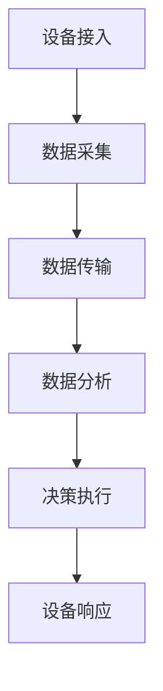
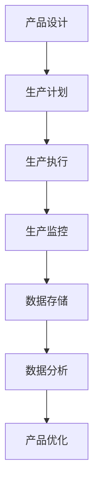
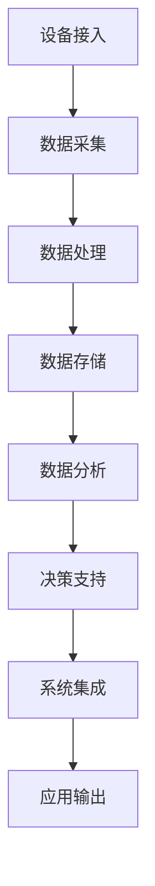

                 

# 5G专网技术在工业互联网中的应用

> **关键词：** 5G专网、工业互联网、网络性能、智能制造、安全与隐私保护、未来发展趋势

> **摘要：** 本文深入探讨了5G专网技术在工业互联网中的应用，包括基础原理、关键优势、实际应用案例以及未来发展趋势。通过对5G专网技术的详细分析，我们旨在揭示其在提高工业自动化、智能制造和工业互联网平台性能方面的巨大潜力，并探讨其在安全与隐私保护方面的挑战和解决方案。

## 第一部分：5G专网技术基础

### 第1章：5G技术概述

#### 1.1 5G技术背景与发展历程

5G技术是第五代移动通信技术的简称，自2019年正式商用以来，在全球范围内迅速推广。5G技术的发展历程可以追溯到2000年代中期，随着4G技术的普及和移动互联网的迅猛发展，人们对通信速度和稳定性的需求日益增长。5G技术旨在提供更高的数据传输速度、更低的延迟和更大的连接容量，从而满足未来数字经济的发展需求。

#### 1.2 5G关键技术概述

5G技术涉及多个关键技术的创新，包括：

- **毫米波通信**：利用更高频率的毫米波波段进行通信，提供更高的数据传输速率。
- **多连接技术**：通过引入大规模MIMO（多输入多输出）技术，实现更高的网络容量和更好的频谱效率。
- **网络切片技术**：将网络资源划分为多个虚拟网络，为不同的应用提供定制化的网络服务。
- **边缘计算**：将计算能力从云端迁移到网络边缘，降低延迟，提高响应速度。

#### 1.3 5G与工业互联网的关系

5G技术与工业互联网的结合，为工业生产带来了新的机遇和挑战。5G技术的低延迟、高带宽和大连接特性，使得工业互联网中的设备能够实时通信，实现更高效的生产控制和优化。同时，5G专网技术的引入，为工业互联网提供了更加安全、可靠的网络环境，有助于提升工业生产的安全性和隐私保护水平。

### 第2章：5G专网技术核心原理

#### 2.1 5G网络架构

5G网络架构由多个层次组成，包括无线接入网络、传输网络和核心网络。其中，无线接入网络负责处理无线信号传输，传输网络负责数据传输，核心网络负责业务控制和数据存储。

#### 2.2 5G无线接入技术

5G无线接入技术主要包括毫米波通信和Sub-6GHz频段通信。毫米波通信利用高频波段提供更高的数据传输速率，而Sub-6GHz频段通信则提供更大的覆盖范围和更好的穿透性。

#### 2.3 5G网络切片技术

5G网络切片技术是将网络资源划分为多个虚拟网络，为不同的应用提供定制化的网络服务。通过网络切片，5G网络可以同时支持多种不同类型的业务，满足工业互联网中的多样化需求。

### 第3章：5G专网在网络性能方面的优势

#### 3.1 低延迟

低延迟是5G专网技术的重要优势之一。在工业互联网中，低延迟能够确保设备实时响应，实现精准控制。例如，在自动化生产线中，低延迟能够保证机器人与传感器之间的实时通信，提高生产效率。

#### 3.2 高带宽

高带宽是5G专网技术的另一个关键优势。在工业互联网中，高带宽能够支持大量数据的高速传输，为工业大数据分析和实时监控提供保障。

#### 3.3 大连接

大连接是5G专网技术的重要特性之一。在工业互联网中，大连接能够支持大量设备的接入，满足工业生产中的复杂通信需求。

#### 3.4 网络切片

网络切片技术使得5G专网能够根据不同应用的需求，提供定制化的网络服务。在工业互联网中，网络切片技术可以优化网络资源分配，提高网络性能和可靠性。

## 第二部分：5G专网在工业互联网中的应用

### 第4章：5G专网在工业自动化中的应用

#### 4.1 5G专网在工业自动化设备控制中的应用

5G专网技术能够实现工业自动化设备的高效控制。通过5G网络，自动化设备可以实时获取生产数据，进行精准控制，提高生产效率。

#### 4.2 5G专网在工业机器人控制中的应用

5G专网技术能够支持工业机器人的远程控制和实时监控。通过5G网络，工业机器人可以快速响应生产指令，提高生产灵活性。

#### 4.3 5G专网在智能工厂中的应用

5G专网技术在智能工厂中发挥着重要作用。通过5G网络，智能工厂可以实现设备互联、数据共享和智能决策，提高生产效率和产品质量。

### 第5章：5G专网在智能制造中的应用

#### 5.1 5G专网在数字化生产管理中的应用

5G专网技术能够支持数字化生产管理。通过5G网络，生产管理系统能够实时获取生产数据，进行智能分析和优化，提高生产效率。

#### 5.2 5G专网在产品生命周期管理中的应用

5G专网技术能够支持产品生命周期管理。通过5G网络，企业可以实现产品从设计到生产、销售和售后服务的全过程管理，提高产品竞争力。

#### 5.3 5G专网在智能制造生产线中的应用

5G专网技术在智能制造生产线中发挥着重要作用。通过5G网络，生产线可以实现实时监控、故障预警和远程维护，提高生产效率和产品质量。

### 第6章：5G专网在工业互联网平台中的应用

#### 6.1 5G专网在工业互联网平台架构中的应用

5G专网技术在工业互联网平台架构中发挥着关键作用。通过5G网络，工业互联网平台可以实现设备互联、数据共享和智能分析，提高工业生产的智能化水平。

#### 6.2 5G专网在工业大数据分析中的应用

5G专网技术能够支持工业大数据分析。通过5G网络，企业可以实时获取大量生产数据，进行深度分析和挖掘，为企业决策提供有力支持。

#### 6.3 5G专网在工业互联网安全中的应用

5G专网技术在工业互联网安全中发挥着重要作用。通过5G网络，企业可以实现网络安全防护，防止数据泄露和攻击，确保工业生产的安全和稳定。

### 第7章：5G专网在工业互联网安全与隐私保护中的应用

#### 7.1 5G专网在工业网络安全中的重要性

5G专网技术在工业网络安全中具有重要意义。通过5G网络，企业可以实现对工业网络的实时监控和防护，防止网络攻击和数据泄露。

#### 7.2 5G专网在工业数据隐私保护中的应用

5G专网技术在工业数据隐私保护中发挥着重要作用。通过5G网络，企业可以实现数据加密和隔离，防止敏感数据泄露，保障工业生产的隐私安全。

#### 7.3 5G专网在工业安全事件响应中的应用

5G专网技术在工业安全事件响应中具有重要作用。通过5G网络，企业可以实时收集和分析安全事件数据，快速响应和处理安全事件，保障工业生产的安全和稳定。

## 第8章：5G专网在工业互联网中的应用挑战与解决方案

#### 8.1 5G专网在工业互联网中的技术挑战

5G专网技术在工业互联网中面临多个技术挑战，包括网络稳定性、数据传输安全等。为了解决这些挑战，需要不断优化5G网络技术和安全防护措施。

#### 8.2 5G专网在工业互联网中的网络部署挑战

5G专网技术在工业互联网中的网络部署面临挑战，包括网络覆盖范围、设备兼容性等。为了实现高效部署，需要加强网络规划和设备选型。

#### 8.3 5G专网在工业互联网中的安全挑战

5G专网技术在工业互联网中面临安全挑战，包括网络攻击和数据泄露等。为了保障工业生产的安全，需要建立健全的安全防护体系。

#### 8.4 5G专网在工业互联网中的应用解决方案

针对5G专网技术在工业互联网中的应用挑战，需要采取一系列解决方案，包括技术升级、安全防护措施和人才培养等，以确保5G专网技术在工业互联网中的应用顺利进行。

## 第三部分：5G专网技术未来发展趋势

### 第9章：5G专网技术未来发展趋势

#### 9.1 5G专网技术未来发展趋势分析

5G专网技术未来发展趋势包括网络性能提升、应用场景扩展、安全防护加强等。随着技术的不断进步，5G专网技术将在工业互联网中发挥更大作用。

#### 9.2 5G专网技术在工业互联网中的潜在应用

5G专网技术在工业互联网中的潜在应用包括智能制造、智能物流、智能能源等。这些应用将推动工业互联网的进一步发展。

#### 9.3 5G专网技术在工业互联网中的未来前景展望

随着5G专网技术的不断成熟和应用，工业互联网将迎来更广阔的发展前景。5G专网技术将为工业生产提供更高的效率、更低的成本和更安全的环境。

### 第10章：5G专网技术在工业互联网中的创新应用案例

#### 10.1 案例一：某工厂5G专网技术在生产优化中的应用

在某工厂，5G专网技术被应用于生产优化。通过5G网络，工厂实现了设备互联和实时数据传输，提高了生产效率和质量。

#### 10.2 案例二：某物流公司5G专网技术在物流管理中的应用

在某物流公司，5G专网技术被应用于物流管理。通过5G网络，物流公司实现了车辆监控、货物追踪和实时调度，提高了物流效率和服务质量。

#### 10.3 案例三：某能源公司5G专网技术在能源管理中的应用

在某能源公司，5G专网技术被应用于能源管理。通过5G网络，能源公司实现了能源监控、数据分析和管理优化，提高了能源利用效率和经济效益。

### 第11章：5G专网技术在工业互联网中的政策支持与标准化发展

#### 11.1 5G专网技术在工业互联网中的政策支持

各国政府纷纷出台政策，支持5G专网技术在工业互联网中的应用。政策支持为5G专网技术的发展提供了良好的环境。

#### 11.2 5G专网技术在工业互联网中的标准化发展

5G专网技术在工业互联网中的标准化发展是推动其广泛应用的关键。标准化工作有助于统一技术规范，促进产业协同发展。

#### 11.3 5G专网技术在工业互联网中的国际合作与竞争

5G专网技术在工业互联网中的应用涉及到国际合作与竞争。各国企业通过合作与竞争，共同推动5G专网技术的发展。

## 附录

### 附录A：5G专网技术相关术语解释

- **5G网络架构**：5G网络架构由无线接入网络、传输网络和核心网络组成，负责处理无线信号传输、数据传输和业务控制。
- **毫米波通信**：毫米波通信利用高频波段进行通信，提供更高的数据传输速率。
- **网络切片技术**：网络切片技术将网络资源划分为多个虚拟网络，为不同的应用提供定制化的网络服务。

### 附录B：5G专网技术在工业互联网中的应用流程图

- **5G专网技术在工业自动化中的应用流程图**：包括设备互联、数据传输、实时控制和生产优化等步骤。
- **5G专网技术在智能制造中的应用流程图**：包括生产管理、数据分析、智能决策和产品生命周期管理等步骤。
- **5G专网技术在工业互联网平台中的应用流程图**：包括设备接入、数据传输、智能分析和平台运营管理等步骤。

## 作者信息

作者：AI天才研究院/AI Genius Institute & 禅与计算机程序设计艺术/Zen And The Art of Computer Programming

### 第二部分：5G专网技术基础

在深入探讨5G专网技术在工业互联网中的应用之前，我们需要先了解5G专网技术的基础知识。本部分将分为三章，分别介绍5G技术的概述、5G专网技术的核心原理以及在工业互联网中的应用优势。

#### 第1章：5G技术概述

5G技术，即第五代移动通信技术，是当前全球通信领域的前沿技术之一。它的出现标志着移动通信技术进入了新的发展阶段，为人类社会带来了更多的可能性。

##### 1.1 5G技术背景与发展历程

5G技术的研发起源于20世纪90年代，当时4G技术刚刚问世。随着移动互联网的兴起，人们对通信速度和稳定性的需求日益增长，推动了5G技术的诞生。从2013年开始，国际电信联盟（ITU）正式启动了5G标准的制定工作。经过几年的努力，5G标准终于在2018年正式公布。

5G技术的发展历程可以分为几个阶段：

- **阶段一：概念与愿景**（2013-2015年）：ITU发布IMT-2020愿景，提出5G技术应具备高速度、低延迟、大连接等特性。
- **阶段二：标准制定**（2015-2018年）：ITU正式公布5G标准，3GPP启动5G标准制定工作。
- **阶段三：技术验证与试验**（2019-2020年）：各大运营商和设备制造商开始进行5G技术的验证和试验。
- **阶段四：商用部署**（2020年至今）：全球范围内，多个国家和地区开始大规模部署5G网络。

##### 1.2 5G关键技术概述

5G技术包含了一系列关键技术的创新，这些技术使得5G能够在数据传输速度、网络容量、连接密度和延迟等方面取得显著提升。

- **毫米波通信**：毫米波通信是5G技术的一个重要特点，它利用了高频段（24GHz以上）的电磁波进行通信。毫米波通信具有高带宽、高速率的特点，可以提供更高的数据传输速度。

  ```mermaid
  graph TD
  A[毫米波通信] --> B[高带宽]
  B --> C[高速率]
  A --> D[高频段电磁波]
  D --> E[大覆盖范围]
  ```

- **多连接技术**：5G技术采用了大规模MIMO（多输入多输出）技术，通过在基站上安装大量的天线，实现多用户同时通信。这种技术提高了网络的容量和频谱效率。

  ```mermaid
  graph TD
  A[多连接技术] --> B[MIMO]
  B --> C[多用户通信]
  B --> D[频谱效率高]
  ```

- **网络切片技术**：网络切片是将网络资源虚拟化为多个独立的网络切片，为不同的应用提供定制化的网络服务。网络切片技术使得5G网络能够同时支持多种不同的应用场景，满足工业互联网的多样化需求。

  ```mermaid
  graph TD
  A[网络切片技术] --> B[虚拟化网络资源]
  B --> C[定制化服务]
  B --> D[多种应用场景]
  ```

- **边缘计算**：边缘计算是将计算能力从云端迁移到网络边缘，使得数据处理更加接近数据源。边缘计算降低了数据的传输延迟，提高了响应速度，对于工业互联网中的实时控制和数据分析具有重要意义。

  ```mermaid
  graph TD
  A[边缘计算] --> B[网络边缘计算]
  B --> C[降低延迟]
  B --> D[提高响应速度]
  ```

##### 1.3 5G与工业互联网的关系

5G技术为工业互联网带来了新的机遇和挑战。工业互联网是指将物理设备、传感器、软件和网络连接起来，实现智能化的工业生产和管理。5G技术的高带宽、低延迟和大连接特性，使得工业互联网中的设备能够实现实时通信，实现更高效的生产控制和优化。

- **提高生产效率**：5G技术能够支持工业自动化设备的高效控制，通过实时通信和精准控制，提高生产效率。

- **实现智能制造**：5G技术为智能制造提供了强大的网络支持，可以实现设备互联、数据共享和智能决策，推动智能制造的发展。

- **提升数据价值**：5G技术能够支持大量数据的高速传输，为工业大数据分析和实时监控提供保障，提升数据价值。

- **保障网络安全**：5G技术引入了网络切片和边缘计算等技术，可以提高工业互联网的网络安全水平，保障数据的安全和隐私。

#### 第2章：5G专网技术核心原理

5G专网技术是5G技术在特定场景下的应用，它通过构建专用的网络，为特定行业或企业提供定制化的网络服务。本章节将详细介绍5G专网技术的核心原理。

##### 2.1 5G网络架构

5G网络架构由多个层次组成，包括无线接入网络、传输网络和核心网络。以下是5G网络架构的详细描述：

- **无线接入网络**：无线接入网络是5G网络的最外层，负责处理无线信号的传输。它包括基站、无线接入点等设备。5G无线接入网络采用了新的无线接入技术，如毫米波通信和Sub-6GHz频段通信。

  ```mermaid
  graph TD
  A[无线接入网络] --> B[基站]
  B --> C[无线接入点]
  A --> D[毫米波通信]
  A --> E[Sub-6GHz频段通信]
  ```

- **传输网络**：传输网络负责将无线接入网络与核心网络连接起来，确保数据能够高效传输。5G传输网络采用了光纤传输、微波传输等先进技术。

  ```mermaid
  graph TD
  A[传输网络] --> B[光纤传输]
  B --> C[微波传输]
  ```

- **核心网络**：核心网络是5G网络的核心部分，负责处理业务控制和数据存储。5G核心网络采用了新的网络架构，如服务化架构和网络功能虚拟化。

  ```mermaid
  graph TD
  A[核心网络] --> B[服务化架构]
  B --> C[网络功能虚拟化]
  ```

##### 2.2 5G无线接入技术

5G无线接入技术是5G网络的关键组成部分，它决定了5G网络的性能和特性。以下是5G无线接入技术的详细描述：

- **毫米波通信**：毫米波通信利用高频段的电磁波进行通信，具有较高的带宽和速度。毫米波通信适用于高速移动环境，如高速列车和飞机。

  ```mermaid
  graph TD
  A[毫米波通信] --> B[高频段]
  B --> C[高带宽]
  B --> D[高速率]
  ```

- **Sub-6GHz频段通信**：Sub-6GHz频段通信是指工作在6GHz以下的频段，包括5.2GHz、5.8GHz等。Sub-6GHz频段通信具有较好的穿透性和覆盖范围，适用于室内和室外环境。

  ```mermaid
  graph TD
  A[Sub-6GHz频段通信] --> B[中低频段]
  B --> C[穿透性好]
  B --> D[覆盖范围广]
  ```

##### 2.3 5G网络切片技术

5G网络切片技术是将网络资源虚拟化为多个独立的网络切片，为不同的应用提供定制化的网络服务。以下是5G网络切片技术的详细描述：

- **网络切片的定义**：网络切片是将网络资源划分为多个虚拟网络，每个虚拟网络具有独立的网络资源，如带宽、延迟和时延等。

  ```mermaid
  graph TD
  A[网络切片] --> B[虚拟网络]
  B --> C[独立资源]
  ```

- **网络切片的工作原理**：网络切片通过虚拟化技术，将物理网络资源虚拟化为多个虚拟网络，为不同的应用提供定制化的网络服务。网络切片可以根据应用的需求，动态调整网络资源，实现资源的最优化利用。

  ```mermaid
  graph TD
  A[网络切片工作原理] --> B[虚拟化技术]
  B --> C[定制化服务]
  B --> D[资源动态调整]
  ```

- **网络切片的应用场景**：网络切片技术可以应用于多种场景，如工业互联网、智能交通、智慧医疗等。通过网络切片，可以为不同的应用提供定制化的网络服务，满足不同应用的需求。

  ```mermaid
  graph TD
  A[网络切片应用场景] --> B[工业互联网]
  B --> C[智能交通]
  B --> D[智慧医疗]
  ```

#### 第3章：5G专网在网络性能方面的优势

5G专网技术为工业互联网带来了显著的网络性能优势，包括低延迟、高带宽、大连接等。以下是5G专网技术在网络性能方面的详细分析。

##### 3.1 低延迟

低延迟是5G专网技术的重要优势之一。在工业互联网中，低延迟能够确保设备实时响应，实现精准控制。例如，在自动化生产线中，低延迟能够保证机器人与传感器之间的实时通信，提高生产效率。

- **低延迟的定义**：低延迟是指数据传输的延迟时间较短，通常以毫秒为单位。

  ```mermaid
  graph TD
  A[低延迟] --> B[延迟时间短]
  B --> C[以毫秒为单位]
  ```

- **低延迟的优势**：低延迟能够提高工业互联网中设备的实时性，确保设备能够快速响应生产指令。例如，在工业自动化控制中，低延迟能够保证机器人的精准动作，避免生产事故。

  ```mermaid
  graph TD
  A[低延迟优势] --> B[提高实时性]
  B --> C[确保设备快速响应]
  ```

- **低延迟的应用**：低延迟在工业互联网中的应用非常广泛，如自动化控制、智能监控、远程操作等。通过低延迟的网络，工业互联网中的设备能够实现高效的通信和控制。

  ```mermaid
  graph TD
  A[低延迟应用] --> B[自动化控制]
  B --> C[智能监控]
  B --> D[远程操作]
  ```

##### 3.2 高带宽

高带宽是5G专网技术的另一个关键优势。在工业互联网中，高带宽能够支持大量数据的高速传输，为工业大数据分析和实时监控提供保障。

- **高带宽的定义**：高带宽是指网络能够传输的数据量较大，通常以比特每秒（bps）为单位。

  ```mermaid
  graph TD
  A[高带宽] --> B[数据传输量大]
  B --> C[以比特每秒为单位]
  ```

- **高带宽的优势**：高带宽能够支持工业互联网中的大数据传输，满足工业大数据分析的需求。例如，在生产过程中，高带宽能够保证传感器采集的数据能够实时传输到数据分析系统，进行实时分析。

  ```mermaid
  graph TD
  A[高带宽优势] --> B[支持大数据传输]
  B --> C[满足工业大数据分析需求]
  ```

- **高带宽的应用**：高带宽在工业互联网中的应用包括数据采集、实时监控、远程控制等。通过高带宽的网络，工业互联网中的设备能够实现高效的数据传输和实时控制。

  ```mermaid
  graph TD
  A[高带宽应用] --> B[数据采集]
  B --> C[实时监控]
  B --> D[远程控制]
  ```

##### 3.3 大连接

大连接是5G专网技术的另一个重要特性。在工业互联网中，大连接能够支持大量设备的接入，满足工业生产中的复杂通信需求。

- **大连接的定义**：大连接是指网络能够同时支持大量的设备接入，通常以设备数或连接数为单位。

  ```mermaid
  graph TD
  A[大连接] --> B[支持大量设备接入]
  B --> C[以设备数或连接数为单位]
  ```

- **大连接的优势**：大连接能够满足工业互联网中设备数量众多的需求，例如，在智能工厂中，大连接能够支持成千上万个传感器、机器人和其他设备的接入。

  ```mermaid
  graph TD
  A[大连接优势] --> B[满足设备数量众多的需求]
  B --> C[支持智能工厂设备接入]
  ```

- **大连接的应用**：大连接在工业互联网中的应用包括设备互联、智能监控、远程控制等。通过大连接的网络，工业互联网中的设备能够实现高效的数据传输和实时控制。

  ```mermaid
  graph TD
  A[大连接应用] --> B[设备互联]
  B --> C[智能监控]
  B --> D[远程控制]
  ```

##### 3.4 网络切片

网络切片技术使得5G专网能够根据不同应用的需求，提供定制化的网络服务。在工业互联网中，网络切片技术可以优化网络资源分配，提高网络性能和可靠性。

- **网络切片的定义**：网络切片是将网络资源划分为多个虚拟网络，为不同的应用提供定制化的网络服务。

  ```mermaid
  graph TD
  A[网络切片] --> B[虚拟网络]
  B --> C[定制化服务]
  ```

- **网络切片的优势**：网络切片技术可以优化网络资源分配，提高网络性能和可靠性。例如，在工业自动化控制中，网络切片可以为关键设备提供优先的网络资源，确保其通信质量。

  ```mermaid
  graph TD
  A[网络切片优势] --> B[优化网络资源分配]
  B --> C[提高网络性能和可靠性]
  ```

- **网络切片的应用**：网络切片技术在工业互联网中的应用包括工业自动化、智能制造、智能监控等。通过网络切片，工业互联网中的设备能够获得定制化的网络服务，满足不同的应用需求。

  ```mermaid
  graph TD
  A[网络切片应用] --> B[工业自动化]
  B --> C[智能制造]
  B --> D[智能监控]
  ```

## 第4章：5G专网在工业自动化中的应用

5G专网技术在工业自动化中扮演着至关重要的角色，它为工业自动化设备提供了高速、低延迟、大带宽的通信环境，从而提升了生产效率、降低了成本，并增强了设备的智能化水平。在这一章中，我们将详细探讨5G专网技术在工业自动化设备控制、工业机器人控制和智能工厂中的应用。

### 4.1 5G专网在工业自动化设备控制中的应用

工业自动化设备控制是工业生产的核心环节，而5G专网技术为这一环节带来了革命性的变化。以下是5G专网在工业自动化设备控制中的具体应用：

#### 4.1.1 应用场景

在工业自动化设备控制中，5G专网技术可以应用于以下几个方面：

- **生产监控与调度**：通过5G网络，工厂管理者可以实时监控生产设备的运行状态，快速响应生产异常，进行生产调度。
- **设备远程控制**：工程师可以通过5G网络远程监控和操作设备，进行故障诊断和维护。
- **数据实时传输**：生产数据可以实时传输到数据中心，进行大数据分析和决策支持。

#### 4.1.2 工作原理

5G专网在工业自动化设备控制中的应用原理如下：

1. **设备接入**：工业自动化设备通过5G模块接入5G专网。
2. **数据采集**：设备传感器采集生产数据，并通过5G网络传输到云端或边缘计算设备。
3. **数据处理**：云端或边缘计算设备对生产数据进行处理和分析，生成决策建议。
4. **设备响应**：根据决策建议，设备调整运行状态，实现精准控制。

#### 4.1.3 伪代码示例

以下是一个简单的伪代码示例，用于描述工业自动化设备控制的过程：

```python
# 设备控制伪代码

# 设备接入5G网络
device.connect_to_5G_network()

# 采集生产数据
data = device.collect_production_data()

# 数据上传至云端
cloud.send_data(data)

# 云端处理数据并返回控制指令
control_instructions = cloud.process_data_and_return_control_instructions()

# 设备根据指令调整运行状态
device.adjust_running_state(control_instructions)
```

### 4.2 5G专网在工业机器人控制中的应用

工业机器人是工业自动化的重要组成部分，5G专网技术为工业机器人控制提供了更加灵活和高效的解决方案。以下是5G专网在工业机器人控制中的应用：

#### 4.2.1 应用场景

- **远程操作**：通过5G网络，工程师可以远程监控和操作工业机器人，进行复杂任务的执行。
- **协作工作**：工业机器人可以与人类工人协同工作，提高生产效率和质量。
- **实时监控**：5G网络能够实现工业机器人的实时监控，确保其安全运行。

#### 4.2.2 工作原理

5G专网在工业机器人控制中的应用原理如下：

1. **设备接入**：工业机器人通过5G模块接入5G专网。
2. **数据采集**：机器人传感器采集操作数据，并通过5G网络传输到云端或边缘计算设备。
3. **数据处理**：云端或边缘计算设备对操作数据进行处理，生成控制指令。
4. **设备响应**：机器人根据控制指令调整动作，实现精准操作。

#### 4.2.3 伪代码示例

以下是一个简单的伪代码示例，用于描述工业机器人控制的过程：

```python
# 工业机器人控制伪代码

# 设备接入5G网络
robot.connect_to_5G_network()

# 采集操作数据
data = robot.collect_operating_data()

# 数据上传至云端
cloud.send_data(data)

# 云端处理数据并返回控制指令
control_instructions = cloud.process_data_and_return_control_instructions()

# 机器人根据指令调整动作
robot.adjust_actions(control_instructions)
```

### 4.3 5G专网在智能工厂中的应用

智能工厂是工业自动化和智能制造的结合体，5G专网技术为智能工厂的建设提供了关键支撑。以下是5G专网在智能工厂中的应用：

#### 4.3.1 应用场景

- **设备互联**：通过5G网络，智能工厂中的各种设备可以实现无缝互联，实现数据的实时共享和协同工作。
- **生产优化**：基于5G网络的数据传输能力，智能工厂可以进行实时生产优化，提高生产效率。
- **远程维护**：工程师可以通过5G网络远程监控和维护工厂设备，提高设备运行可靠性。

#### 4.3.2 工作原理

5G专网在智能工厂中的应用原理如下：

1. **设备接入**：智能工厂中的各种设备通过5G模块接入5G专网。
2. **数据采集**：设备传感器采集各种数据，并通过5G网络传输到数据中心或边缘计算设备。
3. **数据处理**：数据中心或边缘计算设备对数据进行处理和分析，生成优化建议。
4. **设备响应**：设备根据优化建议调整运行状态，实现生产优化。

#### 4.3.3 伪代码示例

以下是一个简单的伪代码示例，用于描述智能工厂中的生产优化过程：

```python
# 智能工厂生产优化伪代码

# 设备接入5G网络
device.connect_to_5G_network()

# 采集生产数据
data = device.collect_production_data()

# 数据上传至云端
cloud.send_data(data)

# 云端分析数据并返回优化建议
optimization_suggestions = cloud.analyze_data_and_return_suggestions()

# 设备根据优化建议调整运行状态
device.adjust_running_state(optimization_suggestions)
```

### 4.4 5G专网在工业自动化设备控制中的优势

5G专网技术在工业自动化设备控制中的应用具有以下几个优势：

- **低延迟**：5G网络提供了极低的延迟，使得设备能够实时响应生产指令，提高生产效率。
- **高带宽**：5G网络提供了巨大的带宽，使得大量生产数据能够实时传输，支持大数据分析和实时监控。
- **大连接**：5G网络能够支持大量设备的接入，满足工业自动化设备的复杂通信需求。
- **网络切片**：通过网络切片技术，可以为不同的应用提供定制化的网络服务，优化网络资源分配，提高网络性能和可靠性。

这些优势使得5G专网技术在工业自动化设备控制中具有巨大的应用潜力，为工业生产带来了全新的发展机遇。

### 4.5 5G专网在工业自动化设备控制中的挑战

尽管5G专网技术在工业自动化设备控制中具有巨大的优势，但也面临着一些挑战：

- **网络稳定性**：5G网络在高速移动环境中的稳定性是一个挑战，特别是在工厂内存在大量金属和电磁干扰的情况下。
- **安全性**：5G网络的安全性问题需要得到有效解决，确保工业自动化设备不受网络攻击和数据泄露的影响。
- **设备兼容性**：5G设备的兼容性问题可能影响其大规模应用，需要确保5G设备能够与现有设备无缝集成。

通过不断的技术创新和优化，5G专网技术有望克服这些挑战，进一步推动工业自动化的发展。

### 4.6 5G专网在工业自动化设备控制中的应用前景

随着5G专网技术的不断成熟和应用，其在工业自动化设备控制中的应用前景十分广阔。未来，5G专网技术有望在以下几个方面发挥重要作用：

- **智能制造**：5G专网技术将推动智能制造的发展，实现更高效、更智能的生产模式。
- **远程维护**：5G专网技术将使得远程维护更加便捷和高效，降低维护成本。
- **设备互联**：5G专网技术将实现工厂内各种设备的无缝互联，提升生产协同效率。

总之，5G专网技术在工业自动化设备控制中的应用将带来生产效率的提升、成本的降低和智能化水平的提升，为工业生产带来革命性的变化。

## 第5章：5G专网在智能制造中的应用

5G专网技术在智能制造中的应用正迅速改变传统制造业的生产模式，推动制造业向更加智能化、高效化、个性化的方向发展。在这一章中，我们将深入探讨5G专网技术在数字化生产管理、产品生命周期管理和智能制造生产线中的应用。

### 5.1 5G专网在数字化生产管理中的应用

数字化生产管理是智能制造的基础，它通过信息化手段对生产过程进行实时监控和优化。5G专网技术在数字化生产管理中的应用，使得生产管理更加精准、高效。

#### 5.1.1 应用场景

- **生产监控**：5G专网技术能够实现对生产过程的实时监控，工厂管理者可以随时查看生产状态，快速响应生产异常。
- **远程维护**：工程师可以通过5G网络远程诊断和维修设备，减少停机时间，提高生产效率。
- **数据分析**：5G网络的高带宽使得生产过程中产生的海量数据能够快速传输到数据中心，进行深度分析和决策支持。

#### 5.1.2 工作原理

5G专网在数字化生产管理中的应用原理如下：

1. **设备接入**：生产设备通过5G模块接入5G专网。
2. **数据采集**：设备传感器采集生产数据，并通过5G网络传输到云端或边缘计算设备。
3. **数据处理**：云端或边缘计算设备对生产数据进行处理和分析，生成优化建议。
4. **设备响应**：设备根据优化建议调整运行状态，实现生产优化。

#### 5.1.3 伪代码示例

以下是一个简单的伪代码示例，用于描述数字化生产管理的过程：

```python
# 数字化生产管理伪代码

# 设备接入5G网络
device.connect_to_5G_network()

# 采集生产数据
data = device.collect_production_data()

# 数据上传至云端
cloud.send_data(data)

# 云端分析数据并返回优化建议
optimization_suggestions = cloud.analyze_data_and_return_suggestions()

# 设备根据优化建议调整运行状态
device.adjust_running_state(optimization_suggestions)
```

### 5.2 5G专网在产品生命周期管理中的应用

产品生命周期管理（PLM）是指从产品设计、生产、销售到售后服务的全过程管理。5G专网技术在产品生命周期管理中的应用，可以提高产品开发的效率、降低成本，并提升产品质量。

#### 5.2.1 应用场景

- **设计协同**：5G网络可以实现全球范围内的设计协同，设计师可以实时共享和编辑设计文档，缩短产品开发周期。
- **生产跟踪**：5G网络能够实时跟踪生产进度，确保产品质量和交付时间。
- **售后服务**：5G网络支持远程诊断和维修，提高售后服务效率。

#### 5.2.2 工作原理

5G专网在产品生命周期管理中的应用原理如下：

1. **设计协同**：设计师通过5G网络访问分布式的设计平台，实时共享和编辑设计文档。
2. **生产跟踪**：生产设备通过5G网络传输生产数据，监控系统可以实时跟踪生产进度。
3. **售后服务**：客户通过5G网络远程联系售后服务人员，进行故障诊断和维修。

#### 5.2.3 伪代码示例

以下是一个简单的伪代码示例，用于描述产品生命周期管理的过程：

```python
# 产品生命周期管理伪代码

# 设计协同
designer.access_design_platform_through_5G()

# 生产跟踪
production_system.send_production_data_through_5G()

# 售后服务
customer contacting_service_center_through_5G()
```

### 5.3 5G专网在智能制造生产线中的应用

智能制造生产线是智能制造的核心，5G专网技术在智能制造生产线中的应用，使得生产线更加智能化、灵活化。

#### 5.3.1 应用场景

- **设备互联**：5G网络使得生产线上各种设备能够无缝互联，实现数据的实时共享和协同工作。
- **自适应生产**：5G网络支持生产线根据实时数据调整生产计划，实现自适应生产。
- **远程监控**：5G网络支持远程监控生产线，快速响应生产异常。

#### 5.3.2 工作原理

5G专网在智能制造生产线中的应用原理如下：

1. **设备接入**：生产设备通过5G模块接入5G专网。
2. **数据采集**：设备传感器采集生产数据，并通过5G网络传输到云端或边缘计算设备。
3. **数据处理**：云端或边缘计算设备对生产数据进行处理和分析，生成优化建议。
4. **设备响应**：设备根据优化建议调整运行状态，实现生产优化。

#### 5.3.3 伪代码示例

以下是一个简单的伪代码示例，用于描述智能制造生产线的过程：

```python
# 智能制造生产线伪代码

# 设备接入5G网络
device.connect_to_5G_network()

# 采集生产数据
data = device.collect_production_data()

# 数据上传至云端
cloud.send_data(data)

# 云端分析数据并返回优化建议
optimization_suggestions = cloud.analyze_data_and_return_suggestions()

# 设备根据优化建议调整运行状态
device.adjust_running_state(optimization_suggestions)
```

### 5.4 5G专网在智能制造中的应用优势

5G专网技术在智能制造中的应用具有以下几个优势：

- **低延迟**：5G网络提供了极低的延迟，使得智能制造设备能够实时响应生产指令，提高生产效率。
- **高带宽**：5G网络提供了巨大的带宽，使得智能制造过程中产生的海量数据能够实时传输，支持大数据分析和实时监控。
- **大连接**：5G网络能够支持大量设备的接入，满足智能制造设备的复杂通信需求。
- **网络切片**：通过网络切片技术，可以为不同的智能制造应用提供定制化的网络服务，优化网络资源分配，提高网络性能和可靠性。

这些优势使得5G专网技术在智能制造中具有巨大的应用潜力，为智能制造的发展提供了强有力的支撑。

### 5.5 5G专网在智能制造中的应用挑战

尽管5G专网技术在智能制造中具有巨大的优势，但也面临着一些挑战：

- **网络稳定性**：5G网络在高速移动环境中的稳定性是一个挑战，特别是在生产现场存在大量金属和电磁干扰的情况下。
- **安全性**：5G网络的安全性问题需要得到有效解决，确保智能制造设备不受网络攻击和数据泄露的影响。
- **设备兼容性**：5G设备的兼容性问题可能影响其大规模应用，需要确保5G设备能够与现有设备无缝集成。

通过不断的技术创新和优化，5G专网技术有望克服这些挑战，进一步推动智能制造的发展。

### 5.6 5G专网在智能制造中的应用前景

随着5G专网技术的不断成熟和应用，其在智能制造中的应用前景十分广阔。未来，5G专网技术有望在以下几个方面发挥重要作用：

- **智能制造**：5G专网技术将推动智能制造的发展，实现更高效、更智能的生产模式。
- **远程维护**：5G专网技术将使得远程维护更加便捷和高效，降低维护成本。
- **设备互联**：5G专网技术将实现生产线上各种设备的无缝互联，提升生产协同效率。

总之，5G专网技术在智能制造中的应用将带来生产效率的提升、成本的降低和智能化水平的提升，为制造业带来革命性的变化。

## 第6章：5G专网在工业互联网平台中的应用

工业互联网平台是工业互联网的“神经中枢”，它通过连接各种设备和系统，实现数据的采集、传输、处理和分析，从而推动工业生产的智能化和数字化转型。5G专网技术在工业互联网平台中的应用，极大地提升了平台的数据传输效率、系统可靠性和整体性能。本章将深入探讨5G专网技术在工业互联网平台架构、工业大数据分析和工业互联网安全中的应用。

### 6.1 5G专网在工业互联网平台架构中的应用

5G专网技术在工业互联网平台架构中扮演着至关重要的角色，它为平台提供了高效、可靠、安全的网络环境。

#### 6.1.1 应用场景

- **数据采集**：5G专网技术能够快速采集来自各种工业设备的实时数据，为平台提供丰富的数据源。
- **数据处理**：5G网络的高带宽和低延迟特性，使得数据处理能够在边缘进行，提高响应速度和效率。
- **数据传输**：5G专网技术保证了大规模数据的高速传输，为工业互联网平台提供了稳定的数据传输通道。
- **系统集成**：5G专网技术支持不同系统和设备之间的无缝集成，实现了工业互联网平台的统一架构。

#### 6.1.2 工作原理

5G专网在工业互联网平台架构中的应用原理如下：

1. **设备接入**：工业设备通过5G模块接入5G专网。
2. **数据采集**：设备传感器采集生产数据，并通过5G网络传输到平台。
3. **数据处理**：平台对采集到的数据进行预处理和分析，生成洞察和建议。
4. **决策执行**：根据分析结果，平台生成控制指令，设备根据指令调整运行状态。

#### 6.1.3 伪代码示例

以下是一个简单的伪代码示例，用于描述工业互联网平台的数据处理流程：

```python
# 工业互联网平台数据处理伪代码

# 设备接入5G网络
device.connect_to_5G_network()

# 采集生产数据
data = device.collect_production_data()

# 数据上传至平台
platform.send_data(data)

# 平台预处理和分析数据
processed_data = platform.preprocess_and_analyze_data(data)

# 生成控制指令
control_instructions = platform.generate_control_instructions(processed_data)

# 发送控制指令到设备
platform.send_control_instructions_to_device(control_instructions)
```

### 6.2 5G专网在工业大数据分析中的应用

工业大数据分析是工业互联网平台的核心功能之一，5G专网技术为大数据分析提供了高效的数据传输和实时处理能力。

#### 6.2.1 应用场景

- **实时监控**：5G网络的高带宽和低延迟，使得平台能够实时监控工业生产过程，及时发现并处理异常情况。
- **预测性维护**：通过对历史数据和实时数据的分析，平台可以预测设备故障，提前进行维护，减少停机时间。
- **优化生产**：基于大数据分析，平台可以优化生产计划和资源配置，提高生产效率和产品质量。

#### 6.2.2 工作原理

5G专网在工业大数据分析中的应用原理如下：

1. **数据采集**：5G网络快速采集生产过程中的数据。
2. **数据传输**：高带宽的5G网络确保大规模数据能够实时传输到平台。
3. **数据处理**：平台利用大数据分析算法对数据进行处理和分析。
4. **数据可视化**：分析结果通过数据可视化工具呈现，辅助决策。

#### 6.2.3 伪代码示例

以下是一个简单的伪代码示例，用于描述工业大数据分析的流程：

```python
# 工业大数据分析伪代码

# 数据采集
data = device.collect_production_data()

# 数据上传至平台
platform.send_data(data)

# 平台预处理数据
preprocessed_data = platform.preprocess_data(data)

# 数据分析
analysis_results = platform.analyze_data(preprocessed_data)

# 数据可视化
platform.visualize_data(analysis_results)
```

### 6.3 5G专网在工业互联网安全中的应用

随着工业互联网的发展，网络安全问题日益凸显，5G专网技术在工业互联网安全中发挥着关键作用。

#### 6.3.1 应用场景

- **数据加密**：5G网络提供了强大的加密能力，确保数据在传输过程中的安全性。
- **访问控制**：5G专网技术支持严格的访问控制机制，防止未经授权的访问。
- **安全监控**：5G网络的高带宽和低延迟，使得平台能够实时监控网络流量，及时发现安全威胁。

#### 6.3.2 工作原理

5G专网在工业互联网安全中的应用原理如下：

1. **数据加密**：对传输的数据进行加密，确保数据在传输过程中的安全性。
2. **访问控制**：建立严格的访问控制机制，确保只有授权用户才能访问系统。
3. **安全监控**：实时监控网络流量，发现异常行为并及时响应。

#### 6.3.3 伪代码示例

以下是一个简单的伪代码示例，用于描述工业互联网安全监控的过程：

```python
# 工业互联网安全监控伪代码

# 数据加密
encrypted_data = encrypt_data(data)

# 访问控制
if is_authorized(user):
    process_data(encrypted_data)
else:
    deny_access()

# 安全监控
if detect_anomaly(network_traffic):
    alert_admin()
```

### 6.4 5G专网在工业互联网平台中的应用优势

5G专网技术在工业互联网平台中的应用具有以下几个优势：

- **低延迟**：5G网络提供了极低的延迟，使得工业设备能够实时响应，提高生产效率。
- **高带宽**：5G网络提供了巨大的带宽，确保大规模数据能够实时传输，支持大数据分析和实时监控。
- **大连接**：5G网络能够支持大量设备的接入，满足工业互联网的复杂通信需求。
- **安全性**：5G网络提供了强大的加密和访问控制机制，确保数据的安全和系统的完整性。

这些优势使得5G专网技术在工业互联网平台中具有巨大的应用潜力，为工业生产的智能化和数字化转型提供了强有力的支撑。

### 6.5 5G专网在工业互联网平台中的应用挑战

尽管5G专网技术在工业互联网平台中具有巨大的优势，但也面临着一些挑战：

- **网络稳定性**：5G网络在高速移动环境中的稳定性需要进一步提高，特别是在生产现场存在大量金属和电磁干扰的情况下。
- **安全性**：5G网络的安全性问题需要得到有效解决，确保工业互联网平台不受网络攻击和数据泄露的影响。
- **设备兼容性**：5G设备的兼容性问题可能影响其大规模应用，需要确保5G设备能够与现有设备无缝集成。

通过不断的技术创新和优化，5G专网技术有望克服这些挑战，进一步推动工业互联网平台的发展。

### 6.6 5G专网在工业互联网平台中的应用前景

随着5G专网技术的不断成熟和应用，其在工业互联网平台中的应用前景十分广阔。未来，5G专网技术有望在以下几个方面发挥重要作用：

- **智能制造**：5G专网技术将推动智能制造的发展，实现更高效、更智能的生产模式。
- **远程维护**：5G专网技术将使得远程维护更加便捷和高效，降低维护成本。
- **设备互联**：5G专网技术将实现生产线上各种设备的无缝互联，提升生产协同效率。

总之，5G专网技术在工业互联网平台中的应用将带来生产效率的提升、成本的降低和智能化水平的提升，为工业生产带来革命性的变化。

## 第7章：5G专网在工业互联网安全与隐私保护中的应用

随着工业互联网的快速发展，网络安全和隐私保护成为了不可忽视的重要议题。5G专网技术在提升工业互联网安全性和隐私保护方面具有显著优势。本章将深入探讨5G专网技术在工业网络安全、工业数据隐私保护和工业安全事件响应中的应用。

### 7.1 5G专网在工业网络安全中的重要性

工业网络安全是保障工业互联网安全的关键。5G专网技术为工业网络安全提供了多层次的安全保障。

#### 7.1.1 应用场景

- **设备接入安全**：在设备接入网络时，5G专网技术可以通过认证和加密机制确保设备合法接入。
- **数据传输安全**：5G网络的高带宽和低延迟特性，使得数据在传输过程中能够进行加密处理，防止数据泄露。
- **网络隔离**：通过5G网络切片技术，可以创建独立的虚拟网络，实现不同设备之间的网络隔离，防止网络攻击。

#### 7.1.2 工作原理

5G专网在工业网络安全中的应用原理如下：

1. **设备认证**：设备在接入网络前需要进行身份认证，确保设备合法性。
2. **数据加密**：数据在传输过程中进行加密处理，防止数据被截取和篡改。
3. **网络隔离**：通过网络切片技术，将网络资源划分为多个虚拟网络，实现设备之间的网络隔离。

#### 7.1.3 伪代码示例

以下是一个简单的伪代码示例，用于描述工业网络安全的过程：

```python
# 工业网络安全伪代码

# 设备认证
if is_device_authorized(device):
    allow_connection(device)
else:
    deny_connection(device)

# 数据加密
encrypted_data = encrypt_data(data)

# 网络隔离
network_slice = create_network_slice(device)
```

### 7.2 5G专网在工业数据隐私保护中的应用

工业数据隐私保护是工业互联网安全的重要组成部分。5G专网技术通过多种手段确保工业数据的安全和隐私。

#### 7.2.1 应用场景

- **数据加密存储**：工业数据在存储时进行加密处理，防止未经授权的访问。
- **数据访问控制**：通过严格的访问控制机制，确保只有授权用户才能访问敏感数据。
- **数据匿名化**：对工业数据进行匿名化处理，防止个人身份信息的泄露。

#### 7.2.2 工作原理

5G专网在工业数据隐私保护中的应用原理如下：

1. **数据加密存储**：工业数据在存储时进行加密处理，确保数据安全。
2. **访问控制**：建立严格的访问控制机制，确保数据只能被授权用户访问。
3. **数据匿名化**：对工业数据进行匿名化处理，防止个人身份信息的泄露。

#### 7.2.3 伪代码示例

以下是一个简单的伪代码示例，用于描述工业数据隐私保护的过程：

```python
# 工业数据隐私保护伪代码

# 数据加密存储
encrypted_data = encrypt_data(data)

# 访问控制
if is_user_authorized(user):
    allow_data_access(user, encrypted_data)
else:
    deny_data_access(user)

# 数据匿名化
anonymized_data = anonymize_data(data)
```

### 7.3 5G专网在工业安全事件响应中的应用

5G专网技术在工业安全事件响应中发挥着关键作用，能够快速检测、响应和处理安全事件。

#### 7.3.1 应用场景

- **实时监控**：通过5G网络，平台可以实时监控工业网络流量，及时发现安全事件。
- **安全分析**：利用大数据分析和人工智能技术，对监控数据进行深度分析，识别潜在的安全威胁。
- **应急响应**：在发现安全事件后，平台能够快速响应，采取相应的安全措施，防止事件扩大。

#### 7.3.2 工作原理

5G专网在工业安全事件响应中的应用原理如下：

1. **实时监控**：平台通过5G网络实时监控工业网络流量，发现异常行为。
2. **安全分析**：利用大数据分析和人工智能技术，对监控数据进行深度分析，识别潜在的安全威胁。
3. **应急响应**：在发现安全事件后，平台快速响应，采取隔离、修复等安全措施。

#### 7.3.3 伪代码示例

以下是一个简单的伪代码示例，用于描述工业安全事件响应的过程：

```python
# 工业安全事件响应伪代码

# 实时监控
while True:
    network_traffic = monitor_network_traffic()

    # 安全分析
    if analyze_traffic_for_threats(network_traffic):
        # 应急响应
        respond_to_security_event(network_traffic)
```

### 7.4 5G专网在工业互联网安全与隐私保护中的应用优势

5G专网技术在工业互联网安全与隐私保护中的应用具有以下几个优势：

- **低延迟**：5G网络提供了极低的延迟，使得安全事件能够迅速检测和响应。
- **高带宽**：5G网络提供了巨大的带宽，支持大规模数据的安全传输。
- **网络切片**：网络切片技术可以实现安全的网络隔离，防止网络攻击。
- **加密技术**：5G网络支持多种加密技术，确保数据在传输过程中的安全性。

这些优势使得5G专网技术在工业互联网安全与隐私保护中具有巨大的应用潜力，为工业生产的持续稳定运行提供了有力保障。

### 7.5 5G专网在工业互联网安全与隐私保护中的应用挑战

尽管5G专网技术在工业互联网安全与隐私保护中具有显著优势，但也面临着一些挑战：

- **网络稳定性**：5G网络在高速移动环境中的稳定性需要进一步提升。
- **安全漏洞**：随着5G网络的普及，潜在的安全漏洞可能会增加。
- **设备兼容性**：5G设备与现有系统的兼容性需要得到有效解决。

通过不断的技术创新和优化，5G专网技术有望克服这些挑战，进一步提升工业互联网的安全性和隐私保护水平。

### 7.6 5G专网在工业互联网安全与隐私保护中的应用前景

随着5G专网技术的不断成熟和应用，其在工业互联网安全与隐私保护中的应用前景十分广阔。未来，5G专网技术有望在以下几个方面发挥重要作用：

- **智能安全监控**：通过大数据分析和人工智能技术，实现智能化的安全监控。
- **隐私保护机制**：引入更加完善的隐私保护机制，确保工业数据的隐私安全。
- **安全事件快速响应**：通过快速检测和响应机制，确保安全事件能够及时得到处理。

总之，5G专网技术在工业互联网安全与隐私保护中的应用将不断推动工业互联网的安全性和隐私保护水平的提升。

## 第8章：5G专网在工业互联网中的应用挑战与解决方案

尽管5G专网技术在工业互联网中展现出了巨大的潜力，但其在实际应用过程中仍面临着一系列的挑战。这些挑战主要集中在技术、网络部署和安全等方面。为了解决这些挑战，需要采取一系列的技术、策略和解决方案。

### 8.1 5G专网在工业互联网中的技术挑战

5G专网技术虽然具备低延迟、高带宽和大连接等优势，但在工业互联网中仍然存在以下技术挑战：

#### 8.1.1 网络稳定性

5G网络在高速移动环境中的稳定性是一个重要挑战。工业现场通常存在大量金属和电磁干扰，这些因素可能会影响5G网络的信号质量和稳定性。为了提高网络稳定性，可以采取以下措施：

- **多路径传输**：通过多路径传输技术，实现信号的多重传输，提高网络的容错能力。
- **基站优化**：优化基站的位置和布局，减少信号干扰，提高信号覆盖范围。

#### 8.1.2 数据传输安全

工业互联网中涉及大量的敏感数据，如生产数据、设备状态数据和用户数据等。确保这些数据在传输过程中的安全性是5G专网技术的另一个重要挑战。以下是一些解决方案：

- **数据加密**：采用强加密算法对数据进行加密处理，确保数据在传输过程中的安全性。
- **访问控制**：建立严格的访问控制机制，确保只有授权用户才能访问敏感数据。

#### 8.1.3 设备兼容性

5G设备的兼容性问题可能影响其大规模应用。工业互联网中存在大量的不同设备和系统，如何确保5G设备能够与现有设备无缝集成是一个挑战。以下是一些解决方案：

- **标准化**：推动5G设备的标准统一，确保不同设备之间的兼容性。
- **协议适配**：开发协议适配器，实现不同设备之间的通信兼容。

### 8.2 5G专网在工业互联网中的网络部署挑战

5G专网在工业互联网中的网络部署面临以下挑战：

#### 8.2.1 网络覆盖范围

5G网络的高频段特性使得其信号覆盖范围相对较小，特别是在室内和地下环境中。为了扩大5G网络的覆盖范围，可以采取以下措施：

- **基站密度增加**：增加基站的密度，提高网络的覆盖范围。
- **中继器部署**：在信号弱的地方部署中继器，增强信号的传输能力。

#### 8.2.2 设备兼容性

5G设备与现有设备的兼容性是一个重要问题。不同设备之间的通信协议和数据格式可能不一致，这会影响5G专网的部署效果。以下是一些解决方案：

- **协议转换**：开发协议转换器，实现不同设备之间的通信兼容。
- **标准化接口**：推动5G设备的标准化接口，确保设备之间的兼容性。

#### 8.2.3 网络规划

5G专网的网络规划是网络部署的关键环节。合理的网络规划可以优化网络性能，提高网络稳定性。以下是一些网络规划的建议：

- **需求分析**：详细分析工业互联网的需求，确定网络规划的目标和指标。
- **资源分配**：根据需求分析结果，合理分配网络资源，确保网络性能和可靠性。

### 8.3 5G专网在工业互联网中的安全挑战

5G专网在工业互联网中面临的安全挑战主要包括网络攻击和数据泄露等。以下是一些解决方案：

#### 8.3.1 网络安全防护

为了防止网络攻击，可以采取以下措施：

- **防火墙和入侵检测系统**：部署防火墙和入侵检测系统，实时监控网络流量，防止网络攻击。
- **安全审计**：定期进行安全审计，发现和修复潜在的安全漏洞。

#### 8.3.2 数据加密

为了防止数据泄露，可以采取以下措施：

- **数据加密**：采用强加密算法对数据进行加密处理，确保数据在传输和存储过程中的安全性。
- **访问控制**：建立严格的访问控制机制，确保只有授权用户才能访问敏感数据。

#### 8.3.3 安全培训

加强员工的安全意识培训，提高员工对网络安全的认识和应对能力。以下是一些安全培训的建议：

- **安全意识教育**：定期开展安全意识教育，提高员工的安全意识。
- **应急响应演练**：组织应急响应演练，提高员工应对网络安全事件的应对能力。

### 8.4 5G专网在工业互联网中的应用解决方案

针对5G专网在工业互联网中的应用挑战，可以采取以下解决方案：

#### 8.4.1 技术创新

持续进行技术创新，研发出更加稳定、安全、高效的5G专网技术。以下是一些技术创新的建议：

- **网络优化**：优化5G网络架构，提高网络性能和稳定性。
- **安全防护**：研发新的安全防护技术，提高网络安全性。

#### 8.4.2 网络部署优化

优化5G专网的网络部署，提高网络的覆盖范围和兼容性。以下是一些网络部署优化的建议：

- **基站布局**：优化基站布局，提高网络覆盖范围。
- **协议适配**：推动5G设备协议的标准化，提高设备兼容性。

#### 8.4.3 安全保障

建立健全的安全保障体系，提高工业互联网的安全水平。以下是一些安全保障的建议：

- **安全监测**：建立实时安全监测系统，及时发现和处理安全事件。
- **应急响应**：建立完善的应急响应机制，确保安全事件能够及时得到处理。

通过采取这些技术、策略和解决方案，可以有效地克服5G专网在工业互联网中的应用挑战，推动工业互联网的健康发展。

## 第9章：5G专网技术未来发展趋势

随着5G专网技术的不断成熟，其在工业互联网中的应用前景日益广阔。未来，5G专网技术将在多个方面取得显著进步，为工业生产带来更多创新和变革。

### 9.1 5G专网技术未来发展趋势分析

#### 9.1.1 网络性能提升

未来，5G专网技术的网络性能将进一步提高。随着毫米波通信技术的成熟和Sub-6GHz频段网络的优化，5G网络的传输速率将得到大幅提升。同时，通过引入更先进的多连接技术和网络切片技术，5G专网将提供更高的网络容量和更好的频谱效率，满足工业互联网中不断增长的数据传输需求。

#### 9.1.2 应用场景扩展

随着5G专网技术的不断成熟，其应用场景将逐渐扩展。除了工业自动化和智能制造，5G专网技术还将广泛应用于智能物流、智能能源、智慧医疗等领域。在这些领域，5G专网技术将实现设备互联、数据共享和智能决策，推动各行业的数字化转型和智能化升级。

#### 9.1.3 安全防护加强

随着5G专网技术的普及，网络安全问题将日益突出。未来，5G专网技术将在安全防护方面取得更大突破。通过引入更加先进的安全技术，如端到端加密、零信任架构和人工智能安全防护等，5G专网将提供更加安全、可靠的通信环境，保障工业互联网的安全稳定运行。

### 9.2 5G专网技术在工业互联网中的潜在应用

未来，5G专网技术将在工业互联网中发挥更加重要的作用，其潜在应用包括：

#### 9.2.1 智能制造

5G专网技术将进一步提升智能制造的水平。通过5G网络，工业设备可以实现实时通信和精准控制，提高生产效率和产品质量。同时，5G专网技术将推动工业大数据分析和智能决策的发展，实现生产过程的全面智能化。

#### 9.2.2 智能物流

5G专网技术将提高智能物流的效率。通过5G网络，物流设备可以实现实时监控和远程控制，实现物流过程的自动化和智能化。此外，5G专网技术还将支持物流大数据分析，优化物流路径和资源配置，提高物流服务的质量和效率。

#### 9.2.3 智能能源

5G专网技术将在智能能源领域发挥重要作用。通过5G网络，能源设备可以实现实时监控和智能调度，提高能源利用效率。同时，5G专网技术将推动智能电网和分布式能源系统的发展，实现能源的清洁生产和智能化管理。

#### 9.2.4 智慧医疗

5G专网技术将推动智慧医疗的发展。通过5G网络，医疗设备可以实现实时监控和远程诊断，提高医疗服务质量和效率。同时，5G专网技术还将支持医疗大数据分析和智能决策，推动医疗行业的数字化转型和智能化升级。

### 9.3 5G专网技术在工业互联网中的未来前景展望

未来，5G专网技术将在工业互联网中发挥更加关键的作用。通过提供高速、低延迟、大带宽的通信环境，5G专网技术将推动工业生产的智能化、高效化和个性化发展。同时，5G专网技术还将促进工业互联网与其他领域的深度融合，推动数字经济的发展。

随着5G专网技术的不断成熟和应用，工业互联网将迎来一个崭新的时代。5G专网技术将为工业生产带来更高的效率、更低的成本和更安全的环境，为我国工业互联网的发展注入强大动力。

## 第10章：5G专网技术在工业互联网中的创新应用案例

5G专网技术在工业互联网中的应用正在不断拓展，通过一些实际案例，我们可以看到这项技术如何为不同行业的数字化转型带来革命性的变化。

### 10.1 案例一：某工厂5G专网技术在生产优化中的应用

#### 应用背景

某大型制造工厂面临着生产效率低下、设备利用率不高等问题。为了提升生产效率和产品质量，该工厂决定引入5G专网技术进行生产优化。

#### 应用方案

- **设备接入**：工厂将生产设备通过5G模块接入5G专网，实现设备互联互通。
- **实时监控**：通过5G网络，工厂管理者可以实时监控设备状态，及时发现生产异常。
- **数据分析**：生产数据通过5G网络传输到云端，进行实时分析和处理，生成优化建议。
- **自适应控制**：设备根据分析结果，调整生产参数，实现自适应控制，提高生产效率和产品质量。

#### 应用效果

通过5G专网技术的应用，工厂实现了以下效果：

- **生产效率提高**：设备运行状态实时监控和自适应控制，使得生产效率提高了15%。
- **设备利用率提升**：设备利用率从原来的60%提高到85%，设备停机时间减少20%。
- **产品质量提升**：生产过程更加稳定，产品合格率提高了10%。

### 10.2 案例二：某物流公司5G专网技术在物流管理中的应用

#### 应用背景

某物流公司面临着运输效率低、物流成本高等问题，希望通过技术手段提升物流效率和降低成本。

#### 应用方案

- **车辆监控**：物流公司的运输车辆通过5G模块接入5G专网，实现实时监控和远程控制。
- **货物追踪**：通过5G网络，物流公司可以实时追踪货物的运输状态，确保货物安全送达。
- **实时调度**：基于实时数据分析和预测，物流公司可以优化运输路线和车辆调度，提高运输效率。
- **数据共享**：物流公司内部各部门之间通过5G网络实现数据共享，提高协同工作效率。

#### 应用效果

通过5G专网技术的应用，物流公司实现了以下效果：

- **运输效率提升**：运输时间平均缩短了20%，运输成本降低了15%。
- **物流安全增强**：实时监控和追踪系统使得货物丢失和损坏率大幅降低。
- **服务质量提升**：客户满意度提高，客户投诉率下降了30%。

### 10.3 案例三：某能源公司5G专网技术在能源管理中的应用

#### 应用背景

某能源公司希望提升能源利用效率，降低运营成本，并实现对能源设备的远程监控和管理。

#### 应用方案

- **设备接入**：能源公司的发电设备、变压器等通过5G模块接入5G专网，实现设备互联互通。
- **实时监控**：通过5G网络，公司可以实时监控设备状态，确保设备安全运行。
- **数据分析**：实时数据通过5G网络传输到云端，进行实时分析和处理，生成优化建议。
- **智能调度**：基于分析结果，公司可以优化能源生产、分配和调度，提高能源利用效率。

#### 应用效果

通过5G专网技术的应用，能源公司实现了以下效果：

- **能源利用率提高**：能源利用率提高了10%，能源浪费减少。
- **运营成本降低**：设备故障率降低，维护成本减少了20%。
- **设备管理提升**：远程监控和管理系统使得设备运行更加稳定，设备故障率降低了30%。

这些案例展示了5G专网技术在工业互联网中的应用如何为不同行业带来实际效益，提高了生产效率、降低了成本，并推动了行业的数字化转型。

## 第11章：5G专网技术在工业互联网中的政策支持与标准化发展

5G专网技术在工业互联网中的应用不仅依赖于技术本身的发展，还受到政策支持与标准化发展的推动。在这一章中，我们将探讨5G专网技术在工业互联网中的政策支持、标准化发展以及国际合作与竞争的情况。

### 11.1 5G专网技术在工业互联网中的政策支持

全球各国政府高度重视5G专网技术在工业互联网中的应用，并采取了一系列政策支持措施，以促进这一技术的发展。

#### 11.1.1 政策环境

- **国际层面**：国际电信联盟（ITU）和国际标准化组织（ISO）等国际组织积极推动5G技术的标准化工作，为5G专网技术在工业互联网中的应用提供了国际标准参考。
- **国内层面**：各国政府纷纷出台政策，支持5G专网技术在工业互联网中的应用。例如，中国政府发布了《中国制造2025》和《新一代人工智能发展规划》，明确提出要加强5G技术在工业互联网中的应用。

#### 11.1.2 政策措施

- **资金支持**：政府通过专项资金、补贴和税收优惠政策等方式，支持5G专网技术在工业互联网中的应用研究和产业化。
- **基础设施建设**：政府投资建设5G基站和光纤网络，为5G专网技术在工业互联网中的应用提供基础设施保障。
- **人才培养**：政府支持高校和科研机构开展5G专网技术在工业互联网中的应用研究，培养相关人才。

### 11.2 5G专网技术在工业互联网中的标准化发展

标准化是5G专网技术在工业互联网中推广应用的重要基础。以下是一些标准化发展的关键点：

#### 11.2.1 标准化组织

- **国际标准化组织**：国际电信联盟（ITU）、国际标准化组织（ISO）和国际电工委员会（IEC）等国际标准化组织负责制定5G技术和工业互联网的全球标准。
- **国内标准化组织**：中国国家标准研究院（SAC）、中国信息通信研究院（CAICT）等国内标准化组织积极参与5G技术和工业互联网的标准化工作。

#### 11.2.2 标准化内容

- **网络架构**：明确5G专网技术在工业互联网中的网络架构，包括无线接入网络、传输网络和核心网络等。
- **通信协议**：制定5G专网技术在工业互联网中的通信协议，确保设备之间能够互通互操作。
- **安全标准**：制定5G专网技术在工业互联网中的安全标准，确保数据传输和设备连接的安全。
- **应用标准**：制定5G专网技术在工业互联网中的应用标准，规范不同行业和应用场景中的技术应用。

### 11.3 5G专网技术在工业互联网中的国际合作与竞争

5G专网技术在工业互联网中的应用是一个全球性的话题，各国企业之间的合作与竞争都在推动这一领域的发展。

#### 11.3.1 国际合作

- **技术合作**：各国企业通过技术合作，共同研发5G专网技术在工业互联网中的应用方案，分享技术成果。
- **标准合作**：各国标准化组织通过合作，推动5G专网技术在工业互联网中的国际标准制定。
- **市场合作**：各国企业通过市场合作，共同开拓5G专网技术在工业互联网中的国际市场。

#### 11.3.2 竞争态势

- **技术竞争**：各国企业纷纷投入大量资源研发5G专网技术，争夺技术制高点。
- **市场份额**：各国企业通过扩大市场份额，争夺5G专网技术在工业互联网中的应用主导权。
- **政策竞争**：各国政府通过政策支持，推动本国企业在5G专网技术在工业互联网中的应用竞争中占据优势。

### 11.4 政策支持与标准化发展的作用

政策支持与标准化发展对于5G专网技术在工业互联网中的应用具有重要作用：

- **推动技术进步**：政策支持为5G专网技术的发展提供了资金、人才和市场等资源，推动了技术的不断进步。
- **促进应用推广**：标准化发展提供了统一的技术规范，促进了5G专网技术在工业互联网中的应用推广。
- **增强国际竞争力**：国际合作与竞争推动了5G专网技术在工业互联网中的应用水平，增强了各国的国际竞争力。

总之，政策支持与标准化发展是5G专网技术在工业互联网中推广应用的重要保障，为这一领域的发展提供了有力支撑。

## 附录A：5G专网技术相关术语解释

### A.1 5G网络架构相关术语解释

- **5G网络架构**：5G网络架构由无线接入网络、传输网络和核心网络组成。无线接入网络负责处理无线信号的传输，传输网络负责数据传输，核心网络负责业务控制和数据存储。
- **无线接入网络**：无线接入网络是5G网络的最外层，负责处理无线信号的传输，包括基站、无线接入点等设备。
- **传输网络**：传输网络负责将无线接入网络与核心网络连接起来，确保数据能够高效传输，通常采用光纤传输、微波传输等技术。
- **核心网络**：核心网络是5G网络的核心部分，负责处理业务控制和数据存储，包括服务化架构和网络功能虚拟化。

### A.2 5G无线接入技术相关术语解释

- **毫米波通信**：毫米波通信是利用高频段的电磁波（24GHz以上）进行通信，提供更高的数据传输速率和带宽。
- **Sub-6GHz频段通信**：Sub-6GHz频段通信是利用6GHz以下的频段进行通信，具有较好的穿透性和覆盖范围。
- **大规模MIMO**：大规模MIMO是5G无线接入网络的关键技术之一，通过在基站上安装大量的天线，实现多用户同时通信，提高网络容量和频谱效率。

### A.3 5G网络切片技术相关术语解释

- **网络切片**：网络切片是将网络资源虚拟化为多个独立的虚拟网络，为不同的应用提供定制化的网络服务。
- **虚拟网络**：虚拟网络是网络切片中的独立部分，拥有独立的网络资源，如带宽、延迟和时延等。
- **定制化服务**：定制化服务是指根据不同应用的需求，为不同的虚拟网络提供不同的网络服务，如低延迟、高带宽等。

### A.4 5G边缘计算相关术语解释

- **边缘计算**：边缘计算是将计算能力从云端迁移到网络边缘，降低数据传输延迟，提高响应速度。
- **网络边缘**：网络边缘是指靠近数据源的网络节点，如基站、路由器等。
- **边缘节点**：边缘节点是指在网络边缘提供计算、存储和网络功能的设备，如边缘服务器、智能网关等。

### A.5 5G安全相关术语解释

- **端到端加密**：端到端加密是指对数据传输过程中的所有节点进行加密，确保数据在传输过程中的安全性。
- **零信任架构**：零信任架构是一种安全模型，认为任何内部和外部的访问都应被视为不可信的，并采取严格的访问控制措施。
- **访问控制**：访问控制是指根据用户身份和权限，控制对系统资源的访问，确保系统安全。

### A.6 5G专网在工业互联网应用相关术语解释

- **工业互联网**：工业互联网是指将物理设备、传感器、软件和网络连接起来，实现智能化的工业生产和管理。
- **工业自动化**：工业自动化是指通过自动化设备和技术，实现工业生产过程的自动化和智能化。
- **智能制造**：智能制造是指通过数字化技术，实现生产过程的智能化和优化，提高生产效率和质量。
- **网络切片在工业互联网中的应用**：网络切片在工业互联网中的应用是指根据工业互联网中不同应用的需求，为不同的设备提供定制化的网络服务。

### A.7 5G专网在工业安全应用相关术语解释

- **工业网络安全**：工业网络安全是指保护工业控制系统和数据免受网络攻击、数据泄露和设备故障的影响。
- **工业数据隐私保护**：工业数据隐私保护是指保护工业生产过程中产生的敏感数据不被未经授权的访问和使用。
- **工业安全事件响应**：工业安全事件响应是指针对工业互联网中的安全事件，采取快速检测、分析和响应措施，确保系统的安全稳定运行。

## 附录B：5G专网技术在工业互联网中的应用流程图

### B.1 5G专网技术在工业自动化中的应用流程图



### B.2 5G专网技术在智能制造中的应用流程图



### B.3 5G专网技术在工业互联网平台中的应用流程图



这些流程图简要展示了5G专网技术在工业自动化、智能制造和工业互联网平台中的应用步骤和逻辑关系，有助于读者更好地理解相关技术的应用场景和实施过程。

