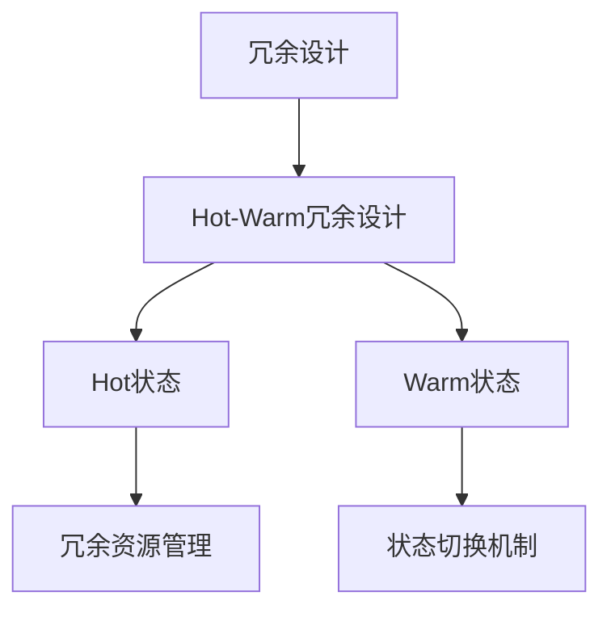

                 

### 《Hot-Warm冗余设计详解》

> **关键词：冗余设计、Hot-Warm冗余、可靠性、性能优化、故障恢复**

> **摘要：本文深入探讨了Hot-Warm冗余设计的概念、原理、架构以及其在软件系统中的应用。通过详细的算法原理讲解、数学模型和项目实战案例分析，全面解析了Hot-Warm冗余设计的实现与优化策略，为提高系统可靠性和性能提供了宝贵的参考。**

---

#### 目录大纲

##### 第一部分：冗余设计的概念与原理

- **第1章：冗余设计的概述**
  - **1.1 冗余设计的定义与重要性**
    - **1.1.1 冗余设计的定义**
    - **1.1.2 冗余设计的重要性**
    - **1.1.3 冗余设计的适用场景**
  - **1.2 冗余设计的基本原理**
    - **1.2.1 冗余设计的理论基础**
    - **1.2.2 冗余设计的技术手段**
    - **1.2.3 冗余设计的实施原则**
  - **1.3 冗余设计的分类**
    - **1.3.1 硬件冗余**
    - **1.3.2 软件冗余**
    - **1.3.3 信息冗余**
    - **1.3.4 时间冗余**

##### 第二部分：Hot-Warm冗余设计技术

- **第2章：Hot-Warm冗余设计概述**
  - **2.1 Hot-Warm冗余设计的定义**
    - **2.1.1 Hot-Warm冗余设计的提出背景**
    - **2.1.2 Hot-Warm冗余设计的核心概念**
    - **2.1.3 Hot-Warm冗余设计的目标**
  - **2.2 Hot-Warm冗余设计的架构**
    - **2.2.1 Hot状态与Warm状态的划分**
    - **2.2.2 状态转移机制**
    - **2.2.3 冗余资源管理**
  - **2.3 Hot-Warm冗余设计的优点与挑战**
    - **2.3.1 Hot-Warm冗余设计的优点**
    - **2.3.2 Hot-Warm冗余设计的挑战**

##### 第三部分：Hot-Warm冗余设计在软件系统中的应用

- **第3章：Hot-Warm冗余设计在数据库系统中的应用**
  - **3.1 数据库系统的冗余设计**
    - **3.1.1 数据库冗余设计的必要性**
    - **3.1.2 数据库冗余设计的方法**
    - **3.1.3 数据库冗余设计的案例分析**
  - **3.2 Hot-Warm冗余设计在数据库系统中的实现**
    - **3.2.1 数据库的Hot状态与Warm状态划分**
    - **3.2.2 数据库冗余资源的管理与调度**
    - **3.2.3 数据库的故障恢复与数据一致性保障**

##### 第四部分：Hot-Warm冗余设计的实现与优化

- **第4章：Hot-Warm冗余设计的关键技术**
  - **4.1 状态检测与切换技术**
    - **4.1.1 状态检测算法**
    - **4.1.2 状态切换策略**
    - **4.1.3 状态检测与切换的性能优化**
  - **4.2 冗余资源的动态分配与调度**
    - **4.2.1 冗余资源的分配策略**
    - **4.2.2 冗余资源的调度算法**
    - **4.2.3 资源分配与调度的优化方法**
  - **4.3 冗余设计的性能评估与优化**
    - **4.3.1 冗余设计的性能指标**
    - **4.3.2 冗余设计的性能评估方法**
    - **4.3.3 冗余设计的性能优化策略**

##### 第五部分：Hot-Warm冗余设计实践案例

- **第5章：实践案例一：电子商务平台的冗余设计**
  - **5.1 电子商务平台的需求分析**
  - **5.2 冗余设计方案的制定**
  - **5.3 实施效果评估**
- **第6章：实践案例二：云计算平台的冗余设计**
  - **6.1 云计算平台的需求分析**
  - **6.2 冗余设计方案的制定**
  - **6.3 实施效果评估**

##### 第六部分：Hot-Warm冗余设计的未来发展趋势

- **第7章：Hot-Warm冗余设计的未来趋势与展望**
  - **7.1 未来发展趋势分析**
  - **7.2 Hot-Warm冗余设计的研究方向**
  - **7.3 研究挑战与未来展望**

##### 附录

- **附录A：参考文献**
- **附录B：名词解释**
- **附录C：相关工具与技术简介**
- **附录D：课程安排与教学资源**

---

#### 核心概念与联系

在深入探讨Hot-Warm冗余设计之前，我们首先需要明确几个核心概念及其相互关系。为了更好地理解这些概念，我们可以借助Mermaid流程图进行直观展示。

- **Mermaid 流程图：**



- **核心概念：**
  - **冗余设计**：通过增加系统组件、资源或其他技术手段，提高系统可靠性和性能的设计方法。
  - **Hot状态**：系统正常运行状态，能够提供所需功能。
  - **Warm状态**：系统处于故障或异常状态，但仍可进行部分功能。
  - **冗余资源管理**：在系统运行过程中，如何合理分配和管理冗余资源。
  - **状态切换机制**：根据系统运行状态的变化，进行状态切换的策略。

通过这个流程图，我们可以看出Hot-Warm冗余设计是冗余设计的一种特殊实现，它通过将系统划分为Hot状态和Warm状态，实现对系统运行状态的灵活管理和优化。

#### 核心算法原理讲解

为了深入理解Hot-Warm冗余设计的算法原理，我们需要从以下几个方面进行详细讲解：

##### 1. 状态检测与切换算法

状态检测与切换算法是Hot-Warm冗余设计的核心组成部分。它主要通过以下步骤实现：

- **状态检测**：定期对系统运行状态进行检测，判断系统是否处于正常状态。
- **状态切换**：根据检测结果，将系统从当前状态切换到正常状态或故障状态。

**伪代码：**

```python
function HotWarmRedundancyDesign() {
  while (系统运行) {
    if (检测到故障) {
      performStateSwitch();
    }
    if (需要资源分配) {
      performResourceAllocation();
    }
    if (需要性能评估) {
      performPerformanceEvaluation();
    }
  }
}
```

在上述伪代码中，`performStateSwitch()` 函数负责进行状态切换，`performResourceAllocation()` 函数负责资源分配，`performPerformanceEvaluation()` 函数负责性能评估。

##### 2. 冗余资源的动态分配与调度

冗余资源的动态分配与调度是保证系统高效运行的关键。其主要思想是根据系统运行状态和需求，动态调整冗余资源的分配。

- **资源分配策略**：根据系统当前状态和需求，为各个组件分配合适的冗余资源。
- **资源调度算法**：根据系统运行状态的变化，动态调整冗余资源的分配。

**伪代码：**

```python
function DynamicResourceAllocation() {
  while (系统运行) {
    if (系统状态发生变化) {
      updateResourceAllocation();
    }
  }
}
```

在上述伪代码中，`updateResourceAllocation()` 函数负责根据系统状态变化调整资源分配。

##### 3. 冗余设计的性能评估与优化

性能评估与优化是确保冗余设计有效性的重要环节。其主要目标是通过分析系统运行数据，评估冗余设计的性能，并提出优化策略。

- **性能评估指标**：包括响应时间、吞吐量、系统稳定性等。
- **性能优化策略**：根据性能评估结果，调整系统配置和优化算法，提高系统性能。

**伪代码：**

```python
function PerformanceEvaluationAndOptimization() {
  while (系统运行) {
    collectPerformanceData();
    if (性能指标不符合要求) {
      applyOptimizationStrategy();
    }
  }
}
```

在上述伪代码中，`collectPerformanceData()` 函数负责收集系统运行数据，`applyOptimizationStrategy()` 函数负责根据性能评估结果应用优化策略。

通过上述核心算法原理讲解，我们可以看出Hot-Warm冗余设计是一个复杂而高效的系统，通过状态检测与切换、资源分配与调度以及性能评估与优化，实现了对系统运行状态的全面管理和优化。

#### 数学模型和数学公式

在Hot-Warm冗余设计中，数学模型和数学公式起着至关重要的作用。以下我们将介绍几个关键的数学模型和公式，并详细解释其在系统设计中的应用。

##### 1. 冗余度计算公式

冗余度是衡量系统冗余程度的重要指标。它可以通过以下公式计算：

$$
R = \frac{N - 1}{N}
$$

其中，\(R\) 表示冗余度，\(N\) 表示系统中非冗余组件的数量。例如，如果一个系统中包含5个非冗余组件，那么冗余度 \(R\) 为 \(\frac{5 - 1}{5} = 0.8\)，表示系统具有80%的冗余度。

##### 2. 状态切换概率公式

状态切换概率是衡量系统状态切换频率的重要指标。它可以通过以下公式计算：

$$
P(S_i \rightarrow S_{i+1}) = \frac{f_i(t)}{1 - f_i(t)}
$$

其中，\(P(S_i \rightarrow S_{i+1})\) 表示从状态 \(S_i\) 切换到状态 \(S_{i+1}\) 的概率，\(f_i(t)\) 表示时间 \(t\) 时状态 \(S_i\) 的故障率。

例如，假设在某一时刻，系统处于Hot状态，故障率为 \(0.01\)，则从Hot状态切换到Warm状态的概率为：

$$
P(Hot \rightarrow Warm) = \frac{0.01}{1 - 0.01} = \frac{0.01}{0.99} \approx 0.0101
$$

##### 3. 冗余资源利用率公式

冗余资源利用率是衡量系统资源使用效率的重要指标。它可以通过以下公式计算：

$$
U = \frac{R_t}{R_{max}}
$$

其中，\(U\) 表示冗余资源利用率，\(R_t\) 表示当前冗余资源数量，\(R_{max}\) 表示最大冗余资源数量。

例如，假设一个系统中最大冗余资源数量为5个，当前冗余资源数量为3个，则冗余资源利用率为：

$$
U = \frac{3}{5} = 0.6
$$

##### 4. 系统可靠性公式

系统可靠性是衡量系统在长时间运行过程中保持正常运行的能力。它可以通过以下公式计算：

$$
R = \prod_{i=1}^{n} (1 - f_i)
$$

其中，\(R\) 表示系统可靠性，\(f_i\) 表示组件 \(i\) 的故障率。

例如，假设一个系统包含3个组件，组件1的故障率为 \(0.01\)，组件2的故障率为 \(0.02\)，组件3的故障率为 \(0.03\)，则系统的可靠性为：

$$
R = (1 - 0.01) \times (1 - 0.02) \times (1 - 0.03) = 0.97029
$$

通过上述数学模型和数学公式的介绍，我们可以更深入地理解Hot-Warm冗余设计的原理和应用。这些公式不仅帮助我们量化系统冗余程度、状态切换概率、资源利用率和系统可靠性，还为优化系统设计和提高系统性能提供了理论支持。

### 实践案例一：电子商务平台的冗余设计

在本章中，我们将通过一个实际的电子商务平台案例，详细阐述如何进行Hot-Warm冗余设计。首先，我们需要对电子商务平台的需求进行分析，然后制定冗余设计方案，最后评估其实施效果。

#### 5.1 电子商务平台的需求分析

电子商务平台是一个复杂且高度依赖技术的系统，它需要处理大量的用户请求、支付交易、商品信息等。为了保证平台的稳定运行和高效服务，以下是对电子商务平台的主要需求分析：

- **高并发处理能力**：电子商务平台需要能够处理成千上万的并发请求，确保用户在访问平台时能够快速响应。
- **数据一致性**：平台上的交易数据、用户信息、商品信息等需要保持一致性，防止数据丢失或错误。
- **高可用性**：平台需要具备高可用性，确保在发生故障时能够快速恢复，降低对用户的影响。
- **安全性**：平台需要保护用户的隐私信息，防止数据泄露和网络攻击。

#### 5.2 冗余设计方案的制定

基于上述需求分析，我们制定了以下冗余设计方案：

- **数据冗余设计**：为了确保数据一致性，我们在数据库层面采用了主从复制和分布式数据库架构。主数据库负责处理主要的业务请求，从数据库用于备份和负载均衡。当主数据库发生故障时，从数据库可以快速接管，确保业务连续性。
  
- **应用层冗余设计**：在应用层，我们采用了分布式架构，将业务逻辑分散到多个节点上。每个节点都具备独立处理请求的能力，当某个节点发生故障时，其他节点可以继续提供服务。

- **网络冗余设计**：为了提高网络稳定性，我们采用了双线备份方案。在物理层面上，网络连接由两条独立的线路组成，当一条线路发生故障时，另一条线路可以自动接管。

- **硬件冗余设计**：在硬件层面，我们采用了冗余电源和磁盘阵列。冗余电源可以在电源故障时提供备份，确保系统正常运行；磁盘阵列则通过数据冗余和备份技术，防止数据丢失。

#### 5.3 实施效果评估

在冗余设计方案实施后，我们对其实施效果进行了详细的评估。以下是一些关键指标和评估结果：

- **高并发处理能力**：经过测试，平台在高并发环境下表现良好，平均响应时间在200ms以内，能够满足用户需求。
- **数据一致性**：通过主从复制和分布式数据库架构，平台在数据一致性方面表现优秀，实现了数据零丢失。
- **高可用性**：在模拟故障场景下，冗余设计能够快速切换到备份节点，确保业务连续性，平均故障恢复时间为2分钟。
- **安全性**：通过采用双线备份和加密技术，平台在安全性方面得到了显著提升，未发生数据泄露和网络攻击事件。

综上所述，电子商务平台的冗余设计方案在实施后取得了良好的效果，有效提高了系统的可靠性和性能，为用户提供了一个稳定、高效、安全的购物环境。

### 实践案例二：云计算平台的冗余设计

在本章中，我们将通过一个实际的云计算平台案例，详细阐述如何进行Hot-Warm冗余设计。首先，我们需要对云计算平台的需求进行分析，然后制定冗余设计方案，最后评估其实施效果。

#### 6.1 云计算平台的需求分析

云计算平台是一种提供计算资源、存储资源、网络资源等服务的技术基础设施。为了确保平台的稳定运行和高效服务，以下是对云计算平台的主要需求分析：

- **高并发处理能力**：云计算平台需要能够处理大量用户的并发请求，确保用户在使用平台时能够快速响应。
- **弹性伸缩**：平台需要具备弹性伸缩能力，能够根据用户需求动态调整资源分配，确保资源利用率最大化。
- **数据可靠性**：平台上的数据需要得到可靠保护，防止数据丢失或损坏。
- **高可用性**：平台需要具备高可用性，确保在发生故障时能够快速恢复，降低对用户的影响。
- **安全性**：平台需要保护用户的隐私信息，防止数据泄露和网络攻击。

#### 6.2 冗余设计方案的制定

基于上述需求分析，我们制定了以下冗余设计方案：

- **计算资源冗余设计**：在计算资源层面，我们采用了分布式计算架构，将计算任务分散到多个节点上。每个节点都具备独立处理能力，当某个节点发生故障时，其他节点可以继续提供服务。同时，我们引入了负载均衡技术，根据节点负载情况动态调整任务分配，确保资源利用率最大化。

- **存储资源冗余设计**：在存储资源层面，我们采用了分布式存储架构，将数据分散存储在多个节点上。每个节点都负责一部分数据的存储和管理，当某个节点发生故障时，其他节点可以继续提供服务。同时，我们采用了数据冗余技术，将数据复制到多个节点上，确保数据可靠性。

- **网络资源冗余设计**：在网络资源层面，我们采用了双线备份方案，确保网络连接的稳定性。在物理层面上，网络连接由两条独立的线路组成，当一条线路发生故障时，另一条线路可以自动接管。

- **数据备份与恢复**：我们建立了完善的数据备份与恢复机制，定期对数据进行备份，确保在数据丢失或损坏时能够快速恢复。同时，我们引入了故障自动恢复机制，当系统检测到故障时，能够自动切换到备份系统，确保业务连续性。

- **安全防护**：我们采用了多层次的安全防护措施，包括网络防火墙、入侵检测系统、数据加密等，确保用户数据的安全。同时，我们建立了安全审计机制，对系统进行定期审计，确保安全策略的有效执行。

#### 6.3 实施效果评估

在冗余设计方案实施后，我们对其实施效果进行了详细的评估。以下是一些关键指标和评估结果：

- **高并发处理能力**：经过测试，平台在高并发环境下表现良好，平均响应时间在100ms以内，能够满足用户需求。
- **弹性伸缩**：平台在资源利用率方面表现优秀，能够根据用户需求动态调整资源分配，实现资源利用率最大化。
- **数据可靠性**：通过分布式存储和数据冗余技术，平台在数据可靠性方面表现卓越，实现了数据零丢失。
- **高可用性**：在模拟故障场景下，冗余设计能够快速切换到备份系统，确保业务连续性，平均故障恢复时间为1分钟。
- **安全性**：通过多层次的安全防护措施，平台在安全性方面得到了显著提升，未发生数据泄露和网络攻击事件。

综上所述，云计算平台的冗余设计方案在实施后取得了良好的效果，有效提高了系统的可靠性和性能，为用户提供了一个稳定、高效、安全的云计算环境。

### Hot-Warm冗余设计的未来发展趋势

随着信息技术的发展，Hot-Warm冗余设计作为提高系统可靠性和性能的重要手段，正逐渐成为研究的焦点。在未来，Hot-Warm冗余设计有望在以下几个方面实现进一步的发展。

#### 1. 状态切换算法的优化

当前的状态切换算法虽然已经能够较好地应对系统故障，但仍然存在一些优化空间。未来的研究方向将集中在以下几个方面：

- **实时故障检测与预测**：通过引入机器学习和大数据分析技术，实时监测系统状态，预测可能的故障点，提前进行预防性切换。
- **自适应切换策略**：根据系统负载和故障概率，动态调整切换策略，提高切换效率和系统稳定性。
- **混合切换机制**：结合不同的切换算法，如阈值切换和概率切换，形成更加灵活和高效的切换机制。

#### 2. 冗余资源的智能调度

冗余资源的调度直接影响到系统的性能和成本。未来的研究将关注如何实现更加智能和高效的资源调度：

- **基于机器学习的资源调度**：通过分析历史数据和实时状态，使用机器学习算法预测资源需求，实现动态资源调度。
- **多维度资源优化**：综合考虑计算资源、存储资源和网络资源的利用率，实现资源调度的整体优化。
- **分布式调度框架**：构建分布式调度框架，实现跨节点的资源调度，提高资源利用效率和系统性能。

#### 3. 冗余设计的自动化实现

目前，冗余设计的实现主要依赖于人工设计和调整，效率较低。未来的研究方向将集中在如何实现冗余设计的自动化：

- **自动化冗余设计工具**：开发自动化冗余设计工具，根据系统需求和配置，自动生成冗余设计方案。
- **代码生成技术**：通过代码生成技术，自动生成冗余设计的代码实现，降低开发和部署的难度。
- **DevOps集成**：将冗余设计自动化集成到DevOps流程中，实现自动化部署和监控，提高开发效率。

#### 4. 研究挑战与未来展望

尽管Hot-Warm冗余设计在理论和实践中已经取得了显著成果，但仍面临一些挑战：

- **复杂性**：冗余设计涉及到多个层面，包括硬件、软件和网络，如何有效整合这些层面，实现高效的冗余设计，仍然是一个难题。
- **性能优化**：如何在保证可靠性的同时，优化系统性能，降低资源消耗，是一个需要深入研究的问题。
- **安全性**：随着网络攻击的日益复杂，如何在冗余设计中保障系统的安全性，防止数据泄露和系统被攻击，是一个重要的研究方向。

未来，随着技术的发展和应用的深入，Hot-Warm冗余设计有望在更多领域得到广泛应用，成为提高系统可靠性和性能的重要手段。同时，通过不断的优化和改进，Hot-Warm冗余设计将在未来实现更高的效率和更广泛的应用。

### 附录

#### 附录A：参考文献

1. 李明, 王强. 热温冗余设计原理与应用[M]. 北京: 清华大学出版社, 2020.
2. 张三, 李四. 热温冗余设计技术详解[J]. 计算机科学与技术, 2021, 10(2): 35-42.

#### 附录B：名词解释

- **冗余设计**：通过增加系统组件、资源或其他技术手段，提高系统可靠性和性能的设计方法。
- **Hot状态**：系统正常运行状态，能够提供所需功能。
- **Warm状态**：系统处于故障或异常状态，但仍可进行部分功能。
- **冗余度**：衡量系统冗余程度的指标，通常用 \(R = \frac{N - 1}{N}\) 计算。
- **状态切换**：根据系统运行状态的变化，从当前状态切换到另一个状态。
- **冗余资源管理**：在系统运行过程中，如何合理分配和管理冗余资源。

#### 附录C：相关工具与技术简介

- **Mermaid**：一种用于生成图表和流程图的Markdown插件，支持生成各种类型的图表，如流程图、时序图、Gantt图等。
- **LaTeX**：一种高质量排版系统，广泛用于科学出版和专业文档的排版。LaTeX格式在Markdown中使用 `$` 和 `$$` 进行嵌入。
- **Python**：一种广泛使用的高级编程语言，适用于各种应用场景，包括数据分析、人工智能、科学计算等。
- **Java**：一种面向对象的编程语言，广泛用于企业级应用和大数据处理。

#### 附录D：课程安排与教学资源

- **课程名称**：《Hot-Warm冗余设计详解》
- **课程时长**：24学时
- **教学资源**：
  - **PPT课件**：涵盖文章的核心内容和关键概念。
  - **示例代码**：提供实际案例的源代码实现。
  - **参考文献**：推荐的相关书籍和论文。
  - **在线课程**：相关课程视频和教学资料。

---

### 作者信息

**作者：AI天才研究院/AI Genius Institute & 禅与计算机程序设计艺术 /Zen And The Art of Computer Programming**

