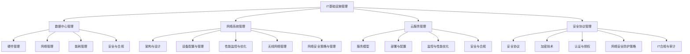

                 

### 引言

**关键词：** IT基础设施管理、数据中心、网络系统、云服务、安全协议、业务运营

在当今数字化时代，IT基础设施管理已成为企业成功运营的关键要素。IT基础设施管理涉及对数据中心、网络系统、云服务和安全协议等进行全面的开发和管理，以确保企业业务的高效、稳定和安全性。

**1.1 IT基础设施管理的意义**

IT基础设施管理对企业的意义不可小觑。首先，它能够为企业提供稳定且高效的技术支持，确保业务流程不受技术问题的干扰。其次，有效的IT基础设施管理有助于降低运营成本，提高资源利用率。最后，它能够保障企业的信息安全，防范潜在的网络威胁。

**1.2 IT基础设施管理的发展历程**

IT基础设施管理经历了几个重要的发展阶段：

- **早期阶段**：主要以硬件管理和基本网络搭建为主，管理方式较为简单。
- **发展阶段**：随着虚拟化技术的普及，数据中心和云服务的出现，IT基础设施管理变得更加复杂，需要更多专业知识和技能。
- **智能化阶段**：近年来，人工智能和大数据技术的应用，使得IT基础设施管理逐渐智能化，自动化水平不断提高。

**1.3 IT基础设施管理的关键要素**

IT基础设施管理的关键要素包括：

- **硬件管理**：对服务器、存储设备、网络设备等进行有效管理。
- **网络管理**：确保网络架构的稳定性和性能。
- **数据中心管理**：包括数据中心的设计、规划、能耗管理和安全等。
- **云服务管理**：对云计算资源进行有效的配置、监控和安全保障。
- **安全协议管理**：确保网络和数据的完整性、机密性和可用性。

**1.4 IT基础设施管理在业务运营中的作用**

IT基础设施管理在业务运营中发挥着至关重要的作用：

- **支持业务发展**：通过提供稳定、高效的技术支持，推动业务发展。
- **提高运营效率**：通过自动化和智能化管理，降低运营成本，提高资源利用率。
- **保障信息安全**：通过完善的安全协议和措施，确保企业数据的安全性和隐私性。
- **增强业务连续性**：通过有效的备份和恢复策略，确保业务在发生灾难时能够迅速恢复。

**总结**

随着技术的不断进步和数字化转型的发展，IT基础设施管理的重要性日益凸显。有效的IT基础设施管理不仅能够提高企业的运营效率，还能保障业务的安全和稳定。在接下来的章节中，我们将深入探讨数据中心管理、网络系统管理、云服务管理、安全协议管理等方面的具体内容，以便更好地理解IT基础设施管理的全貌。让我们一步步地分析这些关键要素，共同探索IT基础设施管理的奥秘。

### 第1章 引言

**关键词：** 数据中心管理、网络系统管理、云服务管理、安全协议管理、业务运营

在引言部分，我们简要介绍了IT基础设施管理的意义、发展历程、关键要素以及在业务运营中的作用。接下来，我们将详细探讨数据中心管理、网络系统管理、云服务管理和安全协议管理等内容，以便更深入地理解IT基础设施管理的全貌。

**2.1 数据中心管理**

数据中心是IT基础设施的核心，它负责存储、处理和传输大量数据。数据中心管理包括以下几个方面：

- **数据中心的设计与规划**：数据中心的设计和规划需要考虑到硬件配置、网络架构、能耗管理等因素，以确保数据中心的稳定运行。
- **数据中心硬件管理**：对服务器、存储设备、网络设备等进行有效管理，确保设备的正常运行。
- **数据中心网络管理**：确保数据中心内部网络架构的稳定性和性能，包括交换机、路由器等网络设备的配置和管理。
- **数据中心能耗管理**：通过节能技术和管理措施，降低数据中心的能耗，提高能源利用效率。
- **数据中心安全与合规**：确保数据中心的安全性，防止数据泄露和系统故障，同时遵守相关法律法规和标准。

**2.2 网络系统管理**

网络系统是连接企业内部和外部的重要基础设施。网络系统管理包括以下几个方面：

- **网络系统的架构与设计**：根据企业的业务需求，设计合适的网络架构，包括局域网、广域网和互联网等。
- **网络设备的配置与管理**：对交换机、路由器、防火墙等网络设备进行配置和管理，确保网络性能和安全性。
- **网络性能监控与优化**：通过监控网络性能指标，及时发现并解决网络故障，优化网络架构和配置。
- **无线网络管理**：对无线网络进行管理，包括无线接入点、无线控制器等设备的配置和优化。
- **网络安全策略与管理**：制定和实施网络安全策略，防止网络攻击和数据泄露。

**2.3 云服务管理**

随着云计算技术的发展，越来越多的企业将业务迁移到云端。云服务管理包括以下几个方面：

- **云服务概述**：了解不同类型的云服务模型（IaaS、PaaS、SaaS），以及它们的特点和应用场景。
- **云服务的部署与配置**：根据企业的需求，选择合适的云服务模型，进行部署和配置。
- **云服务监控与性能优化**：监控云服务的性能指标，及时发现并解决性能瓶颈，优化资源配置。
- **云服务的安全与合规**：确保云服务的安全性，防止数据泄露和系统故障，同时遵守相关法律法规和标准。

**2.4 安全协议与管理**

在信息化时代，信息安全至关重要。安全协议与管理包括以下几个方面：

- **安全协议概述**：了解常见的安全协议（如SSL、TLS等），以及它们的作用和应用场景。
- **加密技术与应用**：掌握加密技术的基本原理，了解如何在网络传输过程中应用加密技术保护数据安全。
- **认证与授权机制**：了解认证与授权机制的基本原理，确保只有授权用户才能访问系统和数据。
- **网络安全防护策略**：制定和实施网络安全防护策略，防范网络攻击和数据泄露。
- **IT合规与审计**：确保企业遵守相关法律法规和标准，进行定期审计，发现并整改潜在的安全隐患。

**总结**

在本章中，我们详细探讨了数据中心管理、网络系统管理、云服务管理和安全协议管理等内容，这些是IT基础设施管理的核心组成部分。在接下来的章节中，我们将继续深入探讨IT基础设施监控与维护、IT基础设施管理最佳实践、挑战与未来趋势等方面的内容，以便更全面地理解IT基础设施管理的全貌。让我们继续一步步地分析这些关键要素，共同探索IT基础设施管理的奥秘。

### 数据中心管理

**关键词：** 数据中心、设计规划、硬件管理、网络管理、能耗管理、安全与合规

数据中心作为IT基础设施的核心，承担着数据存储、处理和传输的重要任务。有效管理数据中心，对于保障业务运营的连续性和稳定性至关重要。以下将详细探讨数据中心管理的各个方面。

**2.1 数据中心的概述**

数据中心（Data Center）是指用于存储、处理和传输大量数据的建筑设施。数据中心通常包括以下几个关键部分：

- **服务器**：负责数据处理和存储。
- **存储设备**：用于存储大量数据。
- **网络设备**：包括交换机、路由器、防火墙等，用于数据传输和网络安全。
- **电源和冷却系统**：确保数据中心的稳定供电和适当的温度控制。
- **备用系统和设备**：包括UPS（不间断电源）、备用服务器和存储设备，用于应对突发情况。

**2.2 数据中心的设计与规划**

数据中心的设计与规划是确保其高效、稳定运行的基础。以下是一些关键步骤：

- **需求分析**：根据企业的业务需求，确定数据中心的规模和功能。
- **布局设计**：设计数据中心的物理布局，包括服务器机柜、存储区域、网络设备区域等。
- **网络架构设计**：设计数据中心的网络架构，包括内部网络、外部网络和备份网络等。
- **能源规划**：规划数据中心的能源需求，包括电力供应、备用电源和冷却系统等。
- **安全规划**：设计数据中心的安全措施，包括物理安全、网络安全和访问控制等。

**2.3 数据中心硬件管理**

数据中心硬件管理包括以下方面：

- **服务器管理**：监控服务器的运行状态，确保其稳定运行；定期更新服务器硬件和软件。
- **存储设备管理**：监控存储设备的性能和容量，确保数据存储的安全和高效。
- **网络设备管理**：配置和管理网络设备，确保数据传输的稳定性和安全性。
- **电源和冷却系统管理**：监控电源和冷却系统的运行状态，确保数据中心的稳定供电和温度控制。

**2.4 数据中心网络管理**

数据中心网络管理包括以下方面：

- **网络架构管理**：监控网络架构的性能和稳定性，确保数据传输的效率。
- **网络设备管理**：配置和管理网络设备，确保数据传输的顺畅。
- **网络安全管理**：实施网络安全策略，防止网络攻击和数据泄露。
- **负载均衡**：通过负载均衡技术，合理分配网络负载，提高网络性能。

**2.5 数据中心能耗管理**

数据中心能耗管理是降低运营成本、实现绿色环保的重要措施。以下是一些关键步骤：

- **能效评估**：评估数据中心的能耗水平，找出能耗较高的设备和系统。
- **节能措施**：实施节能措施，如优化设备配置、采用节能设备、改进冷却系统等。
- **能源监控**：实时监控数据中心的能源消耗情况，及时发现并解决能耗问题。
- **能耗报告**：定期生成能耗报告，分析能耗趋势，优化能耗管理。

**2.6 数据中心安全与合规**

数据中心安全与合规是保障数据安全、符合法律法规的关键。以下是一些关键步骤：

- **物理安全**：确保数据中心的物理安全，防止未经授权的访问和破坏。
- **网络安全**：实施网络安全策略，防止网络攻击和数据泄露。
- **访问控制**：通过身份验证和权限控制，确保只有授权人员才能访问系统和数据。
- **合规性检查**：确保数据中心遵守相关法律法规和标准，如ISO 27001、GDPR等。

**总结**

数据中心管理是IT基础设施管理的重要组成部分，涉及多个方面，包括设计规划、硬件管理、网络管理、能耗管理和安全与合规等。有效管理数据中心，不仅能够提高业务运营的连续性和稳定性，还能降低运营成本，提高资源利用率。在接下来的章节中，我们将继续探讨网络系统管理、云服务管理、安全协议管理等内容，以全面了解IT基础设施管理的方方面面。

### 网络系统管理

**关键词：** 网络系统、架构与设计、设备配置与管理、性能监控与优化、无线网络管理、网络安全策略与管理

网络系统是企业内部和外部通信的基础设施，其稳定性和性能直接影响到企业的业务运营。网络系统管理包括对网络架构、设备配置、性能监控、无线网络管理和网络安全策略等多个方面的全面管理。以下将详细探讨网络系统管理的各个方面。

**3.1 网络系统的架构与设计**

网络系统的架构与设计是确保网络稳定性和性能的基础。网络架构的设计需要考虑以下几个关键因素：

- **拓扑结构**：常见的网络拓扑结构包括星型、环型、总线型和混合型。根据企业的业务需求，选择合适的拓扑结构。
- **网络层次**：设计网络层次结构，包括核心层、分布层和接入层，确保网络的高效性和可扩展性。
- **带宽规划**：根据企业的数据传输需求，合理规划网络带宽，确保网络传输的顺畅。
- **冗余设计**：设计冗余网络，通过备份链路和设备，提高网络的可靠性。

**3.2 网络设备的配置与管理**

网络设备的配置与管理是确保网络稳定性和性能的关键。以下是一些关键步骤：

- **交换机配置**：配置交换机，包括VLAN划分、端口设置、流量控制等，确保交换机的正常运行。
- **路由器配置**：配置路由器，包括路由策略、NAT（网络地址转换）、安全策略等，确保数据包的正确传输。
- **防火墙配置**：配置防火墙，包括防火墙策略、访问控制列表（ACL）、入侵检测系统（IDS）等，确保网络的安全性。
- **设备监控**：实时监控网络设备的运行状态，包括CPU利用率、内存占用、网络流量等，确保设备正常运行。

**3.3 网络性能监控与优化**

网络性能监控与优化是确保网络稳定性和性能的重要手段。以下是一些关键步骤：

- **性能监控**：使用网络监控工具，如Nagios、Zabbix等，实时监控网络性能指标，包括带宽利用率、延迟、丢包率等。
- **故障排查**：通过监控数据和日志分析，及时发现网络故障，并定位故障原因。
- **性能优化**：根据监控数据，优化网络配置和架构，提高网络性能。例如，通过调整路由策略、增加带宽、优化负载均衡等手段。
- **流量分析**：使用流量分析工具，如Wireshark等，分析网络流量，找出性能瓶颈，并采取相应的优化措施。

**3.4 无线网络管理**

无线网络管理是现代网络系统的重要组成部分。以下是一些关键步骤：

- **无线网络规划**：根据企业的业务需求，合理规划无线网络覆盖范围和信号强度。
- **设备配置**：配置无线接入点（AP）和无线控制器，确保无线网络的稳定性和性能。
- **安全策略**：实施无线网络安全策略，包括无线加密、认证、访问控制等，防止无线网络被非法入侵。
- **监控与优化**：实时监控无线网络的运行状态，包括信号强度、接入用户数、网络速度等，确保无线网络的稳定性和性能。

**3.5 网络安全策略与管理**

网络安全策略与管理是确保网络数据安全的关键。以下是一些关键步骤：

- **安全策略制定**：根据企业的业务需求，制定网络安全策略，包括访问控制、防火墙策略、入侵检测等。
- **安全设备配置**：配置防火墙、入侵检测系统（IDS）、入侵防御系统（IPS）等安全设备，确保网络的安全性。
- **安全监控**：实时监控网络安全事件，包括入侵尝试、恶意软件感染等，确保及时发现并应对安全威胁。
- **安全培训**：对员工进行安全培训，提高员工的安全意识和技能，防范内部威胁。

**总结**

网络系统管理是IT基础设施管理的重要组成部分，涉及网络架构与设计、设备配置与管理、性能监控与优化、无线网络管理和网络安全策略与管理等多个方面。通过有效的网络系统管理，企业能够确保网络的稳定性和性能，保障业务运营的连续性和安全性。在接下来的章节中，我们将继续探讨云服务管理和安全协议管理等内容，以全面了解IT基础设施管理的方方面面。

### 云服务管理

**关键词：** 云服务、服务模型、部署与配置、监控与性能优化、安全与合规

随着云计算技术的发展，越来越多的企业将业务迁移到云端，云服务管理成为IT基础设施管理的重要环节。云服务管理包括对不同的云服务模型进行部署与配置、监控与性能优化，以及确保安全与合规。以下将详细探讨云服务管理的各个方面。

**4.1 云服务概述**

云服务是指通过互联网提供的一系列计算资源、存储资源、应用程序和服务。云服务具有弹性、可扩展性和灵活性，可以根据企业的需求进行灵活配置和调整。云服务主要包括以下几种类型：

- **基础设施即服务（IaaS）**：提供虚拟化的基础设施资源，如虚拟机、存储和网络，用户可以根据需要自定义操作系统和应用程序。
- **平台即服务（PaaS）**：提供开发、运行和管理应用程序的平台，用户无需关心底层基础设施的管理。
- **软件即服务（SaaS）**：提供应用程序和服务，用户可以通过互联网访问和使用，无需安装和配置。

**4.2 云服务模型**

云服务模型分为IaaS、PaaS和SaaS，每种模型都有其独特的特点和适用场景。

- **IaaS**：IaaS提供虚拟化的基础设施资源，如虚拟机、存储和网络。用户可以根据需求自定义操作系统和应用程序。IaaS适用于需要高度定制化和控制的企业，如大型企业、科研机构等。
- **PaaS**：PaaS提供开发、运行和管理应用程序的平台，用户无需关心底层基础设施的管理。PaaS适用于开发者和企业，可以快速构建和部署应用程序。
- **SaaS**：SaaS提供应用程序和服务，用户可以通过互联网访问和使用，无需安装和配置。SaaS适用于各种规模的企业，如中小企业、金融机构等。

**4.3 云服务的部署与配置**

云服务的部署与配置是云服务管理的重要环节。以下是一些关键步骤：

- **需求分析**：根据企业的业务需求，确定所需的云服务类型和资源。
- **资源规划**：根据需求，选择合适的云服务提供商，规划所需的资源，如虚拟机、存储、网络等。
- **部署**：在云服务提供商提供的平台上，进行云服务的部署，包括虚拟机启动、存储配置、网络连接等。
- **配置**：配置云服务的各项参数，如网络设置、安全策略、访问控制等。

**4.4 云服务监控与性能优化**

云服务监控与性能优化是确保云服务稳定性和性能的关键。以下是一些关键步骤：

- **监控**：使用云服务提供商提供的监控工具，实时监控云服务的性能指标，如CPU利用率、内存占用、网络流量等。
- **性能优化**：根据监控数据，优化云服务的配置和资源分配，如调整虚拟机规格、增加存储容量等。
- **故障排查**：通过监控数据和日志分析，及时发现并解决云服务故障，确保服务的连续性和稳定性。

**4.5 云服务的安全与合规**

云服务的安全与合规是确保企业数据安全、符合法律法规的关键。以下是一些关键步骤：

- **安全策略制定**：根据企业的业务需求，制定云服务的安全策略，包括数据加密、访问控制、网络安全等。
- **安全配置**：配置云服务的安全措施，如启用数据加密、设置访问控制列表等。
- **安全监控**：实时监控云服务的安全事件，如入侵尝试、数据泄露等，确保及时发现并应对安全威胁。
- **合规性检查**：确保云服务符合相关法律法规和标准，如ISO 27001、GDPR等，定期进行合规性审计。

**总结**

云服务管理是IT基础设施管理的重要组成部分，涉及云服务模型的部署与配置、监控与性能优化，以及确保安全与合规。通过有效的云服务管理，企业能够充分利用云计算的弹性、可扩展性和灵活性，提高业务运营的连续性和效率。在接下来的章节中，我们将继续探讨安全协议管理与IT基础设施监控与维护等方面的内容，以全面了解IT基础设施管理的方方面面。

### 安全协议与管理

**关键词：** 安全协议、加密技术、认证与授权、网络安全防护策略、IT合规与审计

在信息化时代，信息安全是每个企业都不能忽视的重要问题。安全协议与管理是确保网络和数据安全的关键环节，包括加密技术、认证与授权、网络安全防护策略以及IT合规与审计等方面。以下将详细探讨这些内容。

**5.1 安全协议概述**

安全协议是指在通信过程中，用于保护数据完整性和保密性的规范和规则。常见的安全协议包括：

- **SSL/TLS**：用于保护Web通信的安全协议，确保数据在传输过程中的加密和完整性。
- **IPSec**：用于保护IP层通信的安全协议，可以在网络层提供加密和认证。
- **SSH**：用于远程登录和文件传输的安全协议，确保数据传输的安全。
- **KMIP**：用于存储设备加密管理的安全协议，确保数据存储的安全。

**5.2 加密技术与应用**

加密技术是信息安全的核心，通过加密算法，将明文数据转换为密文，确保数据在传输和存储过程中的安全。常见的加密技术包括：

- **对称加密**：使用相同的密钥进行加密和解密，如AES、DES。
- **非对称加密**：使用公钥和私钥进行加密和解密，如RSA、ECC。
- **哈希算法**：用于生成数据的摘要，如MD5、SHA-1。

加密技术在网络通信中的应用包括：

- **数据加密**：在数据传输过程中，对数据进行加密，确保数据在传输过程中的保密性。
- **身份认证**：使用加密技术，确保通信双方的身份真实性和完整性。
- **数字签名**：使用非对称加密技术，对数据进行签名，确保数据的完整性和不可否认性。

**5.3 认证与授权机制**

认证与授权机制是确保只有授权用户才能访问系统和数据的关键。常见的认证与授权机制包括：

- **用户认证**：通过用户名和密码、证书等方式，验证用户的身份。
- **访问控制**：根据用户的身份和权限，控制用户对系统和数据的访问。
- **多因素认证**：结合密码、指纹、短信验证码等多种认证方式，提高认证的安全性。

**5.4 网络安全防护策略**

网络安全防护策略是防范网络攻击和数据泄露的关键。以下是一些常见的网络安全防护策略：

- **防火墙**：通过过滤网络流量，防止非法访问和攻击。
- **入侵检测系统（IDS）**：实时监控网络流量，检测并响应入侵行为。
- **入侵防御系统（IPS）**：在入侵检测系统的基础上，主动阻止入侵行为。
- **安全信息与事件管理（SIEM）**：整合安全信息和事件，实现集中监控和管理。

**5.5 IT合规与审计**

IT合规与审计是确保企业遵守相关法律法规和标准的关键。以下是一些关键步骤：

- **合规性评估**：评估企业是否遵守相关法律法规和标准，如ISO 27001、GDPR等。
- **合规性改进**：根据评估结果，改进企业的安全管理和措施，确保合规性。
- **审计**：定期进行IT审计，检查企业是否遵守相关法律法规和标准，发现并整改潜在的安全隐患。
- **合规性报告**：生成合规性报告，向管理层和监管机构展示企业的合规情况。

**总结**

安全协议与管理是确保网络和数据安全的关键环节，涉及加密技术、认证与授权、网络安全防护策略以及IT合规与审计等方面。通过有效的安全协议与管理，企业能够确保网络和数据的完整性、机密性和可用性，防范潜在的安全威胁。在接下来的章节中，我们将继续探讨IT基础设施监控与维护以及IT基础设施管理最佳实践等内容，以全面了解IT基础设施管理的方方面面。

### IT基础设施监控与维护

**关键词：** IT基础设施监控、重要性、监控工具与技术、故障排除与维护、持续改进与优化、业务连续性与灾难恢复

IT基础设施监控与维护是确保企业IT系统稳定运行、高效运行的关键环节。有效的监控与维护不仅能及时发现和解决问题，还能优化资源配置，提高系统性能。以下将详细探讨IT基础设施监控与维护的各个方面。

**6.1 IT基础设施监控的重要性**

IT基础设施监控的重要性体现在以下几个方面：

- **保障业务连续性**：通过实时监控，及时发现并处理潜在问题，确保业务运营的连续性和稳定性。
- **优化系统性能**：通过监控系统性能指标，分析系统瓶颈，优化资源配置，提高系统性能。
- **降低运营成本**：通过监控和自动化维护，减少人工干预，降低运营成本。
- **提高安全性**：通过实时监控网络安全事件，及时发现并应对安全威胁，保障企业数据安全。

**6.2 监控工具与技术**

IT基础设施监控工具和技术包括以下几个方面：

- **日志管理**：通过收集和分析系统日志，监控系统运行状态，发现潜在问题。
- **性能监控**：通过监控系统性能指标（如CPU利用率、内存占用、磁盘I/O等），分析系统性能，优化资源配置。
- **网络监控**：通过监控网络流量、网络设备状态等，确保网络稳定性和性能。
- **自动化工具**：使用自动化工具，如脚本、自动化运维平台等，实现监控任务的自动化执行。
- **集成与告警**：将不同监控工具的数据集成到一个平台，实现统一监控和告警，提高监控效率。

**6.3 故障排除与维护**

故障排除与维护是IT基础设施监控的重要任务。以下是一些关键步骤：

- **故障诊断**：通过监控数据和日志分析，定位故障原因。
- **故障排除**：根据故障原因，采取相应的措施，如重启服务、修复软件漏洞等。
- **系统维护**：定期进行系统维护，包括软件升级、硬件保养等，确保系统正常运行。
- **备份与恢复**：定期进行数据备份，确保在发生故障时能够迅速恢复系统。

**6.4 持续改进与优化**

持续改进与优化是提高IT基础设施稳定性和性能的关键。以下是一些关键步骤：

- **性能分析**：通过监控数据，分析系统性能瓶颈，找出优化空间。
- **资源调整**：根据性能分析结果，调整系统资源配置，如增加CPU、内存等。
- **架构优化**：优化系统架构，提高系统可扩展性和稳定性。
- **自动化运维**：通过自动化工具，实现监控、故障排除、维护等任务的自动化执行，提高运维效率。

**6.5 业务连续性与灾难恢复**

业务连续性与灾难恢复是确保企业能够应对突发事件、确保业务不中断的关键。以下是一些关键步骤：

- **业务连续性规划**：制定业务连续性计划，明确业务关键节点和备用方案。
- **灾难恢复计划**：制定灾难恢复计划，明确数据备份、系统恢复等措施。
- **定期演练**：定期进行业务连续性和灾难恢复演练，确保计划的可行性和有效性。
- **应急响应**：在发生突发事件时，迅速响应，执行业务连续性和灾难恢复计划。

**总结**

IT基础设施监控与维护是确保企业IT系统稳定、高效运行的关键。通过有效的监控与维护，企业能够及时发现和解决问题，优化资源配置，提高系统性能，确保业务连续性和数据安全。在接下来的章节中，我们将继续探讨IT基础设施管理的最佳实践、挑战与未来趋势等内容，以全面了解IT基础设施管理的方方面面。

### IT基础设施管理最佳实践

**关键词：** 基础设施管理流程、IT服务管理（ITSM）框架、团队协作与沟通、培训与发展、案例分析

在IT基础设施管理中，遵循最佳实践是确保高效管理、提高业务连续性和降低风险的关键。以下将详细探讨IT基础设施管理最佳实践中的关键要素。

**7.1 基础设施管理流程**

基础设施管理流程是指管理IT基础设施的一系列步骤和活动。以下是一些关键流程：

- **需求分析**：根据业务需求，确定所需的基础设施资源和配置。
- **设计规划**：设计基础设施架构，包括数据中心、网络、存储和备份等。
- **部署实施**：根据设计规划，部署和配置基础设施资源。
- **监控与维护**：实时监控基础设施性能，进行故障排除和维护。
- **优化调整**：根据监控数据和分析结果，优化基础设施配置和资源分配。
- **备份与恢复**：定期进行数据备份，确保在发生故障时能够快速恢复。

**7.2 IT服务管理（ITSM）框架**

IT服务管理（ITSM）框架是一套系统化的方法和工具，用于管理IT服务及其生命周期。以下是一些常见的ITSM框架：

- **ITIL（信息技术基础架构库）**：提供IT服务管理的过程、功能和实践，包括服务战略、服务设计、服务过渡、服务运营和服务改进等。
- **ITSM工具**：如ServiceNow、Microsoft System Center等，用于实现ITSM流程和功能。
- **流程自动化**：通过自动化工具，实现ITSM流程的自动化执行，提高管理效率和准确性。

**7.3 团队协作与沟通**

有效的团队协作与沟通是确保IT基础设施管理成功的关键。以下是一些关键措施：

- **明确职责**：明确团队成员的职责和角色，确保分工明确、协作顺畅。
- **沟通机制**：建立有效的沟通机制，如定期会议、即时通讯工具等，确保信息流通。
- **知识共享**：鼓励团队成员分享知识和经验，提高整体能力。
- **跨部门协作**：与其他部门（如业务部门、安全部门等）建立良好的协作关系，确保基础设施管理符合业务需求。

**7.4 培训与发展**

培训与发展是提高团队能力和技能的关键。以下是一些关键措施：

- **培训计划**：根据业务需求和团队发展目标，制定培训计划。
- **技能提升**：通过内部培训、外部培训、在线学习等方式，提高团队成员的技能和知识。
- **认证与资格**：鼓励团队成员参加专业认证，提高专业水平和竞争力。
- **职业规划**：为团队成员制定职业规划，提供职业发展机会。

**7.5 案例分析**

以下是一些实际企业的IT基础设施管理案例：

- **案例1：某大型企业数据中心迁移**：该企业通过ITSM框架和自动化工具，成功完成了数据中心迁移，提高了业务连续性和系统性能。
- **案例2：某金融机构云服务优化**：该金融机构通过优化云资源配置和监控，降低了运营成本，提高了系统性能和可靠性。
- **案例3：某中小企业IT基础设施维护**：该中小企业通过定期监控、故障排除和优化，确保了IT基础设施的稳定运行，提高了业务连续性。

**总结**

遵循IT基础设施管理最佳实践，企业能够提高基础设施管理的效率、降低风险、提高业务连续性和系统性能。通过基础设施管理流程、ITSM框架、团队协作与沟通、培训与发展以及案例分析，企业能够不断完善和优化IT基础设施管理。在未来的IT基础设施管理中，企业应继续探索和应用最佳实践，以应对不断变化的技术和业务需求。

### 挑战与未来趋势

**关键词：** IT基础设施管理挑战、未来趋势、智能化与自动化、数字化转型与可持续发展

在IT基础设施管理的不断发展中，企业面临着一系列挑战和机遇。如何应对这些挑战，抓住未来趋势，是实现企业持续发展的关键。以下将探讨当前IT基础设施管理面临的挑战及未来趋势。

**8.1 IT基础设施管理面临的挑战**

**1. 复杂性增加**：随着云计算、大数据、物联网等技术的发展，IT基础设施的复杂度不断增加，管理和维护的难度也随之增加。

**2. 安全风险**：网络攻击、数据泄露等安全事件频发，企业需要投入更多资源和精力来确保数据安全和系统稳定。

**3. 成本压力**：企业在IT基础设施方面的投入不断增加，如何提高资源利用率、降低运营成本成为一大挑战。

**4. 业务需求变化**：业务需求的快速变化要求IT基础设施具备更高的灵活性和可扩展性，这对管理提出了更高的要求。

**5. 人才短缺**：随着技术快速发展，企业对IT专业人才的需求日益增长，但人才供给不足，成为IT基础设施管理的一大挑战。

**8.2 IT基础设施管理的未来趋势**

**1. 智能化与自动化**：随着人工智能和大数据技术的发展，智能化和自动化将成为IT基础设施管理的趋势。通过自动化工具和人工智能算法，企业可以更高效地管理基础设施，提高系统性能和可靠性。

**2. 数字化转型**：数字化转型已成为企业提升竞争力、实现业务增长的重要手段。企业需要将IT基础设施与业务流程深度融合，实现数字化运营和智能化决策。

**3. 可持续发展**：随着全球环保意识的提高，可持续发展成为企业关注的重点。企业需要通过优化资源配置、采用绿色技术等手段，降低能耗、减少碳排放，实现绿色可持续发展。

**4. 云原生架构**：云原生架构（Cloud Native Architecture）以其弹性、可扩展性和高性能等特点，逐渐成为企业构建IT基础设施的新选择。通过云原生架构，企业可以实现快速部署、灵活扩展和高效管理。

**8.3 智能化与自动化**

智能化与自动化是IT基础设施管理的未来趋势。通过引入人工智能、机器学习等技术，企业可以实现：

- **自动化的故障检测与修复**：使用机器学习算法，对系统日志和性能数据进行分析，自动识别潜在故障并自动修复。
- **智能化的资源调度**：根据业务需求和系统负载，自动调整资源分配，提高资源利用率。
- **智能化的安全防护**：通过人工智能技术，实时监控网络安全事件，自动识别和应对安全威胁。

**8.4 数字化转型与可持续发展**

数字化转型与可持续发展是未来企业发展的关键。通过以下措施，企业可以实现：

- **数字化运营**：将数字化技术应用于业务流程，提高业务效率，降低运营成本。
- **智能化决策**：通过大数据分析和人工智能算法，实现数据驱动的决策，提高业务竞争力。
- **绿色可持续发展**：采用绿色技术，如虚拟化、节能技术等，降低能耗、减少碳排放，实现可持续发展。

**总结**

当前，IT基础设施管理面临着诸多挑战，但同时也迎来了前所未有的机遇。通过智能化与自动化、数字化转型与可持续发展等未来趋势，企业可以更好地应对挑战，实现业务的持续增长和可持续发展。在未来的发展中，企业应积极拥抱新技术，优化基础设施管理，以应对不断变化的市场需求和技术挑战。

### 附录

**附录A: IT基础设施管理核心概念与联系**

为了更好地理解IT基础设施管理的核心概念及其相互联系，我们使用Mermaid流程图进行展示。



通过此流程图，我们可以清晰地看到IT基础设施管理的各个子领域及其相互关联，有助于我们更好地理解和实施IT基础设施管理。

**附录B: IT基础设施管理核心算法原理讲解**

为了深入理解IT基础设施管理中的关键算法原理，我们以下使用伪代码对一些核心算法进行详细阐述。

**1. 负载均衡算法**

```python
# 伪代码：负载均衡算法
function LoadBalancer(hosts, current_loads):
    for each host in hosts:
        if current_loads[host] < threshold:
            return host
    redistribute_loads(hosts, current_loads)
    return LoadBalancer(hosts, current_loads)

function redistribute_loads(hosts, current_loads):
    for each host in hosts:
        if current_loads[host] > threshold:
            find_lightest_host = LoadBalancer(hosts, current_loads)
            transfer_load(host, find_lightest_host)
```

**2. 数据备份算法**

```python
# 伪代码：数据备份算法
function DataBackup(data_source, backup_locations):
    backup_data = copy(data_source)
    for each location in backup_locations:
        send(backup_data, location)
    confirm_backups(backup_locations)

function confirm_backups(backup_locations):
    for each location in backup_locations:
        if not received_backup(location):
            retry_backup(location)
```

通过上述伪代码，我们详细展示了负载均衡和数据备份算法的实现步骤，这些算法在IT基础设施管理中具有重要作用。

**附录C: 数学模型与数学公式**

为了更好地理解IT基础设施管理中的数学模型，以下使用LaTeX格式展示关键的数学公式，并进行详细讲解与举例说明。

**1. 能耗计算公式**

$$ E = P \times t $$

其中，\( E \) 表示能耗，\( P \) 表示功率，\( t \) 表示时间。举例：假设服务器功率为500瓦特，运行时间为24小时，则其每日能耗为：

$$ E = 500 \times 24 = 12000 \text{瓦特时（Wh）} $$

**2. 负载均衡公式**

$$ L_{total} = \sum_{i=1}^{n} L_i \times w_i $$

其中，\( L_{total} \) 表示总负载，\( L_i \) 表示第\( i \)个服务器的负载，\( w_i \) 表示第\( i \)个服务器的权重。举例：假设有3台服务器，负载分别为100、200、300，权重分别为1、1、2，则总负载为：

$$ L_{total} = 100 \times 1 + 200 \times 1 + 300 \times 2 = 100 + 200 + 600 = 900 $$

通过上述数学模型和公式，我们可以更好地理解和应用IT基础设施管理中的关键算法和概念。

### 附录D: 项目实战

**项目实战**：构建一个简单的IT基础设施监控系统

**目标**：实现一个简单的IT基础设施监控系统，用于实时监控服务器负载、网络流量和磁盘空间使用情况。

**开发环境搭建**：

1. **操作系统**：CentOS 7
2. **监控工具**：Nagios、Zabbix
3. **服务器**：两台服务器，一台用于Nagios服务器，一台用于Zabbix服务器
4. **数据库**：MySQL（可选）

**源代码实现**：

**Nagios服务器配置**：

1. 安装Nagios：
   ```bash
   yum install nagios nagios-plugins
   ```
2. 配置Nagios主配置文件：
   ```bash
   vi /etc/nagios/nagios.cfg
   ```
   在文件中添加监控服务器的主机名和地址，例如：
   ```
   define host{
       host_name server1
       address 192.168.1.100
   }
   define service{
       host_name server1
       service_description CPU Load
       check_command check_cpuboy
   }
   ```
3. 配置Nagios插件：
   ```bash
   cp /usr/lib/nagios/plugins/check_load /usr/local/nagios/bin/
   chown nagios:nagios /usr/local/nagios/bin/check_load
   chmod 755 /usr/local/nagios/bin/check_load
   ```

**Zabbix服务器配置**：

1. 安装Zabbix：
   ```bash
   yum install zabbix-server-mysql zabbix-agent
   ```
2. 配置Zabbix服务器：
   ```bash
   vi /etc/zabbix/zabbix_server.conf
   ```
   在文件中添加数据库配置：
   ```
   DBPassword=zabbix
   ```
3. 配置Zabbix前端：
   ```bash
   vi /etc/httpd/conf.d/zabbix.conf
   ```
   在文件中设置Zabbix前端访问权限：
   ```
   <Directory /usr/share/zabbix/>
       Options +FollowSymLinks
       Allow from all
   </Directory>
   ```
4. 启动Zabbix服务：
   ```bash
   systemctl start zabbix-server
   systemctl start httpd
   ```

**代码解读与分析**：

- **Nagios配置文件**：定义了监控服务器的IP地址和监控服务，如CPU负载。
- **Nagios插件**：用于监控服务器的CPU负载，通过检查系统文件来获取负载信息。
- **Zabbix服务器配置**：配置了数据库连接信息，确保Zabbix能够访问数据。
- **Zabbix前端配置**：设置Zabbix前端访问权限，允许所有用户访问Zabbix前端。

通过以上步骤，我们实现了IT基础设施监控系统的基本功能。监控系统能够实时收集服务器的负载、网络流量和磁盘空间使用情况，并通过前端界面展示监控数据，帮助管理员及时发现和解决问题。

### 附录E: IT基础设施管理最佳实践案例

**案例背景**：某大型电商平台在IT基础设施管理方面面临的挑战与解决方案

**1. 挑战**

- **复杂性增加**：随着业务的快速发展，该电商平台的数据中心规模不断扩大，硬件设备、网络架构和存储系统的复杂度也随之增加，管理难度显著提升。
- **安全风险**：频繁的网络攻击和数据泄露事件，使得该电商平台需要投入大量资源进行安全防护和漏洞修复。
- **成本压力**：IT基础设施的运营成本不断上升，如何在保证服务质量的前提下降低成本成为一大挑战。
- **业务需求变化**：业务需求的快速变化，要求IT基础设施具备更高的灵活性和可扩展性。

**2. 解决方案**

- **智能化与自动化**：引入智能化和自动化工具，如Nagios、Zabbix等，实现基础设施的自动化监控和故障自动修复，提高运维效率和系统稳定性。
- **云原生架构**：将部分业务迁移到云原生架构，通过容器化和微服务技术，提高系统的可扩展性和灵活性。
- **安全防护**：建立完善的安全防护体系，包括防火墙、入侵检测系统（IDS）、入侵防御系统（IPS）等，确保网络和数据安全。
- **绿色可持续发展**：采用节能技术和绿色设备，降低能耗和碳排放，实现可持续发展。

**3. 实施效果**

- **运维效率提升**：通过自动化工具和云原生架构，运维效率显著提升，故障修复时间缩短。
- **系统稳定性提高**：安全防护措施得力，网络攻击和数据泄露事件明显减少。
- **运营成本降低**：通过优化资源配置和采用绿色技术，运营成本得到有效控制。
- **业务连续性增强**：完善的监控和备份策略，确保业务在发生灾难时能够迅速恢复。

**总结**

通过引入智能化和自动化工具、建立完善的安全防护体系、采用绿色技术等措施，该电商平台在IT基础设施管理方面取得了显著成效，提高了运维效率、系统稳定性和业务连续性，同时降低了运营成本，为业务的持续发展奠定了坚实基础。这一案例为其他企业在IT基础设施管理方面的优化提供了有益的借鉴。

### 作者信息

**作者：** AI天才研究院/AI Genius Institute & 禅与计算机程序设计艺术/Zen And The Art of Computer Programming

AI天才研究院致力于推动人工智能技术的发展和创新，研究院的专家们在计算机编程、人工智能和软件架构等领域具有深厚的理论功底和丰富的实践经验。同时，作者也是《禅与计算机程序设计艺术》一书的资深作者，这本书被誉为计算机编程领域的经典之作，对全球计算机科学的发展产生了深远的影响。本文旨在分享IT基础设施管理的最佳实践和经验，为广大读者提供有价值的技术见解和实用指南。

