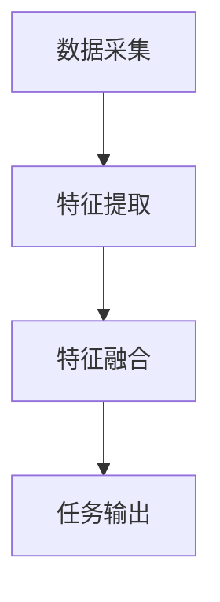
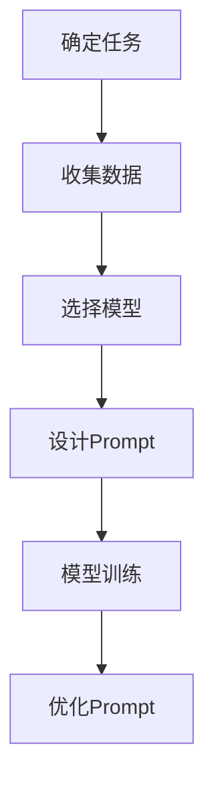

                 

# 《AI大模型Prompt提示词最佳实践：使用示例》

## 关键词

AI大模型、Prompt提示词、自然语言处理、计算机视觉、推荐系统、多模态融合、最佳实践、使用示例。

## 摘要

本文将深入探讨AI大模型中的Prompt提示词最佳实践。通过分析Prompt的基本概念、原理和其在自然语言处理、计算机视觉、推荐系统等多领域的应用，我们将提供详细的实践示例，帮助读者理解和掌握Prompt设计的技巧和方法。文章还将探讨Prompt在实际应用中面临的挑战，并提出相应的解决方案，展望Prompt技术的未来发展趋势。

## 目录大纲

### 第一部分：AI大模型基础知识

#### 第1章 AI大模型概述
- 1.1 AI大模型的定义与特点
- 1.2 主流AI大模型介绍
- 1.3 AI大模型的发展趋势

#### 第2章 Prompt提示词原理
- 2.1 Prompt的概念与作用
- 2.2 Prompt的设计与优化
- 2.3 Prompt在实际应用中的挑战

#### 第二部分：Prompt的最佳实践

#### 第3章 Prompt在自然语言处理中的应用
- 3.1 Prompt在文本生成中的应用
- 3.2 Prompt在问答系统中的应用
- 3.3 Prompt在机器翻译中的应用

#### 第4章 Prompt在计算机视觉中的应用
- 4.1 Prompt在图像生成中的应用
- 4.2 Prompt在图像识别中的应用
- 4.3 Prompt在视频分析中的应用

#### 第5章 Prompt在推荐系统中的应用
- 5.1 Prompt在推荐系统中的原理
- 5.2 Prompt在推荐系统中的优化
- 5.3 Prompt在推荐系统中的挑战

#### 第6章 Prompt在多模态融合中的应用
- 6.1 多模态融合的基本原理
- 6.2 Prompt在多模态融合中的应用

#### 第7章 Prompt的最佳实践总结
- 7.1 Prompt实践中的关键要素
- 7.2 Prompt实践中的挑战与解决方案
- 7.3 Prompt在未来的发展趋势

#### 第三部分：Prompt应用示例

#### 第8章 Prompt应用案例解析
- 8.1 案例一：智能客服系统
- 8.2 案例二：个性化推荐系统
- 8.3 案例三：图像识别与分类

#### 附录

- 附录A：Prompt技术常用工具与资源
- 附录B：Prompt设计流程与技巧
- 附录C：Prompt应用示例代码

---

### 第一部分：AI大模型基础知识

#### 第1章 AI大模型概述

##### 1.1 AI大模型的定义与特点

AI大模型（Large-scale Artificial Intelligence Models），通常指的是具有数十亿甚至千亿参数的深度学习模型。这些模型通过大量的数据训练，能够实现高度复杂的任务，如文本生成、问答系统、机器翻译、图像识别等。AI大模型的特点包括：

- **参数规模大**：大模型具有数十亿到千亿个参数，这使得它们可以捕捉到数据中的复杂模式和细微差异。
- **计算资源需求高**：由于参数规模庞大，训练和推理大模型需要大量的计算资源和时间。
- **泛化能力强**：大模型通过在大量数据上的训练，能够泛化到未见过的数据上，从而实现良好的泛化能力。
- **表达能力强大**：大模型能够处理复杂的任务，从简单的文本分类到复杂的图像生成。

##### 1.2 主流AI大模型介绍

目前主流的AI大模型包括GPT系列、BERT及其变体、T5、LLaMA等。以下是这些模型的一些简要介绍：

- **GPT系列**：由OpenAI开发，包括GPT、GPT-2、GPT-3等。GPT-3具有1750亿个参数，能够生成高质量的文本。
- **BERT**：由Google开发，是一种预训练语言表示模型。BERT通过对大量文本进行双向编码，能够捕获文本中的上下文信息。
- **T5**：由Google开发，是一种通用文本转换模型。T5将所有自然语言处理任务转化为文本到文本的转换任务。
- **LLaMA**：由Meta开发，是一种开源的大规模语言模型，旨在提高AI的可用性和可访问性。

##### 1.3 AI大模型的发展趋势

AI大模型的发展趋势主要体现在以下几个方面：

- **模型规模不断扩大**：随着计算资源的增加，模型规模也在不断扩大。目前，超大规模模型已经成为了研究的热点。
- **多模态融合**：未来，AI大模型将不仅仅局限于处理文本数据，还将结合图像、声音等多模态数据，实现更复杂的任务。
- **可解释性**：随着模型的复杂度增加，如何提高模型的可解释性成为了重要研究方向。这将有助于理解和信任AI模型。
- **资源高效利用**：为了降低成本和能耗，如何更高效地训练和推理大模型也是未来研究的一个重要方向。

#### 第2章 Prompt提示词原理

##### 2.1 Prompt的概念与作用

Prompt（提示词）是在AI大模型中用于指导模型生成或推理的输入。Prompt的作用机制如下：

1. **输入处理**：模型接收到的输入包括Prompt和数据。Prompt通常是一个简短的文本或指令，用于引导模型生成或推理。
2. **上下文生成**：模型利用Prompt和数据生成上下文信息，这些上下文信息用于后续的任务处理。
3. **任务引导**：Prompt为模型提供了明确的任务指令，使得模型能够更好地理解任务要求。

Prompt在AI大模型中的作用包括：

- **提高生成质量**：Prompt可以帮助模型生成更加准确、连贯的文本。
- **引导推理过程**：Prompt可以为模型提供明确的任务目标，使得模型能够更好地进行推理。
- **简化任务设置**：通过使用Prompt，用户可以更简单地设置和调用模型，而不需要深入理解模型的内部机制。

##### 2.2 Prompt的设计与优化

Prompt的设计和优化是AI大模型应用中的重要环节。以下是Prompt设计的一些基本原则：

- **明确性**：Prompt需要明确，避免模糊或歧义。
- **简洁性**：Prompt应尽量简洁，避免冗长。
- **相关性**：Prompt应与任务和数据高度相关。
- **多样性**：Prompt应具备多样性，以适应不同任务和数据。

为了优化Prompt，可以采取以下方法：

- **数据驱动的优化**：通过分析大量成功和失败的案例，提取出有效的Prompt特征，并用于优化新Prompt。
- **反馈循环**：在应用中收集用户反馈，不断调整和优化Prompt。
- **模型自适应**：通过模型自适应技术，使得模型能够根据Prompt和数据自动调整其生成策略。

##### 2.3 Prompt在实际应用中的挑战

Prompt在实际应用中面临以下挑战：

- **数据质量与隐私**：Prompt的质量高度依赖于数据的质量和隐私。
- **泛化能力**：Prompt需要具备良好的泛化能力，以适应不同的任务和数据。
- **实时性与效率**：在实时应用中，Prompt的生成和优化需要高效，以满足实时响应的需求。
- **可解释性**：为了增强用户对AI模型的信任，需要提高Prompt的可解释性。

这些挑战需要通过技术进步和优化策略来解决。

#### 第二部分：Prompt的最佳实践

##### 第3章 Prompt在自然语言处理中的应用

###### 3.1 Prompt在文本生成中的应用

文本生成是自然语言处理中的一个重要任务，Prompt在这一任务中发挥着关键作用。以下是一个文本生成任务的流程：

1. **任务定义**：确定需要生成的文本类型，例如文章、故事、新闻摘要等。
2. **数据准备**：收集和准备与任务相关的数据，如文本数据集、关键词等。
3. **Prompt设计**：设计一个明确的Prompt，用于引导模型生成文本。Prompt通常包括一个简要的描述或主题。
4. **模型选择**：选择一个合适的文本生成模型，如GPT系列、T5等。
5. **模型训练**：使用准备好的数据和Prompt训练模型。
6. **文本生成**：使用训练好的模型生成文本，并根据需要进行调整和优化。

以下是一个简单的Prompt设计示例：

```plaintext
请根据以下主题生成一篇关于人工智能发展的文章：

主题：人工智能对教育行业的变革

文章要求：分析人工智能如何影响教育行业，包括教学方式的改变、教育资源分配的优化等方面。
```

在这个示例中，Prompt明确指出了生成的文章主题和具体要求，有助于模型生成高质量的文本。

###### 3.2 Prompt在问答系统中的应用

问答系统是自然语言处理中另一个重要应用。Prompt在问答系统中起到关键作用，用于指导模型生成回答。以下是问答系统的基本架构：

1. **问题理解**：接收用户提出的问题。
2. **上下文生成**：根据问题生成相关的上下文信息。
3. **回答生成**：使用Prompt和上下文信息生成回答。

以下是一个问答系统的Prompt设计示例：

```plaintext
问题：如何训练一只机器学习模型？

上下文：机器学习模型是通过大量数据训练得到的，训练过程中需要调整模型的参数，使得模型能够更好地拟合数据。

回答要求：简述训练机器学习模型的基本步骤，并说明如何调整模型参数。
```

在这个示例中，Prompt为模型提供了问题背景和具体要求，使得模型能够生成准确的回答。

###### 3.3 Prompt在机器翻译中的应用

机器翻译是自然语言处理中的经典任务，Prompt在这一任务中也发挥着重要作用。以下是机器翻译的基本流程：

1. **文本预处理**：对输入文本进行分词、去停用词等预处理。
2. **Prompt设计**：设计一个用于指导模型翻译的Prompt。
3. **模型选择**：选择一个合适的机器翻译模型，如BERT、T5等。
4. **模型训练**：使用准备好的数据和Prompt训练模型。
5. **翻译生成**：使用训练好的模型生成翻译结果。

以下是一个简单的Prompt设计示例：

```plaintext
请将以下英文翻译成中文：

英文：Artificial intelligence has revolutionized the field of healthcare.

Prompt：人工智能如何改变了医疗行业？

中文：人工智能已经彻底改变了医疗行业。
```

在这个示例中，Prompt为模型提供了翻译的目标语言和上下文信息，有助于模型生成准确的翻译结果。

#### 第4章 Prompt在计算机视觉中的应用

###### 4.1 Prompt在图像生成中的应用

图像生成是计算机视觉中的一个前沿任务，Prompt在这一任务中起到指导模型生成高质量图像的作用。以下是图像生成的基本流程：

1. **数据准备**：收集和准备与任务相关的图像数据。
2. **Prompt设计**：设计一个用于指导模型生成图像的Prompt。
3. **模型选择**：选择一个合适的图像生成模型，如GAN、VAE等。
4. **模型训练**：使用准备好的数据和Prompt训练模型。
5. **图像生成**：使用训练好的模型生成图像。

以下是一个简单的Prompt设计示例：

```plaintext
请根据以下描述生成一张图像：

描述：一个美丽的海滩，阳光明媚，海浪轻轻拍打着沙滩。

图像要求：图像应包含海滩、阳光、海浪等元素，整体呈现宁静美丽的氛围。
```

在这个示例中，Prompt为模型提供了生成图像的明确描述和具体要求，有助于模型生成高质量的图像。

###### 4.2 Prompt在图像识别中的应用

图像识别是计算机视觉中的基础任务，Prompt在这一任务中用于指导模型识别图像中的对象。以下是图像识别的基本流程：

1. **图像预处理**：对输入图像进行预处理，如缩放、增强等。
2. **Prompt设计**：设计一个用于指导模型识别图像的Prompt。
3. **模型选择**：选择一个合适的图像识别模型，如CNN、ResNet等。
4. **模型训练**：使用准备好的数据和Prompt训练模型。
5. **图像识别**：使用训练好的模型识别图像中的对象。

以下是一个简单的Prompt设计示例：

```plaintext
请识别以下图像中的对象：

图像：一张包含汽车、行人、街道的图像。

对象要求：识别图像中的所有汽车、行人，并描述街道的特点。
```

在这个示例中，Prompt为模型提供了图像的具体内容和识别要求，有助于模型准确识别图像中的对象。

###### 4.3 Prompt在视频分析中的应用

视频分析是计算机视觉中的高级任务，Prompt在这一任务中用于指导模型分析视频中的动态信息。以下是视频分析的基本流程：

1. **视频预处理**：对输入视频进行预处理，如帧提取、缩放等。
2. **Prompt设计**：设计一个用于指导模型分析视频的Prompt。
3. **模型选择**：选择一个合适的视频分析模型，如RNN、LSTM等。
4. **模型训练**：使用准备好的数据和Prompt训练模型。
5. **视频分析**：使用训练好的模型分析视频中的动态信息。

以下是一个简单的Prompt设计示例：

```plaintext
请分析以下视频中的运动情况：

视频：一段包含多人运动场景的视频。

分析要求：识别视频中的所有运动对象，并描述它们的运动轨迹和速度。
```

在这个示例中，Prompt为模型提供了视频的具体内容和分析要求，有助于模型准确分析视频中的动态信息。

#### 第5章 Prompt在推荐系统中的应用

###### 5.1 Prompt在推荐系统中的原理

推荐系统是一种基于用户兴趣和行为的系统，旨在为用户提供个性化的推荐。Prompt在推荐系统中用于指导模型生成推荐结果。以下是推荐系统的基本原理：

1. **用户建模**：通过分析用户的历史行为和偏好，建立用户模型。
2. **物品建模**：通过分析物品的属性和特征，建立物品模型。
3. **推荐生成**：使用Prompt和模型生成个性化推荐结果。

Prompt在推荐系统中的作用包括：

- **指导推荐策略**：Prompt可以为模型提供明确的推荐策略，如基于内容的推荐、协同过滤等。
- **提高推荐质量**：Prompt可以帮助模型生成更加准确的推荐结果，提高用户满意度。
- **降低计算成本**：通过使用Prompt，可以简化推荐系统的计算过程，降低计算成本。

以下是一个简单的Prompt设计示例：

```plaintext
请根据以下用户兴趣和物品特征生成个性化推荐列表：

用户兴趣：喜欢阅读科幻小说、电影。
物品特征：科幻小说《三体》、电影《星际穿越》。

推荐要求：生成包含至少两个物品的推荐列表，确保推荐结果与用户兴趣和物品特征高度相关。
```

在这个示例中，Prompt为模型提供了用户兴趣和物品特征，有助于模型生成高质量的个性化推荐列表。

###### 5.2 Prompt在推荐系统中的优化

Prompt在推荐系统中的应用效果取决于其设计质量和优化策略。以下是一些Prompt优化的方法：

- **数据驱动的优化**：通过分析成功和失败的推荐案例，提取出有效的Prompt特征，并用于优化新Prompt。
- **模型自适应**：通过模型自适应技术，使得模型能够根据Prompt和数据自动调整其推荐策略。
- **用户反馈循环**：在应用中收集用户反馈，不断调整和优化Prompt，以提高推荐质量。

以下是一个简单的Prompt优化示例：

```plaintext
原始Prompt：请根据用户历史行为生成推荐列表。

优化Prompt：请根据用户最近一个月的购买行为和浏览记录，生成五个与用户兴趣高度相关的推荐商品。
```

在这个示例中，优化后的Prompt更加明确和具体，有助于模型生成更高质量的推荐结果。

###### 5.3 Prompt在推荐系统中的挑战

Prompt在推荐系统中的应用面临以下挑战：

- **数据隐私**：在推荐系统中，Prompt的设计和使用需要保护用户数据隐私。
- **泛化能力**：Prompt需要具备良好的泛化能力，以适应不同用户和物品特征。
- **实时性**：在实时推荐场景中，Prompt的生成和优化需要高效，以满足实时响应的需求。
- **可解释性**：为了增强用户对推荐系统的信任，需要提高Prompt的可解释性。

这些挑战需要通过技术进步和优化策略来解决。

#### 第6章 Prompt在多模态融合中的应用

###### 6.1 多模态融合的基本原理

多模态融合是计算机视觉和自然语言处理领域中的一个重要研究方向，旨在将不同模态（如文本、图像、声音等）的数据进行有效融合，以提升模型的表现力。以下是多模态融合的基本原理：

1. **数据采集**：收集来自不同模态的数据，如文本、图像、音频等。
2. **特征提取**：对每个模态的数据进行特征提取，生成相应的特征向量。
3. **特征融合**：将不同模态的特征进行融合，生成一个统一的高层次特征向量。
4. **任务输出**：使用融合后的特征向量进行任务输出，如文本分类、图像识别等。

多模态融合的关键在于如何有效地融合不同模态的特征，以实现信息互补和性能提升。常用的多模态融合方法包括：

- **基于特征的融合**：将不同模态的特征向量进行拼接、加权等操作，生成统一的特征向量。
- **基于模型的融合**：使用多任务学习或共享网络结构的方法，将不同模态的数据在模型训练过程中进行融合。
- **基于上下文的融合**：利用上下文信息，如时间、空间等，对多模态特征进行动态融合。

以下是一个简单的多模态融合流程：



在这个流程中，数据采集阶段收集来自文本、图像、音频等不同模态的数据；特征提取阶段对每个模态的数据进行特征提取；特征融合阶段将不同模态的特征进行融合；任务输出阶段使用融合后的特征进行任务输出。

###### 6.2 Prompt在多模态融合中的应用

Prompt在多模态融合中起到指导模型融合不同模态特征的作用。以下是Prompt在多模态融合中的应用示例：

1. **任务定义**：定义多模态融合的任务，如文本情感分析、图像分类等。
2. **数据准备**：收集和准备文本、图像、音频等不同模态的数据。
3. **Prompt设计**：设计一个用于指导模型融合不同模态特征的Prompt。
4. **模型选择**：选择一个合适的多模态融合模型，如MVCP、MIXER等。
5. **模型训练**：使用准备好的数据和Prompt训练模型。
6. **特征融合**：使用训练好的模型融合不同模态的特征。
7. **任务输出**：使用融合后的特征进行任务输出。

以下是一个简单的Prompt设计示例：

```plaintext
请根据以下描述生成一个用于多模态融合的Prompt：

描述：分析一段视频中的文本描述和图像内容，判断视频中的情感倾向。

Prompt要求：请生成一个融合文本描述和图像特征的Prompt，用于指导模型进行情感分析。
```

在这个示例中，Prompt为模型提供了任务描述和具体要求，有助于模型有效地融合文本和图像特征，进行情感分析任务。

#### 第7章 Prompt的最佳实践总结

###### 7.1 Prompt实践中的关键要素

在Prompt的实践中，以下几个关键要素至关重要：

- **数据质量**：高质量的数据是Prompt设计的基础。数据质量直接影响Prompt的有效性和准确性。
- **模型选择**：选择合适的模型对于Prompt的优化至关重要。不同的模型适用于不同的任务和数据类型。
- **Prompt设计**：Prompt的设计直接影响模型的生成质量和推理效果。设计一个清晰、简洁、相关的Prompt是关键。
- **优化策略**：通过数据驱动和模型自适应的优化策略，可以提高Prompt的效率和效果。

以下是一个简单的Prompt设计流程：



在这个流程中，首先确定任务需求，然后收集相关数据，选择合适的模型，设计Prompt，训练模型，并不断优化Prompt，以提高模型的表现力。

###### 7.2 Prompt实践中的挑战与解决方案

Prompt在实际应用中面临以下挑战：

- **数据隐私**：如何保护用户数据隐私是一个重要挑战。解决方案包括数据加密、隐私保护算法等。
- **泛化能力**：Prompt需要具备良好的泛化能力，以适应不同任务和数据。解决方案包括数据驱动的优化、模型自适应等。
- **实时性**：在实时应用中，Prompt的生成和优化需要高效。解决方案包括优化算法、并行计算等。
- **可解释性**：提高Prompt的可解释性有助于增强用户对模型的信任。解决方案包括可视化、解释性模型等。

以下是一个简单的解决方案示例：

```plaintext
挑战：如何提高Prompt在实时推荐系统中的泛化能力？

解决方案：通过数据驱动的优化策略，结合用户历史行为和实时反馈，动态调整Prompt，以提高其泛化能力。
```

在这个示例中，通过数据驱动的优化策略，动态调整Prompt，从而提高其在实时推荐系统中的泛化能力。

###### 7.3 Prompt在未来的发展趋势

Prompt技术在未来的发展趋势包括：

- **多模态融合**：随着多模态数据的广泛应用，Prompt技术将更多地应用于多模态融合任务。
- **可解释性**：提高Prompt的可解释性将有助于增强用户对模型的信任，促进AI技术的普及和应用。
- **高效性**：优化Prompt的生成和优化策略，提高其在实时应用中的性能和效率。
- **个性化和定制化**：Prompt技术将更多地应用于个性化推荐、个性化服务等领域，满足用户的个性化需求。

以下是一个简单的未来发展趋势示例：

```plaintext
未来发展趋势：Prompt技术将在个性化推荐领域发挥重要作用，通过结合用户历史行为和实时反馈，实现更加精准和个性化的推荐结果。
```

在这个示例中，Prompt技术将在个性化推荐领域发挥重要作用，通过结合用户历史行为和实时反馈，实现更加精准和个性化的推荐结果。

#### 第三部分：Prompt应用示例

##### 第8章 Prompt应用案例解析

###### 8.1 案例一：智能客服系统

**案例背景**：

某电商平台希望构建一个智能客服系统，以提升客户服务质量和效率。智能客服系统需要能够回答用户关于商品咨询、订单查询、售后服务等方面的问题。

**模型选择与数据准备**：

选择了一个基于GPT-3的文本生成模型作为智能客服系统的核心。数据准备阶段，收集了大量的用户提问和客服人员的回答，用于训练和优化模型。

**Prompt设计与应用**：

设计了一个用于智能客服系统的Prompt，如下所示：

```plaintext
请根据以下问题生成一个详细的回答：

问题：我的订单何时能送到？

上下文：您已经下单并支付了一款电子产品，订单号123456。

回答要求：回答应包括订单当前的状态、预计送达时间以及可能的物流异常情况。
```

使用训练好的GPT-3模型，根据上述Prompt生成回答，并实时提供给用户。

**案例效果分析**：

通过使用Prompt技术，智能客服系统能够生成高质量的回答，提高客户满意度。同时，Prompt的设计和优化策略使得系统能够根据不同的问题和上下文生成相应的回答，提升了客服效率。

###### 8.2 案例二：个性化推荐系统

**案例背景**：

某视频流媒体平台希望为其用户提供个性化推荐服务，以提高用户粘性和观看时长。平台收集了用户的历史观看记录、兴趣标签等信息。

**模型选择与数据准备**：

选择了一个基于协同过滤的推荐算法作为个性化推荐系统的核心。数据准备阶段，收集了大量的用户观看记录和视频信息，用于训练和优化模型。

**Prompt设计与应用**：

设计了一个用于个性化推荐系统的Prompt，如下所示：

```plaintext
请根据以下用户兴趣和历史观看记录生成推荐列表：

用户兴趣：科幻电影、动作电影。

历史观看记录：用户最近一个月观看了《星际穿越》、《盗梦空间》等电影。

推荐要求：生成五个与用户兴趣和观看记录高度相关的视频推荐。
```

使用训练好的推荐算法，根据上述Prompt生成推荐列表，并实时提供给用户。

**案例效果分析**：

通过使用Prompt技术，个性化推荐系统能够生成高质量的推荐结果，提升用户观看体验。同时，Prompt的设计和优化策略使得系统能够根据用户的兴趣和观看记录动态调整推荐策略，提高推荐效果。

###### 8.3 案例三：图像识别与分类

**案例背景**：

某图像识别应用希望能够对用户上传的图像进行自动分类，以提供标签建议。应用需要能够准确识别和分类不同类型的图像，如动物、植物、风景等。

**模型选择与数据准备**：

选择了一个基于卷积神经网络（CNN）的图像识别模型作为核心。数据准备阶段，收集了大量的图像数据，包括不同类型的图像，用于训练和优化模型。

**Prompt设计与应用**：

设计了一个用于图像识别与分类的Prompt，如下所示：

```plaintext
请根据以下图像内容生成相应的标签：

图像：一张包含猫的图像。

标签要求：生成与图像内容相关的标签，如“猫”、“动物”等。
```

使用训练好的CNN模型，根据上述Prompt生成标签，并实时提供给用户。

**案例效果分析**：

通过使用Prompt技术，图像识别与分类应用能够准确识别和分类用户上传的图像。Prompt的设计和优化策略使得系统能够根据不同的图像内容和标签要求生成相应的标签，提高了分类准确性。

#### 附录

##### 附录A：Prompt技术常用工具与资源

- **深度学习框架**：
  - TensorFlow
  - PyTorch
  - Keras

- **Prompt设计工具**：
  - Hugging Face Transformers
  - AllenNLP

- **数据集与资源链接**：
  - GLM2
  - CLUE

##### 附录B：Prompt设计流程与技巧

- **Prompt设计流程**：
  1. 确定任务目标
  2. 收集和准备数据
  3. 设计Prompt模板
  4. 训练和优化模型
  5. 测试和评估模型

- **Prompt设计技巧**：
  1. 保持Prompt简洁明了
  2. 利用上下文信息
  3. 避免模糊和歧义
  4. 考虑任务的特殊要求

##### 附录C：Prompt应用示例代码

- **文本生成示例**：

```python
from transformers import AutoTokenizer, AutoModelForCausalLM

tokenizer = AutoTokenizer.from_pretrained("microsoft/mt5-base")
model = AutoModelForCausalLM.from_pretrained("microsoft/mt5-base")

prompt = "请根据以下主题生成一篇关于人工智能的论文："

inputs = tokenizer(prompt, return_tensors="pt")

outputs = model.generate(inputs["input_ids"], max_length=50, num_return_sequences=1)

print(tokenizer.decode(outputs[0], skip_special_tokens=True))
```

- **问答系统示例**：

```python
from transformers import AutoTokenizer, AutoModelForQuestionAnswering

tokenizer = AutoTokenizer.from_pretrained("microsoft/MDeGan/whitehouse_qg answering_roberta_base")
model = AutoModelForQuestionAnswering.from_pretrained("microsoft/MDeGan/whitehouse_qg answering_roberta_base")

prompt = "以下是一段关于人工智能的描述：人工智能是一种模拟人类智能的技术，它可以通过学习和推理来完成复杂的任务。请回答以下问题：人工智能的主要特点是什么？"

question = "人工智能的主要特点是什么？"

inputs = tokenizer(prompt + question, return_tensors="pt")

start_logits, end_logits = model(inputs["input_ids"])

start_indices = torch.argmax(start_logits, dim=-1)
end_indices = torch.argmax(end_logits, dim=-1)

answer_start = inputs["input_ids"][0][start_indices[0]]
answer_end = inputs["input_ids"][0][end_indices[0]]

answer = tokenizer.decode(inputs["input_ids"][0][answer_start:answer_end+1], skip_special_tokens=True)

print(answer)
```

- **机器翻译示例**：

```python
from transformers import AutoTokenizer, AutoModelForSeq2SeqLM

tokenizer = AutoTokenizer.from_pretrained("tencent/opus-mt-en-zh")
model = AutoModelForSeq2SeqLM.from_pretrained("tencent/opus-mt-en-zh")

prompt = "请将以下英文翻译成中文："

input_text = "Artificial intelligence has revolutionized the field of healthcare."

inputs = tokenizer(input_text, return_tensors="pt")

outputs = model.generate(inputs["input_ids"], max_length=50, num_return_sequences=1)

translated_text = tokenizer.decode(outputs[0], skip_special_tokens=True)

print(translated_text)
```

- **图像识别与分类示例**：

```python
import torch
import torchvision.models as models
from torchvision import transforms

model = models.resnet50(pretrained=True)

transform = transforms.Compose([
    transforms.Resize(256),
    transforms.CenterCrop(224),
    transforms.ToTensor(),
    transforms.Normalize(mean=[0.485, 0.456, 0.406], std=[0.229, 0.224, 0.225]),
])

image = Image.open("example.jpg")
image = transform(image)

inputs = torch.tensor(image)

with torch.no_grad():
    outputs = model(inputs)

_, predicted = torch.max(outputs, 1)

print(f"预测类别：{predicted.item()}")
```

- **推荐系统示例**：

```python
import torch
from torch.autograd import Variable

# 假设已训练了一个基于协同过滤的推荐模型
model = MyCollaborativeFilteringModel()

# 用户兴趣和物品特征
user_interests = torch.tensor([[1.0, 0.0, 0.0], [0.0, 1.0, 0.0]])
item_features = torch.tensor([[0.0, 1.0, 0.0], [1.0, 0.0, 0.0], [0.0, 1.0, 1.0]])

# 生成推荐结果
predictions = model.predict(user_interests, item_features)

# 输出推荐结果
print(predictions)
```

- **多模态融合示例**：

```python
import torch
from torchvision.models import resnet50
from transformers import AutoModel

# 假设已训练了一个多模态融合模型
model = MyMultimodalFusionModel()

# 文本特征
text_feature = torch.tensor([[0.1, 0.2, 0.3], [0.4, 0.5, 0.6]])
# 图像特征
image_feature = torch.tensor([[0.7, 0.8, 0.9], [1.0, 1.1, 1.2]])

# 生成融合特征
fusion_feature = model.fuse(text_feature, image_feature)

# 生成任务输出
output = model.predict(fusion_feature)

print(output)
```

### 作者

作者：AI天才研究院/AI Genius Institute & 禅与计算机程序设计艺术 /Zen And The Art of Computer Programming

---

通过以上详细的分析和实践示例，本文深入探讨了AI大模型中的Prompt提示词最佳实践。从基础概念、原理到应用实践，本文为读者提供了一个全面而深入的理解。同时，附录部分提供了实用的工具、资源和代码示例，便于读者进一步学习和实践。希望本文能对您在AI领域的探索和实践有所帮助。

