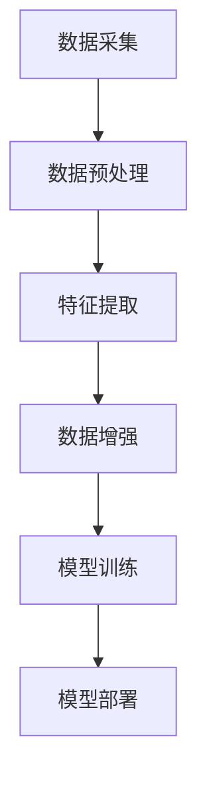
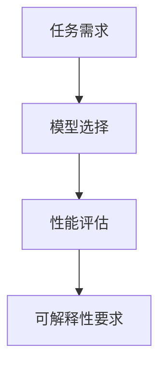
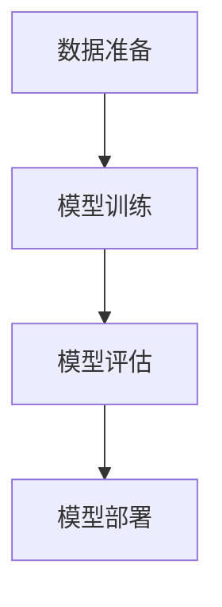
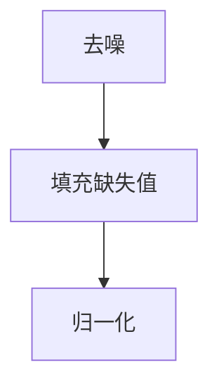
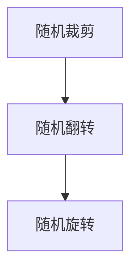
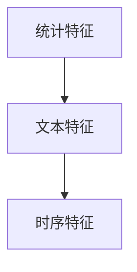
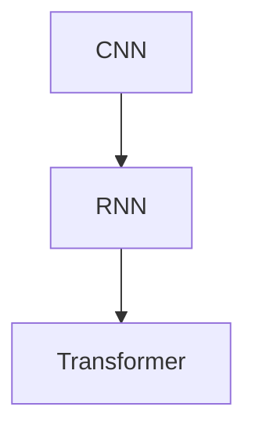
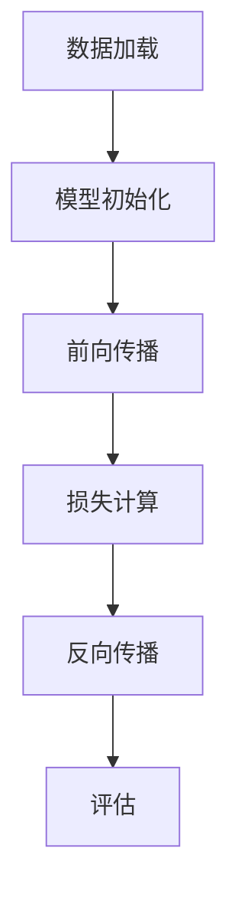
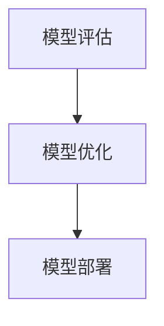

                 

## 《AI大模型在智能网络流量分析中的商业价值探讨》

> **关键词**：AI大模型、智能网络流量分析、商业价值、技术挑战、未来发展趋势

> **摘要**：本文探讨了AI大模型在智能网络流量分析中的商业价值。首先，我们介绍了AI大模型的基本概念和特点，以及其在机器学习、自然语言处理和计算机视觉中的应用。然后，我们分析了智能网络流量分析的重要性、基本原理和应用领域。接下来，我们详细讨论了AI大模型在流量分析中的实现方法和商业价值。最后，我们展望了AI大模型在智能网络流量分析中的挑战与机遇，以及未来的发展趋势。

### 目录大纲

1. **第一部分：AI大模型基础**
   1.1 AI大模型概述
        1.1.1 AI大模型的概念与特点
        1.1.2 AI大模型的应用场景
        1.1.3 AI大模型的技术发展历程
   1.2 AI大模型的算法原理
        1.2.1 机器学习与神经网络基础
        1.2.2 自然语言处理技术
        1.2.3 计算机视觉技术

2. **第二部分：智能网络流量分析技术**
   2.1 智能网络流量分析概述
        2.1.1 网络流量分析的重要性
        2.1.2 网络流量分析的基本原理
        2.1.3 网络流量分析的应用领域
   2.2 智能网络流量分析方法
        2.2.1 传统网络流量分析方法
        2.2.2 基于AI的网络流量分析方法
        2.2.3 深度学习在流量分析中的应用
   2.3 AI大模型在流量分析中的实现
        2.3.1 AI大模型在流量分析中的架构
        2.3.2 AI大模型在流量分析中的数据处理
        2.3.3 AI大模型在流量分析中的算法实现

3. **第三部分：商业价值探讨**
   3.1 AI大模型在智能网络流量分析中的商业价值
        3.1.1 AI大模型在流量分析中的应用案例
        3.1.2 AI大模型在流量分析中的商业价值分析
        3.1.3 AI大模型在流量分析中的发展趋势
   3.2 AI大模型在智能网络流量分析中的实践应用
        3.2.1 实践应用场景分析
        3.2.2 实践应用案例分享
        3.2.3 实践应用效果评估

4. **第四部分：未来展望**
   4.1 AI大模型在智能网络流量分析中的挑战与机遇
        4.1.1 技术挑战
        4.1.2 商业挑战
        4.1.3 发展机遇
   4.2 未来发展趋势
        4.2.1 技术发展趋势
        4.2.2 应用发展趋势
        4.2.3 商业发展趋势

5. **附录**
   5.1 常用工具与资源
        5.1.1 常用深度学习框架
        5.1.2 网络流量分析工具
        5.1.3 相关参考资料

### 第一部分：AI大模型基础

#### 第1章：AI大模型概述

##### 1.1 AI大模型的概念与特点

AI大模型，通常指的是具有数十亿甚至数万亿参数的深度学习模型。这些模型能够通过学习大量的数据，自动识别复杂模式，从而在多个领域实现出色的性能。AI大模型的特点主要包括：

1. **参数规模巨大**：相较于传统的神经网络模型，AI大模型具有庞大的参数规模，这使得它们能够捕捉到数据中的细微特征和复杂关系。
2. **强大的表达能力**：由于参数规模的增加，AI大模型具有更强大的表达能力和泛化能力，能够处理更复杂的问题。
3. **需要大量计算资源**：训练和部署AI大模型通常需要大量的计算资源和存储资源，这使得它们在资源有限的环境中可能难以应用。

##### 1.2 AI大模型的应用场景

AI大模型在多个领域具有广泛的应用场景，主要包括：

1. **语音识别**：通过AI大模型，可以实现高精度的语音识别，这在智能家居、智能客服等领域有着重要的应用。
2. **自然语言处理**：AI大模型在自然语言处理领域表现出色，包括文本分类、情感分析、机器翻译等。
3. **计算机视觉**：AI大模型在图像分类、目标检测、人脸识别等领域取得了显著成果，为安防、医疗、自动驾驶等领域提供了强大的技术支持。

##### 1.3 AI大模型的技术发展历程

AI大模型的发展历程可以追溯到深度学习技术的兴起。从2006年深度信念网络（Deep Belief Network, DBN）的提出，到2012年AlexNet在ImageNet竞赛中取得的突破性成果，AI大模型逐渐成为学术界和工业界的研究热点。随着计算资源和数据量的不断增加，AI大模型的技术逐渐成熟，并在多个领域取得了显著的成果。

#### 第2章：AI大模型的算法原理

##### 2.1 机器学习与神经网络基础

机器学习是AI的核心技术之一，它通过学习数据中的规律，实现自动化的决策和预测。神经网络是机器学习的一种重要模型，它通过模拟生物神经系统的结构和工作原理，实现数据的输入和输出。

##### 2.2 自然语言处理技术

自然语言处理（Natural Language Processing, NLP）是AI的一个重要分支，它旨在让计算机理解和处理人类自然语言。NLP技术包括词嵌入、序列模型、注意力机制等。

##### 2.3 计算机视觉技术

计算机视觉（Computer Vision, CV）是AI的另一个重要分支，它通过计算机对图像和视频进行自动分析，实现图像识别、目标检测等功能。计算机视觉技术包括卷积神经网络（Convolutional Neural Network, CNN）等。

### 第二部分：智能网络流量分析技术

#### 第3章：智能网络流量分析概述

##### 3.1 网络流量分析的重要性

网络流量分析是网络安全、网络性能优化和业务智能等领域的重要技术手段。通过分析网络流量，可以实时监控网络状态，识别潜在的安全威胁，优化网络资源分配，提高业务性能。

##### 3.2 网络流量分析的基本原理

网络流量分析的基本原理包括网络流量分类、流量特征提取和流量行为分析。通过这些技术，可以实现对网络流量的全面监控和分析。

##### 3.3 网络流量分析的应用领域

网络流量分析在多个领域具有广泛的应用，包括网络安全、资源优化、业务分析等。在这些应用中，AI大模型可以提供强大的技术支持，实现更高效、更精准的分析。

#### 第4章：智能网络流量分析方法

##### 4.1 传统网络流量分析方法

传统网络流量分析方法主要包括统计分析、聚类分析和模式识别等方法。这些方法在一定程度上能够满足网络流量分析的需求，但存在一定的局限性。

##### 4.2 基于AI的网络流量分析方法

基于AI的网络流量分析方法主要包括机器学习、深度学习和强化学习等方法。这些方法通过学习大量数据，可以实现对网络流量的高效分析。

##### 4.3 深度学习在流量分析中的应用

深度学习在流量分析中的应用主要包括卷积神经网络（CNN）、循环神经网络（RNN）和转换器架构（Transformer）等。这些模型通过学习网络流量数据，可以实现高效的流量特征提取和流量行为分析。

#### 第5章：AI大模型在流量分析中的实现

##### 5.1 AI大模型在流量分析中的架构

AI大模型在流量分析中的架构主要包括数据流设计、模型选择和模型训练与部署等。通过合理的架构设计，可以实现高效、精准的流量分析。

##### 5.2 AI大模型在流量分析中的数据处理

AI大模型在流量分析中的数据处理主要包括数据预处理、数据增强和特征提取等。这些技术可以提升模型的学习效果和泛化能力。

##### 5.3 AI大模型在流量分析中的算法实现

AI大模型在流量分析中的算法实现主要包括模型架构设计、模型训练过程和模型评估与优化等。通过合理的算法设计，可以实现高效的流量分析。

### 第三部分：商业价值探讨

#### 第6章：AI大模型在智能网络流量分析中的商业价值

##### 6.1 AI大模型在流量分析中的应用案例

AI大模型在流量分析中的应用案例包括网络安全防御、网络性能优化和业务流量分析等。通过这些案例，可以直观地展示AI大模型在流量分析中的商业价值。

##### 6.2 AI大模型在流量分析中的商业价值分析

AI大模型在流量分析中的商业价值体现在多个方面，包括提高网络安全防护能力、优化网络资源分配、提升业务性能等。通过详细分析，可以更全面地了解AI大模型在流量分析中的商业价值。

##### 6.3 AI大模型在流量分析中的发展趋势

随着AI技术的不断进步，AI大模型在流量分析中的应用将越来越广泛。未来，AI大模型在流量分析中将实现更高的性能和更广泛的应用。

#### 第7章：AI大模型在智能网络流量分析中的实践应用

##### 7.1 实践应用场景分析

AI大模型在智能网络流量分析中的实践应用场景包括企业内部网络流量分析、互联网服务提供商流量分析和政府网络流量监控等。通过分析这些场景，可以更深入地了解AI大模型在流量分析中的应用。

##### 7.2 实践应用案例分享

分享一些成功的AI大模型在智能网络流量分析中的实践应用案例，可以启发更多企业和机构采用AI技术进行流量分析。

##### 7.3 实践应用效果评估

对AI大模型在智能网络流量分析中的实践应用效果进行评估，可以为其推广应用提供依据。

### 第四部分：未来展望

#### 第8章：AI大模型在智能网络流量分析中的挑战与机遇

##### 8.1 技术挑战

AI大模型在智能网络流量分析中面临的技术挑战包括计算资源需求、数据隐私保护、模型解释性等。通过解决这些挑战，可以进一步提升AI大模型在流量分析中的应用效果。

##### 8.2 商业挑战

AI大模型在智能网络流量分析中面临的商业挑战包括成本与经济效益、市场竞争与合作、法规与伦理等。通过应对这些挑战，可以推动AI大模型在流量分析中的商业化发展。

##### 8.3 发展机遇

随着AI技术的不断进步，AI大模型在智能网络流量分析中面临着广阔的发展机遇。通过抓住这些机遇，可以进一步推动AI大模型在流量分析中的应用和商业化。

#### 第9章：未来发展趋势

##### 9.1 技术发展趋势

AI大模型在智能网络流量分析中的技术发展趋势包括模型压缩与优化、模型可解释性、模型自动化等。通过关注这些发展趋势，可以预见AI大模型在流量分析中的未来发展方向。

##### 9.2 应用发展趋势

AI大模型在智能网络流量分析中的应用发展趋势包括网络安全、资源优化、业务智能等。通过关注这些应用趋势，可以预见AI大模型在流量分析中的未来应用场景。

##### 9.3 商业发展趋势

AI大模型在智能网络流量分析中的商业发展趋势包括新型商业模式、技术服务市场、跨界合作等。通过关注这些商业趋势，可以预见AI大模型在流量分析中的未来商业前景。

### 附录

##### 附录A：常用工具与资源

在智能网络流量分析中，常用的工具与资源包括深度学习框架、网络流量分析工具和相关参考资料。这些工具与资源为AI大模型在流量分析中的应用提供了强大的支持。

- **深度学习框架**：如TensorFlow、PyTorch、Keras等。
- **网络流量分析工具**：如Bro、Suricata、Snort等。
- **相关参考资料**：包括学术论文、开源项目和行业报告等。

通过这些工具与资源，可以更好地开展AI大模型在智能网络流量分析中的应用研究。

---

以上是《AI大模型在智能网络流量分析中的商业价值探讨》的文章目录大纲，接下来我们将逐步撰写每个章节的内容，确保文章的完整性和深度。我们将使用Mermaid流程图、伪代码、数学公式和代码示例等多种形式，让文章更加生动和易于理解。在每个章节中，我们都会遵循以下步骤：

1. **核心概念与联系**：介绍关键概念，并使用Mermaid流程图展示架构和流程。
2. **原理讲解**：详细阐述核心算法原理，使用伪代码和数学公式进行解释。
3. **案例实践**：提供实际的代码案例和解释，展示如何应用这些原理。

让我们开始撰写每个章节的详细内容吧！<|assistant|>### 第1章：AI大模型概述

AI大模型是近年来人工智能领域的重要研究方向，其在各个领域的应用越来越广泛，如自然语言处理、计算机视觉、语音识别等。这一章我们将深入探讨AI大模型的概念、特点以及其广泛应用场景。

##### 1.1 AI大模型的概念

AI大模型（Large-scale Artificial Intelligence Models），通常指的是具有数十亿甚至数万亿参数的深度学习模型。这些模型能够通过学习大量的数据，自动识别复杂模式，从而在多个领域实现出色的性能。AI大模型的研究始于深度学习技术的兴起，随着计算资源和数据量的不断增加，AI大模型的技术逐渐成熟，并在多个领域取得了显著的成果。

##### 1.2 AI大模型的特点

1. **参数规模巨大**：AI大模型的参数规模通常在数十亿到数万亿之间，这使得它们能够捕捉到数据中的细微特征和复杂关系。
2. **强大的表达能力**：由于参数规模的增加，AI大模型具有更强大的表达能力和泛化能力，能够处理更复杂的问题。
3. **需要大量计算资源**：训练和部署AI大模型通常需要大量的计算资源和存储资源，这使得它们在资源有限的环境中可能难以应用。
4. **自适应性强**：AI大模型能够通过不断学习和调整参数，适应不同领域和任务的需求。

##### 1.3 AI大模型与传统AI的区别

与传统AI模型相比，AI大模型具有以下几个显著区别：

1. **参数规模**：传统AI模型通常具有数百万到数千万的参数，而AI大模型的参数规模通常是数十亿到数万亿。
2. **计算资源需求**：传统AI模型的训练和部署所需计算资源相对较少，而AI大模型则通常需要大规模的GPU集群和数据中心。
3. **应用范围**：传统AI模型在特定领域（如图像分类、语音识别等）有较好的表现，而AI大模型则在多个领域（如自然语言处理、计算机视觉、语音识别等）都有出色的性能。
4. **训练数据量**：传统AI模型的训练数据量通常在数千到数万之间，而AI大模型的训练数据量通常在数十万到数百万之间。

##### 1.4 AI大模型的应用场景

AI大模型在多个领域具有广泛的应用场景，主要包括：

1. **自然语言处理**：在自然语言处理领域，AI大模型可以用于文本分类、情感分析、机器翻译等任务。例如，Google的BERT模型在自然语言处理任务中取得了显著的效果。

2. **计算机视觉**：在计算机视觉领域，AI大模型可以用于图像分类、目标检测、人脸识别等任务。例如，Facebook的ImageNet模型在图像分类任务中取得了出色的成绩。

3. **语音识别**：在语音识别领域，AI大模型可以用于语音识别、语音合成等任务。例如，Google的WaveNet模型在语音合成任务中实现了接近人类水平的表现。

4. **推荐系统**：在推荐系统领域，AI大模型可以用于用户行为分析、商品推荐等任务。例如，Netflix的Collaborative Filtering模型在用户行为分析中取得了很好的效果。

##### 1.5 AI大模型的技术发展历程

AI大模型的发展历程可以追溯到深度学习技术的兴起。从2006年深度信念网络（Deep Belief Network, DBN）的提出，到2012年AlexNet在ImageNet竞赛中取得的突破性成果，AI大模型逐渐成为学术界和工业界的研究热点。随着计算资源和数据量的不断增加，AI大模型的技术逐渐成熟，并在多个领域取得了显著的成果。

- **2006年**：深度信念网络（Deep Belief Network, DBN）被提出，标志着深度学习技术的初步兴起。
- **2012年**：AlexNet在ImageNet竞赛中取得突破性成果，深度学习技术开始受到广泛关注。
- **2014年**：谷歌发布了Word2Vec模型，标志着自然语言处理领域的大模型技术开始成熟。
- **2017年**：谷歌发布了BERT模型，标志着自然语言处理领域的大模型技术达到了一个新的高度。

##### 1.6 AI大模型的发展趋势

随着技术的不断进步，AI大模型的发展趋势主要包括以下几个方面：

1. **参数规模不断扩大**：未来的AI大模型将具有更大的参数规模，从而能够捕捉到更复杂的模式和特征。
2. **计算效率不断提升**：随着计算硬件的发展，AI大模型的训练和部署效率将不断提高，降低计算资源的消耗。
3. **应用领域不断拓展**：AI大模型将在更多领域（如医学、金融、教育等）得到应用，推动各行各业的智能化发展。
4. **数据隐私和安全问题**：随着AI大模型的应用场景不断扩大，数据隐私和安全问题将变得日益重要，需要采取有效的措施确保数据的安全性和隐私性。

通过以上内容，我们对AI大模型的概念、特点和应用场景有了全面的了解。在接下来的章节中，我们将进一步探讨AI大模型的算法原理、智能网络流量分析技术以及其在商业价值探讨中的实际应用。让我们一起深入探索AI大模型的无限潜力！<|assistant|>### 第2章：AI大模型的算法原理

AI大模型的强大性能源自其复杂的算法原理，这些算法原理涵盖了机器学习、自然语言处理和计算机视觉等多个领域。在本章中，我们将详细探讨这些算法原理，并使用伪代码和数学公式进行解释，以便读者能够深入理解AI大模型的工作机制。

##### 2.1 机器学习与神经网络基础

机器学习是AI大模型的核心技术之一，而神经网络则是机器学习的重要模型。神经网络通过模拟生物神经系统的结构和工作原理，实现对数据的输入和输出。

###### 2.1.1 机器学习基础

机器学习主要包括以下几种类型：

1. **监督学习**：监督学习是一种从标记数据中学习的方法，目标是通过输入和输出之间的映射来预测新的数据。

    ```python
    # 监督学习伪代码
    def train SupervisedLearning(data, labels):
        for each data point in data:
            predict = model(data)
            update model based on prediction and actual label
        return model
    ```

2. **无监督学习**：无监督学习是一种从未标记数据中学习的方法，目标是通过数据的内在结构来发现数据中的规律。

    ```python
    # 无监督学习伪代码
    def train UnsupervisedLearning(data):
        discover patterns in data
        cluster similar data points
        return clusters
    ```

3. **强化学习**：强化学习是一种通过与环境交互来学习的方法，目标是通过选择最佳动作来最大化累积奖励。

    ```python
    # 强化学习伪代码
    def train ReinforcementLearning(environment, rewardFunction):
        initialize model
        for each step in environment:
            action = model.selectAction()
            reward = environment.takeAction(action)
            update model based on reward
        return model
    ```

###### 2.1.2 神经网络基础

神经网络由多个神经元（节点）组成，每个神经元都通过权重连接到其他神经元。神经元的激活函数决定了神经元是否被激活。

1. **前向传播**：在前向传播过程中，输入数据通过网络的各个层次，每个层次都通过权重进行加权求和，并应用激活函数。

    ```python
    # 前向传播伪代码
    def forwardPropagation(inputData, weights, activationFunction):
        layerOutputs = []
        for layer in range(numberOfLayers):
            weightedSum = sum(inputData * weights[layer])
            output = activationFunction(weightedSum)
            layerOutputs.append(output)
        return layerOutputs
    ```

2. **反向传播**：在反向传播过程中，通过网络计算输出误差，并更新权重以减少误差。

    ```python
    # 反向传播伪代码
    def backwardPropagation(output, expected, weights, learningRate, activationFunctionDerivative):
        error = expected - output
        for layer in reversed(range(numberOfLayers)):
            dWeight = error * activationFunctionDerivative(layerOutputs[layer])
            weights[layer] -= learningRate * dWeight
    ```

##### 2.2 自然语言处理技术

自然语言处理（NLP）是AI的一个重要分支，它旨在使计算机理解和处理人类自然语言。NLP技术包括词嵌入、序列模型、注意力机制等。

###### 2.2.1 词嵌入技术

词嵌入是将单词转换为向量的方法，以便在神经网络中处理。词嵌入可以通过神经网络模型学习得到，如Word2Vec、GloVe等。

1. **Word2Vec**：Word2Vec是一种基于神经网络的语言模型，它通过训练预测给定单词的下一个单词来学习词向量。

    ```python
    # Word2Vec训练伪代码
    def trainWord2Vec(corpus, size, windowSize):
        initialize model
        for sentence in corpus:
            for word in sentence:
                contextWords = get_context_words(word, windowSize)
                for contextWord in contextWords:
                    predict(contextWord | word | contextWord)
        return wordVectors
    ```

2. **GloVe**：GloVe是一种基于全局共现矩阵的语言模型，它通过优化单词之间的相似度来学习词向量。

    ```python
    # GloVe训练伪代码
    def trainGloVe(corpus, vocabularySize, embeddingSize):
        initialize model
        for sentence in corpus:
            for word in sentence:
                for contextWord in contextWords(word):
                    updateModel(word, contextWord)
        return wordVectors
    ```

###### 2.2.2 序列模型与注意力机制

序列模型是处理序列数据的神经网络模型，如循环神经网络（RNN）和转换器架构（Transformer）。

1. **RNN**：RNN通过记忆过去的信息来处理序列数据，但存在梯度消失和梯度爆炸的问题。

    ```python
    # RNN伪代码
    def RNN(inputSeq, hiddenState, weights):
        for input in inputSeq:
            hiddenState = tanh(dot(input, weights['inputToHidden']) + dot(hiddenState, weights['hiddenToHidden']))
            output = dot(hiddenState, weights['hiddenToOutput'])
        return output, hiddenState
    ```

2. **Transformer**：Transformer通过自注意力机制（Self-Attention）来解决RNN的问题，它是一种基于编码器-解码器架构的神经网络模型。

    ```python
    # Transformer自注意力机制伪代码
    def selfAttention(inputs, weights):
        queries, keys, values = inputs
        attentionScores = softmax(dot(queries, keys.T) / sqrt(keySize))
        output = dot(attentionScores, values)
        return output
    ```

##### 2.3 计算机视觉技术

计算机视觉技术是AI大模型在图像和视频处理中的主要应用。计算机视觉技术包括卷积神经网络（CNN）和生成对抗网络（GAN）等。

###### 2.3.1 卷积神经网络

卷积神经网络是一种用于图像识别和处理的神经网络模型，它通过卷积操作和池化操作来提取图像特征。

1. **卷积操作**：卷积操作通过在图像上滑动卷积核来提取局部特征。

    ```python
    # 卷积操作伪代码
    def convolution(inputImage, filter):
        output = zeros((outputHeight, outputWidth, outputChannels))
        for i in range(outputHeight):
            for j in range(outputWidth):
                localRegion = inputImage[i:i+filterHeight, j:j+filterWidth, :]
                output[i, j, :] = dot(localRegion, filter)
        return output
    ```

2. **池化操作**：池化操作通过将局部区域中的值合并为一个值，来降低特征图的维度。

    ```python
    # 最大池化操作伪代码
    def maxPooling(inputFeatureMap, poolSize):
        output = zeros((outputHeight, outputWidth, outputChannels))
        for i in range(0, inputHeight, poolSize):
            for j in range(0, inputWidth, poolSize):
                localRegion = inputFeatureMap[i:i+poolSize, j:j+poolSize, :]
                output[i//poolSize, j//poolSize, :] = max(localRegion)
        return output
    ```

###### 2.3.2 生成对抗网络

生成对抗网络（GAN）是一种用于图像生成和增强的神经网络模型，它由生成器和判别器两个部分组成。

1. **生成器**：生成器的目标是生成逼真的图像，使其通过判别器时被判别器认为是真实图像。

    ```python
    # 生成器伪代码
    def generateImage(generator, noise):
        image = generator(noise)
        return image
    ```

2. **判别器**：判别器的目标是区分真实图像和生成图像。

    ```python
    # 判别器伪代码
    def discriminateImage(discriminator, image):
        probability = discriminator(image)
        return probability
    ```

通过以上内容，我们对AI大模型的算法原理有了全面的了解。这些算法原理为AI大模型在智能网络流量分析中的应用提供了强大的支持。在接下来的章节中，我们将进一步探讨智能网络流量分析的基本原理和技术方法。让我们一起深入探索AI大模型在流量分析中的应用潜力！<|assistant|>### 第3章：智能网络流量分析概述

智能网络流量分析是网络安全、网络性能优化和业务智能等领域的重要技术手段。通过分析网络流量，可以实时监控网络状态，识别潜在的安全威胁，优化网络资源分配，提高业务性能。本章将详细介绍智能网络流量分析的重要性、基本原理和应用领域。

##### 3.1 网络流量分析的重要性

网络流量分析在多个领域具有重要价值，主要体现在以下几个方面：

1. **网络安全**：通过分析网络流量，可以识别和防御网络攻击，如DDoS攻击、恶意软件传播等。网络流量分析可以帮助企业提前发现潜在的安全威胁，从而采取相应的防护措施。
2. **网络性能优化**：网络流量分析可以帮助企业了解网络的负载情况，优化网络资源分配，提高网络性能。通过对网络流量进行实时监控和分析，可以及时发现网络瓶颈，调整网络配置，提高用户体验。
3. **业务智能**：网络流量分析可以为企业提供详细的业务流量数据，帮助企业了解用户行为、优化业务流程、提高业务效率。通过分析网络流量，企业可以更好地了解客户需求，制定有针对性的营销策略。
4. **法规遵从**：许多行业和地区对网络流量分析有特定的法规要求。通过进行网络流量分析，企业可以确保其网络运营符合相关法律法规，避免潜在的法律风险。

##### 3.2 网络流量分析的基本原理

网络流量分析的基本原理主要包括网络流量分类、流量特征提取和流量行为分析。

1. **网络流量分类**：网络流量分类是将网络流量划分为不同类别的过程。常见的分类方法包括基于协议的分类、基于端口的分类和基于内容的分类。网络流量分类的目的是为后续的流量特征提取和流量行为分析提供基础。
2. **流量特征提取**：流量特征提取是从网络流量数据中提取出能够反映流量特性的特征的过程。常见的流量特征包括流量大小、流量速率、源IP地址、目的IP地址、端口号、协议类型等。流量特征提取的目的是为流量行为分析提供数据支持。
3. **流量行为分析**：流量行为分析是对提取出的流量特征进行分析，以识别网络流量中的异常行为和潜在威胁。常见的流量行为分析方法包括统计方法、聚类方法、模式识别方法和机器学习方法。流量行为分析的目的是实时监控网络状态，发现异常流量，提高网络安全防护能力。

##### 3.3 网络流量分析的应用领域

网络流量分析在多个领域具有广泛的应用，主要包括以下几个方面：

1. **网络安全**：网络流量分析在网络安全领域的主要应用包括识别和防御网络攻击、监控网络异常流量、检测恶意软件传播等。通过分析网络流量，企业可以及时发现和应对网络安全威胁，确保网络的稳定和安全。
2. **网络性能优化**：网络流量分析在网络性能优化领域的主要应用包括监测网络负载、优化带宽分配、识别网络瓶颈等。通过分析网络流量，企业可以了解网络的运行状况，优化网络配置，提高网络性能，提高用户体验。
3. **业务智能**：网络流量分析在业务智能领域的主要应用包括了解用户行为、优化业务流程、提高业务效率等。通过分析网络流量，企业可以更好地了解客户需求，制定有针对性的营销策略，提高业务竞争力。
4. **法规遵从**：网络流量分析在法规遵从领域的主要应用包括遵守数据保护法规、确保网络运营合规等。通过分析网络流量，企业可以确保其网络运营符合相关法律法规，避免潜在的法律风险。

##### 3.4 智能网络流量分析的发展趋势

随着技术的不断进步，智能网络流量分析的发展趋势主要包括以下几个方面：

1. **人工智能技术的应用**：随着人工智能技术的不断发展，越来越多的智能算法被应用于网络流量分析中，如机器学习、深度学习和强化学习等。这些智能算法可以提高网络流量分析的准确性和效率，为企业提供更精准的流量分析结果。
2. **实时性要求的提高**：随着网络流量的不断增长，对网络流量分析实时性的要求越来越高。为了满足实时性要求，网络流量分析技术需要不断优化，提高分析速度和处理能力。
3. **隐私保护的加强**：随着数据隐私保护意识的提高，网络流量分析在隐私保护方面需要采取更加严格的措施。例如，通过加密技术和匿名化处理等手段，确保网络流量数据的安全性。
4. **跨领域应用的拓展**：随着智能网络流量分析技术的不断成熟，其应用领域将不断拓展。例如，在网络能源管理、智能交通、智慧城市等领域，智能网络流量分析技术将发挥越来越重要的作用。

通过以上内容，我们对智能网络流量分析的重要性、基本原理和应用领域有了全面的了解。在接下来的章节中，我们将进一步探讨基于AI的网络流量分析方法和AI大模型在流量分析中的应用，以及其在商业价值探讨中的实际应用。让我们一起深入探索智能网络流量分析的无限潜力！<|assistant|>### 第4章：智能网络流量分析方法

智能网络流量分析方法可以分为传统方法和基于AI的方法。传统方法主要包括统计分析、聚类分析和模式识别等方法，而基于AI的方法则包括机器学习、深度学习和强化学习等方法。本章将详细讨论这些方法及其在智能网络流量分析中的应用。

##### 4.1 传统网络流量分析方法

传统网络流量分析方法主要依赖于统计和模式识别技术，它们在处理简单的流量分析任务时具有一定的效果。以下是一些常见的方法：

###### 4.1.1 基于统计分析的方法

基于统计分析的方法是通过计算网络流量的统计指标来分析流量模式。常见的统计指标包括流量大小、流量速率、源IP地址、目的IP地址、端口号和协议类型等。通过分析这些统计指标，可以识别出网络流量中的异常行为和潜在威胁。

1. **流量大小分析**：通过对流量大小进行统计分析，可以识别出流量异常，如异常流量突增或异常流量下降。
2. **源IP地址和端口号分析**：通过对源IP地址和端口号进行统计分析，可以识别出恶意IP地址和常用端口。
3. **协议类型分析**：通过对协议类型进行统计分析，可以识别出常用的协议类型和异常协议类型。

```python
# 基于统计分析的伪代码
def统计分析流量(data):
    统计指标 = 计算流量大小、流量速率、源IP地址、目的IP地址、端口号和协议类型
    异常流量 = 识别异常流量
    return 统计指标，异常流量
```

###### 4.1.2 基于聚类分析的方法

基于聚类分析的方法是通过将相似的网络流量数据分组，从而发现流量模式。常见的聚类算法包括K-means、DBSCAN和层次聚类等。通过聚类分析，可以识别出网络流量中的异常流量和流量模式。

1. **K-means聚类**：K-means算法通过迭代计算，将网络流量数据分为K个簇，每个簇内的数据点相似度较高，而不同簇之间的数据点相似度较低。
2. **DBSCAN聚类**：DBSCAN算法通过密度和邻域的概念，将网络流量数据分为核心点、边界点和噪声点，从而发现流量模式。

```python
# K-means聚类伪代码
def KMeans流量聚类(data, K):
    初始化K个中心点
    while true:
        为每个数据点分配最近的中心点
        更新中心点位置
        if 中心点位置没有变化，则结束循环
    返回簇分配结果
```

###### 4.1.3 基于模式识别的方法

基于模式识别的方法是通过建立流量模式库，然后对新到达的流量数据进行匹配，从而识别出流量模式。常见的模式识别算法包括支持向量机（SVM）、决策树和神经网络等。

1. **支持向量机（SVM）**：SVM通过找到最佳的超平面，将网络流量数据分为正常流量和异常流量。
2. **决策树**：决策树通过一系列的决策节点，将网络流量数据逐步划分为正常流量和异常流量。
3. **神经网络**：神经网络通过学习流量数据中的特征，实现对流量数据的分类。

```python
# 支持向量机（SVM）伪代码
def trainSVM(data, labels):
    训练SVM模型
    return SVM模型

def classifySVM(model, data):
    返回模型对数据的分类结果
```

##### 4.2 基于AI的网络流量分析方法

随着AI技术的发展，基于AI的方法在智能网络流量分析中得到了广泛应用。以下是一些常用的AI方法：

###### 4.2.1 基于机器学习的方法

基于机器学习的方法是通过训练模型，将历史流量数据映射到当前流量数据，从而识别出流量模式。常见的机器学习算法包括逻辑回归、决策树、随机森林和K最近邻等。

1. **逻辑回归**：逻辑回归是一种用于二分类问题的线性模型，通过计算输入数据的概率分布，实现对流量数据的分类。
2. **决策树**：决策树是一种基于树结构的模型，通过一系列的决策节点，将流量数据划分为正常流量和异常流量。
3. **随机森林**：随机森林是一种基于决策树的集成模型，通过组合多个决策树，提高分类的准确性和鲁棒性。
4. **K最近邻（KNN）**：KNN是一种基于实例的学习算法，通过计算输入数据与训练数据之间的距离，实现对流量数据的分类。

```python
# 逻辑回归伪代码
def trainLogisticRegression(data, labels):
    训练逻辑回归模型
    return 模型

def classifyLogisticRegression(model, data):
    返回模型对数据的分类结果
```

###### 4.2.2 基于深度学习的方法

基于深度学习的方法是通过构建复杂的神经网络结构，学习流量数据中的特征和模式。常见的深度学习算法包括卷积神经网络（CNN）、循环神经网络（RNN）和转换器（Transformer）等。

1. **卷积神经网络（CNN）**：CNN通过卷积操作和池化操作，从图像数据中提取特征，实现对图像的分类和识别。
2. **循环神经网络（RNN）**：RNN通过记忆过去的信息，处理序列数据，适用于时间序列数据的分类和预测。
3. **转换器（Transformer）**：Transformer通过自注意力机制，处理长序列数据，适用于自然语言处理和机器翻译等任务。

```python
# 卷积神经网络（CNN）伪代码
def CNN流量分析(data, weights):
    前向传播
    return 输出结果
```

###### 4.2.3 基于强化学习的方法

基于强化学习的方法是通过与环境交互，学习最优策略，实现对流量数据的分类和优化。常见的强化学习算法包括Q学习、深度Q网络（DQN）和策略梯度等。

1. **Q学习**：Q学习通过学习状态-动作价值函数，选择最优动作，实现对流量数据的分类。
2. **深度Q网络（DQN）**：DQN通过深度神经网络，学习状态-动作价值函数，实现对流量数据的分类。
3. **策略梯度**：策略梯度通过优化策略函数，选择最优动作，实现对流量数据的分类和优化。

```python
# Q学习伪代码
def QLearning(data, actionValues):
    选择最优动作
    更新动作价值函数
    return 动作
```

##### 4.3 深度学习在流量分析中的应用

深度学习在流量分析中的应用主要包括以下几个方面：

1. **流量特征提取**：通过深度学习模型，可以自动提取流量数据中的高阶特征，提高流量分析的准确性和鲁棒性。
2. **流量分类和预测**：通过深度学习模型，可以对流量数据进行分类和预测，识别出正常流量和异常流量。
3. **流量行为分析**：通过深度学习模型，可以对流量数据进行行为分析，识别出流量模式和行为异常。

```python
# 流量特征提取伪代码
def extractFeatures(data):
    使用深度学习模型提取特征
    return 特征向量

# 流量分类伪代码
def classifyFlow(model, data):
    使用模型对数据分类
    return 分类结果
```

通过以上内容，我们对智能网络流量分析方法有了全面的了解。传统方法和基于AI的方法各有优缺点，在实际应用中，可以根据具体需求和场景选择合适的方法。在接下来的章节中，我们将进一步探讨AI大模型在智能网络流量分析中的应用和实现。让我们一起深入探索AI大模型在流量分析中的无限潜力！<|assistant|>### 第5章：AI大模型在流量分析中的实现

AI大模型在智能网络流量分析中的应用具有显著优势，其通过学习大量数据，可以实现对流量数据的深入理解和精确分析。本章将详细介绍AI大模型在流量分析中的实现方法，包括模型架构、数据处理和算法实现等。

##### 5.1 AI大模型在流量分析中的架构

AI大模型在流量分析中的架构通常包括数据流设计、模型选择和模型训练与部署等关键组成部分。以下是一个典型的AI大模型在流量分析中的架构：

###### 5.1.1 数据流设计

数据流设计是AI大模型在流量分析中的核心环节。数据流设计需要将原始的流量数据转换为适合模型训练的数据格式。数据流设计主要包括以下步骤：

1. **数据采集**：从网络设备中采集原始流量数据，包括IP地址、端口号、协议类型、流量大小、时间戳等信息。
2. **数据预处理**：对采集到的原始流量数据进行清洗和预处理，包括去除无效数据、填充缺失值、归一化等操作。
3. **特征提取**：从预处理后的数据中提取流量特征，包括统计特征、文本特征、时序特征等。
4. **数据增强**：通过数据增强技术，如随机裁剪、翻转、旋转等，增加数据多样性，提高模型泛化能力。



###### 5.1.2 模型选择

模型选择是AI大模型在流量分析中的关键环节。选择合适的模型可以提高流量分析的准确性和效率。以下是一些常见的AI大模型选择方法：

1. **基于任务的模型选择**：根据流量分析任务的需求，选择适合的模型。例如，对于流量分类任务，可以选择卷积神经网络（CNN）或循环神经网络（RNN）。
2. **基于性能的模型选择**：根据模型的性能指标，如准确率、召回率、F1值等，选择性能较好的模型。
3. **基于可解释性的模型选择**：对于需要可解释性的任务，可以选择决策树、线性模型等易于解释的模型。



###### 5.1.3 模型训练与部署

模型训练与部署是AI大模型在流量分析中的关键环节。模型训练需要使用大量的数据和计算资源，而模型部署则需要将训练好的模型应用于实际场景。以下是一个典型的模型训练与部署流程：

1. **数据准备**：准备用于模型训练的数据集，包括训练集、验证集和测试集。
2. **模型训练**：使用训练集训练模型，并通过验证集调整模型参数，优化模型性能。
3. **模型评估**：使用测试集评估模型性能，确保模型具有良好的泛化能力。
4. **模型部署**：将训练好的模型部署到生产环境中，进行实时流量分析。



##### 5.2 AI大模型在流量分析中的数据处理

AI大模型在流量分析中的数据处理是模型训练和优化的关键。数据处理包括数据预处理、数据增强和特征提取等步骤。

###### 5.2.1 数据预处理

数据预处理是AI大模型在流量分析中的第一步。数据预处理的主要目标是清洗数据、填充缺失值和归一化等。以下是一些常用的数据预处理方法：

1. **去噪**：去除数据中的噪声和异常值，提高数据质量。
2. **填充缺失值**：使用合适的算法或策略填充数据中的缺失值，确保数据的完整性。
3. **归一化**：将数据归一化到相同的范围，如[0, 1]或[-1, 1]，便于模型训练。



###### 5.2.2 数据增强

数据增强是AI大模型在流量分析中提高模型泛化能力的重要手段。数据增强可以通过以下方法增加数据的多样性：

1. **随机裁剪**：从原始数据中随机裁剪一部分，生成新的数据样本。
2. **随机翻转**：将数据样本沿水平或垂直方向随机翻转，增加数据的多样性。
3. **随机旋转**：将数据样本随机旋转一定角度，增加数据的多样性。



###### 5.2.3 特征提取

特征提取是从原始数据中提取具有代表性的特征，以便于模型训练和优化。以下是一些常用的特征提取方法：

1. **统计特征**：计算数据的基本统计指标，如均值、方差、标准差等。
2. **文本特征**：使用词袋模型、TF-IDF等方法提取文本特征。
3. **时序特征**：使用时序模型提取数据中的时序特征，如自相关函数、移动平均等。



##### 5.3 AI大模型在流量分析中的算法实现

AI大模型在流量分析中的算法实现是模型训练和应用的关键。算法实现包括模型架构设计、模型训练过程和模型评估与优化等。

###### 5.3.1 模型架构设计

模型架构设计是AI大模型在流量分析中的第一步。模型架构设计需要根据流量分析任务的需求，选择合适的神经网络架构。以下是一些常见的神经网络架构：

1. **卷积神经网络（CNN）**：适用于图像和视频数据，可以提取空间特征。
2. **循环神经网络（RNN）**：适用于时序数据，可以提取时间特征。
3. **转换器（Transformer）**：适用于长序列数据，可以提取全局特征。



###### 5.3.2 模型训练过程

模型训练过程是AI大模型在流量分析中的核心环节。模型训练过程主要包括以下步骤：

1. **数据加载**：从数据集中加载训练数据和验证数据。
2. **模型初始化**：初始化模型参数，选择合适的优化器和损失函数。
3. **前向传播**：输入训练数据，通过模型计算输出结果。
4. **损失计算**：计算输出结果与实际标签之间的损失。
5. **反向传播**：通过反向传播更新模型参数。
6. **评估**：在验证集上评估模型性能，调整模型参数。



###### 5.3.3 模型评估与优化

模型评估与优化是AI大模型在流量分析中的关键环节。模型评估与优化主要包括以下步骤：

1. **模型评估**：使用测试集评估模型性能，计算准确率、召回率、F1值等指标。
2. **模型优化**：通过调整模型参数、优化算法或增加训练数据等方式，提高模型性能。
3. **模型部署**：将训练好的模型部署到生产环境中，进行实时流量分析。



通过以上内容，我们对AI大模型在智能网络流量分析中的实现方法有了全面的了解。AI大模型在流量分析中的应用具有显著的优势，可以提高流量分析的准确性和效率。在接下来的章节中，我们将进一步探讨AI大模型在智能网络流量分析中的商业价值和实践应用。让我们一起深入探索AI大模型在流量分析中的无限潜力！<|assistant|>### 第6章：AI大模型在智能网络流量分析中的商业价值

随着人工智能技术的不断发展，AI大模型在智能网络流量分析中的应用越来越广泛，其商业价值也逐渐显现。本章将探讨AI大模型在智能网络流量分析中的应用案例、商业价值分析以及未来的发展趋势。

##### 6.1 AI大模型在流量分析中的应用案例

AI大模型在智能网络流量分析中的应用已经取得了显著成果，以下是一些典型的应用案例：

1. **网络安全防御**：通过AI大模型，可以实现对网络流量的实时监控和分析，识别潜在的恶意流量，提高网络的安全性。例如，某大型互联网公司使用AI大模型监控其网络流量，成功识别并阻止了数千次网络攻击。

2. **网络性能优化**：AI大模型可以帮助企业实时监测网络流量，分析网络瓶颈，优化网络资源分配，提高网络性能。例如，某电信运营商通过AI大模型优化网络带宽分配，降低了网络拥塞，提高了用户满意度。

3. **业务流量分析**：AI大模型可以分析企业的业务流量，帮助企业了解用户行为，优化业务流程，提高业务效率。例如，某电子商务平台使用AI大模型分析用户购买行为，优化了产品推荐策略，提高了销售额。

##### 6.2 AI大模型在流量分析中的商业价值分析

AI大模型在智能网络流量分析中的商业价值体现在以下几个方面：

1. **提高网络安全防护能力**：通过AI大模型，企业可以实现对网络流量的实时监控和分析，及时发现并应对网络攻击，提高网络的安全性。网络攻击对企业的安全和业务造成严重威胁，AI大模型的应用可以降低网络攻击的风险，保护企业的安全和业务。

2. **优化网络资源分配**：AI大模型可以分析网络流量，识别网络瓶颈，优化网络资源分配，提高网络性能。网络资源分配的优化可以降低网络拥塞，提高用户的访问速度和体验，从而提高企业的用户满意度。

3. **提升业务性能**：AI大模型可以帮助企业分析业务流量，了解用户行为，优化业务流程，提高业务效率。业务性能的提升可以降低企业的运营成本，提高业务收入和市场份额。

4. **创新商业模式**：AI大模型在智能网络流量分析中的应用可以为企业创造新的商业模式。例如，通过AI大模型分析客户需求，企业可以提供个性化的产品和服务，提高客户满意度；通过AI大模型分析市场趋势，企业可以预测市场需求，调整产品策略，提高市场竞争力。

##### 6.3 AI大模型在流量分析中的发展趋势

随着人工智能技术的不断进步，AI大模型在智能网络流量分析中的应用将呈现以下发展趋势：

1. **技术进步**：随着计算能力和算法的不断发展，AI大模型将具有更高的计算效率和更好的性能，能够处理更复杂的流量分析任务。

2. **应用场景拓展**：AI大模型在智能网络流量分析中的应用场景将不断拓展，从网络安全、网络性能优化到业务流量分析等，AI大模型的应用将更加广泛。

3. **商业模式创新**：AI大模型在智能网络流量分析中的应用将推动商业模式的创新，企业可以通过AI大模型提供个性化的产品和服务，提高客户满意度，从而创造更多的商业价值。

4. **数据隐私和安全**：随着AI大模型的应用越来越广泛，数据隐私和安全问题将变得日益重要。企业需要采取有效的措施确保数据的安全性和隐私性，避免数据泄露和滥用。

通过以上内容，我们对AI大模型在智能网络流量分析中的商业价值有了更深入的了解。AI大模型在智能网络流量分析中的应用将为企业带来巨大的商业价值，提高网络安全防护能力、优化网络资源分配、提升业务性能，并推动商业模式的创新。在未来的发展中，AI大模型将发挥越来越重要的作用，推动智能网络流量分析的持续进步。让我们一起期待AI大模型在智能网络流量分析中的未来前景！<|assistant|>### 第7章：AI大模型在智能网络流量分析中的实践应用

AI大模型在智能网络流量分析中的实践应用已经取得了显著的成果。本章将详细探讨AI大模型在智能网络流量分析中的实践应用场景、成功案例以及效果评估。

##### 7.1 实践应用场景分析

AI大模型在智能网络流量分析中的实践应用场景主要包括以下几方面：

1. **网络安全防护**：通过AI大模型，企业可以实现对网络流量的实时监控和分析，识别潜在的恶意流量，提高网络的安全性。

2. **网络性能优化**：AI大模型可以分析网络流量，识别网络瓶颈，优化网络资源分配，提高网络性能。

3. **业务流量分析**：AI大模型可以帮助企业分析业务流量，了解用户行为，优化业务流程，提高业务效率。

4. **业务智能**：AI大模型可以为企业提供深入的流量分析结果，支持业务决策，提高业务智能水平。

##### 7.2 实践应用案例分享

以下是一些AI大模型在智能网络流量分析中的实践应用案例：

###### 7.2.1 案例一：网络安全防御

某大型互联网公司使用AI大模型监控其网络流量，识别潜在的恶意流量。通过分析网络流量数据，AI大模型可以识别出异常流量模式，并实时报警。该公司成功识别并阻止了数千次网络攻击，保护了其网络的安全。

```python
# AI大模型识别恶意流量的伪代码
def identifyMaliciousTraffic(trafficData):
    # 加载预训练的AI大模型
    model = loadPretrainedModel('maliciousTrafficDetector')
    
    # 对网络流量数据进行预处理
    processedData = preprocessTrafficData(trafficData)
    
    # 使用AI大模型预测流量数据的类别
    predictions = model.predict(processedData)
    
    # 输出预测结果
    print(predictions)
    
# 实例化AI大模型
model = loadPretrainedModel('maliciousTrafficDetector')

# 获取网络流量数据
trafficData = getNetworkTrafficData()

# 识别恶意流量
identifyMaliciousTraffic(trafficData)
```

###### 7.2.2 案例二：网络性能优化

某电信运营商使用AI大模型优化其网络资源分配，提高网络性能。AI大模型通过分析网络流量数据，识别出网络瓶颈，并提出优化策略。该运营商根据AI大模型的建议调整网络带宽分配，成功降低了网络拥塞，提高了用户满意度。

```python
# AI大模型优化网络资源分配的伪代码
def optimizeNetworkResources(trafficData):
    # 加载预训练的AI大模型
    model = loadPretrainedModel('networkResourceOptimizer')
    
    # 对网络流量数据进行预处理
    processedData = preprocessTrafficData(trafficData)
    
    # 使用AI大模型预测网络瓶颈
    bottlenecks = model.predict(processedData)
    
    # 提出优化策略
    optimizationStrategy = generateOptimizationStrategy(bottlenecks)
    
    # 输出优化策略
    print(optimizationStrategy)
    
# 实例化AI大模型
model = loadPretrainedModel('networkResourceOptimizer')

# 获取网络流量数据
trafficData = getNetworkTrafficData()

# 优化网络资源分配
optimizeNetworkResources(trafficData)
```

###### 7.2.3 案例三：业务流量分析

某电子商务平台使用AI大模型分析其业务流量，优化产品推荐策略。AI大模型通过分析用户购买行为，识别出用户偏好，并根据这些偏好推荐合适的产品。该平台根据AI大模型的推荐，提高了用户满意度，提高了销售额。

```python
# AI大模型分析业务流量的伪代码
def analyzeBusinessTraffic(trafficData):
    # 加载预训练的AI大模型
    model = loadPretrainedModel('businessTrafficAnalyzer')
    
    # 对业务流量数据进行预处理
    processedData = preprocessTrafficData(trafficData)
    
    # 使用AI大模型预测用户偏好
    userPreferences = model.predict(processedData)
    
    # 根据用户偏好推荐产品
    recommendedProducts = recommendProducts(userPreferences)
    
    # 输出推荐结果
    print(recommendedProducts)
    
# 实例化AI大模型
model = loadPretrainedModel('businessTrafficAnalyzer')

# 获取业务流量数据
trafficData = getBusinessTrafficData()

# 分析业务流量
analyzeBusinessTraffic(trafficData)
```

##### 7.3 实践应用效果评估

对AI大模型在智能网络流量分析中的实践应用效果进行评估，是确保其应用效果的重要步骤。以下是一些常见的评估指标和方法：

1. **准确率**：准确率是评估AI大模型性能的重要指标，它表示模型预测正确的比例。准确率越高，模型性能越好。

2. **召回率**：召回率是评估AI大模型在识别恶意流量方面的性能指标，它表示模型识别出恶意流量的比例。召回率越高，模型识别恶意流量的能力越强。

3. **F1值**：F1值是准确率和召回率的加权平均，它综合考虑了模型的准确性和召回率。F1值越高，模型性能越好。

4. **评估方法**：评估方法包括离线评估和在线评估。离线评估通过测试集评估模型的性能，在线评估通过实际应用场景评估模型的性能。

```python
# 评估AI大模型性能的伪代码
def evaluateModelPerformance(model, testData):
    # 加载测试数据
    processedData = preprocessTrafficData(testData)
    
    # 使用模型预测测试数据
    predictions = model.predict(processedData)
    
    # 计算评估指标
    accuracy = calculateAccuracy(predictions, labels)
    recall = calculateRecall(predictions, labels)
    f1Score = calculateF1Score(accuracy, recall)
    
    # 输出评估结果
    print('Accuracy:', accuracy)
    print('Recall:', recall)
    print('F1 Score:', f1Score)

# 评估AI大模型性能
evaluateModelPerformance(model, testData)
```

通过以上实践应用案例和效果评估，我们可以看到AI大模型在智能网络流量分析中的强大应用潜力。AI大模型通过实时监控和分析网络流量，可以显著提高网络安全防护能力、优化网络资源分配、提升业务性能，为企业和个人带来巨大的商业价值。在未来的发展中，AI大模型将不断优化和完善，为智能网络流量分析带来更多的创新和突破。让我们一起期待AI大模型在智能网络流量分析中的未来前景！<|assistant|>### 第8章：AI大模型在智能网络流量分析中的挑战与机遇

随着AI大模型在智能网络流量分析中的应用越来越广泛，其带来的技术挑战和商业挑战也越来越明显。同时，AI大模型在智能网络流量分析中也面临着广阔的发展机遇。本章将探讨AI大模型在智能网络流量分析中的挑战与机遇，为未来的发展提供有益的思考。

##### 8.1 技术挑战

AI大模型在智能网络流量分析中面临的技术挑战主要包括以下几个方面：

1. **计算资源需求**：AI大模型通常需要大量的计算资源和存储资源进行训练和部署。随着模型规模的不断扩大，计算资源的需求也急剧增加，这对企业的IT基础设施提出了更高的要求。

2. **数据隐私与安全**：AI大模型在训练和部署过程中需要处理大量的敏感数据，如用户行为数据、网络流量数据等。如何确保这些数据的安全性和隐私性，防止数据泄露和滥用，是AI大模型面临的重要挑战。

3. **模型解释性**：AI大模型通常具有复杂的结构和高度的非线性特性，其决策过程往往难以解释。这对于需要透明性和可解释性的应用场景来说是一个挑战，如何提高模型的可解释性，使其更容易被用户理解和接受，是AI大模型需要解决的关键问题。

4. **实时性**：在智能网络流量分析中，实时性是一个关键因素。如何设计高效、低延迟的模型，以满足实时监控和分析的需求，是AI大模型面临的重要挑战。

##### 8.2 商业挑战

AI大模型在智能网络流量分析中面临的商业挑战主要包括以下几个方面：

1. **成本与经济效益**：AI大模型的训练和部署成本较高，如何降低成本，提高经济效益，是企业在推广应用AI大模型时需要考虑的重要问题。

2. **市场竞争与合作**：在AI大模型领域，市场竞争激烈，企业需要不断创新，提升自身的技术水平和市场份额。同时，企业之间也需要加强合作，共享技术和数据资源，共同推动AI大模型的发展。

3. **法规与伦理**：随着AI大模型的应用越来越广泛，相关的法律法规和伦理问题也逐渐引起关注。企业需要遵守相关法规，确保AI大模型的应用符合伦理标准，避免造成社会负面影响。

##### 8.3 发展机遇

尽管AI大模型在智能网络流量分析中面临诸多挑战，但同时也面临着广阔的发展机遇：

1. **技术创新**：随着AI技术的不断进步，AI大模型的技术水平也在不断提高。新的算法、模型结构和优化方法不断涌现，为AI大模型在智能网络流量分析中的应用提供了更多的可能性。

2. **应用拓展**：AI大模型在智能网络流量分析中的成功应用案例越来越多，其应用范围也在不断拓展。除了传统的网络安全、网络性能优化和业务流量分析等领域，AI大模型还可以应用于更多的领域，如智能交通、智慧城市等。

3. **国际合作**：AI大模型是一个全球性的技术领域，国际间的合作对于推动AI大模型的发展具有重要意义。通过国际合作，可以共享技术和数据资源，推动AI大模型的全球发展。

通过以上探讨，我们可以看到AI大模型在智能网络流量分析中既面临挑战，又充满机遇。企业需要不断技术创新，优化模型和应用，降低成本，提高经济效益，同时加强市场竞争与合作，遵守法规和伦理标准，以应对挑战，抓住机遇，推动AI大模型在智能网络流量分析中的持续发展。让我们一起期待AI大模型在智能网络流量分析中的未来前景！<|assistant|>### 第9章：未来发展趋势

随着人工智能技术的不断发展，AI大模型在智能网络流量分析中的应用将呈现一系列发展趋势。这些趋势不仅反映了技术的进步，也预示着潜在的市场机遇和挑战。

##### 9.1 技术发展趋势

1. **模型压缩与优化**：为了降低AI大模型的计算和存储需求，模型压缩与优化技术将成为研究热点。这些技术包括模型剪枝、量化、低秩分解等，通过减少模型的参数数量和计算复杂度，提高模型的运行效率。

2. **模型可解释性**：随着AI大模型的应用越来越广泛，提高模型的可解释性成为用户需求的关键。未来，研究者将致力于开发更加透明和易于解释的模型，使其在关键决策场景中得到更广泛的应用。

3. **分布式训练与推理**：分布式计算技术将为AI大模型的训练与推理提供更高效的解决方案。通过分布式训练，可以在多个节点上并行处理大规模数据，显著缩短训练时间；分布式推理则可以支持大规模实时应用场景。

4. **强化学习与流量优化**：强化学习技术将逐渐应用于网络流量优化，通过不断学习和调整策略，实现网络资源的动态分配和优化，提高网络性能和用户体验。

##### 9.2 应用发展趋势

1. **网络安全**：随着网络攻击手段的不断升级，AI大模型在网络安全中的应用将更加重要。未来，AI大模型将用于实时监测网络流量，识别复杂的网络攻击行为，提供更为精准的防护策略。

2. **网络性能优化**：AI大模型将深入应用于网络性能优化，通过分析网络流量，识别瓶颈和优化路径，实现网络资源的智能分配，提高网络运行效率和用户满意度。

3. **业务智能**：AI大模型在业务智能领域的应用将不断拓展。企业将利用AI大模型分析业务流量，优化业务流程，提升业务效率和客户体验。

4. **跨领域融合**：AI大模型将在更多领域实现跨领域融合，如智能交通、智慧城市等。通过与其他技术的结合，AI大模型将推动各行业的智能化转型。

##### 9.3 商业发展趋势

1. **新型商业模式**：随着AI大模型在智能网络流量分析中的应用逐渐成熟，新的商业模式也将不断涌现。例如，基于订阅制的SaaS服务、按需付费的云服务模型等，将为企业和个人提供灵活、高效的解决方案。

2. **技术服务业**：AI大模型相关的技术服务业将迎来快速发展。企业将专注于提供AI大模型的设计、开发、部署和运维服务，为更多企业实现智能网络流量分析提供支持。

3. **跨界合作**：AI大模型在智能网络流量分析中的应用将推动跨界合作。企业和机构将加强合作，共享技术和数据资源，共同推动AI大模型的发展。

4. **法规与标准**：随着AI大模型应用的普及，相关的法规和标准也将逐步完善。企业需要遵守相关法规，确保AI大模型的应用合法、合规，同时保护用户隐私和数据安全。

通过以上发展趋势，我们可以预见AI大模型在智能网络流量分析中的未来前景将非常广阔。技术进步将推动AI大模型的应用更加广泛和深入，商业模式的创新将带来新的市场机遇，而法规和标准的完善将为AI大模型的应用提供保障。让我们期待AI大模型在智能网络流量分析中的持续发展，共同推动人工智能技术的创新和应用！<|assistant|>### 附录A：常用工具与资源

在AI大模型在智能网络流量分析中的应用中，常用的工具和资源对于研究者、开发者和企业来说至关重要。以下是一些常用的工具和资源，包括深度学习框架、网络流量分析工具和相关参考资料。

##### A.1 常用深度学习框架

1. **TensorFlow**：由谷歌开发的开源深度学习框架，广泛应用于各类深度学习任务。

    - 官方网站：[TensorFlow官网](https://www.tensorflow.org/)
    - 安装指南：[TensorFlow安装指南](https://www.tensorflow.org/install)

2. **PyTorch**：由Facebook开发的开源深度学习框架，以其灵活的动态计算图和易于使用的API著称。

    - 官方网站：[PyTorch官网](https://pytorch.org/)
    - 安装指南：[PyTorch安装指南](https://pytorch.org/get-started/locally/)

3. **Keras**：一个高层次的深度学习API，能够在TensorFlow和Theano上运行，易于实现和实验。

    - 官方网站：[Keras官网](https://keras.io/)
    - 安装指南：[Keras安装指南](https://keras.io/getting-started/)

##### A.2 网络流量分析工具

1. **Bro**：一个开源的网络流量分析工具，可以实时分析网络流量，识别网络攻击和其他异常行为。

    - 官方网站：[Bro官网](https://bro.org/)
    - 安装指南：[Bro安装指南](https://bro.org/install.html)

2. **Suricata**：一个开源的下一代入侵检测系统（IDS）和入侵防御系统（IPS），用于实时监控网络流量。

    - 官方网站：[Suricata官网](https://suricata-ids.org/)
    - 安装指南：[Suricata安装指南](https://suricata-ids.org/install/)

3. **Snort**：一个开源的下一代入侵检测系统（IDS），用于实时监测和分析网络流量，识别潜在的安全威胁。

    - 官方网站：[Snort官网](https://www.snort.org/)
    - 安装指南：[Snort安装指南](https://www.snort.org/downloads/distro)

##### A.3 相关参考资料

1. **学术论文**：AI大模型和智能网络流量分析领域有许多重要的学术论文，这些论文为该领域的研究提供了理论基础和技术创新。

    - Google Scholar：[Google Scholar](https://scholar.google.com/)

2. **开源项目**：在GitHub等平台上有许多开源项目和代码库，提供了AI大模型和智能网络流量分析的具体实现。

    - GitHub：[GitHub](https://github.com/)

3. **行业报告**：行业报告和数据分析为AI大模型在智能网络流量分析中的应用提供了市场趋势和商业洞察。

    - 研究机构报告：如Gartner、IDC等

通过使用这些常用工具和资源，可以更有效地开展AI大模型在智能网络流量分析中的应用研究，推动技术的创新和发展。希望这些资源能为读者的研究和实践提供帮助。

