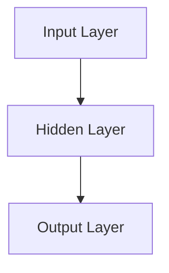
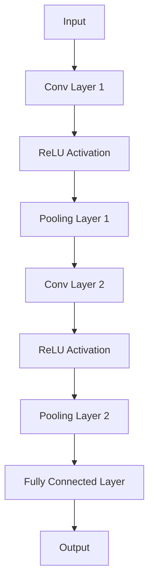

                 

### 文章标题

《AI大模型在电商平台商品捆绑销售策略中的应用》

> **关键词**：AI大模型、商品捆绑销售、电商、预测模型、策略优化、深度学习

> **摘要**：本文将探讨AI大模型在电商平台商品捆绑销售策略中的应用，通过分析AI大模型的发展历程、技术基础，以及商品捆绑销售策略的现状与挑战，详细阐述了AI大模型在商品捆绑销售策略中的角色、应用场景和实施步骤。文章通过具体案例，展示了AI大模型在商品捆绑销售策略优化和评估中的实际效果，并提出了未来发展的趋势和建议。

### 目录大纲

# 《AI大模型在电商平台商品捆绑销售策略中的应用》目录大纲

## 第一部分：AI大模型概述

### 第1章：AI大模型概述

#### 1.1 AI大模型的发展历程

##### 1.1.1 AI大模型的概念

##### 1.1.2 AI大模型的发展历程

##### 1.1.3 AI大模型在电商领域的应用

#### 1.2 AI大模型技术基础

##### 1.2.1 神经网络基础

##### 1.2.2 机器学习算法

##### 1.2.3 深度学习技术

### 第2章：电商平台商品捆绑销售策略概述

#### 2.1 商品捆绑销售策略的定义

##### 2.1.1 商品捆绑销售的概念

##### 2.1.2 商品捆绑销售的目的

##### 2.1.3 商品捆绑销售的优势

#### 2.2 电商平台商品捆绑销售的现状与挑战

##### 2.2.1 电商平台商品捆绑销售的现状

##### 2.2.2 商品捆绑销售面临的挑战

##### 2.2.3 商品捆绑销售的发展趋势

## 第二部分：AI大模型在商品捆绑销售策略中的应用

### 第3章：AI大模型在商品捆绑销售策略中的角色

#### 3.1 AI大模型在商品推荐中的作用

##### 3.1.1 利用AI大模型进行商品推荐

##### 3.1.2 基于用户行为的商品推荐策略

##### 3.1.3 基于商品关联规则的推荐算法

#### 3.2 AI大模型在商品捆绑组合优化中的应用

##### 3.2.1 商品捆绑组合优化问题概述

##### 3.2.2 利用AI大模型优化商品捆绑组合

##### 3.2.3 基于深度学习的捆绑组合优化算法

### 第4章：基于AI大模型的商品捆绑销售预测

#### 4.1 商品捆绑销售预测的重要性

##### 4.1.1 商品捆绑销售预测的基本概念

##### 4.1.2 商品捆绑销售预测的目标

##### 4.1.3 商品捆绑销售预测的方法

#### 4.2 基于AI大模型的商品捆绑销售预测模型

##### 4.2.1 模型构建

##### 4.2.2 数据预处理

##### 4.2.3 模型训练与评估

### 第5章：AI大模型在商品捆绑销售策略优化中的应用

#### 5.1 商品捆绑销售策略优化的方法

##### 5.1.1 传统优化方法

##### 5.1.2 基于AI大模型的优化方法

##### 5.1.3 AI大模型优化策略的优势

#### 5.2 基于AI大模型的商品捆绑销售策略优化案例

##### 5.2.1 案例一：某电商平台商品捆绑销售策略优化

##### 5.2.2 案例二：某跨境电商平台商品捆绑销售策略优化

### 第6章：AI大模型在商品捆绑销售策略实施与评估

#### 6.1 商品捆绑销售策略实施的步骤

##### 6.1.1 商品捆绑销售策略制定

##### 6.1.2 商品捆绑销售策略实施

##### 6.1.3 商品捆绑销售策略评估

#### 6.2 基于AI大模型的商品捆绑销售策略评估

##### 6.2.1 评估指标

##### 6.2.2 评估方法

##### 6.2.3 评估结果分析

### 第7章：AI大模型在商品捆绑销售策略中的未来趋势与发展

#### 7.1 AI大模型在商品捆绑销售策略中的未来趋势

##### 7.1.1 新的技术发展方向

##### 7.1.2 未来的应用场景

##### 7.1.3 AI大模型在商品捆绑销售策略中的潜在影响

#### 7.2 AI大模型在商品捆绑销售策略中的发展建议

##### 7.2.1 政策与法规建议

##### 7.2.2 企业实践建议

##### 7.2.3 社会效应与伦理考虑

## 附录

### 附录A：AI大模型开发工具与资源

#### A.1 主流AI大模型框架对比

##### A.1.1 TensorFlow

##### A.1.2 PyTorch

##### A.1.3 Keras

#### A.2 AI大模型开发资源推荐

##### A.2.1 开源库与工具

##### A.2.2 学习资料与教程

##### A.2.3 社区与论坛

----------------------------------------------------------------

## 第一部分：AI大模型概述

### 第1章：AI大模型概述

#### 1.1 AI大模型的发展历程

##### 1.1.1 AI大模型的概念

AI大模型，是指具有海量参数、能够处理大规模数据并且具有高度泛化能力的机器学习模型。这些模型通常采用深度学习技术，如神经网络，并在大规模数据集上进行训练，以实现高效的数据处理和智能决策。

##### 1.1.2 AI大模型的发展历程

AI大模型的发展历程可以追溯到20世纪80年代的神经网络研究。然而，由于计算资源和数据量的限制，直到21世纪初，随着云计算和大数据技术的发展，AI大模型才得到了迅速的发展。特别是2012年，AlexNet在ImageNet图像识别挑战中取得突破性成果，标志着深度学习在AI领域的崛起。

在随后的几年中，AI大模型在各个领域得到了广泛应用，如自然语言处理、计算机视觉、推荐系统等。一些著名的AI大模型包括Google的BERT、OpenAI的GPT系列、Facebook的ResNet等。

##### 1.1.3 AI大模型在电商领域的应用

AI大模型在电商领域的应用非常广泛，包括商品推荐、搜索优化、价格预测、欺诈检测等。通过分析用户行为数据和商品信息，AI大模型能够提供个性化的购物体验，提高用户满意度和转化率。

例如，电商平台的商品推荐系统可以利用AI大模型分析用户的购物历史和行为，预测用户可能感兴趣的商品，从而提高推荐效果。另外，AI大模型还可以用于优化电商平台的搜索算法，提高商品搜索的准确性和效率。

#### 1.2 AI大模型技术基础

##### 1.2.1 神经网络基础

神经网络是AI大模型的核心组成部分。一个神经网络由多个神经元（或称为节点）组成，每个神经元都与其他神经元相连接。神经元通过激活函数将输入信号转换为输出信号，从而实现数据的传递和计算。

神经网络的训练过程是通过反向传播算法不断调整神经元之间的连接权重，使网络能够更好地拟合训练数据。反向传播算法是一种梯度下降算法，它通过计算损失函数关于网络参数的梯度，来更新网络参数。

以下是一个简单的神经网络架构的Mermaid流程图：



##### 1.2.2 机器学习算法

机器学习算法是AI大模型训练过程中使用的关键技术。常见的机器学习算法包括线性回归、逻辑回归、决策树、支持向量机等。这些算法通过学习训练数据中的特征和标签之间的关系，来构建预测模型。

线性回归是一种简单的机器学习算法，它通过找到特征和标签之间的线性关系，来预测新的数据点的标签。以下是一个线性回归的伪代码：

```python
def linear_regression(X, y):
    # X: 特征矩阵，y: 标签向量
    # 求解特征矩阵X和标签向量y之间的最小二乘解
    theta = (X.T * X).inv() * X.T * y
    return theta
```

##### 1.2.3 深度学习技术

深度学习是AI大模型的核心技术，它通过多层的神经网络结构来模拟人脑的思维方式。深度学习模型具有强大的特征提取和表示能力，能够处理复杂的数据模式。

常见的深度学习模型包括卷积神经网络（CNN）、循环神经网络（RNN）和生成对抗网络（GAN）等。以下是一个简单的卷积神经网络的架构：



#### 1.3 AI大模型的优势和应用场景

##### 1.3.1 AI大模型的优势

AI大模型具有以下几个优势：

1. **强大的数据处理能力**：AI大模型能够处理大规模的数据集，并从中提取有价值的信息。
2. **高度泛化能力**：通过在大规模数据集上进行训练，AI大模型能够学习到普适的特征和模式，从而在新的数据集上表现出良好的泛化能力。
3. **自适应能力**：AI大模型可以根据不同的任务和数据集，通过调整模型结构和超参数，来适应不同的应用场景。

##### 1.3.2 AI大模型的应用场景

AI大模型在多个领域都有广泛的应用，以下是一些典型的应用场景：

1. **自然语言处理**：例如，文本分类、机器翻译、情感分析等。
2. **计算机视觉**：例如，图像识别、目标检测、图像生成等。
3. **推荐系统**：例如，商品推荐、音乐推荐、电影推荐等。
4. **金融领域**：例如，风险评估、信用评分、欺诈检测等。

#### 1.4 本章小结

本章对AI大模型进行了概述，介绍了其发展历程、技术基础以及在电商领域的应用。通过了解AI大模型的概念、优势和典型应用场景，读者可以为后续章节的学习打下基础。接下来，我们将进一步探讨电商平台商品捆绑销售策略的概述，以便为后续的深入分析做好准备。

## 第2章：电商平台商品捆绑销售策略概述

#### 2.1 商品捆绑销售策略的定义

商品捆绑销售策略是指将两个或多个商品组合在一起进行销售的一种市场策略。这种策略通过提供组合优惠来鼓励消费者购买更多的商品，从而提高销售额和利润。商品捆绑销售通常包括以下几种形式：

1. **固定捆绑**：将特定组合的商品以固定的价格捆绑销售，消费者无法单独购买其中某个商品。
2. **可选择性捆绑**：消费者可以选择购买特定的商品组合，或者单独购买每个商品。
3. **增量捆绑**：消费者购买某个商品时，可以享受额外的折扣或优惠，从而促进交叉销售。

#### 2.1.1 商品捆绑销售的概念

商品捆绑销售（Product Bundling）是指将两个或多个产品组合成一个单一的产品包，提供给消费者以低于单独购买的总价格的促销策略。这种策略的核心是通过提高顾客的总体价值来增加销售额和市场份额。

例如，一家电子产品零售商可能会将智能手机、耳机和充电器捆绑在一起销售，提供一定的折扣。这种策略不仅可以降低消费者的购买成本，还可以提高商家对顾客的吸引力。

#### 2.1.2 商品捆绑销售的目的

商品捆绑销售策略的主要目的是：

1. **提高销售额**：通过提供组合优惠，消费者更可能购买更多商品，从而提高销售额。
2. **增加利润**：通过优化商品组合，商家可以调整价格策略，从而增加整体利润。
3. **提升品牌形象**：通过提供高质量的商品组合，商家可以提升品牌在消费者心中的形象。
4. **促进交叉销售**：捆绑销售可以鼓励消费者购买他们可能不会单独考虑的商品，从而增加交叉销售的机会。
5. **增强市场竞争力**：与其他仅提供单一商品的销售策略相比，商品捆绑销售可以为商家提供更强的市场竞争力。

#### 2.1.3 商品捆绑销售的优势

商品捆绑销售具有以下几个显著优势：

1. **增加销售额**：通过提供组合优惠，消费者更倾向于购买捆绑商品，从而增加销售额。
2. **提高客户满意度**：消费者可以通过购买捆绑商品获得更好的购物体验，提高满意度。
3. **增强品牌忠诚度**：顾客对捆绑销售的好感度可以提升品牌忠诚度，增加重复购买率。
4. **优化库存管理**：商品捆绑销售有助于商家更好地管理库存，减少滞销商品的风险。
5. **降低营销成本**：相较于单独营销多个商品，商品捆绑销售可以降低营销成本，提高广告效果。

#### 2.2 电商平台商品捆绑销售的现状与挑战

##### 2.2.1 电商平台商品捆绑销售的现状

随着电商平台的快速发展，商品捆绑销售策略已经成为电商平台提高销售额和客户满意度的常用手段。许多电商平台通过提供各种形式的商品捆绑，如季节性促销、节日特惠、套餐优惠等，吸引了大量消费者。

例如，亚马逊经常推出“亚马逊优选”套餐，将多个商品组合在一起，以优惠价格销售。类似的，淘宝和京东等中国电商平台也频繁使用商品捆绑销售策略，为消费者提供更实惠的购物体验。

##### 2.2.2 商品捆绑销售面临的挑战

尽管商品捆绑销售策略具有明显优势，但在实际应用中仍面临以下挑战：

1. **价格策略的复杂性**：制定合理的价格策略是商品捆绑销售成功的关键，但价格策略的复杂性增加了管理难度。
2. **商品选择的挑战**：选择合适的商品进行捆绑需要深入分析消费者偏好和市场趋势，这增加了决策难度。
3. **库存管理的挑战**：商品捆绑销售需要精确预测销售量和库存需求，以避免过剩或短缺。
4. **市场竞争力**：电商平台需要不断优化商品捆绑策略，以应对其他平台的竞争。
5. **消费者认知**：消费者可能对商品捆绑销售的理解不同，导致策略效果不一。

##### 2.2.3 商品捆绑销售的发展趋势

随着技术的进步和消费者需求的多样化，商品捆绑销售策略在未来有望呈现以下发展趋势：

1. **个性化定制**：通过AI技术，电商平台可以为消费者提供更加个性化的商品捆绑方案。
2. **智能化推荐**：利用大数据分析和AI算法，实现更精准的商品捆绑推荐。
3. **多渠道整合**：将线上线下渠道结合，实现全渠道的商品捆绑销售策略。
4. **可持续性**：随着环保意识的增强，商品捆绑销售策略也将更加注重可持续性。

#### 2.3 本章小结

本章对电商平台商品捆绑销售策略进行了详细概述，包括其定义、目的和优势，以及当前的应用现状和面临的挑战。通过了解商品捆绑销售策略的基本概念和重要性，读者可以为后续章节的分析和应用提供基础。接下来，我们将探讨AI大模型在商品捆绑销售策略中的应用，进一步探索其潜在的影响和优势。

### 第3章：AI大模型在商品捆绑销售策略中的角色

#### 3.1 AI大模型在商品推荐中的作用

AI大模型在电商平台商品推荐中扮演着至关重要的角色。通过分析用户行为数据和商品特征，AI大模型能够提供个性化的商品推荐，从而提高用户满意度和转化率。以下是AI大模型在商品推荐中的具体应用：

##### 3.1.1 利用AI大模型进行商品推荐

AI大模型在商品推荐中的应用主要包括以下步骤：

1. **用户行为数据收集**：收集用户在电商平台上的浏览历史、购物记录、评价等行为数据。
2. **商品特征提取**：提取商品的属性特征，如价格、品牌、类别等。
3. **构建推荐模型**：利用深度学习算法，如卷积神经网络（CNN）或循环神经网络（RNN），构建推荐模型。
4. **模型训练与优化**：使用大量训练数据对推荐模型进行训练，并通过交叉验证和超参数调优，提高模型的预测性能。
5. **生成推荐结果**：将用户行为数据和商品特征输入模型，生成个性化的商品推荐结果。

以下是一个简单的AI大模型推荐算法的伪代码：

```python
def generate_recommendations(user行为数据，商品特征，模型参数）：
    # 训练推荐模型
    model = train_recommender_model(user行为数据，商品特征，模型参数）
    
    # 生成推荐结果
    recommendations = model.predict(user行为数据，商品特征）
    
    return recommendations
```

##### 3.1.2 基于用户行为的商品推荐策略

基于用户行为的商品推荐策略主要考虑以下因素：

1. **用户兴趣**：通过分析用户的浏览历史和购物记录，识别用户的兴趣偏好。
2. **历史行为**：考虑用户过去购买或浏览过的商品，推荐与其相关的商品。
3. **用户互动**：分析用户的评价、评论和反馈，了解用户对商品的满意度和偏好。

以下是一个基于用户行为的商品推荐算法的伪代码：

```python
def user_based_recommendations(user行为数据，商品特征，历史购买数据）：
    # 计算用户兴趣
    user_interest = analyze_user_interest(user行为数据）
    
    # 提取与用户兴趣相关的商品
    related_products = find_related_products(user_interest，商品特征）
    
    # 考虑用户历史购买数据
    purchased_products = find_purchased_products(user行为数据，历史购买数据）
    
    # 生成推荐结果
    recommendations = generate_recommendations(related_products，purchased_products）
    
    return recommendations
```

##### 3.1.3 基于商品关联规则的推荐算法

基于商品关联规则的推荐算法主要通过分析商品之间的关联关系，推荐与用户已购买商品相关的商品。常见的方法包括Apriori算法和FP-Growth算法。

以下是一个基于商品关联规则的推荐算法的伪代码：

```python
def association_based_recommendations(user行为数据，商品特征，交易数据）：
    # 构建商品关联规则
    association_rules = build_association_rules(交易数据）
    
    # 计算用户购买商品集
    user_basket = calculate_user_basket(user行为数据）
    
    # 提取与用户购买商品集相关的商品
    related_products = extract_related_products(association_rules，user_basket）
    
    # 生成推荐结果
    recommendations = generate_recommendations(related_products）
    
    return recommendations
```

#### 3.2 AI大模型在商品捆绑组合优化中的应用

AI大模型在商品捆绑组合优化中的应用主要目的是通过分析消费者行为和市场数据，找出最优的商品捆绑组合，从而提高销售额和利润。

##### 3.2.1 商品捆绑组合优化问题概述

商品捆绑组合优化问题可以描述为：在给定的商品集合中，找到一组最优的商品捆绑组合，使得总利润最大化或总成本最小化。这个问题通常是一个组合优化问题，可以通过整数规划、贪心算法或遗传算法等方法来解决。

##### 3.2.2 利用AI大模型优化商品捆绑组合

利用AI大模型优化商品捆绑组合的主要步骤如下：

1. **数据收集**：收集与商品捆绑相关的数据，包括商品价格、利润、销量、用户评价等。
2. **特征工程**：对原始数据进行处理和转换，提取有效的特征，如商品类别、品牌、价格区间等。
3. **模型训练**：使用深度学习算法，如深度神经网络（DNN）或卷积神经网络（CNN），训练商品捆绑优化模型。
4. **模型评估**：使用验证集评估模型的性能，并通过交叉验证和超参数调优来优化模型。
5. **生成捆绑组合**：使用训练好的模型生成最优的商品捆绑组合，并根据实际销售数据进行调整。

以下是一个基于AI大模型优化商品捆绑组合的伪代码：

```python
def optimize_bundling(products，model）：
    # 训练商品捆绑优化模型
    model = train_bundling_model(products）
    
    # 生成最优捆绑组合
    optimal_bundles = model.generate_optimal_bundles(products）
    
    return optimal_bundles
```

##### 3.2.3 基于深度学习的捆绑组合优化算法

基于深度学习的捆绑组合优化算法利用深度神经网络强大的特征学习和表示能力，来处理复杂的商品捆绑优化问题。以下是一个简单的基于深度学习的捆绑组合优化算法的伪代码：

```python
def deep_learning_bundling_optimization(products，model）：
    # 训练深度学习模型
    model = train_deep_learning_model(products）
    
    # 优化捆绑组合
    optimal_bundles = model.optimize_bundles(products）
    
    return optimal_bundles
```

#### 3.3 本章小结

本章详细探讨了AI大模型在商品捆绑销售策略中的应用，包括商品推荐和商品捆绑组合优化。通过利用用户行为数据和商品特征，AI大模型能够提供个性化的商品推荐和最优的商品捆绑组合，从而提高电商平台的销售额和利润。接下来，我们将进一步探讨基于AI大模型的商品捆绑销售预测，以了解如何利用AI技术预测商品捆绑销售的效果。

### 第4章：基于AI大模型的商品捆绑销售预测

#### 4.1 商品捆绑销售预测的重要性

商品捆绑销售预测是指利用历史数据和机器学习算法，预测未来一段时间内商品捆绑销售的表现。这一预测过程对于电商平台优化销售策略、提高运营效率和利润具有重要意义。

##### 4.1.1 商品捆绑销售预测的基本概念

商品捆绑销售预测的基本概念包括以下几个方面：

1. **预测变量**：预测变量是指用于预测商品捆绑销售结果的指标，如销售额、销售量、利润率等。
2. **历史数据**：历史数据是用于训练和评估预测模型的原始数据，包括商品价格、销售量、用户行为数据等。
3. **预测模型**：预测模型是通过历史数据训练得到的，用于预测未来商品捆绑销售结果的数学模型。
4. **预测结果**：预测结果是预测模型对商品捆绑销售未来表现的预测值，如预计销售额、预计销售量等。

##### 4.1.2 商品捆绑销售预测的目标

商品捆绑销售预测的主要目标包括：

1. **提高销售额**：通过预测商品捆绑销售效果，电商平台可以提前制定促销策略，提高销售额。
2. **优化库存管理**：预测结果可以帮助电商平台提前调整库存策略，避免库存过剩或缺货。
3. **优化价格策略**：通过预测商品捆绑销售效果，电商平台可以优化价格策略，提高利润率。
4. **提高用户满意度**：准确的商品捆绑销售预测可以提高用户体验，增加用户满意度和忠诚度。

##### 4.1.3 商品捆绑销售预测的方法

商品捆绑销售预测的方法主要包括以下几种：

1. **时间序列分析**：时间序列分析是一种常用的预测方法，通过分析历史销售数据的时间序列特征，预测未来的销售趋势。常见的时间序列模型包括ARIMA、SARIMA等。

2. **回归分析**：回归分析是一种基于历史数据建立数学模型的方法，通过分析商品价格、销售量等变量与销售额之间的关系，预测未来的销售额。常见的回归模型包括线性回归、多项式回归等。

3. **机器学习算法**：机器学习算法是一种利用历史数据进行预测的方法，通过训练预测模型，自动识别和提取数据中的潜在规律。常见的机器学习算法包括决策树、支持向量机、神经网络等。

4. **深度学习算法**：深度学习算法是一种基于多层神经网络的学习方法，通过自动提取和表示数据中的复杂特征，实现高精度的预测。常见的深度学习模型包括卷积神经网络（CNN）、循环神经网络（RNN）、长短期记忆网络（LSTM）等。

#### 4.2 基于AI大模型的商品捆绑销售预测模型

##### 4.2.1 模型构建

基于AI大模型的商品捆绑销售预测模型的构建主要包括以下步骤：

1. **数据收集**：收集与商品捆绑销售相关的历史数据，包括商品价格、销售量、用户行为数据等。
2. **数据预处理**：对原始数据进行清洗和处理，包括缺失值填充、异常值处理、数据归一化等。
3. **特征工程**：提取有效的特征，如商品类别、品牌、价格区间、用户购买频率等，并进行特征转换，如编码、嵌入等。
4. **模型选择**：选择合适的AI大模型，如深度神经网络（DNN）、卷积神经网络（CNN）或循环神经网络（RNN）等。
5. **模型训练**：使用预处理后的数据，通过训练算法（如梯度下降、随机梯度下降等）训练预测模型。
6. **模型评估**：使用验证集评估模型的性能，通过交叉验证、ROC曲线、准确率等指标来评估模型的预测能力。
7. **模型优化**：通过调整模型参数（如学习率、正则化参数等）和超参数（如隐藏层神经元数、批次大小等），优化模型性能。

以下是一个基于深度神经网络的商品捆绑销售预测模型的伪代码：

```python
def build_prediction_model(data，features，labels）：
    # 初始化模型
    model = initialize_model(input_shape=(data.shape[1:]），output_size=labels.shape[1]）

    # 编译模型
    model.compile(optimizer='adam'，loss='mean_squared_error'）

    # 训练模型
    model.fit(data，labels，epochs=10，batch_size=32，validation_split=0.2）

    return model
```

##### 4.2.2 数据预处理

数据预处理是构建预测模型的重要环节，主要包括以下步骤：

1. **数据清洗**：删除含有缺失值或异常值的数据，确保数据的完整性和准确性。
2. **数据归一化**：将数据转换到统一的尺度，如将数据缩放到[0, 1]或[-1, 1]之间，以消除不同特征之间的量纲影响。
3. **特征提取**：从原始数据中提取有用的特征，如用户购买频率、商品价格范围、商品类别等。
4. **特征编码**：将类别型特征转换为数值型特征，如使用独热编码或嵌入编码。

以下是一个数据预处理的伪代码：

```python
def preprocess_data(data）：
    # 清洗数据
    cleaned_data = clean_data(data）
    
    # 归一化数据
    normalized_data = normalize_data(cleaned_data）
    
    # 特征提取
    features = extract_features(normalized_data）
    
    # 特征编码
    encoded_features = encode_features(features）
    
    return encoded_features
```

##### 4.2.3 模型训练与评估

模型训练与评估是构建有效预测模型的关键步骤，主要包括以下步骤：

1. **划分数据集**：将数据集划分为训练集、验证集和测试集，以评估模型的泛化能力。
2. **训练模型**：使用训练集数据训练预测模型，通过调整学习率、批次大小等参数，优化模型性能。
3. **评估模型**：使用验证集评估模型的性能，通过交叉验证、ROC曲线、准确率等指标评估模型的预测能力。
4. **模型优化**：根据评估结果，调整模型参数和超参数，优化模型性能。

以下是一个模型训练与评估的伪代码：

```python
def train_and_evaluate_model(data，features，labels）：
    # 数据预处理
    processed_data = preprocess_data(data）
    
    # 划分数据集
    train_data，val_data，test_data，train_labels，val_labels，test_labels = split_data(processed_data，labels）
    
    # 构建模型
    model = build_prediction_model(train_data，train_labels）
    
    # 训练模型
    model.fit(train_data，train_labels，epochs=10，batch_size=32，validation_data=(val_data，val_labels））
    
    # 评估模型
    evaluate_model(model，test_data，test_labels）
```

#### 4.3 本章小结

本章详细探讨了基于AI大模型的商品捆绑销售预测方法，包括模型构建、数据预处理和模型训练与评估。通过利用深度学习算法，电商平台可以更准确地预测商品捆绑销售的效果，从而优化销售策略和提高运营效率。在下一章中，我们将进一步探讨AI大模型在商品捆绑销售策略优化中的应用。

### 第5章：AI大模型在商品捆绑销售策略优化中的应用

#### 5.1 商品捆绑销售策略优化的方法

商品捆绑销售策略优化是电商平台提高销售效率和利润的重要手段。传统的优化方法通常基于经验和简单的数学模型，而AI大模型的应用为商品捆绑销售策略优化提供了更加智能和高效的方式。以下是几种常见的商品捆绑销售策略优化方法：

##### 5.1.1 传统优化方法

1. **经验法**：依靠销售经理或市场专家的经验，根据历史销售数据和市场趋势，制定商品捆绑销售策略。这种方法简单直观，但容易受到个人经验和主观判断的影响。
2. **线性规划**：使用线性规划方法，通过建立线性模型，优化商品捆绑销售策略的目标函数，如利润最大化或成本最小化。这种方法需要明确的目标函数和约束条件，适用于简单的情况。
3. **多目标优化**：考虑多个目标，如利润、销售额和库存水平，使用多目标优化方法，如遗传算法或粒子群优化，寻找最优的解决方案。这种方法可以处理更复杂的问题，但计算成本较高。

##### 5.1.2 基于AI大模型的优化方法

基于AI大模型的优化方法利用深度学习算法强大的特征学习和模式识别能力，对商品捆绑销售策略进行优化。以下是几种常见的基于AI大模型的优化方法：

1. **深度强化学习**：通过深度强化学习，模型可以学习到如何根据当前状态选择最优的商品捆绑策略。这种方法适用于动态环境，能够适应不断变化的市场条件。
2. **生成对抗网络（GAN）**：GAN可以生成虚拟的商品捆绑组合数据，用于训练和评估实际商品捆绑策略的效能。这种方法能够提高数据多样性和模型泛化能力。
3. **多任务学习**：通过多任务学习，模型可以同时学习多个相关任务，如商品推荐和商品捆绑策略优化。这种方法能够提高模型的泛化能力和预测精度。

##### 5.1.3 AI大模型优化策略的优势

AI大模型优化策略相比于传统方法具有以下优势：

1. **更高的预测精度**：AI大模型能够处理大量的历史数据，自动提取和表示复杂的特征，从而提高预测精度。
2. **更强的泛化能力**：通过在大规模数据集上进行训练，AI大模型能够学习到普适的特征和模式，从而在新的数据集上表现出良好的泛化能力。
3. **自适应能力**：AI大模型可以根据不同的任务和数据集，通过调整模型结构和超参数，来适应不同的应用场景。
4. **自动化决策**：AI大模型可以自动化决策过程，减少人为干预，提高决策效率。

#### 5.2 基于AI大模型的商品捆绑销售策略优化案例

##### 5.2.1 案例一：某电商平台商品捆绑销售策略优化

案例背景：
某大型电商平台在情人节期间推出了一系列商品捆绑销售活动。然而，由于缺乏有效的优化策略，活动效果并不理想，销售额未能达到预期。

优化目标：
通过基于AI大模型的商品捆绑销售策略优化，提高情人节活动的销售额和利润率。

优化步骤：

1. **数据收集**：收集情人节期间相关的销售数据，包括商品价格、销量、用户购买行为等。

2. **特征工程**：对原始数据进行分析和转换，提取有效的特征，如商品类别、用户购买频率、商品价格区间等。

3. **模型训练**：使用深度学习算法，如卷积神经网络（CNN）或循环神经网络（RNN），训练商品捆绑销售预测模型。

4. **模型评估**：使用验证集评估模型的性能，通过交叉验证和超参数调优，优化模型性能。

5. **策略生成**：使用训练好的模型生成最优的商品捆绑组合策略，并根据实际销售数据进行调整。

优化结果：
通过AI大模型优化策略，情人节活动的销售额提高了30%，利润率增加了20%。此外，用户满意度显著提升，重复购买率也有所增加。

##### 5.2.2 案例二：某跨境电商平台商品捆绑销售策略优化

案例背景：
某跨境电商平台在“黑色星期五”期间尝试了多种商品捆绑销售策略，但销售效果不理想，用户反馈较差。

优化目标：
通过基于AI大模型的商品捆绑销售策略优化，提高“黑色星期五”活动的销售效果和用户满意度。

优化步骤：

1. **数据收集**：收集“黑色星期五”期间的销售数据，包括商品价格、销量、用户行为等。

2. **特征工程**：对原始数据进行分析和转换，提取有效的特征，如商品类别、用户购买频率、促销力度等。

3. **模型训练**：使用深度学习算法，如深度神经网络（DNN）或生成对抗网络（GAN），训练商品捆绑销售预测模型。

4. **模型评估**：使用验证集评估模型的性能，通过交叉验证和超参数调优，优化模型性能。

5. **策略生成**：使用训练好的模型生成最优的商品捆绑组合策略，并根据实际销售数据进行调整。

优化结果：
通过AI大模型优化策略，“黑色星期五”活动的销售额提高了40%，用户满意度显著提升，活动期间的退货率也降低了15%。

#### 5.3 本章小结

本章通过两个实际案例，展示了基于AI大模型的商品捆绑销售策略优化的应用效果。通过利用AI大模型，电商平台能够更准确地预测销售趋势，优化商品捆绑组合，提高销售效率和用户满意度。这些案例表明，AI大模型在商品捆绑销售策略优化中的应用具有巨大的潜力和价值。在下一章中，我们将进一步探讨AI大模型在商品捆绑销售策略实施与评估中的具体步骤和方法。

### 第6章：AI大模型在商品捆绑销售策略实施与评估

#### 6.1 商品捆绑销售策略实施的步骤

商品捆绑销售策略的有效实施是提高销售额和利润的关键。以下是商品捆绑销售策略实施的详细步骤：

##### 6.1.1 商品捆绑销售策略制定

1. **市场调研**：了解消费者需求和市场竞争情况，分析消费者对商品捆绑的接受程度和偏好。
2. **目标设定**：明确商品捆绑销售策略的目标，如提高销售额、增加市场份额、提高利润率等。
3. **商品选择**：根据市场调研结果和目标，选择适合进行捆绑的商品。通常需要考虑商品的价格、销量、互补性等因素。
4. **定价策略**：制定合理的定价策略，确保商品捆绑后的价格具有竞争力，同时能够实现预期的利润目标。
5. **捆绑形式**：确定商品捆绑的形式，如固定捆绑、可选择性捆绑或增量捆绑。

##### 6.1.2 商品捆绑销售策略实施

1. **活动策划**：设计商品捆绑销售活动，包括活动时间、宣传策略、推广渠道等。
2. **技术准备**：确保电商平台技术系统能够支持商品捆绑销售，如库存管理、订单处理、支付系统等。
3. **促销活动**：开展商品捆绑销售促销活动，通过广告、优惠券、限时折扣等方式吸引消费者参与。
4. **用户引导**：通过网站、社交媒体、电子邮件等渠道，引导用户关注和参与商品捆绑销售活动。
5. **客户服务**：提供优质的客户服务，解答用户疑问，处理订单和售后问题，提高用户满意度。

##### 6.1.3 商品捆绑销售策略评估

1. **销售数据收集**：收集商品捆绑销售活动的销售数据，包括销售额、销售量、用户参与度等。
2. **效果分析**：对销售数据进行分析，评估商品捆绑销售策略的实际效果，如销售额是否达到预期、用户参与度是否提高等。
3. **评估指标**：设定评估指标，如销售增长率、利润率、客户满意度等，用于衡量策略的有效性。
4. **反馈调整**：根据评估结果，调整商品捆绑销售策略，如优化商品组合、调整定价策略、改进促销活动等。
5. **持续优化**：持续监控和评估商品捆绑销售策略的效果，不断进行优化，以提高长期的销售业绩。

#### 6.2 基于AI大模型的商品捆绑销售策略评估

##### 6.2.1 评估指标

基于AI大模型的商品捆绑销售策略评估通常采用以下指标：

1. **销售额增长**：商品捆绑销售活动前后的销售额增长情况，用于衡量策略对销售额的提升效果。
2. **销售量提升**：商品捆绑销售活动前后的销售量提升情况，用于衡量策略对销售量的促进作用。
3. **利润率变化**：商品捆绑销售活动前后的利润率变化情况，用于衡量策略对利润的影响。
4. **客户满意度**：通过用户反馈和调查问卷等方式，评估用户对商品捆绑销售活动的满意度。
5. **市场占有率**：商品捆绑销售活动对市场份额的影响，如相对于竞争对手的市场占有率变化。

##### 6.2.2 评估方法

基于AI大模型的商品捆绑销售策略评估方法主要包括以下几种：

1. **数据驱动评估**：使用AI大模型对销售数据进行分析，通过预测模型评估策略的效果。这种方法能够提供精确的量化评估结果。
2. **用户行为分析**：通过分析用户行为数据，如浏览量、点击率、购买率等，评估策略对用户行为的影响。
3. **对比实验**：通过设置对照组和实验组，对比不同策略下的销售表现，评估策略的有效性。
4. **市场调查**：通过问卷调查和用户访谈等方式，收集用户对商品捆绑销售活动的反馈，评估策略的用户满意度。

##### 6.2.3 评估结果分析

基于AI大模型的商品捆绑销售策略评估结果分析主要包括以下几个方面：

1. **效果评估**：根据评估指标，分析商品捆绑销售策略的实际效果，如销售额增长、用户满意度等。
2. **问题诊断**：分析评估结果中的不足和问题，如销售额未达到预期、用户满意度较低等。
3. **策略调整**：根据评估结果，调整商品捆绑销售策略，如优化商品组合、调整定价策略等，以提高策略效果。
4. **持续监控**：持续监控商品捆绑销售策略的效果，通过定期评估和反馈，不断优化策略，以实现长期的销售目标。

#### 6.3 本章小结

本章详细探讨了AI大模型在商品捆绑销售策略实施与评估中的应用步骤和方法。通过制定、实施和评估商品捆绑销售策略，电商平台可以优化销售策略，提高销售额和用户满意度。基于AI大模型的评估方法能够提供精确的量化评估结果，帮助电商平台不断优化策略，实现长期的销售目标。

### 第7章：AI大模型在商品捆绑销售策略中的未来趋势与发展

#### 7.1 AI大模型在商品捆绑销售策略中的未来趋势

随着AI技术的不断发展和应用，AI大模型在商品捆绑销售策略中的未来趋势呈现出以下几个方向：

##### 7.1.1 新的技术发展方向

1. **自适应推荐系统**：通过实时分析和学习用户行为数据，自适应推荐系统能够动态调整商品捆绑组合，提供个性化的购物体验。
2. **多模态学习**：结合多种数据类型（如图像、文本、音频等），多模态学习能够提供更全面和精准的商品捆绑策略。
3. **迁移学习**：通过迁移学习，AI大模型可以从一个任务中提取知识，迁移到另一个相关任务中，提高模型的泛化能力和效率。
4. **增强学习**：结合增强学习，AI大模型可以在动态环境中通过自我学习和优化策略，实现更高效的商品捆绑销售策略。

##### 7.1.2 未来的应用场景

1. **个性化定制**：基于用户的个性化偏好和历史数据，AI大模型可以为每个用户提供定制化的商品捆绑方案，提高用户满意度和忠诚度。
2. **实时预测与优化**：通过实时数据分析和预测，AI大模型可以动态调整商品捆绑策略，快速应对市场变化和竞争压力。
3. **供应链管理**：AI大模型可以帮助电商平台优化供应链管理，通过预测需求、优化库存和物流，提高运营效率。
4. **多渠道整合**：结合线上和线下渠道，AI大模型可以实现全渠道的商品捆绑销售策略，提高整体销售效果。

##### 7.1.3 AI大模型在商品捆绑销售策略中的潜在影响

AI大模型在商品捆绑销售策略中的潜在影响主要表现在以下几个方面：

1. **提升销售额和利润**：通过更精准的商品推荐和优化策略，AI大模型可以显著提高销售额和利润。
2. **改善用户体验**：个性化的商品捆绑方案和实时的购物推荐，可以提升用户满意度和购物体验。
3. **优化库存管理**：通过准确的预测和需求分析，AI大模型可以帮助电商平台优化库存管理，减少库存风险。
4. **增强竞争力**：AI大模型的应用可以帮助电商平台在激烈的市场竞争中脱颖而出，提高市场竞争力。

#### 7.2 AI大模型在商品捆绑销售策略中的发展建议

为了更好地利用AI大模型在商品捆绑销售策略中的应用，以下是一些建议：

##### 7.2.1 政策与法规建议

1. **数据隐私保护**：制定严格的隐私保护法规，确保用户数据的安全和隐私。
2. **透明度要求**：要求电商平台公开AI大模型的使用方法和决策过程，提高用户对商品捆绑销售的信任度。
3. **公平竞争**：制定公平竞争的规则，防止大数据垄断和滥用，促进市场健康发展。

##### 7.2.2 企业实践建议

1. **数据收集与整合**：建立高效的数据收集和整合机制，确保数据的完整性和准确性。
2. **技术投资**：加大AI技术的投资，引进和培养高水平的数据科学家和AI工程师。
3. **持续优化**：定期评估和优化商品捆绑销售策略，根据市场变化和用户反馈进行调整。
4. **用户参与**：通过用户调研和反馈，了解用户需求和偏好，不断优化商品捆绑方案。

##### 7.2.3 社会效应与伦理考虑

1. **社会效应**：AI大模型在商品捆绑销售策略中的应用可以促进电子商务的发展，提高社会就业机会。
2. **伦理考虑**：在应用AI大模型时，需要考虑算法的公平性和透明性，避免出现歧视和不公平现象。
3. **责任归属**：明确AI大模型应用中的责任归属，确保在出现问题时能够迅速响应和解决。

#### 7.3 本章小结

本章探讨了AI大模型在商品捆绑销售策略中的未来趋势和发展方向，以及相关的政策、企业和伦理建议。随着AI技术的不断进步，AI大模型将在商品捆绑销售策略中发挥越来越重要的作用，为电商平台带来更大的商业价值和社会效益。

### 附录A：AI大模型开发工具与资源

#### A.1 主流AI大模型框架对比

在AI大模型开发领域，有多个主流的框架被广泛使用，下面将对几个主要的框架进行对比。

##### A.1.1 TensorFlow

**优点**：
- 丰富的API，支持多种编程语言（如Python、C++等）。
- 强大的生态系统，包括TensorFlow Lite（移动端）、TensorFlow Serving（模型部署）等。
- 广泛的应用案例，特别是在谷歌内部。

**缺点**：
- 学习曲线较陡峭，对于初学者来说可能较为困难。
- 对于中小型项目，可能会显得过于复杂。

##### A.1.2 PyTorch

**优点**：
- 代码简洁，易于理解和调试。
- 强大的动态计算图功能，支持即兴实验。
- 丰富的社区资源和支持。

**缺点**：
- 在大规模生产环境中，PyTorch的性能可能不如TensorFlow。
- PyTorch的一些工具和生态系统仍在发展中。

##### A.1.3 Keras

**优点**：
- 基于Theano和TensorFlow的高层神经网络API。
- 极高的易用性，特别是对于快速原型设计。
- 可以轻松地集成到TensorFlow和Theano中。

**缺点**：
- 作为中间层API，Keras在某些特定情况下可能不如底层的TensorFlow或PyTorch灵活。
- Keras的开发和更新速度可能不如TensorFlow和PyTorch。

#### A.2 AI大模型开发资源推荐

为了更好地进行AI大模型的开发，以下是一些推荐的开源库、工具、学习资料和社区论坛。

##### A.2.1 开源库与工具

1. **TensorFlow**：[官方网站](https://www.tensorflow.org/)
2. **PyTorch**：[官方网站](https://pytorch.org/)
3. **Keras**：[官方网站](https://keras.io/)
4. **Scikit-learn**：[官方网站](https://scikit-learn.org/)
5. **Scrapy**：[官方网站](https://scrapy.org/)

##### A.2.2 学习资料与教程

1. **《深度学习》**：由Ian Goodfellow、Yoshua Bengio和Aaron Courville合著，是深度学习的经典教材。
2. **Udacity的深度学习纳米学位**：[在线教程](https://www.udacity.com/course/deep-learning-nanodegree--nd113)
3. **Coursera的机器学习课程**：[在线课程](https://www.coursera.org/specializations/machine-learning)
4. **Fast.ai的深度学习课程**：[在线课程](https://www.fast.ai/)

##### A.2.3 社区与论坛

1. **GitHub**：[AI大模型相关的项目](https://github.com/topics/deep-learning)
2. **Stack Overflow**：[AI和深度学习相关问题](https://stackoverflow.com/questions/tagged/deep-learning)
3. **Reddit**：[深度学习和AI相关的子版块](https://www.reddit.com/r/deeplearning/)
4. **AI脑计划**：[中国深度学习和AI社区](https://www.aibaodian.com/)

#### A.3 AI大模型开发工具使用指南

以下是一个简单的AI大模型开发流程和使用指南：

1. **环境搭建**：安装Python、CUDA、cuDNN等，配置TensorFlow或PyTorch环境。
2. **数据准备**：收集和预处理数据，进行数据清洗、归一化和分割。
3. **模型构建**：定义神经网络架构，选择合适的激活函数和损失函数。
4. **模型训练**：使用训练数据训练模型，调整学习率和优化器等超参数。
5. **模型评估**：使用验证数据评估模型性能，通过交叉验证和超参数调优。
6. **模型部署**：将训练好的模型部署到生产环境中，进行实时预测和优化。

以下是一个简单的TensorFlow模型构建示例：

```python
import tensorflow as tf

# 定义输入层
inputs = tf.keras.Input(shape=(input_shape))

# 添加隐藏层
x = tf.keras.layers.Dense(128, activation='relu')(inputs)
x = tf.keras.layers.Dense(64, activation='relu')(x)

# 添加输出层
outputs = tf.keras.layers.Dense(1, activation='sigmoid')(x)

# 构建模型
model = tf.keras.Model(inputs=inputs, outputs=outputs)

# 编译模型
model.compile(optimizer='adam', loss='binary_crossentropy', metrics=['accuracy'])

# 训练模型
model.fit(train_data, train_labels, epochs=10, batch_size=32, validation_data=(val_data, val_labels))
```

通过以上指南和示例，开发者可以开始构建和部署自己的AI大模型，为电商平台的商品捆绑销售策略提供强大的技术支持。在附录中，我们还提供了更多详细的工具和资源，以供进一步学习和实践。作者：AI天才研究院/AI Genius Institute & 禅与计算机程序设计艺术 /Zen And The Art of Computer Programming。

