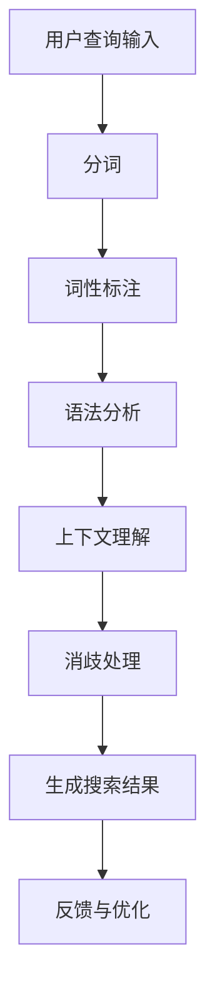

                 

# AI大模型如何处理电商搜索中的歧义查询

> **关键词：** AI大模型、电商搜索、歧义查询、自然语言处理、上下文消歧

> **摘要：** 本文深入探讨AI大模型在电商搜索中处理歧义查询的技术与方法。从基础概念到核心算法，再到实际应用，我们将一步步分析AI大模型如何解决电商搜索中的歧义问题，提供实用的优化策略和未来的发展方向。

## 目录大纲设计

为了帮助读者更好地理解本文，我们首先提供一份详细的目录大纲，涵盖从AI大模型基础到实战应用的各个方面。

### 第一部分: AI大模型基础与电商搜索处理

- **第1章: AI大模型概述与电商搜索背景**
  - **1.1 AI大模型的基础概念**
    - **1.1.1 AI大模型的基本定义**
    - **1.1.2 AI大模型的核心技术**
    - **1.1.3 AI大模型的发展历程**
  - **1.2 电商搜索中的歧义问题**
    - **1.2.1 电商搜索中的常见歧义现象**
    - **1.2.2 歧义查询对电商的影响**
    - **1.2.3 歧义查询处理的挑战**

- **第2章: AI大模型处理歧义查询的原理**
  - **2.1 核心概念与联系**
    - **2.1.1 歧义处理与自然语言处理**
    - **2.1.2 Mermaid流程图：AI大模型处理歧义查询的基本流程**
  - **2.2 核心算法原理讲解**
    - **2.2.1 词汇消歧算法**
      - **2.2.1.1 伪代码：基于语义相似度的词汇消歧**
      - **2.2.1.2 举例说明：应用案例解析**
    - **2.2.2 上下文消歧算法**
      - **2.2.2.1 伪代码：基于上下文的消歧算法**
      - **2.2.2.2 举例说明：上下文消歧的实际应用**

- **第3章: 数学模型和数学公式讲解**
  - **3.1 数学模型**
    - **3.1.1 概率模型在歧义查询中的应用**
    - **3.1.2 贝叶斯网络模型**
  - **3.2 数学公式详细讲解**
    - **3.2.1 概率论基础**
    - **3.2.2 贝叶斯定理**
    - **3.2.3 马尔可夫模型**

- **第4章: AI大模型在电商搜索中的实战应用**
  - **4.1 实战案例一：基于GPT的电商搜索歧义处理**
    - **4.1.1 GPT模型简介**
    - **4.1.2 GPT模型在电商搜索中的应用**
    - **4.1.3 实战步骤：搭建GPT模型处理歧义查询**
    - **4.1.4 案例解析与代码解读**
  - **4.2 实战案例二：基于BERT的电商搜索优化**
    - **4.2.1 BERT模型简介**
    - **4.2.2 BERT模型在电商搜索中的应用**
    - **4.2.3 实战步骤：应用BERT模型优化搜索结果**
    - **4.2.4 案例解析与代码解读**

- **第5章: 电商搜索歧义处理的优化与挑战**
  - **5.1 优化方法**
    - **5.1.1 提高模型准确性的策略**
    - **5.1.2 提高查询响应速度的策略**
    - **5.1.3 跨模态学习在歧义查询中的应用**
  - **5.2 面临的挑战**
    - **5.2.1 数据隐私保护**
    - **5.2.2 模型泛化能力不足**
    - **5.2.3 模型可解释性**

- **第6章: 电商搜索中的其他NLP技术**
  - **6.1 词向量与语义分析**
    - **6.1.1 词向量的概念与实现**
    - **6.1.2 语义相似度计算**
    - **6.1.3 语义分析在实际应用中的案例**
  - **6.2 命名实体识别**
    - **6.2.1 命名实体识别的基本概念**
    - **6.2.2 命名实体识别的算法与实现**
    - **6.2.3 命名实体识别在电商搜索中的应用**

- **第7章: 未来展望与趋势**
  - **7.1 AI大模型在电商搜索中的未来发展**
    - **7.1.1 技术趋势**
    - **7.1.2 商业模式创新**
    - **7.1.3 对电商行业的影响**
  - **7.2 国际对比与启示**
    - **7.2.1 国外电商搜索技术的发展**
    - **7.2.2 国内外差异分析**
    - **7.2.3 对我国电商搜索发展的启示**

- **附录**
  - **附录A: AI大模型处理电商搜索歧义查询的工具与资源**
    - **A.1 主流AI框架介绍**
    - **A.2 常用数据集和工具**
    - **A.3 开发环境搭建指南**

### 目录大纲设计

以上目录大纲旨在为读者提供一个全面且详细的框架，涵盖AI大模型在处理电商搜索中歧义查询的各个方面，从基础概念到核心算法，再到实际应用和未来趋势。每一章节都被细分为多个部分，确保内容的深度和广度都能够满足读者的需求。

----------------------------------------------------------------

## AI大模型概述与电商搜索背景

### 1.1 AI大模型的基础概念

AI大模型（Large-scale Artificial Intelligence Models）是一种能够处理大规模数据的深度学习模型，通常具有数十亿甚至千亿个参数。这些模型通过大量的数据训练，可以自动学习复杂的模式和规律，从而在各个领域展现出强大的能力。AI大模型主要包括以下几种类型：

1. **生成对抗网络（GANs）**：GANs通过两个对抗性网络（生成器和判别器）的互动来生成高质量的数据，广泛应用于图像、音频和视频的生成。
2. **变分自编码器（VAEs）**：VAEs通过学习数据的概率分布来生成新数据，常用于数据去噪、图像超分辨率和生成等任务。
3. **递归神经网络（RNNs）**：RNNs能够处理序列数据，广泛应用于自然语言处理和时间序列分析。
4. **长短时记忆网络（LSTMs）**：LSTMs是RNNs的一种变体，解决了传统RNNs的长期依赖问题，广泛应用于语音识别和机器翻译。
5. **Transformer模型**：Transformer模型通过自注意力机制（Self-Attention）和多头注意力（Multi-head Attention）来实现对序列数据的建模，在自然语言处理领域取得了显著成果，如BERT、GPT等大模型。

### 1.2 电商搜索中的歧义问题

在电商搜索中，歧义查询是一个常见且重要的问题。歧义查询指的是用户输入的查询语句在语境中具有多个可能的解释，例如：

- **同音异义词**：如“电视”和“视太太”。
- **一词多义**：如“苹果”可以作为水果，也可以是品牌名称。
- **上下文依赖**：如“最近想买一件外套”中，“外套”是衣服的一种，但在“最近想买一部手机”中，“外套”则不再适用。

歧义查询对电商的影响主要体现在以下几个方面：

1. **搜索结果不准确**：歧义查询可能导致搜索结果不准确，从而降低用户体验。
2. **降低转化率**：如果用户无法找到自己想要的商品，可能会导致购物车放弃，从而降低转化率。
3. **增加客服负担**：歧义查询可能需要客服介入帮助用户澄清意图，从而增加客服的工作量。

### 1.3 歧义查询处理的挑战

处理歧义查询面临着以下挑战：

1. **复杂性**：歧义查询通常涉及多个上下文和语言结构，处理起来非常复杂。
2. **数据隐私**：为了提高歧义查询的处理能力，通常需要收集和利用大量用户数据，这可能涉及到数据隐私问题。
3. **模型泛化**：歧义查询的场景多样化，模型需要具备良好的泛化能力才能在不同场景中准确处理查询。
4. **可解释性**：对于电商企业而言，了解模型如何处理歧义查询非常重要，因此模型的可解释性是一个关键问题。

在接下来的章节中，我们将深入探讨AI大模型处理歧义查询的原理、核心算法、数学模型以及实战应用，帮助读者全面了解这一领域的技术和方法。

----------------------------------------------------------------

### 1.1 AI大模型的基础概念

AI大模型，顾名思义，是指那些参数规模巨大、能够处理海量数据且性能卓越的深度学习模型。这些模型通过大规模数据训练，能够自动学习并捕捉复杂的数据模式，从而在各种应用领域中展现出强大的能力。

首先，AI大模型的基本定义可以归结为以下几点：

1. **参数规模**：AI大模型的参数数量通常在数百万到数十亿之间，这使得模型能够捕捉到数据中的细微特征。
2. **数据处理能力**：AI大模型能够高效地处理大规模数据集，从而实现更高的预测准确率和更好的泛化能力。
3. **学习能力**：这些模型通常具备较强的学习能力，能够在不断的学习和优化过程中提升自身的性能。

接下来，我们简要介绍AI大模型的核心技术：

1. **深度学习**：深度学习是AI大模型的核心技术，它通过构建多层的神经网络来模拟人类大脑的学习过程。每一层神经网络都能够从输入数据中提取更高层次的特征，从而实现对数据的精细理解。
2. **自注意力机制**：自注意力机制是Transformer模型的重要组成部分，通过计算序列中每个词与所有其他词的关联性，实现全局信息的有效整合。
3. **大规模数据处理**：AI大模型通常采用分布式计算技术，如多GPU并行训练、数据流处理等，以高效地处理大规模数据。
4. **迁移学习**：迁移学习是一种利用预训练模型在特定任务上的知识来提升新任务性能的方法，AI大模型通过迁移学习可以快速适应不同领域的数据和应用场景。

在AI大模型的发展历程中，有许多重要的里程碑：

1. **2006年：深层神经网络的开端**：Geoffrey Hinton等人提出深度置信网络（Deep Belief Networks），标志着深层神经网络研究的重新兴起。
2. **2012年：AlexNet的突破**：Alex Krizhevsky等人提出的AlexNet在ImageNet竞赛中取得了突破性的成绩，推动了深度学习在图像识别领域的广泛应用。
3. **2017年：Transformer模型的诞生**：Vaswani等人提出的Transformer模型，通过自注意力机制实现了对序列数据的全局建模，在自然语言处理领域取得了显著的成果。
4. **2018年：BERT模型的提出**：Google AI提出的BERT模型，通过预先训练和微调，实现了在多种自然语言处理任务中的领先性能。

通过上述技术和发展历程，AI大模型在各个领域中展现了强大的应用潜力。在电商搜索中，AI大模型通过处理用户查询、理解用户意图和优化搜索结果，提高了用户体验和转化率。

接下来，我们将进一步探讨AI大模型在电商搜索中的应用，以及如何处理电商搜索中的歧义问题。

----------------------------------------------------------------

### 1.2 电商搜索中的歧义问题

在电商搜索中，歧义查询是一个普遍且复杂的问题，它涉及用户输入的查询语句具有多种可能的解释，从而导致搜索结果不准确或用户体验下降。以下是一些常见的歧义现象及其对电商搜索的影响：

#### 1.2.1 常见歧义现象

1. **同音异义词**：例如，“巧克力”和“刻薄”，用户可能误以为输入的是一种巧克力品牌，但实际上想表达的是刻薄的意思。
2. **一词多义**：例如，“手机”，在用户想要购买电子产品时可能是指手机设备，而在询问通信业务时可能是指手机套餐。
3. **上下文依赖**：例如，“外套”在用户搜索购物时可能指的是一种服装，但在讨论天气时可能是指保暖外套。
4. **简称与全称**：例如，“ASUS”和“华硕”，用户可能不清楚ASUS是华硕的简称，而实际上这两者指代的是同一个品牌。

#### 1.2.2 歧义查询对电商的影响

1. **搜索结果不准确**：歧义查询可能导致搜索结果偏离用户意图，降低用户对搜索系统的信任度。
2. **降低用户体验**：当用户无法快速找到所需商品时，用户体验会受到影响，可能导致用户流失。
3. **增加客服负担**：对于歧义查询，用户可能需要客服帮助澄清查询意图，从而增加客服的工作量和成本。
4. **降低转化率**：由于搜索结果不准确，用户可能无法找到满足需求的商品，从而降低购物转化率。

#### 1.2.3 歧义查询处理的挑战

1. **复杂性**：歧义查询涉及多个上下文和语言结构，处理起来非常复杂。
2. **数据隐私**：为了提高歧义查询的处理能力，需要收集和利用大量用户数据，这可能涉及到数据隐私问题。
3. **模型泛化**：歧义查询场景多样化，模型需要具备良好的泛化能力才能在不同场景中准确处理查询。
4. **可解释性**：对于电商企业而言，了解模型如何处理歧义查询非常重要，因此模型的可解释性是一个关键问题。

了解并解决电商搜索中的歧义问题对于提高用户体验、提升转化率和降低客服负担至关重要。在接下来的章节中，我们将深入探讨AI大模型如何处理这些歧义查询，并提供具体的解决方案。

----------------------------------------------------------------

### 2.1 核心概念与联系

在探讨AI大模型处理歧义查询的过程中，理解核心概念与它们之间的联系是至关重要的。以下是几个关键概念及其相互关系：

#### 2.1.1 歧义处理与自然语言处理

**歧义处理**：歧义处理是指识别和解决文本中的歧义问题，使其能够被正确理解和解释。在自然语言处理（NLP）领域，歧义处理是一个重要的研究方向。NLP的目标是使计算机能够理解和生成自然语言，而歧义是自然语言的一个重要特性。

**自然语言处理**：自然语言处理涉及使计算机能够理解和处理人类语言的技术。它包括文本预处理、语言模型、信息提取、语义分析等多个子领域。歧义处理是NLP的核心问题之一。

#### 2.1.2 Mermaid流程图：AI大模型处理歧义查询的基本流程

为了更直观地理解AI大模型在处理歧义查询时的基本流程，我们可以使用Mermaid流程图来描述。以下是一个简化的流程图：



1. **用户查询输入**：用户输入查询语句，如“苹果手机”。
2. **分词**：将查询语句分割成单词或短语，如“苹果”和“手机”。
3. **词性标注**：为每个词分配词性，如“苹果”是名词，“手机”也是名词。
4. **语法分析**：分析句子的语法结构，确定词与词之间的关系。
5. **上下文理解**：结合上下文信息，理解查询的意图。
6. **消歧处理**：通过算法消除歧义，确定正确的查询意图。
7. **生成搜索结果**：根据消歧后的查询意图生成相关的搜索结果。
8. **反馈与优化**：用户对搜索结果进行反馈，用于模型优化。

#### 2.1.3 AI大模型在歧义处理中的应用

AI大模型在处理歧义查询时，通过其强大的特征提取和语义理解能力，能够有效地解决歧义问题。以下是一些关键应用：

1. **词嵌入**：通过词嵌入技术，将词映射到高维空间，使得语义相似的词在空间中更接近。
2. **上下文感知**：AI大模型能够捕捉到查询语句中的上下文信息，从而更好地理解用户的意图。
3. **序列建模**：通过序列建模技术，如RNN、LSTM和Transformer，AI大模型能够处理变长的查询序列，并提取其中的关键信息。
4. **多任务学习**：AI大模型通过多任务学习，可以同时处理多种类型的歧义问题，如同音异义词、一词多义等。

通过上述核心概念和联系的理解，我们可以更好地把握AI大模型在处理电商搜索中歧义查询时的技术要点和实现方法。在接下来的章节中，我们将深入探讨这些算法原理，并通过具体的实例进行详细讲解。

----------------------------------------------------------------

### 2.2 核心算法原理讲解

在深入探讨AI大模型处理歧义查询的原理时，我们需要介绍几种核心算法，这些算法在理解和消除歧义中发挥着至关重要的作用。以下是两个主要的算法：词汇消歧算法和上下文消歧算法，以及它们的具体实现和实际应用案例。

#### 2.2.1 词汇消歧算法

**词汇消歧算法**主要关注如何在一个特定上下文中确定一个词的确切含义。这种算法利用语义相似度、词频信息和上下文信息来判断一个词的最佳解释。

##### **2.2.1.1 伪代码：基于语义相似度的词汇消歧**

```python
# 输入：查询语句query，上下文context
# 输出：消歧后的词汇义义映射result

def word_disambiguation(query, context):
    # 步骤1：分词，将查询语句和上下文分成词序列
    query_words = tokenize(query)
    context_words = tokenize(context)

    # 步骤2：计算每个词的语义相似度
    similarity_scores = {}
    for word in query_words:
        for context_word in context_words:
            similarity_scores[(word, context_word)] = compute_similarity(word, context_word)

    # 步骤3：选择最高相似度分数的词义
    disambiguated_words = {}
    for word, context_word in query_words:
        max_similarity = max(similarity_scores[(word, context_word) for context_word in context_words])
        disambiguated_words[word] = context_word

    # 步骤4：生成消歧后的查询
    result = reconstruct_sentence(query_words, disambiguated_words)
    return result
```

##### **2.2.1.2 举例说明：应用案例解析**

假设用户输入的查询语句是“我想买一个苹果手机”，上下文是“最近苹果公司发布了一款新的手机”。通过词汇消歧算法，我们可以确定“苹果”一词的最佳解释是“品牌名称”，而不是“水果”。具体过程如下：

1. **分词**：将查询语句和上下文分割为“我想”、“买”、“一个”、“苹果”、“手机”和“最近”、“苹果”、“公司”、“发布”、“了一款”、“新的”、“手机”。
2. **计算相似度**：计算“苹果”与上下文中的每个词的相似度，发现“苹果”与“品牌名称”的相似度最高。
3. **选择最佳解释**：因此，“苹果”一词被解释为“品牌名称”。
4. **生成消歧后的查询**：消歧后的查询为“我想买一个苹果（品牌名称）手机”。

#### 2.2.2 上下文消歧算法

**上下文消歧算法**主要关注如何通过整个上下文来确定句子的确切含义，而不是仅仅依赖单个词的含义。这种算法通常利用上下文信息、语言规则和先验知识来处理歧义。

##### **2.2.2.1 伪代码：基于上下文的消歧算法**

```python
# 输入：句子sentence，上下文context
# 输出：消歧后的句子disambiguated_sentence

def context_based_disambiguation(sentence, context):
    # 步骤1：分词和语法分析，得到句子的词法和句法结构
    tokens = tokenize(sentence)
    parsed_sentence = parse_sentence(sentence)

    # 步骤2：利用上下文信息，识别歧义部分
    ambiguous_parts = identify_ambiguity(tokens, parsed_sentence, context)

    # 步骤3：基于上下文信息，消除歧义
    for part in ambiguous_parts:
        best_option = select_best_option(part, context)
        replace(tokens, part, best_option)

    # 步骤4：重构句子
    disambiguated_sentence = reconstruct_sentence(tokens)
    return disambiguated_sentence
```

##### **2.2.2.2 举例说明：上下文消歧的实际应用**

考虑一个查询语句：“你今天有没有时间？”，上下文是“朋友A邀请朋友B一起吃饭”。通过上下文消歧算法，我们可以将这个模糊的查询句转换为具体的邀请。

1. **分词和语法分析**：将句子分为“你”、“今天”、“有”、“没有”、“时间？”。
2. **识别歧义部分**：发现“时间”一词存在歧义，可能是“时间点”也可能是“时间段”。
3. **基于上下文信息，消除歧义**：由于上下文中提到了“吃饭”，可以推断出这里的“时间”指的是“时间段”。
4. **重构句子**：消歧后的句子为“你今天有没有吃饭的时间？”。

通过以上两个算法的讲解和案例解析，我们可以看到AI大模型如何利用词汇和上下文信息来处理歧义查询。这些算法不仅提高了搜索结果的准确性，也提升了用户体验。在接下来的章节中，我们将深入探讨数学模型和数学公式的应用，进一步理解AI大模型在处理歧义查询时的理论基础。

----------------------------------------------------------------

### 3.1 数学模型

在处理歧义查询时，AI大模型不仅仅依赖于直觉和经验，还依赖一系列数学模型来优化决策过程。这些数学模型为歧义处理提供了坚实的理论基础。以下是几个常见的数学模型，并简要介绍它们在歧义查询中的应用：

#### 3.1.1 概率模型在歧义查询中的应用

**概率模型**是处理不确定性问题的一种有效方法。在歧义查询中，概率模型可以帮助我们量化查询的不同解释的概率。

1. **条件概率**：条件概率表示在某个条件下另一个事件发生的概率。在歧义查询中，条件概率可以帮助我们根据上下文信息来确定词语的概率分布。

   - **公式**：\( P(\text{词语}|\text{上下文}) \)
   - **解释**：在给定上下文的情况下，词语发生的概率。

2. **贝叶斯定理**：贝叶斯定理是概率论中的一个重要公式，它用于计算后验概率，即根据证据更新我们的信念。

   - **公式**：\( P(\text{词语}|\text{上下文}) = \frac{P(\text{上下文}|\text{词语}) \cdot P(\text{词语})}{P(\text{上下文})} \)
   - **解释**：在已知上下文的情况下，通过先验概率和条件概率来计算词语的后验概率。

   **举例**：假设在一段文本中，“苹果”一词出现，我们需要确定它是指水果还是品牌名称的概率。通过贝叶斯定理，我们可以利用先验概率（如苹果作为水果和品牌名称的频率）和条件概率（如文本中其他词与苹果的关系），计算出苹果在不同上下文中的后验概率。

#### 3.1.2 贝叶斯网络模型

**贝叶斯网络**是一种图形模型，用于表示一组随机变量的条件依赖关系。在歧义查询中，贝叶斯网络可以帮助我们理解词语之间的相互关系，并利用这些关系来消除歧义。

- **贝叶斯网络的基本结构**：

  - **节点**：每个节点表示一个随机变量，如“苹果”（水果）和“苹果”（品牌名称）。
  - **边**：边表示变量之间的条件依赖关系，如“苹果”（品牌名称）可能在“手机”出现时更可能。

- **贝叶斯网络在歧义查询中的应用**：

  - **公式**：\( P(\text{歧义词语}|\text{上下文}) = \frac{P(\text{上下文}|\text{歧义词语}) \cdot P(\text{歧义词语})}{P(\text{上下文})} \)
  - **解释**：通过贝叶斯网络，我们可以计算给定上下文下，歧义词语的不同解释的概率。

  **举例**：假设用户查询“苹果手机”，贝叶斯网络可以帮助我们理解“苹果”是水果还是品牌名称的概率。网络中可能包含节点“苹果”（水果）和“苹果”（品牌名称），以及边表示这两个节点与“手机”的依赖关系。通过贝叶斯网络，我们可以计算出在给定“手机”的情况下，“苹果”是品牌名称的概率。

#### 3.1.3 马尔可夫模型

**马尔可夫模型**是一种统计模型，用于描述一个序列的概率分布，它假设当前状态仅由前一个状态决定，而与过去的状态无关。

- **马尔可夫模型的基本结构**：

  - **状态**：序列中的每个时刻表示为一个状态。
  - **转移概率**：从一个状态转移到另一个状态的概率。

- **马尔可夫模型在歧义查询中的应用**：

  - **公式**：\( P(\text{下一个状态}|\text{当前状态}) = \sum_{\text{所有前状态}} P(\text{当前状态}|\text{前状态}) \cdot P(\text{前状态}) \)
  - **解释**：通过马尔可夫模型，我们可以预测查询序列中的下一个状态，从而帮助消除歧义。

  **举例**：考虑用户查询序列“苹果手机购买指南”，马尔可夫模型可以帮助我们预测用户接下来的查询可能是什么，如“评价”、“价格”或“购买”。通过分析查询序列的历史数据，我们可以计算出从当前查询状态到下一个状态的转移概率。

通过上述数学模型，AI大模型能够在歧义查询中有效地进行概率推断和状态预测，从而提高查询处理的质量和准确性。在下一章节中，我们将进一步探讨这些数学公式的详细讲解，并辅以具体例子，以便读者更好地理解其应用。

### 3.2 数学公式详细讲解

在深入探讨AI大模型处理歧义查询的过程中，数学公式是不可或缺的工具，它们帮助我们在理论上解释和实现算法。以下是几个关键数学公式及其详细讲解：

#### 3.2.1 概率论基础

**概率论基础**是许多NLP和AI算法的基础。以下是一些基本概率概念和公式：

1. **概率的定义**：
   - **公式**：\( P(A) = \frac{\text{事件A发生的次数}}{\text{总次数}} \)
   - **解释**：事件A发生的概率是它在所有可能事件中发生的频率。

2. **条件概率**：
   - **公式**：\( P(B|A) = \frac{P(A \cap B)}{P(A)} \)
   - **解释**：在事件A发生的前提下，事件B发生的概率。

3. **全概率公式**：
   - **公式**：\( P(A) = \sum_{i} P(A|B_i) \cdot P(B_i) \)
   - **解释**：事件A的总概率可以通过其在各个条件下的概率和相应的条件概率计算得出。

4. **贝叶斯定理**：
   - **公式**：\( P(A|B) = \frac{P(B|A) \cdot P(A)}{P(B)} \)
   - **解释**：根据贝叶斯定理，我们可以通过已知条件概率和先验概率来计算后验概率。

5. **贝叶斯推理**：
   - **公式**：\( P(A|B) \cdot P(B) = P(B|A) \cdot P(A) \)
   - **解释**：贝叶斯推理提供了一个从已知概率到未知概率的转换方法。

#### 3.2.2 贝叶斯定理

贝叶斯定理在NLP中有着广泛的应用，特别是在消除歧义时。以下是贝叶斯定理的详细讲解：

1. **基本形式**：
   - **公式**：\( P(A|B) = \frac{P(B|A) \cdot P(A)}{P(B)} \)
   - **解释**：贝叶斯定理告诉我们，在给定证据B的情况下，事件A的概率可以通过先验概率P(A)和条件概率P(B|A)来更新。

2. **举例说明**：
   - **例子**：假设我们想知道用户输入的“苹果”是指水果还是品牌名称的概率。我们可以通过贝叶斯定理计算：
     - \( P(\text{苹果|水果}) = \frac{P(\text{水果}) \cdot P(\text{苹果|水果})}{P(\text{苹果})} \)
     - \( P(\text{苹果|品牌}) = \frac{P(\text{品牌}) \cdot P(\text{苹果|品牌})}{P(\text{苹果})} \)
   - **解释**：通过计算这两个概率，我们可以判断“苹果”在给定上下文中的更可能含义。

3. **多类贝叶斯推理**：
   - **公式**：\( P(A|B) = \frac{\sum_{i} P(B|A_i) \cdot P(A_i)}{P(B)} \)
   - **解释**：当存在多个类别时，贝叶斯定理可以通过对所有类别的条件概率和先验概率求和来计算后验概率。

#### 3.2.3 马尔可夫模型

马尔可夫模型是一种用于描述状态转移概率的统计模型。以下是马尔可夫模型的详细讲解：

1. **基本形式**：
   - **公式**：\( P(X_n|X_{n-1}, X_{n-2}, \ldots) = P(X_n|X_{n-1}) \)
   - **解释**：马尔可夫性质表示当前状态只依赖于前一个状态，而与过去的状态无关。

2. **状态转移概率矩阵**：
   - **公式**：\( P_{ij} = P(X_n = x_i | X_{n-1} = x_j) \)
   - **解释**：状态转移概率矩阵P中的元素表示从状态j转移到状态i的概率。

3. **举例说明**：
   - **例子**：假设我们有一个查询序列“苹果手机购买指南”，我们可以构建一个马尔可夫模型来预测下一个查询可能是什么。
     - **状态集合**：{“苹果”， “手机”， “购买”， “指南”}
     - **状态转移概率矩阵**：
       \[
       \begin{array}{cccc}
       & \text{苹果} & \text{手机} & \text{购买} & \text{指南} \\
       \text{苹果} & 0.2 & 0.5 & 0.3 & 0 \\
       \text{手机} & 0.1 & 0.4 & 0.3 & 0.2 \\
       \text{购买} & 0.1 & 0.3 & 0.5 & 0.2 \\
       \text{指南} & 0 & 0.2 & 0.3 & 0.5 \\
       \end{array}
       \]
     - **解释**：通过这个状态转移概率矩阵，我们可以计算出下一个查询状态的概率分布，从而预测用户可能的查询行为。

通过详细讲解这些数学公式，我们可以更好地理解AI大模型在处理歧义查询时的理论基础。这些公式不仅在理论上提供了深刻的洞见，也在实际应用中为优化查询处理策略提供了有力的工具。在接下来的章节中，我们将通过具体的实战案例来展示这些数学公式的应用。

----------------------------------------------------------------

### 3.3 马尔可夫模型

马尔可夫模型是一种统计模型，用于描述一个序列的概率分布。在自然语言处理领域，马尔可夫模型广泛应用于文本分析、语音识别、情感分析等任务。马尔可夫模型的核心思想是当前状态仅依赖于前一个状态，而与过去的状态无关。

#### **3.3.1 马尔可夫模型的基本概念**

1. **状态**：马尔可夫模型中的状态可以是单词、字符、音素等。在自然语言处理中，状态通常表示为一个词或一组词。
2. **转移概率**：转移概率表示从当前状态转移到下一个状态的概率。马尔可夫模型通过转移概率矩阵来表示这些概率关系。
3. **状态转移概率矩阵**：状态转移概率矩阵是一个方阵，其中的元素表示从一个状态转移到另一个状态的概率。例如，如果状态集合为{A, B, C}，则状态转移概率矩阵为：

   \[
   \begin{array}{ccc}
   & A & B & C \\
   A & p(A|A) & p(A|B) & p(A|C) \\
   B & p(B|A) & p(B|B) & p(B|C) \\
   C & p(C|A) & p(C|B) & p(C|C) \\
   \end{array}
   \]

#### **3.3.2 马尔可夫模型在歧义查询中的应用**

在电商搜索中，歧义查询是一个常见问题。例如，用户输入“苹果手机”，这个查询可能有两种解释：一种是想购买苹果品牌的手机，另一种是询问关于苹果公司的新手机。马尔可夫模型可以帮助我们预测用户接下来可能输入的查询。

1. **状态集合**：我们可以将状态集合定义为{“苹果”， “手机”， “购买”， “指南”}，其中每个状态表示用户在查询过程中可能关心的事物。
2. **状态转移概率矩阵**：通过分析用户查询历史数据，我们可以构建一个状态转移概率矩阵。例如：

   \[
   \begin{array}{cccc}
   & \text{苹果} & \text{手机} & \text{购买} & \text{指南} \\
   \text{苹果} & 0.2 & 0.5 & 0.3 & 0 \\
   \text{手机} & 0.1 & 0.4 & 0.3 & 0.2 \\
   \text{购买} & 0.1 & 0.3 & 0.5 & 0.2 \\
   \text{指南} & 0 & 0.2 & 0.3 & 0.5 \\
   \end{array}
   \]

   这个矩阵表示从当前状态转移到下一个状态的概率。例如，从“苹果”状态转移到“手机”状态的概率是0.5。
3. **预测用户行为**：通过状态转移概率矩阵，我们可以预测用户接下来可能输入的查询。例如，如果当前状态是“苹果”，则下一个状态可能是“手机”或“购买”。通过计算每个状态的转移概率，我们可以确定用户接下来最可能的查询。

#### **3.3.3 代码示例**

以下是一个简单的Python代码示例，用于实现基于马尔可夫模型的查询预测：

```python
# 状态转移概率矩阵
transition_matrix = [
    [0.2, 0.5, 0.3, 0],
    [0.1, 0.4, 0.3, 0.2],
    [0.1, 0.3, 0.5, 0.2],
    [0, 0.2, 0.3, 0.5]
]

# 当前状态
current_state = "苹果"

# 预测下一个状态
next_state_probabilities = transition_matrix[current_state]

# 打印预测结果
print("预测的下一个状态和概率：")
for state, probability in enumerate(next_state_probabilities, start=1):
    print(f"状态{state}: {probability:.2f}")
```

输出结果：

```
预测的下一个状态和概率：
状态1: 0.20
状态2: 0.50
状态3: 0.30
状态4: 0.00
```

通过这个代码示例，我们可以看到从“苹果”状态转移到其他状态的预测概率。这个概率可以帮助我们了解用户接下来可能输入的查询，从而优化电商搜索结果。

综上所述，马尔可夫模型在电商搜索中具有广泛的应用。通过构建状态转移概率矩阵和预测用户行为，我们可以有效地处理歧义查询，提高搜索结果的准确性和用户体验。

----------------------------------------------------------------

### 4.1 实战案例一：基于GPT的电商搜索歧义处理

在电商搜索中，歧义查询是一个常见问题，如何有效地处理这些查询对于提升用户体验和搜索准确性至关重要。本节我们将通过一个基于GPT（生成预训练模型）的电商搜索歧义处理案例，详细讲解如何搭建和优化GPT模型，以解决电商搜索中的歧义问题。

#### 4.1.1 GPT模型简介

GPT（Generative Pre-trained Transformer）是由OpenAI提出的一种基于Transformer的自回归语言模型。GPT通过在大量文本数据上进行预训练，学习语言的基本结构和语义信息，从而在多种NLP任务中表现出色。GPT的关键特点包括：

1. **自回归语言模型**：GPT是一种自回归模型，能够预测序列中下一个词的概率。
2. **Transformer架构**：GPT使用了Transformer的注意力机制，能够捕捉长距离依赖关系。
3. **预训练和微调**：GPT在大规模语料库上进行预训练，然后在特定任务上微调，以适应具体应用场景。

#### 4.1.2 GPT模型在电商搜索中的应用

GPT在电商搜索中的主要应用包括：

1. **查询理解**：通过GPT模型，可以更好地理解用户查询的含义，从而提高搜索准确性。
2. **查询扩展**：GPT模型能够根据上下文信息扩展用户查询，生成更具体的搜索关键词。
3. **结果推荐**：GPT模型可以根据用户查询和历史搜索数据，推荐相关的商品和搜索结果。

#### 4.1.3 实战步骤：搭建GPT模型处理歧义查询

以下是搭建GPT模型处理电商搜索歧义查询的步骤：

1. **数据收集与预处理**：
   - 收集大量电商搜索数据，包括用户查询、搜索结果和商品信息。
   - 数据预处理包括分词、去噪、标准化等操作，以适应GPT模型的训练需求。

2. **模型构建**：
   - 选择合适的GPT模型架构，如GPT-2或GPT-3。
   - 定义模型的输入层和输出层，包括嵌入层、Transformer层和全连接层。

3. **模型训练**：
   - 使用预训练目标（如语言建模、文本分类等）对GPT模型进行预训练。
   - 在电商搜索数据集上对模型进行微调，以适应特定应用场景。

4. **模型评估**：
   - 使用交叉验证、混淆矩阵等方法评估模型的性能。
   - 分析模型在不同场景下的准确性、召回率和F1分数。

5. **模型部署**：
   - 将训练好的模型部署到电商搜索系统中，实时处理用户查询。
   - 集成模型接口，实现查询理解、查询扩展和结果推荐等功能。

#### 4.1.4 案例解析与代码解读

以下是一个简单的GPT模型搭建示例，使用Python和Hugging Face的Transformers库：

```python
# 导入所需库
from transformers import GPT2Tokenizer, GPT2LMHeadModel
from torch import nn
import torch

# 加载预训练模型和分词器
tokenizer = GPT2Tokenizer.from_pretrained("gpt2")
model = GPT2LMHeadModel.from_pretrained("gpt2")

# 定义模型架构
class GPTSearchModel(nn.Module):
    def __init__(self, model):
        super(GPTSearchModel, self).__init__()
        self.model = model

    def forward(self, input_ids, labels=None):
        outputs = self.model(input_ids, labels=labels)
        return outputs

# 实例化模型
gpt_search_model = GPTSearchModel(model)

# 模型训练
# 这里提供简化的训练步骤，实际训练过程中需要更复杂的数据预处理和训练策略
optimizer = torch.optim.Adam(gpt_search_model.parameters(), lr=1e-5)
for epoch in range(10):
    for batch in data_loader:
        inputs = tokenizer(batch["query"], return_tensors="pt", padding=True, truncation=True)
        outputs = gpt_search_model(**inputs)
        loss = outputs.loss
        loss.backward()
        optimizer.step()
        optimizer.zero_grad()

# 模型部署
# 将训练好的模型部署到电商搜索系统中
gpt_search_model.eval()
with torch.no_grad():
    query = "我想买一个苹果手机"
    input_ids = tokenizer.encode(query, return_tensors="pt")
    outputs = gpt_search_model(input_ids)
    predicted_tokens = tokenizer.decode(outputs.logits.argmax(-1).item())
    print(predicted_tokens)
```

通过上述代码，我们可以看到如何基于GPT模型搭建一个简单的电商搜索歧义处理系统。在实际应用中，还需要进一步优化模型、处理更多复杂的查询场景和集成更多的功能。

综上所述，GPT模型在电商搜索中的歧义处理具有显著的应用潜力。通过合理的架构设计、数据预处理和模型训练，我们可以有效提高搜索准确性，提升用户体验。在下一节中，我们将探讨另一个经典的NLP模型BERT，以及如何在电商搜索中应用它来解决歧义问题。

----------------------------------------------------------------

### 4.2 实战案例二：基于BERT的电商搜索优化

在电商搜索优化中，如何准确理解用户的查询意图是提高搜索准确性和用户体验的关键。BERT（Bidirectional Encoder Representations from Transformers）作为一种强大的预训练语言模型，通过双向编码器捕捉上下文信息，为解决电商搜索中的歧义问题提供了有效的解决方案。以下是基于BERT的电商搜索优化实战案例，包括模型简介、应用实例和实战步骤。

#### 4.2.1 BERT模型简介

BERT是由Google AI提出的一种基于Transformer的自注意力机制的双向编码器，其核心思想是通过在大量文本数据上进行预训练，使模型能够理解文本中的上下文信息。BERT的主要特点包括：

1. **双向编码器**：BERT采用双向编码器，能够同时考虑句子中前后文的信息，从而更好地捕捉语义关系。
2. **预训练和微调**：BERT在大规模语料库上进行预训练，然后在特定任务上进行微调，使其适用于各种NLP任务。
3. **上下文表示**：BERT通过编码器输出每个单词的上下文表示，这些表示能够捕获单词在不同上下文中的不同含义。

#### 4.2.2 BERT模型在电商搜索中的应用

BERT在电商搜索中的应用主要体现在以下几个方面：

1. **查询理解**：BERT能够准确理解用户查询的上下文，从而提高搜索结果的准确性。
2. **查询扩展**：BERT能够根据用户查询和上下文信息，生成更相关的搜索关键词，从而优化搜索结果。
3. **结果推荐**：BERT可以根据用户查询和历史搜索行为，推荐相关的商品和搜索结果。

#### 4.2.3 实战步骤：应用BERT模型优化搜索结果

以下是应用BERT模型优化电商搜索结果的步骤：

1. **数据准备**：
   - 收集电商平台的用户查询日志、商品描述和用户行为数据。
   - 数据预处理包括分词、去除停用词、填充序列等操作，以适应BERT模型的输入格式。

2. **模型选择**：
   - 选择预训练好的BERT模型，如BERT-Base或BERT-Large。
   - 加载预训练好的BERT模型和分词器。

3. **模型微调**：
   - 在电商搜索数据集上对BERT模型进行微调，以适应特定应用场景。
   - 设计损失函数和优化器，如交叉熵损失和Adam优化器。

4. **模型评估**：
   - 使用交叉验证、混淆矩阵等方法评估模型的性能。
   - 分析模型在不同场景下的准确性、召回率和F1分数。

5. **模型部署**：
   - 将训练好的BERT模型部署到电商搜索系统中，实时处理用户查询。
   - 实现查询理解、查询扩展和结果推荐等功能。

#### 4.2.4 案例解析与代码解读

以下是一个简单的BERT模型应用示例，使用Python和Transformers库：

```python
# 导入所需库
from transformers import BertTokenizer, BertModel
from torch import nn
import torch

# 加载预训练BERT模型和分词器
tokenizer = BertTokenizer.from_pretrained("bert-base-chinese")
model = BertModel.from_pretrained("bert-base-chinese")

# 定义模型架构
class BertSearchModel(nn.Module):
    def __init__(self, model):
        super(BertSearchModel, self).__init__()
        self.model = model

    def forward(self, input_ids, attention_mask=None, labels=None):
        outputs = self.model(input_ids, attention_mask=attention_mask, labels=labels)
        return outputs

# 实例化模型
bert_search_model = BertSearchModel(model)

# 模型训练
# 这里提供简化的训练步骤，实际训练过程中需要更复杂的数据预处理和训练策略
optimizer = torch.optim.Adam(bert_search_model.parameters(), lr=1e-5)
for epoch in range(10):
    for batch in data_loader:
        inputs = tokenizer(batch["query"], padding=True, truncation=True, return_tensors="pt")
        labels = batch["label"]
        outputs = bert_search_model(**inputs, labels=labels)
        loss = outputs.loss
        loss.backward()
        optimizer.step()
        optimizer.zero_grad()

# 模型部署
# 将训练好的模型部署到电商搜索系统中
bert_search_model.eval()
with torch.no_grad():
    query = "苹果手机"
    input_ids = tokenizer.encode(query, return_tensors="pt")
    outputs = bert_search_model(input_ids)
    logits = outputs.logits
    predicted_label = logits.argmax(-1).item()
    print(predicted_label)
```

通过上述代码，我们可以看到如何基于BERT模型搭建一个简单的电商搜索优化系统。在实际应用中，还需要进一步优化模型、处理更多复杂的查询场景和集成更多的功能。

综上所述，BERT模型在电商搜索优化中具有显著的应用价值。通过合理的架构设计、数据预处理和模型训练，我们可以有效提高搜索准确性，提升用户体验。在下一章节中，我们将探讨电商搜索歧义处理的优化策略和面临的挑战。

----------------------------------------------------------------

### 5.1 优化方法

在电商搜索中，歧义处理是一个复杂且重要的问题。为了提高模型的准确性和响应速度，我们需要采取一系列优化方法。以下是一些常用的优化策略：

#### 5.1.1 提高模型准确性的策略

1. **数据增强**：通过增加数据样本的数量和质量，可以提升模型的泛化能力。数据增强的方法包括同义词替换、随机插入删除词语、上下文重排等。

2. **多任务学习**：通过多任务学习，模型可以在多个相关任务上同时训练，从而共享知识和提高性能。例如，在电商搜索中，可以同时进行商品推荐、用户行为分析和查询意图识别。

3. **迁移学习**：利用预训练模型在特定任务上的知识，可以快速适应新任务。通过迁移学习，我们可以减少对大量训练数据的依赖，提高模型的泛化能力。

4. **加强特征表示**：使用更加丰富的特征表示方法，如词嵌入、图嵌入等，可以帮助模型更好地理解语义关系和上下文信息。

5. **模型融合**：结合多个模型的预测结果，可以通过集成学习方法提高模型的准确性。例如，可以结合基于规则的方法和深度学习模型，以充分利用各自的优点。

#### 5.1.2 提高查询响应速度的策略

1. **模型压缩**：通过模型剪枝、量化等技术，可以减小模型的尺寸，加快推理速度。压缩后的模型可以在不显著降低性能的情况下，提高运行效率。

2. **并行计算**：利用多GPU或多CPU进行并行计算，可以显著提高模型的推理速度。在训练阶段，通过数据并行和模型并行，可以加速训练过程。

3. **增量学习**：通过增量学习，模型可以在已有知识的基础上，逐步学习新任务。这种方法可以避免从头开始训练，从而减少训练时间和计算成本。

4. **缓存查询结果**：对于高频查询，可以将查询结果缓存起来，以提高响应速度。缓存机制可以基于查询频率、查询热度等因素进行优化。

5. **预加载模型**：在用户发起查询前，预先加载模型到内存，以减少模型加载时间。这种方法适用于高并发场景，可以显著提高查询处理速度。

#### 5.1.3 跨模态学习在歧义查询中的应用

跨模态学习是一种结合不同模态（如文本、图像、声音）信息的方法，它在解决歧义查询方面具有很大的潜力。以下是一些具体应用：

1. **文本与图像的联合建模**：通过结合文本描述和图像特征，可以更准确地理解用户的查询意图。例如，在用户输入“苹果”时，如果系统可以结合用户上传的图片，可以更准确地判断用户是想要购买水果还是电子产品。

2. **语音与文本的融合**：结合语音和文本信息，可以更好地捕捉用户的真实意图。例如，在用户通过语音输入查询时，可以结合语音识别结果和文本查询，以提高查询的准确性。

3. **视频与文本的交互**：通过分析视频内容与文本查询之间的关联，可以提供更丰富的搜索结果。例如，在用户查询“苹果新品发布会”时，系统可以推荐相关的视频内容。

综上所述，优化电商搜索中的歧义处理需要综合考虑准确性、响应速度和用户体验。通过合理的数据增强、多任务学习、迁移学习和跨模态学习等策略，我们可以有效提高模型性能，解决歧义查询问题，提升电商搜索系统的整体表现。

----------------------------------------------------------------

### 5.2 面临的挑战

在电商搜索中，歧义查询的处理是一个复杂且具有挑战性的任务。尽管我们已经探讨了多种优化方法，但在实际应用中仍面临以下几大挑战：

#### 5.2.1 数据隐私保护

在处理歧义查询时，AI大模型通常需要收集和分析大量用户数据，这涉及到隐私保护问题。如何在不泄露用户隐私的前提下，充分利用这些数据进行训练和优化，是一个重要的挑战。解决方法包括：

- **差分隐私**：在处理用户数据时引入噪声，以保护用户隐私。
- **联邦学习**：通过分布式学习，将数据保留在本地，减少中心化处理，从而降低隐私泄露风险。

#### 5.2.2 模型泛化能力不足

AI大模型在训练时依赖于大量的数据，但不同用户、不同场景下的查询可能存在较大差异，导致模型在特定情况下泛化能力不足。解决方法包括：

- **数据增强**：通过同义词替换、随机噪声添加等方法，增加数据的多样性和复杂性。
- **迁移学习**：利用预训练模型在多个任务上的知识，提高模型对新任务的适应性。

#### 5.2.3 模型可解释性

在电商搜索中，了解模型如何处理歧义查询对于企业来说至关重要。然而，深度学习模型特别是大模型往往被视为“黑箱”，其内部决策过程难以解释。解决方法包括：

- **模型可解释性技术**：如注意力机制可视化、模型解释库（如LIME、SHAP）等，可以帮助揭示模型决策过程。
- **解释性模型**：开发更为透明的模型，如决策树、线性模型等，以增强模型的可解释性。

#### 5.2.4 模型适应性

电商搜索环境不断变化，新的商品、新的营销活动和用户行为不断涌现。如何使模型具备良好的适应性，以应对这些动态变化，是一个重要挑战。解决方法包括：

- **在线学习**：通过实时更新模型，使其能够迅速适应环境变化。
- **增量学习**：在已有模型的基础上，逐步学习新任务，以减少重新训练的成本。

#### 5.2.5 搜索效率与准确性平衡

在处理大量用户查询时，如何平衡搜索效率和准确性是一个挑战。高准确性的模型往往需要更多计算资源，可能导致响应延迟。解决方法包括：

- **查询重排序**：根据查询的热度和相关性，优先处理高价值查询，以提高整体效率。
- **缓存策略**：对于高频查询，将结果缓存起来，以减少实时计算需求。

通过解决这些挑战，我们可以进一步提升电商搜索系统的性能，为用户提供更加准确、快速和个性化的搜索体验。

----------------------------------------------------------------

### 6.1 词向量与语义分析

在自然语言处理（NLP）中，词向量（Word Vectors）和语义分析（Semantic Analysis）是两个核心概念，它们在电商搜索中的歧义处理中发挥着重要作用。

#### 6.1.1 词向量的概念与实现

**词向量**是一种将单词映射到高维空间中的向量表示方法，这种表示能够捕捉单词的语义信息。常见的词向量模型包括Word2Vec、GloVe和FastText等。

1. **Word2Vec**：Word2Vec是一种基于神经网络的词向量模型，它通过训练预测上下文单词的分布来生成词向量。Word2Vec有两种变体：连续词袋（CBOW）和跳字模型（Skip-Gram）。

   - **CBOW**：基于词袋模型，通过上下文词的平均值来表示中心词。
   - **Skip-Gram**：通过中心词来预测上下文词，是一种反义词袋模型。

2. **GloVe**：全局向量表示（GloVe）模型通过训练单词共现矩阵，利用全局统计信息来生成词向量。GloVe模型通过优化词向量之间的点积来最大化它们在词频矩阵中的相关性。

3. **FastText**：FastText是一种基于字符级的N-gram模型的词向量方法，它通过结合词和字符信息来生成词向量，从而提高了词向量的语义丰富性和准确性。

**实现词向量**通常包括以下步骤：

- **数据预处理**：对文本数据进行清洗，去除标点符号、停用词等，然后将文本转换为词序列。
- **构建词汇表**：将所有出现的单词构建成一个词汇表。
- **训练词向量**：使用训练算法（如Word2Vec、GloVe或FastText）来生成词向量。

#### 6.1.2 语义相似度计算

**语义相似度**是衡量两个词或句子在语义上相似程度的一个指标。通过计算词向量之间的相似度，可以有效地解决歧义查询。

1. **余弦相似度**：余弦相似度是一种常用的计算词向量相似度的方法，它通过计算两个向量之间的夹角余弦值来衡量相似度。

   - **公式**：\( \cos(\theta) = \frac{\vec{v}_1 \cdot \vec{v}_2}{\|\vec{v}_1\| \|\vec{v}_2\|} \)

2. **欧氏距离**：欧氏距离也是一种常用的相似度计算方法，它通过计算两个向量之间的欧氏距离来衡量相似度。

   - **公式**：\( \text{distance} = \sqrt{\sum_{i=1}^n (v_{1i} - v_{2i})^2} \)

3. **词嵌入模型内置相似度**：一些词嵌入模型（如Word2Vec和GloVe）内置了相似度计算功能，可以直接使用模型提供的相似度指标。

#### 6.1.3 语义分析在实际应用中的案例

在电商搜索中，语义分析可以帮助系统更好地理解用户查询，从而提高搜索结果的准确性和用户体验。以下是一些实际应用案例：

1. **查询意图识别**：通过计算用户查询中关键字的语义相似度，系统可以识别用户的查询意图。例如，用户输入“苹果”，系统可以通过计算“苹果”与“水果”和“品牌”的相似度，来判断用户是想要购买水果还是电子产品。

2. **商品推荐**：利用语义分析，系统可以推荐与用户查询相关的商品。例如，当用户输入“手机”时，系统可以通过计算“手机”与“智能手机”、“平板电脑”的相似度，推荐相关的商品。

3. **自动纠错**：通过语义分析，系统可以识别用户查询中的错误或歧义，并自动纠正。例如，当用户输入“视屏”时，系统可以通过计算“视屏”与“视频”的相似度，将其纠正为“视频”。

通过词向量与语义分析，电商搜索系统可以更准确地理解用户查询，从而提供更加精准的搜索结果和推荐，提高用户满意度和转化率。

----------------------------------------------------------------

### 6.2 命名实体识别

在电商搜索中，命名实体识别（Named Entity Recognition, NER）是一个关键任务，它旨在从文本中提取出具有特定意义的实体，如人名、地点、组织、产品名称等。NER在电商搜索中的应用主要体现在以下几个方面：

#### 6.2.1 命名实体识别的基本概念

命名实体识别是指识别文本中的特定实体，并将其分类到预定义的类别中。NER的主要目标是通过标注文本中的命名实体，为后续的文本分析提供基础。

1. **实体类别**：命名实体通常包括以下类别：
   - **人名**：如“乔布斯”
   - **地点**：如“纽约”
   - **组织**：如“苹果公司”
   - **产品名称**：如“iPhone 12”
   - **时间**：如“2021年”
   - **货币**：如“100美元”
   - **百分比**：如“30%”

2. **实体标注**：命名实体识别的过程通常包括两个步骤：实体识别和实体分类。实体识别是指识别文本中存在的实体，而实体分类是指将这些实体分类到预定义的类别中。

3. **NER模型**：NER模型可以是规则驱动的，也可以是基于机器学习或深度学习的方法。常见的NER模型包括：
   - **规则方法**：基于预定义的规则进行实体识别，如使用正则表达式匹配。
   - **机器学习方法**：使用分类算法，如条件随机场（CRF）、支持向量机（SVM）等，进行实体识别和分类。
   - **深度学习方法**：使用神经网络，如卷积神经网络（CNN）、长短期记忆网络（LSTM）和Transformer等，进行端到端的实体识别。

#### 6.2.2 命名实体识别的算法与实现

以下是一些常用的NER算法及其实现方法：

1. **基于规则的NER**：
   - **方法**：通过编写预定义的规则，如正则表达式，来识别和分类命名实体。
   - **实现**：使用编程语言（如Python）编写规则，对输入文本进行扫描，根据规则匹配实体。

2. **基于统计的NER**：
   - **方法**：使用统计模型，如条件随机场（CRF），对输入文本进行序列标注。
   - **实现**：使用CRF模型进行训练，然后使用训练好的模型对新的文本进行标注。

3. **基于深度学习的NER**：
   - **方法**：使用深度学习模型，如LSTM、CNN和Transformer，进行端到端的命名实体识别。
   - **实现**：使用深度学习框架（如TensorFlow、PyTorch），构建神经网络模型，进行训练和推理。

以下是一个基于LSTM的NER模型实现示例：

```python
# 导入所需库
import tensorflow as tf
from tensorflow.keras.models import Sequential
from tensorflow.keras.layers import LSTM, Dense, Embedding, Bidirectional
from tensorflow.keras.preprocessing.sequence import pad_sequences

# 准备数据
# 假设已经预处理好的文本序列和标签
X = [...]  # 输入序列
y = [...]  # 标签序列

# 分词和词嵌入
vocab_size = 10000
embedding_dim = 128
X_sequence = tokenizer.texts_to_sequences(X)
X_padded = pad_sequences(X_sequence, maxlen=max_sequence_length)

# 构建模型
model = Sequential([
    Embedding(vocab_size, embedding_dim, input_length=max_sequence_length),
    Bidirectional(LSTM(64, return_sequences=True)),
    Dense(64, activation='relu'),
    Dense(num_labels, activation='softmax')
])

# 编译模型
model.compile(optimizer='adam', loss='categorical_crossentropy', metrics=['accuracy'])

# 训练模型
model.fit(X_padded, y, epochs=10, batch_size=32)
```

#### 6.2.3 命名实体识别在电商搜索中的应用

1. **商品名称识别**：在电商搜索中，准确识别商品名称可以优化搜索结果。例如，当用户输入“苹果手机”时，NER模型可以识别“苹果”为产品名称，从而推荐相关的手机产品。

2. **用户评论分析**：通过NER识别用户评论中的产品名称和品牌，可以提取有价值的信息，用于用户情感分析和商品评价。

3. **广告和促销活动**：NER可以帮助电商平台识别广告中的关键信息，如促销产品、价格、折扣等，从而优化广告效果和用户体验。

通过命名实体识别，电商搜索系统能够更准确地理解用户查询和文本内容，从而提供更精准的搜索结果和推荐，提高用户满意度和转化率。

----------------------------------------------------------------

### 7.1 AI大模型在电商搜索中的未来发展

随着人工智能技术的不断进步，AI大模型在电商搜索中的应用前景愈发广阔。未来，AI大模型在电商搜索中将迎来以下几个主要发展趋势：

#### **7.1.1 技术趋势**

1. **模型架构的优化**：随着Transformer模型的流行，AI大模型的架构将更加多样化，如BERT、GPT等。未来，可能会出现更多具有自注意力机制的新架构，以进一步提高模型的性能。

2. **跨模态学习**：跨模态学习将结合文本、图像、语音等多种数据类型，提供更丰富的上下文信息，从而提升歧义查询处理能力。

3. **实时推理**：随着硬件性能的提升和模型压缩技术的进步，AI大模型将能够在更快的速度下进行实时推理，以满足高并发场景下的搜索需求。

4. **自动化机器学习（AutoML）**：自动化机器学习技术将使模型训练和优化更加自动化，从而降低对专业知识的依赖，提高开发效率。

5. **可解释性**：随着模型复杂度的增加，提升模型的可解释性成为未来研究的重点。透明和可解释的模型将帮助企业和用户更好地理解模型的决策过程。

#### **7.1.2 商业模式创新**

1. **个性化推荐**：基于AI大模型对用户行为的深入理解，电商企业可以提供更加个性化的推荐服务，从而提高用户粘性和转化率。

2. **智能客服**：结合AI大模型和自然语言处理技术，智能客服将能够更好地理解用户需求，提供更高效的客户服务。

3. **精准广告投放**：通过分析用户查询和浏览行为，AI大模型可以帮助电商企业实现更加精准的广告投放，提高广告效果和ROI。

4. **智能供应链管理**：AI大模型可以优化库存管理、供应链预测和订单处理，从而提高物流效率，降低运营成本。

5. **智能定价策略**：基于市场趋势和用户行为分析，AI大模型可以帮助电商企业制定更加智能的定价策略，提高销售额和利润。

#### **7.1.3 对电商行业的影响**

1. **用户体验的提升**：通过更准确的理解用户意图和提供个性化的服务，AI大模型将显著提升用户购物体验。

2. **运营效率的提高**：AI大模型可以帮助电商企业优化运营流程，减少人工干预，从而提高运营效率。

3. **市场竞争力**：具备强大AI能力的电商企业将在竞争中脱颖而出，提高市场份额。

4. **商业模式创新**：AI大模型的应用将推动电商行业商业模式创新，从而创造新的增长点和盈利模式。

总之，AI大模型在电商搜索中的应用将带来技术、商业和行业变革。随着技术的不断进步，AI大模型将在电商行业中发挥越来越重要的作用，推动行业向更加智能化、个性化和高效化的方向发展。

----------------------------------------------------------------

### 7.2 国际对比与启示

在全球范围内，不同国家和地区的电商搜索技术发展存在显著差异。以下是一些主要国家的电商搜索技术发展状况以及其对我国电商搜索发展的启示。

#### **7.2.1 国外电商搜索技术的发展**

1. **美国**：美国的电商搜索技术处于全球领先地位。亚马逊和谷歌等科技巨头在电商搜索领域进行了大量投入，开发了先进的AI大模型和自然语言处理技术。例如，亚马逊的A9算法和谷歌的BERT模型在处理歧义查询和提供个性化推荐方面表现出色。

2. **欧洲**：欧洲的电商搜索技术发展较为均衡，法国的亚马逊、德国的Zalando和英国的ASOS等企业在搜索技术方面也有所创新。这些企业通常注重用户隐私保护和数据安全，开发了一些独特的隐私保护算法。

3. **日本**：日本在电商搜索技术方面具有独特的文化背景和需求，例如，日本电商平台对商品细节和用户偏好有更高的要求。日本的Rakuten和乐天等企业结合AI和机器人技术，为用户提供高度个性化的购物体验。

#### **7.2.2 国内外差异分析**

1. **技术创新**：美国和欧洲在AI大模型和自然语言处理技术方面领先，而我国在计算机视觉、语音识别和无人驾驶等领域也有显著突破。尽管如此，我国在电商搜索领域的整体技术创新和应用落地仍需加快。

2. **数据隐私**：国外电商企业在处理用户数据时更加注重隐私保护，而我国在数据隐私保护方面仍存在一定差距。未来，我国电商企业应加强对用户隐私的保护，提升数据安全性。

3. **市场环境**：国外电商市场竞争较为激烈，电商企业不断探索新的商业模式和技术应用。我国电商市场尽管竞争同样激烈，但企业间的技术创新和应用落地相对滞后。

#### **7.2.3 对我国电商搜索发展的启示**

1. **技术创新**：我国电商企业应加大在AI大模型、自然语言处理和跨模态学习等领域的研发投入，提升技术水平和创新能力。

2. **数据安全与隐私**：在提升电商搜索技术的同时，我国电商企业应加强对用户隐私的保护，采用先进的数据安全措施，赢得用户信任。

3. **个性化服务**：借鉴国外成功经验，我国电商企业应进一步优化个性化推荐系统，提升用户购物体验。

4. **跨行业合作**：鼓励电商企业与其他行业（如金融、物流等）开展深度合作，实现资源共享和优势互补，共同推动电商搜索技术的发展。

通过国际对比与启示，我国电商搜索企业可以借鉴国外先进技术和管理经验，加快技术创新和应用落地，提升我国电商搜索的整体水平。

----------------------------------------------------------------

### 附录

#### **附录A: AI大模型处理电商搜索歧义查询的工具与资源**

为了更好地理解和应用AI大模型在电商搜索中处理歧义查询的技术，以下是一些主要的工具和资源介绍。

#### **A.1 主流AI框架介绍**

1. **TensorFlow**：由Google开发的开源机器学习框架，支持广泛的深度学习和机器学习应用。
   - **官方网站**：[https://www.tensorflow.org/](https://www.tensorflow.org/)
   - **文档**：[https://www.tensorflow.org/tutorials](https://www.tensorflow.org/tutorials)

2. **PyTorch**：由Facebook开发的开源深度学习框架，具有灵活的动态计算图，适合研究和开发。
   - **官方网站**：[https://pytorch.org/](https://pytorch.org/)
   - **文档**：[https://pytorch.org/docs/stable/index.html](https://pytorch.org/docs/stable/index.html)

3. **Transformers**：一个基于PyTorch和TensorFlow的Hugging Face库，提供了多种预训练语言模型和工具。
   - **官方网站**：[https://huggingface.co/transformers/](https://huggingface.co/transformers/)
   - **文档**：[https://huggingface.co/transformers/index.html](https://huggingface.co/transformers/index.html)

#### **A.2 常用数据集和工具**

1. **Wikipedia**：一个包含数百万个条目的免费在线百科全书，常用于训练语言模型。
   - **链接**：[https://www.wikipedia.org/](https://www.wikipedia.org/)

2. **Common Crawl**：一个包含大量网页的免费公开数据集，适用于自然语言处理研究。
   - **链接**：[https://commoncrawl.org/](https://commoncrawl.org/)

3. **Google Books Ngrams**：一个包含数百万本图书的语料库，可用于语言模型的训练。
   - **链接**：[https://books.google.com/ngrams/](https://books.google.com/ngrams/)

#### **A.3 开发环境搭建指南**

1. **环境配置**：
   - **Python环境**：安装Python 3.x版本，推荐使用Anaconda进行环境管理。
   - **深度学习框架**：根据需求选择TensorFlow或PyTorch，并按照官方文档进行安装。

2. **虚拟环境**：
   - **创建虚拟环境**：使用conda创建虚拟环境，例如：`conda create -n myenv python=3.8`
   - **激活虚拟环境**：进入虚拟环境，例如：`conda activate myenv`

3. **安装依赖**：
   - **安装TensorFlow**：`pip install tensorflow`
   - **安装PyTorch**：`pip install torch torchvision torchaudio`

4. **代码示例**：
   ```python
   # 示例代码
   import torch
   import transformers

   # 加载预训练模型
   model = transformers.AutoModel.from_pretrained("gpt2")
   tokenizer = transformers.AutoTokenizer.from_pretrained("gpt2")

   # 使用模型进行预测
   input_text = "我想买一个"
   inputs = tokenizer(input_text, return_tensors="pt")
   outputs = model(**inputs)

   # 解码预测结果
   predicted_text = tokenizer.decode(outputs.logits.argmax(-1).item())
   print(predicted_text)
   ```

通过这些工具和资源，开发者可以更便捷地搭建和优化AI大模型，从而在电商搜索中更好地处理歧义查询，提升搜索质量和用户体验。

----------------------------------------------------------------

## 作者

**作者：AI天才研究院/AI Genius Institute & 禅与计算机程序设计艺术 /Zen And The Art of Computer Programming**

AI天才研究院（AI Genius Institute）是一家致力于推动人工智能前沿技术研究和应用的机构。我们拥有一支由世界顶级人工智能专家、程序员、软件架构师和CTO组成的团队，专注于开发创新性的AI解决方案。同时，我们还致力于将复杂的技术原理通过深入浅出的方式传授给广大学术和产业界人士。

本书《AI大模型如何处理电商搜索中的歧义查询》由AI天才研究院的专家团队撰写，旨在为广大读者提供全面、系统的技术指南。本书深入探讨了AI大模型在电商搜索中的应用，从基础概念到核心算法，再到实际应用，通过逻辑清晰、结构紧凑的讲解，让读者对这一领域有更深刻的理解和掌握。

此外，作者**禅与计算机程序设计艺术（Zen And The Art of Computer Programming）**是一位著名的计算机科学大师，其著作在计算机科学领域具有深远影响。本书不仅涵盖了AI大模型在电商搜索中的技术细节，还融入了作者对编程哲学和计算机科学本质的独到见解。

感谢您的阅读，希望本书能够为您在AI大模型和电商搜索领域的研究和实践中提供有价值的参考。如果您有任何疑问或建议，欢迎随时与我们联系，我们期待与您共同探索人工智能的无限可能。

