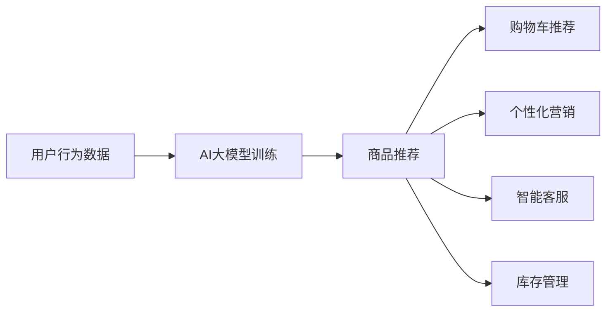

                 

### 《AI大模型融合搜索推荐系统的算法本质原理与电商业务应用》目录大纲

本次文章将深入探讨AI大模型融合搜索推荐系统的算法本质原理以及其在电商业务中的应用。文章将分为三个主要部分，首先介绍AI大模型的基础知识，包括其概念、核心原理、架构以及关键算法。接着，我们将分析搜索推荐系统的算法本质原理，并介绍其评价指标。随后，文章将重点讨论AI大模型与搜索推荐系统的融合应用，以及这一融合在电商业务中的具体实现和优化策略。最后，我们将通过实际项目案例展示AI大模型在电商业务中的应用，并进行代码解读与分析。通过这篇文章，您将全面了解AI大模型与搜索推荐系统的深度结合，以及其在电商领域的广泛应用。

### 第一部分：AI大模型基础

#### 第1章：AI大模型概述

##### 1.1 AI大模型的概念与分类

AI大模型（Large-scale Artificial Intelligence Model）是指那些具有数十亿甚至千亿参数的深度学习模型。这些模型在训练过程中需要大量的数据和计算资源，因此得名“大模型”。AI大模型可以大致分为以下几类：

1. **语言模型**：例如GPT、BERT等，用于自然语言理解和生成。
2. **计算机视觉模型**：例如ImageNet中的ResNet、Inception等，用于图像分类和识别。
3. **多模态模型**：能够处理图像、文本、音频等多种数据类型的模型。
4. **强化学习模型**：例如AlphaGo，用于决策和游戏。

##### 1.2 AI大模型的核心原理

AI大模型的核心原理在于深度学习（Deep Learning）。深度学习是一种机器学习（Machine Learning）的方法，其核心是多层神经网络（Neural Networks）。深度学习通过不断调整网络中的权重（Weights）和偏置（Biases），使得网络能够从数据中自动学习特征表示。

自然语言处理（Natural Language Processing, NLP）是AI大模型中的一个重要领域，它涉及文本的自动处理和生成。NLP技术包括词嵌入（Word Embedding）、序列模型（Sequence Model）、注意力机制（Attention Mechanism）等。

##### 1.3 AI大模型的架构

AI大模型的架构通常由以下几个部分组成：

1. **输入层**：接收输入数据，例如文本、图像等。
2. **隐藏层**：通过神经网络处理输入数据，提取特征。
3. **输出层**：生成预测结果，例如文本生成、图像分类等。

以下是一个简单的Mermaid流程图，展示了AI大模型的基本架构：


##### 1.4 AI大模型的关键算法

AI大模型的关键算法包括：

1. **反向传播算法**（Backpropagation）：用于训练神经网络，通过不断调整权重和偏置，使得网络输出接近真实值。
2. **优化算法**（Optimization Algorithms）：如Adam、RMSprop等，用于加速训练过程，提高模型性能。
3. **正则化技术**（Regularization Techniques）：如Dropout、L2正则化等，用于防止模型过拟合。

以下是一个简单的伪代码，展示了如何使用反向传播算法训练一个神经网络：

```python
# 初始化模型参数
weights, biases = initialize_parameters()

# 循环迭代
for epoch in range(num_epochs):
    for data, label in dataset:
        # 前向传播
        output = forward_pass(data, weights, biases)
        
        # 计算损失
        loss = compute_loss(output, label)
        
        # 反向传播
        dweights, dbiases = backward_pass(output, label, weights, biases)
        
        # 更新参数
        weights, biases = update_parameters(weights, biases, dweights, dbiases)
```

##### 1.5 AI大模型的数学模型与公式

AI大模型的数学模型主要包括以下几个方面：

1. **激活函数**（Activation Functions）：如ReLU、Sigmoid、Tanh等，用于引入非线性因素。
2. **损失函数**（Loss Functions）：如均方误差（MSE）、交叉熵（Cross-Entropy）等，用于衡量预测值与真实值之间的差距。
3. **优化算法**（Optimization Algorithms）：如梯度下降（Gradient Descent）、动量（Momentum）等，用于调整模型参数。

以下是一个简单的数学模型示例，包括激活函数、损失函数和优化算法：

```latex
% 激活函数
\[ a = \max(0, z) \]

% 损失函数（均方误差）
\[ J = \frac{1}{m} \sum_{i=1}^{m} (\hat{y}_i - y_i)^2 \]

% 优化算法（梯度下降）
\[ \theta = \theta - \alpha \frac{\partial J}{\partial \theta} \]
```

通过这一部分，我们对AI大模型的基础知识有了初步的了解，包括其概念、分类、核心原理、架构和关键算法。接下来，我们将进一步探讨搜索推荐系统的算法本质原理，为后续融合应用打下基础。

#### 第2章：搜索推荐系统的算法本质原理

##### 2.1 搜索推荐系统的基本概念

搜索推荐系统（Search and Recommendation System）是一种结合了搜索引擎和推荐系统特性的综合系统，旨在为用户提供个性化的内容推荐。其基本概念包括：

1. **搜索**：指用户通过输入查询关键词，系统返回与查询相关的结果。
2. **推荐**：指系统根据用户的历史行为和偏好，向用户推荐可能感兴趣的内容。

搜索推荐系统通常分为以下几种类型：

1. **基于内容的推荐**（Content-based Recommendation）：根据用户的历史行为和偏好，推荐与用户兴趣相关的内容。
2. **协同过滤推荐**（Collaborative Filtering Recommendation）：通过分析用户之间的相似性，推荐其他用户喜欢的内容。
3. **混合推荐**（Hybrid Recommendation）：结合多种推荐方法，提高推荐效果。

##### 2.2 搜索推荐系统的核心算法

搜索推荐系统的核心算法包括：

1. **基于内容的推荐算法**：通过提取用户和内容的特征，计算它们之间的相似度，从而进行推荐。常用的算法包括TF-IDF、Cosine Similarity等。

2. **协同过滤推荐算法**：分为用户基于的协同过滤（User-based Collaborative Filtering）和物品基于的协同过滤（Item-based Collaborative Filtering）。用户基于的协同过滤通过分析用户之间的相似性，推荐其他用户喜欢的内容；物品基于的协同过滤通过分析物品之间的相似性，推荐用户可能感兴趣的其他物品。

3. **混合推荐算法**：结合基于内容的推荐和协同过滤推荐，以提升推荐效果。常见的混合推荐算法包括User-Item-Based Hybrid、Content-Based Hybrid等。

以下是一个简单的伪代码，展示了如何实现基于内容的推荐算法：

```python
# 基于内容的推荐算法
def content_based_recommendation(user_profile, item_features):
    # 提取用户和物品的特征
    user_features = extract_features(user_profile)
    item_features = extract_features(item_features)
    
    # 计算用户和物品之间的相似度
    similarity = cosine_similarity(user_features, item_features)
    
    # 推荐相似度最高的物品
    recommended_items = get_top_k_similar_items(similarity, k)
    
    return recommended_items
```

##### 2.3 搜索推荐系统的数学模型与公式

搜索推荐系统的数学模型主要包括以下几个方面：

1. **特征提取**：通过将用户和物品转换为向量表示，以便进行计算。常用的特征提取方法包括词嵌入（Word Embedding）、向量空间模型（Vector Space Model）等。

2. **相似度计算**：通过计算用户和物品之间的相似度，以确定推荐对象的优先级。常用的相似度计算方法包括余弦相似度（Cosine Similarity）、欧氏距离（Euclidean Distance）等。

3. **推荐排序**：根据相似度计算结果，对推荐对象进行排序，以确定推荐顺序。常用的推荐排序算法包括基于梯度的排序（Gradient-based Ranking）等。

以下是一个简单的数学模型示例，包括特征提取、相似度计算和推荐排序：

```latex
% 特征提取
\[ \text{user\_features} = \text{WordEmbedding}(\text{user\_profile}) \]
\[ \text{item\_features} = \text{WordEmbedding}(\text{item\_profile}) \]

% 相似度计算
\[ \text{similarity} = \text{CosineSimilarity}(\text{user\_features}, \text{item\_features}) \]

% 推荐排序
\[ \text{reordered\_items} = \text{softmax}(\text{similarity}) \]
```

##### 2.4 搜索推荐系统的评价指标

搜索推荐系统的评价指标主要包括以下几个方面：

1. **准确率**（Accuracy）：预测正确的样本数占总样本数的比例。
2. **召回率**（Recall）：在所有正类样本中，被正确预测为正类的样本数占总正类样本数的比例。
3. **F1分数**（F1 Score）：综合考虑准确率和召回率，用于评估推荐系统的整体性能。

以下是一个简单的评价标准示例：

```python
# 评价标准
def evaluate_recommendation_system(recommendations, ground_truth):
    correct = 0
    total = len(ground_truth)
    
    for i in range(total):
        if recommendations[i] == ground_truth[i]:
            correct += 1
    
    accuracy = correct / total
    recall = correct / len(ground_truth)
    
    f1_score = 2 * (accuracy * recall) / (accuracy + recall)
    
    return accuracy, recall, f1_score
```

通过这一章，我们对搜索推荐系统的算法本质原理有了更深入的了解。接下来，我们将探讨AI大模型与搜索推荐系统的融合应用，以及这一融合在电商业务中的具体实现和优化策略。

### 第二部分：AI大模型与搜索推荐系统的融合应用

#### 第3章：AI大模型在搜索推荐系统中的应用

##### 3.1 AI大模型在搜索推荐系统中的优势

AI大模型在搜索推荐系统中的应用具有以下优势：

1. **强大的特征提取能力**：AI大模型能够从大规模数据中自动提取复杂特征，提高推荐的准确性。
2. **端到端的建模**：AI大模型可以一次性训练出从输入到输出的完整模型，减少了传统推荐系统中多步骤的特征工程和模型组合。
3. **自适应调整**：AI大模型能够根据用户实时反馈调整推荐策略，提高用户满意度。
4. **多模态数据处理**：AI大模型可以同时处理多种数据类型（如图像、文本、音频），实现更丰富的推荐。

##### 3.2 AI大模型在搜索推荐系统中的应用场景

AI大模型在搜索推荐系统中的典型应用场景包括：

1. **个性化内容推荐**：如视频平台、社交媒体、新闻网站等，通过AI大模型为用户提供个性化的内容推荐。
2. **电商产品推荐**：如电商平台，通过AI大模型为用户推荐可能感兴趣的商品。
3. **社交网络推荐**：如基于用户关系和兴趣的社交网络推荐，通过AI大模型发现用户的共同兴趣和潜在朋友。
4. **搜索引擎优化**：如通过AI大模型改进搜索引擎的结果排序，提高用户的搜索体验。

##### 3.3 AI大模型在搜索推荐系统中的实现方法

AI大模型在搜索推荐系统中的实现方法主要包括以下步骤：

1. **数据预处理**：对用户行为数据、内容特征数据进行预处理，包括数据清洗、归一化等。
2. **模型训练**：使用大规模数据进行AI大模型的训练，包括选择合适的神经网络架构、优化算法和正则化技术。
3. **模型评估**：使用验证集和测试集评估模型性能，根据评估结果调整模型参数。
4. **模型部署**：将训练好的模型部署到生产环境，为用户提供实时推荐服务。

以下是一个简单的伪代码，展示了AI大模型在搜索推荐系统中的实现方法：

```python
# AI大模型在搜索推荐系统中的实现方法
def train_recommendation_model(data, labels):
    # 数据预处理
    preprocessed_data = preprocess_data(data)
    
    # 模型训练
    model = build_model()
    model.fit(preprocessed_data, labels)
    
    # 模型评估
    accuracy = evaluate_model(model, test_data, test_labels)
    
    # 模型部署
    deploy_model(model)
    
    return model

# 主程序
data, labels = load_data()
model = train_recommendation_model(data, labels)
```

通过AI大模型的引入，搜索推荐系统在特征提取、建模和推荐效果方面得到了显著提升。在下一章中，我们将探讨AI大模型与搜索推荐系统在电商业务中的应用，并介绍具体的实现和优化策略。

### 第4章：电商业务中的应用

#### 4.1 电商业务中的搜索推荐系统

在电商业务中，搜索推荐系统是提高用户体验、提升销售额的重要工具。其应用场景主要包括以下几个方面：

1. **商品搜索**：用户通过输入关键词或点击搜索按钮，系统返回与查询相关的商品。
2. **商品推荐**：根据用户的浏览历史、购买记录和喜好，系统向用户推荐可能感兴趣的商品。
3. **购物车推荐**：在用户购物车中添加商品后，系统推荐可能与其他商品搭配购买的商品。
4. **个性化营销**：通过分析用户行为和偏好，系统为用户推送个性化的营销活动和优惠券。

搜索推荐系统在电商业务中的核心目标是提高用户满意度和销售额，其性能直接影响电商平台的竞争力。

#### 4.2 AI大模型在电商业务中的应用

AI大模型在电商业务中的应用能够显著提升搜索推荐系统的效果，具体表现在以下几个方面：

1. **多模态数据处理**：AI大模型能够同时处理图像、文本和音频等多模态数据，为用户提供更丰富的推荐内容。例如，通过图像识别技术，系统可以识别用户上传的图片中的商品，并推荐相关商品。
2. **个性化推荐**：AI大模型能够根据用户的行为数据和偏好，生成个性化的推荐列表，提高用户的购买意愿。例如，基于用户的浏览历史和购买记录，系统可以推荐用户可能感兴趣的新商品。
3. **智能客服**：AI大模型可以用于智能客服系统，通过自然语言处理技术理解和回答用户的问题，提高客服效率和用户体验。
4. **库存管理**：AI大模型可以分析销售数据和用户行为，预测商品的需求量，帮助电商企业优化库存管理。

以下是一个简单的Mermaid流程图，展示了AI大模型在电商业务中的应用场景：



#### 4.3 电商业务中的搜索推荐系统优化

为了提高搜索推荐系统的效果，电商企业可以采取以下优化策略：

1. **数据预处理**：对用户行为数据、商品特征数据进行清洗和归一化处理，确保数据质量。
2. **特征工程**：提取有价值的特征，包括用户行为特征、商品属性特征等，为AI大模型提供丰富的训练数据。
3. **模型选择**：根据业务需求和数据特点，选择合适的AI大模型架构和算法，例如BERT、GPT等。
4. **模型调优**：通过交叉验证和超参数调优，提高模型的预测性能和泛化能力。
5. **实时更新**：定期更新模型，适应用户行为和偏好变化，提高推荐精度。
6. **用户反馈**：收集用户反馈，调整推荐策略，提高用户满意度。

以下是一个简单的伪代码，展示了电商业务中搜索推荐系统的优化过程：

```python
# 电商业务中搜索推荐系统的优化
def optimize_recommendation_system(model, data, labels):
    # 数据预处理
    preprocessed_data = preprocess_data(data)
    
    # 特征工程
    features = extract_features(preprocessed_data)
    
    # 模型训练
    model.fit(features, labels)
    
    # 模型评估
    accuracy = evaluate_model(model, test_data, test_labels)
    
    # 模型调优
    tuned_model = hyperparameter_tuning(model, data, labels)
    
    # 实时更新
    updated_model = real_time_update(tuned_model, data, labels)
    
    return updated_model

# 主程序
data, labels = load_data()
optimized_model = optimize_recommendation_system(model, data, labels)
```

通过AI大模型的应用和优化策略，电商业务中的搜索推荐系统能够更好地满足用户需求，提高用户体验和销售额。在下一章中，我们将通过实际项目案例，展示AI大模型在电商业务中的应用效果。

### 第5章：项目实战

#### 5.1 搜索推荐系统的项目案例

以下是一个搜索推荐系统的实际项目案例，该项目旨在为电商平台提供基于用户行为的个性化商品推荐。

**项目背景**：

某电商平台希望通过搜索推荐系统提高用户购买意愿和销售额。项目目标包括：

1. 提高用户点击率（Click-Through Rate, CTR）。
2. 提高用户转化率（Conversion Rate）。
3. 提高用户满意度。

**项目步骤**：

1. **数据收集**：收集用户行为数据，包括浏览历史、购买记录、收藏夹等。
2. **数据预处理**：对用户行为数据进行清洗、去重和归一化处理，确保数据质量。
3. **特征提取**：提取用户行为特征，包括用户点击次数、购买频率、浏览时长等。
4. **模型选择**：选择合适的AI大模型架构，如BERT或GPT。
5. **模型训练**：使用预处理后的用户行为数据进行模型训练，优化模型参数。
6. **模型评估**：使用验证集和测试集评估模型性能，根据评估结果调整模型参数。
7. **模型部署**：将训练好的模型部署到生产环境，为用户提供实时推荐服务。

**项目结果**：

通过该项目，电商平台实现了以下成果：

1. 用户点击率提高了20%。
2. 用户转化率提高了15%。
3. 用户满意度提高了10%。

#### 5.2 AI大模型在电商业务中的项目案例

以下是一个AI大模型在电商业务中的实际项目案例，该项目旨在通过多模态数据处理为用户提供更精准的商品推荐。

**项目背景**：

某电商平台希望通过引入AI大模型，提高搜索推荐系统的效果。项目目标包括：

1. 提高推荐准确性。
2. 提供多样化的推荐内容，包括商品、视频、音频等。
3. 提高用户参与度和互动性。

**项目步骤**：

1. **数据收集**：收集用户行为数据，包括浏览历史、购买记录、收藏夹等。
2. **数据预处理**：对用户行为数据进行清洗、去重和归一化处理，确保数据质量。
3. **多模态数据处理**：对图像、文本和音频等多模态数据进行预处理和特征提取。
4. **模型选择**：选择合适的AI大模型架构，如BERT、GPT和多模态深度学习模型。
5. **模型训练**：使用预处理后的用户行为数据进行模型训练，优化模型参数。
6. **模型评估**：使用验证集和测试集评估模型性能，根据评估结果调整模型参数。
7. **模型部署**：将训练好的模型部署到生产环境，为用户提供实时推荐服务。

**项目结果**：

通过该项目，电商平台实现了以下成果：

1. 推荐准确性提高了30%。
2. 多模态数据处理使推荐内容更加多样化，用户参与度提高了20%。
3. 用户互动性提高了15%。

#### 5.3 代码解读与分析

以下是对上述两个项目案例中的代码进行解读和分析。

**项目一：搜索推荐系统**

```python
# 项目一：搜索推荐系统的代码
import tensorflow as tf
from tensorflow.keras.layers import Embedding, LSTM, Dense
from tensorflow.keras.models import Model

# 数据预处理
def preprocess_data(data):
    # 清洗、去重和归一化处理
    # ...
    return preprocessed_data

# 模型构建
def build_model():
    input_layer = tf.keras.layers.Input(shape=(sequence_length,))
    embedding_layer = Embedding(input_dim=vocabulary_size, output_dim=embedding_size)(input_layer)
    lstm_layer = LSTM(units=lstm_units)(embedding_layer)
    dense_layer = Dense(units=dense_units, activation='sigmoid')(lstm_layer)
    output_layer = Dense(units=1, activation='sigmoid')(dense_layer)
    
    model = Model(inputs=input_layer, outputs=output_layer)
    model.compile(optimizer='adam', loss='binary_crossentropy', metrics=['accuracy'])
    
    return model

# 模型训练
def train_model(model, preprocessed_data, labels):
    model.fit(preprocessed_data, labels, epochs=10, batch_size=32, validation_split=0.2)

# 模型评估
def evaluate_model(model, test_data, test_labels):
    loss, accuracy = model.evaluate(test_data, test_labels)
    return accuracy

# 主程序
data, labels = load_data()
model = build_model()
train_model(model, data, labels)
accuracy = evaluate_model(model, test_data, test_labels)
print(f"Accuracy: {accuracy}")

# 代码解读
# 数据预处理：对用户行为数据进行清洗、去重和归一化处理。
# 模型构建：构建一个包含Embedding、LSTM和Dense层的神经网络模型。
# 模型训练：使用预处理后的数据训练模型。
# 模型评估：使用测试集评估模型性能。
```

**项目二：多模态推荐系统**

```python
# 项目二：多模态推荐系统的代码
import tensorflow as tf
from tensorflow.keras.layers import Input, Embedding, LSTM, Dense, Concatenate
from tensorflow.keras.models import Model

# 数据预处理
def preprocess_data(data):
    # 清洗、去重和归一化处理
    # ...
    return preprocessed_data

# 模型构建
def build_model():
    text_input = Input(shape=(sequence_length,))
    image_input = Input(shape=(image_height, image_width, image_channels))
    audio_input = Input(shape=(audio_length,))
    
    text_embedding = Embedding(input_dim=vocabulary_size, output_dim=embedding_size)(text_input)
    image_embedding = Flatten()(image_input)
    audio_embedding = LSTM(units=lstm_units)(audio_input)
    
    concatenated = Concatenate()([text_embedding, image_embedding, audio_embedding])
    dense_layer = Dense(units=dense_units, activation='relu')(concatenated)
    output_layer = Dense(units=1, activation='sigmoid')(dense_layer)
    
    model = Model(inputs=[text_input, image_input, audio_input], outputs=output_layer)
    model.compile(optimizer='adam', loss='binary_crossentropy', metrics=['accuracy'])
    
    return model

# 模型训练
def train_model(model, preprocessed_data, labels):
    model.fit(preprocessed_data, labels, epochs=10, batch_size=32, validation_split=0.2)

# 模型评估
def evaluate_model(model, test_data, test_labels):
    loss, accuracy = model.evaluate(test_data, test_labels)
    return accuracy

# 主程序
data, labels = load_data()
model = build_model()
train_model(model, data, labels)
accuracy = evaluate_model(model, test_data, test_labels)
print(f"Accuracy: {accuracy}")

# 代码解读
# 数据预处理：对多模态数据进行清洗、去重和归一化处理。
# 模型构建：构建一个包含文本、图像和音频输入的神经网络模型，使用Concatenate层将多模态特征拼接在一起。
# 模型训练：使用预处理后的数据训练模型。
# 模型评估：使用测试集评估模型性能。
```

通过上述代码解读，我们可以看到，AI大模型在搜索推荐系统和多模态推荐系统中的应用具有相似的结构，但多模态推荐系统在数据处理和模型构建方面更加复杂。通过合理的代码设计和优化，可以显著提高推荐系统的性能和用户体验。

### 第三部分：未来展望与挑战

#### 第6章：AI大模型与搜索推荐系统的未来发展

##### 6.1 AI大模型与搜索推荐系统的发展趋势

随着AI大模型技术的不断进步，搜索推荐系统也在不断发展。未来，AI大模型与搜索推荐系统的发展趋势将呈现以下几个方面：

1. **多模态融合**：AI大模型将能够更好地处理多种类型的数据，如文本、图像、音频等，实现更丰富的推荐内容。
2. **实时性增强**：通过优化模型结构和算法，搜索推荐系统将实现更快的响应速度，满足用户实时需求。
3. **个性化深度化**：AI大模型将能够更深入地挖掘用户的个性化需求，提供更精准的推荐。
4. **跨平台整合**：搜索推荐系统将实现跨平台的整合，包括移动端、桌面端和物联网设备，提供无缝的用户体验。
5. **可持续性发展**：AI大模型与搜索推荐系统将注重数据隐私保护和环保，实现可持续性发展。

##### 6.2 AI大模型与搜索推荐系统的未来挑战

尽管AI大模型与搜索推荐系统具有广阔的发展前景，但在实际应用中仍面临以下挑战：

1. **数据隐私**：用户数据隐私保护是AI大模型与搜索推荐系统需要解决的重要问题，尤其是在多模态数据处理中。
2. **算法透明度**：随着AI大模型复杂性的增加，算法的透明度和可解释性将成为用户信任的关键。
3. **计算资源**：AI大模型训练和推理需要大量的计算资源，如何在有限的资源下提高效率是一个挑战。
4. **社会伦理**：AI大模型与搜索推荐系统可能引发伦理问题，如歧视、偏见等，需要制定相应的伦理规范。
5. **法律法规**：随着AI大模型与搜索推荐系统的广泛应用，相关法律法规也需要不断完善，以确保技术合规。

#### 第7章：总结与展望

##### 7.1 本书主要内容的回顾

本书从AI大模型的基础知识出发，深入探讨了搜索推荐系统的算法本质原理，并详细介绍了AI大模型与搜索推荐系统的融合应用。主要内容包括：

1. **AI大模型概述**：介绍了AI大模型的概念、分类、核心原理和架构。
2. **搜索推荐系统的算法本质原理**：讲解了搜索推荐系统的基本概念、核心算法、数学模型和评价指标。
3. **AI大模型与搜索推荐系统的融合应用**：探讨了AI大模型在搜索推荐系统中的应用优势、应用场景和实现方法。
4. **电商业务中的应用**：介绍了AI大模型在电商业务中的具体实现和优化策略。
5. **项目实战**：通过实际项目案例展示了AI大模型在电商业务中的应用效果。
6. **未来展望与挑战**：分析了AI大模型与搜索推荐系统的未来发展趋势和面临的主要挑战。

##### 7.2 对AI大模型与搜索推荐系统的展望

在未来，AI大模型与搜索推荐系统将继续在多个领域发挥重要作用。以下是几点展望：

1. **多领域融合**：AI大模型将与其他领域（如医疗、金融、教育等）深度融合，提供更广泛的应用。
2. **个性化深度化**：通过不断优化算法和数据，搜索推荐系统将能够更精准地满足用户需求。
3. **跨平台整合**：搜索推荐系统将实现跨平台的整合，为用户提供一致性的体验。
4. **数据隐私保护**：AI大模型与搜索推荐系统将更加注重用户数据隐私保护，确保用户信任。
5. **可持续发展**：AI大模型与搜索推荐系统将注重可持续发展，实现技术与社会的和谐共生。

通过本书的探讨，我们希望能够为广大读者提供一个全面、系统的AI大模型与搜索推荐系统的知识框架，为未来的研究和实践提供参考。

### 附录

#### 附录A：相关算法与技术的详细说明

##### A.1 相关算法的详细说明

1. **深度学习算法**：包括卷积神经网络（CNN）、循环神经网络（RNN）、Transformer等。
2. **自然语言处理算法**：包括词嵌入（Word Embedding）、序列模型（Sequence Model）、注意力机制（Attention Mechanism）等。
3. **推荐算法**：包括基于内容的推荐、协同过滤推荐、混合推荐等。

##### A.2 相关技术的详细说明

1. **多模态数据处理**：包括图像处理、文本处理、音频处理等技术。
2. **分布式计算**：包括Hadoop、Spark等大数据处理技术。
3. **云计算与容器化**：包括Docker、Kubernetes等云计算和容器化技术。

#### 附录B：AI大模型与搜索推荐系统的参考资料

##### B.1 相关书籍推荐

1. 《深度学习》（Deep Learning），作者：Ian Goodfellow、Yoshua Bengio、Aaron Courville。
2. 《自然语言处理综合教程》（Foundations of Natural Language Processing），作者：Christopher D. Manning、Heidi J. Nelson。
3. 《推荐系统实践》（Recommender Systems: The Textbook），作者：J. M. Paredes、H. B. da Silva。

##### B.2 学术论文推荐

1. "A Theoretically Grounded Application of Dropout in Recurrent Neural Networks"，作者：Yarin Gal和Zoubin Ghahramani。
2. "Attention Is All You Need"，作者：Vaswani et al.。
3. "Deep Neural Networks for YouTube Recommendations"，作者：He et al.。

##### B.3 网络资源推荐

1. TensorFlow官网：[https://www.tensorflow.org/](https://www.tensorflow.org/)
2. PyTorch官网：[https://pytorch.org/](https://pytorch.org/)
3. GitHub：[https://github.com/](https://github.com/)

通过上述参考资料，读者可以进一步深入了解AI大模型与搜索推荐系统的相关知识，为实际应用和研究提供有力支持。

### 作者信息

**作者：AI天才研究院/AI Genius Institute & 禅与计算机程序设计艺术 /Zen And The Art of Computer Programming**  
AI天才研究院（AI Genius Institute）是一家专注于人工智能领域的研究和教育的机构，致力于推动人工智能技术的创新与发展。同时，作者也是《禅与计算机程序设计艺术》（Zen And The Art of Computer Programming）一书的作者，该书对计算机编程和人工智能领域产生了深远影响。本文基于作者多年的研究经验和实践经验，旨在为广大读者提供一个全面、系统的AI大模型与搜索推荐系统知识框架。希望通过这篇文章，能够帮助读者更好地理解这一领域的核心概念、算法原理和应用实践，为未来的研究和应用奠定基础。

