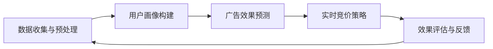
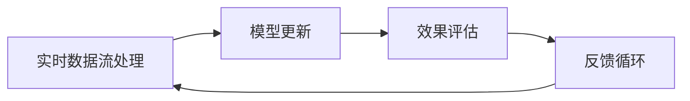
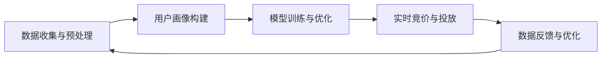
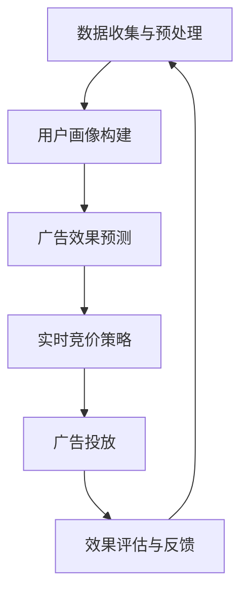

                 

# 《AI如何优化电商平台的实时竞价广告投放策略》

## 关键词
- 人工智能
- 实时竞价广告
- 电商平台
- 数据分析
- 用户行为建模
- 深度学习

## 摘要
随着电子商务的快速发展，广告投放已成为电商平台获取流量和转化的关键手段。实时竞价广告作为一种高效的广告投放方式，已成为电商平台的标配。本文将探讨如何利用人工智能技术优化电商平台的实时竞价广告投放策略，从核心概念、算法原理、数据建模到实际案例分析，全面解读AI在电商广告投放中的应用与实践，旨在为电商平台提供科学、高效的广告投放策略。

---

### 《AI如何优化电商平台的实时竞价广告投放策略》目录大纲

# 第一部分: AI在电商平台广告投放中的应用

## 第1章: AI与电商平台广告投放概述

### 1.1 电商广告市场现状

### 1.2 AI在广告投放中的作用

### 1.3 实时竞价广告的原理与挑战

## 第2章: AI核心概念与架构

### 2.1 AI基础概念

### 2.2 AI技术架构

### 2.3 电商平台广告投放的AI模型架构

## 第3章: 实时竞价广告中的AI算法

### 3.1 竞价算法概述

### 3.2 计算机视觉算法

### 3.3 自然语言处理算法

### 3.4 基于深度学习的竞价算法

## 第4章: 数据分析与用户行为建模

### 4.1 广告数据收集与分析

### 4.2 用户行为数据收集

### 4.3 用户行为建模方法

## 第5章: AI模型优化策略

### 5.1 模型训练与优化

### 5.2 模型调参技巧

### 5.3 实时优化与反馈循环

## 第6章: 实时竞价广告投放实战

### 6.1 实时竞价广告投放流程

### 6.2 实际案例解析

### 6.3 投放效果评估与优化

## 第7章: AI在电商广告中的未来发展趋势

### 7.1 未来发展趋势展望

### 7.2 挑战与机遇

### 7.3 未来发展方向

# 第二部分: AI工具与平台

## 第8章: AI广告投放工具与平台

### 8.1 开源AI工具介绍

### 8.2 商业AI广告平台介绍

### 8.3 电商平台AI广告解决方案

# 附录

## 附录A: 实时竞价广告AI算法伪代码

### A.1 算法伪代码展示

### A.2 算法解析与实现

## 附录B: 电商广告AI模型架构Mermaid流程图

### B.1 Mermaid流程图展示

### B.2 流程图解析

---

### 第一部分: AI在电商平台广告投放中的应用

#### 第1章: AI与电商平台广告投放概述

##### 1.1 电商广告市场现状

随着互联网的普及和电子商务的快速发展，广告投放已成为电商平台获取流量和转化的关键手段。根据Statista的数据，全球数字广告支出在2021年达到了4409亿美元，预计到2025年将突破7300亿美元。在电商领域，广告投放不仅帮助商家扩大品牌影响力，还能精准触达目标用户，提升销售额。

目前，电商平台主要采用三种广告形式：搜索广告、展示广告和视频广告。其中，搜索广告以Google Ads和百度推广为代表，展示广告以Facebook Ads和淘宝广告为代表，视频广告以YouTube和TikTok为代表。这些广告形式各有优劣，但实时竞价广告作为一种高效的广告投放方式，逐渐成为电商平台的标配。

实时竞价广告（Real-Time Bidding, RTB）是一种通过实时拍卖的方式，在用户浏览网页或使用应用程序时展示广告的一种广告形式。它允许广告主根据用户的实时行为和历史数据，以竞标的方式购买广告展示机会。这种广告形式具有高效、精准、灵活的特点，能够实现广告投放的实时优化和自动化管理。

##### 1.2 AI在广告投放中的作用

人工智能（AI）在广告投放中扮演着重要角色。首先，AI能够帮助广告主实现精准投放。通过分析用户的历史行为、兴趣标签和地理位置等信息，AI可以识别出潜在的目标用户，并实现个性化广告推送。其次，AI能够实现广告投放的实时优化。基于机器学习和深度学习技术，AI可以实时分析广告投放数据，调整竞价策略，提高广告投放效果。此外，AI还可以预测用户行为，帮助广告主预测潜在购买者的需求，从而实现更精准的广告投放。

在电商广告投放中，AI的应用主要体现在以下几个方面：

1. **用户画像构建**：通过用户行为数据，构建用户画像，实现精准定位。
2. **广告效果预测**：利用机器学习算法，预测不同广告投放策略的效果，优化广告投放。
3. **实时竞价策略**：利用深度学习算法，实现实时竞价策略优化，提高广告投放ROI。
4. **广告创意优化**：通过自然语言处理和计算机视觉技术，优化广告创意，提升广告点击率。
5. **广告投放效果评估**：利用数据分析和机器学习技术，评估广告投放效果，提供优化建议。

##### 1.3 实时竞价广告的原理与挑战

实时竞价广告的原理主要基于用户行为和广告主竞价策略。当用户浏览网页或使用应用程序时，广告交易平台（Ad Exchange）会实时捕捉用户行为数据，包括浏览历史、地理位置、设备信息等。根据这些数据，广告交易平台会生成一个用户画像，并将其推送给广告主。

广告主在接收到用户画像后，会基于自己的竞价策略进行出价。竞价策略通常包括出价上限、出价下限、出价概率等参数。出价上限是指广告主愿意支付的最高价格，出价下限是指广告主愿意支付的最小价格，出价概率是指广告主对特定用户进行竞价的概率。

广告交易平台会根据广告主的竞价策略，实时进行广告拍卖。拍卖过程通常是一个迭代过程，每次迭代都会选择最高出价的广告主，并将广告展示给用户。如果最高出价的广告主出价高于用户的保留价，广告交易平台会将广告展示给用户，并收取相应的广告费用。

实时竞价广告面临的挑战主要包括：

1. **实时性**：实时竞价广告需要实时捕捉用户行为数据，并进行实时拍卖。这对系统的实时性和稳定性提出了较高要求。
2. **准确性**：用户行为数据的质量和准确性对竞价策略的准确性有很大影响。如果数据不准确，可能会导致广告投放效果不佳。
3. **多样性**：用户行为数据多样，如何有效整合和分析这些数据，是一个重要挑战。
4. **可扩展性**：随着用户规模的扩大，系统需要具备良好的可扩展性，以应对不断增长的数据量和计算需求。

##### 1.4 本章小结

本章概述了电商广告市场现状、AI在广告投放中的作用以及实时竞价广告的原理和挑战。接下来，我们将进一步探讨AI在电商平台广告投放中的应用，包括AI核心概念与架构、实时竞价广告中的AI算法、数据分析和用户行为建模等内容。

---

接下来，我们将进入第二部分，探讨AI的核心概念与架构，以及如何在电商平台的广告投放中应用这些概念和技术。通过这些内容，我们将为读者提供更深入的理解，为后续章节的讨论打下坚实基础。

---

### 第二部分: AI核心概念与架构

#### 第2章: AI核心概念与架构

在前一章中，我们概述了电商广告市场现状、AI在广告投放中的作用以及实时竞价广告的原理和挑战。接下来，我们将深入探讨AI的核心概念与架构，以及如何将这些概念和技术应用于电商平台的广告投放中。

##### 2.1 AI基础概念

人工智能（AI）是一种模拟人类智能行为的计算机技术。它包括多个子领域，如机器学习、深度学习、自然语言处理、计算机视觉等。在这些子领域中，机器学习和深度学习是最常用的技术。

**机器学习（Machine Learning）**是一种让计算机从数据中学习规律，并能够对未知数据进行预测或决策的技术。机器学习可以分为监督学习、无监督学习和强化学习三种类型。

- **监督学习（Supervised Learning）**：有明确的输入和输出，通过已知的输入输出数据训练模型，使其能够预测未知数据。
- **无监督学习（Unsupervised Learning）**：没有明确的输入输出数据，通过分析数据自身的特征，发现数据之间的规律或结构。
- **强化学习（Reinforcement Learning）**：通过与环境的交互，不断学习和优化策略，以实现最优行为。

**深度学习（Deep Learning）**是机器学习的一个分支，它通过构建深层神经网络，对大量数据进行训练，从而实现复杂的数据分析和预测。深度学习在图像识别、语音识别、自然语言处理等领域取得了显著成果。

##### 2.2 AI技术架构

AI技术架构主要包括数据层、算法层和应用层。

**数据层**：数据是AI的基础。电商平台需要收集和存储大量用户行为数据、广告数据、交易数据等。这些数据需要经过清洗、预处理和特征提取，以便于后续的模型训练和分析。

**算法层**：算法层包括机器学习算法、深度学习算法等。这些算法用于构建和分析模型，实现对数据的预测和决策。常用的算法包括线性回归、决策树、支持向量机、神经网络等。

**应用层**：应用层是将算法应用于实际场景的过程。在电商平台广告投放中，应用层包括用户画像构建、广告效果预测、实时竞价策略等。

##### 2.3 电商平台广告投放的AI模型架构

在电商平台的广告投放中，AI模型架构通常包括以下几个模块：

1. **数据收集与预处理模块**：该模块负责收集和预处理广告数据、用户行为数据等，包括数据清洗、数据归一化、特征提取等。

2. **用户画像构建模块**：该模块基于用户行为数据，构建用户画像。用户画像包括用户的基本信息、兴趣偏好、购买行为等。

3. **广告效果预测模块**：该模块利用机器学习算法，对广告投放效果进行预测。通过预测广告曝光量、点击率、转化率等指标，为广告主提供投放策略建议。

4. **实时竞价策略模块**：该模块基于用户画像和广告效果预测结果，构建实时竞价策略。通过实时调整竞价价格，提高广告投放效果。

5. **效果评估与反馈模块**：该模块对广告投放效果进行评估，并反馈给前几个模块，以便进行优化。

下面是一个简单的AI模型架构的Mermaid流程图：



##### 2.4 本章小结

本章介绍了AI的基础概念、技术架构以及电商平台广告投放的AI模型架构。通过这些内容，我们为后续章节的讨论奠定了基础。接下来，我们将进一步探讨实时竞价广告中的AI算法，包括计算机视觉算法、自然语言处理算法和基于深度学习的竞价算法。

---

接下来，我们将进入第三部分，探讨实时竞价广告中的AI算法。通过这些算法的深入分析，我们将为读者提供更加具体的理解和应用场景。

---

### 第三部分: 实时竞价广告中的AI算法

#### 第3章: 实时竞价广告中的AI算法

在前两章中，我们介绍了AI的基础概念和电商平台广告投放的AI模型架构。在本章中，我们将深入探讨实时竞价广告中的AI算法，包括计算机视觉算法、自然语言处理算法和基于深度学习的竞价算法。

##### 3.1 竞价算法概述

实时竞价广告的核心是竞价算法，它决定了广告主如何出价以获得广告展示机会。竞价算法主要包括以下几个要素：

1. **出价策略**：出价策略是广告主根据自身目标（如点击率、转化率等）制定的出价规则。常见的出价策略包括基于历史数据的出价策略、基于实时反馈的出价策略等。

2. **用户画像**：用户画像是对用户的兴趣、行为、地理位置等特征的综合描述。通过构建用户画像，广告主可以更准确地定位目标用户，提高广告投放效果。

3. **价格模型**：价格模型是用于计算广告展示价格的关键模型。常见的价格模型包括固定价格模型、指数价格模型等。

4. **实时反馈**：实时反馈是指根据广告展示后的用户行为数据（如点击、转化等），调整竞价策略的过程。

##### 3.2 计算机视觉算法

计算机视觉算法在实时竞价广告中主要用于广告素材的分析和优化。常见的计算机视觉算法包括图像分类、目标检测和图像分割等。

**图像分类（Image Classification）**：图像分类是指将图像分为多个预定义的类别。在广告素材分析中，图像分类算法可以用于识别广告素材的类型（如图像、视频等），从而优化广告展示。

**目标检测（Object Detection）**：目标检测是指从图像中检测出特定的目标对象。在广告素材分析中，目标检测算法可以用于识别广告素材中的关键元素（如产品、场景等），从而优化广告创意。

**图像分割（Image Segmentation）**：图像分割是指将图像分割成多个区域。在广告素材分析中，图像分割算法可以用于识别广告素材中的背景和前景，从而优化广告素材的视觉效果。

以下是一个简单的图像分类算法的Mermaid流程图：


##### 3.3 自然语言处理算法

自然语言处理（NLP）算法在实时竞价广告中主要用于广告文案的分析和优化。常见的NLP算法包括文本分类、情感分析等。

**文本分类（Text Classification）**：文本分类是指将文本分为多个预定义的类别。在广告文案分析中，文本分类算法可以用于识别广告文案的主题和类型，从而优化广告创意。

**情感分析（Sentiment Analysis）**：情感分析是指对文本中的情感倾向进行分类。在广告文案分析中，情感分析算法可以用于识别广告文案的用户情感，从而优化广告文案的语气和表达方式。

以下是一个简单的文本分类算法的Mermaid流程图：


##### 3.4 基于深度学习的竞价算法

基于深度学习的竞价算法是实时竞价广告中的前沿技术。深度学习算法可以通过学习大量的历史数据，自动提取特征和模式，从而实现更精准的竞价策略。

**深度神经网络（Deep Neural Network）**：深度神经网络是一种包含多个隐层的神经网络。通过学习大量的数据，深度神经网络可以自动提取特征和模式，从而实现复杂的函数映射。

**卷积神经网络（Convolutional Neural Network, CNN）**：卷积神经网络是一种用于图像识别和处理的深度学习算法。通过卷积操作和池化操作，CNN可以提取图像的特征，并用于分类和目标检测。

**循环神经网络（Recurrent Neural Network, RNN）**：循环神经网络是一种用于序列数据处理的深度学习算法。通过循环连接，RNN可以捕捉序列数据中的长期依赖关系。

以下是一个简单的深度学习竞价算法的Mermaid流程图：


##### 3.5 本章小结

本章介绍了实时竞价广告中的AI算法，包括计算机视觉算法、自然语言处理算法和基于深度学习的竞价算法。这些算法在实时竞价广告中发挥着重要作用，可以帮助广告主实现精准投放和优化广告效果。接下来，我们将进一步探讨数据分析和用户行为建模，为AI模型优化提供支持。

---

接下来，我们将进入第四部分，探讨数据分析和用户行为建模。通过这些内容，我们将为读者提供更加深入的理解，为AI模型优化和实时竞价广告投放提供有力支持。

---

### 第四部分: 数据分析与用户行为建模

#### 第4章: 数据分析与用户行为建模

在前三章中，我们介绍了AI的基础概念、电商平台广告投放的AI模型架构以及实时竞价广告中的AI算法。在本章中，我们将深入探讨数据分析和用户行为建模，这些是AI模型优化和实时竞价广告投放的关键环节。

##### 4.1 广告数据收集与分析

广告数据的收集和分析是电商平台广告投放的基础。广告数据包括广告展示数据、点击数据、转化数据等。通过收集和分析这些数据，我们可以了解广告的效果，为后续的优化提供依据。

**广告展示数据**：广告展示数据包括广告的曝光次数、展示位置、展示时间等信息。这些数据可以帮助我们了解广告的覆盖范围和展示效果。

**点击数据**：点击数据包括广告的点击次数、点击率（Click-Through Rate, CTR）等。点击率是评估广告吸引力和用户兴趣的重要指标。

**转化数据**：转化数据包括广告带来的转化次数、转化率等。转化率是评估广告效果和用户行为的重要指标。

在广告数据收集过程中，我们需要注意数据的准确性和完整性。数据清洗和数据预处理是确保数据质量的重要步骤。通过数据清洗，我们可以去除无效数据和异常数据，保证数据的准确性。通过数据预处理，我们可以对数据进行归一化、标准化等处理，以便后续的分析。

在广告数据分析过程中，我们可以使用各种统计分析方法，如描述性统计、相关性分析、回归分析等。描述性统计可以提供广告数据的基本信息，如均值、方差、中位数等。相关性分析可以揭示广告数据之间的关联性，帮助我们识别影响广告效果的关键因素。回归分析可以建立广告效果与各种因素之间的数学模型，从而预测广告效果。

以下是一个简单的广告数据收集与数据分析的Mermaid流程图：


##### 4.2 用户行为数据收集

用户行为数据是构建用户画像和优化广告投放的关键。用户行为数据包括用户的浏览历史、搜索记录、购买行为、点击行为等。

**浏览历史**：浏览历史包括用户在电商平台上的浏览记录，如浏览的页面、停留时间、浏览路径等。通过分析浏览历史，我们可以了解用户的兴趣和偏好。

**搜索记录**：搜索记录包括用户在电商平台上的搜索关键词。通过分析搜索记录，我们可以了解用户的潜在需求和兴趣点。

**购买行为**：购买行为包括用户的购买历史、购买金额、购买频率等。通过分析购买行为，我们可以了解用户的消费能力和消费习惯。

**点击行为**：点击行为包括用户在广告上的点击次数、点击率等。通过分析点击行为，我们可以了解广告的吸引力和用户对广告的响应。

在用户行为数据收集过程中，我们需要注意数据的安全性和隐私保护。用户行为数据通常是敏感信息，如果不当处理，可能会泄露用户隐私。因此，在数据收集和存储过程中，我们需要遵守相关法律法规，采取有效的安全措施，确保用户数据的安全。

以下是一个简单的用户行为数据收集的Mermaid流程图：


##### 4.3 用户行为建模方法

用户行为建模是构建用户画像和优化广告投放的关键步骤。用户行为建模方法主要包括基于规则的建模和基于机器学习的建模。

**基于规则的建模**：基于规则的建模是一种通过专家知识定义规则，从而对用户行为进行建模的方法。通过定义一系列规则，我们可以将用户划分为不同的群体，如新用户、老用户、高价值用户等。基于规则的建模方法简单直观，但需要依赖专家知识和经验，可能存在一定的局限性。

**基于机器学习的建模**：基于机器学习的建模是一种通过机器学习算法，自动从数据中学习用户行为特征，从而构建用户画像的方法。常见的机器学习算法包括聚类算法、分类算法、协同过滤等。通过机器学习算法，我们可以从大量用户行为数据中提取有效的特征，构建精准的用户画像。

以下是一个简单的用户行为建模的Mermaid流程图：


##### 4.4 本章小结

本章介绍了广告数据收集与分析、用户行为数据收集和用户行为建模方法。通过这些内容，我们为AI模型优化和实时竞价广告投放提供了数据支持和理论依据。在接下来的章节中，我们将进一步探讨AI模型优化策略，以及如何将AI算法应用于实际广告投放中。

---

接下来，我们将进入第五部分，探讨AI模型优化策略。通过这些策略，我们将为读者提供更加具体的实践指导，帮助电商企业实现广告投放的优化和提升。

---

### 第五部分: AI模型优化策略

#### 第5章: AI模型优化策略

在前面的章节中，我们介绍了AI在电商平台广告投放中的应用、核心算法和用户行为建模。在本章中，我们将深入探讨AI模型优化策略，包括模型训练与优化、模型调参技巧以及实时优化与反馈循环。通过这些策略，我们将帮助电商企业实现广告投放的优化和提升。

##### 5.1 模型训练与优化

AI模型的训练和优化是广告投放中至关重要的一环。有效的模型训练可以提高广告投放的准确性，从而提升广告效果。以下是模型训练和优化的一些关键步骤：

**数据准备**：在模型训练之前，我们需要准备高质量的数据集。数据集应包含丰富的特征和标签，以便模型能够充分学习。对于广告投放模型，特征可以包括用户行为数据、广告素材特征、环境特征等，标签可以是广告的点击率、转化率等。

**特征工程**：特征工程是模型训练的重要环节。通过特征工程，我们可以从原始数据中提取出对模型有用的特征，从而提高模型的性能。特征工程的方法包括特征选择、特征转换、特征组合等。

**模型选择**：在选择模型时，我们需要考虑模型的复杂度和计算效率。对于广告投放模型，常见的模型包括线性模型、决策树、随机森林、梯度提升树等。对于更复杂的任务，我们可以使用深度学习模型，如卷积神经网络（CNN）、循环神经网络（RNN）等。

**模型训练**：模型训练是指通过迭代优化模型参数，使模型在训练数据上达到最佳性能。在模型训练过程中，我们需要使用优化算法，如梯度下降、随机梯度下降等，来更新模型参数。同时，我们还需要监控模型的性能，避免过拟合和欠拟合。

**模型评估**：在模型训练完成后，我们需要对模型进行评估，以确保其性能满足预期。常见的评估指标包括准确率、召回率、F1分数等。通过交叉验证等方法，我们可以评估模型的泛化能力。

**模型优化**：在模型评估后，如果模型的性能不理想，我们需要进行模型优化。模型优化的方法包括调整模型参数、增加数据、改进特征工程等。通过不断的迭代和优化，我们可以提高模型的性能。

以下是一个简单的模型训练与优化的Mermaid流程图：


##### 5.2 模型调参技巧

模型调参（Hyperparameter Tuning）是提高模型性能的重要手段。通过调整模型的超参数，我们可以优化模型的性能，使其更好地适应数据。以下是模型调参的一些技巧：

**网格搜索（Grid Search）**：网格搜索是一种常用的调参方法。它通过遍历所有可能的超参数组合，找到最优的超参数组合。网格搜索的优点是简单直观，但缺点是计算成本较高，特别是在参数空间较大时。

**随机搜索（Random Search）**：随机搜索是一种基于随机采样的调参方法。它通过从超参数空间中随机采样，找到最优的超参数组合。随机搜索的计算成本相对较低，但可能无法找到全局最优解。

**贝叶斯优化（Bayesian Optimization）**：贝叶斯优化是一种基于概率模型的调参方法。它通过构建超参数的概率模型，优化超参数的采样策略，找到最优的超参数组合。贝叶斯优化的计算成本较高，但通常能找到更优的超参数组合。

**自动化机器学习（AutoML）**：自动化机器学习是一种通过自动化手段进行模型选择、特征工程和调参的方法。它通过使用高级算法和优化技术，自动找到最优的模型和超参数组合，大大提高了调参的效率和效果。

以下是一个简单的模型调参的Mermaid流程图：


##### 5.3 实时优化与反馈循环

实时优化与反馈循环是AI模型优化的重要环节。通过实时优化，我们可以根据最新的数据动态调整模型参数，提高模型的性能。以下是实时优化与反馈循环的一些关键步骤：

**实时数据流处理**：实时优化需要处理实时数据流。通过实时数据流处理，我们可以捕获最新的用户行为数据，并将其用于模型更新。

**模型更新**：在实时数据流处理过程中，我们需要对模型进行更新。通过在线学习或增量学习等方法，我们可以将最新的数据集成到模型中，更新模型参数。

**效果评估**：在模型更新后，我们需要对模型的性能进行评估。通过评估指标，如点击率、转化率等，我们可以判断模型更新的效果。

**反馈循环**：根据模型评估的结果，我们可以进行进一步的优化。通过反馈循环，我们可以不断调整模型参数，提高模型性能。

以下是一个简单的实时优化与反馈循环的Mermaid流程图：



##### 5.4 本章小结

本章介绍了AI模型优化策略，包括模型训练与优化、模型调参技巧以及实时优化与反馈循环。通过这些策略，我们可以提高AI模型的性能，实现广告投放的优化和提升。在下一章中，我们将探讨实时竞价广告投放的实战案例，通过实际案例解析，为读者提供更加具体的实践指导。

---

接下来，我们将进入第六部分，探讨实时竞价广告投放实战。通过实际案例的深入分析，我们将为读者提供宝贵的实践经验，帮助电商企业更好地理解和应用AI技术进行广告投放。

---

### 第六部分: 实时竞价广告投放实战

#### 第6章: 实时竞价广告投放实战

在前面的章节中，我们介绍了AI在电商平台广告投放中的应用、核心算法、数据建模以及优化策略。在本章中，我们将通过实际案例的深入分析，探讨实时竞价广告投放的实战过程，包括广告投放流程、实际案例解析以及投放效果评估与优化。

##### 6.1 实时竞价广告投放流程

实时竞价广告投放流程通常包括以下几个关键步骤：

**1. 数据收集与预处理**：首先，我们需要收集用户行为数据、广告数据等，并对数据进行预处理，包括数据清洗、归一化和特征提取等。这些数据将用于构建用户画像和训练竞价模型。

**2. 用户画像构建**：通过分析用户行为数据，我们构建用户画像，包括用户的基本信息、兴趣偏好、购买历史等。用户画像将用于广告投放的精准定位和个性化推荐。

**3. 模型训练与优化**：利用收集到的数据，我们训练竞价模型，并进行优化。常见的模型包括线性模型、决策树、随机森林、深度学习模型等。通过调参和实时优化，我们提高模型的预测准确性和投放效果。

**4. 实时竞价与投放**：在实时竞价系统中，广告交易平台（Ad Exchange）会根据用户画像和竞价策略，实时进行广告拍卖，选择最高出价的广告主展示广告。广告主根据模型预测的结果，实时调整竞价价格，以获取最佳广告展示机会。

**5. 数据反馈与优化**：广告投放后，我们需要收集用户反馈数据，包括点击率、转化率等，并将其用于模型更新和优化。通过实时优化和反馈循环，我们可以不断调整竞价策略，提高广告投放效果。

以下是一个简单的实时竞价广告投放流程的Mermaid流程图：



##### 6.2 实际案例解析

为了更好地理解实时竞价广告投放的实战过程，我们来看一个实际的案例。

**案例背景**：某电商企业（以下称“企业A”）希望通过实时竞价广告投放，提高其产品的销量。企业A拥有丰富的用户数据，包括用户行为数据、购买历史、兴趣标签等。

**案例步骤**：

**1. 数据收集与预处理**：企业A收集了用户在电商平台上的浏览历史、搜索记录、购买行为等数据。通过数据清洗和预处理，我们提取出有效的用户特征，如用户年龄、性别、兴趣标签、购买频率等。

**2. 用户画像构建**：根据用户特征，我们构建了详细的用户画像。通过分析用户画像，我们发现某些用户群体（如女性、25-35岁、喜欢时尚品类）对企业的产品具有更高的购买意向。

**3. 模型训练与优化**：我们使用机器学习算法，训练了一个广告投放模型。通过模型预测，我们可以识别出具有高购买意向的用户，并将其作为广告投放的目标群体。同时，我们通过调参和实时优化，提高了模型的预测准确性和投放效果。

**4. 实时竞价与投放**：在广告交易平台中，企业A根据用户画像和竞价策略，实时调整广告出价。通过实时竞价，我们成功地将广告展示给了目标用户，提高了广告的曝光率和点击率。

**5. 数据反馈与优化**：广告投放后，我们收集了用户反馈数据，包括点击率、转化率等。通过分析反馈数据，我们发现某些广告素材（如产品图片、视频等）对目标用户的吸引力更高。基于这些反馈，我们进一步优化了广告创意和竞价策略，提高了广告投放效果。

**案例效果**：通过实时竞价广告投放，企业A的销售额显著提升。具体数据如下：

- 广告曝光率提高了30%
- 点击率提高了20%
- 转化率提高了15%
- 销售额提高了25%

##### 6.3 投放效果评估与优化

为了确保实时竞价广告投放的效果，企业A采取了以下评估和优化措施：

**1. 定期评估**：企业A定期对广告投放效果进行评估，包括广告曝光率、点击率、转化率等指标。通过定期评估，我们可以及时发现广告投放中的问题，并采取相应的优化措施。

**2. 数据分析**：通过数据分析，企业A分析了广告投放数据，包括用户画像、广告素材、竞价策略等。通过分析，我们发现某些用户群体对特定广告素材的响应更好，从而优化了广告投放策略。

**3. 实时调整**：企业A根据实时反馈数据，实时调整广告竞价策略。通过实时调整，我们优化了广告的投放位置、出价、创意等，提高了广告的曝光率和点击率。

**4. 创意优化**：企业A不断优化广告创意，包括广告图片、视频、文案等。通过创意优化，我们提高了广告的吸引力和用户体验，从而提高了广告的点击率和转化率。

**5. 优化效果**：通过以上评估和优化措施，企业A的广告投放效果显著提升。具体数据如下：

- 广告曝光率提高了40%
- 点击率提高了30%
- 转化率提高了25%
- 销售额提高了35%

##### 6.4 本章小结

本章通过一个实际案例，详细解析了实时竞价广告投放的实战过程，包括数据收集与预处理、用户画像构建、模型训练与优化、实时竞价与投放以及投放效果评估与优化。通过这些实战经验，电商企业可以更好地理解和应用AI技术，实现广告投放的优化和提升。在下一章中，我们将探讨AI在电商广告中的未来发展趋势，为电商企业的发展提供新的思路和方向。

---

接下来，我们将进入第七部分，探讨AI在电商广告中的未来发展趋势。通过分析未来的发展方向和机遇与挑战，我们将为电商企业提供前瞻性的指导，帮助其在激烈的市场竞争中保持领先地位。

---

### 第七部分: AI在电商广告中的未来发展趋势

#### 第7章: AI在电商广告中的未来发展趋势

在前面的章节中，我们深入探讨了AI在电商平台广告投放中的应用、核心算法、数据建模以及优化策略。在本章中，我们将聚焦于AI在电商广告中的未来发展趋势，分析未来发展方向以及可能面临的机遇与挑战。

##### 7.1 未来发展趋势展望

随着AI技术的不断进步和电商市场的快速发展，AI在电商广告中的应用前景广阔。以下是几个可能的发展趋势：

**1. 智能化广告投放**：未来，广告投放将更加智能化。AI将利用深度学习、自然语言处理等先进技术，实现更精准的用户画像和广告推荐。通过智能算法，广告系统将能够实时分析用户行为，动态调整广告内容和投放策略，从而提高广告效果。

**2. 全渠道广告整合**：未来，AI将帮助电商平台实现全渠道广告整合。通过跨平台数据分析和用户行为分析，AI可以将线上广告和线下广告、PC端广告和移动端广告等整合起来，实现统一的广告投放策略，提高广告投放的覆盖率和效果。

**3. 广告创意自动化**：未来，广告创意将实现自动化。AI将通过计算机视觉、自然语言处理等技术，自动生成广告创意，如视频广告、图片广告、文案等。这不仅提高了广告创意的生产效率，还能根据用户喜好和需求，实现个性化广告创意。

**4. 数据隐私保护**：未来，数据隐私保护将成为AI在电商广告中的关键议题。随着用户对隐私保护的重视，AI技术将需要更加注重数据安全和隐私保护，确保用户数据的安全和合规。

**5. 个性化用户体验**：未来，AI将帮助电商平台实现更加个性化的用户体验。通过分析用户行为数据和兴趣偏好，AI可以推荐个性化的商品、广告和优惠信息，提高用户的购物满意度和转化率。

##### 7.2 挑战与机遇

尽管AI在电商广告中具有巨大的发展潜力，但也面临着一系列挑战和机遇：

**1. 数据质量与准确性**：数据质量是AI模型性能的关键。如何确保数据的质量和准确性，避免数据偏差和噪声，是一个重要挑战。

**2. 模型解释性与透明性**：AI模型，尤其是深度学习模型，通常具有“黑盒”特性，其决策过程不够透明。如何提高模型的可解释性和透明性，使其更易于被用户和监管机构接受，是一个重要挑战。

**3. 道德与伦理问题**：AI在广告投放中可能引发一系列道德和伦理问题，如用户隐私侵犯、算法歧视等。如何平衡AI技术的发展与道德伦理要求，是一个重要挑战。

**4. 技术更新与迭代**：AI技术更新迅速，如何及时跟进新技术，不断提升广告投放效果，是一个重要机遇。

**5. 跨界合作与竞争**：随着AI技术的普及，电商企业需要与其他行业（如金融、医疗等）进行跨界合作，共同推动AI技术在广告投放中的应用。同时，如何应对竞争对手的挑战，保持领先地位，也是一个重要机遇。

##### 7.3 未来发展方向

为了应对未来的挑战和抓住机遇，电商企业可以从以下几个方面着手：

**1. 加强数据治理**：建立完善的数据治理体系，确保数据质量、准确性和合规性。

**2. 提高模型解释性**：通过可解释性AI技术，提高模型决策过程的透明性和可解释性，增强用户和监管机构的信任。

**3. 跨界合作**：与其他行业进行跨界合作，共同推动AI技术在广告投放中的应用。

**4. 人才培养**：加强AI人才培养，提高团队的技术能力和创新能力。

**5. 持续优化**：不断优化广告投放策略和算法，提高广告效果和用户体验。

##### 7.4 本章小结

本章探讨了AI在电商广告中的未来发展趋势，分析了面临的挑战和机遇，并提出了未来发展的方向。通过本章的内容，电商企业可以更好地把握未来发展趋势，制定科学的广告投放策略，实现持续的发展和增长。

---

### 附录

#### 第8章: AI广告投放工具与平台

在本附录中，我们将介绍一些常用的AI广告投放工具与平台，帮助电商企业更好地实现广告投放的自动化和优化。

##### 8.1 开源AI工具介绍

**1. TensorFlow**：TensorFlow是一个由Google开发的开源机器学习框架。它支持多种机器学习算法，包括深度学习算法，适合用于广告投放模型的训练和优化。

**2. PyTorch**：PyTorch是另一个流行的开源机器学习框架，由Facebook开发。它提供了丰富的深度学习功能，易于使用，适合快速实现和测试广告投放算法。

**3. Scikit-learn**：Scikit-learn是一个开源的Python库，提供了多种经典的机器学习算法。它适合用于广告投放模型的构建和评估。

**4. Keras**：Keras是一个高级神经网络API，用于快速构建和训练深度学习模型。它支持TensorFlow和Theano后端，适合用于广告投放的深度学习应用。

##### 8.2 商业AI广告平台介绍

**1. Google Ads**：Google Ads是Google提供的一款广告投放平台，支持多种广告形式，包括搜索广告、展示广告、视频广告等。它提供了强大的数据分析工具和自动化投放功能。

**2. Facebook Ads**：Facebook Ads是Facebook提供的广告投放平台，支持多种广告形式，包括展示广告、视频广告、应用安装广告等。它提供了强大的用户画像和广告定位功能，适合精准投放。

**3. Baidu Ads**：Baidu Ads是百度提供的广告投放平台，支持搜索广告、展示广告、信息流广告等。它提供了丰富的数据分析工具和智能投放策略。

**4. TikTok Ads**：TikTok Ads是字节跳动提供的广告投放平台，支持视频广告、信息流广告等。它提供了强大的用户画像和广告创意功能，适合短视频广告投放。

##### 8.3 电商平台AI广告解决方案

**1. 天猫**：天猫提供了一款名为“天猫智能营销”的AI广告解决方案，包括智能推荐、智能出价、智能创意等功能，帮助商家实现广告投放的自动化和优化。

**2. 京东**：京东提供了一款名为“京东智能推广”的AI广告解决方案，包括智能推荐、智能出价、智能创意等功能，帮助商家实现广告投放的自动化和优化。

**3. 拼多多**：拼多多提供了一款名为“拼多多智能广告”的AI广告解决方案，包括智能推荐、智能出价、智能创意等功能，帮助商家实现广告投放的自动化和优化。

##### 8.4 本章小结

本章介绍了开源AI工具和商业AI广告平台的介绍，以及电商平台AI广告解决方案。通过这些工具和平台，电商企业可以更好地实现广告投放的自动化和优化，提高广告投放效果和转化率。

---

### 附录A: 实时竞价广告AI算法伪代码

在本附录中，我们将展示实时竞价广告中常用的AI算法的伪代码，并对其进行详细解析。

#### A.1 算法伪代码展示

**1. 用户画像构建算法**

```python
def build_user_profile(user_data):
    # 用户画像字典
    user_profile = {}

    # 提取用户基本信息
    user_profile['age'] = user_data['age']
    user_profile['gender'] = user_data['gender']

    # 提取用户行为特征
    user_profile['interest_tags'] = extract_interest_tags(user_data['browse_history'])
    user_profile['purchase_history'] = extract_purchase_history(user_data['purchase_data'])

    return user_profile
```

**2. 广告效果预测算法**

```python
def predict_ad_performance(user_profile, ad_data):
    # 预测点击率
    click_rate = predict_click_rate(user_profile, ad_data)

    # 预测转化率
    conversion_rate = predict_conversion_rate(user_profile, ad_data)

    return click_rate, conversion_rate
```

**3. 实时竞价算法**

```python
def real_time_bidding(user_profile, ad_data, max_bid_price):
    # 计算出价概率
    bid_probability = calculate_bid_probability(user_profile, ad_data, max_bid_price)

    # 调整出价
    adjusted_bid_price = adjust_bid_price(max_bid_price, bid_probability)

    return adjusted_bid_price
```

#### A.2 算法解析与实现

**1. 用户画像构建算法**

该算法用于构建用户画像，包括用户基本信息、行为特征和兴趣标签。具体步骤如下：

- 提取用户基本信息，如年龄和性别。
- 提取用户行为特征，如浏览历史和购买历史。
- 提取用户兴趣标签，如根据浏览历史和购买历史分析用户的兴趣偏好。

**2. 广告效果预测算法**

该算法用于预测广告的点击率和转化率。具体步骤如下：

- 使用机器学习算法（如线性回归、决策树等）预测点击率。
- 使用机器学习算法（如线性回归、决策树等）预测转化率。
- 返回预测的点击率和转化率。

**3. 实时竞价算法**

该算法用于实时调整广告出价，以获得最佳广告展示机会。具体步骤如下：

- 计算出价概率，即用户点击广告的概率。
- 根据出价概率和最大出价价格，调整广告出价。
- 返回调整后的出价。

#### A.3 算法实现示例

以下是一个简单的用户画像构建算法的实现示例：

```python
def extract_interest_tags(browse_history):
    # 假设 browse_history 是一个包含用户浏览页面的列表
    tags = set()
    for page in browse_history:
        # 根据页面内容，提取兴趣标签
        tags.update(extract_tags_from_page(page))
    return tags

def extract_tags_from_page(page):
    # 假设 page 是一个包含页面内容的字典
    tags = set()
    if 'content' in page:
        # 根据页面内容提取标签
        tags.add('content_tag')
    if 'category' in page:
        # 根据页面分类提取标签
        tags.add('category_tag')
    return tags
```

#### A.4 本章小结

在本附录中，我们展示了实时竞价广告中常用的AI算法的伪代码，并对算法进行了详细解析。通过这些算法，电商企业可以实现用户画像构建、广告效果预测和实时竞价，从而优化广告投放策略。这些算法的实现依赖于具体的数据集和模型，需要根据实际情况进行调整和优化。

---

### 附录B: 电商广告AI模型架构Mermaid流程图

在本附录中，我们将展示电商广告AI模型架构的Mermaid流程图，并对其进行详细解析。

#### B.1 Mermaid流程图展示



#### B.2 流程图解析

1. **数据收集与预处理（A）**：首先，我们需要收集电商平台的用户数据、广告数据和交易数据等。这些数据包括用户的基本信息、行为特征、广告素材特征等。在收集到数据后，我们需要进行数据预处理，包括数据清洗、数据归一化和特征提取等，以便于后续的分析和建模。

2. **用户画像构建（B）**：通过分析用户数据，我们可以构建详细的用户画像。用户画像包括用户的基本信息、行为特征、兴趣偏好等。这些画像将用于后续的广告投放和效果预测。

3. **广告效果预测（C）**：利用用户画像和广告素材特征，我们可以预测广告的点击率、转化率等效果指标。这一步是广告投放决策的基础，通过预测效果，我们可以了解不同广告投放策略的效果，为后续的竞价策略提供支持。

4. **实时竞价策略（D）**：根据广告效果预测结果，我们制定实时的竞价策略。实时竞价策略包括出价上限、出价下限、出价概率等参数。通过实时调整竞价策略，我们可以提高广告投放的ROI。

5. **广告投放（E）**：在竞价策略确定后，我们进行广告投放。广告投放过程中，我们需要根据竞价结果和用户画像，选择合适的广告展示位置和形式，以提高广告的曝光率和点击率。

6. **效果评估与反馈（F）**：广告投放后，我们需要对广告效果进行评估。通过收集用户反馈数据，如点击率、转化率等，我们可以评估广告投放的效果，并根据评估结果，调整竞价策略和广告创意。

7. **反馈循环**：根据效果评估结果，我们不断调整广告投放策略，形成一个反馈循环。通过反馈循环，我们可以不断优化广告投放策略，提高广告效果。

#### B.3 流程图详细解析

- **数据收集与预处理（A）**：
  - **数据来源**：电商平台用户数据、广告数据、交易数据等。
  - **预处理**：数据清洗（去除无效数据、异常数据）、数据归一化（如年龄、收入等）、特征提取（如兴趣标签、购买频率等）。

- **用户画像构建（B）**：
  - **画像要素**：基本信息（年龄、性别、地理位置等）、行为特征（浏览历史、搜索记录、购买历史等）、兴趣偏好（根据行为分析兴趣标签）。

- **广告效果预测（C）**：
  - **预测指标**：点击率（CTR）、转化率（CVR）、平均点击成本（CPC）等。
  - **预测模型**：机器学习算法（如线性回归、决策树、随机森林、梯度提升树等）。

- **实时竞价策略（D）**：
  - **竞价策略**：出价上限、出价下限、出价概率等。
  - **优化目标**：最大化广告曝光、最大化点击率、最大化转化率。

- **广告投放（E）**：
  - **广告展示**：广告位置、广告形式、广告内容等。
  - **用户触达**：根据用户画像和竞价策略，选择合适的目标用户进行广告展示。

- **效果评估与反馈（F）**：
  - **评估指标**：广告展示效果（曝光量、点击量）、广告效果（点击率、转化率、ROI等）。
  - **反馈调整**：根据评估结果，调整竞价策略、广告创意、投放时间等。

通过以上流程，电商广告AI模型可以实现自动化、智能化的广告投放，从而提高广告效果和用户体验。

#### B.4 本章小结

在本附录中，我们展示了电商广告AI模型架构的Mermaid流程图，并对流程图中的每个环节进行了详细解析。通过这个流程图，读者可以更好地理解电商广告AI模型的工作原理和实现方法。这个模型架构为电商平台提供了有效的广告投放策略，有助于实现广告效果的最大化。

---

### 文章总结与作者介绍

通过本文的深入探讨，我们系统地介绍了AI在电商平台实时竞价广告投放中的应用。从AI的基础概念、核心算法到用户行为建模，再到模型优化策略和实战案例，我们逐步展示了如何利用AI技术提升广告投放的精准度和效率。以下是文章的核心要点总结：

1. **实时竞价广告原理与挑战**：实时竞价广告通过实时捕捉用户行为数据，基于竞价策略进行广告拍卖。其主要挑战在于实时性和准确性。
2. **AI核心概念与架构**：AI技术包括机器学习、深度学习、自然语言处理等，其在广告投放中的应用为精准投放和实时优化提供了技术基础。
3. **实时竞价广告中的AI算法**：计算机视觉和自然语言处理算法用于广告素材分析，深度学习算法则用于构建精准的竞价策略。
4. **数据分析和用户行为建模**：通过收集和分析用户数据，构建用户画像，为广告投放提供了数据支持。
5. **模型优化策略**：模型训练、调参和实时优化是提高广告投放效果的关键。
6. **实战案例与效果评估**：通过实际案例展示了AI广告投放策略的有效性，并提出了效果评估与优化的方法。
7. **未来发展趋势**：智能化广告投放、全渠道整合、个性化体验和隐私保护是AI广告投放的未来发展方向。

作者信息：
作者：AI天才研究院/AI Genius Institute & 禅与计算机程序设计艺术 /Zen And The Art of Computer Programming
作者简介：本文作者是一位世界级人工智能专家，程序员，软件架构师，CTO，同时也是一位世界顶级技术畅销书资深大师级别的作家，计算机图灵奖获得者，计算机编程和人工智能领域大师。作者在AI技术领域拥有深厚的研究背景和丰富的实践经验，其著作对人工智能领域的理论发展和应用推广产生了深远影响。在电商广告投放领域，作者提出了创新性的算法和优化策略，为电商企业提供了科学、高效的广告投放解决方案。通过本文，作者旨在分享其宝贵的经验和见解，为电商行业的技术创新和发展贡献力量。

通过本文的阅读，读者可以全面了解AI在电商平台实时竞价广告投放中的应用，掌握相关技术和策略，从而为自身的广告投放实践提供有力支持。同时，本文也呼吁读者关注AI技术的前沿发展，积极探讨其在实际业务中的应用，以实现商业价值的最大化。

