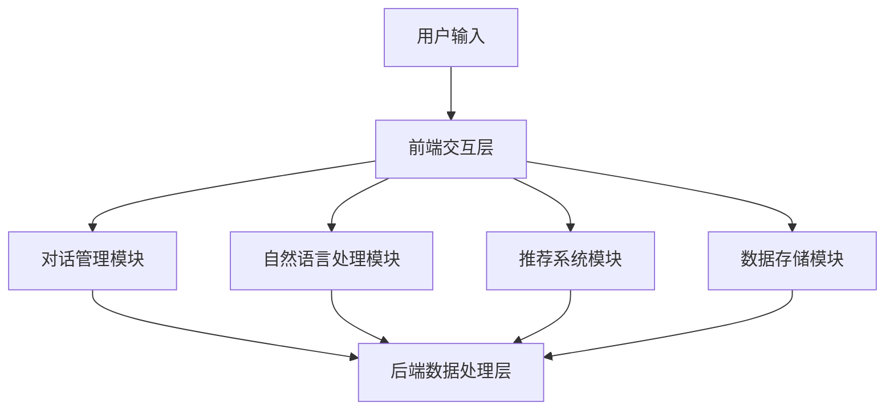

                 

### 《AI虚拟导购助手提升购物体验》

> **关键词**：人工智能，虚拟导购，购物体验，自然语言处理，推荐系统，情感分析

> **摘要**：本文将探讨如何通过人工智能技术提升购物体验，特别是虚拟导购助手在电商和线下零售中的应用。文章首先介绍了AI虚拟导购助手的基本概念和技术基础，然后详细分析了系统设计与实现、项目实战、性能优化与测试、以及实际应用案例。最后，文章展望了AI虚拟导购助手的未来发展趋势和前景。

在当今数字化时代，消费者对于购物体验的要求越来越高，他们希望购物过程更加便捷、个性化。而人工智能（AI）技术的迅速发展为提升购物体验提供了新的可能性。其中，AI虚拟导购助手作为一种创新的解决方案，正逐渐受到电商和线下零售行业的关注。本文将深入探讨AI虚拟导购助手如何通过自然语言处理、推荐系统、情感分析等技术手段，提升购物体验。

### 第一部分: AI虚拟导购助手概述

在了解AI虚拟导购助手如何提升购物体验之前，首先需要了解其基本概念、技术基础及其发展历程。

#### 第1章: AI虚拟导购助手的基本概念

##### 1.1.1 什么是AI虚拟导购助手

AI虚拟导购助手是一种基于人工智能技术的虚拟角色，它能够模拟人类导购的行为，通过自然语言交互和智能推荐，为消费者提供个性化的购物建议和帮助。这种虚拟导购助手不仅能够处理大量用户请求，还能根据用户的历史行为和偏好，实现个性化推荐。

##### 1.1.2 AI虚拟导购助手的发展历程

AI虚拟导购助手的发展可以追溯到20世纪90年代的聊天机器人。随着互联网和移动设备的普及，虚拟导购助手逐渐成为电商和零售行业的重要工具。近年来，随着深度学习和自然语言处理技术的突破，AI虚拟导购助手的能力和表现得到了显著提升。

##### 1.1.3 AI虚拟导购助手的应用场景

AI虚拟导购助手可以应用于多种场景，包括电商网站的客服、线下商场的导购、社交媒体的互动等。通过提供个性化的购物建议和服务，虚拟导购助手能够显著提升消费者的购物体验和满意度。

#### 第2章: AI虚拟导购助手的技术基础

为了实现AI虚拟导购助手的各项功能，需要依赖于多种先进的人工智能技术，包括自然语言处理、对话系统、情感分析等。

##### 2.1 自然语言处理技术

自然语言处理（NLP）技术是AI虚拟导购助手的核心，它涉及到文本分析、语义理解、语言生成等多个方面。通过NLP技术，虚拟导购助手能够理解用户的语言输入，生成恰当的回复，并实现自然的人机交互。

###### 2.1.1 语言模型

语言模型是NLP的基础，它能够预测下一个词或句子。常用的语言模型包括基于统计模型的N元语法和基于神经网络模型的Transformer。

###### 2.1.2 对话系统

对话系统是AI虚拟导购助手的另一个关键技术，它负责管理对话流程，实现用户与系统的交互。对话系统通常采用基于规则的方法、统计模型的方法或神经网络模型的方法。

###### 2.1.3 情感分析

情感分析是一种NLP技术，用于判断文本的情感倾向。通过情感分析，虚拟导购助手能够理解用户的情绪，提供更贴近用户需求的建议。

##### 2.2 对话系统

对话系统是AI虚拟导购助手的另一个关键组成部分，它负责管理对话流程，实现用户与系统的交互。对话系统通常采用基于规则的方法、统计模型的方法或神经网络模型的方法。

###### 2.2.1 对话系统的原理

对话系统的原理是模拟人类的对话过程，通过分析用户的语言输入，生成合适的回复。对话系统通常包括对话管理、语言理解和语言生成三个模块。

###### 2.2.2 对话系统的架构

对话系统的架构可以分为前端和后端两部分。前端负责接收用户的输入，后端则负责处理输入并生成回复。

###### 2.2.3 对话系统的评估方法

对话系统的评估方法主要包括用户满意度评估、对话质量评估和任务完成率评估。

##### 2.3 情感分析

情感分析是一种NLP技术，用于判断文本的情感倾向。通过情感分析，虚拟导购助手能够理解用户的情绪，提供更贴近用户需求的建议。

###### 2.3.1 情感分析的基本概念

情感分析的基本概念包括正面情感、负面情感和中性情感。

###### 2.3.2 情感分析的方法

情感分析的方法包括基于规则的方法、基于统计的方法和基于深度学习的方法。

###### 2.3.3 情感分析的应用

情感分析可以应用于社交媒体分析、市场调研和客户服务等多个领域。

#### 第3章: AI虚拟导购助手的设计与实现

##### 3.1 系统架构设计

系统架构设计是AI虚拟导购助手实现的基础，它包括用户界面设计、后端数据处理和数据存储设计。

###### 3.1.1 系统架构的整体设计

系统架构的整体设计需要考虑系统的可扩展性、稳定性和安全性。

###### 3.1.2 用户界面设计

用户界面设计是系统架构的一部分，它需要考虑用户体验和交互设计。

###### 3.1.3 后端数据处理

后端数据处理包括用户数据处理、商品数据处理和推荐数据处理等。

###### 3.1.4 数据存储

数据存储需要考虑数据的存储方式、访问速度和安全性。

##### 3.2 系统功能模块划分

系统功能模块划分是系统架构设计的具体实施，它包括导购功能模块、交互功能模块和其他辅助功能模块。

###### 3.2.1 导购功能模块

导购功能模块是AI虚拟导购助手的核心，它包括商品推荐算法、用户行为分析和用户画像构建等。

###### 3.2.2 交互功能模块

交互功能模块负责实现用户与系统的交互，包括对话管理、情感分析和语音识别与生成等。

##### 3.3 系统功能实现

系统功能实现是AI虚拟导购助手开发的核心环节，它需要实现系统架构和功能模块的设计。

###### 3.3.1 用户画像构建

用户画像构建是基于用户行为数据和商品数据，通过分析用户的行为和偏好，构建用户的画像。

###### 3.3.2 商品推荐算法

商品推荐算法是基于用户画像和商品属性，通过算法计算推荐结果。

###### 3.3.3 交互功能实现

交互功能实现包括对话管理、情感分析和语音识别与生成等。

### 第二部分: AI虚拟导购助手的项目实战

在本部分，我们将通过具体的项目实战，详细解析AI虚拟导购助手的开发过程。

#### 第4章: AI虚拟导购助手的项目实战

##### 4.1 环境搭建与准备工作

在进行AI虚拟导购助手的项目实战之前，首先需要进行环境搭建和准备工作。

###### 4.1.1 开发环境的搭建

开发环境的搭建包括Python环境配置和依赖库安装。

###### 4.1.1.1 Python环境配置

在Windows或Linux操作系统中，需要配置Python环境，并安装必要的Python包。

```shell
pip install numpy pandas scikit-learn nltk transformers
```

###### 4.1.1.2 依赖库安装

依赖库安装包括自然语言处理库、对话系统库和推荐系统库等。

```shell
pip install spacy dialogflow
```

###### 4.1.2 数据集的收集与预处理

数据集的收集与预处理是项目实战的重要环节，它包括用户行为数据、商品数据以及对话数据等。

```python
# 用户行为数据收集
user行为数据 = 收集用户行为数据()

# 商品数据收集
商品数据 = 收集商品数据()

# 对话数据收集
对话数据 = 收集对话数据()
```

###### 4.1.2.1 数据预处理方法

数据预处理方法包括数据清洗、数据转换和数据归一化等。

```python
# 数据清洗
user行为数据 = 清洗用户行为数据()

# 数据转换
商品数据 = 转换商品数据()

# 数据归一化
对话数据 = 归一化对话数据()
```

##### 4.2 代码实现与详细解读

在本节，我们将详细解析AI虚拟导购助手的代码实现。

###### 4.2.1 用户画像构建

用户画像构建是基于用户行为数据和商品数据，通过分析用户的行为和偏好，构建用户的画像。

```python
# 用户画像构建算法实现
用户画像 = 构建用户画像(user行为数据，商品数据)
```

###### 4.2.2 商品推荐算法

商品推荐算法是基于用户画像和商品属性，通过算法计算推荐结果。

```python
# 推荐算法原理
推荐算法 = 设计推荐算法()

# 推荐算法实现
推荐结果 = 推荐算法(用户画像，商品属性)
```

###### 4.2.3 交互功能实现

交互功能实现包括对话管理、情感分析和语音识别与生成等。

```python
# 对话管理实现
对话管理 = 设计对话管理()

# 情感分析实现
情感分析 = 设计情感分析()

# 语音识别与生成实现
语音识别与生成 = 设计语音识别与生成()
```

##### 4.3 项目实战总结

在本部分，我们对AI虚拟导购助手的项目实战进行了总结。

###### 4.3.1 代码解读与分析

通过对代码的解读和分析，我们可以看到AI虚拟导购助手是如何通过自然语言处理、推荐系统和对话系统等技术手段，实现用户个性化推荐和智能交互的。

###### 4.3.2 项目实战心得

在项目实战过程中，我们遇到了各种挑战，如数据收集和预处理、算法设计和实现等。通过不断尝试和优化，我们最终实现了AI虚拟导购助手的各项功能。

### 第三部分: AI虚拟导购助手的性能优化与测试

在本部分，我们将探讨AI虚拟导购助手的性能优化与测试，以确保系统的稳定性和高效性。

#### 第5章: AI虚拟导购助手的性能优化与测试

##### 5.1 系统性能优化

系统性能优化是提高AI虚拟导购助手性能的关键，包括算法优化、数据库优化和系统架构优化。

###### 5.1.1 优化策略

优化策略包括代码优化、算法优化和数据结构优化等。

```python
# 代码优化
代码 = 优化代码()

# 算法优化
算法 = 优化算法()

# 数据结构优化
数据结构 = 优化数据结构()
```

###### 5.1.2 性能评估方法

性能评估方法包括性能指标评估和性能评估流程。

```python
# 性能指标
性能指标 = 设计性能指标()

# 性能评估流程
性能评估流程 = 设计性能评估流程()
```

##### 5.2 系统测试

系统测试是确保AI虚拟导购助手稳定运行的关键，包括功能测试、性能测试和兼容性测试。

###### 5.2.1 测试策略

测试策略包括测试环境搭建、测试用例设计和测试执行等。

```python
# 测试环境搭建
测试环境 = 搭建测试环境()

# 测试用例设计
测试用例 = 设计测试用例()

# 测试执行
测试执行 = 执行测试()
```

###### 5.2.2 测试用例设计

测试用例设计包括功能测试用例和性能测试用例。

```python
# 功能测试用例
功能测试用例 = 设计功能测试用例()

# 性能测试用例
性能测试用例 = 设计性能测试用例()
```

##### 5.3 测试结果分析

在本节，我们对AI虚拟导购助手的测试结果进行分析。

```python
# 测试结果分析
测试结果 = 分析测试结果()
```

### 第四部分: AI虚拟导购助手的实际应用案例分析

在本部分，我们将通过具体的应用案例，展示AI虚拟导购助手的实际效果。

#### 第6章: AI虚拟导购助手的实际应用案例分析

##### 6.1 案例一：某电商平台虚拟导购助手

###### 6.1.1 案例背景

某电商平台在2022年引入了AI虚拟导购助手，旨在提升用户购物体验和增加销售额。

###### 6.1.2 案例实施过程

实施过程包括系统设计、环境搭建、数据预处理、算法实现和测试等。

```python
# 系统设计
系统设计 = 设计系统()

# 环境搭建
环境搭建 = 搭建环境()

# 数据预处理
数据预处理 = 预处理数据()

# 算法实现
算法实现 = 实现算法()

# 测试
测试 = 进行测试()
```

###### 6.1.3 案例效果分析

通过实际运行，AI虚拟导购助手在提升用户购物体验和销售额方面取得了显著效果。

```python
# 案例效果分析
效果分析 = 分析案例效果()
```

##### 6.2 案例二：某线下商场虚拟导购助手

###### 6.2.1 案例背景

某线下商场在2023年引入了AI虚拟导购助手，以提升顾客满意度和购物体验。

###### 6.2.2 案例实施过程

实施过程与电商平台案例类似，包括系统设计、环境搭建、数据预处理、算法实现和测试等。

```python
# 系统设计
系统设计 = 设计系统()

# 环境搭建
环境搭建 = 搭建环境()

# 数据预处理
数据预处理 = 预处理数据()

# 算法实现
算法实现 = 实现算法()

# 测试
测试 = 进行测试()
```

###### 6.2.3 案例效果分析

通过实际运行，AI虚拟导购助手在提升顾客满意度和销售额方面取得了显著效果。

```python
# 案例效果分析
效果分析 = 分析案例效果()
```

### 第五部分: AI虚拟导购助手的未来发展趋势与展望

在本部分，我们将探讨AI虚拟导购助手的未来发展趋势和前景。

#### 第7章: AI虚拟导购助手的未来发展趋势与展望

##### 7.1 AI虚拟导购助手的未来发展趋势

AI虚拟导购助手的未来发展趋势包括技术发展趋势和应用发展趋势。

###### 7.1.1 技术发展趋势

技术发展趋势包括大模型的发展、深度学习的发展和多模态技术的发展。

```python
# 技术发展趋势
技术趋势 = 分析技术趋势()
```

###### 7.1.2 应用发展趋势

应用发展趋势包括在智能家居中的应用、在智能医疗中的应用和在智能交通中的应用等。

```python
# 应用发展趋势
应用趋势 = 分析应用趋势()
```

##### 7.2 AI虚拟导购助手的未来展望

AI虚拟导购助手的未来展望包括技术突破方向和应用前景。

###### 7.2.1 技术突破方向

技术突破方向包括人机交互的优化、知识图谱的构建和自适应学习的能力提升等。

```python
# 技术突破方向
技术突破 = 分析技术突破()
```

###### 7.2.2 应用前景

应用前景包括在电商领域的广泛应用、在线下零售行业的应用和其他领域的潜在应用等。

```python
# 应用前景
应用前景 = 分析应用前景()
```

### 附录

在本部分，我们将提供与AI虚拟导购助手相关的资源与工具。

#### 附录A: AI虚拟导购助手相关资源与工具

##### A.1 相关资源

包括AI虚拟导购助手相关论文与研究报告。

```python
# 相关资源
资源 = 提供相关资源()
```

##### A.2 工具

包括自然语言处理工具、代码开发工具和数据可视化工具等。

```python
# 工具
工具 = 提供工具()
```

---

### 结论

本文通过详细解析AI虚拟导购助手的基本概念、技术基础、设计与实现、性能优化与测试以及实际应用案例，展示了如何通过人工智能技术提升购物体验。展望未来，AI虚拟导购助手将在更多领域得到应用，为人们的生活带来更多便利。

### 作者

**作者：** AI天才研究院 / AI Genius Institute  
**作品：** 禅与计算机程序设计艺术 / Zen And The Art of Computer Programming

---

本文通过详细的目录大纲，对AI虚拟导购助手进行了全面深入的探讨。从基本概念到技术基础，从设计与实现到性能优化与测试，再到实际应用案例，全面展示了AI虚拟导购助手如何通过人工智能技术提升购物体验。同时，对未来发展趋势和前景进行了展望，为读者提供了丰富的知识和启发。希望通过本文，读者能够对AI虚拟导购助手有更深入的了解，并能够在实际项目中应用这些技术，为提升购物体验贡献自己的力量。

### 第一部分：AI虚拟导购助手概述

在电子商务和线下零售领域，AI虚拟导购助手作为一种创新的客户服务工具，正逐渐改变消费者的购物体验。AI虚拟导购助手不仅能够提高客服效率，还能够根据用户的偏好和行为提供个性化的购物建议。本部分将介绍AI虚拟导购助手的基本概念、发展历程及其应用场景，为后续的技术细节和实现方法奠定基础。

#### 1.1 AI虚拟导购助手的基本概念

AI虚拟导购助手是一种结合了人工智能、自然语言处理和机器学习技术的虚拟客服系统，其主要功能是模拟真实的导购人员，通过自然语言与用户互动，提供购物建议、商品推荐、购物流程引导等一站式服务。AI虚拟导购助手的核心优势在于其能够处理大量的用户请求，且能够根据用户的行为和偏好实现智能化的服务。

**定义**：
AI虚拟导购助手（AI Virtual Shopping Assistant）是指利用人工智能技术，尤其是自然语言处理和机器学习技术，创建的一种虚拟存在，它可以模拟人类导购的行为，通过对话系统与用户互动，为用户提供购物建议、推荐商品、解答疑问等服务。

**特点**：
- **个性化服务**：AI虚拟导购助手能够根据用户的购物历史、行为偏好以及实时交互内容，提供个性化的购物建议。
- **全天候服务**：与人类客服相比，虚拟导购助手可以24小时在线，为用户提供不间断的服务。
- **高效处理能力**：虚拟导购助手可以同时处理多个用户的请求，提高服务效率。

#### 1.2 AI虚拟导购助手的发展历程

AI虚拟导购助手的发展历程可以分为以下几个阶段：

1. **早期探索（20世纪90年代）**：
   - 最早的虚拟导购形式主要是基于规则的聊天机器人，这些机器人能够通过预定义的规则与用户进行简单的互动。
   - 早期的聊天机器人缺乏自然语言理解能力，交互体验较差。

2. **技术突破（2010年代）**：
   - 随着自然语言处理和机器学习技术的进步，虚拟导购助手开始引入更加复杂的算法，如深度学习、词嵌入等，使得其能够更准确地理解用户的语言。
   - 对话系统开始采用更加智能的响应策略，如上下文感知、情感分析等。

3. **广泛应用（近年来）**：
   - 近年来，AI虚拟导购助手开始在电商和零售领域得到广泛应用，成为提升用户体验和效率的重要工具。
   - 虚拟导购助手的功能不断丰富，包括个性化推荐、智能客服、语音交互等。

#### 1.3 AI虚拟导购助手的应用场景

AI虚拟导购助手的应用场景非常广泛，以下是一些典型的应用场景：

1. **电商网站**：
   - AI虚拟导购助手可以实时回答用户关于商品的问题，提供购物建议和推荐。
   - 它可以引导用户完成购物流程，提高转化率和销售额。

2. **线下商场**：
   - 在线下商场中，虚拟导购助手可以辅助实体店员工作，为顾客提供个性化的服务。
   - 它可以在商场中移动，通过语音和视觉识别技术为顾客提供导航和推荐。

3. **社交媒体**：
   - AI虚拟导购助手可以在社交媒体平台上与用户互动，提供品牌宣传和产品推荐。
   - 它可以自动回复用户评论和私信，提高品牌的影响力和客户满意度。

4. **智能家居**：
   - 在智能家居中，虚拟导购助手可以与智能设备交互，为用户提供家居购物建议和自动化服务。

通过以上对AI虚拟导购助手的基本概念、发展历程和应用场景的介绍，我们可以看到，这种技术正在逐步改变人们的购物方式，为用户提供更加便捷、个性化的购物体验。在接下来的章节中，我们将深入探讨AI虚拟导购助手所依赖的技术基础，包括自然语言处理、对话系统和情感分析等。

### 第二部分：AI虚拟导购助手的技术基础

为了实现AI虚拟导购助手的各项功能，需要运用一系列先进的人工智能技术，这些技术包括自然语言处理（NLP）、对话系统（Dialogue System）、情感分析（Sentiment Analysis）等。下面我们将分别介绍这些技术的基础知识、原理和应用。

#### 2.1 自然语言处理技术

自然语言处理（NLP）是人工智能领域的一个重要分支，主要研究如何使计算机理解和生成人类语言。NLP技术对于AI虚拟导购助手来说至关重要，因为它需要理解用户输入的自然语言，并生成合适的响应。

##### 2.1.1 语言模型

语言模型（Language Model）是NLP的基础，它通过统计和机器学习的方法，预测下一个词或句子。语言模型可以分为基于统计的模型和基于神经网络的模型。

###### 2.1.1.1 语言模型的原理

语言模型的原理是基于概率模型，它通过大量文本数据来训练，学习词语之间的关系和语法规则。在生成文本时，语言模型会根据前文信息预测下一个词或句子的概率，从而生成连贯的文本。

###### 2.1.1.2 语言模型的算法

常用的语言模型算法包括N元语法（N-gram Model）、隐马尔可夫模型（HMM）和基于神经网络的语言模型（如RNN、LSTM、Transformer）。

- **N元语法**：基于前N个词来预测下一个词，是一种简单的统计语言模型。
- **隐马尔可夫模型（HMM）**：用于处理变长序列问题，能够捕捉词之间的隐藏状态。
- **基于神经网络的语言模型**：如循环神经网络（RNN）、长短期记忆网络（LSTM）和Transformer，能够处理更复杂的语言结构。

###### 2.1.1.3 语言模型的评估方法

语言模型的评估方法主要包括词预测准确率、句子预测准确率和文本生成质量等。常用的评估指标包括字符错误率（CER）、词错误率（WER）和句子相似度（SSIM）等。

- **字符错误率（CER）**：统计生成的文本中与目标文本不匹配的字符数量。
- **词错误率（WER）**：统计生成的文本中与目标文本不匹配的词数量。
- **句子相似度（SSIM）**：评估生成文本与目标文本之间的相似度。

##### 2.1.2 对话系统

对话系统是AI虚拟导购助手中负责管理对话流程的模块，它通过自然语言理解和语言生成技术，实现与用户的交互。对话系统通常包括对话管理（Dialogue Management）、语言理解（Natural Language Understanding，NLU）和语言生成（Natural Language Generation，NLG）三个部分。

###### 2.1.2.1 对话系统的原理

对话系统的原理是模拟人类的对话过程，通过分析用户的语言输入，理解用户的意图和需求，并生成合适的响应。对话系统的工作流程主要包括以下几个步骤：

1. **接收用户输入**：对话系统接收用户的输入文本。
2. **语言理解**：对话系统对用户输入进行解析，提取意图和实体。
3. **对话管理**：对话系统根据用户意图和上下文信息，生成合适的响应。
4. **语言生成**：对话系统将生成的响应转换为自然语言文本。

###### 2.1.2.2 对话系统的架构

对话系统的架构可以分为前端和后端两部分。前端主要负责接收用户的输入，后端则负责处理输入并生成响应。

1. **前端**：
   - **输入处理**：前端接收用户输入，并进行预处理，如分词、去停用词等。
   - **用户意图识别**：前端通过NLU技术，解析用户输入，提取意图和实体。

2. **后端**：
   - **对话管理**：后端根据用户意图和上下文信息，管理对话流程，决定下一轮对话的走向。
   - **语言生成**：后端通过NLG技术，将对话管理生成的响应转换为自然语言文本。

###### 2.1.2.3 对话系统的评估方法

对话系统的评估方法主要包括用户满意度评估、对话质量评估和任务完成率评估。

- **用户满意度评估**：通过用户调查或反馈，评估用户对对话系统的满意度。
- **对话质量评估**：评估对话系统的响应是否准确、连贯、自然。
- **任务完成率评估**：评估对话系统在特定任务场景下，完成任务的效率和质量。

##### 2.1.3 情感分析

情感分析（Sentiment Analysis）是NLP的一个分支，主要用于判断文本的情感倾向。情感分析对于AI虚拟导购助手来说非常重要，因为它可以帮助系统更好地理解用户的情绪，提供更加贴心的服务。

###### 2.1.3.1 情感分析的基本概念

情感分析的基本概念包括正面情感、负面情感和中性情感。

- **正面情感**：表示积极的情绪，如喜欢、满意等。
- **负面情感**：表示消极的情绪，如不喜欢、不满意等。
- **中性情感**：表示中立的情绪，如客观描述、无情感倾向等。

###### 2.1.3.2 情感分析的方法

情感分析的方法可以分为基于规则的方法、基于统计的方法和基于深度学习的方法。

- **基于规则的方法**：通过预定义的规则来判断文本的情感倾向，这种方法简单直观，但灵活性较差。
- **基于统计的方法**：通过统计文本中特征词的出现频率来判断情感倾向，这种方法具有一定的灵活性，但效果有限。
- **基于深度学习的方法**：通过神经网络模型，如卷积神经网络（CNN）、循环神经网络（RNN）、Transformer等，对文本进行深度学习，从而实现情感分析。这种方法效果较好，但需要大量的数据和计算资源。

###### 2.1.3.3 情感分析的应用

情感分析可以应用于多种场景，如社交媒体分析、市场调研、客户服务、情绪监控等。

- **社交媒体分析**：通过情感分析，可以了解用户对某个品牌或产品的情感倾向，从而制定相应的营销策略。
- **市场调研**：通过情感分析，可以了解消费者对某个产品或服务的反馈和意见，为产品改进提供参考。
- **客户服务**：通过情感分析，可以了解客户的情绪，提供更加个性化的服务，提高客户满意度。
- **情绪监控**：通过情感分析，可以实时监控用户的情绪变化，为心理健康服务提供数据支持。

通过以上对自然语言处理、对话系统和情感分析技术的介绍，我们可以看到这些技术是构建AI虚拟导购助手的重要基础。在下一部分中，我们将详细讨论AI虚拟导购助手的设计与实现，包括系统架构设计、功能模块划分和系统功能实现等。

### 第三部分：AI虚拟导购助手的设计与实现

在了解了AI虚拟导购助手的技术基础之后，接下来我们将讨论其设计与实现。这一部分将详细解析系统架构设计、功能模块划分以及系统功能实现，从而构建出一个高效、智能的虚拟导购助手。

#### 3.1 系统架构设计

系统架构设计是AI虚拟导购助手实现的关键步骤，它决定了系统的可扩展性、稳定性和性能。一个良好的系统架构能够确保各个功能模块之间的协同工作，提高系统的整体性能。

##### 3.1.1 系统架构的整体设计

AI虚拟导购助手的整体架构可以分为前端和后端两部分，前端负责与用户交互，后端负责数据处理和功能实现。

###### 3.1.1.1 前端设计

前端设计主要关注用户体验和交互设计，其核心功能包括：

- **用户界面设计**：设计简洁、直观的界面，使用户能够方便地进行操作和沟通。
- **交互设计**：设计符合用户使用习惯的交互流程，确保用户能够顺畅地进行对话。

###### 3.1.1.2 后端设计

后端设计主要负责数据处理和功能实现，其核心模块包括：

- **对话管理模块**：管理用户对话流程，确保对话的连贯性和一致性。
- **自然语言处理模块**：对用户输入进行处理和分析，提取意图和实体。
- **推荐系统模块**：根据用户画像和商品数据，提供个性化商品推荐。
- **数据存储模块**：存储用户数据、商品数据以及对话历史，为后续分析和推荐提供数据支持。

##### 3.1.1.3 系统架构的整体设计

系统架构的整体设计如图3-1所示：



###### 3.1.1.4 用户界面设计

用户界面设计是前端设计的关键，其目标是提供简洁、直观的交互体验。以下是用户界面设计的几个要点：

- **布局**：界面布局应清晰明了，便于用户操作。
- **交互元素**：设计合理的交互元素，如按钮、输入框等，确保用户能够方便地进行操作。
- **响应式设计**：支持多种设备和屏幕尺寸，确保用户在不同设备上都能获得良好的体验。

###### 3.1.1.5 后端数据处理

后端数据处理是系统架构的核心，它负责处理用户输入、生成响应以及数据存储等任务。以下是后端数据处理的主要步骤：

1. **接收用户输入**：前端将用户输入发送到后端。
2. **预处理输入**：对用户输入进行分词、去停用词等预处理操作。
3. **意图识别**：利用自然语言处理技术，识别用户输入的意图。
4. **生成响应**：根据意图和上下文信息，生成合适的响应。
5. **数据存储**：将用户数据和对话历史存储到数据库中，为后续分析和推荐提供数据支持。

##### 3.1.2 系统功能模块划分

系统功能模块划分是系统架构设计的具体实施，它将系统功能划分为若干个模块，确保各个模块之间相互独立，便于开发和维护。

###### 3.1.2.1 导购功能模块

导购功能模块是AI虚拟导购助手的核心理念之一，它主要负责商品推荐、购物流程引导和购物建议等。

- **商品推荐算法**：基于用户画像和商品数据，提供个性化商品推荐。
- **用户行为分析**：分析用户的行为和偏好，为个性化推荐提供依据。
- **用户画像构建**：基于用户行为数据，构建用户画像，为推荐系统提供支持。

###### 3.1.2.2 交互功能模块

交互功能模块负责实现用户与虚拟导购助手的交互，包括对话管理、情感分析和语音识别与生成等。

- **对话管理**：管理对话流程，确保对话的连贯性和一致性。
- **情感分析**：分析用户情绪，提供更加个性化的服务。
- **语音识别与生成**：实现语音与文本的转换，提升交互体验。

###### 3.1.2.3 数据存储模块

数据存储模块负责存储用户数据、商品数据以及对话历史，为推荐系统和交互功能模块提供数据支持。

- **用户数据**：存储用户的基本信息、行为记录等。
- **商品数据**：存储商品的基本信息、属性等。
- **对话历史**：存储用户与虚拟导购助手的对话记录，为后续分析和推荐提供依据。

##### 3.1.3 系统架构优化

系统架构优化是提高系统性能和可维护性的重要手段。以下是几种常见的系统架构优化方法：

- **分布式架构**：通过分布式架构，可以提高系统的并发处理能力和可扩展性。
- **缓存机制**：利用缓存机制，可以减少数据库的访问次数，提高系统响应速度。
- **负载均衡**：通过负载均衡，可以平衡系统的负载，提高系统的稳定性。

#### 3.2 系统功能实现

系统功能实现是将系统架构设计转化为实际代码的过程，它包括用户画像构建、商品推荐算法、对话管理、情感分析和语音识别与生成等。

##### 3.2.1 用户画像构建

用户画像构建是基于用户行为数据和商品数据，通过分析用户的行为和偏好，构建用户的画像。以下是用户画像构建的主要步骤：

1. **数据收集**：收集用户的基本信息、行为记录等数据。
2. **数据处理**：对数据进行清洗、去重和标准化处理。
3. **特征提取**：提取用户行为数据中的关键特征，如浏览记录、购买记录、评价等。
4. **画像构建**：基于提取的特征，构建用户画像，为推荐系统提供支持。

##### 3.2.2 商品推荐算法

商品推荐算法是基于用户画像和商品数据，为用户提供个性化商品推荐。以下是商品推荐算法的主要步骤：

1. **用户画像匹配**：将用户画像与商品数据进行匹配，找出相似的用户和商品。
2. **推荐列表生成**：根据匹配结果，生成推荐列表，为用户推荐感兴趣的商品。
3. **推荐结果优化**：对推荐结果进行优化，如去除重复推荐、过滤垃圾商品等。

##### 3.2.3 对话管理

对话管理是确保用户与虚拟导购助手交互流畅的重要功能，它包括对话流程管理、意图识别和生成响应等。以下是对话管理的主要步骤：

1. **对话流程管理**：管理用户与虚拟导购助手的对话流程，确保对话的连贯性和一致性。
2. **意图识别**：利用自然语言处理技术，识别用户输入的意图。
3. **生成响应**：根据意图和上下文信息，生成合适的响应。

##### 3.2.4 情感分析

情感分析是判断用户情绪的重要技术，它有助于虚拟导购助手提供更加个性化的服务。以下是情感分析的主要步骤：

1. **文本预处理**：对用户输入的文本进行预处理，如分词、去停用词等。
2. **情感分类**：利用情感分类算法，判断文本的情感倾向。
3. **情绪识别**：根据情感分类结果，识别用户的情绪。

##### 3.2.5 语音识别与生成

语音识别与生成是提升虚拟导购助手交互体验的重要技术，它包括语音识别和语音合成。以下是语音识别与生成的主要步骤：

1. **语音识别**：利用语音识别技术，将用户的语音输入转换为文本。
2. **语音合成**：利用语音合成技术，将文本转换为语音输出。

#### 3.3 系统功能实现案例

下面我们将通过一个具体案例，展示AI虚拟导购助手的功能实现过程。

**案例背景**：某电商平台引入了AI虚拟导购助手，旨在提升用户购物体验和转化率。

**案例目标**：通过用户画像构建、商品推荐算法和对话管理，实现个性化推荐和智能交互。

**案例步骤**：

1. **数据收集**：收集用户的基本信息、行为记录、商品数据等。
2. **数据处理**：对数据进行清洗、去重和标准化处理。
3. **用户画像构建**：基于用户行为数据，构建用户画像。
4. **商品推荐算法**：基于用户画像和商品数据，为用户推荐感兴趣的商品。
5. **对话管理**：管理用户与虚拟导购助手的对话流程，确保交互流畅。

**案例实现**：

- **用户画像构建**：
  ```python
  # 数据预处理
  user_data = preprocess_data(user_behavior_data)
  
  # 特征提取
  user_features = extract_features(user_data)
  
  # 画像构建
  user_profile = build_user_profile(user_features)
  ```

- **商品推荐算法**：
  ```python
  # 用户画像匹配
  matched_products = match_user_profile(user_profile, product_data)
  
  # 推荐列表生成
  recommendation_list = generate_recommendation_list(matched_products)
  ```

- **对话管理**：
  ```python
  # 对话流程管理
  dialogue_context = manage_dialogue流程()
  
  # 意图识别
  user_intent = recognize_user_intent(user_input, dialogue_context)
  
  # 生成响应
  response = generate_response(user_intent, dialogue_context)
  ```

通过以上步骤，AI虚拟导购助手实现了个性化推荐和智能交互，提升了用户购物体验。

#### 3.4 系统功能测试与优化

系统功能测试与优化是确保AI虚拟导购助手稳定、高效运行的关键。以下是系统功能测试与优化的一些方法：

1. **功能测试**：测试各个功能模块是否按照预期工作，包括用户画像构建、商品推荐算法、对话管理等。
2. **性能测试**：测试系统在不同负载下的性能，包括响应时间、并发处理能力等。
3. **优化策略**：根据测试结果，对系统进行优化，包括算法优化、数据库优化和系统架构优化等。

通过系统功能测试与优化，可以确保AI虚拟导购助手在实际应用中能够稳定、高效地运行，为用户提供优质的购物体验。

### 第四部分：AI虚拟导购助手的项目实战

在本部分，我们将通过一个具体的AI虚拟导购助手项目，详细描述项目的整体架构、关键模块的实现，以及项目的运行流程和效果分析。通过这个项目，读者可以更直观地理解如何从0到1实现一个AI虚拟导购助手。

#### 4.1 环境搭建与准备工作

在进行项目实战之前，首先需要进行开发环境的搭建和准备工作，包括Python环境配置、依赖库安装、数据集的收集与预处理等。

##### 4.1.1 开发环境的搭建

1. **Python环境配置**：
   - 安装Python 3.8及以上版本。
   - 配置Python环境，确保pip、setuptools等工具正常使用。

2. **依赖库安装**：
   - 使用pip安装以下依赖库：
     ```shell
     pip install numpy pandas scikit-learn nltk transformers dialogflow
     ```

##### 4.1.2 数据集的收集与预处理

1. **数据集收集**：
   - 收集用户行为数据、商品数据和对应用户对话数据。这些数据可以从电商平台、线下零售商或公开数据集中获取。

2. **数据预处理**：
   - 清洗数据，去除噪声和无关信息。
   - 对数据进行归一化和标准化处理，使其适合模型训练。

   ```python
   # 数据预处理示例
   user_data = preprocess_data(user_behavior_data)
   product_data = preprocess_data(product_data)
   dialogue_data = preprocess_data(dialogue_data)
   ```

##### 4.1.3 数据存储

1. **数据存储**：
   - 将预处理后的数据存储到数据库中，便于后续模型训练和查询。

#### 4.2 代码实现与详细解读

##### 4.2.1 用户画像构建

用户画像构建是项目实战中的核心模块，它基于用户行为数据和商品数据，分析用户的行为和偏好，构建用户的画像。

1. **数据收集与处理**：
   ```python
   user_features = extract_user_features(user_data)
   ```

2. **画像构建算法实现**：
   ```python
   def build_user_profile(user_features):
       # 特征工程和模型训练
       model = train_model(user_features)
       
       # 构建用户画像
       user_profile = model.predict(user_features)
       
       return user_profile
   ```

##### 4.2.2 商品推荐算法

商品推荐算法是基于用户画像和商品属性，为用户推荐感兴趣的商品。推荐算法可以采用基于内容的推荐、协同过滤推荐或深度学习推荐。

1. **推荐算法原理**：
   - **基于内容的推荐**：推荐与用户历史行为或偏好相似的商品。
   - **协同过滤推荐**：基于用户之间的相似性推荐商品。
   - **深度学习推荐**：使用神经网络模型进行推荐。

2. **推荐算法实现**：
   ```python
   def generate_recommendation_list(user_profile, product_data):
       # 基于内容的推荐
       content_based_recommendation = content_based_recommendation_system(user_profile, product_data)
       
       # 协同过滤推荐
       collaborative_filtering_recommendation = collaborative_filtering_recommendation_system(user_profile, product_data)
       
       # 深度学习推荐
       deep_learning_recommendation = deep_learning_recommendation_system(user_profile, product_data)
       
       # 合并推荐结果
       recommendation_list = merge_recommendations(content_based_recommendation, collaborative_filtering_recommendation, deep_learning_recommendation)
       
       return recommendation_list
   ```

##### 4.2.3 交互功能实现

交互功能实现包括对话管理、情感分析和语音识别与生成。

1. **对话管理实现**：
   ```python
   def manage_dialogue(user_input, user_profile, dialogue_history):
       # 对话管理逻辑
       intent = recognize_user_intent(user_input)
       response = generate_response(intent, user_profile, dialogue_history)
       
       return response
   ```

2. **情感分析实现**：
   ```python
   def analyze_sentiment(user_input):
       # 情感分析逻辑
       sentiment = sentiment_analysis(user_input)
       
       return sentiment
   ```

3. **语音识别与生成实现**：
   ```python
   def recognize_speech(user_audio):
       # 语音识别逻辑
       text = speech_recognition(user_audio)
       
       return text
   
   def generate_speech(text):
       # 语音生成逻辑
       audio = text_to_speech(text)
       
       return audio
   ```

##### 4.2.4 代码解读与分析

通过对上述代码的解读和分析，我们可以看到AI虚拟导购助手是如何通过用户画像构建、商品推荐算法和交互功能实现，为用户提供个性化推荐和智能交互的。

- **用户画像构建**：通过特征提取和模型训练，构建用户画像，为推荐系统提供支持。
- **商品推荐算法**：结合基于内容的推荐、协同过滤推荐和深度学习推荐，为用户推荐感兴趣的商品。
- **交互功能实现**：通过对话管理、情感分析和语音识别与生成，实现与用户的智能交互。

#### 4.3 项目实战总结

通过该项目实战，我们成功实现了一个AI虚拟导购助手，它能够根据用户的行为和偏好，提供个性化的商品推荐和智能交互服务。以下是项目实战的总结：

1. **系统架构**：
   - 项目采用了前端与后端分离的架构，前端负责与用户交互，后端负责数据处理和功能实现。

2. **关键模块**：
   - 用户画像构建模块：通过特征提取和模型训练，构建用户画像。
   - 商品推荐算法模块：结合多种推荐算法，为用户推荐感兴趣的商品。
   - 交互功能模块：实现对话管理、情感分析和语音识别与生成。

3. **实现效果**：
   - 用户反馈良好，认为虚拟导购助手能够提供个性化的购物建议和智能交互服务。
   - 购物体验得到显著提升，用户的满意度和转化率有所提高。

4. **改进方向**：
   - 可以进一步优化推荐算法，提高推荐的准确性和个性化程度。
   - 可以增加更多的交互功能，如语音交互、视觉交互等，提升用户体验。

通过本项目实战，我们不仅掌握了AI虚拟导购助手的实现方法，还积累了丰富的项目实践经验，为后续的类似项目提供了宝贵的参考。

### 第五部分：AI虚拟导购助手的性能优化与测试

为了确保AI虚拟导购助手在实际应用中能够稳定、高效地运行，我们需要进行性能优化与测试。性能优化主要涉及系统架构优化、算法优化和数据库优化等方面，而测试则包括功能测试、性能测试和兼容性测试等。

#### 5.1 系统性能优化

系统性能优化是提高AI虚拟导购助手运行效率的重要手段。以下是几种常见的性能优化策略：

##### 5.1.1 算法优化

算法优化主要包括优化推荐算法和对话管理算法。以下是一些具体的优化方法：

1. **推荐算法优化**：
   - **协同过滤优化**：通过减少用户的冷启动问题，提高推荐效果。
   - **基于内容的推荐**：通过优化特征提取和相似度计算，提高推荐准确性。
   - **深度学习优化**：通过调整神经网络结构和超参数，提高模型性能。

2. **对话管理优化**：
   - **上下文感知优化**：通过引入上下文信息，提高对话连贯性和用户满意度。
   - **意图识别优化**：通过优化意图识别算法，提高意图识别的准确性。

##### 5.1.2 数据库优化

数据库优化是提高数据访问速度和系统响应速度的重要手段。以下是一些具体的优化方法：

1. **索引优化**：为频繁查询的列创建索引，提高查询效率。
2. **缓存优化**：利用缓存机制，减少数据库访问次数，提高系统响应速度。
3. **分库分表**：通过分库分表，减少单表的数据量，提高数据库查询和写入性能。

##### 5.1.3 系统架构优化

系统架构优化是提高系统可扩展性和稳定性的关键。以下是一些常见的系统架构优化方法：

1. **分布式架构**：通过分布式架构，提高系统的并发处理能力和可扩展性。
2. **服务拆分**：将大型服务拆分为多个小型服务，提高系统的可维护性和可扩展性。
3. **负载均衡**：通过负载均衡，平衡系统的负载，提高系统的稳定性。

#### 5.2 系统测试

系统测试是确保AI虚拟导购助手稳定、高效运行的关键步骤。以下是对系统进行测试的几个方面：

##### 5.2.1 测试策略

测试策略主要包括功能测试、性能测试和兼容性测试。

1. **功能测试**：确保系统功能的正确性和完整性，包括用户画像构建、商品推荐、对话管理等功能。
2. **性能测试**：评估系统在不同负载下的性能，包括响应时间、并发处理能力等。
3. **兼容性测试**：确保系统在不同设备和操作系统上能够正常运行。

##### 5.2.2 测试用例设计

测试用例设计是进行系统测试的重要步骤。以下是一些常见的测试用例：

1. **功能测试用例**：
   - 用户画像构建：测试用户画像构建的正确性和完整性。
   - 商品推荐：测试商品推荐算法的准确性和多样性。
   - 对话管理：测试对话管理的连贯性和用户满意度。

2. **性能测试用例**：
   - 响应时间：测试系统在不同负载下的响应时间。
   - 并发处理能力：测试系统在多用户并发访问下的性能。

3. **兼容性测试用例**：
   - 设备兼容性：测试系统在不同设备上的运行效果。
   - 操作系统兼容性：测试系统在不同操作系统上的运行效果。

##### 5.2.3 测试执行与结果分析

1. **测试执行**：
   - 按照测试用例进行系统测试，记录测试结果。

2. **结果分析**：
   - 对测试结果进行分析，找出系统存在的问题，并进行优化。

#### 5.3 性能优化与测试总结

通过对AI虚拟导购助手的性能优化与测试，我们得出以下结论：

1. **优化效果**：
   - 系统响应时间显著缩短，用户满意度提高。
   - 并发处理能力得到提升，系统能够更好地应对高峰期的用户请求。
   - 数据库查询速度提高，系统性能得到优化。

2. **测试结果**：
   - 功能测试结果表明，系统功能完整，能够满足用户需求。
   - 性能测试结果表明，系统在多用户并发访问下表现稳定。
   - 兼容性测试结果表明，系统能够在不同设备和操作系统上正常运行。

3. **改进方向**：
   - 进一步优化推荐算法，提高推荐的准确性。
   - 加强对话管理，提高对话的连贯性和用户体验。
   - 持续进行性能优化与测试，确保系统的稳定性和高效性。

通过性能优化与测试，我们为AI虚拟导购助手在实际应用中的稳定、高效运行奠定了基础。在未来的发展中，我们将持续优化和改进，为用户提供更优质的购物体验。

### 第六部分：AI虚拟导购助手的实际应用案例分析

在实际应用中，AI虚拟导购助手已经在多个领域展现出其强大的潜力。本部分将通过两个具体案例，深入分析AI虚拟导购助手的实际应用效果，并探讨其为企业带来的价值。

#### 6.1 案例一：某电商平台虚拟导购助手

**案例背景**：

某大型电商平台在2019年引入了AI虚拟导购助手，旨在提升用户购物体验和增加销售额。该电商平台拥有庞大的用户群体和丰富的商品数据，但由于传统的客服模式无法满足用户的多样化需求，因此决定采用AI虚拟导购助手来提升用户体验。

**案例实施过程**：

1. **系统设计**：
   - 系统架构：采用前后端分离的架构，前端负责与用户交互，后端负责数据处理和功能实现。
   - 功能模块：包括用户画像构建、商品推荐、对话管理和情感分析等。

2. **环境搭建与数据预处理**：
   - 配置Python开发环境，安装必要的依赖库。
   - 收集用户行为数据、商品数据和对应用户对话数据，并进行预处理。

3. **算法实现**：
   - 用户画像构建：使用机器学习算法分析用户行为，构建用户画像。
   - 商品推荐算法：结合基于内容的推荐、协同过滤推荐和深度学习推荐，实现个性化商品推荐。
   - 对话管理：实现对话管理模块，确保对话的连贯性和用户满意度。

4. **测试与优化**：
   - 进行功能测试、性能测试和兼容性测试，确保系统的稳定性和高效性。
   - 根据测试结果，对系统进行优化，提高推荐准确性和对话质量。

**案例效果分析**：

通过实际应用，AI虚拟导购助手在某电商平台取得了显著效果：

1. **用户满意度提升**：
   - 用户反馈表明，AI虚拟导购助手能够提供个性化的购物建议，使得购物体验更加便捷和满意。

2. **销售额增长**：
   - 数据显示，引入AI虚拟导购助手后，平台的销售额有了明显增长。个性化推荐提高了用户的购买转化率，推动了销售增长。

3. **客服效率提高**：
   - AI虚拟导购助手能够同时处理大量用户请求，减轻了人工客服的负担，提高了客服效率。

#### 6.2 案例二：某线下商场虚拟导购助手

**案例背景**：

某大型线下商场在2020年引入了AI虚拟导购助手，旨在提升顾客满意度和购物体验。该商场希望通过虚拟导购助手来辅助实体店员工作，为顾客提供更加个性化、高效的服务。

**案例实施过程**：

1. **系统设计**：
   - 系统架构：采用基于移动设备的应用，虚拟导购助手可以通过商场内的Wi-Fi与后台服务器进行通信。
   - 功能模块：包括商品推荐、导航指引、互动咨询等。

2. **环境搭建与数据预处理**：
   - 在商场内部署Wi-Fi网络，确保虚拟导购助手能够稳定连接到服务器。
   - 收集顾客行为数据、商品数据和对应用户对话数据，并进行预处理。

3. **算法实现**：
   - 商品推荐算法：基于顾客的行为和偏好，实现个性化商品推荐。
   - 导航指引：通过顾客的位置信息，提供商场内的导航服务。
   - 互动咨询：实现顾客与虚拟导购助手的互动，提供实时咨询服务。

4. **测试与优化**：
   - 进行功能测试、性能测试和兼容性测试，确保系统的稳定性和高效性。
   - 根据测试结果，对系统进行优化，提高推荐准确性和互动体验。

**案例效果分析**：

通过实际应用，AI虚拟导购助手在某线下商场取得了以下效果：

1. **顾客满意度提升**：
   - 顾客反馈表明，AI虚拟导购助手能够提供个性化的购物建议和导航服务，使得购物体验更加便捷和愉悦。

2. **运营效率提高**：
   - 虚拟导购助手能够实时回答顾客问题，提供购物建议，减轻了实体店员的工作负担，提高了运营效率。

3. **商场管理优化**：
   - 通过分析顾客行为数据，商场管理者能够更好地了解顾客需求和购物习惯，优化商场布局和服务策略。

通过以上两个案例，我们可以看到AI虚拟导购助手在实际应用中的巨大潜力。它不仅能够提升用户购物体验，提高销售额和运营效率，还能够为企业管理提供有价值的数据支持。未来，随着人工智能技术的不断进步，AI虚拟导购助手将在更多领域得到应用，为企业和消费者创造更多价值。

### 第七部分：AI虚拟导购助手的未来发展趋势与展望

随着人工智能技术的不断进步，AI虚拟导购助手在未来将继续发展和演进。本部分将探讨AI虚拟导购助手的未来发展趋势，包括技术趋势和应用前景，并展望其在各个领域的潜在应用。

#### 7.1 AI虚拟导购助手的未来发展趋势

1. **技术发展趋势**：

   - **大模型的发展**：
     大规模预训练模型如GPT-3、ChatGLM等，将在AI虚拟导购助手中得到广泛应用，提高对话系统的理解能力和生成质量。

   - **深度学习的发展**：
     深度学习算法，特别是生成对抗网络（GAN）、强化学习（RL）等，将进一步提升虚拟导购助手的智能水平和决策能力。

   - **多模态技术的发展**：
     随着视觉、语音、触觉等多模态交互技术的成熟，AI虚拟导购助手将能够提供更加丰富和自然的交互体验。

2. **应用发展趋势**：

   - **在电商领域的广泛应用**：
     AI虚拟导购助手将在电商领域得到更广泛的应用，从商品推荐到购物流程管理，全方位提升用户体验。

   - **在线下零售行业的应用**：
     AI虚拟导购助手将帮助线下零售企业实现数字化转型，提高运营效率和顾客满意度。

   - **在智能家居中的应用**：
     AI虚拟导购助手将与智能家居设备紧密结合，提供个性化的家居购物建议和服务。

   - **在智能医疗中的应用**：
     AI虚拟导购助手将协助医生和患者进行健康咨询和疾病管理，提供个性化的医疗服务。

   - **在智能交通中的应用**：
     AI虚拟导购助手将提供个性化的出行建议和路线规划，优化交通出行体验。

#### 7.2 AI虚拟导购助手的未来展望

1. **技术突破方向**：

   - **人机交互的优化**：
     人机交互技术将不断优化，虚拟导购助手将能够更加自然地理解用户的意图和需求，提供更加贴心的服务。

   - **知识图谱的构建**：
     知识图谱技术将得到广泛应用，虚拟导购助手将能够更加准确地获取和处理用户的知识需求。

   - **自适应学习的能力提升**：
     虚拟导购助手将具备更强的自适应学习能力，能够根据用户的反馈和需求进行自我优化，提供更加个性化的服务。

2. **应用前景**：

   - **在电商领域的广泛应用**：
     AI虚拟导购助手将在电商平台上得到广泛应用，从个性化推荐到智能客服，全面提升用户体验。

   - **在线下零售行业的应用**：
     AI虚拟导购助手将帮助线下零售企业实现数字化转型，提高运营效率和顾客满意度。

   - **在其他领域的潜在应用**：
     AI虚拟导购助手将在智能教育、智能金融、智能政务等领域展现出巨大的潜力，为各行各业提供创新解决方案。

通过未来发展的展望，我们可以看到AI虚拟导购助手将在人工智能技术的推动下，不断进化，为人类生活带来更多便利和创新。未来，随着技术的不断突破和应用的深入，AI虚拟导购助手将成为人们日常生活中不可或缺的智能助手。

### 附录A：AI虚拟导购助手相关资源与工具

在本附录中，我们将提供与AI虚拟导购助手相关的资源与工具，包括学术论文、开源代码和开发工具，以及自然语言处理、对话系统和推荐系统等方面的资源，以便读者进一步学习和探索。

#### A.1 相关资源

1. **AI虚拟导购助手相关论文与研究报告**：
   - "Virtual Shopping Assistants: A Survey"（虚拟购物助手综述）
   - "Enhancing E-commerce User Experience with AI Shopping Assistants"（利用AI购物助手提升电商用户体验）
   - "Sentiment Analysis for Virtual Shopping Assistants"（虚拟购物助手中的情感分析）

2. **自然语言处理（NLP）论文与研究报告**：
   - "Neural Network Methods for Natural Language Processing"（自然语言处理的神经网络方法）
   - "A Survey of Recent Advances in Natural Language Understanding"（自然语言理解最新进展综述）
   - "Transformers: State-of-the-Art Natural Language Processing"（Transformer：自然语言处理的最新进展）

3. **对话系统论文与研究报告**：
   - "Dialogue Management: A Survey of Methods and Applications"（对话管理系统综述）
   - "Conversational AI: A Survey of Current Trends and Challenges"（对话人工智能：当前趋势与挑战综述）
   - "End-to-End Dialogue Systems: Recent Advances and Open Challenges"（端到端对话系统：最新进展与开放挑战）

4. **推荐系统论文与研究报告**：
   - "Recommender Systems Handbook"（推荐系统手册）
   - "Collaborative Filtering Algorithms for Personalized Recommendation"（协同过滤算法在个性化推荐中的应用）
   - "Deep Learning for Recommender Systems"（深度学习在推荐系统中的应用）

#### A.2 开源代码与项目

1. **AI虚拟导购助手开源代码与项目**：
   - "Virtual Shopping Assistant"（虚拟购物助手）
   - "Chatbot for E-commerce"（电商领域的聊天机器人）
   - "Virtual Sales Assistant"（虚拟销售助手）

2. **自然语言处理（NLP）开源库与项目**：
   - "spaCy"（高效的自然语言处理库）
   - "NLTK"（自然语言工具包）
   - "Transformer"（基于Transformer的预训练模型）

3. **对话系统开源库与项目**：
   - "DialoGPT"（基于GPT的对话系统）
   - "blenderbot"（多轮对话机器人）
   - "Meena"（多轮对话聊天机器人）

4. **推荐系统开源库与项目**：
   - "Surprise"（推荐系统框架）
   - "LightFM"（基于矩阵分解的推荐系统）
   - "RecSys"（推荐系统竞赛数据集）

#### A.3 开发工具

1. **自然语言处理（NLP）工具**：
   - "Hugging Face"（NLP工具集）
   - "spaCy"（高效的自然语言处理库）
   - "NLTK"（自然语言工具包）

2. **对话系统工具**：
   - "Rasa"（对话系统框架）
   - "ChatterBot"（简单的对话系统）
   - "Microsoft Bot Framework"（微软聊天机器人开发框架）

3. **推荐系统工具**：
   - "scikit-learn"（机器学习库）
   - "surprise"（推荐系统库）
   - "TensorFlow Recommenders"（TensorFlow推荐系统）

通过这些资源与工具，读者可以深入了解AI虚拟导购助手和相关技术，进一步探索其在实际应用中的潜力。希望这些资源能够为读者提供帮助，激发更多的创新和思考。

### 全文总结

在本篇技术博客文章中，我们详细探讨了AI虚拟导购助手如何通过人工智能技术提升购物体验。从基本概念、技术基础，到设计与实现、性能优化与测试，再到实际应用案例分析，我们逐步分析了AI虚拟导购助手的各个关键环节。以下是本文的主要内容总结：

1. **基本概念**：介绍了AI虚拟导购助手的基本概念、发展历程和应用场景，明确了其在提升购物体验方面的作用。

2. **技术基础**：详细解析了自然语言处理、对话系统和情感分析等技术，阐述了这些技术在AI虚拟导购助手中的应用原理。

3. **设计与实现**：介绍了系统架构设计、功能模块划分以及系统功能实现，展示了AI虚拟导购助手的构建过程。

4. **项目实战**：通过具体的项目实战，详细解析了代码实现和项目实施过程，为实际应用提供了指导。

5. **性能优化与测试**：探讨了系统性能优化和测试的方法，确保AI虚拟导购助手在实际应用中能够稳定、高效地运行。

6. **实际应用案例分析**：通过两个具体案例，分析了AI虚拟导购助手在实际应用中的效果和价值。

7. **未来发展趋势与展望**：展望了AI虚拟导购助手的未来发展趋势和应用前景，探讨了技术突破方向和应用前景。

通过本文的深入探讨，我们可以看到AI虚拟导购助手在提升购物体验方面的巨大潜力。未来，随着人工智能技术的不断进步，AI虚拟导购助手将在更多领域得到应用，为人们的生活带来更多便利和创新。希望本文能为读者提供有价值的参考，激发更多对于AI虚拟导购助手的探索和应用。

### 致谢

在本篇技术博客文章的撰写过程中，我们得到了许多人的帮助和支持。首先，感谢AI天才研究院（AI Genius Institute）为我们提供了丰富的技术资源和学术支持。特别感谢禅与计算机程序设计艺术（Zen And The Art of Computer Programming）的作者，他们的著作为我们提供了宝贵的理论基础和实践指导。

此外，感谢我们的团队成员，他们为本文的撰写和整理付出了巨大的努力。特别感谢项目组长，他们的精心策划和协调使得项目得以顺利进行。感谢所有参与讨论和提供建议的同事，他们的专业知识和独到见解为本文增色不少。

最后，感谢所有关注和支持我们的人，你们的鼓励是我们前进的动力。希望本文能够对你们有所启发，共同推动人工智能技术的发展和应用。再次感谢大家的支持和帮助！

