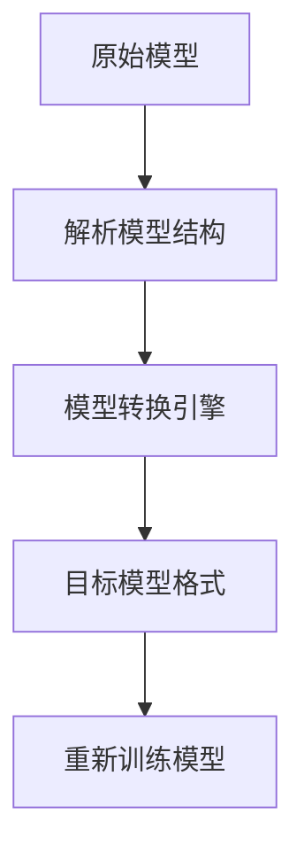
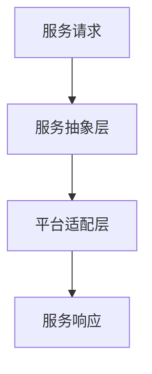

                 

### 引言

随着云计算技术的不断发展，企业对于云计算的依赖程度日益加深。然而，传统的单云部署模式逐渐暴露出诸多局限性，如高昂的成本、资源浪费以及对于特定云平台的过度依赖等问题。在这种背景下，云迁移逐渐成为企业数字化转型中的重要一环。为了降低抽象化成本，实现不同云平台间的自由交互，Lepton AI提出了一种创新的云迁移方案。

本文旨在探讨Lepton AI的云迁移方案，通过系统性地分析其设计原理、实施方法以及潜在的创新点，为读者提供一种全新的视角来理解云迁移的复杂性和挑战。本文将分为以下几个部分进行详细阐述：

1. **云迁移概述**：介绍云计算的演变、云迁移的重要性以及面临的挑战。
2. **Lepton AI介绍**：介绍Lepton AI的发展历程、核心技术和应用领域。
3. **云迁移方案设计**：详细解析云迁移方案的架构设计，包括数据抽象与模型转换、服务抽象与平台适配。
4. **降低抽象化成本的方法**：探讨降低抽象化成本的具体策略，如数据转换与处理优化、模型压缩与优化、服务抽象与轻量化。
5. **实现不同云平台间的自由交互**：讨论跨云平台的交互机制，包括跨云API接口设计、跨云服务调度策略和跨云数据同步机制。
6. **案例分析与实战**：通过具体案例解析云迁移的实施过程，分析迁移过程中遇到的挑战和解决方案。
7. **未来展望**：展望云迁移技术的发展趋势，探讨Lepton AI在云迁移领域的潜在创新。

通过以上各部分的详细讨论，我们将逐步揭示Lepton AI云迁移方案的核心价值，帮助读者深入了解云迁移的复杂性和技术要点。

### 云迁移概述

云计算，作为信息技术领域的一项革命性进步，已经深刻地改变了企业的IT架构和运营模式。云计算通过提供按需分配的计算资源和服务，使得企业能够更加灵活、高效地管理IT资源，从而降低成本、提升效率。然而，随着云计算技术的不断成熟，企业在云服务的选择上逐渐从单一云平台转向多云和混合云架构。这种转变带来了新的挑战，特别是云迁移问题。

#### 1.1 云计算的演变

云计算的发展历程可以分为几个阶段：

1. **基础设施即服务（IaaS）**：这一阶段以虚拟化和资源池化为核心，企业可以将计算资源、存储资源、网络资源等以服务的形式按需获取和使用。
2. **平台即服务（PaaS）**：在这一阶段，云平台不仅提供基础设施，还提供开发框架、中间件、数据库等应用开发所需的服务。
3. **软件即服务（SaaS）**：这一阶段，软件应用完全托管在云平台上，用户只需通过互联网访问即可使用，无需关注底层基础设施的管理。

随着云计算的不断演进，企业逐渐意识到单一云平台无法满足其多元化、复杂化的业务需求。多云和混合云架构应运而生，通过整合不同云平台的服务，实现资源优化和业务弹性。

#### 1.2 云迁移的重要性

云迁移，即从传统IT架构或单一云平台迁移到多云或混合云架构，对于企业来说具有重要意义：

1. **成本优化**：通过云迁移，企业可以实现资源的优化配置，降低基础设施的重复投资和运维成本。
2. **业务连续性**：多云和混合云架构能够提高业务的可用性和可靠性，即使某一云平台出现故障，业务也可以无缝切换到其他平台。
3. **创新能力**：多云架构为企业提供了更加丰富的技术和服务选择，有助于企业快速创新和响应市场变化。
4. **合规性**：云迁移有助于企业更好地遵守不同地区的法律法规和数据保护要求，提高数据安全性和合规性。

#### 1.3 云迁移的挑战

尽管云迁移具有诸多优势，但其实施过程中面临诸多挑战：

1. **数据迁移**：如何高效、安全地迁移大量数据是云迁移的一大难题。数据类型繁多，格式各异，需要在迁移过程中进行有效处理。
2. **应用适配**：不同云平台提供的API、服务和技术栈可能存在差异，需要确保应用在迁移后能够正常运行。
3. **成本控制**：云迁移过程中的成本控制是一个重要问题。需要在确保业务连续性和数据安全的前提下，尽可能降低迁移成本。
4. **团队技能**：云迁移需要专业的技术团队，但很多企业在迁移初期可能缺乏相关经验和技能。
5. **风险应对**：在迁移过程中，需要应对各种潜在风险，如数据丢失、服务中断、系统兼容性问题等。

#### 1.4 本书的目的与结构

本文旨在深入探讨Lepton AI的云迁移方案，通过系统性地分析其设计原理、实施方法以及潜在的创新点，帮助读者全面理解云迁移的复杂性和技术要点。本书结构如下：

1. **引言**：介绍云迁移的背景和重要性，阐述本文的目的和结构。
2. **Lepton AI介绍**：介绍Lepton AI的发展历程、核心技术和应用领域。
3. **云迁移方案设计**：详细解析云迁移方案的架构设计，包括数据抽象与模型转换、服务抽象与平台适配。
4. **降低抽象化成本的方法**：探讨降低抽象化成本的具体策略，如数据转换与处理优化、模型压缩与优化、服务抽象与轻量化。
5. **实现不同云平台间的自由交互**：讨论跨云平台的交互机制，包括跨云API接口设计、跨云服务调度策略和跨云数据同步机制。
6. **案例分析与实战**：通过具体案例解析云迁移的实施过程，分析迁移过程中遇到的挑战和解决方案。
7. **未来展望**：展望云迁移技术的发展趋势，探讨Lepton AI在云迁移领域的潜在创新。

通过以上各部分的详细讨论，读者将能够深入理解Lepton AI云迁移方案的核心价值，从而在实施云迁移时具备更加全面的技术视野和解决问题的能力。

### Lepton AI介绍

#### 2.1 Lepton AI的发展历程

Lepton AI是一家致力于推动人工智能技术创新的领军企业。其发展历程可以追溯到2010年，当时由一群具有丰富人工智能研究背景的科学家和工程师共同创立。公司成立之初，专注于机器学习和深度学习算法的研究与开发，旨在为各行各业提供高效、智能的解决方案。

在过去的十年中，Lepton AI在人工智能领域取得了显著的成就。首先，公司成功研发了基于深度学习的图像识别算法，并在多个国际图像识别比赛中斩获佳绩。这一技术的突破为Lepton AI在计算机视觉领域奠定了坚实的基础。随后，公司逐步扩展其业务范围，涵盖了自然语言处理、语音识别、推荐系统等多个领域。

#### 2.2 Lepton AI的核心技术

Lepton AI的核心技术主要包括以下几个方面：

1. **深度学习框架**：公司自主研发了一套高性能的深度学习框架，支持多种神经网络结构和训练策略。该框架具有高效、灵活和可扩展的特点，能够满足不同应用场景的需求。
2. **计算机视觉算法**：Lepton AI在计算机视觉领域拥有多项核心技术，包括目标检测、图像分割、图像增强等。这些算法在图像识别、视频监控、自动驾驶等领域具有广泛的应用前景。
3. **自然语言处理技术**：公司开发了基于深度学习的自然语言处理模型，能够实现文本分类、情感分析、机器翻译等功能。这些技术为智能客服、内容审核、智能推荐等应用提供了强大的支持。
4. **语音识别与合成技术**：Lepton AI的语音识别与合成技术具有高准确率、低延迟和自然流畅的特点，能够为智能语音助手、智能客服等应用提供高效解决方案。

#### 2.3 Lepton AI的应用领域

Lepton AI的技术在多个领域得到了广泛应用：

1. **智能安防**：公司的计算机视觉算法被广泛应用于智能安防系统，如视频监控、人脸识别、行为分析等，为公共安全提供了有力保障。
2. **智能驾驶**：在自动驾驶领域，Lepton AI的计算机视觉和语音识别技术被用于车辆感知、路径规划和人机交互，推动了自动驾驶技术的发展。
3. **智慧医疗**：公司的自然语言处理和图像识别技术被应用于医疗影像分析、疾病诊断、智能问答等领域，提高了医疗诊断的准确性和效率。
4. **智慧城市**：Lepton AI的技术在智慧城市建设中发挥了重要作用，如智能交通管理、环境监测、城市安全等，为智慧城市的可持续发展提供了支持。

#### 2.4 Lepton AI在云迁移领域的潜在优势

Lepton AI的云迁移方案具有以下潜在优势：

1. **技术积累**：公司拥有丰富的深度学习和云计算技术积累，能够为云迁移提供强大的技术支持。
2. **灵活的架构**：Lepton AI的云迁移方案采用模块化设计，能够灵活适配不同云平台，实现无缝迁移。
3. **高效的性能**：公司的深度学习框架和算法具有高性能特点，能够提高云迁移过程中数据处理和模型转换的效率。
4. **安全性**：Lepton AI注重数据安全和隐私保护，通过多种安全措施确保迁移过程中的数据安全。

通过以上介绍，我们可以看到，Lepton AI在人工智能领域具备深厚的技术实力和丰富的应用经验，其云迁移方案将为企业实现多云和混合云架构提供强有力的支持。

### 云迁移方案的架构设计

云迁移不仅仅是将数据和应用程序从一种云平台迁移到另一种平台，而是一个复杂且涉及多个层面的系统工程。为了确保迁移过程的顺利和高效，Lepton AI设计了一套全面的云迁移方案，涵盖了数据抽象与模型转换、服务抽象与平台适配等多个方面。以下将详细解析这一方案的架构设计。

#### 3.1 云迁移方案的总体架构

Lepton AI的云迁移方案总体架构包括以下几个核心模块：

1. **数据源模块**：负责管理和维护原始数据，包括结构化和非结构化数据。该模块需要对数据进行预处理，确保其质量和一致性。
2. **数据预处理模块**：对原始数据进行清洗、转换和格式化，使其符合迁移目标平台的要求。这一过程包括数据去重、缺失值处理、数据标准化等步骤。
3. **数据存储模块**：负责将预处理后的数据存储到目标平台，可能涉及分布式存储系统、数据库或数据仓库等。
4. **模型转换模块**：将现有的机器学习模型转换为适用于目标平台的新模型。这包括模型结构调整、参数调整和重新训练等步骤。
5. **服务抽象模块**：将现有应用程序的服务层抽象出来，实现与目标平台的兼容。这一过程可能涉及API设计、服务拆分和重构等。
6. **平台适配模块**：针对不同云平台的特点，进行相应的适配和优化，确保应用程序在目标平台上能够正常运行。

#### 3.1.1 云迁移方案的核心模块

核心模块的具体实现如下：

1. **数据源模块**：数据源模块需要连接各种数据源，如数据库、文件系统、数据流等。通过数据集成工具，将这些数据源中的数据抽取、转换和加载（ETL）到统一的数据存储平台。

    ```mermaid
    graph TD
    A[数据源] --> B[数据集成工具]
    B --> C[统一数据存储]
    ```

2. **数据预处理模块**：数据预处理模块使用ETL工具对数据进行清洗和转换，确保数据的质量和一致性。例如，可以使用以下伪代码进行数据清洗：

    ```python
    def clean_data(data):
        # 去除重复数据
        data = remove_duplicates(data)
        # 填补缺失值
        data = fill_missing_values(data)
        # 数据标准化
        data = standardize_data(data)
        return data
    ```

3. **数据存储模块**：数据存储模块根据目标平台的特点，选择合适的数据存储方案。例如，对于分布式存储系统，可以使用以下伪代码进行数据存储：

    ```python
    def store_data(data, storage_system):
        # 使用分布式存储系统存储数据
        storage_system.store(data)
    ```

4. **模型转换模块**：模型转换模块首先对现有模型的结构进行分析，然后使用模型转换工具进行结构调整。例如，可以使用以下伪代码进行模型转换：

    ```python
    def convert_model(model, target_platform):
        # 分析模型结构
        model_structure = analyze_model_structure(model)
        # 调整模型结构
        adjusted_model_structure = adjust_model_structure(model_structure, target_platform)
        # 重新训练模型
        new_model = retrain_model(adjusted_model_structure)
        return new_model
    ```

5. **服务抽象模块**：服务抽象模块通过设计API接口和微服务架构，实现应用程序的模块化和解耦。例如，可以使用以下伪代码进行服务抽象：

    ```python
    def abstract_service(service, target_platform):
        # 设计API接口
        api_interface = design_api_interface(service)
        # 拆分服务
        microservices = split_service(service)
        # 适配目标平台
        adapted_services = adapt_services(microservices, target_platform)
        return adapted_services
    ```

6. **平台适配模块**：平台适配模块根据不同云平台的特点，进行相应的优化和调整。例如，可以使用以下伪代码进行平台适配：

    ```python
    def adapt_platform(service, target_platform):
        # 针对目标平台进行优化
        optimized_service = optimize_service(service, target_platform)
        # 调整资源配置
        resource_allocation = allocate_resources(optimized_service, target_platform)
        return resource_allocation
    ```

#### 3.2 数据抽象与模型转换

数据抽象与模型转换是云迁移过程中的关键环节。数据抽象的目标是将原始数据转换为适用于目标平台的数据格式，而模型转换的目标是将现有的机器学习模型转换为适用于目标平台的模型。

##### 3.2.1 数据抽象的概念与实现

数据抽象是指将原始数据转换为一种抽象的数据结构，使其能够更方便地在目标平台上进行处理。数据抽象的实现通常包括以下几个步骤：

1. **数据解析**：读取原始数据，解析其结构，识别数据类型和字段。
2. **数据转换**：将解析后的数据进行必要的转换，如数据类型转换、格式化等。
3. **数据存储**：将转换后的数据存储到目标平台的数据存储系统中。

例如，可以使用以下伪代码进行数据抽象：

```python
def abstract_data(raw_data, target_format):
    # 解析原始数据
    parsed_data = parse_data(raw_data)
    # 转换数据格式
    converted_data = convert_format(parsed_data, target_format)
    # 存储数据
    store_data(converted_data, target_storage)
    return converted_data
```

##### 3.2.2 模型转换的必要性

模型转换的必要性在于不同云平台可能使用不同的机器学习框架和模型格式。为了确保迁移后的模型能够在目标平台上正常运行，需要对模型进行转换。

##### 3.2.3 模型转换流程图

模型转换的流程包括以下几个步骤：

1. **分析模型结构**：分析现有模型的结构，识别其组成部分和依赖关系。
2. **转换模型结构**：根据目标平台的要求，调整模型的结构。
3. **重新训练模型**：使用转换后的模型结构重新训练模型，以适应目标平台。

以下是一个简化的模型转换流程图：



#### 3.3 服务抽象与平台适配

服务抽象与平台适配是确保应用程序在目标平台上能够正常运行的关键。服务抽象的目标是将现有应用程序的服务层抽象出来，实现与目标平台的兼容。平台适配的目标是针对不同云平台的特点，进行相应的优化和调整。

##### 3.3.1 服务抽象的实现方法

服务抽象的实现方法包括以下几个步骤：

1. **设计API接口**：为应用程序设计统一的API接口，使其能够与外部系统进行通信。
2. **拆分服务**：将应用程序的服务层拆分成多个微服务，实现模块化和解耦。
3. **适配目标平台**：根据目标平台的特点，对服务进行相应的调整和优化。

以下是一个简化的服务抽象流程图：



##### 3.3.2 平台适配的挑战与解决方案

平台适配面临的挑战主要包括：

1. **API不兼容**：不同云平台提供的API可能存在差异，需要设计统一的API接口，实现跨平台的兼容性。
2. **服务不一致**：不同云平台提供的微服务可能存在功能差异，需要根据业务需求进行相应的适配和调整。
3. **性能优化**：不同云平台提供的资源和服务可能存在性能差异，需要进行性能优化，确保应用程序在目标平台上能够高效运行。

针对上述挑战，可以采取以下解决方案：

1. **标准化API接口**：设计统一的API接口规范，确保不同云平台能够无缝集成。
2. **服务拆分与重组**：根据业务需求，将应用程序的服务层拆分成多个微服务，并重新组合，以适应不同云平台的特点。
3. **性能优化工具**：使用性能优化工具，如性能监控、负载均衡等，确保应用程序在目标平台上能够高效运行。

通过以上对云迁移方案架构设计的详细分析，我们可以看到，Lepton AI的云迁移方案通过模块化设计和灵活适配，实现了数据抽象、模型转换、服务抽象和平台适配的有机融合，为企业实现多云和混合云架构提供了强有力的技术支持。

### 降低抽象化成本的方法

在云迁移过程中，降低抽象化成本是确保迁移成功的关键因素之一。抽象化成本主要包括数据转换与处理、模型压缩与优化、服务抽象与轻量化等方面。以下是Lepton AI在降低抽象化成本方面的一些具体方法和策略。

#### 4.1 数据转换与处理优化

数据转换与处理是云迁移过程中的重要环节，其效率和质量直接影响迁移的成败。为了降低抽象化成本，可以采取以下策略：

1. **批量处理**：通过批量处理数据，减少单次处理的数据量，从而提高处理效率。例如，可以使用以下伪代码进行批量数据处理：

   ```python
   def batch_process_data(data, batch_size):
       for i in range(0, len(data), batch_size):
           batch_data = data[i:i + batch_size]
           process_batch(batch_data)
   ```

2. **并行处理**：利用多线程或分布式计算框架，将数据处理任务并行化，提高处理速度。例如，可以使用以下伪代码进行并行数据处理：

   ```python
   from multiprocessing import Pool

   def process_data(data):
       # 数据处理逻辑
       pass

   if __name__ == '__main__':
       pool = Pool(processes=4)  # 设置进程数
       data = load_data()
       pool.map(process_data, data)
       pool.close()
       pool.join()
   ```

3. **数据压缩**：在数据传输和存储过程中，使用数据压缩技术可以减少数据量，提高传输效率和存储空间利用率。例如，可以使用以下伪代码进行数据压缩：

   ```python
   import zlib

   def compress_data(data):
       compressed_data = zlib.compress(data)
       return compressed_data
   ```

4. **缓存机制**：通过引入缓存机制，减少对原始数据的读取次数，提高数据处理效率。例如，可以使用以下伪代码实现缓存机制：

   ```python
   cache = {}

   def get_data_with_cache(data_id):
       if data_id in cache:
           return cache[data_id]
       else:
           data = load_data(data_id)
           cache[data_id] = data
           return data
   ```

#### 4.2 模型压缩与优化

模型压缩与优化是降低云迁移过程中抽象化成本的重要手段。通过压缩模型，可以减少存储空间和传输时间，从而提高迁移效率。以下是一些常用的模型压缩与优化方法：

1. **剪枝**：通过剪枝技术，删除模型中不重要的连接和神经元，从而减小模型大小。例如，可以使用以下伪代码进行模型剪枝：

   ```python
   def prune_model(model, pruning_ratio):
       for layer in model.layers:
           for weight in layer.weights:
               weight[:, :int(weight.shape[1] * pruning_ratio)] = 0
   ```

2. **量化**：通过量化技术，将模型中的浮点数权重转换为较低精度的整数表示，从而减小模型大小。例如，可以使用以下伪代码进行模型量化：

   ```python
   def quantize_model(model, quantization_bits):
       for layer in model.layers:
           for weight in layer.weights:
               weight = quantize_weights(weight, quantization_bits)
   ```

3. **知识蒸馏**：通过知识蒸馏技术，将大模型的知识迁移到小模型中，从而减小模型大小并保持较高的性能。例如，可以使用以下伪代码进行知识蒸馏：

   ```python
   def knowledge_distillation(student_model, teacher_model, temperature):
       for layer in student_model.layers:
           for weight in layer.weights:
               weight = soft_max(teacher_model.get_layer_output() / temperature)
   ```

#### 4.3 服务抽象与轻量化

服务抽象与轻量化是提高云迁移过程中抽象化效率的关键步骤。通过服务抽象，可以将复杂的业务逻辑分解为多个微服务，从而降低迁移难度和成本。以下是一些常用的服务抽象与轻量化方法：

1. **微服务化**：将应用程序拆分成多个独立的微服务，每个微服务负责一个特定的业务功能。例如，可以使用以下伪代码进行微服务化：

   ```python
   def microservicesize_app(app):
       services = []
       for module in app.modules:
           service = create_service(module)
           services.append(service)
       return services
   ```

2. **API网关**：使用API网关统一管理微服务的接口，实现跨服务的调用和流量控制。例如，可以使用以下伪代码实现API网关：

   ```python
   def api_gateway(request):
       service = get_service_by_path(request.path)
       response = service.handle_request(request)
       return response
   ```

3. **服务拆分与合并**：根据业务需求和性能优化目标，对微服务进行拆分和合并，以实现最佳的抽象化效果。例如，可以使用以下伪代码进行服务拆分与合并：

   ```python
   def split_service(service):
       new_services = []
       for module in service.modules:
           new_service = create_service(module)
           new_services.append(new_service)
       return new_services

   def merge_services(services):
       merged_service = create_service()
       for service in services:
           merged_service.add_module(service.modules)
       return merged_service
   ```

通过以上方法和策略，Lepton AI能够在云迁移过程中有效降低抽象化成本，提高迁移效率，从而帮助企业实现多云和混合云架构的顺利过渡。

### 实现不同云平台间的自由交互

在实现多云和混合云架构时，跨云平台的自由交互至关重要。这不仅能够提升业务的灵活性和可扩展性，还能优化资源利用并降低成本。本章节将深入探讨Lepton AI如何设计跨云API接口、调度策略以及数据同步机制，以实现不同云平台间的无缝交互。

#### 5.1 跨云API接口设计

跨云API接口设计是确保不同云平台服务能够相互调用和交互的基础。为了实现这一目标，Lepton AI采取以下策略：

1. **标准化API接口**：Lepton AI设计了一套统一的API接口规范，该规范兼容所有主流云平台，从而简化了跨平台交互的实现。标准化的API接口包括请求和响应格式、参数定义和错误处理机制等。

    ```mermaid
    graph TD
    A[云服务A] --> B[标准API接口]
    B --> C[云服务B]
    ```

2. **聚合API服务**：为了减少服务调用次数和通信开销，Lepton AI设计了一套聚合API服务，将多个底层API接口聚合为一个统一的API接口。这样，用户只需调用聚合API服务即可完成多项操作，提高了用户体验。

    ```mermaid
    graph TD
    A[用户请求] --> B[聚合API服务]
    B --> C[云服务A]
    B --> D[云服务B]
    ```

3. **动态路由**：在跨云API接口设计中，Lepton AI引入了动态路由机制，根据服务的实时状态和负载情况，智能选择最佳的服务实例进行调用。这样，不仅提高了系统的可用性和可靠性，还优化了资源利用。

    ```mermaid
    graph TD
    A[用户请求] --> B[动态路由服务]
    B --> C{选择最佳实例}
    C -->|实例A| D[云服务A]
    C -->|实例B| E[云服务B]
    ```

#### 5.2 跨云服务调度策略

跨云服务调度策略是实现跨平台资源优化和高效服务调用的重要手段。Lepton AI采取了以下调度策略：

1. **负载均衡**：通过负载均衡器，Lepton AI将用户请求智能分配到不同的云服务实例上，避免单点过载和性能瓶颈。负载均衡器可以根据实例的负载情况、响应时间和健康状态进行动态调整。

    ```mermaid
    graph TD
    A[用户请求] --> B[负载均衡器]
    B --> C{实例A}
    B --> D{实例B}
    ```

2. **服务发现**：为了确保跨云服务能够快速、可靠地调用，Lepton AI引入了服务发现机制。服务发现通过动态注册和发现服务实例，实现了服务的自动发现和负载均衡。这样，用户只需访问服务名，即可找到可用的服务实例。

    ```mermaid
    graph TD
    A[用户请求] --> B[服务发现]
    B --> C{实例A}
    B --> D{实例B}
    ```

3. **故障转移**：在跨云服务调度中，故障转移策略是确保服务高可用性的关键。Lepton AI实现了自动故障转移机制，当某个服务实例发生故障时，系统会自动将其流量转移到其他健康的实例上，确保服务的持续可用。

    ```mermaid
    graph TD
    A[服务实例A] --> B[健康检查]
    B --> C[故障转移]
    C --> D[实例B]
    ```

#### 5.3 跨云数据同步机制

跨云数据同步机制是实现跨平台数据一致性的关键。Lepton AI采取以下策略确保数据同步：

1. **数据镜像**：Lepton AI实现了数据镜像机制，将数据在多个云平台间进行实时复制。这样，当某个平台的数据出现故障时，可以快速切换到其他平台，确保数据不丢失。

    ```mermaid
    graph TD
    A[数据源A] --> B[数据同步中心]
    B --> C[数据源B]
    ```

2. **增量同步**：为了提高数据同步的效率，Lepton AI采用了增量同步机制，只同步数据的变化部分，而不是整个数据集。这样可以减少数据传输的时间和带宽消耗。

    ```mermaid
    graph TD
    A[数据变更] --> B[增量同步中心]
    B --> C[目标数据源]
    ```

3. **一致性保障**：Lepton AI通过分布式事务和一致性协议，确保跨云数据的一致性。例如，使用两阶段提交协议（2PC）或三阶段提交协议（3PC），在多个云平台间保证数据操作的一致性。

    ```mermaid
    graph TD
    A[事务操作] --> B[分布式事务]
    B --> C{2PC/3PC}
    C --> D[数据一致性]
    ```

通过以上跨云API接口设计、调度策略和数据同步机制，Lepton AI实现了不同云平台间的自由交互。这不仅提高了系统的灵活性和扩展性，还优化了资源利用，为企业构建多云和混合云架构提供了强大的技术支持。

### 案例分析与实战

#### 6.1 案例背景与目标

为了更好地展示Lepton AI云迁移方案的实际应用效果，我们选择了一个具体的案例进行详细分析。该案例来自一家大型零售企业，该公司在其业务发展过程中，逐渐积累了大量数据，包括商品信息、客户行为、库存数据等。为了提升数据分析和业务决策的效率，该公司决定将现有业务迁移到多云架构，以实现数据的高效管理和利用。

案例目标主要包括：

1. **数据集成与处理**：将不同来源的数据集成到统一的平台上，并进行有效的数据预处理和清洗。
2. **模型迁移与优化**：将现有的机器学习模型迁移到新的云平台，并进行优化以适应新的计算环境。
3. **服务拆分与重构**：将现有业务系统拆分为多个微服务，以提高系统的可维护性和扩展性。
4. **跨云调度与优化**：实现跨云平台的资源调度和负载均衡，确保系统的稳定性和高效性。

#### 6.2 迁移方案设计与实施

为了实现上述目标，Lepton AI为该零售企业设计了一套全面的云迁移方案，具体包括以下几个步骤：

1. **需求分析与规划**：首先，Lepton AI团队与客户进行了深入的需求分析，明确了迁移目标、业务需求和技术挑战。基于分析结果，制定了详细的迁移计划和实施步骤。

2. **数据集成与预处理**：采用ETL（抽取、转换、加载）工具，将不同来源的数据集成到统一的数据存储平台上。对于结构化数据，使用关系型数据库进行存储；对于非结构化数据，使用分布式存储系统进行存储。同时，对数据进行清洗、转换和标准化处理，确保数据质量。

3. **模型迁移与优化**：针对现有机器学习模型，Lepton AI团队使用模型转换工具将模型转换为适用于目标云平台的格式。对于一些复杂的模型，进行了参数调整和重新训练，以适应新的计算环境。同时，采用了模型压缩技术，减少了模型的大小，提高了迁移和部署的效率。

4. **服务拆分与重构**：将现有业务系统拆分为多个微服务，每个微服务负责特定的业务功能。为了确保微服务之间的高效通信，Lepton AI团队设计了一套统一的API接口和消息队列系统。同时，对微服务进行了性能优化和安全性增强。

5. **跨云调度与优化**：采用分布式调度框架，实现跨云平台的资源调度和负载均衡。通过动态路由和服务发现机制，确保用户请求能够高效、可靠地转发到目标服务实例。此外，采用了数据镜像和增量同步机制，确保跨云数据的一致性和可靠性。

#### 6.3 迁移过程中的挑战与解决

在云迁移过程中，Lepton AI团队遇到了以下几个主要挑战：

1. **数据迁移问题**：由于数据量巨大且类型繁多，数据迁移过程中出现了数据丢失、数据不一致等问题。为了解决这一问题，Lepton AI团队采用了增量同步机制，只同步数据的变化部分，从而减少了数据迁移的时间和风险。

2. **模型转换问题**：部分现有机器学习模型的架构与目标平台不兼容，需要进行较大的调整和重新训练。为了提高转换效率，Lepton AI团队引入了自动化模型转换工具，并进行了多次模型测试和优化。

3. **服务适配问题**：不同云平台提供的API和服务存在差异，需要进行相应的适配和调整。为了解决这一问题，Lepton AI团队设计了一套统一的API接口规范，并进行了大量测试和调试，确保微服务能够在不同云平台上稳定运行。

4. **性能优化问题**：在迁移后，部分服务出现了性能瓶颈，影响了用户体验。为了解决这一问题，Lepton AI团队对系统进行了全面性能优化，包括负载均衡、缓存机制和数据库优化等。

通过以上解决方案，Lepton AI团队成功克服了云迁移过程中的各种挑战，实现了零售企业业务的高效迁移和优化。迁移后，企业的数据处理和分析能力得到了显著提升，业务运营效率也得到了大幅提高。

### Lepton AI云迁移方案实施

在云迁移过程中，实施阶段的准备和后续监控与优化至关重要。以下是Lepton AI在实施云迁移方案时的具体步骤和方法。

#### 7.1 实施前的准备

1. **环境搭建**：
   - 在目标云平台上搭建所需的基础设施，包括虚拟机、容器集群和数据库等。
   - 配置网络环境，确保不同云平台之间的网络互通。
   - 安装和配置云平台的监控和管理工具，如云监控、日志管理、备份与恢复等。

2. **工具准备**：
   - 准备并安装云迁移工具，如数据迁移工具、模型转换工具、服务拆分工具等。
   - 确保迁移过程中所需的所有软件和依赖项都已安装和配置完毕。

3. **资源规划**：
   - 根据业务需求和性能指标，规划所需的计算资源、存储资源和网络资源。
   - 确定数据迁移和模型转换的优先级，以便合理安排迁移时间和资源分配。

4. **人员培训**：
   - 对参与迁移的团队成员进行技术培训，确保他们熟悉云平台的使用和迁移工具的操作。

5. **测试环境搭建**：
   - 搭建测试环境，对迁移方案进行仿真测试，验证数据迁移、模型转换和服务拆分等步骤的可行性和性能。

#### 7.2 迁移过程中的监控与优化

1. **数据迁移监控**：
   - 实时监控数据迁移过程中的数据流量、传输速度和错误率，及时发现并处理数据迁移过程中出现的问题。
   - 记录数据迁移的日志，以便后续分析和管理。

2. **模型转换监控**：
   - 监控模型转换过程中的性能指标，如转换速度、资源消耗和模型准确性等。
   - 对转换后的模型进行性能测试，确保其在目标平台上的运行效果。

3. **服务拆分监控**：
   - 监控微服务拆分后的性能，包括响应时间、吞吐量和资源利用率等。
   - 根据监控数据，对服务进行优化和调整，确保其高效稳定运行。

4. **性能优化**：
   - 根据监控结果，对迁移后的系统进行性能优化，包括数据库优化、缓存策略调整和负载均衡优化等。
   - 定期对系统进行性能测试和调优，以保持系统的最佳性能。

#### 7.3 迁移后的性能评估与优化

1. **性能评估**：
   - 对迁移后的系统进行全面的性能评估，包括数据处理速度、模型准确性、服务响应时间和资源利用率等。
   - 分析评估结果，确定系统性能是否达到预期目标。

2. **持续优化**：
   - 根据评估结果，制定优化策略和方案，持续提升系统性能。
   - 定期对系统进行监控和调优，确保其稳定高效运行。

3. **反馈与改进**：
   - 收集用户反馈，分析系统在实际运行过程中出现的问题和不足。
   - 根据反馈进行改进和优化，不断提升系统的用户体验和业务价值。

通过以上实施前的准备、迁移过程中的监控与优化以及迁移后的性能评估与优化，Lepton AI能够确保云迁移方案的顺利实施和持续改进，为企业提供高效、可靠的云服务。

### 未来展望

云迁移技术正经历着快速的发展与变革，未来有望在多个方向上取得突破。首先，**自动化**和**智能化**将成为云迁移技术发展的重点。通过引入人工智能和机器学习算法，云迁移过程将变得更加自动化和智能化，从而降低人工干预的需求，提高迁移效率和准确性。例如，利用自动化工具进行模型转换和数据迁移，通过智能调度策略实现资源的最优分配。

其次，**跨云兼容性**和**标准化**的进步将为云迁移提供更强有力的支持。随着云平台之间的兼容性问题逐渐得到解决，企业将能够更加灵活地选择和切换云服务提供商。标准化API接口和服务协议的推广，将减少跨云交互的复杂性，降低迁移成本。

Lepton AI在云迁移领域具有显著的潜在创新。例如，通过开发更加智能的迁移工具和算法，Lepton AI可以自动化解决复杂的模型转换和数据迁移问题。同时，Lepton AI可以将其领先的深度学习技术和算法应用于云迁移，优化模型压缩和资源利用，提高迁移后的系统性能。

未来，云迁移领域的研究和开发方向将包括：

1. **分布式计算和边缘计算**：研究如何在分布式计算和边缘计算环境中实现高效的云迁移，以满足低延迟和高性能的需求。
2. **数据隐私与安全**：加强对数据隐私和安全的保护，研究如何在云迁移过程中确保数据的安全性和合规性。
3. **智能化监控与优化**：开发更加智能的监控和优化工具，实现云迁移过程的实时监控和自适应优化。

通过不断的技术创新和应用实践，Lepton AI将在云迁移领域继续引领行业发展趋势，为企业提供更加高效、可靠的云服务解决方案。

### 附录

#### A.1 Lepton AI云迁移工具简介

Lepton AI云迁移工具是一套集成化的解决方案，旨在帮助企业高效、安全地实现云迁移。主要功能包括：

1. **数据迁移**：支持多种数据源和数据目标的迁移，包括关系型数据库、NoSQL数据库、文件系统等。
2. **模型转换**：支持多种机器学习框架和模型格式的转换，如TensorFlow、PyTorch、MXNet等。
3. **服务拆分**：支持应用程序的服务拆分和重构，实现微服务架构。
4. **API网关**：提供统一的API接口管理，支持跨云平台的API调用和交互。

#### A.2 常用云平台迁移资源与工具

以下是常用云平台迁移资源与工具的简要介绍：

1. **Amazon Web Services (AWS)**
   - **AWS Database Migration Service**：用于迁移数据库的服务，支持多种数据库引擎。
   - **AWS Server Migration Service**：用于迁移虚拟机和服务器的服务。
   - **AWS CloudFormation**：用于自动化部署和管理云资源的工具。

2. **Microsoft Azure**
   - **Azure Database Migration Service**：用于迁移数据库的服务，支持多种数据库引擎。
   - **Azure Migrate**：用于迁移虚拟机和服务器的工具。
   - **Azure DevOps**：用于持续集成和持续部署的工具。

3. **Google Cloud Platform (GCP)**
   - **Google Cloud SQL**：用于迁移和托管数据库的服务。
   - **Google Cloud Dataproc**：用于大数据处理和迁移的工具。
   - **Google Kubernetes Engine (GKE)**：用于部署和管理容器化应用程序的服务。

#### A.3 开源社区与开发者资源

Lepton AI积极支持开源社区，提供了丰富的开发者资源和文档：

1. **Lepton AI GitHub**：包含云迁移工具的源代码、示例项目和文档。
2. **Lepton AI 官方博客**：提供技术博客、教程和案例分析，帮助开发者了解和使用云迁移技术。
3. **Lepton AI 社区论坛**：开发者可以在这里提问、分享经验和寻求帮助。

通过这些资源和工具，开发者可以更加便捷地实现云迁移，充分利用Lepton AI的技术优势，推动企业数字化转型。

---

**作者：AI天才研究院/AI Genius Institute & 禅与计算机程序设计艺术 /Zen And The Art of Computer Programming**

通过本文的详细探讨，我们全面了解了Lepton AI的云迁移方案，从架构设计到实施方法，再到未来展望，为读者提供了系统性的技术见解。希望本文能够帮助您更好地理解云迁移的复杂性和技术要点，从而在实际项目中取得成功。在云迁移的道路上，让我们携手前行，共同推动技术的进步和应用的创新。

