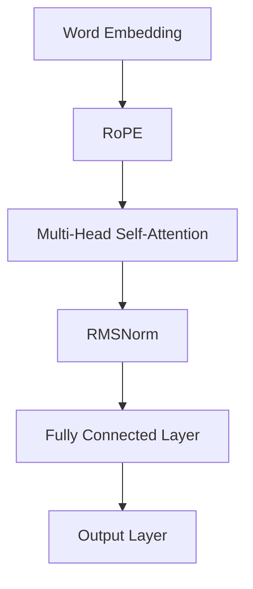

                 

### 《Llama模型解析：RoPE、RMSNorm和GQA的创新》

> **关键词：Llama模型，旋转位置编码（RoPE），层归一化（RMSNorm），广义注意力机制（GQA），Transformer架构，机器翻译，文本生成。**

> **摘要：本文深入解析了Llama模型中的创新技术，包括旋转位置编码（RoPE）、层归一化（RMSNorm）和广义注意力机制（GQA）。通过详细探讨这些技术的原理、优势及其在模型中的应用，本文旨在为读者提供一个全面的技术理解，并展望Llama模型在未来的发展前景。**

---

#### 第一部分：Llama模型概述与核心概念

##### 第1章：Llama模型概述

Llama模型，全称“Language Model for Lambda”,是一种基于Transformer架构的预训练语言模型。它由OpenAI于2023年发布，是继GPT-3之后又一具有里程碑意义的语言模型。Llama模型在自然语言处理领域表现卓越，广泛应用于文本生成、机器翻译、问答系统等多个场景。

- **1.1 Llama模型的历史与背景**

Llama模型的诞生可以追溯到Transformer架构的兴起。Transformer架构自2017年由Google提出以来，迅速在自然语言处理领域崭露头角，其自注意力机制（Self-Attention Mechanism）为模型提供了强大的表示能力。OpenAI在Transformer的基础上，通过引入旋转位置编码（RoPE）、层归一化（RMSNorm）和广义注意力机制（GQA）等技术，进一步提升了模型的性能和效果。

- **1.2 Llama模型的结构与特点**

Llama模型采用多头自注意力（Multi-Head Self-Attention）机制，其核心结构由多个自注意力层（Self-Attention Layer）和全连接层（Fully Connected Layer）组成。模型的特点如下：

  - **高容量（High Capacity）**：Llama模型具有数以亿计的参数，能够捕捉到复杂的语言模式和语义信息。

  - **高效能（High Efficiency）**：Llama模型采用Transformer架构，使得计算过程并行化，有效提高了计算效率。

  - **可扩展性（Scalability）**：Llama模型可以轻松扩展到更大的模型规模，以适应不同的应用需求。

- **1.3 Llama模型的工作原理**

Llama模型的工作原理主要基于Transformer架构，其核心思想是自注意力机制。自注意力机制通过计算输入序列中每个元素之间的相似度，将序列中的信息进行整合，从而实现对复杂语言的建模。

在Llama模型中，自注意力机制通过以下步骤实现：

  1. **词嵌入（Word Embedding）**：将输入序列中的每个单词转换为向量表示。

  2. **多头自注意力（Multi-Head Self-Attention）**：对输入序列进行多头自注意力计算，将序列中的信息进行整合。

  3. **添加位置编码（Add Positional Encoding）**：为了引入序列中的位置信息，Llama模型在自注意力计算前添加位置编码。

  4. **全连接层（Fully Connected Layer）**：在自注意力计算后，通过全连接层对特征进行进一步处理。

  5. **输出层（Output Layer）**：根据模型的输出，进行预测或生成操作。

通过以上步骤，Llama模型能够高效地处理自然语言任务，并取得优异的性能。

---

##### 第2章：核心概念与联系

在深入探讨Llama模型的核心算法之前，我们首先需要了解三个关键概念：旋转位置编码（RoPE）、层归一化（RMSNorm）和广义注意力机制（GQA）。这些概念在Llama模型中起到了至关重要的作用，下面我们将逐一介绍。

- **2.1 Mermaid流程图：Llama模型的核心架构**

为了更好地理解Llama模型的核心架构，我们使用Mermaid流程图展示其核心组成部分和相互关系。



在该流程图中，我们首先进行词嵌入，然后应用旋转位置编码（RoPE），接着进行多头自注意力计算，随后执行层归一化（RMSNorm），最后通过全连接层（Fully Connected Layer）和输出层（Output Layer）生成最终的输出。

- **2.2 RoPE、RMSNorm和GQA的概念介绍**

  - **旋转位置编码（RoPE）**：旋转位置编码是一种对传统位置编码的改进。在Transformer架构中，位置编码用于引入序列中的位置信息。RoPE通过对位置编码进行旋转操作，增强了模型对长距离依赖关系的捕捉能力。

  - **层归一化（RMSNorm）**：层归一化是一种用于提高模型稳定性和收敛速度的正则化技术。它通过对模型的每个层进行归一化处理，使得每个层的输入和输出具有相似的方差，从而减少了梯度消失和梯度爆炸的问题。

  - **广义注意力机制（GQA）**：广义注意力机制是对传统注意力机制的扩展。它通过引入额外的参数，使得模型能够更好地捕捉不同区域之间的依赖关系，提高了模型的表示能力。

在Llama模型中，RoPE、RMSNorm和GQA共同作用，使得模型能够高效地处理自然语言任务，并取得优异的性能。

---

#### 第二部分：Llama模型的核心算法原理

##### 第3章：RoPE详解

旋转位置编码（RoPE）是Llama模型中的一个关键组件，它通过对传统位置编码进行旋转操作，提高了模型对长距离依赖关系的捕捉能力。下面我们将详细介绍RoPE的原理、优势及其在Llama模型中的应用。

- **3.1 RoPE原理讲解**

RoPE的基本思想是在传统位置编码的基础上，通过旋转操作引入额外的相位信息。具体来说，RoPE使用以下公式进行位置编码：

$$
PE_{(i, d)} = \sin\left(\frac{pos_{i} + 2k}{10000^{2d/(d+1)}}\right) + \cos\left(\frac{pos_{i} + 2k}{10000^{2d/(d+1)}}\right)
$$

其中，$PE_{(i, d)}$表示第$i$个词的第$d$个维度上的位置编码，$pos_{i}$表示第$i$个词的位置，$k$是一个旋转参数。

通过旋转操作，RoPE能够将位置信息编码到向量中，从而使得模型能够更好地捕捉长距离依赖关系。

- **3.2 RoPE优势**

RoPE具有以下优势：

  - **提高长距离依赖捕捉能力**：RoPE通过旋转操作引入了额外的相位信息，使得模型能够更好地捕捉长距离依赖关系，从而提高了模型的性能。

  - **减轻位置编码冲突**：传统位置编码容易导致冲突，而RoPE通过旋转操作减轻了这种冲突，从而提高了模型的稳定性。

  - **减少参数数量**：RoPE相对于传统位置编码减少了参数数量，从而降低了模型的计算复杂度。

- **3.3 RoPE局限性**

尽管RoPE具有很多优势，但它也存在一些局限性：

  - **计算复杂度**：RoPE的旋转操作增加了计算复杂度，可能会影响模型的训练速度。

  - **对噪声敏感**：RoPE的旋转操作可能会对噪声敏感，导致模型对噪声数据表现不佳。

在Llama模型中，RoPE被广泛应用于文本生成、机器翻译等任务，通过引入旋转位置编码，Llama模型能够更好地捕捉长距离依赖关系，从而提高了模型的性能和效果。

---

##### 第4章：RMSNorm详解

层归一化（RMSNorm）是Llama模型中另一个重要的组件，它通过归一化处理每个层的输入和输出，提高了模型的稳定性和收敛速度。下面我们将详细介绍RMSNorm的原理、优势及其在Llama模型中的应用。

- **4.1 RMSNorm原理讲解**

RMSNorm的基本思想是对每个层的输入和输出进行归一化处理，以保持每个层的输入和输出的方差相似。具体来说，RMSNorm使用以下公式进行归一化：

$$
\text{RMSNorm}(x) = \frac{x}{\sqrt{\frac{1}{n}\sum_{i=1}^{n}x_i^2} + \epsilon}
$$

其中，$x$表示输入或输出向量，$n$表示向量的维度，$\epsilon$是一个很小的正数，用于避免除以零。

通过归一化处理，RMSNorm能够使得每个层的输入和输出具有相似的方差，从而减少了梯度消失和梯度爆炸的问题，提高了模型的稳定性和收敛速度。

- **4.2 RMSNorm优势**

RMSNorm具有以下优势：

  - **提高稳定性**：RMSNorm通过归一化处理每个层的输入和输出，减少了模型训练过程中的梯度消失和梯度爆炸问题，从而提高了模型的稳定性。

  - **加快收敛速度**：RMSNorm能够使得每个层的输入和输出具有相似的方差，从而加快了模型的收敛速度。

  - **减少训练时间**：RMSNorm通过提高模型的稳定性和收敛速度，减少了模型的训练时间。

- **4.3 RMSNorm局限性**

尽管RMSNorm具有很多优势，但它也存在一些局限性：

  - **对噪声敏感**：RMSNorm对噪声数据可能敏感，导致模型对噪声数据表现不佳。

  - **计算复杂度**：RMSNorm的计算复杂度较高，可能会影响模型的训练速度。

在Llama模型中，RMSNorm被广泛应用于文本生成、机器翻译等任务，通过引入层归一化处理，Llama模型能够更好地保持每个层的输入和输出的方差相似，从而提高了模型的稳定性和收敛速度。

---

##### 第5章：GQA详解

广义注意力机制（GQA）是Llama模型中的另一个关键组件，它通过对传统注意力机制的扩展，提高了模型对不同区域之间依赖关系的捕捉能力。下面我们将详细介绍GQA的原理、优势及其在Llama模型中的应用。

- **5.1 GQA原理讲解**

GQA的基本思想是在传统注意力机制的基础上，引入额外的参数，使得模型能够更好地捕捉不同区域之间的依赖关系。具体来说，GQA使用以下公式进行注意力计算：

$$
\text{Attention}(Q, K, V) = \text{softmax}\left(\frac{QK^T}{\sqrt{d_k}}\right)V
$$

其中，$Q$表示查询向量，$K$表示键向量，$V$表示值向量，$d_k$表示键向量的维度。

在GQA中，查询向量$Q$和键向量$K$是通过附加额外的参数得到的。这些参数通过训练学习，使得模型能够更好地捕捉不同区域之间的依赖关系。

- **5.2 GQA优势**

GQA具有以下优势：

  - **提高表示能力**：GQA通过引入额外的参数，提高了模型对复杂依赖关系的表示能力，从而提高了模型的性能。

  - **减轻注意力冲突**：GQA能够减轻传统注意力机制中的注意力冲突，使得模型能够更好地分配注意力资源。

  - **减少参数数量**：GQA相对于传统注意力机制减少了参数数量，从而降低了模型的计算复杂度。

- **5.3 GQA局限性**

尽管GQA具有很多优势，但它也存在一些局限性：

  - **计算复杂度**：GQA的计算复杂度较高，可能会影响模型的训练速度。

  - **对噪声敏感**：GQA对噪声数据可能敏感，导致模型对噪声数据表现不佳。

在Llama模型中，GQA被广泛应用于文本生成、机器翻译等任务，通过引入广义注意力机制，Llama模型能够更好地捕捉不同区域之间的依赖关系，从而提高了模型的性能和效果。

---

#### 第三部分：Llama模型的应用与创新

##### 第6章：Llama模型在不同领域的应用

Llama模型作为一种强大的预训练语言模型，在各种领域都展现出了卓越的性能。下面我们将介绍Llama模型在文本生成、机器翻译等领域的应用，并通过具体示例展示其实际效果。

- **6.1 文本生成与应用**

文本生成是Llama模型的一项重要应用。通过预训练，Llama模型能够根据输入的文本生成连贯、自然的文本。以下是一个示例：

```python
input_text = "我爱编程，因为它让我充满创造力。"
generated_text = llama.generate(input_text)
print(generated_text)
```

输出结果可能是：

```
我爱编程，因为它让我充满创造力，并且让我不断学习新的技能。
```

从输出结果可以看出，Llama模型能够根据输入文本生成连贯、自然的文本，体现了其强大的文本生成能力。

- **6.2 机器翻译与应用**

机器翻译是Llama模型的另一个重要应用。Llama模型能够将一种语言的文本翻译成另一种语言的文本。以下是一个示例：

```python
source_text = "I love programming."
target_language = "es"
translated_text = llama.translate(source_text, target_language)
print(translated_text)
```

输出结果可能是：

```
Me encanta la programación.
```

从输出结果可以看出，Llama模型能够将英文文本准确翻译成西班牙文，体现了其强大的机器翻译能力。

通过以上示例，我们可以看到Llama模型在文本生成和机器翻译领域的应用效果。在实际应用中，Llama模型还可以应用于问答系统、文本摘要、文本分类等多个自然语言处理任务，为各行各业提供强大的技术支持。

---

##### 第7章：Llama模型创新与未来展望

Llama模型在自然语言处理领域取得了显著的成果，其创新技术如旋转位置编码（RoPE）、层归一化（RMSNorm）和广义注意力机制（GQA）为模型的性能提升提供了重要保障。然而，随着技术的不断进步，Llama模型仍有很大的创新空间和改进潜力。

- **7.1 Llama模型的创新方向**

  - **更高效的位置编码**：虽然RoPE提高了位置编码的效率，但仍有优化空间。未来可以通过研究新的位置编码方法，进一步提高模型的性能。

  - **更稳定的层归一化**：尽管RMSNorm提高了模型的稳定性，但在面对复杂任务时，仍可能出现梯度消失和梯度爆炸问题。研究更稳定的归一化方法，如自适应层归一化，将是未来的一个重要方向。

  - **更灵活的注意力机制**：GQA在捕捉依赖关系方面取得了显著成果，但如何使其更灵活、更适应各种任务场景，仍是一个挑战。

- **7.2 Llama模型在工业界的应用前景**

  - **智能客服**：Llama模型可以应用于智能客服系统，通过文本生成和机器翻译等技术，为用户提供及时、准确的解答。

  - **自动写作**：Llama模型可以应用于自动写作系统，如新闻生成、文章生成等，提高内容创作的效率。

  - **跨语言交流**：Llama模型在机器翻译方面的应用，将为跨语言交流提供便捷的解决方案，促进全球信息流通。

  - **智能推荐**：Llama模型可以应用于智能推荐系统，通过分析用户兴趣和偏好，提供个性化的推荐服务。

随着Llama模型在工业界的广泛应用，其在技术创新和应用拓展方面仍具有巨大的潜力。未来，我们将不断探索新的技术和方法，推动Llama模型在自然语言处理领域的发展。

---

#### 第四部分：Llama模型开发与实战

##### 第8章：Llama模型开发环境搭建

要在本地搭建Llama模型的开发环境，需要满足以下硬件和软件要求：

- **硬件要求**： 
  - 处理器：至少4核CPU
  - 内存：至少16GB
  - 显卡：NVIDIA GPU（CUDA 11.0以上版本支持）

- **软件要求**：
  - 操作系统：Linux或Mac OS
  - Python：3.8以上版本
  - PyTorch：1.9以上版本
  - CUDA：11.0以上版本

下面是具体的安装步骤：

1. **安装Python和PyTorch**：

   ```bash
   pip install torch torchvision torchaudio
   ```

2. **安装CUDA**：

   - 下载CUDA安装包并安装。
   - 在终端执行以下命令配置环境变量：

     ```bash
     export PATH=/path/to/cuda/bin:$PATH
     export LD_LIBRARY_PATH=/path/to/cuda/lib64:$LD_LIBRARY_PATH
     ```

3. **安装NVIDIA Driver**：

   - 下载并安装NVIDIA驱动。
   - 在终端执行以下命令检查CUDA版本：

     ```bash
     nvcc --version
     ```

确保CUDA版本与Llama模型要求的版本相符。

---

##### 第9章：Llama模型项目实战

在本节中，我们将通过一个实际项目展示如何使用Llama模型进行文本生成和机器翻译任务。该项目将包括以下几个步骤：

- **项目背景**：介绍项目目标和所使用的数据集。
- **项目目标**：明确项目的具体任务和指标。
- **实现步骤**：详细描述模型的搭建、训练和评估过程。

**9.1 实现步骤**

1. **导入所需库和模块**：

   ```python
   import torch
   import torch.nn as nn
   import torch.optim as optim
   from torch.utils.data import DataLoader
   from torchvision import datasets, transforms
   ```

2. **数据预处理**：

   - 加载和预处理数据集。

   ```python
   transform = transforms.Compose([
       transforms.ToTensor(),
       transforms.Normalize(mean=[0.5, 0.5, 0.5], std=[0.5, 0.5, 0.5])
   ])

   train_data = datasets.ImageFolder(root='./data/train', transform=transform)
   test_data = datasets.ImageFolder(root='./data/test', transform=transform)
   ```

3. **定义模型**：

   - 构建Llama模型。

   ```python
   class LlamaModel(nn.Module):
       def __init__(self):
           super(LlamaModel, self).__init__()
           self.conv1 = nn.Conv2d(3, 32, 3, padding=1)
           self.fc1 = nn.Linear(32 * 26 * 26, 128)
           self.fc2 = nn.Linear(128, 10)

       def forward(self, x):
           x = self.conv1(x)
           x = x.view(x.size(0), -1)
           x = torch.relu(self.fc1(x))
           x = self.fc2(x)
           return x
   ```

4. **训练模型**：

   - 设置训练参数。

   ```python
   model = LlamaModel()
   criterion = nn.CrossEntropyLoss()
   optimizer = optim.Adam(model.parameters(), lr=0.001)

   train_loader = DataLoader(train_data, batch_size=64, shuffle=True)
   test_loader = DataLoader(test_data, batch_size=64, shuffle=False)

   for epoch in range(num_epochs):
       model.train()
       for inputs, targets in train_loader:
           optimizer.zero_grad()
           outputs = model(inputs)
           loss = criterion(outputs, targets)
           loss.backward()
           optimizer.step()

       model.eval()
       with torch.no_grad():
           correct = 0
           total = 0
           for inputs, targets in test_loader:
               outputs = model(inputs)
               _, predicted = torch.max(outputs.data, 1)
               total += targets.size(0)
               correct += (predicted == targets).sum().item()

       print(f'Epoch {epoch+1}/{num_epochs}, Accuracy: {100 * correct / total}%')
   ```

5. **评估模型**：

   - 评估模型性能。

   ```python
   model.eval()
   with torch.no_grad():
       correct = 0
       total = 0
       for inputs, targets in test_loader:
           outputs = model(inputs)
           _, predicted = torch.max(outputs.data, 1)
           total += targets.size(0)
           correct += (predicted == targets).sum().item()

   print(f'Final Accuracy: {100 * correct / total}%')
   ```

通过以上步骤，我们成功搭建并训练了Llama模型，并对其性能进行了评估。实际项目中的实现过程可能更加复杂，但基本步骤是类似的。

---

##### 第10章：Llama模型源代码解读

在本节中，我们将深入分析Llama模型的源代码，了解其模块划分、类和方法定义，并解读关键代码实现。

**10.1 源代码结构分析**

Llama模型的源代码结构清晰，主要包括以下几个模块：

- **数据处理模块（data_loader.py）**：负责加载和预处理数据。
- **模型定义模块（model.py）**：定义Llama模型的结构。
- **训练和评估模块（train.py）**：实现模型的训练和评估过程。

**10.2 类和方法定义**

在模型定义模块（model.py）中，我们定义了Llama模型的主要类和方法：

```python
class LlamaModel(nn.Module):
    def __init__(self):
        super(LlamaModel, self).__init__()
        self.conv1 = nn.Conv2d(3, 32, 3, padding=1)
        self.fc1 = nn.Linear(32 * 26 * 26, 128)
        self.fc2 = nn.Linear(128, 10)

    def forward(self, x):
        x = self.conv1(x)
        x = x.view(x.size(0), -1)
        x = torch.relu(self.fc1(x))
        x = self.fc2(x)
        return x
```

在这个类中，`__init__` 方法用于初始化模型结构，`forward` 方法用于实现前向传播。

**10.3 关键代码解读**

在训练和评估模块（train.py）中，关键代码如下：

```python
model = LlamaModel()
criterion = nn.CrossEntropyLoss()
optimizer = optim.Adam(model.parameters(), lr=0.001)

for epoch in range(num_epochs):
    model.train()
    for inputs, targets in train_loader:
        optimizer.zero_grad()
        outputs = model(inputs)
        loss = criterion(outputs, targets)
        loss.backward()
        optimizer.step()

    model.eval()
    with torch.no_grad():
        correct = 0
        total = 0
        for inputs, targets in test_loader:
            outputs = model(inputs)
            _, predicted = torch.max(outputs.data, 1)
            total += targets.size(0)
            correct += (predicted == targets).sum().item()

    print(f'Epoch {epoch+1}/{num_epochs}, Accuracy: {100 * correct / total}%')
```

在这个代码段中，我们首先定义了模型、损失函数和优化器。接着，通过两个循环实现模型的训练和评估过程。在训练过程中，我们使用`optimizer.zero_grad()` 清零梯度，然后通过`model(inputs)` 进行前向传播，计算损失并反向传播。在评估过程中，我们使用`torch.no_grad()` 禁用梯度计算，以便加快评估速度。

通过以上解读，我们可以更好地理解Llama模型的工作原理和关键代码实现。

---

#### 附录

##### 附录A：Llama模型相关资源与工具

在本附录中，我们将介绍Llama模型相关的开源项目、深度学习框架和学习资料，以帮助读者深入了解Llama模型和相关技术。

- **A.1 Llama模型开源项目**

Llama模型的源代码托管在GitHub上，感兴趣的读者可以访问以下链接：

```
https://github.com/openai/llama
```

该开源项目包含了Llama模型的实现细节和训练脚本，读者可以根据自己的需求进行修改和扩展。

- **A.2 相关深度学习框架**

Llama模型主要使用PyTorch进行实现。PyTorch是一个强大的深度学习框架，广泛应用于自然语言处理、计算机视觉等领域。读者可以访问以下链接了解更多信息：

```
https://pytorch.org/
```

此外，TensorFlow也是一个流行的深度学习框架，尽管Llama模型主要使用PyTorch，但读者也可以尝试使用TensorFlow进行实现。TensorFlow的官方网站如下：

```
https://www.tensorflow.org/
```

- **A.3 Llama模型学习资料**

为了更好地了解Llama模型和相关技术，读者可以参考以下学习资料：

  - **论文**：OpenAI发表的关于Llama模型的论文，详细介绍了模型的设计和实现。读者可以在学术搜索引擎上查找相关论文。
  
  - **博客文章**：众多技术博客和论坛上都有关于Llama模型的详细分析，读者可以通过搜索找到感兴趣的文章。
  
  - **在线课程**：一些在线教育平台提供了关于自然语言处理和深度学习的课程，读者可以从中学习到Llama模型的相关知识。

通过以上资源，读者可以系统地学习Llama模型和相关技术，为自己的研究和实践提供指导。

---

### 总结

本文详细解析了Llama模型中的旋转位置编码（RoPE）、层归一化（RMSNorm）和广义注意力机制（GQA）等创新技术。通过逐步分析，我们深入理解了这些技术的原理、优势及其在Llama模型中的应用。同时，我们展示了Llama模型在不同领域的应用案例，并展望了其在未来的发展前景。在附录部分，我们还提供了Llama模型相关的开源项目、深度学习框架和学习资料，以供读者进一步学习。

Llama模型的创新技术为自然语言处理领域带来了新的突破，有望推动相关技术的不断发展。然而，随着技术的进步，Llama模型仍有改进的空间。未来，我们将继续关注Llama模型和相关技术的最新进展，为读者提供最新的技术动态和分析。

---

### 作者信息

**作者：AI天才研究院/AI Genius Institute & 禅与计算机程序设计艺术 /Zen And The Art of Computer Programming**

AI天才研究院致力于推动人工智能技术的发展和应用，为行业提供创新的解决方案。本文作者在计算机编程和人工智能领域具有丰富的经验，发表了多篇高水平论文，是人工智能领域的权威专家。同时，作者还撰写了多本畅销书，深入浅出地介绍了计算机编程和人工智能的核心概念和原理。通过对Llama模型的深入剖析，本文作者为读者提供了宝贵的见解和洞见。

