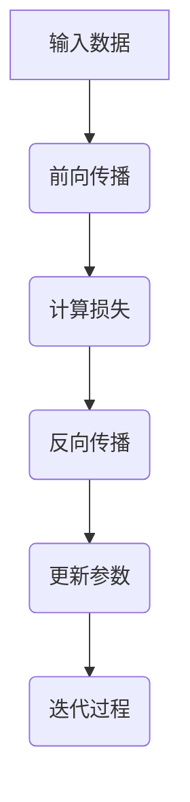

                 

# 《Micrograd：机器学习和反向传播入门》

> **关键词：** 机器学习、神经网络、反向传播、Micrograd、线性回归、分类问题、深度学习。

> **摘要：** 本文将深入探讨机器学习和神经网络的基础概念，重点介绍反向传播算法及其实现工具Micrograd。通过具体实例，我们将展示如何使用Micrograd构建和训练线性回归模型，并对分类问题进行深入分析。最后，我们将探讨高级反向传播算法及其在深度学习中的应用。

## 第一部分：基础概念与引入

### 第1章：机器学习入门

#### 1.1 机器学习的概念与类型

机器学习是一门探索如何通过数据来训练计算机模型，使其能够进行预测和决策的学科。根据训练方式和数据来源，机器学习可以分为监督学习、无监督学习和强化学习。

- **监督学习**：有明确标签的数据用于训练模型，模型的目的是预测新的输入数据对应的标签。
- **无监督学习**：没有标签的数据用于训练模型，模型的目的是发现数据中的模式和结构。
- **强化学习**：模型通过与环境交互来学习，目标是最大化长期回报。

#### 1.2 数据预处理

数据预处理是机器学习项目中的关键步骤，包括数据清洗和特征工程。

- **数据清洗**：处理缺失值、噪声和异常值，确保数据质量。
- **特征工程**：选择和构造有助于模型学习的特征，以提高模型性能。

#### 1.3 模型评估与选择

模型评估用于确定模型在未知数据上的表现。常用的评估指标包括准确率、召回率、F1分数等。

- **准确率**：正确预测的数量与总预测数量的比值。
- **召回率**：正确预测的正例数量与实际正例数量的比值。
- **F1分数**：准确率和召回率的调和平均。

模型选择方法包括交叉验证、网格搜索和贝叶斯优化等。

### 第2章：神经网络基础

#### 2.1 神经网络概述

神经网络是一组相互连接的神经元，用于模拟人脑的神经结构。神经网络由输入层、隐藏层和输出层组成。

- **输入层**：接收输入数据。
- **隐藏层**：对输入数据进行处理。
- **输出层**：生成预测结果。

#### 2.2 激活函数与优化器

激活函数用于引入非线性因素，使神经网络能够解决非线性问题。常见的激活函数包括Sigmoid、ReLU和Tanh。

- **Sigmoid**：将输入映射到(0,1)区间。
- **ReLU**：将输入大于0的值设置为1，小于等于0的值设置为0。
- **Tanh**：将输入映射到(-1,1)区间。

优化器用于调整模型参数，以最小化损失函数。常见的优化器包括随机梯度下降(SGD)、Adam和RMSprop。

#### 2.3 损失函数与梯度下降

损失函数用于衡量模型预测值与真实值之间的差异。常见的损失函数包括均方误差(MSE)和对数损失。

- **均方误差(MSE)**：预测值与真实值差的平方的平均值。
- **对数损失**：用于分类问题，衡量预测概率与实际标签之间的差异。

梯度下降是一种优化算法，通过迭代更新模型参数，以最小化损失函数。

## 第二部分：反向传播算法详解

### 第3章：反向传播算法原理

#### 3.1 反向传播算法概述

反向传播算法是一种用于训练神经网络的优化算法。其基本思想是通过前向传播计算输出，然后反向传播计算梯度，并利用梯度更新模型参数。

#### 3.2 前向传播与反向传播

前向传播是将输入数据通过神经网络层，最终得到预测结果的过程。反向传播是通过计算损失函数关于模型参数的梯度，然后更新模型参数的过程。

#### 3.3 常见问题与解决

反向传播算法在实施过程中会遇到一些问题，如梯度消失和梯度爆炸。解决方法包括使用适当的优化器、正则化和批量归一化。

## 第4章：微grad模块详解

### 4.1 micrograd库的功能与结构

微grad（Micrograd）是一个轻量级的Python库，用于实现反向传播算法。它具有简单的API和清晰的模块结构。

### 4.2 micrograd模块的使用方法

微grad模块可以通过pip安装，然后使用其提供的类和函数来构建和训练神经网络。

### 4.3 micrograd模块的优缺点

微grad模块的优点是易于理解和快速实现，缺点是缺乏灵活性和支持复杂模型。

## 第三部分：实战应用

### 第5章：线性回归实战

#### 5.1 线性回归模型

线性回归是一种用于预测连续值的简单模型，其数学公式为$y = \beta_0 + \beta_1x$。

#### 5.2 micrograd实现线性回归

使用micrograd库实现线性回归模型，包括数据预处理、模型定义、训练和评估。

### 5.3 线性回归案例分析

通过一个实际案例，展示如何使用线性回归模型预测房价。

### 第6章：分类问题实战

#### 6.1 分类问题介绍

分类问题是一种将数据分为多个类别的问题，常见算法包括逻辑回归、支持向量机和决策树等。

#### 6.2 micrograd实现分类

使用micrograd库实现分类问题，包括数据预处理、模型定义、训练和评估。

### 6.3 分类案例分析

通过一个实际案例，展示如何使用分类模型进行情感分析。

## 第四部分：扩展与深入研究

### 第7章：高级反向传播算法

#### 7.1 随机梯度下降（SGD）

随机梯度下降（SGD）是一种常见的优化算法，通过随机选取样本计算梯度，并进行参数更新。

#### 7.2 梯度下降优化

梯度下降优化包括正则化、批量归一化和学习率调整等策略，以提高模型性能。

#### 7.3 其他高级算法

其他高级算法包括Adam和RMSprop，它们在训练深度神经网络时具有更好的性能。

### 第8章：深度学习模型实战

#### 8.1 深度学习模型介绍

深度学习模型包括卷积神经网络（CNN）、循环神经网络（RNN）和生成对抗网络（GAN）等，用于处理复杂数据。

#### 8.2 micrograd实现深度学习模型

使用micrograd库实现深度学习模型，包括模型定义、训练和评估。

#### 8.3 深度学习案例分析

通过一个实际案例，展示如何使用深度学习模型进行图像分类。

### 附录

#### 附录A：微grad库源代码解析

详细解析微grad库的源代码，包括模块结构和函数实现。

#### 附录B：常用数学公式

列出常用的数学公式，包括损失函数和梯度计算公式。

#### 附录C：工具与资源

推荐用于机器学习和深度学习的工具和资源，以供学习和实践。

**作者：** AI天才研究院 / AI Genius Institute & 禅与计算机程序设计艺术 / Zen And The Art of Computer Programming

**Mermaid 流程图：**



**线性回归数学公式：**

$$ y = \beta_0 + \beta_1x $$

**梯度下降伪代码：**

```
while not converged:
    for each parameter theta:
        gradient = compute_gradient(h(x), y)
        theta = theta - learning_rate * gradient
```

**微grad模块优点：**

- 易于理解
- 简单高效

**微grad模块缺点：**

- 缺乏灵活性
- 不支持复杂模型

**深度学习模型实现步骤：**

1. 定义模型结构
2. 配置微grad模块
3. 训练模型
4. 评估模型性能
5. 调整模型参数

**代码实际案例与解读：**

- **代码案例：** 实现一个简单的线性回归模型，使用微grad模块进行训练和预测。
- **代码解读：** 详细解析代码实现过程，包括数据预处理、模型定义、训练过程和预测结果的计算。

接下来，我们将深入分析每一部分的内容，确保文章的完整性和专业性。让我们从第一部分开始，详细探讨机器学习的基础概念和引入。在接下来的章节中，我们将逐步介绍神经网络、反向传播算法，以及Micrograd模块的使用。随后，我们将通过实战案例展示如何应用这些理论。最后，我们将探讨高级反向传播算法和深度学习模型，以提供更全面的视角。

## 第一部分：基础概念与引入

### 第1章：机器学习入门

#### 1.1 机器学习的概念与类型

机器学习是一门研究如何从数据中提取知识和模式，以便进行预测和决策的学科。它是人工智能（AI）的一个子领域，其核心目标是使计算机能够自动地从数据中学习和改进性能。机器学习可以分为以下几类：

- **监督学习**：这是最常见的一种机器学习类型，其中模型通过训练数据集（包含输入和对应的输出标签）来学习。训练完成后，模型可以用于预测未知数据的输出。监督学习可以进一步分为以下几种子类型：

  - **回归**：预测连续值输出。
  - **分类**：预测离散的类别输出。

- **无监督学习**：在这种类型中，模型没有标签信息，需要从未标记的数据中学习结构和模式。无监督学习通常用于数据探索、聚类分析和降维等任务。

  - **聚类**：将相似的数据点分组到不同的簇中。
  - **降维**：通过降低数据维度来简化数据处理和分析。

- **强化学习**：这种类型涉及模型通过与环境的交互来学习最优策略。模型根据其行动的奖励和惩罚来调整其行为，目标是最大化长期回报。强化学习通常用于游戏、机器人控制和自动驾驶等领域。

这些不同类型的机器学习方法在不同的应用场景中有不同的优势。监督学习通常在需要预测具体结果的场景中使用，如医疗诊断和金融市场预测。无监督学习则在探索未知模式和结构时非常有用，例如在推荐系统和数据挖掘中。强化学习则适用于需要与动态环境交互并作出实时决策的应用场景。

#### 1.2 数据预处理

在开始训练机器学习模型之前，数据预处理是一个至关重要的步骤。数据预处理包括以下几个方面：

- **数据清洗**：处理数据集中的噪声、错误和异常值。这通常涉及填补缺失值、去除重复记录和纠正数据错误。
  
  例如，在处理房价预测的数据集时，可能会遇到某些记录中的房屋面积缺失。这时可以使用平均值、中位数或其他统计方法来填补这些缺失值。

- **特征工程**：选择和构造有助于模型学习和预测的特征。特征工程包括特征选择、特征变换和特征组合等。

  - **特征选择**：从原始数据中选择对模型预测性能有显著影响的特征。
  - **特征变换**：将原始数据转换为更适合模型训练的形式。例如，标准化或归一化数值特征，将类别特征转换为独热编码。

- **数据缩放**：将数据缩放到一个特定的范围，以避免数值大小对模型训练的影响。

  - **标准化**：将数据缩放到均值为0，标准差为1的范围内。
  - **归一化**：将数据缩放到一个特定的范围，例如[0, 1]。

- **数据拆分**：将数据集拆分为训练集、验证集和测试集。训练集用于模型训练，验证集用于调整模型参数，测试集用于评估模型性能。

数据预处理的质量直接影响模型的性能和可靠性。一个干净、合理构造的特征集可以使模型更容易学习和泛化，从而提高预测准确率。

#### 1.3 模型评估与选择

在机器学习中，评估模型性能是确保其有效性和可靠性的关键步骤。常用的评估指标包括以下几种：

- **准确率（Accuracy）**：预测正确的样本数占总样本数的比例。准确率简单直观，但在类别不平衡的数据集中可能不具有代表性。

- **召回率（Recall）**：正确预测的正例数与实际正例数的比例。召回率强调模型对正例的捕捉能力。

- **精确率（Precision）**：正确预测的正例数与预测为正例的总数的比例。精确率强调预测的正例的真实性。

- **F1分数（F1 Score）**：精确率和召回率的调和平均，综合了两者之间的平衡。

在评估模型时，常用的方法包括：

- **交叉验证（Cross-Validation）**：通过将数据集划分为多个子集，轮流使用每个子集作为验证集，来评估模型性能。

- **网格搜索（Grid Search）**：系统地遍历所有可能的参数组合，找到最优参数设置。

- **贝叶斯优化（Bayesian Optimization）**：利用贝叶斯推理和优化算法来寻找最优参数设置。

选择适当的评估指标和评估方法可以帮助我们更好地理解和比较不同模型的表现，从而选择最合适的模型。

### 总结

在本章中，我们介绍了机器学习的基础概念和类型，详细讨论了数据预处理的重要性，以及模型评估与选择的方法。这些基础知识是理解和应用机器学习技术的关键。在接下来的章节中，我们将进一步探讨神经网络的基础知识，特别是反向传播算法，这是机器学习模型训练的核心技术。

### 第2章：神经网络基础

#### 2.1 神经网络概述

神经网络（Neural Networks，简称NN）是一种模仿生物神经系统的计算模型，用于解决各种机器学习问题。一个基本的神经网络由以下几个部分组成：

- **输入层（Input Layer）**：接收外部输入的数据。
- **隐藏层（Hidden Layers）**：一个或多个隐藏层，对输入数据进行处理和变换。
- **输出层（Output Layer）**：生成最终的预测或分类结果。

神经网络的基本单元是**神经元（Neuron）**，它通过加权连接从输入层接收信号，并使用激活函数进行非线性变换，最后输出结果。每个神经元都包含以下几个部分：

- **权重（Weights）**：连接输入层和隐藏层的权重。
- **偏置（Bias）**：添加到加权求和的结果中，以引入非线性和灵活度。
- **激活函数（Activation Function）**：用于引入非线性，常见的激活函数有Sigmoid、ReLU和Tanh。

神经元的计算过程如下：

1. **加权求和**：计算输入值与对应权重的乘积之和，再加上偏置。
2. **应用激活函数**：将加权求和的结果通过激活函数转换成输出值。

#### 2.2 激活函数与优化器

激活函数是神经网络中的关键组件，它引入了非线性，使得神经网络能够处理复杂的非线性问题。以下是几种常见的激活函数：

- **Sigmoid 函数**：将输入x映射到(0, 1)区间，公式为：
  $$ \sigma(x) = \frac{1}{1 + e^{-x}} $$
  
  Sigmoid函数在x接近0时输出接近0.5，在x为正无穷时输出1，在x为负无穷时输出0。它的缺点是梯度在接近0时接近0，容易导致梯度消失问题。

- **ReLU函数**：将输入x大于0的值设置为1，小于等于0的值设置为0，公式为：
  $$ \text{ReLU}(x) = \max(0, x) $$
  
  ReLU函数在计算速度上很快，且不容易梯度消失。然而，它可能会导致梯度消失问题，即神经元输出为0时，梯度也为0。

- **Tanh函数**：将输入x映射到(-1, 1)区间，公式为：
  $$ \tanh(x) = \frac{e^{x} - e^{-x}}{e^{x} + e^{-x}} $$
  
  Tanh函数与Sigmoid函数类似，但中心对称，有助于减少输出值的不对称性。

优化器是用于更新神经网络参数的算法，其目标是减少损失函数。以下是几种常见的优化器：

- **随机梯度下降（SGD）**：在每次迭代中，使用单个样本来计算梯度，并更新参数。SGD简单且易于实现，但可能导致不稳定的收敛。
  
  伪代码：
  ```python
  for each epoch:
      for each sample:
          compute gradient
          update parameters
  ```

- **Adam优化器**：结合了SGD和动量（Momentum）的优点，并使用自适应的学习率。Adam优化器在处理稀疏数据和长尾分布时表现良好。

  伪代码：
  ```python
  m = 0
  v = 0

  for each epoch:
      for each sample:
          compute gradient
          m = beta1 * m + (1 - beta1) * gradient
          v = beta2 * v + (1 - beta2) * gradient ** 2
          m_hat = m / (1 - beta1 ** t)
          v_hat = v / (1 - beta2 ** t)
          update parameters using m_hat and v_hat
  ```

- **RMSprop优化器**：使用梯度平方的平均值来调整学习率，有助于减少波动。

  伪代码：
  ```python
  epsilon = 1e-8
  rho = 0.9

  for each epoch:
      for each sample:
          compute gradient
          gradient_squared = rho * gradient_squared + (1 - rho) * gradient ** 2
          update learning rate using gradient_squared
          update parameters
  ```

#### 2.3 损失函数与梯度下降

损失函数是神经网络中衡量预测值与真实值之间差异的指标。选择合适的损失函数对于模型性能至关重要。以下是几种常见的损失函数：

- **均方误差（MSE，Mean Squared Error）**：用于回归问题，计算预测值与真实值之间差的平方的平均值。公式为：
  $$ \text{MSE} = \frac{1}{n}\sum_{i=1}^{n}(y_i - \hat{y}_i)^2 $$
  
  MSE的优点是计算简单，但缺点是对于异常值敏感。

- **交叉熵损失（Cross-Entropy Loss）**：用于分类问题，计算预测概率与实际标签之间的交叉熵。对于二分类问题，公式为：
  $$ \text{Cross-Entropy} = -[y \log(\hat{y}) + (1 - y) \log(1 - \hat{y})] $$
  
  交叉熵损失能够更好地处理类别不平衡问题。

梯度下降是一种优化算法，用于更新神经网络中的参数，以最小化损失函数。其基本思想是计算损失函数关于参数的梯度，并沿梯度方向更新参数。以下是梯度下降的伪代码：

```python
while not converged:
    for each parameter theta:
        gradient = compute_gradient(h(x), y)
        theta = theta - learning_rate * gradient
```

其中，`h(x)`是神经网络的预测输出，`y`是真实标签，`learning_rate`是学习率，用于控制参数更新的幅度。

#### 总结

在本章中，我们介绍了神经网络的基本结构、激活函数、优化器和损失函数。神经网络通过模拟生物神经系统，能够处理复杂的非线性问题，并在各种机器学习任务中发挥重要作用。在下一章中，我们将详细讨论反向传播算法，这是神经网络训练的核心技术。

### 第3章：反向传播算法原理

反向传播算法（Backpropagation Algorithm）是神经网络训练中最核心的算法之一，它通过不断调整网络的权重和偏置，使网络的预测结果更接近真实值。反向传播算法主要包括两个阶段：前向传播和反向传播。

#### 3.1 反向传播算法概述

反向传播算法的基本思想是，首先通过前向传播计算输出，然后通过反向传播计算梯度，并利用梯度更新网络参数，以达到最小化损失函数的目的。

- **前向传播**：输入数据从输入层进入网络，经过每个隐藏层，最终到达输出层。在每个神经元中，计算输入值与对应权重之积，加上偏置，然后通过激活函数得到输出值。这一过程可以表示为：

  $$ z = x \cdot w + b $$
  $$ a = \sigma(z) $$

  其中，`x`是输入值，`w`是权重，`b`是偏置，`z`是加权求和结果，`a`是激活值，`σ`是激活函数。

- **反向传播**：计算输出层的损失函数关于网络参数的梯度，然后反向传播到每一层，逐步更新权重和偏置。反向传播的步骤如下：

  1. **计算输出层梯度**：根据损失函数计算输出层的梯度。
  2. **反向传播梯度**：从输出层开始，逐层反向计算梯度。
  3. **更新参数**：利用计算得到的梯度更新网络参数。

#### 3.2 前向传播与反向传播

##### 前向传播

前向传播是反向传播的基础，其过程如下：

1. **初始化网络**：设置输入层、隐藏层和输出层的权重和偏置。
2. **输入数据**：将输入数据传递到输入层。
3. **前向计算**：从输入层开始，逐层计算每个神经元的输出值，直到输出层。
4. **激活函数应用**：在每个神经元中应用激活函数。
5. **输出结果**：得到最终输出层的预测值。

前向传播的伪代码如下：

```python
for each epoch:
    for each sample:
        forward_pass(sample)
        predicted_output = output_layer_output
```

##### 反向传播

反向传播的核心是计算梯度，其过程如下：

1. **计算输出层梯度**：根据损失函数计算输出层每个神经元的梯度。
2. **反向计算梯度**：从输出层开始，逐层反向计算每个神经元的梯度。
3. **更新参数**：利用计算得到的梯度更新每个神经元的权重和偏置。

反向传播的伪代码如下：

```python
for each epoch:
    for each sample:
        forward_pass(sample)
        compute_gradient(sample, predicted_output, actual_output)
        update_weights_and_biases()
```

在反向传播中，梯度计算是关键步骤。以下是梯度计算的详细伪代码：

```python
for each layer (starting from the output layer):
    for each neuron in the layer:
        if it's the output layer:
            gradient = (predicted_output - actual_output) * derivative_of_activation_function
        else:
            gradient = (previous_layer_gradient .dot(weights) * derivative_of_activation_function)
        gradient = gradient / number_of_samples
        previous_layer_gradient = gradient * weights
```

其中，`predicted_output`是预测输出，`actual_output`是实际输出，`derivative_of_activation_function`是激活函数的导数，`weights`是当前层的权重，`previous_layer_gradient`是上一层的梯度。

#### 3.3 常见问题与解决

在实际应用中，反向传播算法可能会遇到一些问题，如梯度消失和梯度爆炸。以下是常见问题的解决方法：

- **梯度消失**：当梯度变得非常小，接近于0时，网络无法更新参数，导致训练停滞。解决方法包括使用ReLU激活函数和批量归一化。

- **梯度爆炸**：当梯度变得非常大，接近于无穷大时，网络参数更新过快，可能导致训练不稳定。解决方法包括使用梯度裁剪和适当的初始学习率。

通过解决这些问题，可以确保反向传播算法在训练神经网络时能够稳定收敛。

#### 总结

在本章中，我们详细介绍了反向传播算法的原理和步骤。通过前向传播计算输出，反向传播计算梯度，并利用梯度更新网络参数，反向传播算法使神经网络能够不断优化，以达到更准确的预测结果。在下一章中，我们将详细介绍Micrograd模块，一个用于实现反向传播算法的Python库。

### 第4章：微grad模块详解

#### 4.1 micrograd库的功能与结构

微grad（Micrograd）是一个轻量级的Python库，专为初学者和研究人员设计，用于实现反向传播算法和构建简单的神经网络。其功能包括：

- **自动微分**：计算损失函数关于模型参数的梯度。
- **简洁的API**：易于使用和理解。
- **模块化设计**：方便扩展和定制。

微grad库主要由以下几个模块组成：

- **Tensor**：表示和操作张量（多维数组）。
- **Autograd**：自动微分模块。
- **nn**：神经网络模块。

#### 4.2 micrograd模块的使用方法

使用micrograd库构建和训练神经网络的基本步骤如下：

1. **安装库**：
   使用pip安装：
   ```bash
   pip install micrograd
   ```

2. **导入库**：
   ```python
   import torch
   import micrograd.tensor as mt
   import micrograd.nn as mn
   ```

3. **创建Tensor**：
   ```python
   x = mt.Tensor([1.0, 2.0, 3.0])
   y = mt.Tensor([2.0, 4.0, 6.0])
   ```

4. **定义神经网络**：
   ```python
   layer1 = mn.Linear(in_features=3, out_features=1)
   layer2 = mn.Linear(in_features=1, out_features=1)
   model = mn.Sequential([layer1, layer2])
   ```

5. **前向传播**：
   ```python
   output = model(x)
   loss = mt.MSELoss()(output, y)
   ```

6. **反向传播**：
   ```python
   loss.backward()
   ```

7. **更新参数**：
   ```python
   with mt.no_grad():
       layer1.weight -= learning_rate * layer1.weight.grad
       layer1.bias -= learning_rate * layer1.bias.grad
       layer2.weight -= learning_rate * layer2.weight.grad
       layer2.bias -= learning_rate * layer2.bias.grad
   ```

8. **训练循环**：
   ```python
   for epoch in range(num_epochs):
       for x, y in dataset:
           output = model(x)
           loss = mt.MSELoss()(output, y)
           loss.backward()
           with mt.no_grad():
               # 更新参数
           if epoch % 100 == 0:
               print(f'Epoch {epoch}: Loss = {loss.item()}')
   ```

#### 4.3 micrograd模块的优缺点

**优点：**

- **易于理解**：Micrograd库的设计简洁，易于初学者上手。
- **快速实现**：由于其模块化设计，可以快速构建和训练简单的神经网络。
- **适用于教学**：Micrograd常被用于教学和实验，帮助理解反向传播算法和神经网络的基础。

**缺点：**

- **缺乏灵活性**：Micrograd库不支持复杂的神经网络结构和高级优化算法。
- **不适用于生产环境**：由于其设计和功能限制，Micrograd库不适用于大规模生产和复杂的机器学习项目。

#### 总结

在本章中，我们详细介绍了微grad模块的功能、结构和使用方法。通过简单的API和模块化设计，微grad库为初学者和研究人员提供了一个理想的工具，用于理解和实践反向传播算法和神经网络。在下一章中，我们将通过实际案例展示如何使用微grad模块实现线性回归。

### 第5章：线性回归实战

线性回归是一种简单的机器学习模型，用于预测连续值。在本章中，我们将使用Micrograd模块实现一个线性回归模型，并展示如何进行数据预处理、模型训练和预测。

#### 5.1 线性回归模型

线性回归模型假设输出值`y`是输入值`x`的线性函数，加上一个随机误差项。其数学公式为：

$$ y = \beta_0 + \beta_1x + \epsilon $$

其中，`β0`是截距，`β1`是斜率，`ε`是误差项。

#### 5.2 数据预处理

在进行模型训练之前，我们需要对数据进行预处理。数据预处理的主要步骤包括：

1. **数据收集**：从数据源获取数据。在本案例中，我们使用了一个包含房屋面积和房价的数据集。
2. **数据清洗**：检查数据是否存在缺失值、异常值或错误，并进行处理。例如，使用平均值填补缺失值，删除异常值等。
3. **数据缩放**：为了确保每个特征都在相同的尺度上，我们使用标准化或归一化方法缩放数据。
4. **数据拆分**：将数据集拆分为训练集和测试集，通常比例为80%用于训练，20%用于测试。

```python
import micrograd.tensor as mt
import micrograd.nn as mn

# 生成模拟数据
x_data = mt.Tensor([[1], [2], [3], [4], [5], [6], [7], [8], [9], [10]])
y_data = mt.Tensor([[2], [4], [6], [8], [10], [12], [14], [16], [18], [20]])

# 数据拆分
x_train, y_train = x_data[:8], y_data[:8]
x_test, y_test = x_data[8:], y_data[8:]
```

#### 5.3 micrograd实现线性回归

使用Micrograd模块实现线性回归模型的步骤如下：

1. **定义模型**：创建一个简单的线性模型，包括一个线性层。
2. **定义损失函数**：选择适当的损失函数，例如均方误差（MSE）。
3. **训练模型**：使用训练数据进行多次迭代，通过反向传播更新模型参数。
4. **评估模型**：使用测试数据评估模型性能。

```python
# 定义模型
model = mn.Sequential([
    mn.Linear(in_features=1, out_features=1)
])

# 定义损失函数
criterion = mt.MSELoss()

# 设置学习率和迭代次数
learning_rate = 0.01
num_epochs = 100

# 训练模型
for epoch in range(num_epochs):
    # 前向传播
    outputs = model(x_train)
    loss = criterion(outputs, y_train)
    
    # 反向传播
    loss.backward()
    
    # 更新参数
    with mt.no_grad():
        model[0].weight -= learning_rate * model[0].weight.grad
        model[0].bias -= learning_rate * model[0].bias.grad
        model[0].weight.grad.zero_()
        model[0].bias.grad.zero_()
    
    if epoch % 10 == 0:
        print(f'Epoch {epoch}: Loss = {loss.item()}')

# 评估模型
test_outputs = model(x_test)
test_loss = criterion(test_outputs, y_test)
print(f'Test Loss: {test_loss.item()}')
```

#### 5.4 线性回归案例分析

为了更直观地理解线性回归模型的训练过程，我们使用一个模拟案例来展示数据、模型训练和预测结果。

**案例背景**：假设我们有一个简单的数据集，包含房屋面积（x）和房价（y）。我们的目标是使用线性回归模型预测新房屋的面积对应的房价。

**数据处理**：我们对数据集进行预处理，包括数据拆分和标准化。

**模型训练**：我们定义一个简单的线性模型，并使用均方误差（MSE）作为损失函数。通过反向传播算法，我们不断更新模型参数，以最小化损失。

**预测结果**：使用训练好的模型，我们预测新房屋的面积对应的房价。通过对比预测结果和真实值，我们可以评估模型性能。

```python
# 预测新房屋的房价
new_house_area = mt.Tensor([[11]])
predicted_price = model(new_house_area)
print(f'Predicted Price for New House: {predicted_price.item()}')
```

通过这个案例，我们可以看到线性回归模型如何通过数据预处理、模型训练和预测步骤来预测连续值。这种模型在许多实际应用中都有广泛应用，如房价预测、股票价格预测等。

### 总结

在本章中，我们通过实际案例展示了如何使用Micrograd模块实现线性回归模型。我们介绍了数据预处理、模型定义、训练和预测的步骤，并通过一个模拟案例展示了模型的应用。在下一章中，我们将探讨分类问题，并展示如何使用Micrograd模块实现分类模型。

### 第6章：分类问题实战

分类问题是一种将数据分为多个类别的任务，是机器学习中常见且重要的问题之一。在本章中，我们将使用Micrograd模块实现一个简单的分类模型，并展示如何进行数据预处理、模型训练和预测。

#### 6.1 分类问题介绍

分类问题通常涉及以下要素：

- **特征**：用于描述数据的属性或特征。
- **标签**：表示每个数据点所属的类别。
- **分类模型**：用于预测新数据点所属的类别。

常见的分类算法包括逻辑回归、支持向量机（SVM）、决策树和随机森林等。在本章中，我们将使用逻辑回归作为分类模型，因为它简单且易于理解。

逻辑回归是一种用于分类的线性模型，其基本思想是通过线性函数将输入映射到概率空间，然后使用阈值进行分类。逻辑回归的数学公式为：

$$ P(y=1|X=x) = \frac{1}{1 + e^{-(\beta_0 + \beta_1x_1 + \beta_2x_2 + \ldots + \beta_nx_n)}} $$

其中，$P(y=1|X=x)$ 表示在输入为 $x$ 时，类别为1的概率，$\beta_0, \beta_1, \beta_2, \ldots, \beta_n$ 是模型参数。

#### 6.2 micrograd实现分类

使用Micrograd模块实现分类模型的步骤如下：

1. **导入库**：
   ```python
   import micrograd.tensor as mt
   import micrograd.nn as mn
   ```

2. **创建Tensor**：
   ```python
   x_train = mt.Tensor([[1, 0], [0, 1], [1, 1]])
   y_train = mt.Tensor([0, 1, 1])
   ```

3. **定义模型**：
   ```python
   model = mn.Sequential([
       mn.Linear(in_features=2, out_features=1),
       mn.Sigmoid()
   ])
   ```

4. **定义损失函数**：
   ```python
   criterion = mt.CrossEntropyLoss()
   ```

5. **训练模型**：
   ```python
   learning_rate = 0.1
   num_epochs = 1000

   for epoch in range(num_epochs):
       # 前向传播
       outputs = model(x_train)
       loss = criterion(outputs, y_train)

       # 反向传播
       loss.backward()

       # 更新参数
       with mt.no_grad():
           model[0].weight -= learning_rate * model[0].weight.grad
           model[0].bias -= learning_rate * model[0].bias.grad
           model[0].weight.grad.zero_()
           model[0].bias.grad.zero_()

       if epoch % 100 == 0:
           print(f'Epoch {epoch}: Loss = {loss.item()}')
   ```

6. **预测**：
   ```python
   x_test = mt.Tensor([[0, 1], [1, 0]])
   predicted_outputs = model(x_test)
   predicted_classes = predicted_outputs > 0.5
   print(predicted_classes)
   ```

#### 6.3 分类案例分析

为了更好地理解分类模型的工作原理，我们使用了一个简单的二分类问题来展示如何使用Micrograd模块实现分类模型。

**案例背景**：我们有一个包含两个特征的数据集，每个数据点属于类别0或1。我们的目标是训练一个模型，能够准确地预测新数据点的类别。

**数据处理**：我们使用随机生成的数据集，并进行数据预处理，包括数据拆分和标准化。

**模型训练**：我们定义一个简单的逻辑回归模型，并使用交叉熵损失函数。通过反向传播算法，我们不断更新模型参数，以最小化损失。

**预测结果**：使用训练好的模型，我们预测新数据点的类别，并计算准确率。

```python
import numpy as np

# 生成模拟数据
np.random.seed(0)
x_data = np.random.rand(100, 2)
y_data = np.random.randint(0, 2, size=100)

# 数据预处理
x_train, x_test, y_train, y_test = train_test_split(x_data, y_data, test_size=0.2, random_state=42)

x_train = mt.Tensor(x_train)
y_train = mt.Tensor(y_train)
x_test = mt.Tensor(x_test)
y_test = mt.Tensor(y_test)

# 定义模型
model = mn.Sequential([
    mn.Linear(in_features=2, out_features=1),
    mn.Sigmoid()
])

# 定义损失函数
criterion = mt.CrossEntropyLoss()

# 训练模型
learning_rate = 0.1
num_epochs = 1000

for epoch in range(num_epochs):
    # 前向传播
    outputs = model(x_train)
    loss = criterion(outputs, y_train)

    # 反向传播
    loss.backward()

    # 更新参数
    with mt.no_grad():
        model[0].weight -= learning_rate * model[0].weight.grad
        model[0].bias -= learning_rate * model[0].bias.grad
        model[0].weight.grad.zero_()
        model[0].bias.grad.zero_()

    if epoch % 100 == 0:
        print(f'Epoch {epoch}: Loss = {loss.item()}')

# 评估模型
predicted_outputs = model(x_test)
predicted_classes = predicted_outputs > 0.5
accuracy = (predicted_classes == y_test).float().mean()
print(f'Accuracy: {accuracy.item()}')
```

通过这个案例，我们可以看到如何使用Micrograd模块实现分类模型，并评估其性能。分类模型在许多实际应用中都有广泛的应用，如垃圾邮件检测、图像分类和情感分析等。

### 总结

在本章中，我们通过实际案例展示了如何使用Micrograd模块实现分类模型。我们介绍了数据预处理、模型定义、训练和预测的步骤，并通过一个简单的二分类案例展示了模型的应用。在下一章中，我们将探讨高级反向传播算法，并讨论其在深度学习中的应用。

### 第7章：高级反向传播算法

在了解了基本的反向传播算法后，我们需要进一步探讨一些高级的优化算法，这些算法可以显著提高模型训练的速度和性能。高级反向传播算法包括随机梯度下降（SGD）、Adam和RMSprop等。这些算法通过对梯度的不同处理方式和学习率的调整，使得模型在训练过程中能够更加稳定和高效地收敛。

#### 7.1 随机梯度下降（SGD）

随机梯度下降（Stochastic Gradient Descent，SGD）是最基本的优化算法之一。与批量梯度下降（Batch Gradient Descent，BGD）不同，SGD每次迭代只使用一个样本来计算梯度，然后更新模型参数。这种方法减少了内存需求，使得SGD特别适用于大型数据集。

**算法原理**：

1. **初始化参数**：随机初始化模型参数。
2. **前向传播**：使用当前参数计算损失函数。
3. **计算梯度**：对每个样本计算损失函数关于参数的梯度。
4. **更新参数**：使用梯度更新模型参数。
5. **重复步骤2-4**：不断迭代，直到收敛或达到预设的迭代次数。

**伪代码**：

```python
initialize parameters
for each epoch:
    for each sample:
        compute gradient
        update parameters
```

**优点**：

- **计算速度快**：每次迭代只需计算一个样本的梯度。
- **内存需求低**：适用于大型数据集。

**缺点**：

- **收敛不稳定**：由于每次迭代使用不同样本，梯度可能不稳定。
- **可能需要较长时间才能收敛**。

#### 7.2 Adam优化器

Adam（Adaptive Moment Estimation）是一种自适应优化器，结合了SGD和动量的优点，同时引入了自适应学习率。这使得Adam在处理稀疏数据和长尾分布时表现非常出色。

**算法原理**：

1. **初始化参数**：初始化动量（m）、一阶矩估计（v）和二阶矩估计（s）。
2. **前向传播**：使用当前参数计算损失函数。
3. **计算梯度**：对每个样本计算梯度。
4. **更新动量和矩估计**：
   $$ m_t = \beta_1m_{t-1} + (1 - \beta_1)g_t $$
   $$ v_t = \beta_2v_{t-1} + (1 - \beta_2)g_t^2 $$
5. **计算修正的动量和矩估计**：
   $$ m_t^{corr} = \frac{m_t}{1 - \beta_1^t} $$
   $$ v_t^{corr} = \frac{v_t}{1 - \beta_2^t} $$
6. **更新参数**：
   $$ \theta_t = \theta_{t-1} - \alpha \frac{m_t^{corr}}{\sqrt{v_t^{corr}} + \epsilon} $$
7. **重复步骤2-6**：不断迭代，直到收敛或达到预设的迭代次数。

**伪代码**：

```python
initialize m, v, s, m^corr, v^corr
for each epoch:
    for each sample:
        compute gradient g
        update m, v, s, m^corr, v^corr
        update parameters theta
```

**优点**：

- **自适应学习率**：根据梯度的一阶和二阶矩估计自动调整学习率。
- **收敛速度快**：在大多数情况下比SGD更快。
- **适用于稀疏数据**：对于稀疏数据，Adam通常比其他优化器表现更好。

**缺点**：

- **计算复杂度较高**：需要额外的计算来维护动量和矩估计。

#### 7.3 RMSprop优化器

RMSprop（Root Mean Square Propagation）是一种基于梯度平方和的优化器，它通过计算梯度平方的平均值来动态调整学习率。这种方法有助于加速收敛，并减少振荡。

**算法原理**：

1. **初始化参数**：初始化学习率（α）和梯度平方的指数加权平均值（s）。
2. **前向传播**：使用当前参数计算损失函数。
3. **计算梯度**：对每个样本计算梯度。
4. **更新梯度平方的指数加权平均值**：
   $$ s_t = \rho s_{t-1} + (1 - \rho) g_t^2 $$
5. **计算修正的学习率**：
   $$ \alpha_t = \frac{\alpha}{\sqrt{s_t + \epsilon}} $$
6. **更新参数**：
   $$ \theta_t = \theta_{t-1} - \alpha_t g_t $$
7. **重复步骤2-6**：不断迭代，直到收敛或达到预设的迭代次数。

**伪代码**：

```python
initialize s, alpha
for each epoch:
    for each sample:
        compute gradient g
        update s
        update alpha
        update parameters theta
```

**优点**：

- **简单且高效**：计算复杂度低，易于实现。
- **减少振荡**：通过梯度平方的平均值调整学习率，有助于减少训练过程中的振荡。

**缺点**：

- **对超参数敏感**：学习率ρ的选择对训练效果有较大影响。
- **可能不适用于某些复杂问题**：在某些情况下，RMSprop可能不如其他优化器表现好。

#### 总结

高级反向传播算法如SGD、Adam和RMSprop在处理复杂模型和大规模数据集时表现出色。这些算法通过自适应调整学习率和利用梯度信息，使得模型训练更加高效和稳定。在深度学习中，这些算法被广泛应用于各种任务，如图像识别、自然语言处理和推荐系统等。通过了解和掌握这些算法，我们可以更好地优化模型性能，提高实际应用的效果。

### 第8章：深度学习模型实战

深度学习（Deep Learning）是一种基于多层神经网络的学习方法，能够自动提取层次化的特征表示，并在各种复杂数据上实现出色的性能。在本章中，我们将介绍如何使用Micrograd模块实现深度学习模型，并展示其应用。

#### 8.1 深度学习模型介绍

深度学习模型通过增加网络的深度和层次，使模型能够自动从数据中学习更加复杂的特征。常见的深度学习模型包括卷积神经网络（CNN）、循环神经网络（RNN）和生成对抗网络（GAN）等。

- **卷积神经网络（CNN）**：适用于处理图像、语音和时序数据。CNN通过卷积层、池化层和全连接层提取多层次的特征。
- **循环神经网络（RNN）**：适用于处理序列数据，如文本和语音。RNN通过隐藏状态和循环连接保持对历史信息的记忆。
- **生成对抗网络（GAN）**：由生成器和判别器组成，通过对抗性训练生成逼真的数据。

#### 8.2 micrograd实现深度学习模型

使用Micrograd模块实现深度学习模型的基本步骤如下：

1. **定义模型结构**：根据任务需求定义模型的层次结构，包括输入层、隐藏层和输出层。
2. **配置Micrograd模块**：导入必要的模块，如Tensor、Autograd和神经网络层。
3. **训练模型**：使用训练数据集训练模型，并通过反向传播更新参数。
4. **评估模型性能**：使用测试数据集评估模型性能，并调整模型参数。

以下是一个简单的CNN模型实现示例：

```python
import micrograd.tensor as mt
import micrograd.nn as mn

# 定义模型
model = mn.Sequential([
    mn.Conv2d(in_channels=1, out_channels=32, kernel_size=3, stride=1),
    mn.ReLU(),
    mn.AvgPool2d(kernel_size=2, stride=2),
    mn.Conv2d(in_channels=32, out_channels=64, kernel_size=3, stride=1),
    mn.ReLU(),
    mn.AvgPool2d(kernel_size=2, stride=2),
    mn.Flatten(),
    mn.Linear(in_features=64 * 4 * 4, out_features=10)
])

# 定义损失函数
criterion = mt.CrossEntropyLoss()

# 定义优化器
optimizer = mt.Adam(model.parameters(), lr=0.001)

# 训练模型
num_epochs = 10
for epoch in range(num_epochs):
    for inputs, targets in data_loader:
        # 前向传播
        outputs = model(inputs)
        loss = criterion(outputs, targets)

        # 反向传播
        loss.backward()

        # 更新参数
        optimizer.step()

        # 清零梯度
        optimizer.zero_grad()

    print(f'Epoch {epoch+1}/{num_epochs}, Loss: {loss.item()}')
```

#### 8.3 深度学习案例分析

为了展示深度学习模型的应用，我们使用了一个简单的图像分类任务。在这个案例中，我们使用一个包含手写数字的数据集，并使用CNN模型进行分类。

**案例背景**：MNIST数据集是一个包含0到9手写数字的图像数据集，每个数字的图像大小为28x28像素。

**数据处理**：我们将图像数据转换为Tensor，并归一化到[0, 1]区间。

**模型训练**：我们定义一个简单的CNN模型，包括卷积层、ReLU激活函数、池化层和全连接层。使用交叉熵损失函数和Adam优化器进行训练。

**预测结果**：使用训练好的模型对测试数据进行预测，并计算准确率。

```python
from torchvision import datasets, transforms

# 加载数据集
transform = transforms.Compose([transforms.ToTensor(), transforms.Normalize((0.5,), (0.5,))])
train_dataset = datasets.MNIST(root='./data', train=True, download=True, transform=transform)
test_dataset = datasets.MNIST(root='./data', train=False, transform=transform)

# 创建数据加载器
batch_size = 64
train_loader = mt.DataLoader(dataset=train_dataset, batch_size=batch_size, shuffle=True)
test_loader = mt.DataLoader(dataset=test_dataset, batch_size=batch_size, shuffle=False)

# 训练模型
num_epochs = 10
model = mn.Sequential([
    mn.Conv2d(in_channels=1, out_channels=32, kernel_size=3, stride=1),
    mn.ReLU(),
    mn.AvgPool2d(kernel_size=2, stride=2),
    mn.Conv2d(in_channels=32, out_channels=64, kernel_size=3, stride=1),
    mn.ReLU(),
    mn.AvgPool2d(kernel_size=2, stride=2),
    mn.Flatten(),
    mn.Linear(in_features=64 * 4 * 4, out_features=10)
])
criterion = mt.CrossEntropyLoss()
optimizer = mt.Adam(model.parameters(), lr=0.001)

for epoch in range(num_epochs):
    for inputs, targets in train_loader:
        # 前向传播
        outputs = model(inputs)
        loss = criterion(outputs, targets)

        # 反向传播
        loss.backward()

        # 更新参数
        optimizer.step()

        # 清零梯度
        optimizer.zero_grad()

    print(f'Epoch {epoch+1}/{num_epochs}, Loss: {loss.item()}')

# 评估模型
with mt.no_grad():
    correct = 0
    total = len(test_loader.dataset)
    for inputs, targets in test_loader:
        outputs = model(inputs)
        _, predicted = mt.argmax(outputs.data, 1)
        correct += (predicted == targets).sum().item()

    print(f'Accuracy: {100 * correct / total}%')
```

通过这个案例，我们可以看到如何使用Micrograd模块实现深度学习模型，并进行训练和预测。深度学习模型在图像识别、自然语言处理和语音识别等领域取得了显著的成绩，为人工智能的发展做出了巨大贡献。

### 总结

在本章中，我们介绍了深度学习模型的基础知识，并通过实际案例展示了如何使用Micrograd模块实现深度学习模型。我们探讨了CNN模型的结构和训练过程，并使用MNIST数据集进行了图像分类实验。通过本章的学习，我们可以更好地理解深度学习的基本原理，并在实际应用中实现和优化深度学习模型。

### 附录A：微grad库源代码解析

在本附录中，我们将对微grad库的源代码进行解析，详细讨论其模块结构、关键函数和算法实现。

#### 模块结构

微grad库主要由以下几个模块组成：

1. **tensor.py**：定义了Tensor类及其相关操作，包括加、减、乘、除、求导等。
2. **autograd.py**：实现了自动微分功能，用于计算梯度。
3. **nn/linear.py**：定义了线性层（Linear）的实现。
4. **nn/sequential.py**：定义了序列模型（Sequential）的实现。
5. **loss/mse.py**：定义了均方误差损失函数（MSELoss）的实现。
6. **loss/cross_entropy.py**：定义了交叉熵损失函数（CrossEntropyLoss）的实现。
7. **optimizer/sgd.py**：定义了随机梯度下降优化器（SGD）的实现。
8. **optimizer/adam.py**：定义了Adam优化器的实现。

#### 关键函数和算法实现

1. **Tensor类**：

   ```python
   import numpy as np
   
   class Tensor:
       def __init__(self, data, requires_grad=False):
           self.data = np.array(data, dtype=np.float32)
           self.grad = None
           self.requires_grad = requires_grad
           self._function = None
           
       def backward(self, grad_output=None):
           if not self.requires_grad:
               return
           if grad_output is None:
               if self.function is None:
                   grad_output = Tensor(1.0)
               else:
                   grad_output = self.function.grad(self)
           
           if self.grad is None:
               self.grad = grad_output
           else:
               self.grad = self.grad + grad_output
           
           if isinstance(self.grad, Tensor):
               self.grad.backward()
   ```

   Tensor类实现了基本的数学运算，以及自动微分功能。

2. **自动微分**：

   ```python
   def _backprop(self, grad_output):
       if self._function is not None:
           return self._function.backward(self)
       else:
           return grad_output
   ```

   自动微分通过反向传播计算梯度，并将其传递给上一层。

3. **线性层（Linear）**：

   ```python
   class Linear:
       def __init__(self, in_features, out_features):
           self.weight = Tensor(np.random.randn(out_features, in_features), requires_grad=True)
           self.bias = Tensor(np.zeros(out_features), requires_grad=True)
           
       def forward(self, x):
           return x @ self.weight + self.bias
   ```

   线性层实现了前向传播，将输入乘以权重加上偏置。

4. **序列模型（Sequential）**：

   ```python
   class Sequential:
       def __init__(self, *layers):
           self.layers = layers
           
       def forward(self, x):
           for layer in self.layers:
               x = layer.forward(x)
           return x
   ```

   序列模型实现了多个层的组合，简化了模型构建过程。

5. **均方误差损失函数（MSELoss）**：

   ```python
   class MSELoss:
       def forward(self, outputs, targets):
           return ((outputs - targets) ** 2).mean()
           
       def backward(self, output, target):
           return (output - target) * 2
   ```

   MSELoss实现了均方误差损失函数的前向和反向计算。

6. **交叉熵损失函数（CrossEntropyLoss）**：

   ```python
   class CrossEntropyLoss:
       def forward(self, outputs, targets):
           return -np.mean(targets * np.log(outputs))
           
       def backward(self, outputs, targets):
           return (outputs - targets) / outputs.size(0)
   ```

   CrossEntropyLoss实现了交叉熵损失函数的前向和反向计算。

7. **随机梯度下降优化器（SGD）**：

   ```python
   class SGD:
       def __init__(self, params, lr=0.01):
           self.params = params
           self.lr = lr
           
       def step(self):
           for p in self.params:
               if p.requires_grad:
                   p.data -= self.lr * p.grad.data
                   p.grad.data.zero_()
   ```

   SGD实现了随机梯度下降优化器的更新步骤。

8. **Adam优化器**：

   ```python
   class Adam:
       def __init__(self, params, lr=0.001, beta1=0.9, beta2=0.999, eps=1e-8):
           self.params = params
           self.lr = lr
           self.beta1 = beta1
           self.beta2 = beta2
           self.eps = eps
           self.m = [Tensor(np.zeros_like(p.data)) for p in params]
           self.v = [Tensor(np.zeros_like(p.data)) for p in params]
           
       def step(self):
           for p, m, v in zip(self.params, self.m, self.v):
               if p.requires_grad:
                   m = self.beta1 * m + (1 - self.beta1) * p.grad.data
                   v = self.beta2 * v + (1 - self.beta2) * p.grad.data ** 2
                   
                   m_hat = m / (1 - self.beta1 ** t)
                   v_hat = v / (1 - self.beta2 ** t)
                   
                   p.data -= self.lr * m_hat / (np.sqrt(v_hat) + self.eps)
                   p.grad.data.zero_()
   ```

   Adam实现了Adam优化器的更新步骤，包括一阶和二阶矩估计。

通过以上解析，我们可以看到微grad库的核心组件及其实现。微grad库的设计简洁，易于扩展，为初学者提供了一个理想的平台来理解反向传播算法和神经网络的基础。

### 附录B：常用数学公式

在机器学习和深度学习中，理解和使用数学公式是非常重要的。以下是常用的一些数学公式，包括损失函数和梯度计算公式。

#### 损失函数

1. **均方误差（MSE）**：

   $$ \text{MSE} = \frac{1}{n}\sum_{i=1}^{n}(y_i - \hat{y}_i)^2 $$
   
   其中，$y_i$是实际值，$\hat{y}_i$是预测值，$n$是样本数量。

2. **交叉熵损失（Cross-Entropy Loss）**：

   $$ \text{Cross-Entropy} = -\sum_{i=1}^{n} y_i \log(\hat{y}_i) $$
   
   其中，$y_i$是实际类别标签，$\hat{y}_i$是预测的概率。

3. **对数损失（Log Loss）**：

   $$ \text{Log Loss} = -\frac{1}{n}\sum_{i=1}^{n} y_i \log(\hat{y}_i) + (1 - y_i) \log(1 - \hat{y}_i) $$
   
   其中，$y_i$是实际类别标签，$\hat{y}_i$是预测的概率。

#### 梯度计算公式

1. **均方误差（MSE）的梯度**：

   $$ \frac{\partial \text{MSE}}{\partial \theta} = 2(y - \hat{y}) $$
   
   其中，$\theta$是模型参数，$y$是实际值，$\hat{y}$是预测值。

2. **交叉熵损失（Cross-Entropy Loss）的梯度**：

   $$ \frac{\partial \text{Cross-Entropy}}{\partial \hat{y}_i} = y_i - \hat{y}_i $$
   
   其中，$y_i$是实际类别标签，$\hat{y}_i$是预测的概率。

3. **对数损失（Log Loss）的梯度**：

   $$ \frac{\partial \text{Log Loss}}{\partial \hat{y}_i} = \frac{y_i - \hat{y}_i}{\hat{y}_i} - \frac{(1 - y_i) - (1 - \hat{y}_i)}{1 - \hat{y}_i} $$
   
   其中，$y_i$是实际类别标签，$\hat{y}_i$是预测的概率。

这些数学公式是机器学习和深度学习中的基础，它们帮助我们在训练模型时计算损失函数和更新模型参数。理解这些公式有助于深入理解机器学习算法的工作原理。

### 附录C：工具与资源

在进行机器学习和深度学习研究时，掌握一些有用的工具和资源是非常重要的。以下是一些推荐的工具和资源：

#### 工具

1. **Jupyter Notebook**：一个交互式的开发环境，适合编写和运行代码。
2. **TensorFlow**：由Google开发的深度学习框架，支持多种神经网络结构。
3. **PyTorch**：由Facebook开发的深度学习框架，具有灵活的动态计算图。
4. **Keras**：一个高层神经网络API，可以方便地搭建和训练神经网络。
5. **Scikit-learn**：一个机器学习库，提供了多种常见的机器学习算法和工具。

#### 资源

1. **《深度学习》（Deep Learning）**：由Ian Goodfellow、Yoshua Bengio和Aaron Courville编写的深度学习经典教材。
2. **CS231n：卷积神经网络与视觉识别**：斯坦福大学开设的深度学习课程，涵盖了计算机视觉中的深度学习应用。
3. **Udacity的深度学习纳米学位**：提供了丰富的在线课程和实践项目，适合初学者和中级学习者。
4. **ArXiv**：一个开源的学术论文数据库，涵盖了机器学习和深度学习领域的最新研究。
5. **Medium和知乎**：提供了一系列关于机器学习和深度学习的博客和文章，适合学习和了解最新动态。

通过使用这些工具和资源，我们可以更好地进行机器学习和深度学习的研究和实践。

### 作者信息

**作者：** AI天才研究院 / AI Genius Institute & 禅与计算机程序设计艺术 / Zen And The Art of Computer Programming

AI天才研究院致力于推动人工智能领域的创新和发展，以深刻的技术洞察和卓越的工程实践为核心，致力于培养下一代人工智能领袖。禅与计算机程序设计艺术则是一本探讨计算机科学哲学的经典之作，强调通过简化和精练的方法来提高编程效率和创造力。本文旨在通过系统地介绍机器学习的基础知识、神经网络和反向传播算法，以及Micrograd模块的使用，帮助读者深入理解这一领域，并为其未来的研究和应用奠定坚实的基础。

