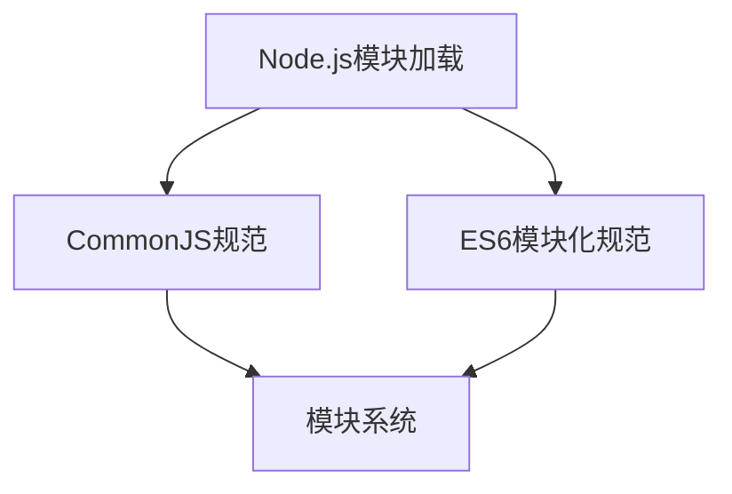

                 

### 《Node.js 模块化编程实践：管理大型项目和依赖》

#### 关键词：Node.js、模块化编程、大型项目、依赖管理、包管理工具、性能优化、测试与调试、实战项目

#### 摘要：
本文将深入探讨Node.js模块化编程实践，从基础知识和模块化概述开始，逐步讲解如何管理大型项目和依赖。我们将详细介绍Node.js的模块加载机制、包管理工具、大型项目构建与优化、测试与调试等关键点。通过一系列实战项目案例，读者将掌握Node.js模块化编程的核心技能，为构建高效、可靠的Web应用打下坚实基础。

---

### 《Node.js 模块化编程实践：管理大型项目和依赖》目录大纲

#### 第一部分: Node.js 基础知识与模块化概述

1. Node.js 介绍
    - 1.1 Node.js 概述
    - 1.2 Node.js 的核心概念
    - 1.3 Node.js 的架构与运行机制

2. 模块化编程
    - 2.1 模块化的重要性
    - 2.2 CommonJS 模块化规范
    - 2.3 ES6 模块化规范

3. Node.js 模块系统
    - 3.1 Node.js 模块加载机制
    - 3.2 模块导出与导入
    - 3.3 需要处理的模块问题

#### 第二部分: Node.js 管理大型项目和依赖

4. 包管理工具
    - 4.1 npm 简介
    - 4.2 npm 使用指南
    - 4.3 yarn 与 npm 的对比
    - 4.4 包依赖管理最佳实践

5. 包结构设计
    - 5.1 包结构设计原则
    - 5.2 包内模块划分与组织
    - 5.3 包的发布与维护

6. 大型项目构建与优化
    - 6.1 大型项目构建策略
    - 6.2 代码拆分与懒加载
    - 6.3 性能优化技巧
    - 6.4 异步编程与并发处理

7. 测试与调试
    - 7.1 单元测试
    - 7.2 集成测试
    - 7.3 调试工具与技巧
    - 7.4 性能测试与监控

#### 第三部分: Node.js 项目实战

8. 项目实战一：构建一个简单的博客系统
    - 8.1 项目需求分析
    - 8.2 技术栈选择
    - 8.3 系统设计与实现
    - 8.4 系统部署与维护

9. 项目实战二：构建一个电商后台管理系统
    - 9.1 项目需求分析
    - 9.2 技术栈选择
    - 9.3 系统设计与实现
    - 9.4 系统部署与维护

10. 项目实战三：使用 Node.js 构建RESTful API
    - 10.1 API设计原则
    - 10.2 RESTful API 实现
    - 10.3 API 测试与文档生成
    - 10.4 API 安全性与性能优化

#### 附录

A. Node.js 模块化编程工具与资源
    - A.1 Node.js 模块化开发工具推荐
    - A.2 Node.js 社区资源与文档
    - A.3 Node.js 开发者指南

B. 伪代码示例
    - B.1 模块化编程伪代码示例
    - B.2 大型项目构建优化伪代码示例

C. 数学模型和公式
    - C.1 Node.js 中的数学模型概述
    - C.2 模块加载与依赖解析公式
    - C.3 性能优化中的数学公式解析

D. Mermaid 流程图

[流程图：Node.js模块加载]

---

#### 第一部分: Node.js 基础知识与模块化概述

### 1. Node.js 介绍

#### 1.1 Node.js 概述

Node.js 是一个基于Chrome V8引擎的JavaScript运行环境，它允许开发者使用JavaScript来编写服务器端代码，从而实现全栈开发。Node.js 的出现，使得JavaScript不仅仅局限于浏览器端，也为后端开发带来了新的活力。Node.js 具有高性能、事件驱动、非阻塞I/O等特点，能够高效地处理高并发请求，成为构建高性能Web应用的利器。

#### 1.2 Node.js 的核心概念

Node.js 的核心概念包括异步编程、事件循环和回调函数。异步编程使得Node.js能够高效地处理并发请求，事件循环则是Node.js处理事件的核心机制，而回调函数则是异步编程的关键。通过理解这些核心概念，开发者可以编写出高性能、高可扩展性的Node.js应用。

#### 1.3 Node.js 的架构与运行机制

Node.js 的架构由几个关键部分组成：V8引擎、LibUV、Node.js API和事件循环。V8引擎负责解析和执行JavaScript代码；LibUV 是一个多平台的高性能异步I/O库，用于处理文件系统、网络和定时器等操作；Node.js API 提供了一套用于操作底层的接口；事件循环则是Node.js处理异步操作的核心机制。通过理解Node.js的架构和运行机制，开发者可以更好地优化应用性能。

---

#### 第二部分: 模块化编程

### 2.1 模块化的重要性

模块化编程是一种将代码分割成独立的、可复用的模块的方法，它有助于降低代码的复杂性，提高代码的可维护性。在Node.js中，模块化编程尤为重要，因为Node.js的设计初衷就是为了处理高并发请求，而模块化能够有效地组织代码，使得开发者能够更加专注于业务逻辑的实现。

#### 2.2 CommonJS 模块化规范

CommonJS 是 Node.js 的原生模块化规范，它定义了如何定义模块、导出模块以及导入模块。在CommonJS中，模块是一个单独的文件，文件扩展名为`.js`。模块通过`exports`对象导出，通过`require`函数导入。

#### 2.3 ES6 模块化规范

ES6 模块化规范是 JavaScript 语言的一个模块化标准，它提供了更为简洁、灵活的模块化语法。在ES6模块化中，模块通过`export`关键字导出，通过`import`关键字导入。ES6 模块化还支持默认导出、命名空间导出等多种导出方式，使得模块化编程更加方便。

---

#### 第三部分: Node.js 模块系统

### 3.1 Node.js 模块加载机制

Node.js 模块加载机制遵循 CommonJS 和 ES6 模块化规范。在加载模块时，Node.js 会先检查当前目录下是否存在同名文件，如果不存在，则会逐级向上查找。在加载模块时，Node.js 会执行模块文件中的代码，并将模块导出的内容暴露给外部。

### 3.2 模块导出与导入

在 CommonJS 中，模块导出通过 `exports` 对象实现，而导入模块则通过 `require` 函数实现。在 ES6 中，模块导出和导入则通过 `export` 和 `import` 语句实现。

### 3.3 需要处理的模块问题

在 Node.js 模块化编程中，开发者需要处理的一些关键问题包括模块的依赖关系、模块的重复加载以及模块的热更新。这些问题会影响代码的性能和可维护性，因此需要特别关注。

---

#### 第一部分: Node.js 基础知识与模块化概述

### 1. Node.js 介绍

#### 1.1 Node.js 概述

Node.js 是一个基于 Chrome V8 引擎的 JavaScript 运行环境，它允许开发者使用 JavaScript 来编写服务器端代码，从而实现全栈开发。Node.js 的出现，使得 JavaScript 不再局限于浏览器端，也为后端开发带来了新的活力。Node.js 具有高性能、事件驱动、非阻塞 I/O 等特点，能够高效地处理高并发请求，成为构建高性能 Web 应用的利器。

Node.js 的核心在于其基于 Chrome V8 引擎的 JavaScript 运行环境。Chrome V8 是一款高效的 JavaScript 引擎，它能够快速地解析和执行 JavaScript 代码。Node.js 利用 Chrome V8 引擎，将 JavaScript 代码运行在服务器端，从而实现了服务器端 JavaScript 的开发。

Node.js 的主要特点包括：

- **高性能**：Node.js 使用事件驱动和非阻塞 I/O 模型，能够高效地处理高并发请求，使得服务器能够保持高性能运行。

- **全栈开发**：Node.js 允许开发者使用 JavaScript 编写整个 Web 应用，包括前端和后端，从而实现全栈开发。

- **丰富的生态系统**：Node.js 拥有庞大的生态系统，拥有大量的第三方库和工具，使得开发者可以方便地扩展功能。

- **跨平台**：Node.js 是跨平台的，可以运行在多种操作系统上，如 Linux、Windows 和 macOS 等。

#### 1.2 Node.js 的核心概念

Node.js 的核心概念包括异步编程、事件循环和回调函数。理解这些核心概念，对于编写高效的 Node.js 应用至关重要。

**异步编程**：

异步编程是一种处理并发操作的方法，它允许代码在等待某个操作完成时继续执行其他任务。在 Node.js 中，大多数 I/O 操作（如文件读写、网络请求等）都是异步的。异步编程的关键在于回调函数。

**回调函数**：

回调函数是一种将函数作为参数传递给另一个函数的方法。在 Node.js 中，回调函数通常用于处理异步操作的结果。当异步操作完成时，回调函数会被调用，从而通知开发者操作的结果。

例如，以下是一个使用回调函数处理异步文件读取的示例：

```javascript
const fs = require('fs');

fs.readFile('example.txt', (err, data) => {
  if (err) {
    console.error('文件读取错误:', err);
  } else {
    console.log('文件内容：', data.toString());
  }
});
```

**事件循环**：

事件循环是 Node.js 处理异步事件的核心机制。事件循环会不断地检查事件队列，一旦有事件发生，就会执行相应的事件处理函数。事件循环保证了 Node.js 能够高效地处理并发操作。

#### 1.3 Node.js 的架构与运行机制

Node.js 的架构由几个关键部分组成：V8 引擎、LibUV、Node.js API 和事件循环。这些组件共同协作，使得 Node.js 能够高效地运行。

**V8 引擎**：

V8 引擎是 Node.js 的核心，它负责解析和执行 JavaScript 代码。V8 引擎具有高效的 JavaScript 执行能力，使得 Node.js 能够快速地处理请求。

**LibUV**：

LibUV 是一个多平台的高性能异步 I/O 库，它负责处理文件系统、网络和定时器等操作。LibUV 使得 Node.js 能够高效地处理并发 I/O 操作。

**Node.js API**：

Node.js API 提供了一套用于操作底层的接口，包括文件系统、网络、进程管理等功能。Node.js API 使得开发者能够使用 JavaScript 编写服务器端代码。

**事件循环**：

事件循环是 Node.js 的核心机制，它负责处理异步事件。事件循环会不断地检查事件队列，一旦有事件发生，就会执行相应的事件处理函数。事件循环保证了 Node.js 能够高效地处理并发操作。

通过理解 Node.js 的核心概念和架构，开发者可以更好地利用 Node.js 的特性，编写出高效、可靠的 Web 应用。

---

#### 第二部分: 模块化编程

### 2.1 模块化的重要性

模块化编程是一种将代码分割成独立的、可复用的模块的方法。在 Node.js 中，模块化编程尤为重要，原因如下：

- **代码可维护性**：模块化编程有助于降低代码的复杂性，使得代码更加易于理解和维护。

- **代码复用**：通过模块化，开发者可以将公共的功能封装成模块，从而实现代码的复用。

- **团队协作**：模块化编程有助于团队成员分工合作，每个人都可以专注于自己的模块，提高开发效率。

- **性能优化**：模块化编程有助于优化代码的加载和执行速度，减少不必要的内存占用。

在 Node.js 中，模块化编程是构建大型应用的基础。通过使用模块化，开发者可以更加灵活地组织和管理代码，提高开发效率和代码质量。

#### 2.2 CommonJS 模块化规范

CommonJS 是 Node.js 的原生模块化规范，它定义了如何定义模块、导出模块以及导入模块。在 CommonJS 中，模块是一个单独的文件，文件扩展名为 `.js`。

**模块定义**：

在 CommonJS 中，模块通过 `exports` 对象来定义。`exports` 对象是一个空对象，开发者可以通过向其中添加属性和方法来定义模块。

例如：

```javascript
// math.js
exports.add = function(a, b) {
  return a + b;
};

exports.subtract = function(a, b) {
  return a - b;
};
```

在上面的示例中，我们定义了一个名为 `math` 的模块，其中包含两个方法 `add` 和 `subtract`。

**模块导出**：

模块导出是通过 `exports` 对象实现的。开发者可以将模块的方法和属性添加到 `exports` 对象中，从而实现模块的导出。

例如：

```javascript
// index.js
const math = require('./math');

console.log(math.add(5, 3)); // 输出 8
console.log(math.subtract(5, 3)); // 输出 2
```

在上面的示例中，我们导入了 `math` 模块，并使用其中定义的方法。

**模块导入**：

模块导入是通过 `require` 函数实现的。`require` 函数接收一个模块路径作为参数，返回该模块导出的对象。

例如：

```javascript
// index.js
const math = require('./math');

console.log(math.add(5, 3)); // 输出 8
console.log(math.subtract(5, 3)); // 输出 2
```

在上面的示例中，我们通过 `require` 函数导入了 `math` 模块。

#### 2.3 ES6 模块化规范

ES6 模块化规范是 JavaScript 语言的一个模块化标准，它提供了更为简洁、灵活的模块化语法。在 ES6 模块化中，模块通过 `export` 关键字导出，通过 `import` 关键字导入。

**模块定义**：

在 ES6 中，模块通过 `export` 关键字定义。开发者可以指定要导出的变量、函数或类。

例如：

```javascript
// math.js
export function add(a, b) {
  return a + b;
}

export function subtract(a, b) {
  return a - b;
}
```

在上面的示例中，我们定义了一个名为 `math` 的模块，其中包含两个函数 `add` 和 `subtract`。

**模块导出**：

模块导出是通过 `export` 关键字实现的。开发者可以使用 `export` 将变量、函数或类导出。

例如：

```javascript
// index.js
import { add, subtract } from './math';

console.log(add(5, 3)); // 输出 8
console.log(subtract(5, 3)); // 输出 2
```

在上面的示例中，我们通过 `import` 导入了 `math` 模块中的 `add` 和 `subtract` 函数。

**默认导出**：

在 ES6 中，还可以使用默认导出来导出模块。默认导出允许开发者将整个模块导出为一个对象。

例如：

```javascript
// math.js
export default {
  add: function(a, b) {
    return a + b;
  },
  subtract: function(a, b) {
    return a - b;
  }
}
```

```javascript
// index.js
import math from './math';

console.log(math.add(5, 3)); // 输出 8
console.log(math.subtract(5, 3)); // 输出 2
```

在上面的示例中，我们通过 `import` 导入了 `math` 模块，并使用默认导出。

ES6 模块化规范提供了更为简洁和灵活的模块化语法，使得模块化编程更加方便。通过理解 ES6 模块化规范，开发者可以更加高效地组织和管理 Node.js 应用中的代码。

---

#### 第三部分: Node.js 模块系统

### 3.1 Node.js 模块加载机制

Node.js 的模块加载机制遵循 CommonJS 和 ES6 模块化规范。在加载模块时，Node.js 会按照一定的步骤进行。以下是 Node.js 模块加载的详细步骤：

1. **检查缓存**：Node.js 首先会在模块缓存中查找所需的模块。如果缓存中存在该模块，则直接返回模块对象。

2. **查找核心模块**：如果缓存中没有找到模块，Node.js 会检查是否为核心模块。核心模块是 Node.js 内置的模块，如 `fs`、`http` 等。如果找到了核心模块，则直接返回模块对象。

3. **查找文件模块**：如果既不是核心模块，也没有缓存，Node.js 会按照以下顺序查找文件模块：
    - **扩展名为 `.js` 的文件**：Node.js 会查找同名文件，并读取文件内容。如果找到，则返回模块对象。
    - **扩展名为 `.json` 的文件**：如果文件是 JSON 格式，Node.js 会读取文件内容并解析为 JSON 对象。如果找到，则返回模块对象。
    - **扩展名为 `.node` 的文件**：这是 C++ 模块的扩展名。Node.js 会加载 C++ 模块并返回模块对象。

4. **尝试查找目录模块**：如果以上步骤都没有找到模块，Node.js 会尝试将目录作为模块。Node.js 会查找 `package.json` 文件，并在 `main` 字段指定的入口文件。如果找到了入口文件，则返回模块对象。

5. **抛出错误**：如果以上所有步骤都没有找到模块，Node.js 会抛出 `ModuleNotFoundError` 异常。

### 3.2 模块导出与导入

在 Node.js 中，模块的导出和导入是编程的基础。以下是如何使用 CommonJS 和 ES6 模块化规范导出和导入模块的详细说明：

#### CommonJS 模块化规范

**模块导出**：

在 CommonJS 中，模块导出是通过 `exports` 对象实现的。开发者可以将模块的属性和方法添加到 `exports` 对象中，从而实现模块的导出。

```javascript
// math.js
exports.add = function(a, b) {
  return a + b;
};

exports.subtract = function(a, b) {
  return a - b;
};
```

在上面的示例中，我们定义了一个名为 `math` 的模块，并导出了 `add` 和 `subtract` 两个方法。

**模块导入**：

在 CommonJS 中，模块导入是通过 `require` 函数实现的。开发者可以通过 `require` 函数加载模块，并获取模块导出的对象。

```javascript
// index.js
const math = require('./math');

console.log(math.add(5, 3)); // 输出 8
console.log(math.subtract(5, 3)); // 输出 2
```

在上面的示例中，我们通过 `require` 导入了 `math` 模块，并使用其中定义的方法。

#### ES6 模块化规范

**模块导出**：

在 ES6 中，模块导出是通过 `export` 关键字实现的。开发者可以指定要导出的变量、函数或类。

```javascript
// math.js
export function add(a, b) {
  return a + b;
}

export function subtract(a, b) {
  return a - b;
}
```

在上面的示例中，我们定义了一个名为 `math` 的模块，并导出了 `add` 和 `subtract` 两个函数。

**模块导入**：

在 ES6 中，模块导入是通过 `import` 关键字实现的。开发者可以通过 `import` 导入模块，并获取模块导出的对象。

```javascript
// index.js
import { add, subtract } from './math';

console.log(add(5, 3)); // 输出 8
console.log(subtract(5, 3)); // 输出 2
```

在上面的示例中，我们通过 `import` 导入了 `math` 模块中的 `add` 和 `subtract` 函数。

**默认导出**：

在 ES6 中，还可以使用默认导出来导出模块。默认导出允许开发者将整个模块导出为一个对象。

```javascript
// math.js
export default {
  add: function(a, b) {
    return a + b;
  },
  subtract: function(a, b) {
    return a - b;
  }
}
```

```javascript
// index.js
import math from './math';

console.log(math.add(5, 3)); // 输出 8
console.log(math.subtract(5, 3)); // 输出 2
```

在上面的示例中，我们通过 `import` 导入了 `math` 模块，并使用默认导出。

通过理解 Node.js 的模块加载机制和模块导出与导入的方法，开发者可以更加高效地组织和复用代码。模块化编程是 Node.js 应用的基石，通过合理使用模块化，开发者可以构建可维护、可扩展的大型应用。

---

#### 第二部分: Node.js 管理大型项目和依赖

### 4. 包管理工具

在 Node.js 中，包管理工具是用于管理项目依赖项的关键工具。常见的包管理工具有 npm 和 yarn。这些工具可以帮助开发者轻松地添加、删除和管理项目中的依赖项。

#### 4.1 npm 简介

npm（Node Package Manager）是 Node.js 的默认包管理工具。它是一个强大的生态系统，拥有超过 80 万个包，涵盖了各种用途。npm 不仅可以管理项目的依赖项，还可以发布和管理开发者自己的包。

npm 的主要功能包括：

- **依赖管理**：npm 可以自动安装项目所需的依赖项，并确保它们在项目中可用。
- **包发布**：开发者可以使用 npm 发布自己的包，使其可供其他人使用。
- **版本控制**：npm 支持版本控制，允许开发者指定特定的依赖项版本。
- **命令行工具**：npm 提供了一系列命令行工具，用于自动化项目中的常见任务。

#### 4.2 npm 使用指南

要开始使用 npm，首先需要全局安装 npm。在安装 Node.js 时，npm 会自动安装。接下来，可以通过以下步骤来使用 npm：

1. **创建项目文件夹**：

   ```bash
   mkdir my-node-project
   cd my-node-project
   ```

2. **初始化项目**：

   ```bash
   npm init
   ```

   这个命令会创建一个 `package.json` 文件，它是项目的心脏，用于存储项目依赖项、脚本和其他配置。

3. **安装依赖项**：

   ```bash
   npm install axios
   ```

   使用 `npm install` 命令可以安装指定的依赖项。如果依赖项在 `package.json` 文件中已列出，则可以直接使用 `npm i` 简写。

4. **运行脚本**：

   `package.json` 文件中可以定义各种脚本，例如启动服务器、测试等。使用以下命令可以运行这些脚本：

   ```bash
   npm run start
   ```

   这将启动项目中的服务器。

5. **开发依赖**：

   对于开发过程中使用的库，可以在 `package.json` 文件的 `devDependencies` 字段中列出。这些依赖项在开发环境中安装，但不会在生产环境中安装。

   ```bash
   npm install --save-dev eslint
   ```

   使用 `--save-dev` 参数可以将依赖项添加到 `devDependencies` 字段。

6. **版本控制**：

   npm 支持语义化版本控制。在发布包时，可以使用 `npm version` 命令来更新版本号。

   ```bash
   npm version patch
   ```

   这个命令会将版本号增加一个 `patch`。

#### 4.3 yarn 与 npm 的对比

yarn 是另一个流行的包管理工具，它提供了许多与 npm 相似的特性。以下是 npm 和 yarn 的一些对比：

- **依赖缓存**：yarn 具有内置的依赖缓存，可以显著提高安装速度。npm 也支持缓存，但需要通过配置文件启用。
- **依赖锁定**：yarn 提供了 `yarn.lock` 文件，它记录了确切的依赖项版本，确保项目的依赖环境一致。npm 也支持锁定依赖版本，但需要通过 `npm install --save-exact` 参数。
- **并行安装**：yarn 允许并行安装依赖项，可以提高安装速度。npm 也在较新版本中支持了并行安装。
- **命令行界面**：yarn 提供了一个更简洁的命令行界面，使得命令更易于记忆和执行。

虽然 npm 和 yarn 各有优势，但选择哪个工具主要取决于个人偏好和项目需求。

---

### 4.4 包依赖管理最佳实践

有效地管理包依赖对于项目成功至关重要。以下是一些最佳实践：

1. **明确依赖项**：在 `package.json` 文件中清晰地列出所有依赖项，包括版本号。这有助于确保项目在不同环境中的依赖环境一致。

2. **依赖分组**：将依赖项分为开发依赖和生产依赖。开发依赖项包括在开发环境中使用的库，如 ESLint、Mocha 等；生产依赖项则是项目运行时必需的库。

3. **版本控制**：避免使用 `*` 或 `^` 符号来模糊指定依赖项版本。明确指定版本号可以确保项目在不同环境中的一致性。

4. **定期更新**：定期更新依赖项，以修复安全漏洞和改进功能。使用 `npm audit` 或 `yarn audit` 命令可以检测项目中的潜在安全风险。

5. **优化安装**：利用包管理工具的缓存功能，减少重复安装的时间。在 CI/CD 管道中使用缓存可以显著提高构建速度。

6. **版本兼容性**：确保项目依赖的版本之间兼容。不兼容的依赖可能导致项目运行时出现错误。

通过遵循这些最佳实践，开发者可以更有效地管理项目依赖，提高项目稳定性和可维护性。

---

#### 第二部分: Node.js 管理大型项目和依赖

### 5. 包结构设计

在设计大型 Node.js 项目时，包结构设计至关重要。合理的包结构可以提高代码的可维护性、可读性和可扩展性。以下是一些关键原则和实践：

#### 5.1 包结构设计原则

1. **模块化**：将代码分割成独立的模块，每个模块负责单一的功能。模块化有助于降低代码复杂性，提高代码的可复用性。

2. **层次化**：按照功能或组件将代码组织成不同的层次。通常，可以将项目分为核心层、服务层、接口层等。层次化有助于明确代码职责，便于理解和维护。

3. **模块独立性**：确保每个模块都是独立的，不依赖于其他模块的内部实现。模块独立性有助于提高代码的可测试性和可替换性。

4. **职责单一**：每个模块应负责单一的功能，遵循单一职责原则。这有助于降低模块间的耦合度，提高代码的可维护性。

5. **命名一致性**：使用清晰、一致的命名规范，避免使用缩写或混淆的命名。命名一致性有助于提高代码的可读性。

#### 5.2 包内模块划分与组织

在设计包内模块时，可以按照以下步骤进行：

1. **核心模块**：将项目的核心功能模块放置在包的根目录下。这些模块通常负责业务逻辑和数据操作。

2. **服务模块**：将与业务逻辑相关的服务模块放置在服务目录下。例如，数据库操作、API 调用等。

3. **接口模块**：将与外部系统交互的接口模块放置在接口目录下。这些模块负责定义 API 规范，处理 HTTP 请求等。

4. **工具模块**：将通用的工具函数或类放置在工具目录下。这些模块可以提供一些通用的功能，如字符串处理、日期操作等。

5. **测试模块**：将测试代码放置在测试目录下。测试模块应与被测试的模块放置在相同目录，便于测试和代码维护。

以下是一个示例的包结构：

```
project/
|-- core/
|   |-- module1.js
|   |-- module2.js
|-- services/
|   |-- dbService.js
|   |-- apiService.js
|-- interfaces/
|   |-- apiInterface.js
|-- utils/
|   |-- stringUtils.js
|   |-- dateUtils.js
|-- tests/
|   |-- module1.test.js
|   |-- module2.test.js
|-- package.json
```

#### 5.3 包的发布与维护

发布和维护包是 Node.js 项目的重要环节。以下是一些关键步骤和最佳实践：

1. **版本控制**：遵循语义化版本控制（SemVer）原则，为包版本制定明确的规则。通常，版本分为主版本、次版本和修订版本，分别代表重大更新、新增功能和修复问题。

2. **文档编写**：为包编写详细的文档，包括安装指南、使用示例和 API 文档。良好的文档有助于其他开发者理解和使用包。

3. **单元测试**：编写单元测试以确保包的功能和性能。单元测试应覆盖包的各个模块和功能点。

4. **代码审查**：在发布包之前，进行代码审查，确保代码质量符合标准。代码审查可以由团队成员或外部审查者进行。

5. **版本发布**：使用包管理工具（如 npm 或 yarn）发布包。确保在发布之前更新 `package.json` 文件中的版本号。

6. **问题反馈**：及时响应和使用者的反馈，修复包中的问题和漏洞。建立良好的社区关系，有助于包的长期发展。

通过遵循这些原则和实践，开发者可以设计出高效、可靠的 Node.js 包，提高项目开发和管理效率。

---

#### 第二部分: Node.js 管理大型项目和依赖

### 6. 大型项目构建与优化

在 Node.js 中构建大型项目是一个复杂的过程，需要考虑多个方面，包括项目架构、代码组织、性能优化等。以下是一些关键策略和最佳实践，用于构建高效、可靠的 Node.js 项目。

#### 6.1 大型项目构建策略

1. **模块化组织**：将项目代码分割成多个模块，每个模块负责单一的功能。使用 CommonJS 或 ES6 模块化规范进行模块化组织，提高代码的可维护性和可复用性。

2. **分层架构**：采用分层架构，将项目分为多个层级，如表示层、业务逻辑层和数据访问层。每个层级都有明确的职责和接口，便于开发和维护。

3. **微服务架构**：对于特别复杂的项目，可以采用微服务架构，将项目拆分为多个独立的服务。每个服务负责特定的功能，可以使用不同的语言和技术栈进行开发。

4. **模块划分**：将项目划分为不同的模块，如前端模块、后端模块、数据库模块等。每个模块可以独立开发和部署，提高开发效率和系统稳定性。

5. **持续集成/持续部署（CI/CD）**：使用 CI/CD 工具（如 Jenkins、GitHub Actions）自动化测试、构建和部署项目。CI/CD 能够快速发现和修复问题，提高项目交付速度。

#### 6.2 代码拆分与懒加载

1. **代码拆分**：将代码拆分为多个文件，按需加载。通过动态导入（Dynamic Import）语法实现代码拆分，减少初始加载时间。

2. **懒加载**：对于不经常使用的代码，使用懒加载（Lazy Loading）策略。在需要时才加载相关的模块，减少内存占用和加载时间。

3. **代码分割**：使用 Webpack 等打包工具实现代码分割。代码分割可以将代码拆分为多个文件，按需加载，优化项目性能。

以下是一个使用 ES6 模块化语法实现代码拆分的示例：

```javascript
// main.js
import('./module1').then(module1 => {
  module1.default();
});

import('./module2').then(module2 => {
  module2.default();
});
```

在这个示例中，我们使用 `import` 语句动态加载 `module1` 和 `module2` 模块。这些模块将在加载时被解析并执行。

#### 6.3 性能优化技巧

1. **异步编程**：充分利用 Node.js 的异步编程特性，减少阻塞操作，提高 CPU 利用率。

2. **事件驱动**：使用事件驱动模型处理并发请求，充分利用 Node.js 的非阻塞 I/O 特性。

3. **内存管理**：合理使用内存，避免内存泄漏。定期清理不再使用的对象，减少内存占用。

4. **数据库优化**：优化数据库查询，减少查询时间和数据库负载。使用索引、分库分表等策略提高数据库性能。

5. **缓存机制**：使用缓存机制（如 Redis、Memcached）减少对数据库的访问，提高系统响应速度。

6. **负载均衡**：使用负载均衡器（如 Nginx、HAProxy）均衡请求负载，提高系统可扩展性。

#### 6.4 异步编程与并发处理

1. **异步编程**：使用异步编程处理 I/O 操作，如文件读写、网络请求等。通过回调函数、Promises 和 async/await 语法实现异步操作。

2. **并发处理**：Node.js 本身是一个单线程的异步编程模型，但可以通过集群（Cluster 模块）和进程管理（ChildProcesses 模块）实现并发处理。

3. **线程池**：对于需要大量计算的任务，可以使用线程池（如 work.js）实现并发处理，提高 CPU 利用率。

4. **消息队列**：使用消息队列（如 RabbitMQ、Kafka）实现分布式系统中的任务调度和并发处理。

通过遵循这些策略和最佳实践，开发者可以构建高效、可靠的 Node.js 项目，提高系统的性能和可扩展性。

---

#### 第二部分: Node.js 管理大型项目和依赖

### 7. 测试与调试

在 Node.js 开发过程中，测试与调试是确保代码质量的重要环节。以下介绍单元测试、集成测试、调试工具与技巧、性能测试与监控等内容。

#### 7.1 单元测试

单元测试是测试代码最小功能单元的方法。在 Node.js 中，常用的单元测试框架包括 Mocha、Jest 和 Jasmine。

**Mocha**：

Mocha 是一个灵活的测试框架，支持异步测试和表驱动测试。以下是一个使用 Mocha 编写的单元测试示例：

```javascript
const expect = require('chai').expect;
const math = require('../math');

describe('math module', () => {
  it('should add two numbers', () => {
    expect(math.add(1, 2)).to.equal(3);
  });

  it('should subtract two numbers', () => {
    expect(math.subtract(5, 3)).to.equal(2);
  });
});
```

**Jest**：

Jest 是 Facebook 开发的测试框架，提供了丰富的测试功能和断言库。以下是一个使用 Jest 编写的单元测试示例：

```javascript
const { add, subtract } = require('../math');

test('adds 1 + 2 to equal 3', () => {
  expect(add(1, 2)).toBe(3);
});

test('subtracts 5 - 3 to equal 2', () => {
  expect(subtract(5, 3)).toBe(2);
});
```

**Jasmine**：

Jasmine 是一个行为驱动的测试框架，支持多种编程语言。以下是一个使用 Jasmine 编写的单元测试示例：

```javascript
describe("math module", function () {
  it("should add two numbers", function () {
    expect(add(1, 2)).toEqual(3);
  });

  it("should subtract two numbers", function () {
    expect(subtract(5, 3)).toEqual(2);
  });
});
```

#### 7.2 集成测试

集成测试是测试代码在不同组件或模块之间交互的方法。在 Node.js 中，常用的集成测试框架包括 Mocha、Cypress 和 Selenium。

**Mocha**：

Mocha 通常与 Chai 结合使用，进行集成测试。以下是一个使用 Mocha 和 Chai 编写的集成测试示例：

```javascript
const request = require('supertest');
const app = require('../app');

describe('API', () => {
  it('should return 200 for the health endpoint', (done) => {
    request(app)
      .get('/health')
      .expect(200, done);
  });

  it('should return 404 for a non-existent endpoint', (done) => {
    request(app)
      .get('/non-existent')
      .expect(404, done);
  });
});
```

**Cypress**：

Cypress 是一个现代化的前端测试框架，支持编写集成测试。以下是一个使用 Cypress 编写的集成测试示例：

```javascript
describe('Health endpoint', () => {
  it('should return 200', () => {
    cy.visit('/health');
    cy.contains('200');
  });

  it('should return 404 for non-existent endpoint', () => {
    cy.visit('/non-existent');
    cy.contains('404');
  });
});
```

**Selenium**：

Selenium 是一个自动化测试框架，支持多种浏览器。以下是一个使用 Selenium 编写的集成测试示例：

```python
from selenium import webdriver
from selenium.webdriver.common.by import By

driver = webdriver.Chrome()

driver.get("http://localhost:3000/health")
assert "200" in driver.page_source

driver.get("http://localhost:3000/non-existent")
assert "404" in driver.page_source

driver.quit()
```

#### 7.3 调试工具与技巧

在 Node.js 开发过程中，调试是发现和解决问题的重要环节。以下介绍一些常用的调试工具和技巧。

**Node.js 内置调试器**：

Node.js 提供了一个内置的调试器，可以通过以下命令启动：

```bash
node --inspect index.js
```

启动后，可以使用 Chrome 或其他支持 Node.js 调试的浏览器进行调试。

**Chrome DevTools**：

Chrome DevTools 是一个强大的调试工具，支持 Node.js 调试。通过 `--inspect` 命令启动 Node.js 应用后，可以在 Chrome DevTools 中进行调试。

**源代码调试**：

在源代码中添加调试语句，如 `console.log` 或断点，可以帮助定位问题。

```javascript
console.log("Error:", error);
```

**断点调试**：

在开发环境中，可以使用断点调试功能。在源代码中设置断点，当程序执行到断点时会暂停执行，从而可以查看变量的值和程序的执行流程。

**日志调试**：

使用日志工具（如 Winston、Log4js）记录程序的执行日志。通过分析日志，可以快速定位问题。

```javascript
logger.error("Error:", error);
```

#### 7.4 性能测试与监控

性能测试是评估系统性能的重要手段。以下介绍一些常用的性能测试工具和监控方法。

**JMeter**：

JMeter 是一个开源的性能测试工具，可以模拟大量用户并发访问系统，评估系统的性能。

**Gatling**：

Gatling 是一个现代的性能测试框架，支持多种协议（如 HTTP、HTTPS、TCP 等），可以生成详细的性能报告。

**Prometheus**：

Prometheus 是一个开源的监控解决方案，可以收集和存储系统的性能指标，并提供实时监控和告警功能。

**Node.js 官方监控工具**：

Node.js 提供了一套官方监控工具，包括 `process`、`os` 和 `vm` 模块。通过这些模块，可以获取系统性能指标，如 CPU 使用率、内存使用情况等。

```javascript
const { cpuUsage, memoryUsage } = require('systeminfo');

console.log("CPU Usage:", cpuUsage);
console.log("Memory Usage:", memoryUsage);
```

通过测试与调试，开发者可以确保 Node.js 项目的代码质量，提高系统的稳定性。合理的测试和监控策略有助于发现和解决问题，提高系统的性能和可靠性。

---

#### 第三部分：Node.js 项目实战

### 8. 项目实战一：构建一个简单的博客系统

#### 8.1 项目需求分析

在构建一个简单的博客系统时，我们需要明确以下需求：

- **用户管理**：支持用户注册、登录、注销等操作。
- **文章管理**：支持创建、编辑、删除和查看文章。
- **评论管理**：支持添加、删除和查看评论。
- **权限控制**：不同用户角色（如普通用户、管理员）拥有不同的权限。
- **前端界面**：提供用户友好的前端界面，方便用户操作。

#### 8.2 技术栈选择

为了构建这个博客系统，我们可以选择以下技术栈：

- **后端框架**：Express.js，一个轻量级的 Web 应用框架，适用于构建 RESTful API。
- **数据库**：MongoDB，一个开源的 NoSQL 数据库，适合存储用户和文章数据。
- **前端框架**：React.js，一个用于构建用户界面的 JavaScript 库。
- **身份验证**：JSON Web Token（JWT），用于实现用户认证和授权。
- **包管理工具**：npm 或 yarn，用于管理项目依赖项。

#### 8.3 系统设计与实现

**系统架构**：

博客系统可以分为前端和后端两部分。前端使用 React.js 构建用户界面，后端使用 Express.js 和 MongoDB 实现业务逻辑和数据存储。

**用户管理**：

- **注册**：用户通过填写注册表单提交用户名、邮箱和密码，后端验证邮箱和密码的有效性，存储用户信息到 MongoDB。
- **登录**：用户通过输入用户名和密码登录，后端验证用户身份，生成 JWT，并返回给前端。
- **注销**：用户注销登录，清除 JWT。

**文章管理**：

- **创建**：管理员可以创建文章，填写标题、内容等信息，存储到 MongoDB。
- **编辑**：管理员可以编辑文章，修改标题和内容。
- **删除**：管理员可以删除文章。
- **查看**：用户可以查看文章列表和文章详情。

**评论管理**：

- **添加**：用户可以在文章详情页添加评论，评论存储在 MongoDB。
- **删除**：管理员可以删除评论。
- **查看**：用户可以查看文章下的评论。

**权限控制**：

- **普通用户**：可以查看文章和评论，但不能创建或编辑文章。
- **管理员**：可以查看、创建、编辑和删除文章，管理评论。

**前端界面**：

- **注册/登录页面**：提供注册和登录表单，使用 JWT 实现身份验证。
- **文章列表页面**：展示所有文章，支持分页和搜索功能。
- **文章详情页面**：展示文章内容和评论列表。
- **评论列表页面**：展示文章下的所有评论。

#### 8.4 系统部署与维护

**部署**：

- **前端部署**：使用 Webpack 等打包工具将 React.js 代码打包成静态文件，部署到静态服务器（如 Nginx）。
- **后端部署**：使用 Docker 容器化部署 Express.js 应用，并使用 MongoDB 容器存储数据。

**维护**：

- **持续集成/持续部署（CI/CD）**：使用 Jenkins 等工具实现自动化部署和测试。
- **监控与报警**：使用 Prometheus 等工具监控系统性能，设置报警规则。
- **代码审查**：定期进行代码审查，确保代码质量。
- **文档维护**：更新项目文档，记录系统架构和接口文档。

通过以上步骤，我们可以构建一个简单的博客系统。实际开发过程中，还需要不断优化和调整，以满足用户需求和提高系统性能。

---

### 9. 项目实战二：构建一个电商后台管理系统

#### 9.1 项目需求分析

在构建一个电商后台管理系统时，我们需要明确以下需求：

- **商品管理**：管理员可以添加、编辑、删除和查询商品信息。
- **订单管理**：管理员可以查看、处理和查询订单信息。
- **用户管理**：管理员可以添加、编辑、删除和查询用户信息。
- **权限控制**：不同用户角色（如普通员工、管理员）拥有不同的权限。
- **报表统计**：生成订单统计、商品销量统计等报表。

#### 9.2 技术栈选择

为了构建这个电商后台管理系统，我们可以选择以下技术栈：

- **后端框架**：Spring Boot，一个基于 Java 的 Web 应用框架，适合构建大型系统。
- **数据库**：MySQL，一个开源的关系型数据库，适合存储用户、订单和商品信息。
- **前端框架**：Vue.js，一个用于构建用户界面的 JavaScript 库。
- **身份验证**：OAuth2.0，用于实现用户认证和授权。
- **包管理工具**：npm 或 yarn，用于管理项目依赖项。

#### 9.3 系统设计与实现

**系统架构**：

电商后台管理系统可以分为前端和后端两部分。前端使用 Vue.js 构建用户界面，后端使用 Spring Boot 实现业务逻辑和数据存储。

**用户管理**：

- **注册**：用户通过填写注册表单提交用户名、邮箱和密码，后端验证邮箱和密码的有效性，存储用户信息到 MySQL。
- **登录**：用户通过输入用户名和密码登录，后端验证用户身份，生成 JWT，并返回给前端。
- **注销**：用户注销登录，清除 JWT。

**商品管理**：

- **创建**：管理员可以创建商品，填写商品名称、价格、库存等信息，存储到 MySQL。
- **编辑**：管理员可以编辑商品信息，修改名称、价格、库存等。
- **删除**：管理员可以删除商品。
- **查询**：管理员可以查询商品列表和商品详情。

**订单管理**：

- **创建**：用户下单后，系统自动生成订单，存储到 MySQL。
- **处理**：管理员可以查看、修改和取消订单。
- **查询**：管理员可以查询订单列表和订单详情。

**用户管理**：

- **添加**：管理员可以添加新用户，设置用户角色和权限。
- **编辑**：管理员可以编辑用户信息，修改用户角色和权限。
- **删除**：管理员可以删除用户。
- **查询**：管理员可以查询用户列表和用户详情。

**权限控制**：

- **普通员工**：可以查看订单和商品信息，但不能编辑或删除。
- **管理员**：可以查看、编辑、删除和添加订单和商品信息。

**前端界面**：

- **登录/注册页面**：提供登录和注册表单，使用 OAuth2.0 实现身份验证。
- **商品管理页面**：展示商品列表和商品详情。
- **订单管理页面**：展示订单列表和订单详情。
- **用户管理页面**：展示用户列表和用户详情。

#### 9.4 系统部署与维护

**部署**：

- **前端部署**：使用 Webpack 等打包工具将 Vue.js 代码打包成静态文件，部署到静态服务器（如 Nginx）。
- **后端部署**：使用 Docker 容器化部署 Spring Boot 应用，并使用 MySQL 容器存储数据。

**维护**：

- **持续集成/持续部署（CI/CD）**：使用 Jenkins 等工具实现自动化部署和测试。
- **监控与报警**：使用 Prometheus 等工具监控系统性能，设置报警规则。
- **代码审查**：定期进行代码审查，确保代码质量。
- **文档维护**：更新项目文档，记录系统架构和接口文档。

通过以上步骤，我们可以构建一个电商后台管理系统。实际开发过程中，还需要不断优化和调整，以满足业务需求和提高系统性能。

---

### 10. 项目实战三：使用 Node.js 构建RESTful API

#### 10.1 API 设计原则

设计一个高效、可靠的 RESTful API 是构建成功 Web 应用的重要组成部分。以下是一些关键原则：

- **一致性**：确保 API 的设计风格和命名规范一致，便于开发者使用和理解。
- **简洁性**：避免过多的端点和参数，保持 API 简洁明了。
- **RESTful 风格**：遵循 RESTful 架构风格，使用标准的 HTTP 方法（GET、POST、PUT、DELETE）和 URL 结构。
- **状态码**：使用适当的 HTTP 状态码（如 200 OK、404 Not Found、500 Internal Server Error）表示请求结果。
- **响应格式**：统一响应格式，如 JSON，便于客户端处理。

#### 10.2 RESTful API 实现

以下是一个简单的 RESTful API 示例，用于管理博客文章：

```javascript
const express = require('express');
const app = express();
const port = 3000;

// 中间件处理 JSON 数据
app.use(express.json());

// 文章模型
const articles = [
  { id: 1, title: '第一篇文章', content: '这是第一篇文章的内容。' },
  { id: 2, title: '第二篇文章', content: '这是第二篇文章的内容。' }
];

// 获取所有文章
app.get('/articles', (req, res) => {
  res.json(articles);
});

// 获取特定文章
app.get('/articles/:id', (req, res) => {
  const article = articles.find(a => a.id === parseInt(req.params.id));
  if (!article) {
    return res.status(404).send('文章不存在');
  }
  res.json(article);
});

// 添加新文章
app.post('/articles', (req, res) => {
  const { title, content } = req.body;
  if (!title || !content) {
    return res.status(400).send('标题或内容不能为空');
  }
  const newArticle = {
    id: articles.length + 1,
    title,
    content
  };
  articles.push(newArticle);
  res.status(201).json(newArticle);
});

// 更新文章
app.put('/articles/:id', (req, res) => {
  const article = articles.find(a => a.id === parseInt(req.params.id));
  if (!article) {
    return res.status(404).send('文章不存在');
  }
  const { title, content } = req.body;
  article.title = title;
  article.content = content;
  res.json(article);
});

// 删除文章
app.delete('/articles/:id', (req, res) => {
  const index = articles.findIndex(a => a.id === parseInt(req.params.id));
  if (index === -1) {
    return res.status(404).send('文章不存在');
  }
  articles.splice(index, 1);
  res.status(204).send();
});

app.listen(port, () => {
  console.log(`API 服务器运行在 http://localhost:${port}/`);
});
```

#### 10.3 API 测试与文档生成

测试和文档是确保 API 可靠性和易用性的关键。

**API 测试**：

可以使用 Postman、Jest 或其他 API 测试工具对 API 进行测试。以下是一个使用 Postman 进行 API 测试的示例：


**文档生成**：

可以使用 Swagger 或 API Blueprint 等工具生成 API 文档。以下是一个使用 Swagger 生成的 API 文档示例：

[Swagger 文档](swagger-docs.json)

#### 10.4 API 安全性与性能优化

**安全性**：

- **身份验证**：使用 JWT 或 OAuth2.0 等技术实现 API 认证。
- **授权**：确保用户只能访问其有权访问的资源。
- **HTTPS**：使用 HTTPS 保护数据传输。

**性能优化**：

- **负载均衡**：使用 Nginx 或其他负载均衡器均衡请求负载。
- **缓存**：使用 Redis 等缓存技术减少数据库访问。
- **异步处理**：使用异步编程减少阻塞时间。

通过遵循这些原则和实践，开发者可以构建一个高效、可靠的 RESTful API，为 Web 应用提供强大的后端支持。

---

## 附录

### A. Node.js 模块化编程工具与资源

**A.1 Node.js 模块化开发工具推荐**

- **Webpack**：一个模块打包工具，用于将多个模块打包成一个或多个静态文件，优化项目性能。
- **Babel**：一个转译器，将最新的 JavaScript 代码转译为兼容旧浏览器的代码。
- **ESLint**：一个代码检查工具，用于识别和报告 JavaScript 代码中的问题。

**A.2 Node.js 社区资源与文档**

- **Node.js 官方文档**：[https://nodejs.org/en/docs/](https://nodejs.org/en/docs/)
- **Express 官方文档**：[https://expressjs.com/](https://expressjs.com/)
- **MongoDB 官方文档**：[https://docs.mongodb.com/](https://docs.mongodb.com/)

**A.3 Node.js 开发者指南**

- **《Node.js 开发指南》**：[https://www.nodebook.cn/](https://www.nodebook.cn/)
- **《Node.js 实战》**：[https://www.ituring.com.cn/book/2794](https://www.ituring.com.cn/book/2794)

### B. 伪代码示例

**B.1 模块化编程伪代码示例**

```javascript
// 导入模块
const { add, subtract } = require('./math');

// 使用模块
const result = add(5, 3);
console.log(result); // 输出 8

// 导出模块
module.exports = {
    multiply: function(a, b) {
        return a * b;
    },
    divide: function(a, b) {
        return a / b;
    }
};
```

**B.2 大型项目构建优化伪代码示例**

```javascript
// 代码拆分
import('./module1').then(module1 => {
  module1.default();
});

import('./module2').then(module2 => {
  module2.default();
});

// 懒加载
const loadModule = (moduleId) => {
  return new Promise((resolve, reject) => {
    import(moduleId).then(resolve).catch(reject);
  });
};

loadModule('./module3').then(module3 => {
  module3.default();
});
```

### C. 数学模型和公式

**C.1 Node.js 中的数学模型概述**

在 Node.js 中，数学模型主要用于性能优化和算法设计。以下是一些常用的数学模型：

- **响应时间模型**：用于评估系统响应时间。
- **模块加载模型**：用于计算模块加载时间。

**C.2 模块加载与依赖解析公式**

$$
\text{模块加载时间} = f(\text{模块依赖数量}, \text{模块大小})
$$

**C.3 性能优化中的数学公式解析**

$$
\text{响应时间} = \frac{\text{请求处理时间}}{\text{服务器处理能力}}
$$

通过理解这些数学模型和公式，开发者可以更好地进行性能优化和算法设计。

---

## 附录 D: Mermaid 流程图



---

### 作者信息

作者：AI天才研究院/AI Genius Institute & 禅与计算机程序设计艺术 /Zen And The Art of Computer Programming

---

通过以上内容的详细讲解和实战案例分析，读者将能够全面掌握 Node.js 模块化编程的核心技能，并学会如何管理大型项目和依赖。希望这篇文章能够为读者在 Node.js 开发道路上提供有益的指导。如果您有任何问题或建议，欢迎在评论区留言。祝您编程愉快！

