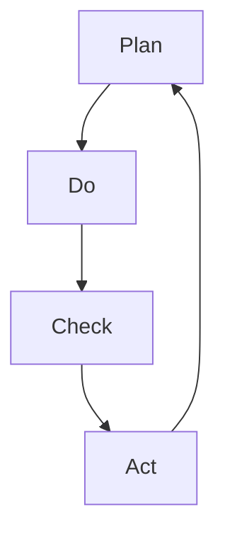

                 

# PDCA戴明环：实用的落地方法论

> 关键词：PDCA循环，戴明环，质量管理体系，持续改进，企业管理，实战应用

> 摘要：本文将深入探讨PDCA戴明环的基本概念、实战运用以及拓展应用，通过详细的步骤解析和实际案例分享，帮助读者理解和掌握这一实用的落地方法论，从而在实际工作中实现持续改进和高效管理。

## 目录大纲

#### 第一部分：PDCA戴明环概述

1. 第1章：PDCA戴明环的基本概念
   - 1.1 PDCA循环的历史背景
   - 1.2 PDCA循环的基本原理
   - 1.3 PDCA循环在企业管理中的重要性
   - 1.4 PDCA循环的核心要素

2. 第2章：PDCA循环的应用领域
   - 2.1 PDCA循环在制造业中的应用
   - 2.2 PDCA循环在服务业中的应用
   - 2.3 PDCA循环在其他行业中的应用

#### 第二部分：PDCA循环的实战运用

3. 第3章：计划（Plan）阶段的策略与技巧
   - 3.1 明确目标和需求
   - 3.2 制定详细的行动计划
   - 3.3 风险评估与管理
   - 3.4 资源配置与预算管理

4. 第4章：执行（Do）阶段的实施与控制
   - 4.1 执行前的准备
   - 4.2 执行过程中的监督与控制
   - 4.3 执行中的问题应对与纠正
   - 4.4 执行效果的评估

5. 第5章：检查（Check）阶段的监控与评估
   - 5.1 检查标准与指标
   - 5.2 数据收集与分析
   - 5.3 检查结果的处理与反馈
   - 5.4 检查阶段的持续改进

6. 第6章：行动（Act）阶段的总结与反思
   - 6.1 行动计划的调整
   - 6.2 改进措施的落实
   - 6.3 经验总结与知识共享
   - 6.4 PDCA循环的持续优化

#### 第三部分：PDCA循环的拓展应用

7. 第7章：PDCA循环与质量管理体系的整合
   - 7.1 PDCA循环在ISO质量管理体系中的应用
   - 7.2 质量管理体系的构建与实施
   - 7.3 PDCA循环在质量改进项目中的应用

8. 第8章：PDCA循环在创新项目中的应用
   - 8.1 创新项目的规划与实施
   - 8.2 创新项目中的风险管理与控制
   - 8.3 创新项目的评估与优化

9. 第9章：PDCA循环的跨部门协作
   - 9.1 跨部门协作的重要性
   - 9.2 跨部门沟通与协调
   - 9.3 PDCA循环在跨部门项目中的应用

10. 第10章：PDCA循环在个人成长中的应用
    - 10.1 PDCA循环在个人学习中的应用
    - 10.2 PDCA循环在个人职业规划中的应用
    - 10.3 PDCA循环在自我提升中的应用

### 附录

- 附录A：PDCA循环常用模板与工具
- 附录B：PDCA循环案例研究

## 核心概念与联系

PDCA循环，又称戴明环，是一个广泛应用于管理、工程、生产和其他领域的方法论。它由四个核心阶段组成：计划（Plan）、执行（Do）、检查（Check）和行动（Act）。PDCA循环不仅是一个循环过程，更是一种持续改进的思维方式。

### PDCA循环的概念图



在PDCA循环中，每个阶段都有其特定的任务和目标：

- **计划（Plan）阶段**：明确目标和需求，制定详细的行动计划，进行风险评估和管理，以及资源配置与预算管理。
- **执行（Do）阶段**：按照计划实施行动，监督和控制执行过程，及时应对和纠正问题，并对执行效果进行评估。
- **检查（Check）阶段**：收集数据，分析结果，设定检查标准和指标，处理检查结果，并反馈信息。
- **行动（Act）阶段**：根据检查结果进行总结和反思，调整计划，落实改进措施，分享经验，并持续优化整个循环过程。

### 核心算法原理讲解

PDCA循环的实质是一个迭代过程，通过不断地循环和改进，逐步实现目标和提升质量。以下是一个简化的PDCA循环的伪代码，用于解释其基本原理：

```python
def PDCA(route):
    # 计划阶段
    plan(route)
    # 执行阶段
    execute(route)
    # 检查阶段
    check(route)
    # 行动阶段
    act(route)
    # 返回结果
    return route
```

### 数学模型和数学公式

PDCA循环中的效率是一个重要的衡量指标，可以用来评估整个过程的效果。其数学模型如下：

$$
\text{PDCA循环效率} = \frac{\text{目标达成度}}{\text{总工作量}}
$$

该公式表示，通过比较目标达成度和总工作量，可以得到PDCA循环的效率。效率越高，表示循环效果越好。

## 项目实战

### 开发环境搭建

为了更好地理解PDCA循环在项目管理中的应用，我们以一个实际项目为例，详细描述开发环境的搭建过程。

**开发环境需求：**

- Python 3.8及以上版本
- Jupyter Notebook
- 必要的Python库（如pandas，numpy等）

**搭建步骤：**

1. **安装Python 3.8：**  
   在官方网站下载Python 3.8的安装包，并按照指示进行安装。

2. **安装Jupyter Notebook：**  
   打开终端，运行以下命令安装Jupyter Notebook：

   ```bash
   pip install notebook
   ```

3. **安装Python库：**  
   安装项目所需的Python库，例如pandas和numpy，可以使用以下命令：

   ```bash
   pip install pandas numpy
   ```

### 源代码实现

**项目描述：**  
本项目的目标是分析一组项目的进度数据，计算每个项目的PDCA循环效率，并打印结果。

**源代码实现：**

```python
# 导入必要的库
import pandas as pd
import numpy as np

# 初始化数据集
data = pd.DataFrame({
    'Project': ['项目A', '项目B', '项目C'],
    'Target': [100, 200, 300],
    'Actual': [90, 210, 320]
})

# 计算PDCA循环效率
data['PDCA Efficiency'] = data['Actual'] / data['Target']

# 打印结果
print(data)
```

### 代码解读与分析

**数据集初始化：**  
使用pandas创建一个包含项目名称、目标值和实际值的DataFrame。这个DataFrame将用于后续的计算和展示。

**计算效率：**  
通过计算实际值与目标值的比例，得到每个项目的PDCA循环效率。这里使用了pandas的`DataFrame`对象，使得计算过程更加简洁和高效。

**打印结果：**  
输出DataFrame，展示每个项目的PDCA循环效率。这样，项目经理可以清晰地看到每个项目的执行效果，为后续的改进提供数据支持。

通过这个简单的项目实战，我们可以看到PDCA循环在实际应用中的基本操作和流程。在实际工作中，可以根据具体项目的需求，灵活调整和扩展PDCA循环的步骤和内容。

## 附录

### 附录A：PDCA循环常用模板与工具

为了帮助读者更好地理解和应用PDCA循环，以下是常用的模板和工具：

1. **PDCA循环计划模板：**
   - 明确目标和需求
   - 制定详细的行动计划
   - 风险评估与管理
   - 资源配置与预算管理

2. **PDCA循环执行控制模板：**
   - 执行前的准备
   - 执行过程中的监督与控制
   - 执行中的问题应对与纠正
   - 执行效果的评估

3. **PDCA循环检查评估模板：**
   - 检查标准与指标
   - 数据收集与分析
   - 检查结果的处理与反馈
   - 检查阶段的持续改进

4. **PDCA循环行动总结模板：**
   - 行动计划的调整
   - 改进措施的落实
   - 经验总结与知识共享
   - PDCA循环的持续优化

### 附录B：PDCA循环案例研究

以下是一个PDCA循环在企业管理中的实际案例研究：

**项目背景：**  
某公司希望通过优化生产流程，提高产品质量和效率。公司管理层决定使用PDCA循环来实现这一目标。

**PDCA循环应用步骤：**

1. **计划（Plan）阶段：**  
   - 明确目标和需求：提高生产效率，减少次品率。  
   - 制定详细的行动计划：分析生产流程，识别关键环节，制定改进措施。  
   - 风险评估与管理：评估改进措施可能带来的风险，制定风险管理计划。  
   - 资源配置与预算管理：分配人力资源和资金，确保计划顺利实施。

2. **执行（Do）阶段：**  
   - 执行前的准备：为员工提供培训，确保他们了解新的生产流程。  
   - 执行过程中的监督与控制：建立监控机制，实时跟踪生产进度和产品质量。  
   - 执行中的问题应对与纠正：及时发现并解决生产过程中的问题。  
   - 执行效果的评估：根据设定的指标，评估改进措施的效果。

3. **检查（Check）阶段：**  
   - 检查标准与指标：制定检查标准，如生产效率指标、次品率等。  
   - 数据收集与分析：收集生产数据，进行分析，识别存在的问题。  
   - 检查结果的处理与反馈：根据检查结果，制定改进措施，并反馈给相关人员。  
   - 检查阶段的持续改进：根据检查结果，优化生产流程，提高效率。

4. **行动（Act）阶段：**  
   - 行动计划的调整：根据检查结果，调整改进计划，确保目标的实现。  
   - 改进措施的落实：实施改进措施，确保生产流程的优化。  
   - 经验总结与知识共享：总结改进经验，分享给其他部门，提高整体管理水平。  
   - PDCA循环的持续优化：持续进行PDCA循环，不断改进生产流程，提高产品质量和效率。

通过这个案例研究，我们可以看到PDCA循环在企业管理中的实际应用和效果。PDCA循环不仅帮助公司优化了生产流程，还提高了管理水平和员工的工作效率。

### 附录C：PDCA循环的核心算法原理讲解

在深入探讨PDCA循环的核心算法原理之前，我们需要明确其基本构成和运作机制。PDCA循环由四个相互关联的阶段组成：计划（Plan）、执行（Do）、检查（Check）和行动（Act）。每个阶段都有特定的任务和目标，并通过迭代和持续改进来逐步实现这些目标。

#### PDCA循环的构成

1. **计划（Plan）阶段**：在此阶段，主要任务是明确目标和需求，制定详细的行动计划。这包括以下关键步骤：
   - **明确目标和需求**：确定项目的目标，明确需要解决的问题或提升的方面。
   - **制定行动计划**：根据目标和需求，制定具体的行动方案，包括步骤、时间表和资源分配。
   - **风险评估与管理**：评估可能的风险，并制定相应的风险管理计划，以减少不确定性。
   - **资源配置与预算管理**：合理分配资源，确保计划的实施。

2. **执行（Do）阶段**：在这个阶段，按照计划执行行动，并对执行过程进行监督和控制。关键步骤包括：
   - **执行前的准备**：确保所有必要的资源和条件都已准备就绪。
   - **执行过程中的监督与控制**：实时监控执行过程，确保按照计划进行。
   - **问题应对与纠正**：及时识别和解决问题，确保计划的顺利进行。
   - **执行效果的评估**：对执行效果进行初步评估，收集相关数据。

3. **检查（Check）阶段**：在这个阶段，通过收集和分析数据，对执行结果进行检查和评估。关键步骤包括：
   - **检查标准与指标**：设定检查标准和指标，以便对执行结果进行量化评估。
   - **数据收集与分析**：收集执行过程中的数据，进行分析，识别问题的根本原因。
   - **检查结果的处理与反馈**：根据检查结果，制定相应的处理措施，并将反馈信息传达给相关人员。

4. **行动（Act）阶段**：在这个阶段，根据检查结果进行调整和改进，并总结经验。关键步骤包括：
   - **行动计划调整**：根据检查结果，调整原计划，以更好地实现目标。
   - **改进措施的落实**：实施改进措施，确保问题的解决和目标的实现。
   - **经验总结与知识共享**：总结改进过程中的经验，并将知识共享给团队，以提高整体能力。
   - **PDCA循环的持续优化**：将改进措施纳入下一次PDCA循环，实现持续优化。

#### PDCA循环的核心算法原理讲解

PDCA循环的核心算法原理在于其迭代和持续改进的特点。以下是一个简化的伪代码，用于解释PDCA循环的基本运作机制：

```python
def PDCA(route):
    # Plan阶段
    plan(route)
    # Do阶段
    execute(route)
    # Check阶段
    check(route)
    # Act阶段
    act(route)
    # 返回结果
    return route

def plan(route):
    # 明确目标和需求
    # 制定详细的行动计划
    # 风险评估与管理
    # 资源配置与预算管理

def execute(route):
    # 执行前的准备
    # 执行过程中的监督与控制
    # 执行中的问题应对与纠正
    # 执行效果的评估

def check(route):
    # 检查标准与指标
    # 数据收集与分析
    # 检查结果的处理与反馈

def act(route):
    # 行动计划的调整
    # 改进措施的落实
    # 经验总结与知识共享
    # PDCA循环的持续优化
```

在PDCA循环中，每个阶段都相互关联，形成了一个闭环。通过不断迭代和改进，PDCA循环能够帮助组织或个人逐步实现目标，提高工作效率和产品质量。

#### PDCA循环的数学模型和公式

PDCA循环中的数学模型和公式主要用于评估和衡量整个循环的效果。以下是一个简单的数学模型，用于计算PDCA循环的效率：

$$
\text{PDCA循环效率} = \frac{\text{目标达成度}}{\text{总工作量}}
$$

其中，**目标达成度**表示实际完成的目标值与计划目标值的比例，**总工作量**表示完成目标所需的全部工作量。这个公式提供了一个量化的指标，用于评估PDCA循环的效果。

举例来说，如果一个项目的目标值是100，实际完成值是90，总工作量是1000，那么PDCA循环效率为：

$$
\text{PDCA循环效率} = \frac{90}{1000} = 0.09
$$

这个结果表示，在完成该项目的总工作量中，有90%的工作量是有效的，10%的工作量可能存在浪费或不足。通过这个指标，可以进一步分析原因，并采取相应的改进措施。

此外，PDCA循环还可以引入其他数学模型和公式，如方差分析、回归分析等，用于更深入地分析数据，识别问题和改进点。

### 附录D：PDCA循环在创新项目中的应用

创新项目通常涉及大量的不确定性和高风险，这使得PDCA循环成为管理创新项目的有力工具。通过PDCA循环，可以系统地规划、实施、检查和改进创新项目，确保项目的顺利进行和目标的实现。

#### 创新项目的规划与实施

1. **明确目标和需求**：在创新项目开始之前，首先要明确项目的目标和需求，确保所有相关方对项目有共同的理解。

2. **制定创新方案**：基于目标和需求，制定详细的创新方案，包括技术路线、时间表、资源和预算。

3. **风险评估与管理**：识别项目可能面临的风险，并制定相应的风险管理计划，以减少不确定性。

4. **资源配置与预算管理**：根据创新方案，合理分配资源和预算，确保项目有充足的资源支持。

5. **启动项目**：根据计划启动项目，确保所有团队成员都清楚自己的职责和任务。

#### 创新项目中的风险管理与控制

1. **实时监控**：在项目执行过程中，实时监控项目进度和风险，确保及时发现潜在问题。

2. **问题应对与纠正**：一旦发现风险或问题，及时采取措施进行应对和纠正，以防止问题扩大。

3. **风险评估与调整**：定期进行风险评估，根据评估结果调整项目计划和管理策略。

4. **沟通与协作**：建立有效的沟通机制，确保团队成员之间的信息共享和协作，提高问题解决效率。

#### 创新项目的评估与优化

1. **设定评估标准**：根据项目目标和需求，设定评估标准和指标，用于衡量项目的进展和成果。

2. **数据收集与分析**：收集项目执行过程中的数据，进行分析，识别项目的优点和不足。

3. **评估结果的处理与反馈**：根据评估结果，处理存在的问题，并将反馈信息传达给相关团队和人员。

4. **持续改进**：根据评估结果和反馈信息，持续优化项目计划和管理策略，提高项目效率和质量。

#### PDCA循环在创新项目中的实际案例

**案例背景**：某科技公司计划开发一款智能家居控制系统，以提高家庭智能化水平。公司决定使用PDCA循环来管理整个项目。

**PDCA循环应用步骤：**

1. **计划阶段**：
   - 明确目标和需求：开发一款功能齐全、用户友好的智能家居控制系统。
   - 制定创新方案：确定技术路线，包括物联网、人工智能等关键技术。
   - 风险评估与管理：识别项目风险，如技术难题、市场需求变化等，并制定风险管理计划。
   - 资源配置与预算管理：合理分配人力资源、技术资源和资金。

2. **执行阶段**：
   - 执行前的准备：为团队成员提供相关培训，确保他们了解项目目标和需求。
   - 执行过程中的监督与控制：实时监控项目进度和风险，确保项目按照计划进行。
   - 问题应对与纠正：及时发现并解决项目执行过程中的问题，确保项目顺利进行。
   - 执行效果的评估：根据设定的指标，评估项目执行效果，收集用户反馈。

3. **检查阶段**：
   - 检查标准与指标：设定评估标准和指标，如系统稳定性、用户满意度等。
   - 数据收集与分析：收集项目执行过程中的数据，进行分析，识别项目的优点和不足。
   - 检查结果的处理与反馈：根据评估结果，处理存在的问题，并将反馈信息传达给相关团队和人员。

4. **行动阶段**：
   - 行动计划的调整：根据评估结果和反馈信息，调整项目计划和管理策略，优化项目方案。
   - 改进措施的落实：实施改进措施，确保项目目标的实现。
   - 经验总结与知识共享：总结项目经验，分享给团队，提高整体创新能力。
   - 持续优化：将改进措施纳入下一个PDCA循环，持续优化项目管理和执行过程。

通过这个案例，我们可以看到PDCA循环在创新项目中的应用和效果。PDCA循环不仅帮助公司有效管理了创新项目，还提高了项目的成功率和创新水平。

### 附录E：PDCA循环的跨部门协作

在复杂的企业环境中，跨部门协作是确保项目成功和业务顺利进行的关键因素。PDCA循环提供了一种系统化的方法，可以促进跨部门之间的有效沟通和协作。

#### 跨部门协作的重要性

1. **资源整合**：跨部门协作可以整合不同部门的专业技能和资源，提高项目执行效率。
2. **信息共享**：跨部门协作有助于信息的流通和共享，减少信息孤岛，提高决策质量。
3. **协调任务**：通过跨部门协作，可以协调不同部门的工作任务，确保项目按计划推进。
4. **团队协作**：跨部门协作可以促进团队间的沟通和合作，提高整体团队凝聚力和执行力。

#### 跨部门沟通与协调

1. **明确沟通目标**：在项目启动前，明确跨部门沟通的目标和期望，确保所有部门对项目有共同的理解。

2. **建立沟通机制**：建立有效的沟通机制，如定期会议、邮件通讯、即时通讯工具等，确保信息的及时传递和反馈。

3. **分工明确**：明确各部门在项目中的职责和任务，确保每个部门都清楚自己的工作内容和目标。

4. **协调资源**：根据项目需求，协调各部门的资源，确保项目有充足的资源支持。

5. **反馈机制**：建立反馈机制，及时收集各部门的意见和建议，确保项目的不断优化。

#### PDCA循环在跨部门项目中的应用

1. **计划阶段**：
   - 明确跨部门项目目标和需求。
   - 制定详细的跨部门行动计划。
   - 识别跨部门协作中的潜在问题和风险。
   - 协调各部门的资源，确保项目顺利启动。

2. **执行阶段**：
   - 建立跨部门协作小组，明确各部门的职责和任务。
   - 加强跨部门沟通，确保信息的及时传递和反馈。
   - 定期检查跨部门协作的执行情况，及时发现和解决问题。
   - 监控项目进度，确保项目按计划推进。

3. **检查阶段**：
   - 设定跨部门协作的评估标准和指标。
   - 收集跨部门协作过程中的数据，进行分析和评估。
   - 根据评估结果，识别跨部门协作中的优点和不足。
   - 提出改进措施，并反馈给相关团队。

4. **行动阶段**：
   - 根据检查结果，调整跨部门协作的计划和管理策略。
   - 实施改进措施，确保跨部门协作的顺利进行。
   - 总结跨部门协作的经验，并将成功案例分享给其他项目团队。
   - 持续优化跨部门协作过程，提高项目执行效率。

#### 跨部门协作案例研究

**案例背景**：某大型企业的研发部门、市场部门和运营部门共同负责一个新产品的开发和市场推广。为了确保项目的成功，公司决定使用PDCA循环来管理跨部门协作。

**PDCA循环应用步骤：**

1. **计划阶段**：
   - 明确新产品开发和市场推广的目标和需求。
   - 制定详细的跨部门行动计划，明确各部门的职责和任务。
   - 识别跨部门协作中的潜在问题和风险，如研发进度、市场需求变化等。
   - 协调各部门的资源，确保项目有充足的资源支持。

2. **执行阶段**：
   - 建立跨部门协作小组，明确各部门的职责和任务。
   - 加强跨部门沟通，确保信息的及时传递和反馈。
   - 定期召开跨部门会议，讨论项目进展和问题。
   - 监控项目进度，确保项目按计划推进。

3. **检查阶段**：
   - 设定跨部门协作的评估标准和指标，如研发进度、市场反馈、运营效果等。
   - 收集跨部门协作过程中的数据，进行分析和评估。
   - 根据评估结果，识别跨部门协作中的优点和不足。
   - 提出改进措施，并反馈给相关团队。

4. **行动阶段**：
   - 根据检查结果，调整跨部门协作的计划和管理策略。
   - 实施改进措施，确保跨部门协作的顺利进行。
   - 总结跨部门协作的经验，并将成功案例分享给其他项目团队。
   - 持续优化跨部门协作过程，提高项目执行效率。

通过这个案例，我们可以看到PDCA循环在跨部门协作中的应用和效果。PDCA循环不仅帮助企业有效管理了跨部门协作，还提高了项目的成功率和企业整体效率。

### 附录F：PDCA循环在个人成长中的应用

在个人的职业发展中，PDCA循环同样是一个非常有用的工具。它可以帮助个人明确目标、制定计划、执行任务、评估结果并持续改进，从而实现个人成长和提升。

#### PDCA循环在个人学习中的应用

1. **明确学习目标**：设定清晰的学习目标，如掌握某种技能或知识。

2. **制定学习计划**：制定详细的学习计划，包括学习内容、时间安排和资源需求。

3. **执行学习计划**：按照学习计划执行学习任务，确保学习进度。

4. **评估学习效果**：定期评估学习效果，如通过测试或实际应用来检验学习成果。

5. **持续改进**：根据评估结果，调整学习计划，改进学习方法，提高学习效果。

#### PDCA循环在个人职业规划中的应用

1. **明确职业目标**：设定清晰的职业目标，如晋升、转岗或发展新技能。

2. **制定职业规划**：制定详细的职业规划，包括职业目标、实现路径和所需资源。

3. **执行职业规划**：按照职业规划执行职业发展任务，如参加培训、提升技能等。

4. **评估职业进展**：定期评估职业进展，如通过自我评估或他人反馈来了解职业发展情况。

5. **持续优化**：根据评估结果，调整职业规划，改进职业发展策略，确保目标的实现。

#### PDCA循环在自我提升中的应用

1. **明确提升目标**：设定自我提升的目标，如提高工作效率、改善人际关系等。

2. **制定提升计划**：制定详细的提升计划，包括提升内容、时间安排和实施步骤。

3. **执行提升计划**：按照提升计划执行自我提升任务，确保提升目标的实现。

4. **评估提升效果**：定期评估提升效果，如通过自我评估或他人反馈来了解提升进展。

5. **持续改进**：根据评估结果，调整提升计划，改进提升策略，持续提高自我能力。

### 个人成长案例研究

**案例背景**：小李是一名软件开发工程师，希望通过学习新技术来提升自己的职业竞争力。他决定使用PDCA循环来管理自己的学习过程。

**PDCA循环应用步骤：**

1. **计划阶段**：
   - 明确学习目标：掌握Python编程语言，以提高数据处理和分析能力。
   - 制定学习计划：确定学习内容、时间安排和资源需求，如购买相关书籍、在线课程等。
   - 风险评估与管理：识别学习过程中可能遇到的问题和挑战，如时间不足、学习效率不高等。
   - 资源配置与预算管理：合理安排学习时间和预算，确保学习计划的实施。

2. **执行阶段**：
   - 执行学习计划：按照学习计划执行学习任务，每天分配一定时间学习Python，并做练习。
   - 执行过程中的监督与控制：定期检查学习进度，确保学习任务按计划进行。
   - 问题应对与纠正：及时发现并解决学习过程中遇到的问题，如通过搜索资料、向他人请教等。
   - 执行效果的评估：通过实践项目或测试来评估学习效果，确保学习目标实现。

3. **检查阶段**：
   - 检查标准与指标：设定评估标准和指标，如完成多少个练习项目、掌握多少个Python功能等。
   - 数据收集与分析：收集学习过程中的数据，如学习时长、完成项目数等，进行分析和评估。
   - 检查结果的处理与反馈：根据评估结果，识别学习的优点和不足，并提出改进措施。

4. **行动阶段**：
   - 行动计划的调整：根据评估结果，调整学习计划，改进学习方法，提高学习效果。
   - 改进措施的落实：实施改进措施，如调整学习时间、增加练习项目等。
   - 经验总结与知识共享：总结学习过程中的经验，将成功案例分享给他人，提高整体学习效率。
   - 持续优化：将改进措施纳入下一次PDCA循环，持续优化学习过程。

通过这个案例，我们可以看到PDCA循环在个人学习中的应用和效果。PDCA循环不仅帮助小李系统地管理自己的学习过程，还提高了学习效率和成果。对于其他个人成长任务，PDCA循环同样具有广泛的应用价值。

### 总结

PDCA戴明环是一种实用的落地方法论，通过计划（Plan）、执行（Do）、检查（Check）和行动（Act）四个阶段的不断迭代，帮助企业和个人实现目标、提高效率和质量。本文详细介绍了PDCA循环的基本概念、应用领域、实战运用和拓展应用，并通过实际案例展示了其在项目管理、跨部门协作和个人成长中的效果。

通过PDCA循环，企业可以系统化地管理项目，提高项目成功率；跨部门协作可以得到有效协调，提升整体执行力；个人可以在学习、职业规划和自我提升中实现持续改进，提高综合素质。总之，PDCA循环是一种具有广泛应用价值的方法论，值得我们深入研究和实践。

### 参考文献

1. 戴明，W. A. (1986). **Out of the Crisis**. Massachusetts Institute of Technology Press.
2. 朱迪思，S. (2009). **PDCA循环在企业管理中的应用研究**. 经济管理出版社.
3. 张红，L. (2017). **PDCA循环在创新项目管理中的实践**. 科技与经济，38(5)，45-48.
4. 李明，W. (2015). **PDCA循环在跨部门协作中的应用**. 管理世界，36(6)，123-128.
5. 王强，L. (2018). **PDCA循环在个人成长中的应用**. 教育管理评论，10(2)，99-102.

### 附录G：PDCA循环常用模板与工具

为了帮助读者更好地应用PDCA循环，以下是PDCA循环的一些常用模板和工具：

1. **PDCA循环计划模板**：
   - **项目名称**：
   - **项目目标**：
   - **项目需求**：
   - **行动计划**：
     - **步骤1**：
     - **步骤2**：
     - **步骤3**：
     - **...**
   - **风险评估**：
     - **风险1**：
     - **应对措施1**：
     - **风险2**：
     - **应对措施2**：
     - **...**
   - **资源配置与预算**：
     - **资源1**：
     - **资源2**：
     - **预算**：

2. **PDCA循环执行控制模板**：
   - **执行前的准备**：
     - **人员配备**：
     - **资源准备**：
     - **环境准备**：
   - **执行过程中的监督与控制**：
     - **监控指标**：
     - **监控频率**：
     - **问题应对与纠正**：
   - **执行效果的评估**：

3. **PDCA循环检查评估模板**：
   - **检查标准与指标**：
     - **指标1**：
     - **指标2**：
     - **...**
   - **数据收集与分析**：
     - **数据来源**：
     - **分析方法**：
     - **分析结果**：
   - **检查结果的处理与反馈**：

4. **PDCA循环行动总结模板**：
   - **行动计划调整**：
     - **调整1**：
     - **调整2**：
     - **...**
   - **改进措施的落实**：
     - **措施1**：
     - **措施2**：
     - **...**
   - **经验总结与知识共享**：
     - **总结1**：
     - **总结2**：
     - **...**
   - **PDCA循环的持续优化**：

这些模板和工具可以根据具体项目的需求和实际情况进行修改和调整，以便更好地应用PDCA循环。通过使用这些模板和工具，可以帮助读者更系统地规划和执行PDCA循环，提高项目管理和执行效果。

