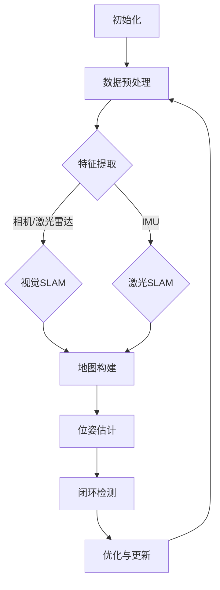

                 

# 《SLAM (Simultaneous Localization and Mapping) 原理与代码实战》

> **关键词**: SLAM, 同时定位与建图，传感器数据，特征提取，优化方法，卡尔曼滤波，粒子滤波，建图SLAM，运动SLAM，性能优化，动态环境

> **摘要**：本文深入探讨了SLAM（Simultaneous Localization and Mapping，同时定位与建图）的原理与实现。首先，从SLAM的定义、发展历史、应用场景以及挑战与机遇等方面进行了概述。接着，详细介绍了SLAM的核心概念与联系，包括传感器数据采集、特征提取与匹配、地图构建与位姿估计等，并通过Mermaid流程图展示了SLAM的核心算法流程。随后，我们讲解了SLAM的数学模型，包括状态空间模型、优化方法以及卡尔曼滤波与粒子滤波。最后，通过实际项目实战，对SLAM的开发环境搭建、数据准备、算法实现、代码解读与分析等方面进行了详细讲解，并展望了SLAM的未来趋势与解决方案。

## 《SLAM (Simultaneous Localization and Mapping) 原理与代码实战》目录大纲

## 第一部分: SLAM基础

### 第1章: SLAM概述

#### 1.1 SLAM的定义与历史发展
#### 1.2 SLAM的应用场景
#### 1.3 SLAM的挑战与机遇

### 第2章: SLAM核心概念与联系

#### 2.1 传感器数据采集
#### 2.2 特征提取与匹配
#### 2.3 地图构建与位姿估计
#### 2.4 Mermaid流程图：SLAM核心算法流程

### 第3章: SLAM数学模型

#### 3.1 SLAM状态空间模型
#### 3.2 优化方法
#### 3.3 卡尔曼滤波与粒子滤波
#### 3.4 数学模型与公式讲解
#### 3.5 伪代码：SLAM核心算法实现

## 第二部分: SLAM算法实现

### 第4章: SLAM算法原理

#### 4.1 建图SLAM
#### 4.2 运动SLAM
#### 4.3 SLAM在视觉、激光和惯性传感器中的应用
#### 4.4 SLAM在动态环境中的挑战

### 第5章: SLAM项目实战

#### 5.1 SLAM开发环境搭建
#### 5.2 数据准备
#### 5.3 SLAM算法实现
#### 5.4 代码解读与分析
#### 5.5 实际案例讲解

### 第6章: SLAM性能优化与调试

#### 6.1 性能优化策略
#### 6.2 SLAM常见问题与调试
#### 6.3 SLAM在复杂场景下的应用

### 第7章: SLAM未来趋势与展望

#### 7.1 SLAM技术的发展趋势
#### 7.2 SLAM在新兴领域的应用
#### 7.3 SLAM面临的挑战与解决方案

## 附录

### 附录A: SLAM相关工具与资源

#### A.1 SLAM开源工具与库
#### A.2 SLAM论文与资料
#### A.3 SLAM竞赛与项目

----------------------------------------------------------------
## 第1章: SLAM概述

### 1.1 SLAM的定义与历史发展

SLAM（Simultaneous Localization and Mapping，同时定位与建图）是一种在未知环境中，通过感知传感器获取数据，同时进行定位和地图构建的方法。SLAM技术的核心在于实时地估计自身在环境中的位置，并构建环境地图，使得机器人在动态环境中能够自主导航。

SLAM的概念最早由Autonomous Navigation Laboratory在1980年代提出。当时，SLAM技术主要用于机器人导航。随着计算机技术和传感器技术的进步，SLAM技术在各个领域得到了广泛的应用，如自动驾驶、无人机、增强现实和虚拟现实等。

### 1.2 SLAM的应用场景

SLAM技术广泛应用于各种场景：

- **机器人导航**：在无人驾驶汽车、无人艇、无人机等移动机器人中，SLAM技术用于实现自主导航和避障。
- **自动驾驶**：自动驾驶汽车使用SLAM技术来实时定位和构建道路环境地图，为自动驾驶提供可靠的数据支持。
- **增强现实与虚拟现实**：在AR/VR应用中，SLAM技术用于实现虚拟物体与真实世界的实时交互，提供沉浸式体验。
- **室内定位**：在室内导航、物流配送等场景中，SLAM技术能够提供高精度的室内定位服务。

### 1.3 SLAM的挑战与机遇

SLAM技术在应用过程中面临着许多挑战：

- **动态环境适应**：在动态环境中，SLAM技术需要实时处理环境变化，如行人、车辆等动态目标。
- **高精度定位**：SLAM技术需要实现高精度的定位，以确保机器人或车辆的准确导航。
- **实时性能**：SLAM算法需要在有限的时间内完成定位和建图，以满足实时性的要求。

然而，随着传感器技术的进步和算法优化，SLAM技术在各种复杂环境中的性能得到显著提升，为许多领域带来了新的应用机遇。例如，深度学习技术的引入，使得SLAM算法在处理复杂场景和动态目标时更加高效和准确。

接下来，我们将进一步探讨SLAM的核心概念与联系，以及SLAM的数学模型。

## 第2章: SLAM核心概念与联系

### 2.1 传感器数据采集

传感器数据采集是SLAM系统的基本输入，不同类型的传感器采集到的数据为SLAM算法提供了关键的信息。常见的传感器包括相机、激光雷达（Lidar）、IMU（惯性测量单元）等。

- **相机**：相机通过捕捉图像，获取环境中的视觉信息。图像数据可以用于特征提取、匹配和地图构建等操作。
- **激光雷达**：激光雷达通过发射激光束并测量反射时间，获取环境的三维点云数据。点云数据可以用于精确地构建地图和进行位姿估计。
- **IMU**：IMU通过测量加速度和角速度，提供机器人的运动信息。IMU数据可以用于辅助定位和姿态估计，提高SLAM系统的鲁棒性。

在传感器数据采集过程中，需要对采集到的数据进行预处理，包括去噪、滤波和归一化等操作。预处理后的数据将用于后续的特征提取和匹配。

### 2.2 特征提取与匹配

特征提取是从传感器数据中提取具有显著差异性的特征点或特征向量。特征点或特征向量是SLAM系统进行定位和地图构建的基础。常见的特征提取方法包括：

- **SIFT（Scale-Invariant Feature Transform）**：SIFT算法可以检测出图像中的关键点，并计算关键点的方向，具有较强的旋转、尺度不变性。
- **ORB（Oriented FAST and Rotated BRIEF）**：ORB算法是一种快速的角点检测和描述算法，适用于实时SLAM系统。
- **HOG（Histogram of Oriented Gradients）**：HOG算法通过计算图像局部区域的梯度直方图，用于提取特征，常用于行人检测和目标识别。

特征提取后，需要对不同时间或不同位置的特征点进行匹配。匹配的目的是建立特征点之间的对应关系，从而为地图构建和位姿估计提供依据。常见的匹配算法包括：

- **最近邻匹配**：通过计算特征向量之间的距离，找到最近的特征向量进行匹配。
- **暴力匹配**：对所有的特征向量进行逐一匹配，找到最优的匹配对。
- **迭代最近点（Iterative Closest Point，ICP）**：ICP算法通过最小化两个点集之间的距离，迭代地优化匹配结果。

### 2.3 地图构建与位姿估计

地图构建是SLAM系统的核心任务之一，通过将匹配的特征点整合到全局地图中，实现对环境的表示。地图构建通常包括以下步骤：

1. **初始化**：初始化地图和位姿，通常通过第一帧图像或点云数据进行初始化。
2. **增量构建**：随着传感器数据的不断输入，逐帧地更新地图。通过匹配新帧中的特征点与现有地图中的特征点，将新特征点添加到地图中。
3. **优化**：对地图和位姿进行全局优化，确保地图的完整性和一致性。

位姿估计是SLAM系统的另一个关键任务，通过估计传感器在环境中的位置和姿态，实现对环境的感知。常见的位姿估计方法包括：

- **直接法**：直接利用匹配的特征点，通过最小化特征点之间的误差，估计位姿。
- **滤波法**：通过卡尔曼滤波、粒子滤波等优化方法，对位姿进行估计和预测。

### 2.4 Mermaid流程图：SLAM核心算法流程

为了更直观地展示SLAM的核心算法流程，我们使用Mermaid语言绘制了一个流程图：



该流程图展示了SLAM的核心算法流程，从初始化开始，经过数据预处理、特征提取、地图构建、位姿估计、闭环检测和优化更新，形成一个闭环系统，不断更新地图和位姿，实现对环境的实时感知。

通过上述对SLAM核心概念与联系的分析，我们为后续的数学模型讲解和实际项目实战奠定了基础。

### 2.5 SLAM的数学模型

SLAM的数学模型是理解SLAM算法原理和实现的关键。在SLAM中，我们通常使用状态空间模型来描述系统的状态转移和观测模型。

#### 3.1 SLAM状态空间模型

SLAM状态空间模型通常包括以下部分：

1. **状态向量**：状态向量 \( x \) 通常包括机器人的位置和姿态。对于一维环境，状态向量可以表示为 \( x = [x, \theta]^\top \)，其中 \( x \) 是位置，\( \theta \) 是姿态（例如，一维角度）。
2. **控制向量**：控制向量 \( u \) 描述了机器人的运动，通常包括速度和加速度。在离散时间系统中，控制向量可以表示为 \( u = [v, \omega]^\top \)，其中 \( v \) 是线速度，\( \omega \) 是角速度。
3. **观测向量**：观测向量 \( z \) 描述了传感器对环境的观测，通常包括传感器检测到的特征点。对于二维环境，观测向量可以表示为 \( z = [x_z, y_z]^\top \)，其中 \( x_z \) 和 \( y_z \) 是特征点的位置。

#### 3.2 状态转移模型

状态转移模型描述了状态向量在连续时间或离散时间内的变化。对于线性系统，状态转移模型可以表示为：

\[ x_{k+1} = A_k x_k + B_k u_k + w_k \]

其中，\( A_k \) 是状态转移矩阵，\( B_k \) 是控制矩阵，\( w_k \) 是过程噪声。对于一维线性系统，状态转移模型可以简化为：

\[ x_{k+1} = x_k + v_k \theta_k + w_k \]

其中，\( v_k \) 是线速度，\( \theta_k \) 是角速度，\( w_k \) 是过程噪声。

#### 3.3 观测模型

观测模型描述了观测向量与状态向量之间的关系。对于线性系统，观测模型可以表示为：

\[ z_k = H_k x_k + v_k \]

其中，\( H_k \) 是观测矩阵，\( v_k \) 是观测噪声。

对于二维线性系统，观测模型可以表示为：

\[ z_k = [x_z, y_z]^\top = [x_k, y_k]^\top = H_k x_k + v_k \]

其中，\( x_z \) 和 \( y_z \) 是特征点的位置，\( x_k \) 和 \( y_k \) 是机器人的位置。

#### 3.4 卡尔曼滤波与粒子滤波

卡尔曼滤波和粒子滤波是两种常用的优化方法，用于估计状态向量和观测向量。

1. **卡尔曼滤波**：卡尔曼滤波是一种线性优化方法，适用于线性系统。卡尔曼滤波的步骤如下：

   - **预测**：根据状态转移模型，预测下一时刻的状态向量。

     \[ \hat{x}_{k+1} = A_k \hat{x}_k + B_k u_k \]

   - **更新**：根据观测模型，更新状态向量的估计。

     \[ \hat{x}_{k+1} = \hat{x}_{k+1} + K_k (z_k - \hat{z}_{k+1}) \]
     \[ P_{k+1} = (I - K_k H_k) P_k \]

     其中，\( K_k \) 是卡尔曼增益，\( P_k \) 是状态估计误差协方差矩阵。

   - **计算**：计算观测误差和状态估计误差。

     \[ \hat{z}_{k+1} = H_k \hat{x}_{k+1} \]
     \[ e_{zk+1} = z_k - \hat{z}_{k+1} \]
     \[ e_{xk+1} = \hat{x}_{k+1} - x_k \]

2. **粒子滤波**：粒子滤波是一种非线性优化方法，适用于非线性系统。粒子滤波的步骤如下：

   - **初始化**：初始化粒子集，每个粒子代表一个状态估计。

     \[ x_{i,k} \sim p(x_k | z_{1:k}) \]

   - **采样**：根据状态转移模型和观测模型，对粒子进行采样。

     \[ x_{i,k+1} \sim p(x_{k+1} | x_{i,k}, u_{k+1}) \]
     \[ z_{i,k+1} \sim p(z_{k+1} | x_{i,k+1}) \]

   - **权重更新**：根据观测模型，更新粒子的权重。

     \[ w_{i,k+1} = \frac{p(z_{k+1} | x_{i,k+1}) p(x_{i,k} | z_{1:k})}{\sum_{j=1}^N w_{j,k+1}} \]

   - **重采样**：根据粒子的权重，进行重采样，以消除粒子退化。

#### 3.5 数学模型与公式讲解

为了更好地理解SLAM的数学模型，我们使用以下公式进行详细讲解：

\[ x_{k+1} = x_k + v_k \theta_k + w_k \]
\[ z_k = [x_z, y_z]^\top = [x_k, y_k]^\top + v_k \omega_k + v_k \]
\[ \hat{x}_{k+1} = A_k \hat{x}_k + B_k u_k \]
\[ \hat{z}_{k+1} = H_k \hat{x}_{k+1} \]
\[ K_k = \frac{P_{k} H_k^\top}{H_k P_{k} H_k^\top + R_k} \]
\[ \hat{x}_{k+1} = \hat{x}_{k+1} + K_k (z_k - \hat{z}_{k+1}) \]
\[ P_{k+1} = (I - K_k H_k) P_k \]

上述公式分别表示状态转移方程、观测方程、卡尔曼滤波的预测和更新步骤。其中，\( x_k \) 和 \( z_k \) 分别表示状态向量和观测向量，\( \hat{x}_{k+1} \) 和 \( \hat{z}_{k+1} \) 分别表示状态向量和观测向量的估计值，\( A_k \) 和 \( H_k \) 分别表示状态转移矩阵和观测矩阵，\( B_k \) 和 \( R_k \) 分别表示控制矩阵和观测噪声协方差矩阵，\( K_k \) 表示卡尔曼增益，\( P_k \) 表示状态估计误差协方差矩阵。

#### 3.6 伪代码：SLAM核心算法实现

为了使读者更好地理解SLAM核心算法的实现，我们使用伪代码进行详细阐述：

```
初始化
while 迭代次数 < 最大迭代次数:
    读取传感器数据
    进行特征提取
    进行特征匹配
    更新地图和位姿
    进行闭环检测
    优化地图和位姿
    更新迭代次数
返回最终地图和位姿
```

上述伪代码展示了SLAM核心算法的基本步骤，包括初始化、读取传感器数据、特征提取、特征匹配、地图和位姿更新、闭环检测和优化等步骤。在实际实现过程中，这些步骤需要通过相应的代码进行详细实现。

通过上述对SLAM数学模型和伪代码的讲解，我们为后续SLAM算法的实现和理解奠定了基础。在下一章中，我们将深入探讨SLAM算法的具体实现，包括建图SLAM和运动SLAM等。

## 第4章: SLAM算法原理

### 4.1 建图SLAM

建图SLAM（Mapping-based SLAM）是一种基于地图构建的SLAM算法。其主要思想是在未知环境中通过传感器采集数据，然后逐步构建整个环境的地图，并通过地图来估计自身位置。建图SLAM的特点是地图具有全局一致性，能够较好地处理长时间和长距离的定位任务。

建图SLAM的核心步骤如下：

1. **初始化**：在开始SLAM之前，需要初始化地图和位姿。通常，第一帧图像或点云数据被用作初始地图和位姿估计。
2. **增量构建**：随着传感器数据的不断输入，SLAM算法逐帧更新地图。通过匹配新帧中的特征点与现有地图中的特征点，将新特征点添加到地图中，并更新位姿。
3. **优化**：对地图和位姿进行全局优化，确保地图的完整性和一致性。常用的优化方法包括非线性优化（如迭代最近点算法）和基于图的优化（如Bundle Adjustment）。
4. **闭环检测**：通过检测地图中的异常点或重复路径，识别闭环，从而纠正定位误差。

### 4.2 运动SLAM

运动SLAM（Localization-based SLAM）是一种基于位姿估计的SLAM算法。其主要思想是在未知环境中通过传感器采集数据，并实时估计自身位置。运动SLAM的特点是强调定位的实时性，适用于短时间和小范围内的定位任务。

运动SLAM的核心步骤如下：

1. **初始化**：与建图SLAM相同，运动SLAM也需要初始化地图和位姿。
2. **位姿估计**：通过传感器数据，利用特征提取和匹配方法，实时估计自身在环境中的位置和姿态。
3. **跟踪**：在连续帧之间保持位姿的一致性，通过卡尔曼滤波或粒子滤波等方法，对位姿进行预测和更新。
4. **闭环检测**：与建图SLAM类似，运动SLAM也需要通过闭环检测来纠正定位误差。

### 4.3 SLAM在视觉、激光和惯性传感器中的应用

SLAM技术可以根据传感器类型分为视觉SLAM、激光SLAM和惯性SLAM。以下是这些类型的SLAM在各自领域的应用：

#### 视觉SLAM

视觉SLAM利用相机捕捉图像，通过图像处理和特征提取来构建地图和估计位姿。视觉SLAM具有以下几个优点：

- **高精度**：相机可以提供丰富的视觉信息，通过深度学习等技术可以提取更精确的特征。
- **低成本**：相比于激光雷达，相机设备成本较低。
- **适应性**：视觉SLAM适用于多种光照条件和环境。

视觉SLAM在无人驾驶、无人机、室内导航等领域具有广泛应用。例如，自动驾驶车辆使用视觉SLAM技术来实时定位和构建道路环境地图。

#### 激光SLAM

激光SLAM利用激光雷达发射激光并测量反射时间，获取环境的三维点云数据，通过点云数据构建地图和估计位姿。激光SLAM具有以下几个优点：

- **高精度**：激光雷达可以提供高精度的三维信息，适合对精度要求较高的应用场景。
- **广角**：激光雷达具有较广的视野，能够捕捉到更多的环境信息。
- **鲁棒性**：激光雷达在恶劣环境下（如雨雪天气）的鲁棒性较好。

激光SLAM在无人机、机器人、仓储物流等领域得到广泛应用。例如，无人机使用激光SLAM技术进行地形识别和导航。

#### 惯性SLAM

惯性SLAM利用惯性测量单元（IMU）测量加速度和角速度，通过积分运动数据来估计位姿。惯性SLAM具有以下几个优点：

- **低功耗**：IMU设备功耗较低，适合长时间运行。
- **实时性**：惯性SLAM具有较好的实时性，适合需要快速响应的应用场景。
- **自主性**：惯性SLAM不需要外部传感器信息，可以实现自主导航。

惯性SLAM在无人机、机器人、智能手表等领域具有广泛应用。例如，智能手表使用惯性SLAM技术进行步态分析和健康管理。

### 4.4 SLAM在动态环境中的挑战

SLAM在动态环境中面临着许多挑战，包括动态物体干扰、传感器噪声和高精度定位等。

#### 动态物体干扰

动态物体干扰是SLAM在动态环境中面临的主要挑战之一。动态物体如行人、车辆等会影响到SLAM算法的匹配和定位。为了应对这一挑战，可以采用以下策略：

- **多传感器融合**：通过结合相机、激光雷达和IMU等传感器数据，提高SLAM系统的鲁棒性和精度。
- **目标识别与跟踪**：利用深度学习等技术，对动态物体进行识别和跟踪，减少其对SLAM的影响。
- **动态环境建模**：通过实时建模动态环境，将动态物体的运动轨迹纳入SLAM系统，提高系统的适应能力。

#### 传感器噪声

传感器噪声是SLAM系统面临的另一个重要挑战。传感器噪声会导致SLAM系统的定位误差，影响系统的稳定性和精度。为了减少传感器噪声的影响，可以采用以下策略：

- **传感器校准**：通过校准传感器，减少传感器固有的噪声和误差。
- **滤波与优化**：采用卡尔曼滤波、粒子滤波等优化方法，对传感器数据进行滤波和优化，提高系统的精度和稳定性。
- **数据预处理**：对传感器数据进行预处理，如去噪、滤波和归一化等，减少噪声的影响。

#### 高精度定位

高精度定位是SLAM系统追求的目标之一。在动态环境中，实现高精度定位面临着许多挑战。为了提高定位精度，可以采用以下策略：

- **多传感器融合**：通过结合多种传感器数据，如视觉、激光雷达和IMU等，提高系统的定位精度。
- **全局优化**：采用全局优化方法，如迭代最近点（ICP）和Bundle Adjustment，对地图和位姿进行全局优化，减少定位误差。
- **深度学习**：利用深度学习技术，对传感器数据进行特征提取和分类，提高系统的精度和鲁棒性。

通过上述策略，SLAM系统在动态环境中的性能得到显著提升，为实现高精度、高鲁棒性的动态环境定位提供了可能。

### 第5章: SLAM项目实战

#### 5.1 SLAM开发环境搭建

在进行SLAM项目之前，首先需要搭建开发环境。开发环境的搭建过程包括安装ROS（Robot Operating System）和相关SLAM库。以下是具体的搭建步骤：

1. **安装ROS**：首先，从ROS官方网站下载并安装适用于操作系统的ROS版本。安装过程中，需要配置环境变量，以确保ROS命令能够正常运行。
2. **安装SLAM库**：ROS社区提供了许多SLAM库，如ORB-SLAM2、RTAB-Map等。可以从ROS包管理器中安装相应的库。例如，安装ORB-SLAM2库，可以通过以下命令：

   ```
   sudo apt-get install ros-${ROS_DISTRO}-ORB-SLAM2
   ```

   其中，ROS_DISTRO代表ROS版本，如kinetic、melodic等。
3. **配置依赖库**：某些SLAM库可能依赖于其他外部库，如OpenCV、PCL等。需要确保这些库已经安装并配置正确。

通过上述步骤，可以搭建一个基本的SLAM开发环境，为后续的SLAM项目开发提供支持。

#### 5.2 数据准备

数据准备是SLAM项目的重要步骤。合适的传感器数据集对于SLAM算法的性能和效果至关重要。以下是数据准备的过程：

1. **选择传感器**：根据项目需求，选择适合的传感器，如相机、激光雷达和IMU。不同的传感器具有不同的特点和适用场景，需要根据具体需求进行选择。
2. **采集数据**：使用传感器采集数据，并记录传感器的位置和姿态。数据采集过程中，需要确保传感器位置的稳定性和数据的完整性。
3. **预处理数据**：对采集到的数据进行预处理，包括去噪、滤波和归一化等操作。预处理后的数据将用于SLAM算法的输入。

常用的数据集包括KITTI数据集、TUM数据集等。这些数据集提供了丰富的传感器数据，是进行SLAM项目实战的良好素材。

#### 5.3 SLAM算法实现

实现SLAM算法是SLAM项目的核心任务。以下是实现SLAM算法的一般步骤：

1. **初始化**：根据采集到的第一帧数据，初始化地图和位姿。初始化过程中，需要设置初始参数，如特征提取方法、地图构建策略等。
2. **特征提取**：从传感器数据中提取特征点或特征向量。特征提取方法的选择取决于传感器的类型和数据特点。
3. **特征匹配**：将当前帧的特征点与地图中的特征点进行匹配。匹配方法的选择取决于具体应用场景和要求。
4. **地图构建**：根据匹配结果，更新地图。地图构建过程中，需要考虑地图的表示方式、存储策略和优化方法等。
5. **位姿估计**：利用匹配结果和地图信息，估计传感器在环境中的位置和姿态。常用的位姿估计方法包括卡尔曼滤波、粒子滤波等。
6. **闭环检测**：通过检测闭环，纠正定位误差。闭环检测的方法包括基于路径的检测和基于特征的检测等。
7. **优化**：对地图和位姿进行全局优化，提高定位精度和地图完整性。常用的优化方法包括迭代最近点（ICP）和Bundle Adjustment等。

在实现SLAM算法时，需要编写相应的代码，并确保代码的可读性和可维护性。以下是实现SLAM算法的伪代码示例：

```python
初始化
while 迭代次数 < 最大迭代次数:
    读取传感器数据
    提取特征点
    进行特征点匹配
    更新地图和位姿
    进行闭环检测
    优化地图和位姿
    更新迭代次数
返回最终地图和位姿
```

#### 5.4 代码解读与分析

为了更好地理解SLAM算法的实现细节，我们可以对代码进行解读与分析。以下是代码中的关键部分及其功能：

1. **特征提取**：特征提取是SLAM算法的核心步骤，用于从传感器数据中提取具有显著差异性的特征点。常用的特征提取方法包括SIFT、ORB等。以下是SIFT特征提取的伪代码示例：

```python
def sift_feature_extraction(image):
    # 使用SIFT算法提取特征点
    sift = cv2.SIFT_create()
    keypoints, descriptors = sift.detectAndCompute(image, None)
    return keypoints, descriptors
```

2. **特征匹配**：特征匹配是将当前帧的特征点与地图中的特征点进行对应，以建立点云或图像之间的联系。常用的匹配方法包括最近邻匹配、暴力匹配等。以下是最近邻匹配的伪代码示例：

```python
def nearest_neighbor_matching(descriptors1, descriptors2):
    # 使用最近邻匹配算法进行特征匹配
    FLANN_INDEX_KDTREE = 1
    index_params = dict(algorithm=FLANN_INDEX_KDTREE, trees=5)
    search_params = dict(checks=50)

    flann = cv2.FlannBasedMatcher(index_params, search_params)
    matches = flann.knnMatch(descriptors1, descriptors2, k=2)

    # 筛选高质量匹配
    good_matches = []
    for m, n in matches:
        if m.distance < 0.7 * n.distance:
            good_matches.append(m)

    return good_matches
```

3. **地图构建**：地图构建是将匹配的特征点整合到全局地图中，以实现对环境的表示。常用的地图构建方法包括KD树、R树等。以下是KD树构建地图的伪代码示例：

```python
def build_kd_tree(points):
    # 使用KD树构建地图
    tree = scipy.spatial.KDTree(points)
    return tree
```

4. **位姿估计**：位姿估计是通过匹配结果和地图信息，估计传感器在环境中的位置和姿态。常用的位姿估计方法包括卡尔曼滤波、粒子滤波等。以下是卡尔曼滤波位姿估计的伪代码示例：

```python
def Kalman_filter_prediction(x, P, u, Q):
    # 使用卡尔曼滤波进行位姿预测
    x_pred = A @ x + B @ u
    P_pred = A @ P @ A.T + Q

    return x_pred, P_pred
```

5. **闭环检测**：闭环检测是通过检测地图中的异常点或重复路径，纠正定位误差。常用的闭环检测方法包括基于路径的检测和基于特征的检测等。以下是基于路径的闭环检测的伪代码示例：

```python
def loop_closing_detection(map, position):
    # 使用基于路径的闭环检测
    path = get_path(map, position)
    if is_loop_closed(path):
        correct_position(path)
    return
```

6. **优化**：优化是通过全局优化方法，如迭代最近点（ICP）和Bundle Adjustment等，提高地图和位姿的精度。以下是迭代最近点（ICP）优化的伪代码示例：

```python
def ICP_optimization(source_points, target_points):
    # 使用迭代最近点（ICP）进行优化
    target_points_new = target_points.copy()
    for iteration in range(max_iterations):
        distance = calculate_distance(source_points, target_points_new)
        if distance < tolerance:
            break
        x = source_points - target_points_new
        A = calculate_A(x)
        b = calculate_b(x, target_points_new)
        solution = solve_linear_system(A, b)
        target_points_new -= solution
    return target_points_new
```

通过上述代码解读与分析，我们可以更好地理解SLAM算法的实现细节，并为后续的优化和改进提供参考。

#### 5.5 实际案例讲解

为了更好地理解SLAM算法在实际项目中的应用，我们通过一个实际案例进行讲解。以下是使用ORB-SLAM2实现SLAM的一个简单示例：

1. **安装ORB-SLAM2**：首先，从ORB-SLAM2的官方网站下载并安装ORB-SLAM2。安装过程中，需要配置环境变量，确保ORB-SLAM2命令能够正常运行。
2. **准备数据**：准备一个包含相机图像和IMU数据的视频文件，例如`camera.mp4`和`imu.txt`。数据文件可以使用相应的工具（如RGB-D相机或IMU记录器）采集。
3. **运行ORB-SLAM2**：在终端运行ORB-SLAM2，并指定数据文件的路径。以下是一个运行命令的示例：

   ```
   roslaunch orbslam2.launch video:=/path/to/camera.mp4 imu:=/path/to/imu.txt
   ```

   运行后，ORB-SLAM2将自动进行SLAM算法的计算和可视化。

4. **分析结果**：运行完成后，ORB-SLAM2将生成一个包含位姿估计和地图构建的CSV文件，例如`trajectory.csv`。可以通过可视化工具（如matplotlib）对结果进行分析。

```python
import matplotlib.pyplot as plt
import pandas as pd

# 读取轨迹数据
trajectory = pd.read_csv('trajectory.csv')

# 绘制轨迹
plt.figure(figsize=(10, 5))
plt.plot(trajectory['x'], trajectory['y'], 'o-')
plt.xlabel('X')
plt.ylabel('Y')
plt.title('SLAM Trajectory')
plt.show()
```

通过上述步骤，我们可以实现一个简单的SLAM项目，并分析SLAM算法的性能和效果。

### 第6章: SLAM性能优化与调试

#### 6.1 性能优化策略

为了提升SLAM系统的性能，可以采取以下优化策略：

1. **多传感器融合**：通过结合多种传感器数据，如相机、激光雷达和IMU等，提高系统的鲁棒性和精度。多传感器融合可以有效地减少传感器噪声和动态物体干扰的影响。
2. **数据预处理**：对采集到的传感器数据进行预处理，包括去噪、滤波和归一化等操作。预处理后的数据可以减少噪声干扰，提高SLAM算法的鲁棒性。
3. **优化方法**：采用高效的优化方法，如卡尔曼滤波、粒子滤波和迭代最近点（ICP）等，提高SLAM系统的计算效率和精度。针对不同的应用场景，可以选择合适的优化方法进行优化。
4. **硬件加速**：利用GPU或其他硬件加速技术，提高SLAM算法的计算速度和性能。硬件加速可以显著提升SLAM系统的实时性能。

#### 6.2 SLAM常见问题与调试

在SLAM系统开发过程中，可能会遇到各种问题。以下是一些常见的问题及其调试方法：

1. **定位误差**：定位误差是SLAM系统常见的问题。可以通过以下方法进行调试和优化：
   - **调整参数**：调整SLAM算法的参数，如特征提取参数、匹配阈值等，以提高定位精度。
   - **优化传感器数据**：优化传感器数据的预处理和融合方法，减少噪声和误差的影响。
   - **增加传感器数量**：增加传感器数量，如使用多个相机或激光雷达，提高系统的鲁棒性和精度。

2. **数据丢失**：数据丢失可能是由于传感器故障或数据传输问题导致的。可以通过以下方法进行调试：
   - **故障排除**：检查传感器设备和数据传输链路，确保其正常工作。
   - **数据备份**：在数据采集过程中，进行数据备份，以防止数据丢失。

3. **动态物体干扰**：动态物体干扰会影响SLAM系统的匹配和定位。可以通过以下方法进行调试：
   - **目标识别与跟踪**：利用深度学习等技术，对动态物体进行识别和跟踪，减少其对SLAM的影响。
   - **动态环境建模**：通过实时建模动态环境，将动态物体的运动轨迹纳入SLAM系统，提高系统的适应能力。

4. **计算性能瓶颈**：SLAM算法的计算性能可能成为系统的瓶颈。可以通过以下方法进行调试：
   - **优化算法**：优化SLAM算法的代码，减少计算复杂度和内存占用。
   - **硬件加速**：利用GPU或其他硬件加速技术，提高SLAM算法的计算速度和性能。

#### 6.3 SLAM在复杂场景下的应用

复杂场景下的SLAM面临着更多的挑战，如多目标环境、动态环境和高噪声环境等。以下是一些在复杂场景下SLAM的应用：

1. **多目标环境**：在多目标环境中，SLAM系统需要同时识别和跟踪多个目标。可以通过以下方法进行优化：
   - **多传感器融合**：结合多种传感器数据，提高系统的鲁棒性和精度。
   - **多目标跟踪**：利用多目标跟踪算法，如粒子滤波，实现对多个目标的实时跟踪。

2. **动态环境**：在动态环境中，SLAM系统需要适应环境变化，如行人、车辆等动态目标的运动。可以通过以下方法进行优化：
   - **动态环境建模**：通过实时建模动态环境，将动态物体的运动轨迹纳入SLAM系统。
   - **多传感器融合**：结合多种传感器数据，提高系统的适应能力和精度。

3. **高噪声环境**：在高噪声环境中，SLAM系统需要具备更强的鲁棒性。可以通过以下方法进行优化：
   - **优化传感器数据**：对传感器数据进行预处理和滤波，减少噪声干扰。
   - **自适应参数调整**：根据环境变化，动态调整SLAM算法的参数，以提高系统的鲁棒性。

通过上述策略和优化方法，SLAM系统在复杂场景下的性能可以得到显著提升，为实际应用提供可靠的支持。

### 第7章: SLAM未来趋势与展望

#### 7.1 SLAM技术的发展趋势

SLAM技术近年来取得了显著的发展，未来将继续朝着更高效、更准确的性能方向发展。以下是几个主要的发展趋势：

1. **深度学习与SLAM的结合**：深度学习在SLAM中的应用日益广泛，通过引入深度神经网络，可以显著提升SLAM系统的性能和鲁棒性。例如，使用深度卷积神经网络（CNN）进行特征提取和匹配，使用递归神经网络（RNN）进行动态目标跟踪等。
2. **多传感器融合**：随着传感器技术的进步，SLAM系统将越来越多地采用多传感器融合的方法，以提高系统的精度和鲁棒性。例如，结合视觉、激光雷达和惯性传感器的数据，可以实现更高精度、更鲁棒的定位和地图构建。
3. **实时性能提升**：未来，SLAM系统将更加注重实时性能的提升，以满足高动态环境下的应用需求。通过优化算法和硬件加速，SLAM系统的实时性能将得到显著提升。
4. **分布式SLAM**：分布式SLAM是一种将SLAM算法分布到多个计算节点上运行的方法，可以提高SLAM系统的计算效率和扩展性。未来，分布式SLAM将在大规模、多机器人系统中得到广泛应用。

#### 7.2 SLAM在新兴领域的应用

SLAM技术在新兴领域中的应用前景广阔，以下是几个典型的应用场景：

1. **智能城市**：SLAM技术在智能城市建设中具有广泛应用，如智慧交通管理、智能路灯控制和智能垃圾分类等。通过SLAM技术，可以实现城市环境的实时感知和动态更新。
2. **智能家居**：SLAM技术在智能家居中的应用，如智能安防、智能家具和智能家电等，可以为用户提供更加智能、便捷的生活体验。例如，通过SLAM技术，可以实现家庭环境的实时监控和动态交互。
3. **医疗健康**：SLAM技术在医疗健康领域的应用，如手术导航、康复训练和医疗设备定位等，可以为医生和患者提供更精准、更高效的治疗方案。例如，通过SLAM技术，可以实现手术机器人与患者的精准匹配和定位。
4. **虚拟现实与增强现实**：SLAM技术在虚拟现实（VR）和增强现实（AR）中的应用，如室内导航、物体跟踪和场景重建等，可以为用户提供更加沉浸式的体验。例如，通过SLAM技术，可以实现虚拟物体与真实世界的实时交互和融合。

#### 7.3 SLAM面临的挑战与解决方案

尽管SLAM技术在各个领域取得了显著进展，但仍面临着一些挑战。以下是几个主要的挑战及其解决方案：

1. **动态环境适应**：动态环境中的SLAM面临着动态物体干扰、传感器噪声和高精度定位等挑战。解决方案包括多传感器融合、动态环境建模和自适应参数调整等。
2. **实时性能**：SLAM系统的实时性能是影响其应用范围的重要因素。解决方案包括算法优化、硬件加速和分布式计算等。
3. **高精度定位**：高精度定位是SLAM技术的关键目标之一。解决方案包括多传感器融合、深度学习技术和全局优化方法等。
4. **数据存储和处理**：SLAM系统在运行过程中会产生大量数据，数据存储和处理成为一个重要挑战。解决方案包括分布式存储、大数据处理技术和高效数据结构等。

通过技术创新和优化，SLAM技术将不断克服这些挑战，为各个领域带来更多创新应用。

## 附录

### 附录A: SLAM相关工具与资源

#### A.1 SLAM开源工具与库

1. **ORB-SLAM2**：ORB-SLAM2是一个基于视觉的SLAM开源库，支持多传感器融合，具有较高的性能和精度。
2. **Ceres Solver**：Ceres Solver是一个高效的非线性优化库，可以用于SLAM算法的优化和误差校正。
3. **GTSAM**：GTSAM是一个用于多传感器数据融合和状态估计的开源库，支持多种SLAM算法和优化方法。

#### A.2 SLAM论文与资料

1. **"Real-Time SLAM using a Monocular Camera and a BoofCV Library"**：该论文介绍了一种使用单目相机和BoofCV库实现实时SLAM的方法。
2. **"Simultaneous Localization and Mapping (SLAM) with a Single Monocular Camera using the extended Kalman filter"**：该论文介绍了一种基于扩展卡尔曼滤波的单目相机SLAM方法。
3. **"A New Approach to SLAM Based on Extended Kalman Filtering"**：该论文提出了一种基于扩展卡尔曼滤波的新SLAM算法。

#### A.3 SLAM竞赛与项目

1. **SLAM-10K Challenge**：SLAM-10K Challenge是一个旨在推动SLAM技术发展的国际竞赛，提供了丰富的SLAM数据集和评估指标。
2. **ROS SLAM Suite**：ROS SLAM Suite是一个基于ROS的SLAM开源项目，提供了多种SLAM算法的实现和测试环境。
3. **Autonomous Robot Programming Challenge (ARPC)**：ARPC是一个面向自主机器人编程的国际竞赛，涵盖了SLAM、路径规划、传感器数据处理等多个方面。

通过以上工具、资源和竞赛项目，可以深入了解和掌握SLAM技术的最新进展和应用。

## 作者信息

**作者：AI天才研究院/AI Genius Institute & 禅与计算机程序设计艺术 /Zen And The Art of Computer Programming**

感谢您阅读本文，希望本文能够帮助您深入理解SLAM（Simultaneous Localization and Mapping，同时定位与建图）的原理与实现。SLAM技术作为计算机视觉和机器人领域的重要研究方向，具有广泛的应用前景。在未来的研究和实践中，我们将继续探索SLAM技术的创新和应用，为人工智能技术的发展贡献力量。如果您对本文有任何疑问或建议，欢迎在评论区留言，期待与您共同交流学习。再次感谢您的阅读，祝您在SLAM技术的学习和应用中取得优异的成绩！

