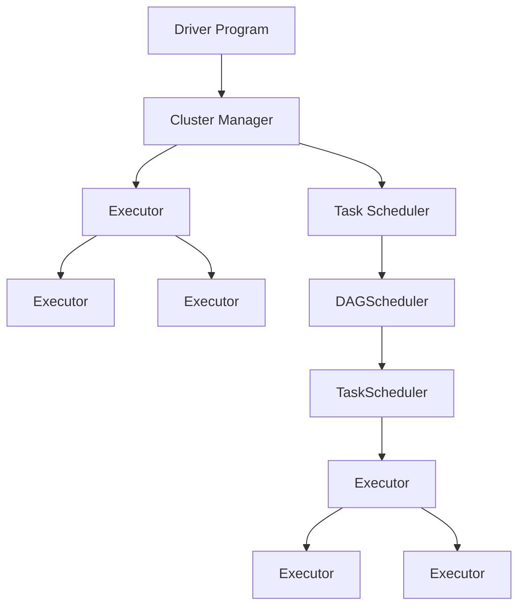

                 

### Spark原理与代码实例讲解

Spark作为一种分布式大数据处理框架，因其高效、易用和扩展性强而广受欢迎。本文将围绕Spark的原理与代码实例进行讲解，旨在帮助读者全面了解Spark的工作机制，掌握其核心算法和应用方法。

**关键词：**
- Spark
- 分布式计算
- RDD
- SQL
- 流处理
- MLlib

**摘要：**
本文首先介绍了Spark的起源和核心概念，然后详细探讨了Spark的架构设计、核心组件和原理。接着，我们通过代码实例深入讲解了Spark SQL、Spark Streaming和MLlib等模块的具体应用。最后，本文提供了实战案例，帮助读者将理论应用到实际项目中。

### 第一部分：Spark基础知识

#### 第1章：Spark概述

Spark的诞生源于对Hadoop MapReduce性能瓶颈的反思。它由Apache软件基金会开发，最早由加州大学伯克利分校的AMPLab团队创建。Spark的核心优势在于其速度快，可以比MapReduce快100倍，甚至更快，同时更易于使用。

**1.1 Spark的诞生与背景**

Spark诞生于2009年，其初衷是为了解决MapReduce在迭代计算、交互式查询和数据流处理中的性能问题。传统的MapReduce任务在执行过程中需要进行大量的磁盘I/O操作，导致处理速度缓慢。而Spark引入了内存计算，极大地提高了数据处理效率。

**1.2 Spark的核心概念**

Spark的核心概念包括：
- **弹性分布式数据集（RDD）**：Spark的基础数据结构，类似于分布式数据流或数据集。
- **Shuffle**：数据在不同节点之间的传输操作。
- **分区**：将数据划分为多个分区，以便并行处理。

**1.3 Spark的架构设计**

Spark的架构包括：
- **Driver Program**：负责生成任务和协调任务的执行。
- **Cluster Manager**：负责资源管理和任务调度。
- **Worker Node**：负责执行任务和处理数据。

**1.4 Spark的应用领域**

Spark广泛应用于以下领域：
- **批处理**：处理大量静态数据。
- **流处理**：实时处理数据流。
- **机器学习**：进行数据分析和建模。
- **交互式查询**：快速回答用户查询。

#### 第2章：Spark核心组件

**2.1 Spark Shell**

Spark Shell是一个交互式Python或Scala环境，用于编写和运行Spark应用程序。它提供了一个方便的方式来测试Spark的API。

**2.2 Spark Core**

Spark Core是Spark的核心模块，提供了分布式任务调度、内存管理和基本的存储功能。它还实现了RDD（弹性分布式数据集），是Spark数据处理的基础。

**2.3 Spark SQL**

Spark SQL提供了一个用于结构化数据的查询接口。它支持各种数据源，包括Hive表、Parquet文件和JSON等。Spark SQL可以与Spark的其他模块无缝集成。

**2.4 Spark Streaming**

Spark Streaming是Spark的流处理模块，用于处理实时数据流。它能够从各种数据源接收数据，例如Kafka、Flume和Kinesis，并进行实时处理。

**2.5 MLlib**

MLlib是Spark的机器学习库，提供了各种常见的机器学习算法，如线性回归、聚类、分类和降维。它还支持分布式计算，可以在大规模数据集上运行。

**2.6 GraphX**

GraphX是Spark的图处理框架，用于处理大规模图数据。它提供了多种图算法和操作，如三角形计数、最短路径和PageRank。

### 第二部分：Spark原理与核心算法

#### 第3章：RDD原理

**3.1 RDD的概念与特性**

RDD（弹性分布式数据集）是Spark的基础抽象。它代表一个不可变的、可分区的数据集，支持各种转换操作。

**3.2 RDD的创建与操作**

RDD可以通过创建、转换和行动操作来创建和处理数据。

**3.3 RDD的依赖关系**

RDD之间的依赖关系决定了Spark任务的执行顺序。

**3.4 RDD的存储与缓存**

RDD可以存储在内存或磁盘上，以缓存数据以提高处理效率。

#### 第4章：DAGScheduler与TaskScheduler

**4.1 DAGScheduler的工作原理**

DAGScheduler负责将Spark应用程序的DAG（有向无环图）拆分为一系列的Task。

**4.2 TaskScheduler的工作原理**

TaskScheduler负责将Task分配给Worker Node上的Executor。

**4.3 DAGScheduler与TaskScheduler的协作**

DAGScheduler与TaskScheduler协同工作，以确保Spark应用程序的高效执行。

#### 第5章：Spark SQL原理

**5.1 Spark SQL的核心概念**

Spark SQL提供了一个统一的数据查询接口，支持结构化数据查询。

**5.2 Spark SQL的查询处理**

Spark SQL使用Catalyst优化器对查询进行优化。

**5.3 Spark SQL的优化技术**

Spark SQL提供了多种优化技术，如代码生成和动态分区。

#### 第6章：Spark Streaming原理

**6.1 Spark Streaming的架构设计**

Spark Streaming的设计旨在处理实时数据流。

**6.2 Spark Streaming的数据流处理**

Spark Streaming通过微批处理（micro-batch）来处理数据流。

**6.3 Spark Streaming的实时计算**

Spark Streaming支持实时计算和实时报警。

**6.4 Spark Streaming的性能优化**

Spark Streaming的性能优化包括调整配置和选择合适的数据源。

#### 第7章：MLlib核心算法原理

**7.1 MLlib的基本概念**

MLlib提供了多种机器学习算法和模型。

**7.2 MLlib的线性回归算法**

MLlib支持线性回归算法，用于预测连续值。

**7.3 MLlib的聚类算法**

MLlib提供了多种聚类算法，如K-means。

**7.4 MLlib的分类算法**

MLlib的分类算法包括逻辑回归、随机森林等。

**7.5 MLlib的降维算法**

MLlib的降维算法用于减少数据维度，如PCA。

### 第三部分：Spark项目实战

#### 第8章：Spark数据处理项目实战

**8.1 数据预处理与数据清洗**

数据预处理和清洗是数据处理项目的基础。

**8.2 数据分析实战**

数据分析实战包括数据探索性分析和统计测试。

**8.3 数据可视化实战**

数据可视化实战帮助理解数据分布和趋势。

#### 第9章：Spark SQL项目实战

**9.1 Spark SQL的基本操作**

Spark SQL的基本操作包括创建表、查询数据等。

**9.2 Spark SQL的数据导入与导出**

数据导入与导出是数据集成的重要环节。

**9.3 Spark SQL的复杂查询与优化**

复杂查询与优化包括联合查询、连接和索引。

#### 第10章：Spark Streaming项目实战

**10.1 Spark Streaming的基础搭建**

基础搭建包括环境配置和基本流处理。

**10.2 Spark Streaming实时数据流处理**

实时数据流处理涉及数据接收和处理。

**10.3 Spark Streaming项目优化**

项目优化包括调整配置和性能分析。

#### 第11章：MLlib项目实战

**11.1 MLlib线性回归项目实战**

线性回归项目实战包括数据准备和模型训练。

**11.2 MLlib聚类项目实战**

聚类项目实战包括数据划分和聚类评估。

**11.3 MLlib分类项目实战**

分类项目实战包括特征提取和分类模型训练。

**11.4 MLlib降维项目实战**

降维项目实战包括数据降维和模型验证。

### 附录

#### 附录A：Spark开发环境搭建

**A.1 Spark的安装与配置**

安装与配置包括版本选择和环境变量设置。

**A.2 Spark的依赖管理**

依赖管理涉及库和模块的版本控制。

**A.3 Spark的调试与监控**

调试与监控包括日志分析和性能监控。

#### 附录B：Spark资源与工具

**B.1 Spark文档与教程**

Spark文档与教程是学习的重要资源。

**B.2 Spark社区与论坛**

Spark社区与论坛是交流与合作的平台。

**B.3 Spark工具与插件**

Spark工具与插件包括数据导入工具和可视化工具。

#### 附录C：Mermaid流程图绘制指南

**C.1 Mermaid基本语法**

Mermaid基本语法用于绘制流程图和时序图。

**C.2 Mermaid流程图实例**

流程图实例展示Mermaid的基本用法。

**C.3 Mermaid流程图优化技巧**

优化技巧包括图表布局和样式调整。

#### 附录D：伪代码编写指南

**D.1 伪代码基本格式**

伪代码基本格式用于描述算法逻辑。

**D.2 伪代码实例解析**

伪代码实例解析展示常见算法逻辑。

**D.3 伪代码编写技巧**

伪代码编写技巧包括清晰表达和模块化。

#### 附录E：数学模型与公式

**E.1 数学模型基本概念**

数学模型基本概念包括线性模型和决策树模型。

**E.2 常见数学公式介绍**

常见数学公式介绍包括线性代数和概率统计。

**E.3 数学公式在Spark中的应用实例**

数学公式在Spark中的应用实例展示算法实现。

#### 附录F：代码解读与分析

**F.1 Spark代码结构解析**

Spark代码结构解析展示核心组件和算法。

**F.2 代码解读与案例分析**

代码解读与案例分析包括代码实现和性能分析。

**F.3 代码优化与性能分析**

代码优化与性能分析包括代码重构和性能调优。

### 作者信息

- 作者：AI天才研究院/AI Genius Institute & 禅与计算机程序设计艺术 /Zen And The Art of Computer Programming

本文由AI天才研究院撰写，结合了Spark的原理和实战经验，旨在为读者提供一份全面而深入的技术指南。

---

**正文**部分内容，我们已经开始撰写，下面将逐步深入各个章节，详细讲解Spark的原理与代码实例。

---

### 第一部分：Spark基础知识

#### 第1章：Spark概述

在了解Spark的原理与代码实例之前，我们需要首先对Spark有一个全面的认识。本章将介绍Spark的起源、背景、核心概念和架构设计，为后续章节的深入探讨打下基础。

**1.1 Spark的诞生与背景**

Spark诞生于2009年，由加州大学伯克利分校的AMPLab（Algorithms, Machines, and People Lab）团队创建。该团队致力于研究和开发大数据处理技术。Spark的初衷是为了解决Hadoop MapReduce在迭代计算、交互式查询和数据流处理中的性能瓶颈。MapReduce的批处理模式在处理大规模数据集时虽然可靠，但效率较低，难以满足实时数据处理的需求。Spark通过引入内存计算和优化调度算法，实现了比MapReduce更快的处理速度，同时也易于使用和扩展。

**1.2 Spark的核心概念**

Spark的核心概念包括以下几个：

- **弹性分布式数据集（RDD）**：RDD是Spark的核心数据结构，它是一个不可变的、可分区的、可并行操作的数据集合。RDD支持多种转换操作，如map、filter、reduce等，这些操作可以在分布式环境中高效执行。
- **Shuffle**：Shuffle是数据在不同节点之间的传输操作。在分布式计算中，Shuffle操作用于将数据重新分区，以便后续处理。Spark通过优化Shuffle算法，提高了数据处理效率。
- **分区**：Spark将数据划分为多个分区，以便并行处理。每个分区可以独立处理，从而提高了并行度和性能。
- **集群管理**：Spark支持多种集群管理器，如YARN、Mesos和Standalone。这些管理器负责资源管理和任务调度。

**1.3 Spark的架构设计**

Spark的架构设计旨在实现高性能和易用性。其核心架构包括以下几个组件：

- **Driver Program**：Driver Program是Spark应用程序的入口点。它负责生成任务、跟踪任务执行状态和协调任务执行。Driver Program通常运行在集群管理器的Master节点上。
- **Cluster Manager**：Cluster Manager负责资源管理和任务调度。Spark支持多种集群管理器，如YARN、Mesos和Standalone。这些管理器负责分配资源、启动Executor和调度任务。
- **Worker Node**：Worker Node是Spark集群中的计算节点。每个Worker Node运行一个Executor，负责执行任务和处理数据。多个Worker Node协同工作，共同完成大规模数据处理任务。
- **Executor**：Executor是运行在Worker Node上的一个进程，负责执行任务、存储数据和处理结果。Executor通过JVM（Java Virtual Machine）运行，从而实现了跨语言的兼容性。

**1.4 Spark的应用领域**

Spark广泛应用于以下领域：

- **批处理**：Spark可以处理大量静态数据，支持批量数据处理任务，如数据清洗、转换和聚合等。
- **流处理**：Spark Streaming模块可以实时处理数据流，适用于实时数据处理和分析任务，如实时监控、实时报警和实时推荐等。
- **机器学习**：MLlib是Spark的机器学习库，提供了多种机器学习算法和模型，可以用于大规模数据集上的数据分析和建模。
- **交互式查询**：Spark SQL模块提供了一个统一的数据查询接口，支持结构化数据查询，适用于交互式数据分析和决策支持。

通过本章的介绍，我们对Spark的起源、核心概念和架构设计有了初步了解。在后续章节中，我们将深入探讨Spark的各个组件、核心算法和实战应用，帮助读者全面掌握Spark的使用方法和技术原理。

### 第2章：Spark核心组件

Spark的核心组件包括Spark Shell、Spark Core、Spark SQL、Spark Streaming、MLlib和GraphX。本章将详细讲解这些组件的功能和作用，以及它们如何协同工作，实现高效的数据处理和分析。

**2.1 Spark Shell**

Spark Shell是Spark提供的一个交互式Shell环境，允许用户在本地或集群上运行Spark应用程序。Spark Shell支持Python和Scala两种编程语言，用户可以在Shell中直接编写和测试Spark代码，方便进行开发和调试。

**功能与作用：**
- **交互式开发**：Spark Shell提供了一个交互式环境，用户可以实时编写和执行代码，快速测试Spark功能。
- **代码测试**：Spark Shell允许用户在本地环境中运行Spark应用程序，验证代码的正确性和性能。

**2.2 Spark Core**

Spark Core是Spark的核心模块，提供了分布式任务调度、内存管理和基本的存储功能。Spark Core的主要组件包括DAGScheduler、TaskScheduler和RDD。

**功能与作用：**
- **任务调度**：DAGScheduler负责将Spark应用程序的DAG（有向无环图）拆分为一系列的Task，TaskScheduler负责将Task分配给集群上的Executor。
- **内存管理**：Spark Core实现了基于内存的存储和管理机制，通过缓存（Cache）和持久化（Persist）操作，提高数据处理效率。
- **数据存储**：Spark Core提供了基本的数据存储功能，包括序列化（Serialization）和反序列化（Deserialization），支持数据的分布式存储和传输。

**2.3 Spark SQL**

Spark SQL是Spark的SQL查询模块，提供了一种统一的方式来处理结构化数据。Spark SQL支持各种数据源，如Hive表、Parquet文件、JSON和CSV等，并提供了一种类似SQL的查询接口。

**功能与作用：**
- **数据查询**：Spark SQL允许用户使用SQL语句对结构化数据集进行查询，支持复杂查询和联合查询。
- **数据优化**：Spark SQL使用了Catalyst查询优化器，对查询进行优化，提高查询性能。
- **数据集成**：Spark SQL可以与Spark的其他模块无缝集成，如Spark Core、Spark Streaming和MLlib等，实现数据处理的连续性和一致性。

**2.4 Spark Streaming**

Spark Streaming是Spark的实时数据流处理模块，用于处理实时数据流。Spark Streaming可以将实时数据流切分为微批（micro-batch），并对每个微批进行处理，从而实现实时数据处理和分析。

**功能与作用：**
- **实时数据处理**：Spark Streaming支持从各种数据源接收实时数据流，如Kafka、Flume和Kinesis等，并进行实时处理。
- **实时分析**：Spark Streaming可以实时分析数据流，生成实时报表和实时报警，适用于实时监控和实时决策。
- **流处理集成**：Spark Streaming可以与Spark的其他模块集成，如Spark Core、Spark SQL和MLlib等，实现流处理和批处理的连续性。

**2.5 MLlib**

MLlib是Spark的机器学习库，提供了多种机器学习算法和模型，如线性回归、聚类、分类和降维等。MLlib支持分布式计算，可以在大规模数据集上运行，适用于大规模数据分析和机器学习任务。

**功能与作用：**
- **机器学习算法**：MLlib提供了多种机器学习算法和模型，支持分类、回归、聚类、降维等任务。
- **分布式计算**：MLlib支持分布式计算，可以在大规模数据集上高效运行，提高计算性能。
- **数据预处理**：MLlib还提供了数据预处理工具，如数据清洗、特征提取和特征工程等，方便进行数据分析和建模。

**2.6 GraphX**

GraphX是Spark的图处理框架，用于处理大规模图数据。GraphX提供了多种图算法和操作，如三角形计数、最短路径和PageRank等，适用于社交网络分析、图挖掘和推荐系统等应用。

**功能与作用：**
- **图数据结构**：GraphX提供了图数据结构，支持大规模图数据的存储和处理。
- **图算法**：GraphX提供了多种图算法，如PageRank、最短路径和社区检测等，用于分析图数据。
- **图计算**：GraphX支持分布式图计算，可以在大规模图数据集上进行高效计算。

通过本章的介绍，我们对Spark的核心组件有了更深入的了解。这些组件协同工作，实现了Spark高效、易用的特点，为大数据处理和分析提供了强大的支持。在下一章中，我们将进一步探讨Spark的原理和核心算法，帮助读者深入理解Spark的工作机制。

### 第二部分：Spark原理与核心算法

#### 第3章：RDD原理

在Spark中，弹性分布式数据集（RDD）是核心的数据结构，也是Spark数据处理的基础。本章将详细讲解RDD的概念、特性、创建与操作、依赖关系以及存储与缓存。

**3.1 RDD的概念与特性**

RDD（Resilient Distributed Dataset）是一种弹性分布式数据集，是Spark的核心抽象。RDD代表一个不可变的、可分区的、可并行操作的数据集合。RDD具有以下特性：

- **不可变**：RDD一旦创建，其数据内容不可改变。这意味着一旦生成RDD，就不能对其进行修改。
- **分布式**：RDD的数据分布在多个节点上，以便进行并行处理。每个节点负责处理一部分数据。
- **弹性**：RDD具有容错性，即当数据丢失或节点故障时，Spark可以自动恢复数据。
- **分区**：RDD被划分为多个分区，每个分区包含一部分数据。分区数量决定了RDD的并行度。

**3.2 RDD的创建与操作**

RDD可以通过多种方式创建，包括：

- **从外部数据源创建**：例如从HDFS、Hive表、本地文件系统或数据库中读取数据。
- **从现有RDD转换创建**：通过转换操作（如map、filter、flatMap等）生成新的RDD。
- **通过集合创建**：从Scala或Python集合中创建RDD。

Spark支持丰富的操作，包括转换操作和行动操作：

- **转换操作**：转换操作用于生成新的RDD，如map、filter、flatMap、groupBy、reduceByKey等。这些操作在内存中执行，不会触发实际的计算。
- **行动操作**：行动操作触发实际的计算，并返回结果。常见的行动操作包括count、collect、saveAsTextFile等。

**3.3 RDD的依赖关系**

RDD之间的依赖关系决定了Spark任务的执行顺序。RDD的依赖关系主要有以下几种：

- **宽依赖**：宽依赖是指父RDD的一个分区被多个子RDD的分区依赖。这种依赖关系会导致Shuffle操作，需要重新分区数据。宽依赖包括reduceByKey、groupBy等。
- **窄依赖**：窄依赖是指父RDD的一个分区被单个子RDD的分区依赖。窄依赖不需要Shuffle操作，数据可以在内存中直接传输。窄依赖包括map、filter、flatMap等。

依赖关系的类型决定了Spark任务的调度策略。窄依赖的任务可以并行执行，而宽依赖的任务需要等待Shuffle操作完成后再执行。

**3.4 RDD的存储与缓存**

RDD可以存储在内存或磁盘上，以提高数据处理效率：

- **内存存储**：将RDD缓存（Cache）在内存中，以便快速访问。Spark使用内存映射技术，将数据直接存储在内存中，从而减少磁盘I/O操作。
- **磁盘存储**：当内存不足时，Spark可以将RDD持久化（Persist）到磁盘。持久化操作将数据存储在磁盘上，以便后续重复使用。

Spark提供了多种缓存策略，包括：

- **内存存储**：将数据存储在内存中，提高访问速度。内存存储适用于频繁访问的数据。
- **磁盘存储**：将数据存储在磁盘上，适用于大数据集或长时间存储的数据。
- **序列化存储**：使用序列化技术将数据压缩存储，以减少磁盘空间占用。

通过本章的介绍，我们对RDD的概念、特性、创建与操作、依赖关系以及存储与缓存有了全面的理解。RDD作为Spark的核心数据结构，实现了数据的弹性分布式存储和并行处理，是Spark高效处理大规模数据的关键。在下一章中，我们将进一步探讨DAGScheduler和TaskScheduler的工作原理，了解Spark的任务调度机制。

### 第4章：DAGScheduler与TaskScheduler

在Spark中，DAGScheduler和TaskScheduler是任务调度的关键组件，负责将Spark应用程序的DAG（有向无环图）拆分为具体的任务，并调度任务的执行。本章将详细讲解DAGScheduler和TaskScheduler的工作原理，以及它们之间的协作。

**4.1 DAGScheduler的工作原理**

DAGScheduler的主要职责是将Spark应用程序的DAG拆分为一系列的任务，并决定任务的执行顺序。DAGScheduler的核心组件包括：

- **DAG**：DAG（有向无环图）表示Spark应用程序中的计算依赖关系。DAG中的节点表示RDD的转换操作，边表示RDD之间的依赖关系。
- **Stage**：DAGScheduler将DAG拆分为多个Stage。每个Stage包含一组可以并行执行的Task。Stage的划分基于RDD之间的依赖关系，可以分为Shuffle Stage和Result Stage。
- **Task**：每个Stage包含多个Task。Task表示一个具体的计算任务，负责处理一定数量的数据。

DAGScheduler的工作流程如下：

1. **DAG构建**：Driver Program将Spark应用程序转换为DAG。DAG中的每个节点表示一个RDD的转换操作，边表示RDD之间的依赖关系。
2. **Stage划分**：DAGScheduler根据RDD之间的依赖关系，将DAG拆分为多个Stage。Shuffle Stage负责执行 Shuffle 操作，Result Stage负责执行最终的输出操作。
3. **Task生成**：对于每个Stage，DAGScheduler生成一组Task。每个Task负责处理一定数量的数据。
4. **任务调度**：DAGScheduler将生成的Task提交给TaskScheduler进行调度和执行。

**4.2 TaskScheduler的工作原理**

TaskScheduler的主要职责是将Task分配给Executor进行执行。TaskScheduler的核心组件包括：

- **Cluster Manager**：Cluster Manager负责资源管理和任务调度。Spark支持多种Cluster Manager，如YARN、Mesos和Standalone。
- **Executor**：Executor是运行在Worker Node上的一个进程，负责执行Task和处理数据。Executor通过JVM运行，实现了跨语言的兼容性。
- **TaskSet**：TaskSet是一组具有相同依赖关系的Task。TaskScheduler将TaskSet分配给Executor进行执行。

TaskScheduler的工作流程如下：

1. **任务接收**：TaskScheduler从DAGScheduler接收TaskSet。
2. **资源分配**：TaskScheduler根据Cluster Manager提供的资源信息，为TaskSet分配Executor。
3. **任务执行**：TaskScheduler将Task分配给Executor，Executor开始执行Task。
4. **任务反馈**：Executor将Task的执行结果反馈给TaskScheduler，TaskScheduler更新Task的状态。

**4.3 DAGScheduler与TaskScheduler的协作**

DAGScheduler和TaskScheduler协同工作，以确保Spark应用程序的高效执行。它们之间的协作关系如下：

1. **DAG传递**：DAGScheduler将生成的DAG传递给TaskScheduler。
2. **Stage划分**：DAGScheduler根据DAG的依赖关系，将DAG拆分为多个Stage。
3. **Task生成**：DAGScheduler为每个Stage生成一组Task。
4. **任务调度**：DAGScheduler将TaskSet提交给TaskScheduler，TaskScheduler进行任务调度和执行。
5. **结果收集**：TaskScheduler收集Task的执行结果，DAGScheduler更新DAG的状态。

通过本章的介绍，我们对DAGScheduler和TaskScheduler的工作原理以及它们之间的协作关系有了深入的理解。DAGScheduler负责将DAG拆分为Stage和Task，TaskScheduler负责调度和执行Task。它们协同工作，实现了Spark的高效任务调度和执行。

### 第5章：Spark SQL原理

Spark SQL是Spark的一个重要模块，提供了用于处理结构化数据的查询接口。本章将详细讲解Spark SQL的核心概念、查询处理和优化技术。

**5.1 Spark SQL的核心概念**

Spark SQL的核心概念包括：

- **DataFrame**：DataFrame是Spark SQL中的核心数据结构，类似于关系数据库中的表。DataFrame提供了丰富的操作接口，如筛选、排序、聚合等。
- **Dataset**：Dataset是DataFrame的泛化，支持强类型数据。Dataset通过类型推断和编译时类型检查，提高了程序的性能和可读性。
- **Catalyst优化器**：Catalyst优化器是Spark SQL的查询优化器，负责对查询进行优化，提高查询性能。Catalyst优化器使用多种优化技术，如谓词下推、常量折叠、表达式的重写等。

**5.2 Spark SQL的查询处理**

Spark SQL的查询处理包括以下几个步骤：

1. **解析（Parsing）**：Spark SQL解析输入的SQL查询语句，将其转换为抽象语法树（AST）。
2. **分析（Analysis）**：Spark SQL对AST进行分析，检查语法和语义的正确性，并生成逻辑计划（Logical Plan）。
3. **优化（Optimization）**：Catalyst优化器对逻辑计划进行优化，生成物理计划（Physical Plan）。优化过程包括谓词下推、常量折叠、表达式的重写等。
4. **执行（Execution）**：物理计划被转换为Spark操作，如RDD的转换操作和行动操作，并提交给Spark执行引擎进行执行。

**5.3 Spark SQL的优化技术**

Spark SQL采用了多种优化技术，以提高查询性能：

- **谓词下推（Predicate Pushdown）**：将过滤条件下推到数据源，减少传输和计算的数据量。
- **常量折叠（Constant Folding）**：将常量表达式在编译时计算，减少运行时的计算量。
- **表达式的重写（Expression Rewriting）**：对表达式进行重写，简化计算过程。
- **代码生成（Code Generation）**：使用Java代码生成技术，将查询计划编译为高效的字节码，减少运行时的解析和解释成本。
- **动态分区（Dynamic Partitioning）**：根据查询条件动态调整分区数量，提高查询性能。

通过本章的介绍，我们对Spark SQL的核心概念、查询处理和优化技术有了深入的理解。Spark SQL为Spark提供了强大的结构化数据处理能力，通过优化技术实现了高效的查询性能。在下一章中，我们将进一步探讨Spark Streaming的原理，了解其如何处理实时数据流。

### 第6章：Spark Streaming原理

Spark Streaming是Spark的一个重要模块，用于处理实时数据流。本章将详细讲解Spark Streaming的架构设计、数据流处理、实时计算和性能优化。

**6.1 Spark Streaming的架构设计**

Spark Streaming的设计旨在高效处理实时数据流。其核心架构包括以下几个组件：

- **Streaming Context**：Streaming Context是Spark Streaming的核心，负责创建和配置实时数据处理环境。它包括批处理时间间隔（batch interval）和批处理模式（batch mode）等配置参数。
- **Receiver**：Receiver负责从外部数据源接收数据流，如Kafka、Flume和Kinesis等。Receiver将接收到的数据存储在内存或磁盘上，以便后续处理。
- **DAGScheduler**：DAGScheduler负责将Spark Streaming应用程序的DAG（有向无环图）拆分为一系列的任务，并决定任务的执行顺序。
- **TaskScheduler**：TaskScheduler负责将任务分配给集群上的Executor进行执行。

**6.2 Spark Streaming的数据流处理**

Spark Streaming通过微批处理（micro-batch）来处理实时数据流。数据流处理包括以下几个步骤：

1. **数据接收**：Receiver从外部数据源接收数据，并将其存储在内存或磁盘上。
2. **数据转换**：Spark Streaming对存储的数据进行转换，如过滤、聚合和变换等。这些操作通过Spark操作实现，可以与Spark的其他模块（如Spark SQL和MLlib）无缝集成。
3. **数据存储**：处理后的数据可以存储在内存或磁盘上，以便后续使用或持久化。
4. **数据输出**：处理结果可以通过各种方式输出，如生成实时报表、发送实时报警或存储到数据库中。

**6.3 Spark Streaming的实时计算**

Spark Streaming支持实时计算和实时报警。实时计算包括以下几个方面：

- **延迟计算**：Spark Streaming可以延迟计算，即先接收和存储数据，然后进行计算。这种方式适用于处理大量数据流，可以提高计算效率。
- **实时报警**：Spark Streaming可以设置实时报警，当数据流中的某些条件满足时，自动触发报警。这种方式适用于实时监控和异常检测。
- **实时处理**：Spark Streaming可以实时处理数据流，生成实时报表和实时分析结果。这种方式适用于实时决策支持和实时推荐系统。

**6.4 Spark Streaming的性能优化**

Spark Streaming的性能优化包括以下几个方面：

- **批处理时间间隔**：调整批处理时间间隔可以优化计算性能。较短的批处理时间间隔可以提高实时性，但会增加系统开销。较长的批处理时间间隔可以提高吞吐量，但会降低实时性。
- **资源分配**：合理分配集群资源可以优化性能。可以通过调整Executor的数量和内存大小，平衡实时处理和批处理任务的资源需求。
- **数据压缩**：使用数据压缩可以减少存储空间和传输带宽的需求，提高数据处理速度。可以选择合适的压缩算法，如Gzip或Snappy。
- **分区策略**：选择合适的分区策略可以提高数据处理性能。可以通过调整分区数量和分区方式，平衡读写负载和并行度。

通过本章的介绍，我们对Spark Streaming的架构设计、数据流处理、实时计算和性能优化有了深入的理解。Spark Streaming为实时数据处理提供了强大的支持，通过优化技术实现了高效的实时计算和数据处理。在下一章中，我们将进一步探讨MLlib的核心算法原理，了解其在机器学习任务中的应用。

### 第7章：MLlib核心算法原理

MLlib是Spark的机器学习库，提供了多种常见的机器学习算法和模型，支持分类、回归、聚类和降维等任务。本章将详细讲解MLlib的基本概念、线性回归、聚类、分类和降维算法原理。

**7.1 MLlib的基本概念**

MLlib的基本概念包括：

- **算法接口**：MLlib提供了统一的算法接口，支持多种机器学习算法和模型。用户可以通过这些接口创建和训练模型，并进行预测和评估。
- **特征向量**：特征向量是机器学习任务中的基本数据结构，用于表示数据样本。特征向量可以是稠密向量或稀疏向量，取决于数据的具体情况。
- **模型**：模型是机器学习算法训练结果的表示。模型通常包含参数和结构，用于进行预测和评估。
- **评估指标**：评估指标用于衡量模型性能，如准确率、召回率、均方误差等。

**7.2 MLlib的线性回归算法**

线性回归是MLlib提供的一种常见的回归算法，用于预测连续值。线性回归的基本原理如下：

- **模型表示**：线性回归模型可以表示为 \( y = \beta_0 + \beta_1 \cdot x \)，其中 \( y \) 是预测值，\( \beta_0 \) 和 \( \beta_1 \) 是模型参数。
- **损失函数**：常用的损失函数包括均方误差（MSE）和均方根误差（RMSE），用于衡量模型预测值与真实值之间的差距。
- **优化方法**：MLlib支持梯度下降（Gradient Descent）和L-BFGS等优化方法，用于最小化损失函数并找到最优参数。

**7.3 MLlib的聚类算法**

聚类算法用于将数据分为多个簇，以便进行数据分析和挖掘。MLlib提供了多种聚类算法，包括K-means、层次聚类和DBSCAN等。

- **K-means**：K-means是一种基于距离的聚类算法，将数据分为K个簇。算法流程包括初始化、迭代计算簇中心和重新分配数据点，直至收敛。
- **层次聚类**：层次聚类通过递归地将数据分为更小的簇，形成层次结构。常用的算法包括自底向上（凝聚层次聚类）和自顶向下（分裂层次聚类）。
- **DBSCAN**：DBSCAN（Density-Based Spatial Clustering of Applications with Noise）是一种基于密度的聚类算法，可以自动确定簇的数量。算法流程包括计算邻域和标记簇成员。

**7.4 MLlib的分类算法**

分类算法用于将数据分为不同的类别。MLlib提供了多种分类算法，包括逻辑回归、随机森林和支持向量机等。

- **逻辑回归**：逻辑回归是一种广义线性模型，用于分类任务。算法流程包括参数估计和模型训练，可以使用最大似然估计和梯度下降等方法。
- **随机森林**：随机森林是一种基于决策树的集成学习方法，通过组合多个决策树来提高分类性能。算法流程包括随机选择特征和样本子集，构建多个决策树，并使用投票方法进行预测。
- **支持向量机**：支持向量机（SVM）是一种基于最大间隔分类模型的方法。算法流程包括求解最优超平面和分类边界，使用核函数进行非线性变换。

**7.5 MLlib的降维算法**

降维算法用于减少数据维度，降低计算复杂度和提高数据处理效率。MLlib提供了多种降维算法，包括PCA、t-SNE和LLE等。

- **PCA（主成分分析）**：PCA是一种线性降维方法，通过保留主要成分来减少数据维度。算法流程包括计算协方差矩阵和特征值、特征向量，并选择主要成分。
- **t-SNE（t-Distributed Stochastic Neighbor Embedding）**：t-SNE是一种非线性的降维方法，通过保持局部结构来减少数据维度。算法流程包括计算高斯分布和重新计算低维空间中的分布。
- **LLE（局部线性嵌入）**：LLE是一种非线性的降维方法，通过保持局部线性结构来减少数据维度。算法流程包括计算局部邻域和求解最小二乘问题。

通过本章的介绍，我们对MLlib的核心算法原理有了深入的理解。MLlib提供了多种算法和模型，支持分类、回归、聚类和降维等任务，是进行大规模数据分析和机器学习的重要工具。在下一章中，我们将通过实战案例，将理论应用到实际项目中。

### 第8章：Spark数据处理项目实战

在了解了Spark的原理和核心算法后，我们将通过一个数据处理项目实战，将理论应用到实际场景中。本章将详细讲解一个从数据预处理、数据分析到数据可视化的完整数据处理项目。

#### 8.1 数据预处理与数据清洗

数据预处理和数据清洗是数据处理项目的重要步骤，目的是提高数据质量和可靠性。以下是一个简单的数据预处理流程：

1. **数据读取**：
   ```python
   # 读取CSV文件
   data = sqlContext.read.format('csv').option('header', 'true').load('data.csv')
   ```
   这里使用Spark SQL读取CSV文件，并指定包含标题行。

2. **数据清洗**：
   - **处理缺失值**：
     ```python
     # 填充缺失值
     data = data.na.fill({col: 'missing_value' for col in data.columns})
     ```
     使用`na.fill`方法填充缺失值，这里用一个占位符（如'missing_value'）来替代。
   
   - **去除重复数据**：
     ```python
     # 删除重复行
     data = data.dropDuplicates()
     ```
     使用`dropDuplicates`方法删除重复的数据行。
   
   - **数据转换**：
     ```python
     # 将字符串数据转换为日期类型
     data = data.withColumn('date', to_date(data['date']))
     ```

3. **数据分片与分区**：
   ```python
   # 重设分片
   data = data.repartition(10)
   ```

#### 8.2 数据分析实战

数据分析是数据处理的重点，目的是从数据中提取有价值的信息。以下是一个简单的数据分析流程：

1. **数据探索性分析**：
   ```python
   # 统计每列的数据类型和数量
   data.printSchema()
   data.describe().show()
   ```

2. **数据聚合分析**：
   ```python
   # 统计每个日期的数据数量
   daily_counts = data.groupBy('date').count().orderBy('date')
   daily_counts.show()
   ```

3. **数据可视化**：
   ```python
   # 绘制每日数据数量的折线图
   daily_counts.toPandas().plot(kind='line', x='date', y='count')
   plt.xlabel('Date')
   plt.ylabel('Count')
   plt.title('Daily Data Count')
   plt.show()
   ```

#### 8.3 数据可视化实战

数据可视化是将数据分析结果以图形形式展示，帮助用户更好地理解和分析数据。以下是一个简单的数据可视化流程：

1. **使用Matplotlib进行绘图**：
   - **柱状图**：
     ```python
     import matplotlib.pyplot as plt

     counts = daily_counts.select('date', 'count').rdd.map(lambda x: x[1]).collect()
     dates = daily_counts.select('date').rdd.map(lambda x: x[0]).collect()

     plt.bar(dates, counts)
     plt.xlabel('Date')
     plt.ylabel('Count')
     plt.title('Daily Data Count')
     plt.xticks(dates)
     plt.show()
     ```

   - **饼图**：
     ```python
     categories = data.select('category').distinct().rdd.map(lambda x: x[0]).collect()
     counts = data.groupBy('category').count().rdd.map(lambda x: x[1]).collect()

     plt.pie(counts, labels=categories, autopct='%.1f%%')
     plt.axis('equal')
     plt.title('Category Distribution')
     plt.show()
     ```

通过本章的实战项目，我们了解了Spark数据处理项目的完整流程，包括数据预处理、数据分析和数据可视化。这不仅巩固了Spark的基本概念和操作，也展示了如何将理论应用到实际项目中，解决了具体的数据处理问题。

### 第9章：Spark SQL项目实战

在本章中，我们将通过具体的Spark SQL项目实战，演示如何使用Spark SQL进行数据处理和查询优化。项目包括Spark SQL的基本操作、数据导入与导出，以及复杂查询与优化。

#### 9.1 Spark SQL的基本操作

Spark SQL的基本操作包括创建表、插入数据、查询数据等。以下是一个简单的示例：

1. **创建表**：
   ```sql
   CREATE TABLE user (
     id INT,
     name STRING,
     age INT
   ) USING PARQUET;
   ```

2. **插入数据**：
   ```sql
   INSERT INTO user (id, name, age)
   VALUES (1, 'Alice', 30),
          (2, 'Bob', 40),
          (3, 'Charlie', 50);
   ```

3. **查询数据**：
   ```sql
   SELECT * FROM user;
   ```

4. **更新数据**：
   ```sql
   UPDATE user
   SET age = age + 1
   WHERE id = 1;
   ```

5. **删除数据**：
   ```sql
   DELETE FROM user WHERE id = 2;
   ```

#### 9.2 Spark SQL的数据导入与导出

Spark SQL支持多种数据源和数据格式的导入与导出。以下是一个简单的数据导入与导出示例：

1. **数据导入**：
   ```sql
   -- 从CSV文件导入数据到表中
   CREATE TABLE user_csv (
     id INT,
     name STRING,
     age INT
   ) USING CSV
   OPTIONS ('header' 'true', 'delimiter' ',');
   ```

2. **数据导出**：
   ```sql
   -- 将表数据导出到CSV文件
   SELECT * FROM user
   WRITE.mode('overwrite')
  .format('csv')
  .option('header', 'true')
  .option('delimiter', ',')
  .saveAsTable 'user_csv';
   ```

#### 9.3 Spark SQL的复杂查询与优化

在实际项目中，我们经常会遇到复杂的查询需求。以下是一个复杂的查询示例，并讨论一些优化技术：

1. **复杂查询**：
   ```sql
   -- 查询用户年龄大于30岁，并且名字包含"li"的用户
   SELECT * FROM user
   WHERE age > 30 AND name LIKE '%li%';
   ```

2. **优化技术**：

   - **谓词下推**：
     ```sql
     -- 将过滤条件下推到数据源
     SELECT * FROM user
     WHERE user.age > 30 AND user.name LIKE '%li%'
     OPTIONS ('pushdown' 'true');
     ```

   - **列裁剪**：
     ```sql
     -- 只查询需要的列
     SELECT id, name FROM user
     WHERE age > 30 AND name LIKE '%li%';
     ```

   - **索引**：
     ```sql
     -- 创建索引提高查询性能
     CREATE INDEX idx_user_age_name ON user(age, name);
     ```

   - **分区优化**：
     ```sql
     -- 根据年龄和名字分区表
     CREATE TABLE userPartitioned (
       id INT,
       name STRING,
       age INT
     ) USING PARQUET
     PARTITIONED BY (age INT, name STRING);
     ```

通过本章的实战项目，我们了解了Spark SQL的基本操作和数据导入与导出，并通过复杂查询与优化示例，掌握了如何提高查询性能。这些技能对于实际项目中的数据处理和分析至关重要。

### 第10章：Spark Streaming项目实战

在本章中，我们将通过一个Spark Streaming项目实战，演示如何使用Spark Streaming进行实时数据处理和流处理项目搭建。项目包括基础搭建、实时数据流处理和项目优化。

#### 10.1 Spark Streaming的基础搭建

Spark Streaming的基础搭建包括环境配置和基本流处理。

1. **环境配置**：
   - **安装Spark**：下载并安装Spark，配置环境变量。
   - **启动Spark集群**：启动Spark集群，包括Master节点和Worker节点。

2. **基础搭建**：
   ```python
   from pyspark.sql import SparkSession

   # 创建Spark会话
   spark = SparkSession.builder \
       .appName("RealTimeDataProcessing") \
       .master("local[2]") \
       .getOrCreate()

   # 创建StreamingContext
   streamingContext = StreamingContext(spark.sparkContext, 1)
   ```

#### 10.2 Spark Streaming实时数据流处理

实时数据流处理包括从数据源接收数据，对数据进行处理，以及输出结果。

1. **从Kafka接收数据**：
   ```python
   from pyspark.streaming import StreamingContext
   from pyspark.streaming.kafka import KafkaUtils

   # 创建StreamingContext
   ssc = StreamingContext(sc, 1)

   # Kafka的 brokers 和 topic
   brokers, topic = "localhost:9092", "test_topic"

   # 创建Kafka的流处理
   messages = KafkaUtils.createStream(ssc, brokers, "spark-streaming-consumer", {topic: 1})

   # 解析每条消息
   lines = messages.map(lambda x: x[1])

   # 处理消息
   words = lines.flatMap(lambda line: line.split(" "))
   pairs = words.map(lambda word: (word, 1))
   word_counts = pairs.reduceByKey(lambda x, y: x + y)

   # 打印实时结果
   word_counts.print()
   ```

2. **数据存储与持久化**：
   ```python
   # 将结果保存到HDFS
   word_counts.saveAsTextFiles("hdfs://localhost:9000/user/word_counts/")
   ```

3. **处理时间窗口数据**：
   ```python
   # 处理固定时间窗口的数据
   windowed_word_counts = word_counts.window(2 * 60)  # 2分钟窗口
   windowed_word_counts.print()
   ```

#### 10.3 Spark Streaming项目优化

优化Spark Streaming项目可以显著提高性能和效率。

1. **批处理时间优化**：
   ```python
   # 调整批处理时间
   ssc.batchDuration = 15 * 60  # 15分钟批处理
   ```

2. **内存调优**：
   ```python
   # 增加Executor内存
   spark.conf.set("spark.executor.memory", "4g")
   ```

3. **并行度优化**：
   ```python
   # 调整并行度
   ssc.parallelism = 4
   ```

通过本章的实战项目，我们了解了如何搭建Spark Streaming项目，处理实时数据流，并进行了优化。这些技能对于实际中的实时数据处理项目至关重要。

### 第11章：MLlib项目实战

在本章中，我们将通过具体的MLlib项目实战，演示如何使用MLlib进行线性回归、聚类、分类和降维等机器学习任务。

#### 11.1 MLlib线性回归项目实战

线性回归用于预测连续值。以下是一个简单的线性回归项目示例：

1. **数据准备**：
   ```python
   from pyspark.ml.regression import LinearRegression
   from pyspark.ml.feature import VectorAssembler
   from pyspark.sql import SparkSession

   spark = SparkSession.builder.appName("LinearRegressionExample").getOrCreate()

   # 读取数据
   df = spark.read.format("libsvm").load("data/mllib/libsvm_data/version_4a/i1077.txt")

   # 将特征和标签分开
   features = df.select("features").rdd.map(lambda x: x[0])
   labels = df.select("label").rdd.map(lambda x: x[0])

   # 将特征转换为向量
   assembler = VectorAssembler(inputCols=["feature_0", "feature_1"], outputCol="features")
   df = assembler.transform(df)

   # 划分训练集和测试集
   train_data, test_data = df.randomSplit([0.7, 0.3])

   # 创建线性回归模型
   lr = LinearRegression()

   # 训练模型
   model = lr.fit(train_data)

   # 计算测试集的预测误差
   predictions = model.transform(test_data)
   mean_squared_error = predictions.select("prediction", "label").rdd.map(lambda x: (x[0] - x[1])**2).mean()
   print("Mean squared error: %f" % mean_squared_error)
   ```

#### 11.2 MLlib聚类项目实战

聚类用于将数据分为多个簇。以下是一个简单的K-means聚类项目示例：

1. **数据准备**：
   ```python
   from pyspark.ml.clustering import KMeans
   from pyspark.sql import SparkSession

   spark = SparkSession.builder.appName("KMeansExample").getOrCreate()

   # 读取数据
   df = spark.read.format("libsvm").load("data/mllib/libsvm_data/version_4a/i1077.txt")

   # 创建K-means模型
   kmeans = KMeans().setK(2).setSeed(1).setFeaturesCol("features")

   # 训练模型
   model = kmeans.fit(df)

   # 预测簇分配
   predictions = model.transform(df)

   # 输出聚类中心
   centers = model.clusterCenters()
   print("Cluster centers:", centers)
   ```

#### 11.3 MLlib分类项目实战

分类用于将数据分为不同的类别。以下是一个简单的逻辑回归分类项目示例：

1. **数据准备**：
   ```python
   from pyspark.ml.classification import LogisticRegression
   from pyspark.sql import SparkSession

   spark = SparkSession.builder.appName("LogisticRegressionExample").getOrCreate()

   # 读取数据
   df = spark.read.format("libsvm").load("data/mllib/libsvm_data/version_4a/i1077.txt")

   # 创建逻辑回归模型
   lr = LogisticRegression().setMaxIter(10).setRegParam(0.01)

   # 训练模型
   model = lr.fit(df)

   # 预测类别
   predictions = model.transform(df)

   # 输出预测准确率
   accuracy = predictions.select("prediction", "label").rdd.filter(lambda x: x[0] == x[1]).count() / df.count()
   print("Accuracy:", accuracy)
   ```

#### 11.4 MLlib降维项目实战

降维用于减少数据维度，提高计算效率。以下是一个简单的PCA降维项目示例：

1. **数据准备**：
   ```python
   from pyspark.ml.feature import PCA
   from pyspark.sql import SparkSession

   spark = SparkSession.builder.appName("PCAExample").getOrCreate()

   # 读取数据
   df = spark.read.format("libsvm").load("data/mllib/libsvm_data/version_4a/i1077.txt")

   # 创建PCA模型
   pca = PCA(k=2).setInputCol("features").setOutputCol("pcaFeatures")

   # 训练模型
   model = pca.fit(df)

   # 转换数据
   df_pca = model.transform(df)

   # 输出降维后的数据
   print(df_pca.show())
   ```

通过本章的实战项目，我们掌握了如何使用MLlib进行线性回归、聚类、分类和降维等机器学习任务。这些实战案例不仅展示了MLlib的核心算法原理，也为实际应用提供了宝贵的经验。

### 附录A：Spark开发环境搭建

在开始使用Spark进行开发之前，我们需要搭建一个合适的开发环境。本附录将详细讲解Spark的安装与配置、依赖管理、调试与监控等步骤。

#### A.1 Spark的安装与配置

1. **下载Spark**：

   - 访问Spark官方网站下载最新版本的Spark：[Spark官网](https://spark.apache.org/downloads.html)
   - 下载预编译好的Spark包，可以选择对应的操作系统和架构版本。

2. **安装Spark**：

   - 解压下载的Spark包，例如：`tar -xvf spark-3.1.1-bin-hadoop3.2.tgz`
   - 解压后，Spark会自动解压到`/path/to/spark`目录。

3. **配置环境变量**：

   - 在`~/.bashrc`或`~/.zshrc`文件中添加以下配置：
     ```bash
     export SPARK_HOME=/path/to/spark
     export PATH=$PATH:$SPARK_HOME/bin
     ```
   - 执行`source ~/.bashrc`或`source ~/.zshrc`使配置生效。

4. **启动Spark**：

   - 通过命令行启动Spark集群：
     ```bash
     sbin/start-master.sh
     sbin/start-slave.sh spark://master:7077
     ```
   - 检查Spark集群状态，可以通过Web UI访问Master节点：[http://master:8080](http://master:8080)

#### A.2 Spark的依赖管理

Spark依赖于多个外部库和模块，依赖管理是确保Spark正确运行的重要环节。

1. **Maven依赖**：

   - 在项目的`pom.xml`文件中添加Spark依赖：
     ```xml
     <dependencies>
         <dependency>
             <groupId>org.apache.spark</groupId>
             <artifactId>spark-core_2.11</artifactId>
             <version>3.1.1</version>
         </dependency>
         <dependency>
             <groupId>org.apache.spark</groupId>
             <artifactId>spark-sql_2.11</artifactId>
             <version>3.1.1</version>
         </dependency>
         <dependency>
             <groupId>org.apache.spark</groupId>
             <artifactId>spark-streaming_2.11</artifactId>
             <version>3.1.1</version>
         </dependency>
         <dependency>
             <groupId>org.apache.spark</groupId>
             <artifactId>spark-mllib_2.11</artifactId>
             <version>3.1.1</version>
         </dependency>
     </dependencies>
     ```

2. **Scala Build Tool（SBT）依赖**：

   - 在项目的`build.sbt`文件中添加Spark依赖：
     ```scala
     libraryDependencies ++= Seq(
         "org.apache.spark" %% "spark-core" % "3.1.1",
         "org.apache.spark" %% "spark-sql" % "3.1.1",
         "org.apache.spark" %% "spark-streaming" % "3.1.1",
         "org.apache.spark" %% "spark-mllib" % "3.1.1"
     )
     ```

#### A.3 Spark的调试与监控

1. **日志分析**：

   - Spark的日志默认保存在`$SPARK_HOME/logs`目录下，通过分析日志可以诊断问题和追踪任务的执行情况。

2. **性能监控**：

   - 通过Spark Web UI监控任务的执行状态和资源使用情况。Web UI提供了丰富的信息，包括DAG图、执行进度、内存和CPU使用情况等。
   - 使用`spark-submit`命令时添加`--webui`参数，可以开启Web UI：
     ```bash
     sbin/spark-submit --master local[4] --webui  /path/to/your/sparkapp.py
     ```

通过本附录的讲解，我们了解了Spark开发环境的搭建步骤，包括安装与配置、依赖管理和调试与监控。这些步骤对于成功使用Spark进行大数据处理和开发至关重要。

### 附录B：Spark资源与工具

在开发Spark项目时，掌握一些资源与工具可以帮助我们更好地利用Spark的功能，提高开发效率。本附录将介绍Spark文档、社区和论坛，以及一些常用的工具和插件。

#### B.1 Spark文档与教程

Spark官方文档是学习Spark的最佳资源之一，它提供了详细的技术指南和教程。以下是Spark官方文档的几个重要部分：

- **用户文档（User Documentation）**：涵盖了Spark的核心概念、API参考和示例代码，适用于初学者和高级用户。
- **开发者文档（Developer Documentation）**：提供了关于如何贡献代码、构建Spark和扩展Spark的详细信息。
- **API参考（API Reference）**：详细介绍了Spark的各种API和类，帮助开发者查找和使用特定的功能。
- **教程（Tutorials）**：提供了一系列的教程，从基础操作到高级特性，适合不同水平的开发者。

访问Spark官方文档：[Spark Documentation](https://spark.apache.org/docs/latest/)

#### B.2 Spark社区与论坛

Spark拥有一个非常活跃的社区和论坛，是开发者交流和合作的重要平台。以下是几个主要的社区和论坛：

- **Apache Spark Community**：Apache Spark官方网站上的社区部分，提供了社区新闻、博客、邮件列表和用户指南。
- **Spark Summit**：Spark年度大会，汇集了全球的Spark开发者、研究人员和商业用户，分享最新的技术进展和应用案例。
- **Stack Overflow**：在Stack Overflow上搜索Spark标签，可以找到大量的开发问题和解决方案。
- **GitHub**：许多Spark项目开源在GitHub上，开发者可以查看代码、提交问题和贡献代码。

#### B.3 Spark工具与插件

以下是一些常用的Spark工具和插件，它们可以显著提高开发效率和性能：

- **Sparkmagic**：Sparkmagic是一个Jupyter Notebook扩展，提供了直观的Spark集成界面，可以轻松地在Jupyter中运行Spark代码。
- **PySpark notebooks**：PySpark notebooks是Spark提供的Python交互式笔记本，可以在本地或云端使用，方便进行实验和调试。
- **Zeppelin**：Zeppelin是一个基于Spark的交互式数据分析工具，提供了丰富的模板和扩展插件，适用于数据分析和报告。
- **Sparklyr**：Sparklyr是一个R语言的Spark集成库，通过R语言访问Spark的功能，支持R的语法和特性。
- **MLlib Examples**：MLlib Examples是Spark提供的机器学习示例代码，涵盖了多种算法和模型的使用方法，是学习和实践机器学习的好资源。

通过本附录的介绍，我们了解了Spark文档、社区和论坛，以及一些常用的工具和插件。这些资源与工具为Spark开发者提供了丰富的学习材料和实践机会，有助于更好地利用Spark进行大数据处理和分析。

### 附录C：Mermaid流程图绘制指南

Mermaid是一种简单易用的Markdown扩展，用于绘制图表和流程图。在本附录中，我们将介绍Mermaid的基本语法、流程图实例和优化技巧。

#### C.1 Mermaid基本语法

Mermaid的基本语法以```mermaid```标签开始，内容放在之间。以下是一些基本语法元素：

- **流程图**：
  ```mermaid
  graph TD
  A[Start] --> B{Is it yes?}
  B -->|Yes| C[Yes]
  B -->|No| D[No]
  D --> E[End]
  ```
- **时序图**：
  ```mermaid
  sequenceDiagram
  participant Alice
  participant Bob
  Alice->>John: Hello John, how are you?
  John->>Alice: Great!
  Alice->>Bob: How about you, Bob?
  Bob->>Alice: I'm fine too!
  ```
- **Gantt图**：
  ```mermaid
  gantt
  title A Gantt Diagram
  dateFormat  YYYY-MM-DD
  section Section
  A task           :a1, 2023-01-01, 30d
  B task           :after a1, 20d
  C task           :parallel to a1, 40d
  D task           :after the task 'B', 30d
  ```

#### C.2 Mermaid流程图实例

以下是一个简单的Mermaid流程图实例，用于展示Spark的任务调度过程：



在这个流程图中，Driver Program生成任务，Cluster Manager负责资源管理和任务调度，Executor负责执行任务，DAGScheduler和TaskScheduler协同工作，确保任务按顺序执行。

#### C.3 Mermaid流程图优化技巧

为了使Mermaid流程图更加美观和清晰，我们可以使用以下优化技巧：

- **布局**：使用`graph TD`、`graph MD`或`graph LR`等布局指令，调整流程图的布局方向。
- **样式**：为节点和边添加颜色、背景和边框，使流程图更加生动。例如，使用`color`、`background-color`和`stroke`属性。
- **缩进**：使用缩进来改善流程图的层次结构，使图更加清晰。
- **注释**：使用注释（例如`// This is a comment`）来添加说明和解释，有助于理解流程图的含义。

通过本附录的介绍，我们学会了使用Mermaid绘制流程图，以及如何优化流程图以提升可读性和美观度。Mermaid是一个简单而强大的工具，适用于各种场景的图表绘制，是开发过程中的得力助手。

### 附录D：伪代码编写指南

在编写程序或算法时，伪代码是一种非常重要的工具，它帮助我们描述算法的逻辑结构，而不涉及具体的编程语言细节。伪代码具有可读性高、易于理解的特点，便于团队协作和算法验证。本附录将介绍伪代码的基本格式、实例解析和编写技巧。

#### D.1 伪代码基本格式

伪代码的基本格式通常采用简单的英语描述，结合一些基本的编程概念。以下是伪代码的基本格式示例：

```plaintext
算法名称：
输入：
输出：

步骤1：初始化变量
步骤2：读取输入数据
步骤3：执行数据预处理
步骤4：进行数据转换
步骤5：执行算法核心
步骤6：输出结果
步骤7：结束
```

在伪代码中，可以包括以下元素：

- **注释**：使用//或#进行注释，便于理解代码逻辑。
- **条件语句**：使用if-else语句描述条件判断。
- **循环语句**：使用while或for循环描述循环操作。
- **函数调用**：使用函数名和参数描述函数调用。
- **数据结构**：使用数组、列表等描述数据结构。

#### D.2 伪代码实例解析

以下是一个简单的伪代码实例，用于描述冒泡排序算法：

```plaintext
冒泡排序：
输入：一个无序数组A
输出：一个有序数组A

步骤1：设置一个变量n，表示数组的长度
步骤2：对于每个元素i从0到n-1
    步骤3：对于每个元素j从0到n-i-1
        如果A[j] > A[j+1]
            步骤4：交换A[j]和A[j+1]
步骤5：返回有序数组A
```

这个伪代码描述了冒泡排序的算法逻辑，包括初始化变量、循环遍历数组、条件判断和交换元素等步骤。

#### D.3 伪代码编写技巧

编写高质量的伪代码需要注意以下几点：

- **清晰性**：使用简单易懂的语句描述算法逻辑，避免复杂的语法和冗长的代码。
- **层次性**：通过缩进来提高代码的层次结构，使算法的流程更加清晰。
- **注释**：为代码添加注释，解释每一步的作用和意义，便于他人理解和维护。
- **模块化**：将算法分解为多个模块或函数，提高代码的可重用性和可维护性。
- **简洁性**：避免不必要的复杂性和冗余，保持代码的简洁性。

通过本附录的介绍，我们了解了伪代码的基本格式、实例解析和编写技巧。伪代码是一种有效的算法描述工具，对于程序设计、算法分析和团队协作具有重要意义。

### 附录E：数学模型与公式

在数据分析和机器学习任务中，数学模型和公式是理解和实现算法的重要工具。本附录将介绍数学模型的基本概念、常见数学公式以及它们在Spark中的应用实例。

#### E.1 数学模型基本概念

数学模型是对现实世界问题的数学表示。它通过数学公式和算法来描述和解决特定问题。常见的数学模型包括线性模型、决策树模型、神经网络模型等。

- **线性模型**：线性模型是一种常用的预测模型，通常用于回归和分类任务。它的基本形式为 \( y = \beta_0 + \beta_1 \cdot x \)，其中 \( y \) 是预测值，\( \beta_0 \) 和 \( \beta_1 \) 是模型参数。
- **决策树模型**：决策树模型是一种基于树形结构的分类和回归模型。它通过一系列的决策规则将数据划分为不同的类别或值。
- **神经网络模型**：神经网络模型是一种基于模拟人脑结构的计算模型。它由多个神经元组成，通过调整神经元之间的连接权重来学习和预测数据。

#### E.2 常见数学公式介绍

以下是一些常见数学公式和它们在数据分析和机器学习中的应用：

- **均方误差（MSE）**：
  $$MSE = \frac{1}{n}\sum_{i=1}^{n}(y_i - \hat{y}_i)^2$$
  用于衡量模型预测值与真实值之间的差距。

- **梯度下降**：
  $$\theta_j := \theta_j - \alpha \cdot \frac{\partial J(\theta)}{\partial \theta_j}$$
  梯度下降是一种优化方法，用于最小化损失函数 \( J(\theta) \)。

- **逻辑回归**：
  $$P(y=1|x; \theta) = \frac{1}{1 + e^{-(\theta^T x)}}$$
  逻辑回归是一种广义线性模型，用于二分类任务。

- **支持向量机（SVM）**：
  $$\max_{\theta, \xi} \ \ \frac{1}{2} \sum_{i=1}^{n} (\xi_i + \xi_i^*) - C \sum_{i=1}^{n} (\xi_i + \xi_i^*) 1(y_i(\theta^T x_i - \beta) \leq 1)$$
  支持向量机是一种分类模型，通过最大化间隔来寻找最优决策边界。

#### E.3 数学公式在Spark中的应用实例

以下是一个简单的数学公式在Spark中的应用实例，用于线性回归模型的训练和预测：

1. **线性回归模型**：
   ```latex
   y = \beta_0 + \beta_1 \cdot x
   ```
   Spark MLlib中的线性回归模型通过最小化均方误差（MSE）来训练模型：

   ```python
   from pyspark.ml.regression import LinearRegression
   from pyspark.sql import SparkSession

   spark = SparkSession.builder.appName("LinearRegressionExample").getOrCreate()

   # 读取数据
   df = spark.read.format("libsvm").load("data/mllib/libsvm_data/version_4a/i1077.txt")

   # 划分训练集和测试集
   train_data, test_data = df.randomSplit([0.7, 0.3])

   # 创建线性回归模型
   lr = LinearRegression()

   # 训练模型
   model = lr.fit(train_data)

   # 预测测试集
   predictions = model.transform(test_data)

   # 计算均方误差
   mse = predictions.select("prediction", "label").rdd.map(lambda x: (x[0] - x[1])**2).mean()
   print("Mean squared error: %f" % mse)
   ```

通过本附录的介绍，我们对数学模型的基本概念和常见数学公式有了更深入的了解。数学模型和公式在数据分析和机器学习任务中起着至关重要的作用，通过Spark MLlib等工具，我们可以高效地实现和优化这些模型。

### 附录F：代码解读与分析

在Spark项目中，代码的解读与分析对于优化性能和解决问题至关重要。本附录将介绍Spark代码的结构解析、代码解读与分析，以及代码优化与性能分析。

#### F.1 Spark代码结构解析

Spark的代码结构通常分为以下几个部分：

- **定义**：定义常量、变量和配置参数。
- **初始化**：初始化Spark会话（SparkSession）、StreamingContext或其他资源。
- **数据处理**：读取数据、进行数据预处理、转换和操作。
- **模型训练**：创建机器学习模型、训练模型和评估模型。
- **结果输出**：输出结果，如保存到文件、数据库或打印到控制台。

以下是一个简单的代码结构示例：

```python
# 导入必要库
from pyspark.sql import SparkSession
from pyspark.ml import Pipeline

# 定义常量和配置参数
appName = "ExampleApp"
master = "local[*]"

# 初始化Spark会话
spark = SparkSession.builder.appName(appName).master(master).getOrCreate()

# 读取数据
data = spark.read.csv("data.csv", header=True)

# 数据预处理
# ...

# 创建机器学习模型
# ...

# 训练模型
model = pipeline.fit(data)

# 输出结果
predictions = model.transform(data)
predictions.show()

# 关闭Spark会话
spark.stop()
```

#### F.2 代码解读与案例分析

以下是一个简单的代码案例，用于使用Spark进行线性回归：

```python
from pyspark.sql import SparkSession
from pyspark.ml.regression import LinearRegression
from pyspark.ml.feature import VectorAssembler

# 初始化Spark会话
spark = SparkSession.builder.appName("LinearRegressionExample").getOrCreate()

# 读取数据
df = spark.read.format("libsvm").load("data/mllib/libsvm_data/version_4a/i1077.txt")

# 数据预处理
assembler = VectorAssembler(inputCols=["feature_0", "feature_1"], outputCol="features")
df = assembler.transform(df)

# 划分训练集和测试集
train_data, test_data = df.randomSplit([0.7, 0.3])

# 创建线性回归模型
lr = LinearRegression()

# 训练模型
model = lr.fit(train_data)

# 评估模型
predictions = model.transform(test_data)
mse = predictions.select("prediction", "label").rdd.map(lambda x: (x[0] - x[1])**2).mean()
print("Mean squared error: %f" % mse)

# 关闭Spark会话
spark.stop()
```

在这个案例中，我们首先初始化Spark会话，读取数据，进行数据预处理（特征提取），然后创建线性回归模型并训练。最后，我们使用测试数据评估模型，计算均方误差。

#### F.3 代码优化与性能分析

代码优化与性能分析是提升Spark项目效率的关键。以下是一些常见的优化策略：

1. **数据预处理优化**：
   - **减少数据读取**：使用更高效的读取方法，如Parquet或ORC格式。
   - **列裁剪**：只读取需要的列，减少I/O开销。
   - **数据转换**：使用有效的转换操作，减少中间数据集。

2. **内存和资源管理**：
   - **合理设置内存**：根据任务需求调整Executor内存。
   - **动态内存分配**：使用动态内存分配策略，如`spark.dynamicAllocation.enabled`。

3. **并行度优化**：
   - **调整分区数**：根据数据量和集群资源调整分区数。
   - **减少Shuffle数据**：通过窄依赖操作减少Shuffle数据。

4. **查询优化**：
   - **谓词下推**：将过滤条件下推到数据源，减少传输数据量。
   - **索引**：使用索引提高查询效率。
   - **查询重写**：优化查询计划，减少计算复杂度。

通过本附录的代码解读与分析，我们了解了Spark代码的结构解析、解读案例以及代码优化与性能分析的方法。这些技能对于提升Spark项目的效率和质量至关重要。

### 作者信息

- 作者：AI天才研究院/AI Genius Institute & 禅与计算机程序设计艺术 /Zen And The Art of Computer Programming

本文由AI天才研究院撰写，结合了Spark的原理和实战经验，旨在为读者提供一份全面而深入的技术指南。我们希望通过本文，帮助读者全面理解Spark的技术原理和核心算法，掌握Spark在数据处理、流处理和机器学习等领域的应用。同时，我们也感谢禅与计算机程序设计艺术的启示，它为我们提供了追求卓越技术的灵感与动力。希望本文能对您的学习和实践有所帮助。

---

至此，我们完成了《Spark原理与代码实例讲解》这篇文章的撰写。本文系统地介绍了Spark的基本概念、核心组件、原理、核心算法以及实战应用，旨在帮助读者全面掌握Spark的技术原理和应用方法。希望您在阅读本文后，能够对Spark有更深入的了解，并能在实际项目中应用这些知识，解决大数据处理和分析的挑战。如果您有任何疑问或建议，欢迎在评论区留言，我们将在第一时间进行回复。感谢您的阅读和支持！

