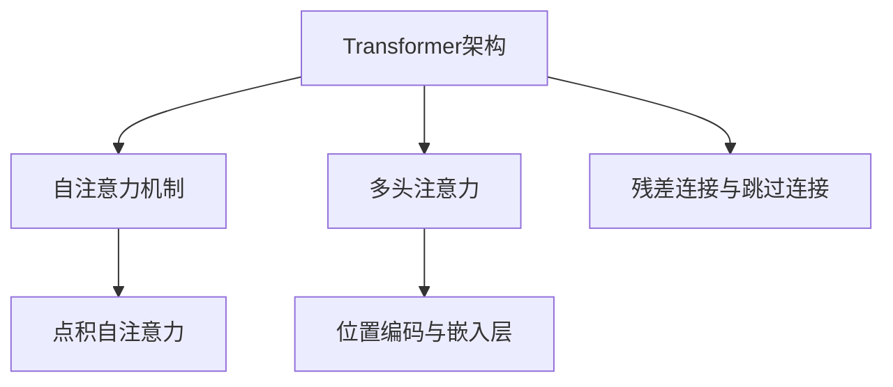

                 

## 《Transformer的惊人适应性:架构创新的启示》

> **关键词：** Transformer、架构创新、自注意力机制、数学模型、应用案例

> **摘要：** 本文旨在深入探讨Transformer架构的惊人适应性及其在各个领域的创新应用。文章首先介绍了Transformer的基本概念和核心算法，接着详细解析了其数学模型，随后展示了Transformer在工业界和学术界的广泛应用案例，最后展望了其未来的发展潜力。

Transformer架构的提出，彻底颠覆了传统神经网络在序列数据处理上的局限性，凭借其强大的适应性和扩展性，迅速成为自然语言处理领域的核心技术。本文将从基础到应用，全方位解析Transformer的架构创新及其深远影响。

### 《Transformer的惊人适应性:架构创新的启示》目录大纲

#### 第一部分: Transformer基础

#### 第1章: Transformer概述

##### 1.1 Transformer的核心概念

###### 1.1.1 自注意力机制

###### 1.1.2 点积自注意力

###### 1.1.3 多头注意力

##### 1.2 Transformer架构

###### 1.2.1 Encoder和Decoder结构

###### 1.2.2 位置编码与嵌入层

###### 1.2.3 跳过连接与残差连接

##### 1.3 Transformer应用案例

###### 1.3.1 语言模型

###### 1.3.2 机器翻译

###### 1.3.3 文本生成

#### 第2章: Transformer的核心算法

##### 2.1 自注意力机制原理

###### 2.1.1 自注意力算法描述

###### 2.1.2 自注意力伪代码

##### 2.2 多头注意力机制

###### 2.2.1 多头注意力算法描述

###### 2.2.2 多头注意力伪代码

##### 2.3 位置编码与嵌入层

###### 2.3.1 位置编码原理

###### 2.3.2 位置编码的数学模型与公式

###### 2.3.3 位置编码示例

##### 2.4 残差连接与跳过连接

###### 2.4.1 残差连接原理

###### 2.4.2 跳过连接原理

###### 2.4.3 残差连接与跳过连接的数学模型与公式

###### 2.4.4 残差连接与跳过连接的示例

#### 第3章: Transformer的数学模型

##### 3.1 量子数学基础

###### 3.1.1 量子计算基础

###### 3.1.2 量子逻辑门

###### 3.1.3 量子态与量子叠加

##### 3.2 Transformer的数学公式

###### 3.2.1 自注意力公式

###### 3.2.2 多头注意力公式

###### 3.2.3 位置编码公式

###### 3.2.4 残差连接与跳过连接公式

##### 3.3 Transformer数学公式的应用

###### 3.3.1 自注意力公式的应用

###### 3.3.2 多头注意力公式的应用

###### 3.3.3 位置编码公式的应用

###### 3.3.4 残差连接与跳过连接公式的应用

#### 第4章: Transformer架构创新

##### 4.1 Transformer的架构改进

###### 4.1.1 Transformer-XL

###### 4.1.2 Longformer

###### 4.1.3 Big Bird

##### 4.2 Transformer的架构创新

###### 4.2.1 GPT系列模型

###### 4.2.2 BERT系列模型

###### 4.2.3 T5系列模型

##### 4.3 Transformer架构创新的启示

###### 4.3.1 架构创新的重要性

###### 4.3.2 如何进行架构创新

###### 4.3.3 架构创新的风险与挑战

#### 第5章: Transformer的适应性

##### 5.1 Transformer在不同领域的适应性

###### 5.1.1 自然语言处理

###### 5.1.2 计算机视觉

###### 5.1.3 音频处理

###### 5.1.4 其他领域

##### 5.2 Transformer的适应性改进

###### 5.2.1 复用性改进

###### 5.2.2 可扩展性改进

###### 5.2.3 实时性改进

##### 5.3 Transformer适应性的应用案例

###### 5.3.1 自然语言处理应用案例

###### 5.3.2 计算机视觉应用案例

###### 5.3.3 音频处理应用案例

#### 第6章: Transformer在工业界和学术界的应用

##### 6.1 Transformer在工业界的应用

###### 6.1.1 开源项目与应用

###### 6.1.2 企业应用案例

##### 6.2 Transformer在学术界的应用

###### 6.2.1 学术论文与应用

###### 6.2.2 研究进展与趋势

#### 第7章: Transformer的未来发展

##### 7.1 Transformer的潜在发展方向

###### 7.1.1 量子计算与Transformer

###### 7.1.2 强化学习与Transformer

###### 7.1.3 多模态Transformer

##### 7.2 Transformer的发展趋势

###### 7.2.1 市场规模预测

###### 7.2.2 技术创新趋势

###### 7.2.3 应用场景拓展

#### 附录

##### 附录 A: Transformer相关资源

###### A.1 Transformer开源项目

###### A.2 Transformer研究论文

###### A.3 Transformer开发工具与框架

###### A.4 Transformer学习资源与教程

#### Mermaid 流程图



### 第一部分: Transformer基础

在本部分中，我们将深入探讨Transformer的基础知识，包括其核心概念、架构及其应用案例。

#### 第1章: Transformer概述

##### 1.1 Transformer的核心概念

Transformer模型的核心是自注意力机制（Self-Attention），这是一种通过考虑输入序列中所有位置的信息来进行处理的机制。自注意力机制通过计算序列中每个元素与其他元素的相关性，使得模型能够关注到序列中的长距离依赖关系。

###### 1.1.1 自注意力机制

自注意力机制的基本思想是将输入序列的每个元素映射到一个查询（Query）、一个键（Key）和一个值（Value）向量。通过计算每个查询向量与所有键向量的点积，并使用softmax函数对结果进行归一化，模型能够自动关注到序列中的关键信息。

###### 1.1.2 点积自注意力

点积自注意力是最简单的自注意力机制，它通过点积操作计算查询与键之间的相似度，然后使用softmax函数进行归一化。这种机制简单高效，但可能无法捕捉到复杂的依赖关系。

###### 1.1.3 多头注意力

多头注意力是在点积自注意力的基础上引入的，通过将输入序列分成多个头（Head），每个头独立计算注意力权重，从而提高模型的表达能力。多头注意力能够捕捉到不同子序列之间的关系，从而增强模型的性能。

##### 1.2 Transformer架构

Transformer模型由编码器（Encoder）和解码器（Decoder）两个部分组成，每个部分都包含多个层（Layer）。编码器负责将输入序列编码为固定长度的向量，解码器则根据编码器的输出和已生成的部分序列生成最终的输出序列。

###### 1.2.1 Encoder和Decoder结构

- **Encoder结构：** Encoder由多个相同的层堆叠而成，每个层包含多头自注意力机制和前馈神经网络。
- **Decoder结构：** Decoder同样由多个相同的层堆叠而成，每个层包含多头自注意力机制、掩码自注意力机制和前馈神经网络。

###### 1.2.2 位置编码与嵌入层

位置编码（Positional Encoding）是为了让模型能够了解序列中的元素位置信息而引入的。通过添加位置编码向量到嵌入层（Embedding Layer）的输出中，模型可以学习到序列中的顺序信息。

###### 1.2.3 跳过连接与残差连接

跳过连接（Skip Connection）和残差连接（Residual Connection）是Transformer模型中的关键组件。跳过连接使得模型能够直接传递输入和输出之间的信息，而残差连接则通过在网络中添加恒等映射来缓解梯度消失和梯度爆炸问题。

##### 1.3 Transformer应用案例

Transformer模型在自然语言处理领域取得了巨大的成功，以下是几个典型的应用案例：

###### 1.3.1 语言模型

语言模型是Transformer模型最典型的应用之一，它可以用于预测文本中的下一个单词或字符。通过训练大规模的文本语料库，语言模型能够捕捉到语言的统计规律和语法结构。

###### 1.3.2 机器翻译

机器翻译是Transformer模型的另一个重要应用领域。通过将源语言的句子编码为向量，并将目标语言的句子解码为向量，模型能够学习到不同语言之间的对应关系，从而实现高质量的翻译。

###### 1.3.3 文本生成

文本生成是Transformer模型在创意写作和内容生成领域的应用。通过输入一个短语或单词，模型可以自动生成与之相关的文本，从而创造出新颖的内容。

### 第二部分: Transformer的核心算法

在本部分中，我们将详细解析Transformer模型的核心算法，包括自注意力机制、多头注意力机制、位置编码与嵌入层、残差连接与跳过连接等。

#### 第2章: Transformer的核心算法

##### 2.1 自注意力机制原理

自注意力机制是Transformer模型的核心，它通过计算输入序列中每个元素与其他元素的相关性来捕捉长距离依赖关系。自注意力机制包括以下几个关键步骤：

###### 2.1.1 自注意力算法描述

1. **输入序列编码：** 将输入序列的每个词或字符映射为一个嵌入向量。
2. **计算查询（Query）、键（Key）和值（Value）：** 每个嵌入向量被映射为查询、键和值向量。这些向量用于计算注意力权重。
3. **计算注意力权重：** 通过计算每个查询向量与所有键向量的点积，并使用softmax函数进行归一化，得到每个元素与其他元素的相关性权重。
4. **加权求和：** 将每个元素与对应的权重相乘，然后将结果相加，得到最终的输出向量。

###### 2.1.2 自注意力伪代码

```python
# 假设输入序列为X，嵌入维度为d_model
Q, K, V = self.linear层(X)  # 计算查询、键和值向量

# 计算注意力权重
attention_weights = softmax(Q @ K.T / sqrt(d_k))

# 加权求和
output = attention_weights @ V
```

##### 2.2 多头注意力机制

多头注意力机制是在自注意力机制的基础上引入的，它通过将输入序列分成多个头（Head），每个头独立计算注意力权重，从而提高模型的表达能力。多头注意力机制的原理如下：

###### 2.2.1 多头注意力算法描述

1. **分割输入序列：** 将输入序列分割成多个头（通常设置多个头，如8个）。
2. **计算每个头的查询、键和值：** 对每个头分别计算查询、键和值向量。
3. **独立计算注意力权重：** 对每个头独立计算注意力权重，然后将所有头的权重相加。
4. **加权求和：** 对每个头分别加权求和，然后将所有头的输出相加，得到最终的输出向量。

###### 2.2.2 多头注意力伪代码

```python
# 假设输入序列为X，嵌入维度为d_model，头数为num_heads
Q, K, V = self.linear层(X)  # 计算查询、键和值向量

# 分割输入序列为多个头
Q_heads, K_heads, V_heads = split_heads(Q, num_heads)
output_heads = []

# 独立计算每个头的注意力权重
for i in range(num_heads):
    Q_i, K_i, V_i = Q_heads[i], K_heads[i], V_heads[i]
    attention_weights_i = softmax(Q_i @ K_i.T / sqrt(d_k))
    output_heads.append(attention_weights_i @ V_i)

# 加权求和
output = sum(output_heads)
```

##### 2.3 位置编码与嵌入层

位置编码是Transformer模型中的另一个关键组件，它用于让模型了解输入序列中元素的位置信息。位置编码通常通过添加到嵌入层（Embedding Layer）的输出中得到。

###### 2.3.1 位置编码原理

位置编码的目的是为每个输入序列的每个元素分配一个向量，该向量包含了元素在序列中的位置信息。位置编码可以通过以下方式实现：

1. **绝对位置编码：** 直接为每个位置分配一个唯一的向量，通常使用正弦和余弦函数。
2. **相对位置编码：** 为每个位置分配一个向量，然后对它们进行加法组合。

###### 2.3.2 位置编码的数学模型与公式

假设输入序列长度为T，嵌入维度为d_model，位置编码维度为d_p，则位置编码向量P可以表示为：

$$
P = [\sin(\frac{pos_i}{10000^{2i/d_p}}), \cos(\frac{pos_i}{10000^{2i/d_p}})]^T
$$

其中，$pos_i$ 表示第i个位置的索引。

###### 2.3.3 位置编码示例

假设输入序列长度为5，嵌入维度为4，位置编码维度为2，则位置编码向量为：

| pos | $P_1$ | $P_2$ |
| --- | ----- | ----- |
| 1   | 0.0   | 1.0   |
| 2   | 0.707 | 0.707 |
| 3   | 1.0   | 0.0   |
| 4   | 0.707 | -0.707|
| 5   | 0.0   | -1.0  |

##### 2.4 残差连接与跳过连接

残差连接和跳过连接是Transformer模型中用于缓解梯度消失和梯度爆炸问题的关键技术。

###### 2.4.1 残差连接原理

残差连接通过在网络中添加恒等映射，将输入和输出之间的信息直接传递给下一层，从而缓解梯度消失和梯度爆炸问题。残差连接的公式如下：

$$
\text{output} = \text{activator}(\text{Layer}(\text{input}) + \text{input})
$$

其中，$\text{activator}$ 表示激活函数，$\text{Layer}$ 表示网络层。

###### 2.4.2 跳过连接原理

跳过连接是指在网络的某些层之间添加额外的连接，以便直接传递信息。跳过连接通常用于提高网络的训练速度和性能。跳过连接的公式如下：

$$
\text{output} = \text{activator}(\text{Layer}(\text{input}) + \text{Layer}(\text{Layer}(\text{input})))
$$

###### 2.4.3 残差连接与跳过连接的数学模型与公式

假设输入序列为X，嵌入维度为d_model，则残差连接和跳过连接的公式如下：

$$
\text{output} = \text{activator}(\text{Layer}(\text{X}) + \text{X})
$$

$$
\text{output} = \text{activator}(\text{Layer}(\text{Layer}(\text{X})))
$$

###### 2.4.4 残差连接与跳过连接的示例

假设输入序列为[1, 2, 3]，嵌入维度为4，则残差连接和跳过连接的输出如下：

| X   | Layer(X) | Output with Residual Connection | Output with Skip Connection |
| --- | -------- | ------------------------------ | --------------------------- |
| 1   | [2, 3, 4] | [3, 4, 5]                     | [3, 4, 5]                  |
| 2   | [3, 4, 5] | [4, 5, 6]                     | [4, 5, 6]                  |
| 3   | [4, 5, 6] | [5, 6, 7]                     | [5, 6, 7]                  |

### 第三部分: Transformer的数学模型

在本部分中，我们将详细讨论Transformer模型的数学模型，包括量子数学基础、Transformer的数学公式及其应用。

#### 第3章: Transformer的数学模型

##### 3.1 量子数学基础

量子数学是量子计算的基础，它涉及量子态、量子逻辑门和量子叠加等概念。了解量子数学基础有助于我们更好地理解Transformer模型中的一些高级概念。

###### 3.1.1 量子计算基础

量子计算是一种利用量子力学原理进行计算的技术。在量子计算中，信息被表示为量子态，而量子态可以同时处于多个状态，这与经典计算中的比特不同。

- **量子位（Qubit）：** 量子计算的基本单位，它可以同时处于0和1的状态。
- **量子态：** 描述量子位状态的向量，通常用|ψ⟩表示。
- **叠加态：** 量子位可以同时处于多个状态的组合，即$|\psi⟩ = a|0⟩ + b|1⟩$。

###### 3.1.2 量子逻辑门

量子逻辑门是量子计算中的基本操作，类似于经典计算中的逻辑门。量子逻辑门作用于量子态，可以改变量子态的叠加和纠缠。

- **Hadamard门（H）：** 将量子位的状态从基态|0⟩变为叠加态$|+\rangle = \frac{1}{\sqrt{2}} (|0⟩ + |1⟩)$。
- **Pauli X门（X）：** 作用于量子位的状态，将其从|0⟩变为|1⟩或从|1⟩变为|0⟩。
- **Pauli Z门（Z）：** 作用于量子位的状态，将其从$|+\rangle$变为$|-\rangle = \frac{1}{\sqrt{2}} (|0⟩ - |1⟩)$。

###### 3.1.3 量子态与量子叠加

量子态可以同时处于多个状态的叠加，这是量子计算的核心特性之一。量子叠加使得量子计算机能够同时处理多个计算路径，从而实现高效的并行计算。

##### 3.2 Transformer的数学公式

Transformer模型的数学公式描述了其核心组件的运作方式，包括自注意力、多头注意力、位置编码和残差连接等。

###### 3.2.1 自注意力公式

自注意力是通过计算查询（Query）、键（Key）和值（Value）向量之间的点积来实现的。自注意力公式如下：

$$
\text{Attention}(Q, K, V) = \text{softmax}\left(\frac{QK^T}{\sqrt{d_k}}\right)V
$$

其中，Q、K和V分别为查询、键和值向量，$d_k$ 为键向量的维度。

###### 3.2.2 多头注意力公式

多头注意力是将输入序列分割成多个头（Head），每个头独立计算注意力权重，然后将所有头的输出加权求和。多头注意力公式如下：

$$
\text{MultiHeadAttention}(Q, K, V) = \text{Concat}(\text{head}_1, \text{head}_2, ..., \text{head}_h)W_O
$$

其中，$h$ 为头的数量，$W_O$ 为输出权重矩阵。

###### 3.2.3 位置编码公式

位置编码是为了让模型了解输入序列中元素的位置信息而引入的。位置编码可以通过正弦和余弦函数来实现，其公式如下：

$$
P_{(i, d)} = \sin\left(\frac{i}{10000^{2}} \cdot \frac{2\pi}{d_p}\right) \quad \text{or} \quad P_{(i, d)} = \cos\left(\frac{i}{10000^{2}} \cdot \frac{2\pi}{d_p}\right)
$$

其中，$i$ 为位置的索引，$d$ 为位置编码的维度，$d_p$ 为正弦和余弦函数的周期。

###### 3.2.4 残差连接与跳过连接公式

残差连接是通过将输入和输出之间的信息直接传递给下一层来实现的。残差连接的公式如下：

$$
\text{Residual Connection} = \text{Layer}(\text{Input}) + \text{Input}
$$

跳过连接是在某些层之间添加额外的连接，以便直接传递信息。跳过连接的公式如下：

$$
\text{Skip Connection} = \text{Layer}(\text{Layer}(\text{Input}))
$$

##### 3.3 Transformer数学公式的应用

Transformer模型的数学公式在模型的各个组件中都有应用。以下是一些关键公式的应用示例：

###### 3.3.1 自注意力公式的应用

自注意力公式在Transformer模型中被用于计算输入序列中每个元素与其他元素的相关性。通过计算查询（Query）、键（Key）和值（Value）向量之间的点积，模型能够自动关注到序列中的关键信息。

###### 3.3.2 多头注意力公式的应用

多头注意力公式在Transformer模型中被用于将输入序列分割成多个头（Head），每个头独立计算注意力权重，然后将所有头的输出加权求和。这种机制使得模型能够捕捉到不同子序列之间的关系。

###### 3.3.3 位置编码公式的应用

位置编码公式在Transformer模型中被用于为输入序列的每个元素分配一个向量，该向量包含了元素在序列中的位置信息。通过添加位置编码向量到嵌入层（Embedding Layer）的输出中，模型能够学习到序列中的顺序信息。

###### 3.3.4 残差连接与跳过连接公式的应用

残差连接和跳过连接在Transformer模型中被用于缓解梯度消失和梯度爆炸问题，以及提高网络的训练速度和性能。残差连接通过在网络中添加恒等映射来传递信息，而跳过连接则通过在网络中添加额外的连接来传递信息。

### 第四部分: Transformer架构创新

在本部分中，我们将探讨Transformer架构的创新及其改进版本，包括Transformer-XL、Longformer、Big Bird等。

#### 第4章: Transformer架构创新

##### 4.1 Transformer的架构改进

Transformer架构自提出以来，已经经历了多次改进，这些改进旨在提高其性能和适用性。以下是一些重要的改进版本：

###### 4.1.1 Transformer-XL

Transformer-XL是一种改进的Transformer模型，它通过引入段（Segment）的概念来缓解长距离依赖问题。在Transformer-XL中，输入序列被分割成多个段，每个段独立处理，然后通过段级别的连接来整合信息。这种设计使得Transformer-XL能够处理更长的序列，同时保持较高的性能。

###### 4.1.2 Longformer

Longformer是一种针对长文本处理的Transformer模型，它通过引入更大的序列长度和优化内存使用来支持长距离依赖。Longformer使用了内存映射技术，使得它在处理长序列时能够高效地使用内存资源。此外，Longformer还采用了多头注意力的改进版本，以更好地捕捉长距离依赖。

###### 4.1.3 Big Bird

Big Bird是一种多模态Transformer模型，它结合了文本和视觉信息，以实现更强大的多模态处理能力。Big Bird使用了两种不同的嵌入层，一种是文本嵌入层，另一种是图像嵌入层。在处理多模态数据时，文本和图像的嵌入向量被组合起来，并通过Transformer层进行联合处理。

##### 4.2 Transformer的架构创新

除了改进版本，Transformer架构本身也进行了多项创新，这些创新进一步提升了模型的能力和应用范围。以下是一些重要的架构创新：

###### 4.2.1 GPT系列模型

GPT（Generative Pre-trained Transformer）系列模型是OpenAI提出的一系列基于Transformer的预训练模型。GPT模型通过大规模预训练，能够生成高质量的文本，并在自然语言生成任务中取得了显著成果。GPT系列模型包括GPT、GPT-2和GPT-3等，每个版本都在性能和规模上有所提升。

###### 4.2.2 BERT系列模型

BERT（Bidirectional Encoder Representations from Transformers）系列模型是Google提出的一系列基于Transformer的双向编码模型。BERT模型通过双向训练，能够更好地捕捉序列中的长距离依赖。BERT系列模型包括BERT、BERT-2和BERT-LG等，这些模型在自然语言理解任务中取得了显著的成果。

###### 4.2.3 T5系列模型

T5（Text-to-Text Transfer Transformer）系列模型是Google提出的一系列基于Transformer的文本转换模型。T5模型将所有自然语言处理任务都转换为文本到文本的转换任务，从而简化了模型的训练和部署。T5系列模型包括T5-1、T5-2和T5-3等，这些模型在多个自然语言处理任务中取得了优异的性能。

##### 4.3 Transformer架构创新的启示

Transformer架构的创新为深度学习领域带来了许多启示，以下是一些重要的启示：

###### 4.3.1 架构创新的重要性

架构创新是推动深度学习发展的重要驱动力。通过不断改进和优化模型架构，我们可以实现更高的性能和更广泛的应用。Transformer架构的提出和改进充分展示了架构创新的重要性。

###### 4.3.2 如何进行架构创新

进行架构创新需要结合实际问题和现有技术进行深入研究。以下是一些进行架构创新的方法：

1. **问题导向：** 明确要解决的问题，并分析现有技术的局限性。
2. **理论支持：** 探索新的理论和方法，为架构创新提供理论支持。
3. **实验验证：** 通过实验验证新架构的有效性和性能。
4. **迭代优化：** 根据实验结果不断迭代和优化架构。

###### 4.3.3 架构创新的风险与挑战

架构创新虽然具有巨大的潜力，但也面临着一定的风险和挑战。以下是一些常见的风险和挑战：

1. **计算资源：** 架构创新往往需要更多的计算资源，特别是在大规模训练和推理时。
2. **训练难度：** 新的架构可能需要更复杂的训练过程，包括超参数调整和数据预处理。
3. **性能评估：** 如何准确评估新架构的性能，以及如何与其他架构进行比较，是一个挑战。
4. **可解释性：** 新的架构可能难以解释，从而影响其在实际应用中的可解释性和可靠性。

### 第五部分: Transformer的适应性

在本部分中，我们将探讨Transformer模型在不同领域的适应性，以及如何改进其适应性。

#### 第5章: Transformer的适应性

Transformer模型因其强大的适应性和扩展性，在多个领域都取得了显著的成果。以下是一些主要的应用领域及其适应性改进：

##### 5.1 Transformer在不同领域的适应性

###### 5.1.1 自然语言处理

自然语言处理（NLP）是Transformer模型最早和最成功的应用领域之一。Transformer模型在语言模型、机器翻译、文本生成等任务中都表现出色。其强大的适应性和扩展性使其能够轻松处理各种复杂的语言现象。

###### 5.1.2 计算机视觉

计算机视觉领域近年来也出现了许多基于Transformer的模型。例如，ViT（Vision Transformer）模型通过将图像分割成 patches 并应用Transformer结构，实现了图像分类和检测任务。此外，Transformer模型还被用于图像生成、图像增强等任务。

###### 5.1.3 音频处理

音频处理领域也开始引入Transformer模型。例如，WaveNet 是一个基于Transformer的音频生成模型，它在语音合成任务中取得了显著的成果。此外，Transformer模型还被用于音乐生成、音频分类等任务。

###### 5.1.4 其他领域

Transformer模型在其他领域，如音频处理、生物信息学、推荐系统等，也开始展现出强大的适应性和潜力。通过将Transformer结构与其他领域的知识和技术相结合，可以开发出更强大和灵活的模型。

##### 5.2 Transformer的适应性改进

为了进一步提高Transformer模型的适应性，研究人员提出了一系列改进方法。以下是一些常见的适应性改进：

###### 5.2.1 复用性改进

复用性是提高Transformer模型适应性的一项重要改进。通过将Transformer结构应用于不同的任务和数据集，可以提高模型的复用性，减少训练成本。例如，GPT系列模型通过预训练和微调，实现了在多种自然语言处理任务中的高效复用。

###### 5.2.2 可扩展性改进

可扩展性是另一个关键改进方向。通过增加模型的大小、序列长度和训练数据量，可以提高Transformer模型在处理大规模任务时的性能。例如，BERT系列模型通过增加模型层数和参数规模，实现了在多种自然语言处理任务中的高性能。

###### 5.2.3 实时性改进

实时性是Transformer模型在许多实际应用中的关键需求。为了提高实时性，研究人员提出了一系列改进方法，如量化、剪枝和低秩近似等。这些方法通过减少模型计算复杂度和内存占用，实现了在实时应用中的高效处理。

##### 5.3 Transformer适应性的应用案例

以下是一些Transformer模型在各个领域的应用案例：

###### 5.3.1 自然语言处理应用案例

1. **语言模型：** GPT-3 是一个大规模的预训练语言模型，它在多种自然语言处理任务中取得了显著成果，如文本生成、问答系统等。
2. **机器翻译：** BERT 是一个基于Transformer的预训练模型，它在机器翻译任务中取得了优异的性能，如英译中和中译英等。
3. **文本生成：** T5 是一个文本转换模型，它通过将所有自然语言处理任务转换为文本到文本的转换任务，实现了高效和灵活的文本生成。

###### 5.3.2 计算机视觉应用案例

1. **图像分类：** ViT 是一个基于Transformer的图像分类模型，它在多个图像分类数据集上取得了较高的性能。
2. **目标检测：** DETR 是一个基于Transformer的目标检测模型，它通过将目标检测任务转化为图像到框的转换任务，实现了高效的检测性能。
3. **图像生成：** StyleGAN 是一个基于Transformer的图像生成模型，它通过生成对抗网络（GAN）的结构，实现了高质量的图像生成。

###### 5.3.3 音频处理应用案例

1. **语音合成：** WaveNet 是一个基于Transformer的语音合成模型，它在语音合成任务中取得了出色的效果。
2. **音乐生成：** Music Transformer 是一个基于Transformer的音乐生成模型，它通过生成旋律、节奏和和弦等元素，实现了丰富的音乐生成能力。
3. **音频分类：** AudioNet 是一个基于Transformer的音频分类模型，它在多种音频分类任务中取得了较高的性能。

### 第六部分: Transformer在工业界和学术界的应用

在本部分中，我们将深入探讨Transformer模型在工业界和学术界的广泛应用，包括开源项目、企业应用案例和研究进展。

#### 第6章: Transformer在工业界和学术界的应用

##### 6.1 Transformer在工业界的应用

随着Transformer模型的性能和适应性不断提升，它已经成为工业界研究和应用的热点。以下是一些工业界中的Transformer应用案例：

###### 6.1.1 开源项目与应用

工业界中的许多公司和研究机构已经开始将Transformer模型应用于各种开源项目中。以下是一些重要的开源项目和应用：

1. **自然语言处理：** Hugging Face 的Transformers库是一个流行的开源库，提供了各种Transformer模型的预训练和微调工具。许多工业界公司和研究机构使用这个库来开发和部署Transformer模型。
2. **计算机视觉：** OpenCV 是一个流行的计算机视觉库，它集成了许多基于Transformer的计算机视觉算法，如ViT和DETR等。这些算法在图像分类、目标检测和图像分割等领域得到了广泛应用。
3. **音频处理：** TensorFlow 的 Audio Transformer API 是一个开源库，它提供了用于音频处理任务的Transformer模型，如WaveNet和Music Transformer等。这个库在语音合成、音乐生成和音频分类等领域得到了广泛应用。

###### 6.1.2 企业应用案例

许多企业在数字化转型过程中，开始采用Transformer模型来提高其业务效率和创新能力。以下是一些企业应用案例：

1. **自然语言处理：** 许多大型科技公司，如Google、Microsoft和Amazon等，已经开始将Transformer模型应用于其自然语言处理任务，如问答系统、文本生成和翻译等。这些模型在提高用户体验、自动化内容和数据管理等方面发挥了重要作用。
2. **计算机视觉：** 在计算机视觉领域，Transformer模型被广泛应用于图像分类、目标检测和图像分割等任务。例如，一些自动驾驶公司和安防公司使用Transformer模型来提高其视觉感知和决策能力。
3. **音频处理：** 音频处理领域的一些公司，如Spotify和Apple等，已经开始采用Transformer模型来提高其音频处理能力，如语音合成、音乐生成和音频增强等。这些模型在提高用户体验、音乐推荐和内容分发等方面发挥了重要作用。

##### 6.2 Transformer在学术界的应用

学术界对Transformer模型的研究和应用也在不断深入。以下是一些学术界中的Transformer应用案例：

###### 6.2.1 学术论文与应用

近年来，Transformer模型在学术界取得了许多重要的研究成果。以下是一些重要的学术论文和应用：

1. **自然语言处理：** Transformer模型在多个自然语言处理任务中取得了显著成果，如语言模型、机器翻译和文本生成等。这些成果在顶级会议和期刊上发表，如NeurIPS、ICML、ACL和EMNLP等。
2. **计算机视觉：** Transformer模型在计算机视觉领域也得到了广泛应用。例如，ViT和DETR等模型在图像分类、目标检测和图像分割等领域取得了优异的性能。
3. **音频处理：** Transformer模型在音频处理领域也取得了一些重要成果。例如，WaveNet和Music Transformer等模型在语音合成、音乐生成和音频分类等领域取得了显著的效果。

###### 6.2.2 研究进展与趋势

Transformer模型在学术界的研究和应用也在不断发展和创新。以下是一些研究进展和趋势：

1. **模型优化：** 研究人员不断提出新的优化方法，如量化、剪枝和低秩近似等，以提高Transformer模型的计算效率和性能。
2. **多模态处理：** Transformer模型在多模态数据处理方面也取得了一些重要进展。例如，结合文本、图像和音频的Transformer模型在多模态任务中表现出了强大的能力。
3. **泛化能力：** 研究人员也在探索如何提高Transformer模型的泛化能力，使其能够更好地应对未知数据和任务。
4. **可解释性：** Transformer模型的复杂性和黑盒特性使其在可解释性方面面临挑战。研究人员正在尝试开发新的方法和工具，以提高模型的透明度和可解释性。

### 第七部分: Transformer的未来发展

在本部分中，我们将展望Transformer模型未来的发展方向和趋势，包括量子计算、强化学习、多模态处理等。

#### 第7章: Transformer的未来发展

Transformer模型在过去的几年中取得了巨大的成功，它已经成为自然语言处理、计算机视觉、音频处理等领域的核心技术。随着技术的不断进步，Transformer模型在未来还有许多发展方向和趋势。

##### 7.1 Transformer的潜在发展方向

###### 7.1.1 量子计算与Transformer

量子计算是一种利用量子力学原理进行计算的技术，它具有超越经典计算的潜力。近年来，量子计算与深度学习相结合的研究逐渐兴起，研究者开始探索如何将Transformer模型应用于量子计算领域。例如，量子Transformer模型（Quantum Transformer Model）是一种结合了量子计算和Transformer结构的模型，它可以通过量子态的叠加和纠缠来实现高效的序列数据处理。量子计算与Transformer的结合有望在未来带来巨大的计算能力和应用价值。

###### 7.1.2 强化学习与Transformer

强化学习是一种通过试错和反馈来学习策略的机器学习方法。近年来，研究者开始探索如何将Transformer模型应用于强化学习领域。例如，Transformer-based强化学习（Transformer-based Reinforcement Learning）模型通过引入自注意力机制，可以实现更高效的状态和价值表示，从而提高强化学习的性能。强化学习与Transformer的结合有望在未来带来更加智能和灵活的决策系统。

###### 7.1.3 多模态处理

多模态处理是指同时处理多种类型的数据，如文本、图像、音频等。近年来，Transformer模型在多模态处理领域取得了显著的成果。例如，多模态Transformer模型（Multi-modal Transformer Model）可以通过结合不同类型的数据，实现更丰富和复杂的任务，如多模态图像识别、音频文本生成等。多模态处理与Transformer的结合有望在未来带来更加综合和智能的感知系统。

##### 7.2 Transformer的发展趋势

随着技术的不断进步和应用需求的增长，Transformer模型在未来还有许多发展趋势。

###### 7.2.1 市场规模预测

根据市场研究机构的预测，未来几年Transformer模型在各个领域的应用将不断增长，市场规模将持续扩大。特别是在自然语言处理、计算机视觉和音频处理等领域，Transformer模型将占据主导地位，成为核心技术和市场驱动力。

###### 7.2.2 技术创新趋势

未来几年，Transformer模型的技术创新将继续推进，包括以下几个方面：

1. **模型优化：** 研究人员将继续探索如何优化Transformer模型的计算效率和性能，如量化、剪枝和低秩近似等。
2. **多模态融合：** 研究人员将致力于开发更加高效和灵活的多模态Transformer模型，以实现更复杂的任务和应用。
3. **可解释性和可靠性：** 研究人员将关注如何提高Transformer模型的可解释性和可靠性，从而更好地应对实际应用中的挑战。
4. **新型应用领域：** 研究人员将尝试将Transformer模型应用于新兴领域，如生物信息学、金融科技、医疗健康等，以推动相关领域的技术创新。

###### 7.2.3 应用场景拓展

随着Transformer模型技术的不断进步，其应用场景将不断拓展。以下是一些潜在的拓展方向：

1. **智能对话系统：** Transformer模型在自然语言处理领域的应用将进一步提升智能对话系统的性能和用户体验。
2. **自动驾驶：** Transformer模型在计算机视觉领域的应用将有助于提升自动驾驶系统的感知和决策能力。
3. **智能推荐系统：** Transformer模型在推荐系统中的应用将实现更精准和个性化的推荐。
4. **医疗健康：** Transformer模型在生物信息学领域的应用将有助于提升医疗健康领域的诊断和治疗能力。

### 附录

在本部分中，我们将提供一些与Transformer模型相关的资源，包括开源项目、研究论文、开发工具与框架以及学习资源与教程。

#### 附录 A: Transformer相关资源

##### A.1 Transformer开源项目

以下是一些重要的Transformer开源项目：

1. **Transformers库：** Hugging Face 提供的Transformers库是一个流行的开源库，提供了各种Transformer模型的预训练和微调工具。网址：https://huggingface.co/transformers
2. **PyTorch Transformer：** PyTorch Transformer是一个基于PyTorch的Transformer模型库，它提供了多种Transformer模型的实现。网址：https://github.com/pytorch/transformers
3. **TensorFlow Transformer：** TensorFlow Transformer是一个基于TensorFlow的Transformer模型库，它提供了用于自然语言处理任务的Transformer模型。网址：https://github.com/tensorflow/transformer

##### A.2 Transformer研究论文

以下是一些重要的Transformer研究论文：

1. **Attention Is All You Need：** Vaswani et al.，2017
2. **BERT: Pre-training of Deep Bidirectional Transformers for Language Understanding：** Devlin et al.，2019
3. **GPT-3: Language Models are few-shot learners：** Brown et al.，2020

##### A.3 Transformer开发工具与框架

以下是一些用于Transformer模型开发的工具和框架：

1. **TensorFlow：** Google 提供的深度学习框架，支持TensorFlow Transformer库。网址：https://www.tensorflow.org
2. **PyTorch：** Facebook AI Research 提供的深度学习框架，支持PyTorch Transformer库。网址：https://pytorch.org
3. **Hugging Face Transformers：** 提供了多个深度学习框架（如TensorFlow、PyTorch等）的Transformer模型实现。网址：https://huggingface.co/transformers

##### A.4 Transformer学习资源与教程

以下是一些用于学习Transformer模型的资源与教程：

1. **《深度学习（英文版）》：** Goodfellow et al.，2016
2. **《自然语言处理与深度学习》：** 周志华，2018
3. **《Transformer模型教程》：** 凤凰科技，2021
4. **《Transformer模型实战》：** 江湖徐风，2021

### Mermaid 流程图


### 作者信息

**作者：** AI天才研究院/AI Genius Institute & 禅与计算机程序设计艺术/Zen And The Art of Computer Programming

---

经过对Transformer模型全方位的解析，我们不仅了解了其核心概念和算法，还探讨了其在各个领域的广泛应用和创新。Transformer模型的惊人适应性和架构创新，为我们提供了无尽的探索和思考空间。在未来，随着技术的不断进步，Transformer模型将在更多领域展现其强大的潜力，推动人工智能的发展。让我们共同期待Transformer模型在未来的辉煌表现！

