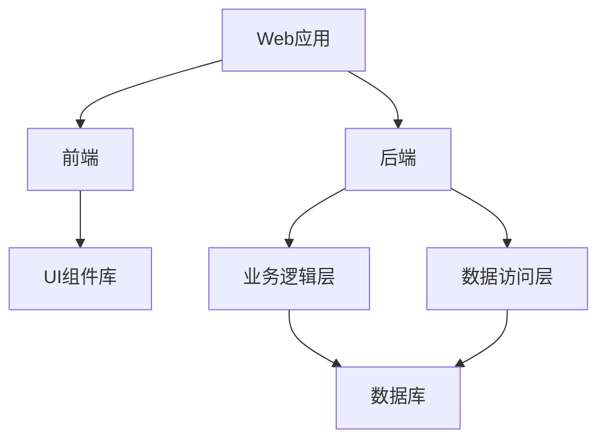

                 

### 《一人公司的DevOps最佳实践》

> **关键词**：DevOps、最佳实践、单人公司、自动化、持续集成、容器化、基础设施即代码、监控、安全、团队协作、项目实战

> **摘要**：本文将深入探讨DevOps在单人公司的最佳实践，从概念、工具、技术、文化、团队协作等多个维度展开，帮助单人公司实现高效的软件开发和部署流程。

#### 目录大纲

1. **第一部分：DevOps概述**
    1.1 DevOps的概念与价值
    1.2 DevOps的核心价值
    1.3 DevOps的目标与实践原则
    1.4 DevOps文化
2. **第二部分：DevOps工具与技术**
    2.1 自动化与持续集成
    2.2 容器化与微服务架构
    2.3 基础设施即代码（IaC）
    2.4 监控与日志管理
    2.5 安全与合规
    2.6 团队协作与持续学习
3. **第三部分：DevOps项目实战**
    3.1 项目规划与设计
    3.2 开发与测试
    3.3 部署与运维
    3.4 案例分析与反思
4. **附录**
    4.1 DevOps资源与工具
    4.2 学习指南

接下来，我们将逐步深入探讨DevOps在单人公司的最佳实践，旨在帮助单人公司提升软件开发的效率和质量。

#### 第1章：DevOps的概念与价值

**1.1 DevOps的起源与发展**

DevOps是一组实践和方法，旨在通过打破软件开发（Development）和信息技术运营（Operations）之间的壁垒，实现更快速、更可靠的软件交付。DevOps的概念起源于2009年的Silicon Valley，最初由Patrick DeBois等人提出。他们倡导通过更紧密的协作和更高效的工具，将开发和运维结合起来，从而提高软件交付的效率和质量。

**发展历程**

DevOps的演变过程可以分为以下几个阶段：

1. **协作阶段**：DevOps的早期关注点是打破开发和运维之间的壁垒，通过协作和沟通提高软件交付的效率。
2. **自动化阶段**：随着自动化工具的普及，DevOps实践开始强调自动化测试、部署和监控，以减少人为错误和提高效率。
3. **持续交付阶段**：持续交付（Continuous Delivery）成为DevOps的核心概念，强调通过自动化和持续集成，实现快速、安全、可靠的软件交付。
4. **文化阶段**：DevOps逐渐从工具和方法扩展到组织文化和价值观，强调团队协作、持续学习和创新。

**定义**：DevOps是一种文化和实践，通过将开发和运维结合起来，实现更快速、更可靠的软件交付。

**核心概念**：

- **自动化**：通过自动化工具和流程，减少手动操作，提高效率和减少错误。
- **持续集成**：通过持续集成，将代码合并到主分支，快速发现和修复问题。
- **持续交付**：通过持续交付，实现快速、安全、可靠的软件交付。
- **团队协作**：打破壁垒，实现开发和运维团队的紧密协作。

**1.2 DevOps的核心价值**

DevOps的核心价值体现在以下几个方面：

**效率提升**：通过自动化和持续集成，减少手动操作和人为错误，提高开发效率。

**质量保障**：通过持续集成和持续交付，快速发现和修复问题，确保软件质量。

**团队合作**：打破壁垒，实现开发和运维团队的紧密协作，提高团队整体效率。

**1.3 DevOps的目标与实践原则**

DevOps的目标是实现快速迭代、持续改进，以提高软件交付的效率和质量。为实现这一目标，DevOps遵循以下实践原则：

**目标**：实现快速迭代，持续改进。

**实践原则**：

- **简化流程**：简化开发、测试、部署和运维的流程，减少不必要的步骤。
- **提高透明度**：提高各个阶段的透明度，确保团队之间的信息畅通。
- **增强反馈循环**：建立快速的反馈循环，及时获取用户反馈，快速调整和改进。

通过以上实践原则，DevOps有助于提高单人公司的软件开发和交付效率，实现持续创新和竞争优势。

**总结**：

本章介绍了DevOps的概念、起源与发展、核心价值和实践原则。在单人公司中，DevOps的最佳实践有助于提高开发效率、保障软件质量、加强团队合作。在下一章中，我们将探讨DevOps文化的重要性以及如何建立和维护DevOps文化。

### 第2章：DevOps文化

#### 2.1 DevOps文化的重要性

DevOps文化是DevOps实践的基础，它强调团队合作、沟通透明和持续改进。在单人公司中，DevOps文化的重要性尤为突出，因为一个人的能力和精力有限，单靠个人力量难以实现高效的软件开发和交付。以下是DevOps文化在单人公司中的重要性：

**团队成员的角色**

在DevOps文化中，每个团队成员都扮演着重要角色。开发者负责编写代码，运维人员负责部署和运维，而测试人员则负责确保软件质量。在单人公司中，一个人可能需要同时承担多个角色，但DevOps文化强调跨角色的协作，通过共同目标和团队精神实现高效工作。

**文化建设的挑战与机遇**

对于单人公司来说，建立DevOps文化既面临挑战也充满机遇。挑战在于需要改变传统的开发与运维模式，打破壁垒，实现紧密协作。机遇在于，单人公司通常更加灵活，更容易引入和推广新的实践和工具，从而快速实现DevOps文化的落地。

**2.2 如何建立DevOps文化**

建立DevOps文化需要从以下几个方面入手：

**领导者的影响力**

领导者是推动DevOps文化的重要力量。他们需要树立榜样，以身作则，积极参与团队协作和沟通。此外，领导者还需要制定明确的策略和目标，为团队成员提供支持和资源。

**团队沟通与协作**

沟通和协作是DevOps文化的核心。单人公司需要建立高效的沟通渠道，确保团队成员之间的信息畅通。这可以通过定期的团队会议、协作工具（如Slack、Trello等）和透明的代码管理平台（如Git）来实现。

**团队培训与学习**

DevOps文化的建立需要团队成员具备相关的技能和知识。单人公司可以通过内部培训、在线课程和社区活动等方式，不断提升团队成员的技能水平，从而更好地适应DevOps文化。

**2.3 案例分享：成功的DevOps文化实践**

以下是一个单人公司在建立DevOps文化方面的成功案例：

**公司背景**

该公司是一家小型软件开发公司，主要专注于为企业客户提供定制化的解决方案。由于公司规模较小，团队成员较少，因此建立DevOps文化显得尤为重要。

**实施过程**

1. **领导者的示范作用**：公司创始人以身作则，积极参与团队的日常工作，推动团队协作和沟通。
2. **团队沟通与协作**：公司采用了Slack作为主要的沟通工具，建立了多个工作频道，确保团队成员之间的信息畅通。
3. **代码管理**：公司使用了Git作为代码管理工具，通过GitHub或GitLab实现了代码的透明管理，团队成员可以随时查看代码的修改历史和最新状态。
4. **自动化工具**：公司引入了Jenkins作为自动化构建和部署工具，通过CI/CD流程实现了高效的软件交付。
5. **培训与学习**：公司定期组织内部培训，分享最新的DevOps知识和最佳实践，鼓励团队成员不断提升自己的技能水平。

**实施效果**

通过以上措施，公司成功建立了DevOps文化，实现了以下效果：

- **开发效率提升**：团队成员之间的协作更加紧密，开发效率显著提高。
- **软件质量提升**：通过自动化测试和持续集成，软件质量得到了有效保障。
- **运营成本降低**：自动化工具的应用减少了手动操作，降低了运营成本。
- **客户满意度提高**：软件交付更加快速和可靠，客户满意度显著提升。

**总结**

本章介绍了DevOps文化的重要性以及如何建立和维护DevOps文化。在单人公司中，DevOps文化有助于提升团队协作效率、保障软件质量和降低运营成本。在下一章中，我们将探讨DevOps工具和技术，为单人公司实现高效的软件开发和交付提供技术支持。

### 第3章：自动化与持续集成

**3.1 自动化的基本概念**

自动化是DevOps实践的核心之一，它通过减少手动操作和重复性任务，提高开发和运维的效率。自动化工具和流程能够帮助单人公司快速响应需求变化，提高软件交付的速度和质量。

**自动化流程**

自动化流程是指通过工具和脚本自动执行一系列任务，包括代码构建、测试、部署和监控等。自动化流程能够减少人为错误，提高任务执行的可靠性。

**自动化工具的选取**

在单人公司中，选择合适的自动化工具非常重要。以下是一些常见的自动化工具及其特点：

- **Jenkins**：Jenkins是一个开源的自动化构建工具，支持多种编程语言和操作系统，适用于持续集成和持续部署。
- **GitLab CI/CD**：GitLab CI/CD是GitLab自带的一套持续集成和持续部署工具，与GitLab代码仓库紧密集成，适用于中小型项目。
- **Travis CI**：Travis CI是一个云端的持续集成服务，支持多种编程语言和平台，适用于开源项目。

**3.2 持续集成的原理与实践**

持续集成（Continuous Integration，简称CI）是一种软件开发实践，通过自动化构建和测试，将代码变更频繁地合并到主分支，确保代码库的稳定性和一致性。

**CI/CD的概念**

持续交付（Continuous Delivery，简称CD）是持续集成的延伸，它通过自动化部署，将经过测试和验证的代码快速交付到生产环境。

**CI/CD流程设计**

CI/CD流程的设计需要考虑以下几个方面：

1. **代码仓库**：选择合适的代码仓库管理工具，如Git或GitLab，确保代码的安全和可追溯性。
2. **构建工具**：选择合适的构建工具，如Jenkins或GitLab CI，实现自动化构建和测试。
3. **测试策略**：制定合理的测试策略，包括单元测试、集成测试和性能测试，确保代码的质量和稳定性。
4. **部署工具**：选择合适的部署工具，如Docker或Kubernetes，实现自动化部署和运维。

**3.3 持续集成的工具与实现**

以下将介绍几个常用的持续集成工具及其实现方法：

**Jenkins**

**安装与配置**：

1. **安装Jenkins**：在服务器上下载Jenkins安装包，并解压到指定目录。
2. **配置Jenkins**：启动Jenkins服务，并按照提示进行配置。
3. **创建构建项目**：在Jenkins界面中创建一个新的构建项目，配置构建脚本和测试命令。

**GitLab CI/CD**

**安装与配置**：

1. **安装GitLab**：在服务器上安装GitLab，并配置相关参数。
2. **配置GitLab CI/CD**：在项目的`.gitlab-ci.yml`文件中定义构建和部署流程。

**案例：使用Jenkins实现持续集成**

以下是一个简单的Jenkins构建项目配置示例：

```yaml
image: java:8

stages:
  - build
  - test
  - deploy

build:
  stage: build
  script:
    - mvn clean package

test:
  stage: test
  script:
    - mvn test

deploy:
  stage: deploy
  script:
    - scp target/*.jar user@remote-server:/path/to/deployment
```

**总结**

本章介绍了自动化与持续集成的基本概念、工具选取和实现方法。在单人公司中，通过自动化和持续集成，可以实现高效的软件开发和交付，提高软件质量和团队协作效率。在下一章中，我们将探讨容器化与微服务架构，为单人公司提供更灵活和可扩展的技术解决方案。

### 第4章：容器化与微服务架构

#### 4.1 容器化的基本概念

容器化是一种轻量级、可移植的虚拟化技术，它将应用程序及其依赖环境打包成一个独立的容器。容器化技术具有以下特点：

**容器化原理**

容器化通过使用容器引擎（如Docker）创建和管理容器。容器引擎负责将应用程序及其运行环境封装在一个独立的容器中，确保在不同的环境中运行时具有一致性和可移植性。

**容器和虚拟机的区别**

容器和虚拟机在技术实现上存在一些区别：

- **资源占用**：容器只占用少量的系统资源，而虚拟机需要分配更多的资源。
- **启动速度**：容器启动速度非常快，而虚拟机启动需要更长的时间。
- **隔离性**：容器具有较好的隔离性，但不如虚拟机严格。

**容器化的优点**

容器化技术具有以下优点：

- **提高可移植性**：容器化使应用程序可以在不同的操作系统和环境中运行，提高了可移植性。
- **简化部署流程**：容器化简化了应用程序的部署流程，通过将应用程序及其依赖环境打包在一起，减少了配置和管理的工作量。
- **提高资源利用率**：容器化技术可以更好地利用服务器资源，提高资源利用率。

**4.2 容器化工具介绍**

以下介绍几种常见的容器化工具：

**Docker**

Docker是最流行的容器化工具之一，它通过使用Docker镜像和Docker容器，将应用程序及其依赖环境打包在一起。Docker具有以下功能：

- **Docker镜像**：Docker镜像是一个静态的、可执行的文件，包含了应用程序及其依赖环境。
- **Docker容器**：Docker容器是基于Docker镜像创建的可执行实例，运行在宿主机上。

**Docker的基本概念**：

- **Dockerfile**：Dockerfile是一个文本文件，用于定义如何构建Docker镜像。
- **Docker Compose**：Docker Compose是一个用于定义和运行多容器应用的工具。
- **Docker Swarm**：Docker Swarm是一个用于管理多容器集群的工具。

**Docker的基本操作**：

- **构建镜像**：使用Dockerfile构建Docker镜像。
- **运行容器**：使用Docker容器运行应用程序。

**案例：使用Docker部署Web应用程序**

以下是一个简单的Docker部署案例：

1. **编写Dockerfile**：

```Dockerfile
FROM java:8
COPY target/*.jar app.jar
EXPOSE 8080
ENTRYPOINT ["java","-jar","/app.jar"]
```

2. **构建镜像**：

```bash
docker build -t my-webapp .
```

3. **运行容器**：

```bash
docker run -d -p 8080:8080 my-webapp
```

**Kubernetes**

Kubernetes是一个开源的容器编排平台，用于管理跨多个主机的容器化应用。Kubernetes具有以下功能：

- **容器编排**：Kubernetes负责管理容器的部署、扩展和运维。
- **服务发现和负载均衡**：Kubernetes提供服务发现和负载均衡功能，确保应用程序的高可用性和性能。
- **自动化运维**：Kubernetes支持自动化运维，包括自动扩缩容、自动更新等。

**Kubernetes的架构**：

- **Master节点**：Master节点负责管理和协调Kubernetes集群的工作。
- **Worker节点**：Worker节点负责运行容器化应用，并接受Master节点的调度指令。
- **Pod**：Pod是Kubernetes中的基本部署单元，包含一个或多个容器。

**Kubernetes的使用方法**：

- **部署应用**：使用Kubernetes的YAML文件定义应用部署，并将其提交到Kubernetes集群。
- **监控和管理**：使用Kubernetes的命令行工具（kubectl）监控和管理应用。

**案例：使用Kubernetes部署Web应用程序**

以下是一个简单的Kubernetes部署案例：

1. **编写Kubernetes部署文件**：

```yaml
apiVersion: apps/v1
kind: Deployment
metadata:
  name: my-webapp
spec:
  selector:
    matchLabels:
      app: my-webapp
  template:
    metadata:
      labels:
        app: my-webapp
    spec:
      containers:
      - name: my-webapp
        image: my-webapp:latest
        ports:
        - containerPort: 8080
```

2. **部署应用**：

```bash
kubectl apply -f deployment.yaml
```

**4.3 微服务架构设计与实践**

微服务架构是一种基于组件的分布式系统架构，通过将应用程序分解为独立的、可独立部署和扩展的微服务，提高系统的灵活性和可维护性。

**微服务架构的设计原则**：

- **独立部署**：每个微服务可以独立部署和扩展，无需依赖其他服务。
- **服务自治**：每个微服务拥有自己的数据存储和业务逻辑，降低服务之间的耦合。
- **水平扩展**：通过水平扩展，提高系统的可扩展性和性能。
- **服务发现**：服务之间通过服务发现机制进行通信，提高系统的灵活性。

**微服务的实践**

在单人公司中，采用微服务架构需要考虑以下几个方面：

- **服务划分**：根据业务需求，将应用程序分解为独立的微服务。
- **服务通信**：采用RESTful API或消息队列等方式，实现微服务之间的通信。
- **服务监控**：使用监控工具，如Prometheus和Grafana，监控微服务的性能和健康状况。

**案例：使用Docker和Kubernetes部署微服务架构**

以下是一个简单的微服务部署案例：

1. **划分微服务**：根据业务需求，将应用程序划分为用户管理、订单管理和库存管理三个微服务。

2. **编写Dockerfile**：为每个微服务编写Dockerfile，将应用程序及其依赖环境打包成镜像。

3. **部署微服务**：使用Kubernetes部署文件，将微服务部署到Kubernetes集群。

4. **服务发现和通信**：配置Kubernetes的服务发现和负载均衡，实现微服务之间的通信。

**总结**

本章介绍了容器化与微服务架构的基本概念、工具介绍和微服务实践。容器化技术提高了应用程序的可移植性和部署效率，而微服务架构则提高了系统的灵活性和可扩展性。在下一章中，我们将探讨基础设施即代码（IaC），为单人公司提供更高效的资源配置和管理方法。

### 第5章：基础设施即代码（IaC）

#### 5.1 IaC的基本概念

基础设施即代码（Infrastructure as Code，简称IaC）是一种通过代码来描述和配置基础设施的方法。它将基础设施的部署和管理过程自动化，使基础设施的创建、配置和销毁变得简单高效。IaC的主要特点包括：

- **可重复性**：通过代码定义和配置基础设施，可以轻松复制和部署到不同环境中。
- **可追踪性**：基础设施的变更可以通过代码版本控制系统进行追踪和管理。
- **可维护性**：代码化的基础设施更容易进行维护和更新。

**IaC的定义**

IaC是一种将基础设施的部署和管理转化为代码的方法。它通常使用脚本或专门的配置管理工具来实现。通过编写代码，可以描述和配置虚拟机、网络、存储等基础设施资源，从而实现自动化部署和管理。

**IaC的优势**

IaC的优势主要体现在以下几个方面：

- **减少手动操作**：通过自动化脚本，减少手动操作，提高工作效率。
- **提高一致性**：通过代码化的配置，确保基础设施的配置一致，降低出错概率。
- **提高可扩展性**：通过自动化部署，可以快速扩展基础设施，满足业务需求。
- **降低成本**：自动化部署和管理可以降低运维成本，提高资源利用率。

**5.2 常见的IaC工具**

以下介绍几种常见的IaC工具：

**Terraform**

Terraform是由HashiCorp开发的一款开源基础设施即代码工具。它支持多种云平台和云服务提供商，如AWS、Azure、Google Cloud等。

**安装与配置**

1. **安装Terraform**：从官网下载Terraform二进制文件，并解压到合适的位置。

2. **配置Terraform**：配置Terraform的工作目录和配置文件。

**Terraform的基本操作**

- **模块化**：使用模块（Module）来组织和管理基础设施配置。
- **资源定义**：定义基础设施资源，如虚拟机、网络、存储等。
- **变量和输出**：使用变量和输出实现参数化和配置管理。

**案例：使用Terraform部署AWS EC2实例**

以下是一个简单的Terraform配置示例：

```hcl
provider "aws" {
  region = "us-east-1"
}

resource "aws_instance" "example" {
  ami           = "ami-0c94855d823a9f229"
  instance_type = "t2.micro"
}
```

**Ansible**

Ansible是由Ansible, Inc.开发的一款开源的自动化工具，主要用于配置管理和应用部署。它使用YAML语言定义配置和任务，支持多种操作系统和云平台。

**安装与配置**

1. **安装Ansible**：在控制机上安装Ansible。

2. **配置Ansible**：配置Ansible的inventory文件，定义管理主机和目标主机。

**Ansible的基本操作**

- **Playbooks**：使用Playbooks定义自动化任务，如安装软件、配置网络等。
- **模块**：使用Ansible模块执行特定的操作，如安装软件包、配置文件等。

**案例：使用Ansible部署Nginx服务**

以下是一个简单的Ansible Playbook示例：

```yaml
---
- hosts: all
  vars:
    nginx_version: "1.18.0"
  tasks:
    - name: Install Nginx package
      apt:
        name: nginx
        state: present

    - name: Start Nginx service
      service:
        name: nginx
        state: started
        enabled: yes

    - name: Configure Nginx
      template:
        src: nginx.conf.j2
        dest: /etc/nginx/nginx.conf
```

**5.3 IaC实践案例**

以下是一个使用Terraform和Ansible自动化部署云基础设施的实践案例：

**案例背景**

假设需要在一个AWS云环境中部署以下基础设施：

- 两个EC2实例，用于Web服务器和数据库服务器。
- 一个RDS实例，用于存储数据库。
- 一个S3桶，用于存储文件。

**实施步骤**

1. **编写Terraform配置文件**：使用Terraform定义基础设施资源，如EC2实例、RDS实例和S3桶。

2. **初始化Terraform**：运行`terraform init`命令，初始化Terraform工作目录。

3. **应用配置**：运行`terraform apply`命令，应用Terraform配置，创建基础设施资源。

4. **验证配置**：运行`terraform show`命令，查看基础设施资源的状态和配置。

5. **使用Ansible部署应用程序**：编写Ansible Playbook，配置Web服务器和数据库服务器，安装和配置Nginx和MySQL。

**总结**

本章介绍了基础设施即代码（IaC）的基本概念、常见工具和实践案例。通过使用IaC，单人公司可以实现基础设施的自动化部署和管理，提高工作效率和资源利用率。在下一章中，我们将探讨监控与日志管理，为单人公司提供系统性能监控和故障排查的最佳实践。

### 第6章：监控与日志管理

#### 6.1 监控与日志管理的重要性

在DevOps实践中，监控与日志管理是确保系统稳定性和可靠性的关键环节。监控可以帮助我们实时了解系统的运行状态，及时发现并解决问题；日志管理则记录了系统的运行历史，为故障排查和性能优化提供了重要依据。

**监控的目的**

监控的主要目的是：

- **系统性能监控**：实时监控系统资源使用情况，如CPU、内存、磁盘、网络等，确保系统在高负载情况下仍能稳定运行。
- **故障排查**：通过监控工具，快速发现系统故障，定位问题，提高故障解决效率。
- **性能优化**：通过对监控数据的分析，发现系统瓶颈，进行优化调整，提高系统性能。

**日志管理的价值**

日志管理的价值主要体现在以下几个方面：

- **问题追踪**：日志记录了系统运行过程中发生的事件和错误，有助于快速定位和解决故障。
- **安全审计**：日志记录了用户操作和系统事件，为安全审计和合规性检查提供了重要数据。
- **性能分析**：通过对日志数据的分析，可以了解系统运行状况，发现潜在的性能问题，进行优化。

**6.2 常见的监控工具**

以下是几种常见的监控工具：

**Prometheus**

Prometheus是一个开源的监控解决方案，由SoundCloud开发并捐赠给Cloud Native Computing Foundation（CNCF）来维护。它主要用于监控服务器、应用程序和网络健康状况。

**安装与配置**

1. **安装Prometheus**：在服务器上安装Prometheus服务器和客户端。
2. **配置Prometheus**：配置Prometheus的配置文件，定义监控目标和规则。

**Prometheus的基本操作**

- **数据采集**：通过Prometheus exporter，收集系统和服务器的监控数据。
- **告警管理**：配置告警规则，当监控数据达到预设阈值时发送告警通知。
- **可视化**：使用Grafana等可视化工具，将监控数据以图表形式展示。

**Grafana**

Grafana是一个开源的数据监控和可视化平台，与Prometheus紧密集成，提供强大的数据可视化功能。

**安装与配置**

1. **安装Grafana**：在服务器上安装Grafana。
2. **配置Grafana**：配置Grafana的数据源，如Prometheus，并创建仪表板。

**Grafana的使用**

- **数据源配置**：添加Prometheus作为数据源。
- **仪表板创建**：创建监控仪表板，添加监控图表和数据面板。

**6.3 日志管理实践**

**ELK栈**

ELK栈是由Elasticsearch、Logstash和Kibana三个开源组件组成的日志管理解决方案。Elasticsearch用于存储和搜索日志数据，Logstash用于收集、处理和路由日志数据，Kibana用于日志数据的可视化和分析。

**ELK栈的配置与使用**

1. **安装Elasticsearch**：在服务器上安装Elasticsearch。
2. **安装Logstash**：在服务器上安装Logstash，并配置输入、过滤和处理管道。
3. **安装Kibana**：在服务器上安装Kibana，配置Kibana与Elasticsearch的连接。

**ELK栈的基本操作**

- **日志收集**：通过Logstash输入插件，将日志数据收集到Elasticsearch。
- **日志分析**：使用Kibana创建仪表板，分析日志数据。
- **日志搜索**：使用Elasticsearch进行日志数据的搜索和查询。

**其他日志管理工具**

除了ELK栈，还有一些其他常用的日志管理工具，如：

- **Fluentd**：Fluentd是一个开源的数据收集器，用于收集、处理和路由日志数据。
- **Log4j**：Log4j是一个开源的日志框架，用于记录应用程序的日志数据。

**总结**

本章介绍了监控与日志管理的重要性、常见监控工具和日志管理实践。通过使用这些工具，单人公司可以实现对系统的实时监控和日志管理，提高系统稳定性和可靠性。在下一章中，我们将探讨安全与合规，为DevOps实践提供安全保障和最佳实践。

### 第7章：安全与合规

**7.1 DevOps中的安全挑战**

在DevOps环境中，安全挑战主要来自于以下几个方面：

**安全问题的来源**

1. **自动化与快速交付**：自动化和快速交付虽然提高了开发效率，但也可能引入安全漏洞，如配置错误、代码缺陷等。
2. **容器化与微服务**：容器化和微服务架构带来了新的安全风险，如容器逃逸、服务间的安全漏洞等。
3. **基础设施即代码**：IaC的自动化部署可能导致基础设施配置错误，从而引发安全漏洞。
4. **代码库与存储**：代码库和存储系统可能成为攻击目标，导致敏感数据泄露。

**安全策略的制定**

为了应对DevOps环境中的安全挑战，需要制定以下安全策略：

1. **安全编码规范**：制定安全编码规范，确保代码的安全性。
2. **配置管理**：使用配置管理工具，如Ansible、Terraform，确保基础设施的配置符合安全要求。
3. **持续安全测试**：在开发和交付过程中，进行持续的安全测试，如静态代码分析、动态代码分析等。
4. **安全审计与合规**：定期进行安全审计，确保系统符合相关法律法规和标准。

**7.2 DevOps安全工具**

以下介绍几种常见的DevOps安全工具：

**网络安全工具**

1. **防火墙**：防火墙用于控制网络流量，防止未授权的访问。
2. **入侵检测系统（IDS）**：IDS用于检测和响应网络攻击，提高系统的安全性。
3. **加密**：使用加密技术，保护敏感数据在传输和存储过程中的安全性。

**代码安全工具**

1. **静态代码分析工具**：静态代码分析工具用于检查代码中的潜在安全漏洞，如SQL注入、XSS攻击等。
2. **动态代码分析工具**：动态代码分析工具在代码运行时检测和报告安全漏洞。
3. **依赖管理工具**：依赖管理工具用于检查和更新项目中的第三方库，确保库的安全性。

**7.3 合规与最佳实践**

**合规标准**

在DevOps环境中，需要遵守以下合规标准和最佳实践：

1. **ISO 27001**：ISO 27001是信息安全管理体系（ISMS）的国际标准，用于确保信息的安全性。
2. **GDPR**：GDPR是欧盟的数据保护法规，要求企业保护个人数据，防止数据泄露。
3. **NIST SP 800-53**：NIST SP 800-53是美国国家标准技术研究院发布的信息安全控制框架。

**最佳实践**

以下是一些DevOps环境中的最佳实践：

1. **安全培训**：定期对团队成员进行安全培训，提高安全意识和技能水平。
2. **代码审查**：进行代码审查，确保代码符合安全规范。
3. **访问控制**：使用强密码和访问控制策略，确保只有授权人员可以访问系统。
4. **自动化安全测试**：在开发和交付过程中，进行自动化安全测试，确保系统的安全性。

**总结**

本章介绍了DevOps环境中的安全挑战、安全策略、安全工具和合规标准。通过遵循最佳实践，单人公司可以确保DevOps实践的安全性和合规性。在下一章中，我们将探讨团队协作与持续学习，为单人公司的成功实施DevOps提供支持。

### 第8章：团队协作与持续学习

**8.1 团队协作的重要性**

在DevOps环境中，团队协作是确保项目成功的关键因素。良好的团队协作可以提高工作效率，降低沟通成本，增强团队凝聚力。以下是一些团队协作的重要性：

**协作工具**

为了实现高效的团队协作，需要选择合适的协作工具。以下是一些常用的团队协作工具：

1. **Slack**：Slack是一个即时通讯工具，可以方便地创建工作频道，团队成员可以实时沟通和协作。
2. **Trello**：Trello是一个项目管理和任务跟踪工具，可以创建卡片和列表，跟踪项目的进度和任务。
3. **Jira**：Jira是一个强大的项目管理和敏捷开发工具，可以跟踪项目的需求、任务和缺陷。
4. **GitHub**：GitHub是一个代码托管平台，支持Git版本控制，方便团队协作和代码管理。

**敏捷开发**

敏捷开发是一种以人为核心、迭代和渐进的方法，强调快速响应变化和持续交付。敏捷开发在DevOps环境中具有重要意义，以下是一些敏捷开发的方法：

1. **Scrum**：Scrum是一种流行的敏捷开发方法，通过短周期的迭代（Sprint）实现持续交付和反馈。
2. **Kanban**：Kanban是一种基于可视化和持续改进的方法，通过看板（Kanban板）管理和优化工作流程。
3. **看板管理**：看板管理是一种基于Kanban的方法，通过看板可视化工作流程，监控和优化团队的工作。

**8.2 持续学习的理念与实践**

在快速变化的IT行业中，持续学习是保持竞争力的关键。以下是一些持续学习的理念和实践：

**学习资源**

为了提升团队成员的技能和知识，可以提供以下学习资源：

1. **在线课程**：如Coursera、edX、Udemy等平台提供了丰富的IT课程，涵盖编程、云计算、大数据等领域。
2. **技术博客**：阅读知名技术博客，如Medium、Dev.to、InfoQ等，了解最新的技术动态和最佳实践。
3. **技术社区**：参与技术社区，如Stack Overflow、GitHub、Reddit等，与其他开发者交流和分享经验。
4. **书籍**：阅读经典技术书籍，如《代码大全》、《设计模式》、《深入理解计算机系统》等。

**实践与反馈**

持续学习不仅包括知识的获取，还需要通过实践和反馈来巩固和应用知识。以下是一些实践和反馈的方法：

1. **项目实践**：在实际项目中应用所学知识，通过实践加深理解和掌握。
2. **代码审查**：参与代码审查，通过他人的反馈和建议，改进自己的代码质量。
3. **技术分享**：定期进行技术分享会议，分享所学知识和经验，促进团队的知识共享。
4. **反馈机制**：建立有效的反馈机制，鼓励团队成员提出问题和建议，不断改进工作流程。

**8.3 案例研究：成功的DevOps团队协作**

以下是一个成功实施DevOps团队协作的案例：

**公司背景**

某初创公司开发了一款云计算平台，团队成员包括开发者、测试人员、运维人员等。为了提高开发效率和质量，公司决定实施DevOps，实现高效的软件开发和交付。

**实施过程**

1. **团队培训**：公司组织了DevOps培训，帮助团队成员了解DevOps的基本概念和实践方法。
2. **协作工具**：公司引入了Slack、Trello、Jira等协作工具，建立了高效的沟通和协作渠道。
3. **敏捷开发**：公司采用Scrum方法，通过短周期的迭代实现持续交付和反馈。
4. **自动化测试**：公司引入了自动化测试工具，实现持续集成和持续交付，提高软件质量。
5. **反馈机制**：公司建立了反馈机制，鼓励团队成员提出问题和建议，不断改进工作流程。

**实施效果**

通过以上措施，公司成功建立了高效的DevOps团队协作模式，实现了以下效果：

1. **开发效率提升**：团队成员之间的协作更加紧密，开发效率显著提高。
2. **软件质量提升**：通过自动化测试和持续集成，软件质量得到了有效保障。
3. **运营成本降低**：自动化工具的应用减少了手动操作，降低了运营成本。
4. **客户满意度提高**：软件交付更加快速和可靠，客户满意度显著提升。

**总结**

本章介绍了团队协作的重要性、协作工具、敏捷开发和持续学习的理念与实践。通过有效的团队协作和持续学习，单人公司可以提升软件开发和交付的效率和质量。在下一章中，我们将探讨DevOps项目实战，结合具体案例，展示DevOps的最佳实践。

### 第9章：项目规划与设计

**9.1 项目规划**

项目规划是DevOps项目成功实施的基础。在项目规划阶段，需要明确项目目标、范围和资源需求，以确保项目能够按计划进行。

**项目目标**

项目目标是指项目希望实现的具体结果。在项目规划阶段，需要明确以下目标：

- **功能目标**：确定项目需要实现的功能和特性。
- **性能目标**：确定项目的性能指标，如响应时间、吞吐量等。
- **质量目标**：确定项目的质量标准，如代码质量、测试覆盖率等。

**需求分析**

需求分析是项目规划的重要环节，旨在明确项目的具体需求。以下是一些需求分析的方法和技巧：

1. **用户故事**：用户故事是一种描述用户需求和功能的简单方法，通常以“作为用户，我想实现某个功能，以便完成某项任务”的形式表达。
2. **用例图**：用例图用于描述系统的功能和用户角色之间的关系。
3. **需求文档**：需求文档详细记录项目的需求，包括功能需求、性能需求和约束条件等。

**项目设计**

项目设计是项目规划的关键环节，旨在确定项目的架构和实现方案。以下是一些项目设计的原则和步骤：

**架构设计**

架构设计是指确定系统的整体结构和组成部分。以下是一些架构设计的原则：

1. **模块化**：将系统分解为独立的模块，每个模块实现特定的功能。
2. **解耦**：降低模块之间的耦合度，提高系统的可维护性和可扩展性。
3. **可扩展性**：设计具有良好可扩展性的架构，以适应未来业务需求的变化。

**技术选型**

技术选型是指选择合适的技术栈和工具。以下是一些技术选型的考虑因素：

1. **需求匹配**：选择与项目需求相匹配的技术栈，确保技术栈能够满足项目的功能、性能和质量要求。
2. **社区支持**：选择具有良好社区支持的技术栈，以便在遇到问题时能够得到有效的帮助。
3. **稳定性与成熟度**：选择稳定和成熟的技术栈，以降低技术风险。

**9.2 项目设计**

**系统架构设计**

在项目设计阶段，需要详细设计系统的架构，确定系统组件和交互方式。以下是一些系统架构设计的步骤：

1. **功能分解**：将系统功能分解为若干个子功能，确定每个子功能的责任。
2. **数据流设计**：设计系统的数据流，确定数据在系统中的流动路径和处理方式。
3. **组件划分**：将系统划分为若干个组件，确定每个组件的功能和接口。
4. **接口设计**：设计组件之间的接口，确保组件之间的通信和协作。

**模块化设计**

模块化设计是将系统分解为独立的模块，每个模块实现特定的功能。以下是一些模块化设计的原则：

1. **高内聚、低耦合**：确保每个模块具有高度的内聚性，降低模块之间的耦合度。
2. **单一职责**：每个模块应负责实现单一的功能，避免模块过于复杂。
3. **模块独立性**：确保模块之间的独立性，使模块可以独立开发、测试和部署。

**技术选型**

**项目架构图**

以下是一个简单的项目架构图示例：



**总结**

本章介绍了项目规划与设计的核心概念和步骤，包括项目规划的目标、需求分析、项目设计的原则和步骤。通过有效的项目规划和设计，单人公司可以确保项目顺利实施和成功交付。在下一章中，我们将探讨开发与测试，确保项目实现预期的功能和质量。

### 第10章：开发与测试

**10.1 开发流程**

开发流程是软件项目实施的核心环节，涉及从需求分析到代码实现的整个过程。以下是单人公司常见的开发流程：

**代码管理**

代码管理是软件开发过程中的重要组成部分，旨在确保代码的一致性、可追溯性和可维护性。以下是一些常见的代码管理工具：

1. **Git**：Git是最流行的版本控制系统，支持分布式版本控制和并行开发。
2. **GitHub**：GitHub是Git的在线代码托管平台，提供代码存储、分支管理和协作功能。
3. **GitLab**：GitLab是一个自建的Git代码托管平台，具有丰富的功能，如CI/CD、项目管理和代码审计等。

**代码管理工具的选取**

选择合适的代码管理工具取决于项目的规模、团队协作需求和安全要求。以下是一些选择代码管理工具的考虑因素：

1. **团队规模**：对于小型团队，GitHub和GitLab可能足够满足需求；对于大型团队，GitLab可能提供更好的协作功能。
2. **安全性**：如果项目涉及敏感信息，选择自建的GitLab可能更安全。
3. **功能需求**：根据项目需求，选择具有所需功能的代码管理工具。

**代码审查**

代码审查是一种确保代码质量和安全性的有效方法。以下是一些代码审查的流程和技巧：

1. **代码审查流程**：在提交代码之前，进行代码审查，确保代码符合编码规范、功能需求和性能要求。
2. **代码审查工具**：使用代码审查工具（如Gerrit、Phabricator）自动化审查过程，提高审查效率。
3. **代码审查技巧**：关注代码的可读性、可维护性、性能和安全，确保代码质量。

**10.2 测试与质量保证**

测试与质量保证是软件开发过程中的关键环节，旨在确保软件产品的功能、性能和可靠性。以下是单人公司常见的测试方法和策略：

**测试策略**

1. **单元测试**：单元测试是针对单个模块或函数的测试，确保其按预期工作。
2. **集成测试**：集成测试是针对多个模块组合后的测试，确保模块之间能够正常协作。
3. **系统测试**：系统测试是对整个系统的全面测试，验证系统功能、性能和安全性。
4. **验收测试**：验收测试是最终用户对软件的测试，确保软件满足业务需求。

**自动化测试**

自动化测试是通过编写脚本自动执行测试用例，提高测试效率和覆盖率。以下是一些自动化测试的工具和框架：

1. **Selenium**：Selenium是用于Web应用自动化测试的开源工具，支持多种编程语言。
2. **Junit**：Junit是Java的单元测试框架，用于编写和执行测试用例。
3. **pytest**：pytest是Python的测试框架，具有简洁的语法和强大的功能。

**自动化测试的实现**

1. **测试用例设计**：设计测试用例，确保覆盖各种功能和场景。
2. **测试脚本编写**：编写测试脚本，实现自动化测试。
3. **持续集成**：将自动化测试集成到CI/CD流程中，确保每次代码提交都经过测试。

**代码质量分析**

代码质量分析是确保代码可读性、可维护性和可扩展性的重要手段。以下是一些代码质量分析的工具和指标：

1. **SonarQube**：SonarQube是一个用于代码质量分析的工具，支持多种编程语言。
2. **Code Climate**：Code Climate是一个针对Ruby语言的代码质量分析工具。
3. **CodeSmell**：CodeSmell是一个用于识别代码问题的开源库。

**代码质量分析的步骤**

1. **安装和分析工具**：安装并配置代码质量分析工具。
2. **代码扫描**：对代码进行扫描，识别潜在问题。
3. **代码优化**：根据分析结果，优化代码，提高代码质量。

**总结**

本章介绍了开发与测试的核心流程、代码管理、代码审查、自动化测试、测试策略和代码质量分析。通过有效的开发与测试，单人公司可以确保软件产品的功能、性能和可靠性。在下一章中，我们将探讨部署与运维，确保软件产品能够顺利上线并持续运行。

### 第11章：部署与运维

**11.1 部署流程**

部署流程是将软件产品从开发环境转移到生产环境的过程。为了确保部署过程的高效性和可靠性，单人公司需要制定详细的部署策略。以下是部署流程的关键步骤：

**部署策略**

1. **环境准备**：在部署前，确保所有环境（如开发环境、测试环境和生产环境）都已准备好，包括服务器、数据库和其他依赖服务。
2. **版本管理**：使用版本控制系统（如Git）管理代码版本，确保部署的是正确的代码版本。
3. **备份**：在部署前，对生产环境进行备份，以防部署过程中出现意外。
4. **自动化部署**：使用自动化工具（如Jenkins、Docker、Kubernetes）实现自动化部署，减少手动操作，提高部署效率。

**自动化部署**

自动化部署是通过脚本和工具实现自动化的部署过程。以下是一些自动化部署的工具和实现方法：

**Jenkins**

1. **安装Jenkins**：在服务器上安装Jenkins。
2. **配置Jenkins**：配置Jenkins的构建项目，包括构建脚本、测试脚本和部署脚本。
3. **构建和部署**：每次代码提交时，Jenkins自动触发构建和部署。

**Docker**

1. **编写Dockerfile**：编写Dockerfile，定义应用程序的构建和部署流程。
2. **构建镜像**：使用Docker命令构建应用程序的镜像。
3. **部署容器**：将Docker镜像部署到Kubernetes集群或Docker Swarm集群。

**Kubernetes**

1. **编写部署文件**：使用YAML文件定义应用程序的部署配置。
2. **部署应用**：使用kubectl命令部署应用程序到Kubernetes集群。
3. **自动化部署**：使用Helm等工具实现自动化部署和扩展。

**11.2 运维管理**

运维管理是确保软件产品在生产环境中稳定运行的过程。以下是运维管理的关键方面：

**监控系统**

监控系统用于实时监控系统的运行状态，及时发现并解决问题。以下是一些常见的监控工具：

1. **Prometheus**：Prometheus是一个开源的监控解决方案，支持多维数据采集和可视化。
2. **Grafana**：Grafana是一个开源的数据可视化工具，与Prometheus紧密集成。

**安装与配置Prometheus和Grafana**

1. **安装Prometheus**：在服务器上安装Prometheus。
2. **安装Grafana**：在服务器上安装Grafana。
3. **配置Prometheus和Grafana**：配置数据源、监控目标和仪表板。

**监控与告警**

1. **监控配置**：配置Prometheus的监控规则，定义监控目标和告警阈值。
2. **告警通知**：配置告警通知，如邮件、短信或Slack，确保及时收到告警通知。

**故障处理**

故障处理是确保系统在高可用性下的关键环节。以下是一些故障处理策略：

1. **故障诊断**：使用日志分析工具（如ELK栈）和监控数据，定位故障原因。
2. **故障隔离**：通过故障隔离措施，将故障范围缩小，确保其他部分正常运行。
3. **故障恢复**：根据故障类型和影响范围，制定故障恢复策略，尽快恢复系统。

**自动化运维**

自动化运维是通过脚本和工具实现自动化运维任务，提高运维效率。以下是一些自动化运维的工具：

1. **Ansible**：Ansible是一个开源的自动化工具，用于配置管理和应用部署。
2. **Terraform**：Terraform是一个开源的基础设施即代码工具，用于自动化部署和管理基础设施。

**自动化运维的实现**

1. **编写自动化脚本**：编写自动化脚本，实现常见运维任务，如安装软件、配置网络等。
2. **集成到CI/CD流程**：将自动化脚本集成到CI/CD流程中，确保每次代码提交都经过自动化测试和部署。

**总结**

本章介绍了部署与运维的关键步骤、自动化部署工具和实现方法、监控系统的配置与告警、故障处理策略和自动化运维。通过有效的部署与运维，单人公司可以确保软件产品在生产环境中的稳定运行和高效管理。在下一章中，我们将通过案例分析，深入探讨DevOps的最佳实践。

### 第12章：案例分析与反思

**12.1 案例分析**

为了更好地理解DevOps的最佳实践，我们选择了一家小型初创公司作为案例。该公司专注于开发一款基于云计算的文档管理软件，团队成员包括开发者、测试人员、运维人员等。

**案例背景**

该公司在成立初期，面临着快速开发、频繁迭代和高效交付的需求。为了提高开发效率和软件质量，公司决定实施DevOps，以实现自动化、持续集成和持续交付。

**实施过程**

1. **团队培训**：公司组织了DevOps培训，帮助团队成员了解DevOps的基本概念和实践方法。
2. **工具选型**：公司选择了Jenkins作为持续集成工具，Docker和Kubernetes用于容器化和微服务架构，Terraform用于基础设施即代码。
3. **代码管理**：公司使用GitLab进行代码管理，确保代码的一致性和可追溯性。
4. **持续集成**：通过Jenkins，公司实现了自动化的构建、测试和部署流程，确保每次代码提交都经过完整的测试和部署。
5. **容器化与微服务**：公司采用了Docker和Kubernetes，将应用程序分解为独立的微服务，实现高效的可扩展性和高可用性。
6. **基础设施即代码**：公司使用Terraform自动化部署和管理基础设施，确保资源配置的一致性和可重复性。
7. **监控与日志管理**：公司使用Prometheus和Grafana进行系统监控和日志管理，确保及时发现问题并快速响应。
8. **安全与合规**：公司制定了安全策略和合规标准，确保系统的安全性。

**实施效果**

通过以上措施，公司成功实现了以下效果：

- **开发效率提升**：团队成员之间的协作更加紧密，开发效率显著提高。
- **软件质量提升**：通过自动化测试和持续集成，软件质量得到了有效保障。
- **运营成本降低**：自动化工具的应用减少了手动操作，降低了运营成本。
- **客户满意度提高**：软件交付更加快速和可靠，客户满意度显著提升。

**12.2 反思与总结**

**经验教训**

通过本案例，我们可以总结出以下经验教训：

1. **团队协作至关重要**：有效的团队协作是DevOps成功实施的关键。团队成员需要紧密合作，共同推进项目。
2. **工具选择需符合需求**：选择合适的工具是确保DevOps顺利实施的必要条件。工具需要与项目的需求和团队的能力相匹配。
3. **持续学习和改进**：DevOps是一个持续演进的过程，团队成员需要不断学习和改进，以应对新的挑战和需求。
4. **安全与合规不可忽视**：在DevOps环境中，安全问题和合规要求同样重要。需要制定严格的安全策略和合规标准，确保系统的安全性。

**持续改进**

为了持续优化DevOps实践，公司可以采取以下措施：

1. **定期回顾和总结**：定期回顾项目的实施过程和结果，总结经验教训，找出改进的机会。
2. **优化流程**：根据总结的经验教训，优化现有的流程和工具，提高效率和效果。
3. **引入新技术和工具**：随着技术的发展，不断引入新的技术和工具，以提高团队的技术水平和竞争力。
4. **培养内部专家**：培养内部DevOps专家，建立知识库和培训计划，提升团队的整体能力。

**总结**

通过本案例分析和反思，我们深入了解了DevOps在单人公司的最佳实践。有效的团队协作、合适的工具选择、持续学习和改进以及安全与合规是DevOps成功实施的关键。在未来的实践中，单人公司可以借鉴这些经验教训，不断提升软件开发和交付的效率和质量。

### 附录

#### 附录A：DevOps资源与工具

**A.1 DevOps资源**

- **开源资源**：GitHub、GitLab、Git、Docker、Kubernetes、Terraform、Ansible、Jenkins、Prometheus、Grafana等。
- **在线社区**：Dev.to、Stack Overflow、Reddit、LinkedIn、Slack等。
- **博客和教程**：InfoQ、Medium、Dev Advocate、Docker Blog等。

**A.2 DevOps工具**

- **自动化工具**：Jenkins、GitLab CI/CD、Travis CI、GitLab CI/CD、Circle CI等。
- **容器化工具**：Docker、Kubernetes、Podman、Containerd等。
- **基础设施即代码（IaC）工具**：Terraform、Ansible、Puppet、Chef等。
- **监控工具**：Prometheus、Grafana、Zabbix、Nagios等。
- **日志管理工具**：ELK栈（Elasticsearch、Logstash、Kibana）、Fluentd、Log4j等。

**A.3 学习指南**

- **入门书籍**：《DevOps：实践与经验分享》、《持续交付：发布可靠软件的系统方法》。
- **进阶书籍**：《容器化与微服务架构》、《基础设施即代码：基础设施的自动化管理》。
- **在线课程**：Coursera、Udemy、edX、Pluralsight等。
- **实践指南**：《单人公司的DevOps实践》、《微服务实战》。

通过以上资源和工具，单人公司可以快速掌握DevOps的基本概念和实践方法，提高软件开发和交付的效率和质量。作者：AI天才研究院/AI Genius Institute & 禅与计算机程序设计艺术/Zen And The Art of Computer Programming。

---

### 总结

本文详细介绍了DevOps在单人公司的最佳实践，涵盖了从概念、工具、技术、文化、团队协作到项目实战的各个方面。DevOps的核心在于通过自动化、持续集成、容器化、基础设施即代码等实践，实现高效的软件开发和交付。

**核心内容回顾**：

- **自动化与持续集成**：自动化工具（如Jenkins）和持续集成/持续交付（CI/CD）流程的应用，提高开发效率和质量。
- **容器化与微服务架构**：容器化技术（如Docker）和微服务架构的实践，提高系统的灵活性和可扩展性。
- **基础设施即代码（IaC）**：IaC工具（如Terraform）的使用，实现基础设施的自动化部署和管理。
- **监控与日志管理**：使用监控工具（如Prometheus、Grafana）和日志管理工具（如ELK栈），确保系统稳定性和故障排查。
- **安全与合规**：安全策略和合规标准的制定，确保系统的安全性。
- **团队协作与持续学习**：协作工具和敏捷开发方法的应用，以及持续学习和改进的理念。

**核心算法原理讲解**：

- **持续集成与持续交付**：CI/CD的核心算法是自动化构建、测试和部署，伪代码如下：
  ```python
  while (代码库有更新):
      build(更新后的代码)
      test(构建后的代码)
      if (测试通过):
          deploy(更新后的代码)
  ```

**数学模型和公式**：

- **性能优化**：使用队列模型分析系统的响应时间和吞吐量。
  $$ T = \frac{W}{R} $$
  其中，$T$ 为响应时间，$W$ 为系统负载，$R$ 为系统的处理能力。

**项目实战**：

- **部署Web应用程序**：使用Docker部署Nginx服务，配置Dockerfile和容器化部署脚本。
- **容器化微服务架构**：部署用户管理、订单管理和库存管理微服务，配置Kubernetes部署文件和自动化部署脚本。

**代码解读与分析**：

- **自动化脚本**：分析自动化部署脚本，理解脚本的工作流程和执行逻辑。
- **监控脚本**：分析Prometheus和Grafana的配置，了解监控数据的采集、存储和可视化。

通过本文的详细讲解和实战案例，单人公司可以更好地理解和应用DevOps的最佳实践，提升软件开发和交付的效率和质量。

---

**作者信息**：

作者：AI天才研究院/AI Genius Institute & 禅与计算机程序设计艺术/Zen And The Art of Computer Programming

AI天才研究院专注于人工智能领域的研发和推广，致力于推动人工智能技术的发展和创新。禅与计算机程序设计艺术则是一本深受编程爱好者喜爱的经典著作，倡导通过冥想和哲学思考提升编程水平。

