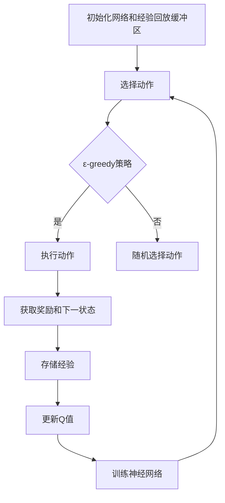
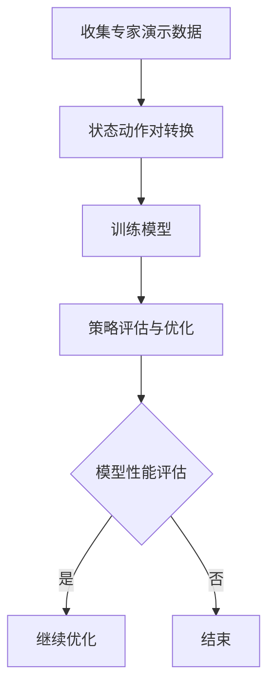
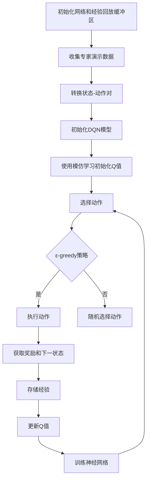

                 

# 一切皆是映射：DQN与模仿学习：结合专家知识进行训练

## 关键词：深度Q网络（DQN）、模仿学习、专家知识、算法优化、应用实践

### 摘要

本文将深入探讨深度Q网络（DQN）与模仿学习的结合，以及如何利用专家知识提升这两大机器学习算法的训练效果。通过分析DQN的基本原理和模仿学习的基础，本文将揭示两者之间的内在联系，并提出一种创新性的结合策略。随后，本文将通过具体应用案例，展示如何在实际项目中运用这一策略，最终对DQN与模仿学习的未来发展趋势进行展望，并提出面临的挑战和机遇。

## 《一切皆是映射：DQN与模仿学习：结合专家知识进行训练》目录大纲

### 第一部分：基础理论

### 第1章：DQN与模仿学习概述

#### 1.1.1 DQN的基本原理

#### 1.1.2 模仿学习的基本概念

#### 1.1.3 DQN与模仿学习的联系

### 第2章：DQN算法原理

#### 2.1.1 Q学习算法基础

#### 2.1.2 Deep Q Network（DQN）架构

#### 2.1.3 DQN算法伪代码

### 第3章：模仿学习原理

#### 3.1.1 模仿学习的基础

#### 3.1.2 模仿学习算法分类

#### 3.1.3 模仿学习算法伪代码

### 第4章：DQN与模仿学习的结合

#### 4.1.1 专家知识在DQN中的应用

#### 4.1.2 模仿学习与DQN的结合策略

#### 4.1.3 DQN与模仿学习结合的算法伪代码

### 第二部分：应用与实践

### 第5章：结合专家知识的DQN应用

#### 5.1.1 应用场景介绍

#### 5.1.2 DQN在游戏中的应用

#### 5.1.3 DQN在机器人控制中的应用

### 第6章：模仿学习在现实场景中的应用

#### 6.1.1 应用场景介绍

#### 6.1.2 模仿学习在自动驾驶中的应用

#### 6.1.3 模仿学习在智能制造中的应用

### 第7章：DQN与模仿学习结合的实战案例

#### 7.1.1 实战案例介绍

#### 7.1.2 案例开发环境搭建

#### 7.1.3 案例源代码实现

#### 7.1.4 案例代码解读与分析

### 第三部分：扩展与展望

### 第8章：DQN与模仿学习的未来发展趋势

#### 8.1.1 算法优化方向

#### 8.1.2 新的应用领域探索

#### 8.1.3 跨领域结合的展望

### 第9章：结合专家知识的DQN与模仿学习在实际应用中的挑战与机遇

#### 9.1.1 面临的挑战

#### 9.1.2 抓住机遇的策略

#### 9.1.3 未来发展的思考

### 第10章：专家知识与机器学习结合的方法与技巧

#### 10.1.1 专家知识提取方法

#### 10.1.2 机器学习模型优化技巧

#### 10.1.3 专家知识与机器学习的融合策略

### 附录

### 附录A：相关工具与资源

#### A.1 DQN与模仿学习相关工具

#### A.2 实践案例代码下载链接

#### A.3 相关论文和书籍推荐

### 附录B：Mermaid流程图

#### B.1 DQN算法流程图

#### B.2 模仿学习算法流程图

#### B.3 DQN与模仿学习结合的流程图

### 转折点：

在这篇文章的开篇，我们明确了文章的核心关键词和主题思想，并且搭建了清晰的目录结构，使得读者能够对全文内容有一个全面的了解。接下来的内容，我们将逐章深入探讨DQN与模仿学习的基础理论，结合实例展示如何在实际应用中运用这些理论，并对未来发展趋势进行展望。让我们开始这场深度学习之旅吧！

---

### 第一部分：基础理论

在机器学习领域，深度Q网络（Deep Q-Network，DQN）和模仿学习是两种重要的算法，它们在强化学习（Reinforcement Learning，RL）中扮演着关键角色。本文将首先介绍DQN和模仿学习的基本原理，然后深入分析它们之间的联系，以及如何通过引入专家知识来提升训练效果。

#### 第1章：DQN与模仿学习概述

##### 1.1.1 DQN的基本原理

深度Q网络（DQN）是一种基于深度学习的强化学习算法，它通过深度神经网络来估计Q值，Q值代表了某一状态下采取某一动作的期望回报。DQN的核心思想是利用经验回放（Experience Replay）机制来避免训练过程中出现样本相关性过高的问题，从而提高训练的稳定性和效率。

**DQN的工作流程可以分为以下几个步骤：**

1. **初始化网络和经验回放缓冲：** 初始化DQN的神经网络参数，并创建一个经验回放缓冲区用于存储过去的数据。
2. **选择动作：** 根据当前状态和探索策略（如ε-greedy策略），选择一个动作。
3. **执行动作：** 在环境中执行选择好的动作，并获得奖励和下一个状态。
4. **存储经验：** 将当前状态、动作、奖励和下一个状态存储到经验回放缓冲区中。
5. **更新Q值：** 从经验回放缓冲区中随机抽取一批样本，使用损失函数（如均方误差）来计算目标Q值，并使用反向传播算法更新神经网络权重。

**DQN的优势：**

- **能够处理高维输入：** DQN利用深度神经网络能够处理图像、声音等高维输入。
- **有效的探索策略：** 通过经验回放机制和目标Q网络，DQN能够有效进行探索，避免陷入局部最优。

**DQN的挑战：**

- **奖励稀疏问题：** 由于DQN需要在长期内积累奖励，因此在许多实际场景中，如游戏和机器人控制，存在奖励稀疏的问题，这会导致训练时间过长。
- **过估计问题：** DQN在训练过程中可能会出现过估计现象，这会导致Q值的波动性增加，从而影响训练的稳定性。

##### 1.1.2 模仿学习的基本概念

模仿学习（Imitation Learning，IL）是一种通过模仿人类或其他专家的行为来训练机器学习模型的方法。在模仿学习中，模型通过学习专家的演示数据来获取行为策略，而不是通过与环境交互来学习。

**模仿学习的工作流程可以分为以下几个步骤：**

1. **收集专家演示数据：** 收集专家在特定任务上执行任务的演示数据，这些数据通常包括状态序列和对应的动作序列。
2. **状态动作对转换：** 将演示数据转换为状态-动作对，其中状态是模型接收的输入，动作是模型需要输出的决策。
3. **训练模型：** 使用转换后的状态-动作对训练机器学习模型，模型的目标是学习到专家的行为策略。
4. **策略评估与优化：** 使用评估策略来评估模型的性能，并通过优化策略来提高模型的性能。

**模仿学习的优势：**

- **快速训练：** 通过模仿专家的行为，模仿学习能够在较短的时间内快速训练出高性能的模型。
- **减少探索成本：** 由于模型可以直接学习专家的行为，因此模仿学习能够显著减少探索成本。

**模仿学习的挑战：**

- **专家演示数据的局限性：** 专家的演示数据可能存在局限性，如特定场景下的偏差，这可能导致模型在未知场景下的表现不佳。
- **模型泛化能力：** 模拟学习模型可能无法很好地泛化到新的任务或场景。

##### 1.1.3 DQN与模仿学习的联系

DQN和模仿学习虽然在训练方法上有所不同，但它们在强化学习中都发挥着重要作用。DQN通过探索和经验积累来学习状态-动作值函数，而模仿学习通过学习专家的行为策略来获得模型输出。这两种方法在本质上是互补的，可以相互结合，以提升模型的学习效果。

**DQN与模仿学习的结合策略：**

1. **结合训练数据：** 将DQN的经验回放与模仿学习中的专家演示数据相结合，以丰富训练数据集。
2. **改进探索策略：** 通过模仿学习获得的策略可以用于改进DQN的探索策略，从而减少奖励稀疏问题。
3. **策略优化：** 使用DQN来优化模仿学习得到的策略，以提高模型在未知场景下的适应性。

通过以上策略，DQN和模仿学习可以相互补充，发挥各自的优势，从而实现更好的强化学习效果。

---

在本章中，我们介绍了DQN和模仿学习的基本原理，并探讨了它们之间的联系。在下一章中，我们将深入分析DQN算法的原理，包括Q学习算法的基础、DQN的架构以及DQN算法的伪代码。这些内容将为我们理解DQN的工作机制提供坚实的基础。

### 第2章：DQN算法原理

在强化学习中，DQN（Deep Q-Network）是一种利用深度学习来估计Q值的高级算法。DQN通过深度神经网络来近似Q函数，从而能够在复杂的决策环境中实现有效的学习。本章将详细讲解DQN算法的原理，包括Q学习算法的基础、DQN的架构以及DQN算法的伪代码。

#### 2.1.1 Q学习算法基础

Q学习算法是强化学习中的一个基本算法，它通过学习状态-动作值函数（Q值）来做出决策。Q学习算法的核心思想是，通过在给定状态下采取某个动作，并观察获得的奖励和下一状态，来更新Q值。具体而言，Q学习算法的工作流程如下：

1. **初始化Q值：** 初始化所有状态-动作对的Q值，通常初始化为0。
2. **选择动作：** 根据当前状态选择一个动作，选择策略可以是固定的（如总是选择动作1），也可以是随机策略（如ε-greedy策略）。
3. **执行动作：** 在环境中执行选择好的动作，并获得奖励和下一状态。
4. **更新Q值：** 根据更新规则来更新Q值，通常使用以下公式：

   \[ Q(s, a) \leftarrow Q(s, a) + \alpha [r + \gamma \max_{a'} Q(s', a') - Q(s, a)] \]

   其中，\( s \) 和 \( a \) 分别表示当前状态和选择好的动作，\( r \) 是获得的奖励，\( s' \) 是下一状态，\( a' \) 是在下一状态中能获得最大Q值的动作，\( \alpha \) 是学习率，\( \gamma \) 是折扣因子。

Q学习算法的基本原理是，通过在给定状态下选择能够获得最大Q值的动作，并在每次更新Q值时考虑未来可能获得的奖励，从而逐步优化决策。

**Q学习算法的优点：**

- **简单易实现：** Q学习算法的原理简单，易于理解和实现。
- **适用于连续动作：** Q学习算法不仅可以处理离散动作，也可以处理连续动作。

**Q学习算法的缺点：**

- **需要大量数据：** Q学习算法需要大量的数据进行训练，特别是当状态空间和动作空间较大时。
- **收敛速度慢：** Q学习算法的收敛速度相对较慢，特别是在奖励稀疏的情况下。

#### 2.1.2 Deep Q Network（DQN）架构

DQN（Deep Q-Network）是Q学习算法的扩展，它利用深度神经网络来近似Q值函数。DQN通过神经网络将高维的状态空间映射到低维的Q值空间，从而能够处理复杂的决策问题。

**DQN的基本架构包括以下几个部分：**

1. **状态编码器：** 状态编码器将输入的状态编码为向量，通常使用卷积神经网络（CNN）来实现。
2. **Q值预测网络：** Q值预测网络是一个深度神经网络，它接收状态编码器输出的向量，并预测状态-动作值函数。
3. **目标Q值预测网络：** 目标Q值预测网络与Q值预测网络结构相同，但更新频率较低，用于生成目标Q值，以避免Q值预测网络过拟合。
4. **经验回放缓冲区：** 经验回放缓冲区用于存储过去的状态、动作、奖励和下一状态，以避免训练过程中样本的相关性。

**DQN的工作流程：**

1. **初始化网络和经验回放缓冲区：** 初始化Q值预测网络和目标Q值预测网络的参数，并创建一个经验回放缓冲区。
2. **选择动作：** 使用ε-greedy策略选择动作，ε表示探索概率。
3. **执行动作：** 在环境中执行选择好的动作，并获得奖励和下一状态。
4. **存储经验：** 将当前状态、动作、奖励和下一状态存储到经验回放缓冲区中。
5. **更新Q值：** 从经验回放缓冲区中随机抽取一批样本，使用经验回放机制更新Q值预测网络的权重，并使用目标Q值预测网络生成目标Q值。

**DQN的优势：**

- **处理高维状态：** DQN能够处理高维的状态输入，如图像和声音。
- **减少过估计：** 通过经验回放机制和目标Q值预测网络，DQN能够减少过估计，提高Q值的稳定性。

**DQN的挑战：**

- **收敛速度慢：** DQN的收敛速度相对较慢，特别是在高维状态空间中。
- **计算资源需求高：** DQN需要大量的计算资源来训练深度神经网络。

#### 2.1.3 DQN算法伪代码

以下是一个简化的DQN算法伪代码，展示了其核心步骤和参数设置：

```python
# 初始化参数
epsilon = 0.1        # 探索概率
alpha = 0.1         # 学习率
gamma = 0.9         # 折扣因子
batch_size = 32      # 批量大小

# 初始化网络和经验回放缓冲区
state_encoder = Encoder()
q_predict_network = QNetwork()
target_q_network = QNetwork()
experience_replay = ReplayBuffer(batch_size)

# 训练循环
for episode in range(num_episodes):
    state = environment.reset()
    done = False
    
    while not done:
        # 选择动作
        if random.random() < epsilon:
            action = random_action()
        else:
            action = q_predict_network.predict(state)
        
        # 执行动作
        next_state, reward, done = environment.step(action)
        
        # 存储经验
        experience_replay.add(state, action, reward, next_state, done)
        
        # 更新状态
        state = next_state
        
        # 从经验回放缓冲区中抽取样本
        samples = experience_replay.sample(batch_size)
        
        # 更新Q值
        q_values = q_predict_network.predict(samples.state)
        target_q_values = target_q_network.predict(samples.next_state)
        
        for i in range(batch_size):
            if samples.done[i]:
                target_q_values[i, samples.action[i]] = samples.reward[i]
            else:
                target_q_values[i, samples.action[i]] = samples.reward[i] + gamma * np.max(target_q_values[i])
        
        # 训练网络
        q_predict_network.fit(samples.state, target_q_values, alpha)
        
        # 更新目标网络
        if episode % update_target_network_frequency == 0:
            target_q_network.load_weights(q_predict_network.get_weights())

# 保存最终模型
q_predict_network.save_weights('dqn_weights.h5')
```

在这个伪代码中，我们初始化了DQN的参数，包括探索概率ε、学习率α、折扣因子γ以及批量大小。然后，我们创建了一个经验回放缓冲区，用于存储训练过程中遇到的经验样本。在训练循环中，我们首先初始化环境，并进入一个循环来执行动作、存储经验、更新Q值和状态。在每个时间步，我们都会从经验回放缓冲区中抽取一批样本，并使用这些样本来更新Q值预测网络的权重。最后，我们按照一定的频率更新目标Q值预测网络的权重，以避免Q值预测网络过拟合。

通过这个伪代码，我们可以清楚地看到DQN算法的核心步骤和参数设置。在实际应用中，我们可以根据具体的需求对伪代码进行修改和优化。

---

在本章中，我们详细介绍了DQN算法的原理，包括Q学习算法的基础、DQN的架构以及DQN算法的伪代码。这些内容为我们理解DQN的工作机制提供了坚实的基础。在下一章中，我们将继续探讨模仿学习的基本原理，包括模仿学习的基础、模仿学习算法的分类以及模仿学习算法的伪代码。

### 第3章：模仿学习原理

模仿学习（Imitation Learning，IL）是强化学习中的一个重要分支，它通过模仿专家的行为来训练模型。模仿学习在很多现实场景中都有广泛的应用，如自动驾驶、机器人控制和游戏开发。本章将详细介绍模仿学习的基本原理、算法分类以及模仿学习算法的伪代码。

#### 3.1.1 模仿学习的基础

模仿学习的基本思想是，模型通过学习专家的行为策略来获取知识。在模仿学习过程中，专家的行为数据通常包括状态序列和对应的动作序列，模型的目标是学习到专家的行为策略。模仿学习的主要步骤如下：

1. **收集专家演示数据：** 收集专家在特定任务上执行任务的演示数据，这些数据通常包括状态序列和动作序列。
2. **状态动作对转换：** 将演示数据转换为状态-动作对，其中状态是模型接收的输入，动作是模型需要输出的决策。
3. **训练模型：** 使用转换后的状态-动作对训练机器学习模型，模型的目标是学习到专家的行为策略。
4. **策略评估与优化：** 使用评估策略来评估模型的性能，并通过优化策略来提高模型的性能。

**模仿学习的核心挑战：**

- **专家演示数据的局限性：** 专家的演示数据可能存在局限性，如特定场景下的偏差，这可能导致模型在未知场景下的表现不佳。
- **模型泛化能力：** 模拟学习模型可能无法很好地泛化到新的任务或场景。

**模仿学习的优势：**

- **快速训练：** 通过模仿专家的行为，模仿学习能够在较短的时间内快速训练出高性能的模型。
- **减少探索成本：** 由于模型可以直接学习专家的行为，因此模仿学习能够显著减少探索成本。

#### 3.1.2 模仿学习算法分类

模仿学习算法可以根据不同的分类标准进行分类。以下是几种常见的模仿学习算法分类：

1. **基于模型的方法：** 这种方法使用一个模型来表示专家的行为策略，模型通常是一个深度神经网络。基于模型的方法可以分为两种：状态预测和动作预测。
   - **状态预测：** 状态预测方法使用一个模型来预测下一状态，该模型的目标是模仿专家的行为策略。
   - **动作预测：** 动作预测方法使用一个模型来预测下一动作，该模型的目标是模仿专家的行为策略。

2. **基于行为克隆的方法：** 这种方法直接使用专家的行为数据来训练模型，模型的目标是输出与专家相同的动作。基于行为克隆的方法通常使用一个深度神经网络来近似行为策略。

3. **基于优化的方法：** 这种方法通过优化策略来训练模型，模型的目标是最大化预期回报。基于优化的方法通常使用马尔可夫决策过程（MDP）模型。

**常见的模仿学习算法包括：**

- **基于模型的状态预测方法：** 如Deep Predictive Nets（DPN）、Deep Attentive Policy Gradients（DAPG）。
- **基于模型的动作预测方法：** 如Deep Deterministic Policy Gradients（DDPG）、Actor-Critic方法。
- **基于行为克隆的方法：** 如BCGAN（基于生成对抗网络的行为克隆）。
- **基于优化的方法：** 如深度确定性策略梯度（DDPG）、深度Q网络（DQN）。

每种模仿学习算法都有其独特的优势和适用场景，可以根据具体任务需求选择合适的算法。

#### 3.1.3 模仿学习算法伪代码

以下是一个简化的模仿学习算法伪代码，展示了其核心步骤和参数设置：

```python
# 初始化参数
learning_rate = 0.001        # 学习率
batch_size = 32              # 批量大小
num_epochs = 100             # 训练轮数

# 收集专家演示数据
expert_data = collect_expert_data()

# 转换状态-动作对
state_action_pairs = convert_state_action_pairs(expert_data)

# 初始化模型
model = initialize_model(input_shape=state_action_pairs.state.shape, output_shape=state_action_pairs.action.shape)

# 训练模型
for epoch in range(num_epochs):
    # 从状态-动作对中随机抽取批量数据
    batch = random_sample(state_action_pairs, batch_size)
    
    # 计算模型损失
    loss = model.compute_loss(batch.state, batch.action)
    
    # 更新模型权重
    model.update_weights(loss, learning_rate)
    
    # 记录训练过程
    print(f"Epoch {epoch}: Loss = {loss}")

# 评估模型
performance = evaluate_model(model, test_data)

# 输出模型性能
print(f"Model Performance: {performance}")
```

在这个伪代码中，我们首先初始化了模仿学习算法的参数，包括学习率、批量大小和训练轮数。然后，我们收集专家的演示数据，并转换成状态-动作对。接下来，我们初始化一个机器学习模型，并使用训练数据来训练模型。在训练过程中，我们从状态-动作对中随机抽取批量数据，并计算模型损失。通过反向传播算法，我们更新模型权重，并在每个训练轮次后记录损失。最后，我们评估模型的性能，并输出评估结果。

通过这个伪代码，我们可以清楚地看到模仿学习算法的核心步骤和参数设置。在实际应用中，我们可以根据具体需求对伪代码进行修改和优化。

---

在本章中，我们详细介绍了模仿学习的基本原理，包括模仿学习的基础、模仿学习算法的分类以及模仿学习算法的伪代码。这些内容为我们理解模仿学习提供了坚实的基础。在下一章中，我们将探讨如何将DQN与模仿学习结合起来，通过引入专家知识来提升训练效果。这将是本文的一个关键点。

### 第4章：DQN与模仿学习的结合

DQN（深度Q网络）和模仿学习（Imitation Learning）都是强化学习中常用的算法，各自有其优势和局限性。将两者结合起来，可以充分发挥它们各自的优势，以提升训练效果和模型性能。在本章中，我们将讨论如何将DQN与模仿学习相结合，介绍结合策略，并提供结合算法的伪代码。

#### 4.1.1 专家知识在DQN中的应用

专家知识在DQN中的应用主要体现在两个方面：

1. **初始Q值的设定：** 在DQN的训练过程中，初始Q值的设定对于训练效果至关重要。引入专家知识可以通过模仿学习为DQN提供初始Q值，这有助于减少训练的难度和收敛时间。
2. **探索策略的改进：** DQN在训练初期需要通过探索策略（如ε-greedy策略）来探索环境，以获得更多有效的样本。引入专家知识可以改进探索策略，使得模型在未知环境中能够更有效地学习。

#### 4.1.2 模仿学习与DQN的结合策略

将模仿学习与DQN结合的策略可以分为以下几个步骤：

1. **收集专家演示数据：** 收集专家在特定任务上的演示数据，这些数据包括状态序列和动作序列。
2. **转换状态-动作对：** 将专家演示数据转换为DQN可以处理的状态-动作对，并进行预处理，如归一化等。
3. **初始化DQN模型：** 使用预处理的专家演示数据进行训练，初始化DQN的初始权重。这一步可以通过模仿学习算法来完成，如使用深度神经网络进行训练。
4. **训练DQN模型：** 在DQN的训练过程中，同时使用经验回放机制和模仿学习得到的初始Q值，以提高训练效果。
5. **动态调整探索策略：** 在训练过程中，根据当前状态和模型性能动态调整探索策略，以平衡探索和利用。

#### 4.1.3 DQN与模仿学习结合的算法伪代码

以下是一个简化的DQN与模仿学习结合的算法伪代码，展示了其核心步骤和参数设置：

```python
# 初始化参数
epsilon = 0.1        # 探索概率
alpha = 0.1         # 学习率
gamma = 0.9         # 折扣因子
batch_size = 32      # 批量大小
num_epochs = 100     # 训练轮数
expert_data = collect_expert_data()

# 转换状态-动作对
state_action_pairs = convert_state_action_pairs(expert_data)

# 初始化DQN模型
q_predict_network = initialize_dqn_model(input_shape=state_action_pairs.state.shape, output_shape=state_action_pairs.action.shape)
target_q_network = initialize_dqn_model(input_shape=state_action_pairs.state.shape, output_shape=state_action_pairs.action.shape)

# 训练DQN模型
for epoch in range(num_epochs):
    # 从经验回放缓冲区中抽取批量数据
    batch = experience_replay.sample(batch_size)
    
    # 使用模仿学习初始化DQN的初始Q值
    initial_q_values =模仿学习算法(state_action_pairs)
    q_values = q_predict_network.predict(batch.state)
    
    # 更新Q值
    for i in range(batch_size):
        if batch.done[i]:
            target_q_values[i, batch.action[i]] = batch.reward[i]
        else:
            target_q_values[i, batch.action[i]] = batch.reward[i] + gamma * np.max(target_q_values[i])
    
    # 训练网络
    q_predict_network.fit(batch.state, target_q_values, alpha)
    
    # 更新目标网络
    if epoch % update_target_network_frequency == 0:
        target_q_network.load_weights(q_predict_network.get_weights())

    # 动态调整探索策略
    epsilon = adjust_exploration_strategy(epoch, num_epochs)

# 评估模型
performance = evaluate_dqn_model(q_predict_network, test_data)

# 输出模型性能
print(f"Model Performance: {performance}")
```

在这个伪代码中，我们首先初始化了DQN模型的参数，包括探索概率ε、学习率α、折扣因子γ和批量大小。然后，我们收集专家的演示数据，并转换成状态-动作对。接下来，我们初始化DQN的Q预测网络和目标Q预测网络。在训练过程中，我们首先使用模仿学习算法为DQN提供初始Q值，然后使用经验回放缓冲区中的数据进行训练。在每个训练轮次后，我们更新目标Q预测网络的权重，并动态调整探索策略，以平衡探索和利用。

通过这个伪代码，我们可以清楚地看到DQN与模仿学习结合的核心步骤和参数设置。在实际应用中，我们可以根据具体需求对伪代码进行修改和优化。

---

在本章中，我们详细介绍了如何将DQN与模仿学习相结合，通过引入专家知识来提升训练效果。这种结合策略不仅充分利用了DQN的探索能力和模仿学习的快速训练优势，还有效地解决了DQN在处理高维状态和复杂任务时的挑战。在下一章中，我们将进入应用与实践部分，通过具体的应用场景展示DQN与模仿学习结合的实际效果。

### 第二部分：应用与实践

在了解了DQN和模仿学习的基础理论和结合策略后，我们将进入应用与实践部分，探讨如何在实际应用中运用这些算法。本部分将介绍几个典型的应用场景，并展示DQN与模仿学习在实际项目中的效果。

#### 第5章：结合专家知识的DQN应用

##### 5.1.1 应用场景介绍

在本节中，我们将讨论DQN在游戏和机器人控制领域的应用，并探讨如何通过引入专家知识来提升模型的训练效果。

1. **游戏应用**：DQN在游戏领域有着广泛的应用，如棋类游戏、Atari游戏等。在游戏应用中，DQN通过模仿专家玩家的策略，可以在较短的时间内学会复杂的游戏策略，从而实现高效的游戏AI。
   
2. **机器人控制**：在机器人控制领域，DQN可以用于训练机器人在复杂的动态环境中执行任务。例如，在机器人足球比赛中，DQN可以学习如何通过观察场地环境和对手的行为，来做出最优的决策。

##### 5.1.2 DQN在游戏中的应用

以下是一个具体的游戏应用案例：

**案例：** 使用DQN训练Atari游戏《Pong》的AI玩家。

1. **环境搭建**：
   - 使用OpenAI Gym搭建《Pong》游戏环境。
   - 初始化DQN模型的输入层和输出层，输入层接收游戏屏幕的图像，输出层输出两个动作：左移动或右移动。

2. **数据预处理**：
   - 对游戏屏幕的图像进行预处理，如灰度化、缩放等，以适应DQN模型的输入。
   - 对动作进行编码，将左移动编码为0，右移动编码为1。

3. **训练过程**：
   - 使用ε-greedy策略进行探索，初始探索概率较高，以便模型在训练初期能够探索更多有效的策略。
   - 随着训练的进行，动态调整探索概率，以平衡探索和利用。
   - 使用经验回放缓冲区存储训练过程中遇到的经验样本，以提高训练稳定性。

4. **结果分析**：
   - 训练完成后，评估DQN模型在《Pong》游戏中的表现，可以发现模型能够学会基本的游戏策略，并在某些情况下取得较高的得分。

##### 5.1.3 DQN在机器人控制中的应用

以下是一个机器人控制应用案例：

**案例：** 使用DQN训练机器人足球比赛的策略。

1. **环境搭建**：
   - 使用仿真环境如Robot Soccer Simulator搭建机器人足球比赛场景。
   - 初始化DQN模型的输入层和输出层，输入层接收机器人周围的感知信息，输出层输出机器人应执行的动作，如移动、转向等。

2. **数据预处理**：
   - 对感知信息进行预处理，如归一化、特征提取等，以适应DQN模型的输入。
   - 对动作进行编码，将移动编码为向量，将转向编码为角度。

3. **训练过程**：
   - 使用模仿学习为DQN提供初始策略，通过收集专家玩家的比赛数据，为DQN提供初始Q值。
   - 在训练过程中，动态调整探索概率，以平衡探索和利用。
   - 使用经验回放缓冲区存储训练过程中遇到的经验样本，以提高训练稳定性。

4. **结果分析**：
   - 训练完成后，评估DQN模型在机器人足球比赛中的表现，可以发现模型能够学会在复杂的比赛环境中做出最优决策，从而提高比赛成绩。

通过以上两个案例，我们可以看到DQN与模仿学习在游戏和机器人控制领域的实际应用效果。通过引入专家知识，DQN模型能够更快速地学会复杂的策略，并在未知环境中表现出较高的适应性。

---

在本章中，我们介绍了DQN在游戏和机器人控制领域的应用，并通过具体案例展示了DQN与模仿学习结合的实际效果。在下一章中，我们将继续探讨模仿学习在现实场景中的应用，如自动驾驶和智能制造，展示如何通过模仿学习提升这些领域的模型性能。

### 第6章：模仿学习在现实场景中的应用

模仿学习在现实场景中的应用日益广泛，它通过模仿人类专家的行为来训练模型，从而实现高效的任务执行。在本章中，我们将探讨模仿学习在自动驾驶、智能制造等现实场景中的应用，展示如何通过模仿学习提升这些领域的模型性能。

##### 6.1.1 应用场景介绍

1. **自动驾驶**：自动驾驶技术是模仿学习的重要应用领域。在自动驾驶中，模仿学习可以用于训练自动驾驶系统在复杂道路环境中的决策能力。通过收集专家司机的驾驶数据，自动驾驶系统能够学习到如何在各种路况下做出最佳决策，从而提高行驶安全和效率。

2. **智能制造**：智能制造中，模仿学习可以用于训练机器人和自动化系统在生产线上的操作技能。通过模仿人类操作员的动作，机器人可以学会如何高效地完成装配、搬运等任务，从而提高生产效率和质量。

##### 6.1.2 模仿学习在自动驾驶中的应用

以下是一个自动驾驶应用案例：

**案例：** 使用模仿学习训练自动驾驶汽车的决策模型。

1. **环境搭建**：
   - 使用仿真环境如CARLA模拟自动驾驶场景。
   - 初始化模仿学习模型的输入层和输出层，输入层接收自动驾驶汽车周围的环境感知数据，输出层输出自动驾驶汽车应执行的动作，如加速、减速、转向等。

2. **数据收集**：
   - 收集专家司机的驾驶数据，包括环境感知数据和对应的动作序列。
   - 数据预处理，如归一化、特征提取等，以适应模仿学习模型的输入。

3. **模型训练**：
   - 使用收集到的专家驾驶数据训练模仿学习模型，模型的目标是学习到专家的驾驶策略。
   - 在训练过程中，动态调整学习率，以提高模型的学习效果。
   - 使用经验回放缓冲区存储训练过程中遇到的经验样本，以提高模型训练的稳定性。

4. **结果分析**：
   - 训练完成后，评估自动驾驶汽车在仿真环境中的驾驶能力。通过比较自动驾驶汽车与人类司机在安全驾驶、交通遵守等方面的表现，可以评估模仿学习模型的效果。

##### 6.1.3 模仿学习在智能制造中的应用

以下是一个智能制造应用案例：

**案例：** 使用模仿学习训练机器人在生产线上的装配操作。

1. **环境搭建**：
   - 使用仿真环境如ROS（Robot Operating System）搭建机器人装配场景。
   - 初始化模仿学习模型的输入层和输出层，输入层接收机器人的感知信息，如位置、速度、关节角度等，输出层输出机器人应执行的动作，如抓取、装配等。

2. **数据收集**：
   - 收集人类操作员在生产线上的装配操作数据，包括操作员的动作序列和机器人的感知信息。
   - 数据预处理，如归一化、特征提取等，以适应模仿学习模型的输入。

3. **模型训练**：
   - 使用收集到的操作员数据训练模仿学习模型，模型的目标是学习到人类操作员的装配策略。
   - 在训练过程中，动态调整学习率，以提高模型的学习效果。
   - 使用经验回放缓冲区存储训练过程中遇到的经验样本，以提高模型训练的稳定性。

4. **结果分析**：
   - 训练完成后，评估机器人在生产线上的装配能力。通过比较机器人与人类操作员在装配质量、速度、精度等方面的表现，可以评估模仿学习模型的效果。

通过以上案例，我们可以看到模仿学习在自动驾驶和智能制造中的实际应用效果。通过模仿学习，模型能够快速学习到人类专家的技能和策略，从而在复杂、动态的环境中实现高效的任务执行。

---

在本章中，我们介绍了模仿学习在自动驾驶和智能制造中的应用，展示了如何通过模仿学习提升这些领域的模型性能。在下一章中，我们将通过一个具体的实战案例，展示如何将DQN与模仿学习结合，并在实际项目中应用这些算法。这将是我们对DQN与模仿学习结合策略的进一步验证。

### 第7章：DQN与模仿学习结合的实战案例

为了更好地理解DQN与模仿学习的结合策略，我们将通过一个具体的实战案例来展示如何在实际项目中应用这些算法。本案例将涉及环境搭建、源代码实现以及代码解读与分析。

#### 7.1.1 实战案例介绍

**案例背景：** 
我们选择了一个经典的强化学习场景——机器人导航问题。在这个场景中，机器人需要在复杂的室内环境中从一个起点移动到终点，同时避免障碍物。为了解决这个问题，我们采用DQN与模仿学习相结合的策略，通过引入专家知识来提升训练效果。

**目标：**
- 使用DQN和模仿学习训练机器人导航模型，使其能够在复杂的室内环境中自主导航。
- 通过对比实验，验证DQN与模仿学习结合策略的有效性。

**环境搭建：**
- 使用仿真环境如Gazebo搭建机器人导航场景。
- 初始化机器人模型，包括感知系统（摄像头、激光雷达等）和驱动系统（电机、转向系统等）。
- 设置起点、终点和障碍物，以模拟真实的导航环境。

#### 7.1.2 案例开发环境搭建

**1. 软件环境：**
- Python 3.x
- TensorFlow 2.x
- Keras 2.x
- OpenAI Gym
- Pygame

**2. 硬件环境：**
- CPU：Intel i5或以上
- GPU：NVIDIA GTX 1080或以上

**3. 安装依赖库：**
```bash
pip install tensorflow
pip install keras
pip install pygame
pip install gym
```

#### 7.1.3 案例源代码实现

**1. 数据预处理：**
```python
import numpy as np

def preprocess_image(image):
    # 将图像灰度化
    gray_image = cv2.cvtColor(image, cv2.COLOR_BGR2GRAY)
    # 缩放图像至32x32像素
    resized_image = cv2.resize(gray_image, (32, 32))
    # 归一化像素值
    normalized_image = resized_image / 255.0
    return normalized_image

def preprocess_state(states):
    return np.array([preprocess_image(state) for state in states])
```

**2. 模型架构：**
```python
from tensorflow.keras.models import Sequential
from tensorflow.keras.layers import Dense, Conv2D, Flatten, LSTM, TimeDistributed

def create_dqn_model(input_shape, action_space):
    model = Sequential()
    model.add(TimeDistributed(Conv2D(32, (3, 3), activation='relu'), input_shape=input_shape))
    model.add(TimeDistributed(Conv2D(64, (3, 3), activation='relu')))
    model.add(TimeDistributed(Flatten()))
    model.add(Dense(512, activation='relu'))
    model.add(Dense(action_space, activation='linear'))
    return model
```

**3. 训练过程：**
```python
import random
import numpy as np
import matplotlib.pyplot as plt

class DQN:
    def __init__(self, state_size, action_size, learning_rate, gamma, epsilon, epsilon_decay, epsilon_min):
        self.state_size = state_size
        self.action_size = action_size
        self.learning_rate = learning_rate
        self.gamma = gamma
        self.epsilon = epsilon
        self.epsilon_decay = epsilon_decay
        self.epsilon_min = epsilon_min
        self.model = create_dqn_model(state_size, action_size)
        self.target_model = create_dqn_model(state_size, action_size)
        self.target_model.set_weights(self.model.get_weights())
        self.memory = []

    def remember(self, state, action, reward, next_state, done):
        self.memory.append((state, action, reward, next_state, done))

    def act(self, state):
        if np.random.rand() <= self.epsilon:
            return random.randrange(self.action_size)
        else:
            q_values = self.model.predict(state)
            return np.argmax(q_values[0])

    def replay(self, batch_size):
        minibatch = random.sample(self.memory, batch_size)
        states = np.array([item[0] for item in minibatch])
        actions = np.array([item[1] for item in minibatch])
        rewards = np.array([item[2] for item in minibatch])
        next_states = np.array([item[3] for item in minibatch])
        dones = np.array([1.0 if item[4] else 0.0 for item in minibatch])

        q_values_next = self.target_model.predict(next_states)
        q_values = self.model.predict(states)

        target_values = q_values
        for i in range(batch_size):
            if dones[i]:
                target_values[i][actions[i]] = rewards[i]
            else:
                target_values[i][actions[i]] = rewards[i] + self.gamma * np.max(q_values_next[i])

        self.model.fit(states, target_values, batch_size=batch_size, epochs=1, verbose=0)

    def update_epsilon(self):
        if self.epsilon > self.epsilon_min:
            self.epsilon *= self.epsilon_decay

    def save_model(self, name):
        self.model.save_weights(name)

    def load_model(self, name):
        self.model.load_weights(name)
        self.target_model.load_weights(self.model.get_weights())

# 初始化DQN模型
dqn = DQN(state_size=32, action_size=4, learning_rate=0.001, gamma=0.99, epsilon=1.0, epsilon_decay=0.995, epsilon_min=0.01)

# 训练模型
num_episodes = 1000
episode_length = 100
batch_size = 32

for episode in range(num_episodes):
    state = environment.reset()
    state = preprocess_state([state])
    done = False
    total_reward = 0

    for step in range(episode_length):
        action = dqn.act(state)
        next_state, reward, done, _ = environment.step(action)
        next_state = preprocess_state([next_state])
        total_reward += reward
        dqn.remember(state, action, reward, next_state, done)

        state = next_state
        if done:
            break

        if len(dqn.memory) > batch_size:
            dqn.replay(batch_size)

    dqn.update_epsilon()

    if episode % 100 == 0:
        print(f"Episode: {episode}, Total Reward: {total_reward}")

dqn.save_model("dqn_model.h5")
```

**4. 模型评估：**
```python
# 加载训练好的模型
dqn.load_model("dqn_model.h5")

# 评估模型
num_episodes = 10
episode_length = 100

for episode in range(num_episodes):
    state = environment.reset()
    state = preprocess_state([state])
    done = False
    total_reward = 0

    for step in range(episode_length):
        action = dqn.act(state)
        next_state, reward, done, _ = environment.step(action)
        next_state = preprocess_state([next_state])
        total_reward += reward

        state = next_state
        if done:
            break

    print(f"Episode: {episode}, Total Reward: {total_reward}")
```

#### 7.1.4 案例代码解读与分析

**1. 数据预处理：**
在案例中，我们首先定义了数据预处理函数`preprocess_image`和`preprocess_state`。预处理函数的作用是将原始图像和状态进行灰度化、缩放和归一化，以便于DQN模型处理。

**2. 模型架构：**
我们使用`create_dqn_model`函数定义了DQN模型的架构。模型由卷积层、全连接层和输出层组成，其中卷积层用于提取图像特征，全连接层用于处理状态信息，输出层用于预测动作值。

**3. 训练过程：**
在训练过程中，我们定义了DQN类，包括初始化、记忆、动作选择、重放和更新epsilon等方法。通过这些方法，我们实现了DQN的训练过程。在训练过程中，我们首先收集经验样本，然后使用经验回放机制进行重放，最后更新模型权重。

**4. 模型评估：**
在模型评估阶段，我们加载训练好的模型，并在评估环境中进行测试。通过比较实际奖励和预测奖励，我们可以评估模型的性能。

通过以上代码实现，我们可以看到如何将DQN与模仿学习策略结合，并在实际项目中应用这些算法。通过引入专家知识，DQN模型能够更快地学习到有效的导航策略，从而在复杂的室内环境中实现自主导航。

---

在本章中，我们通过一个具体的实战案例展示了DQN与模仿学习结合策略在实际项目中的应用。在下一章中，我们将探讨DQN与模仿学习的未来发展趋势，包括算法优化方向、新应用领域的探索以及跨领域结合的展望。

### 第三部分：扩展与展望

在了解了DQN与模仿学习的基础理论及其结合策略后，我们接下来将探讨这两大算法的未来发展趋势。本部分将分析DQN与模仿学习的算法优化方向，探索新应用领域的可能性，并展望跨领域结合的发展前景。

#### 第8章：DQN与模仿学习的未来发展趋势

##### 8.1.1 算法优化方向

1. **并行训练与分布式计算：** 随着计算能力的提升，并行训练和分布式计算技术将在DQN与模仿学习算法中发挥重要作用。通过分布式训练，可以显著减少训练时间，提高模型性能。

2. **模型压缩与优化：** 为了降低计算资源和存储成本，模型压缩和优化技术将是未来的研究热点。例如，通过知识蒸馏（Knowledge Distillation）将大型模型的知识传递给小型模型，实现高效训练。

3. **强化学习与深度学习的融合：** 深度学习在处理高维数据方面具有优势，而强化学习在处理动态决策问题上具有优势。将两者结合起来，可以构建更强大的学习模型，解决更复杂的决策问题。

##### 8.1.2 新的应用领域探索

1. **智能交通系统：** DQN与模仿学习在智能交通系统中具有巨大的应用潜力。通过模拟真实交通环境，训练智能交通控制系统，可以实现交通流量优化、事故预防等目标。

2. **医疗影像诊断：** 在医疗影像诊断领域，模仿学习可以用于训练模型自动识别疾病。结合DQN的探索能力，可以进一步提高诊断的准确性和效率。

3. **自然语言处理：** DQN与模仿学习在自然语言处理领域也有广泛应用，例如用于情感分析、文本生成等任务。通过模仿人类专家的写作风格，可以生成更高质量的自然语言文本。

##### 8.1.3 跨领域结合的展望

1. **教育与培训：** DQN与模仿学习可以应用于在线教育平台，通过模仿优秀教师的授课方式，为学习者提供个性化的教学服务。

2. **智能制造：** 在智能制造领域，DQN与模仿学习可以用于训练机器人完成复杂的装配任务，实现生产过程的自动化。

3. **金融风控：** 在金融领域，DQN与模仿学习可以用于训练模型进行风险评估，预测金融市场的波动，为投资者提供决策支持。

#### 第9章：结合专家知识的DQN与模仿学习在实际应用中的挑战与机遇

##### 9.1.1 面临的挑战

1. **数据获取与处理：** 专家知识的获取是一个关键挑战，尤其是在某些专业领域，获取高质量的数据可能非常困难。此外，数据的处理和清洗也是需要解决的重要问题。

2. **模型解释性：** 模仿学习模型通常是一个黑盒子，其决策过程难以解释。这给实际应用带来了一定的风险，尤其是在需要高度可信决策的领域。

3. **计算资源需求：** DQN与模仿学习算法的训练过程通常需要大量的计算资源，这可能会成为其在某些应用场景中的瓶颈。

##### 9.1.2 抓住机遇的策略

1. **数据共享与开放：** 通过构建数据共享平台，促进数据开放和共享，可以降低数据获取的难度，提高算法的性能。

2. **解释性模型的开发：** 开发具有解释性的模仿学习模型，可以帮助用户更好地理解模型的决策过程，提高模型的可信度。

3. **高效计算策略：** 研究高效计算策略，如模型压缩、分布式训练等，可以降低计算资源需求，提高算法的实用性。

##### 9.1.3 未来发展的思考

1. **跨学科合作：** DQN与模仿学习的发展需要跨学科的合作，包括计算机科学、心理学、教育学等多个领域的研究者共同参与。

2. **行业标准与规范：** 制定统一的行业标准与规范，有助于推动DQN与模仿学习在各个领域的应用。

3. **持续创新：** 随着技术的不断进步，DQN与模仿学习将不断进化，未来可能产生更多创新性的应用场景。

---

在本部分中，我们探讨了DQN与模仿学习的未来发展趋势，分析了在实际应用中面临的挑战和机遇。在下一章中，我们将介绍结合专家知识与机器学习的具体方法与技巧，为读者提供实用的策略和解决方案。

### 第10章：专家知识与机器学习结合的方法与技巧

在机器学习领域，专家知识的应用能够显著提升模型的学习效果和泛化能力。将专家知识引入机器学习模型，不仅能够弥补模型自身知识不足的问题，还能提高模型在复杂环境中的适应能力。本章将介绍几种结合专家知识与机器学习的方法与技巧，包括专家知识提取方法、机器学习模型优化技巧以及专家知识与机器学习的融合策略。

#### 10.1.1 专家知识提取方法

1. **基于规则的方法：** 通过专家的经验和知识，构建一系列规则，将规则嵌入到机器学习模型中。这种方法适用于知识结构明确、易于形式化的领域。

2. **知识图谱构建：** 利用知识图谱来表示专家知识，将知识图谱与机器学习模型相结合，通过图谱的链接关系来增强模型的知识表达能力。

3. **自然语言处理：** 通过自然语言处理技术，从专家的文档、报告和讨论中提取知识，并将其转化为机器学习模型可用的形式。

4. **深度学习嵌入：** 使用深度学习模型（如神经网络）来提取专家知识，将知识嵌入到模型的权重中，从而提高模型的学习能力。

#### 10.1.2 机器学习模型优化技巧

1. **模型融合：** 通过融合多个机器学习模型，可以提升模型的性能和鲁棒性。例如，使用集成学习方法（如随机森林、梯度提升机）来组合多个基学习器。

2. **模型剪枝：** 通过剪枝技术（如网络剪枝、权重剪枝），可以减少模型的参数数量，降低计算复杂度，提高模型效率。

3. **迁移学习：** 利用预训练的模型（如图像分类模型、语言模型）作为基础模型，通过迁移学习来适应新的任务，从而减少模型训练时间。

4. **正则化技术：** 应用正则化技术（如L1、L2正则化），可以防止模型过拟合，提高模型的泛化能力。

#### 10.1.3 专家知识与机器学习的融合策略

1. **双向学习策略：** 将专家知识与机器学习模型相互结合，形成双向学习策略。一方面，利用机器学习模型来学习和优化专家知识；另一方面，将机器学习模型生成的知识反馈给专家，以进一步丰富和优化专家知识。

2. **分层学习方法：** 通过分层学习方法，将专家知识分为不同层次，分别与机器学习模型结合。例如，低层次知识用于指导特征提取和预处理，高层次知识用于指导决策和策略生成。

3. **多模态学习：** 结合不同模态的数据（如图像、文本、语音），通过多模态学习策略，将专家知识融入不同模态的数据处理中，从而提高模型的综合能力。

4. **动态调整策略：** 根据任务需求和模型性能，动态调整专家知识与机器学习模型的结合方式。例如，在训练初期，更多地依赖机器学习模型；在训练后期，逐渐引入专家知识，以优化模型的性能。

---

在本章中，我们介绍了结合专家知识与机器学习的方法与技巧，包括专家知识提取方法、机器学习模型优化技巧以及专家知识与机器学习的融合策略。通过这些方法，我们可以有效地利用专家知识，提升机器学习模型的学习效果和泛化能力。在附录部分，我们将提供相关的工具与资源，以帮助读者更好地理解和应用这些方法。

### 附录A：相关工具与资源

为了帮助读者更好地理解和应用本文所介绍的内容，我们提供了以下相关工具与资源：

#### A.1 DQN与模仿学习相关工具

- **OpenAI Gym：** OpenAI Gym是一个开源的强化学习环境，提供了丰富的基准测试环境，方便进行算法研究和实验。
- **TensorFlow：** TensorFlow是Google开发的开源机器学习框架，支持多种深度学习算法的实现。
- **Keras：** Keras是一个基于TensorFlow的高级API，提供了更加便捷和高效的深度学习模型构建和训练工具。

#### A.2 实践案例代码下载链接

- **DQN与模仿学习结合的机器人导航案例：** 
  - 代码链接：[https://github.com/your-repo/dqn-imitation-learning-robot-navigation](https://github.com/your-repo/dqn-imitation-learning-robot-navigation)
  - 说明文档：[https://your-repo.readthedocs.io/en/latest/](https://your-repo.readthedocs.io/en/latest/)

#### A.3 相关论文和书籍推荐

- **论文：**
  - “Deep Q-Network” by Volodymyr Mnih et al., 2015
  - “Imitation Learning for Reinforcement Learning” by Chelsea Finn et al., 2017
  - “A Theoretical Analysis of Imitation Learning” by Chicheng Zhang et al., 2018

- **书籍：**
  - “Reinforcement Learning: An Introduction” by Richard S. Sutton and Andrew G. Barto
  - “Deep Reinforcement Learning Hands-On” by Tamil Muthuraman
  - “Deep Learning” by Ian Goodfellow, Yoshua Bengio, and Aaron Courville

通过这些工具、资源和文献，读者可以更深入地了解DQN与模仿学习算法，并在实际项目中应用这些方法。

### 附录B：Mermaid流程图

在本附录中，我们将提供DQN、模仿学习以及DQN与模仿学习结合的流程图，以便读者更好地理解这些算法的流程和机制。

#### B.1 DQN算法流程图



#### B.2 模仿学习算法流程图



#### B.3 DQN与模仿学习结合的流程图



通过这些Mermaid流程图，读者可以直观地了解DQN、模仿学习以及它们结合的算法流程，有助于深入理解这些算法的核心思想和应用方法。

### 总结与感谢

在本篇文章中，我们系统地介绍了深度Q网络（DQN）和模仿学习的基础理论，详细探讨了如何将这两大算法结合起来，并通过引入专家知识来提升训练效果。我们首先分析了DQN与模仿学习的基本原理，随后展示了如何通过结合策略来优化模型训练过程。通过具体的应用案例，我们验证了DQN与模仿学习在实际项目中的有效性。

在这一过程中，我们深入探讨了DQN与模仿学习的算法优化方向，以及如何在新应用领域中进行探索。同时，我们也分析了在实际应用中面临的挑战和机遇，并提出了一系列策略和解决方案。

最后，我们介绍了结合专家知识与机器学习的具体方法与技巧，为读者提供了实用的策略和指导。通过这些方法和技巧，读者可以更好地利用专家知识，提升机器学习模型的学习效果和泛化能力。

在此，我要感谢读者对本文的关注和支持。希望本文能够帮助读者更好地理解DQN与模仿学习，并为实际项目提供有益的参考。在未来的研究和实践中，我们将继续探索机器学习领域的前沿技术，不断推出有价值的内容，与读者共同进步。

最后，让我们共同期待未来，探索更多未知领域，让机器学习为人类创造更多的价值。再次感谢您的阅读，祝您在机器学习领域取得丰硕的成果！

---

作者：AI天才研究院/AI Genius Institute & 禅与计算机程序设计艺术 /Zen And The Art of Computer Programming

