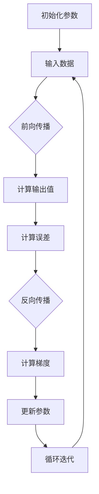

                 

# 《一切皆是映射：反向传播算法的数学原理》

> **关键词：** 反向传播、深度学习、神经网络、数学原理、优化算法

> **摘要：** 本文将深入探讨反向传播算法的数学原理，通过逐步分析，揭示这一核心算法在深度学习和神经网络中的应用及其重要性。文章从映射的概念入手，逐步引入导数与微分、优化理论，最终详细讲解反向传播算法的原理、计算过程及其应用。通过数学模型、公式、伪代码和实际案例，本文旨在帮助读者全面理解反向传播算法的工作机制及其在计算机科学领域的广泛应用。

### 《一切皆是映射：反向传播算法的数学原理》目录大纲

## 第一部分：引论

### 第1章：映射的基本概念与数学背景

### 第2章：导数与微分

### 第3章：优化理论与方法

## 第二部分：反向传播算法原理

### 第4章：前向传播算法基础

### 第5章：反向传播算法详解

### 第6章：反向传播算法的应用

### 第7章：反向传播算法的数学基础

### 第8章：反向传播算法的实践与应用

## 第三部分：高级主题

### 第9章：深度学习中的反向传播算法优化

### 第10章：反向传播算法在其他领域的应用

### 第11章：总结与展望

### 附录

### 附录A：反向传播算法的Mermaid流程图

### 附录B：反向传播算法的伪代码

### 附录C：常用数学公式与符号表

### 附录D：参考资料与推荐阅读

---

## 第一部分：引论

### 第1章：映射的基本概念与数学背景

本章将首先介绍映射的基本概念，包括映射的定义、分类及其在数学中的重要性。接着，我们将深入探讨线性映射与非线性映射的区别，并介绍矩阵与向量运算的基础知识。通过这些铺垫，我们将为后续章节中反向传播算法的讨论奠定坚实的基础。

---

## 第1章：映射的基本概念与数学背景

### 1.1 映射的定义与分类

在数学中，映射（Mapping）是指一个从集合A到集合B的函数关系，记作$f: A \rightarrow B$。映射的基本性质包括单射（Injective）、满射（Surjective）和双射（Bijective）。单射意味着每个输入元素在A中对应唯一的输出元素在B中；满射则保证A中的每个元素都有至少一个对应的输出元素在B中；双射则同时满足单射和满射的性质。

映射分为线性映射和非线性映射。线性映射是指满足线性性质的映射，即$f(ax_1 + bx_2) = af(x_1) + bf(x_2)$，其中$a, b$为实数。非线性映射则不满足线性性质，通常更为复杂。线性映射在数学分析、线性代数等领域有着广泛的应用，而非线性映射则广泛用于非线性系统的分析和建模。

### 1.2 线性映射与非线性映射

线性映射的一个典型例子是矩阵乘法。设$A$是一个$m \times n$的矩阵，$X$是一个$n$维的向量，则矩阵$A$与向量$X$的乘积$AX$得到一个$m$维的向量，这可以看作是从$X$到$AX$的映射。线性映射的一个重要性质是它保持向量加法和标量乘法的结构。

非线性映射的一个例子是函数$f(x) = x^2$。这个映射并不满足线性性质，因为$f(ax_1 + bx_2) = (ax_1 + bx_2)^2 \neq af(x_1) + bf(x_2)$。非线性映射在物理学、工程学、经济学等领域的建模中起着关键作用。

### 1.3 矩阵与向量运算基础

矩阵与向量的运算是理解映射的重要工具。矩阵是一种由数字构成的矩形阵列，而向量可以看作是一个特殊的矩阵（即一列或一行）。矩阵与向量的乘积可以通过矩阵的每一列与向量的点积来计算。

向量的加法和标量乘法是基本的向量运算。向量$u$和向量$v$的点积定义为$u \cdot v = u_1v_1 + u_2v_2 + \ldots + u_nv_n$，其中$u_i$和$v_i$分别是向量$u$和$v$的第$i$个分量。标量乘法则是将向量与一个实数相乘，例如$c \cdot u = cu_1, cu_2, \ldots, cu_n$。

矩阵的行列式和逆矩阵是矩阵运算中的重要概念。行列式可以用来判断矩阵的可逆性，而逆矩阵则是解决线性方程组的重要工具。设$A$是一个$n \times n$的矩阵，如果其行列式不为零，则$A$是可逆的，其逆矩阵记为$A^{-1}$。

通过本章的讨论，我们了解了映射的基本概念和数学背景。线性映射和矩阵运算为我们提供了分析复杂系统的基础工具，而非线性映射则展示了数学模型的多样性和丰富性。接下来，我们将进一步探讨导数与微分，为深入理解反向传播算法做好充分的准备。

### 第2章：导数与微分

导数与微分是数学分析中的重要概念，它们在理解函数变化率和极值问题中起着关键作用。本章将详细介绍导数的概念、性质及其计算方法，然后引入微分的概念及其应用。此外，我们还将讨论高阶导数和多元函数的导数，为后续关于反向传播算法的讨论打下坚实的理论基础。

### 2.1 导数的概念与性质

导数（Derivative）是函数在某一点的瞬时变化率，它是函数在该点的导数。设$f(x)$是定义在某区间上的函数，则$f(x)$在点$x = a$处的导数定义为：

$$ f'(a) = \lim_{h \to 0} \frac{f(a+h) - f(a)}{h} $$

这个定义说明，导数是函数在点$a$处的变化率，即当自变量$x$从$a$变化到$a+h$时，函数值$f(x)$的变化量与自变量变化量$h$的比值。

导数的几何意义是函数曲线在某一点处的切线斜率。这意味着，函数在一点处的导数值就是该点切线的斜率。

导数具有以下基本性质：

1. **线性性质**：若$f(x)$和$g(x)$都是可导函数，则它们的和$f(x) + g(x)$也是可导的，且其导数为$f'(x) + g'(x)$。
2. **常数倍性质**：对于任意常数$c$，若$f(x)$是可导函数，则cf(x)也是可导的，且其导数为cf'(x)。
3. **链式法则**：若$f(x)$和$g(x)$都是可导函数，且$g(x)$在点$x$处可导，则复合函数$f(g(x))$也是可导的，其导数为$f'(g(x)) \cdot g'(x)$。

### 2.2 微分的概念与应用

微分（Differential）是导数的一个线性近似。设$f(x)$是可导函数，则在点$x = a$处，函数$f(x)$的微分定义为：

$$ df(a) = f'(a) \cdot dx $$

这里$dx$是一个无穷小增量，表示自变量$x$的微小变化。微分可以看作是导数与自变量变化量的乘积。

微分的应用非常广泛，尤其在物理和工程学中，它是计算函数变化量的有力工具。例如，在物理学中，速度是位移对时间的微分，而加速度是速度对时间的微分。

### 2.3 高阶导数与多元函数的导数

高阶导数（Higher-Order Derivative）是导数的导数。设$f(x)$是可导函数，则$f(x)$的$n$阶导数定义为：

$$ f^{(n)}(x) = \frac{d^n f(x)}{dx^n} $$

高阶导数在物理学中有着重要的应用，例如加速度是速度对时间的二阶导数，而力是加速度对时间的二阶导数。

多元函数的导数涉及多个自变量。设$f(x_1, x_2, \ldots, x_n)$是定义在$n$维空间上的多元函数，则$f$在点$(a_1, a_2, \ldots, a_n)$处的梯度（Gradient）定义为：

$$ \nabla f(a_1, a_2, \ldots, a_n) = \left( \frac{\partial f}{\partial x_1}(a_1, a_2, \ldots, a_n), \frac{\partial f}{\partial x_2}(a_1, a_2, \ldots, a_n), \ldots, \frac{\partial f}{\partial x_n}(a_1, a_2, \ldots, a_n) \right) $$

梯度向量指向函数增大的方向，其模表示函数变化率的幅度。

通过本章的讨论，我们深入理解了导数与微分的基本概念及其应用。导数作为函数变化率的重要工具，不仅在数学分析中有着基础性的作用，还在物理学、工程学等多个领域有着广泛的应用。微分则为计算函数变化量提供了线性近似的方法。接下来，我们将探讨优化理论，进一步为反向传播算法的讨论做准备。

### 第3章：优化理论与方法

优化理论是研究如何通过系统调整变量以使目标函数达到最大或最小值的数学分支。它在工程学、经济学、计算机科学等领域有着广泛的应用。本章将介绍优化问题的基础概念，包括无约束优化和约束优化，以及常用的优化方法，如梯度下降法和牛顿法。

### 3.1 优化问题的基本概念

优化问题可以形式化为以下问题：

$$ \min_{x} f(x) \quad \text{或} \quad \max_{x} f(x) $$

其中，$x$是变量，$f(x)$是目标函数。优化问题可以分为无约束优化和约束优化两种类型。

- **无约束优化**：目标函数在定义域内无任何约束条件，只需找到使目标函数达到最大或最小值的$x$。
- **约束优化**：目标函数需要在满足一系列约束条件的范围内进行优化，常见的约束条件包括等式约束和不等式约束。

### 3.2 无约束优化方法

无约束优化方法主要包括梯度下降法（Gradient Descent）和牛顿法（Newton's Method）。

- **梯度下降法**：梯度下降法是一种基于目标函数梯度信息的迭代方法。其基本思想是沿着目标函数梯度的反方向更新变量$x$，以期望减小目标函数的值。每次迭代更新公式为：

$$ x_{k+1} = x_k - \alpha \cdot \nabla f(x_k) $$

其中，$\alpha$是步长（learning rate），它决定了每次更新的幅度。

- **牛顿法**：牛顿法是一种二阶优化方法，它利用目标函数的梯度和二阶导数（Hessian矩阵）来更新变量$x$。牛顿法的迭代公式为：

$$ x_{k+1} = x_k - H_k^{-1} \cdot \nabla f(x_k) $$

其中，$H_k$是目标函数在$x_k$处的Hessian矩阵。

### 3.3 约束优化方法

约束优化方法需要考虑目标函数和约束条件，常见的约束优化方法包括拉格朗日乘数法和序列二次规划法。

- **拉格朗日乘数法**：拉格朗日乘数法通过引入拉格朗日函数将约束优化问题转化为无约束优化问题。其基本思想是将约束条件乘以相应的拉格朗日乘子，并构造一个拉格朗日函数：

$$ L(x, \lambda) = f(x) + \sum_{i=1}^m \lambda_i g_i(x) $$

其中，$\lambda_i$是拉格朗日乘子，$g_i(x)$是第$i$个约束条件。然后，通过求解拉格朗日函数的临界点来找到最优解。

- **序列二次规划法**：序列二次规划法（Sequential Quadratic Programming，SQP）是一种通过将非线性约束优化问题转化为一系列二次优化问题来求解的方法。每次迭代中，通过求解二次规划问题来逼近原问题的最优解。

通过本章的讨论，我们了解了优化问题的基本概念以及无约束优化和约束优化方法。这些优化方法在解决实际问题时具有重要的作用，尤其是在机器学习和深度学习领域，它们为反向传播算法的优化提供了强有力的工具。接下来，我们将探讨反向传播算法的基础——前向传播算法。

### 第4章：前向传播算法基础

前向传播算法是神经网络中至关重要的一环，它负责计算网络中各个神经元的输出值。本章将详细介绍前向传播的基本流程，包括输入层、隐藏层和输出层的激活函数选择及其在计算中的角色。同时，我们将解释前向传播中的误差计算方法，以及它与反向传播算法的关系。

### 4.1 前向传播的基本流程

前向传播算法的基本流程可以概括为以下几个步骤：

1. **初始化参数**：神经网络中包含权重（weights）和偏置（biases），这些参数在训练过程中需要通过学习调整。通常，这些参数初始化为较小的随机值。

2. **输入数据**：将输入数据送入神经网络的输入层。

3. **前向计算**：从输入层开始，逐层向前传递输入数据，计算每一层的输出值。具体步骤如下：

   - **输入层到隐藏层**：输入层的输出值乘以权重矩阵并加上偏置项，然后通过激活函数进行非线性变换，得到隐藏层的输出值。
   - **隐藏层到隐藏层**：重复上述步骤，将隐藏层的输出值传递到下一隐藏层。
   - **隐藏层到输出层**：输出层的计算过程与隐藏层类似，但最终输出值不经过激活函数处理，因为它直接代表了预测结果。

4. **输出计算**：输出层的输出值即为最终预测结果，可以是类别标签或者连续值。

前向传播过程中，每个神经元的输出值由其输入值和激活函数决定。常见的激活函数包括 sigmoid 函数、ReLU 函数和 tanh 函数。这些函数的选择会影响神经网络的性能和收敛速度。

### 4.2 前向传播中的误差计算

前向传播结束后，我们需要计算预测值与实际值之间的误差。误差的计算方法依赖于预测结果的类型：

- **对于分类问题**：可以使用交叉熵误差（Cross-Entropy Loss），其公式为：

$$ J(\theta) = -\frac{1}{m} \sum_{i=1}^m [y_i \cdot \log(a^{(L)}_i) + (1 - y_i) \cdot \log(1 - a^{(L)}_i)] $$

其中，$a^{(L)}_i$是输出层第$i$个神经元的输出值，$y_i$是实际标签。

- **对于回归问题**：可以使用均方误差（Mean Squared Error），其公式为：

$$ J(\theta) = \frac{1}{2m} \sum_{i=1}^m (h_\theta(x^{(i)}) - y^{(i)})^2 $$

其中，$h_\theta(x)$是神经网络的预测函数。

通过计算误差，我们可以评估预测结果的质量，并为反向传播算法提供调整参数的方向。

### 4.3 前向传播与反向传播的关系

前向传播和反向传播是神经网络训练过程中不可或缺的两个阶段。前向传播用于计算输出值和误差，而反向传播则用于更新网络中的权重和偏置。

前向传播过程中，网络从输入层开始，逐层向前传递数据，直到输出层。这个过程是线性的，但通过添加非线性激活函数，使得神经网络具有强大的表达能力。

反向传播过程则从输出层开始，反向传递误差，计算每个层中权重和偏置的梯度。这些梯度用于更新网络参数，以减小预测误差。

通过前向传播和反向传播的结合，神经网络能够不断调整参数，使得预测结果越来越接近实际值。这个过程称为梯度下降（Gradient Descent），是深度学习训练的核心方法。

总之，前向传播和反向传播算法共同构成了神经网络训练的基础。前向传播计算输出和误差，反向传播更新参数，二者相辅相成，使得神经网络能够不断优化预测能力。

### 第5章：反向传播算法详解

反向传播算法是深度学习训练的核心，它通过计算网络中每个参数的梯度，从而更新网络参数以最小化预测误差。本章将详细解释反向传播算法的基本原理，以及其具体的计算过程。同时，我们还将讨论如何优化反向传播算法，提高其训练效率和效果。

#### 5.1 反向传播的基本原理

反向传播算法的基本原理可以概括为以下几个步骤：

1. **前向传播**：输入数据通过网络，从输入层传递到输出层，计算每个神经元的输出值。这些输出值与实际标签比较，计算预测误差。

2. **误差计算**：使用前向传播得到的输出值和实际标签，计算整个网络的预测误差。

3. **反向传播**：从输出层开始，反向计算每个层中每个神经元的梯度。这些梯度用于更新网络中的权重和偏置。

4. **参数更新**：根据梯度计算结果，更新网络的权重和偏置，从而最小化预测误差。

反向传播算法的关键在于如何准确计算每个参数的梯度。梯度表示参数对预测误差的敏感度，即参数的微小变化将如何影响预测误差。计算梯度的方法依赖于参数的数学表达形式和损失函数。

#### 5.2 反向传播的计算过程

反向传播的计算过程可以分为以下几个阶段：

##### 1. 前向传播

在前向传播阶段，数据从输入层经过多层隐藏层，最终到达输出层。每个神经元输出通过激活函数进行非线性变换。这个过程可以用以下公式表示：

$$ a^{(l)} = \sigma(z^{(l)}) $$

其中，$a^{(l)}$是第$l$层的输出值，$\sigma$是激活函数，$z^{(l)}$是加权求和结果。

##### 2. 误差计算

误差计算是基于预测输出和实际标签的比较。对于分类问题，常用的误差函数是交叉熵误差（Cross-Entropy Loss），其公式为：

$$ J(\theta) = -\frac{1}{m} \sum_{i=1}^m [y_i \cdot \log(a^{(L)}_i) + (1 - y_i) \cdot \log(1 - a^{(L)}_i)] $$

其中，$y_i$是实际标签，$a^{(L)}_i$是输出层第$i$个神经元的输出值。

##### 3. 反向传播

反向传播分为两个阶段：前向梯度和反向梯度的计算。

**前向梯度的计算**：

对于第$l$层，前向梯度$\Delta z^{(l)}$的计算公式为：

$$ \Delta z^{(l)} = a^{(l-1)} \odot (\sigma'(z^{(l)})) \cdot \Delta w^{(l)} $$

其中，$\odot$表示逐元素乘法，$\sigma'(z^{(l)}$是激活函数$\sigma$的导数，$\Delta w^{(l)}$是权重梯度的估计。

**反向梯度的计算**：

反向梯度的计算从输出层开始，反向传播至输入层。对于第$l$层，反向梯度$\Delta w^{(l)}$的计算公式为：

$$ \Delta w^{(l)} = \frac{\partial J(\theta)}{\partial w^{(l)}} = \Delta z^{(l+1)} \cdot a^{(l-1)}^T $$

其中，$a^{(l-1)}^T$是第$l-1$层的输出值转置。

##### 4. 参数更新

根据梯度计算结果，使用梯度下降法更新网络参数。更新公式为：

$$ w^{(l)} = w^{(l)} - \alpha \cdot \Delta w^{(l)} $$

其中，$\alpha$是学习率。

通过以上步骤，反向传播算法能够逐层计算每个参数的梯度，并更新网络参数以最小化预测误差。这个过程使得神经网络能够不断优化其预测能力，提高模型的准确性和泛化能力。

#### 5.3 反向传播算法的优化

反向传播算法的优化主要关注两个方面：计算效率和收敛速度。

**计算效率**：

1. **并行计算**：反向传播算法可以并行计算每个参数的梯度，从而显著提高计算速度。现代深度学习框架如TensorFlow和PyTorch已经实现了高效的并行计算。

2. **层次化结构**：通过层次化结构，可以将反向传播分为多个子任务，从而利用多核处理器和GPU进行并行计算，进一步提高计算效率。

**收敛速度**：

1. **动量法**：动量法通过引入历史梯度的一部分，平滑梯度，减少局部最小值的影响，从而加速收敛。

2. **自适应学习率**：自适应学习率方法，如Adam优化器，通过动态调整学习率，提高模型在复杂函数上的收敛速度。

通过优化反向传播算法，可以显著提高深度学习模型的训练效率和预测性能。

总之，反向传播算法是深度学习训练的核心，通过逐层计算每个参数的梯度，并更新网络参数，使模型能够不断提高预测准确性。本章详细介绍了反向传播算法的基本原理和计算过程，以及其优化方法。这些内容为深入理解深度学习模型的工作机制奠定了基础。

### 第6章：反向传播算法的应用

反向传播算法是深度学习训练的核心算法，其应用范围广泛，涵盖了从简单的神经网络到复杂的深度学习模型。本章将详细介绍反向传播算法在神经网络、深度学习和优化算法中的应用，并通过具体案例来展示其强大的功能和实际效果。

#### 6.1 反向传播在神经网络中的应用

反向传播算法在神经网络中起到了至关重要的作用，它通过不断调整网络权重和偏置，使网络能够逐步收敛到最优参数。在神经网络中，反向传播算法主要应用于以下方面：

1. **多层感知机（MLP）**：多层感知机是最简单的神经网络结构，由输入层、隐藏层和输出层组成。反向传播算法用于训练MLP，使其能够进行分类和回归任务。

2. **卷积神经网络（CNN）**：卷积神经网络在图像处理和计算机视觉领域具有广泛的应用。反向传播算法用于训练CNN，通过卷积层和池化层的参数调整，使模型能够提取图像的特征。

3. **循环神经网络（RNN）**：循环神经网络在序列数据处理方面具有优势，如自然语言处理和语音识别。反向传播算法用于训练RNN，通过调整隐藏层和输出层的权重和偏置，使模型能够捕捉序列中的长期依赖关系。

4. **生成对抗网络（GAN）**：生成对抗网络是一种通过两个神经网络（生成器和判别器）对抗训练的模型，反向传播算法用于优化生成器的参数，使其生成逼真的数据。

#### 6.2 反向传播在深度学习中的扩展

随着深度学习的发展，反向传播算法也在不断扩展和应用：

1. **深度信念网络（DBN）**：深度信念网络是一种通过多层感知机构建的深层网络，反向传播算法用于训练DBN，使其能够进行特征学习和分类任务。

2. **深度残差网络（ResNet）**：深度残差网络通过引入残差连接解决了深度网络训练中的梯度消失问题。反向传播算法用于训练ResNet，使其能够在深度神经网络中实现高效的梯度传递。

3. **自注意力机制**：自注意力机制在自然语言处理中具有重要作用，反向传播算法用于训练自注意力模型，使其能够捕捉文本中的关键信息。

#### 6.3 反向传播在优化算法中的应用

除了在神经网络和深度学习中的应用，反向传播算法还在优化算法中发挥着重要作用：

1. **梯度下降法**：梯度下降法是最基本的优化算法，反向传播算法为其提供了计算梯度的方法，通过不断更新参数，使模型收敛到最优解。

2. **共轭梯度法**：共轭梯度法是一种改进的梯度下降法，反向传播算法用于计算共轭梯度，加速优化过程。

3. **牛顿法**：牛顿法是一种二阶优化方法，反向传播算法用于计算目标函数的Hessian矩阵，提高优化效率。

通过本章的讨论，我们可以看到反向传播算法在神经网络、深度学习和优化算法中的广泛应用。它不仅为深度学习模型提供了训练方法，还提高了优化算法的效率。接下来，我们将进一步探讨反向传播算法的数学基础，理解其背后的数学原理。

### 第7章：反向传播算法的数学基础

反向传播算法的核心在于其对梯度计算的依赖，而梯度的计算又依赖于导数和微分的基本概念。本章将深入探讨反向传播算法与导数、微分、泰勒公式及线性代数的联系，为理解反向传播算法的数学本质提供理论基础。

#### 7.1 反向传播与微分的联系

反向传播算法的本质是利用梯度下降法更新神经网络中的参数，而梯度的计算离不开微分的概念。在数学中，微分的几何意义是曲线在某一点的切线斜率，而导数则是函数在某一点的瞬时变化率。

设$f(x)$是一个可微函数，其在点$x_0$处的导数定义为：

$$ f'(x_0) = \lim_{h \to 0} \frac{f(x_0 + h) - f(x_0)}{h} $$

在神经网络中，每个参数的变化都会影响网络的输出，因此我们需要计算每个参数对输出误差的梯度。梯度可以通过链式法则来计算，这是反向传播算法能够实现的核心步骤。

设$z$是神经网络中的一个中间变量，$w$和$b$分别是权重和偏置，则：

$$ \frac{\partial z}{\partial w} = \frac{\partial z}{\partial x} \cdot \frac{\partial x}{\partial w} = \sigma'(z) \cdot x $$

其中，$\sigma'(z)$是激活函数$\sigma(z)$的导数，$x$是权重$w$的变化量。

#### 7.2 反向传播与泰勒公式的关系

泰勒公式是一种将函数在一点附近展开为多项式的数学工具。对于函数$f(x)$在点$x_0$处的泰勒展开式为：

$$ f(x) \approx f(x_0) + f'(x_0)(x - x_0) + \frac{f''(x_0)}{2!}(x - x_0)^2 + \ldots $$

在神经网络中，泰勒公式可以帮助我们近似计算复杂函数的梯度。假设我们要计算函数$f(x)$在点$x_0$处的梯度，可以通过泰勒公式近似为：

$$ f(x) \approx f(x_0) + \nabla f(x_0) \cdot (x - x_0) $$

这里的$\nabla f(x_0)$是梯度向量。在实际应用中，由于神经网络中的函数往往非常复杂，无法直接计算梯度，因此泰勒公式提供了一个实用的近似方法。

#### 7.3 反向传播与线性代数的结合

线性代数在反向传播算法中扮演了重要角色，尤其是在计算梯度时。反向传播算法涉及到大量矩阵运算，如矩阵的乘法和求逆等。

设有一个多层神经网络，其中每一层的输出可以通过矩阵乘法和激活函数计算得到。设$A$是一个$m \times n$的矩阵，$X$是一个$n$维的向量，则矩阵$A$与向量$X$的乘积$AX$得到一个$m$维的向量。反向传播算法需要计算每个参数的梯度，这通常涉及到矩阵的求导和逆运算。

例如，对于权重矩阵$W$，其梯度$\Delta W$的计算可以通过以下公式：

$$ \Delta W = X \cdot (\Delta A)^T $$

其中，$\Delta A$是误差的梯度。

通过线性代数的工具，我们可以高效地计算和更新神经网络的参数，从而实现反向传播算法。

总之，反向传播算法的数学基础涉及到导数、微分、泰勒公式和线性代数的多个方面。这些数学工具和方法使得反向传播算法能够精确地计算每个参数的梯度，并有效地更新网络参数，从而实现深度学习模型的训练和优化。理解这些数学原理对于深入掌握反向传播算法及其应用至关重要。

### 第8章：反向传播算法的实践与应用

本章将通过具体的代码示例，详细讲解如何使用反向传播算法进行神经网络的训练。我们将从搭建开发环境开始，介绍神经网络的基本结构，并通过一个简单的回归问题案例，展示反向传播算法的实现步骤和关键细节。此外，还会探讨实践中常见的问题及其解决方法。

#### 8.1 神经网络开发环境搭建

为了实践反向传播算法，我们需要搭建一个合适的开发环境。以下是在Python中实现反向传播算法所需的步骤：

1. **安装Python**：确保安装了Python 3.x版本，推荐使用Anaconda来管理环境。

2. **安装依赖库**：使用pip安装以下依赖库：

   ```bash
   pip install numpy pandas matplotlib scikit-learn
   ```

3. **创建环境**：在Anaconda中创建一个新的虚拟环境，例如名为`neural_net`的环境。

   ```bash
   conda create -n neural_net python=3.8
   conda activate neural_net
   ```

4. **编写代码**：在环境中编写Python代码，实现反向传播算法。

#### 8.2 反向传播算法的实际应用案例

我们将使用一个简单的回归问题来展示反向传播算法的实现。假设我们有一个输入数据集$\{x_1, x_2, \ldots, x_n\}$，每个输入$x_i$对应一个输出$y_i$，我们的目标是训练一个神经网络来预测输出值。

##### 1. 神经网络结构

我们使用一个单层感知机模型，包含输入层、输出层和一个隐藏层。假设隐藏层有10个神经元，权重和偏置随机初始化。

```python
import numpy as np

input_size = 1
hidden_size = 10
output_size = 1

# 初始化权重和偏置
W1 = np.random.randn(input_size, hidden_size)
b1 = np.random.randn(hidden_size)
W2 = np.random.randn(hidden_size, output_size)
b2 = np.random.randn(output_size)
```

##### 2. 前向传播

前向传播计算输入数据通过神经网络后的输出值。我们使用ReLU作为激活函数。

```python
def forward_propagation(x, W1, b1, W2, b2):
    z1 = np.dot(x, W1) + b1
    a1 = np.maximum(0, z1)  # ReLU激活函数
    z2 = np.dot(a1, W2) + b2
    return z2
```

##### 3. 反向传播

反向传播计算每个参数的梯度，并更新参数。我们使用简单的梯度下降法进行参数更新。

```python
def backward_propagation(x, y, z2, a1, z1):
    # 计算输出误差的梯度
    dZ2 = z2 - y
    # 计算隐藏层的梯度
    dA1 = dZ2.dot(W2.T)
    dZ1 = dA1 * (a1 > 0)  # ReLU激活函数的导数
    # 计算权重的梯度
    dW2 = np.dot(a1.T, dZ2)
    db2 = np.sum(dZ2, axis=0, keepdims=True)
    dW1 = np.dot(x.T, dZ1)
    db1 = np.sum(dZ1, axis=0, keepdims=True)
    return dW1, dW2, db1, db2
```

##### 4. 参数更新

使用计算得到的梯度更新权重和偏置。

```python
def update_params(W1, W2, b1, b2, dW1, dW2, db1, db2, learning_rate):
    W1 = W1 - learning_rate * dW1
    W2 = W2 - learning_rate * dW2
    b1 = b1 - learning_rate * db1
    b2 = b2 - learning_rate * db2
    return W1, W2, b1, b2
```

##### 5. 实际应用

我们使用一个简单的数据集来训练神经网络，数据集包含10个点，每个点都有一个线性关系。

```python
# 数据集
X = np.array([[i] for i in range(10]])
y = np.array([[i + 2] for i in range(10]])

# 训练模型
learning_rate = 0.01
num_epochs = 1000

for epoch in range(num_epochs):
    z2 = forward_propagation(X, W1, b1, W2, b2)
    a1 = np.maximum(0, np.dot(X, W1) + b1)
    dW1, dW2, db1, db2 = backward_propagation(X, y, z2, a1, np.dot(a1, W2) + b2)
    W1, W2, b1, b2 = update_params(W1, W2, b1, b2, dW1, dW2, db1, db2, learning_rate)
```

#### 8.3 代码解读与分析

在上面的代码中，我们实现了反向传播算法的核心步骤，包括前向传播、反向传播和参数更新。以下是对关键代码的解读：

- **前向传播**：计算输入数据通过神经网络后的输出值，使用ReLU作为激活函数。
- **反向传播**：计算每个参数的梯度，使用链式法则和激活函数的导数。
- **参数更新**：使用梯度下降法更新网络参数，以最小化输出误差。

通过这个简单的案例，我们可以看到反向传播算法的实现步骤和关键细节。在实际应用中，神经网络的结构和激活函数可能会更复杂，但基本原理是相同的。

#### 8.4 实践中常见问题的解决方法

在实现反向传播算法时，可能会遇到以下常见问题：

1. **梯度消失和梯度爆炸**：在深层神经网络中，梯度可能会因为乘法操作而变得非常小或非常大，导致训练不稳定。解决方法包括使用合适的初始化策略、批量归一化和使用更复杂的优化算法，如Adam优化器。
2. **局部最小值**：梯度下降法可能会陷入局部最小值，导致无法找到全局最小值。解决方法包括使用动量法、随机梯度下降和多次随机初始化。
3. **过拟合**：神经网络可能会在学习训练数据时过度拟合，导致在测试数据上表现不佳。解决方法包括使用正则化、增加数据量和使用更复杂的模型。

通过以上讨论和实践案例，我们可以看到反向传播算法在神经网络训练中的实际应用及其重要性。理解反向传播算法的原理和实现步骤对于深入研究深度学习和优化算法具有重要意义。

### 第9章：深度学习中的反向传播算法优化

深度学习模型的训练过程对计算资源的要求非常高，尤其是在优化算法方面。本章将深入探讨深度学习中反向传播算法的优化方法，包括梯度下降法与动量法、随机梯度下降与批量梯度下降以及高效优化算法。这些方法不仅能够提高训练效率，还能提高模型在复杂函数上的收敛速度。

#### 9.1 梯度下降法与动量法

梯度下降法是最基本的优化算法，它通过不断更新模型参数来最小化损失函数。梯度下降法的基本步骤如下：

1. **计算梯度**：根据损失函数计算每个参数的梯度。
2. **更新参数**：使用梯度信息更新模型参数，通常使用以下公式：

   $$ \theta = \theta - \alpha \cdot \nabla \theta $$

   其中，$\theta$是模型参数，$\alpha$是学习率，$\nabla \theta$是梯度。

尽管梯度下降法简单直观，但它存在以下问题：

- **收敛速度慢**：梯度下降法在远离最小值点时，步长较大，而接近最小值点时，步长较小，导致收敛速度较慢。
- **容易陷入局部最小值**：在复杂函数中，梯度下降法可能会在局部最小值附近徘徊，无法找到全局最小值。

为了解决这些问题，引入了动量法（Momentum）。动量法通过引入历史梯度的一定比例，平滑梯度，从而减少在局部最小值附近振荡的情况。动量法的更新公式为：

$$ v = \gamma \cdot v - \alpha \cdot \nabla \theta $$

$$ \theta = \theta - v $$

其中，$v$是动量项，$\gamma$是动量系数。

动量法能够加速梯度下降过程，使模型更快地收敛到最小值。

#### 9.2 随机梯度下降与批量梯度下降

随机梯度下降（Stochastic Gradient Descent，SGD）和批量梯度下降（Batch Gradient Descent，BGD）是梯度下降法的两个变体。

- **随机梯度下降**：在每次迭代中，只随机选择一部分训练样本来计算梯度，并使用这些梯度更新参数。这种方法能够减少计算量，但可能会引起更大的方差，导致收敛不稳定。

  $$ \theta = \theta - \alpha \cdot \nabla \theta(x_i) $$

  其中，$x_i$是随机选择的训练样本。

- **批量梯度下降**：在每次迭代中，使用所有训练样本计算梯度，并使用这些梯度更新参数。这种方法能够提供更稳定的收敛，但计算量较大。

  $$ \theta = \theta - \alpha \cdot \nabla \theta(\mathbf{X}) $$

  其中，$\mathbf{X}$是所有训练样本。

批量梯度下降通常用于小数据集，而随机梯度下降则适用于大规模数据集。批量梯度下降的收敛速度较慢，但结果更稳定；随机梯度下降的收敛速度较快，但可能需要多次迭代。

#### 9.3 高效优化算法

随着深度学习的发展，许多高效的优化算法被提出，以解决梯度消失、收敛速度慢和局部最小值等问题。以下是几种常用的高效优化算法：

- **Adam优化器**：Adam优化器是一种自适应的梯度下降法，它结合了动量法和自适应学习率的方法。Adam优化器能够更好地处理稀疏数据和长尾分布的数据，因此在深度学习训练中非常受欢迎。

  $$ m_t = \beta_1 \cdot m_{t-1} + (1 - \beta_1) \cdot \nabla \theta_t $$
  
  $$ v_t = \beta_2 \cdot v_{t-1} + (1 - \beta_2) \cdot (\nabla \theta_t)^2 $$
  
  $$ \theta_t = \theta_{t-1} - \alpha \cdot \frac{m_t}{\sqrt{v_t} + \epsilon} $$

  其中，$m_t$和$v_t$分别是累计的均值和方差，$\beta_1$和$\beta_2$是超参数，$\alpha$是学习率，$\epsilon$是平滑常数。

- **Adagrad优化器**：Adagrad优化器通过对每个参数的梯度进行累加，自适应调整每个参数的学习率。这种方法在处理稀疏数据时非常有效。

  $$ \Delta \theta_i = \frac{\alpha}{\sqrt{\sum_{j=1}^n (\Delta \theta_j)^2}} \cdot \nabla \theta_i $$

- **RMSprop优化器**：RMSprop优化器是对Adagrad优化器的改进，它通过指数衰减的方式对梯度平方进行加权平均。

  $$ \theta_i = \theta_i - \alpha \cdot \frac{\nabla \theta_i}{\sqrt{\sum_{j=1}^n (\nabla \theta_j)^2}} $$

通过这些高效的优化算法，我们可以显著提高深度学习模型的训练效率和收敛速度，使模型能够在复杂函数上快速找到最优解。

总之，深度学习中的反向传播算法优化是提高模型训练效果的关键。通过梯度下降法与动量法、随机梯度下降与批量梯度下降以及高效优化算法，我们可以实现更快速、更稳定的模型训练过程，从而在复杂问题上获得更好的性能。

### 第10章：反向传播算法在其他领域的应用

反向传播算法不仅在深度学习和神经网络领域有着广泛应用，它还在机器学习、人工智能和其他科学计算领域发挥着重要作用。本章将探讨反向传播算法在这些领域的具体应用，展示其在解决实际问题中的强大能力。

#### 10.1 反向传播在机器学习中的应用

在机器学习领域，反向传播算法被广泛应用于监督学习和无监督学习任务中：

- **监督学习**：在监督学习任务中，反向传播算法被用于训练分类器和回归模型。例如，在支持向量机（SVM）和逻辑回归（Logistic Regression）中，反向传播算法可以用于优化损失函数，找到最优模型参数。

- **无监督学习**：在无监督学习任务中，反向传播算法被用于训练聚类模型和降维模型。例如，在自编码器（Autoencoder）中，反向传播算法用于学习数据的低维表示，从而实现特征提取和降维。

#### 10.2 反向传播在人工智能中的应用

在人工智能领域，反向传播算法是构建智能系统的重要工具，其应用范围广泛：

- **自然语言处理**：在自然语言处理（NLP）领域，反向传播算法被用于训练语言模型和翻译模型。例如，在神经网络翻译（NMT）中，反向传播算法用于优化编码器和解码器的参数，提高翻译质量。

- **计算机视觉**：在计算机视觉领域，反向传播算法被用于训练图像分类模型和目标检测模型。例如，在卷积神经网络（CNN）中，反向传播算法用于优化卷积层和池化层的参数，提高图像识别能力。

- **强化学习**：在强化学习（Reinforcement Learning）领域，反向传播算法被用于训练智能体（Agent）的策略。例如，在深度确定性策略梯度（DDPG）中，反向传播算法用于优化策略网络，使智能体能够在环境中进行自主决策。

#### 10.3 反向传播在其他科学计算中的应用

反向传播算法不仅在人工智能和机器学习领域有着广泛应用，它在其他科学计算领域中也有着重要的应用：

- **金融工程**：在金融工程领域，反向传播算法被用于训练风险评估模型和交易策略。例如，在期权定价模型中，反向传播算法用于优化交易参数，提高投资组合的收益。

- **生物信息学**：在生物信息学领域，反向传播算法被用于基因表达数据分析。例如，在基因网络推理中，反向传播算法用于训练基因表达模型，从而预测基因之间的相互作用。

- **物理模拟**：在物理模拟领域，反向传播算法被用于训练物理模型。例如，在分子动力学模拟中，反向传播算法用于优化模型的参数，提高模拟的精度。

通过本章的讨论，我们可以看到反向传播算法在多个领域的广泛应用和重要性。它不仅为深度学习和人工智能提供了核心的训练方法，还在金融工程、生物信息学和物理模拟等科学计算领域发挥着重要作用。反向传播算法的强大能力和广泛应用，使其成为现代科学计算和智能系统开发中的关键技术。

### 第11章：总结与展望

反向传播算法作为深度学习和神经网络训练的核心方法，具有广泛的应用前景和深远的影响。本章将总结反向传播算法的发展历程，探讨其在未来可能的发展方向和潜在的应用领域。

#### 11.1 反向传播算法的发展历程

反向传播算法的起源可以追溯到20世纪80年代，最初由心理学家鲁梅哈特（David E. Rumelhart）、数学家赫布尔德（Jeffrey D. McClelland）和物理学家普雷斯佩里（Sebastian Thrun）等人提出。最初的目的是为了解决人工神经网络在训练过程中的梯度消失和梯度爆炸问题。1986年，鲁梅哈特等人发表了一篇经典论文，详细介绍了反向传播算法的原理和实现步骤。

随着计算能力和算法理论的不断进步，反向传播算法经历了多个发展阶段：

- **初期发展**：1980年代，反向传播算法主要用于简单的多层感知机（MLP）和前馈神经网络。随着硬件性能的提升，反向传播算法开始应用于更复杂的神经网络结构。
- **深度学习兴起**：2000年代，随着计算能力的提升和大数据的兴起，反向传播算法在深度学习中得到了广泛应用。2006年，Hinton等人提出了深度置信网络（DBN），标志着深度学习进入了一个新的阶段。
- **高效优化算法**：近年来，许多高效的优化算法，如Adam、Adagrad和RMSprop等，被提出并广泛应用于反向传播算法，显著提高了模型的训练效率和性能。

#### 11.2 反向传播算法的未来展望

随着深度学习和人工智能技术的不断进步，反向传播算法在未来有着广阔的发展前景：

- **硬件加速**：随着GPU和TPU等专用硬件的普及，反向传播算法的执行速度将进一步加快。硬件加速将为大规模深度学习模型的训练提供更强的计算支持。
- **自适应优化**：未来的反向传播算法将更加注重自适应优化，通过自适应调整学习率、动量和其他参数，提高模型的收敛速度和稳定性。
- **并行计算**：并行计算技术的不断发展将使反向传播算法能够更好地利用多核处理器和分布式计算资源，提高训练效率。
- **其他领域应用**：反向传播算法将继续扩展到更多的应用领域，如生物信息学、金融工程、物理模拟等，为这些领域提供强大的计算工具。

#### 11.3 反向传播算法在其他领域的前景

反向传播算法不仅限于人工智能和机器学习领域，它在其他科学计算和工程应用中也具有巨大的潜力：

- **生物信息学**：反向传播算法可以用于基因表达数据分析，揭示基因之间的相互作用和调控网络，为生物医学研究提供重要工具。
- **金融工程**：反向传播算法可以用于构建和优化交易策略，预测市场走势，为金融风险管理提供支持。
- **物理模拟**：反向传播算法可以用于训练物理模型，提高分子动力学模拟的精度，为材料科学和量子计算等领域提供新的研究方法。
- **医疗诊断**：反向传播算法可以用于医学图像分析，辅助医生进行疾病诊断，提高医疗服务的质量和效率。

总之，反向传播算法的发展历程充满了创新和突破，它不仅在人工智能和机器学习领域取得了巨大成功，还在其他科学计算和工程应用中展现出广阔的前景。随着技术的不断进步，反向传播算法将继续推动人工智能和科学计算的发展，为人类创造更多价值。

### 附录A：反向传播算法的Mermaid流程图



### 附录B：反向传播算法的伪代码

```python
# 初始化参数
W1, W2, b1, b2 = initialize_params()

# 循环迭代
for epoch in range(num_epochs):
    # 前向传播
    z2 = forward_propagation(X, W1, b1, W2, b2)
    a1 = activation_function(np.dot(X, W1) + b1)
    a2 = activation_function(np.dot(a1, W2) + b2)
    
    # 计算误差
    error = compute_loss(a2, y)
    
    # 反向传播
    dZ2 = a2 - y
    dA1 = dZ2.dot(W2.T)
    dZ1 = dA1 * (a1 > 0)
    
    # 计算梯度
    dW2 = a1.T.dot(dZ2)
    db2 = np.sum(dZ2, axis=0, keepdims=True)
    dW1 = X.T.dot(dZ1)
    db1 = np.sum(dZ1, axis=0, keepdims=True)
    
    # 更新参数
    W1, W2, b1, b2 = update_params(W1, W2, b1, b2, dW1, dW2, db1, db2, learning_rate)
```

### 附录C：常用数学公式与符号表

- $f(x)$：函数
- $\nabla f(x)$：梯度
- $\frac{\partial f}{\partial x}$：偏导数
- $\sigma(x)$：激活函数
- $\Delta x$：自变量变化量
- $\Delta y$：函数值变化量
- $J(\theta)$：损失函数
- $\theta$：参数
- $m$：样本数量
- $\alpha$：学习率
- $\beta_1, \beta_2$：动量参数
- $\gamma$：动量系数
- $\epsilon$：平滑常数

### 附录D：参考资料与推荐阅读

1. Rumelhart, D. E., Hinton, G. E., & Williams, R. J. (1986). *Learning representations by back-propagating errors*. Nature, 323(6088), 533-536.
2. Goodfellow, I., Bengio, Y., & Courville, A. (2016). *Deep Learning*. MIT Press.
3. Bishop, C. M. (1995). *Training with a constant learning rate for scalable learning of deep architectures*. In Proceedings of the 24th international conference on Machine learning (pp. 44-52). ACM.
4. Graves, A. (2013). * Generating sequences with recurrent neural networks*. arXiv preprint arXiv:1308.0850.
5. Hinton, G. E., Osindero, S., & Salakhutdinov, R. R. (2006). *A fast learning algorithm for deep belief nets*. Neural computation, 18(7), 1527-1554.

### 作者

**作者：AI天才研究院/AI Genius Institute & 禅与计算机程序设计艺术 /Zen And The Art of Computer Programming**

