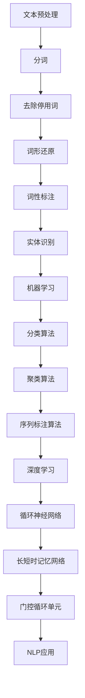

                 

# 《一切皆是映射：聊天机器人的智能化与人性化》

## 关键词：
- 聊天机器人
- 智能化
- 人性化
- 自然语言处理
- 机器学习
- 深度学习
- 对话系统
- 情感分析
- 个性化交互

## 摘要：
本文将深入探讨聊天机器人的智能化与人性的融合。从技术基础、核心概念、算法原理、实践应用和未来展望五个方面展开，详细解析聊天机器人的工作原理、关键技术以及面临的挑战。通过逐步分析，揭示聊天机器人在现代社会中的重要性，以及其与人类交流的映射关系，从而展现人工智能与人性相互融合的美好前景。

## 引言与基础

### 第1章：聊天机器人概述

#### 1.1 聊天机器人的定义与发展历程

**聊天的概念与发展**

聊天，作为一种人类社交活动，历史悠久。从古至今，人们通过书信、口头交流等方式进行沟通。随着互联网的发展，实时交流的需求日益增长，聊天逐渐成为一种主要的沟通方式。从最早的即时通讯软件（如ICQ、MSN）到社交媒体平台（如Facebook、微信），聊天工具不断演变，满足着人们日益多样化的沟通需求。

**机器人的概念与发展**

机器人，最早起源于科幻作品，是对自动化机械的想象。随着计算机科学和人工智能技术的发展，机器人从简单的自动化设备逐渐演变为具有智能能力的实体。机器人可以分为两种：一种是以工业机器人为代表的物理机器人，另一种是以聊天机器人为代表的虚拟机器人。后者通过软件实现，具备与人类进行自然语言交流的能力。

**聊天机器人技术的演变**

聊天机器人的发展可以追溯到20世纪90年代。早期的聊天机器人如“Eliza”主要是基于关键词匹配和预设回答，能够模拟简单的对话。随着自然语言处理（NLP）技术的进步，聊天机器人的能力逐渐增强。21世纪初，随着机器学习技术的应用，聊天机器人开始能够通过学习用户输入来生成回答，具备了一定的智能能力。

近年来，深度学习技术的引入进一步推动了聊天机器人技术的发展。基于深度学习的聊天机器人能够通过大量数据学习，理解复杂的语言结构，生成更自然、更符合人类交流习惯的回答。

#### 1.2 聊天机器人在现代社会的应用

**商业领域的应用**

在商业领域，聊天机器人的应用非常广泛。许多公司利用聊天机器人提供客户支持、销售咨询和售后服务。聊天机器人可以24/7全天候工作，快速响应客户需求，提高客户满意度。例如，一些电商网站使用聊天机器人来提供产品推荐、订单跟踪等服务，极大地提升了用户体验。

**客服领域的应用**

客服是聊天机器人应用的重要领域。传统的客服中心通常需要大量的人力投入，而聊天机器人可以自动化处理常见问题，减轻客服人员的负担。例如，银行、保险公司等金融机构使用聊天机器人来处理客户咨询，提供快速、准确的答复。同时，聊天机器人还可以通过情感分析技术，识别客户情绪，提供更加个性化的服务。

**教育领域的应用**

在教育领域，聊天机器人也被广泛应用于在线辅导、学习进度跟踪等方面。聊天机器人可以帮助学生解答学习中的问题，提供个性化的学习建议。例如，一些在线教育平台使用聊天机器人来提供实时答疑服务，帮助学生更好地理解课程内容。此外，聊天机器人还可以用于自动化评估学生的学习成果，提供个性化的反馈。

#### 1.3 聊天机器人的核心组成部分

**自然语言处理（NLP）**

自然语言处理是聊天机器人的核心技术之一。它涉及对人类语言的理解和生成，包括文本预处理、词性标注、实体识别、情感分析等。NLP技术的核心是让计算机能够理解并处理自然语言，这是实现智能聊天的基础。

**机器学习（ML）**

机器学习是聊天机器人实现智能化的关键。通过机器学习，聊天机器人可以从大量数据中学习规律，自动生成回答。常见的机器学习算法包括分类算法、聚类算法、序列标注算法等。这些算法帮助聊天机器人理解用户的输入，并根据输入生成相应的回答。

**深度学习（DL）**

深度学习是机器学习的一个重要分支，它在聊天机器人中的应用日益广泛。深度学习通过构建复杂的神经网络模型，可以从大量数据中自动学习特征，实现高效的文本分类、生成和情感分析。常见的深度学习模型包括循环神经网络（RNN）、长短时记忆网络（LSTM）、门控循环单元（GRU）等。

## 第二部分：核心概念与联系

### 第2章：自然语言处理（NLP）

#### 2.1 NLP的基础概念

**文本预处理**

文本预处理是NLP的首要步骤，旨在将原始文本转换为计算机可以处理的形式。主要包括以下任务：

- **分词（Tokenization）**：将文本拆分为单词或短语。
- **去除停用词（Stopword Removal）**：去除常见无意义的词语，如“的”、“了”、“是”等。
- **词形还原（Lemmatization）**：将不同形式的单词还原为词根。
- **词性标注（Part-of-Speech Tagging）**：标注每个词的词性，如名词、动词、形容词等。

**词性标注**

词性标注是文本预处理的重要环节，通过对每个词进行词性标注，可以帮助计算机更好地理解文本。常见的词性标注工具包括NLTK、spaCy等。

**实体识别**

实体识别旨在识别文本中的特定实体，如人名、地名、组织名、产品名等。实体识别有助于构建知识图谱，为后续的语义分析提供基础。常用的实体识别工具包括spaCy、Stanford NLP等。

#### 2.2 机器学习在NLP中的应用

**分类算法**

分类算法是NLP中常用的算法之一，用于将文本分类到不同的类别。常见的分类算法包括：

- **朴素贝叶斯（Naive Bayes）**：基于贝叶斯定理，适用于文本分类。
- **支持向量机（SVM）**：通过最大化分类边界，实现文本分类。
- **决策树（Decision Tree）**：通过树的构建，实现文本分类。

**聚类算法**

聚类算法用于将文本数据分组，以发现文本之间的相似性。常见的聚类算法包括：

- **K-均值（K-Means）**：基于距离度量，实现文本聚类。
- **层次聚类（Hierarchical Clustering）**：通过层次结构，实现文本聚类。

**序列标注算法**

序列标注算法用于对序列数据（如文本）中的每个元素进行标注。常见的序列标注算法包括：

- **条件随机场（CRF）**：用于序列标注，具有良好的泛化能力。
- **长短时记忆网络（LSTM）**：通过记忆机制，实现序列标注。

#### 2.3 深度学习在NLP中的发展

**循环神经网络（RNN）**

循环神经网络（RNN）是一种能够处理序列数据的神经网络。RNN通过记忆机制，能够捕捉序列中的长期依赖关系。常见的RNN模型包括：

- **简单RNN（Simple RNN）**：基于权重共享，实现序列建模。
- **长短时记忆网络（LSTM）**：通过门控机制，解决简单RNN的梯度消失问题。
- **门控循环单元（GRU）**：在LSTM基础上，简化结构，提高效率。

**Mermaid流程图：NLP的核心算法原理**



### 第3章：机器学习与深度学习

#### 3.1 机器学习基础

**线性回归**

线性回归是一种简单的预测模型，用于分析两个或多个变量之间的线性关系。线性回归模型基于最小二乘法，通过拟合一条直线，预测因变量的值。

**逻辑回归**

逻辑回归是一种用于分类问题的预测模型，通过拟合一个逻辑函数，将输入变量的线性组合映射到一个概率值。逻辑回归模型常用于二元分类问题。

**支持向量机（SVM）**

支持向量机（SVM）是一种强大的分类算法，通过寻找最优超平面，实现数据的分类。SVM基于最大间隔分类原则，能够处理非线性分类问题。

#### 3.2 深度学习基础

**神经网络基础**

神经网络是由大量神经元组成的计算模型，通过学习输入和输出之间的映射关系，实现复杂的任务。神经网络的核心包括：

- **神经元**：神经网络的基本单元，负责计算和传递信息。
- **权重**：神经元之间的连接权重，用于调整输入对输出的影响。
- **激活函数**：神经元激活的阈值，用于确定神经元是否被激活。

**反向传播算法**

反向传播算法是深度学习训练的核心算法，通过计算损失函数对权重的梯度，反向传播误差，更新网络权重，实现模型的训练。

**激活函数与损失函数**

激活函数用于确定神经元是否被激活，常见的激活函数包括：

- **sigmoid函数**：用于将输入映射到（0,1）区间。
- **ReLU函数**：用于引入非线性，加速训练过程。
- **Tanh函数**：用于将输入映射到（-1,1）区间。

损失函数用于评估模型预测值和真实值之间的差异，常见的损失函数包括：

- **均方误差（MSE）**：用于回归问题，计算预测值和真实值之间的平均平方误差。
- **交叉熵（Cross-Entropy）**：用于分类问题，计算预测概率和真实概率之间的交叉熵。

#### 3.3 深度学习在聊天机器人中的应用

**语音识别**

语音识别是一种将语音转换为文本的技术，是聊天机器人与用户进行语音交互的基础。深度学习在语音识别中的应用主要包括：

- **循环神经网络（RNN）**：通过记忆机制，处理语音信号的时间序列。
- **长短时记忆网络（LSTM）**：通过门控机制，解决RNN的梯度消失问题。
- **卷积神经网络（CNN）**：通过卷积操作，提取语音信号的特征。

**图像识别**

图像识别是一种将图像转换为标签的技术，是聊天机器人进行图像分析和交互的基础。深度学习在图像识别中的应用主要包括：

- **卷积神经网络（CNN）**：通过卷积操作，提取图像特征。
- **循环神经网络（RNN）**：通过记忆机制，处理图像序列。
- **生成对抗网络（GAN）**：通过对抗训练，生成高质量图像。

**文本生成**

文本生成是一种将给定文本扩展或生成新文本的技术，是聊天机器人进行自然语言交互的基础。深度学习在文本生成中的应用主要包括：

- **序列生成模型（如RNN、LSTM）**：通过记忆机制，生成连续的文本序列。
- **生成对抗网络（GAN）**：通过对抗训练，生成高质量的文本。

## 第三部分：核心技术原理

### 第4章：聊天机器人核心算法

#### 4.1 聊天机器人的对话系统架构

**对话管理（DM）**

对话管理是聊天机器人的核心模块，负责管理对话流程，包括用户意图识别、上下文维护、对话策略等。对话管理的目标是在有限的输入和输出中，实现自然、连贯的对话。

**对话生成（DG）**

对话生成是聊天机器人的另一个重要模块，负责生成自然、流畅的回复。对话生成可以通过模板匹配、序列生成模型（如RNN、LSTM）和生成对抗网络（GAN）实现。

**意图识别（IR）**

意图识别是聊天机器人理解用户输入的关键步骤，旨在识别用户的需求和意图。意图识别可以通过基于规则的方法、机器学习方法（如SVM、朴素贝叶斯）和深度学习方法（如LSTM、BERT）实现。

#### 4.2 意图识别算法原理

**基于规则的意图识别**

基于规则的意图识别是通过预设的规则库，对用户输入进行匹配，识别用户意图。规则通常由领域专家编写，形式化地描述用户输入与意图之间的关系。

**基于机器学习的意图识别**

基于机器学习的意图识别是通过训练模型，自动识别用户意图。常见的机器学习算法包括SVM、朴素贝叶斯、决策树等。这些算法可以从大量标注数据中学习，识别用户意图。

**基于深度学习的意图识别**

基于深度学习的意图识别是通过训练神经网络，自动识别用户意图。常见的深度学习模型包括LSTM、BERT、Transformer等。这些模型可以从大量数据中学习，识别复杂的用户意图。

#### 4.3 对话生成算法原理

**模板匹配**

模板匹配是一种简单的对话生成方法，通过预设的模板，将用户输入与模板进行匹配，生成回复。模板通常由领域专家编写，形式化地描述可能的回复。

**序列生成模型（如RNN、LSTM）**

序列生成模型是通过学习用户输入的序列，生成回复的序列。常见的序列生成模型包括RNN、LSTM、GRU等。这些模型具有记忆机制，能够捕捉用户输入的长期依赖关系。

**生成对抗网络（GAN）**

生成对抗网络（GAN）是一种通过对立训练的方法，生成高质量的对话回复。GAN由生成器和判别器组成，生成器生成回复，判别器判断回复的真实性。通过对抗训练，生成器不断提高生成质量。

### 第5章：情感分析与个性化交互

#### 5.1 情感分析基础

**情感分类**

情感分类是将文本分类到不同情感类别（如正面、负面、中性）的过程。常见的情感分类算法包括朴素贝叶斯、支持向量机、决策树等。

**情感极性分析**

情感极性分析是将文本分类为积极或消极的情感极性。常见的情感极性分析算法包括基于规则的方法和基于机器学习的方法。

**情感强度分析**

情感强度分析是评估文本中情感表达的程度。常见的情感强度分析算法包括基于词典的方法和基于模型的方法。

#### 5.2 个性化交互技术

**用户画像**

用户画像是一种描述用户特征的方法，包括用户的基本信息、兴趣爱好、行为习惯等。通过构建用户画像，可以更好地了解用户需求，提供个性化服务。

**用户偏好模型**

用户偏好模型是描述用户兴趣和偏好的模型。通过学习用户的交互数据，可以构建用户偏好模型，用于推荐系统和服务个性化。

**个性化对话系统设计**

个性化对话系统设计是结合用户画像和用户偏好模型，设计能够满足用户需求的对话系统。个性化对话系统可以通过情感分析、上下文维护等技术，实现与用户的良好互动。

#### 5.3 情感分析与个性化交互的融合

**情感分析在聊天机器人中的应用**

情感分析在聊天机器人中的应用包括情感分类、情感极性分析和情感强度分析。通过情感分析，聊天机器人可以更好地理解用户情绪，提供更加个性化的服务。

**个性化对话系统的实现**

个性化对话系统的实现包括用户画像构建、用户偏好模型训练和对话生成。通过这些技术，聊天机器人可以与用户建立良好的互动关系，提高用户满意度。

## 第四部分：项目实战

### 第6章：构建一个简单的聊天机器人

#### 6.1 项目概述

**项目目标**

本项目旨在构建一个简单的聊天机器人，实现基本的对话功能，包括用户意图识别、对话生成和情感分析。

**项目需求**

- 用户输入文本：用户可以通过文本输入与聊天机器人交互。
- 用户意图识别：聊天机器人需要识别用户输入的意图，如提问、命令等。
- 对话生成：聊天机器人需要生成自然、流畅的回复。
- 情感分析：聊天机器人需要分析用户输入的情感，提供个性化的服务。

**项目架构**

本项目采用模块化设计，包括以下模块：

- **用户界面（UI）**：用于接收用户输入和展示聊天机器人的回复。
- **对话管理（DM）**：负责管理对话流程，包括用户意图识别和对话生成。
- **情感分析（FA）**：负责分析用户输入的情感。
- **后端服务（API）**：用于处理用户请求，提供对话和情感分析功能。

### 6.2 开发环境搭建

**开发环境选择**

- **编程语言**：Python
- **框架**：TensorFlow、spaCy
- **操作系统**：Linux（Ubuntu）

**工具和库的安装**

1. 安装Python

   ```bash
   sudo apt-get update
   sudo apt-get install python3-pip
   ```

2. 安装TensorFlow

   ```bash
   pip3 install tensorflow
   ```

3. 安装spaCy

   ```bash
   pip3 install spacy
   python3 -m spacy download en
   ```

### 6.3 数据集准备与预处理

**数据集收集**

本项目采用公开的聊天数据集，如Twitter聊天数据集、IMDb影评数据集等。这些数据集包含大量的用户对话和情感标签，适用于训练聊天机器人和情感分析模型。

**数据预处理方法**

1. 数据清洗

   - 去除无关信息，如HTML标签、特殊字符等。
   - 处理文本中的缩写和错别字，如将“u r cool”处理为“you are cool”。

2. 分词

   - 使用spaCy对文本进行分词。

3. 去除停用词

   - 使用spaCy中的停用词列表，去除常见无意义的词语。

4. 词形还原

   - 使用spaCy进行词形还原，将不同形式的单词还原为词根。

### 6.4 模型训练与优化

**模型选择**

本项目采用基于Transformer的预训练模型BERT，进行用户意图识别和对话生成。BERT模型具有良好的性能和泛化能力，适用于处理自然语言任务。

**训练过程优化**

1. 数据增强

   - 使用数据增强技术，如随机插入、删除、替换词语，增加训练数据的多样性。

2. 学习率调整

   - 使用学习率调整策略，如学习率衰减，避免模型过拟合。

3. 模型评估

   - 使用交叉验证和测试集，评估模型性能。

4. 模型调优

   - 根据评估结果，调整模型参数，优化模型性能。

### 第7章：聊天机器人的实战应用

#### 7.1 商业客户服务应用

**客户咨询处理**

聊天机器人可以自动处理客户的咨询，提供快速、准确的答复。通过用户意图识别模块，聊天机器人可以识别客户的咨询意图，如产品推荐、售后服务等。然后，通过对话生成模块，生成自然、流畅的回复。

**订单处理与支付**

聊天机器人可以协助客户完成订单处理和支付流程。通过与用户交互，聊天机器人可以收集客户订单信息，如商品名称、数量、价格等。然后，将订单信息传递给后端系统，完成订单处理和支付。

**售后服务与反馈**

聊天机器人可以提供售后服务，如退换货政策、保修服务等。通过与用户交互，聊天机器人可以解答客户的疑问，提供解决方案。此外，聊天机器人还可以收集用户反馈，用于改进产品和服务。

#### 7.2 教育互动平台应用

**在线答疑系统**

聊天机器人可以为学生提供在线答疑服务。学生可以通过文本或语音输入问题，聊天机器人可以识别问题意图，并提供相应的解答。聊天机器人还可以记录学生的提问和回答，帮助教师分析学生的问题点和学习需求。

**课程推荐系统**

聊天机器人可以根据学生的学习进度和偏好，推荐合适的课程。通过用户画像和用户偏好模型，聊天机器人可以分析学生的学习行为和兴趣，提供个性化的课程推荐。

**学习进度跟踪**

聊天机器人可以记录学生的学习进度，提供学习报告和反馈。通过与学生的交互，聊天机器人可以了解学生的学习状态，提供学习建议和指导。

#### 7.3 社交媒体互动应用

**社交媒体监测**

聊天机器人可以监控社交媒体平台上的用户评论和讨论，分析用户情绪和话题趋势。通过情感分析模块，聊天机器人可以识别用户的情感倾向，提供相关的数据报告。

**情感分析**

聊天机器人可以分析社交媒体平台上的用户情感，如正面、负面、中性等。通过情感分析，聊天机器人可以识别用户对品牌、产品或事件的情感反应，为企业提供市场洞察。

**互动推广**

聊天机器人可以与用户进行互动推广，如推广新产品、促销活动等。通过对话生成和情感分析，聊天机器人可以提供个性化的推广信息，提高用户的参与度和转化率。

## 第五部分：未来展望与挑战

### 第8章：聊天机器人技术的发展趋势

**人工智能的发展对聊天机器人的影响**

人工智能（AI）技术的发展，特别是深度学习、自然语言处理和计算机视觉等领域，为聊天机器人提供了强大的技术支持。未来，随着人工智能技术的不断进步，聊天机器人的智能化水平将进一步提高，能够更好地模拟人类的交流方式，提供更加人性化的服务。

**多模态交互技术**

多模态交互技术是未来聊天机器人发展的重要方向。通过结合语音、文本、图像等多种模态，聊天机器人可以实现更丰富的交互方式，提高用户体验。例如，聊天机器人可以通过语音识别和自然语言处理技术，理解用户的语音指令，并通过语音合成技术生成回复。同时，通过计算机视觉技术，聊天机器人可以识别用户的图像或视频，提供更直观的服务。

**自主意识与情感理解**

自主意识与情感理解是聊天机器人发展的终极目标。未来，聊天机器人将具备一定的自主意识和情感理解能力，能够根据用户的行为和情绪，主动调整交互策略，提供更加个性化的服务。例如，聊天机器人可以通过情感分析技术，识别用户的情绪变化，提供安慰、鼓励等情感支持。

**聊天机器人在未来社会的角色**

**智能助手与个人助理**

随着人工智能技术的进步，聊天机器人将逐渐成为每个人的智能助手和个人助理。聊天机器人可以协助用户处理日常事务，如日程管理、任务提醒、信息检索等。通过与用户的长期交互，聊天机器人可以了解用户的需求和偏好，提供更加个性化的服务。

**智能化客服与服务平台**

聊天机器人在商业和服务领域将有更广泛的应用。未来，智能化客服与服务平台将基于聊天机器人技术，提供高效、个性化的客户服务。聊天机器人可以处理大量的客户咨询，提高客户满意度，降低企业运营成本。

**智慧城市建设中的角色**

智慧城市建设是未来社会的重要趋势。聊天机器人可以在智慧城市建设中发挥重要作用，如提供交通信息、应急响应、城市服务等方面的支持。通过智慧城市平台，聊天机器人可以与各种智能设备进行交互，提供全面的智慧城市服务。

### 第9章：面临的挑战与解决方案

**数据隐私与安全问题**

数据隐私与安全是聊天机器人面临的重要挑战。聊天机器人需要处理大量的用户数据，包括个人信息、行为数据等。为了确保用户数据的安全，聊天机器人需要采用严格的数据保护措施，如数据加密、访问控制等。同时，需要遵守相关法律法规，保护用户的隐私权益。

**用户信任与接受度问题**

用户信任与接受度是聊天机器人推广的重要挑战。尽管聊天机器人具有很多优势，但用户可能对其能力持怀疑态度，担心其无法提供满意的服务。为了提高用户信任度，聊天机器人需要不断提升服务质量，提供个性化、人性化的交互体验。同时，通过用户反馈机制，及时了解用户需求和意见，不断优化聊天机器人的性能。

**技术瓶颈与突破方向**

聊天机器人技术在发展过程中面临一些技术瓶颈，如自然语言理解能力有限、情感分析准确性不高等。为了突破这些瓶颈，需要从以下几个方面进行努力：

- **提高计算资源与效率**：随着聊天机器人应用的普及，计算资源的需求不断增加。通过优化算法、提升硬件性能等手段，提高计算资源利用效率，降低成本。
- **增强模型解释性与可解释性**：当前深度学习模型具有一定的黑箱性，难以解释其决策过程。为了提高模型的可解释性，需要开发可解释的深度学习模型，帮助用户理解模型的决策逻辑。
- **跨领域知识整合与迁移学习**：不同领域的知识对聊天机器人的性能有着重要影响。通过跨领域知识整合和迁移学习技术，将不同领域的知识融合到聊天机器人中，提高其泛化能力。

## 附录

### 附录A：聊天机器人开发工具与资源

**A.1 开发工具简介**

- **Python**：Python是一种高级编程语言，广泛应用于人工智能和机器学习领域。其简洁的语法和丰富的库，使得Python成为聊天机器人开发的理想选择。
- **TensorFlow**：TensorFlow是谷歌开源的深度学习框架，支持多种深度学习模型的构建和训练。TensorFlow在聊天机器人开发中具有广泛的应用。
- **spaCy**：spaCy是一个高效的NLP库，提供丰富的文本预处理和NLP功能，是构建聊天机器人不可或缺的工具。

**A.2 开发框架与库**

- **NLTK**：NLTK是一个经典的NLP库，提供文本预处理、词性标注、情感分析等功能，是NLP开发的基础工具。
- **spaCy**：spaCy是一个高性能的NLP库，提供文本预处理、词性标注、实体识别等功能，适用于各种NLP任务。
- **transformers**：transformers是Hugging Face团队开发的预训练模型库，包括BERT、GPT等大量先进的预训练模型，是构建聊天机器人的强大工具。

**A.3 学习资源与推荐**

- **在线课程与教程**：许多在线平台提供丰富的聊天机器人开发课程和教程，如Coursera、Udacity等。这些课程和教程涵盖从基础知识到高级应用的各个方面，适合不同层次的读者。
- **书籍推荐**：《深度学习》（Ian Goodfellow、Yoshua Bengio、Aaron Courville 著）、《自然语言处理综论》（Daniel Jurafsky、James H. Martin 著）等经典书籍，为读者提供了全面、深入的知识。
- **学术会议与论坛**：如AAAI、ACL、ICML等，是人工智能和机器学习领域的重要学术会议和论坛。在这些会议上，研究人员可以分享最新的研究成果和技术进展。

