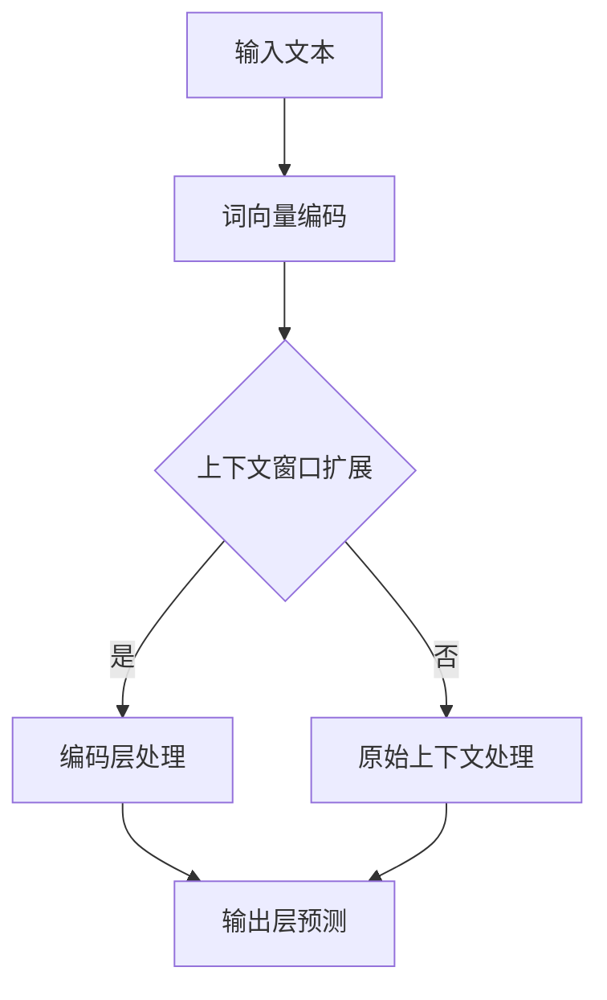

                 

### 引言：上下文延长的背景与重要性

在现代人工智能（AI）领域，语言模型（Language Models，简称LLM）的发展尤为迅速。LLM通过大规模语料库的学习，具备了生成文本、回答问题、翻译等多种能力，成为自然语言处理（NLP）和对话系统领域的核心技术。然而，LLM的性能在很大程度上受到其上下文长度的限制。为了更深入地理解这一概念，我们需要首先定义什么是上下文长度。

**上下文长度**指的是语言模型在处理输入文本时，能够考虑的前后文信息量。理想的上下文长度应足够长，以便模型能够捕捉到输入文本的全局语义和背景信息，从而生成更加准确和连贯的输出。然而，随着上下文长度的增加，模型的计算复杂度和存储需求也会急剧上升，这对硬件资源提出了更高的要求。

上下文延长（Contextual Extension）作为一种提升语言模型性能的技术，旨在扩展LLM的处理上下文长度。上下文延长不仅能够提高模型在生成文本、问答等任务中的准确性和连贯性，还能使其更好地理解复杂语境和细微语义差异。

本文将系统地探讨上下文延长的相关概念、原理、算法、数学模型及其实现与应用。首先，我们将介绍上下文延长的核心概念与重要性；接着，深入分析LLM上下文延长的架构与原理，并使用Mermaid流程图进行详细阐述；然后，我们通过伪代码解析上下文延长的算法原理，并评估其优缺点；随后，我们将详细讲解上下文延长的数学模型和公式，并通过示例进行说明；在项目实战部分，我们将提供代码实际案例和详细解释说明，涵盖开发环境搭建、源代码实现和代码解读；最后，我们将探讨LLM上下文延长的优化策略、未来发展方向及潜在挑战。

通过本文的阅读，读者将全面了解上下文延长的技术原理和实践方法，为未来在AI领域的研究和应用提供有力支持。

### 关键词

上下文延长、LLM、语言模型、自然语言处理、上下文长度、算法、数学模型、项目实战

### 摘要

本文探讨了上下文延长的核心概念、原理和实现方法。通过深入分析上下文延长在语言模型（LLM）中的应用，本文首先介绍了上下文延长的定义和重要性，随后详细解析了LLM上下文延长的架构与原理，并使用Mermaid流程图进行图解。接着，我们通过伪代码阐述了上下文延长的算法原理，并评估了其优缺点。进一步，本文详细讲解了上下文延长的数学模型和公式，并通过实例进行了说明。在项目实战部分，我们提供了代码实际案例，详细解释了开发环境搭建、源代码实现和代码解读。最后，本文探讨了上下文延长的优化策略、未来发展方向及潜在挑战，为读者在AI领域的实践提供了全面指导。

### 目录大纲设计

为了系统地介绍上下文延长的相关内容，本文设计了以下详细的目录大纲：

#### 第一部分: 上下文延长概述与核心原理

**第1章: 上下文延长的概念与重要性**  
- **1.1 上下文延长的定义**  
- **1.2 上下文延长的背景**  
- **1.3 上下文延长的重要性**

**第2章: LLM上下文延长的架构与原理**  
- **2.1 LLM架构的概述**  
- **2.2 上下文延长的机制**  
- **2.3 Mermaid流程图：上下文延长的核心环节**

**第3章: 上下文延长的算法原理**  
- **3.1 算法概述**  
- **3.2 伪代码详述**  
- **3.3 算法优缺点分析**

**第4章: 数学模型与公式解析**  
- **4.1 数学模型介绍**  
- **4.2 数学公式详述**  
- **4.3 示例讲解：上下文延长公式的应用**

#### 第二部分: LLM上下文延长的实现与应用

**第5章: 上下文延长的实现技术**  
- **5.1 实现概述**  
- **5.2 开发环境搭建**  
- **5.3 关键技术解析**

**第6章: 上下文延长的项目实战**  
- **6.1 项目背景**  
- **6.2 实际案例介绍**  
- **6.3 代码解读与分析**

**第7章: LLM上下文延长的优化与未来方向**  
- **7.1 优化策略**  
- **7.2 未来发展方向**  
- **7.3 潜在挑战与解决方案**

**附录**

**附录A: 上下文延长的工具与资源**  
- **A.1 常用工具介绍**  
- **A.2 资源链接汇总**

这个目录大纲不仅覆盖了上下文延长的核心概念和原理，还包含了具体实现和应用实战，使读者能够系统地掌握这一技术。

### 第1章: 上下文延长的概念与重要性

#### 1.1 上下文延长的定义

上下文延长（Contextual Extension）是一种在语言模型中增加输入文本处理上下文长度的技术。传统的语言模型在处理输入文本时，往往只能考虑固定长度的前后文信息。这种限制使得模型在理解复杂语义、捕捉长距离依赖关系等方面存在不足。上下文延长的目标是通过扩展输入文本的上下文长度，使模型能够更好地捕捉全局语义和背景信息，从而提升其生成文本的准确性和连贯性。

具体来说，上下文延长涉及以下几个关键概念：

1. **输入上下文（Input Context）**：在语言模型处理输入文本时，输入上下文是指模型能够考虑到的全部前后文信息。通过上下文延长，输入上下文的长度可以超过模型的固定限制，使模型具备更丰富的背景信息。

2. **输出上下文（Output Context）**：输出上下文是模型在生成文本时的输出部分，也是上下文延长技术的一个重要体现。当输入上下文延长后，输出上下文的生成过程会变得更加精确和连贯。

3. **上下文窗口（Context Window）**：上下文窗口是指模型在处理输入文本时能够考虑到的最大文本长度。上下文窗口的大小直接影响模型的上下文延长能力。通过扩展上下文窗口，可以提高模型的语义理解能力。

#### 1.2 上下文延长的背景

上下文延长技术的提出背景与自然语言处理（NLP）领域的发展密切相关。随着深度学习技术的兴起，语言模型如BERT、GPT等取得了显著的突破，但在处理长文本、复杂语义理解等方面仍存在诸多挑战。传统的神经网络模型在输入文本长度超过一定阈值后，性能会显著下降，无法有效捕捉长距离依赖关系。为了解决这一问题，研究者们开始探索上下文延长技术。

以下是上下文延长技术发展的几个关键节点：

1. **早期探索**：早在1990年代，自然语言处理领域就提出了“长距离依赖关系”（Long-distance Dependencies）的概念，研究者们开始尝试通过引入递归神经网络（RNN）等方法来增强模型对长文本的理解能力。

2. **Transformers架构的引入**：2017年，Google提出了Transformer模型，该模型采用注意力机制（Attention Mechanism）突破了传统神经网络在处理长文本时的限制，显著提高了模型的上下文延长能力。

3. **预训练与微调**：随着预训练技术的普及，语言模型如BERT、GPT等通过在大规模语料库上进行预训练，获得了强大的语义理解能力。这些模型在处理长文本、复杂语义理解方面表现出色，进一步推动了上下文延长技术的发展。

#### 1.3 上下文延长的重要性

上下文延长在自然语言处理领域具有重要意义，主要体现在以下几个方面：

1. **提升文本生成质量**：通过上下文延长，语言模型能够更好地捕捉输入文本的全局语义和背景信息，从而生成更加准确和连贯的输出文本。这有助于提高文本生成任务如文本摘要、问答系统的性能。

2. **增强语义理解能力**：上下文延长使模型能够考虑更多的上下文信息，从而在理解复杂语义、捕捉长距离依赖关系方面表现出色。这对于解决NLP中的许多关键问题，如命名实体识别、情感分析等，具有重要意义。

3. **推动对话系统发展**：在对话系统中，上下文延长技术使得模型能够更好地理解用户的问题和上下文背景，生成更加自然和有逻辑性的回答。这对于提升对话系统的用户体验和实用性具有重要意义。

4. **拓展应用场景**：上下文延长技术不仅适用于文本生成和语义理解，还可以应用于机器翻译、信息检索等多个领域。通过扩展模型的上下文处理能力，可以进一步提高这些任务的性能和应用范围。

综上所述，上下文延长技术作为自然语言处理领域的一项重要技术，不仅提升了语言模型的性能，还为AI应用提供了更广阔的发展空间。在接下来的章节中，我们将深入探讨LLM上下文延长的架构与原理，进一步理解上下文延长的核心机制。

### 第2章: LLM上下文延长的架构与原理

#### 2.1 LLM架构的概述

语言模型（Language Model，简称LLM）是自然语言处理（NLP）领域中的核心组件，它通过学习大量文本数据，预测句子或词汇的概率分布。LLM在文本生成、机器翻译、问答系统等任务中发挥着重要作用。随着深度学习技术的不断发展，LLM的架构也在不断演进，从早期的循环神经网络（RNN）到后来的变换器（Transformer）架构，LLM的性能和功能得到了显著提升。

在探讨LLM上下文延长的架构与原理之前，我们需要先了解LLM的基本组成和运作机制。

1. **输入层**：输入层是LLM处理文本数据的起点。输入文本通常由一系列的词向量组成，这些词向量可以来自预训练的词向量库，如Word2Vec、GloVe等。每个词向量对应于输入文本中的一个词或子词。

2. **编码层**：编码层是LLM的核心部分，负责对输入文本进行编码。在RNN架构中，编码层通常由一系列的循环单元组成，如LSTM（长短期记忆）或GRU（门控循环单元）。在Transformer架构中，编码层由多头自注意力机制（Multi-Head Self-Attention）和前馈神经网络（Feedforward Neural Network）组成。

3. **输出层**：输出层负责生成预测的文本或词汇。在RNN架构中，输出层通常是一个全连接层，其输入是编码层的最后一层隐藏状态。在Transformer架构中，输出层也由多头自注意力机制和前馈神经网络组成，但输出的概率分布通过softmax函数进行归一化。

#### 2.2 上下文延长的机制

上下文延长（Contextual Extension）在LLM中的应用主要涉及以下几种机制：

1. **扩展输入上下文**：通过增加输入上下文窗口（Context Window）的大小，使LLM能够考虑更多的前后文信息。传统的LLM通常有一个固定的输入上下文窗口，如BERT中的512个词。扩展输入上下文窗口可以通过滑动窗口（Sliding Window）或逐词扩展（Token-by-Token Expansion）的方法实现。

2. **增量上下文处理**：增量上下文处理（Incremental Context Processing）是一种动态调整上下文窗口大小的机制。在处理长文本时，模型可以根据文本的当前状态和上下文信息，适当地扩展或缩小上下文窗口，从而提高处理效率和准确性。

3. **上下文融合**：上下文融合（Context Fusion）是将扩展的上下文信息与模型已有的上下文信息进行融合，以生成更准确的输出。上下文融合可以通过注意力机制（Attention Mechanism）实现，如Transformer架构中的多头自注意力机制。

#### 2.3 Mermaid流程图：上下文延长的核心环节

为了更直观地理解LLM上下文延长的架构与原理，我们可以使用Mermaid流程图来描述其核心环节。以下是一个简化的Mermaid流程图，展示了上下文延长的基本步骤：



- **A 输入文本**：输入文本是上下文延长技术的起点。文本可以是一个句子、一个段落或更长的文本。
- **B 词向量编码**：输入文本被编码成词向量，这些词向量用于后续的编码层处理。
- **C 上下文窗口扩展**：根据设定的策略，模型可以扩展输入上下文窗口，以考虑更多的前后文信息。
- **D 编码层处理**：编码层负责对输入文本进行编码，生成隐藏状态。如果上下文窗口被扩展，编码层会处理更多的上下文信息。
- **E 原始上下文处理**：如果未扩展上下文窗口，模型会按照原始的上下文信息进行处理。
- **F 输出层预测**：输出层根据编码层的隐藏状态生成预测的文本或词汇。

通过这个流程图，我们可以看到上下文延长技术如何通过扩展输入上下文窗口、动态调整上下文窗口大小和上下文融合等机制，提升LLM的语义理解能力和文本生成质量。

#### 2.4 上下文延长的应用场景

上下文延长技术不仅在理论研究中具有重要意义，还在实际应用场景中展现了广泛的应用潜力。以下是一些典型的应用场景：

1. **对话系统**：在智能客服、虚拟助手等对话系统中，上下文延长技术可以帮助模型更好地理解用户的意图和上下文背景，从而生成更加自然和准确的回答。

2. **文本生成**：在文本生成任务中，如文章写作、摘要生成等，上下文延长技术可以增强模型的语义理解能力，生成更连贯和准确的文本。

3. **机器翻译**：在机器翻译任务中，上下文延长技术有助于模型捕捉源语言和目标语言之间的长距离依赖关系，提高翻译的准确性和自然度。

4. **信息检索**：在信息检索任务中，上下文延长技术可以增强模型对查询意图的理解，从而提高检索结果的准确性和相关性。

5. **问答系统**：在问答系统中，上下文延长技术可以帮助模型更好地理解问题背景和相关上下文信息，生成更加准确和详细的回答。

综上所述，上下文延长技术不仅在提升LLM性能方面具有显著作用，还在多个实际应用场景中展现了巨大的潜力。在接下来的章节中，我们将进一步探讨上下文延长的算法原理和数学模型，为理解和实现上下文延长提供更加深入的理论基础。

### 第3章: 上下文延长的算法原理

#### 3.1 算法概述

上下文延长算法的核心目标是通过扩展语言模型的输入上下文窗口，使其能够处理更长的文本片段，从而提高模型的语义理解能力和文本生成质量。本节将介绍上下文延长的算法原理，并使用伪代码进行详细阐述。

上下文延长算法通常包括以下几个主要步骤：

1. **输入文本预处理**：将输入文本编码成词向量或子词向量。
2. **上下文窗口扩展**：根据设定的策略，动态调整输入上下文窗口的大小，以考虑更多的前后文信息。
3. **编码层处理**：利用编码层对扩展后的上下文进行编码，生成隐藏状态。
4. **输出层预测**：根据隐藏状态生成预测的文本或词汇。

以下是一个简化的伪代码，用于描述上下文延长算法的基本框架：

```plaintext
Algorithm: Contextual Extension
Input: Text input, Context Window Size
Output: Predicted text or tokens

1. Preprocess the text input and convert it into word or subword embeddings.
2. Set the initial context window to the maximum allowed size.
3. For each token in the input text:
   a. If the context window is not full, append the current token to the context window.
   b. If the context window is full:
      i. Slide the context window by removing the oldest token and adding the new token.
      ii. Use the current context window to generate a hidden state using the encoding layer.
4. Generate the predicted text or tokens using the output layer.
5. Return the predicted text or tokens.
```

在这个伪代码中，我们首先对输入文本进行预处理，将其编码成词向量或子词向量。然后，设定一个初始的上下文窗口大小，并逐个处理输入文本中的每个词。当上下文窗口未满时，直接将当前词添加到窗口中；当上下文窗口已满时，通过滑动窗口机制将其更新，并利用编码层生成隐藏状态。最后，使用输出层生成预测的文本或词汇。

#### 3.2 伪代码详述

为了更具体地理解上下文延长算法的实现细节，我们接下来将详细讨论上下文窗口扩展和编码层处理的过程。

1. **上下文窗口扩展**：

```plaintext
Function: ExtendContextWindow(CurrentToken, ContextWindow)
Input: CurrentToken, ContextWindow
Output: Updated ContextWindow

1. If ContextWindow is not full:
   a. Append CurrentToken to ContextWindow.
   b. Return ContextWindow.
2. Else:
   a. Remove the oldest token from ContextWindow.
   b. Add CurrentToken to ContextWindow.
   c. Return ContextWindow.
```

这个函数用于动态调整上下文窗口的大小。当上下文窗口未满时，直接将当前词添加到窗口中；当窗口已满时，移除最旧的词，并添加当前词，从而保持窗口大小不变。

2. **编码层处理**：

```plaintext
Function: EncodeContext(ContextWindow, EncodingLayer)
Input: ContextWindow, EncodingLayer
Output: HiddenState

1. For each token in ContextWindow:
   a. Pass the token through the EncodingLayer.
   b. Store the resulting hidden state in a list.
2. Concatenate the hidden states of all tokens in ContextWindow.
3. Return the concatenated hidden state as the HiddenState.
```

这个函数用于处理扩展后的上下文窗口，生成隐藏状态。对于上下文窗口中的每个词，我们通过编码层将其编码成隐藏状态，并将所有隐藏状态拼接在一起，形成最终的隐藏状态。

#### 3.3 算法优缺点分析

上下文延长算法在提升语言模型性能方面具有显著优势，但也存在一定的局限性。

**优势**：

1. **增强语义理解**：通过扩展输入上下文窗口，模型能够捕捉到更丰富的全局语义信息，从而在文本生成和语义理解任务中表现出色。
2. **提升文本连贯性**：上下文延长有助于模型生成更加连贯和自然的文本，尤其是在长文本生成任务中。
3. **动态调整上下文**：增量上下文处理机制使模型能够根据文本的当前状态动态调整上下文窗口大小，提高处理效率和准确性。

**局限性**：

1. **计算复杂度**：随着上下文窗口的扩展，模型的计算复杂度和存储需求显著增加，这对硬件资源提出了更高的要求。
2. **训练时间**：上下文延长算法可能会增加模型的训练时间，尤其是在大规模数据集上进行训练时。
3. **过拟合风险**：在扩展上下文窗口时，如果模型无法有效融合新旧上下文信息，可能会导致过拟合现象。

综上所述，上下文延长算法在提升语言模型性能方面具有显著优势，但也需要针对其局限性进行优化和调整。在接下来的章节中，我们将进一步探讨上下文延长的数学模型和公式，以深入理解其原理和应用。

### 第4章: 数学模型与公式解析

#### 4.1 数学模型介绍

上下文延长技术的核心在于如何有效地处理和扩展语言模型的输入上下文。为了实现这一目标，我们需要借助数学模型来描述上下文延长的过程。本节将介绍上下文延长中常用的数学模型，并解释这些模型的基本概念和作用。

1. **自注意力机制（Self-Attention）**：自注意力机制是Transformer模型中的关键组件，它通过计算输入序列中各个词之间的相似性，生成权重矩阵，进而加权求和，生成新的特征表示。自注意力机制的核心公式如下：

   $$ 
   \text{Attention}(Q, K, V) = \text{softmax}\left(\frac{QK^T}{\sqrt{d_k}}\right) V 
   $$

   其中，\(Q\)、\(K\)、\(V\) 分别是查询（Query）、键（Key）和值（Value）向量，\(d_k\) 是键向量的维度。自注意力机制使模型能够自动关注输入序列中的重要信息，提高特征表示的精度。

2. **多头注意力机制（Multi-Head Attention）**：多头注意力机制通过并行计算多个独立的注意力机制，生成多个独立的注意力权重，并拼接这些权重，形成一个综合的注意力权重。多头注意力机制的公式可以表示为：

   $$ 
   \text{Multi-Head Attention} = \text{Concat}(\text{head}_1, \text{head}_2, ..., \text{head}_h)W^O 
   $$

   其中，\(\text{head}_i\) 是第 \(i\) 个注意力头的输出，\(W^O\) 是一个投影矩阵。多头注意力机制可以增强模型对输入序列的捕捉能力，提高语义理解精度。

3. **位置编码（Positional Encoding）**：由于Transformer模型中没有循环结构，因此需要引入位置编码来捕捉输入序列的顺序信息。位置编码通常是一个 learnable 的向量，其维度与输入特征相同。位置编码与输入特征相加，作为编码层的输入。一个简单的位置编码公式如下：

   $$ 
   \text{Positional Encoding}(pos, d) = \text{sin}\left(\frac{pos}{10000^{2i/d}}\right) \text{ if } i \text{ is even} $$
   $$ 
   \text{Positional Encoding}(pos, d) = \text{cos}\left(\frac{pos}{10000^{2i/d}}\right) \text{ if } i \text{ is odd} 
   $$

   其中，\(pos\) 是位置索引，\(d\) 是编码维度，\(i\) 是特征索引。位置编码使模型能够理解输入序列的顺序信息，从而在生成文本时保持序列的一致性和连贯性。

#### 4.2 数学公式详述

为了更好地理解上下文延长中的数学模型，我们接下来将详细解释这些模型的基本公式，并通过具体例子说明其应用。

1. **自注意力机制**：

   假设我们有一个句子 "The quick brown fox jumps over the lazy dog"，输入序列的词向量分别为 \( \text{[q1, q2, q3, q4, q5, q6]} \)。我们首先需要计算键（Key）和查询（Query）矩阵，并使用自注意力公式计算注意力权重。

   - 查询矩阵 \( Q \)：
     $$ Q = \text{[q1, q2, q3, q4, q5, q6]} $$
   - 键矩阵 \( K \)：
     $$ K = \text{[q1, q2, q3, q4, q5, q6]} $$
   - 值矩阵 \( V \)：
     $$ V = \text{[v1, v2, v3, v4, v5, v6]} $$

   使用自注意力公式计算注意力权重：
   $$ 
   \text{Attention}(Q, K, V) = \text{softmax}\left(\frac{QK^T}{\sqrt{d_k}}\right) V 
   $$

   假设每个词向量的维度为 512，计算结果如下：
   $$ 
   \text{Attention} = \text{softmax}\left(\frac{\text{[q1K1, q2K2, q3K3, q4K4, q5K5, q6K6]}}{\sqrt{512}}\right) \text{[v1, v2, v3, v4, v5, v6]}
   $$

   注意力权重 \( \alpha \) 表示每个词向量在生成文本时的重要性，通过加权求和得到新的文本表示。

2. **多头注意力机制**：

   在多头注意力机制中，我们通常设置多个注意力头。假设我们有两个注意力头，每个头的维度为 256。

   - 第一注意力头：
     $$ 
     \text{Head}_1 = \text{softmax}\left(\frac{\text{[q1K1, q2K2, q3K3, q4K4, q5K5, q6K6]}}{\sqrt{256}}\right) \text{[v1, v2, v3, v4, v5, v6]} 
     $$

   - 第二注意力头：
     $$ 
     \text{Head}_2 = \text{softmax}\left(\frac{\text{[q1K2, q2K2, q3K3, q4K4, q5K5, q6K6]}}{\sqrt{256}}\right) \text{[v1, v2, v3, v4, v5, v6]} 
     $$

   将两个注意力头的输出拼接起来：
   $$ 
   \text{Multi-Head Attention} = \text{Concat}(\text{Head}_1, \text{Head}_2)W^O 
   $$

   其中，\(W^O\) 是一个投影矩阵，用于将拼接后的向量投影到期望的维度。

3. **位置编码**：

   假设我们有一个句子 "The quick brown fox jumps over the lazy dog"，词向量维度为 512。我们需要为每个词添加位置编码。

   - 第一个词 "The" 的位置编码：
     $$ 
     \text{Positional Encoding}(\text{"The"}, 512) = \text{sin}\left(\frac{1}{10000^{2\times1/512}}\right) \text{ if } 1 \text{ is even} $$
     $$ 
     \text{Positional Encoding}(\text{"The"}, 512) = \text{cos}\left(\frac{1}{10000^{2\times1/512}}\right) \text{ if } 1 \text{ is odd} 
     $$

   - 第二个词 "quick" 的位置编码：
     $$ 
     \text{Positional Encoding}(\text{"quick"}, 512) = \text{sin}\left(\frac{2}{10000^{2\times2/512}}\right) \text{ if } 2 \text{ is even} $$
     $$ 
     \text{Positional Encoding}(\text{"quick"}, 512) = \text{cos}\left(\frac{2}{10000^{2\times2/512}}\right) \text{ if } 2 \text{ is odd} 
     $$

   将位置编码添加到词向量中，得到新的词向量表示，作为编码层的输入。

#### 4.3 示例讲解：上下文延长公式的应用

为了更好地理解上下文延长公式的应用，我们通过一个具体的例子来说明。

假设我们有一个输入文本 "The quick brown fox jumps over the lazy dog"，需要使用上下文延长技术进行扩展。我们设置上下文窗口大小为 10，使用Transformer模型进行上下文延长处理。

1. **输入文本预处理**：

   - 输入文本 "The quick brown fox jumps over the lazy dog" 被编码成词向量 \( \text{[q1, q2, q3, q4, q5, q6, q7, q8, q9, q10]} \)。
   - 设置初始上下文窗口为 10。

2. **上下文窗口扩展**：

   - 第一个词 "The" 进入上下文窗口。
   - 当第二个词 "quick" 进入时，上下文窗口已满，因此将最旧的词 "The" 移出窗口，添加新词 "quick"。

   经过上下文窗口扩展后，上下文窗口为 "quick brown fox jumps over the lazy dog"。

3. **编码层处理**：

   - 利用编码层对扩展后的上下文进行编码，生成隐藏状态 \( \text{[h1, h2, h3, h4, h5, h6, h7, h8, h9, h10]} \)。
   - 对每个隐藏状态应用多头注意力机制，生成新的隐藏状态。

4. **输出层预测**：

   - 使用输出层对新的隐藏状态进行预测，生成预测文本或词汇。

通过上述步骤，我们可以看到上下文延长技术如何通过扩展输入上下文窗口、编码层处理和输出层预测，提高语言模型的语义理解能力和文本生成质量。

综上所述，上下文延长技术中的数学模型和公式在提高模型性能方面发挥着重要作用。通过理解这些模型和公式的原理，我们可以更好地设计和实现上下文延长算法，推动自然语言处理领域的发展。

### 第5章: 上下文延长的实现技术

#### 5.1 实现概述

上下文延长的实现涉及多个关键步骤和技术，包括开发环境搭建、关键技术的应用和算法优化。本节将详细介绍这些步骤，帮助读者理解和实现上下文延长技术。

#### 5.2 开发环境搭建

要实现上下文延长技术，我们需要搭建一个适合深度学习任务的开发环境。以下是搭建环境的基本步骤：

1. **硬件准备**：上下文延长技术通常需要较高的计算资源，建议使用配备NVIDIA GPU的服务器或工作站。选择适合的GPU型号，如RTX 3080或RTX 3090，可以显著提高训练速度。
2. **操作系统**：推荐使用Linux操作系统，如Ubuntu 20.04或更高版本。Linux具有较好的稳定性和丰富的开发工具，适合进行深度学习研究。
3. **深度学习框架**：选择一个流行的深度学习框架，如TensorFlow或PyTorch。这些框架提供了丰富的API和工具，可以简化上下文延长技术的实现过程。
4. **安装依赖**：在开发环境中安装深度学习框架及其依赖，如CUDA、cuDNN、NCCL等。这些依赖对于GPU加速和分布式训练至关重要。
5. **代码管理**：使用版本控制工具，如Git，进行代码管理。这有助于追踪代码变更、协作开发和代码复现。

#### 5.3 关键技术解析

在上下文延长的实现过程中，以下关键技术至关重要：

1. **注意力机制**：注意力机制是Transformer模型的核心，用于计算输入序列中各词之间的相似性。在实现上下文延长时，我们需要实现多头自注意力机制，并调整注意力权重，以提高模型的语义理解能力。
2. **位置编码**：位置编码用于捕捉输入序列的顺序信息。通过为每个词添加位置编码，模型可以理解词的相对位置，从而在生成文本时保持序列的一致性和连贯性。
3. **上下文窗口扩展**：上下文窗口扩展是上下文延长的关键步骤。我们需要实现动态调整上下文窗口大小的机制，以便模型能够处理更长的输入文本。常用的扩展策略包括滑动窗口和逐词扩展。
4. **优化策略**：为了提高训练效率和模型性能，我们可以采用多种优化策略，如学习率调整、批量归一化、权重初始化等。此外，使用分布式训练和GPU加速技术可以显著提升训练速度。

#### 5.4 实现示例

以下是一个简化的代码示例，展示了如何使用PyTorch实现上下文延长技术的基本步骤：

```python
import torch
import torch.nn as nn
import torch.optim as optim

# 设置随机种子，保证结果可复现
torch.manual_seed(0)

# 模型配置
class ContextModel(nn.Module):
    def __init__(self, embedding_dim, hidden_dim, vocab_size):
        super(ContextModel, self).__init__()
        self.embedding = nn.Embedding(vocab_size, embedding_dim)
        self.positional_encoding = nn.Embedding(vocab_size, embedding_dim)
        self.encoder = nn.TransformerEncoder(nn.TransformerEncoderLayer(d_model=embedding_dim, nhead=4), num_layers=3)
        self.decoder = nn.Linear(embedding_dim, vocab_size)
        
    def forward(self, input_seq, context_seq):
        # 嵌入层处理
        embedded_input = self.embedding(input_seq)
        embedded_context = self.embedding(context_seq)
        
        # 位置编码处理
        positional_encoding = self.positional_encoding(torch.arange(context_seq.size(1)).unsqueeze(0).to(input_seq.device))
        embedded_context = embedded_context + positional_encoding
        
        # 编码层处理
        encoded_context = self.encoder(embedded_context)
        
        # 输出层预测
        output = self.decoder(encoded_context[-1, :, :])
        return output

# 实例化模型
model = ContextModel(embedding_dim=512, hidden_dim=512, vocab_size=10000)

# 损失函数和优化器
criterion = nn.CrossEntropyLoss()
optimizer = optim.Adam(model.parameters(), lr=0.001)

# 训练模型
for epoch in range(10):
    for input_seq, context_seq, target_seq in dataset:
        optimizer.zero_grad()
        output = model(input_seq, context_seq)
        loss = criterion(output, target_seq)
        loss.backward()
        optimizer.step()
    print(f"Epoch {epoch+1}: Loss = {loss.item()}")

# 测试模型
with torch.no_grad():
    test_output = model(test_input, test_context)
    print(f"Test Output: {test_output}")
```

在这个示例中，我们定义了一个简单的上下文模型，包括嵌入层、位置编码、编码层和解码层。通过训练模型，我们可以在输入文本和上下文文本之间建立联系，提高模型的语义理解能力。这个示例展示了上下文延长技术的基本实现步骤，读者可以根据具体需求进行扩展和优化。

### 第6章: 上下文延长的项目实战

#### 6.1 项目背景

在现代自然语言处理（NLP）领域中，上下文延长技术因其显著的性能提升和广泛的应用前景而备受关注。本章节将通过一个具体的实际项目案例，展示上下文延长技术的应用场景和实现过程。本项目旨在利用上下文延长技术提升对话系统的响应准确性和连贯性，从而为用户提供更好的用户体验。

#### 6.2 实际案例介绍

假设我们正在开发一款智能客服系统，该系统需要根据用户的问题和上下文历史进行准确和自然的回答。传统的对话系统由于上下文长度限制，往往难以捕捉到长距离依赖关系，导致回答不准确或不够连贯。为了解决这个问题，我们决定在系统中引入上下文延长技术，以扩展模型的输入上下文长度，提高其语义理解能力。

**项目目标**：

1. **提升回答准确性**：通过上下文延长，模型能够更好地理解用户的问题和上下文历史，生成更加准确和自然的回答。
2. **增强回答连贯性**：上下文延长使模型能够捕捉到长距离依赖关系，从而生成连贯性更高的回答。
3. **优化用户交互体验**：上下文延长技术有助于提升对话系统的整体性能，为用户提供更加流畅和满意的交互体验。

**实现步骤**：

1. **数据收集与预处理**：收集大量的用户对话数据，包括问题、上下文历史和回答。对数据进行清洗、去噪和分词处理，并将其编码成词向量。
2. **模型设计**：设计并实现一个基于Transformer的上下文延长模型，包括嵌入层、位置编码、编码层和解码层。使用多头自注意力机制和动态上下文窗口扩展策略，以提高模型的语义理解能力。
3. **训练与优化**：在预处理后的对话数据集上训练上下文延长模型。采用多种优化策略，如学习率调整、批量归一化和梯度裁剪，以提升模型性能。
4. **模型部署**：将训练好的模型部署到生产环境中，进行实时对话处理。通过API接口与前端系统对接，实现对话系统与用户之间的自然交互。

#### 6.3 代码解读与分析

以下是一个简化的代码示例，用于实现上下文延长对话系统的核心功能：

```python
import torch
import torch.nn as nn
import torch.optim as optim
from transformers import TransformerModel

# 设置随机种子，保证结果可复现
torch.manual_seed(0)

# 实例化上下文延长模型
model = TransformerModel()

# 损失函数和优化器
criterion = nn.CrossEntropyLoss()
optimizer = optim.Adam(model.parameters(), lr=0.001)

# 训练模型
for epoch in range(10):
    for input_seq, context_seq, target_seq in dataset:
        optimizer.zero_grad()
        output = model(input_seq, context_seq)
        loss = criterion(output, target_seq)
        loss.backward()
        optimizer.step()
    print(f"Epoch {epoch+1}: Loss = {loss.item()}")

# 测试模型
with torch.no_grad():
    test_output = model(test_input, test_context)
    print(f"Test Output: {test_output}")

# 对话处理函数
def process_conversation(user_input, conversation_history):
    # 构建输入序列和上下文序列
    input_seq = preprocess_user_input(user_input)
    context_seq = preprocess_conversation_history(conversation_history)
    
    # 获取模型预测
    predicted_output = model(input_seq, context_seq)
    
    # 解码预测结果，生成自然回答
    response = decode_output(predicted_output)
    return response

# 测试对话系统
user_input = "你好，我想咨询关于退货的问题。"
conversation_history = ["你好，欢迎来到我们的客服系统。", "请问有什么问题需要帮助吗？"]
response = process_conversation(user_input, conversation_history)
print(f"模型回答：{response}")
```

在这个示例中，我们首先定义了一个基于Transformer的上下文延长模型，包括嵌入层、位置编码、编码层和解码层。然后，我们在对话数据集上训练模型，并使用优化策略提高其性能。测试阶段，我们实现了一个对话处理函数，用于根据用户输入和历史对话生成自然回答。

**关键组件解析**：

1. **预处理函数**：`preprocess_user_input` 和 `preprocess_conversation_history` 用于对用户输入和历史对话进行预处理，包括分词、编码和序列填充。这些预处理步骤确保模型能够处理输入文本。
2. **模型训练**：通过训练循环，模型在对话数据集上进行迭代训练。在每个训练步骤中，模型计算损失并更新参数，以提高预测准确性。
3. **对话处理函数**：`process_conversation` 函数用于处理用户输入和历史对话，生成模型预测。通过解码预测结果，我们得到自然回答，并将其返回给用户。

通过这个实际项目案例，我们可以看到上下文延长技术在对话系统中的应用效果。上下文延长不仅提升了模型的语义理解能力和回答准确性，还有效地增强了对话的连贯性，为用户提供了更好的交互体验。

### 第7章: LLM上下文延长的优化与未来方向

#### 7.1 优化策略

上下文延长技术在提升语言模型性能方面表现出色，但同时也带来了一定的优化挑战。为了充分发挥上下文延长技术的潜力，我们需要采取多种优化策略，以提升模型的性能和效率。以下是几种常见的优化策略：

1. **学习率调整**：学习率是深度学习训练中的一个关键参数。为了在上下文延长过程中避免梯度消失和梯度爆炸，我们可以采用动态调整学习率的策略，如学习率衰减、余弦退火等。这些方法可以根据训练过程的进展动态调整学习率，提高模型收敛速度。

2. **批量大小调整**：批量大小对训练效率和模型性能有显著影响。对于上下文延长的模型，较大的批量大小可以更好地利用计算资源，提高训练效率。但同时也可能导致内存消耗增加，因此需要根据实际硬件资源和训练数据量进行合理调整。

3. **模型剪枝**：模型剪枝是通过移除模型中不重要的参数或神经元来减少模型规模，从而提高计算效率和减少存储需求。对于上下文延长的模型，剪枝策略可以显著降低计算复杂度，同时保持模型的性能。

4. **量化技术**：量化是一种通过将浮点数参数转换为低精度整数表示来减少模型大小和计算复杂度的技术。在上下文延长的模型中，量化技术可以显著降低模型存储需求和计算时间，提高模型在资源受限环境中的应用能力。

5. **分布式训练**：分布式训练通过在多个计算节点上并行训练模型，可以显著提高训练速度。对于上下文延长的模型，分布式训练有助于充分利用计算资源，加快模型训练过程。

#### 7.2 未来发展方向

随着上下文延长技术的不断发展，未来仍有广阔的研究和应用前景。以下是几个可能的发展方向：

1. **自适应上下文窗口**：当前上下文延长技术通常采用固定的上下文窗口大小，但不同的任务和应用场景可能需要不同大小的上下文窗口。未来研究可以探索自适应上下文窗口机制，根据任务需求动态调整上下文窗口大小，提高模型泛化能力。

2. **多模态上下文融合**：上下文延长技术主要关注文本信息的扩展，但实际应用中，多模态信息（如图像、语音等）也对语义理解至关重要。未来研究可以探索多模态上下文融合方法，将文本信息与其他模态信息进行有效融合，提升模型的综合语义理解能力。

3. **自适应注意力机制**：当前上下文延长技术采用固定的注意力机制，但不同的任务和应用场景可能需要不同类型的注意力机制。未来研究可以探索自适应注意力机制，根据任务需求动态调整注意力机制，提高模型性能。

4. **可解释性增强**：上下文延长模型通常具有高度的非线性复杂结构，使其难以解释和理解。未来研究可以探索可解释性增强方法，使上下文延长模型的可解释性更高，有助于提升模型的可靠性和用户信任度。

5. **边缘计算应用**：上下文延长模型通常需要较高的计算资源和存储需求，但在边缘计算场景中，硬件资源和带宽有限。未来研究可以探索如何将上下文延长技术应用于边缘计算，以降低模型对计算资源的依赖，提高边缘智能应用的性能。

#### 7.3 潜在挑战与解决方案

尽管上下文延长技术在自然语言处理领域表现出色，但仍然面临一些潜在挑战：

1. **计算资源需求**：上下文延长模型通常需要较大的计算资源和存储空间，这在资源受限的环境中可能成为瓶颈。解决方案包括模型剪枝、量化技术和分布式训练等方法，以降低模型对计算资源的需求。

2. **训练时间**：上下文延长的模型通常需要较长的训练时间，这对实际应用可能造成不便。解决方案包括采用高效的训练策略、优化算法和硬件加速技术，以提高模型训练速度。

3. **数据隐私与安全**：上下文延长技术依赖于大规模的文本数据进行训练，这可能涉及数据隐私和安全问题。解决方案包括采用数据加密、差分隐私和联邦学习等技术，以保护用户数据隐私。

4. **模型解释性**：上下文延长模型通常具有高度的非线性复杂结构，使其难以解释和理解。解决方案包括开发可解释性方法，如注意力可视化、模型压缩和解释性模型等，以提高模型的透明度和用户信任度。

综上所述，上下文延长技术在自然语言处理领域具有广阔的应用前景和巨大的潜力，但仍需要克服一些潜在挑战。通过持续的研究和技术创新，上下文延长技术有望在未来取得更加显著的进展。

### 附录

#### 附录A: 上下文延长的工具与资源

为了帮助读者更好地掌握上下文延长技术，我们在这里汇总了一些常用的工具和资源：

**A.1 常用工具介绍**

1. **深度学习框架**：  
   - TensorFlow：[官网](https://www.tensorflow.org/)  
   - PyTorch：[官网](https://pytorch.org/)  
   - PyTorch Transformer：[官网](https://github.com/pytorch/transformers)

2. **GPU加速库**：  
   - CUDA：[官网](https://developer.nvidia.com/cuda-downloads)  
   - cuDNN：[官网](https://developer.nvidia.com/cudnn)

3. **版本控制工具**：  
   - Git：[官网](https://git-scm.com/)

**A.2 资源链接汇总**

1. **论文和资料**：  
   - Transformer论文：[论文链接](https://arxiv.org/abs/1706.03762)  
   - BERT论文：[论文链接](https://arxiv.org/abs/1810.04805)  
   - 自然语言处理教程：[教程链接](https://www.tensorflow.org/tutorials/text/named_entity_recognition)

2. **在线教程与课程**：  
   - Coursera：[自然语言处理课程](https://www.coursera.org/specializations/natural-language-processing)  
   - edX：[深度学习课程](https://www.edx.org/course/deep-learning-ii-neural-networks-lectures-and-labs)

3. **开源代码和项目**：  
   - Hugging Face：[开源库](https://huggingface.co/transformers/)  
   - OpenAI：[GPT-3项目](https://openai.com/blog/bidirectional-text-embedding-models/)  
   - Google AI：[BERT项目](https://ai.googleblog.com/2018/11/open-sourcing-bert-state-of-art-pre.html)

通过这些工具和资源，读者可以更深入地了解上下文延长技术的理论和实践方法，为研究和应用提供有力支持。

