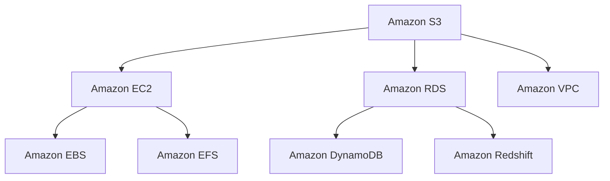
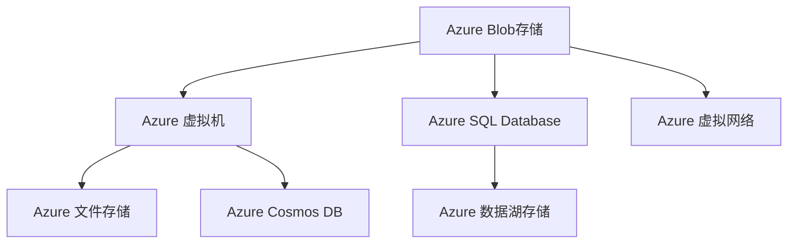
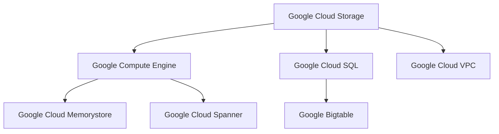

                 

# 云计算平台：AWS、Azure 和 Google Cloud

> **关键词**：云计算，AWS，Azure，Google Cloud，比较，最佳实践，架构设计，成本管理

> **摘要**：本文将深入探讨三大主流云计算平台：AWS（Amazon Web Services），Azure（Microsoft Azure）和Google Cloud Platform。我们将从基础概念入手，详细分析这些平台的架构、核心服务、安全与合规性、成本管理策略，并进行详细的比较。此外，本文还将分享一些实用的最佳实践，以帮助读者更好地选择和使用这些云计算平台。

## 目录大纲

### 第一部分：云计算基础

#### 第1章：云计算概述

1.1 云计算的概念与演变

1.2 云计算的服务模式

1.3 云计算的优势与挑战

#### 第2章：云计算生态系统

2.1 主要云计算服务提供商

2.2 云服务组件

2.3 云服务模型

### 第二部分：AWS平台

#### 第3章：AWS核心服务

3.1 AWS计算服务

3.2 AWS存储服务

3.3 AWS数据库服务

3.4 AWS网络服务

#### 第4章：AWS安全与合规

4.1 AWS安全模型

4.2 AWS合规性

4.3 AWS认证

#### 第5章：AWS成本管理

5.1 AWS计费模型

5.2 成本优化策略

5.3 AWS成本管理工具

### 第三部分：Azure平台

#### 第6章：Azure核心服务

6.1 Azure计算服务

6.2 Azure存储服务

6.3 Azure数据库服务

6.4 Azure网络服务

#### 第7章：Azure安全与合规

7.1 Azure安全模型

7.2 Azure合规性

7.3 Azure认证

#### 第8章：Azure成本管理

8.1 Azure计费模型

8.2 成本优化策略

8.3 Azure成本管理工具

### 第四部分：Google Cloud平台

#### 第9章：Google Cloud核心服务

9.1 Google Cloud计算服务

9.2 Google Cloud存储服务

9.3 Google Cloud数据库服务

9.4 Google Cloud网络服务

#### 第10章：Google Cloud安全与合规

10.1 Google Cloud安全模型

10.2 Google Cloud合规性

10.3 Google Cloud认证

#### 第11章：Google Cloud成本管理

11.1 Google Cloud计费模型

11.2 成本优化策略

11.3 Google Cloud成本管理工具

### 第五部分：云计算平台比较与最佳实践

#### 第12章：云计算平台比较

12.1 优势与劣势比较

12.2 选择标准

12.3 案例研究

#### 第13章：云计算最佳实践

13.1 架构设计最佳实践

13.2 性能优化技巧

13.3 成本优化策略

### 附录

#### 附录 A：参考资料与扩展阅读

#### 附录 B：云计算平台Mermaid流程图

#### 附录 C：算法原理伪代码

#### 附录 D：数学模型和公式

#### 附录 E：项目实战案例

---

接下来，我们将分别对上述目录中的各个章节进行详细的探讨和分析。让我们一步步深入了解云计算的奥秘。

---

### 第一部分：云计算基础

#### 第1章：云计算概述

##### 1.1 云计算的概念与演变

云计算（Cloud Computing）是一种通过互联网提供计算资源和服务的新型计算模式。它允许用户通过网络访问和使用远程的计算机资源，如存储、处理能力和应用程序，而无需直接管理这些资源。

云计算的概念起源于1990年代末和2000年代初，随着互联网的普及和数据中心技术的发展而逐渐成熟。传统的IT基础设施通常是由企业或组织自行建设和维护的，这种方式成本高、管理复杂，且灵活性不足。而云计算的出现，改变了这一现状。

**定义**：云计算是一种按需提供计算资源的服务模式，包括计算能力、存储空间和应用程序等。用户可以根据需求动态地分配和释放这些资源，从而实现成本效益最大化。

云计算的演变过程可以分为几个阶段：

1. **基础设施即服务（IaaS）**：这是云计算的早期阶段，用户可以通过互联网租用虚拟化的基础设施资源，如虚拟机、存储和网络。这一阶段的代表是Amazon Web Services（AWS）和Rackspace。

2. **平台即服务（PaaS）**：在这一阶段，用户不仅可以使用基础设施，还可以使用云计算平台提供的服务，如数据库、应用程序框架和开发工具。Google App Engine和Microsoft Azure是这一阶段的代表。

3. **软件即服务（SaaS）**：这是云计算的最新阶段，用户可以直接通过互联网使用云计算平台提供的应用程序，而不需要安装和配置任何软件。Office 365和Salesforce是这一阶段的代表。

**演变**：从传统IT到云计算的演变是一个逐步的过程。随着互联网技术的不断发展，云计算逐渐取代了传统的IT基础设施，为企业提供了更灵活、更高效的计算资源和服务。

##### 1.2 云计算的服务模式

云计算的服务模式主要包括以下三种：

1. **基础设施即服务（IaaS）**：IaaS提供了虚拟化的基础设施资源，如虚拟机、存储和网络。用户可以根据需求租用这些资源，并在自己的操作系统和应用上进行自定义配置。IaaS的最大优势在于其灵活性和可扩展性，用户可以根据需要动态调整资源的使用量。

2. **平台即服务（PaaS）**：PaaS提供了一个开发平台，用户可以在平台上开发、测试和部署应用程序。PaaS通常包括开发工具、数据库、中间件和开发框架等。用户无需担心底层基础设施的维护和管理，可以专注于应用程序的开发。

3. **软件即服务（SaaS）**：SaaS提供了可以直接使用的应用程序，用户可以通过互联网访问这些应用程序，而不需要安装和配置任何软件。SaaS的应用范围广泛，包括电子邮件、客户关系管理、企业资源规划等。

##### 1.3 云计算的优势与挑战

云计算具有许多优势，包括：

- **成本效益**：云计算提供了灵活的计费模式，用户可以根据需求租用资源，从而降低IT成本。
- **灵活性**：云计算提供了丰富的服务模式和工具，用户可以根据自己的需求选择最合适的解决方案。
- **可扩展性**：云计算平台可以快速调整资源的使用量，以应对业务需求的变化。
- **高可用性**：云计算平台通常采用分布式架构，可以保证高可用性和数据可靠性。

然而，云计算也面临一些挑战，包括：

- **安全性**：云计算平台上的数据安全和隐私保护是一个重要问题，用户需要确保自己的数据不会被未经授权的访问。
- **依赖性**：云计算平台的稳定性和可靠性对企业的业务运营至关重要，用户需要选择可靠的云计算服务提供商。
- **技术复杂性**：云计算涉及到许多技术和概念，用户需要具备一定的技术背景和专业知识。

#### 第2章：云计算生态系统

##### 2.1 主要云计算服务提供商

当前，全球主要的云计算服务提供商包括亚马逊AWS、微软Azure和谷歌云（Google Cloud Platform），它们各自具有独特的特点和优势。

- **AWS（Amazon Web Services）**：AWS是云计算市场的领导者，提供了广泛的服务，包括IaaS、PaaS和SaaS。AWS的优势在于其丰富的服务和强大的生态系统，包括数百种云服务和合作伙伴。
- **Azure（Microsoft Azure）**：Azure是微软的云计算平台，提供了全面的云服务，包括IaaS、PaaS和SaaS。Azure的优势在于其与微软产品的集成，以及对开源技术的支持。
- **Google Cloud Platform**：谷歌云提供了强大的云服务，包括计算、存储、数据库和人工智能等。谷歌云的优势在于其高性能和全球部署。

##### 2.2 云服务组件

云计算平台通常包括以下主要组件：

- **计算服务**：计算服务提供了虚拟机、容器实例、无服务器函数等，用于处理计算任务。
- **存储服务**：存储服务提供了对象存储、块存储、文件存储等，用于存储和访问数据。
- **数据库服务**：数据库服务提供了关系数据库、非关系数据库、数据仓库等，用于存储和管理数据。
- **网络服务**：网络服务提供了虚拟私有云、负载均衡、网络安全等，用于管理网络通信和数据传输。

##### 2.3 云服务模型

云计算服务模型主要分为公有云、私有云和混合云：

- **公有云**：公有云是由云计算服务提供商提供的云资源，多个用户共享同一个基础设施。公有云具有高可用性、可扩展性和灵活性，适用于大规模的公共应用场景。
- **私有云**：私有云是由企业自己建设和管理的一套云基础设施，仅限于内部使用。私有云提供了更高的安全性和控制性，适用于对数据安全有严格要求的场景。
- **混合云**：混合云结合了公有云和私有云的优势，将不同的云资源进行整合，以实现更灵活、高效和安全的业务运营。

### 第二部分：AWS平台

#### 第3章：AWS核心服务

##### 3.1 AWS计算服务

AWS提供了多种计算服务，以适应不同的计算需求。

- **Amazon EC2（Elastic Compute Cloud）**：EC2是AWS的主要计算服务，提供了虚拟服务器实例。用户可以根据需求选择不同的实例类型和配置。
  - **实例类型**：包括通用型、计算优化型、内存优化型和GPU优化型等。
  - **实例规格**：用户可以根据计算需求选择不同的CPU、内存和存储资源。
- **AWS Lambda**：Lambda是一种无服务器计算服务，允许用户在无需管理基础设施的情况下运行代码。Lambda按实际使用量计费，适合处理短暂的、事件驱动的计算任务。
- **AWS Fargate**：Fargate是一种容器服务，允许用户在AWS云中运行和管理容器。与EC2相比，Fargate无需管理底层基础设施，简化了容器的部署和管理。

##### 3.2 AWS存储服务

AWS提供了多种存储服务，以满足不同的数据存储需求。

- **Amazon S3（Simple Storage Service）**：S3是一种对象存储服务，用于存储和检索大量非结构化数据。S3具有高可靠性、可用性和安全性，适用于数据备份、归档和大数据应用。
- **Amazon EBS（Elastic Block Store）**：EBS是一种块存储服务，提供了可弹性扩展的存储卷，可用于EC2实例。EBS具有高持久性和性能，适用于需要持久存储的数据。
- **Amazon EFS（Elastic File System）**：EFS是一种弹性文件存储服务，提供了可无限扩展的文件系统，可用于EC2实例。EFS具有高可用性和性能，适用于需要共享文件的数据应用。

##### 3.3 AWS数据库服务

AWS提供了多种数据库服务，以适应不同的数据库需求。

- **Amazon RDS（Relational Database Service）**：RDS是一种关系数据库服务，提供了MySQL、PostgreSQL、Oracle等数据库。RDS简化了数据库的设置、备份和扩展，适合处理大规模的在线事务处理（OLTP）应用。
- **Amazon DynamoDB**：DynamoDB是一种非关系数据库服务，提供了高性能、低延迟的数据存储和检索。DynamoDB适用于大数据应用、实时分析和物联网（IoT）应用。
- **Amazon Redshift**：Redshift是一种数据仓库服务，提供了大规模数据存储和高速查询。Redshift适用于大数据分析和业务智能应用。

##### 3.4 AWS网络服务

AWS提供了多种网络服务，以管理和优化网络通信。

- **Amazon VPC（Virtual Private Cloud）**：VPC是一种虚拟网络服务，允许用户在AWS云中创建一个隔离的虚拟网络环境。VPC提供了网络安全、IP地址分配和管理，适用于跨地域的分布式应用。
- **Amazon Route 53**：Route 53是一种域名系统（DNS）服务，提供了全球分布式域名解析。Route 53具有高可用性和安全性，适用于Web应用、API和云服务。
- **AWS Direct Connect**：Direct Connect是一种专线服务，提供了与AWS云的专用网络连接。Direct Connect提供了高带宽、低延迟的网络连接，适用于需要高速数据传输的场景。

### 第4章：AWS安全与合规

##### 4.1 AWS安全模型

AWS提供了一系列安全服务和技术，确保云环境中的数据、应用程序和基础设施的安全性。

- **AWS Identity and Access Management (IAM)**：IAM是一种身份认证和访问管理服务，允许用户创建和管理用户、组和角色，并控制对AWS资源的访问权限。
- **VPC和安全组**：VPC提供了虚拟网络隔离和流量控制，安全组则用于控制进出VPC的流量。通过配置VPC和安全组，用户可以确保网络通信的安全性。
- **加密服务**：AWS提供了多种加密服务，如AWS Key Management Service (KMS)、AWS CloudHSM等，用于保护数据和密钥的安全。用户可以使用这些服务进行数据加密、密钥管理和合规性验证。

##### 4.2 AWS合规性

AWS符合多种国际和行业安全标准，如ISO/IEC 27001、SOC 1、SOC 2、SSAE 16、HIPAA和GDPR等。AWS提供了一系列合规性文档和工具，帮助用户验证和符合这些标准。

- **数据隐私**：AWS提供了多种数据隐私保护措施，如数据加密、访问控制和数据传输安全等，确保用户数据的安全和隐私。
- **安全合规性**：AWS通过持续的安全评估和监控，确保云环境中的数据、应用程序和基础设施符合各种安全合规性要求。

##### 4.3 AWS认证

AWS提供了一系列认证服务，帮助用户验证其云环境的合规性和安全性。

- **AWS认证类型**：AWS认证包括认证解决方案提供商（ACSP）、认证云服务提供商（CSP）和认证迁移顾问（CTA）等。这些认证旨在验证用户在AWS云中的合规性和安全性。
- **认证过程**：用户可以通过AWS认证中心（AWS Certification Center）进行认证考试，获取相应的认证证书。认证过程包括在线学习和考试，考试通过后用户可以获得认证证书。

### 第5章：AWS成本管理

##### 5.1 AWS计费模型

AWS提供了多种计费模型，以适应不同的计算和存储需求。

- **按需付费**：按需付费是AWS最常用的计费模型，用户根据实际使用的资源量进行付费。按需付费具有灵活性和可预测性，适合短期和长期使用。
- **预留实例**：预留实例允许用户提前购买一定期限的实例，以降低计算成本。预留实例适合长期使用，可以节省多达70%的计算成本。
- **节约计划**：节约计划是一种基于消耗量的计费模型，根据用户的历史使用情况自动调整资源的使用量。节约计划可以降低长期计算成本，并确保资源的高效使用。

##### 5.2 成本优化策略

为了优化AWS成本，用户可以采取以下策略：

- **资源利用率**：通过监控和优化资源的利用率，确保资源被充分利用，避免浪费。
- **自动扩展**：自动扩展可以根据实际需求自动调整资源的使用量，确保资源的高效利用。
- **成本监控与报告**：使用AWS Cost Explorer等工具，监控和报告AWS成本，以便及时调整和优化。

##### 5.3 AWS成本管理工具

AWS提供了一系列成本管理工具，帮助用户监控和优化AWS成本。

- **AWS Cost Explorer**：Cost Explorer是一种可视化工具，用于监控和报告AWS成本。用户可以通过Cost Explorer查看资源使用情况和成本趋势，并制定成本优化策略。
- **AWS Trusted Advisor**：Trusted Advisor是一种智能顾问工具，提供针对AWS资源的成本、性能和安全性建议。用户可以通过Trusted Advisor识别潜在的成本节省机会，并优化资源使用。

### 第三部分：Azure平台

#### 第6章：Azure核心服务

##### 6.1 Azure计算服务

Azure提供了多种计算服务，以适应不同的计算需求。

- **虚拟机**：Azure虚拟机提供了灵活的计算能力，用户可以根据需求选择不同的虚拟机类型和配置。虚拟机适用于需要高性能计算、自定义操作系统的应用场景。
- **Azure Functions**：Azure Functions是一种无服务器计算服务，允许用户在无需管理基础设施的情况下运行代码。Functions适用于处理短暂的、事件驱动的计算任务。
- **容器实例**：容器实例允许用户在Azure云中运行容器，无需管理底层基础设施。容器实例适用于需要快速部署和可移植性的应用场景。

##### 6.2 Azure存储服务

Azure提供了多种存储服务，以满足不同的数据存储需求。

- **Azure Blob存储**：Blob存储是一种对象存储服务，用于存储和检索大量非结构化数据。Blob存储适用于数据备份、归档和大数据应用。
- **Azure 文件存储**：文件存储是一种文件系统服务，提供了可扩展的文件存储解决方案。文件存储适用于需要共享文件和文件系统的应用场景。
- **Azure Data Lake Storage**：Data Lake Storage是一种大数据存储服务，提供了海量数据的存储和访问。Data Lake Storage适用于大数据分析和数据仓库应用。

##### 6.3 Azure数据库服务

Azure提供了多种数据库服务，以适应不同的数据库需求。

- **Azure SQL Database**：SQL Database是一种关系数据库服务，提供了高性能、可扩展的数据库解决方案。SQL Database适用于在线事务处理（OLTP）和大数据分析应用。
- **Azure Cosmos DB**：Cosmos DB是一种非关系数据库服务，提供了高性能、低延迟的数据存储和检索。Cosmos DB适用于实时分析和物联网（IoT）应用。
- **Azure Database for MySQL**：Database for MySQL是一种托管MySQL数据库服务，提供了高性能、高可用的MySQL数据库解决方案。Database for MySQL适用于需要MySQL兼容性的应用场景。

##### 6.4 Azure网络服务

Azure提供了多种网络服务，以管理和优化网络通信。

- **虚拟网络**：虚拟网络是一种虚拟网络服务，允许用户在Azure云中创建一个隔离的虚拟网络环境。虚拟网络提供了网络安全、IP地址分配和管理，适用于跨地域的分布式应用。
- **Azure Traffic Manager**：Traffic Manager是一种流量管理服务，用于在全球范围内优化流量分配。Traffic Manager适用于需要全球负载均衡和高可用性的应用场景。
- **Azure Front Door**：Front Door是一种Web应用交付服务，提供了全球负载均衡、DDoS保护和内容分发网络（CDN）。Front Door适用于需要高性能和可靠性的Web应用。

### 第7章：Azure安全与合规

##### 7.1 Azure安全模型

Azure提供了一系列安全服务和工具，确保云环境中的数据、应用程序和基础设施的安全性。

- **Azure Active Directory (AAD)**：AAD是一种身份认证和访问管理服务，提供了单点登录、身份验证和授权等功能。AAD适用于保护用户身份和访问权限。
- **网络安全组**：网络安全组是一种虚拟防火墙，用于控制进出虚拟网络的流量。网络安全组适用于保护虚拟网络和应用程序的安全。
- **Azure信息保护**：信息保护是一种数据加密和保护服务，提供了数据加密、访问控制和数据泄露防护等功能。信息保护适用于保护敏感数据。

##### 7.2 Azure合规性

Azure符合多种国际和行业安全标准，如ISO/IEC 27001、SOC 1、SOC 2、SSAE 16、HIPAA和GDPR等。Azure提供了一系列合规性文档和工具，帮助用户验证和符合这些标准。

- **数据隐私**：Azure提供了多种数据隐私保护措施，如数据加密、访问控制和数据传输安全等，确保用户数据的安全和隐私。
- **合规性认证**：Azure通过持续的安全评估和监控，确保云环境中的数据、应用程序和基础设施符合各种安全合规性要求。

##### 7.3 Azure认证

Azure提供了一系列认证服务，帮助用户验证其云环境的合规性和安全性。

- **认证类型**：Azure认证包括认证解决方案提供商（ACSP）、认证云服务提供商（CSP）和认证迁移顾问（CTA）等。这些认证旨在验证用户在Azure云中的合规性和安全性。
- **认证过程**：用户可以通过Azure认证中心进行认证考试，获取相应的认证证书。认证过程包括在线学习和考试，考试通过后用户可以获得认证证书。

### 第8章：Azure成本管理

##### 8.1 Azure计费模型

Azure提供了多种计费模型，以适应不同的计算和存储需求。

- **按需付费**：按需付费是Azure最常用的计费模型，用户根据实际使用的资源量进行付费。按需付费具有灵活性和可预测性，适合短期和长期使用。
- **预留实例**：预留实例允许用户提前购买一定期限的虚拟机实例，以降低计算成本。预留实例适合长期使用，可以节省多达70%的计算成本。
- **节约计划**：节约计划是一种基于消耗量的计费模型，根据用户的历史使用情况自动调整资源的使用量。节约计划可以降低长期计算成本，并确保资源的高效使用。

##### 8.2 成本优化策略

为了优化Azure成本，用户可以采取以下策略：

- **资源利用率**：通过监控和优化资源的利用率，确保资源被充分利用，避免浪费。
- **自动扩展**：自动扩展可以根据实际需求自动调整资源的使用量，确保资源的高效利用。
- **成本监控与报告**：使用Azure Cost Management等工具，监控和报告Azure成本，以便及时调整和优化。

##### 8.3 Azure成本管理工具

Azure提供了一系列成本管理工具，帮助用户监控和优化Azure成本。

- **Azure Cost Management**：Cost Management是一种可视化工具，用于监控和报告Azure成本。用户可以通过Cost Management查看资源使用情况和成本趋势，并制定成本优化策略。
- **Azure Monitor**：Monitor是一种监控工具，用于实时监控Azure资源的性能和状态。Monitor可以帮助用户及时发现潜在的问题，并采取相应的优化措施。

### 第四部分：Google Cloud平台

#### 第9章：Google Cloud核心服务

##### 9.1 Google Cloud计算服务

Google Cloud提供了多种计算服务，以适应不同的计算需求。

- **Compute Engine**：Compute Engine是一种虚拟机服务，提供了高性能、灵活的虚拟机实例。Compute Engine适用于需要自定义操作系统和配置的应用场景。
- **App Engine**：App Engine是一种无服务器计算服务，允许用户在无需管理基础设施的情况下运行代码。App Engine适用于处理短暂的、事件驱动的计算任务。
- **Container Engine**：Container Engine是一种容器服务，允许用户在Google Cloud中运行和管理容器。Container Engine适用于需要快速部署和可移植性的应用场景。

##### 9.2 Google Cloud存储服务

Google Cloud提供了多种存储服务，以满足不同的数据存储需求。

- **Google Cloud Storage**：Cloud Storage是一种对象存储服务，用于存储和检索大量非结构化数据。Cloud Storage具有高可靠性、可用性和安全性，适用于数据备份、归档和大数据应用。
- **Persistent Disks**：Persistent Disks是一种块存储服务，提供了可弹性扩展的存储卷。Persistent Disks适用于需要持久存储的数据。
- **Bigtable**：Bigtable是一种分布式列存储数据库，提供了高性能、低延迟的数据存储和检索。Bigtable适用于大数据分析和实时分析应用。

##### 9.3 Google Cloud数据库服务

Google Cloud提供了多种数据库服务，以适应不同的数据库需求。

- **Cloud SQL**：Cloud SQL是一种关系数据库服务，提供了MySQL、PostgreSQL和SQL Server等数据库。Cloud SQL简化了数据库的设置、备份和扩展，适用于在线事务处理（OLTP）应用。
- **Cloud Spanner**：Cloud Spanner是一种分布式关系数据库，提供了高性能、高可用性和横向扩展性。Cloud Spanner适用于大规模的在线事务处理和全球分布式应用。
- **Cloud Memorystore**：Memorystore是一种缓存服务，提供了Redis缓存。Memorystore适用于需要高性能缓存的实时应用和大数据分析。

##### 9.4 Google Cloud网络服务

Google Cloud提供了多种网络服务，以管理和优化网络通信。

- **Virtual Private Cloud (VPC)**：VPC是一种虚拟网络服务，允许用户在Google Cloud中创建一个隔离的虚拟网络环境。VPC提供了网络安全、IP地址分配和管理，适用于跨地域的分布式应用。
- **Load Balancing**：Load Balancing是一种负载均衡服务，用于在全球范围内优化流量分配。Load Balancing适用于需要高性能和可靠性的应用场景。
- **Cloud Armor**：Cloud Armor是一种网络安全服务，提供了DDoS保护、WAF和流量控制等功能。Cloud Armor适用于保护Web应用和网络基础设施。

#### 第10章：Google Cloud安全与合规

##### 10.1 Google Cloud安全模型

Google Cloud提供了一系列安全服务和工具，确保云环境中的数据、应用程序和基础设施的安全性。

- **BeyondCorp**：BeyondCorp是一种基于身份和行为的访问控制模型，允许用户在外部网络中安全访问内部资源。BeyondCorp适用于零信任安全策略。
- **Virtual Private Cloud (VPC)**：VPC提供了虚拟网络隔离和流量控制，确保数据传输的安全性。VPC适用于保护内部网络和应用程序。
- **Identity-Aware Proxy (IAP)**：IAP是一种访问代理服务，提供了基于身份的访问控制。IAP适用于保护Web应用和网络服务。

##### 10.2 Google Cloud合规性

Google Cloud符合多种国际和行业安全标准，如ISO/IEC 27001、SOC 1、SOC 2、SSAE 16、HIPAA和GDPR等。Google Cloud提供了一系列合规性文档和工具，帮助用户验证和符合这些标准。

- **数据隐私**：Google Cloud提供了多种数据隐私保护措施，如数据加密、访问控制和数据传输安全等，确保用户数据的安全和隐私。
- **合规性认证**：Google Cloud通过持续的安全评估和监控，确保云环境中的数据、应用程序和基础设施符合各种安全合规性要求。

##### 10.3 Google Cloud认证

Google Cloud提供了一系列认证服务，帮助用户验证其云环境的合规性和安全性。

- **认证类型**：Google Cloud认证包括认证解决方案提供商（ACSP）、认证云服务提供商（CSP）和认证迁移顾问（CTA）等。这些认证旨在验证用户在Google Cloud中的合规性和安全性。
- **认证过程**：用户可以通过Google Cloud认证中心进行认证考试，获取相应的认证证书。认证过程包括在线学习和考试，考试通过后用户可以获得认证证书。

#### 第11章：Google Cloud成本管理

##### 11.1 Google Cloud计费模型

Google Cloud提供了多种计费模型，以适应不同的计算和存储需求。

- **按需付费**：按需付费是Google Cloud最常用的计费模型，用户根据实际使用的资源量进行付费。按需付费具有灵活性和可预测性，适合短期和长期使用。
- **预留实例**：预留实例允许用户提前购买一定期限的虚拟机实例，以降低计算成本。预留实例适合长期使用，可以节省多达70%的计算成本。
- **节约计划**：节约计划是一种基于消耗量的计费模型，根据用户的历史使用情况自动调整资源的使用量。节约计划可以降低长期计算成本，并确保资源的高效使用。

##### 11.2 成本优化策略

为了优化Google Cloud成本，用户可以采取以下策略：

- **资源利用率**：通过监控和优化资源的利用率，确保资源被充分利用，避免浪费。
- **自动扩展**：自动扩展可以根据实际需求自动调整资源的使用量，确保资源的高效利用。
- **成本监控与报告**：使用Google Cloud Billing等工具，监控和报告Google Cloud成本，以便及时调整和优化。

##### 11.3 Google Cloud成本管理工具

Google Cloud提供了一系列成本管理工具，帮助用户监控和优化Google Cloud成本。

- **Google Cloud Billing**：Billing是一种账单管理工具，用于监控和报告Google Cloud成本。用户可以通过Billing查看资源使用情况和成本趋势，并制定成本优化策略。
- **Google Cloud Cost Management**：Cost Management是一种成本管理工具，提供了成本预测、预算规划和成本优化功能。用户可以通过Cost Management制定成本优化策略，确保资源的高效使用。

### 第五部分：云计算平台比较与最佳实践

#### 第12章：云计算平台比较

##### 12.1 优势与劣势比较

在云计算领域，AWS、Azure和Google Cloud各有其独特的优势和劣势。以下是对这三者进行的一些比较：

**AWS**：
- **优势**：
  - 最广泛的服务组合，包括IaaS、PaaS和SaaS。
  - 强大的生态系统，拥有大量的第三方合作伙伴和工具。
  - 先进的机器学习和人工智能服务。
- **劣势**：
  - 价格较高，尤其是在某些服务和地区。
  - 初期学习曲线较陡峭，对于新手可能不太友好。

**Azure**：
- **优势**：
  - 与Microsoft产品的紧密集成，特别是对于企业用户。
  - 强大的混合云支持，便于企业迁移和整合现有资源。
  - 开源技术的支持，包括Linux和Kubernetes。
- **劣势**：
  - 在服务多样性方面稍逊于AWS。
  - 全球覆盖范围较AWS和Google Cloud小。

**Google Cloud**：
- **优势**：
  - 高性能和全球覆盖，特别是在数据存储和计算方面。
  - 先进的AI和机器学习服务，适合需要这些技术的企业。
  - 价格相对较低，特别是在某些服务和地区。
- **劣势**：
  - 服务组合不如AWS全面。
  - 对于大型企业用户，生态系统和工具支持相对较弱。

##### 12.2 选择标准

选择云计算平台时，应考虑以下标准：

- **业务需求**：考虑您的业务需求，包括计算需求、存储需求、数据库需求等。
- **成本预算**：评估各个平台的定价策略，选择符合您预算的平台。
- **合规性**：确保所选平台符合您的数据合规性要求。
- **生态系统和工具支持**：考虑平台提供的生态系统和工具，以及第三方合作伙伴的支持。
- **性能和可靠性**：评估各个平台在性能和可靠性方面的表现。

##### 12.3 案例研究

以下是一些云计算平台的实际应用案例：

**跨平台迁移案例**：
- 一家大型金融服务公司决定将其业务从本地数据中心迁移到云平台。他们选择了AWS和Azure，因为这两个平台提供了强大的混合云支持。通过迁移，公司实现了更高的灵活性、可扩展性和成本效益。

**混合云架构设计**：
- 一家跨国电商企业采用了混合云架构，结合了AWS和Azure。AWS用于处理高吞吐量的交易和实时分析，而Azure则用于处理后台任务和备份。这种架构设计提高了系统的可靠性和性能，同时降低了成本。

#### 第13章：云计算最佳实践

##### 13.1 架构设计最佳实践

- **可扩展性**：设计时应确保系统能够轻松地扩展，以应对不断增长的业务需求。
- **高可用性**：实现冗余和备份策略，确保在发生故障时系统能够快速恢复。
- **安全性**：采用多层安全策略，包括网络隔离、身份验证、加密和数据备份等。

##### 13.2 性能优化技巧

- **负载均衡**：使用负载均衡器分配流量，确保系统性能稳定。
- **缓存策略**：采用缓存策略，减少数据访问延迟。
- **数据库优化**：优化数据库查询和索引，提高查询性能。

##### 13.3 成本优化策略

- **预留实例**：对于长期运行的任务，购买预留实例以降低成本。
- **自动化扩展**：使用自动扩展策略，根据实际需求自动调整资源使用。
- **成本监控与报告**：定期监控和报告成本，及时调整和优化资源使用。

### 附录

#### 附录 A：参考资料与扩展阅读

- **云计算相关书籍推荐**：
  - 《云计算：概念、架构与编程》
  - 《云计算架构设计与实践》
- **云计算官方文档与博客**：
  - AWS官方文档：https://aws.amazon.com/documentation/
  - Azure官方文档：https://docs.microsoft.com/en-us/azure/
  - Google Cloud官方文档：https://cloud.google.com/docs/
- **云计算社区与论坛**：
  - 云计算论坛：https://www.cloudcomputingforum.com/
  - AWS社区：https://aws.amazon.com/communities/
  - Azure社区：https://learn.microsoft.com/en-us/azure/azure-supportability/azure-supportability-community-overview

#### 附录 B：云计算平台Mermaid流程图

- **AWS核心服务流程图**：



- **Azure核心服务流程图**：



- **Google Cloud核心服务流程图**：



#### 附录 C：算法原理伪代码

- **基本深度学习算法伪代码**：

```python
function neural_network(input_data):
    hidden_layer_1 = activation_function(weighed_sum(input_data, weights_1))
    hidden_layer_2 = activation_function(weighed_sum(hidden_layer_1, weights_2))
    output = activation_function(weighed_sum(hidden_layer_2, weights_3))
    return output

function activation_function(x):
    return 1 / (1 + exp(-x))

function weighed_sum(data, weights):
    sum = 0
    for i in range(len(data)):
        sum += data[i] * weights[i]
    return sum
```

- **机器学习算法伪代码示例**：

```python
function linear_regression(x, y):
    n = len(x)
    x_mean = mean(x)
    y_mean = mean(y)
    x_y_mean = 0
    x_x_mean = 0

    for i in range(n):
        x_y_mean += (x[i] - x_mean) * (y[i] - y_mean)
        x_x_mean += (x[i] - x_mean) ** 2

    slope = x_y_mean / x_x_mean
    intercept = y_mean - slope * x_mean
    return slope, intercept

function mean(data):
    return sum(data) / len(data)
```

- **大数据算法伪代码示例**：

```python
function map_reduce(input_data, map_function, reduce_function):
    map_outputs = []

    for data in input_data:
        map_output = map_function(data)
        map_outputs.append(map_output)

    reduce_outputs = []

    for map_output in map_outputs:
        reduce_output = reduce_function(map_output)
        reduce_outputs.append(reduce_output)

    return reduce_outputs
```

#### 附录 D：数学模型和公式

- **线性回归公式**：

$$y = mx + b$$

- **支持向量机（SVM）公式**：

$$\min \frac{1}{2} \sum_{i=1}^{n} (w_i^2) + \sum_{i=1}^{n} \xi_i$$

$$\text{subject to} \ y_i (\sum_{j=1}^{n} w_j \cdot x_{ij} + b) \geq 1 - \xi_i$$

- **神经网络激活函数公式**：

$$\sigma(x) = \frac{1}{1 + e^{-x}}$$

#### 附录 E：项目实战案例

##### E.1 AWS S3存储实例配置

**开发环境搭建**：
- 安装AWS CLI：在终端中运行以下命令安装AWS CLI：
  ```
  pip install awscli
  ```
- 配置AWS CLI：在终端中运行以下命令配置AWS CLI：
  ```
  aws configure
  ```
  按照提示输入Access Key、Secret Key和默认区域。

**源代码详细实现**：

```python
import boto3

# 创建S3客户端
s3 = boto3.client('s3')

# 创建存储桶
s3.create_bucket(Bucket='your-bucket-name')

# 上传文件到存储桶
s3.upload_file('local-file-path', 'your-bucket-name', 'remote-file-path')

# 下载文件
s3.download_file('your-bucket-name', 'remote-file-path', 'local-file-path')
```

**代码解读与分析**：
- **步骤1**：导入boto3库，用于与AWS S3进行交互。
- **步骤2**：创建S3客户端，用于执行S3相关操作。
- **步骤3**：创建存储桶，确保存储桶名称符合AWS命名规范。
- **步骤4**：上传文件到存储桶，需要提供本地文件路径和远程文件路径。
- **步骤5**：下载文件，需要提供存储桶名称、远程文件路径和本地文件路径。

##### E.2 Azure虚拟机实例部署

**开发环境搭建**：
- 安装Azure CLI：在终端中运行以下命令安装Azure CLI：
  ```
  az extension add --name azure-devops
  ```
- 登录Azure CLI：在终端中运行以下命令登录Azure CLI：
  ```
  az login
  ```

**源代码详细实现**：

```python
import azure.mgmt.compute

# 创建计算管理客户端
compute_client = azure.mgmt.compute ComputeManagementClient()

# 创建虚拟机
virtual_machine = compute_client.virtual_machines.create_or_update(
    resource_group_name='your-resource-group-name',
    vm_name='your-vm-name',
    location='your-location',
    os_disk={
        'name': 'os-disk',
        'create_option': 'FromImage',
        'image': {
            'id': 'your-image-id'
        }
    },
    storage_profile={
        'image_reference': {
            'id': 'your-image-id'
        }
    },
    network_profile={
        'network_interfaces': [
            {
                'name': 'network-interface-1',
                'primary': True,
                'ip_configurations': [
                    {
                        'name': 'ip-config-1',
                        'subnet_id': 'your-subnet-id'
                    }
                ]
            }
        ]
    }
)

# 启动虚拟机
virtual_machine.start()

# 停止虚拟机
virtual_machine.deallocate()
```

**代码解读与分析**：
- **步骤1**：导入azure.mgmt.compute库，用于与Azure计算服务进行交互。
- **步骤2**：创建计算管理客户端，用于执行计算相关操作。
- **步骤3**：创建虚拟机，需要提供资源组名称、虚拟机名称、位置、操作系统磁盘配置、存储配置和网络配置。
- **步骤4**：启动虚拟机，执行Start操作。
- **步骤5**：停止虚拟机，执行Deallocate操作。

##### E.3 Google Cloud App Engine部署

**开发环境搭建**：
- 安装Google Cloud SDK：在终端中运行以下命令安装Google Cloud SDK：
  ```
  gcloud init
  ```
- 创建项目：在终端中运行以下命令创建Google Cloud项目：
  ```
  gcloud projects create your-project-name
  ```

**源代码详细实现**：

```python
from google.cloud import app_engine

# 创建App Engine客户端
app_engine_client = app_engine.Client()

# 部署应用程序
application = app_engine_client.deploy('app.yaml', project='your-project-name')

# 启动应用程序
application.start()

# 停止应用程序
application.stop()
```

**代码解读与分析**：
- **步骤1**：导入google.cloud.app_engine库，用于与Google Cloud App Engine进行交互。
- **步骤2**：创建App Engine客户端，用于执行App Engine相关操作。
- **步骤3**：部署应用程序，需要提供app.yaml文件和项目名称。
- **步骤4**：启动应用程序，执行Start操作。
- **步骤5**：停止应用程序，执行Stop操作。

