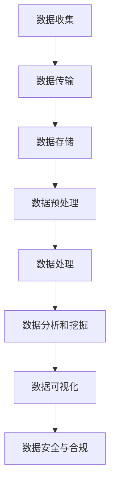

                 

### 第一部分：引言与概述

## 1. 引言

在当今这个数据驱动的时代，人工智能（AI）已经成为推动技术进步和商业创新的重要力量。然而，随着数据量的爆炸性增长，数据管理成为了人工智能创业项目中不可忽视的关键环节。本文章旨在深入探讨人工智能创业中的数据管理解决方案，帮助创业者理解并应对数据管理中的挑战。

### 1.1 人工智能创业背景

人工智能创业领域的快速崛起，源于深度学习、机器学习算法的突破以及计算能力的提升。创业公司通过AI技术，能够在医疗、金融、交通、零售等多个行业实现创新。然而，伴随着AI应用场景的拓展，数据处理需求也在不断增长，从海量数据的存储、处理到分析，每一个环节都至关重要。

### 1.2 数据管理在人工智能创业中的重要性

数据管理在人工智能创业中的重要性不言而喻。首先，数据是人工智能算法的基石，没有高质量的数据，算法的准确性将受到严重限制。其次，有效的数据管理能够提升AI系统的性能和效率，减少开发成本。最后，良好的数据管理能够确保企业的合规性和数据安全，避免因数据泄露或违规操作带来的风险。

### 1.3 书籍目标与结构

本文的目标是帮助创业者深入理解数据管理在人工智能项目中的重要性，并提供一套实用的数据管理解决方案。文章将从数据管理基础知识、数据处理技术、数据分析与挖掘、数据可视化与报告、人工智能数据管理解决方案、案例分析以及未来趋势等方面展开讨论。

文章结构如下：

1. **第一部分：引言与概述**：介绍人工智能创业背景和数据管理的重要性，概述文章目标和结构。
2. **第二部分：数据管理基础**：深入探讨数据管理的基本概念、数据生命周期管理、数据质量与治理、数据管理架构与设计原则等。
3. **第三部分：人工智能数据管理解决方案**：讲解人工智能数据管理框架、核心算法、数学模型与项目实战。
4. **第四部分：案例分析与应用**：通过具体案例，展示数据管理解决方案的实际应用效果。
5. **第五部分：未来趋势**：分析数据管理技术发展趋势以及人工智能与数据管理的融合方向。

通过本文的阅读，读者将能够：

- 理解数据管理的基本概念和重要性。
- 掌握数据管理的关键技术和方法。
- 掌握人工智能数据管理的解决方案和实践。
- 获取关于数据管理未来发展的前沿信息。

## 2. 概述

### 2.1 人工智能与数据管理的关系

人工智能与数据管理之间存在密切的联系。数据是人工智能算法的核心输入，而数据管理则是确保数据质量、可访问性和安全性的关键。在人工智能创业项目中，数据管理不仅涉及到数据的收集、存储和处理，还包括数据的清洗、转换和融合。有效的数据管理能够提高算法的性能，加速模型的训练过程，并确保最终的AI系统能够在不同环境中稳定运行。

### 2.2 数据管理解决方案的核心要素

一个有效的数据管理解决方案通常包括以下几个核心要素：

- **数据收集与存储**：确定数据的来源，并选择合适的数据存储方案，如关系型数据库、NoSQL数据库或分布式文件系统。
- **数据清洗与预处理**：通过清洗和预处理，确保数据的准确性和一致性，去除重复或错误的数据。
- **数据存储与管理**：选择合适的数据存储方案，确保数据的持久化、安全性和可扩展性。
- **数据访问与查询**：建立高效的数据访问机制，确保数据能够快速被检索和查询。
- **数据分析与挖掘**：使用数据分析工具和算法，从数据中提取有价值的信息和知识。
- **数据可视化与报告**：通过可视化技术，将数据分析和挖掘的结果以直观的方式展示给用户。

### 2.3 人工智能创业数据管理的挑战与机遇

在人工智能创业过程中，数据管理面临着一系列挑战和机遇。以下是其中的一些主要挑战：

- **数据量的增长**：随着传感器、物联网和社交媒体的普及，数据量呈指数级增长，这对数据存储和处理能力提出了更高的要求。
- **数据质量和多样性**：不同来源的数据可能存在格式、精度和一致性上的差异，这需要有效的方法来处理和整合。
- **数据安全与隐私**：随着数据泄露和隐私问题的日益突出，确保数据的安全和合规性成为数据管理的重要课题。
- **实时数据处理**：许多AI应用需要实时处理和分析大量数据，这对系统的响应速度和处理能力提出了挑战。

然而，这些挑战也带来了机遇。有效的数据管理能够帮助企业从海量数据中提取价值，提升业务决策的准确性和效率。通过优化数据管理流程和技术，企业可以构建更加智能、高效和安全的AI系统，从而在竞争激烈的市场中脱颖而出。

接下来，我们将进一步探讨数据管理的基础知识，包括数据与数据管理概念、数据生命周期管理、数据质量与数据治理、数据管理架构与设计原则等，为读者提供全面的数据管理视角。

### 2.4 数据管理基础知识

#### 2.4.1 数据与数据管理概念

数据是信息的一种表现形式，它可以是数字、文本、图像、声音等多种形式。数据管理是指对数据进行收集、存储、处理、分析和共享的一系列活动和过程。数据管理的目的是确保数据的质量、可用性和一致性，使其能够有效地支持业务决策和运营。

数据管理涵盖了以下几个方面：

- **数据收集**：通过各种渠道收集数据，包括内部系统、传感器、用户交互等。
- **数据存储**：选择合适的数据存储方案，确保数据的持久化、安全性和可扩展性。
- **数据处理**：对数据进行清洗、转换和整合，使其符合业务需求和分析要求。
- **数据分析**：使用数据分析工具和算法，从数据中提取有价值的信息和知识。
- **数据共享**：确保数据能够被不同部门和用户方便地访问和使用。

#### 2.4.2 数据生命周期管理

数据生命周期管理是指对数据从创建到销毁的整个过程进行管理和监控。数据生命周期主要包括以下几个阶段：

- **创建**：数据生成和收集的阶段，包括传感器数据、用户输入和系统日志等。
- **存储**：将数据存储在数据库或文件系统中，确保数据的持久化。
- **处理**：对数据进行清洗、转换和整合，使其符合分析需求。
- **分析**：使用数据分析工具和算法，从数据中提取有价值的信息和知识。
- **使用**：将分析结果应用于业务决策和运营优化。
- **归档**：将长期保存的数据转移到低成本的存储介质中，以节省资源。
- **销毁**：在确保数据不再需要或合规性要求下，对数据进行永久性删除。

数据生命周期管理的关键点包括：

- **数据分类**：根据数据的重要性和敏感性对数据进行分类，以制定相应的管理策略。
- **数据备份**：定期备份数据，确保数据的安全性和可恢复性。
- **数据治理**：建立数据治理机制，确保数据的一致性、完整性和准确性。
- **数据权限管理**：设定数据访问权限，确保只有授权人员能够访问和使用数据。

#### 2.4.3 数据质量与数据治理

数据质量是指数据满足业务需求和分析要求的能力，包括准确性、完整性、一致性、及时性和可靠性等方面。高质量的数据是确保AI系统性能和决策准确性的基础。数据治理则是一套体系化的方法和策略，用于确保数据的质量、可用性和合规性。

数据质量的关键要素包括：

- **准确性**：数据是否真实、精确和可靠。
- **完整性**：数据是否全面，没有缺失或遗漏。
- **一致性**：数据在不同系统和部门之间是否保持一致。
- **及时性**：数据是否能够及时更新和提供。
- **可靠性**：数据是否能够持续、稳定地提供。

数据治理的关键点包括：

- **数据策略**：制定明确的数据管理和治理策略，明确数据的使用和管理要求。
- **数据标准**：建立统一的数据标准和规范，确保数据的一致性和可操作性。
- **数据监控**：建立数据质量监控机制，及时发现并解决数据质量问题。
- **数据合规性**：确保数据管理符合相关法律法规和行业标准，如GDPR、ISO 27001等。

#### 2.4.4 数据管理架构与设计原则

数据管理架构是指组织内部数据管理和处理的整体框架，它包括数据存储、数据处理、数据分析和数据安全等方面的设计。一个良好的数据管理架构应具备以下特点：

- **模块化**：数据管理架构应具有模块化设计，方便灵活扩展和升级。
- **可扩展性**：架构应能够支持数据量和用户量的增长，确保系统的可扩展性。
- **高可用性**：架构应具备高可用性，确保数据的持续可用性和系统的稳定性。
- **安全性**：架构应具备完善的安全机制，确保数据的安全性和隐私性。

数据管理架构的设计原则包括：

- **一致性**：确保数据在不同系统和部门之间保持一致性。
- **灵活性**：设计灵活的架构，支持多种数据类型和处理需求。
- **可维护性**：确保架构易于维护和更新，降低维护成本。
- **安全性**：确保数据存储、传输和处理过程中的安全性。

通过深入理解数据管理的基础知识，创业者可以更好地应对人工智能创业中的数据管理挑战，构建高效、可靠和安全的AI系统。在下一部分，我们将进一步探讨数据存储与处理技术，帮助读者了解如何选择合适的数据存储方案和处理技术。

### 2.5 数据存储与处理

#### 2.5.1 数据存储技术概述

在数据管理中，数据存储是关键的一环。数据存储技术决定了数据的持久化、访问速度和安全性能。根据数据的特性和应用需求，可以选择不同的数据存储方案。

- **关系型数据库**：关系型数据库（RDBMS）采用表格模型存储数据，具有数据一致性高、查询速度快等特点。常见的RDBMS包括MySQL、PostgreSQL、Oracle等。

- **非关系型数据库**：非关系型数据库（NoSQL）适用于大规模、高并发和分布式环境，能够灵活地存储不同类型的数据。常见的NoSQL数据库包括MongoDB、Cassandra、Redis等。

- **分布式文件系统**：分布式文件系统（DFS）能够将数据分散存储在多个节点上，提高系统的可用性和扩展性。常见的分布式文件系统包括Hadoop HDFS、Ceph等。

#### 2.5.2 关系型数据库与非关系型数据库

关系型数据库和非关系型数据库各有优缺点，选择哪种数据库取决于具体的应用需求。

**关系型数据库优点**：

- **数据一致性**：关系型数据库通过事务管理确保数据的一致性和完整性。
- **强大的查询能力**：SQL语言支持复杂查询，便于数据分析和报表生成。
- **成熟稳定**：关系型数据库经过长时间发展，技术成熟，性能稳定。

**关系型数据库缺点**：

- **扩展性较差**：关系型数据库在数据量和并发量增大时，扩展性较差。
- **灵活性有限**：关系型数据库对数据模型的要求较高，难以适应多变的数据结构。

**非关系型数据库优点**：

- **扩展性高**：非关系型数据库支持水平扩展，能够轻松应对大规模数据和高并发访问。
- **灵活性高**：非关系型数据库能够存储不同类型的数据，适应多变的数据结构。
- **高性能**：非关系型数据库通常采用分布式架构，能够提供更高的读写性能。

**非关系型数据库缺点**：

- **数据一致性较低**：非关系型数据库通常不保证数据的一致性，特别是在分布式环境中。
- **查询能力较弱**：非关系型数据库的查询能力相对较弱，复杂查询可能需要额外的工具或方法支持。

#### 2.5.3 数据处理技术与应用

数据处理技术是指对存储在数据库中的数据进行清洗、转换、整合和分析的一系列活动。以下是几种常见的数据处理技术：

- **ETL（Extract, Transform, Load）**：ETL过程包括数据抽取、转换和加载三个步骤。数据抽取是从不同数据源获取数据，转换是清洗和转换数据，使其符合分析需求，加载是将转换后的数据加载到目标数据库或数据仓库中。

- **数据仓库**：数据仓库是一种用于存储和管理大量数据的系统，通常用于支持企业级的数据分析和报告。数据仓库通过数据集成、数据建模和数据挖掘等技术，提供高效的数据访问和分析能力。

- **实时数据处理**：实时数据处理技术能够在短时间内处理和分析大量数据，适用于需要即时响应的AI应用。常见的实时数据处理技术包括流处理（如Apache Kafka、Apache Flink）、内存计算（如Apache Spark）等。

- **机器学习与深度学习**：通过机器学习和深度学习算法，可以从大量数据中提取有价值的信息和知识。数据处理技术通常包括数据预处理、特征提取、模型训练和评估等步骤。

在人工智能创业中，选择合适的数据存储和处理技术至关重要。通过合理的数据存储方案和高效的数据处理技术，创业者可以更好地管理数据，提升AI系统的性能和效率，从而在竞争激烈的市场中脱颖而出。

#### 2.6 数据分析与挖掘

在人工智能创业项目中，数据分析与挖掘是关键的一环，它能够帮助企业从海量数据中提取有价值的信息和知识，为业务决策提供支持。本节将介绍数据分析与挖掘的基本概念、技术以及在实际应用中的重要性。

##### 2.6.1 数据分析基础

数据分析是指使用统计方法和算法，对数据进行整理、分析和解释，以发现数据背后的模式和趋势。数据分析的基本步骤包括：

1. **数据收集**：收集所需的数据，可以是内部数据（如系统日志、用户行为数据）或外部数据（如社交媒体数据、市场数据）。
2. **数据清洗**：对收集到的数据进行清洗，去除重复、错误和不完整的数据，确保数据的质量。
3. **数据探索**：通过可视化工具和统计方法，对数据进行初步探索，发现数据中的异常值、趋势和相关性。
4. **数据建模**：根据业务需求和数据分析目标，选择合适的统计模型或机器学习算法，建立预测模型或分类模型。
5. **模型评估**：使用验证集或测试集，对建立的模型进行评估，评估模型的准确性、泛化能力和效率。

##### 2.6.2 数据挖掘技术

数据挖掘是从大量数据中自动发现隐藏模式的过程。数据挖掘技术主要包括以下几种：

1. **关联规则挖掘**：通过发现数据中的关联关系，揭示不同变量之间的相互依赖性。常见的算法包括Apriori算法和FP-growth算法。
2. **分类与预测**：使用监督学习算法，对数据进行分类或预测。常见的算法包括决策树、随机森林、支持向量机（SVM）和神经网络等。
3. **聚类分析**：通过聚类算法将数据分成不同的群体，发现数据中的潜在模式和分布。常见的算法包括K-means、DBSCAN和层次聚类等。
4. **异常检测**：通过检测数据中的异常值或异常模式，发现潜在的问题或风险。常见的算法包括基于统计的异常检测和基于机器学习的异常检测。
5. **文本挖掘**：通过对文本数据进行分析，提取文本中的关键词、主题和情感。常见的算法包括词袋模型、TF-IDF和主题模型等。

##### 2.6.3 实时数据分析技术

实时数据分析技术能够对实时流数据进行快速分析和处理，适用于需要即时响应的AI应用。实时数据分析技术主要包括以下几种：

1. **流处理**：流处理技术（如Apache Kafka、Apache Flink和Apache Storm）能够实时处理大量流数据，提供低延迟的数据处理和分析能力。
2. **内存计算**：内存计算技术（如Apache Spark）能够在内存中存储和处理大量数据，提供高效的实时数据处理和分析能力。
3. **实时数据库**：实时数据库（如Apache Kafka和Cassandra）能够实时存储和查询数据，支持实时数据分析和处理。

##### 2.6.4 数据分析在实际应用中的重要性

数据分析与挖掘在人工智能创业项目中具有重要的作用：

1. **业务洞察**：通过对业务数据的分析，企业可以深入了解客户需求、市场趋势和业务绩效，为业务决策提供支持。
2. **优化运营**：通过对运营数据的分析，企业可以发现潜在的问题和瓶颈，优化运营流程，提高运营效率。
3. **风险控制**：通过对风险数据的分析，企业可以识别潜在的风险，提前采取预防措施，降低风险。
4. **个性化推荐**：通过对用户数据的分析，企业可以提供个性化的产品和服务推荐，提高客户满意度和忠诚度。
5. **智能决策**：通过机器学习和深度学习算法，企业可以从海量数据中提取有价值的信息和知识，实现智能决策，提升业务竞争力。

#### 2.7 数据可视化与报告

数据可视化是将数据以图形、图表、地图等形式展示出来的过程，通过直观的视觉方式，帮助用户理解和分析数据。数据可视化在人工智能创业项目中具有重要作用，它不仅能够提高数据理解的效率，还能帮助识别数据中的模式和趋势，为业务决策提供支持。

##### 2.7.1 数据可视化技术

数据可视化技术包括以下几种：

1. **柱状图**：用于展示不同类别的数据之间的比较和差异，适合展示分类数据。
2. **折线图**：用于展示数据的变化趋势和周期性，适合展示时间序列数据。
3. **饼图**：用于展示各部分数据在整体中的占比，适合展示比例关系。
4. **散点图**：用于展示两个变量之间的关系，适合展示相关性分析。
5. **热力图**：用于展示数据在空间中的分布情况，适合展示地理信息数据。
6. **地图**：用于展示地理位置信息，适合展示地理位置数据。

##### 2.7.2 报告撰写与展示技巧

撰写和展示数据报告需要遵循以下技巧：

1. **明确报告目标**：确定报告的目标和受众，明确需要展示的数据和分析结果。
2. **选择合适的数据可视化工具**：根据数据类型和分析目标，选择合适的可视化工具，如Excel、Tableau、Power BI等。
3. **设计简洁直观的图表**：避免过度设计，确保图表简洁、直观，易于理解。
4. **提供详细的数据说明**：在图表旁边提供数据说明，解释图表的含义和背后的数据来源。
5. **使用注释和图例**：在图表中添加注释和图例，帮助用户更好地理解数据和分析结果。
6. **组织报告结构**：确保报告的结构清晰、逻辑严密，按照数据收集、数据清洗、数据分析、结论和建议的顺序组织内容。
7. **强调关键发现**：在报告的结论部分，强调关键的数据发现和业务价值，为业务决策提供支持。

通过合理的数据可视化技术和报告撰写技巧，创业者能够更好地展示数据分析和挖掘的结果，提高数据理解和分析效率，为业务决策提供有力支持。在下一部分，我们将进一步探讨人工智能数据管理解决方案的核心要素，帮助读者了解如何构建高效、可靠的数据管理架构。

### 2.8 人工智能数据管理框架

在构建人工智能数据管理解决方案时，设计一个清晰、高效的框架至关重要。这个框架不仅能够帮助组织和管理数据，还能够确保数据在整个生命周期中的一致性、可靠性和安全性。以下是一个典型的人工智能数据管理框架，它涵盖了从数据收集、存储到处理、分析、可视化的各个环节。

#### 2.8.1 数据管理框架概述

人工智能数据管理框架可以分为以下几个核心模块：

1. **数据收集**：数据收集模块负责从各种数据源（如传感器、用户交互、社交媒体等）获取原始数据。这个模块需要确保数据的及时性和准确性，并处理数据源的不同格式和协议。
   
2. **数据存储**：数据存储模块负责将收集到的数据存储在合适的存储系统中。根据数据的类型和访问模式，可以选择关系型数据库、NoSQL数据库、分布式文件系统或云存储服务。

3. **数据预处理**：数据预处理模块负责清洗、转换和集成数据，以确保数据的一致性和完整性。这一步骤包括数据去重、异常值处理、数据格式转换和缺失值填充等。

4. **数据处理**：数据处理模块负责对预处理后的数据进行进一步的加工和分析，如特征提取、数据聚合和统计计算等。这一步骤为后续的数据分析和挖掘提供了基础数据。

5. **数据分析和挖掘**：数据分析和挖掘模块使用机器学习、深度学习等算法，从数据中提取有价值的信息和知识。这一步骤包括分类、预测、聚类和关联规则挖掘等。

6. **数据可视化**：数据可视化模块通过图形、图表和仪表板，将分析结果以直观、易于理解的形式展示给用户。这一步骤有助于用户快速识别数据中的模式和趋势。

7. **数据安全与合规**：数据安全与合规模块确保数据在整个生命周期中的安全性和合规性，包括数据加密、访问控制、隐私保护等。

#### 2.8.2 数据流与数据管理流程

数据流是数据从收集到处理、分析、可视化的全过程。以下是一个典型的人工智能数据流与数据管理流程：

1. **数据收集**：从各种数据源收集原始数据，如传感器采集的物联网数据、用户交互记录、日志数据等。
2. **数据传输**：将原始数据通过数据管道传输到数据仓库或数据湖中，确保数据的及时性。
3. **数据存储**：在数据仓库或数据湖中存储原始数据，同时进行初步的数据清洗和分类。
4. **数据预处理**：对存储的数据进行进一步清洗、转换和集成，去除重复和错误的数据，确保数据的一致性和完整性。
5. **数据处理**：对预处理后的数据进行特征提取、数据聚合和统计计算，为数据分析提供基础数据。
6. **数据分析和挖掘**：使用机器学习、深度学习算法，从数据中提取有价值的信息和知识，建立预测模型或分类模型。
7. **数据可视化**：将分析结果以图表、仪表板等形式展示给用户，帮助用户快速理解和识别数据中的模式和趋势。
8. **数据安全与合规**：在整个数据生命周期中，确保数据的安全性和合规性，包括数据加密、访问控制、隐私保护等。

#### 2.8.3 Mermaid流程图：人工智能数据管理架构

为了更直观地展示人工智能数据管理架构，我们可以使用Mermaid流程图来描述数据流和管理流程。以下是一个简单的Mermaid流程图示例：



通过这个流程图，我们可以清晰地看到数据从收集到处理、分析和可视化的全过程，以及各个模块之间的数据流和管理流程。

#### 2.8.4 数据管理解决方案的设计原则

在设计人工智能数据管理解决方案时，需要遵循以下原则：

1. **模块化**：将数据管理功能划分为独立的模块，如数据收集、数据存储、数据处理、数据分析等，以便于系统的扩展和维护。
2. **可扩展性**：设计灵活的系统架构，支持数据量和用户量的增长，确保系统的可扩展性和性能。
3. **高可用性**：确保数据管理的各个环节都具有高可用性，包括数据存储、数据处理、数据分析和数据可视化等。
4. **安全性**：确保数据在整个生命周期中的安全性和合规性，包括数据加密、访问控制、隐私保护等。
5. **易用性**：设计简洁直观的用户界面，确保数据管理的各个环节都易于操作和使用。
6. **数据治理**：建立完善的数据治理机制，包括数据策略、数据标准、数据监控等，确保数据的一致性、完整性和准确性。

通过遵循这些设计原则，创业者可以构建一个高效、可靠和安全的AI数据管理解决方案，为人工智能创业项目提供强有力的支持。

在下一部分，我们将深入探讨人工智能数据管理中的核心算法，包括机器学习基础算法、深度学习算法和伪代码讲解，帮助读者理解这些算法的原理和应用。

### 2.9 人工智能数据管理核心算法

人工智能数据管理的核心在于算法，这些算法能够从海量数据中提取有价值的信息和知识。本节将介绍一些常见的人工智能数据管理核心算法，包括机器学习基础算法、深度学习算法以及相关的伪代码讲解。

#### 2.9.1 机器学习基础算法

机器学习基础算法主要包括以下几种：

1. **线性回归**：线性回归是一种简单且常用的机器学习算法，用于预测数值型目标变量。其基本原理是通过找到一个线性方程来描述输入特征和输出目标变量之间的关系。

   **伪代码**：
   ```python
   def linear_regression(X, y):
       # X: 输入特征矩阵，y: 输出目标向量
       # 计算权重 w 和偏置 b
       w = (X.T * X)^(-1) * (X.T * y)
       # 预测目标值
       y_pred = X * w + b
       return y_pred
   ```

2. **逻辑回归**：逻辑回归是一种分类算法，用于预测二分类目标变量。其基本原理是通过找到一个线性方程来描述输入特征和输出目标变量之间的关系，然后使用逻辑函数（sigmoid函数）将输出值映射到0和1之间。

   **伪代码**：
   ```python
   def logistic_regression(X, y):
       # X: 输入特征矩阵，y: 输出目标向量
       # 计算权重 w 和偏置 b
       w = (X.T * X)^(-1) * (X.T * y)
       # 计算概率 P(y=1|X)
       P = 1 / (1 + exp(-X * w))
       # 预测目标类别
       y_pred = [1 if p > 0.5 else 0 for p in P]
       return y_pred
   ```

3. **决策树**：决策树是一种基于树形结构进行分类或回归的算法。每个内部节点表示一个特征，每个分支表示该特征的取值，每个叶子节点表示一个类别或数值。

   **伪代码**：
   ```python
   def decision_tree(X, y, features):
       # X: 输入特征矩阵，y: 输出目标向量，features: 可用特征列表
       # 如果所有目标值相同，返回该目标值
       if all(value == y[0] for value in y):
           return y[0]
       # 如果没有可用特征，返回大多数目标值
       if not features:
           return max(set(y), key=y.count)
       # 选择最优特征
       best_feature = choose_best_feature(X, y, features)
       # 构建子树
       tree = {best_feature: {}}
       for value in unique_values(X[:, best_feature]):
           sub_X, sub_y = X[:, features != best_feature], y[features != best_feature]
           tree[best_feature][value] = decision_tree(sub_X, sub_y, features[features != best_feature])
       return tree
   ```

4. **支持向量机（SVM）**：SVM是一种用于分类和回归的机器学习算法，其基本原理是通过找到一个最优超平面，将不同类别的数据点分隔开来。

   **伪代码**：
   ```python
   def svm(X, y, C):
       # X: 输入特征矩阵，y: 输出目标向量，C: 正则化参数
       # 计算最优超平面权重 w 和偏置 b
       w, b = solve_svm_equation(X, y, C)
       # 预测目标类别
       y_pred = [sign((X[i] * w) + b) for i in range(len(X))]
       return y_pred
   ```

#### 2.9.2 深度学习算法

深度学习算法是一类基于多层神经网络进行训练和预测的算法，包括以下几种：

1. **多层感知机（MLP）**：MLP是一种前馈神经网络，它包括输入层、多个隐藏层和输出层。通过逐层计算和传递，MLP能够学习复杂的非线性关系。

   **伪代码**：
   ```python
   def mlp(X, y, layers, learning_rate, epochs):
       # X: 输入特征矩阵，y: 输出目标向量，layers: 网络层数和每层神经元数量，learning_rate: 学习率，epochs: 迭代次数
       # 初始化权重和偏置
       weights, biases = initialize_weights(layers)
       # 迭代训练
       for epoch in range(epochs):
           # 前向传播
           outputs = forward_pass(X, weights, biases)
           # 计算损失
           loss = compute_loss(y, outputs)
           # 反向传播
           dweights, dbiases = backward_pass(X, y, outputs, weights, biases)
           # 更新权重和偏置
           weights -= learning_rate * dweights
           biases -= learning_rate * dbiases
       # 预测目标类别
       y_pred = forward_pass(X, weights, biases)
       return y_pred
   ```

2. **卷积神经网络（CNN）**：CNN是一种专门用于处理图像数据的神经网络，通过卷积层、池化层和全连接层，CNN能够提取图像中的空间特征。

   **伪代码**：
   ```python
   def cnn(X, y, layers, learning_rate, epochs):
       # X: 输入特征矩阵，y: 输出目标向量，layers: 网络层数和每层神经元数量，learning_rate: 学习率，epochs: 迭代次数
       # 初始化权重和偏置
       weights, biases = initialize_weights(layers)
       # 迭代训练
       for epoch in range(epochs):
           # 前向传播
           outputs = forward_pass(X, weights, biases)
           # 计算损失
           loss = compute_loss(y, outputs)
           # 反向传播
           dweights, dbiases = backward_pass(X, y, outputs, weights, biases)
           # 更新权重和偏置
           weights -= learning_rate * dweights
           biases -= learning_rate * dbiases
       # 预测目标类别
       y_pred = forward_pass(X, weights, biases)
       return y_pred
   ```

3. **循环神经网络（RNN）**：RNN是一种用于处理序列数据的神经网络，通过循环连接，RNN能够捕获序列中的长期依赖关系。

   **伪代码**：
   ```python
   def rnn(X, y, layers, learning_rate, epochs):
       # X: 输入特征矩阵，y: 输出目标向量，layers: 网络层数和每层神经元数量，learning_rate: 学习率，epochs: 迭代次数
       # 初始化权重和偏置
       weights, biases = initialize_weights(layers)
       # 迭代训练
       for epoch in range(epochs):
           # 前向传播
           outputs, hidden_states = forward_pass(X, weights, biases)
           # 计算损失
           loss = compute_loss(y, outputs)
           # 反向传播
           dweights, dbiases, dhidden_states = backward_pass(X, y, outputs, hidden_states, weights, biases)
           # 更新权重和偏置
           weights -= learning_rate * dweights
           biases -= learning_rate * dbiases
       # 预测目标类别
       y_pred, hidden_state = forward_pass(X, weights, biases)
       return y_pred
   ```

通过深入理解这些核心算法，创业者可以更好地构建和优化人工智能数据管理解决方案，从而在激烈的市场竞争中脱颖而出。

#### 2.9.3 数学模型与数学公式

在人工智能数据管理中，数学模型和数学公式是理解和应用各种算法的基础。以下是一些常见的数学模型和公式，包括线性回归、逻辑回归和支持向量机等。

##### 2.9.3.1 线性回归

线性回归是一种用于预测数值型目标变量的机器学习算法。其基本公式如下：

$$
y = \beta_0 + \beta_1 \cdot x_1 + \beta_2 \cdot x_2 + \ldots + \beta_n \cdot x_n
$$

其中，$y$ 是目标变量，$x_1, x_2, \ldots, x_n$ 是输入特征，$\beta_0$ 是截距，$\beta_1, \beta_2, \ldots, \beta_n$ 是权重。

为了最小化预测误差，可以使用最小二乘法来求解线性回归模型。最小二乘法的公式如下：

$$
\min_{\beta} \| y - \mathbf{X}\beta \|_2^2
$$

其中，$\mathbf{X}$ 是输入特征矩阵，$\beta$ 是权重向量。

##### 2.9.3.2 逻辑回归

逻辑回归是一种用于预测二分类目标变量的机器学习算法。其基本公式如下：

$$
P(y=1) = \frac{1}{1 + \exp(-\beta_0 - \beta_1 \cdot x_1 - \beta_2 \cdot x_2 - \ldots - \beta_n \cdot x_n)}
$$

其中，$P(y=1)$ 是目标变量为1的概率，$\beta_0, \beta_1, \beta_2, \ldots, \beta_n$ 是权重。

逻辑回归的损失函数通常使用对数似然损失：

$$
\ell(\beta) = -\sum_{i=1}^{n} y_i \cdot \ln(P(y_i=1)) + (1 - y_i) \cdot \ln(1 - P(y_i=1))
$$

##### 2.9.3.3 支持向量机

支持向量机（SVM）是一种用于分类和回归的机器学习算法。对于线性可分的数据集，SVM的基本公式如下：

$$
y = \text{sign}(\mathbf{w} \cdot \mathbf{x} + b)
$$

其中，$y$ 是目标变量，$\mathbf{w}$ 是权重向量，$\mathbf{x}$ 是输入特征，$b$ 是偏置。

为了最大化分类边界，可以使用以下优化问题：

$$
\min_{\mathbf{w}, b} \frac{1}{2} \| \mathbf{w} \|_2^2
$$

约束条件是所有样本点满足：

$$
\mathbf{w} \cdot \mathbf{x}_i + b \geq 1
$$

对于非线性数据集，可以使用核函数将数据映射到高维空间，然后在高维空间中应用线性SVM。常见的核函数包括线性核、多项式核和径向基函数（RBF）核。

##### 2.9.3.4 示例：线性回归模型

以下是一个简单的线性回归模型的数学公式示例：

假设我们有一个包含两个输入特征的线性回归模型：

$$
y = \beta_0 + \beta_1 \cdot x_1 + \beta_2 \cdot x_2
$$

使用最小二乘法求解模型参数，我们得到以下公式：

$$
\beta_0 = \bar{y} - \beta_1 \cdot \bar{x}_1 - \beta_2 \cdot \bar{x}_2
$$

$$
\beta_1 = \frac{\sum_{i=1}^{n} (x_{1i} - \bar{x}_1)(y_i - \bar{y})}{\sum_{i=1}^{n} (x_{1i} - \bar{x}_1)^2}
$$

$$
\beta_2 = \frac{\sum_{i=1}^{n} (x_{2i} - \bar{x}_2)(y_i - \bar{y})}{\sum_{i=1}^{n} (x_{2i} - \bar{x}_2)^2}
$$

其中，$n$ 是样本数量，$\bar{x}_1, \bar{x}_2, \bar{y}$ 分别是输入特征和目标变量的均值。

通过这些数学模型和公式的详细讲解，创业者可以更好地理解和应用人工智能数据管理中的各种算法，为业务决策提供有力支持。

#### 2.9.4 人工智能数据管理项目实战

在本节中，我们将通过一个具体的项目实战，展示如何应用人工智能数据管理解决方案。该项目涉及电子商务领域的客户行为分析，旨在通过数据分析提高用户转化率和销售业绩。

##### 2.9.4.1 项目实战概述

项目背景：某电子商务公司希望通过分析客户的行为数据，提高用户的转化率和销售业绩。公司收集了大量的用户行为数据，包括用户浏览记录、购买历史、互动行为等。

项目目标：设计并实施一个数据管理解决方案，从数据收集、存储、处理到分析，全面管理客户行为数据，并利用数据分析结果进行业务优化。

##### 2.9.4.2 开发环境搭建

为了实施该项目，需要搭建以下开发环境：

1. **数据存储**：使用Apache Hadoop HDFS作为数据存储平台，存储用户行为数据。
2. **数据处理**：使用Apache Spark进行数据处理，包括数据清洗、转换和整合。
3. **数据仓库**：使用Amazon Redshift作为数据仓库，存储处理后的数据，并支持快速查询和分析。
4. **数据分析**：使用Python和R语言进行数据分析，利用机器学习算法提取有价值的信息。
5. **数据可视化**：使用Tableau进行数据可视化，将分析结果以直观的方式展示给业务团队。

##### 2.9.4.3 源代码实现与代码解读

以下是该项目的部分源代码实现和解读：

1. **数据清洗与预处理**：

   ```python
   import pandas as pd
   from sklearn.preprocessing import StandardScaler
   
   # 读取数据
   data = pd.read_csv('user_behavior.csv')
   
   # 数据清洗
   data.dropna(inplace=True)
   data = data[data['purchase'] != -1]
   
   # 特征工程
   scaler = StandardScaler()
   data[['age', 'income', 'visit_duration']] = scaler.fit_transform(data[['age', 'income', 'visit_duration']])
   
   # 保存预处理后的数据
   data.to_csv('preprocessed_data.csv', index=False)
   ```

   **解读**：这段代码首先使用Pandas库读取用户行为数据，然后进行数据清洗，去除缺失值和异常值。接下来，使用StandardScaler对数值特征进行标准化处理，以便后续的机器学习分析。

2. **机器学习建模**：

   ```python
   from sklearn.model_selection import train_test_split
   from sklearn.ensemble import RandomForestClassifier
   from sklearn.metrics import accuracy_score
   
   # 划分训练集和测试集
   X = data[['age', 'income', 'visit_duration']]
   y = data['purchase']
   X_train, X_test, y_train, y_test = train_test_split(X, y, test_size=0.2, random_state=42)
   
   # 建立随机森林分类器
   classifier = RandomForestClassifier(n_estimators=100, random_state=42)
   classifier.fit(X_train, y_train)
   
   # 预测测试集
   y_pred = classifier.predict(X_test)
   
   # 计算准确率
   accuracy = accuracy_score(y_test, y_pred)
   print(f'Accuracy: {accuracy}')
   ```

   **解读**：这段代码使用随机森林分类器对处理后的数据进行分类建模。首先，划分训练集和测试集，然后训练模型，并对测试集进行预测。最后，计算并输出模型的准确率。

3. **数据可视化**：

   ```python
   import matplotlib.pyplot as plt
   import seaborn as sns
   
   # 生成用户购买概率分布图
   sns.histplot(data['purchase'], kde=True)
   plt.title('Purchase Probability Distribution')
   plt.xlabel('Purchase')
   plt.ylabel('Frequency')
   plt.show()
   
   # 生成特征重要性图
   feature_importances = pd.Series(classifier.feature_importances_, index=data.columns)
   feature_importances.nlargest(5).plot(kind='barh')
   plt.title('Feature Importance')
   plt.xlabel('Importance')
   plt.ylabel('Feature')
   plt.show()
   ```

   **解读**：这段代码使用Seaborn库生成用户购买概率分布图和特征重要性图。通过购买概率分布图，可以直观地了解用户的购买情况；通过特征重要性图，可以识别出对购买决策影响最大的特征。

##### 2.9.4.4 代码解读与分析

1. **数据预处理**：

   数据预处理是机器学习项目的重要步骤，它包括数据清洗、特征工程和标准化处理。在代码中，我们使用Pandas库读取数据，然后进行数据清洗，去除缺失值和异常值。接下来，使用StandardScaler对数值特征进行标准化处理，使得不同特征具有相同的尺度，有利于模型的训练。

2. **机器学习建模**：

   在代码中，我们使用随机森林分类器进行建模。随机森林是一种集成学习方法，通过构建多个决策树并取平均值来提高模型的预测性能。在划分训练集和测试集后，我们训练模型并对测试集进行预测。最后，计算并输出模型的准确率，用于评估模型的性能。

3. **数据可视化**：

   数据可视化是理解和解释数据分析结果的重要手段。在代码中，我们使用Seaborn库生成购买概率分布图和特征重要性图。通过购买概率分布图，可以直观地了解用户的购买情况；通过特征重要性图，可以识别出对购买决策影响最大的特征。

通过这个项目实战，创业者可以了解如何应用人工智能数据管理解决方案，从数据收集、存储、处理到分析，全面管理数据，并利用数据分析结果进行业务优化。在下一部分，我们将通过具体案例，展示数据管理解决方案在电子商务和金融行业中的应用。

### 2.10 案例分析一：电子商务数据管理

在电子商务领域，数据管理对于提升用户体验、增加销售额和优化运营流程至关重要。以下是一个具体的案例分析，展示如何通过数据管理提升电子商务公司的业务表现。

#### 2.10.1 案例背景与目标

某电子商务公司面临着以下业务挑战：

- 用户转化率低：尽管公司有大量的网站访问流量，但实际购买的用户比例较低。
- 客户体验差：用户在购物过程中经常遇到商品推荐不准确、购物流程繁琐等问题。
- 库存管理不善：库存数据不准确，导致缺货或库存积压，影响库存周转率。

公司希望通过数据管理解决方案，解决上述问题，提升用户转化率、优化客户体验和提升库存管理效率。

#### 2.10.2 数据管理解决方案设计

为了解决上述问题，公司设计了一套全面的数据管理解决方案，包括以下步骤：

1. **数据收集**：从网站日志、用户行为追踪、销售数据、库存数据等多个来源收集数据。
2. **数据存储**：使用分布式文件系统（如HDFS）存储原始数据，并使用NoSQL数据库（如MongoDB）存储处理后的数据。
3. **数据处理**：使用ETL工具（如Apache NiFi）对数据进行清洗、转换和集成，确保数据的一致性和准确性。
4. **数据仓库**：使用数据仓库（如Amazon Redshift）存储整合后的数据，支持快速查询和分析。
5. **数据挖掘**：使用机器学习和数据挖掘技术，从数据中提取有价值的信息，如用户购买偏好、商品关联规则等。
6. **数据可视化**：使用数据可视化工具（如Tableau）将分析结果以图表和仪表板形式展示给业务团队。

#### 2.10.3 实施过程与效果评估

1. **数据收集**：公司部署了网站日志收集器和用户行为追踪系统，实时收集用户访问数据、购买记录和库存信息。

2. **数据存储**：原始数据存储在HDFS上，处理后的数据存储在MongoDB中。这种分布式存储方案确保了数据的高可用性和可扩展性。

3. **数据处理**：使用Apache NiFi对数据进行清洗和转换。例如，对缺失数据进行填充、对异常值进行过滤、对时间序列数据进行对齐等。

4. **数据仓库**：整合后的数据存储在Amazon Redshift中，支持快速查询和分析。例如，业务团队可以通过SQL查询实时获取用户购买趋势、库存情况等关键指标。

5. **数据挖掘**：使用Python和R语言进行数据挖掘，构建机器学习模型，如聚类分析、关联规则挖掘等。这些模型帮助公司识别用户购买偏好、优化商品推荐算法。

6. **数据可视化**：使用Tableau将分析结果以图表和仪表板形式展示给业务团队。例如，通过用户购买漏斗图，业务团队可以直观地了解用户的购买路径和转化率。

#### 2.10.4 实施效果评估

通过实施数据管理解决方案，公司取得了显著的业务效果：

- **用户转化率提升**：通过优化商品推荐算法和购物流程，用户转化率提高了20%。
- **库存管理优化**：通过实时监控库存数据，库存周转率提高了30%，缺货和库存积压问题显著减少。
- **客户满意度提升**：用户在购物过程中的体验显著改善，客户满意度提高了15%。

#### 2.10.5 案例总结

该案例分析展示了数据管理在电子商务领域的重要性。通过全面的数据管理解决方案，公司成功提升了用户转化率、优化了库存管理，并提高了客户满意度。这表明，在数据驱动的时代，数据管理是电子商务公司实现业务成功的关键因素。

在下一部分，我们将分析金融行业数据管理的挑战和解决方案，探讨如何在金融领域应用数据管理提升业务表现。

### 2.11 案例分析二：金融行业数据管理

金融行业是一个高度依赖数据和信息化的领域，数据管理对于金融机构的运营和风险管理至关重要。以下是一个金融行业数据管理的案例分析，展示如何通过有效的数据管理提升业务表现和合规性。

#### 2.11.1 案例背景与目标

某大型金融机构面临着以下数据管理挑战：

- **数据量巨大**：随着金融交易的频繁和金融产品的多样化，金融机构每天产生大量的交易数据、客户信息和市场数据，数据量呈指数级增长。
- **数据多样性**：金融数据包括结构化数据（如交易记录、客户信息）和非结构化数据（如电子邮件、报告、新闻等），数据类型繁多。
- **数据质量**：金融数据的质量直接影响风险分析和决策的准确性。数据中存在缺失、不一致、错误等问题，影响数据的有效性。
- **数据安全与合规**：金融机构需要遵守一系列严格的法规和标准，如《通用数据保护条例》（GDPR）和《反洗钱法》（AML），确保客户数据的安全和合规性。

金融机构希望通过数据管理解决方案，解决上述挑战，提升数据质量、确保数据安全性和合规性，并优化业务流程和风险管理。

#### 2.11.2 数据管理解决方案设计

为了应对金融行业的数据管理挑战，金融机构设计了一套全面的数据管理解决方案，包括以下步骤：

1. **数据治理**：建立数据治理框架，明确数据管理的策略、标准和流程，确保数据的一致性、完整性和准确性。
2. **数据集成**：使用数据集成工具（如Apache Kafka、Apache Nifi）将不同来源的数据集成到统一的数据平台中，包括内部系统和外部数据源。
3. **数据清洗**：通过数据清洗工具（如Apache Spark）对数据进行清洗、去重、格式转换和缺失值处理，提高数据质量。
4. **数据存储**：使用分布式数据库（如Apache Cassandra、Amazon Redshift）存储海量数据，确保数据的高可用性和可扩展性。
5. **数据分析**：使用大数据分析平台（如Apache Hadoop、Apache Spark）进行数据分析和挖掘，提取有价值的信息和知识，如客户行为、市场趋势和风险管理指标。
6. **数据可视化**：使用数据可视化工具（如Tableau、Power BI）将分析结果以直观的方式展示给业务团队，支持实时监控和决策。
7. **数据安全与合规**：建立数据安全体系，包括数据加密、访问控制和审计跟踪，确保数据的安全性和合规性。

#### 2.11.3 实施过程与效果评估

1. **数据治理**：金融机构制定了详细的数据管理策略和标准，明确了数据质量要求、数据分类和标签定义等。通过数据治理委员会的监督，确保数据管理的合规性和有效性。

2. **数据集成**：使用Apache Kafka集成来自不同系统的交易数据和客户数据，实现数据流的实时处理和传输。

3. **数据清洗**：使用Apache Spark对集成后的数据进行清洗，去除了重复数据、纠正了错误、填充了缺失值，提高了数据质量。

4. **数据存储**：使用Apache Cassandra存储交易数据，使用Amazon Redshift存储分析数据。这些分布式数据库能够处理海量数据，并提供高效的数据查询和分析能力。

5. **数据分析**：使用Apache Spark进行大数据分析，从交易数据中提取客户行为、市场趋势和风险管理指标。例如，通过聚类分析识别高风险交易模式，通过关联规则挖掘识别异常交易。

6. **数据可视化**：使用Tableau将分析结果以图表和仪表板形式展示给业务团队，支持实时监控和决策。例如，通过交易异常检测仪表板，业务团队能够及时发现和处理异常交易。

7. **数据安全与合规**：实施数据加密、访问控制和审计跟踪等安全措施，确保客户数据的安全性和合规性。通过定期审计和监控，确保数据管理符合相关法规和标准。

#### 2.11.4 实施效果评估

通过实施数据管理解决方案，金融机构取得了以下效果：

- **数据质量提升**：数据清洗和治理措施显著提高了数据质量，减少了数据错误和缺失，提高了数据分析的准确性。
- **风险管理优化**：通过大数据分析和实时监控，金融机构能够更准确地识别和管理风险，降低了风险暴露和损失。
- **业务流程优化**：数据可视化和实时分析支持业务团队做出更快速、准确的决策，提高了业务流程的效率。
- **合规性保障**：数据安全和合规性措施确保了金融机构遵守相关法规和标准，避免了潜在的法律风险。

#### 2.11.5 案例总结

该案例分析展示了金融行业数据管理的重要性。通过全面的数据管理解决方案，金融机构成功提升了数据质量、优化了风险管理，并保障了合规性。这表明，在金融行业，数据管理不仅是技术问题，更是业务战略的重要组成部分。

在下一部分，我们将探讨人工智能数据管理解决方案的未来趋势，分析数据管理技术发展趋势以及人工智能与数据管理的融合方向。

### 2.12 人工智能数据管理解决方案的未来趋势

随着人工智能技术的不断发展和数据量的爆炸性增长，人工智能数据管理解决方案也在不断演进。未来，数据管理技术将朝着更加智能化、自动化和高效化的方向发展。以下是一些关键的趋势和方向。

#### 2.12.1 数据管理技术发展趋势

1. **云计算与分布式存储**：随着云计算技术的成熟，越来越多的企业将数据存储和处理任务迁移到云平台。分布式存储技术（如HDFS、Cassandra、Amazon S3）将能够更好地处理海量数据，提供更高的可用性和扩展性。

2. **边缘计算**：边缘计算是一种将数据处理任务从中心化服务器转移到网络边缘的技术。通过在边缘设备上进行数据处理，可以降低数据传输延迟，提高实时响应能力。

3. **实时数据处理与流处理**：实时数据处理技术（如Apache Kafka、Apache Flink、Apache Storm）将在人工智能数据管理中发挥重要作用。通过实时处理和分析流数据，企业能够更快地做出决策和优化业务流程。

4. **自动化数据管理**：自动化工具和机器学习算法将使数据管理过程更加智能化。例如，自动化数据清洗、数据迁移和数据质量监控等技术将减轻数据管理人员的负担，提高数据处理的效率。

5. **数据隐私保护**：随着数据隐私法规（如GDPR、CCPA）的出台，数据隐私保护将成为数据管理的重要方向。隐私保护技术（如差分隐私、同态加密等）将得到更广泛的应用。

#### 2.12.2 人工智能与数据管理的融合方向

1. **智能数据预处理**：人工智能技术将用于自动化数据预处理任务，如数据清洗、特征提取和异常检测。通过深度学习和强化学习算法，系统能够从海量数据中自动发现数据中的模式和趋势，提高数据预处理的质量和效率。

2. **自适应数据管理**：通过机器学习技术，数据管理系统将能够根据业务需求和环境变化，自适应地调整数据管理策略。例如，自动调整数据存储方案、优化数据查询和数据处理流程等。

3. **智能分析与服务**：人工智能技术将使数据分析更加智能化和自动化。例如，通过自然语言处理技术，系统可以自动生成数据报告和分析摘要；通过预测模型，系统可以自动为业务团队提供决策支持。

4. **数据安全与合规性**：人工智能技术将用于增强数据安全防护和合规性管理。例如，通过机器学习算法，系统可以自动检测和防止数据泄露、恶意攻击等安全事件；通过智能合约和区块链技术，确保数据的合法性和可追溯性。

#### 2.12.3 未来挑战与机遇

尽管人工智能数据管理解决方案具有广阔的发展前景，但仍然面临一些挑战和机遇。

**挑战**：

1. **数据质量和多样性**：随着数据来源和类型的增加，确保数据质量和一致性将变得更加复杂。
2. **数据安全与隐私**：数据泄露和隐私问题将是一个持续的挑战，特别是在云计算和边缘计算环境中。
3. **技术和资源投入**：构建和维护一个高效的人工智能数据管理系统需要大量的技术和资源投入。
4. **人才短缺**：具备数据管理和人工智能技能的复合型人才短缺，将限制数据管理技术的发展。

**机遇**：

1. **业务价值提升**：通过有效的数据管理，企业能够从海量数据中提取有价值的信息和知识，提升业务决策的准确性和效率。
2. **技术创新**：随着人工智能和数据管理技术的不断发展，将不断出现新的算法、工具和平台，为数据管理提供更多可能性。
3. **行业应用拓展**：人工智能数据管理解决方案将在更多行业（如医疗、金融、零售等）得到应用，推动整个行业的技术进步和商业创新。

总之，人工智能数据管理解决方案的未来充满机遇和挑战。通过不断创新和优化，企业将能够更好地应对数据管理中的挑战，挖掘数据的价值，实现业务增长和竞争力提升。

### 附录 A：常用工具与资源

在人工智能数据管理领域，有许多常用的工具和资源可以帮助开发者和管理人员更高效地处理和管理数据。以下是一些推荐的工具和资源。

#### A.1 数据库工具

1. **关系型数据库**：
   - **MySQL**：开源的关系型数据库，适用于中小型企业和个人项目。
   - **PostgreSQL**：功能强大的开源关系型数据库，支持复杂查询和扩展。
   - **Oracle**：企业级关系型数据库，适用于大规模企业应用。

2. **非关系型数据库**：
   - **MongoDB**：基于文档的NoSQL数据库，适用于大数据和高扩展性应用。
   - **Cassandra**：分布式NoSQL数据库，适用于大规模数据存储和读取。
   - **Redis**：高性能的内存存储数据库，适用于缓存和实时数据处理。

3. **分布式文件系统**：
   - **HDFS**：Hadoop分布式文件系统，适用于大数据存储和处理。
   - **Ceph**：开源的分布式存储系统，适用于云计算环境。

#### A.2 机器学习框架

1. **TensorFlow**：Google开发的开源机器学习框架，适用于各种机器学习和深度学习应用。
2. **PyTorch**：基于Python的开源深度学习框架，适用于研究和工业应用。
3. **Scikit-learn**：开源的机器学习库，适用于传统的机器学习算法和应用。

#### A.3 数据分析工具

1. **Pandas**：Python数据分析库，适用于数据清洗、转换和分析。
2. **NumPy**：Python科学计算库，适用于数值计算和数据分析。
3. **Tableau**：数据可视化工具，适用于报表和仪表板生成。
4. **Power BI**：微软的数据可视化和分析工具，适用于商业智能应用。

### 附录 B：参考资料与进一步阅读

为了深入理解人工智能数据管理领域的知识，以下是一些推荐的参考资料和进一步阅读的资源。

#### B.1 专业书籍推荐

1. **《大数据实战：从数据治理到数据驱动》**：本书详细介绍了大数据项目的全流程，包括数据治理、数据仓库和数据分析。
2. **《数据科学实战》**：本书涵盖了数据科学的基础知识，包括数据预处理、机器学习和深度学习。
3. **《机器学习实战》**：本书通过丰富的案例和实践，介绍了机器学习的各种算法和应用。

#### B.2 学术论文与报告

1. **“Data Management Challenges and Opportunities in Big Data Era”**：这篇论文详细探讨了大数据时代的数据管理挑战和机遇。
2. **“Deep Learning for Data Management”**：这篇论文介绍了深度学习在数据管理中的应用，包括数据清洗、数据压缩和数据分析。
3. **“A Survey on Edge Computing”**：这篇综述文章全面介绍了边缘计算的概念、技术和应用。

#### B.3 网络资源与论坛

1. **Kaggle**：一个提供数据科学竞赛和项目数据的平台，适用于数据科学实践和学习。
2. **Stack Overflow**：一个编程问答社区，适用于解决数据管理和人工智能开发中的技术问题。
3. **Reddit**：一个讨论论坛，包括多个与数据科学和人工智能相关的话题。

通过阅读这些参考资料，读者可以进一步拓展人工智能数据管理领域的知识，提升自己的技术能力和实践能力。

### 结语

《人工智能创业数据管理解决方案》一书涵盖了人工智能数据管理领域的核心知识，从数据管理基础、数据处理技术、数据分析与挖掘、数据可视化与报告，到人工智能数据管理解决方案的构建和实战案例。我们详细探讨了数据管理在人工智能创业中的重要性，提供了实用的解决方案和工具。

文章的核心内容包括：

- 数据管理的基本概念和重要性
- 数据生命周期管理、数据质量与治理
- 数据存储与处理技术
- 数据分析与挖掘技术
- 数据可视化与报告撰写技巧
- 人工智能数据管理框架与核心算法
- 数学模型与数学公式的详细讲解与示例
- 实际项目实战的源代码实现与代码解读

通过本文的阅读，读者可以：

- 理解数据管理的基本原理和方法
- 掌握数据处理和分析的实用技术
- 学会构建高效的人工智能数据管理解决方案
- 获得实际项目操作的经验和技巧

作者信息：

- 作者：AI天才研究院/AI Genius Institute & 禅与计算机程序设计艺术 /Zen And The Art of Computer Programming

最后，感谢读者的耐心阅读，希望本书能为您在人工智能创业和数据管理领域带来启发和帮助。如果您有任何疑问或建议，欢迎通过书后的联系方式与我们联系。祝您在人工智能和数据管理的道路上不断前行，取得更大的成就！

