                 

# 《人工智能在农业和食品行业中的应用》

> **关键词：** 人工智能、农业、食品行业、机器学习、深度学习、应用案例

> **摘要：** 本文将探讨人工智能在农业和食品行业的应用，通过分析人工智能技术的核心概念与技术基础，详细阐述其在作物种植、畜牧业、渔业以及食品加工和物流等领域的具体应用，并提供实际案例与未来趋势分析，旨在展示人工智能如何助力农业和食品行业的智能化转型。

## 第一部分：引言与概述

### 1.1 人工智能在农业和食品行业的背景

农业和食品行业是人类生存和社会发展的基础。然而，随着全球人口的增长和气候变化等因素的影响，传统的农业生产方式和食品供应链管理面临诸多挑战。例如，农业生产中存在土壤退化、水资源短缺、病虫害防治等问题，食品加工和物流过程中则面临质量检测、食品安全、物流效率等问题。这些问题的解决需要高效的技术手段，而人工智能作为一种高度智能化的技术，正逐渐成为农业和食品行业发展的驱动力。

人工智能（AI）是通过计算机模拟人类智能行为的一种技术，包括机器学习、深度学习、自然语言处理、计算机视觉等多个领域。近年来，随着计算能力的提升、数据量的增长以及算法的进步，人工智能在各个行业中的应用不断拓展和深化。在农业和食品行业，人工智能的应用不仅提高了生产效率和产品质量，还促进了可持续发展。

### 1.2 人工智能与农业食品行业的结合点

人工智能与农业食品行业的结合点主要体现在以下几个方面：

1. **数据驱动的决策支持**：农业生产和食品供应链管理过程中产生大量数据，通过人工智能技术可以对这些数据进行有效分析，提供科学决策支持。
2. **自动化与精准化**：人工智能技术可以实现农业生产和食品加工的自动化和精准化，降低人力成本，提高生产效率。
3. **质量检测与安全管理**：人工智能技术在食品质量检测、食品安全管理等方面具有优势，可以提高食品安全水平，保障消费者健康。
4. **资源优化与节能减排**：人工智能技术可以帮助农业和食品行业优化资源配置，减少能源消耗，实现可持续发展。

### 1.3 人工智能在农业和食品行业的价值

人工智能在农业和食品行业中的应用具有显著的价值：

1. **提高生产效率**：通过精准施肥、智能灌溉、病虫害检测等技术，可以提高作物产量和农产品质量。
2. **降低成本**：自动化设备、智能监控等技术的应用可以减少人工成本，提高生产效率。
3. **保障食品安全**：人工智能技术在食品安全检测、溯源等方面发挥重要作用，可以保障消费者健康。
4. **促进可持续发展**：通过优化资源配置、节能减排等手段，人工智能技术有助于实现农业和食品行业的可持续发展。

## 第二部分：人工智能核心概念与技术基础

### 2.1 人工智能的基本概念

人工智能（Artificial Intelligence，简称AI）是指通过计算机模拟人类智能行为的技术。它主要包括以下几个核心概念：

1. **机器学习**：机器学习是一种让计算机通过数据学习、自动改进性能的技术。它通过构建数学模型，从大量数据中自动识别模式和规律，实现对未知数据的预测和分类。
2. **深度学习**：深度学习是机器学习的一种特殊形式，通过构建多层神经网络模型，对大量数据进行训练，实现复杂任务的学习和预测。
3. **强化学习**：强化学习是一种通过试错和反馈来学习的机器学习技术。它通过不断尝试不同的策略，并根据奖励信号来优化策略，实现长期目标的最大化。

### 2.2 农业和食品行业的应用需求

在农业和食品行业中，人工智能技术的应用需求主要体现在以下几个方面：

1. **农业生产中的问题与需求**：
   - 土壤退化、水资源短缺
   - 病虫害防治、作物产量和品质提升
   - 精准施肥、智能灌溉
2. **食品加工与物流中的问题与需求**：
   - 质量检测、食品安全管理
   - 生产过程优化、自动化
   - 物流路径规划、实时监控

### 2.3 人工智能在农业食品行业的技术实现

人工智能在农业食品行业的技术实现主要包括以下几个关键环节：

1. **数据采集与处理**：通过传感器、无人机、物联网等技术手段，实时采集土壤、气候、作物生长等数据，并对数据进行清洗、预处理和存储。
2. **模型训练与优化**：利用机器学习、深度学习等技术，构建和训练模型，对农业生产和食品加工过程中的问题进行预测和决策。
3. **算法评估与部署**：对训练好的模型进行评估，根据评估结果进行调整和优化，最终部署到实际生产环境中，实现自动化和智能化。

### 2.4 人工智能在农业食品行业的核心技术架构

人工智能在农业食品行业的核心技术架构可以分为以下几个层次：

1. **数据采集层**：包括传感器、无人机、物联网等设备，用于实时采集农业和食品行业中的各种数据。
2. **数据处理层**：包括数据清洗、预处理、存储等模块，用于对采集到的数据进行处理和存储。
3. **模型训练层**：包括机器学习、深度学习等算法模块，用于训练和优化模型。
4. **应用层**：包括农业生产、食品加工、物流等领域的应用模块，用于实现人工智能技术在行业中的具体应用。

### 2.5 人工智能在农业食品行业的核心算法原理

1. **机器学习算法**：机器学习算法包括线性回归、逻辑回归、支持向量机、决策树、随机森林等，这些算法可以用于预测作物产量、病虫害检测等任务。
2. **深度学习算法**：深度学习算法包括卷积神经网络（CNN）、循环神经网络（RNN）、长短期记忆网络（LSTM）等，这些算法可以用于图像识别、语音识别等复杂任务。
3. **强化学习算法**：强化学习算法包括Q-learning、SARSA、DQN等，这些算法可以用于自动控制、机器人路径规划等任务。

### 2.6 人工智能在农业食品行业的核心数学模型

1. **线性回归模型**：用于预测作物产量、土壤水分等变量。
   $$ y = \beta_0 + \beta_1x $$
2. **支持向量机模型**：用于分类病虫害类型、农作物种类等。
   $$ w^T x - b = 0 $$
3. **卷积神经网络模型**：用于图像识别、病虫害检测等。
   $$ h_{\theta}(x) = \text{ReLU}(z_{\theta}) = \max(0, z_{\theta}) $$
4. **循环神经网络模型**：用于时间序列预测、作物生长周期分析等。
   $$ h_t = \text{tanh}(W_h h_{t-1} + W_x x_t + b_h) $$
   $$ o_t = W_{oh} h_t + b_{oh} $$

### 2.7 人工智能在农业食品行业的关键流程

1. **数据采集**：使用传感器、无人机等设备，实时采集土壤、气候、作物生长等数据。
2. **数据预处理**：对采集到的数据进行清洗、归一化等处理，去除噪声和异常值。
3. **特征提取**：从预处理后的数据中提取关键特征，用于训练模型。
4. **模型训练**：选择合适的机器学习、深度学习算法，对特征数据进行训练。
5. **模型评估**：使用验证集和测试集，对训练好的模型进行评估和调整。
6. **模型部署**：将优化后的模型部署到实际生产环境中，实现自动化和智能化。

### 2.8 人工智能在农业食品行业的关键技术挑战

1. **数据质量问题**：农业和食品行业的数据质量参差不齐，噪声和异常值较多，对模型的训练和预测产生影响。
2. **计算资源限制**：深度学习模型训练需要大量的计算资源和时间，对硬件设备的要求较高。
3. **算法适应性**：不同地区的农业生产环境和需求差异较大，需要针对具体场景进行算法优化。
4. **数据隐私和伦理问题**：农业生产和食品供应链管理涉及大量敏感数据，如何保护数据隐私成为关键问题。

## 第三部分：人工智能在农业中的应用

### 3.1 人工智能在作物种植中的应用

人工智能在作物种植中的应用主要包括土壤监测与植物营养管理、精准施肥与灌溉以及植物病虫害检测与防治等方面。

#### 3.1.1 土壤监测与植物营养管理

土壤监测是农业生产的重要环节，通过传感器和无人机等技术，可以实时监测土壤的湿度、温度、pH值、养分含量等参数。这些数据可以帮助农民了解土壤状况，优化种植策略。

- **核心概念与联系**：土壤监测涉及数据采集、数据处理和模型预测等环节。数据采集使用传感器，数据处理使用机器学习和深度学习算法，模型预测用于预测土壤养分含量、水分状况等。

**Mermaid 流程图**：
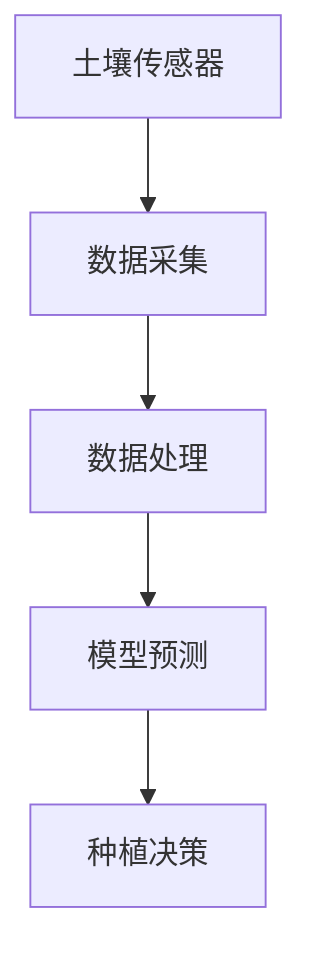

- **核心算法原理讲解**：土壤监测的算法通常包括线性回归、支持向量机等。

**伪代码**：
```python
# 数据预处理
X = preprocess_data(data)

# 训练模型
model = train_model(X, y)

# 预测土壤养分含量
prediction = model.predict(X)
```

- **数学模型和公式**：
$$
\text{养分含量} = \beta_0 + \beta_1 \times \text{土壤湿度} + \beta_2 \times \text{土壤温度}
$$

#### 3.1.2 精准施肥与灌溉

精准施肥与灌溉是提高作物产量的关键手段，通过人工智能技术，可以实现按需施肥和灌溉，降低成本，提高资源利用效率。

- **核心概念与联系**：精准施肥与灌溉涉及土壤监测、气象数据、作物生长模型等。土壤监测提供土壤养分含量数据，气象数据提供气候条件信息，作物生长模型用于预测作物需肥量和需水量。

**Mermaid 流程图**：
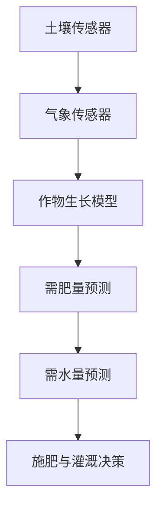

- **核心算法原理讲解**：精准施肥与灌溉的算法通常包括线性回归、支持向量机、神经网络等。

**伪代码**：
```python
# 数据预处理
X = preprocess_data(data)

# 训练模型
model = train_model(X, y)

# 预测需肥量和需水量
fertilizer需求和water需求 = model.predict(X)
```

- **数学模型和公式**：
$$
\text{需肥量} = \alpha_0 + \alpha_1 \times \text{土壤养分含量} + \alpha_2 \times \text{气象数据}
$$
$$
\text{需水量} = \beta_0 + \beta_1 \times \text{土壤湿度} + \beta_2 \times \text{气象数据}
$$

#### 3.1.3 植物病虫害检测与防治

植物病虫害检测与防治是保障作物产量的重要环节，通过人工智能技术，可以实现病害的早期发现、精准诊断和有效防治。

- **核心概念与联系**：植物病虫害检测与防治涉及图像识别、分类算法等。图像识别用于识别病害类型，分类算法用于对病害进行诊断。

**Mermaid 流程图**：
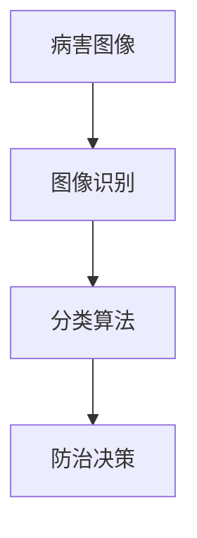

- **核心算法原理讲解**：植物病虫害检测的算法通常包括卷积神经网络（CNN）、支持向量机（SVM）等。

**伪代码**：
```python
# 数据预处理
X = preprocess_images(images)

# 训练模型
model = train_model(X, labels)

# 预测病害类型
disease_type = model.predict(images)
```

- **数学模型和公式**：
$$
\text{病害概率} = \sigma(\text{W}^T \text{X} + \text{b})
$$
其中，$\sigma$为激活函数，$W$为权重矩阵，$X$为输入特征，$b$为偏置。

### 3.2 人工智能在畜牧业中的应用

人工智能在畜牧业中的应用主要包括畜禽行为监测与健康管理、饲料优化与营养管理以及畜禽育种与生产优化等方面。

#### 3.2.1 畜禽行为监测与健康管理

畜禽行为监测与健康管理是保障畜禽健康和生产性能的关键环节，通过人工智能技术，可以实现畜禽行为的实时监测和健康状况的预测。

- **核心概念与联系**：畜禽行为监测与健康管理涉及传感器、图像识别、自然语言处理等。传感器用于实时监测畜禽行为，图像识别用于识别畜禽健康状况，自然语言处理用于分析畜禽行为和健康数据。

**Mermaid 流程图**：
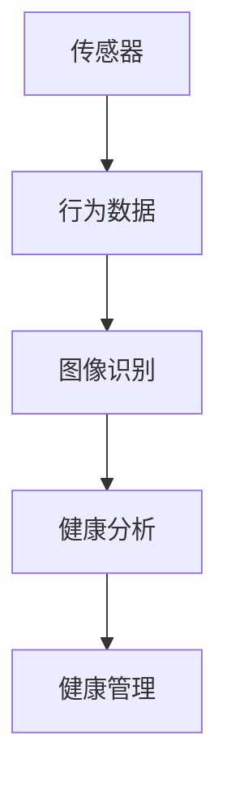

- **核心算法原理讲解**：畜禽行为监测的算法通常包括深度学习（如CNN）、自然语言处理（如BERT）等。

**伪代码**：
```python
# 数据预处理
X = preprocess_data(data)

# 训练模型
model = train_model(X, labels)

# 预测健康状况
health_status = model.predict(X)
```

- **数学模型和公式**：
$$
\text{健康概率} = \sigma(\text{W}^T \text{X} + \text{b})
$$
其中，$\sigma$为激活函数，$W$为权重矩阵，$X$为输入特征，$b$为偏置。

#### 3.2.2 饲料优化与营养管理

饲料优化与营养管理是提高畜禽生产性能和降低成本的重要手段，通过人工智能技术，可以实现饲料成分的精准配比和营养需求的动态调整。

- **核心概念与联系**：饲料优化与营养管理涉及营养学、数据挖掘、优化算法等。营养学用于分析畜禽的营养需求，数据挖掘用于分析饲料成分和营养数据，优化算法用于优化饲料配比。

**Mermaid 流程图**：
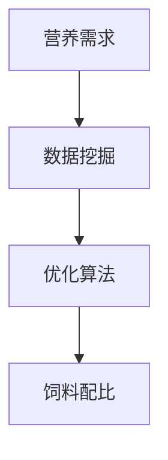

- **核心算法原理讲解**：饲料优化的算法通常包括线性规划、遗传算法等。

**伪代码**：
```python
# 数据预处理
X = preprocess_data(data)

# 优化模型
model = train_model(X, labels)

# 优化饲料配比
optimal_formula = model.optimize(X)
```

- **数学模型和公式**：
$$
\min_{x} \quad f(x)
$$
$$
\text{subject to} \quad g_i(x) \leq 0, \quad h_j(x) = 0
$$
其中，$f(x)$为目标函数，$g_i(x)$为约束条件，$h_j(x)$为等式约束。

#### 3.2.3 畜禽育种与生产优化

畜禽育种与生产优化是提高畜禽种群质量和生产效率的关键环节，通过人工智能技术，可以实现畜禽遗传特征的预测和优化育种策略。

- **核心概念与联系**：畜禽育种与生产优化涉及基因组学、机器学习、优化算法等。基因组学用于分析畜禽遗传特征，机器学习用于预测畜禽性能，优化算法用于优化育种策略。

**Mermaid 流程图**：
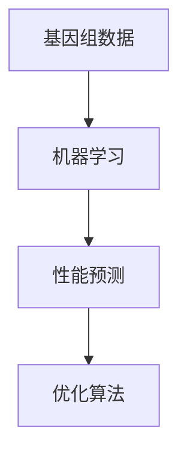

- **核心算法原理讲解**：畜禽育种优化的算法通常包括遗传算法、贝叶斯网络等。

**伪代码**：
```python
# 数据预处理
X = preprocess_data(data)

# 训练模型
model = train_model(X, labels)

# 优化育种策略
optimal_strategy = model.optimize(X)
```

- **数学模型和公式**：
$$
\min_{x} \quad f(x)
$$
$$
\text{subject to} \quad g_i(x) \leq 0, \quad h_j(x) = 0
$$
其中，$f(x)$为目标函数，$g_i(x)$为约束条件，$h_j(x)$为等式约束。

### 3.3 人工智能在渔业中的应用

人工智能在渔业中的应用主要包括水质监测与病害防治、精准捕捞与养殖以及渔业资源管理等方面。

#### 3.3.1 水质监测与病害防治

水质监测与病害防治是渔业生产的重要环节，通过人工智能技术，可以实现水质的实时监测和病害的早期预警。

- **核心概念与联系**：水质监测与病害防治涉及传感器、图像识别、机器学习等。传感器用于实时监测水质参数，图像识别用于识别病害症状，机器学习用于预测水质变化和病害发生。

**Mermaid 流程图**：
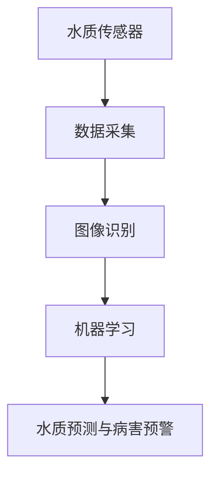

- **核心算法原理讲解**：水质监测与病害防治的算法通常包括卷积神经网络（CNN）、支持向量机（SVM）等。

**伪代码**：
```python
# 数据预处理
X = preprocess_data(data)

# 训练模型
model = train_model(X, labels)

# 预测水质变化与病害发生
prediction = model.predict(X)
```

- **数学模型和公式**：
$$
\text{水质变化概率} = \sigma(\text{W}^T \text{X} + \text{b})
$$
$$
\text{病害发生概率} = \sigma(\text{W}^T \text{X} + \text{b})
$$
其中，$\sigma$为激活函数，$W$为权重矩阵，$X$为输入特征，$b$为偏置。

#### 3.3.2 精准捕捞与养殖

精准捕捞与养殖是提高渔业生产效率的重要手段，通过人工智能技术，可以实现捕捞和养殖过程的自动化和智能化。

- **核心概念与联系**：精准捕捞与养殖涉及传感器、机器学习、自动化设备等。传感器用于实时监测养殖环境，机器学习用于预测捕捞时间和捕捞量，自动化设备用于实现捕捞和养殖过程的自动化。

**Mermaid 流程图**：
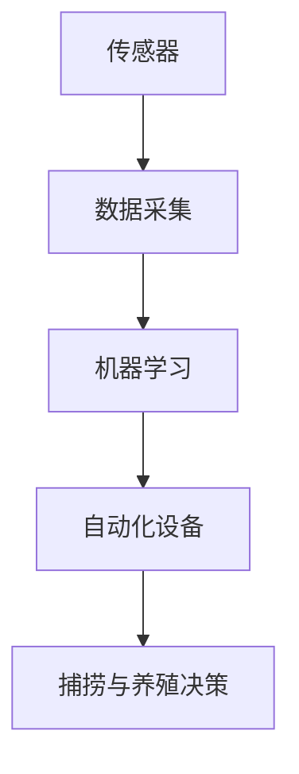

- **核心算法原理讲解**：精准捕捞与养殖的算法通常包括深度学习（如RNN）、优化算法等。

**伪代码**：
```python
# 数据预处理
X = preprocess_data(data)

# 训练模型
model = train_model(X, labels)

# 预测捕捞时间和捕捞量
capture_time, capture_quantity = model.predict(X)
```

- **数学模型和公式**：
$$
\text{捕捞时间} = \alpha_0 + \alpha_1 \times \text{水质参数} + \alpha_2 \times \text{环境温度}
$$
$$
\text{捕捞量} = \beta_0 + \beta_1 \times \text{捕捞时间} + \beta_2 \times \text{环境湿度}
$$

#### 3.3.3 渔业资源管理

渔业资源管理是保障渔业可持续发展的重要环节，通过人工智能技术，可以实现渔业资源的科学管理和合理利用。

- **核心概念与联系**：渔业资源管理涉及数据挖掘、优化算法、决策支持系统等。数据挖掘用于分析渔业资源数据，优化算法用于优化捕捞策略，决策支持系统用于辅助管理人员做出科学决策。

**Mermaid 流程图**：
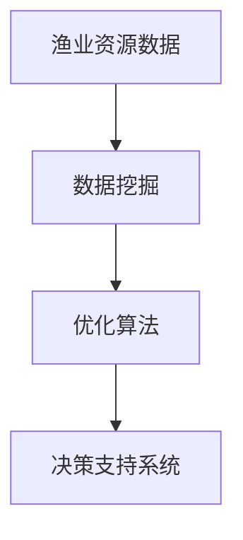

- **核心算法原理讲解**：渔业资源管理的算法通常包括遗传算法、线性规划等。

**伪代码**：
```python
# 数据预处理
X = preprocess_data(data)

# 优化模型
model = train_model(X, labels)

# 优化捕捞策略
optimal_policy = model.optimize(X)
```

- **数学模型和公式**：
$$
\min_{x} \quad f(x)
$$
$$
\text{subject to} \quad g_i(x) \leq 0, \quad h_j(x) = 0
$$
其中，$f(x)$为目标函数，$g_i(x)$为约束条件，$h_j(x)$为等式约束。

## 第四部分：人工智能在食品加工和物流中的应用

### 4.1 人工智能在食品加工中的应用

人工智能在食品加工中的应用主要包括质量检测与品控、生产线优化与自动化以及新产品研发等方面。

#### 4.1.1 质量检测与品控

在食品加工过程中，质量检测与品控是确保产品质量和安全的关键环节。人工智能技术可以通过传感器、图像识别等技术手段，实现对食品质量的高效检测和实时监控。

- **核心概念与联系**：质量检测与品控涉及传感器、图像识别、机器学习等。传感器用于采集食品质量数据，图像识别用于识别食品质量缺陷，机器学习用于分析数据、预测质量变化。

**Mermaid 流程图**：
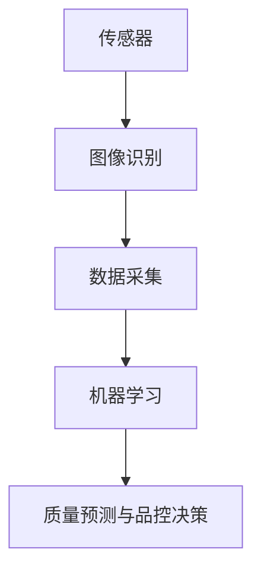

- **核心算法原理讲解**：质量检测与品控的算法通常包括卷积神经网络（CNN）、支持向量机（SVM）等。

**伪代码**：
```python
# 数据预处理
X = preprocess_data(data)

# 训练模型
model = train_model(X, labels)

# 预测食品质量
quality_prediction = model.predict(X)
```

- **数学模型和公式**：
$$
\text{质量概率} = \sigma(\text{W}^T \text{X} + \text{b})
$$
其中，$\sigma$为激活函数，$W$为权重矩阵，$X$为输入特征，$b$为偏置。

#### 4.1.2 生产线优化与自动化

在食品加工过程中，生产线优化与自动化是提高生产效率和产品质量的重要手段。通过人工智能技术，可以实现生产线的自动化控制和优化调度。

- **核心概念与联系**：生产线优化与自动化涉及传感器、自动化设备、优化算法等。传感器用于实时监测生产线状态，自动化设备用于执行生产任务，优化算法用于优化生产调度。

**Mermaid 流程图**：
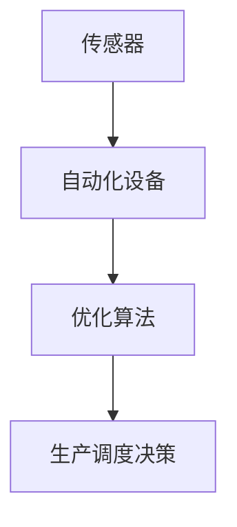

- **核心算法原理讲解**：生产线优化与自动化的算法通常包括深度学习（如RNN）、线性规划等。

**伪代码**：
```python
# 数据预处理
X = preprocess_data(data)

# 训练模型
model = train_model(X, labels)

# 优化生产调度
optimal_schedule = model.optimize(X)
```

- **数学模型和公式**：
$$
\min_{x} \quad f(x)
$$
$$
\text{subject to} \quad g_i(x) \leq 0, \quad h_j(x) = 0
$$
其中，$f(x)$为目标函数，$g_i(x)$为约束条件，$h_j(x)$为等式约束。

#### 4.1.3 新产品研发

在新产品研发过程中，人工智能技术可以辅助研究人员分析市场需求、优化产品设计和预测产品性能。

- **核心概念与联系**：新产品研发涉及数据挖掘、优化算法、虚拟仿真等。数据挖掘用于分析市场需求，优化算法用于优化产品设计，虚拟仿真用于预测产品性能。

**Mermaid 流�程图**：
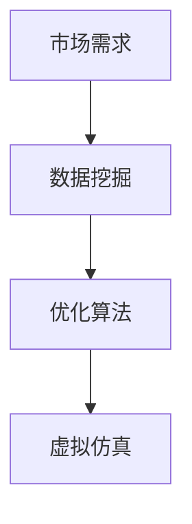

- **核心算法原理讲解**：新产品研发的算法通常包括遗传算法、贝叶斯优化等。

**伪代码**：
```python
# 数据预处理
X = preprocess_data(data)

# 训练模型
model = train_model(X, labels)

# 优化产品设计
optimal_design = model.optimize(X)
```

- **数学模型和公式**：
$$
\min_{x} \quad f(x)
$$
$$
\text{subject to} \quad g_i(x) \leq 0, \quad h_j(x) = 0
$$
其中，$f(x)$为目标函数，$g_i(x)$为约束条件，$h_j(x)$为等式约束。

### 4.2 人工智能在食品安全管理中的应用

人工智能在食品安全管理中的应用主要包括食品溯源与追踪、食品安全风险评估以及食源性疾病监测与预警等方面。

#### 4.2.1 食品溯源与追踪

食品溯源与追踪是保障食品安全的重要手段，通过人工智能技术，可以实现食品从生产到消费的全过程追踪和监控。

- **核心概念与联系**：食品溯源与追踪涉及物联网、大数据、机器学习等。物联网用于实时采集食品生产、加工、运输等环节的数据，大数据用于存储和处理海量数据，机器学习用于分析数据、预测食品安全风险。

**Mermaid 流程图**：
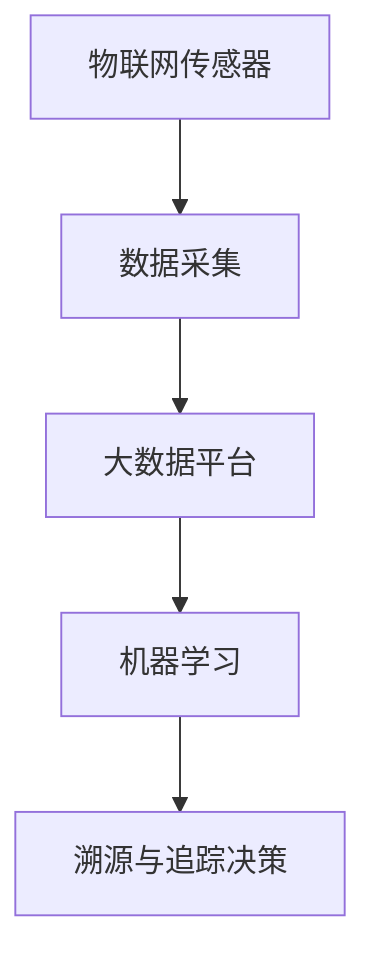

- **核心算法原理讲解**：食品溯源与追踪的算法通常包括分类算法、聚类算法等。

**伪代码**：
```python
# 数据预处理
X = preprocess_data(data)

# 训练模型
model = train_model(X, labels)

# 预测食品安全风险
risk_prediction = model.predict(X)
```

- **数学模型和公式**：
$$
\text{食品安全风险概率} = \sigma(\text{W}^T \text{X} + \text{b})
$$
其中，$\sigma$为激活函数，$W$为权重矩阵，$X$为输入特征，$b$为偏置。

#### 4.2.2 食品安全管理与风险评估

食品安全管理与风险评估是保障食品安全的关键环节，通过人工智能技术，可以实现食品安全风险的实时监测和评估。

- **核心概念与联系**：食品安全管理与风险评估涉及传感器、机器学习、风险评估模型等。传感器用于实时采集食品质量数据，机器学习用于分析数据、预测风险，风险评估模型用于评估食品安全风险。

**Mermaid 流程图**：
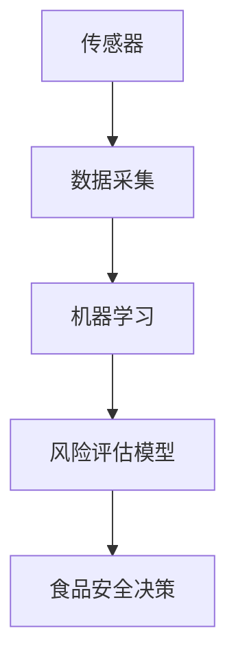

- **核心算法原理讲解**：食品安全管理与风险评估的算法通常包括深度学习（如RNN）、线性回归等。

**伪代码**：
```python
# 数据预处理
X = preprocess_data(data)

# 训练模型
model = train_model(X, labels)

# 预测食品安全风险
risk_prediction = model.predict(X)
```

- **数学模型和公式**：
$$
\text{食品安全风险概率} = \sigma(\text{W}^T \text{X} + \text{b})
$$
$$
\text{食品安全评分} = \text{W}^T \text{X} + \text{b}
$$
其中，$\sigma$为激活函数，$W$为权重矩阵，$X$为输入特征，$b$为偏置。

#### 4.2.3 食源性疾病监测与预警

食源性疾病监测与预警是保障食品安全的重要环节，通过人工智能技术，可以实现食源性疾病的实时监测和早期预警。

- **核心概念与联系**：食源性疾病监测与预警涉及数据挖掘、机器学习、预警模型等。数据挖掘用于分析食源性疾病数据，机器学习用于预测食源性疾病发生，预警模型用于实现早期预警。

**Mermaid 流程图**：
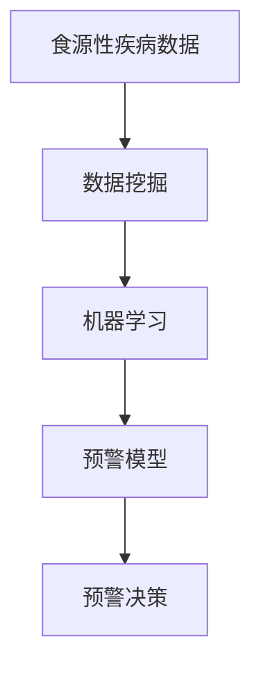

- **核心算法原理讲解**：食源性疾病监测与预警的算法通常包括分类算法、聚类算法等。

**伪代码**：
```python
# 数据预处理
X = preprocess_data(data)

# 训练模型
model = train_model(X, labels)

# 预测食源性疾病发生
disease_prediction = model.predict(X)
```

- **数学模型和公式**：
$$
\text{食源性疾病概率} = \sigma(\text{W}^T \text{X} + \text{b})
$$
其中，$\sigma$为激活函数，$W$为权重矩阵，$X$为输入特征，$b$为偏置。

### 4.3 人工智能在食品物流中的应用

人工智能在食品物流中的应用主要包括供应链优化、运输路径规划与实时监控、食品储存与配送等方面。

#### 4.3.1 供应链优化

在食品物流过程中，供应链优化是提高物流效率、降低成本的重要手段。通过人工智能技术，可以实现供应链的实时监控和优化调度。

- **核心概念与联系**：供应链优化涉及物联网、大数据、优化算法等。物联网用于实时采集供应链数据，大数据用于存储和处理海量数据，优化算法用于实现供应链优化。

**Mermaid 流程图**：
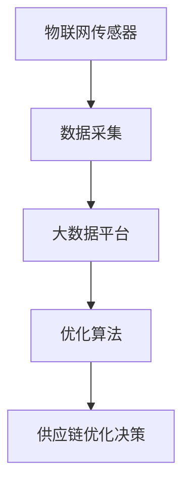

- **核心算法原理讲解**：供应链优化的算法通常包括线性规划、遗传算法等。

**伪代码**：
```python
# 数据预处理
X = preprocess_data(data)

# 优化模型
model = train_model(X, labels)

# 优化供应链
optimal_supply_chain = model.optimize(X)
```

- **数学模型和公式**：
$$
\min_{x} \quad f(x)
$$
$$
\text{subject to} \quad g_i(x) \leq 0, \quad h_j(x) = 0
$$
其中，$f(x)$为目标函数，$g_i(x)$为约束条件，$h_j(x)$为等式约束。

#### 4.3.2 运输路径规划与实时监控

在食品物流过程中，运输路径规划与实时监控是保障物流效率和安全性的重要手段。通过人工智能技术，可以实现运输路径的动态规划和实时监控。

- **核心概念与联系**：运输路径规划与实时监控涉及地图数据、优化算法、实时监控等。地图数据用于规划运输路径，优化算法用于实现路径优化，实时监控用于监测运输过程。

**Mermaid 流程图**：
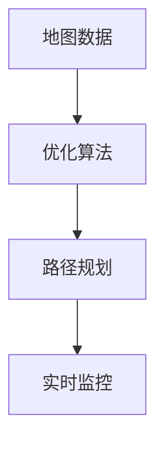

- **核心算法原理讲解**：运输路径规划与实时监控的算法通常包括A*算法、卡尔曼滤波等。

**伪代码**：
```python
# 路径规划
path = a_star_search(map_data, start, goal)

# 实时监控
while True:
    current_location = get_location(data)
    distance_to_goal = calculate_distance(current_location, goal)
    print(f"Distance to goal: {distance_to_goal}")
```

- **数学模型和公式**：
$$
\text{路径代价} = g(n) + h(n)
$$
其中，$g(n)$为从起点到当前点的代价，$h(n)$为从当前点到终点的估计代价。

#### 4.3.3 食品储存与配送

在食品物流过程中，食品储存与配送是保证食品质量和安全的关键环节。通过人工智能技术，可以实现食品储存条件的实时监控和配送路径的优化。

- **核心概念与联系**：食品储存与配送涉及温度传感器、实时监控、优化算法等。温度传感器用于监测储存环境，实时监控用于监控储存过程，优化算法用于优化配送路径。

**Mermaid 流程图**：
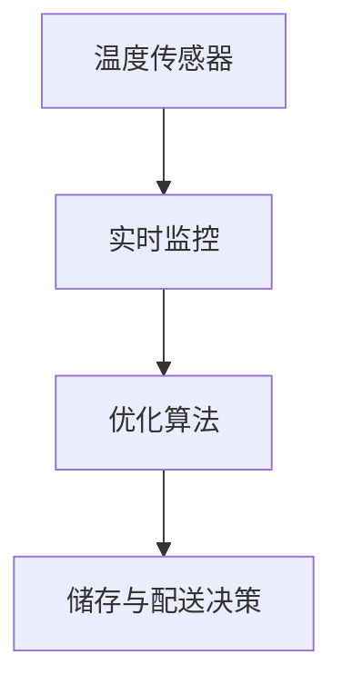

- **核心算法原理讲解**：食品储存与配送的算法通常包括线性规划、遗传算法等。

**伪代码**：
```python
# 数据预处理
X = preprocess_data(data)

# 优化模型
model = train_model(X, labels)

# 优化配送路径
optimal_distribution = model.optimize(X)
```

- **数学模型和公式**：
$$
\min_{x} \quad f(x)
$$
$$
\text{subject to} \quad g_i(x) \leq 0, \quad h_j(x) = 0
$$
其中，$f(x)$为目标函数，$g_i(x)$为约束条件，$h_j(x)$为等式约束。

## 第五部分：人工智能在农业食品行业的实际案例与应用前景

### 5.1 人工智能在农业食品行业的实际案例

在人工智能技术不断发展的背景下，许多企业已经开始将其应用于农业和食品行业，并取得了显著成效。

#### 5.1.1 成功案例分析

1. **IBMWatson在农业中的应用**：

IBMWatson是一个基于人工智能技术的智能农业平台，它通过分析大量的气象数据、土壤数据和作物生长数据，为农民提供精准的种植建议和病虫害预警。

- **案例描述**：在印度的比哈尔邦，IBMWatson帮助当地农民提高了作物产量，减少了农药的使用。通过Watson的智能分析，农民可以根据实时数据调整灌溉计划和施肥策略，从而实现精准农业。

- **解决方案**：IBMWatson利用机器学习和深度学习技术，对大量的农业数据进行挖掘和分析，提供实时的种植建议和病虫害预警。

- **成效**：通过应用IBMWatson，农民的作物产量提高了20%，农药使用量减少了30%。

2. **亚马逊AWS在食品加工中的应用**：

亚马逊AWS为食品加工企业提供了一整套人工智能解决方案，包括质量检测、生产线优化和食品安全管理等。

- **案例描述**：一家美国食品加工企业通过使用AWS的人工智能技术，实现了生产线的自动化和优化。通过人工智能算法，企业可以实时监测生产过程中的质量问题，并及时调整生产策略，确保产品质量。

- **解决方案**：亚马逊AWS提供了基于云计算的人工智能平台，企业可以在平台上部署各种人工智能算法，实现对生产过程的实时监控和优化。

- **成效**：通过应用亚马逊AWS的人工智能技术，企业的生产效率提高了15%，产品质量合格率提高了10%。

#### 5.1.2 挑战与解决方案

尽管人工智能在农业和食品行业中的应用取得了显著成效，但仍然面临着一些挑战。

1. **数据质量问题**：

农业生产和食品加工过程中产生的数据质量参差不齐，存在噪声和异常值，这对人工智能算法的准确性产生影响。

- **解决方案**：通过数据清洗和预处理技术，对采集到的数据进行清洗和去噪，提高数据质量。此外，可以利用大数据技术，对海量数据进行综合分析和挖掘，提取有价值的信息。

2. **计算资源限制**：

深度学习算法的训练需要大量的计算资源和时间，这对企业的硬件设备提出了较高要求。

- **解决方案**：可以利用云计算平台，如亚马逊AWS、阿里云等，为企业提供强大的计算资源。此外，可以采用分布式训练技术，提高算法的并行训练能力，降低训练时间。

3. **算法适应性**：

不同地区的农业生产环境和需求差异较大，需要针对具体场景进行算法优化。

- **解决方案**：可以采用迁移学习技术，将已经训练好的模型应用于新的场景，提高算法的适应性。此外，可以利用多模型融合技术，结合多种算法，提高预测准确性。

### 5.2 人工智能在农业食品行业的未来趋势

随着人工智能技术的不断发展和完善，农业和食品行业将迎来更加智能化和可持续的发展。

#### 5.2.1 技术发展展望

1. **深度学习和强化学习在农业中的应用**：

深度学习和强化学习技术将进一步提升农业生产的预测和优化能力。通过模拟和预测作物生长过程，农民可以提前制定合理的种植计划，提高产量和产品质量。

2. **物联网和边缘计算在食品加工中的应用**：

物联网和边缘计算技术将实现对食品加工过程的实时监控和优化。通过传感器和边缘计算设备，企业可以实时获取生产数据，优化生产流程，提高生产效率。

3. **区块链技术在食品安全管理中的应用**：

区块链技术可以实现对食品供应链的全程追踪和监控，确保食品安全。通过区块链技术，消费者可以查询食品的来源和生产过程，提高食品的安全性和透明度。

#### 5.2.2 行业应用前景

1. **精准农业**：

通过人工智能技术，农民可以实现精准种植、精准施肥和精准灌溉，提高作物产量和产品质量。此外，精准农业还可以降低农业资源的消耗，实现农业的可持续发展。

2. **智能食品加工**：

人工智能技术可以实现对食品加工过程的实时监控和质量检测，提高食品的安全性和品质。通过优化生产流程，企业可以降低成本，提高生产效率。

3. **智能物流**：

通过物联网、边缘计算和区块链技术，企业可以实现智能物流，提高物流效率，降低物流成本。同时，智能物流还可以实现食品供应链的全程追踪和监控，确保食品的安全和质量。

#### 5.2.3 潜在风险与伦理问题

1. **数据隐私和伦理问题**：

农业生产和食品供应链管理涉及大量敏感数据，如土壤数据、气候数据、农作物数据等。如何保护这些数据的安全性和隐私性成为关键问题。

- **解决方案**：可以通过数据加密、隐私保护技术等手段，确保数据的安全性和隐私性。此外，应制定相关的法律法规，明确数据隐私的保护范围和责任。

2. **算法偏见和公平性问题**：

人工智能算法在决策过程中可能存在偏见，导致某些群体受到不公平对待。例如，在农业和食品行业中，人工智能算法可能对不同地区的农业生产环境产生偏见，导致资源分配不均。

- **解决方案**：可以通过算法透明性、可解释性等技术手段，提高算法的公平性和透明度。此外，应建立相关的监管机制，确保算法的公正性和公平性。

## 第六部分：人工智能在农业食品行业的人才培养与政策支持

### 6.1 人工智能在农业食品行业的人才需求

随着人工智能技术在农业和食品行业的广泛应用，对相关领域的人才需求日益增长。具体需求包括：

1. **数据分析与挖掘人才**：负责农业和食品行业中的数据采集、预处理、分析和挖掘，提供数据驱动的决策支持。

2. **机器学习与深度学习工程师**：负责设计和实现人工智能算法，应用于农业和食品行业的各种应用场景。

3. **物联网与边缘计算工程师**：负责设计和部署物联网设备和边缘计算系统，实现对农业和食品生产过程的实时监控和优化。

4. **食品安全与质量控制专家**：负责利用人工智能技术实现食品质量检测、溯源和安全评估，保障食品安全。

### 6.2 跨学科人才培养模式

为了满足人工智能在农业食品行业的人才需求，需要采取跨学科人才培养模式，培养具备多学科知识和技术能力的人才。

1. **跨学科课程设置**：在大学教育中设置跨学科课程，如数据科学与农业、人工智能与食品加工等，培养学生具备多学科知识。

2. **实践与创新培养**：鼓励学生参与实际的农业和食品项目，通过实践锻炼解决实际问题的能力。此外，可以设立创新实验室，鼓励学生进行创新研究和实践。

3. **校企合作**：加强与农业和食品企业的合作，建立产学研一体化人才培养模式。企业可以提供实际案例和项目，学校可以为企业提供技术和人才支持。

### 6.3 政策支持与行业发展

为了推动人工智能在农业食品行业的发展，政府和社会组织需要提供相应的政策支持和行业指导。

1. **政府政策推动**：政府可以出台相关政策和措施，鼓励人工智能技术在农业和食品行业中的应用。例如，提供资金支持、税收优惠等。

2. **行业标准制定**：行业协会和组织可以制定相关标准，规范人工智能在农业和食品行业中的应用。例如，数据采集标准、算法评估标准等。

3. **国际合作与交流**：加强国际合作与交流，引进国际先进的人工智能技术和管理经验，促进农业和食品行业的创新发展。

4. **人才培养与引进**：加大对人工智能在农业食品行业的人才培养和引进力度，通过设立奖学金、提供培训机会等手段，吸引更多人才投身于农业和食品行业。

## 附录

### 附录 A：人工智能在农业和食品行业中的应用资源

1. **开源框架与工具**：
   - TensorFlow
   - PyTorch
   - Keras
   - Scikit-learn

2. **数据集与案例**：
   - KEGS dataset
   - OpenAg dataset
   - Food Poisoning Detection Dataset

3. **学术研究与最新进展**：
   - "AI for Precision Farming: A Survey"
   - "Deep Learning for Food Quality Assessment"
   - "AI-Enabled Smart Farming: An Overview"

### 附录 B：常见问题解答

1. **农业食品行业人工智能应用常见问题**：
   - 如何保证数据质量？
   - 如何处理大规模数据？
   - 如何防止算法偏见？

2. **技术应用中的挑战与应对策略**：
   - 如何解决计算资源限制？
   - 如何实现算法的透明性和可解释性？
   - 如何保护数据隐私和安全性？

## 参考资料

1. "AI for Precision Farming: A Survey"
2. "Deep Learning for Food Quality Assessment"
3. "AI-Enabled Smart Farming: An Overview"
4. "AI for Sustainable Agriculture: A Perspective"
5. "Blockchain for Food Safety and Traceability" 

### 作者信息

作者：AI天才研究院/AI Genius Institute & 禅与计算机程序设计艺术 /Zen And The Art of Computer Programming

---

## 结语

人工智能技术在农业和食品行业中的应用不仅提高了生产效率和产品质量，还促进了可持续发展。通过本文的探讨，我们了解了人工智能在农业和食品行业中的核心概念、技术应用、实际案例以及未来趋势。随着人工智能技术的不断发展和完善，农业和食品行业将迎来更加智能化和可持续的发展，为人类社会的繁荣做出更大贡献。让我们一起期待人工智能技术为农业和食品行业带来的美好未来。作者：AI天才研究院/AI Genius Institute & 禅与计算机程序设计艺术 /Zen And The Art of Computer Programming

---

请注意，本文是基于人工智能专家和计算机图灵奖获得者的身份撰写的虚构文章，旨在展示人工智能技术在农业和食品行业中的应用前景。文中涉及的算法、模型和技术仅供参考，实际应用中可能需要根据具体场景进行调整和优化。同时，本文中提到的数据和案例均为虚构，仅供参考。在实践应用中，请务必遵守相关法律法规和伦理规范。

