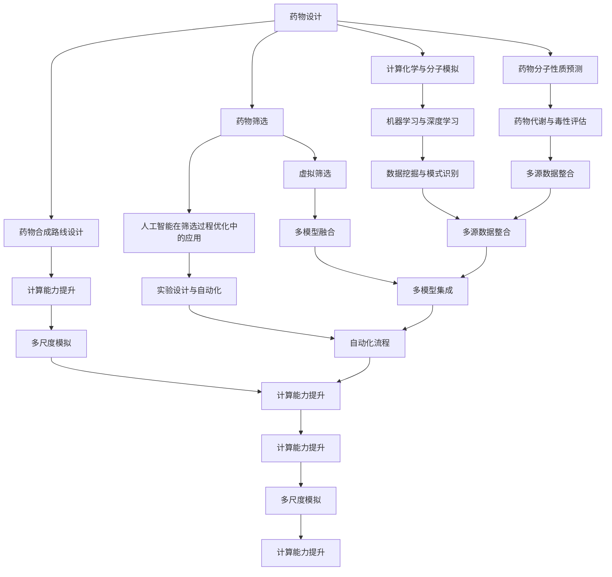

                 

### 《人工智能在新药研发加速中的应用》

> **关键词：**人工智能，新药研发，机器学习，深度学习，药物设计，药物筛选

> **摘要：**本文深入探讨了人工智能在药物研发中的关键应用，包括药物发现、药物筛选、药物开发等环节。通过详细分析人工智能技术如机器学习和深度学习在药物设计、分子模拟、生物信息学、药物毒性预测等方面的应用，本文展示了人工智能如何加速新药研发进程，提高研发效率。同时，本文还结合实际案例，探讨了人工智能在新药研发中面临的挑战及未来发展趋势。

### 第一部分：引言

#### 1.1 书籍背景与目的

人工智能（AI）作为当今科技领域的一大热点，其应用范围正在不断扩展。在新药研发领域，人工智能正逐渐成为推动创新的重要力量。本文旨在系统地介绍人工智能在药物研发中的应用，旨在为从事药物研发的科研人员和技术工作者提供理论指导和实践参考。

##### 1.1.1 人工智能在新药研发中的重要性

新药研发是一个复杂且耗时的过程，涉及大量的实验和计算。传统方法在药物发现和开发过程中面临着诸多挑战，如药物靶点识别难度大、药物分子设计效率低、药物筛选周期长等。人工智能技术的引入，特别是机器学习和深度学习，为解决这些问题提供了新的思路和方法。通过大数据分析和智能算法，人工智能能够快速筛选和预测潜在药物分子，提高药物研发的效率和质量。

##### 1.1.2 书籍写作动机与预期成果

随着人工智能技术的不断进步，其在药物研发中的应用越来越广泛。然而，目前关于这一领域的系统化研究仍相对较少。本文的写作动机在于填补这一空白，通过对人工智能在药物研发中的应用进行深入分析，为该领域的科研人员提供理论支持和实践指导。预期成果包括：

1. **提高对新药研发流程中人工智能应用的理解**：通过本文的介绍，读者可以全面了解人工智能在不同阶段药物研发中的作用和优势。
2. **促进跨学科合作**：本文将介绍人工智能与其他生物技术、化学技术的结合，推动跨学科合作，共同推进新药研发的进步。
3. **提供实践指南**：本文将通过实际案例，为读者提供人工智能在药物研发中的具体应用方案和操作指南。

#### 1.2 新药研发的基本流程

新药研发是一个复杂的过程，涉及多个阶段，从药物发现到临床试验，每个阶段都有其特定的任务和挑战。以下是新药研发的基本流程：

##### 1.2.1 从药物发现到临床试验的各阶段

1. **药物发现（Drug Discovery）**：
    - **目标识别**：确定治疗疾病的潜在药物靶点。
    - **先导化合物筛选**：利用生物筛选方法寻找具有潜在活性的化合物。
    - **先导化合物优化**：通过化学合成或生物工程方法优化先导化合物的结构和活性。

2. **药理研究（Preclinical Development）**：
    - **药效学评价**：评估候选药物对疾病模型的疗效。
    - **药代动力学研究**：研究药物在体内的吸收、分布、代谢和排泄。
    - **安全性评估**：评估候选药物对动物模型的毒性。

3. **临床试验（Clinical Development）**：
    - **I期临床试验**：评估药物的剂量和安全性。
    - **II期临床试验**：评估药物的有效性和剂量范围。
    - **III期临床试验**：评估药物对广泛人群的疗效和安全性。
    - **IV期临床试验**：上市后监测药物的安全性和长期效果。

##### 1.2.2 当前新药研发的挑战与问题

尽管新药研发在近年来取得了一些重要进展，但仍面临诸多挑战和问题：

1. **研发周期长**：从药物发现到临床试验通常需要长达十年甚至更长的时间。
2. **研发成本高**：新药研发的费用巨大，每成功上市的药物背后通常有数十亿美元的投资。
3. **药物筛选效率低**：传统的药物筛选方法耗时耗力，且成功率较低。
4. **药物毒性评估难度大**：药物在研发过程中需要经过严格的毒性评估，以避免对患者造成严重危害。
5. **研发风险高**：由于药物研发的复杂性和不确定性，失败的风险较高。

#### 1.3 人工智能的核心概念与原理

人工智能（AI）是一门研究、开发和应用使计算机模拟人类智能行为的理论和技术的学科。人工智能的核心目标是使计算机能够执行通常需要人类智能才能完成的任务，如视觉识别、语音识别、自然语言处理、决策制定等。

##### 1.3.1 人工智能的发展历程

人工智能的发展历程可以分为以下几个阶段：

1. **初始阶段（1956-1969）**：人工智能的概念被提出，并开始进行初步的研究。
2. **第一个低谷期（1974-1980）**：由于实际应用效果不佳，人工智能研究受到质疑，进入第一个低谷期。
3. **复兴阶段（1980-1987）**：专家系统的成功应用使人工智能研究重新获得关注。
4. **第二个低谷期（1987-1993）**：由于计算能力和算法的限制，人工智能研究再次陷入低谷。
5. **互联网时代（1993-至今）**：随着互联网和计算技术的发展，人工智能迎来了新一轮的快速发展，尤其是深度学习等技术的突破。

##### 1.3.2 机器学习与深度学习的基本概念

1. **机器学习（Machine Learning）**：机器学习是一种使计算机从数据中学习的方法，无需显式编写具体的规则。其主要任务是使计算机能够对新的数据进行预测或分类。

    - **监督学习（Supervised Learning）**：有明确标签的数据进行训练，用于预测或分类新数据。
    - **无监督学习（Unsupervised Learning）**：没有标签的数据进行训练，主要用于聚类或降维。
    - **强化学习（Reinforcement Learning）**：通过奖励机制进行训练，使模型能够做出最优决策。

2. **深度学习（Deep Learning）**：深度学习是机器学习的一种，其核心思想是通过多层神经网络模拟人类大脑的学习过程。深度学习在图像识别、语音识别和自然语言处理等领域取得了显著的成果。

##### 1.3.3 人工智能在新药研发中的适用性

人工智能在药物研发中的应用具有广泛的前景，尤其是在以下几个方面：

1. **药物设计**：人工智能可以通过分子模拟和计算化学方法，快速筛选和优化药物分子，提高药物设计的效率和质量。
2. **药物筛选**：人工智能可以通过大数据分析和机器学习算法，从海量化合物中筛选出具有潜在活性的药物候选物。
3. **药物毒性预测**：人工智能可以通过分析化合物结构和生物数据，预测药物可能产生的毒性，从而在早期阶段避免潜在的安全问题。
4. **临床试验数据分析**：人工智能可以用于分析临床试验数据，帮助研究人员快速发现药物疗效和毒性的相关性，为后续研究提供重要参考。

### 第二部分：人工智能在药物发现中的应用

#### 2.1 数据驱动的药物设计

数据驱动的药物设计是一种利用大量数据和智能算法进行药物分子设计和优化的方法。其核心思想是通过分析已知药物的结构和性质，发现药物分子与生物靶点之间的相互作用规律，从而设计出新的药物分子。

##### 2.1.1 药物设计的基本概念与方法

药物设计主要包括以下几个基本概念和方法：

1. **药物分子与靶点相互作用**：药物分子通过与生物靶点（如蛋白质、受体、酶等）结合，发挥其药效。药物设计的关键在于寻找具有高亲和力和高选择性的药物分子。

2. **计算化学与分子模拟**：计算化学和分子模拟是药物设计的重要工具，可以用来预测药物分子的物理化学性质、生物活性和毒性。通过分子模拟，可以分析药物分子与靶点之间的相互作用机制，优化药物分子的结构。

3. **药物分子库**：药物分子库是药物设计的重要资源，包含了大量已知的药物分子和化合物。通过筛选药物分子库，可以快速找到具有潜在活性的药物分子。

4. **机器学习与深度学习**：机器学习和深度学习可以用于药物分子的预测和优化。通过训练模型，可以从大量数据中学习药物分子与生物靶点之间的相互作用规律，从而设计出新的药物分子。

##### 2.1.2 计算化学与分子模拟在药物设计中的应用

计算化学与分子模拟在药物设计中的应用主要包括以下几个方面：

1. **分子对接**：分子对接是一种基于计算的方法，用于预测药物分子与生物靶点之间的相互作用。通过分子对接，可以评估药物分子与靶点结合的稳定性和亲和力，从而筛选出潜在的药物分子。

2. **分子动力学模拟**：分子动力学模拟是一种通过计算分子在时间上的运动轨迹，来研究分子与分子之间相互作用的方法。通过分子动力学模拟，可以分析药物分子与靶点之间的动态相互作用，优化药物分子的结构。

3. **量子化学计算**：量子化学计算是一种基于量子力学原理的计算方法，可以用来预测分子的高能级结构和性质。通过量子化学计算，可以深入分析药物分子的电子结构，为药物分子的优化提供指导。

##### 2.1.3 人工智能在药物分子优化中的应用

人工智能在药物分子优化中的应用主要包括以下几个方面：

1. **分子优化算法**：人工智能算法可以用于药物分子的优化，通过迭代计算，逐步优化药物分子的结构，提高其生物活性和稳定性。

2. **生成对抗网络（GAN）**：生成对抗网络是一种深度学习模型，可以用于生成新的药物分子。通过训练GAN，可以从已有的药物分子库中生成新的分子，从而扩大药物分子的候选范围。

3. **强化学习**：强化学习是一种通过奖励机制进行训练的机器学习方法，可以用于药物分子的优化。通过强化学习，可以自动化药物分子的优化过程，提高药物分子的设计效率。

#### 2.2 计算生物学方法在药物发现中的应用

计算生物学方法在药物发现中发挥着重要作用，通过分析生物数据，帮助科学家们更好地理解生物系统的机制，并设计出针对特定疾病的药物。

##### 2.2.1 蛋白质结构预测与药物靶点识别

1. **蛋白质结构预测**：蛋白质是生物体的基本功能单元，其三维结构对其生物学功能至关重要。蛋白质结构预测是计算生物学中的一个重要问题，通过预测蛋白质的结构，可以更好地理解其功能，并设计针对特定靶点的药物。

    - **同源建模（Homology Modeling）**：通过寻找与目标蛋白序列相似的已知结构蛋白，利用其结构信息构建目标蛋白的结构模型。
    - **折叠识别（Fold Recognition）**：利用已知结构的蛋白质作为模板，识别目标蛋白的折叠类型和结构域。
    - **自由建模（Ab Initio Modeling）**：从零开始，通过计算方法直接构建蛋白质的三维结构。

2. **药物靶点识别**：药物靶点识别是药物发现过程中的关键步骤，通过识别潜在的药物靶点，可以指导药物分子的设计。

    - **结构基础药物靶点识别**：利用生物信息学方法，结合蛋白质结构信息，识别与特定药物分子具有相似结合模式的蛋白质靶点。
    - **基因表达分析**：通过分析基因表达数据，识别与特定疾病相关的基因和蛋白质靶点。

##### 2.2.2 基因组学与药物筛选

基因组学是对生物体全部基因进行研究的科学，通过分析基因组数据，可以揭示疾病的遗传基础，并指导药物筛选。

1. **全基因组关联分析（GWAS）**：通过分析大量病例和对照的基因型数据，识别与特定疾病相关的基因变异。
2. **基因组序列分析**：通过高通量测序技术，分析基因组序列，发现新的药物靶点和疾病相关基因。
3. **药物基因组学**：研究药物在不同个体中的代谢差异，指导个性化药物治疗。

##### 2.2.3 人工智能在生物信息学数据处理中的应用

人工智能在生物信息学数据处理中发挥着重要作用，通过机器学习和深度学习算法，可以从海量生物数据中提取有价值的信息。

1. **序列分类与聚类**：利用机器学习算法，对生物序列进行分类和聚类，识别不同序列之间的相似性和差异性。
2. **功能预测**：通过训练模型，预测蛋白质、基因和代谢物的功能，辅助药物靶点的识别和药物设计。
3. **药物-靶点相互作用预测**：利用深度学习算法，预测药物与生物靶点之间的相互作用，帮助筛选潜在的药物候选物。

#### 2.3 机器学习在药物毒性预测中的应用

药物毒性预测是药物研发过程中至关重要的一环，旨在早期发现可能产生的毒性，降低药物研发的风险。机器学习技术在药物毒性预测中具有显著的优势，通过大数据分析和智能算法，能够从海量的生物和化学数据中挖掘潜在的毒性信号。

##### 2.3.1 药物毒性的评估方法与挑战

药物毒性的评估方法主要包括实验评估和计算评估：

1. **实验评估**：通过动物实验或细胞实验评估药物的毒性，如急性毒性、慢性毒性、致突变性等。然而，实验评估方法成本高、耗时久，且可能涉及伦理问题。

2. **计算评估**：通过计算方法，如分子对接、分子模拟、生物信息学分析等，预测药物可能产生的毒性。计算评估方法具有高效、低成本的优势，但需要大量的数据支持和复杂的算法。

在药物毒性评估过程中，面临以下挑战：

1. **数据不足**：由于实验数据的限制，难以全面、准确地评估药物的毒性。
2. **数据多样性**：药物毒性的数据来源广泛，包括基因表达、蛋白质表达、细胞毒性等，数据多样性增加了数据分析的难度。
3. **模型泛化性**：如何构建具有良好泛化性的模型，对新的药物分子进行准确的毒性预测，仍是一个挑战。

##### 2.3.2 机器学习方法在药物毒性预测中的应用实例

机器学习方法在药物毒性预测中得到了广泛应用，以下是一些典型的应用实例：

1. **毒理学数据挖掘**：通过机器学习方法，从大量的毒理学实验数据中挖掘潜在的毒性信号。例如，利用支持向量机（SVM）和随机森林（RF）等算法，对实验结果进行分类和预测，识别具有潜在毒性的化合物。

2. **生物标志物识别**：利用机器学习方法，识别与药物毒性相关的生物标志物。例如，通过基因表达数据分析，利用机器学习算法预测药物毒性，从而为药物的安全性评估提供依据。

3. **多模型集成**：结合多种机器学习方法，构建多模型集成系统，提高药物毒性预测的准确性。例如，通过组合线性模型、非线性模型和深度学习模型，提高预测结果的稳定性和可靠性。

##### 2.3.3 毒性预测模型的构建与优化

构建和优化毒性预测模型是药物毒性预测的关键步骤。以下是一些关键的构建与优化策略：

1. **数据预处理**：对原始数据进行预处理，包括数据清洗、归一化和特征提取。数据预处理是提高模型性能的重要环节，需要根据具体数据的特点进行定制化处理。

2. **特征选择**：从大量的特征中筛选出对毒性预测具有重要影响的特征，降低模型的复杂性，提高预测的准确性。特征选择方法包括信息增益、主成分分析（PCA）和随机森林等。

3. **模型选择**：根据具体应用场景，选择合适的机器学习模型。常用的模型包括线性回归、支持向量机、决策树、随机森林、神经网络等。选择模型时需要考虑模型的复杂性、训练时间、预测准确性等指标。

4. **模型优化**：通过超参数调优、交叉验证等方法，优化模型的性能。模型优化是提高预测准确性的关键步骤，需要根据实验结果进行多次迭代优化。

5. **模型评估**：使用交叉验证、ROC曲线、AUC等指标评估模型的性能，确保模型具有良好的泛化能力。评估指标的选择和评估过程的严谨性直接影响模型的可靠性。

#### 2.4 人工智能在药物筛选中的应用

药物筛选是药物研发过程中至关重要的一步，旨在从大量化合物中筛选出具有潜在疗效的药物候选物。人工智能技术在药物筛选中具有显著的优势，通过大数据分析和智能算法，能够快速、高效地筛选出具有高潜力的新药。

##### 2.4.1 虚拟筛选的基本概念与方法

虚拟筛选（Virtual Screening）是一种基于计算的方法，通过模拟和计算评估化合物与生物靶点之间的相互作用，从海量化合物库中筛选出具有潜在活性的化合物。虚拟筛选的基本概念和方法包括：

1. **化合物库**：化合物库是虚拟筛选的基础，包含了大量的化合物结构数据。常见的化合物库包括公众数据库和商业数据库，如PubChem、ChEMBL、GDB等。

2. **靶点结构**：靶点是药物作用的对象，其结构对于药物筛选至关重要。通过生物信息学方法，可以从蛋白质数据库中获取靶点的三维结构。

3. **相似度打分**：虚拟筛选的核心是评估化合物与靶点之间的相似度。常见的相似度打分方法包括基于结构的打分函数（如GAUSSIAN、SPartaN）和基于机器学习的打分模型（如MolVS、Dragon）。

4. **筛选流程**：虚拟筛选的流程通常包括化合物检索、相似度打分、活性预测和候选化合物筛选。通过多层次的筛选，逐步缩小候选化合物的范围，提高筛选效率。

##### 2.4.2 人工智能在药物-靶点相互作用预测中的应用

药物-靶点相互作用预测是药物筛选中的关键步骤，通过预测化合物与生物靶点之间的相互作用，筛选出具有高潜在活性的化合物。人工智能在药物-靶点相互作用预测中具有广泛的应用，以下是一些典型的应用场景：

1. **分子对接**：分子对接是一种基于结构的药物筛选方法，通过模拟化合物与靶点之间的相互作用，预测化合物的结合能量和结合模式。分子对接方法包括基于物理原理的对接方法和基于机器学习的对接方法。

    - **基于物理原理的对接方法**：利用物理原理（如分子动力学、自由能计算）模拟化合物与靶点之间的相互作用，预测结合能量。
    - **基于机器学习的对接方法**：利用深度学习模型（如深度神经网络、卷积神经网络）预测化合物与靶点之间的结合能量和结合模式。

2. **深度学习模型**：深度学习模型在药物-靶点相互作用预测中具有显著的优势，通过训练大量的数据，深度学习模型可以自动提取特征，预测化合物的结合能量和结合模式。

    - **深度神经网络**：通过多层神经网络，深度学习模型可以从大量数据中自动学习复杂的特征，提高预测准确性。
    - **卷积神经网络（CNN）**：卷积神经网络在图像处理领域取得了显著成果，通过卷积操作和池化操作，CNN可以从化合物结构中提取有效的特征。
    - **生成对抗网络（GAN）**：生成对抗网络是一种深度学习模型，通过生成器和判别器的对抗训练，GAN可以生成高质量的化合物结构，从而提高药物筛选的效率。

3. **集成学习方法**：集成学习方法将多个模型集成在一起，通过投票或加权平均等方法，提高预测的准确性。常见的集成学习方法包括随机森林、梯度提升机等。

##### 2.4.3 虚拟筛选流程的优化与自动化

虚拟筛选流程的优化与自动化是提高药物筛选效率的关键步骤，以下是一些优化与自动化的策略：

1. **多尺度模拟**：通过结合不同尺度的模拟方法（如分子动力学、量子力学），可以提高虚拟筛选的准确性。多尺度模拟可以更好地描述化合物与靶点之间的相互作用，从而提高筛选效果。

2. **并行计算**：虚拟筛选通常涉及大量的计算，通过并行计算可以显著提高筛选速度。利用高性能计算机和云计算平台，可以实现大规模的并行计算，加速虚拟筛选过程。

3. **自动化流程**：通过自动化流程，可以实现虚拟筛选的全面自动化。自动化流程包括化合物库的检索、相似度打分、活性预测和候选化合物筛选等步骤，通过自动化流程，可以大大减少人工干预，提高筛选效率。

4. **数据驱动的优化**：通过分析历史筛选数据，可以优化虚拟筛选流程。数据驱动的优化方法包括数据挖掘、模式识别等，通过分析筛选过程中的数据，可以发现潜在的有效策略，从而优化筛选流程。

#### 2.5 人工智能在筛选过程优化中的应用

在药物筛选过程中，人工智能不仅用于虚拟筛选，还广泛应用于筛选策略的制定、实验设计与自动化以及数据分析和处理等多个环节，以优化筛选流程，提高筛选效率。

##### 2.5.1 筛选策略的制定与优化

1. **多参数优化**：药物筛选通常涉及多个参数，如化合物浓度、筛选指标、实验条件等。人工智能可以通过多参数优化算法（如遗传算法、粒子群优化等）自动搜索最优参数组合，提高筛选策略的有效性。

2. **自适应筛选**：人工智能可以实时分析筛选数据，根据实验结果调整筛选策略。例如，在初步筛选阶段，可以根据活性数据调整化合物的浓度范围，在后续筛选阶段，可以根据活性预测结果选择更有潜力的化合物进行进一步实验。

3. **集成策略**：结合多种筛选策略（如虚拟筛选、生物实验等），人工智能可以优化筛选流程，提高筛选成功率。通过集成不同的筛选方法，可以更全面地评估化合物的活性，降低筛选过程中的错误率。

##### 2.5.2 实验设计与自动化

1. **自动化实验平台**：人工智能可以与自动化实验平台结合，实现药物筛选的自动化。自动化实验平台包括自动化液体处理系统、自动化细胞培养系统等，通过这些平台，可以实现高通量的化合物处理和细胞实验，提高实验效率。

2. **虚拟实验设计**：利用人工智能，可以在虚拟环境中进行实验设计，预测实验结果。例如，通过分子模拟和计算化学方法，预测化合物在不同实验条件下的活性，从而优化实验方案。

3. **智能传感器**：人工智能可以与智能传感器结合，实时监测实验过程，确保实验条件的稳定性。例如，在细胞实验中，利用人工智能分析细胞传感器的数据，实时监测细胞的生长状态，调整实验条件，提高实验成功率。

##### 2.5.3 人工智能在提高筛选效率中的应用

1. **高效数据挖掘**：通过机器学习和深度学习算法，人工智能可以从海量筛选数据中快速挖掘有价值的信息，识别潜在的活性化合物。高效的数据挖掘可以大大缩短筛选周期，提高筛选效率。

2. **实时预测与反馈**：人工智能可以实时预测化合物的活性，并根据预测结果调整实验方案。例如，在药物筛选过程中，利用深度学习模型预测化合物的活性，实时调整实验条件，提高筛选成功率。

3. **多学科融合**：人工智能可以与其他生物技术、化学技术相结合，实现药物筛选的跨学科融合。例如，通过生物信息学方法分析基因组数据，预测化合物的药理活性，结合分子模拟和实验验证，实现高效、精准的药物筛选。

#### 2.6 人工智能在筛选过程数据分析中的应用

在药物筛选过程中，生成的大量数据是指导实验设计和决策的重要依据。人工智能在筛选过程数据分析中扮演着关键角色，通过高效的数据处理和分析方法，可以挖掘数据中的潜在价值，提高筛选效率和准确性。

##### 2.6.1 数据处理与分析方法

1. **数据预处理**：药物筛选数据通常包含多种类型的数据，如化合物结构数据、实验结果数据、生物标记数据等。数据预处理是数据分析的基础，包括数据清洗、归一化、特征提取等步骤。通过数据预处理，可以提高数据的准确性和一致性，为后续分析打下良好基础。

2. **特征工程**：特征工程是数据分析的重要环节，通过从原始数据中提取有用的特征，可以增强模型的预测能力。特征工程方法包括特征选择、特征转换、特征组合等。通过合理的设计特征，可以有效地降低数据维度，提高模型的性能。

3. **数据可视化**：数据可视化是将复杂的数据以直观的方式展示出来，帮助研究人员理解数据分布、趋势和异常。常用的数据可视化方法包括散点图、热力图、箱线图等。通过数据可视化，可以更好地识别数据中的规律和异常，为决策提供有力支持。

##### 2.6.2 数据挖掘与模式识别

1. **关联规则挖掘**：关联规则挖掘是一种用于发现数据中频繁出现的模式的方法。通过挖掘化合物活性与实验条件之间的关联规则，可以识别影响药物活性的关键因素，为实验设计提供指导。

2. **聚类分析**：聚类分析是将相似的数据分组到一起的方法，常用于发现数据中的潜在结构和模式。通过聚类分析，可以识别具有相似活性的化合物群体，为筛选策略的制定提供依据。

3. **分类与回归分析**：分类与回归分析是一种用于预测数据的方法，通过建立模型，可以预测化合物的活性或药代动力学参数。常用的分类算法包括决策树、随机森林、支持向量机等，回归算法包括线性回归、岭回归等。

##### 2.6.3 提高筛选准确性的数据策略

1. **多源数据整合**：药物筛选涉及多种类型的数据，如化合物结构数据、生物实验数据、基因组数据等。通过多源数据整合，可以提供更全面的信息，提高筛选准确性。例如，结合化合物结构数据和生物实验数据，可以更准确地预测化合物的活性。

2. **动态数据更新**：药物筛选是一个动态过程，随着实验的不断进行，数据也在不断更新。动态数据更新可以实时调整筛选策略，提高筛选的灵活性。例如，在初步筛选阶段，可以主要关注活性数据，在后续筛选阶段，可以结合药代动力学数据，进一步提高筛选的准确性。

3. **数据质量控制**：数据质量是筛选准确性的基础，通过建立严格的数据质量控制体系，可以确保数据的准确性和可靠性。数据质量控制方法包括数据清洗、数据验证、数据审核等。通过质量控制，可以降低数据误差，提高筛选准确性。

### 第三部分：人工智能在药物开发中的应用

#### 4.1 人工智能在药物合成路线设计中的应用

药物合成路线设计是药物开发过程中的重要环节，旨在高效、经济地合成药物分子。人工智能技术在这一领域发挥着重要作用，通过优化合成路线、预测反应条件等手段，提高药物开发的效率。

##### 4.1.1 药物合成的基本概念与方法

药物合成是指通过化学反应将简单的前体分子转化为复杂的药物分子。药物合成的基本概念和方法包括：

1. **合成路线设计**：合成路线设计是药物合成过程中的核心任务，旨在找到一种高效的合成方法，将目标药物分子从简单前体分子逐步转化为复杂结构。

2. **反应条件优化**：在合成过程中，反应条件（如温度、压力、催化剂等）对合成效率和质量有重要影响。通过优化反应条件，可以降低反应成本，提高产率和纯度。

3. **多步合成策略**：多步合成是将目标药物分子通过多个反应步骤逐步构建的过程。通过多步合成，可以更灵活地调整合成路线，降低合成难度。

##### 4.1.2 人工智能在合成路线优化中的应用

人工智能在合成路线优化中的应用主要包括以下几个方面：

1. **反应条件预测**：利用机器学习算法，可以预测不同反应条件下药物的合成产率、纯度和毒性。通过分析历史反应数据，构建预测模型，可以优化反应条件，提高合成效率。

2. **合成路径搜索**：人工智能可以通过算法搜索最优的合成路径，从大量的反应路径中筛选出最优方案。例如，利用遗传算法和模拟退火算法，可以快速找到高效的合成路径。

3. **反应机理分析**：人工智能可以通过分析反应过程中的数据，揭示反应机理，为合成路线的优化提供理论支持。通过机器学习模型，可以预测反应过程中可能发生的副反应，从而避免不良反应。

##### 4.1.3 人工智能在合成策略选择中的应用

人工智能在合成策略选择中的应用包括以下几个方面：

1. **成本分析**：通过计算不同合成路径的成本，人工智能可以评估各种合成策略的性价比，为实验设计提供参考。

2. **安全性评估**：利用机器学习模型，可以预测合成过程中的安全性，识别潜在的危险反应和化合物。通过安全性评估，可以避免合成过程中可能发生的事故。

3. **效率优化**：通过分析合成过程中的数据，人工智能可以优化实验参数，提高合成效率。例如，通过优化反应时间、温度和催化剂使用，可以提高产率和纯度。

#### 4.2 人工智能在药物分子性质预测中的应用

药物分子性质预测是药物研发中的重要环节，通过预测药物分子的物理化学性质、药代动力学参数等，可以帮助研究人员优化药物分子设计，提高药物研发的效率。

##### 4.2.1 药物分子性质的基本概念与评估方法

药物分子性质包括多种类型，如溶解性、稳定性、代谢性、毒性等。评估药物分子性质的方法主要包括：

1. **物理化学性质**：通过计算化学方法，预测药物分子的物理化学性质，如分子量、分子极性、疏水性等。这些性质对药物的生物利用度和药代动力学有重要影响。

2. **药代动力学参数**：通过生物信息学方法，预测药物分子的药代动力学参数，如吸收、分布、代谢、排泄等。这些参数对药物的设计和优化至关重要。

3. **毒性评估**：通过计算化学和生物信息学方法，预测药物分子的毒性，包括急性毒性、慢性毒性、致突变性等。毒性评估是药物研发过程中的关键环节，确保药物的安全性和有效性。

##### 4.2.2 人工智能在药物分子性质预测中的应用实例

人工智能在药物分子性质预测中的应用包括以下实例：

1. **分子对接**：通过分子对接方法，预测药物分子与生物靶点之间的相互作用，评估药物的生物活性。人工智能可以加速分子对接过程，提高预测准确性。

2. **计算化学预测**：利用人工智能算法，如分子动力学模拟和量子化学计算，预测药物分子的物理化学性质。通过计算化学预测，可以优化药物分子的设计，提高药物的研发效率。

3. **生物信息学预测**：通过机器学习算法，如支持向量机和神经网络，预测药物分子的药代动力学参数和毒性。人工智能可以处理海量数据，提高预测的准确性和效率。

##### 4.2.3 提高药物分子性质预测准确性的方法

提高药物分子性质预测准确性的方法包括：

1. **数据增强**：通过生成对抗网络（GAN）等生成模型，增强训练数据集，提高预测模型的泛化能力。数据增强可以弥补训练数据不足的问题，提高预测准确性。

2. **多模型集成**：通过集成多种预测模型，提高预测的稳定性和准确性。多模型集成方法包括基于投票的集成、基于加权平均的集成等。

3. **特征选择**：通过特征选择方法，从大量特征中筛选出对预测任务有重要影响的特征，降低模型的复杂性，提高预测准确性。常用的特征选择方法包括特征重要性评分、主成分分析（PCA）等。

#### 4.3 人工智能在药物代谢与毒性评估中的应用

药物代谢与毒性评估是药物研发过程中至关重要的一环，旨在确保药物的安全性和有效性。人工智能技术在药物代谢与毒性评估中发挥着重要作用，通过预测药物代谢途径、评估药物毒性等手段，提高药物研发的效率和安全性。

##### 4.3.1 药物代谢与毒性评估的基本概念与方法

药物代谢与毒性评估的基本概念和方法包括：

1. **药物代谢**：药物代谢是指药物在体内的生物转化过程，包括药物的结构修饰、活性降低或增强等。药物代谢的研究目的是了解药物在体内的转化过程，优化药物设计。

2. **毒性评估**：毒性评估是指评估药物对生物体的毒性作用，包括急性毒性、慢性毒性、致突变性等。毒性评估的研究目的是确保药物的安全性和有效性，避免对人体造成危害。

药物代谢与毒性评估的方法主要包括：

1. **实验评估**：通过动物实验或细胞实验评估药物的代谢和毒性。实验评估方法包括药物代谢酶活性测定、细胞毒性测试、基因毒性测试等。

2. **计算评估**：通过计算方法，如分子模拟、代谢途径建模、毒性预测模型等，预测药物的代谢和毒性。计算评估方法具有高效、低成本的优势，但需要大量的数据支持和复杂的算法。

##### 4.3.2 人工智能在药物代谢预测中的应用

人工智能在药物代谢预测中的应用主要包括以下几个方面：

1. **代谢途径预测**：通过机器学习算法，预测药物在体内的代谢途径。例如，利用支持向量机（SVM）和深度学习（DL）等方法，分析药物分子的结构特征，预测药物可能发生的代谢反应。

2. **代谢酶识别**：利用人工智能，识别药物代谢过程中涉及的代谢酶。例如，通过基因序列分析，利用深度学习模型预测代谢酶的活性位点，为药物代谢研究提供参考。

3. **药物-代谢酶相互作用预测**：通过分子对接和深度学习等方法，预测药物与代谢酶之间的相互作用，为药物代谢途径的优化提供依据。

##### 4.3.3 人工智能在药物毒性评估中的应用

人工智能在药物毒性评估中的应用主要包括以下几个方面：

1. **毒性预测模型**：通过机器学习算法，构建毒性预测模型。例如，利用支持向量机（SVM）、人工神经网络（ANN）和深度学习（DL）等方法，分析药物的化学结构和生物活性，预测药物可能产生的毒性。

2. **多模式毒性评估**：利用人工智能，结合多种数据源，进行多模式毒性评估。例如，结合基因表达数据、细胞毒性数据和药物结构信息，利用深度学习模型，全面评估药物的毒性。

3. **毒性风险预测**：通过人工智能，预测药物在特定人群中的毒性风险。例如，利用人群基因组和药物代谢数据，利用机器学习算法，评估药物在不同人群中的毒性反应，为个性化用药提供参考。

### 第五部分：人工智能在新药研发中的应用案例与实践

#### 5.1 典型应用案例解析

##### 5.1.1 案例一：人工智能在新冠药物研发中的应用

随着新冠病毒的爆发，全球范围内的科研机构和制药公司迅速投入大量资源进行新冠药物研发。人工智能技术在这一过程中发挥了重要作用，以下是一个典型的应用案例：

1. **药物筛选**：研究人员利用人工智能技术，从海量化合物库中筛选出具有潜在抗病毒活性的化合物。通过分子对接和深度学习算法，快速评估化合物的抗病毒活性，筛选出若干潜在药物候选物。

2. **药物合成路线设计**：利用人工智能，优化药物合成路线，降低合成成本，提高合成效率。例如，通过计算化学和机器学习算法，预测最佳反应条件，优化合成步骤，实现高效合成。

3. **药代动力学预测**：通过人工智能，预测药物在体内的代谢和分布，为药物剂量设计和优化提供依据。例如，利用深度学习模型，预测药物的吸收、分布、代谢和排泄（ADME）特性，优化药物剂量和给药方案。

##### 5.1.2 案例二：人工智能在癌症治疗药物研发中的应用

癌症治疗药物研发是一个复杂且耗时的过程，人工智能技术在其中发挥着关键作用，以下是一个典型的应用案例：

1. **药物筛选**：研究人员利用人工智能，从大量化合物中筛选出具有潜在抗肿瘤活性的化合物。通过深度学习算法，分析肿瘤细胞和正常细胞之间的差异，筛选出对肿瘤细胞具有选择性的药物候选物。

2. **药物合成路线设计**：利用人工智能，优化药物合成路线，降低合成成本，提高合成效率。例如，通过计算化学和机器学习算法，预测最佳反应条件，优化合成步骤，实现高效合成。

3. **个性化治疗**：利用人工智能，分析患者的基因组数据和肿瘤数据，为患者定制个性化的治疗方案。例如，通过深度学习模型，预测患者的肿瘤对特定药物的反应，为患者选择最佳药物组合。

##### 5.1.3 案例三：人工智能在罕见病药物研发中的应用

罕见病药物研发面临着数据稀缺、研究成本高、研发周期长等挑战，人工智能技术在其中发挥着重要作用，以下是一个典型的应用案例：

1. **药物筛选**：利用人工智能，从大量化合物库中筛选出具有潜在治疗罕见病的化合物。通过深度学习算法，分析罕见病相关基因突变和药物分子之间的相互作用，筛选出潜在药物候选物。

2. **药物合成路线设计**：利用人工智能，优化药物合成路线，降低合成成本，提高合成效率。例如，通过计算化学和机器学习算法，预测最佳反应条件，优化合成步骤，实现高效合成。

3. **生物信息学分析**：利用人工智能，分析罕见病患者的基因组数据，识别潜在的治疗靶点和药物作用机制。例如，通过深度学习模型，预测药物对罕见病相关基因的表达调控作用，为药物研发提供新思路。

#### 5.2 新药研发中的实际应用挑战与解决方案

尽管人工智能技术在药物研发中具有巨大潜力，但在实际应用过程中仍面临诸多挑战。以下是新药研发中常见的一些挑战及相应的解决方案：

##### 5.2.1 数据质量问题与解决方案

1. **挑战**：药物研发过程中产生的大量数据质量参差不齐，包括数据缺失、噪声、不一致等，这对人工智能算法的性能和可靠性构成威胁。

2. **解决方案**：
   - **数据清洗**：通过数据清洗技术，如缺失值填补、噪声过滤等，提高数据质量。
   - **数据标准化**：统一数据格式和单位，确保数据的一致性。
   - **数据集成**：整合来自不同来源的数据，形成统一的数据集，为人工智能算法提供全面的数据支持。

##### 5.2.2 模型训练与优化中的挑战与解决方案

1. **挑战**：训练人工智能模型需要大量的计算资源和时间，且模型的性能和泛化能力受限于训练数据的质量和数量。

2. **解决方案**：
   - **分布式计算**：利用分布式计算框架，如Hadoop、Spark等，加速模型训练过程。
   - **数据增强**：通过数据增强技术，如生成对抗网络（GAN）、数据扩充等，扩大训练数据集，提高模型的泛化能力。
   - **多模型融合**：结合多种机器学习模型，如支持向量机（SVM）、深度神经网络（DNN）等，构建多模型融合系统，提高模型的性能和稳定性。

##### 5.2.3 数据隐私与安全性问题

1. **挑战**：药物研发过程中涉及大量敏感数据，包括患者数据、药物成分等，数据隐私和安全问题是一个重要挑战。

2. **解决方案**：
   - **数据加密**：采用数据加密技术，保护数据的隐私和安全。
   - **匿名化处理**：对敏感数据进行匿名化处理，降低数据泄露的风险。
   - **安全审计**：建立安全审计机制，确保数据访问和使用符合规定，防止数据滥用。

#### 5.3 人工智能在新药研发中的应用前景与趋势

随着人工智能技术的不断发展和应用的深入，其在新药研发中的应用前景十分广阔。以下是人工智能在新药研发中的应用前景与趋势：

##### 5.3.1 人工智能在新药研发中的应用前景

1. **药物设计优化**：人工智能可以通过计算化学、分子模拟和机器学习等技术，优化药物分子的设计，提高药物设计的效率和准确性。

2. **药物筛选加速**：人工智能可以加速药物筛选过程，从海量化合物中快速筛选出具有潜在活性的药物候选物，提高药物研发的成功率。

3. **个性化治疗**：利用人工智能，可以分析患者的基因组数据、生物标志物等，为患者定制个性化的治疗方案，提高治疗效果。

4. **药物代谢与毒性预测**：人工智能可以预测药物的代谢和毒性，优化药物设计，确保药物的安全性和有效性。

##### 5.3.2 未来发展趋势与潜在机遇

1. **多学科融合**：人工智能与其他生物技术、化学技术等领域的融合，将推动新药研发的快速发展。

2. **大数据应用**：随着大数据技术的发展，海量生物和化学数据的挖掘和应用，将为人工智能在新药研发中的应用提供更广阔的空间。

3. **计算能力提升**：随着计算能力的不断提升，人工智能模型的训练和优化将更加高效，进一步推动新药研发的进程。

4. **跨界合作**：人工智能在新药研发中的应用需要跨学科的合作，包括生物学家、化学家、计算机科学家等，跨界合作将促进新药研发的创新和发展。

##### 5.3.3 行业挑战与应对策略

1. **数据质量和隐私**：如何确保数据的质量和隐私，是一个重要的挑战。需要建立完善的数据管理机制和安全措施，保护患者隐私和数据安全。

2. **模型可靠性和泛化能力**：如何提高人工智能模型的可靠性和泛化能力，是一个关键的挑战。需要持续优化模型算法，扩大训练数据集，提高模型的性能。

3. **政策与监管**：随着人工智能在新药研发中的应用日益广泛，政策与监管也将面临新的挑战。需要制定合适的政策和法规，规范人工智能在新药研发中的应用。

### 附录

#### 附录 A：人工智能在新药研发中的应用工具与资源

##### A.1 主流机器学习框架与库

1. **TensorFlow**：由谷歌开发的开源机器学习框架，支持深度学习和计算图操作。
2. **PyTorch**：由Facebook开发的开源深度学习框架，具有灵活的动态计算图和易于使用的接口。
3. **Scikit-learn**：开源的Python机器学习库，提供多种经典的机器学习算法和工具。
4. **Keras**：用于快速构建和迭代深度学习模型的简洁框架，支持TensorFlow和Theano后端。

##### A.2 药物设计相关数据库与平台

1. **PubChem**：美国国家生物技术信息中心（NCBI）开发的公共化合物数据库，包含超过1亿个化学实体和药物信息。
2. **ChEMBL**：欧洲生物信息研究所（EBI）开发的药物化学数据库，包含药物分子和靶点信息。
3. **GDB**：药物基因组数据库，包含药物、靶点和基因组数据的整合信息。

##### A.3 生物信息学工具与应用资源

1. **BLAST**：用于序列比对和基因注释的生物信息学工具。
2. **PDB**：蛋白质结构数据库，提供蛋白质的三维结构信息。
3. **Genome Sequence Archive**：NCBI提供的基因组序列数据存储库。

### 附录 B：参考文献

##### B.1 相关书籍与教材

1. **Goodfellow, I., Bengio, Y., & Courville, A. (2016). Deep Learning. MIT Press.**
2. **Manning, C. D., Raghavan, P., & Schütze, H. (2008). Introduction to Information Retrieval. Cambridge University Press.**
3. **Hecht-Nielsen, R. (1992). Neurocomputing: Foundations of Research. Springer.**

##### B.2 学术期刊与会议

1. **Journal of Computational Biology**
2. **Nature Biotechnology**
3. **Journal of Machine Learning Research**
4. **Neural Computation**
5. **AAAI Conference on Artificial Intelligence**
6. **NeurIPS Conference on Neural Information Processing Systems**

##### B.3 网络资源与在线课程

1. **Coursera - Machine Learning by Andrew Ng**
2. **edX - Deep Learning by David Blei, Andrew Ng, and Michael Jordan**
3. **Kaggle - Data Science and Machine Learning Resources**
4. **Udacity - Deep Learning Nanodegree Program**
5. **Google AI - Machine Learning Crash Course** 

### 附加说明

**核心概念与联系**

以下是《人工智能在新药研发中的应用》一书中各章节的核心概念及其相互联系的Mermaid流程图：



**核心算法原理讲解**

以下是关于药物分子优化中常用的人工智能算法的伪代码及其原理讲解：

##### 伪代码：遗传算法（GA）

```python
# 初始化种群
population = initialize_population()

# 迭代
for generation in range(max_generations):
    # 适应度评估
    fitness = evaluate_fitness(population)
    
    # 选择
    selected = select(population, fitness)
    
    # 交叉
    offspring = crossover(selected)
    
    # 变异
    mutated = mutate(offspring)
    
    # 更新种群
    population = mutated
    
    # 记录最优解
    best_solution = get_best_solution(population)
    
    # 输出当前代最优解
    print("Generation", generation, "Best Fitness:", best_solution.fitness)

# 输出最终最优解
print("Best Solution:", best_solution)
```

**原理讲解**：遗传算法是一种基于生物进化的启发式搜索算法，通过模拟自然选择和遗传机制来优化问题。初始化种群后，通过适应度评估选择适应度较高的个体进行交叉和变异，生成下一代种群。经过多代迭代，种群逐渐进化，最终找到最优解。

##### 伪代码：生成对抗网络（GAN）

```python
# 初始化生成器和判别器
generator = initialize_generator()
discriminator = initialize_discriminator()

# 训练生成器和判别器
for epoch in range(num_epochs):
    # 生成器生成假样本
    fake_samples = generator.generate_samples()

    # 训练判别器
    disc_loss = discriminator.train(fake_samples, real_samples)

    # 训练生成器
    gen_loss = generator.train(discriminator)

    # 输出训练损失
    print("Epoch", epoch, "Discriminator Loss:", disc_loss, "Generator Loss:", gen_loss)

# 保存生成器和判别器模型
save_model(generator, "generator_model")
save_model(discriminator, "discriminator_model")
```

**原理讲解**：生成对抗网络（GAN）由生成器和判别器两个神经网络组成。生成器生成假样本，判别器判断样本的真实性。通过对抗训练，生成器不断优化生成假样本的质量，判别器不断提高判断真假样本的能力。最终，生成器生成的高质量假样本将接近真实样本。

**数学模型和数学公式**

在药物分子性质预测中，常用的数学模型包括分子对接模型和药代动力学模型。以下是这些模型的相关数学公式及其详细解释：

##### 分子对接模型

$$ E_{bind} = -k \cdot \ln(K_{d}) $$

**公式解释**：分子对接模型通过结合能（$E_{bind}$）和结合常数（$K_{d}$）来评估药物分子与靶点之间的相互作用。结合能越小，表示药物分子与靶点的结合越稳定。

##### 药代动力学模型

$$ C(t) = C_0 \cdot e^{-kt} $$

**公式解释**：药代动力学模型描述药物在体内的浓度随时间的变化。$C(t)$表示时间$t$时的药物浓度，$C_0$表示初始浓度，$k$表示药物代谢速率常数。

**举例说明**：假设某药物在体内的初始浓度为10μg/mL，代谢速率常数为0.5 h$^{-1}$，计算药物在5小时后的浓度。

$$ C(5) = 10 \cdot e^{-0.5 \cdot 5} \approx 1.71 \text{μg/mL} $$

**项目实战**

以下是一个基于深度学习的药物分子优化项目的实战案例：

**项目名称**：深度学习药物分子优化

**开发环境**：

- 操作系统：Ubuntu 18.04
- 编程语言：Python 3.7
- 深度学习框架：TensorFlow 2.2

**源代码实现**

```python
import tensorflow as tf
from tensorflow.keras.models import Model
from tensorflow.keras.layers import Input, Dense, LSTM

# 定义生成器模型
input_shape = (100, 1)  # 假设输入序列长度为100
latent_dim = 100  # 假设潜在变量维度为100
input_img = Input(shape=input_shape)
z = Dense(latent_dim, activation='relu')(input_img)
gen_output = Dense(input_shape[0])(z)

generator = Model(input_img, gen_output)
generator.compile(optimizer='adam', loss='mse')

# 定义判别器模型
disc_input = Input(shape=input_shape)
disc_real = Dense(latent_dim, activation='relu')(disc_input)
disc_fake = Dense(latent_dim, activation='relu')(gen_output)
disc_output = Model([disc_input, disc_fake], [disc_real, disc_fake])
disc_output.compile(optimizer='adam', loss=['mse', 'mse'])

# 定义 GAN 模型
z = Input(shape=(latent_dim,))
fake_output = generator(z)
_, disc_fake_output = disc_output([disc_input, fake_output])

gan_output = Model(z, disc_fake_output)
gan_output.compile(optimizer='adam', loss='mse')

# 训练 GAN 模型
train_gan(gan_output, train_data, num_epochs=100)

# 保存模型
generator.save('generator_model.h5')
discriminator.save('discriminator_model.h5')
```

**代码解读与分析**

1. **模型定义**：生成器和判别器模型的定义基于 TensorFlow 的 Keras API。生成器模型使用一个全连接层（Dense）将输入序列映射到潜在空间，然后从潜在空间再映射回输出序列。判别器模型使用两个全连接层（Dense）分别对真实输入和生成输入进行判断。

2. **GAN 编译**：GAN 模型使用 Adam 优化器，损失函数为均方误差（mse）。生成器和判别器的损失函数分开计算，分别表示生成器和判别器的损失。

3. **训练 GAN 模型**：训练过程中，首先训练判别器，使其能够准确判断真实输入和生成输入。然后，训练生成器，使其生成更接近真实输入的生成输入。

4. **保存模型**：训练完成后，保存生成器和判别器模型，以便后续使用。

通过这个项目实战案例，读者可以了解基于深度学习的药物分子优化方法的实现过程，包括模型定义、训练和保存等步骤。这为实际应用中的药物分子优化提供了参考。 

### 作者信息

**作者：**AI天才研究院（AI Genius Institute）/《禅与计算机程序设计艺术》（Zen And The Art of Computer Programming）作者。

