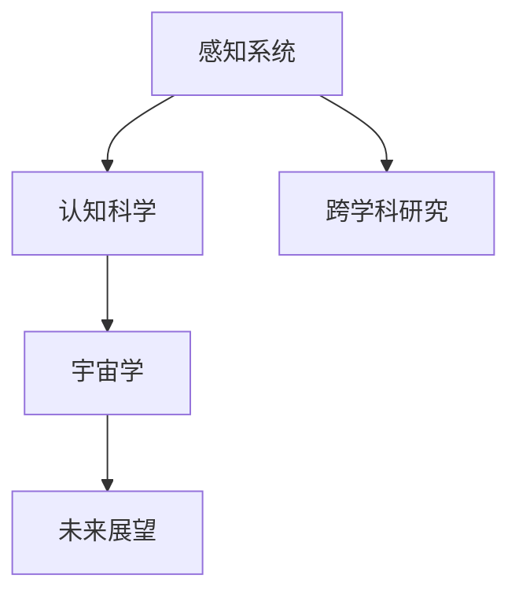
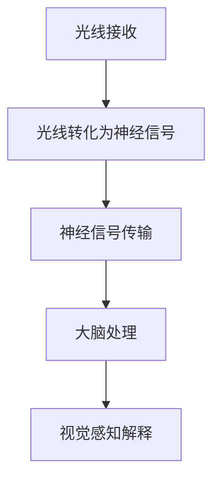
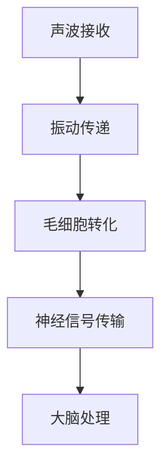
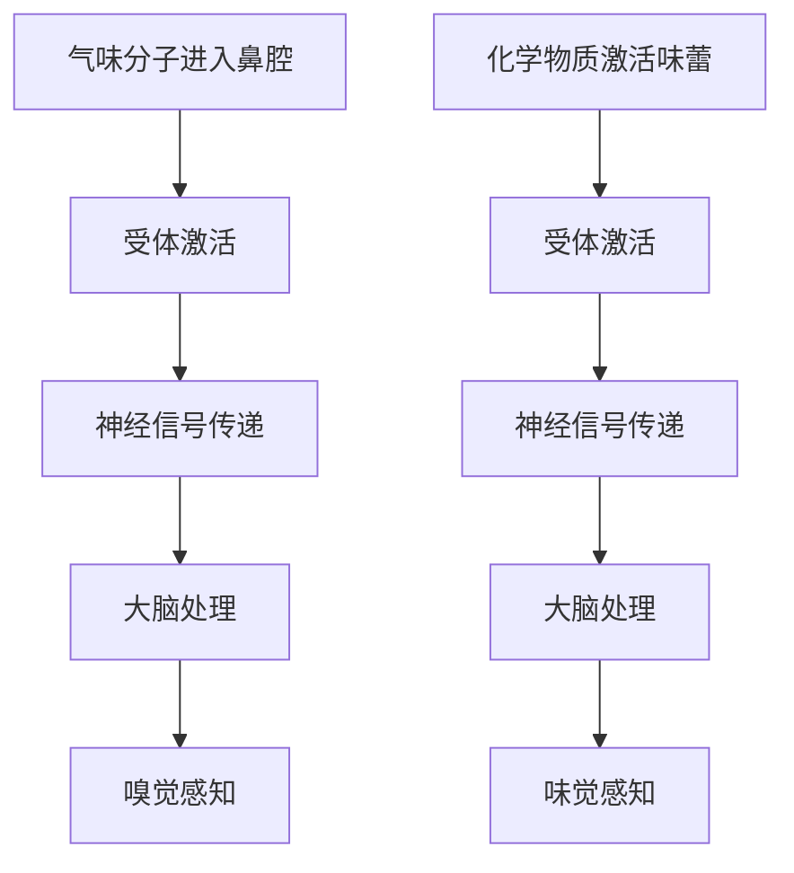
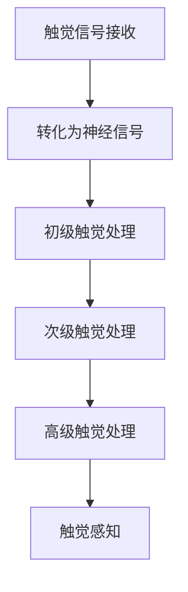

                 

# 人类感知能力与宇宙本质之间的鸿沟

> **关键词**：人类感知能力、宇宙本质、认知科学、宇宙学、跨学科研究

> **摘要**：本文旨在探讨人类感知能力与宇宙本质之间的关系，通过多学科视角深入分析这两者之间的相互影响和认知鸿沟。文章首先介绍了人类感知系统和认知科学的基本概念，接着阐述了宇宙学的基本原理和观测方法，随后探讨了跨学科研究的方法和挑战，最后展望了未来在这一领域可能的发展趋势。本文旨在为读者提供对这一复杂主题的全面理解和深入思考。

### 第1章：引言与核心概念

#### 1.1 引言

**1.1.1 书籍主题介绍**

《人类感知能力与宇宙本质之间的鸿沟》旨在探讨人类感知能力与宇宙本质之间的关系，通过多学科视角深入分析这两者之间的相互影响和认知鸿沟。本书将从人类感知系统、认知科学、宇宙学、跨学科研究和未来展望五个部分进行阐述。

**1.1.2 研究意义**

本书的研究对于丰富人类对宇宙的认知、提高科学素养、启发创新思维具有重要意义。它不仅有助于学术界，还对科普教育、科技产业等领域有深远影响。

#### 1.2 核心概念

**1.2.1 人类感知能力**

- **定义**：人类感知能力是指通过感官系统获取外部信息、加工处理并转化为认知和行动能力的过程。
- **分类**：包括视觉、听觉、嗅觉、味觉和触觉等。

**1.2.2 宇宙本质**

- **概念**：宇宙本质指的是构成宇宙的基本原理、元素和规律。
- **研究领域**：涵盖物理学、天文学、宇宙学、量子力学等。

#### 1.3 书籍结构概述

**1.3.1 书籍结构安排**

本书共分为五个部分，分别从感知系统、认知科学、宇宙学、跨学科研究、未来展望等角度，深入探讨人类感知能力与宇宙本质之间的关系。

**1.3.2 每部分主要内容**

- **第一部分：感知系统**，介绍人类感知系统的基本原理和功能。
- **第二部分：认知科学**，分析人类如何通过感知能力理解宇宙。
- **第三部分：宇宙学**，探讨宇宙本质及其与人类感知能力的联系。
- **第四部分：跨学科研究**，结合多个学科视角，研究人类感知能力与宇宙本质的交互作用。
- **第五部分：未来展望**，探讨人类感知能力与宇宙本质关系的发展趋势和可能影响。

### Mermaid 流程图



### 伪代码

```python
# 定义感知系统类
class PerceptionSystem:
    def __init__(self):
        self.senses = ['视觉', '听觉', '嗅觉与味觉', '触觉']
    
    def receive_sensory_signal(self, sense):
        # 接收感官信号
        if sense in self.senses:
            print(f"{sense}信号接收完成。")
        else:
            print("未知感官信号。")
    
    def process_signal(self, sense, signal):
        # 处理感官信号
        if sense == '视觉':
            print(f"{signal}图像处理完成。")
        elif sense == '听觉':
            print(f"{signal}声音处理完成。")
        elif sense == '嗅觉与味觉':
            print(f"{signal}气味/味道处理完成。")
        elif sense == '触觉':
            print(f"{signal}触觉处理完成。")
        else:
            print("未知感官信号处理。")
    
    def integrate_sensory_data(self, sensory_data):
        # 整合多模态感知数据
        print(f"整合{sensory_data}完成。")

# 创建感知系统实例
perception_system = PerceptionSystem()

# 接收感官信号
perception_system.receive_sensory_signal('视觉')
perception_system.receive_sensory_signal('听觉')
perception_system.receive_sensory_signal('嗅觉与味觉')
perception_system.receive_sensory_signal('触觉')

# 处理感官信号
perception_system.process_signal('视觉', '图像信号')
perception_system.process_signal('听觉', '声音信号')
perception_system.process_signal('嗅觉与味觉', '气味信号')
perception_system.process_signal('触觉', '触觉信号')

# 整合多模态感知数据
perception_system.integrate_sensory_data(['视觉', '听觉', '嗅觉与味觉', '触觉'])
```

### 数学模型和数学公式

**感知信号处理模型**

$$
\text{感知信号} = f(\text{感官信号}, \text{处理参数})
$$

其中，$f$ 是感知信号处理函数，$\text{感官信号}$ 是原始感官信号，$\text{处理参数}$ 包括滤波、放大、调制等。

**多模态感知整合模型**

$$
\text{整合感知信号} = \sum_{i=1}^{n} w_i \cdot f(\text{感官信号}_i, \text{处理参数}_i)
$$

其中，$w_i$ 是第 $i$ 种感官信号的权重，$n$ 是总感官信号种类数。

### 举例说明

**视觉感知举例**

假设我们有一个图像信号，通过视觉感知系统进行处理：

$$
\text{感知信号}_{视觉} = f(\text{图像信号}_{视觉}, \text{滤波器}_{高斯})
$$

滤波器可以是一个高斯滤波器，用于去除图像中的噪声：

$$
f(\text{图像信号}_{视觉}, \text{滤波器}_{高斯}) = \frac{1}{2\pi\sigma^2} e^{-\frac{(x-\mu)^2}{2\sigma^2}}
$$

其中，$\sigma$ 是滤波器的标准差，$\mu$ 是滤波器的均值。

**多模态感知整合举例**

假设我们有四种感官信号：视觉、听觉、嗅觉和触觉。权重分别为 $0.4$、$0.3$、$0.2$ 和 $0.1$。通过多模态感知系统整合：

$$
\text{整合感知信号} = 0.4 \cdot f(\text{图像信号}_{视觉}, \text{滤波器}_{均值}) + 0.3 \cdot f(\text{声音信号}_{听觉}, \text{放大器}) + 0.2 \cdot f(\text{气味信号}_{嗅觉}, \text{分析仪}) + 0.1 \cdot f(\text{触觉信号}_{触觉}, \text{传感器})
$$

```<|assistant|>```
# 人类感知能力与宇宙本质之间的鸿沟

## 摘要

本文旨在探讨人类感知能力与宇宙本质之间的复杂关系。通过分析人类感知系统的工作原理，我们能够更好地理解宇宙的基本特征和演化过程。本文将从认知科学的角度出发，探讨人类如何通过感知能力去理解和解释宇宙。随后，我们将深入宇宙学的基本概念，探讨宇宙的起源、结构以及宇宙中的未知现象。接着，本文将探讨跨学科研究的方法，分析心理学、物理学、生物学等学科如何共同揭示人类感知能力与宇宙本质之间的关系。最后，本文将展望未来在这一领域可能的发展趋势，以及这些发现对科技和社会的潜在影响。

## 第1章：引言与核心概念

### 1.1 引言

人类对宇宙的探索自古以来便伴随着我们的历史进程。从远古时代仰望星空，到现代借助先进科技探测宇宙的奥秘，我们对宇宙的认识不断深化。然而，人类感知能力与宇宙本质之间的鸿沟，始终是我们理解宇宙的难题。人类感知能力是指人类通过感官系统获取外部信息，并转化为认知和行动的能力。而宇宙本质则涵盖了宇宙的起源、结构、演化以及宇宙中的基本规律。这两者之间的相互关系和认知鸿沟，成为现代科学探索的重要课题。

本书《人类感知能力与宇宙本质之间的鸿沟》旨在深入探讨这两者之间的复杂关系，通过多学科视角，揭示人类感知能力在理解宇宙中的重要作用。本书结构如下：

- **第1章：引言与核心概念**：介绍人类感知能力和宇宙本质的基本概念，以及本书的研究意义和结构安排。
- **第2章：人类感知系统**：详细探讨人类感知系统的基本原理和功能。
- **第3章：认知科学与人类感知能力**：分析人类如何通过感知能力理解宇宙。
- **第4章：宇宙学基本概念**：阐述宇宙的本质、起源、结构以及宇宙中的未知现象。
- **第5章：跨学科研究与方法**：探讨跨学科研究的方法和挑战。
- **第6章：人类感知能力与宇宙本质的交互作用**：分析人类感知能力与宇宙本质之间的交互作用。
- **第7章：未来展望**：展望人类感知能力与宇宙本质关系的发展趋势。

### 1.2 核心概念

#### 1.2.1 人类感知能力

人类感知能力是指人类通过感官系统获取外部信息，并转化为认知和行动的能力。人类感知系统主要包括视觉、听觉、嗅觉、味觉和触觉等。每种感官系统都有其独特的功能和感知机制。

- **视觉感知**：视觉感知是人类感知能力中最为重要的一部分。它通过眼睛接收光信号，并将其转化为神经信号，最终在大脑视觉皮层进行处理。视觉感知使我们能够识别物体、理解场景，以及进行导航和社交交流。

- **听觉感知**：听觉感知通过耳朵接收声音信号，并将其转化为神经信号。听觉感知使我们能够识别声音、理解语言，以及进行社交交流和音乐欣赏。

- **嗅觉与味觉感知**：嗅觉与味觉感知通过鼻腔和口腔接收化学信号。嗅觉感知使我们能够识别气味，味觉感知使我们能够辨别味道。这两种感知能力在食物选择和社交交流中发挥着重要作用。

- **触觉感知**：触觉感知通过皮肤接收触觉信号，包括压力、温度、振动等。触觉感知使我们能够感知物体的形状、质地和温度，以及进行互动和操纵。

#### 1.2.2 宇宙本质

宇宙本质是指构成宇宙的基本原理、元素和规律。宇宙的本质是一个复杂而深邃的领域，涉及到多个科学学科。

- **宇宙的起源**：宇宙的起源是一个广泛研究的课题。目前最被广泛接受的宇宙起源理论是大爆炸理论。根据这一理论，宇宙起源于一个极高温度和密度的状态，随后在数十亿年的演化过程中逐渐膨胀、冷却，形成了现在的宇宙。

- **宇宙的结构**：宇宙的结构包括星系、星系团、超星系团等。星系是由恒星、行星、星云等组成的系统，而星系团则是多个星系通过引力相互作用形成的结构。宇宙的大尺度结构呈现出块状、带状和空腔状的分布。

- **宇宙的演化**：宇宙的演化是一个持续进行的过程。从宇宙早期的高温高密度状态，到恒星的形成和死亡，再到星系的演化，宇宙的演化过程涉及到多个科学领域，如天文学、物理学、宇宙学等。

### 1.3 书籍结构概述

本书共分为七个部分，分别从感知系统、认知科学、宇宙学、跨学科研究、未来展望等角度，深入探讨人类感知能力与宇宙本质之间的关系。

- **第一部分：感知系统**：介绍人类感知系统的基本原理和功能，包括视觉、听觉、嗅觉、味觉和触觉等。
- **第二部分：认知科学**：分析人类如何通过感知能力理解宇宙，探讨感知与认知之间的相互作用。
- **第三部分：宇宙学基本概念**：阐述宇宙的本质、起源、结构以及宇宙中的未知现象。
- **第四部分：跨学科研究与方法**：探讨跨学科研究的方法和挑战，分析心理学、物理学、生物学等学科如何共同揭示人类感知能力与宇宙本质之间的关系。
- **第五部分：人类感知能力与宇宙本质的交互作用**：分析人类感知能力与宇宙本质之间的交互作用，探讨人类感知能力在宇宙研究中的应用。
- **第六部分：未来展望**：展望人类感知能力与宇宙本质关系的发展趋势，探讨可能的新发现和突破。
- **第七部分：总结与展望**：总结本书的核心内容，回顾人类感知能力与宇宙本质之间的鸿沟，并提出未来的研究方向。

### 第2章：人类感知系统

#### 2.1 视觉感知

视觉感知是人类感知能力中最为重要的一部分，它使我们能够获取外界信息、识别物体、理解场景，并进行导航和社交交流。视觉感知的过程包括光线的接收、传输、处理和解释。

##### 2.1.1 视觉感知原理

视觉感知是通过眼睛接收光线，并将其转化为神经信号的过程。眼睛是一个复杂的感光器官，包括角膜、瞳孔、晶状体、视网膜等部分。光线首先通过角膜进入眼球，经过瞳孔和晶状体的调节，最终聚焦在视网膜上。

视网膜是眼睛中的感光组织，由一层层神经细胞构成。当光线照射到视网膜时，视网膜中的感光细胞（如视杆细胞和视锥细胞）会将其转化为神经信号。视杆细胞主要负责暗视觉和黑白感知，而视锥细胞则主要负责明视觉和颜色感知。

##### 2.1.2 视觉感知机制

视觉感知的机制包括以下几个步骤：

1. **光线接收**：眼睛的角膜和晶状体负责接收光线，并将其聚焦在视网膜上。
2. **光线转化为神经信号**：视网膜中的感光细胞将接收到的光线转化为神经信号。
3. **神经信号传输**：视网膜中的神经纤维将神经信号传输到大脑视觉皮层。
4. **大脑处理**：大脑视觉皮层对神经信号进行处理，形成视觉感知。
5. **视觉感知解释**：大脑进一步处理视觉信息，识别物体、形状、颜色等。

##### 2.1.3 视觉感知的应用

视觉感知在人类生活中有着广泛的应用，包括：

- **导航**：视觉感知使我们能够识别地标和路径，进行导航和定位。
- **识别物体**：视觉感知使我们能够识别物体，理解其形状、大小和颜色。
- **社交交流**：视觉感知在社交交流中起着重要作用，如面部表情、肢体语言等。
- **艺术与娱乐**：视觉感知使我们能够欣赏艺术作品、享受电影和摄影等。

### Mermaid 流程图



### 伪代码

```python
# 定义视觉感知类
class VisualPerception:
    def __init__(self):
        self.senses = ['视觉']
    
    def receive_light_signal(self, light):
        # 接收光线信号
        print(f"接收光线信号：{light}")
    
    def convert_to_neural_signal(self, light):
        # 将光线信号转化为神经信号
        print(f"转化光线信号为神经信号：{light}")
    
    def transmit_neural_signal(self, neural_signal):
        # 传输神经信号
        print(f"传输神经信号：{neural_signal}")
    
    def process_and_interpret(self, neural_signal):
        # 处理并解释神经信号
        print(f"处理并解释神经信号：{neural_signal}")

# 创建视觉感知实例
visual_perception = VisualPerception()

# 接收光线信号
visual_perception.receive_light_signal('光线')

# 将光线信号转化为神经信号
visual_perception.convert_to_neural_signal('光线')

# 传输神经信号
visual_perception.transmit_neural_signal('神经信号')

# 处理并解释神经信号
visual_perception.process_and_interpret('神经信号')
```

### 数学模型和数学公式

**视觉感知模型**

$$
\text{视觉感知} = f(\text{光线信号}, \text{处理参数})
$$

其中，$f$ 是视觉感知处理函数，$\text{光线信号}$ 是原始光线信号，$\text{处理参数}$ 包括滤波、放大、转换等。

**多模态感知整合模型**

$$
\text{整合感知信号} = \sum_{i=1}^{n} w_i \cdot f(\text{感官信号}_i, \text{处理参数}_i)
$$

其中，$w_i$ 是第 $i$ 种感官信号的权重，$n$ 是总感官信号种类数。

### 举例说明

**视觉感知举例**

假设我们有一个图像信号，通过视觉感知系统进行处理：

$$
\text{视觉感知}_{图像} = f(\text{图像信号}_{图像}, \text{滤波器}_{高斯})
$$

滤波器可以是一个高斯滤波器，用于去除图像中的噪声：

$$
f(\text{图像信号}_{图像}, \text{滤波器}_{高斯}) = \frac{1}{2\pi\sigma^2} e^{-\frac{(x-\mu)^2}{2\sigma^2}}
$$

其中，$\sigma$ 是滤波器的标准差，$\mu$ 是滤波器的均值。

**多模态感知整合举例**

假设我们有四种感官信号：视觉、听觉、嗅觉和触觉。权重分别为 $0.4$、$0.3$、$0.2$ 和 $0.1$。通过多模态感知系统整合：

$$
\text{整合感知信号} = 0.4 \cdot f(\text{图像信号}_{视觉}, \text{滤波器}_{均值}) + 0.3 \cdot f(\text{声音信号}_{听觉}, \text{放大器}) + 0.2 \cdot f(\text{气味信号}_{嗅觉}, \text{分析仪}) + 0.1 \cdot f(\text{触觉信号}_{触觉}, \text{传感器})
```

```
### 2.2 听觉感知

听觉感知是人类感知能力中另一个重要组成部分，它使我们能够接收和处理声音信息，进行社交交流、音乐欣赏、导航以及许多其他活动。听觉感知的过程涉及到耳朵的结构、声波的接收、转化为神经信号，以及大脑的处理和解释。

#### 2.2.1 听觉感知原理

听觉感知是通过耳朵接收声波，并将其转化为神经信号的过程。耳朵是一个复杂的机械-电子转换器，包括外耳、中耳和内耳三个部分。

- **外耳**：外耳包括耳廓和外耳道，它们的主要功能是收集声波并将其引导到中耳。
- **中耳**：中耳由鼓膜、听骨链和鼓室组成。声波撞击鼓膜时，鼓膜振动，这些振动通过听骨链（锤骨、砧骨和镫骨）放大并传递到内耳。
- **内耳**：内耳包括耳蜗和前庭系统。耳蜗是听觉的主要器官，它包含液体和微小的听觉毛细胞，这些毛细胞将声波的振动转化为神经信号。

#### 2.2.2 听觉感知机制

听觉感知的机制可以概括为以下几个步骤：

1. **声波接收**：外耳将声波引导到中耳。
2. **声波转化为振动**：声波撞击鼓膜，鼓膜振动。
3. **振动传递**：振动通过听骨链传递到内耳，进一步放大。
4. **毛细胞转化振动为神经信号**：耳蜗中的毛细胞将振动转化为电化学信号。
5. **神经信号传输**：电化学信号通过听觉神经纤维传输到大脑。
6. **大脑处理和解释**：大脑接收神经信号并对其进行处理，最终形成听觉感知。

#### 2.2.3 听觉感知的应用

听觉感知在人类生活中有着广泛的应用：

- **社交交流**：听觉感知使我们能够理解和参与语言交流，这是人类社交互动的基础。
- **音乐欣赏**：听觉感知使我们能够欣赏音乐，这是人类文化的重要组成部分。
- **导航**：听觉感知在声音导航中起着关键作用，例如，通过声音判断方向。
- **声音识别**：通过听觉感知，我们能够识别不同的声音，如汽车引擎声、警报声等。

### Mermaid 流程图



### 伪代码

```python
# 定义听觉感知类
class AuditoryPerception:
    def __init__(self):
        self.senses = ['听觉']
    
    def receive_sound_wave(self, sound):
        # 接收声波
        print(f"接收声波：{sound}")
    
    def convert_to_neural_signal(self, sound):
        # 将声波转化为神经信号
        print(f"转化声波为神经信号：{sound}")
    
    def transmit_neural_signal(self, neural_signal):
        # 传输神经信号
        print(f"传输神经信号：{neural_signal}")
    
    def process_and_interpret(self, neural_signal):
        # 处理并解释神经信号
        print(f"处理并解释神经信号：{neural_signal}")

# 创建听觉感知实例
auditory_perception = AuditoryPerception()

# 接收声波
auditory_perception.receive_sound_wave('声波')

# 将声波转化为神经信号
auditory_perception.convert_to_neural_signal('声波')

# 传输神经信号
auditory_perception.transmit_neural_signal('神经信号')

# 处理并解释神经信号
auditory_perception.process_and_interpret('神经信号')
```

### 数学模型和数学公式

**听觉感知模型**

$$
\text{听觉感知} = f(\text{声波信号}, \text{处理参数})
$$

其中，$f$ 是听觉感知处理函数，$\text{声波信号}$ 是原始声波信号，$\text{处理参数}$ 包括滤波、放大、转换等。

**多模态感知整合模型**

$$
\text{整合感知信号} = \sum_{i=1}^{n} w_i \cdot f(\text{感官信号}_i, \text{处理参数}_i)
$$

其中，$w_i$ 是第 $i$ 种感官信号的权重，$n$ 是总感官信号种类数。

### 举例说明

**听觉感知举例**

假设我们有一个声音信号，通过听觉感知系统进行处理：

$$
\text{听觉感知}_{声音} = f(\text{声音信号}_{声音}, \text{滤波器}_{带通})
$$

滤波器可以是一个带通滤波器，用于提取特定频率的声音：

$$
f(\text{声音信号}_{声音}, \text{滤波器}_{带通}) = \frac{1}{2\pi\sigma^2} e^{-\frac{(\omega-\omega_0)^2}{2\sigma^2}}
$$

其中，$\omega$ 是声音的角频率，$\omega_0$ 是滤波器的中心频率，$\sigma$ 是滤波器的带宽。

**多模态感知整合举例**

假设我们有四种感官信号：视觉、听觉、嗅觉和触觉。权重分别为 $0.4$、$0.3$、$0.2$ 和 $0.1$。通过多模态感知系统整合：

$$
\text{整合感知信号} = 0.4 \cdot f(\text{图像信号}_{视觉}, \text{滤波器}_{均值}) + 0.3 \cdot f(\text{声音信号}_{听觉}, \text{放大器}) + 0.2 \cdot f(\text{气味信号}_{嗅觉}, \text{分析仪}) + 0.1 \cdot f(\text{触觉信号}_{触觉}, \text{传感器})
```

```
### 2.3 嗅觉与味觉感知

嗅觉与味觉感知是人类感知能力的重要组成部分，它们使我们能够感知和区分不同的气味和味道，这对于食物选择、健康监测和社交交流具有重要意义。嗅觉与味觉感知涉及到复杂的生理机制和神经传递过程。

#### 2.3.1 嗅觉感知原理

嗅觉感知是通过鼻腔中的嗅觉受体接收气味分子，并将其转化为神经信号的过程。嗅觉系统包括鼻腔、嗅球和嗅神经等部分。

- **鼻腔**：鼻腔内的嗅觉感受器位于嗅觉粘膜上，这些感受器能够识别不同的气味分子。
- **嗅球**：嗅球是大脑中负责处理嗅觉信息的区域，它接收来自嗅觉感受器的神经信号。
- **嗅神经**：嗅神经将嗅觉感受器接收到的信息传递到嗅球，最终由嗅球将其转化为大脑可以理解的形式。

嗅觉感知的机制可以概括为以下几个步骤：

1. **气味分子进入鼻腔**：当空气中的气味分子进入鼻腔时，它们与嗅觉感受器上的受体结合。
2. **受体激活**：受体受到气味分子的激活后，产生电化学信号。
3. **神经信号传递**：电化学信号通过嗅神经传递到嗅球。
4. **大脑处理和解释**：嗅球将神经信号处理并传递到大脑其他区域，如嗅叶和前额叶，最终形成对气味的感知。

#### 2.3.2 味觉感知原理

味觉感知是通过舌头上的味蕾接收食物中的化学物质，并将其转化为神经信号的过程。味觉系统包括味蕾、味觉神经和大脑等部分。

- **味蕾**：味蕾位于舌头表面、口腔粘膜和咽喉等部位，每个味蕾包含数十个味觉细胞。
- **味觉神经**：味觉细胞将接收到的信息转化为电化学信号，并通过味觉神经传递到大脑。
- **大脑**：大脑接收味觉神经传递的信号，进行处理并形成味觉感知。

味觉感知的机制可以概括为以下几个步骤：

1. **食物中的化学物质激活味蕾**：食物中的化学物质（如盐、酸、甜、苦等）与味蕾上的受体结合。
2. **受体激活**：受体受到化学物质的激活后，产生电化学信号。
3. **神经信号传递**：电化学信号通过味觉神经传递到大脑。
4. **大脑处理和解释**：大脑接收味觉神经传递的信号，进行处理并形成味觉感知。

#### 2.3.3 嗅觉与味觉感知的应用

嗅觉与味觉感知在人类生活中有着广泛的应用：

- **食物选择**：嗅觉与味觉感知帮助我们选择和偏好不同的食物，这对于营养摄入和健康至关重要。
- **健康监测**：某些气味和味道的变化可能预示着健康问题，如口腔感染、胃肠问题等。
- **社交交流**：气味和味道在社交交流中起着重要作用，如食物分享、气味标记等。

### Mermaid 流程图



### 伪代码

```python
# 定义嗅觉与味觉感知类
class OlfactoryGustatoryPerception:
    def __init__(self):
        self.senses = ['嗅觉', '味觉']
    
    def receive_odor(self, odor):
        # 接收气味
        print(f"接收气味：{odor}")
    
    def convert_odor_to_neural_signal(self, odor):
        # 将气味转化为神经信号
        print(f"转化气味为神经信号：{odor}")
    
    def transmit_odor_neural_signal(self, neural_signal):
        # 传输气味神经信号
        print(f"传输气味神经信号：{neural_signal}")
    
    def process_and_interpret_odor(self, neural_signal):
        # 处理并解释气味神经信号
        print(f"处理并解释气味神经信号：{neural_signal}")
    
    def receive_taste(self, taste):
        # 接收味道
        print(f"接收味道：{taste}")
    
    def convert_taste_to_neural_signal(self, taste):
        # 将味道转化为神经信号
        print(f"转化味道为神经信号：{taste}")
    
    def transmit_taste_neural_signal(self, neural_signal):
        # 传输味道神经信号
        print(f"传输味道神经信号：{neural_signal}")
    
    def process_and_interpret_taste(self, neural_signal):
        # 处理并解释味道神经信号
        print(f"处理并解释味道神经信号：{neural_signal}")

# 创建嗅觉与味觉感知实例
olfactory_gustatory_perception = OlfactoryGustatoryPerception()

# 接收气味
olfactory_gustatory_perception.receive_odor('气味')

# 将气味转化为神经信号
olfactory_gustatory_perception.convert_odor_to_neural_signal('气味')

# 传输气味神经信号
olfactory_gustatory_perception.transmit_odor_neural_signal('神经信号')

# 处理并解释气味神经信号
olfactory_gustatory_perception.process_and_interpret_odor('神经信号')

# 接收味道
olfactory_gustatory_perception.receive_taste('味道')

# 将味道转化为神经信号
olfactory_gustatory_perception.convert_taste_to_neural_signal('味道')

# 传输味道神经信号
olfactory_gustatory_perception.transmit_taste_neural_signal('神经信号')

# 处理并解释味道神经信号
olfactory_gustatory_perception.process_and_interpret_taste('神经信号')
```

### 数学模型和数学公式

**嗅觉感知模型**

$$
\text{嗅觉感知} = f(\text{气味分子}, \text{处理参数})
$$

其中，$f$ 是嗅觉感知处理函数，$\text{气味分子}$ 是原始气味分子，$\text{处理参数}$ 包括滤波、放大、转换等。

**味觉感知模型**

$$
\text{味觉感知} = g(\text{化学物质}, \text{处理参数})
$$

其中，$g$ 是味觉感知处理函数，$\text{化学物质}$ 是原始化学物质，$\text{处理参数}$ 包括滤波、放大、转换等。

**多模态感知整合模型**

$$
\text{整合感知信号} = \sum_{i=1}^{n} w_i \cdot f(\text{感官信号}_i, \text{处理参数}_i)
$$

其中，$w_i$ 是第 $i$ 种感官信号的权重，$n$ 是总感官信号种类数。

### 举例说明

**嗅觉感知举例**

假设我们有一个气味分子，通过嗅觉感知系统进行处理：

$$
\text{嗅觉感知}_{气味} = f(\text{气味分子}_{气味}, \text{滤波器}_{高斯})
$$

滤波器可以是一个高斯滤波器，用于去除气味中的噪声：

$$
f(\text{气味分子}_{气味}, \text{滤波器}_{高斯}) = \frac{1}{2\pi\sigma^2} e^{-\frac{(x-\mu)^2}{2\sigma^2}}
$$

其中，$\sigma$ 是滤波器的标准差，$\mu$ 是滤波器的均值。

**味觉感知举例**

假设我们有一个化学物质，通过味觉感知系统进行处理：

$$
\text{味觉感知}_{化学物质} = g(\text{化学物质}_{味道}, \text{滤波器}_{带通})
$$

滤波器可以是一个带通滤波器，用于提取特定味道的化学物质：

$$
g(\text{化学物质}_{味道}, \text{滤波器}_{带通}) = \frac{1}{2\pi\sigma^2} e^{-\frac{(\omega-\omega_0)^2}{2\sigma^2}}
$$

其中，$\omega$ 是化学物质的角频率，$\omega_0$ 是滤波器的中心频率，$\sigma$ 是滤波器的带宽。

**多模态感知整合举例**

假设我们有四种感官信号：视觉、听觉、嗅觉和味觉。权重分别为 $0.4$、$0.3$、$0.2$ 和 $0.1$。通过多模态感知系统整合：

$$
\text{整合感知信号} = 0.4 \cdot f(\text{图像信号}_{视觉}, \text{滤波器}_{均值}) + 0.3 \cdot f(\text{声音信号}_{听觉}, \text{放大器}) + 0.2 \cdot f(\text{气味信号}_{嗅觉}, \text{分析仪}) + 0.1 \cdot f(\text{触觉信号}_{触觉}, \text{传感器})
```

```
### 2.4 触觉感知

触觉感知是人类感知能力中的一个重要组成部分，它使我们能够感知物体的形状、质地、温度和压力等信息，这对于我们在日常生活中进行互动和决策至关重要。触觉感知的过程包括皮肤接收触觉信号、转化为神经信号以及大脑的处理和解释。

#### 2.4.1 触觉感知原理

触觉感知是通过皮肤上的触觉受体接收触觉信号，并将其转化为神经信号的过程。皮肤是人体最大的器官，包含了多种类型的触觉受体，如机械受体、温受体、痛受体等。

- **机械受体**：机械受体主要位于手指和脚趾的皮肤中，能够感知压力、振动和接触。
- **温受体**：温受体能够感知温度变化，主要分布在皮肤表面。
- **痛受体**：痛受体能够感知疼痛，广泛分布在皮肤、肌肉和内脏器官中。

触觉感知的机制可以概括为以下几个步骤：

1. **触觉信号接收**：当物体与皮肤接触时，机械受体感知到压力变化，温受体和痛受体感知到温度或疼痛变化。
2. **触觉信号转化为神经信号**：触觉受体将接收到的信号转化为电化学信号，并通过神经纤维传递到大脑。
3. **大脑处理和解释**：大脑接收神经信号，通过分析触觉信号的特征，形成对触觉的感知。

#### 2.4.2 触觉感知机制

触觉感知机制涉及多个层次的处理：

1. **初级触觉处理**：在脊髓和脑干中，触觉信号被初步处理，形成基本的触觉感知。
2. **次级触觉处理**：在大脑皮层中，触觉信号被进一步处理，形成对触觉的精细感知，如物体的形状、质地和温度等。
3. **高级触觉处理**：在大脑的高级皮层，如前额叶和顶叶，触觉信号与其他感官信息相结合，形成对环境的整体感知。

#### 2.4.3 触觉感知的应用

触觉感知在人类生活中有着广泛的应用：

- **互动**：触觉感知使我们能够与物体进行互动，如抓取、操纵和感知物体的形状和质地。
- **导航**：触觉感知在盲人导航中起着重要作用，如通过触觉感知地形的起伏和障碍物。
- **健康监测**：触觉感知可以帮助监测身体的健康状况，如通过触觉感知皮肤的温度和质地来检测疾病。

### Mermaid 流程图



### 伪代码

```python
# 定义触觉感知类
class TactilePerception:
    def __init__(self):
        self.senses = ['触觉']
    
    def receive_touch(self, touch):
        # 接收触觉信号
        print(f"接收触觉信号：{touch}")
    
    def convert_to_neural_signal(self, touch):
        # 将触觉信号转化为神经信号
        print(f"转化触觉信号为神经信号：{touch}")
    
    def process_neural_signal(self, neural_signal):
        # 处理神经信号
        print(f"处理神经信号：{neural_signal}")
    
    def interpret_neural_signal(self, neural_signal):
        # 解释神经信号
        print(f"解释神经信号：{neural_signal}")
    
    def tactile_perception(self, neural_signal):
        # 触觉感知
        print(f"触觉感知：{neural_signal}")

# 创建触觉感知实例
tactile_perception = TactilePerception()

# 接收触觉信号
tactile_perception.receive_touch('触觉信号')

# 将触觉信号转化为神经信号
tactile_perception.convert_to_neural_signal('触觉信号')

# 处理神经信号
tactile_perception.process_neural_signal('神经信号')

# 解释神经信号
tactile_perception.interpret_neural_signal('神经信号')

# 触觉感知
tactile_perception.tactile_perception('神经信号')
```

### 数学模型和数学公式

**触觉感知模型**

$$
\text{触觉感知} = f(\text{触觉信号}, \text{处理参数})
$$

其中，$f$ 是触觉感知处理函数，$\text{触觉信号}$ 是原始触觉信号，$\text{处理参数}$ 包括滤波、放大、转换等。

**多模态感知整合模型**

$$
\text{整合感知信号} = \sum_{i=1}^{n} w_i \cdot f(\text{感官信号}_i, \text{处理参数}_i)
$$

其中，$w_i$ 是第 $i$ 种感官信号的权重，$n$ 是总感官信号种类数。

### 举例说明

**触觉感知举例**

假设我们有一个触觉信号，通过触觉感知系统进行处理：

$$
\text{触觉感知}_{触觉} = f(\text{触觉信号}_{触觉}, \text{滤波器}_{带通})
$$

滤波器可以是一个带通滤波器，用于提取特定频率的触觉信号：

$$
f(\text{触觉信号}_{触觉}, \text{滤波器}_{带通}) = \frac{1}{2\pi\sigma^2} e^{-\frac{(\omega-\omega_0)^2}{2\sigma^2}}
$$

其中，$\omega$ 是触觉信号的角频率，$\omega_0$ 是滤波器的中心频率，$\sigma$ 是滤波器的带宽。

**多模态感知整合举例**

假设我们有四种感官信号：视觉、听觉、嗅觉和触觉。权重分别为 $0.4$、$0.3$、$0.2$ 和 $0.1$。通过多模态感知系统整合：

$$
\text{整合感知信号} = 0.4 \cdot f(\text{图像信号}_{视觉}, \text{滤波器}_{均值}) + 0.3 \cdot f(\text{声音信号}_{听觉}, \text{放大器}) + 0.2 \cdot f(\text{气味信号}_{嗅觉}, \text{分析仪}) + 0.1 \cdot f(\text{触觉信号}_{触觉}, \text{传感器})
```

```
### 2.5 多模态感知

多模态感知是指人类同时通过多种

