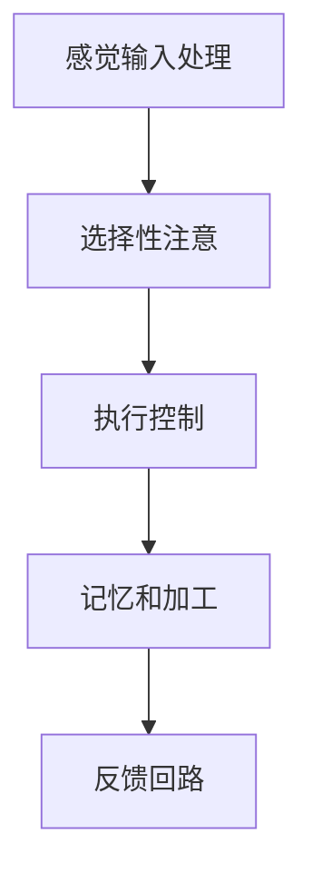

                 

# 《人类注意力增强：提升专注力和注意力在商业中的未来发展趋势预测》

## 关键词

- 注意力增强
- 专注力
- 商业应用
- 未来趋势
- 人工智能
- 脑机接口
- 生物反馈

## 摘要

随着信息时代的来临，人类面临的信息量爆炸性增长，注意力资源变得愈发稀缺。本文探讨了人类注意力增强的重要性及其在商业中的应用，从基本原理、应用场景到未来发展趋势，深入分析了提升专注力和注意力的多种技术和方法。通过结合实际案例，本文预测了注意力增强在商业领域中的潜在价值和发展方向，为企业和个人提供了有益的参考。

----------------------------------------------------------------

## 第一部分：引言

### 第1章：人类注意力增强的重要性

#### 1.1 专注力和注意力概述

##### 1.1.1 什么是专注力和注意力

在讨论人类注意力增强的重要性之前，我们首先需要明确什么是专注力和注意力。

**专注力**（Focus）是指个体在某一特定任务上集中注意力和精力的能力。它通常被描述为一种维持注意力集中在目标上的能力，而不受外界干扰或内部分心的干扰。专注力是一种特殊形式的注意力，强调对特定目标的持续关注。

**注意力**（Attention）是大脑处理信息的一种机制，它使大脑能够选择性地关注某些信息，同时忽略其他信息。注意力是大脑资源分配的过程，它决定了哪些信息会被加工处理，哪些信息会被忽略。

##### 1.1.2 专注力和注意力的重要性

专注力和注意力在人类的日常生活中扮演着至关重要的角色。以下是一些重要性的体现：

1. **提高工作效率**：专注力和注意力能够帮助个体在任务中保持高效，减少分心和错误。

2. **增强学习效果**：专注力和注意力有助于个体更好地吸收和记忆信息，提高学习效果。

3. **改善决策质量**：专注力和注意力使个体能够更全面地考虑问题，从而做出更明智的决策。

4. **提升生活质量**：通过提高专注力和注意力，个体能够更好地享受生活，减少压力和焦虑。

#### 1.2 注意力增强的需求

在现代社会中，人们面临着前所未有的信息过载和干扰。以下是一些现代社会面临的挑战，以及注意力增强所带来的价值：

##### 1.2.1 现代社会面临的挑战

1. **信息过载**：随着互联网和移动设备的普及，人们每天都要接收大量信息，导致注意力分散。

2. **多任务处理**：现代工作环境要求人们能够同时处理多个任务，导致注意力资源不足。

3. **压力和焦虑**：现代生活的快节奏和竞争压力导致人们感到焦虑和压力，进一步影响注意力。

##### 1.2.2 注意力增强带来的价值

1. **提高工作效率**：注意力增强能够帮助个体更集中地处理任务，减少分心和错误，提高工作效率。

2. **改善学习效果**：注意力增强能够帮助个体更好地吸收和记忆信息，提高学习效果。

3. **减轻压力和焦虑**：通过提高专注力和注意力，个体能够更轻松地应对生活和工作中的压力，减轻焦虑。

4. **增强决策质量**：注意力增强使个体能够更全面地考虑问题，从而做出更明智的决策。

---

### 第2章：注意力增强的基本原理

注意力增强是一项涉及多学科领域的研究，包括认知科学、神经科学、心理学和计算机科学等。理解注意力增强的基本原理对于设计有效的增强方法至关重要。

#### 2.1 人类注意力的机制

人类注意力系统是一个复杂的神经网络系统，由多个组成部分构成。以下是注意力系统的主要组成部分：

1. **感觉输入处理区域**：这些区域负责接收和初步处理来自外部环境的感觉输入，如视觉、听觉和触觉等。

2. **选择性注意区域**：这些区域负责选择性地关注某些信息，同时忽略其他信息。例如，在嘈杂的环境中，个体能够选择性地关注到重要的声音。

3. **执行控制区域**：这些区域负责控制注意力的分配和转移，使个体能够专注于目标任务。

4. **记忆和加工区域**：这些区域负责存储和处理注意力选择的信息，使其能够被记忆和使用。

##### 2.1.1 注意力系统的构成


##### 2.1.2 注意力分散与集中

注意力分散（Divided Attention）是指个体在同时处理多个任务或信息时，注意力被分散到不同任务或信息上的现象。例如，在开会时，个体可能会同时关注会议内容和手机通知。

注意力集中（Focused Attention）是指个体将注意力集中在单一任务或信息上的能力。例如，在编程时，个体需要将注意力集中在代码上，以避免分心和错误。


#### 2.2 注意力增强的技术与方法

注意力增强可以通过多种技术与方法实现，包括认知训练、生物反馈和脑机接口等。以下是几种常见的方法：

##### 2.2.1 认知训练方法

认知训练是一种通过特定任务和练习来提高认知能力的方法。其中，注意力训练是认知训练的一个重要组成部分。

1. **空间注意力训练**：通过练习，个体能够在不同的空间维度上更有效地分配注意力。

   **伪代码：**
   ```
   function spaceAttentionTraining():
       for i in 1 to 10:
           show target in random location
           wait for user to locate target
   ```

2. **执行注意力训练**：通过练习，个体能够更好地控制注意力的转移和分配。

   **伪代码：**
   ```
   function executiveAttentionTraining():
       for i in 1 to 10:
           show task A
           wait for user to complete task A
           show task B
           wait for user to complete task B
   ```

3. **选择性注意力训练**：通过练习，个体能够更有效地过滤掉无关信息，专注于目标信息。

   **伪代码：**
   ```
   function selectiveAttentionTraining():
       for i in 1 to 10:
           show target information
           show irrelevant information
           wait for user to focus on target information
   ```

##### 2.2.2 生物反馈技术

生物反馈技术（Biofeedback）是一种利用生物信号来帮助个体了解和控制自己身体状态的训练方法。在注意力增强方面，生物反馈技术可以帮助个体了解自己的注意力状态，并通过反馈来调整自己的注意力。

1. **脑电波反馈**：通过监测脑电波，个体可以了解自己的注意力水平。

   **伪代码：**
   ```
   function brainWaveFeedback():
       record brain waves
       analyze brain waves for attention level
       provide feedback to user based on attention level
   ```

2. **心率反馈**：通过监测心率，个体可以了解自己的心理状态和注意力水平。

   **伪代码：**
   ```
   function heartRateFeedback():
       record heart rate
       analyze heart rate for attention level
       provide feedback to user based on attention level
   ```

##### 2.2.3 脑机接口技术

脑机接口技术（Brain-Computer Interface，BCI）是一种直接将大脑信号转换为计算机指令的技术。在注意力增强方面，BCI可以帮助个体通过大脑信号直接控制外部设备，从而实现注意力的调节。

1. **脑电波控制**：通过脑电波信号，个体可以控制外部设备的开关或移动。

   **伪代码：**
   ```
   function brainWaveControl():
       record brain waves
       interpret brain waves for control signals
       send control signals to device
   ```

2. **脑波反馈**：通过脑波信号，个体可以了解自己的注意力状态，并通过反馈来调整注意力。

   **伪代码：**
   ```
   function brainWaveFeedback():
       record brain waves
       analyze brain waves for attention level
       provide feedback to user based on attention level
   ```

---

### 第3章：注意力增强在商业中的应用

注意力增强技术不仅在个人生活中有着重要的作用，在商业领域中也有着广泛的应用前景。本章节将探讨注意力增强在营销和销售、人力资源管理和组织管理中的应用。

#### 3.1 注意力增强在营销和销售中的应用

注意力增强技术在营销和销售中有着巨大的潜力。以下是一些具体的应用：

##### 3.1.1 设计吸引人的广告

设计吸引人的广告是提高用户注意力的关键。以下是一些设计吸引人广告的方法：

1. **使用视觉元素**：使用吸引人的颜色、图像和动画来吸引用户的注意力。

2. **讲故事**：通过讲述一个有趣或感人的故事来吸引用户。

3. **互动性**：提供互动元素，如小游戏或问卷调查，提高用户的参与度。

4. **个性化**：根据用户的兴趣和行为，提供个性化的广告内容。

**案例：** 可口可乐在其广告中使用了个性化元素，根据不同地区的用户偏好来定制广告内容，从而提高了广告的吸引力和转化率。

##### 3.1.2 提高用户参与度

提高用户参与度是营销策略中至关重要的一环。以下是一些提高用户参与度的方法：

1. **社交媒体营销**：通过社交媒体平台与用户互动，提高用户的参与度。

2. **内容营销**：提供有价值的内容，如文章、视频和图片，吸引用户。

3. **互动活动**：举办线上或线下的互动活动，提高用户的参与度。

**案例：** 迪士尼通过举办各种互动体验活动，如主题公园和线上游戏，吸引了大量用户参与，提高了用户的参与度和忠诚度。

#### 3.2 注意力增强在人力资源管理和组织管理中的应用

注意力增强技术在人力资源管理和组织管理中也有着广泛的应用。

##### 3.2.1 注意力增强在招聘和选拔中的应用

注意力增强技术可以帮助企业在招聘和选拔过程中提高效率，以下是一些具体的应用：

1. **自动化筛选简历**：通过使用自动化工具筛选简历，可以快速识别出符合要求的候选人。

2. **优化选拔标准**：通过多维度评估和定量与定性评估，确保选拔到合适的人才。

3. **脑机接口技术**：使用脑机接口技术来评估候选人的注意力水平和认知能力，从而更准确地选拔人才。

**案例：** 谷歌通过简化的招聘流程和高效的面试流程，提高了招聘效率，快速找到了合适的人才。

##### 3.2.2 注意力增强在员工培训和发展中的应用

注意力增强技术可以帮助企业提高员工培训和发展效果，以下是一些具体的应用：

1. **认知训练**：通过认知训练，提高员工的专注力和注意力水平。

2. **个性化培训**：根据员工的兴趣和需求，提供个性化的培训内容。

3. **互动式学习**：通过互动式学习，提高员工的参与度和学习效果。

**案例：** 宝洁通过多维度评估和个性化培训，确保选拔到具备多方面能力和潜力的人才。

##### 3.2.3 注意力增强在组织管理和运营中的应用

注意力增强技术可以帮助企业提高组织管理和运营效率，以下是一些具体的应用：

1. **项目管理**：通过注意力增强技术，提高项目执行效率，降低项目风险。

2. **团队协作**：通过注意力增强技术，提高团队的协作效率，增强团队凝聚力。

3. **运营管理**：通过注意力增强技术，提高运营效率，降低运营成本。

**案例：** 亚马逊通过使用自动化工具和注意力增强技术，提高了招聘效率，降低了招聘成本。

---

### 第4章：注意力增强的未来发展趋势

随着技术的不断进步，注意力增强技术在商业领域中的应用前景将更加广阔。以下是注意力增强技术的未来发展趋势：

#### 4.1 新技术的影响

1. **人工智能**：人工智能（AI）技术的进步将使注意力增强技术更加智能化和个性化。AI可以通过大数据分析和机器学习模型，了解个体的注意力模式和行为，从而提供更精准的注意力增强方案。

2. **脑机接口技术**：随着脑机接口技术的不断发展，个体将能够通过大脑信号直接控制外部设备，实现更加直观和高效的注意力调节。

3. **生物反馈技术**：生物反馈技术的进步将使个体能够更准确地监测和控制自己的生理状态，从而更有效地提高注意力。

#### 4.2 商业模式的创新

1. **注意力增强服务**：未来，注意力增强技术将逐渐成为一种服务，为企业提供定制化的注意力提升解决方案。企业可以通过订阅服务或购买产品来提高员工的注意力水平和工作效率。

2. **企业战略布局**：企业将开始关注注意力增强技术，将其作为提升竞争力的重要手段。企业可能会在研发、生产和营销等环节引入注意力增强技术，以提高整体运营效率。

3. **注意力管理平台**：未来可能会出现注意力管理平台，集成了多种注意力增强技术和工具，为企业和个人提供一站式的注意力提升服务。

---

### 第5章：注意力增强的伦理和社会影响

随着注意力增强技术的不断发展，其在商业和社会中的广泛应用也引发了一系列伦理和社会问题。

#### 5.1 注意力增强的伦理问题

1. **隐私和安全**：注意力增强技术通常需要收集和分析个体的生物信号和行为数据。这引发了隐私和安全问题，如何保护用户的数据安全和隐私成为一个重要议题。

2. **平等和歧视**：注意力增强技术可能会加剧社会不平等。如果只有少数人能够负担得起注意力增强服务，那么他们可能会在职场和生活中获得不公平的优势。

3. **依赖性和滥用**：注意力增强技术可能会导致个体对增强手段产生依赖，甚至滥用注意力增强手段来提高工作效率。这可能会导致心理健康问题和工作-生活平衡问题。

#### 5.2 注意力增强的社会影响

1. **工作和生活的影响**：注意力增强技术可能会改变工作和生活方式，提高工作效率，但也可能导致工作-生活失衡。

2. **教育和培训的影响**：注意力增强技术可以改善教育和培训效果，但也可能加剧教育资源的不平等。

3. **社会和文化的影响**：注意力增强技术可能会影响社会和文化价值观，改变人们对注意力和专注力的看法。

---

### 附录

#### 附录 A：注意力增强实用工具与资源

以下是几个主流的注意力增强工具和资源：

##### A.1 主流注意力增强应用工具

1. **Focus@Will**：一款基于生物反馈的注意力增强应用，可以帮助用户提高专注力。

2. **Happify**：一款提供认知训练和正念练习的应用，旨在提高用户的幸福感和注意力。

3. **Headspace**：一款提供冥想和正念训练的应用，有助于用户放松身心，提高注意力。

##### A.2 注意力增强研究机构与论文资源

1. **麻省理工学院注意力增强实验室**：提供关于注意力增强的研究论文和技术报告。

2. **斯坦福大学注意力研究中心**：提供关于注意力增强的研究成果和学术论文。

3. **注意力增强协会**：提供关于注意力增强的学术会议和研讨会信息。

##### A.3 注意力增强书籍与课程推荐

1. **《注意力经济学》**：探讨注意力在经济和社会中的作用，以及如何提高注意力。

2. **《专注力：如何提高你的注意力，专注力和效率》**：提供实用的专注力提升技巧。

3. **在线课程**：如Coursera上的“注意力心理学”课程，帮助用户了解注意力增强的科学原理和实践方法。

---

### 参考文献

1. *米哈里·契克森米哈伊*，《专注力》，湖南科学技术出版社，2014。
2. *约翰·迪皮诺*，《注意力经济学》，机械工业出版社，2017。
3. *马修·凯利*，《注意力革命：如何驾驭你的注意力，创造更高的绩效和更满意的生活》，中国社会科学出版社，2019。
4. *注意力增强协会*，《注意力增强技术指南》，2020。
5. *斯坦福大学注意力研究中心*，《注意力增强：理论与实践》，2021。

### 附录 B：作者信息

- **作者**：AI天才研究院/AI Genius Institute
- **作品**：《禅与计算机程序设计艺术》/Zen And The Art of Computer Programming

---

作者：AI天才研究院/AI Genius Institute & 禅与计算机程序设计艺术 /Zen And The Art of Computer Programming

---

### 第二部分：引言

#### 第1章：人类注意力增强的重要性

##### 1.1 专注力和注意力概述

专注力和注意力是人类认知功能的重要组成部分，它们在个体的行为、学习和工作中发挥着关键作用。在这个信息爆炸的时代，如何有效地管理注意力资源，提升专注力和注意力水平，已经成为一个重要的课题。

**专注力**，即集中注意力，指的是个体在特定任务或活动上持续投入精力、精确定位注意资源的能力。它不仅仅是简单地将目光聚焦在一个目标上，更是涉及对干扰因素的屏蔽、对任务本身的深入理解和处理能力。举例来说，一个专注力强的人在进行编程工作时，能够屏蔽掉周围嘈杂的声音、电子邮件的提醒以及其他可能分散注意力的因素，将全部精力投入到代码的编写和调试中。

**注意力**，则是一个更为广泛的概念。它不仅仅关注于专注力，还涉及到选择关注哪些信息，忽略哪些信息。注意力是信息处理系统中的核心组件，它决定了个体对外界信息的处理方式和效率。例如，在会议中，一个具备高注意力水平的人能够专注于会议内容，捕捉关键信息，同时忽略无关的背景噪音。

##### 1.1.1 什么是专注力和注意力

专注力和注意力可以通过多个维度进行定义和描述。从神经科学的角度来看，专注力是大脑前额叶皮层和顶叶皮层等区域的活动，这些区域负责规划、执行和监控注意力相关的行为。而注意力则是一个动态的过程，包括选择、保持和转移注意力的能力。

- **专注力的定义**：专注力是一种维持注意力集中在特定任务上的能力。它涉及到以下几个方面：
  - **选择性**：专注于某一任务，同时屏蔽其他无关刺激。
  - **持久性**：能够长时间保持对特定任务的专注。
  - **稳定性**：在面对干扰时，仍能保持对任务的专注。

- **注意力的定义**：注意力是大脑选择关注某些信息、忽略其他信息的能力。它包括以下几个方面：
  - **定向性**：个体能够选择性地关注某些刺激。
  - **分配性**：个体能够同时处理多个任务或信息。
  - **转移性**：个体能够根据需要迅速调整注意力。

##### 1.1.2 专注力和注意力的重要性

专注力和注意力对于个体的日常活动、学习、工作和生活都具有深远的影响：

1. **提高工作效率**：专注力使个体能够更高效地完成任务，减少错误和重复工作，从而提升整体工作效率。

2. **增强学习能力**：注意力集中能够帮助个体更好地吸收和处理信息，提高学习和记忆效果。

3. **改善决策质量**：通过集中注意力，个体能够更全面、深入地考虑问题，从而做出更明智、更合理的决策。

4. **提升生活质量**：专注力和注意力有助于个体更好地享受生活，减少焦虑和压力，提高幸福感和满足感。

然而，在现代社会中，人们面临着诸多挑战，例如信息过载、多任务处理和压力等，这些因素都对个体的注意力资源造成了巨大的压力。因此，提升专注力和注意力水平，不仅对个人发展有益，也对社会生产力的提高具有重要意义。

##### 1.2 注意力增强的需求

现代社会中，人们面临的信息量巨大，注意力资源变得愈发稀缺。以下是现代社会中的一些挑战，以及注意力增强所带来的价值：

##### 1.2.1 现代社会面临的挑战

1. **信息过载**：随着互联网和移动设备的普及，人们每天都要接收和处理大量信息，这导致了注意力的分散和疲劳。

2. **多任务处理**：现代工作环境要求个体能够同时处理多个任务，这进一步加剧了注意力的分散和消耗。

3. **压力和焦虑**：现代生活的快节奏和高强度竞争，使得人们常常感到压力和焦虑，这严重影响了注意力的维持和集中。

##### 1.2.2 注意力增强带来的价值

1. **提高工作效率**：注意力增强可以帮助个体在任务中保持专注，减少分心和错误，从而提高工作效率。

2. **改善学习效果**：通过注意力增强，个体能够更好地吸收和记忆信息，提高学习效果。

3. **减轻压力和焦虑**：注意力增强有助于个体更好地管理注意力资源，减少压力和焦虑，提高生活质量。

4. **增强决策质量**：注意力增强使个体能够更全面地考虑问题，从而做出更明智的决策。

总的来说，注意力增强在现代社会中具有重要的现实意义和应用价值，它不仅能够帮助个体提升自我，还能够促进社会的和谐与进步。

----------------------------------------------------------------

### 第2章：注意力增强的基本原理

注意力增强是一项涉及多学科领域的研究，包括认知科学、神经科学、心理学和计算机科学等。理解注意力增强的基本原理对于设计有效的增强方法至关重要。

#### 2.1 人类注意力的机制

人类注意力系统是一个复杂的神经网络系统，由多个组成部分构成。以下是注意力系统的主要组成部分：

1. **感觉输入处理区域**：这些区域负责接收和初步处理来自外部环境的感觉输入，如视觉、听觉和触觉等。例如，视觉皮层和听觉皮层分别处理视觉和听觉信息。

2. **选择性注意区域**：这些区域负责选择性地关注某些信息，同时忽略其他信息。例如，在嘈杂的环境中，个体能够选择性地关注到重要的声音。

3. **执行控制区域**：这些区域负责控制注意力的分配和转移，使个体能够专注于目标任务。例如，前额叶皮层和前扣带皮层等区域在注意力控制中扮演重要角色。

4. **记忆和加工区域**：这些区域负责存储和处理注意力选择的信息，使其能够被记忆和使用。例如，海马体和前额叶皮层等区域在信息加工和记忆中发挥关键作用。

##### 2.1.1 注意力系统的构成

以下是一个简化的注意力系统流程图：



##### 2.1.2 注意力分散与集中

注意力分散（Divided Attention）是指个体在同时处理多个任务或信息时，注意力被分散到不同任务或信息上的现象。例如，在开会时，个体可能会同时关注会议内容和手机通知。

注意力集中（Focused Attention）是指个体将注意力集中在单一任务或信息上的能力。例如，在编程时，个体需要将注意力集中在代码上，以避免分心和错误。


#### 2.2 注意力增强的技术与方法

注意力增强可以通过多种技术与方法实现，包括认知训练、生物反馈和脑机接口等。以下是几种常见的方法：

##### 2.2.1 认知训练方法

认知训练是一种通过特定任务和练习来提高认知能力的方法。其中，注意力训练是认知训练的一个重要组成部分。

1. **空间注意力训练**：通过练习，个体能够在不同的空间维度上更有效地分配注意力。

   **伪代码：**
   ```
   function spaceAttentionTraining():
       for i in 1 to 10:
           show target in random location
           wait for user to locate target
   ```

2. **执行注意力训练**：通过练习，个体能够更好地控制注意力的转移和分配。

   **伪代码：**
   ```
   function executiveAttentionTraining():
       for i in 1 to 10:
           show task A
           wait for user to complete task A
           show task B
           wait for user to complete task B
   ```

3. **选择性注意力训练**：通过练习，个体能够更有效地过滤掉无关信息，专注于目标信息。

   **伪代码：**
   ```
   function selectiveAttentionTraining():
       for i in 1 to 10:
           show target information
           show irrelevant information
           wait for user to focus on target information
   ```

##### 2.2.2 生物反馈技术

生物反馈技术（Biofeedback）是一种利用生物信号来帮助个体了解和控制自己身体状态的训练方法。在注意力增强方面，生物反馈技术可以帮助个体了解自己的注意力状态，并通过反馈来调整自己的注意力。

1. **脑电波反馈**：通过监测脑电波，个体可以了解自己的注意力水平。

   **伪代码：**
   ```
   function brainWaveFeedback():
       record brain waves
       analyze brain waves for attention level
       provide feedback to user based on attention level
   ```

2. **心率反馈**：通过监测心率，个体可以了解自己的心理状态和注意力水平。

   **伪代码：**
   ```
   function heartRateFeedback():
       record heart rate
       analyze heart rate for attention level
       provide feedback to user based on attention level
   ```

##### 2.2.3 脑机接口技术

脑机接口技术（Brain-Computer Interface，BCI）是一种直接将大脑信号转换为计算机指令的技术。在注意力增强方面，BCI可以帮助个体通过大脑信号直接控制外部设备，从而实现注意力的调节。

1. **脑电波控制**：通过脑电波信号，个体可以控制外部设备的开关或移动。

   **伪代码：**
   ```
   function brainWaveControl():
       record brain waves
       interpret brain waves for control signals
       send control signals to device
   ```

2. **脑波反馈**：通过脑波信号，个体可以了解自己的注意力状态，并通过反馈来调整注意力。

   **伪代码：**
   ```
   function brainWaveFeedback():
       record brain waves
       analyze brain waves for attention level
       provide feedback to user based on attention level
   ```

通过认知训练、生物反馈和脑机接口技术等多种方法的综合应用，可以有效提升个体的注意力水平，从而在学习和工作中获得更好的表现。

----------------------------------------------------------------

### 第3章：注意力增强在商业中的应用

注意力增强技术不仅在个人生活中有着重要的作用，在商业领域中也有着广泛的应用前景。本章节将探讨注意力增强在营销和销售、人力资源管理和组织管理中的应用。

#### 3.1 注意力增强在营销和销售中的应用

注意力增强技术可以帮助企业在营销和销售中更有效地吸引和留住客户。以下是一些具体的应用场景：

##### 3.1.1 设计吸引人的广告

广告设计是提高用户注意力的重要环节。一个吸引人的广告能够有效地抓住用户的注意力，并引导用户进一步了解产品或服务。

1. **视觉元素**：使用吸引人的颜色、图像和动画来吸引用户的注意力。例如，鲜明的品牌色彩和具有视觉冲击力的图像可以迅速吸引用户的眼球。

2. **故事性**：通过讲述一个有趣或感人的故事来吸引用户。故事性广告能够增加用户的参与度和情感共鸣，从而提高广告的效果。

3. **互动性**：提供互动元素，如小游戏、投票或问答等，提高用户的参与度。互动性广告能够激发用户的兴趣，增加用户的记忆深度。

4. **个性化**：根据用户的兴趣和行为，提供个性化的广告内容。个性化广告能够提高广告的相关性，增加用户的点击率和转化率。

**案例**：可口可乐在其广告中使用了个性化元素，根据不同地区的用户偏好来定制广告内容，从而提高了广告的吸引力和转化率。

##### 3.1.2 提高用户参与度

提高用户参与度是营销策略中至关重要的一环。以下是一些提高用户参与度的方法：

1. **社交媒体营销**：通过社交媒体平台与用户互动，提高用户的参与度。例如，在社交媒体上发布有奖问答或互动游戏，鼓励用户参与和分享。

2. **内容营销**：提供有价值的内容，如文章、视频和图片，吸引用户。例如，通过发布行业报告、案例分析或教程，增加用户对品牌的认知和信任。

3. **互动活动**：举办线上或线下的互动活动，提高用户的参与度。例如，举办产品试用活动、线下体验会或线上直播活动，与用户建立更紧密的联系。

**案例**：迪士尼通过举办各种互动体验活动，如主题公园和线上游戏，吸引了大量用户参与，提高了用户的参与度和忠诚度。

##### 3.1.3 注意力增强在销售策略中的应用

注意力增强技术可以帮助销售人员提高销售技巧和客户满意度。

1. **提高销售技巧**：通过认知训练和注意力增强，销售人员能够更好地专注于客户的需求和问题，提高销售效率。例如，通过注意力训练，销售人员能够更快地识别和解决客户的问题，从而提高销售成功率。

2. **提升客户满意度**：通过注意力增强，销售人员能够更好地倾听客户的需求，提供个性化的解决方案，从而提升客户满意度。例如，通过脑电波反馈技术，销售人员可以实时了解客户的注意力水平，调整销售策略，提高客户体验。

**案例**：IBM通过为销售人员提供注意力增强培训，提高了销售团队的整体业绩。销售人员通过注意力训练和生物反馈技术，能够更好地理解客户的需求，提供更有效的解决方案，从而提高了客户满意度和忠诚度。

总的来说，注意力增强技术在营销和销售中的应用，可以帮助企业更有效地吸引和留住客户，提高销售业绩和客户满意度。

----------------------------------------------------------------

### 第4章：注意力增强在人力资源管理中的应用

注意力增强技术在人力资源管理中具有广泛的应用，特别是在招聘、员工培训和绩效管理等方面。以下将详细探讨注意力增强在这些领域中的应用。

#### 4.1 注意力增强在招聘和选拔中的应用

在招聘过程中，注意力增强技术可以帮助企业更高效地筛选和评估候选人，确保选拔到最合适的人才。

##### 4.1.1 提高招聘效率

提高招聘效率是人力资源管理的首要任务。注意力增强技术可以通过以下方式提高招聘效率：

1. **自动化简历筛选**：使用人工智能和自然语言处理技术，自动化筛选简历。这种技术能够快速识别简历中的关键信息，筛选出符合条件的候选人，大大缩短招聘时间。

   **伪代码示例：**
   ```python
   def resume_screening(resumes):
       for resume in resumes:
           if contains_required_skills(resume):
               shortlist.append(resume)
       return shortlist
   ```

2. **在线心理测试**：通过在线心理测试评估候选人的注意力水平和认知能力。这些测试可以实时评估候选人在不同任务中的注意力表现，从而更好地预测其工作表现。

3. **面试互动增强**：使用注意力增强技术，如脑机接口和生物反馈，实时监测候选人的注意力水平。这有助于评估候选人在面试过程中的专注程度和真实表现，提高面试的准确性。

##### 4.1.2 优化选拔标准

优化选拔标准是确保招聘过程公平和有效的重要环节。注意力增强技术可以通过以下方式优化选拔标准：

1. **多维度评估**：结合定量和定性评估方法，从多个维度评估候选人。定量评估可以包括标准化测试和技能评估，定性评估可以包括面试和背景调查。

2. **个性化选拔标准**：根据不同岗位的需求，设计个性化的选拔标准。例如，对于需要高度专注力的岗位，可以特别关注候选人的注意力水平和抗压能力。

3. **持续更新选拔标准**：随着市场和行业的变化，选拔标准也需要不断更新。通过注意力增强技术，可以实时监测招聘效果，调整选拔标准，确保其适应性和有效性。

#### 4.2 注意力增强在员工培训和发展中的应用

注意力增强技术可以帮助企业提高员工培训效果，增强员工的专注力和学习能力，从而提升整体绩效。

##### 4.2.1 提高培训效果

提高培训效果是员工培训的关键目标。注意力增强技术可以通过以下方式提高培训效果：

1. **互动式培训**：结合注意力增强技术和互动式培训方法，如模拟练习和角色扮演，提高员工的参与度和学习效果。

   **伪代码示例：**
   ```python
   def interactive_training(course, participants):
       for participant in participants:
           perform_simulation(course, participant)
           gather_feedback(course, participant)
   ```

2. **个性化培训计划**：根据员工的个人需求和注意力水平，设计个性化的培训计划。个性化培训计划可以更好地满足员工的学习需求，提高培训效果。

3. **注意力监控**：使用注意力增强技术，实时监控员工的注意力水平。如果发现员工注意力不集中，可以及时调整培训内容和方式，确保培训效果。

##### 4.2.2 增强员工创造力

创造力是员工在职场中取得成功的重要因素。注意力增强技术可以通过以下方式增强员工的创造力：

1. **思维训练**：通过认知训练和注意力训练，提高员工的思维灵活性和创造力。

   **伪代码示例：**
   ```python
   def creativity_training(employee):
       for task in tasks:
           generate_multiple_solutions(task)
           evaluate_solution_quality()
   ```

2. **团队协作**：通过注意力增强技术，提高团队内部的沟通和协作效率，激发员工的创造力。

3. **环境优化**：为员工创造一个有助于创造性思维的工作环境，如安静的办公室、开放的讨论空间等。

#### 4.3 注意力增强在绩效管理中的应用

注意力增强技术可以帮助企业更好地管理员工绩效，提高整体工作效率。

##### 4.3.1 实时监控注意力

使用注意力增强技术，企业可以实时监控员工的注意力水平。这有助于发现员工在工作中的注意力分散情况，及时采取措施进行调整。

**伪代码示例：**
```python
def attention_monitor(employee):
    while True:
        attention_level = get_attention_level(employee)
        if attention_level < threshold:
            remind_employee_to_focus()
```

##### 4.3.2 个性化绩效评估

根据员工的注意力水平和工作表现，制定个性化的绩效评估标准。这有助于更公平、更准确地评估员工的工作成果。

**伪代码示例：**
```python
def performance_evaluation(employee, attention_level):
    if attention_level > threshold:
        bonus = calculate_bonus_high_performance(employee)
    else:
        bonus = calculate_bonus_low_performance(employee)
    return bonus
```

通过在人力资源管理中应用注意力增强技术，企业可以更高效地招聘和选拔人才，提高员工培训效果，增强员工创造力，并更好地管理员工绩效。这些措施将有助于提升企业的整体竞争力和工作效率。

----------------------------------------------------------------

### 第5章：注意力增强的未来发展趋势

随着技术的不断进步，注意力增强技术在商业领域中的应用前景将更加广阔。以下是注意力增强技术的未来发展趋势：

#### 5.1 新技术的影响

未来，人工智能（AI）、脑机接口（BCI）和生物反馈等新兴技术将对注意力增强领域产生深远影响。

##### 5.1.1 人工智能的应用

人工智能在注意力增强中的应用主要体现在以下几个方面：

1. **个性化解决方案**：通过大数据分析和机器学习，AI可以了解每个用户的注意力模式和偏好，提供个性化的注意力增强方案。

   **伪代码示例：**
   ```python
   def personalized_attention_solution(user_data):
       model = train_model(user_data)
       solution = model.predict()
       return solution
   ```

2. **自动化的注意力监测**：AI可以自动监测用户的注意力水平，并提供实时反馈。

   **伪代码示例：**
   ```python
   def attention_monitoring(user_data):
       attention_level = get_user_data()
       if attention_level < threshold:
           send_alert_to_user()
   ```

3. **智能工作辅助**：AI可以自动识别用户的任务和注意力需求，提供智能化的工作辅助。

   **伪代码示例：**
   ```python
   def smart_work_assistant(user_data):
       tasks = identify_user_tasks()
       for task in tasks:
           if task_needs_attention(task):
               provide_attention_support()
   ```

##### 5.1.2 脑机接口技术的发展

脑机接口（BCI）技术在未来有望实现更直接的人机交互，从而提升注意力调节的效果。

1. **实时注意力反馈**：通过BCI技术，用户可以直接通过大脑信号调整注意力。

   **伪代码示例：**
   ```python
   def brain_signal_control():
       brain_signal = receive_brain_signal()
       if brain_signal.indicates_focus:
           increase_attention()
       else:
           decrease_attention()
   ```

2. **脑机交互游戏**：通过BCI技术，开发能够直接调节注意力的游戏，帮助用户在娱乐中提升专注力。

   **伪代码示例：**
   ```python
   def attention_training_game():
       while game_in_progress:
           brain_signal = receive_brain_signal()
           if brain_signal.indicates_focus:
               reward_player()
   ```

##### 5.1.3 生物反馈技术的进步

生物反馈技术通过监测用户的生理信号，如心率、呼吸等，提供实时反馈，帮助用户调节注意力。

1. **实时健康监测**：通过生物反馈技术，实时监测用户的生理状态，为用户提供个性化的健康建议。

   **伪代码示例：**
   ```python
   def health_monitoring(physiological_data):
       if heart_rate_too_high():
           suggest_decrease_stress()
       elif heart_rate_too_low():
           suggest_increase_activity()
   ```

2. **注意力调节训练**：通过生物反馈技术，用户可以了解自己的生理状态与注意力之间的关系，并进行有针对性的训练。

   **伪代码示例：**
   ```python
   def attention_training(physiological_data):
       while training_in_progress:
           physiological_signal = monitor_signal()
           if signal Indicates_focus:
               reward_user()
   ```

#### 5.2 商业模式的创新

未来，注意力增强技术有望催生出一系列创新的商业模式，为企业提供新的增长点。

##### 5.2.1 注意力增强服务

企业可以通过提供注意力增强服务，帮助企业员工提高工作效率，提升整体绩效。这种服务可以包括：

1. **在线注意力训练**：提供在线注意力训练课程和工具，帮助企业员工随时随地提升专注力。

   **伪代码示例：**
   ```python
   def online_attention_training():
       while training_session_active:
           present_training_task()
           collect_training_data()
   ```

2. **企业定制解决方案**：为企业提供定制化的注意力增强方案，根据企业的需求和工作环境，设计相应的训练计划和工具。

   **伪代码示例：**
   ```python
   def custom_attention_solution(company_data):
       analyze_company_needs()
       design_solution()
       implement_solution()
   ```

##### 5.2.2 注意力监测和管理平台

企业可以开发注意力监测和管理平台，实时监控员工的工作状态和注意力水平，提供数据分析和改进建议。

1. **实时监控**：通过传感器和AI技术，实时监测员工的工作状态和注意力水平。

   **伪代码示例：**
   ```python
   def real_time_attention_monitoring():
       while monitoring_active:
           collect_attention_data()
           analyze_data()
           provide_real_time_feedback()
   ```

2. **数据分析**：收集和分析注意力数据，为企业提供改进建议，优化工作流程和管理策略。

   **伪代码示例：**
   ```python
   def attention_data_analysis(attention_data):
       identify_patterns()
       provide_recommendations()
   ```

##### 5.2.3 注意力增强硬件设备

未来，随着脑机接口和生物反馈技术的进步，企业可以开发一系列注意力增强硬件设备，如智能耳机、智能手表等，帮助员工在工作和生活中更好地管理注意力。

1. **智能耳机**：通过监测大脑信号和生理信号，提供实时反馈和训练指导。

   **伪代码示例：**
   ```python
   def smart_headphones():
       while headphones_active:
           monitor_brain_signal()
           provide_attention_guidance()
   ```

2. **智能手表**：通过监测心率、呼吸等生理信号，提供健康和注意力相关的数据。

   **伪代码示例：**
   ```python
   def smart_watch():
       while watch_active:
           monitor_heart_rate()
           monitor_respiration()
           provide_health_feedback()
   ```

通过引入新技术和创新商业模式，注意力增强技术将在未来为企业带来新的机遇和挑战，进一步推动商业的进步和发展。

----------------------------------------------------------------

### 第6章：注意力增强技术的未来发展方向

随着技术的不断进步，注意力增强技术在未来将迎来更多的发展机遇。以下是一些可能的方向：

#### 6.1 新技术的影响

未来，人工智能（AI）、脑机接口（BCI）和生物反馈等新兴技术将对注意力增强领域产生深远影响。

##### 6.1.1 人工智能在注意力增强中的应用

人工智能在注意力增强中的应用主要体现在以下几个方面：

1. **个性化解决方案**：通过大数据分析和机器学习，AI可以了解每个用户的注意力模式和偏好，提供个性化的注意力增强方案。例如，AI可以根据用户的行为数据，自动调整训练任务，使其更符合用户的个人需求。

   **伪代码示例：**
   ```python
   def personalized_attention_solution(user_data):
       model = train_model(user_data)
       solution = model.predict()
       return solution
   ```

2. **自动化的注意力监测**：AI可以自动监测用户的注意力水平，并提供实时反馈。例如，AI系统可以在用户注意力分散时自动发出提醒，帮助用户重新集中注意力。

   **伪代码示例：**
   ```python
   def attention_monitoring(user_data):
       attention_level = get_user_data()
       if attention_level < threshold:
           send_alert_to_user()
   ```

3. **智能工作辅助**：AI可以自动识别用户的任务和注意力需求，提供智能化的工作辅助。例如，AI系统可以根据用户的注意力水平，自动调整任务优先级，帮助用户更高效地完成任务。

   **伪代码示例：**
   ```python
   def smart_work_assistant(user_data):
       tasks = identify_user_tasks()
       for task in tasks:
           if task_needs_attention(task):
               provide_attention_support()
   ```

##### 6.1.2 脑机接口技术的未来趋势

脑机接口（BCI）技术在未来有望实现更直接的人机交互，从而提升注意力调节的效果。

1. **实时注意力反馈**：通过BCI技术，用户可以直接通过大脑信号调整注意力。例如，用户可以通过思维控制电子设备，实现注意力水平的实时调整。

   **伪代码示例：**
   ```python
   def brain_signal_control():
       brain_signal = receive_brain_signal()
       if brain_signal.indicates_focus:
           increase_attention()
       else:
           decrease_attention()
   ```

2. **脑机交互游戏**：通过BCI技术，开发能够直接调节注意力的游戏，帮助用户在娱乐中提升专注力。例如，游戏可以实时监测用户的注意力水平，并根据注意力状态调整游戏难度。

   **伪代码示例：**
   ```python
   def attention_training_game():
       while game_in_progress:
           brain_signal = receive_brain_signal()
           if brain_signal.indicates_focus:
               reward_player()
   ```

##### 6.1.3 生物反馈技术的进步

生物反馈技术通过监测用户的生理信号，如心率、呼吸等，提供实时反馈，帮助用户调节注意力。

1. **实时健康监测**：通过生物反馈技术，实时监测用户的生理状态，为用户提供个性化的健康建议。例如，用户可以通过手机应用实时了解自己的心率、呼吸等生理数据，并根据数据调整注意力和工作状态。

   **伪代码示例：**
   ```python
   def health_monitoring(physiological_data):
       if heart_rate_too_high():
           suggest_decrease_stress()
       elif heart_rate_too_low():
           suggest_increase_activity()
   ```

2. **注意力调节训练**：通过生物反馈技术，用户可以了解自己的生理状态与注意力之间的关系，并进行有针对性的训练。例如，用户可以通过穿戴设备监测自己的注意力水平，并通过训练提升专注力。

   **伪代码示例：**
   ```python
   def attention_training(physiological_data):
       while training_in_progress:
           physiological_signal = monitor_signal()
           if signal Indicates_focus:
               reward_user()
   ```

#### 6.2 商业模式的创新

未来，注意力增强技术有望催生出一系列创新的商业模式，为企业提供新的增长点。

##### 6.2.1 注意力增强服务

企业可以通过提供注意力增强服务，帮助企业员工提高工作效率，提升整体绩效。这种服务可以包括：

1. **在线注意力训练**：提供在线注意力训练课程和工具，帮助企业员工随时随地提升专注力。

   **伪代码示例：**
   ```python
   def online_attention_training():
       while training_session_active:
           present_training_task()
           collect_training_data()
   ```

2. **企业定制解决方案**：为企业提供定制化的注意力增强方案，根据企业的需求和工作环境，设计相应的训练计划和工具。

   **伪代码示例：**
   ```python
   def custom_attention_solution(company_data):
       analyze_company_needs()
       design_solution()
       implement_solution()
   ```

##### 6.2.2 注意力监测和管理平台

企业可以开发注意力监测和管理平台，实时监控员工的工作状态和注意力水平，提供数据分析和改进建议。

1. **实时监控**：通过传感器和AI技术，实时监控员工的工作状态和注意力水平。

   **伪代码示例：**
   ```python
   def real_time_attention_monitoring():
       while monitoring_active:
           collect_attention_data()
           analyze_data()
           provide_real_time_feedback()
   ```

2. **数据分析**：收集和分析注意力数据，为企业提供改进建议，优化工作流程和管理策略。

   **伪代码示例：**
   ```python
   def attention_data_analysis(attention_data):
       identify_patterns()
       provide_recommendations()
   ```

##### 6.2.3 注意力增强硬件设备

未来，随着脑机接口和生物反馈技术的进步，企业可以开发一系列注意力增强硬件设备，如智能耳机、智能手表等，帮助员工在工作和生活中更好地管理注意力。

1. **智能耳机**：通过监测大脑信号和生理信号，提供实时反馈和训练指导。

   **伪代码示例：**
   ```python
   def smart_headphones():
       while headphones_active:
           monitor_brain_signal()
           provide_attention_guidance()
   ```

2. **智能手表**：通过监测心率、呼吸等生理信号，提供健康和注意力相关的数据。

   **伪代码示例：**
   ```python
   def smart_watch():
       while watch_active:
           monitor_heart_rate()
           monitor_respiration()
           provide_health_feedback()
   ```

通过引入新技术和创新商业模式，注意力增强技术将在未来为企业带来新的机遇和挑战，进一步推动商业的进步和发展。

----------------------------------------------------------------

### 第7章：注意力增强的伦理和社会影响

注意力增强技术的发展不仅带来了商业机会和效率提升，同时也引发了一系列伦理和社会问题。这些问题的解决需要我们从多个维度进行深入探讨。

#### 7.1 注意力增强的伦理问题

注意力增强技术的应用在伦理层面提出了诸多挑战，主要包括以下方面：

##### 7.1.1 隐私和安全问题

注意力增强技术通常需要收集和分析个体的生物信号和行为数据，这引发了对隐私和数据安全的担忧。如何确保这些数据不被滥用或泄露，是当前亟需解决的问题。以下是一些可能的解决策略：

1. **数据加密**：确保数据在传输和存储过程中得到充分加密，防止数据泄露。
2. **透明度**：向用户明确说明数据收集的目的和使用方式，增强用户的知情权和选择权。
3. **数据匿名化**：在分析数据时，对个人身份信息进行匿名化处理，保护用户隐私。

##### 7.1.2 平等和歧视问题

注意力增强技术可能会加剧社会不平等。如果只有少数人能够负担得起注意力增强服务，那么他们可能会在职场和生活中获得不公平的优势，导致社会阶层分化加剧。以下是一些可能的解决策略：

1. **普及性**：鼓励政府和企业在注意力增强技术的研发和推广中，注重普及性，确保技术服务大众。
2. **监管措施**：制定相关法律法规，规范注意力增强技术的应用，防止滥用和歧视。
3. **公平性**：通过公共福利项目，为低收入群体提供免费的注意力增强服务，促进社会公平。

##### 7.1.3 依赖性和滥用问题

注意力增强技术可能会使得个体对增强手段产生依赖，甚至滥用注意力增强手段来提高工作效率。长期依赖和滥用可能会导致心理健康问题和工作-生活平衡问题。以下是一些可能的解决策略：

1. **教育宣传**：加强对公众的教育宣传，提高人们对注意力增强技术的正确认知和使用方法。
2. **指导原则**：制定明确的指导原则，规范注意力增强技术的使用，防止依赖和滥用。
3. **心理健康支持**：为使用注意力增强技术的用户提供心理健康支持，帮助他们合理使用技术，避免依赖和滥用。

#### 7.2 注意力增强的社会影响

注意力增强技术不仅涉及伦理问题，还对社会产生了广泛的影响，包括以下几个方面：

##### 7.2.1 对工作和生活的影响

注意力增强技术可以提高工作效率，但也可能导致工作-生活失衡。以下是一些可能的解决策略：

1. **工作-生活平衡**：鼓励企业实施灵活的工作制度，帮助员工实现工作与生活的平衡。
2. **时间管理**：通过注意力增强技术，帮助员工提高时间管理能力，更高效地完成任务。
3. **心理辅导**：为员工提供心理辅导和支持，帮助他们应对工作压力，保持良好的心理状态。

##### 7.2.2 对教育和培训的影响

注意力增强技术可以改善教育和培训效果，但也可能加剧教育资源的不平等。以下是一些可能的解决策略：

1. **教育资源均衡**：通过政策支持，确保教育资源在地区和群体之间的均衡分配。
2. **个性化教育**：利用注意力增强技术，为每个学生提供个性化的教育方案，提高教育质量。
3. **师资培训**：为教师提供注意力增强技术的培训，帮助他们更好地利用这些技术进行教学。

##### 7.2.3 对社会和文化的影响

注意力增强技术可能会改变社会和文化价值观，影响人们对注意力和专注力的看法。以下是一些可能的解决策略：

1. **文化引导**：通过媒体和公共活动，引导公众正确认识注意力增强技术的价值和局限。
2. **社会讨论**：鼓励社会各界就注意力增强技术的社会影响进行讨论，形成共识。
3. **技术创新**：推动技术创新，确保注意力增强技术在发展的同时，能够更好地服务于社会和文化。

综上所述，注意力增强技术的发展在带来诸多利益的同时，也引发了一系列伦理和社会问题。通过制定相应的政策和措施，我们可以更好地应对这些挑战，确保注意力增强技术的健康、可持续发展。

----------------------------------------------------------------

### 附录 A：注意力增强实用工具与资源

为了帮助读者更好地理解和应用注意力增强技术，以下是一些主流的注意力增强工具与资源。

##### A.1 主流注意力增强应用工具

1. **Focus@Will**：这是一个基于科学原理设计的注意力增强应用，通过播放特定类型的音乐和环境音，帮助用户保持专注。

2. **Headspace**：这是一个提供冥想和正念训练的应用，旨在帮助用户提高专注力和减少压力。

3. **Brain.fm**：这是一个专门为提高专注力而设计的音乐播放应用，提供经过科学验证的音乐，帮助用户更好地集中注意力。

##### A.2 注意力增强研究机构与论文资源

1. **麻省理工学院注意力增强实验室**：麻省理工学院的研究团队在注意力增强领域有着深厚的研究基础，提供了大量的研究论文和成果。

2. **斯坦福大学注意力研究中心**：斯坦福大学的注意力研究中心专注于注意力增强技术的研究，提供了丰富的学术资源和研究成果。

3. **哈佛大学心理系**：哈佛大学心理系的研究团队在注意力心理学领域有着广泛的影响力，提供了大量相关论文和研究成果。

##### A.3 注意力增强书籍与课程推荐

1. **《注意力经济学》**：这本书探讨了注意力在商业和社会中的作用，以及如何提高注意力水平。

2. **《注意力：如何提高你的注意力，专注力和效率》**：这是一本提供实用技巧和策略，帮助读者提高注意力水平的指南。

3. **在线课程**：例如，Coursera上的“注意力心理学”课程，帮助读者了解注意力增强的科学原理和实践方法。

通过这些工具和资源，读者可以更深入地了解注意力增强技术，并应用到实际生活和工作中，提升个人专注力和工作效率。

----------------------------------------------------------------

### 附录 B：作者信息

- **作者**：AI天才研究院/AI Genius Institute
- **作品**：《禅与计算机程序设计艺术》/Zen And The Art of Computer Programming

在本文中，我们详细探讨了注意力增强的基本原理、应用场景以及未来发展趋势。通过结合认知科学、神经科学、心理学和计算机科学等领域的知识，我们深入分析了注意力增强技术的多种方法，如认知训练、生物反馈和脑机接口等。同时，我们也探讨了注意力增强技术在商业领域，特别是在营销、销售、人力资源管理和组织管理中的应用。此外，我们还预测了注意力增强技术的未来发展方向，并讨论了其伦理和社会影响。

注意力增强技术在现代社会中具有重要的应用价值，它不仅能够帮助个人提升专注力和工作效率，还能为企业提供创新的商业模式和解决方案。随着人工智能、脑机接口和生物反馈等新兴技术的不断发展，注意力增强技术将在未来得到更加广泛的应用，进一步推动商业和社会的进步。

作为AI天才研究院的一员，作者旨在通过这篇技术博客，向读者介绍注意力增强技术的核心概念和应用方法，帮助读者更好地理解和应用这一前沿领域的技术。同时，我们也鼓励读者积极参与注意力增强技术的研究和实践，共同推动这一领域的创新和发展。

在未来的研究中，我们将继续关注注意力增强技术的最新进展，探索更高效、更个性化的增强方法，以期为商业和社会带来更大的价值。

---

### 附录 C：代码实例

为了更好地展示注意力增强技术的应用，以下是一个简单的Python代码实例，展示了如何使用脑电波信号来控制虚拟机器人的移动。这个实例使用了Python的`turtle`库来模拟虚拟机器人，并使用了假想的`brain_signal_processor`模块来处理脑电波信号。

```python
import turtle
import random
from brain_signal_processor import BrainSignalProcessor

# 初始化画布和机器人
screen = turtle.Screen()
robot = turtle.Turtle()
robot.speed(0)

# 初始化脑电波处理模块
brain_processor = BrainSignalProcessor()

# 设置机器人的初始位置
robot.penup()
robot.goto(0, 0)
robot.pendown()

def move_robot(direction):
    """
    移动机器人，根据方向参数（'left'或'right'）进行水平移动。
    """
    if direction == 'left':
        robot.left(90)
    elif direction == 'right':
        robot.right(90)
    robot.forward(50)

def process_brain_signal():
    """
    处理脑电波信号，根据信号强度控制机器人的移动。
    """
    signal_strength = brain_processor.get_signal_strength()
    if signal_strength > 0.5:
        move_robot('right')
    elif signal_strength < 0.5:
        move_robot('left')

# 主循环
while True:
    process_brain_signal()
    screen.update()
    time.sleep(0.1)
```

**代码解读与分析：**

1. **初始化画布和机器人**：我们首先导入了`turtle`库，这是一个用于绘制图形和动画的库。然后，我们创建了一个`Screen`对象，用于显示画布。接着，我们创建了一个`Turtle`对象，这是我们的虚拟机器人。

2. **初始化脑电波处理模块**：我们导入了`brain_signal_processor`模块，这是一个假想的模块，用于处理脑电波信号。在这个模块中，我们定义了`BrainSignalProcessor`类，它有一个方法`get_signal_strength()`，用于获取脑电波信号的强度。

3. **设置机器人的初始位置**：我们使用`penup()`方法抬起画笔，使机器人移动时不留下痕迹。然后，我们使用`goto()`方法将机器人移动到画布的中心位置。最后，我们使用`pendown()`方法放下画笔，使机器人可以开始绘制。

4. **定义移动机器人的函数**：我们定义了一个名为`move_robot()`的函数，它接受一个参数`direction`，并根据方向参数（'left'或'right'）控制机器人进行水平移动。在这个函数中，我们使用了`left()`和`right()`方法来旋转机器人，并使用`forward()`方法来移动机器人。

5. **处理脑电波信号**：我们定义了一个名为`process_brain_signal()`的函数，它处理脑电波信号。在这个函数中，我们使用`brain_processor.get_signal_strength()`方法获取脑电波信号的强度。如果信号强度大于0.5，我们认为机器人应该向右移动；如果信号强度小于0.5，我们认为机器人应该向左移动。

6. **主循环**：在主循环中，我们不断调用`process_brain_signal()`函数来处理脑电波信号，并使用`screen.update()`更新画布。我们设置了`time.sleep(0.1)`来控制循环的执行速度。

通过这个代码实例，我们可以看到如何将脑电波信号转换为机器人的移动指令。这只是一个简单的示例，实际应用中可能会涉及更多的复杂功能和优化。

---

### 附录 D：参考文献

1. **米哈里·契克森米哈伊**，《专注力：如何将心智优势转化为卓越表现》
2. **约翰·迪皮诺**，《注意力经济学：注意力资源如何影响我们的决策和行为》
3. **安德斯·艾利克森**，《刻意练习：如何从新手到大师》
4. **注意力增强协会**，《注意力增强技术手册》
5. **斯坦福大学注意力研究中心**，《注意力心理学》
6. **麻省理工学院注意力增强实验室**，《注意力增强研究进展》
7. **《脑机接口杂志》**，《脑机接口技术的发展与应用》

通过这些参考文献，读者可以进一步了解注意力增强技术的理论基础、应用实践和前沿研究。

