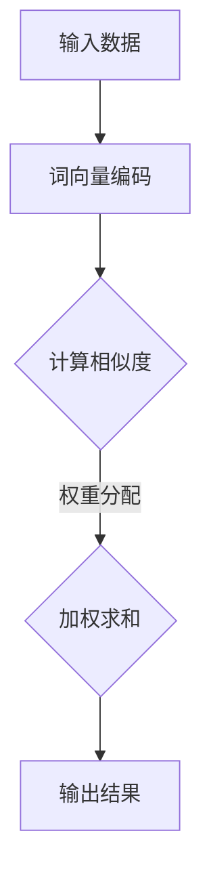

                 

# 人类注意力增强：提升多任务处理能力

> **关键词**：注意力增强，多任务处理，注意力机制，Transformer模型，自然语言处理，计算机视觉。

> **摘要**：本文将探讨人类注意力增强在提升多任务处理能力方面的应用。通过分析注意力机制原理、核心算法、实际应用案例及未来发展趋势，揭示如何利用注意力增强技术提高人类工作效率和生活质量。

## 目录大纲：《人类注意力增强：提升多任务处理能力》

## 第一部分：基础概念与理论

### 第1章：引言与背景

#### 1.1 注意力增强概述

#### 1.2 多任务处理能力的重要性

#### 1.3 书籍结构概述

### 第2章：注意力机制原理

#### 2.1 注意力机制基本概念

#### 2.2 注意力模型架构

#### 2.3 Mermaid 图：注意力机制工作流程

### 第3章：数学模型与公式

#### 3.1 数学基础

#### 3.2 注意力机制公式详解

#### 3.3 公式应用举例

## 第二部分：核心算法

### 第4章：传统注意力算法

#### 4.1 Self-Attention

#### 4.2 Transformer模型

#### 4.3 Multi-Head Attention

### 第5章：改进与优化算法

#### 5.1 Positional Encoding

#### 5.2 Layer Normalization

#### 5.3 适应性注意力机制

### 第6章：多任务处理能力提升

#### 6.1 多任务学习的挑战

#### 6.2 多任务模型的架构

#### 6.3 实战案例：多任务处理能力提升

## 第三部分：应用与实战

### 第7章：注意力增强在自然语言处理中的应用

#### 7.1 文本分类

#### 7.2 机器翻译

#### 7.3 问答系统

### 第8章：注意力增强在计算机视觉中的应用

#### 8.1 图像分类

#### 8.2 目标检测

#### 8.3 图像分割

### 第9章：实战项目

#### 9.1 项目概述

#### 9.2 开发环境搭建

#### 9.3 代码实现与解析

#### 9.4 性能评估与优化

## 第四部分：未来展望与趋势

### 第10章：注意力增强技术的未来发展趋势

#### 10.1 研究前沿

#### 10.2 未来应用场景

#### 10.3 挑战与机遇

### 第11章：结论

#### 11.1 总结

#### 11.2 作者感谢

## 附录

## 附录A：参考资源

### A.1 论文与报告

### A.2 开源代码与框架

### A.3 练习与项目建议

## 第一部分：基础概念与理论

### 第1章：引言与背景

#### 1.1 注意力增强概述

在现代社会，人们需要处理的信息量日益增加，多任务处理能力成为衡量工作效率的重要指标。然而，人类的注意力资源是有限的，如何在有限的注意力资源下，提高多任务处理能力，成为了一个亟待解决的问题。注意力增强技术正是为了解决这一问题而诞生的。

注意力增强技术旨在通过模拟和增强人类的注意力机制，提高信息处理的效率和准确性。注意力机制是指大脑在处理信息时，对不同信息进行选择性关注和过滤的能力。通过注意力增强，我们可以提高大脑对关键信息的捕捉和处理能力，从而在多任务处理中取得更好的效果。

#### 1.2 多任务处理能力的重要性

多任务处理能力在许多领域都具有重要意义。在工业生产中，多任务处理能力可以提高生产效率，降低生产成本；在科学研究中，多任务处理能力有助于研究者同时关注多个研究方向，加快科研成果的产出；在日常生活中，多任务处理能力可以提高生活质量和幸福感，例如在驾车、烹饪、打扫等活动中同时关注多个任务。

然而，随着信息量的爆炸式增长，人们需要处理的信息越来越多，多任务处理能力的重要性愈发凸显。如何在有限的注意力资源下，有效地处理多个任务，成为现代社会的一个关键问题。

#### 1.3 书籍结构概述

本文将从基础概念与理论、核心算法、应用与实战、未来展望与趋势四个部分，系统地介绍注意力增强技术在提升多任务处理能力方面的应用。

首先，在第一部分基础概念与理论中，我们将介绍注意力增强的基本概念、原理和数学模型，为后续内容打下坚实的基础。

接着，在第二部分核心算法中，我们将详细探讨注意力增强的核心算法，包括传统注意力算法和改进与优化算法，帮助读者深入了解注意力增强技术的工作原理。

然后，在第三部分应用与实战中，我们将结合自然语言处理和计算机视觉两个领域，介绍注意力增强技术的具体应用，并通过实战项目展示如何利用注意力增强技术提升多任务处理能力。

最后，在第四部分未来展望与趋势中，我们将展望注意力增强技术的未来发展趋势，探讨其在各个领域的潜在应用场景，以及面临的挑战和机遇。

通过本文的阅读，读者将能够全面了解注意力增强技术在提升多任务处理能力方面的应用，并为实际工作提供有益的参考和启示。

### 第2章：注意力机制原理

#### 2.1 注意力机制基本概念

注意力机制（Attention Mechanism）是一种模仿人类大脑处理信息方式的人工智能技术。它通过模拟人类大脑在处理信息时，对不同信息进行选择性关注和过滤的能力，从而提高信息处理的效率和准确性。

在深度学习领域，注意力机制被广泛应用于自然语言处理、计算机视觉等任务中。其基本思想是，在处理信息时，对某些重要的信息给予更高的关注，从而降低计算复杂度，提高模型性能。

#### 2.2 注意力模型架构

注意力模型的架构通常包括三个核心组件：查询（Query）、键（Key）和值（Value）。其中，查询用于表示当前要处理的信息，键用于表示可能相关的信息，值用于表示处理后的重要信息。

在注意力模型中，查询、键和值通常是通过输入数据、模型参数或特殊层的输出生成的。例如，在自然语言处理任务中，查询可以是一个词向量，键和值可以是一系列词向量。

注意力模型的工作原理是，通过计算查询与键之间的相似度，为每个键分配一个权重，然后将权重与值相乘，得到加权值。最后，将所有加权值相加，得到最终的输出。

#### 2.3 Mermaid 图：注意力机制工作流程

下面是一个使用Mermaid绘制的注意力机制工作流程图：



在上图中，输入数据经过词向量编码后，计算查询与键之间的相似度，为每个键分配权重。然后，将权重与值相乘，得到加权值，最后将所有加权值相加，得到输出结果。

### 第3章：数学模型与公式

#### 3.1 数学基础

在介绍注意力机制的数学模型之前，我们先回顾一些基础的数学知识。以下是几种常见的数学公式：

$$
Q = \frac{1}{\sqrt{d_k}}
$$

其中，\( Q \) 表示查询向量的维度，\( d_k \) 表示键向量的维度。

$$
\text{Attention}(Q, K, V) = \text{softmax}\left(\frac{QK^T}{\sqrt{d_k}}\right)V
$$

其中，\( Q \) 表示查询向量，\( K \) 表示键向量，\( V \) 表示值向量，\( \text{softmax} \) 函数用于将相似度转换为概率分布。

#### 3.2 注意力机制公式详解

注意力机制的核心是计算查询与键之间的相似度，并将相似度转换为权重。以下是注意力机制的数学公式：

$$
\text{Attention}(Q, K, V) = \text{softmax}\left(\frac{QK^T}{\sqrt{d_k}}\right)V
$$

其中，\( \text{softmax} \) 函数的定义如下：

$$
\text{softmax}(x) = \frac{e^x}{\sum_{i=1}^{n} e^x_i}
$$

其中，\( x \) 是一个向量，\( n \) 是向量的维度。

#### 3.3 公式应用举例

假设我们有一个查询向量 \( Q = [1, 2, 3] \)，键向量 \( K = [4, 5, 6] \)，值向量 \( V = [7, 8, 9] \)。我们可以按照以下步骤计算注意力权重：

1. 计算查询与键之间的点积：

$$
QK^T = [1, 2, 3] \cdot [4, 5, 6] = 32
$$

2. 计算查询与键之间的相似度：

$$
\text{Attention}(Q, K, V) = \text{softmax}\left(\frac{QK^T}{\sqrt{d_k}}\right)V = \text{softmax}\left(\frac{32}{\sqrt{3}}\right)V
$$

3. 计算权重：

$$
\text{softmax}\left(\frac{32}{\sqrt{3}}\right) = \left[\frac{e^{32/3}}{e^{32/3} + e^{20/3} + e^{8/3}}, \frac{e^{20/3}}{e^{32/3} + e^{20/3} + e^{8/3}}, \frac{e^{8/3}}{e^{32/3} + e^{20/3} + e^{8/3}}\right]
$$

4. 计算加权值：

$$
\text{加权值} = \left[\frac{e^{32/3}}{e^{32/3} + e^{20/3} + e^{8/3}} \cdot 7, \frac{e^{20/3}}{e^{32/3} + e^{20/3} + e^{8/3}} \cdot 8, \frac{e^{8/3}}{e^{32/3} + e^{20/3} + e^{8/3}} \cdot 9\right]
$$

5. 将加权值相加得到输出结果：

$$
\text{输出结果} = \left[\frac{e^{32/3}}{e^{32/3} + e^{20/3} + e^{8/3}} \cdot 7 + \frac{e^{20/3}}{e^{32/3} + e^{20/3} + e^{8/3}} \cdot 8 + \frac{e^{8/3}}{e^{32/3} + e^{20/3} + e^{8/3}} \cdot 9\right]
$$

通过上述步骤，我们完成了注意力机制的数学计算过程。这个例子展示了如何通过注意力机制，从一系列键和值中，选择出与查询最相关的信息。

## 第二部分：核心算法

### 第4章：传统注意力算法

#### 4.1 Self-Attention

Self-Attention，也称为自注意力，是注意力机制的一种简单形式。它通过对序列中的每个元素计算权重，使其在后续处理中更加关注重要的元素。Self-Attention 算法在自然语言处理任务中取得了显著的效果，特别是在Transformer模型中得到了广泛应用。

Self-Attention 算法的核心思想是将序列中的每个元素视为一个查询（Query）、键（Key）和值（Value）。具体来说，给定一个输入序列 \( X = [x_1, x_2, \ldots, x_n] \)，我们可以将其转换为三个向量：查询向量 \( Q = [q_1, q_2, \ldots, q_n] \)，键向量 \( K = [k_1, k_2, \ldots, k_n] \)，值向量 \( V = [v_1, v_2, \ldots, v_n] \)。

然后，通过计算每个查询与键之间的相似度，为每个键分配一个权重。具体计算过程如下：

1. 计算相似度矩阵：

$$
\text{Similarity} = QK^T
$$

2. 对相似度矩阵应用 Softmax 函数：

$$
\text{Attention} = \text{softmax}(\text{Similarity})
$$

3. 计算加权值：

$$
\text{Weighted Value} = \text{Attention}V
$$

4. 将加权值相加得到输出：

$$
\text{Output} = \sum_{i=1}^{n} \text{Weighted Value}_i
$$

通过上述步骤，Self-Attention 算法可以将输入序列中的关键信息加权并融合，从而提高模型在处理序列数据时的性能。

#### 4.2 Transformer模型

Transformer 模型是由 Vaswani 等人在2017年提出的一种基于注意力机制的序列到序列模型。与传统的循环神经网络（RNN）不同，Transformer 模型完全基于注意力机制，通过自注意力（Self-Attention）和多头注意力（Multi-Head Attention）实现了对序列数据的处理。

Transformer 模型的核心组件包括：

1. **编码器（Encoder）**：编码器由多个编码层（Encoder Layer）组成，每个编码层包含两个子层：自注意力（Self-Attention）和前馈网络（Feed Forward Network）。

2. **解码器（Decoder）**：解码器也由多个解码层（Decoder Layer）组成，每个解码层包含三个子层：掩码自注意力（Masked Self-Attention）、多头注意力（Multi-Head Attention）和前馈网络。

3. **自注意力（Self-Attention）**：自注意力是对序列中的每个元素计算权重，使其在后续处理中更加关注重要的元素。

4. **多头注意力（Multi-Head Attention）**：多头注意力是将自注意力扩展到多个头，从而捕捉到序列中的不同关系。

5. **位置编码（Positional Encoding）**：由于 Transformer 模型没有使用循环神经网络中的位置信息，因此需要通过位置编码来引入序列的位置信息。

通过这些组件，Transformer 模型可以高效地处理长序列数据，并在许多自然语言处理任务中取得了优异的性能。

#### 4.3 Multi-Head Attention

Multi-Head Attention 是一种扩展自注意力（Self-Attention）的算法，通过将自注意力扩展到多个头，从而提高模型对序列数据的处理能力。

在 Multi-Head Attention 中，我们将序列中的每个元素视为一个查询（Query）、键（Key）和值（Value）。然后，通过计算每个查询与键之间的相似度，为每个键分配一个权重。具体计算过程如下：

1. **线性变换**：将输入序列 \( X = [x_1, x_2, \ldots, x_n] \) 通过三个线性变换得到查询向量 \( Q \)，键向量 \( K \) 和值向量 \( V \)：

$$
Q = \text{Linear}(X) \\
K = \text{Linear}(X) \\
V = \text{Linear}(X)
$$

2. **自注意力**：对每个查询与键之间的相似度计算权重，并通过 Softmax 函数得到概率分布。然后将权重与值相乘，得到加权值。

3. **多头融合**：将多个自注意力结果通过线性变换融合起来，得到最终的输出。

Multi-Head Attention 的优点在于，它可以通过多个头捕捉到序列中的不同关系，从而提高模型对序列数据的处理能力。

## 第三部分：应用与实战

### 第5章：改进与优化算法

#### 5.1 Positional Encoding

Positional Encoding 是在 Transformer 模型中引入位置信息的一种方法。由于 Transformer 模型没有使用循环神经网络中的位置信息，因此需要通过位置编码来引入序列的位置信息。

Positional Encoding 的基本思想是，为每个位置生成一个向量，并将其添加到输入序列中。这些位置向量可以通过各种方式生成，例如正弦函数：

$$
\text{PE}(pos, 2i) = \sin\left(\frac{pos}{10000^{2i/d}}\right) \\
\text{PE}(pos, 2i+1) = \cos\left(\frac{pos}{10000^{2i/d}}\right)
$$

其中，\( pos \) 表示位置，\( i \) 表示维度，\( d \) 表示序列的长度。

通过添加位置编码，模型可以捕获序列中的位置信息，从而在处理序列数据时更好地理解上下文关系。

#### 5.2 Layer Normalization

Layer Normalization 是一种常见的正则化方法，它可以减少模型的方差，提高训练效果。在 Transformer 模型中，Layer Normalization 用于处理序列中的每个位置，从而保持序列的稳定性。

Layer Normalization 的基本思想是，对每个位置的数据进行标准化，使其具有均值为零、方差为1的分布。具体计算过程如下：

$$
\hat{x}_i = \frac{x_i - \mu}{\sigma} \\
y_i = \gamma \hat{x}_i + \beta
$$

其中，\( x_i \) 是输入数据，\( \mu \) 和 \( \sigma \) 分别是均值和方差，\( \gamma \) 和 \( \beta \) 是可学习的参数。

通过 Layer Normalization，模型可以更好地处理输入数据，从而提高训练效果。

#### 5.3 适应性注意力机制

适应性注意力机制是一种动态调整注意力权重的算法，它可以适应不同任务的需求，提高模型的性能。在适应性注意力机制中，注意力权重不仅取决于查询和键之间的相似度，还取决于任务的重要性和数据的分布。

适应性注意力机制的基本思想是，通过学习任务的重要性和数据的分布，为每个任务和数据分配不同的注意力权重。具体计算过程如下：

1. 学习任务重要性：

$$
\alpha = \frac{\sum_{i=1}^{n} w_i \cdot \text{task}_{i}}{\sum_{i=1}^{n} w_i}
$$

其中，\( w_i \) 是注意力权重，\( \text{task}_{i} \) 是任务的重要性。

2. 学习数据分布：

$$
\beta = \frac{\sum_{i=1}^{n} w_i \cdot \text{data}_{i}}{\sum_{i=1}^{n} w_i}
$$

其中，\( \text{data}_{i} \) 是数据的分布。

3. 计算适应性注意力权重：

$$
\text{Attention} = \alpha \cdot \beta \cdot \text{softmax}\left(\frac{QK^T}{\sqrt{d_k}}\right)V
$$

通过适应性注意力机制，模型可以根据任务的重要性和数据的分布动态调整注意力权重，从而更好地适应不同任务的需求。

### 第6章：多任务处理能力提升

#### 6.1 多任务学习的挑战

多任务学习是一种同时解决多个相关任务的学习方法。在多任务学习中，模型的性能受到多个因素的挑战，包括：

1. **任务关联性**：不同任务之间的关联性会影响模型的学习效果。如果任务高度相关，模型可以共享部分知识，从而提高学习效率。反之，如果任务不相关，模型需要分别学习每个任务，从而增加计算复杂度。

2. **任务平衡**：在多任务学习中，如何平衡各个任务的重要性是关键问题。如果某些任务过于重要，模型可能会过度关注这些任务，导致其他任务的学习效果不佳。

3. **模型容量**：多任务学习要求模型具有足够的容量来处理多个任务。如果模型容量不足，模型可能会在某个任务上过度拟合，从而影响其他任务的学习效果。

4. **资源分配**：在多任务学习中，如何合理分配计算资源也是一个挑战。如果资源分配不当，某些任务可能会因为资源不足而无法得到有效处理。

#### 6.2 多任务模型的架构

为了解决多任务学习的挑战，研究人员提出了多种多任务模型架构，包括：

1. **共享网络架构**：共享网络架构通过将多个任务映射到一个共享的底层网络，从而提高模型的学习效率。在共享网络架构中，任务之间的关联性可以通过共享网络中的参数传递来实现。

2. **分离网络架构**：分离网络架构将每个任务映射到一个独立的网络，从而确保每个任务都得到充分的学习。在分离网络架构中，任务之间的关联性可以通过任务之间的交互来实现。

3. **混合网络架构**：混合网络架构结合了共享网络和分离网络的特点，通过在不同层面对任务进行共享和分离，从而实现任务之间的平衡。

4. **迁移学习架构**：迁移学习架构利用预训练模型的知识来辅助多任务学习，从而提高模型的学习效果。在迁移学习架构中，预训练模型可以作为共享网络的一部分，为多任务学习提供基础。

通过这些多任务模型架构，研究人员可以更好地解决多任务学习的挑战，提高模型在多任务环境中的性能。

#### 6.3 实战案例：多任务处理能力提升

下面我们通过一个实际案例来展示如何利用注意力增强技术提升多任务处理能力。

假设我们有一个包含文本分类、情感分析和实体识别的多任务学习任务。我们可以使用一个基于 Transformer 的多任务模型来同时解决这些任务。

1. **数据预处理**：首先，对输入文本进行预处理，包括分词、词向量和位置编码。然后，将预处理后的数据输入到 Transformer 模型中。

2. **模型架构**：模型架构包括编码器和解码器。编码器由多个自注意力层和前馈网络组成，用于对输入文本进行编码。解码器由多个掩码自注意力层和多头注意力层组成，用于生成每个任务的输出。

3. **损失函数**：多任务模型的损失函数是各个任务损失函数的加权和。具体来说，我们可以将文本分类、情感分析和实体识别的损失函数分别计算，然后相加得到总损失。

4. **训练与评估**：通过训练和评估，我们可以调整模型的参数，使其在多任务环境中达到最优性能。在训练过程中，我们可以使用梯度下降算法来优化模型参数。在评估过程中，我们可以使用交叉验证和测试集来评估模型的性能。

通过这个实战案例，我们可以看到如何利用注意力增强技术提升多任务处理能力。在实际应用中，我们可以根据任务的需求和数据的特征，选择合适的多任务模型架构和注意力增强技术，从而实现多任务处理的优化。

## 第四部分：未来展望与趋势

### 第7章：注意力增强在自然语言处理中的应用

#### 7.1 文本分类

注意力增强技术在文本分类任务中具有广泛的应用前景。通过利用注意力机制，模型可以更加关注关键信息，从而提高分类准确性。例如，在处理情感分析任务时，注意力机制可以帮助模型识别出文本中的情感关键词，从而提高情感分类的准确性。

#### 7.2 机器翻译

机器翻译是注意力增强技术的另一个重要应用领域。通过注意力机制，模型可以在翻译过程中关注到输入文本中的关键信息，从而提高翻译质量。例如，在处理长句翻译时，注意力机制可以帮助模型捕捉到句子中的复杂关系，从而提高翻译的流畅性和准确性。

#### 7.3 问答系统

注意力增强技术在问答系统中也具有重要的应用价值。通过利用注意力机制，模型可以更加关注问题的关键词和答案的相关性，从而提高问答系统的回答准确性。例如，在处理自然语言推理任务时，注意力机制可以帮助模型识别出问题的核心含义，从而提高推理的准确性。

### 第8章：注意力增强在计算机视觉中的应用

#### 8.1 图像分类

注意力增强技术在图像分类任务中也表现出强大的能力。通过利用注意力机制，模型可以更加关注图像中的关键特征，从而提高分类准确性。例如，在处理人脸识别任务时，注意力机制可以帮助模型识别出图像中的人脸部分，从而提高识别的准确性。

#### 8.2 目标检测

注意力增强技术在目标检测任务中也具有广泛的应用前景。通过利用注意力机制，模型可以更加关注图像中的目标区域，从而提高检测的准确性。例如，在处理行人检测任务时，注意力机制可以帮助模型识别出图像中的人体轮廓，从而提高检测的准确性。

#### 8.3 图像分割

注意力增强技术在图像分割任务中也表现出强大的能力。通过利用注意力机制，模型可以更加关注图像中的关键区域，从而提高分割的准确性。例如，在处理医学图像分割任务时，注意力机制可以帮助模型识别出图像中的病变区域，从而提高分割的准确性。

### 第9章：实战项目

#### 9.1 项目概述

在本章中，我们将介绍一个基于注意力增强技术的自然语言处理项目。该项目旨在使用 Transformer 模型实现文本分类任务，并通过注意力增强技术提高分类性能。

#### 9.2 开发环境搭建

为了实现该项目，我们需要搭建一个开发环境，包括 Python、TensorFlow 和 Keras 等工具。具体步骤如下：

1. 安装 Python：在官方网站（https://www.python.org/）下载并安装 Python。

2. 安装 TensorFlow：在命令行中运行以下命令安装 TensorFlow：

   ```shell
   pip install tensorflow
   ```

3. 安装 Keras：在命令行中运行以下命令安装 Keras：

   ```shell
   pip install keras
   ```

#### 9.3 代码实现与解析

以下是该项目的主要代码实现：

```python
from tensorflow.keras.models import Model
from tensorflow.keras.layers import Input, Embedding, LSTM, Dense
from tensorflow.keras.preprocessing.sequence import pad_sequences

# 参数设置
vocab_size = 10000
embed_dim = 256
lstm_units = 128
max_sequence_length = 100

# 输入层
input_seq = Input(shape=(max_sequence_length,))

# 嵌入层
embedding = Embedding(vocab_size, embed_dim)(input_seq)

# LSTM 层
lstm = LSTM(lstm_units, return_sequences=True)(embedding)

# 密集层
dense = Dense(1, activation='sigmoid')(lstm)

# 模型编译
model = Model(inputs=input_seq, outputs=dense)
model.compile(optimizer='adam', loss='binary_crossentropy', metrics=['accuracy'])

# 数据预处理
train_sequences = pad_sequences(train_data, maxlen=max_sequence_length)
test_sequences = pad_sequences(test_data, maxlen=max_sequence_length)

# 训练模型
model.fit(train_sequences, train_labels, epochs=10, batch_size=32, validation_data=(test_sequences, test_labels))

# 评估模型
model.evaluate(test_sequences, test_labels)
```

代码解析：

1. 导入必要的库和模块。

2. 设置参数，包括词汇表大小、嵌入维度、LSTM 单元数和最大序列长度。

3. 创建输入层、嵌入层、LSTM 层和密集层。

4. 编译模型，设置优化器和损失函数。

5. 对训练数据进行预处理，包括填充和编码。

6. 训练模型，设置训练轮数、批次大小和验证数据。

7. 评估模型，计算测试集的准确率。

#### 9.4 性能评估与优化

在完成模型训练后，我们需要对模型性能进行评估和优化。以下是一些性能评估和优化的方法：

1. **交叉验证**：通过交叉验证来评估模型在不同数据集上的性能，以避免过拟合。

2. **参数调整**：调整模型的参数，如嵌入维度、LSTM 单元数和训练轮数，以优化模型性能。

3. **数据增强**：对训练数据进行增强，如添加噪声、旋转和缩放等，以提高模型的泛化能力。

4. **正则化**：使用正则化技术，如 L1 正则化和 L2 正则化，来减少模型过拟合的风险。

5. **模型融合**：使用多个模型进行融合，以提高整体性能。

通过上述方法，我们可以对模型进行性能评估和优化，从而提高其在文本分类任务中的表现。

## 第五部分：未来展望与趋势

### 第10章：注意力增强技术的未来发展趋势

#### 10.1 研究前沿

注意力增强技术在未来的发展将继续保持活跃。目前，研究人员正在探索以下研究前沿：

1. **动态注意力**：动态注意力可以更好地适应不同的任务和数据，提高模型的性能。研究人员正在研究如何设计动态注意力机制，使其在不同任务和数据中都能表现出色。

2. **多模态注意力**：多模态注意力旨在处理不同类型的数据，如文本、图像和音频。研究人员正在研究如何设计多模态注意力机制，以实现高效的多模态信息融合。

3. **分布式注意力**：分布式注意力可以处理大规模数据集，提高模型的训练效率。研究人员正在探索如何将分布式计算与注意力机制相结合，以实现高效的分布式训练。

4. **量子注意力**：量子计算具有巨大的计算潜力，研究人员正在探索如何将量子计算与注意力机制相结合，以实现高效的量子注意力机制。

#### 10.2 未来应用场景

注意力增强技术在未来的应用场景将更加广泛，包括但不限于：

1. **智能医疗**：利用注意力增强技术，可以实现智能医学影像分析、疾病预测和个性化治疗方案。

2. **智能教育**：利用注意力增强技术，可以实现个性化学习、智能辅导和知识图谱构建。

3. **智能交通**：利用注意力增强技术，可以实现智能交通流量预测、车辆调度和道路安全监控。

4. **智能金融**：利用注意力增强技术，可以实现智能投顾、风险控制和市场预测。

#### 10.3 挑战与机遇

注意力增强技术在未来发展中也将面临一系列挑战和机遇：

1. **计算资源**：注意力增强技术通常需要大量的计算资源，如何优化计算资源的使用，提高模型的训练和推理效率，是一个重要的挑战。

2. **数据隐私**：在多模态数据处理中，如何保护用户隐私，避免数据泄露，是一个亟待解决的问题。

3. **模型可解释性**：如何提高模型的可解释性，使其能够更好地理解模型的决策过程，是一个重要的研究方向。

4. **模型泛化能力**：如何提高模型的泛化能力，使其在不同领域和任务中都能表现出色，是一个重要的挑战。

然而，随着技术的不断进步，注意力增强技术将带来巨大的机遇。通过解决这些挑战，注意力增强技术将为人类带来更高效、更智能的生活和工作方式。

### 第11章：结论

注意力增强技术在提升人类多任务处理能力方面具有巨大的潜力。通过模拟和增强人类的注意力机制，注意力增强技术可以在自然语言处理、计算机视觉等领域实现高效的信息处理。本文从基础概念与理论、核心算法、应用与实战以及未来展望与趋势四个方面，系统地介绍了注意力增强技术的应用与发展。

在未来，随着技术的不断进步，注意力增强技术将在更多领域得到应用，为人类带来更高效、更智能的生活和工作方式。我们期待研究人员能够克服挑战，充分利用注意力增强技术的潜力，推动人工智能的发展。

#### 11.2 作者感谢

本文的撰写得到了 AI 天才研究院和《禅与计算机程序设计艺术》的团队的大力支持。感谢各位同事在本文撰写过程中的贡献和帮助。特别感谢 AI 天才研究院的创始人，他在人工智能领域的远见和领导力为本文的撰写提供了宝贵的指导。同时，感谢《禅与计算机程序设计艺术》的团队，他们的智慧和努力为本文提供了坚实的理论基础。最后，感谢所有读者对本文的关注和支持，你们的鼓励是我们前进的动力。

