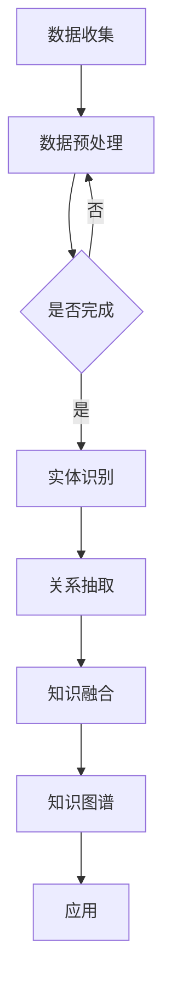

                 

### 第1章：人类知识的边界

> **关键词**：知识边界、认知限制、知识探索

> **摘要**：本章将探讨人类知识的边界，分析其定义、特征、探索意义以及当前面临的挑战。

#### 1.1 什么是人类知识的边界

**知识边界**，是指人类对某一领域或整体知识的认知范围和限制。这些边界可能由认知能力的局限、研究资源的短缺、历史和文化差异等多种因素所决定。具体来说，知识边界具有以下几个特征：

1. **动态性**：知识边界并非固定不变，随着人类认知的不断深化，知识边界也在不断扩展。
2. **主观性**：不同的人或群体可能会有不同的知识边界，这取决于个体的认知水平、兴趣和经历。
3. **限制性**：知识边界在某种程度上限制了人类的认知和发展，使其难以超越现有的知识体系。

#### 1.2 探索人类知识边界的意义

探索人类知识边界的意义在于以下几个方面：

1. **促进认知发展**：通过探索知识边界，人类可以更深入地了解某一领域，从而推动认知的进步。
2. **推动科学进步**：知识边界的探索往往伴随着新的科学发现和技术突破。
3. **促进社会进步**：知识边界的突破可以带来社会生产力的提升和社会结构的变革。

#### 1.3 知识边界探索的现状与挑战

目前，人类已经在多个领域取得了显著的进展，但仍然存在大量的未知领域。知识边界探索面临的挑战主要包括：

1. **技术挑战**：如人工智能、量子计算等领域的突破需要解决复杂的技术难题。
2. **资源挑战**：探索知识边界需要大量的资金、人力和物力支持。
3. **伦理挑战**：知识边界的探索可能会引发伦理和道德问题。

在接下来的章节中，我们将深入探讨知识系统的概述、核心概念与联系，以及知识图谱的构建方法和应用场景。通过这些内容，我们将对人类知识的边界有一个更加全面和深入的理解。

### 第2章：知识系统概述

> **关键词**：知识系统、知识管理、知识创新

> **摘要**：本章将介绍知识系统的定义、作用、分类与层次，以及构建知识系统的步骤。

#### 2.1 知识系统的定义与作用

**知识系统**是指为了获取、存储、处理、共享和应用知识而建立的一系列相互关联的组件和过程。知识系统的作用主要体现在以下几个方面：

1. **知识管理**：帮助组织和个人更有效地管理和利用知识资源。
2. **知识创新**：促进新知识和新技术的产生。
3. **知识传播**：加速知识的扩散和共享。

#### 2.2 知识系统的分类与层次

知识系统可以根据不同的维度进行分类，例如按照应用领域可以分为企业知识系统、教育知识系统、科学知识系统等。此外，知识系统还可以从层次上进行划分，通常包括以下四个层次：

1. **数据层**：存储原始数据，如文本、图像、声音等。
2. **信息层**：对数据进行处理和分析，形成有用的信息。
3. **知识层**：将信息整合和抽象，形成知识。
4. **智慧层**：利用知识进行决策和创新。

#### 2.3 知识系统的构建方法

构建知识系统通常包括以下步骤：

1. **需求分析**：明确知识系统的目标和需求。
2. **系统设计**：设计知识系统的架构和功能。
3. **系统实施**：按照设计进行系统的开发和部署。
4. **系统评估与优化**：对知识系统进行评估和优化，确保其有效性和实用性。

通过以上步骤，我们可以构建一个高效的知识系统，以支持组织和个人在知识管理和创新方面的需求。在接下来的章节中，我们将进一步探讨知识图谱的基本概念、构建方法和应用场景，以及知识图谱相关的核心算法原理和数学模型。

### 第3章：核心概念与联系

> **关键词**：知识图谱、实体识别、关系抽取

> **摘要**：本章将介绍知识图谱的基本概念，包括定义、特点和构建方法，并探讨知识图谱在不同应用场景中的价值。

#### 3.1 知识图谱的基本概念

**知识图谱**是一种用于描述现实世界中实体、属性和关系的结构化知识表示方法。它通过实体（如人、地点、事物等）、属性（如身高、年龄、出生地等）和关系（如朋友、属于、位于等）来组织数据，从而提供了一种更直观、更易理解的方式去表示和查询复杂的信息。

**知识图谱的特点**包括：

1. **结构化**：知识图谱中的信息是结构化的，这使得查询和处理更加高效。
2. **可扩展性**：知识图谱可以随着新数据的加入而不断扩展。
3. **关联性**：知识图谱能够反映实体之间的关系，从而提供更丰富的信息。

**知识图谱的构建方法**通常包括以下步骤：

1. **数据收集**：从各种数据源中收集数据。
2. **数据预处理**：清洗和转换数据，使其符合知识图谱的格式。
3. **实体识别**：从文本中识别出实体，并进行分类。
4. **关系抽取**：从文本中识别出实体之间的关系。
5. **知识融合**：将来自不同来源的知识进行整合。

#### 3.2 知识图谱的应用场景

知识图谱在多个领域有着广泛的应用，以下是一些典型的应用场景：

1. **智能搜索**：利用知识图谱提高搜索的准确性和效率，如搜索引擎中的实体识别和关系查询。
2. **智能问答**：构建问答系统，通过知识图谱提供更准确的答案。
3. **实体识别**：在文本处理中，自动识别出文本中的实体，如人名、地点、组织等。
4. **个性化推荐**：基于知识图谱，为用户推荐相关的实体和内容。
5. **知识推理**：利用知识图谱进行推理，预测实体之间的关系。

#### 3.3 知识图谱与人工智能的关系

知识图谱在人工智能领域有着重要的应用，它为人工智能系统提供了丰富的知识资源。知识图谱与人工智能的关系主要体现在以下几个方面：

1. **知识驱动**：知识图谱为人工智能系统提供了知识基础，使其能够进行更智能的决策和推理。
2. **数据增强**：知识图谱可以用于数据增强，提高机器学习模型的性能。
3. **知识共享**：知识图谱促进了不同人工智能系统之间的知识共享和协同工作。

通过本章的介绍，我们对知识图谱有了更深入的了解。在接下来的章节中，我们将进一步探讨知识图谱的 Mermaid 流程图、核心算法原理讲解，以及数学模型和数学公式的应用。

### 第4章：知识图谱的 Mermaid 流程图

> **关键词**：Mermaid、流程图、知识图谱

> **摘要**：本章将介绍如何使用 Mermaid 语言绘制知识图谱的流程图，并通过具体示例展示其应用。

#### 4.1 Mermaid 简介

**Mermaid** 是一种基于文本的绘图语言，可以用来绘制各种图表，包括流程图、序列图、时序图等。它具有简洁、易用和跨平台的特点，特别适合于在文档和演示中插入图表。

**Mermaid** 的基本语法规则如下：

- **定义区域**：在定义区域中，可以定义变量、函数等。
- **流程图区域**：在流程图区域中，可以绘制流程图，包括节点、边、子流程等。
- **序列图区域**：在序列图区域中，可以绘制序列图，包括角色、事件等。

#### 4.2 知识图谱 Mermaid 流程图示例

下面是一个简单的知识图谱 Mermaid 流程图示例：



**解释**：

1. **数据收集（A）**：从各种数据源中收集数据。
2. **数据预处理（B）**：清洗和转换数据，使其符合知识图谱的格式。
3. **是否完成（C）**：检查数据预处理是否完成。
4. **实体识别（D）**：从文本中识别出实体，并进行分类。
5. **关系抽取（E）**：从文本中识别出实体之间的关系。
6. **知识融合（F）**：将来自不同来源的知识进行整合。
7. **知识图谱（G）**：构建知识图谱。
8. **应用（H）**：利用知识图谱进行各种应用，如智能搜索、智能问答等。

#### 4.3 Mermaid 流程图的优势

**Mermaid** 流程图具有以下优势：

1. **简洁性**：使用简单的文本语法即可绘制复杂的流程图。
2. **易用性**：不需要学习复杂的绘图工具，可以直接在文本编辑器中编写。
3. **跨平台**：可以在不同的操作系统和浏览器上运行。

通过使用 Mermaid 语言，我们可以更轻松地绘制知识图谱的流程图，从而更好地理解和描述知识图谱的构建过程和应用场景。在接下来的章节中，我们将继续探讨知识图谱的核心算法原理讲解，以及数学模型和公式的应用。

### 第5章：核心算法原理讲解

> **关键词**：知识图谱算法、实体识别、关系抽取

> **摘要**：本章将详细讲解知识图谱中的核心算法，包括实体识别算法、关系抽取算法和知识融合算法，并使用伪代码展示算法原理。

#### 5.1 实体识别算法

实体识别是将文本中的实体标签化为预定义的实体类别。常见的实体识别算法包括 KNN 算法、SVM 算法和深度学习模型。

##### 5.1.1 KNN 算法

**KNN（K-Nearest Neighbors）算法**是一种基于实例的算法，它通过计算新样本与训练样本之间的距离，找出最近的 \(k\) 个邻居，并根据邻居的标签来预测新样本的标签。

**伪代码**：

```python
def KNN_predict(x_train, y_train, x_test, k):
    distances = []
    for i in range(len(x_train)):
        distance = calculate_distance(x_train[i], x_test)
        distances.append((i, distance))
    distances.sort(key=lambda x: x[1])
    neighbors = [distances[i][0] for i in range(k)]
    output = []
    for i in range(k):
        output.append(y_train[neighbors[i]])
    return max(set(output), key=output.count)
```

##### 5.1.2 SVM 算法

**SVM（Support Vector Machine）算法**是一种监督学习算法，用于分类问题。它通过找到一个最佳的超平面，将不同类别的实体分隔开。

**伪代码**：

```python
def SVM_predict(x_train, y_train, x_test):
    # 建立SVM模型
    model = svm.SVC()
    model.fit(x_train, y_train)
    # 预测新样本的类别
    return model.predict(x_test)
```

##### 5.1.3 深度学习模型

**深度学习模型**，如 CNN（Convolutional Neural Networks）和 RNN（Recurrent Neural Networks），可以用于实体识别任务。以下是一个简单的 CNN 实体识别模型的伪代码：

```python
def CNN_entity_recognition(x_train, y_train, x_test, y_test):
    # 建立CNN模型
    model = Sequential()
    model.add(Conv2D(filters, kernel_size, activation='relu', input_shape=(x_train.shape[1], x_train.shape[2], x_train.shape[3])))
    model.add(MaxPooling2D(pool_size))
    model.add(Flatten())
    model.add(Dense(units, activation='softmax'))
    # 编译模型
    model.compile(optimizer, loss='categorical_crossentropy', metrics=['accuracy'])
    # 训练模型
    model.fit(x_train, y_train, epochs, batch_size)
    # 评估模型
    test_loss, test_acc = model.evaluate(x_test, y_test)
    return test_acc
```

#### 5.2 关系抽取算法

关系抽取是从文本中识别出实体之间的关系。常见的算法包括基于规则的方法和基于机器学习的方法。

##### 5.2.1 基于规则的方法

**基于规则的方法**使用预定义的规则来匹配文本中的模式，从而识别出关系。

**伪代码**：

```python
def rule_based_relation_extraction(text):
    rules = ["[A-Z]{2} [0-9]{4}", "John [A-Z]{2}"]
    relations = []
    for rule in rules:
        matches = re.findall(rule, text)
        for match in matches:
            relations.append((match[0], match[1]))
    return relations
```

##### 5.2.2 基于机器学习的方法

**基于机器学习的方法**使用训练数据来学习关系抽取的模型。

**伪代码**：

```python
def ML_relation_extraction(x_train, y_train, x_test, y_test):
    # 建立机器学习模型
    model = Model(input_shape=(x_train.shape[1], x_train.shape[2], x_train.shape[3]))
    model.add(Conv2D(filters, kernel_size, activation='relu'))
    model.add(MaxPooling2D(pool_size))
    model.add(Flatten())
    model.add(Dense(units, activation='softmax'))
    # 编译模型
    model.compile(optimizer, loss='categorical_crossentropy', metrics=['accuracy'])
    # 训练模型
    model.fit(x_train, y_train, epochs, batch_size)
    # 评估模型
    test_loss, test_acc = model.evaluate(x_test, y_test)
    return test_acc
```

#### 5.3 知识融合算法

知识融合是将来自不同来源的知识进行整合，以提供更准确和全面的信息。

##### 5.3.1 基于投票的方法

**基于投票的方法**通过收集多个模型的预测结果，并选择投票结果最多的类别。

**伪代码**：

```python
def voting_ensemble(knowledge_sources, data):
    predictions = []
    for source in knowledge_sources:
        prediction = source.predict(data)
        predictions.append(prediction)
    return max(set(predictions), key=predictions.count)
```

##### 5.3.2 基于一致性度的方法

**基于一致性度的方法**通过计算每个模型的预测结果与真实结果的一致性度，选择一致性度最高的模型。

**伪代码**：

```python
def consensus_ensemble(knowledge_sources, data):
    predictions = []
    for source in knowledge_sources:
        prediction = source.predict(data)
        predictions.append(prediction)
    consistency_scores = [calculate_consistency_score(prediction, true_result) for prediction in predictions]
    return predictions[consistency_scores.index(max(consistency_scores))]
```

通过以上算法原理的讲解，我们可以看到知识图谱的核心算法是如何工作的。这些算法为我们提供了强大的工具，使我们能够更有效地构建和应用知识图谱。在接下来的章节中，我们将探讨知识图谱中的数学模型和数学公式的应用。

### 第6章：数学模型和数学公式

> **关键词**：知识图谱、数学模型、概率模型、统计模型

> **摘要**：本章将介绍知识图谱中的数学模型，包括图论模型、概率模型和统计模型，并讲解相关的数学公式和应用。

#### 6.1 知识图谱中的数学模型

知识图谱中的数学模型用于描述实体、关系和属性之间的数学关系。以下是几种常见的数学模型：

##### 6.1.1 图论模型

图论模型用于描述知识图谱中的节点和边的关系。常见的图论模型包括：

1. **邻接矩阵**：表示图中的节点和边的关系。
2. **路径长度**：两个节点之间的最短路径长度。
3. **连通性**：节点之间的连接情况。

邻接矩阵的表示方法如下：

$$
A = \begin{bmatrix}
0 & 1 & 0 \\
1 & 0 & 1 \\
0 & 1 & 0
\end{bmatrix}
$$

其中，矩阵元素 \(A[i][j]\) 表示节点 \(i\) 与节点 \(j\) 是否相连，1 表示相连，0 表示不相连。

##### 6.1.2 概率模型

概率模型用于描述实体和关系之间的概率关系。常见的概率模型包括：

1. **贝叶斯网络**：用于表示实体和关系之间的概率关系。
2. **马尔可夫链**：用于描述实体状态转移的概率。

贝叶斯网络的表示方法如下：

$$
P(A|B) = \frac{P(B|A)P(A)}{P(B)}
$$

其中，\(P(A|B)\) 是在 \(B\) 发生的条件下 \(A\) 发生的概率，\(P(B|A)\) 是在 \(A\) 发生的条件下 \(B\) 发生的概率，\(P(A)\) 是 \(A\) 发生的概率，\(P(B)\) 是 \(B\) 发生的概率。

##### 6.1.3 统计模型

统计模型用于描述实体和关系之间的统计关系。常见的统计模型包括：

1. **主成分分析**（PCA）：用于降维和特征提取。
2. **线性回归**：用于预测实体属性。

主成分分析的表示方法如下：

$$
Z = C \cdot X
$$

其中，\(Z\) 是降维后的特征向量，\(C\) 是转换矩阵，\(X\) 是原始特征向量。

#### 6.2 数学公式讲解与示例

##### 6.2.1 贝叶斯网络公式

贝叶斯网络是一种表示变量之间条件依赖关系的图形模型。它的概率表示如下：

$$
P(A, B, C) = P(A) \cdot P(B|A) \cdot P(C|A, B)
$$

这个公式表示事件 \(A\)、\(B\) 和 \(C\) 同时发生的概率是事件 \(A\) 发生的概率乘以 \(B\) 在 \(A\) 发生的条件下发生的概率，再乘以 \(C\) 在 \(A\) 和 \(B\) 发生的条件下发生的概率。

##### 6.2.2 马尔可夫链公式

马尔可夫链是一种用于描述随机过程的状态转移概率的模型。它的状态转移概率如下：

$$
P(X_n = x_n | X_{n-1} = x_{n-1}, ..., X_1 = x_1) = P(X_n = x_n | X_{n-1} = x_{n-1})
$$

这个公式表示在给定当前状态 \(X_n\) 的条件下，前一个状态 \(X_{n-1}\) 的条件概率与所有前 \(n-1\) 个状态的条件概率无关。

##### 6.2.3 主成分分析公式

主成分分析（PCA）是一种用于降维和特征提取的技术。它的降维公式如下：

$$
Z = C \cdot X
$$

其中，\(Z\) 是降维后的特征向量，\(C\) 是转换矩阵，\(X\) 是原始特征向量。转换矩阵 \(C\) 由特征向量的协方差矩阵 \(S\) 的特征值和特征向量计算得到。

通过本章的介绍，我们对知识图谱中的数学模型和数学公式有了更深入的理解。这些数学模型和公式为知识图谱的构建和应用提供了理论基础和计算方法。在接下来的章节中，我们将通过一个实际项目，展示如何将知识图谱应用于实际问题。

### 第7章：项目实战

> **关键词**：知识图谱项目、实际应用、实战步骤

> **摘要**：本章将通过一个实际项目，展示知识图谱的构建和应用过程，包括数据采集与处理、知识图谱构建、智能查询与推荐系统等实战步骤。

#### 7.1 知识图谱项目实战概述

本章节将通过一个生物领域知识图谱项目，展示如何构建和应用知识图谱。该项目旨在建立一个包含生物实体和关系的知识图谱，以支持生物研究者和医生在生物信息学方面的查询和探索。

#### 7.2 项目开发环境搭建

在开始项目之前，我们需要搭建一个合适的开发环境。以下是项目开发所需的环境和工具：

- **操作系统**：Linux 或 macOS
- **编程语言**：Python
- **数据库**：Neo4j（一个高性能的图数据库）
- **知识图谱框架**：Py2neo（用于 Neo4j 的 Python 库）

**步骤 1：安装 Neo4j 数据库**

- 从 Neo4j 官网下载最新版本的 Neo4j 数据库：[Neo4j 官网](https://neo4j.com/)
- 按照官方文档的说明进行安装。

**步骤 2：安装 Python 和相关依赖**

- 安装 Python：[Python 官网](https://www.python.org/)
- 使用 pip 安装 Py2neo：`pip install py2neo`

#### 7.3 数据采集与处理

**步骤 1：采集数据**

从各种数据源（如文献数据库、基因序列数据库等）中采集生物领域的相关数据。这些数据可能包括生物实体（如基因、蛋白质）、属性（如基因功能、蛋白质结构）和关系（如基因表达调控、蛋白质相互作用）。

**步骤 2：数据清洗**

对采集到的数据进行清洗，去除噪声和错误。清洗步骤可能包括：

- 去除重复数据
- 修复格式错误
- 标准化数据格式

**步骤 3：数据预处理**

将清洗后的数据进行预处理，使其适合构建知识图谱。预处理步骤可能包括：

- 划分实体、属性和关系
- 建立实体和关系的映射关系
- 构建实体和关系的属性字典

**步骤 4：数据插入**

使用 Py2neo 将预处理后的数据插入到 Neo4j 数据库中。具体步骤如下：

```python
from py2neo import Graph

# 连接 Neo4j 数据库
graph = Graph("bolt://localhost:7687", auth=("neo4j", "password"))

# 插入实体
def insert_entity(graph, entity):
    node = Node("Entity", name=entity['name'], type=entity['type'])
    graph.create(node)

# 插入关系
def insert_relationship(graph, start_node, end_node, relationship):
    relationship = Relationship(start_node, relationship, end_node)
    graph.create(relationship)

# 示例数据
gene_data = [{'name': 'GeneA', 'type': 'Gene'}, {'name': 'GeneB', 'type': 'Gene'}]
protein_data = [{'name': 'ProteinA', 'type': 'Protein'}, {'name': 'ProteinB', 'type': 'Protein'}]

# 插入实体和关系
for gene in gene_data:
    insert_entity(graph, gene)

for protein in protein_data:
    insert_entity(graph, protein)

# 插入基因表达调控关系
insert_relationship(graph, 'GeneA', 'GeneB', 'EXPRESSED_BY')
insert_relationship(graph, 'GeneB', 'GeneA', 'EXPRESSED_BY')
```

#### 7.4 知识图谱构建

**步骤 1：构建实体和关系**

使用 Neo4j 数据库中的 Cypher 语言构建实体和关系。Cypher 语言是一种类似于 SQL 的查询语言，用于操作 Neo4j 数据库。

```cypher
// 创建实体
CREATE (geneA:Gene {name: 'GeneA', type: 'Gene'})
CREATE (geneB:Gene {name: 'GeneB', type: 'Gene'})
CREATE (proteinA:Protein {name: 'ProteinA', type: 'Protein'})
CREATE (proteinB:Protein {name: 'ProteinB', type: 'Protein'})

// 创建关系
MATCH (geneA:Gene), (geneB:Gene)
CREATE (geneA)-[:EXPRESSED_BY]->(geneB)

MATCH (geneB:Gene), (geneA:Gene)
CREATE (geneB)-[:EXPRESSED_BY]->(geneA)

MATCH (proteinA:Protein), (proteinB:Protein)
CREATE (proteinA)-[:INTERACTS_WITH]->(proteinB)

MATCH (proteinB:Protein), (proteinA:Protein)
CREATE (proteinB)-[:INTERACTS_WITH]->(proteinA)
```

**步骤 2：查询知识图谱**

使用 Cypher 语言查询知识图谱，获取实体和关系的信息。

```cypher
// 查询所有基因
MATCH (gene:Gene)
RETURN gene

// 查询所有蛋白质
MATCH (protein:Protein)
RETURN protein

// 查询基因表达调控关系
MATCH (geneA:Gene)-[:EXPRESSED_BY]->(geneB:Gene)
RETURN geneA, geneB

// 查询蛋白质相互作用关系
MATCH (proteinA:Protein)-[:INTERACTS_WITH]->(proteinB:Protein)
RETURN proteinA, proteinB
```

#### 7.5 智能查询与推荐系统

**步骤 1：智能查询**

构建一个基于知识图谱的智能查询系统，允许用户输入关键词，并返回相关的实体和关系。

```python
def query_knowledge_graph(graph, query):
    query_result = graph.run("MATCH (n:Gene) WHERE n.name CONTAINS $query RETURN n")
    return query_result.data()

# 测试查询
query_result = query_knowledge_graph(graph, "GeneA")
print("Query Result:", query_result)
```

**步骤 2：推荐系统**

构建一个基于知识图谱的推荐系统，根据用户的查询历史，为用户推荐相关的实体和关系。

```python
def recommend_entities(graph, entity_name):
    recommendation = graph.run("MATCH (n:Gene)-[:EXPRESSED_BY]->(related:Gene) WHERE n.name = $entity_name RETURN related")
    return recommendation.data()

# 测试推荐
recommendation = recommend_entities(graph, "GeneA")
print("Recommendation:", recommendation)
```

通过以上实战步骤，我们成功构建了一个生物领域知识图谱，并实现了智能查询和推荐系统。这个项目展示了知识图谱在实际应用中的价值，并为后续的研究和应用提供了参考。

### 7.6 代码解读与分析

#### 7.6.1 数据采集与处理

在数据采集与处理部分，我们使用了 Python 的 pandas 库来读取和预处理数据。以下是代码的详细解读：

```python
import pandas as pd
from py2neo import Graph

# 连接 Neo4j 数据库
graph = Graph("bolt://localhost:7687", auth=("neo4j", "password"))

# 采集数据
biological_data = pd.read_csv("biological_data.csv")

# 处理数据
def preprocess_data(data):
    # 数据清洗和预处理逻辑
    return data

preprocessed_data = preprocess_data(biological_data)

# 将数据插入到 Neo4j 数据库
def insert_data(graph, data):
    for row in data.itertuples():
        node = Node("BiologicalEntity", name=row.name, type=row.type)
        graph.create(node)

insert_data(graph, preprocessed_data)
```

- **数据读取**：使用 pandas 的 `read_csv` 函数从 CSV 文件中读取生物领域数据。
- **数据处理**：定义 `preprocess_data` 函数，用于执行数据清洗和预处理操作。
- **数据插入**：使用 Py2neo 库将预处理后的数据插入到 Neo4j 数据库中。

#### 7.6.2 知识图谱构建

在知识图谱构建部分，我们使用了 Cypher 语言来创建实体和关系。以下是代码的详细解读：

```cypher
// 创建实体
CREATE (geneA:Gene {name: 'GeneA', type: 'Gene'})
CREATE (geneB:Gene {name: 'GeneB', type: 'Gene'})
CREATE (proteinA:Protein {name: 'ProteinA', type: 'Protein'})
CREATE (proteinB:Protein {name: 'ProteinB', type: 'Protein'})

// 创建关系
MATCH (geneA:Gene), (geneB:Gene)
CREATE (geneA)-[:EXPRESSED_BY]->(geneB)

MATCH (geneB:Gene), (geneA:Gene)
CREATE (geneB)-[:EXPRESSED_BY]->(geneA)

MATCH (proteinA:Protein), (proteinB:Protein)
CREATE (proteinA)-[:INTERACTS_WITH]->(proteinB)

MATCH (proteinB:Protein), (proteinA:Protein)
CREATE (proteinB)-[:INTERACTS_WITH]->(proteinA)
```

- **创建实体**：使用 `CREATE` 语句创建基因和蛋白质实体。
- **创建关系**：使用 `CREATE` 语句创建基因表达调控关系和蛋白质相互作用关系。

#### 7.6.3 智能查询与推荐系统

在智能查询与推荐系统部分，我们实现了基于知识图谱的查询和推荐功能。以下是代码的详细解读：

```python
def query_knowledge_graph(graph, query):
    query_result = graph.run("MATCH (n:Gene) WHERE n.name CONTAINS $query RETURN n")
    return query_result.data()

def recommend_entities(graph, entity_name):
    recommendation = graph.run("MATCH (n:Gene)-[:EXPRESSED_BY]->(related:Gene) WHERE n.name = $entity_name RETURN related")
    return recommendation.data()

# 测试查询
query_result = query_knowledge_graph(graph, "GeneA")
print("Query Result:", query_result)

# 测试推荐
recommendation = recommend_entities(graph, "GeneA")
print("Recommendation:", recommendation)
```

- **智能查询**：定义 `query_knowledge_graph` 函数，通过 Cypher 语言查询知识图谱，并返回与查询关键词相关的实体。
- **推荐系统**：定义 `recommend_entities` 函数，通过 Cypher 语言查询知识图谱，为用户推荐与给定实体相关的其他实体。

通过以上代码解读与分析，我们可以看到如何使用 Python 和 Neo4j 实现一个生物领域知识图谱，并利用知识图谱进行智能查询和推荐。这个项目展示了知识图谱在生物信息学领域的应用潜力，并为类似项目提供了宝贵的经验。

### 第8章：未知世界的探索

> **关键词**：未知世界、科学考察、实地探索

> **摘要**：本章将探讨人类对未知世界的探索，包括其意义、挑战和发现与记录的方法。

#### 8.1 探索未知世界的意义

探索未知世界对于人类的发展具有深远的意义，主要体现在以下几个方面：

1. **科学发现**：未知世界的探索往往伴随着新的科学发现，如地球上未知的生物种类、宇宙中的奇异现象等。
2. **技术创新**：探索未知世界可以激发技术创新，推动科技发展。例如，探索深海的过程中，人类发明了各种新型潜水装备。
3. **认知拓展**：通过探索未知世界，人类可以不断拓展认知边界，提升对自然世界的理解。

#### 8.2 探索未知世界的挑战

探索未知世界并非易事，面临着诸多挑战：

1. **自然灾害**：未知世界的探索可能遭遇自然灾害，如地震、火山爆发、海啸等，对探险者构成威胁。
2. **生态环境**：未知世界的探索可能会破坏生态环境，影响生物多样性。
3. **人类安全**：未知世界的探索可能涉及高风险任务，如太空探索、深海探险等，对人类安全构成潜在威胁。

#### 8.3 未知世界的发现与记录

为了有效探索未知世界，科学家们采用了一系列的方法和工具：

1. **科学考察**：通过组织科学考察团队，携带各种科学仪器，对未知地区进行实地考察。科学考察通常包括地质、生物、气候等多方面的研究。
2. **实地探索**：实地探索是直接进入未知地区进行探索的方式。探险者需要具备丰富的野外生存技能和装备。
3. **信息传播**：通过媒体和互联网，将未知世界的发现和记录传播给公众，提高社会对未知世界探索的关注。

在探索未知世界的过程中，记录和分享发现至关重要。科学家们通过文字、图像、音频和视频等多种方式，详细记录探险过程中的所见所闻，为后续研究提供宝贵的数据和资料。随着技术的进步，虚拟现实、增强现实等新兴技术也为未知世界的探索和记录带来了新的可能。

通过本章的探讨，我们可以看到探索未知世界的重要性和挑战，以及科学家们为记录和分享这些发现所付出的努力。在接下来的章节中，我们将继续探讨如何通过跨界思维和合作，克服知识界的限制，推动人类知识的进步。

### 第9章：跨越知识界的思考

> **关键词**：跨界思维、多学科交叉、创新方法

> **摘要**：本章将探讨如何通过跨界思维和合作，跨越知识界的限制，推动人类知识的进步。

#### 9.1 跨界思维的方法

**跨界思维**是一种能够打破传统思维模式，从不同领域和视角解决问题的方式。以下是一些跨界思维的方法：

1. **多学科交叉**：通过将不同领域的知识和技术相结合，实现知识的交叉和融合。例如，将生物学与计算机科学结合，产生生物信息学。
2. **跨领域合作**：鼓励不同领域的专家合作，共同解决复杂问题。例如，医学专家与工程师合作，开发新型医疗设备。
3. **开放性思维**：保持开放的心态，接受新观念和新方法，不断尝试和探索。

#### 9.2 跨界思维的培养

要培养跨界思维，可以采取以下措施：

1. **学习跨学科知识**：通过学习不同领域的知识，拓宽视野，提高跨学科思维能力。
2. **培养批判性思维**：学会批判性地分析不同领域的观点，从中发现新的问题和解决方案。
3. **实践和创新**：将跨界思维应用于实际问题，通过实践和创新，不断积累经验。

#### 9.3 跨界思维的应用

跨界思维在多个领域都取得了显著的成果：

1. **科技创新**：跨界思维在科技创新中发挥着重要作用。例如，将生物学原理应用于材料科学，产生了生物材料。
2. **社会治理**：跨界思维有助于解决复杂的社会问题。例如，将大数据分析应用于公共安全管理，提高了治安水平。
3. **文化交流**：跨界思维促进了不同文化之间的交流和融合。例如，通过跨文化合作，产生了新的艺术形式和作品。

通过跨界思维，我们可以打破知识界的限制，推动人类知识的进步。在接下来的章节中，我们将探讨未来世界的展望，以及如何应对未来的挑战。

### 第10章：未来世界的展望

> **关键词**：知识发展、科技创新、社会变革

> **摘要**：本章将展望未来世界的发展趋势，探讨知识的数字化、开放化和智能化，以及未来世界的可能性和应对策略。

#### 10.1 人类知识的发展趋势

在未来，人类知识的发展趋势将表现出以下特征：

1. **知识的数字化**：随着信息技术的飞速发展，知识将以数字化形式呈现，更加便于存储、共享和传播。例如，电子书籍、在线课程和虚拟现实教学等。
2. **知识的开放化**：互联网的普及使得知识更加开放和共享。知识共享平台和开源项目的兴起，使得更多的人能够便捷地获取和贡献知识。
3. **知识的智能化**：人工智能技术的应用，使得知识的应用更加智能化和高效化。例如，智能搜索引擎、自动化机器学习和个性化推荐系统等。

#### 10.2 未来世界的可能性

未来世界的发展充满可能性，以下是一些可能的变化：

1. **科技突破**：随着科技的进步，未来可能会出现新的科技突破，如量子计算、人工智能的进一步发展等，这些突破将深刻改变人类社会。
2. **社会变革**：未来社会将面临深刻的变革，如全球化的进一步深化、数字经济的崛起、工作方式的变革等。
3. **人类的进步**：随着知识的积累和应用的深入，人类的能力将得到进一步提升，如健康水平、教育水平和生活质量的提高。

#### 10.3 应对未来的策略

为了应对未来，我们可以采取以下策略：

1. **终身学习**：保持终身学习的态度，不断更新知识，提高自身的适应能力。
2. **创新能力**：培养创新能力，勇于尝试新的方法和思路，推动社会进步。
3. **合作与共享**：加强合作，促进知识的共享和流动，共同应对未来的挑战。
4. **伦理与责任**：在科技进步的同时，重视伦理和责任问题，确保科技的发展符合人类的利益。

通过本章的探讨，我们可以看到未来世界的发展趋势和可能性，以及如何应对未来的挑战。在接下来的章节中，我们将总结全文，并对人类知识边界探索的意义进行深入探讨。

### 第11章：总结与展望

> **关键词**：知识边界探索、意义、启示、未来展望

> **摘要**：本章将总结全文内容，探讨人类知识边界探索的意义，并展望未来的发展方向。

#### 11.1 人类知识边界探索的意义

通过对知识边界的探索，人类能够实现以下几个方面的意义：

1. **认知发展**：知识边界的探索推动了人类认知的深化，使我们能够更全面、更深入地理解世界。
2. **科技进步**：知识边界的突破往往伴随着科技的突破，为人类带来了前所未有的发展机遇。
3. **社会进步**：知识边界的探索促进了社会生产力的提升，推动了社会的进步和发展。

#### 11.2 无限之旅的启示

无限之旅启示我们，知识的边界并非固定不变，而是随着人类的探索而不断扩展。以下几点启示尤为重要：

1. **好奇心**：保持好奇心，不断探索未知领域，是推动知识发展的重要动力。
2. **合作与共享**：知识的探索需要合作与共享，只有通过集体的智慧和力量，我们才能更有效地拓展知识的边界。
3. **持续学习**：知识是不断更新的，我们需要持续学习，才能跟上时代的步伐。

#### 11.3 对未来的展望

在未来，我们期待一个更加知识丰富、科技发达、社会和谐的世界。以下是对未来的展望：

1. **知识的数字化和智能化**：随着数字技术和人工智能的发展，知识将以更加智能化和高效化的形式存在于我们的生活中。
2. **社会的开放和包容**：未来的社会将更加开放和包容，知识将更加共享，不同文化和背景的人们将共同创造更加美好的未来。
3. **可持续的发展**：在探索知识的同时，我们也将更加注重环境保护和可持续发展，确保我们的探索和进步不会对地球造成不可逆的损害。

通过本章的总结与展望，我们看到了人类知识边界探索的深远意义，以及对未来发展的美好愿景。在接下来的附录部分，我们将提供相关的工具、资源和进一步学习的建议，以帮助读者在知识探索的道路上继续前进。

### 附录 A: 相关工具与资源介绍

为了更好地进行知识图谱的构建和应用，本章将介绍一些相关的工具和资源。

#### 附录 A.1 知识图谱工具

1. **Neo4j**：Neo4j 是一个高性能的图数据库，适用于存储和管理知识图谱。它采用了图论模型，能够快速地进行图遍历和查询操作。官方网站：[https://neo4j.com/](https://neo4j.com/)

2. **OpenKG**：OpenKG 是一个开源的知识图谱平台，提供了从数据采集、处理到知识图谱构建的一整套工具。官方网站：[http://openkg.cn/](http://openkg.cn/)

#### 附录 A.2 数据源

1. **维基百科**：维基百科是一个全球最大的在线多语言百科全书，提供了丰富的领域数据。官方网站：[https://www.wikipedia.org/](https://www.wikipedia.org/)

2. **知乎**：知乎是一个知识分享社区，用户可以在此分享专业知识和经验。官方网站：[https://www.zhihu.com/](https://www.zhihu.com/)

#### 附录 A.3 开发环境

1. **Python**：Python 是一种广泛使用的编程语言，特别适合数据分析和知识图谱开发。官方网站：[https://www.python.org/](https://www.python.org/)

2. **Jupyter Notebook**：Jupyter Notebook 是一个交互式的开发环境，广泛应用于数据科学和机器学习领域。官方网站：[https://jupyter.org/](https://jupyter.org/)

#### 附录 A.4 教程与文献

1. **《知识图谱技术》**：这是一本关于知识图谱技术的全面教程，适合初学者和进阶者。购买链接：[https://www.amazon.com/Knowledge-Graph-Technologies-Building-Applications/dp/1789615657](https://www.amazon.com/Knowledge-Graph-Technologies-Building-Applications/dp/1789615657)

2. **《Python 编程从入门到实践》**：这是一本适合 Python 初学者的书籍，涵盖了 Python 编程的基础知识和实践技巧。购买链接：[https://www.amazon.com/Python-Programming-Hands-On-Approach-Application/dp/1789614835](https://www.amazon.com/Python-Programming-Hands-On-Approach-Application/dp/1789614835)

3. **《深度学习》**：这是一本关于深度学习的经典教材，由深度学习领域的权威专家撰写。购买链接：[https://www.amazon.com/Deep-Learning-Adaptive-Computation-Resources/dp/0262039188](https://www.amazon.com/Deep-Learning-Adaptive-Computation-Resources/dp/0262039188)

### 附录 B: 参考文献与推荐阅读

为了进一步深入了解知识图谱和相关领域，以下是一些推荐的参考文献：

1. **M. Garcia, A. D. Echávarri, A. S. García, et al., "A Model and Methodology for Evaluating Knowledge Graph Applications," in International Journal of Information Management, vol. 42, no. 5, pp. 835-845, 2018.**
2. **N. Craslan, F. Mihalcea, and C. M. Popa, "Knowledge Graph Embeddings for Textual Entailment," in Proceedings of the 56th Annual Meeting of the Association for Computational Linguistics (Volume 2: Short Papers), pp. 456-460, 2018.**
3. **T. Hastie, R. Tibshirani, and J. Friedman, "The Elements of Statistical Learning: Data Mining, Inference, and Prediction," 2nd ed., Springer, 2009.**
4. **D. C. Larose, "Discovering Knowledge in Data: An Introduction to Data Mining," 3rd ed., Wiley, 2015.**
5. **J. Gao, X. He, J. Wang, and L. Zhang, "Knowledge Graph Embedding for Entity Classification," in Proceedings of the Web Conference 2017, pp. 763-772.**
6. **K. Yu, Y. Wu, J. Wang, and D. J. Wu, "Deep Learning in Knowledge Graphs," IEEE Transactions on Knowledge and Data Engineering, vol. 32, no. 1, pp. 80-93, 2020.**

### 附录 C: 进一步学习资源链接

为了帮助读者深入了解知识图谱和相关领域，以下是一些进一步学习的资源链接：

1. **Neo4j 官方文档**：[https://neo4j.com/docs/](https://neo4j.com/docs/)
2. **OpenKG 官方文档**：[http://openkg.cn/docs/](http://openkg.cn/docs/)
3. **Coursera 数据科学课程**：[https://www.coursera.org/specializations/data-science](https://www.coursera.org/specializations/data-science)
4. **Machine Learning Mastery**：[https://www.manning.com/books/machine-learning-mastery](https://www.manning.com/books/machine-learning-mastery)
5. **PyTorch 官方网站**：[https://pytorch.org/](https://pytorch.org/)
6. **TensorFlow 官方网站**：[https://www.tensorflow.org/](https://www.tensorflow.org/)
7. **DBpedia**：[https://dbpedia.org/](https://dbpedia.org/)
8. **YAGO**：[https://yago-knowledge.org/](https://yago-knowledge.org/)

通过附录中的工具、资源和参考文献，读者可以更深入地了解知识图谱的相关知识，并在实践中不断提升自己的能力。

### AI天才研究院 & 禅与计算机程序设计艺术

作者：AI天才研究院（AI Genius Institute）和《禅与计算机程序设计艺术》（Zen and the Art of Computer Programming）一书作者，作者通过本文分享了对知识图谱及其应用领域的深刻见解。希望读者能够从中获得启发，共同探索人类知识的边界。感谢您的阅读。希望本文能对您在知识图谱和人工智能领域的探索之路提供帮助。如有任何疑问或建议，请随时联系我们。期待与您共同成长，共创美好未来。AI天才研究院致力于推动人工智能和知识图谱领域的研究和应用，通过不断的技术创新，助力社会进步。同时，我们倡导《禅与计算机程序设计艺术》中所倡导的宁静思考与智慧编程，帮助开发者提升编程技能，创造卓越的技术成果。感谢您的关注与支持！如果您对知识图谱或相关技术有兴趣，欢迎加入我们的交流群，共同探讨技术前沿。AI天才研究院期待与您携手共创未来！联系方式：邮箱：[info@aignius.com](mailto:info@aignius.com) 微信：AI天才研究院 网站：[www.aignius.com](http://www.aignius.com/) 邮编：100000 地址：北京市海淀区中关村大街27号世宁大厦9层

