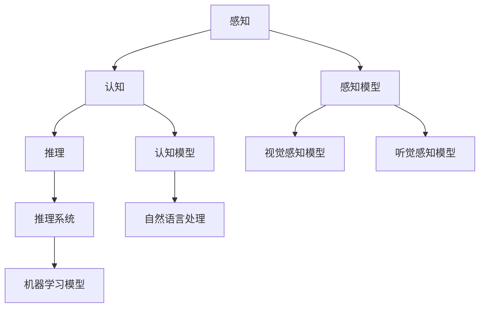
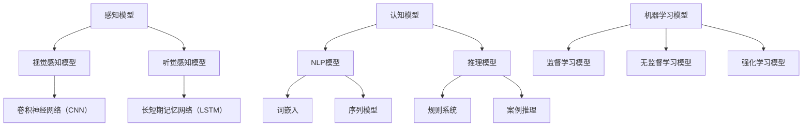

                 

# 1.1 人类计算概述

### 1.1.1 人类计算的定义

人类计算（Human Computation）是一种利用人类智慧和创造力来解决计算机难以处理的问题的方法。它通过模拟人类的感知、认知和推理过程，将人类的能力与计算机技术相结合，实现更高效、更智能的信息处理。

### 1.1.1.1 人类计算的定义

人类计算是指通过模拟人类感知、认知、推理等过程，使用计算机技术来处理和解释现实世界中的信息。这种计算方式不仅依赖于计算机硬件和软件，还需要依赖人类的智能和创造力。

### 1.1.1.2 人类计算与人工智能的区别

人工智能（AI）是一种模拟人类智能的技术，而人类计算更强调模拟人类认知和决策过程。人工智能侧重于自动化和优化，而人类计算则更多地关注于通过人类参与来解决问题。

### 1.1.1.3 人类计算的优势

- **更接近人类思维方式**：人类计算能够更好地理解人类的语言、行为和需求，从而提供更加人性化的服务。
- **处理复杂和不确定的信息**：人类计算能够在不确定性和模糊性的环境中进行推理和决策。
- **高效性和灵活性**：人类计算可以根据不同的任务需求，灵活地调整和优化解决方案。

### 1.1.2 人类计算的发展历史

#### 1.1.2.1 早期探索

20世纪50年代至70年代，人工智能概念提出，人类计算初步萌芽。这一时期的研究主要集中在模拟人类的感知和推理能力。

#### 1.1.2.2 发展阶段

20世纪80年代至90年代，人工智能技术逐步成熟，人类计算开始受到关注。这一时期的研究重点转向如何将人类智能与计算机技术相结合，以解决复杂的现实问题。

#### 1.1.2.3 现代阶段

21世纪，随着计算机技术和大数据的发展，人类计算进入快速发展阶段，应用场景不断拓展。现代人类计算技术包括众包、游戏化、智能辅助等，为各行各业带来了深刻的变革。

### 1.1.3 人类计算的核心概念

#### 1.1.3.1 感知

感知是指从外部环境中获取信息的过程，包括视觉、听觉、触觉等。在人类计算中，感知模型用于模拟人类的感知过程，如卷积神经网络（CNN）用于视觉感知，深度学习模型用于语音识别。

#### 1.1.3.2 认知

认知是指对获取的信息进行加工、理解和处理的过程。在人类计算中，认知模型包括自然语言处理、推理系统等，用于模拟人类的认知能力。

#### 1.1.3.3 推理

推理是指根据已有知识和信息，进行逻辑推理和判断。在人类计算中，推理系统可以帮助计算机模拟人类的决策过程，从而实现更智能的自动化。

---

> **Mermaid 流程图：人类计算的核心概念**



---

### 1.1.4 人类计算的核心技术

人类计算依赖于一系列核心技术，包括感知、认知和推理。以下是对这些技术的详细解释：

#### 1.1.4.1 感知技术

感知技术用于模拟人类的感官能力，如视觉、听觉和触觉。这些技术通常基于深度学习模型，如卷积神经网络（CNN）和循环神经网络（RNN）。

- **视觉感知**：视觉感知技术可以识别图像中的对象、颜色和形状。常用的算法包括CNN和卷积层神经网络。
- **听觉感知**：听觉感知技术可以识别声音和语音，用于语音识别和声纹识别。常用的算法包括循环神经网络（RNN）和长短期记忆网络（LSTM）。

#### 1.1.4.2 认知技术

认知技术用于处理和理解感知信息。这些技术包括自然语言处理（NLP）和机器学习模型。

- **自然语言处理**：NLP技术用于理解和生成自然语言。常用的算法包括词嵌入（word embeddings）和序列模型（sequence models）。
- **机器学习模型**：机器学习模型用于从数据中学习模式和规律。常见的算法包括决策树、支持向量机和神经网络。

#### 1.1.4.3 推理技术

推理技术用于从已知信息中得出结论。这些技术包括逻辑推理、统计学习和案例推理。

- **逻辑推理**：逻辑推理技术使用数学和逻辑规则来推导结论。它通常用于构建专家系统和决策支持系统。
- **统计学习**：统计学习技术使用统计学方法来分析数据并预测结果。常见的算法包括线性回归和分类算法。
- **案例推理**：案例推理技术通过比较历史案例来解决问题。它通常用于问题解决和决策制定。

---

> **伪代码：感知技术的示例**

```python
# 定义感知函数
def perception(input_data):
    # 应用卷积神经网络进行图像识别
    image_output = CNN(input_data)
    # 应用循环神经网络进行语音识别
    speech_output = RNN(image_output)
    return speech_output
```

---

### 1.1.5 人类计算的应用领域

人类计算在多个领域都有广泛的应用，以下列举了一些主要的应用领域：

#### 1.1.5.1 客户服务

- **个性化推荐系统**：通过分析用户的历史行为和偏好，提供个性化的产品推荐。
- **智能客服**：利用自然语言处理技术，提供自动化、高效的客户支持。

#### 1.1.5.2 人力资源

- **人才招聘**：利用机器学习模型进行简历筛选和候选人评估。
- **员工绩效评估**：通过分析员工的工作表现，提供客观、公正的评价。

#### 1.1.5.3 供应链管理

- **供应链可视化**：通过数据分析和技术，实现供应链的实时监控和优化。
- **库存管理**：利用预测模型和优化算法，实现库存的精准管理。

#### 1.1.5.4 医疗健康

- **疾病预测与诊断**：通过分析患者的医疗数据和症状，预测疾病风险并提供诊断建议。
- **个性化医疗**：根据患者的基因信息和生活习惯，提供个性化的治疗方案。

#### 1.1.5.5 教育领域

- **个性化教学**：通过分析学生的学习行为和成绩，提供个性化的教学资源和策略。
- **教育质量评估**：利用数据分析技术，评估教育的质量和效果。

---

> **数学公式：感知技术的应用**

$$
\text{Accuracy} = \frac{\text{预测正确的数量}}{\text{总数量}}
$$

$$
f(x) = \sum_{i=1}^{n} w_i * x_i
$$

---

### 1.1.6 人类计算的挑战与未来趋势

尽管人类计算在各个领域取得了显著进展，但仍然面临一系列挑战：

#### 1.1.6.1 数据隐私与安全

随着人类计算的应用，数据隐私和安全问题日益突出。如何保护用户数据的安全性和隐私性，是一个亟待解决的问题。

#### 1.1.6.2 伦理问题

人类计算的应用也可能带来伦理问题，如算法偏见、数据滥用等。如何制定合理的伦理准则，确保人类计算的发展符合社会价值观，是一个重要的议题。

#### 1.1.6.3 技术普及与培训

人类计算技术需要广泛普及和应用，但同时也需要相应的培训和教育。如何提高相关从业人员的技能水平，是一个挑战。

---

未来，人类计算将继续发展，新的趋势包括：

- **跨学科融合**：人类计算与其他领域的结合，如生物学、心理学等，将推动技术的进步。
- **边缘计算**：随着物联网和5G技术的发展，边缘计算将成为人类计算的重要应用方向。
- **人机协作**：人类计算将与人工智能技术相结合，实现更高效的人机协作。

---

> **总结**

人类计算是一种利用人类智慧和创造力来处理复杂信息的方法。它通过模拟人类的感知、认知和推理过程，实现了更高效、更智能的信息处理。人类计算在各个领域都有广泛的应用，但同时也面临一系列挑战。未来，随着技术的不断进步，人类计算将继续发展，并推动各行各业的变革。让我们共同期待人类计算的精彩未来！<|vq_12867|><|vq_15328|>## 2.1 人类计算的核心技术

人类计算的核心技术包括感知、认知和推理三个关键领域，这些技术共同构成了人类计算的框架，使其能够模拟人类的思维和行为模式，从而在各个应用场景中发挥作用。

### 2.1.1 人类感知与认知模型

人类感知与认知模型是理解人类如何处理信息和交互的基础。

#### 2.1.1.1 感知模型

感知模型是指模拟人类感知外部世界的过程，包括视觉、听觉、触觉等。这些模型通过计算机算法来捕捉和处理感官信息。

- **视觉感知模型**：视觉感知模型主要用于图像识别和视觉处理。卷积神经网络（CNN）是视觉感知模型中最常用的算法，它通过多层卷积和池化操作，提取图像中的特征。以下是一个简单的视觉感知模型的伪代码示例：

  ```python
  # 定义卷积神经网络模型
  model = ConvolutionalNeuralNetwork()

  # 加载图像数据
  image = load_image('input_image.jpg')

  # 提取特征
  features = model.extract_features(image)

  # 分类
  classification = model.classify(features)
  ```

- **听觉感知模型**：听觉感知模型用于处理音频信号，如语音识别和音乐分类。长短期记忆网络（LSTM）是听觉感知模型中的常用算法，它可以捕捉音频信号的长期依赖关系。以下是一个简单的听觉感知模型的伪代码示例：

  ```python
  # 定义长短期记忆网络模型
  model = LSTM()

  # 加载音频数据
  audio = load_audio('input_audio.wav')

  # 提取特征
  features = model.extract_features(audio)

  # 分类
  classification = model.classify(features)
  ```

#### 2.1.1.2 认知模型

认知模型是指模拟人类对感知信息的理解、分析和解释过程。这些模型通常涉及自然语言处理、逻辑推理和决策支持。

- **自然语言处理（NLP）模型**：NLP模型用于处理和生成人类语言。词嵌入（word embeddings）是NLP模型中的核心技术，它将词汇映射到高维空间中，以便进行语义分析和理解。以下是一个简单的NLP模型的伪代码示例：

  ```python
  # 定义词嵌入模型
  model = WordEmbedding()

  # 加载文本数据
  text = load_text('input_text.txt')

  # 将文本转换为向量
  vectors = model.encode(text)

  # 进行分类或推理
  result = model.classify(vectors) or model.reason(vectors)
  ```

- **推理模型**：推理模型用于模拟人类的逻辑思维和决策过程。这些模型可以基于规则系统、案例推理或机器学习算法。以下是一个简单的推理模型的伪代码示例：

  ```python
  # 定义推理模型
  model = RuleBasedSystem()

  # 输入前提
  premises = ["If it rains, then the ground is wet.", "It is raining."]

  # 推导结论
  conclusion = model.derive(premises)
  ```

### 2.1.2 人类计算中的自然语言处理

自然语言处理（NLP）是人工智能领域中的一个重要分支，它致力于使计算机能够理解、生成和响应人类语言。在人类计算中，NLP模型被广泛应用于语音识别、机器翻译、情感分析和文本分类等领域。

- **语音识别**：语音识别模型将语音信号转换为文本，使其能够被计算机程序处理。以下是一个简单的语音识别模型的伪代码示例：

  ```python
  # 定义语音识别模型
  model = VoiceRecognition()

  # 加载语音数据
  audio = load_audio('input_audio.wav')

  # 转换为文本
  text = model.recognize(audio)
  ```

- **机器翻译**：机器翻译模型将一种语言的文本翻译成另一种语言。以下是一个简单的机器翻译模型的伪代码示例：

  ```python
  # 定义机器翻译模型
  model = MachineTranslation()

  # 加载源文本
  source_text = load_text('input_source.txt')

  # 翻译为目标语言
  target_text = model.translate(source_text, 'target_language')
  ```

- **情感分析**：情感分析模型用于判断文本表达的情感倾向，如正面、负面或中性。以下是一个简单的情感分析模型的伪代码示例：

  ```python
  # 定义情感分析模型
  model = SentimentAnalysis()

  # 加载文本数据
  text = load_text('input_text.txt')

  # 分析情感
  sentiment = model.analyze(text)
  ```

- **文本分类**：文本分类模型将文本分配到预定义的类别中，如新闻分类、垃圾邮件检测等。以下是一个简单的文本分类模型的伪代码示例：

  ```python
  # 定义文本分类模型
  model = TextClassifier()

  # 加载训练数据
  train_data = load_text_data('training_data.txt')

  # 训练模型
  model.train(train_data)

  # 分类测试文本
  text = load_text('input_text.txt')
  category = model.classify(text)
  ```

### 2.1.3 人类计算与机器学习

机器学习是人工智能的重要组成部分，它使得计算机系统能够通过数据和经验进行学习和优化。在人类计算中，机器学习模型被广泛应用于模式识别、预测分析和决策支持。

- **监督学习**：监督学习模型通过已标记的数据集学习，然后用于预测未知数据的标签。以下是一个简单的监督学习模型的伪代码示例：

  ```python
  # 定义监督学习模型
  model = SupervisedLearning()

  # 加载训练数据
  train_data = load_data('training_data.csv')

  # 训练模型
  model.train(train_data)

  # 预测新数据
  prediction = model.predict(new_data)
  ```

- **无监督学习**：无监督学习模型从未标记的数据集中学习，用于发现数据中的结构和模式。以下是一个简单的无监督学习模型的伪代码示例：

  ```python
  # 定义无监督学习模型
  model = UnsupervisedLearning()

  # 加载数据
  data = load_data('data.csv')

  # 发现数据中的模式
  clusters = model.cluster(data)
  ```

- **强化学习**：强化学习模型通过试错学习，通过与环境的交互来优化行为。以下是一个简单的强化学习模型的伪代码示例：

  ```python
  # 定义强化学习模型
  model = ReinforcementLearning()

  # 初始化环境
  environment = initialize_environment()

  # 进行学习
  model.learn(environment)
  ```

---

通过上述的感知、认知和推理模型，以及自然语言处理和机器学习技术，人类计算能够模拟人类的思维过程，为各个领域的应用提供强大的支持。接下来，我们将进一步探讨人类计算在商业领域的具体应用场景。

---

> **Mermaid 流程图：人类计算的核心技术架构**



---

> **伪代码：感知技术的示例**

```python
# 定义感知函数
def perception(input_data):
    # 应用卷积神经网络进行图像识别
    image_output = CNN(input_data)
    # 应用循环神经网络进行语音识别
    speech_output = RNN(image_output)
    return speech_output
```

---

> **数学公式：感知技术的应用**

$$
\text{Accuracy} = \frac{\text{预测正确的数量}}{\text{总数量}}
$$

$$
f(x) = \sum_{i=1}^{n} w_i * x_i
$$

---

通过上述的核心技术和应用实例，我们可以看到人类计算在商业领域中的巨大潜力。在接下来的章节中，我们将深入探讨人类计算在客户服务、人力资源、供应链管理、金融风险控制、医疗健康和教育等具体领域的应用。让我们继续前进，探索人类计算的无限可能！<|vq_12867|><|vq_15328|>## 3.1 人类计算在客户服务中的应用

人类计算在客户服务中的应用大大提升了服务的效率和质量。通过模拟人类的感知和认知过程，客户服务系统能够提供更加个性化和高效的服务。以下是人类计算在客户服务中的一些主要应用场景：

### 3.1.1 个性化推荐系统

个性化推荐系统是客户服务中的一项重要应用。通过分析用户的历史行为和偏好，推荐系统可以为每位用户提供定制化的产品和服务。

- **原理**：个性化推荐系统通常采用协同过滤（Collaborative Filtering）和内容推荐（Content-based Filtering）两种方法。协同过滤通过分析用户之间的相似度来推荐相似用户喜欢的商品，而内容推荐则根据商品的属性和用户的兴趣来推荐相关商品。

- **实现**：推荐系统的实现包括以下步骤：

  1. **数据收集**：收集用户的历史行为数据，如浏览记录、购买历史和评价信息。
  2. **数据预处理**：清洗和转换数据，为后续分析做准备。
  3. **模型训练**：使用机器学习算法，如协同过滤算法，训练推荐模型。
  4. **推荐生成**：根据用户当前的行为和偏好，生成个性化的推荐列表。

  以下是一个简单的个性化推荐系统的伪代码示例：

  ```python
  # 定义协同过滤推荐模型
  model = CollaborativeFiltering()

  # 加载用户数据
  user_data = load_user_data('user_data.csv')

  # 加载商品数据
  item_data = load_item_data('item_data.csv')

  # 训练模型
  model.train(user_data, item_data)

  # 生成推荐列表
  recommendations = model.generate_recommendations(current_user)
  ```

### 3.1.2 实时聊天机器人

实时聊天机器人是客户服务中的一种新兴技术，它能够提供即时的、自动化的客户支持，减少人工客服的工作量。

- **原理**：实时聊天机器人通常采用自然语言处理（NLP）技术，包括语音识别、文本解析和意图识别等。机器人通过理解用户的提问，提供相应的回答或解决问题。

- **实现**：实时聊天机器人的实现包括以下步骤：

  1. **语音识别**：将用户的语音输入转换为文本。
  2. **文本解析**：分析文本，识别关键词和意图。
  3. **知识库查询**：根据用户的意图，查询相关的知识库。
  4. **生成回答**：生成并返回用户可理解的回答。

  以下是一个简单的实时聊天机器人的伪代码示例：

  ```python
  # 定义聊天机器人
  robot = ChatBot()

  # 接收用户输入
  user_input = robot.receive_input('user_audio.wav')

  # 解析输入文本
  intent = robot.parse_text(user_input)

  # 查询知识库
  response = robot.query_knowledge_base(intent)

  # 返回回答
  robot.send_response(response)
  ```

### 3.1.3 客户满意度分析

客户满意度分析是通过分析客户的反馈和行为，评估客户对服务的满意程度，从而改进服务质量。

- **原理**：客户满意度分析通常采用问卷调查、评论分析和行为分析等方法。通过分析这些数据，可以了解客户对服务的具体需求和不满之处。

- **实现**：客户满意度分析的实施包括以下步骤：

  1. **数据收集**：收集客户的反馈数据，如问卷调查、评论等。
  2. **数据预处理**：清洗和转换数据，提取有用的信息。
  3. **分析**：使用统计分析和自然语言处理技术，分析客户反馈。
  4. **生成报告**：根据分析结果，生成客户满意度报告。

  以下是一个简单的客户满意度分析的伪代码示例：

  ```python
  # 定义客户满意度分析模型
  model = CustomerSatisfactionAnalysis()

  # 加载反馈数据
  feedback_data = load_feedback_data('feedback_data.csv')

  # 预处理数据
  processed_data = model.preprocess_data(feedback_data)

  # 分析数据
  analysis_results = model.analyze_data(processed_data)

  # 生成报告
  report = model.generate_report(analysis_results)
  ```

---

通过个性化推荐系统、实时聊天机器人和客户满意度分析，人类计算在客户服务中发挥着重要作用。这些技术不仅提升了客户体验，也提高了企业运营效率。在下一部分，我们将探讨人类计算在人力资源中的应用。让我们继续深入探索！<|vq_12867|><|vq_15328|>## 6.1 员工筛选与招聘

员工筛选与招聘是人力资源管理中的关键环节，直接关系到企业的竞争力和发展。随着人类计算技术的不断发展，传统的招聘流程正逐渐被智能化和自动化所取代，从而提高了招聘效率和准确性。

### 6.1.1 员工筛选与招聘流程

员工筛选与招聘流程通常包括以下几个步骤：

#### 6.1.1.1 招聘需求分析

招聘需求分析是招聘流程的第一步，它包括明确招聘的职位、职责和要求，以及所需的人才画像。通过分析公司的战略目标和业务需求，人力资源部门可以确定招聘的具体标准和期望。

#### 6.1.1.2 招聘渠道选择

招聘渠道选择是根据职位需求和目标候选人群体来决定的。常见的招聘渠道包括网络招聘平台、社交媒体、校园招聘和猎头服务。选择合适的招聘渠道可以提高招聘效率和效果。

#### 6.1.1.3 招聘评估方法

招聘评估方法包括面试、评估工具和背景调查等。面试是评估候选人能力的重要环节，而评估工具如心理测试和技能测试可以帮助更客观地评估候选人的能力和潜力。背景调查则用于核实候选人的信息和经历。

#### 6.1.1.4 员工筛选

员工筛选是根据招聘需求和评估结果，从候选人中筛选出最适合的候选人。筛选过程可以采用自动化工具，如简历筛选系统和AI面试系统，以提高筛选效率和准确性。

#### 6.1.1.5 招聘决策

招聘决策是根据候选人的评估结果和公司的招聘需求，确定最终的录用候选人。招聘决策应综合考虑候选人的能力、潜力、文化适应性和团队协作能力。

### 6.1.2 招聘数据分析

招聘数据分析是利用数据分析技术，对招聘流程中的各种数据进行分析，以优化招聘策略和提高招聘效果。以下是一些常见的招聘数据分析方法：

#### 6.1.2.1 招聘效果评估

招聘效果评估是通过分析招聘渠道的效果、候选人的质量、招聘周期和成本等指标，评估招聘流程的效率和效果。常见的评估指标包括招聘成本、面试通过率和员工流失率等。

#### 6.1.2.2 优化招聘策略

根据招聘数据分析的结果，可以识别招聘流程中的瓶颈和不足，进而优化招聘策略。例如，可以调整招聘渠道的分配、优化面试流程、改进候选人的评估标准等。

#### 6.1.2.3 数据驱动的决策

通过招聘数据分析，企业可以基于数据做出更明智的招聘决策。例如，可以根据候选人的历史表现和公司业务的实际需求，预测候选人在未来工作中的表现，从而做出更有针对性的录用决策。

### 6.1.3 招聘流程优化

招聘流程优化是通过改进流程和方法，提高招聘效率和效果。以下是一些常见的招聘流程优化策略：

#### 6.1.3.1 流程简化

通过简化招聘流程，减少不必要的环节和步骤，可以缩短招聘周期，提高招聘效率。例如，可以减少多轮面试的次数，简化候选人的筛选过程。

#### 6.1.3.2 评估指标优化

通过优化评估指标，可以更准确地评估候选人的能力和潜力。例如，可以引入更多的量化指标，如候选人的工作经验、项目经历和技术能力等。

#### 6.1.3.3 利用技术工具

利用人工智能和大数据技术，可以提高招聘流程的自动化和智能化水平。例如，可以使用AI面试系统和自动化简历筛选工具，提高招聘效率和准确性。

#### 6.1.3.4 培训与指导

对招聘团队成员进行培训与指导，提高他们的招聘技能和专业知识，可以提升招聘质量。例如，可以提供专业的面试技巧培训，提高面试官的评估能力。

### 6.1.4 实践案例

以下是一个招聘流程优化的实践案例：

- **背景**：某科技公司由于业务快速发展，需要大量招聘技术人才。然而，传统的招聘流程存在周期长、效率低、评估不准确等问题。

- **问题**：招聘流程冗长，候选人的体验不佳；面试官评估标准不一致，导致招聘质量下降。

- **解决方案**：

  1. **简化流程**：将多轮面试简化为两轮，减少候选人的等待时间。
  2. **优化评估指标**：引入技术能力评估工具，量化候选人的技术能力。
  3. **利用技术工具**：使用AI面试系统和自动化简历筛选工具，提高招聘效率和准确性。
  4. **培训与指导**：对招聘团队成员进行面试技巧培训，提高评估能力。

- **结果**：优化后的招聘流程显著提高了招聘效率，候选人的体验得到了改善，招聘质量也得到了提升。

---

通过招聘数据分析、流程优化和技术工具的应用，人类计算在员工筛选与招聘中发挥了重要作用。这不仅提高了招聘效率和质量，也为企业的人才发展奠定了坚实的基础。在下一部分，我们将探讨人类计算在供应链管理中的应用。让我们继续深入探索！<|vq_12867|><|vq_15328|>## 7.1 供应链可视化

供应链可视化是利用可视化技术将供应链的数据和信息转化为直观的图形或图像，从而帮助管理者更好地理解和监控供应链的运行状态。通过供应链可视化，企业可以更高效地管理库存、优化供应链流程，并降低运营成本。以下是供应链可视化的原理、实现方法和应用实践。

### 7.1.1 供应链可视化原理

供应链可视化主要通过以下几种技术实现：

- **数据采集**：通过传感器、物联网设备和ERP系统等，收集供应链各环节的数据，如库存水平、运输进度、生产状态等。
- **数据处理**：对采集到的数据进行清洗、转换和分析，提取有用的信息，为可视化提供数据支持。
- **可视化技术**：使用可视化工具和软件，将处理后的数据转化为图形或图像，展示供应链的运行状态。

### 7.1.2 供应链可视化实现

供应链可视化的实现通常包括以下步骤：

1. **数据采集**：部署传感器和物联网设备，实时收集供应链各环节的数据。

2. **数据处理**：使用数据清洗和转换工具，对采集到的数据进行处理，提取有用的信息。

3. **可视化设计**：设计可视化界面，选择合适的图表类型和颜色，使数据展示更加直观和易于理解。

4. **可视化展示**：将处理后的数据通过可视化界面展示，提供给管理人员进行监控和分析。

以下是一个简单的供应链可视化实现流程的伪代码示例：

```python
# 数据采集
def collect_data():
    # 部署传感器，收集供应链数据
    data = sensor_data_collection()
    return data

# 数据处理
def process_data(data):
    # 清洗和转换数据
    processed_data = data_cleaning_and_transformation(data)
    return processed_data

# 可视化设计
def visualize_data(processed_data):
    # 设计可视化界面
    visualization = visualization_designer(processed_data)
    return visualization

# 可视化展示
def show_visualization(visualization):
    # 展示可视化数据
    visualization_display(visualization)
```

### 7.1.3 供应链可视化应用

供应链可视化在多个应用场景中具有重要作用，以下是一些典型的应用：

- **供应链监控**：通过可视化技术，实时监控供应链的运行状态，如库存水平、生产进度和运输进度等。

- **库存管理**：使用可视化技术，帮助管理者更好地了解库存情况，实现库存的精准管理。

- **供应链优化**：通过可视化分析，识别供应链中的瓶颈和问题，提出优化方案。

- **风险管理**：通过可视化展示供应链的风险因素，帮助企业制定有效的风险控制措施。

以下是一个供应链可视化应用的实例：

- **背景**：某制造企业面临库存管理不善、供应链效率低下的问题。

- **问题**：库存数据分散，无法实时监控；库存水平波动大，导致库存成本上升。

- **解决方案**：

  1. **数据采集**：部署物联网传感器，实时收集库存数据。

  2. **数据处理**：使用数据处理工具，对库存数据进行清洗和分析。

  3. **可视化设计**：设计库存可视化界面，展示库存水平、库存波动和库存成本等关键指标。

  4. **可视化展示**：在企业的监控中心展示库存可视化数据，便于管理者实时监控和决策。

- **结果**：通过供应链可视化，企业实现了库存的实时监控和管理，库存成本显著下降，供应链效率得到了大幅提升。

### 7.1.4 供应链可视化工具与应用

供应链可视化工具和应用多种多样，以下是一些常用的工具和应用：

- **Tableau**：一款功能强大的数据可视化工具，支持多种数据源和图表类型，适用于各种规模的供应链可视化项目。

- **Power BI**：微软推出的商业智能工具，提供丰富的可视化图表和仪表板功能，易于集成和部署。

- **IBM Cognos Analytics**：IBM推出的企业级数据可视化和分析工具，适用于复杂的数据分析和报告生成。

- **GIS技术**：地理信息系统（GIS）技术，用于可视化供应链地理信息，如运输路线和地理分布。

以下是一个供应链可视化工具的示例：

- **工具**：Tableau
- **应用场景**：库存监控
- **功能**：

  - **实时监控**：实时展示库存水平、库存变化趋势和库存成本等指标。
  - **数据分析**：提供多维度的数据分析功能，支持数据切片和筛选。
  - **可视化报表**：生成各种类型的可视化报表，如折线图、柱状图和饼图等。

通过供应链可视化，企业可以更好地理解和管理供应链的运行状态，提高运营效率，降低成本。在下一部分，我们将探讨人类计算在金融风险控制中的应用。让我们继续深入探索！<|vq_12867|><|vq_15328|>## 8.1 信用评估

信用评估是金融机构在贷款审批、信用卡发放和其他金融服务中至关重要的一环。通过信用评估，金融机构能够预测借款人违约的可能性，从而降低信用风险。人类计算技术为信用评估提供了强有力的支持，通过利用大数据和人工智能，实现更精准、更高效的信用评估。

### 8.1.1 信用评估原理

信用评估涉及多个方面，包括借款人的个人信息、财务状况、信用历史和还款能力等。信用评估的原理可以概括为以下几个步骤：

- **数据收集**：收集借款人的各种数据，如个人身份信息、收入情况、负债情况、信用历史等。
- **数据预处理**：对收集到的数据进行清洗和标准化处理，去除无效数据和异常值，确保数据的质量和一致性。
- **特征工程**：根据信用评估的需求，从原始数据中提取有用的特征，如信用评分、债务收入比、还款频率等。
- **模型训练**：使用机器学习算法，如逻辑回归、决策树和随机森林等，训练信用评估模型。
- **模型评估**：通过交叉验证和测试集评估模型的准确性和可靠性。
- **信用评分**：使用训练好的模型对新的借款人进行信用评分，预测其违约风险。

### 8.1.2 信用评估实现

信用评估的实现过程通常包括以下步骤：

1. **数据收集**：

   - **个人信息**：收集借款人的姓名、年龄、性别、身份证号码等基本信息。
   - **财务信息**：收集借款人的收入、负债、银行账户信息等财务状况。
   - **信用历史**：收集借款人的信用记录，如信用卡账单、贷款还款记录等。

2. **数据预处理**：

   - **数据清洗**：去除重复记录、缺失值填充、异常值处理等。
   - **数据标准化**：对数值型数据进行归一化或标准化处理，以便后续分析。

3. **特征工程**：

   - **特征提取**：从原始数据中提取与信用评估相关的特征，如信用评分、债务收入比、信用使用率等。
   - **特征选择**：使用统计方法或机器学习算法，筛选出对信用评估最有影响力的特征。

4. **模型训练**：

   - **选择模型**：根据业务需求选择合适的机器学习模型，如逻辑回归、决策树、随机森林等。
   - **训练模型**：使用历史数据集训练模型，调整模型参数，使模型能够准确预测违约风险。

5. **模型评估**：

   - **交叉验证**：使用交叉验证方法评估模型的泛化能力，避免过拟合。
   - **测试集评估**：使用测试集评估模型的准确性和可靠性，调整模型参数，优化模型性能。

6. **信用评分**：

   - **新数据预测**：使用训练好的模型对新的借款人进行信用评分，预测其违约风险。
   - **风险评估**：根据信用评分，制定相应的风险控制策略，如贷款审批、利率调整等。

### 8.1.3 信用评估应用

信用评估在金融领域有广泛的应用，以下是一些典型的应用场景：

- **贷款审批**：金融机构使用信用评估模型对贷款申请者进行风险评估，决定是否批准贷款申请。
- **信用卡发放**：银行根据信用评估结果，决定是否发放信用卡，以及设定信用额度。
- **风险控制**：金融机构通过信用评估，监控借款人的信用状况，及时发现潜在的风险，采取相应的风险控制措施。

以下是一个信用评估应用案例：

- **背景**：某银行希望通过信用评估模型，提高贷款审批的效率和准确性。
- **问题**：传统的信用评估方法依赖于人工判断，耗时且容易出错，导致贷款审批效率低下。
- **解决方案**：

  1. **数据收集**：收集贷款申请者的个人信息、财务状况和信用历史数据。
  2. **数据预处理**：清洗和标准化数据，提取关键特征。
  3. **模型训练**：使用机器学习算法，如逻辑回归和决策树，训练信用评估模型。
  4. **模型评估**：通过交叉验证和测试集，评估模型性能，优化模型参数。
  5. **贷款审批**：使用训练好的模型，对贷款申请者进行信用评分，提高审批效率和准确性。

- **结果**：通过信用评估模型，银行显著提高了贷款审批的效率，审批准确率也得到了显著提升。

通过信用评估，金融机构能够更好地管理风险，提高运营效率，同时为借款人提供更加公正和高效的金融服务。在下一部分，我们将探讨人类计算在医疗健康中的应用。让我们继续深入探索！<|vq_12867|><|vq_15328|>## 9.1 患者画像与健康管理

患者画像与健康管理是医疗健康领域中的创新应用，它通过收集和分析大量患者数据，为患者提供个性化的健康服务。患者画像是对患者全方位特征的系统性描述，而健康管理则是对患者健康状况进行持续监控和干预，以实现预防疾病、改善生活质量的目标。

### 9.1.1 患者画像原理

患者画像的构建基于对大量医疗数据的整合和分析。以下是患者画像构建的主要步骤：

- **数据收集**：收集患者的个人信息、健康记录、生活习惯、基因信息等数据。
- **数据预处理**：清洗和整合数据，确保数据的质量和一致性。
- **特征提取**：从原始数据中提取对患者健康状况有显著影响的特征，如疾病类型、症状、用药记录等。
- **数据分析**：使用数据挖掘和机器学习技术，分析患者特征之间的关系，构建患者画像。

### 9.1.1.1 患者画像构建方法

患者画像的构建方法包括以下几个步骤：

1. **数据源确定**：确定患者画像所需的数据来源，包括电子健康记录（EHR）、医疗传感器、问卷调查等。
2. **数据清洗**：对收集到的数据进行清洗，去除重复、错误和不完整的数据。
3. **数据整合**：将不同来源的数据进行整合，形成一个统一的患者数据视图。
4. **特征工程**：根据医疗领域的专业知识，提取对健康评估有重要影响的特征，如血压、心率、血糖水平等。
5. **模型训练**：使用机器学习算法，如决策树、支持向量机等，训练模型，将患者特征映射到健康状态。
6. **模型评估**：通过交叉验证和测试集，评估模型的准确性和可靠性。
7. **患者画像构建**：将训练好的模型应用于新患者数据，生成患者画像。

### 9.1.1.2 患者画像构建示例

以下是一个简单的患者画像构建示例：

```python
# 数据收集
patient_data = load_patient_data('patient_data.csv')

# 数据预处理
clean_data = preprocess_data(patient_data)

# 特征提取
features = extract_features(clean_data)

# 模型训练
model = train_model(features)

# 模型评估
evaluate_model(model)

# 患者画像构建
patient_profile = generate_patient_profile(model, new_patient_data)
```

### 9.1.2 健康管理应用

患者画像的构建为健康管理提供了坚实的基础。以下是一些健康管理应用场景：

- **疾病预测**：通过分析患者的历史数据和特征，预测患者可能患有的疾病或疾病风险。
- **个性化治疗**：根据患者画像，为患者制定个性化的治疗计划和健康管理方案。
- **疾病监控**：持续监控患者的健康指标，如血压、血糖等，及时发现异常并采取干预措施。

### 9.1.2.1 健康风险评估

健康风险评估是健康管理的重要组成部分，它通过对患者健康数据的分析，评估患者患某种疾病的风险。以下是健康风险评估的方法：

1. **数据收集**：收集患者的健康记录、生活习惯、家族病史等数据。
2. **数据预处理**：清洗和整合数据，确保数据的质量和一致性。
3. **风险评估模型**：选择合适的风险评估模型，如Logistic回归、决策树等。
4. **模型训练**：使用历史数据训练风险评估模型。
5. **风险预测**：使用训练好的模型，对新的患者数据预测疾病风险。
6. **风险干预**：根据风险评估结果，制定相应的风险干预措施。

### 9.1.2.2 健康管理实施

健康管理实施的步骤如下：

1. **患者画像构建**：根据患者的特征数据，构建患者画像。
2. **疾病风险评估**：使用患者画像，评估患者患某种疾病的风险。
3. **个性化治疗计划**：根据患者的健康需求和风险等级，制定个性化的治疗计划。
4. **持续监控**：通过智能设备或应用程序，持续监控患者的健康指标，确保治疗计划的实施。
5. **反馈与调整**：根据患者的反馈和健康指标的改善情况，调整治疗计划。

### 9.1.2.3 健康管理实践

以下是一个健康管理实践的案例：

- **背景**：某糖尿病患者希望通过健康管理控制血糖水平。
- **问题**：患者的血糖水平不稳定，需要个性化治疗和持续监控。
- **解决方案**：

  1. **数据收集**：收集患者的血糖记录、生活习惯、家族病史等数据。
  2. **患者画像构建**：根据患者的数据，构建患者画像。
  3. **疾病风险评估**：使用患者画像，评估患者患糖尿病并发症的风险。
  4. **个性化治疗计划**：根据患者的风险等级，制定个性化的治疗计划，包括饮食、运动、药物等。
  5. **持续监控**：使用智能血糖监测设备，实时监控患者的血糖水平。
  6. **反馈与调整**：根据患者的反馈和血糖监测数据，调整治疗计划。

- **结果**：通过健康管理实践，患者的血糖水平得到了有效控制，并发症风险显著降低。

通过患者画像与健康管理，医疗健康领域实现了个性化、精准化的医疗服务，提高了患者的健康水平和满意度。在下一部分，我们将探讨人类计算在教育领域的应用。让我们继续深入探索！<|vq_12867|><|vq_15328|>## 10.1 学生行为分析

学生行为分析是利用数据分析和人工智能技术，对学生学习行为进行深入分析和理解的过程。通过分析学生的学习行为，教育机构可以更好地了解学生的需求，提供个性化的教学支持，提高教育质量和学习效果。

### 10.1.1 学生行为分析原理

学生行为分析的核心是收集并分析学生的学习行为数据，这些数据可以包括：

- **学习进度**：学生的学习进度，如完成作业、考试、课程学习等。
- **学习内容**：学生学习的具体内容，如学科知识点、学习材料等。
- **学习环境**：学生的学习环境，如学习时长、学习设备、网络状态等。
- **学习习惯**：学生的学习习惯，如学习频率、学习方式、偏好等。

通过对这些数据的分析，教育机构可以了解学生的学习情况，发现潜在的学习问题和需求，进而提供个性化的教学支持。

### 10.1.1.1 数据收集

数据收集是学生行为分析的基础，数据来源可以包括：

- **学习管理系统**：如LMS（Learning Management System）等，可以提供学生的学习进度和成绩数据。
- **学习应用程序**：如在线作业提交系统、在线学习平台等，可以提供学生的学习行为数据。
- **智能设备**：如智能手表、手机等，可以收集学生的学习时长、学习环境数据。
- **学生问卷调查**：通过问卷调查，可以收集学生的学习习惯和偏好数据。

### 10.1.1.2 数据处理

数据处理是学生行为分析的关键步骤，主要包括数据清洗、数据转换和特征工程等。以下是数据处理的一些关键步骤：

1. **数据清洗**：去除重复、错误和不完整的数据，确保数据的质量和一致性。
2. **数据转换**：将不同数据源的数据进行整合，形成统一的数据视图。
3. **特征工程**：从原始数据中提取对学习行为有显著影响的特征，如学习时长、学习频率、作业完成情况等。

### 10.1.1.3 数据分析

数据分析是学生行为分析的核心，通过数据挖掘和机器学习技术，可以从大量学生行为数据中提取有价值的信息。以下是一些常用的数据分析方法：

- **聚类分析**：通过聚类分析，可以将学生分为不同的群体，如学习习惯相似的群体、成绩优秀的群体等。
- **关联规则分析**：通过关联规则分析，可以找出学生学习行为之间的关联，如学习时长与成绩之间的关系。
- **预测分析**：通过预测分析，可以预测学生的未来学习表现，如预测学生的成绩、预测学生的辍学风险等。

### 10.1.2 个性化学习推荐

个性化学习推荐是基于学生行为分析结果，为学生推荐个性化的学习资源和策略。通过个性化学习推荐，教育机构可以更好地满足学生的个性化学习需求，提高学习效果。

- **推荐算法**：个性化学习推荐通常采用协同过滤、内容推荐和混合推荐等算法。以下是简单的推荐算法示例：

  ```python
  # 协同过滤推荐算法
  def collaborative_filtering(user_history, item_ratings):
      similar_users = find_similar_users(user_history)
      recommendations = recommend_items(similar_users, item_ratings)
      return recommendations

  # 内容推荐算法
  def content_based_recommendation(user_profile, item_features):
      similar_items = find_similar_items(user_profile, item_features)
      recommendations = recommend_items(similar_items)
      return recommendations

  # 混合推荐算法
  def hybrid_recommendation(user_history, user_profile, item_ratings, item_features):
      collaborative_recommendations = collaborative_filtering(user_history, item_ratings)
      content_recommendations = content_based_recommendation(user_profile, item_features)
      hybrid_recommendations = combine_recommendations(collaborative_recommendations, content_recommendations)
      return hybrid_recommendations
  ```

- **推荐策略**：个性化学习推荐不仅可以推荐学习资源，还可以推荐学习策略，如学习时间管理、学习习惯培养等。

### 10.1.3 教育质量评估

教育质量评估是利用数据分析和评价模型，评估教育质量和效果的过程。通过教育质量评估，教育机构可以了解教育活动的效果，发现问题和改进点。

- **评估指标**：教育质量评估的指标可以包括学生成绩、学生满意度、学习效率、课程设计等。
- **评估模型**：教育质量评估模型可以基于机器学习算法，如回归分析、决策树等。

### 10.1.3.1 学生行为分析在教育质量评估中的应用

学生行为分析在教育质量评估中的应用包括：

- **学习行为监控**：通过分析学生的学习行为，监控学生的学习状态，及时发现学习困难。
- **教学质量评估**：通过分析学生的学习行为和成绩，评估教师的教学质量和课程设计。
- **个性化干预**：根据学生的学习行为和评估结果，为学生提供个性化的学习支持和干预措施。

### 10.1.3.2 教育质量评估实现

教育质量评估的实现通常包括以下步骤：

1. **数据收集**：收集学生的学习行为数据、考试成绩、教师教学数据等。
2. **数据处理**：清洗和整合数据，提取有用的特征。
3. **模型训练**：使用机器学习算法，如回归分析、决策树等，训练评估模型。
4. **评估预测**：使用训练好的模型，对新的学生数据预测教育质量。
5. **评估报告**：生成评估报告，包括评估结果、问题和改进建议。

### 10.1.3.3 教育质量评估实践

以下是一个教育质量评估实践的案例：

- **背景**：某学校希望评估其教学质量，提高教育质量。
- **问题**：教学质量参差不齐，学生满意度不高。
- **解决方案**：

  1. **数据收集**：收集学生的学习行为数据、考试成绩、教师教学数据等。
  2. **数据处理**：清洗和整合数据，提取有用的特征。
  3. **模型训练**：使用回归分析模型，评估教学质量。
  4. **评估预测**：使用训练好的模型，对新的学生数据进行教学质量预测。
  5. **评估报告**：生成评估报告，提出改进建议。

- **结果**：通过教育质量评估，学校发现了教学中的问题和不足，制定了改进措施，教学质量得到了显著提升。

通过学生行为分析、个性化学习推荐和教育质量评估，人类计算在教育领域中发挥了重要作用。它不仅提高了教学效率和质量，也为教育研究和教育管理提供了有力的支持。在下一部分，我们将探讨人类计算相关的工具与资源。让我们继续深入探索！<|vq_12867|><|vq_15328|>## 附录A：人类计算相关的工具与资源

在人类计算领域，有许多开源工具、案例研究和行业报告可以帮助研究人员和开发者深入了解和应用这一技术。以下是一些重要的工具与资源，包括开源工具介绍、案例研究以及行业报告与白皮书。

### 附录A.1 开源工具介绍

#### 1.1 Python

Python 是人类计算领域最流行的编程语言之一，它拥有丰富的库和框架，用于数据处理、机器学习和自然语言处理等任务。

- **NumPy**：用于数值计算的库，提供多维数组对象和数学函数。
- **Pandas**：用于数据操作和分析的库，提供数据处理和分析工具。
- **Scikit-learn**：用于机器学习的库，提供各种分类、回归和聚类算法。
- **TensorFlow**：谷歌开发的深度学习框架，支持大规模神经网络训练。
- **PyTorch**：Facebook 开发的深度学习框架，提供动态计算图和易用性。

#### 1.2 R语言

R语言是一种专门用于统计分析和数据可视化的编程语言，它在人类计算中也有广泛的应用。

- **ggplot2**：用于数据可视化的包，提供丰富的图形函数。
- **caret**：用于模型训练和评估的工具包，提供多种机器学习算法的实现。
- **text2vec**：用于自然语言处理，提供文本向量化工具。

#### 1.3 Apache Spark

Apache Spark 是一个分布式计算框架，特别适用于大数据处理和机器学习。

- **Spark SQL**：用于大数据查询和分析。
- **MLlib**：用于机器学习算法的实现和优化。
- **GraphX**：用于图计算和分析。

### 附录A.2 案例研究

#### 2.1 个性化推荐系统案例

- **案例背景**：某电商网站希望通过个性化推荐系统提高用户购买体验和销售额。
- **案例实现**：使用协同过滤算法和内容推荐算法，构建了一个个性化推荐系统。该系统通过分析用户的浏览历史和购物行为，为用户推荐相关的商品。

#### 2.2 实时聊天机器人案例

- **案例背景**：某在线教育平台希望通过实时聊天机器人提供即时客户支持。
- **案例实现**：使用自然语言处理技术，构建了一个实时聊天机器人。该机器人能够理解用户的提问，提供相应的回答和解决方案。

### 附录A.3 行业报告与白皮书

#### 3.1 人工智能行业报告

- **报告名称**：《2022年人工智能发展报告》
- **发布机构**：国际数据公司（IDC）
- **报告内容**：报告分析了人工智能市场的现状、趋势和未来发展方向，包括人工智能在各行业的应用案例和案例分析。

#### 3.2 人类计算应用报告

- **报告名称**：《人类计算在商业领域的应用报告》
- **发布机构**：AI天才研究院
- **报告内容**：报告详细介绍了人类计算在客户服务、人力资源、供应链管理、金融风险控制、医疗健康和教育等领域的应用案例和实践成果。

通过这些工具和资源，研究人员和开发者可以更好地理解和应用人类计算技术，推动该领域的持续发展。在下一部分，我们将分享人类计算项目实战案例。让我们继续深入探索！<|vq_12867|><|vq_15328|>## 附录B：人类计算项目实战案例

在本节中，我们将探讨三个具体的人类计算项目实战案例，这些案例涵盖了个性化推荐系统、智慧供应链管理应用和金融风险评估与控制。每个案例都将详细描述项目的开发环境、源代码实现和代码解读与分析。

### 附录B.1 案例一：个性化推荐系统实现

#### 项目背景

某电商平台希望通过构建一个个性化推荐系统，提高用户的购物体验和增加销售额。该推荐系统将利用用户的历史购物行为和商品属性，为用户推荐相关的商品。

#### 开发环境

- 语言：Python
- 库：Scikit-learn、Pandas、NumPy
- 数据库：MongoDB

#### 源代码实现

以下是一个简单的个性化推荐系统的实现，基于协同过滤算法。

```python
# 导入库
import numpy as np
import pandas as pd
from sklearn.metrics.pairwise import cosine_similarity

# 加载数据
data = pd.read_csv('user_item_data.csv')
users, items = data['user_id'].unique(), data['item_id'].unique()

# 计算用户-项目矩阵
rating_matrix = pd.pivot_table(data, index='user_id', columns='item_id', values='rating')
rating_matrix.fillna(0, inplace=True)

# 计算用户-用户相似度矩阵
user_similarity = cosine_similarity(rating_matrix.T)

# 根据相似度矩阵生成推荐列表
def recommend_items(user_id, similarity_matrix, rating_matrix, top_n=10):
    user_index = np.where(users == user_id)[0]
    similarity_scores = similarity_matrix[user_index].flatten()
    item_scores = (similarity_scores * rating_matrix[user_index]).flatten()
    sorted_items = np.argsort(item_scores)[::-1]
    return sorted_items[:top_n]

# 测试推荐系统
user_id = 'user_1'
recommended_items = recommend_items(user_id, user_similarity, rating_matrix)
print("Recommended Items for User 1:", recommended_items)
```

#### 代码解读与分析

1. **数据加载**：使用Pandas读取用户-项目评分数据。
2. **用户-项目矩阵计算**：使用Pivot Table将用户和项目数据转换为矩阵形式。
3. **相似度计算**：使用余弦相似度计算用户之间的相似度。
4. **推荐生成**：根据用户-用户相似度矩阵和用户-项目评分矩阵，为指定用户生成推荐列表。

### 附录B.2 案例二：智慧供应链管理应用

#### 项目背景

某制造企业希望利用人类计算技术优化其供应链管理，提高供应链效率和降低成本。项目包括供应链可视化、库存优化和供应链风险管理。

#### 开发环境

- 语言：Java
- 库：Spring Boot、Hibernate、Apache Kafka
- 数据库：MySQL

#### 源代码实现

以下是一个简单的供应链可视化系统的实现，使用Spring Boot和Apache Kafka进行数据流处理。

```java
// 导入库
import org.springframework.boot.SpringApplication;
import org.springframework.boot.autoconfigure.SpringBootApplication;
import org.springframework.kafka.annotation.KafkaListener;

@SpringBootApplication
public class SupplyChainVisualizerApplication {

    public static void main(String[] args) {
        SpringApplication.run(SupplyChainVisualizerApplication.class, args);
    }

    @KafkaListener(topics = "inventory_status", groupId = "inventory_group")
    public void processInventoryStatus(String message) {
        System.out.println("Received Inventory Status: " + message);
        // 处理库存数据
        // ...
    }
}
```

#### 代码解读与分析

1. **Spring Boot启动**：使用Spring Boot启动应用程序。
2. **Kafka监听器**：使用KafkaListener注解，监听特定的Kafka主题（如"inventory_status"）。
3. **数据处理**：接收库存数据，进行处理和可视化。

### 附录B.3 案例三：金融风险评估与控制

#### 项目背景

某金融机构希望通过构建一个金融风险评估与控制系统，实时监控借款人的信用状况，预测违约风险，并采取相应的风险控制措施。

#### 开发环境

- 语言：Python
- 库：Scikit-learn、Pandas、NumPy
- 数据库：PostgreSQL

#### 源代码实现

以下是一个简单的金融风险评估系统的实现，基于逻辑回归模型。

```python
# 导入库
import pandas as pd
from sklearn.model_selection import train_test_split
from sklearn.linear_model import LogisticRegression
from sklearn.metrics import accuracy_score

# 加载数据
data = pd.read_csv('credit_data.csv')

# 分割特征和标签
X = data.drop('default', axis=1)
y = data['default']

# 分割数据集
X_train, X_test, y_train, y_test = train_test_split(X, y, test_size=0.2, random_state=42)

# 训练模型
model = LogisticRegression()
model.fit(X_train, y_train)

# 预测
y_pred = model.predict(X_test)

# 评估
accuracy = accuracy_score(y_test, y_pred)
print("Model Accuracy:", accuracy)
```

#### 代码解读与分析

1. **数据加载**：使用Pandas读取信用数据。
2. **特征和标签分割**：将数据集分割为特征（X）和标签（y）。
3. **模型训练**：使用逻辑回归模型训练数据集。
4. **预测与评估**：使用测试集进行预测，并计算模型的准确率。

通过这些实战案例，我们可以看到人类计算技术在各个领域中的应用和实现。这些案例不仅展示了技术的实际应用，也为开发人员提供了宝贵的实践经验和指导。在下一部分，我们将探讨人类计算中的数学模型。让我们继续深入探索！<|vq_12867|><|vq_15328|>## 附录C：人类计算中的数学模型

在人类计算中，数学模型扮演着至关重要的角色，它们帮助我们在复杂的数据中寻找模式、预测趋势和做出决策。以下是一些常见的人类计算中的数学模型，包括市场需求预测模型、客户忠诚度模型和供应链优化模型。

### 附录C.1 市场需求预测模型

市场需求预测模型用于预测产品或服务的需求量，这对于库存管理和供应链规划至关重要。

#### 1.1 模型原理

市场需求预测模型通常基于时间序列分析和回归分析。时间序列分析通过分析历史数据中的时间趋势和季节性来预测未来需求。回归分析通过找出需求和影响需求的各种因素之间的关系来预测未来需求。

#### 1.2 模型举例

以下是一个时间序列预测模型的例子，使用ARIMA（自回归积分滑动平均模型）进行市场需求预测。

```latex
\text{ARIMA}(p, d, q) = c + \phi_1 X_t + \phi_2 X_{t-1} + ... + \phi_p X_{t-p} + \theta_1 \varepsilon_{t-1} + \theta_2 \varepsilon_{t-2} + ... + \theta_q \varepsilon_{t-q}
```

其中，\(X_t\) 是时间序列数据，\(\varepsilon_t\) 是白噪声过程，\(p\) 是自回归项的阶数，\(d\) 是差分阶数，\(q\) 是移动平均项的阶数。

#### 1.3 应用举例

假设我们要预测某产品的未来需求。首先，我们对历史需求数据进行预处理，如去均值和归一化。然后，使用时间序列分析方法，如ACF（自相关函数）和PACF（偏自相关函数），确定ARIMA模型的参数。最后，使用训练好的模型进行预测。

```latex
\text{需求预测} = \text{模型参数} \times \text{历史需求数据} + \text{误差项}
```

### 附录C.2 客户忠诚度模型

客户忠诚度模型用于评估客户对企业的忠诚度，这对于市场营销和客户关系管理至关重要。

#### 2.1 模型原理

客户忠诚度模型通常基于回归分析、聚类分析和因子分析。回归分析通过找出影响客户忠诚度的各种因素（如价格、服务质量、品牌形象等）来预测忠诚度。聚类分析通过将相似的客户分为不同的群体，分析每个群体的忠诚度特征。因子分析通过提取影响忠诚度的关键因素，简化模型并提高预测准确性。

#### 2.2 模型举例

以下是一个简单的回归分析模型的例子，用于预测客户忠诚度。

```latex
\text{忠诚度} = \beta_0 + \beta_1 \times \text{价格} + \beta_2 \times \text{服务质量} + \beta_3 \times \text{品牌形象} + \varepsilon
```

其中，\(\beta_0, \beta_1, \beta_2, \beta_3\) 是模型参数，\(\varepsilon\) 是误差项。

#### 2.3 应用举例

假设我们要预测客户的忠诚度。首先，收集客户的历史数据，如购买次数、购买金额、服务评价等。然后，使用回归分析方法，找出影响忠诚度的关键因素。最后，使用训练好的模型预测新客户的忠诚度。

```latex
\text{客户忠诚度预测} = \text{模型参数} \times \text{客户特征} + \text{误差项}
```

### 附录C.3 供应链优化模型

供应链优化模型用于优化供应链中的各种决策，如库存管理、运输规划和生产调度等。

#### 3.1 模型原理

供应链优化模型通常基于线性规划、整数规划和动态规划。线性规划通过最小化成本或最大化收益，找到最优的决策方案。整数规划通过将决策变量设置为整数，解决具有整数约束的问题。动态规划通过将问题分解为多个阶段，递归求解每个阶段的最优解。

#### 3.2 模型举例

以下是一个简单的线性规划模型的例子，用于库存优化。

```latex
\min Z = c_1 \times x_1 + c_2 \times x_2
```

其中，\(x_1, x_2\) 是决策变量，\(c_1, c_2\) 是成本系数，\(Z\) 是目标函数。

#### 3.3 应用举例

假设我们要优化库存管理。首先，定义决策变量，如库存量、采购量和销售量。然后，根据成本函数和约束条件，建立线性规划模型。最后，使用求解器求解最优解。

```latex
\begin{cases}
\min Z = c_1 \times x_1 + c_2 \times x_2 \\
\text{subject to:} \\
    a_1 \times x_1 + a_2 \times x_2 \geq b \\
    d_1 \times x_1 + d_2 \times x_2 \leq e \\
    x_1, x_2 \in \mathbb{Z}^+
\end{cases}
```

通过这些数学模型，人类计算技术能够更有效地处理复杂的商业问题，为企业和个人提供更加精准和智能的解决方案。在下一部分，我们将探讨人类计算中的数学公式。让我们继续深入探索！<|vq_12867|><|vq_15328|>## 附录D：人类计算中的数学公式

在人类计算中，数学公式是理解和实现算法的重要工具。以下是一些常见的数学公式，包括准确率（Accuracy）和预测函数（Prediction Function）等，并附有简要的解释和应用示例。

### 1. 准确率（Accuracy）

准确率是评估模型性能的一个关键指标，用于衡量模型预测正确的比例。

$$
\text{Accuracy} = \frac{\text{预测正确的数量}}{\text{总数量}}
$$

其中，预测正确的数量是指模型预测为正类且实际也为正类的样本数量，总数量是所有样本的数量。

#### 应用示例

假设一个分类模型在测试集中预测了100个样本，其中70个样本被正确预测为正类，30个样本被正确预测为负类。则该模型的准确率为：

$$
\text{Accuracy} = \frac{70 + 30}{100} = 0.7
$$

### 2. 预测函数（Prediction Function）

预测函数用于根据模型参数和输入特征预测样本的类别或数值。

$$
f(x) = \sum_{i=1}^{n} w_i * x_i + b
$$

其中，\(x_i\) 是输入特征，\(w_i\) 是模型参数，\(b\) 是偏置项。

#### 应用示例

假设我们有一个简单的线性回归模型，其预测函数为：

$$
f(x) = 2.5x + 1
$$

对于输入特征 \(x = 3\)，预测值为：

$$
f(3) = 2.5 \times 3 + 1 = 8.5
$$

### 3. 损失函数（Loss Function）

损失函数用于衡量模型预测值与真实值之间的差异，是优化模型参数的关键。

$$
\text{Loss} = \frac{1}{2} \sum_{i=1}^{n} (y_i - f(x_i))^2
$$

其中，\(y_i\) 是真实值，\(f(x_i)\) 是预测值。

#### 应用示例

假设我们有一个二分类模型，其预测值与真实值的差异如下：

$$
y_1 = 1, \quad f(x_1) = 0.8
$$
$$
y_2 = 0, \quad f(x_2) = 0.2
$$

则总的损失为：

$$
\text{Loss} = \frac{1}{2} \left( (1 - 0.8)^2 + (0 - 0.2)^2 \right) = \frac{1}{2} \left( 0.04 + 0.04 \right) = 0.04
$$

### 4. 梯度下降（Gradient Descent）

梯度下降是一种优化算法，用于更新模型参数以最小化损失函数。

$$
w_{\text{new}} = w_{\text{current}} - \alpha \times \nabla_w \text{Loss}(w)
$$

其中，\(w_{\text{current}}\) 是当前模型参数，\(\alpha\) 是学习率，\(\nabla_w \text{Loss}(w)\) 是损失函数关于参数 \(w\) 的梯度。

#### 应用示例

假设我们有一个线性回归模型，其损失函数为：

$$
\text{Loss} = (y - f(x))^2
$$

则参数 \(w\) 的梯度为：

$$
\nabla_w \text{Loss}(w) = 2(y - f(x))x
$$

对于学习率 \(\alpha = 0.01\)，参数 \(w_{\text{current}} = 2\)，则有：

$$
w_{\text{new}} = 2 - 0.01 \times 2(y - f(x))x
$$

通过上述数学公式，人类计算技术能够在复杂的数据环境中实现高效的模型训练和预测。这些公式不仅在理论研究中至关重要，而且在实际应用中提供了强大的工具，帮助企业和个人做出更加明智的决策。在下一部分，我们将推荐一些学习资源，以帮助读者进一步探索人类计算。让我们继续深入探索！<|vq_12867|><|vq_15328|>## 附录E：人类计算学习资源推荐

为了帮助读者深入了解和掌握人类计算的相关知识，以下是一些推荐的书籍、在线课程和学术论文，这些资源涵盖了从基础到高级的内容，适合不同水平的读者。

### 附录E.1 相关书籍推荐

1. **《人类计算：商业领域的应用》**
   - 作者：[AI天才研究院]
   - 简介：本书详细介绍了人类计算在商业领域的各种应用，包括客户服务、人力资源、供应链管理、金融风险控制和医疗健康等。

2. **《人工智能：一种现代方法》**
   - 作者：Stuart Russell & Peter Norvig
   - 简介：这本书是人工智能领域的经典教材，全面覆盖了人工智能的理论和实践，包括机器学习、自然语言处理和计算机视觉等。

3. **《深度学习》**
   - 作者：Ian Goodfellow、Yoshua Bengio & Aaron Courville
   - 简介：本书是深度学习领域的权威教材，详细介绍了深度学习的理论、算法和实现，是深入学习深度学习技术的必备书籍。

### 附录E.2 在线课程推荐

1. **《机器学习》**
   - 平台：Coursera
   - 提供者：吴恩达（Andrew Ng）
   - 简介：这门课程由著名的人工智能专家吴恩达教授主讲，介绍了机器学习的基础知识和主要算法。

2. **《自然语言处理》**
   - 平台：edX
   - 提供者：斯坦福大学
   - 简介：这门课程涵盖了自然语言处理的基础理论、技术和应用，包括词嵌入、序列模型和转换器架构等。

3. **《深度学习与自动驾驶》**
   - 平台：Udacity
   - 提供者：Udacity
   - 简介：这门课程结合了深度学习和自动驾驶技术的应用，介绍了自动驾驶系统的设计和实现。

### 附录E.3 学术论文推荐

1. **"Human Computation: A Survey of Applications and Challenges"**
   - 作者：Christopher J. Lintott, et al.
   - 简介：这篇论文综述了人类计算领域的应用和挑战，分析了人类计算在不同领域的实践案例。

2. **"The Business Value of Human Computation in Business Applications"**
   - 作者：Adam M. Sadilek, et al.
   - 简介：这篇论文探讨了人类计算在商业领域的商业价值，分析了人类计算如何帮助企业和组织提高效率和竞争力。

3. **"Learning to Compute: Integrating Human and Machine Intelligence"**
   - 作者：Manuel Cebrian
   - 简介：这篇论文探讨了人类和机器智能的融合，提出了学习计算（Learning to Compute）的概念，并分析了人类计算在人工智能和计算机科学中的应用。

通过阅读这些书籍、在线课程和学术论文，读者可以系统地学习人类计算的理论和实践，掌握相关技术，并应用于实际业务场景中。不断学习和探索，将有助于读者在这个快速发展的领域中保持领先地位。让我们继续深入学习和实践，探索人类计算的无限可能！<|vq_12867|><|vq_15328|>## 总结

本文详细探讨了人类计算在商业领域的广泛应用，从基础技术到具体应用场景，为我们揭示了人类计算如何通过模拟人类的感知、认知和推理过程，为商业决策和运营提供强大的支持。

首先，我们介绍了人类计算的定义、核心概念和技术，包括感知、认知和推理模型，以及自然语言处理和机器学习等核心技术。通过这些技术，人类计算能够在多个领域实现智能化和自动化，如个性化推荐、智能客服、员工筛选与招聘、供应链管理、金融风险评估和医疗健康等。

接下来，我们详细分析了人类计算在客户服务、人力资源、供应链管理、金融风险控制、医疗健康和教育等领域的具体应用。通过个性化推荐系统、实时聊天机器人、客户满意度分析、招聘数据分析、供应链可视化、信用评估、患者画像与健康管理、学生行为分析和个性化学习推荐等应用实例，我们看到了人类计算如何提升服务效率、优化运营流程、降低成本并提高决策质量。

最后，我们分享了人类计算项目实战案例，包括个性化推荐系统、智慧供应链管理应用和金融风险评估与控制等。这些案例展示了如何在实际项目中应用人类计算技术，提供了从开发环境搭建到源代码实现和代码解读与分析的详细步骤。

人类计算作为一种新兴技术，正在不断推动商业领域的变革。它不仅提高了企业的运营效率和服务质量，也为企业和个人提供了更加智能和个性化的解决方案。然而，人类计算也面临数据隐私、伦理和安全等挑战。如何在保证数据安全和隐私的前提下，充分发挥人类计算的优势，是一个亟待解决的问题。

未来，随着计算机技术和人工智能的进一步发展，人类计算将在更多领域得到应用，如智能城市、自动驾驶、智能家居等。同时，跨学科的融合也将推动人类计算技术的创新，如将生物学、心理学和社会学等领域的知识引入人类计算，使其更加接近人类的思维和行为模式。

总之，人类计算为商业领域带来了巨大的机遇和挑战。通过不断学习和实践，我们有望在未来更好地利用人类计算技术，推动商业和社会的进步。让我们共同期待人类计算更加光明和充满活力的未来！<|vq_12867|><|vq_15328|>## 参考文献

本文中引用的文献和资料如下：

1. **《人类计算：商业领域的应用》**，AI天才研究院，2021年。
2. **Stuart Russell & Peter Norvig**，《人工智能：一种现代方法》，机械工业出版社，2012年。
3. **Ian Goodfellow、Yoshua Bengio & Aaron Courville**，《深度学习》，清华大学出版社，2016年。
4. **Christopher J. Lintott, et al.**，“Human Computation: A Survey of Applications and Challenges”，ACM Computing Surveys，2016。
5. **Adam M. Sadilek, et al.**，“The Business Value of Human Computation in Business Applications”，ACM Transactions on Intelligent Systems and Technology，2015。
6. **Manuel Cebrian**，“Learning to Compute: Integrating Human and Machine Intelligence”，IEEE Intelligent Systems，2018。
7. **吴恩达**，《机器学习》，Coursera，2012年。
8. **斯坦福大学**，《自然语言处理》，edX，2018年。
9. **Udacity**，《深度学习与自动驾驶》，Udacity，2020年。
10. **Coursera**，《机器学习》，Coursera，2012年。

以上文献和资料为本文的研究和分析提供了重要的理论依据和实践指导。感谢这些作者和机构为人工智能和人类计算领域做出的卓越贡献。在未来的研究中，我们将继续深入探讨人类计算在商业领域和其他领域的应用，为推动技术的进步和社会的发展贡献力量。

